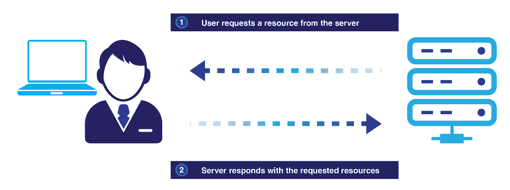
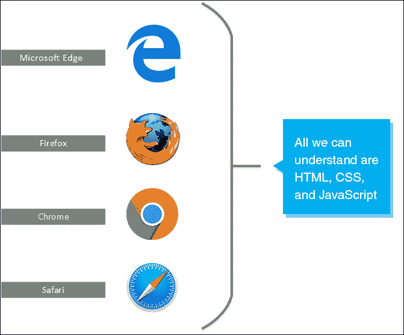
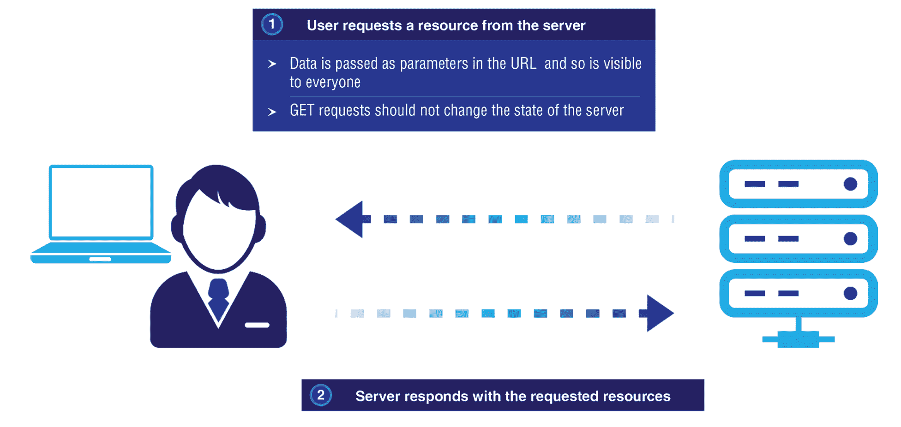
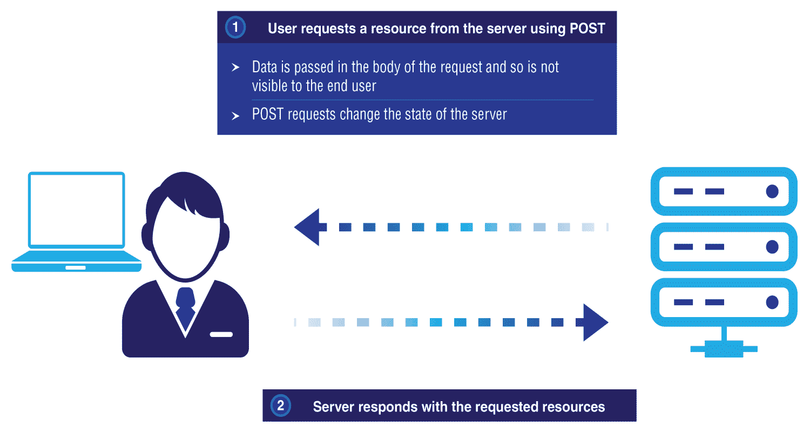
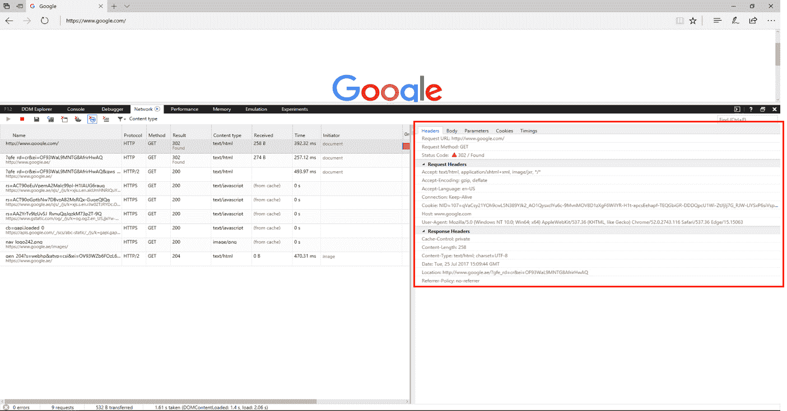
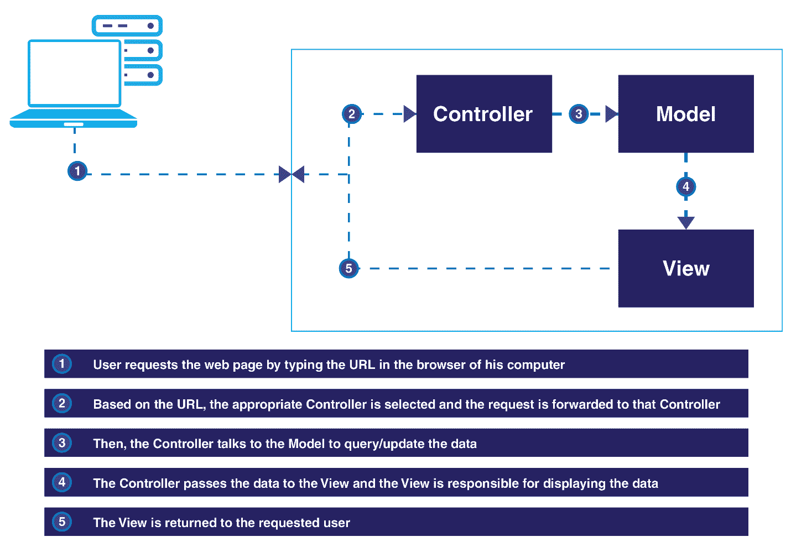
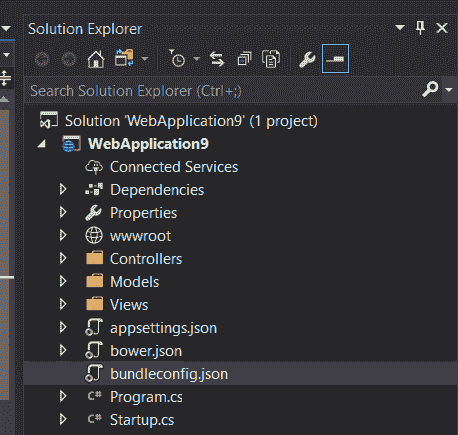
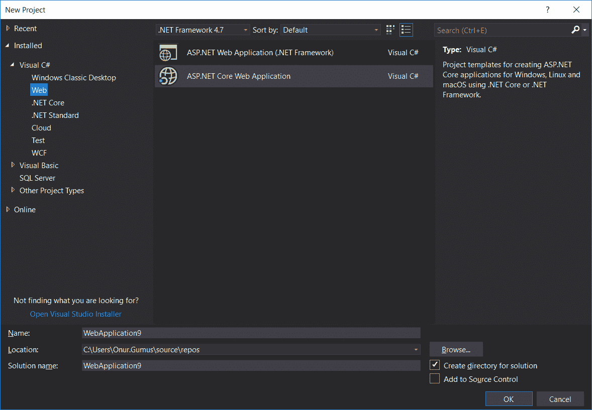
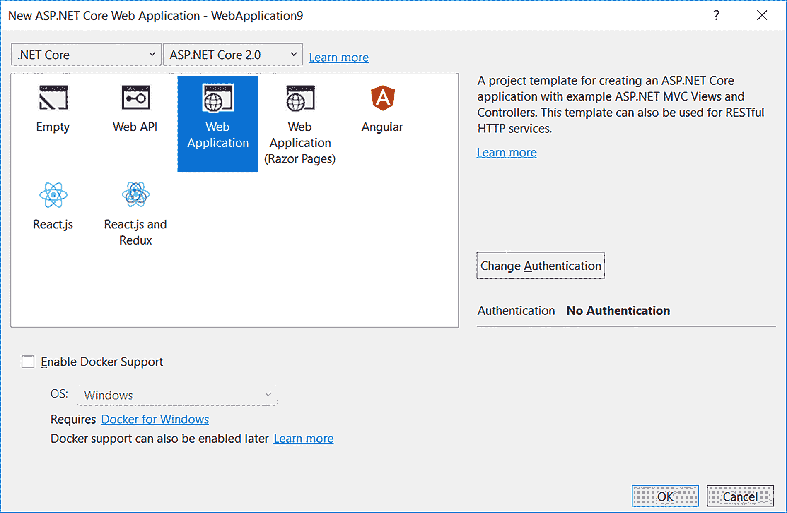
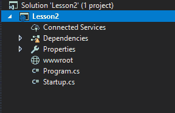

# 一、搭建舞台

ASP.NET Core Microsoft 重新设计的 ASP.NET 是服务器端 web 应用开发框架，可帮助您有效地构建 web 应用。它运行在.NET Core平台之上，使您的应用能够在各种平台上运行，包括 Linux 和 macOS。这打开了大量的机会，在这个时代成为一名.NET 开发人员是令人兴奋的。

在本章结束时，您将能够：

*   解释有关 web 应用 HTTP、客户端和服务器端的基本概念
*   解释 ASP.NET MVC 的三种编程模型
*   掌握 ASP.NET MVC 的理念
*   创建第一个 ASP.NET Core Web 应用项目和项目结构

# Web 应用简介

在讨论 ASP.NET Core及其特性之前，让我们先了解 web 应用开发的基础知识。

Remember this principle: If you want to be an expert at something, you need to be very good at the fundamentals.

# Web 应用的工作原理

所有 web 应用，不管它们是否使用 ASP.NET MVC（**MVC**代表**模型视图控制器**）构建，实际上都是受 Ruby on Rails 或任何其他新的闪亮技术的成功启发，使用 HTTP 协议。一些应用使用 HTTPS（HTTP 的一种安全版本），其中数据在通过电线之前进行加密。但是 HTTPS 仍然使用 HTTP。

对称加密是确保传输数据完整性的常规方法。它只使用一个称为**对称密钥**的密钥进行加密和解密。发送方和接收方都拥有此密钥。发送方使用它进行加密，而接收方使用它进行解密。凯撒密码是对称加密的一个很好的例子。

非对称加密使用两个加密密钥。这些密钥称为公钥和私钥。要发送的信息由公钥加密。私钥用于解密接收到的信息。这两个过程背后都有相同的算法。RSA 算法是用于非对称加密的一种流行算法。

加密通过使用加密密钥确保传输的数据的完整性。这些密钥仅由传输数据的发送方和接收方知道。这意味着数据不会被任何其他人篡改。这可以防止中间人攻击。

# 什么是 HTTP 协议？

协议只不过是一组控制通信的规则。HTTP 协议是遵循请求-响应模式的无状态协议。

**HTTP**代表**超文本传输协议**，是为分布式超媒体系统设计的应用协议。超文本传输协议中的*超文本*是指使用超链接在文档之间进行遍历的结构化文本。HTTP 标准由**互联网工程任务组（IETF）**和**万维网联盟（W3C）**开发。HTTP 的当前版本为 HTTP/2，并于 2015 年标准化。大多数 web 浏览器都支持它，如 Microsoft Edge、Google Chrome 和 Mozilla Firefox。

# HTTP/2 在 HTTP/1.x 上的优势

在高层，HTTP/2：

*   是二进制的，而不是文本的
*   完全多路复用，而不是有序和阻塞
*   使用一个连接实现并行性
*   使用头压缩来减少开销
*   允许服务器主动将响应推送到客户端缓存中

# 请求-响应模式

在讨论请求-响应模式之前，让我们先讨论两个术语：客户机和服务器。服务器是从客户机接收请求并为其提供服务的计算资源。服务器通常是一台高性能的机器，具有巨大的内存来处理许多请求。客户端是发送请求并接收响应的计算资源。客户机通常可以是发送请求的任何应用。

回到请求-响应模式，当您从服务器请求资源时，服务器将使用请求的资源响应您。资源可以是任何内容—网页、文本文件、图像或其他数据格式。



你提出请求。服务器使用资源进行响应。这称为**请求-响应模式**。

# HTTP 的无状态性质

当您再次请求相同的资源时，服务器会再次使用请求的资源响应您，而不知道之前已请求并提供了相同的资源。HTTP 协议本质上不知道先前接收和服务的任何请求的状态。有几种机制可以维护该状态，但 HTTP 协议本身并不维护该状态。稍后我们将解释维持该状态的机制。

# HTTP 的优势

以下是使用 HTTP 协议的几个优点：

*   HTTP 是运行在 TCP/IP 之上的基于文本的协议
*   HTTP 是防火墙友好的
*   HTTP 更容易调试，因为它是基于文本的
*   所有浏览器都知道 HTTP。因此，它在任何设备或任何平台上都是非常便携的
*   它将应用级协议标准化为适当的请求-响应周期

With TCP/IP, everybody has to invent their own application protocol.
HTTP is traditionally not full duplex, but with HTML5 we can use Web Sockets to upgrade HTTP connections to a full duplex connection.

# 处理无状态和请求-响应模式

借助一个简单的实际示例，让我们来处理无状态和请求-响应模式。以下是步骤：

1.  键入此 URL:[https://en.wikipedia.org/wiki/ASP.NET_Core](https://en.wikipedia.org/wiki/ASP.NET_Core) 。这是一个关于 ASP.NET Core的维基百科网页。

We'll talk about ASP.NET later in this chapter.

2.  浏览器从前面的 URL 向 Wikipedia 服务器发出请求。
3.  维基百科的 web 服务器为您提供 ASP.NET Core网页。
4.  您的浏览器接收并显示该网页。
5.  现在，再次输入相同的 URL（[来请求相同的页面 https://en.wikipedia.org/wiki/ASP.NET_Core](https://en.wikipedia.org/wiki/ASP.NET_Core) 并按*进入*。
6.  浏览器再次向 Wikipedia 服务器发出请求。
7.  Wikipedia 为您提供相同的 ASP.NET Core网页，而不知道以前请求过相同的资源。

8.  以下是维基百科页面的屏幕截图，显示请求和响应：


As mentioned earlier, there are several mechanisms to maintain the state. Let us assume, for the time being, that no such mechanism is implemented here.

# 客户端和服务器端

有必要了解 web 应用的客户端和服务器端，以及在任何一方都可以做什么。对于 web 应用，客户端是浏览器，服务器可以是 web 服务器/应用服务器。

客户端是浏览器中发生的任何事情。它是 JavaScript 代码运行和 HTML 元素驻留的地方。

服务器端是计算机另一端的服务器上发生的任何事情。您从浏览器发出的请求必须通过网络（可能通过网络）执行某些服务器端代码并返回相应的响应。您的浏览器不知道服务器端技术或编写服务器端代码的语言。服务器端也是您的 C#代码所在的地方。

让我们讨论一些事实，让事情变得更清楚：

*   **事实 1**：所有浏览器只能理解 HTML、CSS（层叠样式表）和 JavaScript，无论浏览器供应商：
    *   您可能正在使用 Microsoft Edge、Firefox、Chrome 或任何其他浏览器。然而，事实是，您的浏览器只能理解 HTML、CSS 和 JavaScript。它不能理解 C#、Java 或 Ruby。这就是您可以通过同一浏览器访问使用任何技术构建的 web 应用的原因：



*   **事实 2**：任何 web 开发框架的目的都是将服务器端代码转换为 HTML、CSS 和 JavaScript：
    *   这与前一点有关。由于浏览器只能理解 HTML、CSS 和 JavaScript，所有 web 开发技术都应该将服务器端代码转换为 HTML、CSS 和 JavaScript，以便浏览器能够理解。这是任何 web 开发框架的主要目的。无论您是使用 ASP.NETMVC、ASP.NETWeb 表单、RubyonRails 还是 J2EE 构建 web 应用，都是如此。关于如何生成 HTML、CSS 和 JavaScript，每个 web 开发框架可能都有一个独特的概念/实现，并且可能以不同的方式处理安全性能等特性。但是，每个框架都必须生成 HTML，因为这是浏览器所理解的。

# 编程风格–RPC 与 REST

基本上，编程 HTTP 时有两种常见的样式：远程过程调用和 REST。让我们看看这里的每一个：

*   **远程过程调用**：在 RPC 风格中，我们通常将 HTTP 作为传输介质，而不关注 HTTP 本身。我们只是简单地依靠 HTTP。我们的服务提供了一些可直接调用的操作集。换句话说，从我们的客户机，我们调用方法就像调用普通方法和传递参数一样。通常，RPC 是通过**SOAP**（**简单对象访问协议**）应用的，这是另一种运行在 HTTP 之上的 XML 协议。RPC 在 2008 年之前很流行，现在 RESTful 方法更流行，因为 RPC 风格在客户端和服务器之间引入了更多的耦合。
*   **REST**：REST 表示代表状态转移。在 REST 中，我们使用 URL 来表示我们的资源，例如`https://api.example.com/books/`。此 URL 基本上是图书集合的标识符。例如，以下可能是 ID 为 1 的书籍的标识符：`https://api.example.com/books/1`。

然后，我们使用 HTTP 谓词与这些资源交互。HTTP 谓词和 HTTP 方法是同义词。HTTP 中可用的方法有`GET`、`HEAD`、`POST`、`PUT`、`DELETE`、`TRACE`、`OPTIONS`、`CONNECT`和`PATCH`。因此，当我们使用`GET`发出 HTTP 请求时，我们基本上要求 web 服务器返回该资源表示。而且，即使对于每个请求，这种表示也可能发生变化。

服务器可以为一个请求返回 XML，为另一个请求返回 JSON，这取决于客户端接受的内容，这是由`Accept`头指定的。

我们为什么需要休息？这一切都是关于标准化的。假设我们使用`GET`动词访问资源；我们天生就知道，我们并没有改变服务器中的任何东西。类似地，当我们通过`PUT`发送请求时，我们本质上知道请求是幂等的，这意味着重复的请求不会对同一资源进行任何更改。一旦我们建立了这个标准，我们的应用的行为就像浏览器一样。就像浏览器在浏览页面时不需要 API 文档一样，我们的应用也不需要文档，只需要遵守标准。

# 使用 HTTP 方法

HTTP 定义方法（有时称为*动词*，以指示要在已识别资源上执行的所需操作。它是 HTTP 规范的一部分。尽管 HTTP 协议的所有请求都遵循请求-响应模式，但请求的发送方式可能会有所不同。HTTP 方法定义如何将请求发送到服务器。

HTTP 中可用的方法有`GET`、`HEAD`、`POST`、`PUT`、`DELETE`、`TRACE`、`OPTIONS`、`CONNECT`和`PATCH`。在大多数 web 应用中，`GET`和`POST`方法被广泛使用。在本节中，我们将讨论这些方法。稍后，我们将在需要了解的基础上讨论其他 HTTP 方法。

# GET 方法

`GET`是 HTTP 协议的一种方法，用于从服务器获取资源。使用`GET`方法的请求只应检索数据，不应有任何副作用。这意味着，如果您一次又一次地发出相同的`GET`请求，您应该会得到相同的数据，并且服务器的状态不应该因为该`GET`请求而发生任何变化。

在`GET`方法中，参数作为请求 URL 的一部分发送，因此最终用户可以看到。这种方法的优点是，用户可以将 URL 添加到书签中，并在需要时再次访问页面。一个例子是[https://yourwebsite.com/?tech=mvc6 &db=sql](https://yourwebsite.com/?tech=mvc6&db=sql)。

我们在前面的`GET`请求中传递了几个参数。`tech`为第一参数，取值为`mvc6`，`db`为第二参数，取值为`sql`。假设您的网站使用前面的参数值，并在数据库中进行搜索，以在向用户展示这些博客文章之前检索有关`mvc6`和`sql`的博客文章：



GET 方法的缺点是，由于数据在 URL 中以明文形式作为参数传递，因此无法用于发送敏感信息。此外，大多数浏览器对 URL 中的字符数有限制，因此，在使用 GET 请求时，我们无法发送大量数据。

# POST 方法

`POST`请求通常用于更新或创建服务器上的资源，以及发送一些数据以供服务器处理时。特别是在 REST 的上下文中，更为精确地考虑 OLE T1 作为一个过程而不是 Ty2 T2。

数据在请求主体中传递。这有以下影响：

*   您可以向服务器发送相对敏感的信息，因为数据嵌入在请求主体中，最终用户在 URL 中看不到。但是，请注意，除非您使用 HTTPS，否则您的数据永远不会真正安全。即使您在请求主体内发送数据，而不使用 HTTPS，中间人很容易窃听您的数据。
*   由于数据不是通过请求 URL 发送的，因此不会占用 URL 中的空间，因此不存在 URL 长度限制问题：



我们已经介绍了基本知识，现在可以继续讨论 ASP.NET。

# 重要方法清单

在讨论 HTTP 方法之前，让我们回顾一下 HTTP 谓词的三个方面：

*   **幂等性**：幂等性是 HTTP 调用中的一个重要概念。在幂等请求中，可以更改服务器端状态（但是，只能更改一次）。也就是说，如果您向服务器发出多个幂等请求，净效果将与您执行了一个请求一样。

*   **安全**：安全请求根本不会导致任何副作用。它们仅用于检索数据。关于副作用，我们指的是内存、数据库或任何其他外部系统中的任何持久性更改。注册用户是一个副作用。转账是一种副作用。但查看用户信息并不是副作用。
*   **可缓存性**：服务器或客户端或代理可以缓存请求的响应。

下表列出了重要的 HTTP 方法及其特性：

| **方法** | **说明** | **幂等元** | **安全** | **可缓存** |
| `GET` | 读取资源。 | 对 | 对 | 对 |
| `POST` | 创建资源或触发
进程。 | 不 | 不 | 不 |
| `PUT` | 将某物放入资源
ID。如果某物退出，则覆盖。
不要与
更新混淆。 | 对 | 不 | 不 |
| `PATCH` | 更新资源的一部分。 | 不 | 不 | 不 |
| `DELETE` | 删除资源。 | 对 | 不 | 不 |

在上表中，我们可以看到`GET`方法是唯一安全的方法。这就是为什么，例如，像谷歌这样的搜索引擎只使用`GET`方法来扫描我们这边。遵守此标准可确保在搜索引擎扫描过程中没有任何更改。

# 其他方法

其他一些值得注意的方法如下：

*   `CONNECT`：出于安全原因，用于 HTTP 隧道。这在典型的 web 应用和服务中并不常见。
*   `TRACE`：用于调试目的。这在典型的 web 应用和服务中并不常见。
*   `OPTIONS`：通过使用`OPTIONS`动词，我们可以查询该资源的 web 服务器支持哪些方法。

下面是调用`OPTIONS`方法后的部分响应：

```cs
HTTP/1.1 200 OK
Allow: OPTIONS, GET, HEAD, POST
```

# 活动：使用请求-响应模式

**场景**

您的公司希望您监控其网站的网络流量。在这里，我们使用[https://www.google.com/](https://www.google.com/) 作为参考。

**瞄准**

检查[的请求-响应模式 https://www.google.com/](https://www.google.com/) 。

**完成步骤**

1.  打开您喜爱的浏览器。
2.  点击*F12*打开开发者工具。
3.  然后，点击**网络**选项卡。
4.  下一步，转到[https://www.google.com/](https://www.google.com/) 。
5.  研究请求和响应的头体。

您应该会看到类似于以下屏幕截图所示的内容：



# ASP.NET 简介

ASP.NET 是一个服务器端 web 应用开发框架，由 Microsoft 开发，允许开发人员构建 web 应用、网站和 web 服务。

它目前在此 URL 中是完全开源的，并且仍然由 Microsoft 维护：[https://github.com/aspnet](https://github.com/aspnet)

基本上，ASP.NET 有三种主要的编程模型：ASP.NET Web 窗体、ASP.NET MVC 和 ASP.NET 网页。它们以以下方式构成 ASP.NET 框架的一部分：

*   **ASP.NET for.NET Framework**：它有以下子部分：
    *   **Web 表单**：以快速应用开发而闻名。这试图模仿桌面行为。
    *   **MVC**：应用模型-视图-控制器模式。
    *   **Web API**：这是一个 MVC 风格的 Web 服务。
    *   **单页应用**：这里，服务器给出初始 HTML 请求，但进一步呈现完全在浏览器中进行。
*   **ASP.NET Core**：全新的 ASP.NET 平台，跨平台运行。各小节包括：
    *   **Web API**：主要用于开发 Web 服务。
    *   **Web 应用**：用于 MVC 应用。它也可以用于开发 web 服务。WebAPI 和 MVC 已经成为一种几乎统一的东西。
    *   **Web 应用**（Razor Pages）：Razor Pages 是 ASP.NET Core MVC 的一项功能，它使编写以页面为中心的场景更容易、更高效。

A recent trend for developers is the use of Single-Page Application frameworks on top of web services like Web APIs. However, MVC and Single-Page Application frameworks also play nicely together. In the future, we expect Microsoft to put more effort on .NET Core instead of .NET Framework. .NET Framework is already mature. Perhaps it will be put into maintenance mode but nothing is certain yet.

尽管前面所有编程模型的最终结果都是有效地生成动态网页，但它们遵循的方法却各不相同。让我们讨论一下 ASP.NETMVC。

# ASP.NETMVC

ASP.NET MVC 是 MVC 模式在 ASP.NET 中的实现。ASP.NET MVC 解决了试图在 Web 环境中模仿 Windows 开发的 ASP.NET Web 窗体的缺点，如对 HTML 生成的控制有限、与业务代码和 UI 代码耦合、难以掌握以及页面生命周期复杂。由于大多数现代应用都是由客户端 JavaScript 库/框架控制的，比如**jQuery**、**KnockoutJS**、**AngularJS**和**ReactJS**，因此完全控制生成的 HTML 至关重要。至于 Knockout、Angular 和 React，这些单页库实际上通过自己的模板引擎直接在浏览器中生成 HTML。换句话说，渲染是在浏览器而不是服务器中完成的。这释放了服务器资源，并允许 web 应用像断开连接的应用一样运行，就像在移动应用中一样。

让我们谈一谈模型-视图-控制器模式以及它对 web 应用开发的好处。

# 模型-视图-控制器模式

这是一种软件体系结构模式，有助于定义每个组件的责任，以及它们如何配合以实现总体目标。此模式主要用于构建用户界面，适用于许多领域，包括开发桌面应用和 web 应用。但我将从 web 开发的上下文中解释 MVC 模式。

MVC 模式主要有三个组件：

*   **型号**：此组件表示您的域数据。请注意，这不是您的数据库。此模型组件可以与数据库通信，但该模型仅表示域数据。例如，如果您正在构建一个电子商务 web 应用，那么模型组件可能包含诸如`Product`、`Supplier`和`Inventory`之类的类。
*   **视图**：该组件负责向用户展示什么。通常，该组件将包含 HTML 和 CSS 文件。这还可能包括布局信息，这些信息控制 web 应用对最终用户的外观。
*   **控制器**：顾名思义，控制器负责与不同组件交互。它接收请求（通过路由模块），与模型对话，并向用户发送适当的视图。

下图介绍了 MVC 模式：



这种职责分离为 web 应用开发带来了极大的灵活性，允许单独和独立地管理每个区域。

ASP.NET Core 的代码如下所示：

```cs
public class ValuesController : Controller
{
 // GET api/<controller>
 public IEnumerable<string> Get()
 {
 return new string[] { "value1", "value2" };
 }
}
```

基本上，每个控制器都由一个派生自`Controller`类的类表示，尽管我们也可以编写控制器而不必派生自`Controller`。控制器的每个公共方法都表示操作。

在这种情况下，如果我们定义一个`GET`方法（通过`www.yoursite.com/controller`访问而不写入`GET`，它将返回一个字符串数组作为响应。这些字符串的返回方式取决于内容协商。

# 基于文件的项目

无论何时在文件系统（ASP.NET Core项目文件夹内）中添加文件或文件夹，更改都会自动反映在应用中。

我们将静态文件捆绑到一个文件中，因为对于每个静态文件，浏览器将向服务器发出单独的请求以检索它。如果您有 100 个 CSS 和 JavaScript 文件，这意味着将有 100 个单独的请求来检索这些文件。显然，减少请求数量肯定会提高应用的性能。因此，捆绑可以有效地减少请求数量。

HTTP/2 uses only 1 persistent connection for all files and requests. Thus, bundling is less useful in HTTP/2\. However, it's still recommended since HTTP/1.x is here to stay for a long time.
The development and deployment of an ASP.NET Core application on a Linux machine will be explained in a later chapter.

以下是基于文件的项目中的重要文件夹和文件：

| **文件夹/文件** | **说明** |
| `Controllers` | 此文件夹包含所有控制器文件。控制器负责处理请求、通信模型和生成视图。 |
| `Models` | 表示域数据的所有类都将出现在此文件夹中。 |
| `Views` | 这些文件包含前端组件，并提供给应用的最终用户。此文件夹包含所有 RazorView 文件。 |
| `wwwroot` | 该文件夹充当根文件夹，是放置所有静态文件（如 CSS 和 JavaScript 文件）的理想容器。放置在`wwwroot`文件夹中的所有文件都可以直接从路径访问，而无需通过控制器。 |
| 其他文件 | `appsettings.json`文件是配置文件，您可以在其中配置应用级设置。以前，`.xml`文件用于配置；但是，`.json`格式不太详细，**Bower**和**npm**（**节点包管理器**是客户端技术，由 ASP.NET Core应用支持。`Bundle.config`文件允许我们配置如何将 CSS 和 JS 文件捆绑到一个文件中。 |

以下是 ASP.NET Core 的项目结构：



Despite the fact that current ASP.NET Core templates are using Bower, Bower itself is obsolete now. Instead, npm or yarn is recommended. Just like NuGet, the JavaScript world needed package managers as there are hundreds of thousands of libraries and they have complex dependencies on each other. These package managers allow you to automate the installation and upgrades of these libraries by writing single commands from the command line.

# 创建第一个项目

按照以下步骤创建第一个项目：

1.  打开 Visual Studio 2017。导航到文件|新项目|网站。您将看到以下屏幕：



2.  选择 ASP.NET Core Web 应用。（可选）为项目指定名称，或接受默认名称。然后，单击 OK。
3.  请确保选择.NET Core 2.0。如果没有显示，请从[下载.NET Core SDKhttps://www.microsoft.com/net/download/](https://www.microsoft.com/net/download/) 核心并重新启动 Visual Studio。然后选择 Web 应用并单击 OK。
4.  在项目上单击鼠标右键，然后单击“构建”。这将恢复依赖项。

# 创建第一个应用

现在是创建第一个 ASP.NET Core应用的时候了。

启动 Visual Studio 并执行以下步骤：

1.  通过在 Visual Studio 中选择文件|新建项目来创建项目。第一个选项用于创建 ASP.NET web 应用的早期版本。第二个选项是使用.NET Core框架创建 ASP.NET Core应用。NET Core仅支持核心功能。使用.NET Core库的优点是它可以部署在任何平台上。选择 ASP.NET Core Web 应用：


Routing and controllers work together to render the correct view.

We'll use the name `Lesson2` here to avoid reinventing the wheel in [Chapter 2](2.html), *Controllers*.

2.  从 ASP.NET Core模板列表中选择**空**模板。第二个选项用于创建 Web API 应用（用于构建基于 HTTP 的服务），第三个选项用于创建包含一些基本功能的 Web 应用，这些功能可以在开箱即用的情况下运行，而无需编写任何内容：



3.  单击窗口中的“确定”后，如前一屏幕截图所示（选择**清空**模板选项后），将创建一个解决方案，如以下屏幕截图所示：



4.  当您运行应用时（按*F5*）不做任何更改，您将得到一个简单的 Hello World！屏幕上的文本，如以下屏幕截图所示：


我们还没有在这个新创建的应用中进行任何编码。那么，你有没有想过它是如何显示文本 Hello World！？

答案在`Startup.cs`文件中，该文件包含一个名为 Startup 的类。

When an exception occurs, we want to display the callstack for better diagnosis, for instance. However, doing so in a production environment would be a security risk. Hence, we have development-specific code.

ASP.NET Core运行时通过 main 方法调用`ConfigureServices`和`Configure`方法。例如，如果要配置任何服务，可以在此处添加它。您的应用的任何自定义配置都可以添加到此`Configure`方法中：

```cs
public void ConfigureServices(IServiceCollection services)
{
}
public void Configure(IApplicationBuilder app, IHostingEnvironment
env)
{
  if (env.IsDevelopment())
  {
    app.UseDeveloperExceptionPage();
  }
  app.Run(async (context) =>
  {
    await context.Response.WriteAsync("Hello World!");
  });
}
```

Configure 方法中只有几个语句。让我们在第二次发言中暂时撇开`async`、`await`和`context`，我们将在稍后讨论。本质上，第二条语句告诉运行时返回 Hello World！对于所有传入请求，不考虑传入 URL。

当您在浏览器中键入 URL`http://localhost:50140/Hello`时，它仍将返回相同的 Hello World！

这就是我们得到 Hello World 的原因！当我们运行应用时。

由于我们在创建 ASP.NET Core应用时选择了空模板，因此不会安装任何组件。当您像我们一样选择空模板时，默认情况下甚至不会安装 MVC。

# 总结

在本章中，您学习了 web 开发的基础知识，包括构成服务器端和客户端的内容。HTTP 是 web 开发中的关键协议。我们甚至讨论了 ASP.NET Core的特性。我们将 REST 和 RPC 视为两种 web 编程风格。

我们还讨论了 ASP.NET Core应用的新项目结构以及与以前版本相比的变化。

在下一章中，我们将讨论控制器及其角色和功能。我们还将构建一个控制器和相关的操作方法，看看它们是如何工作的。