# 意见

视图是交付给用户的应用程序的实际输出。它们是用户访问应用程序时在屏幕上实际看到的内容。所有组件，包括菜单、输入元素、对话框以及用户看到的所有其他内容都来自您的视图。如果您在访问应用程序时没有提供良好的用户体验，用户将不会关心您的应用程序有多好。因此，在构建 ASP.NET MVC 应用程序时，视图起着至关重要的作用。将视图与控制器分离可以使 HTML 设计过程与逻辑分离。这对于控制器的单元测试也是有益的。

在本章结束时，您将能够：

*   解释视图引擎和 Razor 视图引擎的用途
*   在 Razor 视图引擎中编程，并使用不同的编程结构
*   使用 ASP.NET Core 中的布局及其功能
*   生成 HTML 代码
*   创建并调用局部视图
*   创建视图组件
*   创建自定义标记帮助程序

# 视图引擎和 Razor 视图引擎

正如[第 1 章](1.html)所述，*设置舞台*，浏览器只能理解 HTML、CSS 和 JavaScript。视图引擎的目的是从视图生成 HTML 代码，并将其发送到浏览器，以便浏览器能够理解内容。主要有两种不同类型的视图引擎：Razor 视图引擎和 Web 表单视图引擎。尽管这两个视图引擎是 ASP.NET MVC 现成的，但您可以使用任何自定义视图引擎。

# Razor 视图引擎

Razor 视图引擎是 ASP.NET 核心中的默认和推荐视图引擎。展望未来，它可能是安装 ASP.NET MVC 时唯一现成的视图引擎。

您可以在 Razor 视图中混合使用 C#代码和 HTML 代码，Razor 视图引擎足够智能，能够区分这两种代码并生成预期的输出。在某些情况下，您可能需要向 Razor 视图提供附加信息以生成适当的结果。Razor 代码块以`@`符号开始，但不需要关闭`@`。

# 在 Razor 视图引擎中编程

在 Razor 视图引擎中编程就像在 C#中编程一样。不同之处在于，在 Razor 视图引擎中，您的 C#代码将与 HTML 混合以生成所需的 HTML 输出。

# Razor 视图中的变量

您可以在 Razor 块中声明一个变量，并使用`@`符号使用该变量。

In all the examples in this chapter, we will only present the code samples of the view.

# 使用 Razor 视图

下面是一个示例，供我们探索 Razor 视图。遵循以下步骤：

1.  创建新的空 ASP.NET 核心项目。
2.  创建一个`Controllers`文件夹和一个名为`HomeController`的控制器。
3.  创建一个名为`Views,`的文件夹，一个名为`Home`的子文件夹，以及一个名为`Index.cshtml`的视图文件，方法是：右键单击上下文菜单，导航到添加新项目，然后从列表中选择 MVC 视图页面。

According to the pattern of configuration over convention, the controller name must match the appropriate view folder. Hence, we name the controller `HomeController` and the view folder `Home`.

4.  确保您的`Startup.cs`文件如下所示：

Go to [https://goo.gl/qzz2aT](https://goo.gl/qzz2aT) to access the code.

```cs
public class Startup
{
  // This method gets called by the runtime. Use this method to add services to the container.
  // For more information on how to configure your application, visit
  https://go.microsoft.com/fwlink/?LinkID=398940
  public void ConfigureServices(IServiceCollection services)
  {
    services.AddMvc();
  }
…
…
}
```

5.  `HomeController.cs`文件将具有以下代码：

Go to [https://goo.gl/vWxjRq](https://goo.gl/vWxjRq) to access the code.
When copying code from the link provided, remember to append it with the closing curly brace for the `HomeController` class, as shown in the preceding code snippet.

```cs
public class HomeController : Controller
{
  // GET: /<controller>/
  public IActionResult Index()
  {
    return View();
  }
}
```

接下来是更新的 MVC 视图页面，我们将在其中声明一个变量并使用它。前五行和后两行是简单的 HTML 元素。

我们将集中于粗体的线条。然后，我们将使用`@ { … }`创建一个 Razor 块，并在其中声明一个变量。剃须刀座以闭合的卷曲支架结束。片段`Value:`被认为是简单的 HTML 文本。由于我们希望使用 Razor 变量值，我们将使用`@i`来指示 Razor 视图引擎`i`不是正常的 HTML 文本；这是一种剃须刀结构，需要进行相应的处理。完整的 HTML 代码如下所示：

Go to [https://goo.gl/Jch17b](https://goo.gl/Jch17b) to access the code.

```cs
<html>
<head>
  <title> Views demo</title>
</head>
<body>
  @{
    int i = 5;
  }
  Value: @i
</body>
</html>
```

运行应用程序时，您将看到以下输出：


When you access the Razor variable, you will need to use the `@` symbol. Without this, the Razor view engine sees the `i` variable as text and not as an expression.

下面的屏幕截图是您访问变量时不带`@`符号的结果：


# Razor 视图中的编程构造

您可以在 Razor 视图中使用 C#中提供的大多数编程结构。让我们详细看看其中的一些。

**for 循环**

为`for`循环编写代码非常简单。让我们为 for 循环构造编写一段代码`for`。

下面是 for 循环构造的代码，其中我们循环文件五次并打印变量名：

```cs
@{
  for (int i = 0; i < 5; i++)
  {
    <li>@(i + 1)</li>
  }
}
```

以下是需要注意的几点：

*   由于`for`循环是 Razor 代码，我们应该以`@`符号开始循环，以指示后面的代码是 Razor 代码，而不是普通的 HTML。
*   每当我们使用 HTML 元素或标记时，Razor 视图引擎就会返回 HTML 模式。如果要在 HTML 标记中使用 Razor 表达式，则需要再次包含`@`符号，以告知 Razor 视图引擎，后面的内容是 Razor 代码，而不是 HTML 元素。这就是我们在前面的表达式中再次使用`@`符号的原因，即使在父根级代码中也是如此。

Razor is a template engine. We use Razor expressions on the dynamically generated HTML parts.

视图的完整代码如下所示：

```cs
<html>
<head>
  <title> Views demo</title>
</head>
<body>
  <ul>
  @{
    for (int i = 0; i < 5; i++)
    {
      <li>@(i + 1)</li>
    }
  }
  </ul>
</body>
</html>
```

**while 循环**

让我们为`while`循环编写一段代码。我们将实现与上一个示例相同的循环。请注意，加粗的表达式增加了变量`i`。我们不会使用`@`符号，因为它不在 HTML 元素中。

以下是`while`循环构造的代码，我们在该文件中循环五次并打印变量名：

```cs
@{
  int i = 0;
  while (i < 5)
  {
    <li>@(i + 1)</li>
    i++;
  }
}
```

**foreach 循环**

Razor 视图中的`foreach`循环与 C#中的`foreach`循环相同。

以下是`foreach`循环构造的代码，我们在其中初始化一个整数列表，遍历该列表，并将其作为列表项打印：

```cs
<ul>
  @{
    List<int> integers = new List<int>
    {
      1,2,3,4,5
    };
    foreach (int i in integers)
    {
      <li>@i</li>
    }
  }
</ul>
```

**if 条件**

让我们看一个`if`条件的例子；我们将检查变量的值是否小于 10。如果小于 10，我们将打印 i 小于 10，否则，我们将说 i 大于 10。您可能想知道为什么我们必须包含文本标记以及它的用途。

由于我们在 Razor 视图代码块中，文本 i 小于 10 将被视为 Razor 表达式，但它不是。

此`text`标记用于指示 Razor 视图引擎，`text`标记后面的内容将被视为文本，而不是 Razor 表达式。

以下是检查变量值是否小于 10 的`if`条件代码：

```cs
@{
  int i = 5;
  if (i < 10)
  {
    <text>i is less than 10</text>
  }
  else
  {
    <text>i is greater than 10</text>
  }
}
```

# 活动：打印从 1 到 100 的素数

**场景**

你正在做一个计算不同数学公式的项目。你从一个基本的打印素数的开始。

**瞄准**

编写一个视图，将质数从 1 到 100 打印到浏览器。

**完成步骤**

将名为`IsPrime`的函数与`@function`声明一起使用，如下所示：

Go to [https://goo.gl/pCLuFD](https://goo.gl/pCLuFD) to access the code.

```cs
@functions
{
  public bool IsPrime(int n)
  {
    if (n <= 1) return false;
    if (n <= 3) return true;
    if (n % 2 == 0 || n % 3 == 0) return false;
    for (var i = 5; i * i <= n; i = i + 6)
      if (n % i == 0 || n % (i + 2) == 0)
      return false;
    return true;
  }
}
<ul>
…
…
</ul>
```

# 布局

在前面讨论的所有示例中，我们在一个文件中完成了完整的视图编码。这导致缺乏灵活性和可重用性降低。

考虑下面的网页结构，其中顶部包含公司徽标或横幅，侧部包含指向网站各个部分的链接。每个页面的内容部分都会更改：

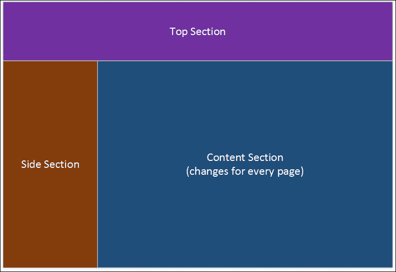

如果我们在一个视图中编写完整的内容，我们可能需要在每个页面上复制顶部和侧面部分。如果我们想更改侧面部分中的任何内容，我们必须更改所有文件。这清楚地表明，单一视图文件不是最佳解决方案。

在这个场景中，布局起到了解救作用，它定义了站点结构，可以在所有网页上重用。布局不需要有顶部或侧面；它可以包含一个简单的 HTML 结构，其中可以包含公共内容，主体内容将从单个视图呈现。

我们可以使用 HTML 框架代替布局。然而，当我们使用 HTML 框架时，每个框架都会变得孤立，看起来像是完全独立的页面。

# 构建我们的第一个布局

要使用布局，请执行以下步骤：

1.  **获取布局文件**的名称：此信息应在`_ViewStart.cshtml`中提供。按照惯例，所有共享文件的名称都将以下划线开头，该文件直接位于`Views`文件夹下。
2.  **创建布局文件**：按照惯例，文件名为`_Layout.cshtml`，将位于`Shared`文件夹中。所有共享内容（如局部视图）也将在此处提供。部分观点将在本章后面讨论。
3.  **创建内容视图文件**：该视图文件与我们之前创建的视图文件几乎相同，只有一个区别；此文件中只有特定于页面的内容可用，这意味着您在此处没有任何`html,``head`或`title`标记。文件夹结构如下所示：

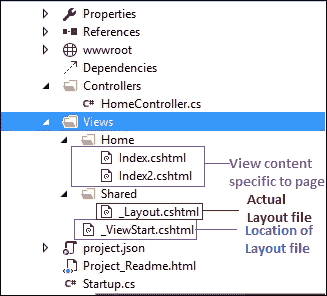

The `project.json` file is deprecated and will be missing in new projects. After the creation of `_ViewStart.cshtml`, `_Layout.cshtml`, and page-specific view files, the folder structure will look like the preceding screenshot.

# 创建 _ViewStart.cshtml

`_ViewStart`文件可用于定义要在每个视图渲染开始时执行的公共视图代码。由于此代码在每个视图的开头执行，因此我们不再需要在任何单个视图文件中显式设置布局。

在“视图”文件夹上单击鼠标右键，然后从关联菜单中选择“添加新项目”。然后，从添加新项目对话框中选择 MVC 视图起始页，如以下屏幕截图所示：

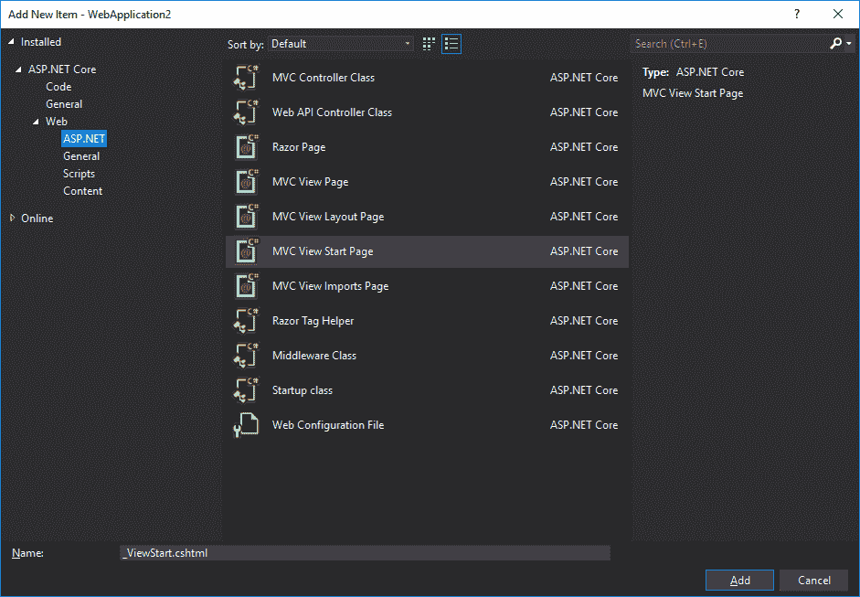

单击“添加”按钮时，它将创建一个包含以下内容的文件：

```cs
@{
  Layout = "_Layout";
}
```

# 正在创建 _Layout.cshtml

在`Views`文件夹中创建一个名为`Shared`的文件夹。然后，右键点击`Shared`文件夹，从关联菜单中选择添加新项目，如下图所示：

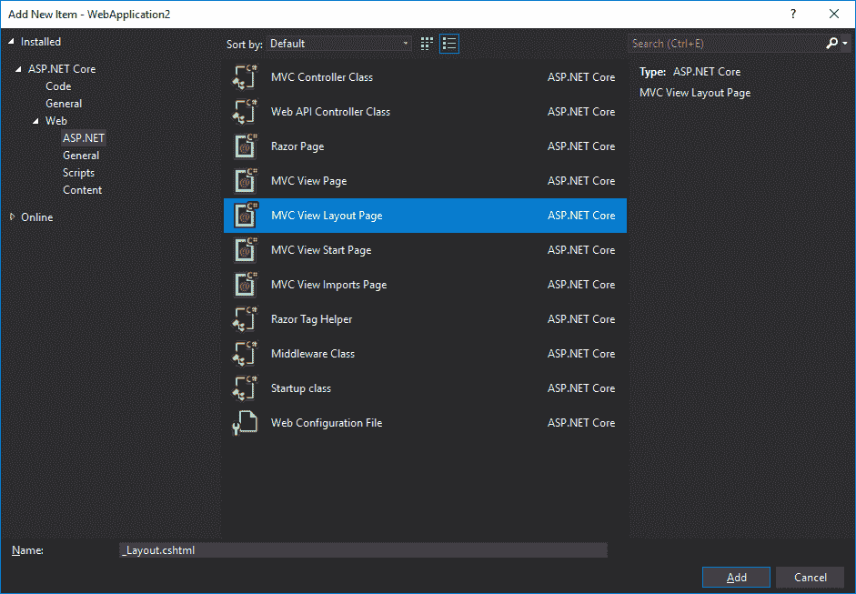

当您点击添加按钮时，将创建具有以下内容的`_Layout.cshtml`：

```cs
<!DOCTYPE html>
<html>
<head>
  <meta name="viewport" content="width=device-width" />
  <title>@ViewBag.Title</title>
</head>
<body>
  <div>
  @RenderBody()
  </div>
</body>
</html>
```

前面的布局文件是带有几个 Razor 表达式的简单 HTML 内容。`@ViewBag.title`用于显示从控制器传递的标题信息，`@RenderBody`是一个 Razor 表达式，它调用特定于页面的视图并合并那里的内容。

# 添加特定于页面的视图

让我们添加一个特定于页面的视图。在添加视图之前，我们需要在`HomeController`文件中添加一个操作方法，从中我们将调用页面特定视图。按照以下步骤添加页面特定视图：

1.  让我们添加一个名为`Index2`的`action`方法，如下所示：

Go to [https://goo.gl/xMK1zK](https://goo.gl/xMK1zK) to access the code.

```cs
public IActionResult Index2()
{
  ViewBag.Title = "This is Index2";
  return View();
}
```

`ViewBag`用于将信息从控制器传递到视图。在这里，我们将`Title`信息从动作方法传递到视图。请记住，`ViewBag`和`ViewData`是关键值集合，您可以从控制器中填充，并从视图中使用。`ViewBag`是动态对象，而`ViewData`是字符串键值对。

2.  现在，右键单击 Views 文件夹，导航到 Add | New Item，选择 MVC View Page，并将文件另存为`Index2.cshtml`。在生成的视图中，我们添加了简单的`Hello`文本。此文本将呈现在布局页面的主体中。查看文件的完整代码如下所示：

Go to [https://goo.gl/vePWui](https://goo.gl/vePWui) to access the code.

```cs
@*
For more information on enabling MVC for empty projects,
visit https://go.microsoft.com/fwlink/?LinkID=397860
*@
@{
}
Hello. This text will be rendered in body of the layout
page
```

3.  一切都安排好了。运行应用程序并在浏览器中键入 URL`http://localhost:50132/Home/Index2`。

The port number after the localhost may vary when you run the application from your PC.

您将获得以下输出：

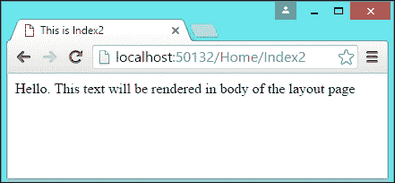

正如预期的那样，您将看到前面屏幕截图中显示的文本。然而，我们的重点不是文本，而是生成的 HTML 内容的结构。

4.  按*Ctrl*+*U*（在 Windows 的 Chrome 浏览器上）查看源代码。您将看到以下 HTML 内容：

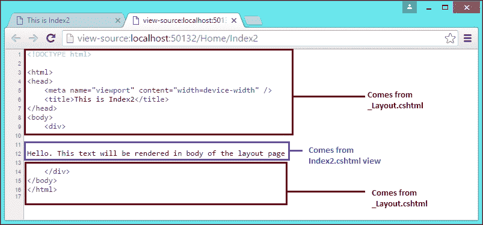

顶部内容（即`html`、`head`、`body`和`div`开始标记）和底部内容（即`html`、`body`和`div`结束标记）来自布局文件，文本来自特定于页面的视图。

# 活动：创建另一个布局并将视图更改为该布局

**场景**

您已经为您的网站创建了布局。现在，您需要创建另一个布局，并由公司将视图更改为该布局。

**瞄准**

创建另一个布局，然后在点击`action`方法时动态地将视图更改为该布局。

**完成步骤**

1.  首先，我们为我们的`action`方法编写以下代码：

Go to [https://goo.gl/Jo2NQu](https://goo.gl/Jo2NQu) to access the code.

```cs
public IActionResult Index()
{
  var view = View();
  view.ViewData["Layout"] =
  "~/Views/Shared/_Another.cshtml";
  return view;
}
```

2.  然后，我们修改我们的`_ViewStart.cshtml`文件，如下所示：

Go to [https://goo.gl/WQqWvn](https://goo.gl/WQqWvn) to access the code.

```cs
@{
  Layout = (string)ViewData["Layout"] ?? "_Layout";
}
```

我们已经动态地改变了我们的布局！

# 生成 HTML

正如[第 1 章](1.html)*中所述，设置舞台*时，浏览器只能理解 HTML、CSS 和 JavaScript，而不考虑构建 web 应用程序所使用的技术。在 ASP.NET MVC 中构建应用程序时也是如此。

大多数应用程序获取用户输入，处理输入，然后将所需信息存储在数据库中，以便以后检索。在 web 应用程序的上下文中，HTML 表单元素用于获取用户输入。

**HTML 帮助程序**和**标记帮助程序**是在 ASP.NET 核心中生成 HTML 元素的两种方法。

HTML 帮助程序是服务器端方法，有助于生成浏览器可以理解的 HTML 元素。在 ASP.NET MVC 5 之前，HTML 助手一直是生成 HTML 元素的主要方法。

ASP.NET 核心中引入的标记帮助程序也会生成 HTML 元素。标记帮助器（我们将在本章后面的一节中讨论）看起来就像 HTML 元素，您可以在其中添加属性以将它们标识为标记帮助器。与 HTML 帮助程序相比，使用标记帮助程序的优点是用户界面设计者/工程师不需要担心 Razor 代码；它们只是使用 HTML 元素和附加属性编写代码。

在讨论 HTML 助手和标签助手之前，让我们后退一步，讨论为什么我们首先需要它们。

# 使用简单表单生成 HTML

考虑一个简单的表单，如下面的截图所示，在这里我们希望得到用户的姓名和年龄。如果用户输入的年龄等于或大于 18 岁，我们将显示您有资格投票！如果没有，我们将显示您现在没有资格投票：


以下是显示上述简单表单的 HTML 代码：

Go to [https://goo.gl/f59Ep8](https://goo.gl/f59Ep8) to access the code.

```cs
<form>
  <table>
    <tr>
      <td>
        <label for="txtName">Name</label>
      </td>
…
…
      <td colspan="2">
        <input type="submit" />
      </td>
    </tr>
  </table>
</form>
```

这种直接编码 HTML 元素的方法既耗时又容易出错。例如，在前面的表单中，标签和输入 HTML 元素在第一组中引用相同的元素`(txtName`，在第二组中引用相同的元素`txtAge`。如果我们手工编写 HTML 元素的代码，则在构建 HTML 元素时可能会出现打字错误。

# HTML 助手

HTML 助手是为您生成 HTML 的服务器端方法。

# 使用 HTML 帮助程序生成表单

我们可以使用 HTML 助手生成相同的表单，如下所示（`HTML.BeginForm`、`@Html.Label`和`@Html.TextBox`分别生成 HTML 表单、标签和文本框元素）：

```cs
@using (Html.BeginForm())
{
  <table>
    <tr>
      <td>@Html.Label("Name")</td>
      <td>@Html.TextBox("txtName")</td>
    </tr>
    <tr>
      <td>@Html.Label("Age")</td>
      <td>@Html.TextBox("txtAge")</td>
    </tr>
    <tr>
      <td colspan="2"><input type="submit" value="Submit">
      </td>
    </tr>
  </table>
}
```

The `form` tag will automatically close when you use the block.

以下屏幕截图简要介绍了 HTML 助手的任务：

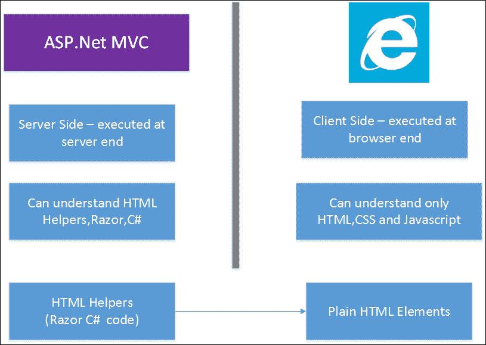

您可能想知道，当我们可以手动编写 HTML 代码时，为什么需要使用 HTML 助手。当我们将模型从控制器传递到视图时，事情会变得更加复杂。使用 HTML 帮助程序，我们可以直接从模型文件中构建表单元素，以便它们从您使用的模型中选择名称。

例如，让我们创建一个名为`Models`的文件夹和一个名为`Person`的类。此类将充当模型，如以下屏幕截图所示：

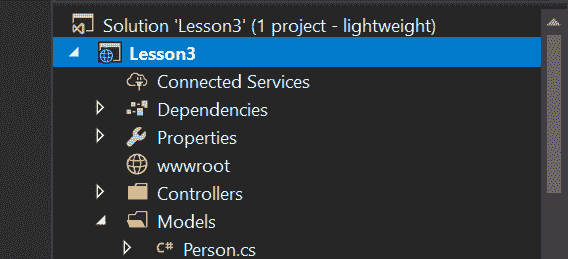

`Person`类只是一个**POCO**（**普通旧 C#Object**类）类，将作为一个模型。此类的完整代码如下所示：

Go to [https://goo.gl/UBmSdM](https://goo.gl/UBmSdM) to access the code.

```cs
public class Person
{
  public int PersonId { get; set; }
  public string Name { get; set; }
  public int Age { get; set; }
}
```

让我们创建一个名为`ValidateAge`的新`action`方法。在这个方法中，我们将创建一个空的`Person`类，并将模型传递给视图。我们还将在`ViewBag`中创建一个名为`Title`的动态属性，以便在视图中显示该值：

Go to [https://goo.gl/xCkyeY](https://goo.gl/xCkyeY) to access the code.

```cs
[HttpGet]
public IActionResult ValidateAge()
{
  ViewBag.Title = "Validate Age for voting";
  Person person1 = new Person();
  return View(person1);
}
```

在视图中，使用以下 HTML 帮助程序创建表单：

Go to [https://goo.gl/hnkvzS](https://goo.gl/hnkvzS) to access the code.

```cs
@model Lesson3.Models.Person
@using (Html.BeginForm("ValidateAge", "Home", FormMethod.Post))
{
  <table>
    <tr>
      <td>@Html.LabelFor(Model => Model.Name) </td>
      <td>@Html.TextBoxFor(Model => Model.Name) </td>
    </tr>
    <tr>
      <td>@Html.LabelFor(Model => Model.Age)</td>
      <td>@Html.TextBoxFor(Model => Model.Age)</td>
    </tr>
    <tr>
      <td colspan="2"><input type="submit" value="Submit">
      </td>
    </tr>
  </table>
}
```

在第一行中，我们告诉视图我们正在传递类型为`Person`类的模型。这使我们能够使用强类型模型，即当我们键入`Model`和一个点时，**IntelliSense**为我们提供了`Person`类的所有属性。

Strongly typed model is beneficial, besides IntelliSense because if in the future you rename the properties of your model, you will detect these errors at compile time.

在第二行中，我们使用重载的`BeginForm`HTML 帮助程序，它接受三个参数：操作方法名称、控制器名称和`Form`方法。

简单地说，当用户提交表单时，信息应该传递给控制器的上述操作。

在`LabelFor`和`TextBoxFor`HTML 帮助程序中，我们只是传递模型属性（名称和年龄）；这将自动查询和获取模型属性，并构建相应的 HTML 元素。这是使用 HTML 帮助程序的主要优点之一。如果不使用 HTML 帮助程序，此过程可能会变得复杂。

现在，让我们以同样的方式编写相应的`POST`动作方法。在下面的`POST`动作方式中，根据表单中输入的年龄，我们将动态属性设置为`Message`：

Go to [https://goo.gl/e4cB6j](https://goo.gl/e4cB6j) to access the code.

```cs
[HttpPost]
public IActionResult ValidateAge(Person person1)
{
  if (person1.Age >= 18)
  {
    ViewBag.Message = "You are eligible to Vote!";
  }
  else
  {
    ViewBag.Message = "Sorry.You are not old enough to vote!";
  }
  return View();
}
```

我们使用 POST 而不是 GET，因为我们的目标不是检索数据，而是在服务器端发布和处理数据。

需要注意的是，`GET`和`POST`动作方式都引用了相同的视图`—ValidateAge.cshtml`。将以下内容添加到表单元素正上方的视图中：

Go to [https://goo.gl/6Cx4fg](https://goo.gl/6Cx4fg) to access the code.

```cs
@if (ViewBag.Message != null)
{
  <b>@ViewBag.Message</b>
}
```

用户提交表单后，POST action 方法在`ViewBag`中设置动态`Message`属性。但是，当视图作为`GET`请求的一部分呈现时，此属性的值将为 null。如果该值不为 null，请在页面顶部插入消息。

运行应用程序时，将获得以下输出：

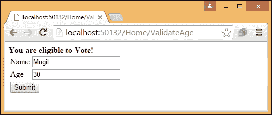

# 活动：使用复选框

**场景**

网页的字段已准备就绪。现在，要求您使用年龄选项的复选框，而不是输入年龄，如图所示：


**瞄准**

使用年龄选项的复选框，而不是输入年龄。

**完成步骤**

1.  使用以下代码更改视图：

Go to [https://goo.gl/WtzFSg](https://goo.gl/WtzFSg) to access the code.

```cs
@model Activity3C1.Models.Person
@if (ViewBag.Message != null)
{
  <b>@ViewBag.Message</b>
}
@{
}
@using (Html.BeginForm("ValidateAge", "Home",
FormMethod.Post))
{
  <table>
    <tr>
      <td>@Html.LabelFor(Model => Model.Name) </td>
      <td>@Html.TextBoxFor(Model => Model.Name) </td>
    </tr>
…
…
  </table>
}
```

2.  使用以下代码更改您的操作：

Go to [https://goo.gl/Fqkrg3](https://goo.gl/Fqkrg3) to access the code.

```cs
[HttpPost]
public IActionResult ValidateAge(Person person1)
{
  if(Convert.ToBoolean(
  Request.Form["OlderThan18"][0]))
  {
    ViewData["OlderThan18"] = true;
    ViewBag.Message = "You are eligible to Vote!";
  }
  else
  {
    ViewBag.Message = "Sorry.You are not old enough to vote!";
  }
  return View();
}
```

我们使用`Request.Form["OlderThan18"][0]`的原因是，默认情况下，复选框助手创建一个隐藏表单，这意味着如果复选框未选中，我们将得到一个假值。由于默认情况下 HTML 不会为未选中的复选框发送值，因此我们也会填充`ViewBag`，以便保留值。

# 局部视图

局部视图是可以在整个应用程序中重用的视图。可以将局部视图视为可插入、可重用的块，您可以从任何位置调用这些块，并显示局部视图的内容。布局和局部视图之间的区别在于布局围绕着我们的页面，而局部视图包含在我们的页面中。

考虑下面的网页结构，它是我们以前使用过的布局页面，但是有两个变化。最新的新闻块已添加到侧面部分，登录块已添加到顶部部分。这些块不限于顶部部分或侧面部分，可以在应用程序中的任何位置使用，包括内容部分，如下图所示：

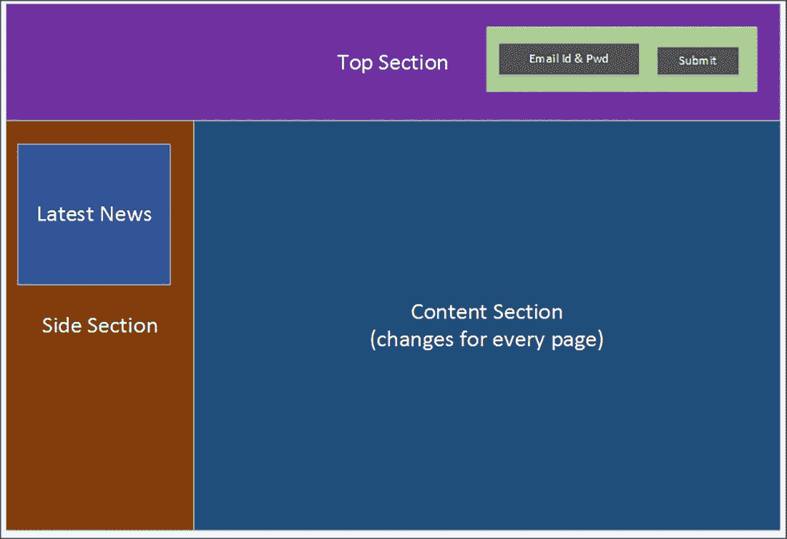

这些局部视图不限于静态内容，可以包含表单元素。在前面的屏幕截图中，最新新闻部分视图包含文本内容，登录部分视图包含获取电子邮件 ID 和密码的表单元素。

框架不限制局部视图的位置。但是，按照惯例，如果您的局部视图仅由控制器使用，则可以在控制器特定的`Views`文件夹中创建该局部视图。例如，如果您的局部视图仅在`HomeController`文件中使用，您可以在`Home`下的`Views`文件夹中创建该局部视图。

让我们来看看如何创建和使用部分视图。

如前所述，局部视图与普通视图一样。因此，我们将以与创建普通视图相同的方式创建局部视图。

右键单击共享文件夹并导航到添加|新项目。按照惯例，与所有共享内容一样，局部视图的名称也将以“u”（下划线）开头，如以下屏幕截图所示：

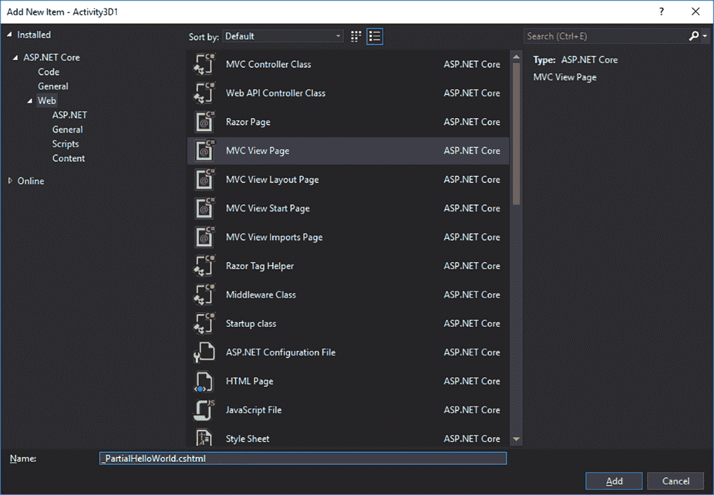

We are creating this partial view based on the assumption that it can be used from anywhere in the application.

要在生成的局部视图中添加简单的静态内容文本和简单表，请使用以下代码段：

```cs
<b>This content and below table is coming from partial view</b>
<table border="1">
  <tr>
    <th>Employee No</th>
    <th>Employee Name</th>
  </tr>
  <tr>
    <td>10012</td>
    <td>Jon Skeet</td>
  </tr>
  <tr>
    <td>10013</td>
    <td>Scott Guthrie</td>
  </tr>
</table>
```

# 调用局部视图

可以使用`@Html.Partial`HTML 帮助程序调用局部视图。

在本例中，我们将调用`Index2.cshtml`文件中的部分视图。传递的参数将是部分文件的名称。它将按该名称搜索局部视图，并将完整内容作为`Index2.cshtml`文件的一部分呈现。

`Index2.html`文件的内容如下：

Go to [https://goo.gl/1nRe4M](https://goo.gl/1nRe4M) to access the code.

```cs
Hello. This text will be rendered in body of the layout page<br />
<br />
<br />
@Html.Partial("_PartialHelloWorld")
```

现在，运行应用程序并访问 URL`http://localhost:50132/Home/Index2`。您将看到以下输出：

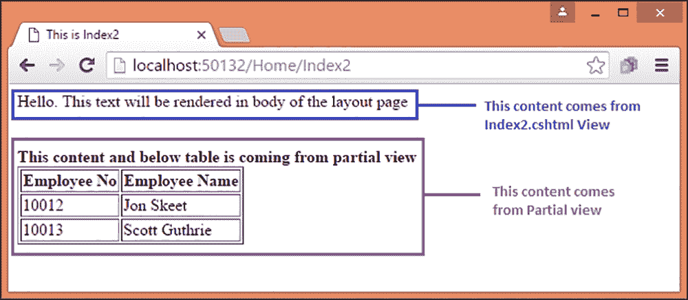

另外，通过右键单击并选择`Peek Definition`查看`@Html.Partial`的其他重载。这将允许您通过`ViewBag`的模型或副本。我们之所以称之为副本，是因为在局部视图中对包所做的更改不会传播回父视图。

# 活动：使用静态数据

**场景**

您正致力于在项目中实现 MVC 模式。您希望从动作生成静态数据，并将其作为模型传递给局部视图。

**瞄准**

从动作生成静态数据，并将其作为模型传递给局部视图。

**完成步骤**

1.  我们首先创建一个`Employee`模型对象：

Go to [https://goo.gl/j9N4BV](https://goo.gl/j9N4BV) to access the code.

```cs
public class Employee
{
  public int Id { get; set; }
  public string Name { get; set; }
}
```

2.  然后，我们从操作返回数据：

Go to [https://goo.gl/hAuXfB](https://goo.gl/hAuXfB) to access the code.

```cs
public IActionResult Index2()
{
  var employees = new List<Employee>
  {
    new Employee { Id = 10012 , Name = "John Skeet"},
    new Employee { Id = 10013 , Name = "Scott Guthrie"},
  };
  return View(employees);
}
```

3.  然后我们将数据从`Index2.cshtml`传递到局部视图，如下所示：

Go to [https://goo.gl/ZYirD8](https://goo.gl/ZYirD8) to access the code.

```cs
@model List<Activity3D1.Models.Employee>
Hello. This text will be rendered in body of the layout
page<br /> <br /> <br />
@Html.Partial("_PartialHelloWorld", @Model)
```

4.  最后，从局部视图呈现 HTML：

Go to [https://goo.gl/cj2aeR](https://goo.gl/cj2aeR) to access the code.

```cs
@model List<Activity3D1.Models.Employee>
<b>This content and below table is coming from partial
view</b>
<table border="1">
  <tr>
    <th>Employee No</th>
    <th>Employee Name</th>
  </tr>
  @{
    foreach (var employee in Model)
    {
      <tr>
        <td>@employee.Id</td>
        <td>@employee.Name</td>
      </tr>
    }
  }
</table>
```

# 视图组件

视图组件是 ASP.NET 核心中引入的一项新功能。它们类似于局部视图；然而，它们在本质上更强大。

使用局部视图时，对控制器有依赖关系。但是，当您使用`ViewComponent`属性时，您不必依赖于控制器。因此，我们能够建立关注点分离，并具有更好的可测试性。尽管仍然支持现有的部分视图 HTML 帮助程序，但在使用.NET Core 时，如果希望显示可重用的信息，最好使用视图组件。

# 创建视图组件

可以使用以下任一方法创建视图构件：

*   通过从`ViewComponent`属性派生一个类来创建一个类
*   增强具有[`ViewComponent`属性的类，或从具有[`ViewComponent`属性的类派生该类
*   通过创建以后缀`ViewComponent`属性结尾的类来使用约定

无论选择哪个选项，视图组件都应该是公共、非嵌套和非抽象类。

与控制器一样，您也可以在`ViewComponent`属性中使用依赖项注入（通过构造函数）。由于`ViewComponent`属性与控制器生命周期分离，您可能无法使用`ViewComponents`中的操作过滤器。

有一个名为`Invoke`（或`InvokeAsync,`异步等价于`Invoke`）的方法，它将返回`IComponentViewResultinterface`。此方法类似于控制器返回视图的`action`方法。

# 创建 ViewComponent 属性

按照以下步骤创建一个`ViewComponent`属性：

1.  在项目中创建一个名为`ViewComponents`的新文件夹和一个名为`SimpleViewComponent,`的新类，如下图所示：

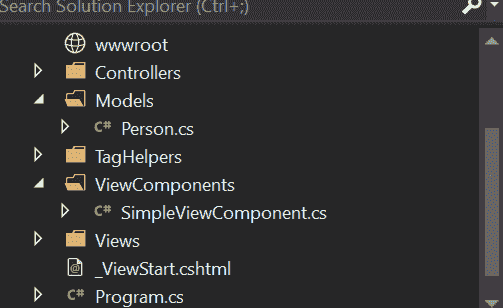

我们创建的`SimpleViewComponent`文件如下所示：

```cs
using Microsoft.AspNetCore.Mvc;
using System;
using System.Collections.Generic;
using System.Linq;
using System.Threading.Tasks;
namespace Lesson3.ViewComponents
{
  public class SimpleViewComponent : ViewComponent
  {
    public IViewComponentResult Invoke()
    {
...
...
    }
  }
}
```

Go to [https://goo.gl/4KAXW8](https://goo.gl/4KAXW8) to access the code.

2.  我们只有两种方法：一种是填充数据，另一种是`Invoke`方法，我们将在其中渲染视图。创建了`ViewComponent`属性后，需要在`Views`下的`_ViewImports.cshtml`文件中包含`ViewComponent`名称空间，以便`ViewComponents`属性可用于所有视图。以下突出显示的代码段将添加到视图中：

Go to [https://goo.gl/pK9tau](https://goo.gl/pK9tau) to access the code.

```cs
@using Lesson3
@using Lesson3.ViewComponents
@addTagHelper "*, Microsoft.AspNet.Mvc.TagHelpers"
```

3.  我们已经创建了`ViewComponents`并将其提供给所有视图。`HomeController`文件中的一个简单动作方法只是返回视图：

Go to [https://goo.gl/EYmx7M](https://goo.gl/EYmx7M) to access the code.

```cs
public ActionResult Sample()
{
  return View();
}
```

4.  在关联视图中，我们可以调用组件，如以下代码段所示：

Go to [https://goo.gl/cbQnR3](https://goo.gl/cbQnR3) to access the code.

```cs
<p>
  This is a sample web page <br />
  <div>
    @await Component.InvokeAsync("Simple")
  </div>
</p>
```

调用组件时，它将在以下两个文件夹中搜索：

5.  视图组件的默认视图名称为`Default`，这使得您的视图文件名为`Default.cshtml`。因此，我们需要在`Views\Shared\Simple\Default.cshtml`文件夹中创建`Default.cshtml`文件，如下图所示：

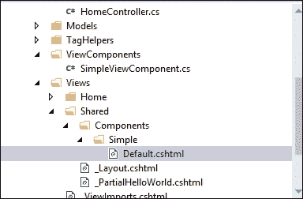

Go to [https://goo.gl/ELUVkG](https://goo.gl/ELUVkG) to access the code.

在`ViewComponent`文件的视图（即`Default.cshtml`文件）中，我们只是迭代模型中的项，并将它们显示为无序列表项，如下代码所示：

```cs
@model IEnumerable<string>
<h3> Sample list</h3>
<ul>
  @foreach (var item in Model)
  {
    <li>@item</li>
  }
</ul>
```

当您运行应用程序并访问 URL（`http://localhost:50132/Home/Sample`时，您应该会看到以下输出：


第一行，这是一个示例网页，来自父视图文件（`sample.cshtml`，而后续列表来自`ViewComponent`属性。

`ViewComponent`属性通常在视图中引用。但是，如果您想直接从控制器调用`ViewComponent`，您可以这样做。

我们调用`Sample`action 方法直接调用简单的`ViewComponent`，而不是通过另一个视图调用，如下所示：

Go to [https://goo.gl/X6e2Xm](https://goo.gl/X6e2Xm) to access the code.

```cs
public ActionResult Sample()
{
  return View("Simple");
}
```


因此，与旧的 HTML 局部视图相比，这些视图组件具有更大的灵活性和特性，例如依赖项注入。这确保了视图组件是可单独测试的。

# 活动：将字符串作为附加数据传递

**瞄准**

在调用时通过使用视图组件的一个重载将附加数据传递给视图组件。因此，让我们将`Four`字符串作为附加数据传递，以便输出如以下屏幕截图所示：


**完成步骤**

1.  我们将我们的观点修改如下：

Go to [https://goo.gl/rxkDYt](https://goo.gl/rxkDYt) to access the code.

```cs
<p>
  This is a sample web page <br />
  <div>
    @await Component.InvokeAsync("Simple", new { additionalData = "Four" } )
  </div>
</p>
```

2.  然后，修改我们的`ViewComponent`如下：

Go to [https://goo.gl/XhCkmZ](https://goo.gl/XhCkmZ) to access the code.

```cs
using Microsoft.AspNetCore.Mvc;
using System;
using System.Collections.Generic;
using System.Linq;
using System.Threading.Tasks;
namespace Lesson3.ViewComponents
{
  public class SimpleViewComponent : ViewComponent
  {
…
…
  }
}
```

# 标记助手

标记助手是 ASP.NET 核心中的一项新功能；它们帮助生成 HTML 元素。在 HTML 助手中，我们将编写 C#/Razor 代码来生成 HTML。这种方法的缺点是许多前端工程师不知道 C#/Razor 代码；它们使用简单的 HTML、CSS 和 JavaScript。标记帮助程序看起来就像 HTML 代码，但具有服务器端呈现的所有功能。您甚至可以根据需要构建自定义标记帮助器。Razor 优于标记助手的优点是，虽然标记助手对前端开发人员更友好，但有时我们可能需要 Razor 的强大功能，因为它是一个强大的编程模型

让我们来看看如何使用标签助手。标签助手包已包含在`Microsoft.AspNet.Core.All NuGet`包中。

请记住，我们已经在上一节的`ViewImports`文件中添加了标记帮助程序支持。

如果我们将`_ViewImports.cshtml`文件包含在`Home`文件夹下，则标记帮助程序将仅适用于主文件夹下的视图。因此，我们应该使用视图文件夹的根目录。

让我们在`HomeController`文件中添加一个名为`Index3`的简单操作方法，在关联视图中，我们将使用标记帮助器，如下代码所示：

Go to [https://goo.gl/zwYvmh](https://goo.gl/zwYvmh) to access the code.

```cs
public IActionResult Index3()
{
  ViewBag.Title = "This is Index3";
  Person person = new Person();
  return View(person);
}
```

为`Index3`动作方式添加相应的视图`Index3.cshtml`文件，代码如下：

Go to [https://goo.gl/s545Nw](https://goo.gl/s545Nw) [to access the code.](https://goo.gl/s545Nw)

```cs
@model Lesson3.Models.Person
<form asp-controller="Home" asp-action="Index3">
  <table>
    <tr>
      <td><label asp-for ="Name">Name</label></td>
      <td><input asp-for="Name" /></td>
    </tr>
    <tr>
      <td><label asp-for ="Age">Age</label></td>
      <td><input asp-for ="Age" /></td>
    </tr>
    <tr>
      <td colspan="2"><input type="submit" value="Submit"/></td>
    </tr>
  </table>
</form>
```

以下是在前面代码中使用标记帮助程序时需要注意的几点：

*   所有表单元素看起来就像标准的 HTML 元素，只是对属性做了一些更改。这使前端开发人员能够独立工作，而无需学习 HTML/Razor 代码，从而更容易实现关注点分离。
*   前面视图的第一行指示从控制器传递到视图的模型数据的类型。
*   `form`元素有两个属性，`asp-controller`和`asp-action,`分别表示控制器名称和动作方法名称。
*   `label`和`input`标记帮助器就像 HTML 元素一样，只是增加了一个`asp-for`属性。这些属性的值表示模型特性。输入这些属性的值时，可以利用 IntelliSense。

# 自定义标记帮助程序

ASP.NET Core 提供了许多内置标记帮助程序，帮助您为许多场景创建必要的 HTML 元素。但是，它们并不涵盖所有场景。有时，您可能希望对生成的 HTML 元素进行一些更改，或者您可能希望创建具有新属性的 HTML 元素，或者创建一个新的 HTML 元素。您不限于在 ASP.NET 中使用现有的标记帮助程序。NET 核心应用程序。如果现有的标记帮助程序不适合您的需要，您可以创建自己的标记帮助程序。让我们创建一个简单的标记帮助器来创建电子邮件链接：

```cs
<a href="mailto:mugil@dotnetodyssey.com">
```

有两种方法可以创建标记帮助器：实现`ITagHelper`接口或继承`TagHelper`类。`TagHelper`类有一个`Process`方法，您可以重写该方法来编写自定义标记帮助程序。`TagHelper`类还有`TagHelperOutputparameter`，您可以使用它编写和生成所需的输出 HTML。因此，最好通过继承`TagHelper`类来创建标记帮助器。

我们的目标是编写一个自定义的电子邮件标记帮助器，以便当有人使用该标记帮助器时，它被转换为以下代码行：

```cs
<a href="mailto:mugil@greatestretailstore.com">Drop us a mail</a>
```

# 创建自定义标记辅助对象

以下是在 ASP.NET 核心应用程序中创建自定义标记帮助器所需执行的步骤：

1.  创建一个名为`TagHelpers`的文件夹，并添加一个名为`EmailTagHelper.cs`的新项目。根据约定，所有标记帮助器类都应以`TagHelper,`结尾，即使我们可以覆盖此约定：

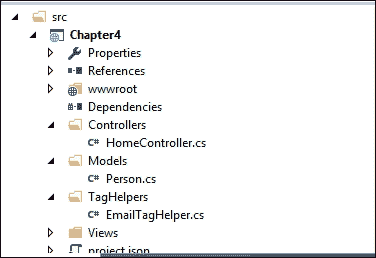

2.  创建文件后，需要重写`Process`方法以生成所需的 HTML 输出：

Go to [https://goo.gl/xNJoqB](https://goo.gl/xNJoqB) to access the code.

```cs
using Microsoft.AspNetCore.Razor.TagHelpers;
using System;
using System.Collections.Generic;
using System.Linq;
using System.Threading.Tasks;
namespace Lesson3.TagHelpers
{
  public class EmailTagHelper : TagHelper
  {
    public override void Process(TagHelperContext context,
…
…
  }
}
```

上述代码中使用的参数解释如下：

3.  我们已经创建了电子邮件标签助手。现在，我们必须使它对我们的视图可用，以便我们可以在视图中使用标记辅助对象。编辑`Views\_ViewImports.cshtml`以包含`TagHelpers`的名称空间，并添加关联的标记帮助程序。在以下`_ViewImports.cshtml`文件中，我们添加了以粗体突出显示的内容：

```cs
@using Lesson3
@using Lesson3.ViewComponents
@addTagHelper "*, Microsoft.AspNet.Mvc.TagHelpers"
@addTagHelper "*, Lesson3"
```

下一行中的*符号告诉视图引擎在 Lesson3 命名空间中包含所有的`TagHelpers`：

```cs
@addTagHelper "*, Lesson3"
```

您只能包含具体的`TagHelpers.`例如，以下行将只包含`EmailTagHelper`，以便我们的视图可以使用它：

```cs
@addTagHelper " Lesson3.TagHelpers.EmailTagHelper, Lesson3"
```

4.  让我们在家庭控制器中创建一个简单的操作方法。在关联操作方法的视图中，我们将使用电子邮件标记帮助器：

```cs
public IActionResult AboutUs()
{
```

```cs
  return View();
}
```

以下是前面`AboutUs`动作方式的视图：

```cs
<h3>About Us</h3>
We are one of the biggest electronics retail store serving
millions of
people across the nation. blah.blah. blah <br />
If you want to hear great offers from us
<email mailTo="mugil@greatestretailstore.com"></email>
```

5.  当您运行应用程序并访问`http://localhost:50132/Home/AboutUs`URL 时，您将看到以下输出：


在这里，我们创建了一个锚定标记，该锚定标记具有`mailto`属性，电子邮件值作为`href`属性值。

我们打开开发者工具窗口（按*F12*进行此操作并选择 DOM Explorer 选项卡）以查看生成的 HTML。

You can find more samples at [https://github.com/dpaquette/TagHelperSamples](https://github.com/dpaquette/TagHelperSamples).

# 活动：替换电子邮件标记帮助程序

**场景**

您正在为您的公司维护一个应用程序。该公司希望从代码中删除所有的电子邮件标签助手。你打算怎么做？

**瞄准**

更换`EmailTagHelper`以便我们可以按照如下方式使用它：

```cs
<email> mugil@greatestretailstore.com </email>
```

**完成步骤**

使用以下代码：

Go to [https://goo.gl/VCdwpB](https://goo.gl/VCdwpB) to access the code.
We can still use HTML attributes on Tag Helpers, as in:
`<email style="color:red" mailTo="mugil@greatestretailstore.com"></email>`
This will render the link in red.

```cs
public class EmailTagHelper : TagHelper
{
  public override async Task ProcessAsync(TagHelperContext context, TagHelperOutput output)
...
...
}
```

# 总结

在本章中，您了解了什么是视图引擎以及如何使用 Razor 视图引擎构建视图。我们还讨论了可以在 Razor 中使用的不同编程结构，以生成所需的 HTML 输出。然后，您了解了布局以及如何在 ASP.NET MVC 应用程序的所有页面上提供一致的站点结构。在本章的后面，我们通过一个示例讨论了如何使用局部视图来提高可重用性。最后，您学习了如何使用标记帮助程序生成干净的 HTML。