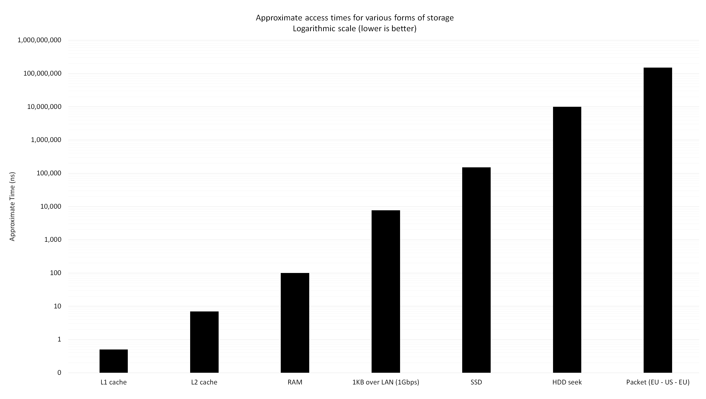
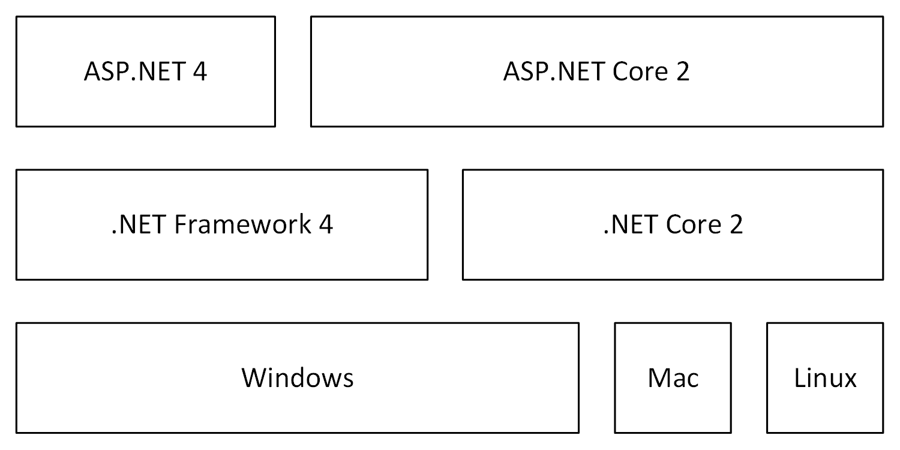

# 二、为什么性能是一个特性

这是成为 C#开发人员的激动人心的时刻。微软正处于其历史上最大的变化之一，它正在拥抱开源软件。ASP.NET 和。NET 框架已经从头开始重建，所以它们是组件化的、跨平台的和完全开源的。最近的许多改进来自社区。

ASP.NET Core 2 和。NET Core 2 包含其他流行的开源项目，包括 Linux。ASP.NET**模型视图控制器** ( **MVC** ) web 应用框架是 ASP.NET Core 的一部分，大量借鉴 **Ruby on Rails** ，微软热衷于推广工具，如 **Node.js** 、 **Grunt** 、**大口**、 **Yeoman** 。还内置了对反应、还原和角度**单页应用程序** ( **SPAs** )的支持。你可以在 **TypeScript** 中写这些，这是微软开发的静态类型的 JavaScript 版本。

通过阅读这本书，你将学会如何使用这些新的。NET Core技术。您将能够使您的 web 应用程序响应输入并根据需求进行扩展。

我们将关注. NET 的最新核心版本。然而，这些技术中的许多也适用于以前的版本，并且它们对于一般的网络应用程序开发(在任何语言或框架中)都是有用的。

理解所有这些新框架和库是如何结合在一起的可能有点令人困惑。我们将展示使用最新技术时可用的各种选项，引导您走上高速成功之路，并避免性能陷阱。

读完这本书后，你将理解当 web 应用程序被大规模部署(到分布式基础设施)时会发生什么问题，并知道如何避免或减轻这些问题。您将获得如何编写高性能应用程序的经验，而不用费力地学习问题。

在本章中，我们将涵盖以下主题:

*   性能是一个特征
*   常见的性能问题类别
*   基本硬件知识
*   微软工具和替代品
*   新的。NET 命名和兼容性

# 性能是一个特征

您可能以前听说过将性能视为一流功能的做法。传统上，性能(以及安全性、可用性和正常运行时间等)仅被视为**非功能性需求** ( **NFR** )并且通常有一些需要满足的任意组合指标。你可能以前听过*表演*这个词。这是表现良好的质量，通常在没有量化的需求中获得，提供的价值很小。在与客户或用户沟通时，最好避免这种公司行话。

使用过时的瀑布开发方法，这些 nfr 不可避免地被留到最后，并从超预算和后期项目中删除，以便完成功能需求。这导致了一个不可靠、慢且经常不安全的不合格产品(因为可靠性和安全性也经常被忽视)。想想有多少次你对那些在响应你的输入方面落后的软件感到沮丧。也许，你使用的是自动售票机或自助结账机，它们对无法使用的情况毫无反应。

还有更好的办法。通过将性能视为一个特性，并在您的**敏捷**开发过程的每个阶段考虑它，您可以让用户和客户喜欢您的产品。当软件的响应速度超过用户的感知能力时，使用它是一件令人愉快的事情，因为它不会减慢用户的速度。当出现明显的滞后时，用户需要调整自己的行为来等待机器，而不是按照自己的节奏工作。

如今，计算机拥有令人难以置信的处理能力，它们现在拥有的资源比几年前还要多。那么，为什么计算机速度如此之快，计算速度却比人类快得多，而我们仍然拥有响应速度明显较慢的软件呢？答案是写得不好的软件，不考虑性能。为什么会这样？原因是性能差的迹象通常在开发中是看不到的，只有在部署时才会出现。但是，如果您知道要寻找什么，那么您可以在将软件发布到生产环境之前避免这些问题。

这本书将向你展示如何编写软件，这是一种使用的乐趣，永远不会让用户等待或不知情。你将学会如何制造用户会喜欢的产品，而不是让他们沮丧的产品。

# 常见的性能问题类别

让我们看看一些常见的性能问题，看看它们是否重要。我们还将了解为什么我们在开发过程中经常错过这些问题。我们将研究编程语言的选择、延迟、带宽、计算以及何时应该考虑性能。

# 语言考虑

人们通常关注使用的编程语言的速度。然而，这往往没有抓住重点。这是一个非常简单的观点，掩盖了技术选择的细微差别。用任何语言写慢软件都很容易。

有了今天大量可用的处理速度，相对*慢的*解释语言往往足够快，开发速度的提高是值得的。即使读完这本书后你决定使用 C#和. NET，理解其中的论点和权衡也很重要

写最快的软件的方法就是脚踏实地，用汇编语言(甚至是机器码)写。这是复杂的开发、调试和测试，需要专家知识。如今，我们很少这样做，除了非常小众的应用程序(如虚拟现实游戏、科学数据处理，有时还有嵌入式设备)，通常只针对软件的一小部分。

更高层次的抽象是用 Go、C 或 C++等语言编写并编译代码以在机器上运行。这在游戏和其他对性能敏感的应用程序中仍然很流行，但是您通常必须管理自己的内存(这可能会导致内存泄漏或安全问题，例如缓冲区溢出)。那个。NET Native 项目，目前正在开发中，承诺这种提前编译有很多性能优势，没有缺点，类似于 Go。

上一级是编译成硬件无关的**中间语言** ( **IL** )或字节码并在**虚拟机** ( **VM** 上运行的软件。这方面的例子有 **Java** 、 **Scala** 、**Clojure**(Java VM 上的字节码)，当然还有 C#(公共语言运行库上的 IL)。内存管理通常会得到处理，通常会有一个**垃圾收集器** ( **GC** )来整理未使用的引用(Go and the。NET 原生 CoreRT 也有一个 GC)。这些应用程序可以在多个平台上运行，并且更加安全。然而，就执行速度而言，您仍然可以获得接近本机的性能，尽管启动速度会受到影响。

上面这些是解释语言，如 Ruby、Python 和 JavaScript。这些语言通常不会被编译，而是由解释器一行一行地运行。它们通常比编译语言运行得慢，但这通常不是问题。一个更严重的问题是在使用动态类型时捕捉 bug。在遇到错误之前，您将看不到它，而当使用静态类型语言时，许多错误会在编译时被捕获。

最好避免一般性建议。您可能会听到反对在 Rails 上使用 Ruby 的论点，引用了 Twitter 出于性能原因不得不迁移到 Java 的例子。这对你的应用程序来说可能不是问题，事实上，推特的流行是一个很好的问题。运行 Rails 时更大的问题可能是内存占用量大，这使得在云实例上运行成本高。

这一节只是让你尝一尝，主要的教训是，正常情况下语言并不重要。让程序变慢的通常不是语言，而是糟糕的设计选择。C#在速度和灵活性之间提供了一个很好的平衡，这使得它适合广泛的应用程序，尤其是服务器端 web 应用程序。

# 性能问题的类型

有许多类型的性能问题，其中大多数与所使用的编程语言无关。其中很多是由代码在计算机上的运行方式导致的，我们将在本章的后面讨论这一点的影响。

我们将在这里简要介绍常见的性能问题，并将在本书的后续章节中更详细地介绍它们。您可能会遇到的问题通常分为几个简单的类别，包括:

*   延迟:
    *   内存延迟
    *   网络延迟
    *   磁盘和输入/输出延迟
    *   闲聊/握手

*   带宽:
    *   过多的有效载荷
    *   未优化的数据
    *   压缩
*   计算:
    *   处理太多数据
    *   计算不必要的结果
    *   强力算法
*   响应性:
    *   可以脱机完成的同步操作
    *   缓存和处理陈旧数据

为平台编写软件时，通常会受到两种资源的限制。这些是计算处理速度和访问远程(处理器)资源。如今，处理速度很少成为限制因素，这可以用其他资源来交换，例如，压缩一些数据以减少网络传输时间。访问远程资源，如主内存、磁盘和网络，会有各种时间成本。重要的是要理解速度不是一个单一的值，它有多个参数。这些参数中最重要的是带宽，最关键的是**延迟**。

延迟是操作开始前的时间延迟，而带宽是操作开始后数据传输的速率。发帖硬盘带宽很高，但是延迟也很高。这将使来回发送大量文本文件变得非常慢，但也许，发送大量 3D 视频是一个不错的选择(取决于魏斯曼评分)。手机数据连接可能更适合文本文件。虽然这是一个人为的例子，但同样的问题通常适用于计算堆栈的每一层，它们在时间差上有相似的数量级。问题是，差异太快，我们无法察觉，我们需要使用工具和科学来观察它们。

解决性能问题的秘诀是对技术有更深入的了解，并知道在较低的级别会发生什么。您应该理解框架在网络级别上对您的指令做了什么。对这些命令如何在底层硬件上运行以及它们如何受到部署到的基础架构的影响有一个基本的了解也很重要。

# 当表现重要时

性能并不总是在每种情况下都很重要。学习什么时候表现重要，什么时候不重要，这是一项需要掌握的重要技能。一般的经验法则是，如果用户必须等待某件事情发生，那么它应该表现良好。如果这是可以异步执行的操作，那么约束就没有那么严格了，除非某个操作非常慢，以至于花费的时间超过了它的时间窗口，例如，在旧的金融服务大型机上的一夜批处理作业。

从 web 应用程序的角度来看，一个很好的例子是呈现用户视图，而不是发送电子邮件。在返回结果之前，接受表单提交并发送一封电子邮件(或者更糟，许多电子邮件)是一种常见但天真的做法。然而，与数据库更新不同，电子邮件不是需要立即发生的事情。有许多我们无法控制的阶段会延迟电子邮件到达用户。因此，在返回表单结果之前，无需发送电子邮件。在返回表单提交结果后，您可以在后台异步执行此操作。

这里需要记住的重要一点是，重要的是对性能的感知，而不是绝对的性能。与其加快速度，不如不做一些要求很高的工作(或者至少推迟到以后)。

这可能是反直觉的，尤其是考虑到单个计算操作可能太快而无法察觉。然而，乘法因子是成比例的。一次操作可能相对较快，但数百万次操作可能会累积到明显的延迟。优化这些将会由于放大而产生相应的效果。改进以紧密循环或为每个用户运行的代码比修复一天只运行一次的例程要好。

# 有时候慢一点更好

在某些情况下，进程被设计得很慢，这对于它们的运行和安全性至关重要。这方面的一个很好的例子是**密码散列**或**键拉伸**，这可能会成为剖析中的一个热门。一个安全的密码散列函数应该很慢，这样密码就不容易被恢复，尽管这是一个糟糕的做法。

我们不应该使用通用的散列函数，如 **MD5** 、 **SHA1** 和 **SHA256** 来散列密码，因为它们太快了。一些为这个任务设计的更好的算法是 **PBKDF2** 和 **bcrypt** 甚至 **Argon2** 用于新项目。也要始终记住每个密码使用一个唯一的盐。我们在这里不再赘述，但是您可以清楚地看到，加快密码散列是不好的，确定在哪里应用优化非常重要。

# 为什么错过了问题

性能问题在开发中没有被注意到的一个主要原因是一些问题在开发系统中是不可察觉的。在延迟增加之前，问题可能不会出现。这可能是因为大量数据被加载到系统中，检索特定记录需要更长的时间。这也可能是因为系统的每一部分都部署在单独的服务器上，从而增加了网络延迟。当访问资源的用户数量增加时，延迟也会增加。

例如，我们可以快速地将一行插入到一个空数据库中，或者从一个小表中检索一条记录，尤其是当数据库与 web 服务器运行在同一台物理机器上时。当 web 服务器位于一台虚拟机上，而大型数据库服务器位于另一台虚拟机上时，执行此操作所需的时间会急剧增加。

对于一个单独的数据库操作来说，这不是问题，在这两种情况下，对于用户来说，这看起来都一样快。但是，如果软件编写得很差，并且每个请求执行数百甚至数千个数据库操作，那么这很快就会变得很慢。

将此扩展到 web 服务器处理的所有用户(以及所有 web 服务器)，这可能是一个真正的问题。开发人员可能没有注意到这个问题的存在，如果他们没有寻找它，因为软件在他们的工作站上表现良好。在软件发布之前，工具可以帮助识别这些问题。

# 测量

这本书最重要的收获是衡量的重要性。你需要衡量问题，否则你无法解决它们。你甚至不知道你什么时候修好的。度量是在性能问题变得明显之前解决它们的关键。缓慢的操作可以在早期发现，然后修复。

然而，并不是所有的操作都需要优化。保持洞察力很重要，但你应该了解瓶颈在哪里，以及当它们被放大时会如何表现。我们将在后面的章节中讨论测量和分析。

# 提前计划的好处

当您从一开始就考虑性能时，修复问题会更便宜、更快。软件开发中的大多数问题都是如此。越早抓到虫子越好。发现一个 bug 最糟糕的时候是在它被部署之后，然后被你的用户报告。

与功能性错误相比，性能问题有些不同，因为它们通常只是大规模地暴露出来，除非您去寻找它们，否则在实际部署之前您不会注意到它们。您可以编写集成和负载测试来检查您的具体量化目标的性能，我们将在本书的后面介绍。

# 了解硬件

请记住，计算机科学中有一台计算机。了解您的代码在什么上运行以及这种情况的影响是很重要的；这不是魔法。

# 存储访问速度

计算机速度如此之快，以至于很难理解哪个操作快，哪个操作慢。一切都是瞬间发生的。事实上，任何发生在不到几百毫秒内的事情，人类都是察觉不到的。然而，某些事情比其他事情要快得多，只有当数百万个操作并行执行时，才会出现大规模的性能问题。

应用程序可以访问各种不同的资源，这些资源的选择如下:

*   中央处理器缓存和寄存器:
    *   L1 缓存
    *   L2 缓存
    *   L3 缓存
*   随机存取存储
*   永久存储:
    *   本地**固态硬盘** ( **固态硬盘**)
    *   本地**硬盘** ( **硬盘**)
*   网络资源:
    *   **局域网** ( **局域网**)
    *   区域网络
    *   全球互联网络

**虚拟机** ( **虚拟机**)和云基础设施服务可能会简化部署，但可能会增加更多性能复杂性。安装在机器上的本地磁盘实际上可能是共享网络磁盘，并且响应速度比连接到同一机器的真实物理磁盘慢得多。您可能还必须与其他用户争夺资源。

为了了解各种存储形式之间的速度差异，请考虑下图。这显示了从一系列存储介质中检索少量数据所需的时间:

这个图表是为这本书制作的，它使用了在线发现的平均延迟数据。它有对数刻度，这意味着差异非常大。图的顶部代表一秒或十亿纳秒。跨越大西洋来回发送一个数据包大约需要 150 毫秒(ms)或 1.5 亿纳秒(ns)，这主要受到光速的限制。这仍然比你想象的要快得多，它会瞬间出现。事实上，将一个像素推到屏幕上通常比将一个数据包传送到另一个大陆需要更长的时间。

下一个最大的条是物理硬盘将机械臂移动到位开始读取数据所需的时间(10 ms)。机械装置很慢。

下一个小节是从本地固态硬盘随机读取一小块数据需要多长时间，大约是 150 微秒。这些是基于闪存技术，它们通常以与硬盘相同的方式连接。

下一个值是通过千兆局域网发送 1 KB (1 千字节或 8 千位)的小数据报所花费的时间，这不到 10 微秒。这通常是数据中心中服务器的连接方式。注意网络本身是多么的快速。真正重要的是你在另一端连接到什么。在另一台机器上对内存中的值进行网络查找比访问本地驱动器要快得多(因为这是一个日志图，所以不能只是堆叠条形图)。

这就把我们带到了主存或 RAM。这很快(查找大约需要 100 ns)，这是您的大部分程序运行的地方。但是，这并不直接连接到中央处理器，并且比片上缓存慢。内存可以很大，通常足够容纳所有工作数据集。但是，它没有磁盘大，也不是永久的。停电时它就消失了。

中央处理器本身将包含当前正在处理的数据的小型缓存，可以在不到 10 纳秒的时间内做出响应。现代中央处理器可能有多达三个甚至四个高速缓存，其大小和延迟不断增加。最快的(响应时间不到 1 ns)是 1 级(l 1)缓存，但通常也是最小的。如果您可以将您的工作数据放入缓存中这几兆或几千字节的数据中，那么您可以非常快速地处理它。

# 缩放方法改变

多年来，计算机的速度和处理能力以指数级的速度增长。密集集成电路中晶体管数量大约每两年翻一番的观察被称为摩尔定律，以英特尔的戈登·摩尔命名。可悲的是，这个时代没有“摩尔”(抱歉)。尽管晶体管密度仍在增加，但单核处理器的速度已经趋于平稳，如今处理能力的提高来自于向多核、多 CPU 和多机器(虚拟和物理)的扩展。多线程编程不再是舶来品；这是必要的。否则，您不能希望超出单个内核的容量。现代 CPU 通常至少有四个内核(即使在移动设备上也是如此)。再加上**超线程**等技术，你至少有八个逻辑处理器可以玩。幼稚的编程将无法充分利用这些。

传统上，性能和冗余是通过改进硬件来提供的。一切都在一台服务器或大型机上运行，解决方案是使用更快的硬件并复制所有组件以提高可靠性。这就是所谓的垂直缩放，它已经到了生命的尽头。以这种方式扩展是非常昂贵的，超出一定的规模是不可能的。未来是分布式和横向扩展，使用商用硬件和云计算资源。这要求我们以不同于以前的方式编写软件。传统软件无法利用这种扩展，因为它可以轻松使用升级后的计算机处理器的额外功能和速度。

在考虑性能时，有许多必须做出的权衡，有时感觉它更像是一门黑色艺术，而不是科学。然而，采取科学的方法和衡量结果是至关重要的。您通常必须平衡内存使用与处理能力、带宽与存储、延迟与吞吐量。

一个例子是决定是应该在服务器上压缩数据(包括使用什么算法和设置)还是通过网络直接发送数据。这将取决于许多因素，包括网络的容量和两端的设备。

# 工具和成本

微软产品的授权历来是一个复杂的雷区。你甚至可以在上面参加正式考试并获得资格。微软最近向开源实践的转变非常令人鼓舞，因为开源的最大好处不是免费的金钱成本，而是你不必考虑许可成本。你也可以修复问题，有了许可的许可(比如 **MIT** ，你就不用太担心了。现在和将来解决许可问题的时间成本和认知负荷可能会使所涉及的资金数额相形见绌(尤其是对小公司或初创公司而言)。

# 工具

尽管有新的。NET 框架是开源的，但许多工具不是。Visual Studio 和 SQL Server 的某些版本可能非常昂贵。随着订阅的新许可实践，如果您停止支付，您将失去访问权限，并且您需要登录才能进行开发。以前，您可以在订阅过期后继续使用从**微软开发者网络**(**【MSDN】**)或 BizSpark 获得许可的现有版本，而无需登录。

考虑到这一点，我们将尝试坚持使用 Visual Studio 的免费(社区)版本和 SQL Server 的快速版本，除非有一个功能是本课必不可少的，当它出现时，我们将突出显示它。我们还将使用尽可能多的免费开源库、框架和工具。

对于增强 ASP.NET 生态系统的许多工具和软件来说，有许多替代选项，而且您不仅仅需要使用默认的微软产品。这就是众所周知的**替代方案。NET**(**ALT.NET**)运动，它包含来自开源世界的实践。

# 查看一些替代工具

版本控制方面，Git 是 **Team Foundation 版本控制** ( **TFVC** )的非常受欢迎的替代品。Git 被集成到许多工具(包括 Visual Studio)和服务中，例如 GitHub 或 GitLab。Mercurial (Hg)也是一种选择，尽管 Git 获得了最多的开发者心智份额。**Visual Studio Team Services**(**VSTS**)和**Team Foundation Server**(**TFS**)都允许您使用 Git(包括 GitHub 和 Bitbucket 集成)或旧版 TFVC。

PostgreSQL 是一个非常棒的开源关系数据库，它与许多**对象关系映射器** ( **O/RMs** )一起工作，包括**实体框架** ( **EF** )和 **NHibernate** 。现在，它也可以在 Azure 和 MySQL 上使用。Dapper 是一个很好的工具，它提供了一个高性能，替代 EF 和其他臃肿的操作系统。也有很多可用的 NoSQL 选项，例如 Redis 和 MongoDB。

其他代码编辑器和**集成开发环境** ( **IDEs** )都是可用的，比如微软的 Visual Studio Code，它也在苹果 OS X/macOS 上工作。ASP.NET Core 2 在 Linux 上运行(在 Mono 和 CoreCLR 上)。所以，你不需要 Windows(虽然 Nano Server 可能值得研究)。

RabbitMQ 是一个出色的开源消息队列服务器，它是用 Erlang 编写的(WhatsApp 也使用它)。这远远好于 Windows 自带的**微软消息队列** ( **MSMQ** )。托管服务很容易获得，例如 CloudAMQP。

我是一个很长时间的 Mac 用户(从 PowerPC 时代开始)，在此之前我已经运行了很长时间的 Linux 服务器。看到 OS X 变得流行，并观察到 Linux 在安卓智能手机和廉价电脑(如树莓皮)上的崛起，这是积极的。您可以在树莓 Pi 2 或 3 上运行 Windows 10，但这不是一个完整的操作系统，仅用于运行**物联网** ( **物联网**)设备。专业使用 Windows 很久了，用 Mac 和 Linux 开发部署，看看这会带来什么性能影响，这是一个很有意思的机会。

虽然不是开源的(或者总是免费的)，但值得一提的是 JetBrains 的产品。TeamCity 是一个非常好的构建和**持续集成** ( **CI** )服务器，有一个免费层。ReSharper 是 Visual Studio 的一个很棒的插件，它会让你成为一个更好的开发人员。还有他们新的 C# IDE，名为 Rider，它基于 ReSharper 和 IntelliJ(为 Android Studio 和他们的其他 IDE 提供动力的平台)。

有一款叫章鱼部署的产品，对于的**连续部署**极为有用。NET 和。NET Core应用程序，它有一个自由层。TFS 还提供 CI 构建/光盘版本，还有云解决方案，如 AppVeyor 和 VSTS。

关于云服务，**亚马逊网络服务** ( **AWS** )显然是 Azure 的替代品。即使 AWS 窗口支持还有待改进，但现在内核可用并在 Linux 上运行，这就不是什么问题了。还有许多其他可用的主机，如果您不需要云的动态扩展，专用服务器对于稳定的负载来说通常会更便宜。

这在很大程度上超出了本书的范围，但是研究其中一些工具是明智的。关键是，如何从大量可用的组件中构建一个系统，总是有选择的，尤其是使用较新版本的 ASP.NET。

# 新的。网

新 ASP.NET 和。它所依赖的. NET Framework 在 Core 版本 1 中被重写为开源和跨平台的。这些包裹也被分开了，尽管出于令人钦佩的目的，但还是造成了混乱。ASP.NET Core 2 现在被包括在。NET Core 2 安装包连同**实体框架核心**。这意味着您在部署时不再需要将 ASP.NET Core框架与您的应用程序一起交付。这个项目被称为**。NET Native** 已经延期(除了 **UWP** 之外)，有望在明年内到达。

所有这些不同的名字都可能令人困惑，但给事物命名却很难。菲尔·卡尔顿名言的幽默变体是这样的:

"There are only two hard things in Computer Science: cache invalidation, naming things, and off-by-one errors."

我们已经在这里讨论了命名，我们将在本书的后面讨论缓存。

理解所有这些版本是如何结合在一起的可能有点令人困惑。最好用下面这样的图表来解释这一点，它显示了各层是如何相互作用的:

ASP.NET Core 2 可以对抗现有的。NET 框架 4.7 或新的。NET Core 2 框架。同样地，。NET Core 可以在 Windows、OS X / macOS 和 Linux 上运行，但是旧的。NET 只在 Windows 上运行。

还有 Mono 框架，为了清楚起见，省略了它。这是以前的一个项目。NET 在多个平台上运行。Mono 被微软收购，它是开源的(和其他 Xamarin 产品一起)。在。NET 标准。

核心没有现有的特征填充。NET 框架，尽管在版本 2 中差距已经大大缩小。如果你写图形桌面应用程序，也许使用**Windows Presentation Foundation**(**WPF**)，那么你应该坚持。NET 4。没有计划将这些特定于 Windows 的 API 移植到 Core，因为这样就不会跨平台。

由于这本书主要是关于网络应用程序开发的，我们将使用所有软件的最新核心版本。我们将研究各种操作系统和体系结构的性能影响。如果您的部署目标是计算机，例如使用 ARM 架构处理器的树莓 Pi，这一点尤其重要。它的内存也很有限，在使用包含垃圾收集的托管运行时(如. NET)时，这一点很重要

# 摘要

让我们总结一下这一章和下一章的内容。我们引入了将性能视为一个特性的概念，并介绍了为什么这很重要。我们还简单介绍了一些常见的性能问题，以及为什么我们在软件开发过程中经常忽略它们。我们将在本书后面更详细地介绍这些内容。

我们展示了不同类型存储硬件之间的性能差异。我们强调了了解您的代码在什么上运行的重要性，最重要的是，当您的用户看到它时，它将在什么上运行。我们讨论了缩放系统的过程是如何从过去改变的，缩放现在是如何水平执行而不是垂直执行的，以及如何在创建代码和系统时利用这一点。我们向您展示了您可以使用的工具以及其中一些工具的许可含义。我们还解释了。NET 以及这些最新的框架如何与稳定的框架相适应。我们谈到了为什么测量是至关重要的。

在下一章中，我们将向您展示如何在使用 Windows、Mac 或 Linux 时开始使用 ASP.NET 酷睿 2。我们还将演示如何使用 Docker 容器来构建和运行您的应用程序。