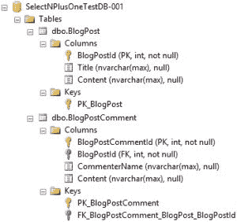
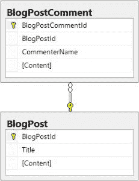
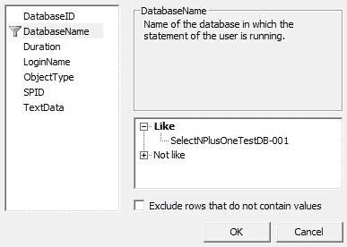
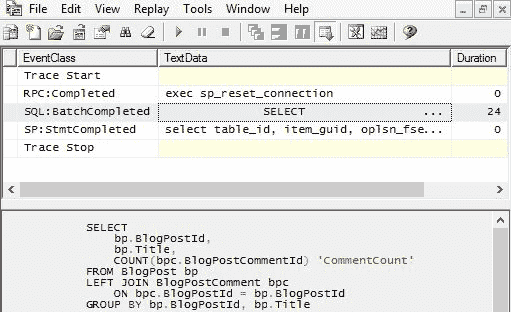
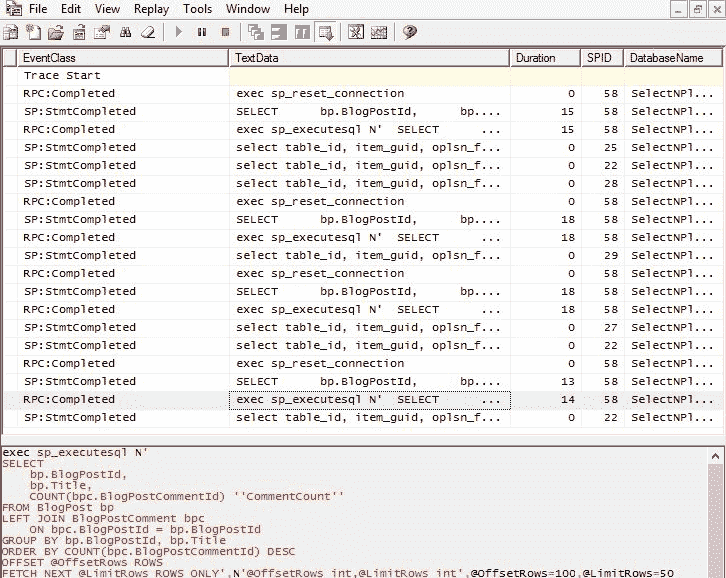
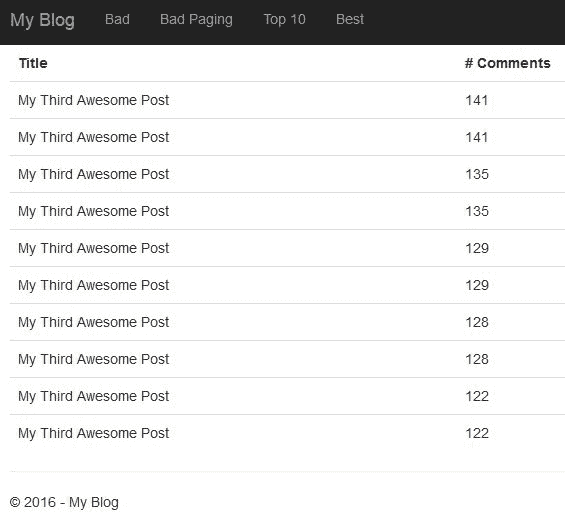
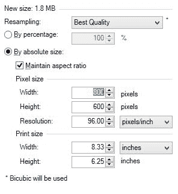
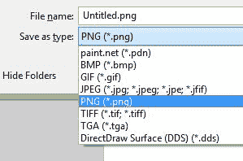
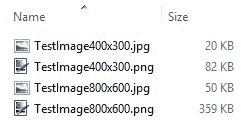

# 五、修复常见性能问题

一旦您识别并定位了性能问题，本章将进入优化的核心。它涵盖了各种领域中最常见的性能问题，并解释了人们经常犯的一些错误的简单解决方案。当使用这些技术时，通过快速加速客户和同事的软件，你会看起来像一个向导。

本章涵盖的主题包括:

*   网络延迟
*   选择 N+1 个问题
*   虚拟机上的磁盘输入/输出问题
*   web 应用中的异步操作
*   在一个 web 请求中执行太多操作
*   静态站点生成器
*   实用的硬件解决方案
*   缩小过大的图像

本章中的大部分问题集中在当您给常见操作增加延迟或吞吐量从开发中降低时会发生什么。当一切都在一台物理机器上，只有最少的数据时，在测试中运行良好的东西，现在不再像在另一个大陆上有一个应用编程接口，在与网络服务器不同的机器上有一个完整的数据库，并且它的虚拟磁盘完全在网络上的其他地方那样快了。

您将学习如何识别和修复在单台机器上运行时并不总是显而易见的问题。您将看到如何识别您的操作系统或框架何时表现不佳，以及何时对数据库过于健谈，如果使用不当，这种情况很容易发生。

我们将了解如何确保工作在最合适的地方进行，我们还将了解使用正确的分辨率和格式保持图像小的一些方法。这些技术将确保您的应用是高效的，并且不会不必要地通过网络发送数据。

我们还将讨论如何通过改进底层硬件来减少在坏软件中放大问题的因素，从而用另一种方法减轻性能问题。如果软件应用已经部署到生产中并正在使用，这可能是一个很好的临时措施。如果您已经有实时性能问题，那么这可以为您赢得一些时间来设计一个适当的解决方案。

# 潜伏

如前几章所述，延迟是指操作完成前发生的延迟，有时也称为**滞后**。您可能无法控制软件应用运行的基础架构的延迟，但是您可以用这样一种方式编写您的应用，它可以以优雅的方式应对这种延迟。

我们将在这里讨论的两种主要延迟类型是**网络延迟**和**磁盘延迟**。顾名思义，它们分别是通过网络执行操作的延迟和从持久存储介质读取或写入持久存储介质的延迟。您通常会同时处理这两者，例如，对远程虚拟机上的服务器的**数据库** ( **数据库**)查询将需要以下操作:

*   从网络服务器到数据库服务器的网络操作
*   从数据库服务器到存储区域网络**(**存储区域网络**)上的远程磁盘的网络操作**
*   在物理驱动器上查找数据的磁盘操作

Although **Solid State Drives** (**SSDs** ) have much lower latency than spinning platter disks, they are still relatively slow. When we talk about disk I/O here, we refer to both types of drive.

您可以清楚地看到，如果您发出太多的数据库操作，典型生产基础架构中存在的延迟会使问题复杂化。您可以通过最小化数据库操作的数量来解决这个问题，这样它们就不会被放大太多。

让我们用一个例子来说明。假设您希望从数据库中返回 200 条记录，并且往返延迟为 50 **毫秒** ( **毫秒**)。如果您一次检索所有记录，那么总时间将是 50 毫秒加上传输记录的时间。但是，如果您首先检索记录标识符列表，然后单独检索所有记录标识符，总时间将至少为 *201 * 50 毫秒= 10.05 秒*！

不幸的是，这是一个非常常见的错误。在延迟主导吞吐量的系统中，将请求保持在最小是很重要的。

# 异步操作

最新的。有显著延迟的. NET Framework APIs 将有**异步** ( **异步**)方法。例如。NET HTTP 客户端(取代 web 客户端)、SMTP 客户端和**实体框架** ( **EF** )都有通用方法的异步版本。事实上，异步版本通常是本机实现，而非异步方法只是它的阻塞包装器。这些方法非常有益，你应该使用它们。然而，当应用于 web 应用编程时，它们可能没有您想象的效果。

We will cover async operations and asynchronous architecture later in this book. We'll also go into **Message Queuing** (**MQ** ) and worker services. This chapter is just a quick introduction, and we will simply show you some tools to go after the low-hanging fruit on web applications.

异步应用编程接口在调用方法完成之前将控制权返回给它。这也可以等待，以便在完成时，从进行异步调用的地方继续执行。对于本机桌面或移动应用，等待异步方法通常会将控制权返回给**用户界面** ( **用户界面**)线程，这意味着软件会保持对用户输入的响应。该应用可以处理用户交互，而不是阻止您的方法。传统上，您可能会使用后台工作人员来完成这些任务。

您永远不应该在 UI 线程上执行昂贵的工作。因此，这种技术确实提高了本机应用的性能。但是，对于服务器端 web 应用，不存在这种 UI 阻塞问题，因为浏览器就是 UI。因此，这种技术不会单独提高单个用户的性能。

浏览器中运行的 JavaScript 代码是另一回事，这会阻塞用户界面。在本书的后面，我们将看到如何以非阻塞的方式(使用异步服务工作者)在后台运行它。

在 web 应用中等待异步 API 方法仍然是一个很好的实践，但是它只允许软件更好地扩展和处理更多的并发用户。通常，在异步操作也完成之前，web 请求无法完成。因此，尽管线程被交还给线程池，并且您可以将它用于其他请求，但是单个 web 请求不会更快完成。

# 简单的异步工具

由于这本书讨论的是 web 应用编程，所以在本章中我们不会对本机应用用户界面做更多的详细介绍。相反，我们将展示一些简单的工具和技术来帮助 web 应用中的异步任务。

我们将要介绍的工具提供了一些简单的解决方案，只适用于非常小的应用。他们可能不总是可靠的，但有时他们也足够好。如果你想要一个更健壮的解决方案，那么你应该阅读后面关于异步编程和分布式架构的章节。

# 后台排队

当您有不需要立即执行的操作时，后台排队是一种有用的技术，例如，将统计数据记录到数据库、发送电子邮件或处理支付交易。如果您在单个 web 请求中执行了太多的工作，那么后台排队可能会提供一个方便的解决方案，尤其是如果您不要求操作总是成功的话。

如果你使用 ASP.NET 4.7(或者 4.5.2 以后的任何版本)，那么你可以使用`HostingEnvironment.QueueBackgroundWorkItem`在后台运行一个方法。这比简单地设置一个任务运行更好，因为如果 ASP.NET 关闭，它将发出取消请求，并等待一段宽限期后再取消该项目。但是，这仍然不能保证完成，因为应用可能在任何时候由于意外的重新启动或硬件故障而死亡。如果任务需要完成，那么应该是**交易**并在完成时做成功记录。然后可以在失败时重试。如果你真的不在乎一个后台工作项目的成功与否，那么它在一次性事件中是可以排队的。

不幸的是，`HostingEnvironment.QueueBackgroundWorkItem`不是 ASP.NET Core的一部分。因此，如果您想使用这个，那么您将不得不简单地对作业进行排队。我们稍后将向您展示如何做到这一点，但是如果您使用完整版本的 ASP.NET，那么您可以通过以下方式在后台发送电子邮件:

```cs
var client = new SmtpClient(); 
HostingEnvironment.QueueBackgroundWorkItem(ct => 
    client.SendMailAsync(message)); 
```

假设您已经有了邮件，这将创建一个 SMTP 客户端，并在后台发送电子邮件，而不会阻止进一步的执行。这不使用`ct`(取消令牌)变量。请记住，电子邮件不能保证发送。因此，如果你需要明确调度它，那么考虑使用另一种方法。

如果您使用 ASP.NET Core，则此功能不可用。但是，您可以手动创建类似于`Task.Run`的东西，如下例所示。然而，这可能不是处理任何重要事情的最佳方法:

```cs
Task.Run(() => asyncMethod(cancellationToken)); 
```

如果您可以取消您的任务，那么您可以从注入的`IApplicationLifetime`接口实例中获取`ApplicationStopping`令牌，作为您的取消令牌传入。这将让您的任务知道应用何时停止，您也可以在优雅地清理时用它阻止关闭。

您应该谨慎使用这种技术，所以我们在这里不会给你一个完整的例子。尽管如此，如果您愿意，您现在应该有足够的指针来深入挖掘和理解 ASP.NET Core应用的生命周期。

# 杭火

Hangfire 是一个运行简单后台作业的优秀库，它现在支持。NET Core。你可以在[https://www.hangfire.io/](https://www.hangfire.io/)阅读更多关于航火的信息。

您需要持久存储，例如 SQL Server，才能使用 Hangfire。这是必需的，以便它可以确保完成任务。如果你的任务很快，那么这个开销会超过收益。您可以使用**消息队列**或内存存储 **Redis** 来减少延迟，但这些都是高级主题。

如果您只是想要一个一次性事件，那么使用 Hangfire 就像下面的代码一样简单:

```cs
var id = BackgroundJob.Enqueue(() => Console.WriteLine("Hangfire is awesome!"));
```

您可能希望探索许多更高级的用例，包括延迟和重复的作业。您甚至可以将作业设置为继续其他作业，因此不需要编写自己的批处理处理代码。

# 选择 N+1 个问题

你可能以前听说过*选择 N+1 题*。这是与数据库低效查询相关的一类性能问题的名称。病理情况是，您查询一个表中的项目列表，然后查询另一个表以获取每个项目的详细信息，一次一个。这就是这个名字的由来。您可以执行 *N* 查询(一个查询每个项目的详细信息)和一个查询来获得开始的列表，而不是所需的单个查询。也许更好的名字是*选择 1+N* 。*延迟*部分末尾的示例(本章前面)说明了*选择 N+1* 的问题。

希望您不会手动编写这样性能不佳的查询，但是如果使用不当，操作系统很容易输出非常低效的 SQL。您也可以使用某种业务对象抽象框架，其中每个对象从数据库中缓慢地加载自己。如果您想将许多这样的对象放在一个列表中，或者从一个大集合中计算一些仪表板指标，这可能会成为性能噩梦。

We will go into detail about SQL and O/RM optimization in [Chapter 7](07.html) , *Optimizing I/O Performance* . This chapter will simply offer some quick fixes to common problems.

如果您有一个运行缓慢的应用，在检索数据时有性能问题，那么*选择 N+1* 可能是问题所在。如前一章所述，运行一个 SQL 事件探查器工具来发现是否是这种情况。如果您看到许多针对您的数据的 SQL 查询，而不是只有一个，那么您可以进入解决方案阶段。例如，如果您的屏幕在页面加载时充满了查询，那么您知道您有问题。

在下面的例子中，我们将使用微 O/RM Dapper(由堆栈溢出团队制作)来更好地说明发生了什么。但是，在使用大型惰性加载库或 O/RM(如 EF 或 NHibernate)时，您更有可能遇到这些问题。

Entity Framework Core does not support lazy loading yet, so you are unlikely to encounter *select N+1* problems when using it. The previous full versions of EF do support this and it may be added to EF Core in the future.

考虑一个简单的博客网站。在主页上，我们想要一个帖子的列表，以及每个帖子的评论数量。我们的博文模型可能如下所示:

```cs
namespace SelectNPlusOne.Models 
{ 
    public class BlogPost 
    { 
        public int BlogPostId { get; set; } 
        public string Title { get; set; } 
        public string Content { get; set; } 
        public int CommentCount { get; set; } 
    } 
} 
```

我们还有一个评论模型，可能是这样的:

```cs
namespace SelectNPlusOne.Models 
{ 
    public class BlogPostComment 
    { 
        public int BlogPostCommentId { get; set; } 
        public string CommenterName { get; set; } 
        public string Content { get; set; } 
    } 
} 
```

As this is an example, we kept things simple and only used a single set of models. In a real application, you will typically have separate **view models** and **data access layer models** . The controller will map between these, perhaps assisted by a library such as AutoMapper ([http://automapper.org/](http://automapper.org/) ).

我们将它呈现为 HTML 的视图可能如下所示:

```cs
@model IEnumerable<SelectNPlusOne.Models.BlogPost> 
<table class="table"> 
    <tr> 
        <th>Title</th> 
        <th># Comments</th> 
    </tr> 
    @foreach (var post in Model) 
    { 
        <tr> 
            <td>@post.Title</td> 
            <td>@post.CommentCount</td> 
        </tr> 
    } 
</table> 
```

我们希望从数据库中填充这些模型和视图。我们有两张桌子，看起来像这样:



这两个表之间的关系如下所示:



在我们的控制器中，我们可以编写代码，如下所示，来查询数据库，从数据库结果中填充模型，并返回视图来呈现它:

```cs
using (var connection = new SqlConnection(connectionString)) 
{ 
    await connection.OpenAsync(); 
    var blogPosts = await connection.QueryAsync<BlogPost>(@" 
        SELECT * FROM BlogPost"); 
    foreach (var post in blogPosts) 
    { 
        var comments = await 
            connection.QueryAsync<BlogPostComment>(@" 
            SELECT * FROM BlogPostComment  
            WHERE BlogPostId = @BlogPostId", 
            new { BlogPostId = post.BlogPostId }); 
        post.CommentCount = comments.Count(); 
    } 
    return View(blogPosts); 
} 
```

我们测试了这个，它有效！我们对自己很满意。它在我们的本地测试数据库上很快完成，该数据库包含一些行。我们到处使用`async`方法，这一定是为什么这么快。我们甚至只得到每个有问题的博客的评论，而不是每次所有的评论。我们还使用了参数化查询来避免 **SQL 注入**，一切看起来都很好。运送它！

As this is an example, we kept it simple for clarity. In a real application, you will want to use techniques such as Dependency Injection (such as the DI built into ASP.NET Core) to make it more flexible.

不幸的是，当数据开始增加时(随着帖子和评论的增加)，博客开始变得更慢，页面加载时间更长。我们的读者厌倦了等待，放弃了。观众人数随着收入下降。

让我们分析一下数据库，看看问题出在哪里。我们在有问题的数据库上运行 SQL Server Profiler 筛选，并查看正在执行的 SQL。

以下屏幕截图显示了 SQL Server 事件探查器中的筛选器对话框:



我们捕获的跟踪显示正在执行许多查询，对于我们需要的数据来说太多了。问题是我们的代码效率不是很高，因为它使用多个简单的查询，而不是一个稍微复杂的查询。

我们的代码首先获取博客文章列表，然后获取每篇文章的评论，一次一篇。我们也带回了比我们需要的多得多的数据。`Async`不会加快单个请求的速度，因为我们仍然需要所有数据才能呈现页面。

The bad coding is obvious in this example because Dapper has the SQL right in your code. However, if you use another O/RM, then you wouldn't typically see the SQL in Visual Studio (or your editor of choice). This is an additional benefit of using Dapper because you see the SQL where it's used, so there are no surprises. However, the main benefit of Dapper is that it's fast, very fast, and much faster than EF. It's a great choice for performance and you can read more about it at [https://github.com/StackExchange/Dapper](https://github.com/StackExchange/Dapper) .

我们只需要每个帖子的评论数，我们可以在一个查询中获得我们需要的一切(也是唯一需要的)。让我们修改之前的代码，使用稍微复杂一点的 SQL 查询，而不是两个简单的查询，其中一个查询在`foreach`循环中:

```cs
using (var connection = new SqlConnection(connectionString)) 
{ 
    await connection.OpenAsync(); 
    var blogPosts = await connection.QueryAsync<BlogPost>(@" 
        SELECT  
            bp.BlogPostId, 
            bp.Title, 
            COUNT(bpc.BlogPostCommentId) 'CommentCount' 
        FROM BlogPost bp 
        LEFT JOIN BlogPostComment bpc 
            ON bpc.BlogPostId = bp.BlogPostId 
        GROUP BY bp.BlogPostId, bp.Title"); 
    return View(blogPosts); 
} 
```

An SQL query inside a loop is an obvious **code smell** that indicates things may not be as well thought-out as they can be.

这种更高效的代码只对数据库执行一次查询，并获得我们需要的所有信息。我们将注释表连接到数据库中的帖子，然后通过分组进行聚合。我们只请求我们需要的列，并将注释计数添加到我们的选择中。

让我们分析一下新代码，看看我们是否解决了这个问题。下面的截图显示，我们现在只执行了一个查询，而不是之前执行的数千个查询:



查询的数量已经大大减少。因此，页面加载要快得多。但是，页面还是很大，因为上面列出了所有的博文，而且很多。这会降低渲染速度，并增加将页面传递到浏览器的时间。

# 高效分页

在实际应用中，您希望实现分页，以便当表中有大量数据时，您的列表不会太长。在一页上列出成千上万的项目是个坏主意。

您可能希望使用 LINQ 命令来实现这一点，因为它们非常方便。但是，你需要小心。如果您的 O/RM 不知道 LINQ，或者如果您不小心过早地转换到了错误的类型，那么当执行此过滤的最佳位置实际上在数据库中时，过滤可能会在应用内部发生。您的代码可能正在检索所有数据，并在您没有意识到的情况下丢弃了大部分数据。

也许您想修改动作方法`return`语句，使其看起来像下面这样:

```cs
return View(blogPosts.OrderByDescending(bp => bp.CommentCount) 
                     .Skip(pageSize * (pageNumber - 1)) 
                     .Take(pageSize)); 
```

这是可行的，将大大加快您的应用。但是，它可能没有您认为的效果。应用更快，因为视图呈现更快，因为生成的页面更小。这也减少了向浏览器发送页面和浏览器呈现 HTML 的时间。

然而，应用仍然从数据库中获取所有的博客文章，并将它们加载到内存中。随着数据量的增长，这可能会成为一个问题。如果您想使用像这样的 LINQ 方法，那么您需要检查它们是否一直被处理到数据库。阅读操作系统或框架的文档并仔细检查使用分析器生成的 SQL 是一个非常好的主意。

让我们看看 SQL 应该是什么样子。例如，如果您从前面的查询开始使用 SQL Server，那么您可以按照如下方式对其进行修改，只获取前十个评论最多的帖子:

```cs
SELECT TOP 10

    bp.BlogPostId, 
    bp.Title, 
    COUNT(bpc.BlogPostCommentId) 'CommentCount' 
FROM BlogPost bp 
LEFT JOIN BlogPostComment bpc 
    ON bpc.BlogPostId = bp.BlogPostId 
GROUP BY bp.BlogPostId, bp.Title 
ORDER BY COUNT(bpc.BlogPostCommentId) DESC 

```

我们按评论数量降序排列。但是，如果您愿意，您可以按降序排列身份证，以获得大致的反向时间顺序。从这个有序集合中，我们只选择(或获取)前十条记录。

如果要跳过记录进行分页，`SELECT TOP`子句不够好。在 SQL Server 2012 及更高版本中，您可以改用以下内容:

```cs
SELECT 
    bp.BlogPostId, 
    bp.Title, 
    COUNT(bpc.BlogPostCommentId) 'CommentCount' 
FROM BlogPost bp 
LEFT JOIN BlogPostComment bpc 
    ON bpc.BlogPostId = bp.BlogPostId 
GROUP BY bp.BlogPostId, bp.Title 
ORDER BY COUNT(bpc.BlogPostCommentId) DESC 
OFFSET 0 ROWS

FETCH NEXT 10 ROWS ONLY 

```

您可以调整`OFFSET`的值，以获得正确的页码条目。`FETCH NEXT`值将改变页面大小(一页的条目数)。您可以通过参数化查询传递这些值，如下所示:

```cs
using (var connection = new SqlConnection(connectionString)) 
{ 
    await connection.OpenAsync(); 
    var blogPosts = await connection.QueryAsync<BlogPost>(@" 
        SELECT 
            bp.BlogPostId, 
            bp.Title, 
            COUNT(bpc.BlogPostCommentId) 'CommentCount' 
        FROM BlogPost bp 
        LEFT JOIN BlogPostComment bpc 
            ON bpc.BlogPostId = bp.BlogPostId 
        GROUP BY bp.BlogPostId, bp.Title 
        ORDER BY COUNT(bpc.BlogPostCommentId) DESC 
        OFFSET @OffsetRows ROWS 
        FETCH NEXT @LimitRows ROWS ONLY", new 
        { 
            OffsetRows = pageSize * (pageNumber - 1), 
            LimitRows  = pageSize 
        }
    ); 
    return View(blogPosts); 
} 
```

如果将操作方法签名更新为以下内容，则可以将页面大小和页码作为 URL 参数传入:

```cs
public async Task<IActionResult> Index(int pageNumber = 1, 
                                       int pageSize   = 10) 
```

这里，我们为这两个参数提供了默认值，因此它们是可选的。当没有提供参数时，显示十个结果的第一页。我们需要将页面大小乘以零索引页码来计算正确的偏移量。第一页应该为零，这样就不会跳过任何记录。

It would be a very good idea to apply some validation to the paging parameters. Don't allow users to set them to anything outside of a reasonable range. This is left as an exercise to the reader.

如果我们在探查器中查看数据库服务器上正在执行的查询，那么我们可以看到现在正在运行什么 SQL。我们还可以看到花费的时间，并将其与之前的结果进行比较:



截图中的查询获取第三页的数据，页面大小设置为`50`条目。因此，它使用了`100`的偏移量(跳过 50 的前两页)并获取了接下来的 50 行。该网址的查询字符串如下所示:

```cs
/?pagenumber=3&pagesize=50 
```

我们可以看到查询的持续时间已经从之前的 24 毫秒减少到现在的 14 毫秒。

Note how the SQL executes differently when parameters are passed into the query. This is much safer than concatenating user-supplied values directly into an SQL command (so, don't ever do this concatenation). If you build an SQL query with the user input, then you leave your app open to SQL injection attacks. Your entire database could be downloaded via the web using basic point-and-click tools. Your DB could also be altered or deleted and held for ransom, but the attackers won't actually have the backup they claim. Another way your DB could be stolen is if you carelessly put unencrypted backups in a web-accessible location.

如果不使用任何参数，则使用默认值，并且主页仅显示十个条目，根据数据库中的数据，如下图所示:



默认情况下，主页只显示前 10 个评论最多的帖子，但您可以轻松添加带有超链接的页面导航。只需将`pagenumber`和`pagesize`查询字符串参数添加到网址中。

您可以使用之前在主页或错误分页路径上显示的示例 URL 查询字符串，例如`/Home/BadPaging/?pagenumber=3&pagesize=50`。

导航栏中的链接加载了我们刚刚浏览过的示例。最好的和主页一样，是默认的。前 10 名和糟糕的分页应该是不言自明的。加载 Bad 需要很长时间，尤其是如果您使用项目中包含的数据库创建脚本。您可以使用浏览器开发工具来计时。

对于以前版本的 SQL Server(2012 年之前)，有使用`ROW_NUMBER()`或嵌套`SELECT`语句的分页变通方法，它们颠倒了排序顺序。如果你使用另一个数据库，比如 PostgreSQL、MySQL 或者 SQLite，那么你可以很容易地用`LIMIT`子句实现分页。SQL Server 2017 现在有了串联聚合器，所以这是不正确的。

One of the touted benefits of big O/RMs is the layer of abstraction that they offer. This allows you to change the database that you use. However, in practice, it is rare to change something as core as the database. As you can see from the simple paging example, the syntax varies between databases for anything other than simple standard SQL. To get the best performance, you really need to understand the features and custom syntax of the database that you use.

# 静态站点生成器

数据库是执行任何数据过滤和排序工作的逻辑场所。在应用中这样做是一种浪费。然而，对于一个不经常更新的简单博客来说，数据库首先可能是不必要的。甚至可能成为瓶颈，拖慢整个博客。这是博客引擎的典型问题，比如 **WordPress** 。更好的方法可能是使用静态站点生成器。

静态站点生成器预先呈现所有页面，并保存生成的 HTML。这可以很容易地由一个简单的网络服务器提供服务，并且可以很好地扩展。当进行了更改并且页面需要更新时，就会重新生成站点并部署新版本。这种方法不包括动态功能，例如评论，但是第三方服务可以提供这些附加功能。

一个流行的静态站点生成器是**杰基尔**，用 **Ruby** 写的。 **GitHub** 提供免费静态网站托管服务 **GitHub Pages** ，支持 Jekyll，你可以在[https://pages.github.com/](https://pages.github.com/)了解更多。另一个静态站点生成器(写在 **Go** 中)是 **Hugo** ，可以在[http://gohugo.io/](http://gohugo.io/)了解。这些工具基本上是极端缓存的一种形式。我们将在下一节以及本书的后面部分讨论缓存。

经常值得后退一步，看看你试图解决的问题是否是一个问题。您可以通过删除数据库来提高数据库性能。

# 实用的硬件解决方案

对于性能不佳的应用，最好的方法通常是修复软件。然而，务实一点，试着从更大的角度看问题是好的。根据应用的大小和规模，投入更好的硬件可能会更便宜，至少作为一种短期措施。

硬件比开发人员的时间便宜得多，而且总是变得更好。安装一些新硬件可以起到快速修复的作用，并为您赢得一些时间。然后，作为持续开发的一部分，您可以解决软件中任何性能问题的根本原因。您可以在时间表中增加一点时间来**重构**，并在处理代码时改进代码库的一个区域。

一旦您发现性能问题的原因是延迟，您有两种可能的方法:

*   减少延迟敏感操作的数量
*   使用速度更快的计算机或通过将计算机靠得更近来减少延迟

随着云计算的兴起，你可能不需要购买或安装新的硬件。您可以为性能更高的实例类支付更多费用，也可以在云提供商的基础架构内移动东西以减少延迟。

# 桌面示例

借用本机桌面应用的一个例子，在公司桌面上有性能不佳的**业务线** ( **LoB** )应用是很常见的。桌面可能会很旧，动力不足。由于连接可能是通过到地区办公室的远程链接，因此与中央数据库的联网可能会很慢。

对于一个写得很糟糕的应用，如果它与数据库之间过于频繁，那么从性能上来说，在一个靠近数据库的服务器上(或者在与数据库相同的服务器上)运行该应用会更好。或许，应用工作区和数据库服务器可以位于**数据中心**的同一个**服务器机架**中，并通过千兆(或万兆)**以太网**连接。

然后，用户可以使用远程桌面连接或**思杰**会话与应用交互。这将减少数据库的延迟，并加快速度，即使考虑到远程用户界面的滞后。这有效地将台式电脑变成了**瘦客户机**，类似于旧主机的使用方式。

例如，您可以构建一个具有 RAID 固态硬盘和大量内存的高性能服务器，成本远低于开发人员修复大型应用所需的时间。如果你在同一台机器上同时运行应用和数据库，即使写得不好的软件也能运行得很好，尤其是当你在没有虚拟机的**裸机**上运行时。这种策略会为你赢得时间来妥善解决问题。

这些远程应用和虚拟化技术通常作为工具出售，以帮助部署和维护。然而，潜在的性能优势也值得考虑。

由于 web 应用的兴起，**厚客户端**桌面应用现在不太常见了。随着网络速度和处理能力的相对进步，架构似乎在服务器上的计算和客户端上的工作之间摇摆不定。

# Web 应用

同样的重新定位方法通常对 web 应用来说效果不太好，但这取决于所使用的体系结构。好消息是，对于 web 应用，您通常控制基础架构。本机应用硬件通常不是这样的。

如果使用**三层架构**，那么可以将应用服务器移近数据库服务器。这是否有效取决于网络服务器和应用服务器之间的聊天程度。如果他们发出太多的网络应用编程接口请求，那么这不会很好地工作。

一个**两层架构**(网络服务器直接与数据库对话)对于典型的网络应用来说更常见。有些解决方案使用**集群**数据库或只读镜像将数据放在靠近网络服务器的地方，但这些会增加复杂性和成本。

能够带来显著不同的是**代理服务器**。一个流行的开源代理服务器是清漆，你也可以使用 NGINX 网络服务器作为代理。代理服务器缓存 web 服务器的输出，这样就不必为每个用户重新生成一个页面。这对于共享页面很有用，但是缓存很困难；通常，您不应该缓存个性化页面。您不希望不小心将某人经过身份验证的私人信息提供给另一个用户。

像清漆这样的代理也可以将网站的不同部分路由到不同的服务器。如果您的站点中有一小部分由于数据库抖动而表现不佳，那么您可以从数据库机器上(或非常靠近数据库机器，例如在同一虚拟机主机上)的网络服务器托管该部分，并将对它的请求路由到那里。网站的其余部分可以保留在现有的 web 服务器场上。

这不是一个长期的解决方案，但是它允许您分离出程序中性能不佳的部分，这样它就不会影响系统的其他部分。一旦它被解耦或隔离，您就可以自由地修复它。您甚至可以将所需的数据分离到单独的数据库中，并与后台进程同步。

还有**内容交付网络**(**CDN**)，比如 **Cloudflare** 、**亚马逊 CloudFront** 、 **Azure CDN** ，都是不错的静态资产缓存。CDNs 将您站点的一部分缓存在靠近用户的数据中心，减少了延迟。Cloudflare 甚至可以免费将 HTTPS 添加到您的站点，包括自动颁发证书。

但是，当信任代理和解密您的流量的服务时，您需要小心。Cloudflare 发生了一个尴尬的安全事件，被称为 Cloudbleed(一个关于 OpenSSL 中 Heartbleed 漏洞的游戏)，他们在 web 响应中插入了未初始化的内存。这包括他们客户用户的私人信息，然后被搜索引擎缓存。

即使您只是将 CDN 用于静态库，您也需要相信脚本不会改变。您可以使用**子资源完整性** ( **SRI** )将脚本绑定到特定的哈希来帮助确保这一点。但是，IE 或 Edge 目前不支持这种方式。有关最新的浏览器支持信息，请参见[https://caniuse.com/#feat=subresource-integrity](https://caniuse.com/#feat=subresource-integrity)。如果哈希验证失败或者 CDN 关闭，您还需要本地回退，就像 Cloudflare 过去所做的那样。

当 SRI 验证失败或 CDN 不可用时，ASP.NET Core允许您非常容易地向脚本库添加回退。请看本章示例 web 应用中的`_Layout.cshtml`。您将看到，对于非开发环境，jQuery 和 Bootstrap 脚本标签具有`asp-fallback-`和`integrity`属性。`integrity`属性包含 Base64 编码形式的脚本的阿沙-384 哈希(SHA-2 家族的成员)。

You can read more about the CDN offerings of Cloudflare (including HTTP/2 server push and WebSockets on the free plan) at [https://www.cloudflare.com/](https://www.cloudflare.com/) .

我们将在[第 9 章](09.html)、*学习缓存和消息队列*中更详细地介绍缓存，因此在此不再赘述。缓存是一个具有挑战性的主题，需要很好地理解它，这样您才能有效地使用它。

# 超大图像

当我们讨论静态资产时，我们应该简单地提到图像优化。我们将在下一章更详细地介绍这一点，但是值得在这里强调一些常见的问题。由于您对基础架构和用户之间的网络状况几乎无法控制，因此除了高延迟之外，低吞吐量可能也是一个问题。

Web 应用大量使用图像，尤其是在登录页或主页上，它们可能形成全屏背景。令人遗憾的是，很常见的情况是，直接从相机中看到一张原始照片。来自照相机的图像通常有几兆字节大小，对于网页来说太大了。

您可以使用一个工具来测试网页上是否有问题，例如谷歌的页面速度洞察。访问[https://developers.google.com/speed/pagespeed/insights/](https://developers.google.com/speed/pagespeed/insights/)，输入网址，点击 ANALYZE 查看结果。谷歌使用这些信息作为他们搜索引擎排名的一部分，所以你最好接受它的建议。慢速网站在搜索结果中排名较低。

您也可以使用浏览器开发工具来查看图像的大小。页面加载后，按下 *F12* 并查看网络选项卡，查看传输了多少数据以及花费了多长时间。在本地计算机或测试服务器上，您经常会错过这些性能问题，因为映像会很快加载。第一次加载后，它还将存储在浏览器的缓存中，因此请确保进行完全硬重新加载，并清空或禁用缓存。在 Chrome 中(当开发工具打开时)，您可以右键单击或长按重载按钮来获得这些额外的选项。使用内置的节流工具来查看用户将如何体验页面加载也是一个好主意。

最基本的图像优化问题通常分为两类:

*   对于显示区域来说过大的图像
*   对主题使用错误压缩格式的图像

# 图像分辨率

最常见的问题是图像的分辨率对于显示它的区域来说太高了。这将强制浏览器调整图像大小以适合屏幕或区域。如果文件的大小不必要的大，那么通过互联网连接传输将花费更长的时间。浏览器将丢弃大部分信息。在将图像添加到网站之前，您应该提前调整图像的大小。

有许多图像处理工具可用于调整图片大小。如果你运行 Windows，那么**Paint.NET**([https://www.getpaint.net/](https://www.getpaint.net/))是一个优秀的免费软件。这比 Windows 附带的 Paint 程序好得多(尽管，如果您没有其他选择，这也可以)。

对于其他平台，GIMP([https://www.gimp.org/](https://www.gimp.org/))很不错。如果您更喜欢使用命令行，那么您可能会喜欢 ImageMagick([http://imagemagick.org/script/index.php](http://imagemagick.org/script/index.php))，它可以通过编程或批处理方式执行大量图像操作任务。还有云托管的影像管理服务，比如**Cloudinary**([http://cloudinary.com/](http://cloudinary.com/))。

您应该将图像缩小到实际大小，以便它们显示在用户的屏幕上。处理响应图像时可能会出现复杂情况，这些图像会随着用户屏幕或浏览器窗口的大小而变化。此外，请记住**高 DPI** 或视网膜显示器，每个逻辑像素可能有多个物理像素。您的图像可能必须更大才能看起来不模糊，但上限仍然可能低于原始大小。很少需要比显示分辨率大一倍以上的图像。我们将在本书后面更详细地讨论响应图像，但值得记住它们。

下图显示了“绘制”中的“调整大小”对话框。NET:



调整图像大小时，保持图像的**宽高比**不变通常很重要。这意味着按比例改变水平和垂直尺寸。

例如，将“高度”从 600 像素减少到 300 像素，将“宽度”从 800 像素减少到 400 像素(这意味着两个尺寸都减少了 50%)，会使图像看起来相同，只是更小。大多数图像处理软件都会帮助这个过程。保持纵横比不变将避免图像看起来拉伸。如果图像需要适合不同的形状，那么它们应该被裁剪。

# 图像形式

下一个最常见的问题是将图像以错误的文件格式用于内容。不要在网上使用未经压缩的原始图像，如**位图** ( **BMP** )。

对于照片等自然图像，请使用 JPEG 文件格式。JPEG 是一种有损编解码器，这意味着在使用时会丢失一些信息。对于有很多渐变的图片非常好，比如自然场景或者人物的图片。如果图像中有任何文本，JPEG 看起来会很差，因为字母的边缘会有**压缩伪像**。大多数中低端相机都将图像保存为 JPEG 格式，因此使用它不会丢失任何东西。但是，您应该调整图像的大小，使其变小，如前所述。

对于图或图标等人工图像，使用 **PNG** 。PNG 是一种无损编解码器，这意味着不会丢弃任何信息。这最适用于带有大块纯色的图像，例如在绘画软件中绘制的图表或截图。PNG 还支持透明度，因此您可以拥有不显示为矩形或半透明的图像。你也可以拥有比**gif**质量更好的动画 png，但是我们不会在本章中详细讨论它们。

如前所述，您可以使用与调整图像大小相同的工具来更改图像的格式，只需在保存图像时更改文件格式即可。像往常一样，您应该测试什么在您的特定用例中最有效。您可以通过以不同格式(和不同分辨率)保存相同的图像，然后观察磁盘上文件的大小来执行实验。

下图显示了 Paint.NET 可用的图像选项。更多格式可供选择，我们将在[第 6 章](06.html)、*寻址网络性能*中详细介绍:



即使你只在 JPEG 和 PNG 之间选择，你仍然可以做出显著的不同。以下屏幕截图以两种分辨率和两种格式显示了同一图像的文件大小:



以下测试图像是实验中使用的图像。由于边缘较硬，它看起来最好是 PNG，但渐变背景使其更难压缩:


The test images used here are available for download with this book, so you can try the experiment for yourself.

在网络环境中，使用 CSS 作为渐变的透明背景可能最适合这种特定的图像。但是，像这样简单的形状可以更好地表示为**可缩放矢量图形** ( **SVG** )或者用 HTML5 画布。

# 摘要

在本章中，您学习了一些常见的性能问题以及如何修复它们。我们介绍了异步操作、*选择 N+1* 问题、实用的硬件选择和过大的图像。

在下一章中，我们将扩展图像优化，并将其扩展到不同类型资源的其他压缩形式。我们将看看使用开源工具在 ASP.NET Core捆绑和缩小静态资产的过程。

此外，我们将介绍网络主题，如 TCP/IP、HTTP、网络套接字和加密。我们还将介绍缓存，包括对 cdn 的另一种观察。