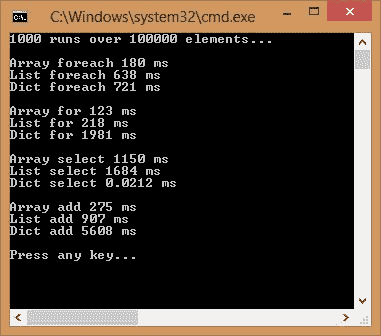
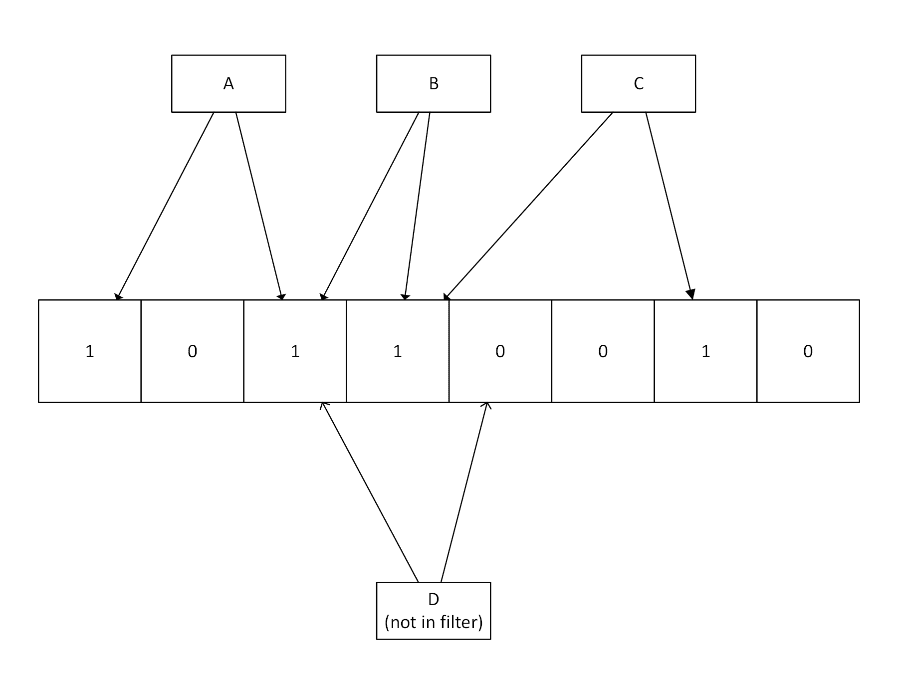
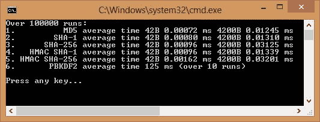
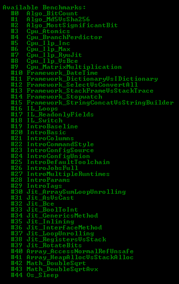
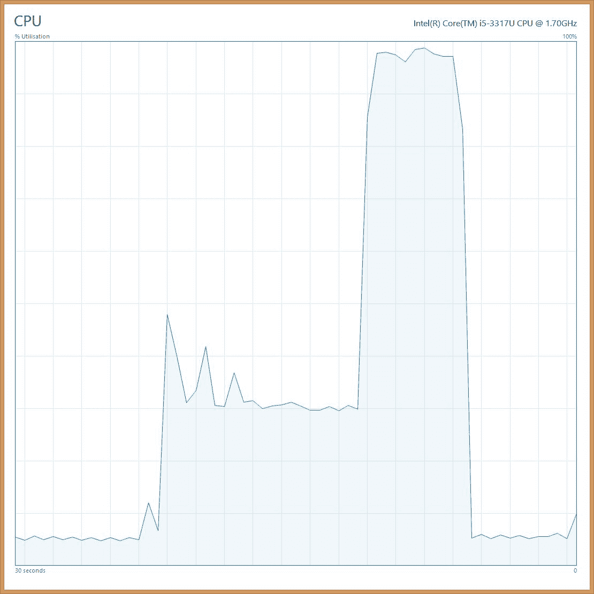
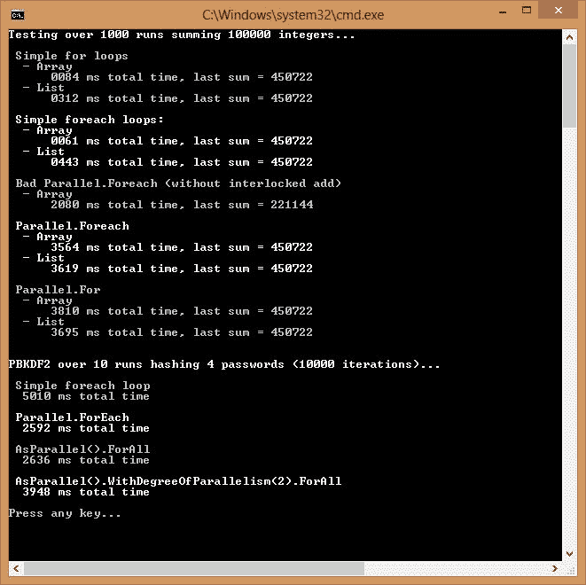

# 八、理解代码执行和异步操作

本章介绍如何解决代码执行中的性能问题，这通常不是出现速度问题的第一个地方，但却是一个很好的额外优化。我们将讨论哪些领域需要性能，哪些领域可以(甚至需要)慢下来。将比较各种数据结构的优点，从标准的内置泛型集合到更奇特的。我们将演示如何并行计算操作，以及如何利用您的中央处理器可能提供的额外指令集。我们将深入 ASP.NET Core的内部。NET Core 来强调您应该注意的改进。

本章涵盖的主题包括以下内容:

*   。NET Core和标准库
*   **公共语言运行时** ( **CLR** )服务
*   ASP.NET Core和红隼网络服务器
*   通用集合和布隆过滤器
*   序列化和数据表示格式
*   散列函数的相对性能
*   并行化(SIMD、第三方物流和 PLINQ)
*   多线程、并发和锁定
*   要避免的不良实践

您将学习如何并行计算结果，并在最后组合输出。这包括如何避免不正确的方法，这会让事情变得更糟。您还将学习如何降低服务器利用率，以及如何选择最合适的数据结构，以便针对您的特定情况高效地处理信息。

# 开始核心项目

使用有很多好处。NET Core 和 ASP.NET Core 优于旧的完整版本的框架。主要的增强是开源开发和跨平台支持，但也有显著的性能改进。开放开发很重要，不仅源代码可用，开发工作也在 GitHub 上公开进行。鼓励社区做出贡献，如果他们通过了代码审查，这些贡献可能会被合并到上游；流动不仅仅是一种方式。这导致了性能的提高和来自微软外部的额外平台支持。如果你在一个框架中发现一个 bug，你现在可以修复它，而不是绕过这个问题并希望得到一个补丁。

构成框架的多个项目在 GitHub 上被分成两个组织。驱动原则之一是将框架拆分成模块，这样您就可以得到您需要的东西，而不是整个整体安装。较低级别的框架。NET Core，可以和其他项目一起在[https://github.com/dotnet](https://github.com/dotnet)下找到。更高级别的网络应用框架，ASP.NET Core，可以在[https://github.com/aspnet](https://github.com/aspnet)下找到。

让我们快速浏览一下各种。NET Core存储库以及它们如何组合在一起。

# 。净核心

有几个项目构成了。NET Core 这些是 CoreCLR 和 **CoreFX** 。CoreCLR 包含。NET Core CLR 和基础核心库，`mscorlib`。CLR 是运行您的的虚拟机。NET 代码。CoreCLR 包含一个**即时** ( **JIT** )编译器( **RyuJIT** )、**垃圾收集器** ( **GC** )以及 mscorlib 中的基类和类。CoreFX 包括基础库，位于 CoreCLR 之上。这包括大多数不是简单类型的内置组件。还有罗斯林编译器，它可以把你的 C#(或其他。NET 语言代码)转换成**通用中间语言** ( **CIL** )字节码。RyuJIT 然后在运行时将其转换为本机机器代码。

您可能听说过即将推出的原生工具链。这保证了更多的性能改进，因为编译不必快速、实时地发生，并且可以进一步优化。例如，可以牺牲编译速度来调整构建的执行速度。它在概念上类似于**原生图像生成器** ( **NGen** )工具，该工具已经处于完整状态。NET 框架自诞生以来。不幸的是。核心项目的. NET 原生版本被延迟并推迟到。NET Core 2。目前，它仅适用于 UWP 视窗商店应用程序，但扩展后将值得考虑。

虽然。NET Core 的性能通常比前一个更好。NET 框架中，一些性能设置的配置不同。例如，您可能熟悉用于设置 GC 模式的`<gcServer>`元素，该元素在具有两个以上处理器的机器上表现更好。英寸 NET Core 您可以在您的`.csproj`文件中将`ServerGarbageCollection`设置为`true`，如下所示:

```cs
<PropertyGroup>

    <ServerGarbageCollection>true</ServerGarbageCollection>

</PropertyGroup>
```

# ASP.NET Core

ASP.NET Core运行在。NET Core，虽然它也可以满负荷运行。NET 框架。我们只讨论跑步。NET Core，因为这表现得更好，并确保增强的平台支持。有很多项目组成了 ASP.NET Core，值得简单提一下其中的一些。

不包含任何框架引用是很有用的。NET 4，这样你就可以确定你只是在使用。NET Core，不要意外引用任何尚不支持的依赖项。这不是什么大问题。NET 标准 2.0，所以如果你坚持支持的 API，那么你的项目应该在所有实现它们的框架上工作。

ASP.NET Core包括**模型-视图-控制器** ( **MVC** )、 **Web API、**和 **Razor Pages** (一种用 **Razor** 视图引擎制作简单页面的方式，类似于 PHP，是经典 ASP 的精神继承者)。这些特性都合并在一起了，所以你不再需要把 MVC 和 Web API 看作是独立的框架了。还有很多其他的项目和存储库，包括 **EF Core** ，但是我们这里要重点介绍的是红隼 HTTP 服务器。

# 红隼

红隼是 ASP.NET Core的一个新的网络服务器，它表现出色。它基于 **libuv** ，这是一个异步 I/O 抽象和支持库，也在 Node.js. Kestrel 下面运行，速度惊人，基准测试非常令人印象深刻。然而，这是非常基本的，对于生产托管，您应该将其放在反向代理的后面，这样您就可以使用缓存和其他功能来服务更多的用户。为此，您可以使用许多 HTTP 或代理服务器，如 IIS、nginx、Apache 或 HAProxy。

You should be careful with your configuration if using nginx as a reverse proxy, as by default it will retry `POST` requests if the response from your web server times out. This could result in duplicate operations being performed, especially if used as a load balancer across multiple backend HTTP servers.

# 数据结构

数据结构是可以用来存储正在处理的信息的对象。为如何使用数据选择最佳实现会对执行速度产生巨大影响。在这里，我们将讨论一些您可能喜欢使用的常见和更有趣的数据结构。

因为这是一本关于 web 应用程序编程的书，而不是一本关于复杂算法实现或微优化的书，所以我们不会对数据结构和算法进行大量的详细描述。正如简介中简要提到的，其他因素会使网络环境中的执行速度相形见绌，我们假设您不是在编写游戏引擎。然而，好的算法可以帮助加速应用程序，所以，如果你在一个执行性能很重要的领域工作，你应该阅读更多关于它们的内容。

我们更感兴趣的是整个系统的性能，而不一定是代码运行的速度。考虑您的代码表达了什么(以及这如何影响其他系统)通常比它如何执行更重要。尽管如此，为这项工作选择合适的工具仍然很重要，并且您不想有不必要的缓慢代码。当它已经执行得足够快时，小心过度优化，最重要的是，尽量保持它的可读性。

# 列表

a。NET `List<T>`是 C#中编程的主要部分。它是类型安全的，所以你不必为施法或拳击而烦恼。您可以指定您的泛型类型，并确保只有该基元或类的对象(或从它们继承的对象)可以在您的列表中。列表实现了标准列表和可枚举接口(`IList`和`IEnumerable`)，尽管在具体的列表实现上您会得到更多的方法，例如，添加一个范围。也可以使用**语言集成查询** ( **LINQ** )表达式轻松查询，使用**流畅的 lambda 函数**时比较琐碎。然而，尽管 LINQ 通常是一个解决问题的好办法，但它可能会导致性能问题，因为它并不总是优化的。

列表实际上只是一个增强的一维数组。事实上，它在内部使用数组来存储数据。在某些情况下，为了提高性能，直接使用数组可能会更好。如果您确切地知道会有多少数据，并且需要在一个紧密的循环中迭代，那么数组偶尔会是一个更好的选择。如果您需要更多维度，或者计划使用数组中的所有数据，它们也会很有用。

您应该小心使用数组；只有当基准测试在遍历列表时显示出性能问题时，才能谨慎使用它们。虽然它们可以更快，但它们也使并行编程和分布式体系结构变得更加困难，这是可以显著提高性能的地方。

现代高性能意味着扩展到多个内核和多台机器。使用不变的**不可变的**状态更容易做到这一点，这在更高级别的抽象中比在数组中更容易实现。例如，您可以通过接口帮助强制执行只读列表。

如果您在一个大列表的中间插入或删除了很多项目，那么使用`LinkedList<T>`类可能会更好。这与列表有不同的性能特征，因为它不是真正的列表，它更像是一个链。对于某些特殊情况，它的性能可能比列表更好，但在大多数常见情况下，它会更慢。例如，使用索引访问列表很快(因为它是数组支持的)，但是使用链表很慢(因为您将不得不遍历整个链)。

通常，最好首先关注代码的内容和原因，而不是方式。LINQ 在这方面做得非常好，因为您只需声明您的意图，而不需要担心实现细节和循环。过早优化是一个坏主意，所以只有在测试显示出性能问题时才这样做。在大多数情况下，列表是正确的选择，除非您只需要从一个大集合中选择几个值，在这种情况下，字典可以表现得更好。

# 字典

字典类似于列表，但擅长用键快速检索特定值。在内部，它们是用哈希表实现的。有遗留的`Hashtable`类(在`System.Collections.NonGeneric`包中)，但是这不是类型安全的，而`Dictionary<T>`是一个泛型类型，所以您可能不应该使用`Hashtable`，除非您将旧代码移植到。NET Core。这同样适用于`ArrayList`，它是`List`的遗留非通用版本。

字典可以非常快速地查找带有关键字的值，而列表需要遍历所有的值，直到找到关键字。然而，你仍然可以按照字典的顺序来列举它，尽管这并不是它的真正用途。如果不需要点餐，那么可以使用`HashSet`。所有这些数据结构都有分类版本，您可以再次使用只读接口来使它们难以变异。

# 收集基准

准确的基准测试很难，有很多事情会扭曲你的结果。编译器非常聪明，会进行优化，这会降低琐碎基准测试的价值。编译器可以为不同的实现输出非常相似的代码。

您在数据结构中放入的内容也会对它们的性能产生很大影响。通常最好测试或分析您的实际应用程序，不要过早优化。代码的可读性非常有价值，不应该为了运行时的效率而牺牲它，除非有明显的性能问题(或者它已经不可读了)。

有一些基准测试框架可以用来帮助你的测试，比如 BenchmarkDotNet，它可以在[https://github.com/dotnet/BenchmarkDotNet](https://github.com/dotnet/BenchmarkDotNet)找到。然而，这些可能是一个矫枉过正，有时很难设置。其他选项包括**简易速度测试仪**(可在[http://theburningmonk.github.io/SimpleSpeedTester/](http://theburningmonk.github.io/SimpleSpeedTester/))和**迷你本**(可从[https://github.com/minibench](https://github.com/minibench)获得)。

You can read more about the benchmarks of the ASP.NET Core framework at [https://github.com/aspnet/benchmarks](https://github.com/aspnet/benchmarks) .

我们将执行一些简单的基准测试来展示您可能会如何做。然而，不要假设这里得出的结论总是成立的，所以要根据你的情况进行测试。这里的例子故意保持简单，以便您可以轻松地运行它们，尽管我们确实试图避免一些明显的错误。

首先，我们将定义一个简单的函数来运行我们的测试:

```cs
private static long RunTest(Func<double> func, int runs = 1000) 
{ 
    var s = Stopwatch.StartNew(); 
    for (int j = 0; j < runs; j++) 
    { 
        func(); 
    } 
    s.Stop(); 
    return s.ElapsedMilliseconds; 
} 
```

我们在这里使用`Stopwatch`是因为使用`DateTime`会导致问题，即使使用 UTC 也是如此，因为时间可能会在测试过程中发生变化，并且分辨率不够高。我们还需要进行多次运行才能获得准确的结果。然后，我们将定义我们的数据结构，用随机数据测试和预填充它们:

```cs
var rng = new Random(); 
var elements = 100000; 
var randomDic = new Dictionary<int, double>(); 
for (int i = 0; i < elements; i++) 
{ 
    randomDic.Add(i, rng.NextDouble()); 
} 
var randomList = randomDic.ToList(); 
var randomArray = randomList.ToArray(); 
```

我们现在有一个数组、一个列表和一个字典，包含相同的一组 100，000 个键/值对。接下来，我们可以对它们进行一些测试，看看什么结构在各种情况下表现最好:

```cs
var afems = RunTest(() => 
{ 
    var sum = 0d; 
    foreach (var element in randomArray) 
    { 
        sum += element.Value; 
    } 
    return sum; 
}, runs); 
```

前面的代码乘以在`foreach`循环中迭代一个数组所花费的时间，并对双精度浮点值求和。然后，我们可以将它与其他结构和访问它们的不同方式进行比较。例如，在`for`循环中迭代字典的操作如下:

```cs
var dfms = RunTest(() => 
{ 
    var sum = 0d; 
    for (int i = 0; i < randomDic.Count; i++) 
    { 
        sum += randomDic[i]; 
    } 
    return sum; 
}, runs); 
```

这表现得很糟糕，因为字典不应该这样使用。字典擅长通过关键字快速提取记录。事实上，速度如此之快，以至于您需要多次运行测试才能获得实际值:

```cs
var lastKey = randomList.Last().Key; 
var dsms = RunTest(() => 
{ 
    double result; 
    if (randomDic.TryGetValue(lastKey, out result)) 
    { 
        return result; 
    } 
    return 0d; 
}, runs * 10000); 
Console.WriteLine($"Dict select {(double)dsms / 10000} ms"); 
```

用`TryGetValue`从字典中获取一个值是非常快的。您需要将要设置的变量作为`out`参数传递到方法中。您可以通过测试方法返回的布尔值来查看这是否成功以及该项是否在字典中。

相反，一个接一个地向字典添加条目可能会很慢，所以这完全取决于你在优化什么。

下面的屏幕截图显示了一个非常简单的控制台应用程序的输出，该应用程序测试数据结构的各种组合排列及其用途:



上图中显示的这些结果提供了丰富的信息，但是您应该持怀疑态度，因为许多事情会扭曲输出，例如测试的顺序。如果差距很小，那么这两种变体之间可能没有太多的选择，但是你可以清楚地看到很大的差异。

To get more realistic results, be sure to compile in release mode and run without debugging. The absolute results will depend on your machine and architecture but the relative measures should be useful for comparisons, if the differences are large.

这里的主要课程是为您的特定应用程序进行测量，并为您正在执行的工作选择最合适的数据结构。标准图书馆的藏书应该能很好地为你服务；这里没有提到的其他方法有时也很有用，例如`Queue`或`Stack`。

你可以在 MSDN 找到更多关于内置收藏和数据结构的信息。你也可以在。在 GitHub 页面上的. NET Core文档网站。

然而，还有一些更罕见的数据结构，不在标准集合中，您可能偶尔希望使用。我们现在将展示其中一个例子。

# 布鲁姆过滤器

**布隆过滤器**是一种有趣的数据结构，可以提高某些用例的性能。它们使用多个重叠的散列函数，可以快速告诉你一个项目是否肯定不存在于集合中。然而，他们不能肯定地说一个项目是否存在，只能说它有可能存在。它们作为预过滤器很有用，这样您就可以避免执行查找，因为您肯定知道项目不会在那里。

下图显示了布隆过滤器的工作原理。 **A** 、 **B** 和 **C** 已经被散列并插入到过滤器中。 **D** 被散列以检查它是否在过滤器中，但是，由于它映射到零位，我们知道它不在过滤器中:



布隆过滤器比保存集合中每个项目的所有数据甚至散列列表要小得多。它们也可以快得多，因为查找时间对于任何大小的集合都是恒定的。这个恒定时间可能比在大型列表或字典中查找项目的时间要短，尤其是在文件系统或远程数据库中。

布隆过滤器的一个示例应用程序可以是本地 DNS 服务器，它有一个要覆盖的域列表，但是将大多数请求转发给上游服务器。如果自定义域的列表很大，那么从条目中创建一个布隆过滤器并将其保存在内存中可能是有利的。

当一个请求进来时，它会根据过滤器进行检查，如果它不存在，那么这个请求会被转发到上游服务器。如果该条目确实存在于过滤器中，则查询本地主机文件；如果条目在那里，则使用它的值。即使筛选器认为该条目不在列表中，它也很有可能不在列表中。在这种情况下，当没有找到时，请求被转发，但是这种方法仍然避免了为每个请求查询列表的需要。

使用布隆过滤器的另一个例子是在缓存节点中，可能作为代理或 CDN 的一部分。您不想缓存只被请求一次的资源，但是如果您没有缓存它，您怎么知道第二次请求何时发生？如果您将请求添加到 Bloom 过滤器，您可以很容易地判断第二个请求何时发生，然后缓存资源。

布隆过滤器也用于一些数据库，以避免昂贵的磁盘操作，并用于**缓存摘要**，允许代理声明其缓存的内容。HTTP/2 将来可能会支持缓存摘要，但这可能会使用 **Golomb 编码的集合** ( **GCS** )，它们类似于 Bloom 过滤器，但更小，代价是查询速度更慢。

中有一个布隆过滤器的开源实现。除其他外，网络可在[http://bloomfilter.codeplex.com/](http://bloomfilter.codeplex.com/)获得。你应该自己测试性能，以确保它提供了改进。

# 哈希和校验和

哈希是一个重要的概念，通常用于快速确保数据完整性或查找值，因此它被优化为快速。这就是为什么不应该单独使用一般的散列函数来安全地存储密码。如果算法很快，那么可以在合理的短时间内猜出密码。哈希算法的复杂性、执行速度、输出长度和冲突率各不相同。

一种非常基本的错误检测算法叫做**奇偶校验**。这将一个位添加到一个数据块中，并且很少在编程中直接使用。然而，它在硬件级别被广泛使用，因为它非常快。然而，当出现偶数个损坏时，它可能会遗漏许多错误。

循环冗余校验是一种稍微复杂一点的错误检测算法。 **CRC-32** (也写为 **CRC32** )版本通常用于软件，尤其是压缩格式，作为**校验和**。

You may be familiar with the built-in support for hash codes in .NET (with the `GetHashCode` method on all objects), but you should be very careful with this. The only function of this method is to assist with picking buckets in data structures that use hash tables internally, such as a dictionary, and also in some LINQ operations. It is not suitable as a checksum or key, because it is not cryptographically secure and it varies across frameworks, processes, and time.

您过去可能使用过**消息摘要 5** ( **MD5** )算法，但今天强烈建议不要使用它。MD5 的安全性严重受损，很容易产生冲突。因为它非常快，所以它可能有一些非安全的用途，例如非恶意错误检查，但是有更好的算法足够快。

如果你需要一个强大但快速的散列函数，那么**安全散列算法** ( **SHA** )家族是一个不错的选择。但是， **SHA-1** 不被认为是防未来的，所以对于新代码 **SHA-256** 一般是比较好的选择。

在对消息进行签名时，您应该使用专用的**消息认证码** ( **MAC** )，例如基于**哈希的 MAC** ( **HMAC** )，这样可以避免哈希函数一次通过的漏洞。一个很好的选择是内置在. NET 中的`HMACSHA256`类。各种 API，比如一些 AWS REST APIs，使用 **HMAC-SHA256** 来验证请求。这确保了即使请求是通过未加密的 HTTP 通道执行的，API 密钥也不会被截获和恢复。

正如[第 2 章](02.html)、*为什么性能是一个特性*中简要提到的，密码哈希是一个特例，通用哈希算法不适合它，因为它们太快了。一个很好的选择是**基于密码的密钥派生函数 2** ( **PBKDF2** )，我们在[第 4 章](04.html)、*测量性能瓶颈*中以此为例。PBKDF2 是特别受欢迎的选择。NET，因为它被构建到框架中，所以实现更有可能是正确的。它是根据一个 RFC 构建的，并由微软审查，对于网上发现的任何随机代码，你都不能说它是 RFC。例如，您可以为下载 **bcrypt** 的实现。但是你必须相信它被正确编码或者自己验证它。

# 哈希基准

让我们对各种散列函数做一些简单的基准测试，看看它们在性能方面是如何比较的。在下面的代码片段中，我们定义了一个运行测试的方法，类似于前面集合基准测试的方法:

```cs
private static long RunTest(Action func, int runs = 1000) 
{ 
    var s = Stopwatch.StartNew(); 
    for (int j = 0; j < runs; j++) 
    { 
        func(); 
    } 
    s.Stop(); 
    return s.ElapsedMilliseconds; 
} 
```

我们包括以下`using`声明:

```cs
using System.Security.Cryptography; 
```

接下来，我们定义一个短的私有常量字符串(`hashingData`)在类中进行散列，并以 8 位 Unicode ( `UTF8`)格式获取其字节:

```cs
var smallBytes = Encoding.UTF8.GetBytes(hashingData); 
```

我们还想得到一个更大的字节块来散列，看看它在性能方面如何比较。为此，我们使用加密安全的随机数生成器:

```cs
var largeBytes = new byte[smallBytes.Length * 100]; 
var rng = RandomNumberGenerator.Create(); 
rng.GetBytes(largeBytes); 
```

我们的一些函数需要一个`key`，所以我们使用相同的技术来生成这个:

```cs
var key = new byte[256]; 
var rng = RandomNumberGenerator.Create(); 
rng.GetBytes(key); 
```

接下来，我们创建一个排序的算法列表来测试和执行每个算法的测试:

```cs
var algos = new SortedList<string, HashAlgorithm> 
{ 
    {"1\.          MD5", MD5.Create()}, 
    {"2\.        SHA-1", SHA1.Create()}, 
    {"3\.      SHA-256", SHA256.Create()}, 
    {"4\.   HMAC SHA-1", new HMACSHA1(key)}, 
    {"5\. HMAC SHA-256", new HMACSHA256(key)}, 
}; 
foreach (var algo in algos) 
{ 
    HashAlgorithmTest(algo); 
} 
```

我们的测试方法对每个算法运行以下测试。它们都是从`HashAlgorithm`继承的，所以我们可以对大小字节数组分别运行`ComputeHash`方法:

```cs
var smallTimeMs = RunTest(() => 
{ 
    algo.Value.ComputeHash(smallBytes); 
}, runs); 
var largeTimeMs = RunTest(() => 
{ 
    algo.Value.ComputeHash(largeBytes); 
}, runs); 
```

然后我们计算两种尺寸的平均时间。我们将长整数转换为双精度浮点数，这样就可以表示 1 到 0 之间的小值:

```cs
var avgSmallTimeMs = (double)smallTimeMs / runs; 
var avgLargeTimeMS = (double)largeTimeMs / runs; 
```

然后，前面的方法将这些平均时间输出到控制台。我们需要单独测试 PBKDF2，因为它不继承`HashAlgorithm`:

```cs
var slowRuns = 10; 
var pbkdf2 = new Rfc2898DeriveBytes(hashingData, key, 10000); 
var pbkdf2Ms = RunTest(() => 
{ 
    pbkdf2.GetBytes(256); 
}, slowRuns); 
```

PBKDF2 非常慢，执行 100，000 次运行需要相当长的时间(这就是使用它的意义)。在内部，这个 RFC2898 密钥拉伸算法的实现运行了 HMAC·SHA-1 10，000 次。默认值为 1，000，但是由于目前可用的计算能力，建议将其至少设置高一个数量级。例如，**保护无线电脑网络安全系统 II** ( **WPA2** )使用 4，096 轮迭代产生一个 256 位密钥，其中**服务集标识符** ( **SSID** )作为**盐**。

输出如下所示:



从前面的输出中，您可以看到一次散列所花费的时间从小 MD5 的大约 720 纳秒到大 HMAC SHA-256 的 32 微秒和具有典型参数的小 PBKDF2 的 125 毫秒不等。

基准测试的结果可能会有很大的不同，所以你不应该过多地解读绝对值。例如，BenchmarkDotNet 工具在同一台机器上比较 MD5 和 SHA-256 的输出如下所示:


您可以在前面的截图中看到，结果与我们自制的基准不同。但是，这使用了完整的。NET Framework，计算平均时间的中位数而不是平均值，并在调试模式下运行(这有助于警告我们)，等等。

更快的机器将具有更高的吞吐量(如 GitHub 上的 BenchmarkDotNet `README.md`所示)。专用硬件如**图形处理单元** ( **图形处理器**)**现场可编程门阵列**(**FPGA**)和**专用集成电路** ( **专用集成电路**)可以快得多。这些往往用于比特币(和其他加密货币)的挖掘，因为这些是基于哈希作为工作证明。比特币使用 SHA-256，但其他货币使用不同的哈希算法。

相同的算法构成了 TLS 的基础，因此速度更快的硬件可以处理更多的安全连接。又如，谷歌构建了一个名为**张量处理单元** ( **TPU** )的定制 ASIC，以加速他们的机器学习云服务。

BenchmarkDotNet 中提供了其他基准测试示例，当您第一次运行它时，您将看到以下菜单:



前一个基准是第二个选项(编号#1 Algo_Md5VsSha256)。

基准测试很难，所以如果可以的话，使用像 BenchmarkDotNet 这样的库是个好主意。从我们的基准测试中，我们可以得出的唯一结论是，SHA-256 比 MD5 慢。然而，对于大多数应用程序来说，SHA-256 应该足够快，并且对于完整性检查来说更安全。但是，它仍然不适合存储密码。

SHA-256 可用于提供签名以验证下载的文件(为了安全起见，必须通过 HTTPS 检索)和签署证书。当作为 HMAC 的一部分使用时，它还可以用于安全地验证消息，如应用编程接口请求。只有知道正确的应用编程接口密钥才能成功连接。

# 序列化

序列化是将对象转换成适合通过网络传输或存储的数据的过程。我们还包括反序列化，这是相反的，在这个保护伞下。序列化不仅对网络传输速度，而且对计算都有显著的性能影响，因为它可以弥补 web 服务器上大多数昂贵的处理。您可以在[https://docs . Microsoft . com/en-us/dotnet/cs harp/programming-guide/concepts/serialization/index](https://docs.microsoft.com/en-us/dotnet/csharp/programming-guide/concepts/serialization/index)上阅读更多关于序列化的内容。

序列化格式可以是基于文本的，也可以是二进制的。一些流行的基于文本的格式是**可扩展标记语言** ( **XML** )和 **JavaScript 对象符号** ( **JSON** )。一种流行的二进制格式是在谷歌开发的**协议缓冲区**。有一种. NET 二进制序列化格式(`BinaryFormatter`)，现在在中得到支持。NET Core 2。

XML 在开发人员中已经过时了，现在 JSON 通常是首选。这部分是由于等效 JSON 有效载荷的尺寸较小，但也可能是由于在最初命名的**简单对象访问协议** ( **SOAP** )中使用了 XML。这是在**视窗通讯基金会** ( **WCF** )中使用的，但是 SOAP 不再是首字母缩略词，因为开发人员发现它远不简单。

JSON 之所以受欢迎，是因为它紧凑且可读，并且很容易被 JavaScript 使用，尤其是在网络浏览器中。有许多不同的 JSON 序列化程序。NET，具有不同的性能特征。然而，因为 JSON 不像 XML 那样严格定义，所以实现中可能存在差异，这使得它们不兼容，尤其是在处理日期等复杂类型时。例如，非常流行的**Json.NET**以**国际标准化组织** ( **ISO** )格式表示日期，而 ASP.NET MVC 旧版本中使用的 JSON 序列化程序将日期表示为自 Unix **纪元**以来的毫秒数，用 JavaScript 日期构造函数包装。

那个。NET 开发人员社区已经聚集在 Json.NET，兼容性总是比性能更好。ASP.NET Web API 已经用 Json.NET 做默认有一段时间了，ASP.NET Core 也用 Json.NET。有一个序列化程序是名为**服务堆栈的**服务堆栈**框架的一部分。文字**，号称更快，但你可能更看重兼容性和文档而不是速度。这同样适用于其他 JSON 库，如 Jil([https://github.com/kevin-montrose/Jil](https://github.com/kevin-montrose/Jil))和**NetJSON**([https://github.com/rpgmaker/NetJSON](https://github.com/rpgmaker/NetJSON))，在基准测试中甚至可以比 ServiceStack 更快。

如果您追求纯性能，并且控制所有端点，那么您可能会想要使用二进制协议。但是，这可能会限制未来与您无法控制的第三方端点的互操作性。因此，最好只在内部使用这些。

在 UDP 之上构建自己的定制消息协议是一个坏主意。所以，如果你想使用二进制序列化，你应该看看像 **protobuf-net** 这样的东西，这是一个为. net 缓冲实现的协议，你也可能希望考虑微软的 Bond 框架([https://github.com/Microsoft/bond](https://github.com/Microsoft/bond))或者亚马逊的 Ion([https://amzn.github.io/ion-docs/index.html](https://amzn.github.io/ion-docs/index.html))。您可能需要调整这些工具以获得最佳性能，例如，通过更改默认缓冲区大小。

# SIMD 中央处理器指令

**单指令多数据** ( **SIMD** )是一种在许多现代处理器上可用的技术，即使在一个内核上的单线程中，也可以通过并行化计算来加速执行。SIMD 利用 CPU 上可用的额外指令来操作值集(向量)，而不仅仅是单个值(标量)。

最常见的指令集叫做**流式 SIMD 扩展 2** ( **SSE2** )，自奔腾 4 问世以来已经存在了 15 年多。一个新的指令集叫做**高级向量扩展** ( **AVX** )提供了优于 SSE2 的性能，并且已经存在了五年多。因此，如果您使用的是相当新的 x86-64 CPU，那么您应该可以访问这些额外的指令。

Some ARM CPUs (such as those in the Raspberry Pi 2 and 3) contain a similar technology called **NEON** , officially known as **Advanced SIMD** . This is not currently supported in .NET, but may be in the future. An official open source library project in C is hosted at [http://projectne10.org/](http://projectne10.org/) .

您可以使用以下布尔属性来测试是否支持 SIMD:

```cs
Vector.IsHardwareAccelerated 
```

该属性是 JIT 固有的，该值由 RyuJIT 在运行时设置。

您可以实例化泛型类型`Vector`或使用二维/三维/四维便利类之一。例如，要创建单精度浮点向量，可以使用以下通用代码:

```cs
var vectorf = new Vector<float>(11f); 
```

要创建单精度浮点三维向量，可以使用以下代码:

```cs
var vector3d = new Vector3(0f, 1f, 2f); 
```

A two-dimensional double precision floating point vector can be a good substitute for a `Complex` structure. It will give higher performance on hardware-accelerated systems. `Vector2` only supports single precision floating point numbers, but you can use the generic type to specify the real and imaginary components of the complex number as a double. `Complex` only supports double precision floating point numbers but, if you don't need high precision, you could still use the `Vector2` convenience class. Unfortunately, this means that it's not simply a drop-in replacement, but the math is different anyway.

您现在可以使用标准的向量数学，但是修改您的算法以利用向量可能很复杂，并且不是您通常应该在 web 应用程序中做的事情。它对于桌面应用程序可能很有用，但是，如果一个进程在 web 请求中花费了很长时间，通常最好在后台运行它，然后它不需要那么快。

我们将在下一章中介绍这种分布式体系结构方法。由于这个原因，我们不会对 SIMD 做更多的详细介绍，但是如果你愿意，你可以阅读更多关于它的内容，现在你已经尝到了它的味道。你可以在[https://en.wikipedia.org/wiki/SIMD](https://en.wikipedia.org/wiki/SIMD)阅读一些背景信息，你可以找到的文件。在[http://msdn.microsoft.com/en-us/library/dn858218](http://msdn.microsoft.com/en-us/library/dn858218)的 MSDN 上 NET 实现。您还可以看一下示例控制台应用程序，它可以与本书一起下载，作为十的简单入门。

# 并行编程

虽然 SIMD 擅长提高在一个内核上运行的单线程的性能，但它不能在多个内核或处理器上工作，并且它的应用受到限制。现代扩展意味着增加更多的 CPU，而不是简单地让单线程更快。我们不只是想像 SIMD 那样并行化我们的数据；实际上，我们应该更加关注处理的并行化，因为这样可以更好地扩展。

有各种各样。NET 技术有助于并行处理，这样您就不必编写自己的线程代码。两个这样的并行扩展是**并行 LINQ** ( **PLINQ** )，它扩展了您熟悉的 LINQ 操作，以及**任务并行库** ( **第三方物流**)。

# 任务并行库

第三方物流的主要特征之一是扩展循环以并行运行。但是，您需要小心并行处理，因为它实际上会使您的软件在执行简单任务时变慢。编组多个任务所涉及的开销会使琐碎操作的工作负载的执行相形见绌。

例如，采取以下简单的`for`循环:

```cs
for (int i = 0; i < array.Length; i++) 
{ 
    sum += array[i]; 
} 
```

前面的`for`循环中的数组包含 100，000 个整数，但是增加整数是 CPU 可以做的最简单的事情之一，在数组上使用`for`循环是一种非常快速的枚举方式。在一台相当现代化的机器上，这种积累将在不到十分之一毫秒的时间内完成。

您可能认为您可以通过并行化操作来加快速度。也许你可以拆分数组，在两个内核上并行运行求和，然后将结果相加。

您可以使用以下代码来尝试:

```cs
Parallel.For(0, array.Length, i => 
{ 
    Interlocked.Add(ref sum, array[i]); 
}); 
```

You must use an interlocked add or you will get an incorrect summation result. If you don't, the threads will interfere with each other, corrupting the data when writing to the same location in memory.

然而，这段代码实际上比第一个例子慢了 42 倍。在这种情况下，额外的开销、运行许多线程的复杂性以及锁定变量以便一次只有一个线程可以向其写入的做法都是不值得的。

并行化对于更复杂的进程非常有用，尤其是如果循环体执行一些缓慢的操作，例如访问文件系统。但是，使用异步访问可以更好地处理阻塞输入/输出操作。并行访问可能会导致争用，因为访问最终可能不得不在某个时间点(例如，在硬件级别)串行执行。

如果我们想执行一个处理器更密集的操作，比如散列多个密码，那么并行运行这些任务可能是有益的。下面的代码对列表中的每个密码执行 PBKDF2 哈希，然后计算结果的 Base64 表示形式:

```cs
foreach (var password in passwords) 
{ 
    var pbkdf2 = new Rfc2898DeriveBytes(password, 256, 10000); 
    Convert.ToBase64String(pbkdf2.GetBytes(256)); 
} 
```

我们没有使用这个例子中的输出，但是您可以通过将数据库中的密码迁移到一个更有弹性的密钥扩展算法来升级密码的安全性。输入可以是明文密码或传统单向散列函数的输出，例如 MD5 或未加密的 SHA。

我们可以通过使用`Parallel.ForEach`循环来提高多核系统的速度，使用如下代码:

```cs
Parallel.ForEach(passwords, password => 
{ 
    var pbkdf2 = new Rfc2898DeriveBytes(password, 256, 10000); 
    Convert.ToBase64String(pbkdf2.GetBytes(256)); 
}); 
```

这将加快这一过程，但加快多少将取决于许多因素，如列表中的密码数量、逻辑处理器数量和中央处理器内核数量。例如，在具有两个内核但四个逻辑处理器的酷睿 i5 CPU 上，列表中只有两个密码不会带来巨大的改进(仅快 1.5 倍)。列表中有四个(或更多)密码时，改进更好(大约快 1.9 倍)。还是有一些开销的，所以用两倍的 CPU 内核是无法得到双倍的速度的。

我们可以通过查看基准测试期间任务管理器中的 CPU 利用率来了解这种差异的原因。

只有两个密码需要散列，CPU 图如下所示:


在上图中，我们可以看到，最初，当串联散列时，中央处理器以大约 25%的速度运行，完全使用一个逻辑中央处理器。当并行散列两个密码时，它使用 50%，运行在两个逻辑处理器上。由于固有的开销和**超线程**的特性，这并没有转化为速度的两倍增长。

Hyper-threading is a technology that typically exposes two logical processors to the OS for each physical core. However, the two logical CPUs still share the execution resources of their single core.

虽然 CPU 芯片上有两个内核，但是超线程会将四个逻辑 CPU 暴露给操作系统。因为我们只有两个线程，因为我们在散列两个密码，所以我们只能使用两个处理器。如果线程在不同的内核上执行，那么速度提升会很好。但是如果它们在共享同一个内核的处理器上执行，那么性能就不会那么令人印象深刻。由于调度的改进，它仍然比单线程散列要好，这也是超线程的设计目的。

当我们同时散列四个密码时，CPU 图如下所示:



我们可以看到，现在最初的 25%使用率跃升至几乎完全利用率，我们正在利用大部分处理器。这意味着与按顺序散列相比，性能几乎提高了一倍。仍然有大量的开销，但是，由于主操作现在要快得多，这种权衡是值得的。

# 平行 LINQ

还有其他方法可以利用并行编程，例如 LINQ 表达式。我们可以将前面的例子重写为 LINQ 表达式，它可能如下所示:

```cs
passwords.AsParallel().ForAll(p => 
{ 
    var pbkdf2 = new Rfc2898DeriveBytes(p, 256, 10000); 
    Convert.ToBase64String(pbkdf2.GetBytes(256)); 
}); 
```

您可以使用`AsParallel()`方法启用这些功能。`ForAll()`方法的目的与前面示例中的循环相同，如果顺序不重要，则该方法很有用。如果订购很重要，那么有一种`AsOrdered()`方法可以帮助解决这个问题。然而，这可能会由于涉及额外的处理而降低性能增益。

这个例子的执行类似于上一个使用并行循环的例子，这并不奇怪。我们也可以限制可以并行发生的操作数量，使用`WithDegreeOfParallelism()`方法如下:

```cs
passwords.AsParallel().WithDegreeOfParallelism(2).ForAll(p => 
{ 
    var pbkdf2 = new Rfc2898DeriveBytes(p, 256, 10000); 
    Convert.ToBase64String(pbkdf2.GetBytes(256)); 
}); 
```

前面的示例将哈希限制为一次两个，并且执行类似于列表中只有两个密码的情况，这是意料之中的。如果您不想最大化 CPU，这可能会很有用，因为还有其他重要的进程在其上运行。

通过在`ParallelOptions`类的实例上设置`MaxDegreeOfParallelism`属性，您可以使用第三方物流实现相同的效果。然后，该对象可以作为参数与主体一起传递到循环方法的重载版本中。

It's important, when you're using parallel LINQ to query datasets, that you don't lose sight of the best place for the query to be performed. You may speed up a query in the application with parallelization, but the best place for the query to occur may still be in the database, which can be even faster. To read more on this topic, refer back to [Chapter 7](07.html) , *Optimizing I/O Performance* , and [Chapter 5](05.html) , *Fixing Common Performance Problems* .

# 并行基准测试

让我们来看看一个简单的。NET Core 控制台应用程序，它对我们刚刚讨论的技术进行了基准测试。它显示了并行化没有帮助的一种情况，实际上使事情变得更糟。

然后，它显示了另一种情况，它确实有所帮助。



当通过累加 0 到 10 之间的 100，000 个随机整数来计算总和时，最快的方法是在简单的`foreach`循环中使用数组。在这里使用并行化会使过程慢得多，如果天真地使用，没有锁定，会给出不正确的结果，这要糟糕得多。

当执行计算量更大的工作时，例如对多个密码执行 PBKDF2 哈希函数，并行化会有很大帮助。时间几乎减半，因为它运行在两个内核上。限制线程数量的最终操作可能会在不同的运行中花费不同的时间。这可能是由于线程有时共享一个内核，有时在不同的内核上运行。根据工作情况，它几乎可以像使用所有逻辑内核一样快。

基准测试的 CPU 图如下所示:


最初的并行求和最大化了中央处理器，效率非常低。接下来，单线程哈希仅使用一个逻辑处理器(25%)，但另一个后来的哈希几乎充分利用了两个内核。最终的散列法，一次限于两个密码，只利用了一半的 CPU 能力。

# 并行编程限制

web 应用程序的性能问题通常并不意味着单独提高系统中单个用户的速度。当只有一个用户时，让一个网络应用程序运行起来很容易，但挑战在于随着用户数量的增加和你的请求越来越多，保持单个用户的性能。

本节讨论的并行编程技术在扩展 web 应用程序方面的用途有限。您已经有了一个并行化的系统，因为每个用户请求都将被分配自己的资源。您可以简单地添加更多实例、代理或机器来满足需求。问题在于如何在他们之间有效地分配工作，避免共享资源的瓶颈。我们将在下一章更深入地讨论这个问题。

# 多线程和并发

在前面关于并行编程的部分中，我们简要介绍了使用`Interlocked.Add`来避免从多个线程向内存中的同一位置写入时出错。当涉及多线程编程时，并发和锁定是最难处理的事情。出错会损害性能，甚至导致不正确的计算。

由于锁定是一个经常出错的领域，我们将包括一个简短的入门。这绝不是广泛的，但将帮助你确定你可能需要小心的领域。

# 锁

锁定是一种确保资源一次只能由一个线程使用的方式。每个希望使用锁定项的线程都必须等待轮到它，以便操作按顺序执行。这一系列处理确保了一致性，但如果有大量的锁等待释放，也会降低系统速度。

锁定也适用于数据库，您可能在 SQL 中使用过它，但是在这里我们将结合. NET 中的 C#和多线程来介绍它。有许多低级构造和原语可以用于锁定。但是，我们将采用更实用的方法，并展示中常用的高级锁定语法。NET 编程。

在 C#中实现锁定的标准方式是使用`lock`语句。这类似于`using`语句，因为它是包装底层实现的语法糖。它帮助您避免忘记实现所有必要的样板代码，类似于`using`语句如何确保对象的处置。很容易忘记异常处理的要求，导致内存泄漏或死锁。

A **deadlock** is where you make a mistake in your locking implementation and create a situation where nothing can acquire or release a lock. This can cause your program to get stuck in an infinite loop and hang.

让我们检查一个简单的锁定示例。考虑以下简单的方法。

```cs
private static void DoWork(ref int result)

{

    for (int i = 0; i < 1000000; i++)

    {

        result++;

    }

}
```

我们在不同的线程上调用这个方法两次，并等待它们都完成，使用下面的代码。

```cs
var result = 0;

var t1 = Task.Run(() => { DoWork(ref result); });

var t2 = Task.Run(() => { DoWork(ref result); });

Task.WaitAll(t1, t2);
```

在这之后`result`变量会是什么？应该不会是两百万。在没有锁定的情况下这样做将导致损坏和错误的结果。

We have used `Task.WaitAll(t1, t2)` here so that the code can run in the `Main` method of a console app. However, it is generally preferable to use `await Task.WhenAll(t1, t2)` if within an `async` method. In much the same way, `await Task.Delay(100)` is preferable to `Thread.Sleep(100)` . In C# 7.1 you can have an `async` `Main` method for a console application, so this is not a concern.

要使用一个`lock`，首先我们需要声明并初始化一个对象供其使用。我们已经在类级别上做到了这一点，并这样定义了它。

```cs
private static object l = new object();
```

我们现在可以使用这个对象来`lock`一个操作，但是我们应该在哪里执行这个锁来获得最好的性能呢？让我们在循环中尝试以下代码。

```cs
for (int i = 0; i < 1000000; i++)

{

    lock (l)

    {

        result++;

    }

}
```

这执行正确，我们得到了正确的结果，但它是缓慢的。在这个例子中，更好的方法是锁定在循环之外。下面的代码显示了这个改进的版本。

```cs
lock (l)

{

    for (int i = 0; i < 1000000; i++)

    {

        result++;

    }

}
```

这执行得非常快，因为我们只锁定了两次，而不是两百万次。这是一个极端的例子，对于一个真实的工作负载，应该有一个调优练习来找到最佳的锁定策略。

在引擎盖下，一个`lock`语句在内部使用一个`Monitor`来实现锁定。你通常不需要担心这个，除非你有特殊要求。使用`lock`比直接使用`Monitor`更简单安全。还有`Mutex`(用于跨进程)和`Semaphore`(锁定资源池而不是单个对象)。

之前使用的`Interlocked.Add`包装了一个特殊的 CPU 指令。这允许在处理器级原子地改变一个值。如果不使用它，那么相同值的不同字节可能会被不同的线程改变，从而破坏结果。在我们前面的例子中，使用`Interlocked.Increment(ref result)`会更快。然而，我们的代码只是模拟一个复杂得多的工作负载，这是不适用的，使用`Interlocked`不是一个合适的解决方案。

有多个线程时不锁定是需要避免的，就像在错误的地方锁定一样。接下来让我们看看其他一些明智的避免的事情。

# 避免的做法

我们已经展示了一些加速软件开发的方法，但是更好的方法通常是说明什么不应该做，以及事情如何会出错。如果没有不良实践，Web 应用程序通常会表现良好，这里我们将强调一些您应该注意的事情。

# 反射

反射是用其他代码以编程方式检查您的代码，并在运行时挖掘其内部的过程。例如，您可以在加载程序集时检查它，以查看它实现了哪些类和接口，以便您可以调用它们。一般不鼓励这样做，如果可能的话应该避免。通常有其他不需要反射的方法来达到同样的结果，尽管偶尔有用。

反射通常不利于性能，这是有据可查的，但是，像往常一样，这取决于您使用它的目的。新的是，反思有了重大变化。NET Core。该应用编程接口已经改变，现在是可选的。所以，如果不使用反射，就不用支付性能罚金。

现在在反射 API 上有一个额外的方法，所以，尽管以前您会调用类似`myObject.GetType().GetMembers()`的东西，但是现在您需要通过插入新的`GetTypeInfo()`方法来将其称为`myObject.GetType().GetTypeInfo().GetMembers()`，该方法位于`System.Reflection`命名空间中。

如果必须使用反射，那么最好不要重复执行或以紧密循环的方式执行。然而，在应用程序启动期间使用它一次是很好的。但是，如果您可以完全避免使用它，您可以从中的一些新改进中受益。NET Core。

# 正则表达式

一个**正则表达式** ( **正则表达式**)可能非常有用，但是可能表现不佳，并且通常被误用在另一个解决方案会更好的情况下。例如，当有更可靠的方法时，正则表达式通常用于电子邮件验证。

如果重复重用一个正则表达式，最好通过在构造函数中指定`RegexOptions.Compiled`选项来编译它以提高性能。这只有在您经常使用正则表达式并且这样做涉及到初始性能损失的情况下才有帮助。所以，确保你检查是否真的有改进，并且现在没有变慢。

`RegexOptions.IgnoreCase`选项也可以影响性能，但它实际上可能会减慢速度，因此请始终测试您的输入。编译对此也有影响，您可能希望使用`RegexOptions.CultureInvariant`来避免比较问题。

小心不要将用户输入信任给正则表达式。有可能让他们执行大量的回溯并使用过多的资源。您不应该允许对正则表达式进行不受约束的输入，因为它们可以运行几个小时。

Regexes 通常用于电子邮件地址验证，但这通常是一个坏主意。完全验证电子邮件地址的唯一方法是向它发送电子邮件。然后，您可以让用户单击电子邮件中的链接，以表明他们有权访问该邮箱并已收到该邮箱。电子邮件地址可能与人们经常接触的普通地址有很大不同，随着新的顶级域名的加入，这一点更加真实。

许多在线电子邮件地址验证的正则表达式会拒绝完全有效的电子邮件地址。如果你想帮助用户，并在表单上执行一些基本的电子邮件地址验证，那么你所能做的就是明智地检查其中是否有一个`@`符号(以及其后的一个`.`，以便电子邮件处于表单`x@y.z`中。您可以通过简单的字符串测试做到这一点，并避免正则表达式的性能损失和安全风险。

# 紧密循环中的字符串连接

由于字符串是不可变的，不能更改，当您连接一个字符串时，会创建一个新的对象。如果在一个紧密的循环中大量使用内存，这可能会导致性能问题和内存使用问题。

您可能会发现使用字符串生成器或其他方法更好。然而，不要对此过于担心，因为它只适用于大规模。总是测试看看它是否真的是一个问题，不要在不需要的地方进行微优化。

这是一个很好的建议，找出你的代码大部分时间花在哪里，并把你的优化集中在那里。显然，优化在一个循环中执行数百万次的代码要比只偶尔运行的代码好得多。

# 动态打字

C#是一种静态类型的语言，变量类型在编译时被检查，但是它确实有一些动态特性。您可以使用`dynamic`类型和对象，如`ExpandObject`来获得动态类型语言的一些特征。`var`类型实际上不是动态的，只是在编译时推断出来的。

动态打字有性能和安全方面的损失，所以如果你能找到另一种方法来解决你的问题，最好避免。例如，ASP.NET MVC 中的`ViewBag`是动态的，所以最好不要使用`ViewBag`，而是使用定义良好的视图模型。除了性能之外，这还有许多其他好处，例如安全和方便。

# 同步操作

同步方法会阻止执行，如果可能的话应该避免，尤其是当它们很慢或者访问输入输出的时候。了解如何使用 async 对于现代高性能编程非常重要，新的语言特性使它比以往任何时候都更容易访问。如果有`async`方法，一般应该优先使用同步阻塞版本。

`async`和`await`关键词使得异步编程比过去容易得多，但是，正如[第 5 章](05.html)、*修复常见性能问题*中所述，对 web 应用程序的影响对于一个单独的用户来说并不总是可见的。这些方便的功能允许您在等待操作完成的同时，通过在停机期间将线程返回到池中来同时服务更多的用户。然后，线程可以用来服务其他用户的请求，这允许您用更少的服务器来处理更多的用户。

异步方法可能很有用，但是最大的好处不是来自于编写异步代码，而是来自于拥有异步架构。我们将在下一章讨论消息队列时讨论分布式体系结构。

# 例外

顾名思义，例外应保留给特殊情况。异常既慢又贵，如果知道某个事件可能发生，就不应该在业务逻辑中用作流控制。

这并不是说你不应该像应该的那样使用异常处理。然而，它应该保留给真正意想不到和罕见的事件。如果你能提前预测到某个情况可能会发生，那么你就应该明确地处理它。

例如，磁盘变满，而您的代码因为没有空间而无法写入文件，这是一种例外情况。你不会期望这种情况正常发生，你可以只`try`文件操作和`catch`任何异常。但是，如果您试图解析日期字符串或访问字典，那么您可能应该使用特殊的`TryParse()`和`TryGetValue()`方法并检查空值，而不是仅仅依赖异常处理。

# 摘要

在本章中，我们讨论了一些可以提高代码执行性能的技术，并深入研究了组成的项目。网芯和 ASP.NET 芯。我们探索了数据结构、序列化、散列、并行编程，以及如何进行基准测试来衡量相对性能。我们还介绍了如何用 C#执行多线程、并发和锁定。

线性性能特征更容易扩展，当负载增加时，没有表现出这种行为的代码可能会变慢。具有指数级性能特征或具有不稳定异常值(这种异常值很少出现，但出现时非常慢)的代码会导致性能问题。通常更好的做法是，代码虽然在正常情况下稍慢，但更具可预测性，并且在大范围的负载下表现一致。

这里的主要教训是不要盲目应用并行编程和其他潜在的性能增强技术。总是测试以确保它们产生积极的影响，因为它们很容易使事情变得更糟。我们的目标是一切都很棒的情况，但是，如果我们不小心，我们可能会误把一切都搞得很糟糕。

在下一章中，您将学习缓存和消息队列。这是两种可以显著提高系统性能的高级技术。