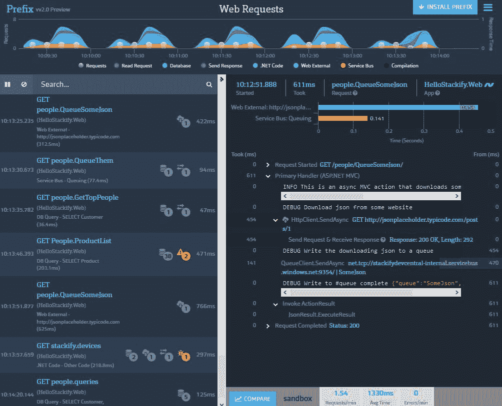
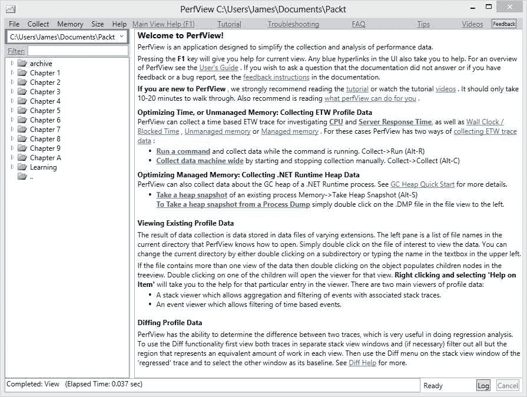
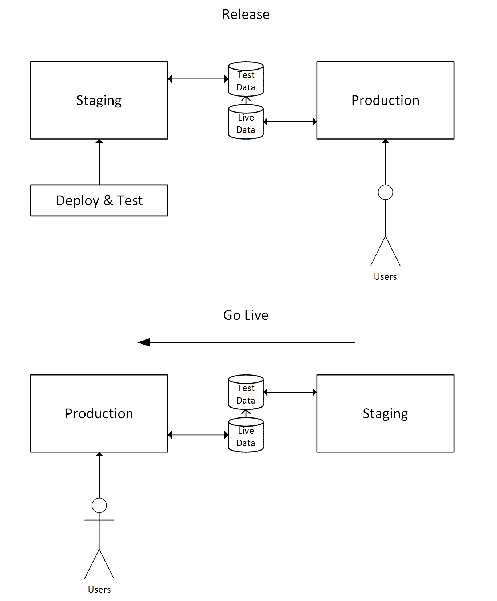
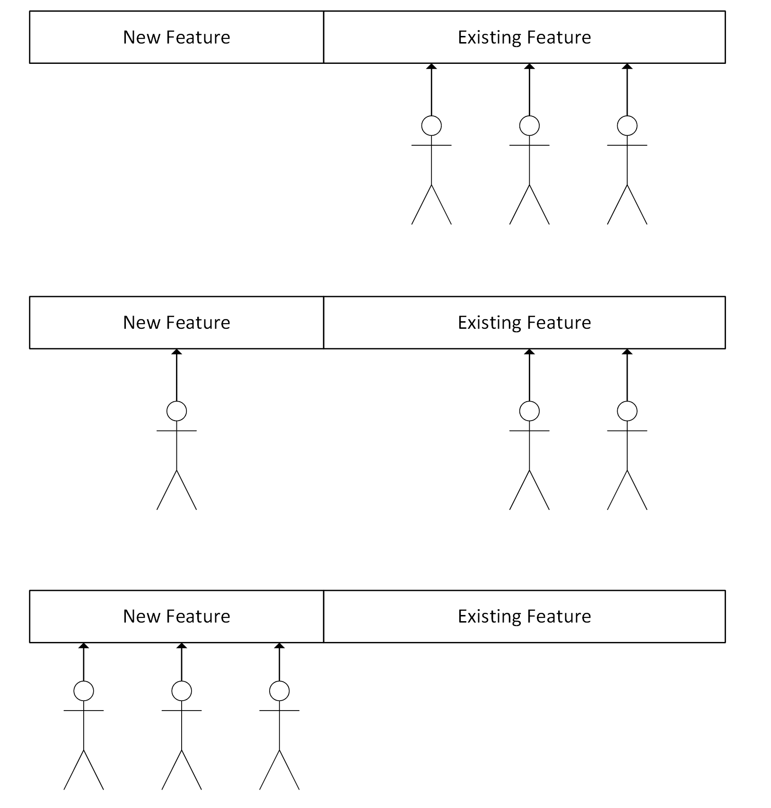
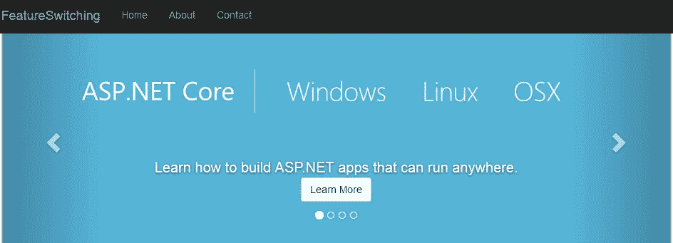
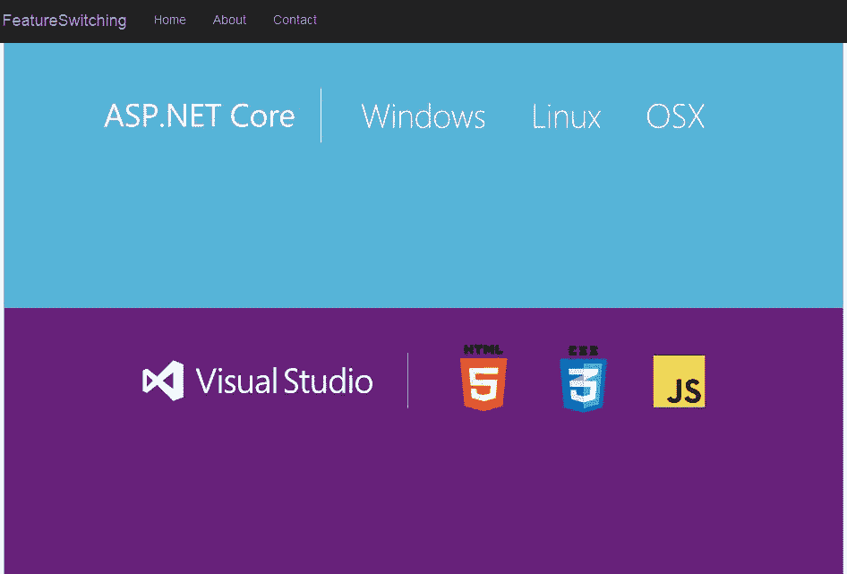
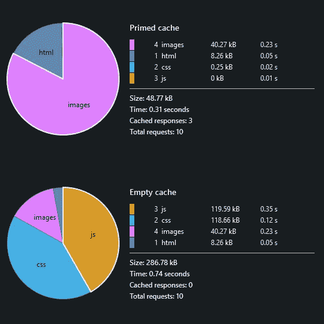
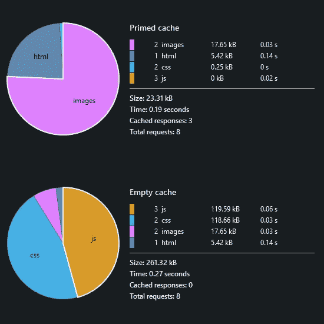

# 十一、监控性能回归

本章将涵盖编写自动化测试来监控性能，以及将测试添加到**持续集成** ( **CI** )和部署系统。通过不断检查回归，您将避免意外构建一个缓慢的应用程序。我们还将介绍如何在不强制系统离线的情况下安全地加载测试系统，以及如何确保测试尽可能地模拟真实使用情况。

本章涵盖的主题包括:

*   压型
*   负载测试
*   自动化测试
*   性能监控
*   持续集成和部署
*   真实的环境和类似生产的数据
*   硒元素和幻影无头浏览器的用户界面测试
*   转换优化的模拟/模拟测试
*   云服务和托管
*   DevOps

您将看到如何自动执行性能监控和测试，这样您就不需要记得一直手动执行。您将学习如何在回归造成麻烦之前及早发现回归，以及如何安全地将其退回返工。

# 轮廓和测量

我们在这本书的开头，通过介绍第 4 章、*测量性能瓶颈*中的一些简单技术，强调了测量和分析的重要性。我们从头到尾都在延续这个主题，我们也将在这本书的结尾，因为衡量和分析可靠的证据是多么重要，这一点怎么强调都不为过。

在此之前，我们已经介绍了如何使用 scope 来深入了解 web 应用程序的运行。我们还展示了 Visual Studio 诊断工具和应用洞察**软件开发工具包** ( **软件开发工具包**)。还有一个值得一提的工具——前缀分析器，你可以在[https://stackify.com/prefix/](https://stackify.com/prefix/)获得。

前缀是一个免费的基于网络的 ASP.NET 侧写，支持 ASP.NET Core。如果你想快速查看，他们的网站上有一个现场演示(在[http://demo.prefix.io/](http://demo.prefix.io/))，看起来如下:



您可能还想看看微软的 **PerfView** 性能分析工具，它用于的开发。NET Core。您可以从[http://microsoft.com/download/details.aspx?id=28567](http://microsoft.com/download/details.aspx?id=28567)下载 PerfView 作为压缩文件，只需提取并运行即可。分析的记忆是有用的。NET 应用程序等。当您启动 PerfView 时，它看起来像这样:



您可以将 PerfView 用于许多调试活动，例如，拍摄堆的快照或强制 GC 运行。我们这里没有空间详细介绍，但附带的说明很好，如果您需要更多信息，可以在 MSDN 的博客上找到指南，并在[https://channel9.msdn.com/Series/PerfView-Tutorial 的*9 频道*上找到许多视频教程。](https://channel9.msdn.com/Series/PerfView-Tutorial)

**Sysinternals** tools ([https://docs.microsoft.com/en-us/sysinternals/](https://docs.microsoft.com/en-us/sysinternals/) ) can also be helpful, but as they do not focus much on .NET, they are less useful in this context.

虽然这些工具很棒，但更好的是将性能监控构建到您的开发工作流中。尽可能实现自动化，使性能检查透明且常规，并在默认情况下运行。

手动过程是不好的，因为你可以跳过步骤，你很容易出错。你不会梦想通过在生产服务器上发送文件或直接编辑代码来开发软件，所以为什么不将性能测试自动化呢？

存在变更控制流程，以确保一致性并减少错误。这就是为什么使用一个**源代码管理** ( **SCM** )系统，比如 Git，Mercurial，甚至是遗留的 **Team Foundation 版本控制** ( **TFVC** )是必不可少的。拥有一个构建服务器并在每次推送时执行配置项构建，甚至拥有全自动光盘部署也是非常有用的。

Git 现在是 TFS 的默认版本控制系统，支持已经内置到 Visual Studio 中。除非你有非常具体的要求，否则 TFVC 是不鼓励的。您可以在[https://www . visualstudio . com/en-us/docs/tfvc/comparison-git-tfvc](https://www.visualstudio.com/en-us/docs/tfvc/comparison-git-tfvc)上阅读更多关于这两个系统之间的差异(以及它们的分布式或集中式设计的比较)。如果你想从 TFVC 迁移到 Git，那么[https://www . visualstudio . com/learn/migrate-from-tfvc-to-Git/](https://www.visualstudio.com/learn/migrate-from-tfvc-to-git/)有个指南。

Source control allows multiple people to work on a file simultaneously and merge the changes later. It's like Word's *track changes* feature, but actually usable. We assume that we're preaching to the converted and you already use source control. If not, stop reading right now and go install an SCM system.

如果在生产中部署的代码不同于您在本地工作站上的代码，那么您成功的机会就很小。这也是为什么 SQL **存储过程** ( **SPs** / **存储过程**)很难使用的原因之一，至少没有严格的版本控制。在开发数据库上修改一个旧版本的服务点，不小心恢复一个错误修复，并以回归告终，这太容易了。如果您必须使用 SPs，那么您将需要一个版本控制系统，例如 ReadyRoll(Redgate 现在已经获得)。

由于这不是一本关于**持续交付** ( **光盘**)的书，我们将假设您已经在练习 CI 并拥有一个构建服务器，如 JetBrains、TeamCity、TFS、ThoughtWorks GoCD 和 CruiseControl.net，或者一个云服务，如 AppVeyor。也许你也在使用章鱼部署或 TFS 这样的工具来自动化你的部署。也许你甚至有自己的内部 NuGet feeds，使用诸如 Motley 傻瓜的 Klondike 之类的软件或诸如 MyGet 之类的云服务(它也支持 npm、Bower 和 VSIX 包)。

NuGet packages are a great way of managing internal projects. In Visual Studio 2017, you can see the source code of packages and debug into them. This means no more huge solutions, containing a ludicrous number of projects that are hard to navigate and slow to build in Visual Studio.

即使您遵循脚本，绕过流程并手动操作也会导致问题。如果它可以自动化，那么它可能应该是自动化的，这包括测试。

# 测试

测试对于生产高质量和高性能的软件至关重要。高效测试的秘密是使它变得简单、可靠和常规。如果由于与软件无关的问题(例如，环境问题)而导致测试困难或测试经常失败，那么将不会执行测试或忽略结果。这将导致你错过真正的问题，并运送你本可以轻松避免的错误。

有许多不同种类的测试，您可能熟悉用于功能验证的更常见的情况。在本书中，我们将主要关注与性能相关的测试。然而，这里的建议适用于许多类型的测试。

# 自动化测试

如前所述，提高几乎所有东西的关键是自动化。仅在开发人员工作站上手动运行的测试没有什么价值。当然，应该可以在桌面上运行测试，但这不应该是官方结果，因为不能保证它们会在服务器上通过(在服务器上，正确的功能更重要)。

Although automation usually occurs on servers, it can be useful to automate tests that run on developer workstations too. You can do this live unit testing in Visual Studio 2017 Enterprise Edition, and in other versions, you could use a plugin such as **NCrunch** . This runs your tests as you work, which can be very useful if you practice **test-driven development** (**TDD** ) and write your tests before your implementations.

强制测试的一种方法是在 TFS 使用门控签入，但这可能有点苛刻，如果您使用像 Git 这样的配置管理器，那么在分支上工作就更容易了，只需阻止合并，直到所有测试都通过。您希望鼓励开发人员尽早且经常地签入，因为这使得合并更加容易。

因此，长时间(一般不超过一天)将正在进行的功能放在工作站上是一个坏主意。

# 连续累计

配置项系统自动构建和测试您的所有分支，并将这些信息反馈到您的版本控制系统。例如，使用 GitHub API，您可以阻止拉请求的合并，直到构建服务器报告成功测试的合并结果。

**Bitbucket** 和**gitlb**都提供了称为 pipelines 的免费 CI 系统，所以除了用于源代码控制的系统之外，您可能不需要任何额外的系统，因为一切都在一个地方。GitLab 还提供了一个集成的 Docker 容器注册表，并且有一个开源版本可以在本地安装。有关 Docker 的更多信息，请参考前面的章节或本章后面的*托管*部分。

对于 CI 构建和单元测试，您可以使用 **Visual Studio 团队服务**做一些类似的事情。Visual Studio 还内置了 Git 服务。

这个过程对于单元测试很有效，因为单元测试必须快速，这样你才能得到早期的反馈。缩短迭代周期是提高生产率的好方法，你会希望滞后尽可能的小。

然而，在每个构建上运行测试并不适合所有类型的测试，因为不是所有的测试都能很快完成。在这种情况下，你需要一个额外的策略，以免减慢你的反馈循环。

There are many unit testing frameworks available for .NET, for example, NUnit, xUnit, and MSTest (Microsoft's unit test framework, now with a revamped v2), along with multiple graphical ways of running tests locally, such as the Visual Studio Test Explorer and the ReSharper plugin. People have their favorites, but it doesn't really matter what you choose because most CI systems will support all of them.

# 缓慢测试

有些测试很慢，但是即使每个测试都很快，如果你有很多测试，它们也很容易增加很长的时间。如果它们不能被并行化，并且需要按顺序运行，这一点尤其正确，因此您应该始终致力于让每个测试台独立运行，而不依赖于其他测试台。

将您的测试划分为重要的环是一个很好的实践，这样您至少可以在每个配置项构建中运行最关键的测试的子集。然而，如果你有一个大的测试套件或者一些不可避免的慢的测试，那么你可以选择一天只运行一次(也许是一夜)或者每周运行一次(也许是周末)。

有些测试本质上很慢，性能测试经常属于这一类，例如负载测试或**用户界面** ( **UI** )测试。我们通常将其归类为集成测试，而不是单元测试，因为它们需要将您的代码部署到环境中进行测试，并且测试不能简单地运行二进制文件。

为了利用这种自动化测试，除了您的配置项系统之外，您还需要一个自动化部署系统。如果你对你的测试系统有足够的信心，那么你甚至可以让实时部署自动发生。如果您也使用**功能切换**来控制新功能的推出，这将非常有效。

在本书中，我们将不讨论配置项或自动化部署的实施细节。但是，我们将讨论功能切换、如何将性能测试应用于配置项流程，以及当您发现回归时该怎么做。

# 修复性能回归

如果您在单元测试阶段发现了一个性能问题，那么您可以简单地重做这个特性，但是这些问题更有可能在稍后的测试阶段出现。这使得补救问题变得更具挑战性，因为工作可能已经建立在它之上，并且可能在它之上还有其他提交。

正确的做法通常是在发现后立即或至少尽快退出回归。延迟只会让问题在以后更难解决，这就是为什么获得快速反馈和快速突出问题很重要。

重要的是要有纪律，并始终消除倒退，即使这可能是痛苦的。如果你偶尔让小的倒退进来，那么随着时间的推移，你很容易变得草率，让更严重的倒退进来，因为它开创了先例。

# 负载测试

负载测试是发现您的 web 应用程序可以支持多少并发用户的过程。您通常使用逐渐增加模拟负载的工具在测试环境中执行它，例如 JMeter([http://jmeter.apache.org/](http://jmeter.apache.org/))。也许，如果你的测试系统面向网络，你会更喜欢使用兼容 JMeter 的云服务，比如 BlazeMeter，或者另一种选择，比如 **Loader.io** 。

负载测试可能需要很长时间，这取决于服务的规模，因为它可以被配置为持续进行，直到测试环境对用户来说变得慢得不可接受，或者崩溃并变得没有响应。您需要非常小心地进行负载测试，而不仅仅是从在使用过程中意外测试您的实时系统到破坏的角度。

您还需要警惕得到错误的结果，这可能会误导您得出结论，您的系统可以处理比实际更多的负载。平衡安全和现实这两个相互冲突的问题可能很困难。获得真实的结果很重要，但是您需要在这一点和不影响您的生产环境以及真实用户体验之间取得平衡。

# 现实主义

保持真实是性能测试的一个重要原则。如果你不使用现实的环境和工作量，那么你的结果可能比没有数据更糟糕，因为它们会误导你做出错误的决定。当你没有信息的时候，你至少知道自己在黑暗中，只是猜测。

我们将很快介绍工作负载和功能切换，包括如何从头开始实现自己的简单版本的示例。首先，让我们看看如何让您的测试环境代表产品。

# 现实环境

使用尽可能接近生产环境(或尽可能真实)的测试环境是确保可靠结果的良好步骤。您可以尝试使用一组较小的服务器，然后扩展您的结果以获得实时性能的估计。但是，这假设您对应用程序如何扩展以及什么样的硬件限制是瓶颈有着深入的了解。

更好的选择是使用您的实时环境，或者更确切地说，使用将成为您的生产堆栈的环境。首先创建一个与 live 相同的临时环境，然后将代码部署到其中，然后运行完整的测试套件，包括一个全面的性能测试，确保其行为正确。一旦你高兴了，你就可以简单地交换试运行和生产，也许可以使用 DNS 或 Azure **试运行槽**。

下图显示了如何通过将登台变成生产来首次发布到登台并投入使用:



您的旧实时环境现在要么成为您的测试环境，要么如果您使用不可变的云实例，那么您可以简单地终止它并启动一个新的转移系统。这个概念被称为*蓝绿色部署*，但遗憾的是，具体的实现说明超出了本书的范围。有关 AWS 和 Azure 中云托管的更多信息，请参见作者在[https://unop.uk/](https://unop.uk/)的网站。

你不一定非要在一次大爆炸中把所有的用户都转移过去；你可以先移动几个，以测试是否一切都是正确的。我们将在本章的*功能切换*部分简要介绍这一点。

# 现实的工作量

执行真实测试的另一个重要部分是使用真实数据和真实工作负载。合成数据通常不会完全运行一个系统，也不会发现奇异的边缘案例。您可以使用**模糊化**来生成随机数据，但是如果您有一个生产系统，那么您可以简单地使用来自这个系统的数据并解析您的日志来生成一个真实的工作负载来重放。

显然，不要在实时系统上重放可能修改用户数据的操作，并警惕数据隐私问题或任何可能产生外部事件的操作，例如发送大量电子邮件或向信用卡收费。

您可以使用一个专用的测试系统，但是您仍然需要小心地排除任何没有测试版本的外部 API。

另一种方法是使用虚拟用户进行测试，如果你不介意你的用户发现假货并可能与他们互动的话。这种方法的一个例子是网飞的邪教“示例秀”，这是一个员工拿着笔记本电脑在办公室里跑来跑去的自制视频。

# 功能切换

假冒用户或测试环境的一种替代方法是在真实的实时环境中运行性能测试，在真实用户与您的 web 应用程序交互时使用他们。您可以使用功能切换来逐步向一小部分用户推出新功能，并监控系统是否负载过大。如果一切看起来正常，那么可以继续卷展栏；否则，您可以回滚。

You may hear similar ideas referred to by other names, such as **feature flags** , **feature toggles** , **canary releases** , or **branch by abstraction** . Some of these may have subtly different meanings, but the general guiding principle of gradually releasing a change is much the same.

下图显示了如何通过部署一个新功能而不是最初启用它来逐步将用户迁移到该功能。您的第一批用户可能是工作人员，以便及早发现任何问题:



一旦所有用户开始使用新功能，您就可以安全地删除旧功能(以及功能开关本身)。定期这样整理是个好主意，这样可以避免杂乱，让以后的工作更轻松。

如果您发现您的系统在您慢慢增加新功能的用户百分比时负载过大，那么您可以停止部署并防止您的服务器过载和无响应。然后，您有时间进行调查，要么退出变更，要么增加可用资源。

这个主题的一个变化是，当一个新特性需要数据迁移时，这种迁移是计算或网络密集型的，例如，将用户提交的视频迁移到一个新的家庭，并在此过程中对它们进行转码。在这种情况下，您正在监控的过度负载只是暂时的，您不需要退出某个特性。您只需确保迁移率足够低，不会对您的基础架构造成过度负担。

虽然新功能通常在代码中分支到，但是如果使用蓝绿色部署，您可以在网络级别执行切换。这被称为金丝雀版本，可以在 DNS 或负载均衡器级别完成。然而，具体的实现细节也超出了本书的范围。关于域名系统的更多信息，请参见作者在[https://unop.uk/](https://unop.uk/)的网站。

你可以在网上找到许多开源特性转换库，或者你可以自己编写，我们稍后会告诉你如何做。`FeatureToggle`是的功能切换库。NET，并且它支持。NET Core 从第 4 版开始([https://github.com/Jason-roberts/FeatureToggle](https://github.com/Jason-roberts/FeatureToggle))。也有付费云服务可用，如`LaunchDarkly`，提供简单的管理界面。

Library and framework support for .NET Core and ASP.NET Core change rapidly, so check [https://github.com/jpsingleton/ANCLAFS](https://github.com/jpsingleton/ANCLAFS) for the latest information.

为了说明功能切换，让我们为 ASP.NET Core网应用程序构建我们自己的极其简单的实现。首先，我们采用默认的现有主页视图(`Index.cshtml`)并进行复制(`IndexOld.cshtml`)。然后我们对`Index.cshtml`进行修改，但是这些对于本演示的目的来说并不重要。

在`HomeController.cs`中，我们改变逻辑，在相对较小的时间百分比内返回新视图或旧视图，否则。原始代码简单如下:

```cs
public IActionResult Index() 
{ 
    return View(); 
}
```

我们更改此操作，以便在四分之一的情况下返回新视图，如下所示:

```cs
public IActionResult Index() 
{ 
    var rand = new Random(); 
    if (rand.Next(99) < 25) 
    { 
        return View(); 
    } 
    return View("IndexOld"); 
} 
```

这段代码从一百个中挑选一个随机数，如果它小于`25`，那么它就加载新的视图。显然，您不会像这样硬编码值，您可能会使用数据库来存储配置，并使用 web 管理页面来控制它。

如果您在浏览器中加载页面，那么四分之三的情况下，您应该会得到原始页面，如下所示:



然而，大约每四页就有一页加载；您将获得新页面，如下所示:



我们移除了转盘，将图像加载数量减半。您可以看到浏览器开发工具的不同之处，例如，火狐对原始的性能分析如下:



然而，新版本的性能分析如下所示:



可以看到**图像**的数量减少了，这就减少了页面大小和所需的请求总数。

These measurements were taken with the hosting environment set to `Production` . If you remain with the default of `Development` , then your results will differ. Refer to the following documentation page to know how to change this:
[https://docs.microsoft.com/en-us/aspnet/core/fundamentals/environments](https://docs.microsoft.com/en-us/aspnet/core/fundamentals/environments)

一旦新视图逐步向所有用户推出(没有性能问题)，操作方法代码就可以恢复到原始状态并删除旧视图。显然，这是一个微不足道的例子。希望您现在可以看到如何执行功能切换。

使用功能切换以这种方式展开对于性能测试来说很有效，但是您需要确信您的新代码在功能上是正确的，或者至少可以安全部署。但是，在某些情况下，您也可以通过扩展这种方法并执行实验来测试功能。

# 科学实验

如果您将特性切换卷展栏带到它的逻辑结论，那么您可以为一小部分用户打开一个新的重构版本，但不会实际公开输出。您将作为控件并行运行现有版本，并向用户显示这一点。但是，您将收集两个版本的结果，包括性能数据。然后，您可以比较它们，以确保新版本(希望具有更高的性能)是正确的，并且与现有行为一致。

GitHub 有一个开源的 Ruby 库，叫做`Scientist`，可以用来成功重构权限和合并代码。在这个过程中，GitHub 发现了现有的遗留 bug，发现了缺失的特性，优化了数据库查询，并交换了一个搜索系统。`Scientist`不仅显示新代码的正确性，还显示其相对于旧实现的性能。

An important concern with `Scientist` (or any method using this experimentation approach) is to not change data. All operations should be read-only and should have no side effects; otherwise, you will perform the modification more than once, which could have undesirable consequences.

GitHub 员工 Phil Haack 有一个`Scientist`的. NET 端口，叫*Scientist.NET*，可以在[https://github.com/github/Scientist.net](https://github.com/github/Scientist.net)获取。它支持。NET Core，你可以通过 NuGet 来安装，那里只是叫`Scientist`。查看[http://ANCLAFS.com](http://ANCLAFS.com)了解最新信息。

这种在用户身上做实验的想法，类似于 **A/B 测试**的营销理念，用来发现转化有效性。但是，使用`Scientist`，您通常不会向用户显示不同的输出，甚至不会改变输出，您只需为您启用的用户子集记录新的输出。

# 空调测试

A/B 测试类似于功能切换，但我们通常使用它来测试不同网页设计的有效性，以及它们如何影响*转换漏斗*分析。我们通常将它用于数字营销，而不是软件开发，因为它不太关注什么是正确的，而更多地关注客户喜欢什么。然而，潜在的技术原理可与功能切换和实验相媲美。

在一个简单的例子中，你为一半的访问者提供旧版本的页面，另一半，一个旨在增加参与度的新版本。然后记录有多少访问者点击或对每个变体执行一些操作。如果新版本表现更好，那么你就保留它，并向所有人推广。但是，如果它转换得更差，您可以回滚到旧版本，然后重试。

您可以看到，这与功能切换的工作原理非常相似，您可以使用相同的工具来完成这两项工作。唯一的区别是关于你在衡量什么——用户分析还是你的基础设施的健康状况。

A/B 测试通常不用于后端功能，仅用于评估 UI 替代方案。但是，功能测试您的 web 界面是不同的，所以现在让我们来介绍 UI 测试的基础知识。

# 用户界面测试

应用程序中有一个领域传统上很难测试，那就是 **UI** 。在网络应用中使用的**图形用户界面** ( **图形用户界面**)尤其如此。其中一个原因是用户在显示界面时通常有很大的灵活性，尤其是对于网络浏览器。一个简单的基于像素的测试方法将会非常脆弱。

您需要将应用程序设计为易于测试，UI 也不例外。虽然测试设计不佳的遗留应用程序的用户界面是可能的，这甚至可能是最简单的测试方法，但是如果您考虑提前进行用户界面测试，那么生活将会容易得多。例如，在你的 HTML **文档对象模型** ( **DOM** )元素中包含合理的标识，使得测试更加简单，也不那么脆弱。

在自动化单元和集成测试的基础上，从 web 浏览器的角度检查您的应用程序可能是一个有用的附加步骤。您不仅可以使用它来测试功能正确性和回归，还可以测量客户端性能，这一点越来越重要。有许多可用的用户界面测试工具，其中大多数可以集成到您的配置项构建管道中，以实现测试自动化。

# 网络用户界面测试工具

最受欢迎的网络测试工具之一是**硒**，它允许你使用**网络驱动程序**轻松编写测试和自动化网络浏览器。除了测试之外，硒还可以用于其他许多任务，你可以在[http://docs.seleniumhq.org/](http://docs.seleniumhq.org/)上了解更多。

WebDriver is a protocol to remotely control web browsers, and you can read about it at [https://w3c.github.io/webdriver/webdriver-spec.html](https://w3c.github.io/webdriver/webdriver-spec.html) .

Selenium 使用真正的浏览器，也就是你的用户用来访问你的 web 应用程序的版本。这使得获得有代表性的结果变得非常好，但是如果它以无人值守的方式从命令行运行，就会引起问题。例如，您可能会发现测试服务器的内存中充满了已经超时的死浏览器进程。

您可能会发现使用专用的无头测试浏览器更容易，虽然它与用户看到的不完全相同，但更适合自动化。当然，最好的方法是两者结合使用，也许可以先运行无头测试，然后在带有 WebDriver 的真实浏览器上运行相同的测试。

最著名的无头测试浏览器之一是 **PhantomJS** 。这是基于**网络工具包**引擎，所以它应该会给你类似于 Chrome 和 Safari 的结果。除了测试之外，PhantomJS 对很多事情都很有用，比如捕捉截图，你可以用很多不同的测试框架来驱动它。顾名思义，你可以用 JavaScript 控制 PhantomJS，你可以在[http://phantomjs.org/](http://phantomjs.org/)了解更多。

WebKit is an open source engine for web browsers, which was originally part of the **KDE** Linux desktop environment. It is mainly used in Apple's Safari browser, but a fork called **Blink** is used in Google Chrome, Chromium, and Opera. You can read more at [webkit.org](http://webkit.org) .

基于不同引擎的其他自动测试浏览器也是可用的，但是它们有一些限制。比如**slimmerjs**([https://slimerjs.org/](https://slimerjs.org/))是基于火狐使用的**壁虎**引擎，但并不是完全无头。

您可能希望使用更高级别的测试工具，而不是直接编写浏览器引擎的脚本。提供许多有用抽象的实用工具之一是**Casperjs**([http://casperjs.org/](http://casperjs.org/))，它支持在 PhantomJS 和 SlimerJS 上运行。

另一个是**水豚**，可以让你在 Ruby 中轻松模拟用户交互。它支持 Selenium、WebKit、 **Rack** 和 PhantomJS(通过 Poltergeist)，尽管它更适合 Rails 应用程序。你可以在[http://teamcapybara.github.io/capybara/](http://teamcapybara.github.io/capybara/)阅读更多。

还有**TrifleJS**([http://triflejs.org/](http://triflejs.org/))使用了。NET `WebBrowser`类(Internet Explorer **三叉戟**引擎)，不过这是一个正在进行的工作。此外，还有**Watir**([http://watir.com/](http://watir.com/))，这是一套针对 Internet Explorer 和 WebDriver 的 Ruby 库。不过这两个都没更新过一段时间，最近 IE 变化很大。

Microsoft Edge (codenamed Spartan) is the new version of IE, and the Trident engine was forked to **EdgeHTML** . The JavaScript engine (Chakra) was open sourced as **ChakraCore** ([https://github.com/Microsoft/ChakraCore](https://github.com/Microsoft/ChakraCore) ).

您使用什么浏览器引擎应该没有太大关系，作为自动化测试的第一步，PhantomJS 会很好地工作。在使用无头浏览器之后，您总是可以使用真正的浏览器进行测试，可能使用 Selenium 或者使用 WebDriver 的 PhantomJS。

When we refer to browser engines (WebKit/Blink, Gecko, or Trident/EdgeHTML), we generally mean only the rendering and layout engine, not the JavaScript engine (SFX/Nitro/FTL/B3, V8, SpiderMonkey, or Chakra/ChakraCore).

您可能仍然希望使用一个实用工具(如 CasperJS)来简化编写测试，并且您可能还需要一个测试框架，如**Jasmine**([https://jasmine.github.io/](https://jasmine.github.io/))或**QUnit**([http://qunitjs.com/](http://qunitjs.com/))。您也可以使用同时支持 Jasmine 和 QUnit 的测试运行程序，例如**Chutzpah**([http://mmanela.github.io/chutzpah/](http://mmanela.github.io/chutzpah/))。

您可以将您的自动化测试与许多不同的配置项系统集成在一起，例如詹金斯或捷脑团队城。如果你更喜欢云托管的选项，那么还有 Travis CI([https://travis-ci.org/](https://travis-ci.org/))和 AppVeyor([http://appveyor.com/](http://appveyor.com/))，也适合打造。NET 应用程序。

您可能更喜欢从部署系统中运行集成和用户界面测试，例如，验证章鱼部署中的成功部署。也有专用的、基于云的网络应用用户界面测试服务，如 BrowserStack([https://www.browserstack.com/](https://www.browserstack.com/))。

# 自动化用户界面性能测试

自动化的用户界面测试显然非常适合检查功能回归，但是对于性能测试也很有用。您可以通过编程方式访问浏览器开发工具中网络检查器提供的相同信息。

您可以将**YSlow**([http://yslow.org/](http://yslow.org/))性能分析器与 PhantomJS 集成，使您的 CI 系统能够在每次提交时检查常见的 web 性能错误。YSlow 来自雅虎！，并且它提供了用于识别不良做法的规则，这些不良做法会降低用户的 web 应用程序速度。这与谷歌的 PageSpeed Insights 服务(你可以通过它的应用编程接口实现自动化)类似。

然而，YSlow 已经很老了，最近在网络开发方面事情有了进展，例如 HTTP/2。一个现代的替代方案是**的长途汽车，你可以在[https://github.com/sitespeedio/coach](https://github.com/sitespeedio/coach)了解更多。你也应该看看他们的其他开源工具，比如使用石墨和 Grafana 的[https://dashboard.sitespeed.io/](https://dashboard.sitespeed.io/)的仪表板。**

您还可以导出网络结果(以行业标准的 HAR 格式)并以您喜欢的方式进行分析，例如，以瀑布格式以图形方式可视化它们，就像您可以使用浏览器开发工具手动进行的那样。

The **HTTP Archive** (**HAR** ) format is a standard way of representing the content of monitored network data for exporting to other software. You can copy or save as HAR in some browser developer tools by right-clicking a network request.

# 保持警惕

无论何时执行测试，尤其是 UI 或性能测试，都会得到嘈杂的结果。可靠性不是完美的，总会有不是由于代码中的错误而导致的失败。你不应该让这些误报导致你忽略失败的测试，尽管最简单的方法可能是禁用它们，但正确的做法是让它们更可靠。

The scientifically minded know that there is no such thing as a perfect filter in binary classification, and always look at the precision and recall of a system. Knowing the rate of false positives and negatives is important to get a good idea of the accuracy and tradeoffs involved.

为了避免测试疲劳，让开发人员参与进来并灌输修复失败测试的责任是有帮助的。你不希望每个人都认为这是别人的问题。应该很容易看出谁在版本控制中通过提交破坏了构建，然后他们的工作就是修复失败的测试(并购买饼干)。

你可以从中获得一些乐趣，并创造出比壁挂式仪表盘更有趣的东西。虽然拥有**信息辐射器**是有用的，如果你对它们不敏感的话。今天有很多便宜的**物联网** ( **物联网**)硬件，可以让你把一些有趣的东西变成建筑故障警报。例如一个**阿尔杜伊诺**控制的交通灯，一个 **ESP8266** 操作的泡沫导弹炮塔，或者一个树莓 Pi 动力的动画人物。思路见作者网站([https://unop.uk/](https://unop.uk/))。

# DevOps

**DevOps** 的实践是开发、运营和质量保证测试团队都无缝协作。虽然 DevOps 更多的是一种文化上的考虑，但是仍然有很多工具可以帮助自动化。我们之前已经介绍了其中的大部分内容，现在唯一缺少的部分是调配和配置基础架构，然后在使用过程中对其进行监控。

当使用自动化和技术(如功能切换)时，有一个良好的环境视图是非常重要的，这样您就知道所有硬件的利用率。监控时，良好的工具很重要，您希望能够轻松查看每台服务器的重要统计数据。这将至少包括中央处理器、内存和磁盘空间消耗，如果这些指标偏离其允许的范围，您将需要设置警报来提醒您。

# DevOps 工具

DevOps 工具的主要主题之一是将基础设施定义为代码。这个想法是，你不应该手动执行一项任务，比如设置一个服务器，当你可以创建软件来为你做的时候。然后，您可以重用这些配置脚本，这不仅可以节省您的时间，还可以确保所有机器都是一致的，没有错误或遗漏的步骤。

# 准备金提取

有许多系统可用于调试和配置新机器。一些流行的配置管理自动化工具有**ansi ble**([https://www.ansible.com/](https://www.ansible.com/))**厨师**([http://chef.io/](http://chef.io/))和**木偶**([http://puppet.com/](http://puppet.com/))。

并非所有这些工具在 Windows 服务器上都很好用，部分原因是 Linux 更容易自动化。但是，您可以在 Linux 上运行 ASP.NET Core，并且仍然在 Windows 上开发，使用 Visual Studio 并在虚拟机或容器中进行测试。为虚拟机开发是一个很好的想法，因为它解决了环境设置中的问题以及“在我的机器上工作”但不在生产中的问题。

 **Vagrant** ([http://vagrantup.com/](http://vagrantup.com/) ) is a great command-line tool to manage developer VMs. It allows you to easily create, spin up and share developer environments.

如果您将基础架构创建为代码，那么您的脚本就可以像应用程序代码一样进行版本控制和测试。我们会在离题太远之前停下来，但重点是，如果您有可靠的环境，可以轻松地验证、实例化和执行测试，那么配置项就容易得多。

# 监视

监控是必不可少的，尤其是对于 web 应用程序，有很多工具可以帮助它。一个流行的开源基础设施监控系统是 Nagios(T2)和 http://nagios.org/。另一个更现代的开源警报和度量工具是**普罗米修斯**([https://prometheus.io/](https://prometheus.io/))。

如果你使用云平台，那么会有内置的监控，比如 AWS CloudWatch 或者 Azure Diagnostics。还有直接监控你的网站的云服务，比如**Pingdom**([https://www.pingdom.com/](https://www.pingdom.com/))**Uptime Robot**([https://uptimerobot.com/](https://uptimerobot.com/))**Datadog**([https://www.datadoghq.com/](https://www.datadoghq.com/))**PagerDuty**([https://www.pagerduty.com/](https://www.pagerduty.com/))。

您可能已经有了一个系统来衡量可用性，但是您也可以使用相同的系统来监控性能。这不仅有助于确保快速响应的用户体验，还可以提供即将发生故障的早期预警信号。如果你积极主动，采取预防措施，那么你就能省去很多被动灭火的麻烦。

这不是一本关于操作的书，但它有助于在设计时考虑应用程序支持需求。开发、测试和操作并不是相互竞争的学科，如果你作为一个团队工作，而不是简单地把一个应用程序扔过栅栏，说它“在测试中工作，现在操作有问题”，你会更经常地成功。

# 作战

非常值得考虑各种托管选项的含义，因为如果开发人员不能轻松访问他们需要的环境，那么这将降低他们的敏捷性。他们可能不得不解决可用性问题，并最终使用不足或不合适的硬件，这将阻碍进展并导致未来的维护问题。否则他们的工作将会受阻，交货时间将会推迟。

除非您是一个非常大的组织，否则出于可靠性、灵活性和成本的原因，内部托管通常不是一个好主意。除非您有一些非常敏感的数据，否则您可能应该使用数据中心。

您可以将服务器放在数据中心的同一个位置，但是您需要工作人员随时待命来解决硬件问题。或者你可以租一台物理服务器，在*裸机*上运行你的应用程序，但你可能仍然需要远程手在机器上执行重置或其他任务。

最灵活的情况是租用自助虚拟机，俗称云托管。有许多主机公司提供这种服务，但大公司是亚马逊、谷歌和微软。

微软的 Azure 显然是. NET 商店的选择，自推出以来，与最初的产品相比，它有了很大的改进。其**平台即服务** ( **PaaS** )为主机。NET 应用程序是最完善的，也是最容易快速运行的。它还提供了许多超越简单虚拟机的额外服务。

然而。NET Core 和 ASP.NET Core 是新类型的框架，它们不仅仅针对 C#开发人员，他们通常会选择微软提供的默认选项。目标市场是可能习惯于选择替代平台和开源框架的开发人员。因此，涵盖人们不熟悉的其他选项是有意义的。NET 可能更熟悉。

The difference between PaaS and **Infrastructure as a Service** (**IaaS** ) is that PaaS is higher level and provides a service to run applications, not computers. IaaS simply provides you with a VM. However, with PaaS, this is abstracted away, and you don't need to worry about setting up and updating an instance.

**亚马逊网络服务** ( **AWS** )是最老牌的云主机，它一开始只提供 IaaS，尽管现在他们提供 PaaS 选项。比如 **Elastic Beanstalk** 支持. NET，即使 Windows(和 SQL Server)支持有所提升，但仍然不是一流的，Linux 显然是他们的主要平台。

然而现在。NET Core 和 SQL Server 在 Linux 上运行，这可能不是什么大问题。您将为 Windows 服务器实例支付额外费用，但您也将为一些企业 Linux 发行版支付更多费用(**红帽**和 **SUSE** )。但是，您可以运行其他 Linux 发行版，如 **Ubuntu** 或 **CentOS** ，而无需支付额外费用。

谷歌云平台过去由**应用引擎** ( **GAE** )组成，这是一个相当严格的 PaaS，但它变得越来越灵活。他们现在提供名为**计算引擎** ( **GCE** )的通用 IaaS，还有一个新的灵活版本的 GAE，更像 GCE。这些新产品很有用，因为传统上你无法运行。NET，他们还提供其他产品，如可优先购买的虚拟机和云 CDN(HTTPS 无需额外费用)。

Azure 可能仍然是您的最佳选择，它与其他微软产品(如 Visual Studio)集成良好。然而，有健康的竞争是值得的，因为这让每个人都不断创新。经常查看所有期权的定价(定期变化)肯定是个好主意，因为根据你运行的工作量，你可以节省很多钱。

If you are eligible for Microsoft's BizSpark program, then you can get three years of Azure credits (suitable to host a small application). You also get a Visual Studio subscription for free software licenses (previously called an MSDN subscription).

无论您选择使用哪种主机提供商，明智的做法是避免供应商锁定，并使用通用服务，您可以轻松地将其替换为其他服务。例如，使用托管开源软件，如 PostgreSQL、Redis 或 RabbitMQ，而不是等效的定制云提供商产品。您还可以采用弹性多云方法来保护自己免受单个提供商中断的影响。有关云托管提供商的比较，请参见作者的网站([https://unop.uk/](https://unop.uk/))。

Docker 是一项很好的技术，因为许多不同的云服务都支持它。例如，您可以在 Azure 容器服务、Docker Cloud、AWS EC2 容器服务和 Google 的 **Kubernetes** 容器引擎上运行同一个容器。

Docker 也在 Windows 上运行(使用 Hyper-V)，在 Visual Studio 2017 中，您可以部署并调试一个容器。这可以在 Linux 上运行 ASP.NET Core，当您准备好部署时，您可以直接投入生产，并相信它会像在您的机器上一样工作。你可以在[http://docker.com/Microsoft](http://docker.com/Microsoft)阅读更多关于视窗 Docker 的内容。

When choosing a cloud (or even a region), it's important to not only consider the monetary cost. You should also factor in environmental concerns, such as the main fuel used for the power supply. For example, some regions can be cheaper, but this may be because they use dirty coal power, which contributes to climate change and our future security.

# 摘要

在本章中，您看到了如何将自动化测试集成到配置项系统中，以便监控性能回归。您还学习了一些策略来推出变化，并确保测试准确反映现实生活。我们还简要介绍了 DevOps 实践和云托管提供商的一些选项，它们一起使持续的性能测试变得更加容易。

在下一章中，我们将总结本书涵盖的所有内容，并建议一些需要进一步研究的领域。我们将巩固我们目前所学的知识，给你一些有趣的想法去思考，思考未来的可能。NET，并考虑平台正在采取的令人兴奋的方向。