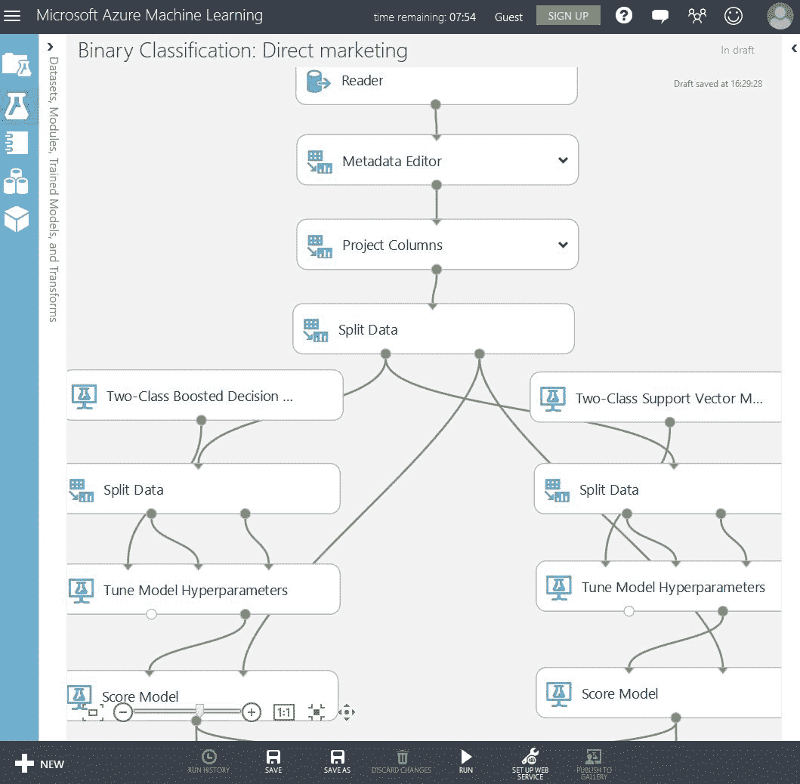
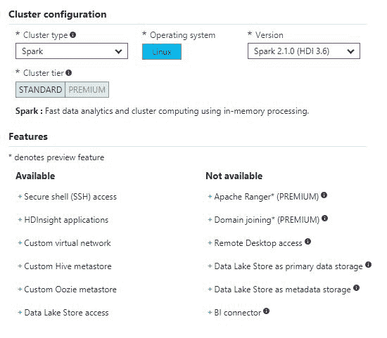
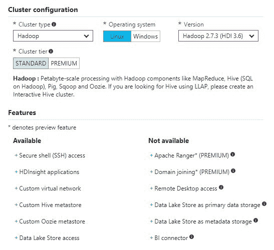
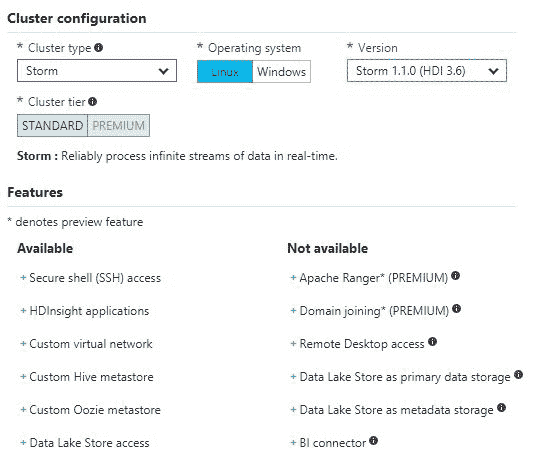

# 十二、前方的路

这一章总结了你在这本书里学到的东西。它刷新了性能的主要原则，并提醒您应该始终保持务实。我们将回顾为什么你不应该仅仅为了优化而优化，为什么你应该总是衡量问题和结果。本章还介绍了一些更先进、更奇特的技术，如果您需要更快的速度或者是一个认真的性能爱好者，您可能会考虑学习这些技术。

本章涵盖的主题包括以下内容:

*   前几章的摘要
*   本地工具链
*   可选的中央处理器架构，如 ARM
*   高级硬件(图形处理器、FPGAs 和专用集成电路)
*   机器学习和人工智能
*   大数据和 MapReduce
*   奥尔良虚拟演员模型
*   自定义传输层
*   高级散列函数
*   库和框架支持
*   ASP.NET Core的未来

我们将通过刷新您对前几章课程的记忆来强化如何评估和解决性能问题。您还将了解其他可帮助您提供高性能的先进技术，您可能希望进一步研究这些技术。最后，我们将强调库和框架支持什么.NET Core 和 ASP.NET Core，我们将尝试假设这些令人兴奋的平台未来可能的发展方向。

# 回顾我们学到的东西

让我们简要回顾一下本书前面的内容。

在[第 1 章](01.html)*ASP.NET Core 2 有什么新进展？，*我们介绍了与第一个主要版本相比，ASP.NET Core 第二个版本发生了哪些变化，并重点介绍了 C# 6.0 和 C# 7.0 中提供的一些新功能。然后，在[第二章](02.html)、*为什么性能是一个特性*中，我们讨论了这本书的基本前提，并向您展示了为什么您需要关心软件的性能。在[第 3 章](03.html)、*设置您的环境中，*我们演示了如何在 Windows、macOS 和 Linux 上开始使用 ASP.NET Core。

在[第 4 章](04.html)*测量性能瓶颈*中，我们向您展示了解决性能问题的唯一方法是仔细测量您的应用。然后，在[第 5 章](05.html)、*修复常见性能问题*中，我们查看了一些最常见的性能错误以及如何修复它们。

在此之后，我们在[第 6 章](06.html)、*解决网络性能*中进行了更深入的探讨，并深入到了支撑所有网络应用的网络层。然后，在[第 7 章](07.html)、*优化输入/输出性能*中，我们重点讨论了输入/输出以及这对性能的负面影响。

在[第 8 章](08.html)、*理解代码执行和异步操作*中，我们跳到了错综复杂的 C#代码中，研究了它的执行如何改变性能。然后在[第九章](09.html)、*学习缓存和消息队列*中，我们初步看了缓存，大家普遍认为缓存相当难。然后，我们研究了消息队列作为一种构建分布式可靠系统的方法。

在[第 10 章](10.html)*性能增强工具*的缺点中，我们集中讨论了我们之前讨论过的技术的缺点，因为没有什么是免费的。然后在[第 11 章](11.html)、*监控性能回归*中，我们再次查看了测量性能，但是在这种情况下，从自动化、**持续集成** ( **CI** )和 DevOps 的角度来看。

# 进一步阅读

如果你已经读了这么多，那么你可能会想要一些其他东西的指针来研究和阅读。在本章的剩余部分，我们将突出一些有趣的主题，您可能想进一步研究，但我们无法在本书中完全涵盖。你也可以访问作者的网站(在[https://unop.uk/](https://unop.uk/))获取更多话题的报道。

# 土生土长

老 ASP.NET 的问题之一是它真的很慢，这就是为什么 ASP.NET Core的主要指导原则之一是性能。已经取得了令人印象深刻的进展，但是还有很多进一步增强的机会。

最有希望的领域之一是本地工具链，不幸的是，它被延迟了。但是，应该在之后发货.NET Core 2.0，并且它已经在 Windows 商店上用于 UWP 应用。这不同于中已有的自包含发布和交叉编译.NET Core，因为它编译成机器本地的二进制文件，而不是可移植的 IL 指令。

以前，如果您想从托管调用非托管本机代码.NET 代码，您将不得不使用**平台调用** ( **PInvoke** ，但这有性能开销和安全问题。即使您的原生代码更快，开销通常意味着它不值得操心。

本地工具链应该提供本地级别的性能，但是要有托管运行时的安全性和便利性。超前编译很吸引人，也很有技术含量，但结果是，如果我们知道目标体系结构，那么它可以提供性能提升。我们也可以用更慢的编译来换取更快的执行，因为它不必在运行时发生。

还可以针对可能提供特殊性能特性和指令的不同处理器进行优化，例如，瞄准低能耗 ARM 芯片，而不是通常的英特尔风格处理器。

# 处理器架构

通常，在编写桌面或服务器软件时，您会以基于英特尔的体系结构(如 x86 或 x64)为目标。然而，基于 ARM 的芯片越来越受欢迎，它们可以提供惊人的能效。如果软件是专门为他们优化的，那么他们也可以提供出色的性能。

例如，用于教授计算的 **Scratch** 图形编程语言已经针对树莓 Pi 3 进行了优化，现在它的运行速度大约是英特尔Core i5 的两倍。其他软件应用也针对 ARM 处理器进行了优化，例如 Kodi 开源媒体播放器。

ARM Holdings 只是一家知识产权公司，他们自己不生产任何处理器。其他公司，如苹果和博通，许可设计或架构，并制造他们的片上系统产品。

这意味着有许多不同的芯片可以使用，它们运行 ARM 架构和指令集的多个版本。除非您选择特定的平台，否则这种碎片化会使支持变得更加困难。

**Windows 10 IoT(物联网)核心**运行在树莓 Pi(版本 2 和 3)上，可以使用标准的**新开箱软件** ( **NOOBS** )安装程序进行设置。Windows 10 IoT Core 不是一个运行普通应用的完整桌面环境，但它确实允许您制作硬件项目，并使用 C#和. NET 对其进行编程。但是，对于 web 应用，您会希望运行。一个 Linux 发行版上的 NET Core，比如 Raspbian(主树莓 Pi OS，基于 **Debian** )。

# 硬件很难

我们之前在[第 8 章](08.html)、*理解代码执行和异步操作*中提到了可以用于计算的附加硬件，包括**图形处理单元** ( **图形处理器**)、**现场可编程门阵列**(**FPGA**)和**专用集成电路** ( **专用集成电路**)。

这些设备不仅可以用于特定的处理任务，还可以用于存储。例如，如果主内存耗尽，您可以从图形处理器借用内存。然而，这种技术不再像过去内存更有限时那样需要了。

你可能听说过随机存取存储器，这是一种使用标准随机存取存储器作为永久存储的存储器(带有备用电池)。然而，随着固态硬盘(基于闪存)速度的提高和容量的增加，这些变得不那么重要，以至于在许多常见任务中取代了机械驱动器。

您仍然可以购买高性能存储区域网络，但它们可能基于闪存而不是内存。如果你使用内存作为你的主存储器(例如，使用 Redis)，那么使用**纠错码** ( **ECC** )内存是很重要的。ECC 内存更贵，但更适合服务器使用。然而，一些云实例不使用它，或者很难找到它是否被提供，因为它没有在规范中列出。如果没有这些，你很可能会逃脱惩罚，因为在现实中，腐败是非常罕见的，但是你仍然应该有和解的程序来抓住这些和其他错误。

定制计算硬件的一个应用是**机器学习** ( **ML** )，特别是 ML 的使用多级神经网络的深度学习分支。近年来，这项技术取得了令人印象深刻的进步，这导致了自动驾驶汽车等事物的出现。ML 应用可以很好地利用非 CPU 处理，尤其是 GPU，NVIDIA 提供了许多工具和库来帮助实现这一点。

谷歌构建了一个定制的专用集成电路，称为张量处理单元，以加速他们的张量流机器学习库和云服务。你可以在[https://www.tensorflow.org/](https://www.tensorflow.org/)和[https://cloud.google.com/ml-engine/](https://cloud.google.com/ml-engine/)了解更多。

# 机器学习

不仅可以用**人工智能** ( **AI** )代替司机等工作，比如呼叫中心工作人员甚至一些医生的任务，还可以在自己的 web 应用中使用一些基本的 ML 提供与客户相关的产品建议或者分析营销效果，就像亚马逊或者网飞做的那样。

你甚至不需要自己构建 ML 系统，因为你可以使用 **Azure ML** 这样的云服务。这允许您使用图形拖放界面来构建您的 ML 系统，尽管您也可以使用 Python 和 r。

你仍然需要了解一点数据科学，比如二进制分类和训练数据的基本原理，但即使这样，它也大大降低了进入的障碍。然而，如果你想充分探索 ML 和大数据的可能性，那么你可能需要一个专门的数据科学家。

你可以在[https://studio.azureml.net/](https://studio.azureml.net/)试用 Azure ML，甚至不需要注册。下面的截图显示了一个类似的例子:

如果你不想为自己构建一个推荐引擎，那么在 Azure 中有一个现成的推荐 API。Azure 还提供用于面部和语音识别、情感和情绪分析、内容调节、文本/语音翻译等的 API。其中一些系统中的模型已经在大量数据上进行了训练，因此可以在不构建自己的语料库的情况下使用它们。

# 大数据和 MapReduce

如今，大数据可能是一个被过度使用的术语，有时被描述为大的东西通常更像是中等数据。大数据是指当你有太多的信息，很难在一台机器上处理，甚至存储。传统的方法经常随着大数据而崩溃，因为它们不适用于当今常见的自动获取的巨大数据集。例如，物联网传感器或我们与在线服务的交互不断收集的数据量可能非常大。

大数据和最大似然的一个警告是，尽管它们擅长在大数据点集中寻找相关性，但你不能用它们来寻找原因。您还需要注意数据隐私问题，并非常小心，不要在某人采取行动之前就对其做出判断，而只是基于预测的倾向。

Anonymizing data is incredibly difficult and is not nearly as simple as removing personal contact details. There have been many cases of large "*anonymized"* datasets being released, where individuals were later easily identified from the records.

一种对分析大数据有用的技术是 **MapReduce** ，这是一种简化操作的方法，适合在分布式基础设施上并行运行。MapReduce 的一个流行实现是 Apache Hadoop，您可以在 Azure 中使用它和 **HDInsight** ，它也支持相关工具，包括 Apache Spark 和 Apache **Storm** 。处理大型数据集的其他选项包括谷歌的云大表或**大查询**。

您可以在门户中看到 Azure HDInsight 的可用选项。火花如下图所示:

从这个截图可以看出，Spark 只在 Linux 上可用。Hadoop 更加成熟，也可以在 Windows 上使用，如下图所示:

下一张截图显示，Storm 也可用，但不在高级集群层(与 Spark 相同):

You can read more about HDInsight at [https://docs.microsoft.com/en-us/azure/hdinsight/](https://docs.microsoft.com/en-us/azure/hdinsight/) .

# 奥尔良

另一个有趣的项目是来自微软的一个名为 **Orleans** 的开源框架，这是一个分布式虚拟演员模型，用于为一些 Halo Xbox 游戏的云服务提供动力。这意味着，如果您通过将逻辑分成独立的参与者来构建您的系统，这将允许它根据需求轻松扩展。

在奥尔良，演员被称为谷物，你可以通过从接口继承来用 C#编写他们。然后由一个名为**筒仓**的奥尔良服务器执行。谷物可以保存到存储器中，如 SQL 或 **Azure Tables** ，以保存其状态并在以后重新激活。奥尔良还可以利用债券串行化器提高效率。

不幸的是，奥尔良目前不支持.NET Core。计划支持奥尔良 2.0 版本，这是目前正在进行的工作。奥尔兰允许你用低延迟编写简单且可扩展的系统，你可以在[http://dotnet.github.io/orleans/](http://dotnet.github.io/orleans/)阅读更多。

# 定制运输

在[第 6 章](06.html)、*寻址网络性能*中，我们从介绍 TCP/IP 开始，简要提到了**用户数据报协议** ( **UDP** )。我们还介绍了**传输层安全性** ( **TLS** )加密以及如何在获得性能优势的同时最大限度地降低安全连接的影响。

UDP 比**传输控制协议** ( **TCP** )更简单快捷，但是你要么不需要关心可靠的交付(多人游戏和语音/视频聊天)，要么建立自己的层来提供这一点。在[第 10 章](10.html)*性能增强工具*的缺点中，我们重点介绍了 **StatsD** ，它使用 UDP 来避免登录远程中央服务器时的阻塞延迟。

如果您不局限于浏览器，那么 TLS 还有其他选择，但是如果您正在开发一个 web 应用，这可能只适用于您的服务器基础结构。例如，除了端到端加密的信号协议之外，WhatsApp 消息应用还在智能手机应用及其服务器之间使用来自噪声协议框架([【http://noiseprotocol.org/】](http://noiseprotocol.org/))的**噪声管道**和曲线 25519。

使用噪声管道代替 TLS 可以提高性能，因为建立连接所需的往返次数更少。另一个具有类似优势的选项是**安全管道守护程序**(**spid**，由安全 Linux/BSD 备份软件 **Tarsnap** 使用和创建。但是，您确实需要预共享密钥，但是您可以在[http://www.tarsnap.com/spiped.html](http://www.tarsnap.com/spiped.html)了解更多信息。

# 高级哈希

我们在这本书里对散列函数做了相当多的介绍，尤其是在[第 8 章](08.html)、*理解代码执行和异步操作*中。这个领域在不断发展，关注未来，看看未来会发生什么是很有用的。虽然今天使用 SHA-2 家族的成员进行快速散列和使用 PBKDF2 进行慢速(密码)散列是合理的，但这不太可能总是这样。

对于快速散列，有一个新的算法家族叫做 **SHA-3** ，不应该与 SHA-384 或 SHA-512(都属于 SHA-2 家族)混淆。SHA-3 基于一个名为 Keccak 的算法，该算法是为新标准寻找合适算法的竞赛的获胜者。其他入围的还有 Skein([http://skein-hash.info/](http://skein-hash.info/))和 BLAKE2([http://blake2.net/](http://blake2.net/))，比 MD5 快但实际上很安全。

一个名为 Argon2 的算法赢得了类似的密码散列比赛(http://password-hashing.net/)。要了解这一点的重要性，您可以访问[https://haveibeenpwned.com/](https://haveibeenpwned.com/)(顺路.NET 安全大师特洛伊·亨特)查看您的详细信息是否是大量数据泄露之一。例如，LinkedIn 被攻破，没有使用安全密码哈希(只有一个未加密的 SHA-1 哈希)。因此，大多数纯文本密码被破解和恢复。因此，如果 LinkedIn 帐户密码在其他网站上被重复使用，那么这些帐户可以被接管。

使用密码管理器并为每个站点创建强唯一的密码是一个非常好的主意。如果可用，使用双因素身份验证(有时也称为两步验证)也是有益的。例如，除了密码之外，您还可以通过智能手机应用输入代码来实现这一点。这对电子邮件帐户特别有用，因为它们通常可以用于恢复其他帐户。

# 库和框架支持

发生了一些重大变化。1.0 和 2.0 版本之间的. NET Core 和 ASP.NET Core。明智的是，许多流行的库和框架正在等待.NET 标准 2.0，在添加支持之前。

显然，一本书不是跟上变化的好地方，所以作者建立了一个 GitHub 存储库来显示最新的兼容性信息。您可以在[http://anclafs.com/](http://anclafs.com/)找到*ASP.NET Core库和框架支持*列表。

如果您想更新任何内容或添加库或框架，请发送拉取请求。该存储库位于[https://github.com/jpsingleton/ANCLAFS](https://github.com/jpsingleton/ANCLAFS)，它包括许多有用的工具、库、框架等等。我们在本书前面提到了其中的许多，下面的示例只是所列内容的一小部分，因为包支持会随着时间的推移而增长:

*   Scientist.NET
*   功能切换
*   MiniProfiler
*   一瞥
*   前缀
*   衣冠楚楚的
*   很简单。数据
*   英孚核心
*   杭火
*   图像调整器
*   动态图像
*   ImageSharp
*   RestBus
*   EasyNetQ
*   rabbitmq 客户端
*   公共交通
*   高层货架
*   南茜
*   奥尔良

# 今后

一句经常被认为是物理学家尼尔斯·玻尔的名言如下:

Prediction is very difficult, especially about the future.

然而，无论如何，我们将从更简单的部分开始。官方的 ASP.NET Core路线图列出了 2.1 版的 SignalR 支持。SignalR 正在被重写，因为从大规模部署中学到了很多经验，需要改进。

还有持续的进步.NET 标准规范，创建该规范是为了增强.NET Core.NET 框架和 Mono。例如，.NET Core 2.0 和.NET 框架 4.6.1 都实现了.NET 标准 2.0。这意味着在任一中编写的项目都可以使用遵循.NET 标准 2.0 规范。作为.NET Standard 2.0 现已最终确定，API 表面积的任何增加都将使用更高的版本号。那个.NET 标准类似于 HTML5 规范，由不同的浏览器在不同程度上实现。除非您正在编写一个库或一个 NuGet 包，否则您可能不需要太担心这个问题。如果是，请参考[https://docs . Microsoft . com/en-GB/dotnet/standard/net-standard](https://docs.microsoft.com/en-gb/dotnet/standard/net-standard)的文档。

你可能想知道为什么。. NET 4.7 目前没有在.NET 标准文档。预计这种情况将会改变，各种框架将继续趋同。但是，您可能不想过早升级到新版本，因为新版本中有一些严重的错误。例如，4.6 中有一个令人讨厌的错误，它将错误的值传递给了方法参数。4.6.2 中还有一个可怕的错误，最大年龄头被设置为一个巨大的值，这可能导致资产被缓存在代理中超过 2000 年！热修复(或质量更新)通常是针对这些问题发布的，所以请确保您掌握了这些问题，而不要仅仅依赖于版本号。

从语言的角度来看，C# 7.1 和 7.2 提供了一些小的改进，8.0 将包含一些更大的新特性。其目的是添加一些高性能、低级别的代码特性，用于优化游戏和其他对性能敏感的操作。这些是你以前不得不使用不安全代码的事情，计划是让它们使用起来安全但仍然快速。其他需要包含的语言特性是接口的默认实现，在 Java 和 Swift 中都有。这允许您在不破坏实现接口的所有类的情况下更新接口。这也使得从 Xamarin 到安卓和 iOS 平台 API 的映射更加清晰。C# 7.1 允许一个`async`主方法，在未来，你可能也可以`await`一个`foreach`循环或者`using`语句。最终列表可能会有变化，所以在更近的时间查看 GitHub([https://github.com/dotnet/csharplang](https://github.com/dotnet/csharplang))上的 C#语言设计库，甚至参与进来。

微软曾表示，会听取用户反馈，用它来推动平台的方向，所以你有话语权。他们还使用从软件开发工具包工具中收集的遥测数据来决定平台支持，并定期发布一些数据。由于代码都是开源的，您可以通过添加您想要的功能来帮助塑造未来。F#的大部分开发来自社区，看到它在 ASP.NET Core 和相关工具中得到更好的支持将是件好事。例如，FSharp。数据网络抓取工具是一个社区贡献。看看 GitHub，跳进去。

更远的未来更难预测，但微软已经有了源源不断的开源项目，从早期的 ASP.NET MVC 到跨平台应用开发的 Xamarin 框架。XAML 标准正在成形，一个适用于所有主要桌面和移动操作系统的通用用户界面框架前景诱人。

使用 C#和是一个令人兴奋的时刻.NET，尤其是如果你想从 web 开发中扩展。Unity 游戏引擎是.NET 基础，在**虚拟现实** ( **VR** )和**增强现实** ( **AR** )硬件方面也有一些有趣的发展。例如，微软 Hololens、Oculus Rift、三星 Gear VR 和 HTC Vive 都比几十年前问世的基本 VR 好得令人难以置信。

这也是一个关注物联网的好时机，尽管它可能仍在寻找它的杀手级应用，但它有如此多廉价和强大的硬件可供使用。一个树莓皮零瓦只要 10 美元，带摄像头接口和 WiFi/蓝牙。有了像树莓 Pi 3 这样的电脑，它提供了几乎桌面级的性能和 35 美元的 WiFi/蓝牙，任何人现在都可以很容易地学会编码(也许用 C#或.NET)并制作东西。

以下是艾伦·凯的智慧:

The best way to predict the future is to invent it.

所以，快去吧！一定要分享你所做的事情。

# 摘要

我们希望您喜欢这本书，并学习了如何使您的网络应用性能良好且易于维护，尤其是当您使用 C#、ASP.NET Core和时.NET Core。我们试图保留尽可能多的适用于一般 web 应用开发的建议，同时温和地向您介绍来自微软和其他公司的最新开源框架。

很明显，像这样的话题变化很快，所以保持在线关注更新。希望这本书里的很多课都是好主意，在未来很长一段时间里它们仍然是明智的。

永远记住，为了自身而优化是没有意义的，除非它是一个学术练习。你需要衡量和权衡利弊；否则，你可能会让事情变得更糟。很容易让事情变得更复杂，更难理解，更难维护，或者所有这些。

将这些务实的绩效理念灌输到团队文化中很重要，否则团队不会一直坚持这些理念。不过，最重要的是，记得还是要玩得开心！