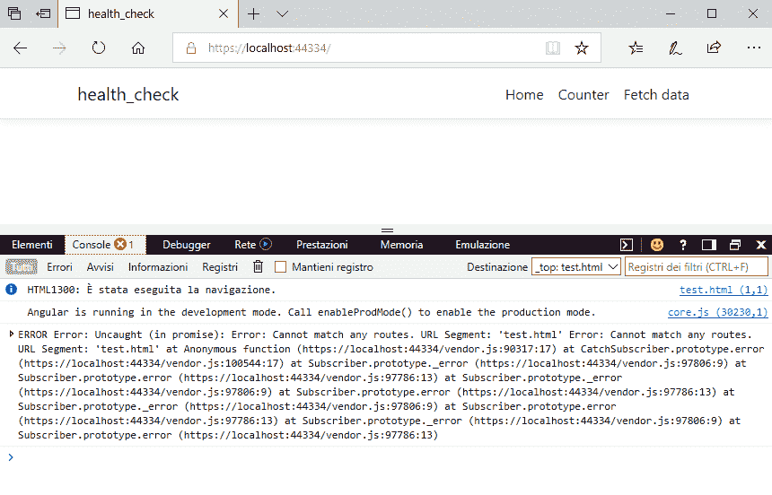
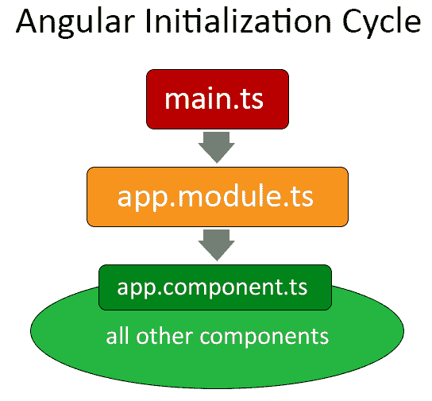
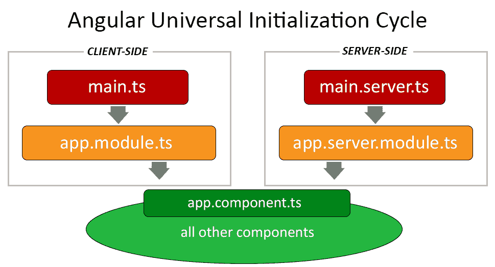
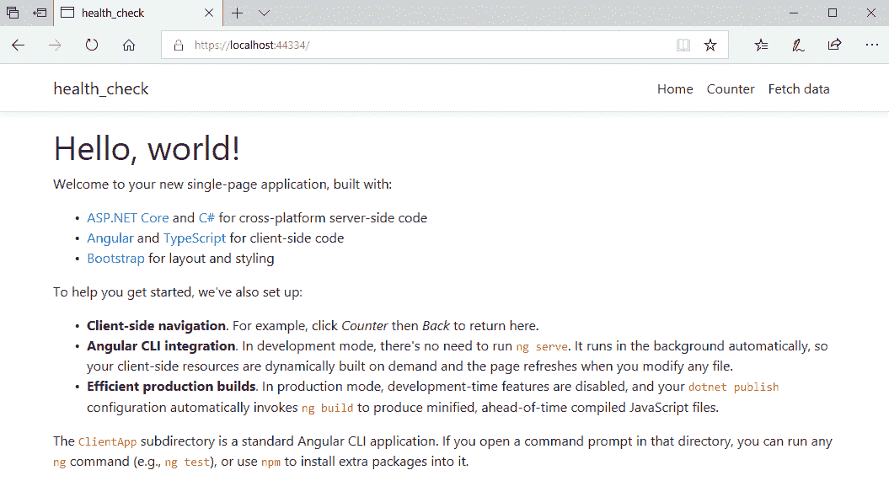
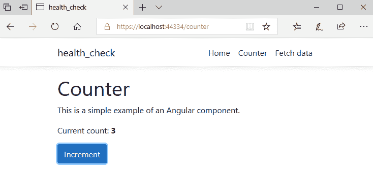
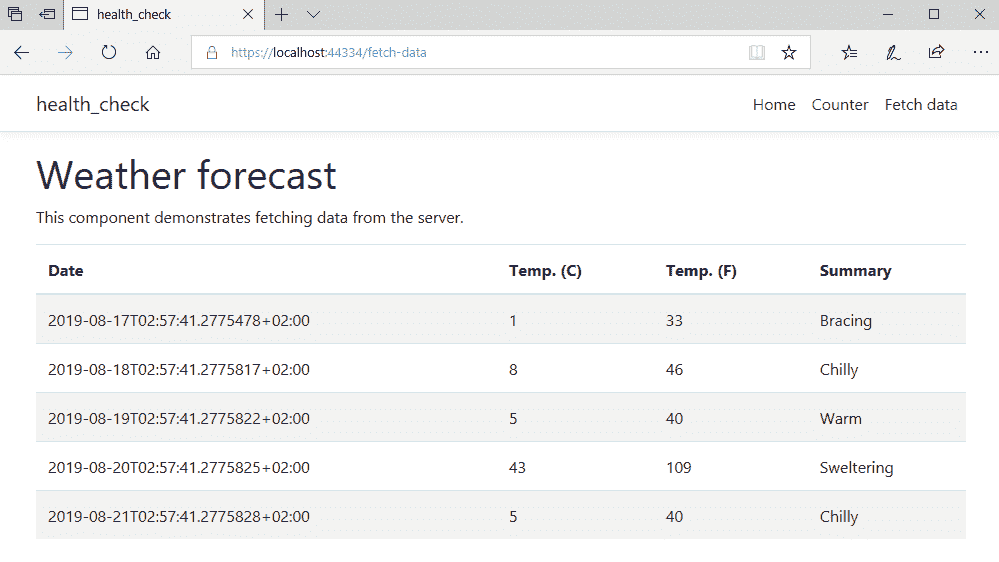
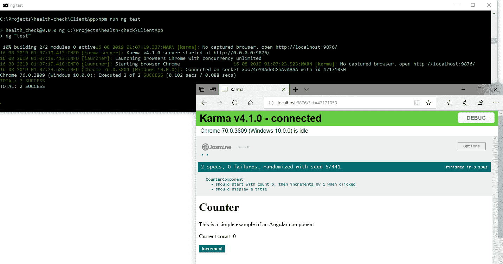
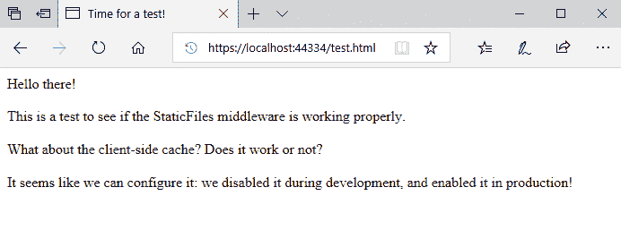
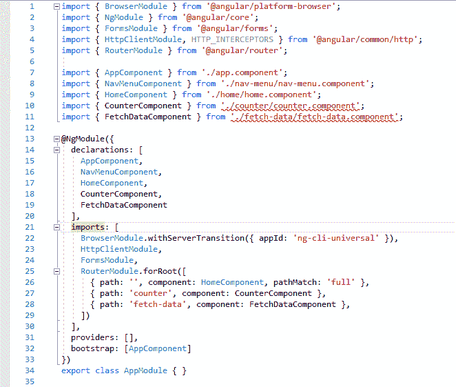
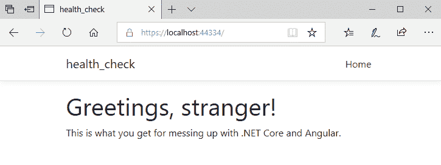

# 二、环顾四周

现在我们的项目已经创建，现在是时候快速浏览一下，并尝试了解.NET Core SPA 模板为使其工作所做的一些艰苦工作。

<q>……嘿，等一下！我们不应该跳过所有这些设置技术细节，直接开始编码吗？</q>

事实上，是的，我们肯定会在一段时间内这样做。然而，在这样做之前，明智的做法是强调已经到位的代码的几个方面，这样我们就知道如何在我们的项目中提前有效地移动：在哪里找到*服务器端*和*客户端*代码，在哪里放置新内容，如何更改初始化参数，等等。这也是一个很好的机会来回顾我们对 VisualStudio 环境的基本知识以及我们需要的软件包。

这正是我们在本章要做的。更准确地说，以下是我们将要讨论的主要主题：

*   **解决方案概述**：我们将要处理的内容的高层总结
*   **.NET 核心后端**：Razor 页面、控制器、配置文件等
*   **Angular前端**：工作区、`ClientApp`文件夹、Angular初始化周期等
*   **开始工作**：缓存概念，移除一些我们不再需要的.NET 控制器和Angular组件*等等*

*IMPORTANT! The sample code we're reviewing here is the code that comes with the default Angular SPA Visual Studio template shipped by .NET Core SDK 3.1 at the time of writing—the one created with the `dotnet new angular` command. In the (likely) event that this sample code is updated in future releases, ensure you get the former source code from the web using this book's official NuGet repository and use it to replace the contents of your project folder. Caution: failing to do that could result in you working with different sample code from the code featured in this book.

# 技术要求

在本章中，[第 1 章](01.html)*准备就绪*中列出的所有先前技术要求将适用，无需额外资源、库或包。

本章代码文件可在此处找到：[https://github.com/PacktPublishing/ASP.NET-Core-3-and-Angular-9-Third-Edition/tree/master/Chapter_02/](https://github.com/PacktPublishing/ASP.NET-Core-3-and-Angular-9-Third-Edition/tree/master/Chapter_02/) 。

# 解决方案概述

首先引人注目的是，正如我们已经提到的，标准 ASP.NET 核心解决方案的布局与 ASP.NET 4 和早期版本中的布局大不相同。但是，如果我们已经有了一些 ASP.NET MVC 的经验，我们应该能够区分.NET 核心*后端*部分和Angular*前端*部分，并找出这两个方面是如何相互作用的。

.NET 核心*后端*堆栈包含在以下文件夹中：

*   `Dependencies`虚拟文件夹，基本上取代了旧的`Resources`文件夹，包含构建和运行项目所需的所有内部、外部和第三方引用。我们将添加到项目中的所有对 NuGet 包的引用也将放在那里。
*   `/Controllers/`文件夹，自上一版本的 MVC 框架以来，它已随任何基于 MVC 的 ASP.NET 应用一起提供。
*   `/Pages/`文件夹，其中包含一个 Razor 页面*-*`Error.cshtml`-用于处理运行时和/或服务器错误（稍后将详细介绍）
*   根级别的文件-`Program.cs`、`Startup.cs,`和`appsettings.json`-将决定我们的 web 应用的配置，包括模块和中间件、编译设置和发布规则；我们将在一段时间内解决所有问题。

角型*前端*包含以下文件夹：

*   `/wwwroot/`文件夹，其中将包含已编译的*准备发布*我们应用的内容：HTML、JS 和 CSS 文件，以及字体、图像以及我们希望用户能够访问的**静态文件**的所有其他内容。
*   `/ClientApp/`根文件夹，它承载 Angular（和 package manager）配置文件，以及几个重要的子文件夹，我们将对这些子文件夹进行概述。
*   `/ClientApp/src/`文件夹，其中包含 Angular 应用源代码文件。如果我们观察它们，我们可以看到它们都有一个`.ts`扩展，这意味着我们将使用**类型脚本**编程语言（稍后我们将对此进行详细介绍）。
*   使用*量角器*测试框架构建的`/ClientApp/e2e/`文件夹，包含一些样本**端到端**（**E2E**）测试。

让我们快速回顾一下此结构中最重要的部分。

# NET 核心后端

如果您来自 ASP.NET MVC 框架，您可能想知道为什么此模板不包含`/Views/`文件夹：我们的 Razor 视图到哪里去了？

事实上，此模板不使用视图。如果我们仔细想想，原因很明显：**单页应用**（**SPA**）也可以去掉它们，因为它们只能在一个 HTML 页面中运行一次。在这个模板中，这样的页面就是`/ClientApp/src/ folder/index.html`文件，我们可以清楚地看到，它也是一个静态页面。此模板提供的唯一*服务器端-*呈现 HTML 页面是`/Pages/Error.cshtml`Razor 页面，用于处理Angular引导阶段之前*可能发生的运行时和/或服务器错误。*

# 剃须刀页面

那些从未听说过剃须刀页面的人应该花 5-10 分钟看看下面的指南，其中解释了它们是什么以及它们是如何工作的：[https://docs.microsoft.com/en-us/aspnet/core/razor-pages/.](https://docs.microsoft.com/en-us/aspnet/core/razor-pages/)

简而言之，Razor 页面是在.NET Core 2.0 中引入的，代表了实现 ASP.NET Core MVC 模式的另一种方式。Razor 页面非常类似于 Razor 视图，具有相同的语法和功能，但它还包含控制器源代码，该源代码放在一个单独的文件中：这些文件与带有附加扩展名的页面共享相同的名称。

为了更好地显示 Razor 页面的`**.**cshtml`和`.cshtml.cs`文件之间的*依赖关系*，Visual Studio 方便地将后者嵌套在前者中，如下面的屏幕截图所示：


<q>……嘿，等一下：我以前在哪里看过这部电影？</q>

是的，这确实敲响了警钟：作为标准 MVC*控制器+视图*方法的精简版，Razor 页面与旧的`.aspx`+`.aspx.cs`ASP.NET Web 表单非常相似。

# 控制器

如果剃须刀页面包含控制器，为什么我们还有一个`/Controller/`文件夹？原因很简单：并不是所有的控制器都要服务于*服务器呈现的*HTML 页面（或视图）。例如，它们可以输出 JSON 输出（RESTAPI）、基于 XML 的响应（SOAPWeb 服务）、静态或动态创建的资源（JPG、JS 和 CSS 文件），甚至是没有内容体的简单 HTTP 响应（如 HTTP 301 重定向）。

事实上，Razor 页面最重要的优点之一是，它们允许在服务标准 HTML 内容的内容（我们通常称之为*页面-*和 HTTP 响应的其余部分之间*解耦*，HTTP 响应的其余部分可以松散地定义为*服务 API*。我们的.NET Core+Angular 模板完全支持这种划分，它提供了两个主要好处：

*   **关注点分离**：使用页面将强制分离我们如何加载*服务器端*页面（1%）和我们如何提供 API（99%）。所显示的百分比对于我们的特定场景是有效的：我们将遵循 SPA 方法，这是关于服务和调用 Web API 的。
*   **单一责任**：每个剃须刀页面都是*独立的*，因为它的视图和控制器是相互交织、组织在一起的。这遵循了*单一责任原则*，这是一种计算机编程良好实践，建议每个模块、类或函数应对软件提供的功能的单个部分负责，并且该责任也应完全由该类封装。

通过确认所有这些，我们已经可以推断，`/Controllers/`文件夹中包含的单个样本`WeatherForecastController`是用来公开一组 Web API 的，这些 API 将被Angular*前端*使用。要快速检查，点击*F5*以*调试*模式启动项目，并通过键入以下 URL 执行默认路由：`https://localhost:44334/WeatherForecast`。

The actual port number may vary, depending on the project configuration file: to set a different port for debug sessions, change the iisSettings | iisExpress | applicationUrl and/or iisSettings | iisExpress | sslPortvalues in the `Properties/launchSettings.json` file.

这将执行`WeatherForecastController.cs`文件中定义的`Get()`方法。通过查看源代码我们可以看到，这种方法有一个`IEnumerable<WeatherForecast>`返回值，这意味着它将返回一个`WeatherForecast`类型的对象数组。

如果将前面的 URL 复制到浏览器中并执行它，您应该会看到随机生成的数据的 JSON 数组，如以下屏幕截图所示：


不难想象谁会要求这些价值观。

# 配置文件

现在让我们看看根级别的配置文件及其用途：`Program.cs`、`Startup.cs`和`appsettings.json`。这些文件包含 web 应用的配置，包括模块和中间件、编译设置和发布规则。

至于`WeatherForecast.cs`文件，它只是一个强类型类，设计用于*反序列化`WeatherForecastController`返回的 JSON 对象，我们在上一节中已经看到了这一点：换句话说，它是一个**JSON 视图模型**——一个专为包含*反序列化的*而设计的视图模型 JSON 对象。在我们看来，模板作者应该把它放在`/ViewModel/`文件夹中（或者类似的东西），而不是放在根级别。不管怎样，我们暂时忽略它，因为它不是一个配置文件，我们只关注其余部分。*

# Program.cs

`Program.cs`文件很可能会引起大多数经验丰富的 ASP.NET 程序员的兴趣，因为它不是我们通常在 web 应用项目中看到的东西。首先在 ASP.NET Core 1.0 中引入，`Program.cs`文件的主要目的是创建一个`WebHostBuilder`，一个由.NET Core framework 用来设置和构建`IWebHost`的对象，它将承载我们的 web 应用。

# Web 主机与 Web 服务器

知道这个很好，但是什么是**w****eb 主机**？简而言之，*主机*是任何 ASP.NET 核心应用的执行上下文。在基于 web 的应用中，主机必须实现`IWebHost`接口，该接口公开了一组与 web 相关的特性和服务，以及一个`Start`方法。web 主机引用将处理请求的服务器。

前面的语句可能导致 web 主机和 web 服务器是同一事物的假设；然而，很重要的一点是要理解它们不是，因为它们的用途非常不同。简单地说，主机负责应用启动和生存期管理，而服务器负责接受 HTTP 请求。主机的部分责任包括确保应用的服务和服务器可用并正确配置。

我们可以将主机视为服务器的包装器：主机被配置为使用特定的服务器，而服务器不知道其主机。

有关 web 主机、`WebHostBuilder`类和`Setup.cs`文件用途的更多信息，请参阅以下指南：[https://docs.microsoft.com/en-us/aspnet/core/fundamentals/](https://docs.microsoft.com/en-us/aspnet/core/fundamentals/) 。

如果我们打开`Program.cs`文件并查看代码，我们可以很容易地看到`WebHostBuilder`是以一种非常简单的方式构建的，如下所示：

```cs
public class Program
{
  public static void Main(string[] args)
  {
    CreateWebHostBuilder(args).Build().Run();
  }

  public static IWebHostBuilder CreateWebHostBuilder(string[] args) =>
    WebHost.CreateDefaultBuilder(args)
      .UseStartup<Startup>();
}
```

`WebHost.CreateDefaultBuilder(args)`是在.NET Core 2 中引入的，它是对其 1.x 版本的一个重大改进，因为它简化了建立基本用例所需的源代码量，从而更容易开始新项目。

为了更好地理解这一点，让我们来看一看样本[0]的等价物，就像它在.NET 核心 1。

```cs
public class Program
{
    public static void Main(string[] args)
    {
        var host = new WebHostBuilder()
            .UseKestrel()
            .UseContentRoot(Directory.GetCurrentDirectory())
            .UseIISIntegration()
            .UseStartup<Startup>()
            .UseApplicationInsights()
            .Build();

            host.Run();
        }
    }
```

这用于执行以下步骤：

1.  设置`Kestrel`web 服务器
2.  设置内容根文件夹，即查找`appsettings.json`文件和其他配置文件的位置
3.  设置 IIS 集成
4.  定义要使用的`Startup`类（通常在`Startup.cs`文件中定义）
5.  最后，在现在配置的`IWebHost`上执行构建和运行

在.NET Core 1.x 中，所有这些步骤都必须在此处显式调用，并且在`Startup.cs`文件中手动配置；尽管.NETCore2 和 3 我们仍然可以做到这一点，但使用`WebHost.CreateDefaultBuilder()`方法通常更好，因为它可以处理大部分工作，并且可以随时更改默认值。

If you're curious about this method, you can even take a peek at the source code on GitHub: [https://github.com/aspnet/MetaPackages/blob/master/src/Microsoft.AspNetCore/WebHost.cs.](https://github.com/aspnet/MetaPackages/blob/master/src/Microsoft.AspNetCore/WebHost.cs)

At the time of writing, the `WebHost.CreateDefaultBuilder()` method implementation starts at line `#148`.

如我们所见，`CreateWebHostBuilder`方法以对`UseStartup<Startup>()`的链式调用结束，以指定 web 主机将使用的启动类型。这个类型是在`Startup.cs`文件中定义的，这就是我们要讨论的。

# Startup.cs

如果您是一名经验丰富的.NET 开发人员，您可能已经熟悉了`Startup.cs`文件，因为它最初是在基于 OWIN 的应用中引入的，用来取代以前由好的老`Global.asax`文件处理的大部分任务。

**Open Web Interface for .NET** (**OWIN**) comes as part of project **Katana**, a flexible set of Components released by Microsoft back in 2013 for building and hosting OWIN-based web applications. For additional info, refer to [https://www.asp.net/aspnet/overview/owin-and-katana](https://www.asp.net/aspnet/overview/owin-and-katana).

然而，相似之处到此为止；该类已被完全重写为尽可能的可插拔和轻量级，这意味着它将只包含和加载完成应用任务所必需的内容。

更具体地说，在.NET Core 中，`Startup.cs`文件是我们可以执行以下操作的地方：

*   在`ConfigureServices()`方法中添加并配置服务和依赖注入
*   通过在`Configure()`方法中添加所需的*中间件*来配置 HTTP 请求管道

为了更好地理解这一点，让我们来看看下面的代码，这些代码是从我们选择的项目模板中导出的。

```cs
// This method gets called by the runtime. Use this method to
// configure the HTTP request pipeline.
public void Configure(IApplicationBuilder app, IWebHostEnvironment env)
{
    if (env.IsDevelopment())
    {
        app.UseDeveloperExceptionPage();
    }
    else
    {
        app.UseExceptionHandler("/Error");
        // The default HSTS value is 30 days. 
        // You may want to change this for production scenarios, 
        // see https://aka.ms/aspnetcore-hsts.
        app.UseHsts();
    }

    app.UseHttpsRedirection();
    app.UseStaticFiles();
    if (!env.IsDevelopment())
    {
        app.UseSpaStaticFiles();
    }

    app.UseRouting();

    app.UseEndpoints(endpoints =>
    {
        endpoints.MapControllerRoute(
            name: "default",
            pattern: "{controller}/{action=Index}/{id?}");
    });

    app.UseSpa(spa =>
    {
        // To learn more about options for serving an Angular SPA 
        // from ASP.NET Core,
        // see https://go.microsoft.com/fwlink/?linkid=864501

        spa.Options.SourcePath = "ClientApp";

        if (env.IsDevelopment())
        {
            spa.UseAngularCliServer(npmScript: "start");
        }
    });
}

```

这是`Configure()`方法实现，正如我们刚才所说，我们可以在这里设置和配置 HTTP 请求管道。

代码可读性很强，因此我们可以轻松理解此处发生的情况：

*   第一组行具有一个`if-then-else`语句，该语句实现了两种不同的行为来处理开发和生产中的运行时异常，在前一种情况下抛出异常，在后一种情况下向最终用户显示不透明的错误页面；这是一种用很少几行代码处理运行时异常的简洁方法。
*   紧接着，我们可以看到第一块中间件：`HttpsRedirection`，用于处理 HTTP 到 HTTPS 的重定向；`StaticFiles`，为`/wwwroot/`文件夹下的静态文件提供服务；和`SpaStaticFiles`，为`/ClientApp/src/img/`文件夹（Angular 应用的`assets`文件夹）中的静态文件提供服务。如果没有最后两个中间件，我们将无法为本地托管的资产（如 JS、CSS 和图像）提供服务；这就是他们在管道中的原因。另外，请注意这些方法是如何在没有参数的情况下调用的：这只意味着它们的默认设置对我们来说已经足够了，所以这里没有任何配置或覆盖
*   在三个包之后，就是`Endpoints`中间件，它将添加所需的路由规则，以将某些 HTTP 请求映射到我们的 Web API 控制器。我们将在接下来的章节中详细讨论这一点，届时我们将讨论*服务器端*路由方面；现在，我们只需要了解一个活动映射规则，它将*捕获*所有类似于*控制器*名称（和/或可选*动作*名称和/或可选 ID`GET`参数）的 HTTP 请求，并将它们路由到该控制器。这正是我们能够从 web 浏览器调用`WeatherForecastController.Get()`方法并接收结果的原因。
*   最后但并非最不重要的是`UseSpa`中间件，它通过两个配置设置添加到 HTTP 管道中。第一个很容易理解：它只是 Angular 应用根文件夹的源路径。在这个模板的场景中，它是`/ClientApp/`文件夹。第二个只在开发场景中执行，要复杂得多：简单地说，`UseAngularCliServer()`方法告诉.NET Core 将所有发往 Angular 应用的请求传递给 Angular CLI 服务器的内存实例：这对于开发场景非常有用，因为我们的应用将始终提供最新的 CLI 构建资源，而无需每次手动运行 Angular CLI 服务器；同时，由于额外的开销和明显的性能影响，它对于生产场景并不理想。

It's worth noting that middlewares added to the HTTP pipeline will be processed in registration order, from top to bottom; this means that the `StaticFile` middleware will take priority over the `Endpoint` middleware, which will take place before the `Spa` middleware, and so on. Such behavior is very important and could cause unexpected results if taken lightly, as shown in the following StackOverflow thread:
[https://stackoverflow.com/questions/52768852/](https://stackoverflow.com/questions/52768852/).

让我们进行一个快速测试，以确保我们正确了解这些中间件的工作原理：

1.  从 VisualStudio 的解决方案资源管理器中，转到`/wwwroot/`文件夹，并将新的`test.html`页面添加到我们的项目中。
2.  完成后，填写以下内容：

```cs
<!DOCTYPE html>
<html>
<head>
 <meta charset="utf-8" />
 <title>Time for a test!</title>
</head>
<body>
 Hello there!
 <br /><br />
 This is a test to see if the StaticFiles middleware is 
 working properly.
</body>
</html>
```

现在，让我们使用 Run 按钮或*F5*键盘键在*调试*模式下启动应用，并将地址栏指向以下 URL:`https://localhost:44334/test.html`。

Again, the TCP/IP port number may vary: edit the `Properties/launchSettings.json` file if you want to change it.

我们应该能够看到我们的`test.html`文件，如下面的屏幕截图所示：


根据我们刚才了解到的情况，我们知道这个文件是通过`StaticFiles`中间件提供的。现在让我们回到我们的`Startup.cs`文件，注释掉`app.UseStaticFiles()`调用，以防止加载`StaticFiles`中间件：

```cs
app.UseHttpsRedirection();
// app.UseStaticFiles();
app.UseSpaStaticFiles();
```

完成后，再次运行应用并尝试返回到上一个 URL，如以下屏幕截图所示：



正如所料，`test.html`静态文件不再提供服务：文件仍然存在，但`StaticFile`中间件未注册，无法处理。因此，现在未经处理的 HTTP 请求会一直通过 HTTP 管道，直到到达`Spa`中间件，该中间件充当“一网打尽”的角色，并将其抛给*客户端*应用。但是，由于没有与`test.html`模式匹配的*客户端*路由规则，因此请求最终被重定向到应用的起始页。

故事的最后一部分完全记录在浏览器的控制台日志中，如前一个屏幕截图所示：*无法匹配任何路由*错误消息来自 Angular，这意味着我们的请求通过了整个.NET 核心*后端*堆栈。

现在，我们已经证明了我们的观点，我们可以通过删除注释来恢复`StaticFiles`中间件，然后继续。

For additional information regarding the `StaticFiles` middleware and static file handling in .NET Core, visit the following URL:

[https://docs.microsoft.com/en-us/aspnet/core/fundamentals/static-files](https://docs.microsoft.com/en-us/aspnet/core/fundamentals/static-files).

总之，由于 Angular SPA 模板附带的`Startup.cs`文件已经具备了我们所需的一切，我们可以暂时保持原样。

感谢这个简短的概述，我们现在应该完全了解如何处理 web 应用接收的 HTTP 请求。让我们试着总结一下：

1.  每个请求都将由**.NET 核心后端**接收，该后端将通过检查 HTTP 管道中注册的各种中间件（按注册顺序）尝试在*服务器端*级别进行处理：在我们的具体场景中，首先检查`/wwwroot/`文件夹中的静态文件，然后是`/ClientApp/src/img/`文件夹中的静态文件，然后是映射到 Web API 控制器/端点的路由中的静态文件。
2.  如果上述中间件之一能够匹配并处理请求，**.NET 核心后端**将处理该请求；相反，`Spa`中间件将请求传递给 Angular*客户端*应用，该应用将使用其*客户端*路由规则进行处理（稍后将详细介绍）。

# appsettings.json

`appsettings.json`文件只是旧的`Web.config`文件的替代品；XML 语法已被可读性更强、更不冗长的 JSON 格式所取代。此外，新的配置模型基于键/值设置，可以使用集中式接口从各种来源（包括但不限于 JSON 文件）检索这些设置。

一旦检索到它们，就可以在我们的代码中通过文字字符串使用**依赖项注入**（使用香草`IConfiguration`类）轻松访问它们：

```cs
public SampleController(IConfiguration configuration)
{ 
    var myValue = configuration["Logging:IncludeScopes"];
}
```

或者，我们可以通过使用自定义的`POCO`类使用*强类型*方法来实现相同的结果（稍后我们将讨论这个问题）。

值得注意的是，主文件下面还有一个嵌套的`appsettings.Development.json`文件。这样的文件与旧的`Web.Debug.config`文件的用途相同，后者在 ASP.NET 4.x 时期被广泛使用。简而言之，这些附加文件可用于为特定环境指定附加配置键/值对（和/或覆盖现有键/值对）。

为了更好地理解这个概念，让我们来看看这两个文件的内容。

以下是`appsettings.json`文件：

```cs
{
  "Logging": {
      "LogLevel": {
        "Default": "Warning"
      }
    },
  "AllowedHosts": "*"
}
```

这是`appsettings.Development.json`文件：

```cs
{
  "Logging": {
    "LogLevel": {
      "Default": "Debug",
      "System": "Information",
      "Microsoft": "Information"
    }
  }
}
```

如我们所见，我们的应用的`Logging.LogLevel.Default`值在第一个文件中设置为`Warning`；但是，每当我们的应用在*开发*模式下运行时，第二个文件将覆盖该值，将其设置为`Debug`，并添加`System`和`Microsoft`*日志级别，将它们都设置为`Information`。*

Back in .NET Core 1.x, this overriding behavior had to be specified manually within the `Startup.cs` file; in .NET Core 2, the `WebHost.CreateDefaultBuilder()` method within the `Program.cs` file takes care of that automatically, by assuming that you can rely on this default naming pattern and don't need to add another custom `.json` configuration file.

假设我们理解了这里的所有内容，那么我们已经完成了对.NET 核心*后端*部分的检查；现在是时候进入Angular*前端*文件夹和文件了。

# 有Angular的前端

模板的*前端*部分可能会被视为更复杂的理解，因为 Angular 就像大多数*客户端*框架一样，以惊人的速度发展，因此在其核心架构、工具链管理、编码语法、模板和设置方面经历了许多突破性的变化。

出于这个原因，花点时间了解模板附带的各种文件的作用是非常重要的：这个简要概述将从根级配置文件开始，它还将使用我们需要使用的 Angular 软件包（及其依赖项）的最新版本进行更新。

# 工作空间

Angular工作空间是包含Angular文件的文件系统位置：应用文件、库、资产等的集合。在我们的模板中，与大多数.NET Core 和 Angular 项目一样，工作区位于`/ClientApp/`文件夹中，该文件夹被定义为工作区根目录。

工作区通常由用于创建应用的 CLI 命令创建和初始化：您还记得我们在[第一章](01.html)、*准备*中使用的`dotnet new`命令吗？这就是我们要讨论的：模板的Angular部分是由该命令创建的。我们可以使用 Angular CLI，通过使用`ng new`命令实现相同的结果。

在应用和/或其库上运行的任何 CLI 命令（如添加或更新新软件包）都将从工作区文件夹中执行。

# angular.json

工作区中最重要的角色是由 CLI 在工作区根目录中创建的`angular.json`文件：这是工作区配置文件，包含由 CLI 提供的所有构建和开发工具的工作区范围和特定于项目的配置默认值。

It's worth noting that all the paths defined within this file are meant to be relative to the workspace root folder: in our scenario, for example, `src/main.ts` will resolve to `/ClientApp/src/main.ts`.

文件顶部的前几个属性定义了工作空间和项目配置选项：

*   `version`：配置文件版本。
*   `newProjectRoot`：相对于工作区根文件夹创建新项目的路径。我们可以看到，该值被设置为*项目*文件夹，该文件夹甚至不存在。这是完全正常的，因为我们的工作区将包含两个已定义文件夹中的 Angular 项目：我们的 HealthCheck Angular 应用，位于`/ClientApp/src/`文件夹中，以及*端到端*测试，位于`/ClientApp/e2e/`文件夹中。因此，没有必要定义一个`newProjectRoot`——同样重要的是，不要使用现有文件夹，以避免覆盖某些现有内容的风险。
*   `projects`：一个容器项，为工作区中的每个项目承载一个子部分，包含项目特定的配置选项
*   `defaultProject`：默认项目名称任何未指定项目名称的 CLI 命令都将在此项目上执行。

It's worth noting that the `angular.json` file follows a standard generic-to-specific *cascading* rule. All configuration values set at the workspace level will be the default values for any project, and can be overridden by those set at the *project* level. These, in turn, can be overridden by* command-line* values available when using the CLI.

It's also worth mentioning that, before **Angular 8**, manually modifying the `angular.json` file was the only way to make changes to the workspace config.

这就是我们需要知道的全部，至少目前是这样：所有的配置值对于我们的场景来说已经足够好了，因此我们现在就让它们保持原样。

在**Angular 7**之前，手动修改`angular.json`文件是对工作区配置进行更改的唯一方式：随着**工作区 API**的引入**Angular 8**的改变，现在可以更方便地读取和修改这些配置。有关此新功能的更多信息，我们建议查看以下页面：
[https://github.com/angular/angular-cli/blob/master/packages/angular_devkit/core/README.md#workspaces](https://github.com/angular/angular-cli/blob/master/packages/angular_devkit/core/README.md#workspaces) 。

# package.json

`package.json`文件为**No****de Package Manager****npm****配置文件**；它基本上包含了开发者希望在项目开始前恢复的**npm 包**列表。那些已经知道 npm 是什么以及它是如何工作的人可以跳到下一节，而那些不知道的人应该继续阅读。

npm 最初是作为 JavaScript 运行时环境 Node.js 的默认包管理器。不过，近年来，它还被用于托管许多独立的 JavaScript 项目、库和任何类型的框架，包括*Angular。*最终，它成为 JavaScript 框架和工具的事实上的包管理器。那些从未使用过它的人可以将其视为 JavaScript 世界的*NuGet*。

尽管 npm 主要是一个*命令行*工具，但从 VisualStudio 使用它最简单的方法是正确配置一个`package.json`文件，其中包含我们希望获取、恢复和保持最新的所有 npm 包。这些包被下载到我们项目目录中的`/node_modules/`文件夹中，默认情况下在 VisualStudio 中是隐藏的；但是，可以从 npm 虚拟文件夹查看所有检索到的包。一旦我们添加、删除或更新了`package.json`文件，Visual Studio 将自动相应地更新该文件夹。

在我们使用的 Angular SPA 模板中，附带的`package.json`包含大量的包—所有**Angular**包，加上大量的依赖项、工具和第三方实用程序，如**Karma**（JavaScript/TypeScript 的优秀测试运行程序）。

在继续前行之前，让我们进一步看看我们的.t0t0.x 文件，并试图从中得到最大的好处。我们可以看到所有包是如何在一个标准的 JSON 对象中列出的，该对象完全由{ To.t1·key 值} T2×对对构成；软件包名称为*键*，而*值*用于指定版本号。我们可以输入精确的内部版本号，也可以使用标准的**npmJS**语法指定*自动更新规则*使用支持的前缀绑定到自定义版本范围，例如：

*   **波浪线**（~）：值`"~1.1.4"`将匹配所有 1.1.x 版本，不包括 1.2.0、1.0.x 等。
*   **插入符号**（^）：值`"^1.1.4"`将匹配 1.1.4 以上的所有内容，2.0.0 及以上除外。

这是另一个*智能感知*派上用场的场景，因为它还可以直观地解释这些前缀的实际含义。

For an extensive list of available npmJS commands and prefixes, it's advisable to check out the official npmJS documentation at [https://docs.npmjs.com/files/pa](https://docs.npmjs.com/files/package.json)[ckage.json](https://docs.npmjs.com/files/package.json).

# 升级（或降级）Angular

正如我们所见，Angular SPA 模板对所有 Angular 相关包使用固定版本号；这绝对是一个明智的选择，因为我们无法保证新版本将与现有代码无缝集成，而不会引发一些潜在的问题和/或编译器错误。不用说，随着时间的推移，版本号自然会增加，因为模板开发人员一定会努力使他们的优秀作品保持最新。

也就是说，以下是贯穿本书的最重要的 Angular 软件包和发行版（不包括稍后可能添加的一小部分附加软件包）：

```cs
"@angular/animations": "9.0.0",
"@angular/common": "9.0.0",
"@angular/compiler": "9.0.0",
"@angular/core": "9.0.0",
"@angular/forms": "9.0.0",
"@angular/platform-browser": "9.0.0",
"@angular/platform-browser-dynamic": "9.0.0",
"@angular/platform-server": "9.0.0",
"@angular/router": "9.0.0",
"@nguniversal/module-map-ngfactory-loader": "9.0.0-next.9",

"@angular-devkit/build-angular": "0.900.0",
"@angular/cli": "9.0.0",
"@angular/compiler-cli": "9.0.0",
"@angular/language-service": "9.0.0"
```

前者可以在`dependencies`部分找到，而后者是`devDependencies`部分的一部分。我们可以看到，所有软件包的版本号基本相同，对应于撰写本文时可用的最新最终版本。

The version of **Angular 9** that we use in this book was released a few weeks before this book hit the shelves: we did our best to use the latest available (non-*beta*, non-*rc*) version to give the reader the best possible experience with the most recent technology available. That said, that *freshness* will eventually decrease over time and this book's code will start to become obsolete: when it happens, try to not blame us for that!

如果我们想确保我们的项目和本书的源代码之间尽可能高的兼容性，我们肯定应该采用相同的版本，在撰写本文时，它也对应于最新的稳定版本。我们可以通过更改版本号轻松执行升级或降级；一旦我们保存文件，Visual Studio*应该*通过**npm**自动获取新版本。在不太可能的情况下，手动删除旧包并发布完整重建应该足以解决问题。

一如既往，我们可以自由覆盖此类行为并获取这些软件包的更新（或更旧）版本，前提是我们正确理解后果，并根据[第 1 章](01.html)中的**免责声明**，*准备*。

如果您在更新您的`package.json`文件时遇到问题，例如包冲突或*损坏的*代码，请确保您从本书的官方 GitHub 存储库下载完整的源代码，其中包括用于编写、审阅和测试本书的相同`package.json`文件；它肯定会确保与您将在这里找到的源代码有很好的兼容性。

# 升级（或降级）其他软件包

正如我们所料，如果我们将 Angular 升级（或降级）到 5.0.0，我们还需要处理一系列可能需要更新（或降级）的其他 npm 包。

以下是我们将在本书的`package.json`文件中使用的完整软件包列表（包括Angular软件包），分为`dependencies`、`devDependencies`和`optionalDependencies`部分：重要软件包在以下代码段中突出显示，请务必对其进行三重检查！

```cs
  "dependencies": {
 "@angular/animations": "9.0.0",
 "@angular/common": "9.0.0",
 "@angular/compiler": "9.0.0",
 "@angular/core": "9.0.0",
 "@angular/forms": "9.0.0",
 "@angular/platform-browser": "9.0.0",
 "@angular/platform-browser-dynamic": "9.0.0",
 "@angular/platform-server": "9.0.0",
 "@angular/router": "9.0.0",
 "@nguniversal/module-map-ngfactory-loader": "9.0.0-next.9",
    "aspnet-prerendering": "3.0.1",
    "bootstrap": "4.4.1",
 "core-js": "3.6.1",
    "jquery": "3.4.1",
    "oidc-client": "1.9.1",
    "popper.js": "1.16.0",
 "rxjs": "6.5.4",
 "zone.js": "0.10.2"
  },
  "devDependencies": {
 "@angular-devkit/build-angular": "0.900.0",
 "@angular/cli": "9.0.0",
 "@angular/compiler-cli": "9.0.0",
 "@angular/language-service": "9.0.0",
    "@types/jasmine": "3.5.0",
    "@types/jasminewd2": "2.0.8",
    "@types/node": "13.1.1",
    "codelyzer": "5.2.1",
    "jasmine-core": "3.5.0",
    "jasmine-spec-reporter": "4.2.1",
    "karma": "4.4.1",
    "karma-chrome-launcher": "3.1.0",
    "karma-coverage-istanbul-reporter": "2.1.1",
    "karma-jasmine": "2.0.1",
    "karma-jasmine-html-reporter": "1.5.1",
 "typescript": "3.7.5"
  },
  "optionalDependencies": {
    "node-sass": "4.13.0",
    "protractor": "5.4.2",
    "ts-node": "5.0.1",
    "tslint": "5.20.1"
  }
```

It's advisable to perform a manual *command-line* `npm update` from the project's root folder right after applying these changes to the `package.json` file, in order to trigger a batch update of all the project's npm packages: sometimes Visual Studio doesn't update the packages automatically and doing that using the GUI can be tricky.

正是由于这个原因，一个方便的`update-npm.bat`批处理文件被添加到本书 GitHub 上的源代码库中（在`/ClientApp/`文件夹中），以处理该文件，而无需手动键入前面的命令。

那些在`npm update`命令后遇到**npm**和/或**ngcc**编译问题的人也可以尝试删除`/node_modules/`文件夹，然后从头开始执行`npm install`。

为了进一步参考和/或将来的更新，还请检查本书的官方 GitHub 存储库中更新的源代码，其中始终包含最新的改进、错误修复、兼容性修复等。

# tsconfig.json

`tsconfig.json`文件是 TypeScript 配置文件。同样，那些已经知道 TypeScript 是什么的人不需要阅读所有这些，尽管那些不知道的人应该阅读。

TypeScript 是一种免费的开源编程语言，由微软开发和维护，作为 JavaScript 超集；这意味着任何 JavaScript 程序也是有效的 TypeScript 程序。TypeScript 还可以编译为 JavaScript，因此它可以无缝地在任何与 JavaScript 兼容的浏览器上工作，而无需外部组件。使用它的主要原因是为了克服 JavaScript 在开发大规模应用或复杂项目时的语法限制和总体缺点：简单地说，当开发人员被迫处理非琐碎的 JavaScript 代码时，它简化了开发人员的生活。

在这个项目中，我们肯定会使用 TypeScript，原因有很多；最重要的是：

*   TypeScript 与 JavaScript 相比有许多特性，例如静态类型、类和接口。在 VisualStudio 中使用它也让我们有机会从内置的 IntelliSense 中获益，这是一个巨大的好处，通常会导致显著的生产力爆发。
*   对于一个大型的*客户端*项目，TypeScript 将允许我们生成更健壮的代码，它也可以完全部署在普通 JavaScript 文件运行的任何地方。

更不用说我们选择的 Angular SPA 模板已经使用了 TypeScript。因此，我们可以说，我们已经有一只脚在水里了！

撇开玩笑不谈，我们不是唯一赞扬打字稿的人；Angular 团队自己也承认这一点，考虑到*Angular 源代码自 Angular 2*以来一直使用 TypeScript 编写，正如微软在 2015 年 3 月的以下 MDSN 博客文章中骄傲地宣布的那样：[https://devblogs.microsoft.com/typescript/angular-2-built-on-typescript/](https://devblogs.microsoft.com/typescript/angular-2-built-on-typescript/) 。

*Victor Savkin*（独角鲸技术公司的共同创始人和公认的Angular顾问）在 2016 年 10 月的个人博客[中进一步强调了这一点 https://vsavkin.com/writing-angular-2-in-typescript-1fa77c78d8e8](https://vsavkin.com/writing-angular-2-in-typescript-1fa77c78d8e8) 。

回到`tsconfig.json`档案，没什么好说的；Angular SPA 模板使用的选项值或多或少是我们配置 Visual Studio 和**TypeScript 编译器**（**TSC**）以正确传输`/ClientApp/`文件夹中包含的 TypeScript 代码文件所需的值。然而，在这里，我们可以借此机会对它们进行更多的调整：

```cs
{
 "compileOnSave": false,
  "compilerOptions": {
    "baseUrl": "./",
    "module": "esnext",
    "outDir": "./dist/out-tsc",
    "sourceMap": true,
    "declaration": false,
    "moduleResolution": "node",
    "emitDecoratorMetadata": true,
    "experimentalDecorators": true,
    "target": "es2015",
    "typeRoots": [
      "node_modules/@types"
    ],
    "lib": [
      "es2017",
      "dom"
    ]
  },
 "angularCompilerOptions": {
 "strictMetadataEmit": true
 }
}
```

如突出显示的行所示，我们添加了一个新的`angularCompilerOptions`部分，可用于配置 Angular AoT 编译器的行为。更具体地说，我们添加的`strictMetadataEmit`设置将告诉编译器立即报告语法错误，而不是生成`.metadata.json`错误日志文件。这种行为在生产中可以很容易地关闭，但在开发过程中非常方便。

For more info regarding the new Angular AoT compiler, read the following URL: [https://angular.io/guide/aot-compiler.](https://angular.io/guide/aot-compiler)

# 其他工作区级文件

在工作区根目录中还有 CLI 创建的其他值得注意的文件。由于我们不会对其进行更改，因此我们将在下面的列表中简要介绍它们：

*   `.editorconfig`：代码编辑器的工作区特定配置。
*   `.gitignore`：一个文本文件，告诉 Git-A 版本控制系统您很可能很清楚在工作区中忽略哪些文件或文件夹：这些是故意未跟踪的文件，不应添加到版本控制存储库中。
*   `README.md`：工作区的介绍性文档。`.md`扩展代表**Markdown**，这是一种轻量级标记语言，由*John Gruber*和*Aaron Swartz*于 2004 年创建。
*   `package-lock.json`：提供**npm**客户端在`/node_modules/`文件夹中安装的所有软件包的版本信息。如果您计划用**纱线**替换**npm**，您可以安全地删除此文件（将创建`yarn.lock`文件）。
*   `/node_modules/`：包含整个工作区的所有**npm**包的文件夹：此文件夹将填充位于工作区根目录上的`package.json`文件中定义的包，所有项目都可以看到该文件。
*   `tslint.json`：工作区中所有项目的默认**TSLint**配置选项。这些一般规则将与项目根文件夹中包含的项目特定`tslint.json`文件集成和/或覆盖。

**TSLint** is an extensible static analysis tool that checks TypeScript code for readability, maintainability, and functionality errors: it's very similar to **JSLint**, which performs the same tasks for JavaScript code. The tool is widely supported across modern editors and build systems and can be customized with your own lint rules, configurations, and formatters.

# /ClientApp/src/文件夹

现在是时候访问我们的示例 Angular 应用，看看它是如何工作的。放心吧，我们不会呆太久的；我们只是想看看引擎盖下面有什么。

通过展开`/ClientApp/src/`目录，我们可以看到有以下子文件夹：

*   `/ClientApp/src/app/`文件夹及其所有子文件夹包含与 Angular 应用相关的所有 TypeScript 文件：换句话说，整个*客户端*应用源代码将放在这里。
*   `/ClientApp/src/app/img/`文件夹用于存储应用的所有图像和其他资产文件：无论何时构建应用，这些文件都会像`/wwwroot/`文件夹中的一样复制和/或更新*。*
*   `/ClientApp/src/app/environment/`文件夹包含针对特定环境的构建配置选项：该模板与任何新项目默认模板一样，包括`environment.ts`文件（用于开发）和`environment.prod.ts`文件（用于生产）。

还有一组根级别的文件：

*   `browserslist`：配置各种*前端*工具之间目标浏览器和 Node.js 版本的共享。
*   `index.html`：当有人访问您的网站时提供的主 HTML 页面。CLI 会在构建应用时自动添加所有 JavaScript 和 CSS 文件，因此您通常不需要在此处手动添加任何`<script>`或`<link>`标记。
*   `karma.conf.js`：特定于应用的*Karma*配置。Karma 是一个用于运行基于*Jasmine*的测试的工具：我们现在可以安全地忽略整个主题，因为我们稍后将讨论它。
*   `main.ts`：您申请的主要入口点。使用 JIT 编译器编译应用，并引导应用的*根模块*（`AppModule`）在浏览器中运行。通过在 CLI build 和 service 命令中添加`--aot`标志，还可以使用 AOT 编译器，而无需更改任何代码。
*   `polyfills.ts`：提供 polyfill 脚本以支持浏览器。
*   `styles.css`：为项目提供样式的 CSS 文件列表。
*   `test.ts`：项目单元测试的主要切入点。
*   `tsconfig.*.json`：针对我们 app 各个方面的项目特定配置选项：*应用层*`.app.json`、*服务器层*`.server.json`和*测试*的`.specs.json`。这些选项将覆盖工作区根目录中的通用`tsconfig.json`文件中设置的选项。
*   `tslint.json`：本项目的**TSLint**配置。

# /app/文件夹

我们模板的`/ClientApp/src/app/`文件夹遵循 Angular 文件夹结构最佳实践，包含我们项目的逻辑和数据，因此包括所有 Angular*模块*、*服务*和*组件*，以及*模板*和*样式*。它也是唯一值得研究的子文件夹，至少目前是这样。

# 应用模块

正如我们在**[第 1 章](01.html)、***G**ETING**Ready*中简要预期的，Angle 应用的基本构建块是**NgModules**，它为组件提供编译上下文。NgModules 的作用是将相关代码收集到功能集中：因此，整个 Angular 应用由一个或多个 NgModules 的集合定义。

Angular 应用需要一个*根模块*——通常称为`AppModule`——它告诉 Angular 如何组装应用，从而启用引导并启动初始化生命周期（见下图）。其余模块称为**功能模块**，用途不同。*根模块*还包含所有可用**组件**的参考列表。

以下是标准**Angular初始化循环**的模式，这将帮助我们更好地了解其工作原理：



我们可以看到，`main.ts`文件引导`app.module.ts`（`AppModule`），然后加载`app.component.ts`文件（`AppComponent`；稍后我们将看到，后者将在应用需要时加载所有其他组件。

我们的模板创建的示例 Angular app 的*根模块*可以在`/ClientApp/src/app/`文件夹中找到，并在`app.module.ts`文件中定义。如果我们看一下源代码，我们可以看到它包含一堆`import`语句和一些引用*组件*、其他*模块*、*提供者*等的数组：这应该不神秘，因为我们刚才说的*根模块*基本上是一个参考文件。

# 用于 SSR 的服务器端 AppModule

我们可以看到，`/ClientApp/src/app/`文件夹还包含一个`app.server.module.ts`文件，该文件将用于启用**Angular Universal****服务器端渲染**（**SSR**）——一种在服务器上渲染 Angular 应用的技术，前提是*后端*框架支持它。模板生成此文件是因为.NET Core 本机支持此类方便的功能。

以下是使用 SSR 时改进的Angular初始化模式：



就这样，至少现在是这样。如果你觉得你仍然缺少一些东西，别担心，我们会很快回来帮助你更好地理解这一切。

To avoid losing too much time on the theoretical aspects of .NET Core and Angular, we won't enter into the details of SSR. For a more detailed look at different techniques and concepts surrounding **Angular Universal** and SSR, we suggest checking out the following article:

[https://developers.google.com/web/updates/2019/02/rendering-on-the-web](https://developers.google.com/web/updates/2019/02/rendering-on-the-web).

# 应用组件

如果 NgModules 是Angular构建块，**组件**可以定义为用于将应用组装在一起的砖块，我们可以说Angular应用基本上是一个组件树。

组件定义**视图**，这是一组屏幕元素，Angular 可以根据您的程序逻辑和数据进行选择和修改，并使用**服务**，这些服务提供与视图不直接相关的特定功能。**服务提供商**也可以作为*依赖项*注入组件，从而使应用代码模块化、可重用、高效。

这些组件的基石通常称为`AppComponent`，这也是根据Angular文件夹结构约定应放置在`/app/`根文件夹中的唯一组件。所有其他组件应放在一个子文件夹中，该子文件夹将充当专用的*命名空间*。

如我们所见，我们的样本`AppComponent`由两个文件组成：

*   `app.component.ts`：定义组件逻辑，即组件类源代码。
*   `app.component.html`：定义与`AppComponent`关联的 HTML 模板。任何Angular组件都可以有一个包含其 UI 布局结构的可选 HTML 文件，而不是在组件文件本身中定义它。这几乎总是一个很好的实践，除非组件具有非常小的 UI。

由于`AppComponent`通常是轻量级的，因此它没有其他可在其他组件中找到的可选文件，例如：

*   **`<*>.component.css`**：定义组件的基础 CSS 样式表。与`.html`文件一样，该文件是可选的，除非组件不需要 UI 样式，否则应始终使用该文件。
*   `<*>.component.spec.ts`：定义组件的单元测试。

# 其他组成部分

除了`AppComponent`之外，我们的模板还包含四个组件，每个组件位于一个专用文件夹中，如下所示：

*   `CounterComponent`：放置在`counter`子文件夹中
*   `FetchDataComponent`：放置在`fetch-data`子文件夹中
*   `HomeComponent`：放置在`home`子文件夹中
*   `NavMenuComponent`：放置在`nav-menu`子文件夹中

通过查看其各自子文件夹中的源文件，我们可以看到，其中只有一个有一些已定义的测试：`CounterComponent`，它附带一个包含两个测试的`counter.component.spec.ts`文件。运行它们，看看由我们的模板设置的*Karma*+*Jasmine*测试框架是否有效，这可能会很有用。然而，在这样做之前，最好先看看这些组件，看看它们在 Angular 应用中是如何工作的。

在接下来的部分中，我们将处理这两个任务。

# 测试应用

让我们先看看这些组件，看看它们是如何工作的。

# HomeComponent

当我们点击*F5*以*调试*模式运行应用时，我们会收到`HomeComponent`，如下图所示：



顾名思义，`HomeComponent`可以被认为是我们 app 的*主页*；然而，由于*页面*的概念在处理*单页面应用*时可能会产生误导，因此我们将在本书中将其称为视图，而不是*页面*。单词 view 基本上是指由给定导航*路线*对应的Angular组件（包括所有子组件）生成的组合 HTML 模板。

# 导航组件

我们已经有子组件了吗？是的，我们有。`NavMenuComponent`就是一个完美的例子，因为它本身没有专用的*路由*，而是作为其相应视图中其他组件的一部分呈现。

更准确地说，它是每个视图的顶部，我们可以从以下屏幕截图中看到：


`NavMenuComponent`的主要目的是让用户浏览应用的主要视图。换句话说，在这里我们实现了`AppModule`中定义的所有**第一级*****导航路线*****，都指向给定的Angular分量。**

 ***F**第一级*导航路线是我们希望用户只需点击一下即可到达的路线，也就是说，不必先浏览其他组件。在我们现在回顾的示例应用中，有三个：

*   `/home`：指向`HomeComponent`
*   `/counter`：指向`CounterComponent`
*   `/fetch-data`：指向`FetchDataComponent`

如我们所见，这些*导航路线*已经在`NavMenuComponent`中通过使用放置在单个无序列表中的锚链接来实现：一组`<a>`元素放置在`<ul>`/`<li>`结构中，在组件的右侧和包含该组件的任何组件的右上角渲染。

现在让我们回顾一下设计用于处理剩余两条*一级航线*：`CounterComponent`和`FetchDataComponent`的。

# 反元件

`CounterComponent`显示一个递增计数器，我们可以通过按下递增按钮来增加该计数器：



`FetchDataComponent`是一个交互式表，由*服务器端*Web API 通过`WeatherForecastController`生成的 JSON 数组填充，我们刚才在检查项目*后端*部分时看到了这个 JSON 数组：



# specs.ts 文件

如果我们查看上述组件子文件夹中的源文件，我们可以看到`CounterComponent`**附带了一个`counter.component.spec.ts`文件。根据 Angular 命名约定，这些文件将包含`counter.component.ts`源文件的**单元测试**，并通过*Karma*测试运行程序使用*Jasmine*JavaScript 测试框架运行。**

**For additional info regarding *Jasmine* and *Karma*, check out the following guides:

**Jasmine**:[https://jasmine.github.io/](https://jasmine.github.io/)

**Karma**:
[https://karma-runner.github.io/](https://karma-runner.github.io/)

**Angular Unit Testing**:
[https://angular.io/guide/testing](https://angular.io/guide/testing)

当我们在那里的时候，让他们运行一下，看看由我们的模板建立的 Jasmine+*Karma*测试框架是否有效，这可能会很有用。

# 我们的第一个应用测试

在运行测试之前，了解更多关于*茉莉花*和*业力*的信息可能会有所帮助。如果你对他们一无所知，别担心你很快就会知道的。现在，只需知道**Jasmine**是一个开放源码的 JavaScript 测试框架，可用于定义*测试*，而**Karma**是一个测试运行工具，可以自动生成一个 web 服务器，该服务器将针对 Jasmine 制作的*测试*执行 JavaScript 源代码并在命令行上输出各自（和组合）的结果。

在这个快速测试中，我们将基本上启动**Karma**来针对`counter.component.spec.ts`文件中模板定义的**Jasmine***测试*执行示例 Angular 应用的源代码：这实际上比看起来容易得多。

打开命令提示符，导航到`<project>/ClientApp/`文件夹，然后执行以下命令：

```cs
> npm run ng test
```

这将使用**npm**调用 Angular CLI。

或者，我们可以使用以下命令全局安装 Angular CLI：

```cs
> npm install -g @angular/cli
```

完成后，我们将能够通过以下方式直接调用它：

```cs
 > ng test
```

In the unlikely event that the `npm` command returns a `program not found` error, check that the `Node.js/npm` binary folder is properly set within the `PATH` variable. If it's not there, be sure to add it, then close and re-open the command-line window and try again.

在我们点击*进入*之后，一个新的浏览器窗口将打开，其中包含 Karma 控制台和茉莉花测试结果列表，如以下屏幕截图所示：



**IMPORTANT**: At the time of writing, there's a critical path error in the template-generated `angular.json` file that will prevent any test from running. To fix it, open that file, scroll down to line #74 (Project *|* HealthCheck *|* Test *|* Options *|* Styles) and change the `styles.css` value with `src/styles.css`.

正如我们所看到的，两个测试都已成功完成，这就是我们现在需要做的一切。没有必要偷看`counter.component.specs.ts`源代码，因为我们将把它与所有模板组件一起丢弃，并创建新组件（使用它们自己的测试）。

For the sake of simplicity, we're going to stop here with Angular app tests for the time being; we'll discuss them in far greater depth in [Chapter 9](09.html),*ASP.NET Core and Angular Unit Testing*.

# 上班

现在我们对新项目有了一个大致的了解，是时候做点什么了。让我们从两个简单的练习开始，这两个练习将来也会派上用场：第一个练习将涉及应用的*服务器端*方面，第二个练习将在*客户端*上执行。两者都将帮助我们在进入后续章节之前发现我们是否真正理解了所有需要知道的事情。

# 静态文件缓存

让我们从*服务器端*任务开始。您还记得我们在检查`StaticFiles`中间件如何工作时添加的`/wwwroot/test.html`文件吗？我们将使用它快速演示应用如何在内部缓存静态文件。

我们要做的第一件事是在*调试*模式下运行应用（通过点击**运行**按钮或按*F5*键），并将以下 URL 放在地址行中，这样我们可以再仔细查看一下：`http://localhost:<port>/test.html`

紧接着，在不停止应用的情况下，打开`test.html`文件并将以下行添加到现有内容中（突出显示新行）：

```cs
<!DOCTYPE html>
<html>
<head>
    <meta charset="utf-8" />
    <title>Time for a test!</title>
</head>
<body>
    Hello there!
    <br /><br />
    This is a test to see if the StaticFiles middleware is working 
    properly.
 <br /><br />
 What about the client-side cache? Does it work or not?
</body>
</html>
```

保存文件，然后返回浏览器地址栏，再次按*回车*向`test.html`文件发出另一个 HTTP 请求。确保不要使用*F5*或*刷新*按钮，因为这会强制服务器部分刷新页面，这不是我们想要的；我们将看到前面的更改不会反映在浏览器中，这意味着我们访问了该页面的*客户端缓存*版本。

在客户机上缓存静态文件在生产服务器中可能是一件好事，但在开发过程中肯定会让人恼火。幸运的是，Spa 中间件在开发过程中提供的内存`AngularCliServer`将自动修复所有 TypeScript 文件以及我们通过 Angular 自身提供的所有静态资产的此问题。但是，那些通过*后端*提供的服务呢？我们很可能会有一些静态 HTML 文件、favicon、图像文件、音频文件以及其他我们希望由 web 服务器直接提供服务的内容。

有没有办法*微调*静态文件的缓存行为？如果是这样，我们还可以为调试/开发和发布/生产场景设置不同的行为吗？

这两个问题的答案都是肯定的。让我们看看怎么做。

# 过去的爆炸

回到 ASP.NET 4，我们可以通过在主应用的`Web.config`文件中添加一些行来轻松禁用静态文件缓存，例如：

```cs
 <caching enabled="false" /> 
<staticContent> 
  <clientCache cacheControlMode="DisableCache" /> 
</staticContent> 
<httpProtocol> 
  <customHeaders> 
    <add name="Cache-Control" value="no-cache, no-store" /> 
    <add name="Pragma" value="no-cache" /> 
    <add name="Expires" value="-1" /> 
  </customHeaders> 
</httpProtocol> 

```

就这样,；我们甚至可以通过将这些行添加到`Web.debug.config`文件中，将此类行为限制在*调试*环境中。

我们不能在.NETCore 中使用相同的方法，因为配置系统已经从头开始重新设计，现在与以前的版本有很大不同；如前所述，`Web.config`和`Web.debug.config`文件已经被`appsettings.json`和`appsettings.Development.json`文件所取代，它们的工作方式也完全不同。现在我们已经了解了基础知识，让我们看看是否可以通过利用新的配置模型来解决缓存问题。

# 回到未来

首先要做的是了解如何修改静态文件的默认 HTTP 头。事实上，我们可以通过向`Startup.cs`文件中的`app.UseStaticFiles()`方法调用添加一组自定义配置选项来实现这一点，该文件将`StaticFiles`中间件添加到 HTTP 请求管道中。

为此，打开`Startup.cs`，向下滚动至`Configure`方法，并用以下代码替换该单行（新的/修改的行突出显示）：

```cs
app.UseStaticFiles(new StaticFileOptions()
{
 OnPrepareResponse = (context) =>
 {
 // Disable caching for all static files. 
 context.Context.Response.Headers["Cache-Control"] = 
            "no-cache, no-store";
 context.Context.Response.Headers["Pragma"] = 
            "no-cache";
 context.Context.Response.Headers["Expires"] = 
            "-1";
 }
});
```

这一点也不难；我们只是在方法调用中添加了一些额外的配置值，将它们封装在一个专用的`StaticFileOptions`对象实例中。

然而，我们还没有完成；现在我们已经了解了如何更改默认行为，我们只需要使用指向`appsettings.Development.json`文件的一些方便的引用来更改这些静态值。为此，我们可以通过以下方式将以下*键/值*部分添加到`appsettings.Development.json`文件中（突出显示新行）：

```cs
{
  "Logging": {
    "LogLevel": {
      "Default": "Debug",
      "System": "Information",
      "Microsoft": "Information"
    }
  },
 "StaticFiles": {
 "Headers": {
 "Cache-Control": "no-cache, no-store",
 "Pragma": "no-cache",
 "Expires": "-1"
 }
 }
}
```

然后相应更改前面的`Startup.cs`代码（修改后的行突出显示）：

```cs
app.UseStaticFiles(new StaticFileOptions()
{
    OnPrepareResponse = (context) =>
    {
        // Retrieve cache configuration from appsettings.json
        context.Context.Response.Headers["Cache-Control"] =
 Configuration["StaticFiles:Headers:Cache-Control"];
        context.Context.Response.Headers["Pragma"] =
 Configuration["StaticFiles:Headers:Pragma"];
        context.Context.Response.Headers["Expires"] =
 Configuration["StaticFiles:Headers:Expires"];
    }
});
```

确保您也将这些值添加到`appsettings.json`文件的非开发版本中，否则，应用将找不到它们（在开发环境之外执行时），并将抛出错误。

由于这很可能发生在生产环境中，我们可能会稍微放宽这些缓存策略：

```cs
{
  "Logging": {
    "LogLevel": {
      "Default": "Warning"
    }
  },
  "AllowedHosts": "*",
 "StaticFiles": {
 "Headers": {
 "Cache-Control": "max-age=3600",
 "Pragma": "cache",
 "Expires": null
 }
 }
}
```

就这样。学习如何使用此模式是非常明智的，因为它是正确配置应用设置的一种非常有效的方法。

# 测试它

让我们看看我们的新缓存策略是否如预期的那样工作。在*调试*模式下运行应用，然后通过在浏览器地址栏`http://localhost:/test.html`中键入以下 URL 向`test.html`页面发出请求

我们应该能够看到更新的内容与我们写的短语之前；如果没有，则在浏览器中按*F5*强制从服务器检索页面：


现在，在不停止应用的情况下，编辑`test.html`页面并按以下方式更新其内容（更新的行突出显示）：

```cs
<!DOCTYPE html>
<html>
<head>
    <meta charset="utf-8" />
    <title>Time for a test!</title>
 </head>
 <body>
    Hello there!
    <br /><br />
    This is a test to see if the StaticFiles middleware is working 
    properly.
    <br /><br />
    What about the client-side cache? Does it work or not?
 <br /><br />
 It seems like we can configure it: we disabled it during     
    development, and enabled it in production!
</body>
</html>
```

紧接着，返回浏览器，选择地址栏，按*回车*；同样，不要按*刷新*按钮或*F5*键，否则我们必须重新开始。如果一切正常，我们将立即在屏幕上看到更新的内容：



我们做到了！我们的*服务器端*任务已成功完成。

# 强类型方法（es）

我们选择的检索`appsettings.json`配置值的方法使用了泛型`IConfiguration`对象，可以使用前面基于字符串的语法查询该对象。这种方法比较实用,；但是，如果我们想以更健壮的方式检索这些数据，例如，以*强类型*的方式，我们可以而且*应该实现更好的方法。尽管在本书中我们不会更深入地介绍这一点，但我们建议您阅读以下优秀文章，其中展示了实现这一结果的三种不同方法：*

第一个是由*Rick Strahl*编写的，说明了如何使用`IOptions<T>`提供程序接口实现这一点：

[https://weblog.west-wind.com/posts/2016/may/23/strongly-typed-configuration-settings-in-aspnet-core](https://weblog.west-wind.com/posts/2016/may/23/strongly-typed-configuration-settings-in-aspnet-core)

第二个由*Filip W*编写，解释了如何使用一个简单的`POCO`类来实现这一点，从而避免了`IOptions<T>`接口和上述方法所需的额外依赖性：

[https://www.strathweb.com/2016/09/strongly-typed-configuration-in-asp-net-core-without-ioptionst/](https://www.strathweb.com/2016/09/strongly-typed-configuration-in-asp-net-core-without-ioptionst/)

第三个由*Khalid Abuhakmeh*编写，展示了一种使用标准`POCO`类并直接将其注册为`ServicesCollection`的`Singleton`类的替代方法，同时还（可选地）防止由于开发错误而对其进行不必要的修改：

[https://rimdev.io/strongly-typed-configuration-settings-in-asp-net-core-part-ii/](https://rimdev.io/strongly-typed-configuration-settings-in-asp-net-core-part-ii/)

所有这些方法最初都是为了使用.NETCore1.x；但是，它们仍然可以与.NETCore3.x 一起使用（在撰写本文时）。也就是说，如果我们做出选择，我们可能会选择最后一个选项，因为我们发现它是最干净、最聪明的。

# 客户端应用清理

现在我们的*服务器端*之旅已经结束，是时候用一个快速的*客户端*练习来挑战自己了。别担心，这只是一个非常简单的演示，演示如何更新`/ClientApp/`文件夹中的 Angular 源代码，以更好地满足我们的需要。更具体地说，我们将从所选 Angular SPA 模板附带的示例 Angular 应用中删除所有不需要的内容，并将其替换为我们自己的内容。

We can never say it enough, so it's worth repeating again: The sample source code explained in the following sections is taken from the **ASP.NET Core with Angular (C#)** project template originally shipped with the *.NET Core 3 SDK*; since it might be updated in the future, it's important to check it against the code published in this book's GitHub repo. If you find relevant differences between the book's code and yours, feel free to get the one from the repository and use that instead.

# 精简组件列表

我们要做的第一件事是删除我们不想使用的Angular组件。

转到`/ClientApp/src/app/`文件夹，删除`counter`和`fetch-data`文件夹及其包含的所有文件

Although they can still be used as valuable code samples, keeping these Components within our client code will eventually confuse us, hence it's better to delete them in order to prevent the Visual Studio TypeScript compiler from messing with the `.ts` files contained there. Don't worry—we'll still be able to check them out via the book's GitHub project.

一旦我们这样做，Visual Studio**错误列表**视图将立即提出两个基于阻塞类型脚本的问题：

```cs
Error TS2307 (TS) Cannot find module './counter/counter.component'.
Error TS2307 (TS) Cannot find module './fetch-data/fetch-data.component'.
```

所有这些错误都指向`app.module.ts`文件，我们已经知道，该文件包含 Angular 应用使用的所有 TypeScript 文件的引用。如果打开该文件，我们将立即看到问题：



为了修复它们，我们需要删除两个违规的`import`引用（第 10-11 行）；紧接着，还会出现两个错误：

```cs
Error TS2304 (TS) Cannot find name 'CounterComponent'.
Error TS2304 (TS) Cannot find name 'FetchDataComponent'.
```

这可以通过从`declarations`数组（第 18-19 行，上次删除后变为第 16-17 行）和`RouterModule`配置（删除后第 27-28 行或第 25-26 行）中删除两个有问题的组件名称来解决。

完成后，我们更新的`app.module.ts`文件应如下所示：

```cs
import { BrowserModule } from '@angular/platform-browser';
import { NgModule } from '@angular/core';
import { FormsModule } from '@angular/forms';
import { HttpClientModule, HTTP_INTERCEPTORS } from '@angular/common/http';
import { RouterModule } from '@angular/router';

import { AppComponent } from './app.component';
import { NavMenuComponent } from './nav-menu/nav-menu.component';
import { HomeComponent } from './home/home.component';

@NgModule({
  declarations: [
    AppComponent,
    NavMenuComponent,
    HomeComponent
  ],
  imports: [
    BrowserModule.withServerTransition({ appId: 'ng-cli-universal' }),
    HttpClientModule,
    FormsModule,
    RouterModule.forRoot([
      { path: '', component: HomeComponent, pathMatch: 'full' }
    ])
  ],
  providers: [],
  bootstrap: [AppComponent]
})
export class AppModule { }
```

既然我们在这里，那些不知道 Angular 如何工作的人应该花几分钟来理解`AppModule`类实际上是如何工作的。

# AppModule 源代码

Angular**模块**，也称为**NgModules**，在 Angular 2 RC5 中引入，是组织和引导任何 Angular 应用的强大方式；它们帮助开发人员将自己的**组件**、**指令**和**管道**整合到*可重用的*块中。如前所述，自 v2 RC5 以来的每个Angular应用必须至少有一个模块，通常称为*根模块*，因此被命名为`AppModule`类名。

`AppModule`通常分为两个主要代码块：

*   **导入**语句列表，指向应用所需的所有引用（以 TypeScript 文件的形式）。
*   根`NgModule`块，正如我们所看到的，基本上是一个命名数组的数组，每个数组包含一组具有共同用途的Angular对象：**指令**、**组件**、**管道**、**模块**、**提供者**等等。最后一个包含我们想要引导的组件，在包括我们在内的大多数场景中，它是主要的应用组件，`AppComponent`。

# 更新导航菜单

如果我们在*调试*模式下运行我们的项目，我们可以看到我们最近的代码更改了对这两个*组件*的删除—不会阻止客户端应用正常启动。这次我们没有弄坏它耶！但是，如果我们尝试使用导航菜单通过单击主视图中的链接转到`Counter`和/或`Fetch data`，则不会发生任何事情。这并不奇怪，因为我们刚刚将这些组件移到一边。为了避免混淆，我们也从菜单中删除这些链接。

打开`/ClientApp/app/components/nav-menu/nav-menu.component.html`文件，该文件是`NavMenuComponent`的 UI 模板。正如我们所见，它确实包含一个标准的 HTML 结构，包含我们应用主页的标题部分，包括主菜单。

找到我们需要删除的 HTML 部分以删除指向`CounterComponent`和`FetchDataComponent`的链接应该不难——它们都包含在一个专用的 HTML`<li>`元素中：

```cs
[...]

<li class="nav-item" [routerLinkActive]="['link-active']">
 <a class="nav-link text-dark" [routerLink]="['/counter']"
 >Counter</a
 >
</li>
<li class="nav-item" [routerLinkActive]="['link-active']">
 <a class="nav-link text-dark" [routerLink]="['/fetch-data']"
 >Fetch data</a
 >
</li>

[...]
```

删除两个`<li>`元素并保存文件。

完成后，`NavMenuComponent`代码的更新 HTML 结构应如下所示：

```cs
<header>
  <nav
    class="navbar navbar-expand-sm navbar-toggleable-sm navbar-light  
    bg-white border-bottom box-shadow mb-3"
  >
    <div class="container">
      <a class="navbar-brand" [routerLink]="['/']">HealthCheck</a>
      <button
        class="navbar-toggler"
        type="button"
        data-toggle="collapse"
        data-target=".navbar-collapse"
        aria-label="Toggle navigation"
        [attr.aria-expanded]="isExpanded"
        (click)="toggle()"
      >
        <span class="navbar-toggler-icon"></span>
      </button>
      <div
        class="navbar-collapse collapse d-sm-inline-flex flex-sm-row-
         reverse"
        [ngClass]="{ show: isExpanded }"
      >
        <ul class="navbar-nav flex-grow">
          <li
            class="nav-item"
            [routerLinkActive]="['link-active']"
            [routerLinkActiveOptions]="{ exact: true }"
          >
            <a class="nav-link text-dark" 
             [routerLink]="['/']">Home</a>
          </li>
        </ul>
      </div>
    </div>
  </nav>
</header>
```

既然我们在这里，就让我们抓住这个机会把别的东西处理掉吧。你还记得我们第一次运行项目时浏览器显示的`Hello, World!`介绍性文本吗？让我们用我们自己的内容来代替它。

打开`/ClientApp/src/app/components/home/home.component.html`文件，将其全部内容替换为以下内容：

```cs
<h1>Greetings, stranger!</h1>

<p>This is what you get for messing up with .NET Core and Angular.</p>
```

保存，在*调试*模式下运行项目，并准备好查看以下内容：



`Counter`和`Fetch data`菜单链接不见了，我们的`Home View`欢迎语也变得更加流畅。

现在我们已经从*前端*中删除了任何引用，我们可以对以下*后端*文件执行相同的操作，我们不再需要这些文件：

*   `WeatherForecastController.cs`
*   `Controllers/WeatherForecastController.cs`

使用 Visual Studio 的解决方案资源管理器找到这两个文件并将其删除。

It's worth noting that, once we do that, we won't have any .NET controllers available in our web application anymore; that's perfectly fine since we don't have Angular Components that need to fetch data either. Don't worry, though—we're going to add them back in upcoming chapters!

现在就到此为止。请放心，我们可以轻松地对其他组件执行相同的操作，并完全重写它们的文本，包括导航菜单；我们将在下面的章节中完成这项工作，我们还将更新 UI 布局，添加新组件，等等。就目前而言，了解更改内容有多容易，以及 Visual Studio、ASP.NET Core 和 Angular 对我们的修改做出反应的速度有多快就足够了。

# 总结

在第二章中，我们花了一些宝贵的时间探索和理解示例项目的核心组件，它们是如何协同工作的，以及它们的独特作用。为了简单起见，我们将分析分为两个部分：.NET 核心*后端*生态系统和Angular*前端*架构，每个部分都有自己的配置文件、文件夹结构、命名约定和总体范围。

最后，我们可以肯定地说，我们达到了本章的最终目标，学到了很多有用的东西：我们知道*服务器端*和*客户端*源代码文件的位置和用途；我们能够删除现有内容并插入新内容；我们知道缓存系统和其他设置参数；等等

最后但并非最不重要的一点是，我们还花时间进行了一些快速测试，看看我们是否准备好在接下来的章节中坚守立场：建立一个改进的请求-响应周期，构建我们自己的控制器，定义额外的路由策略，等等。

# 建议的主题

Razor 页面、关注点分离、单一责任原则、JSON、web 主机、Kestrel、OWIN、中间件、依赖注入、Angular workspace、Jasmine、Karma、单元测试、**服务器端渲染**（**SSR**）、类型脚本、Angular 架构、Angular 初始化周期、浏览器缓存、，和客户端缓存。

# 工具书类

*   *ASP.NET Core介绍*：[https://docs.microsoft.com/en-us/aspnet/core/](https://docs.microsoft.com/en-us/aspnet/core/)
*   *Angular：设置本地环境和工作空间*：*[https://angular.io/guide/setup-local](https://angular.io/guide/setup-local)*
**   *角结构概述*：*[https://angular.io/guide/architecture](https://angular.io/guide/architecture)***   *类型脚本-模块*：*[https://www.typescriptlang.org/docs/handbook/modules.html](https://www.typescriptlang.org/docs/handbook/modules.html)***   *类型脚本-模块分辨率*：*[https://www.typescriptlang.org/docs/handbook/module-resolution.html](https://www.typescriptlang.org/docs/handbook/module-resolution.html)***   *业力*：**[https://karma-runner.github.io/](https://karma-runner.github.io/)*****   *茉莉花*：*[https://jasmine.github.io/](https://jasmine.github.io/)***   *Angular测试*：*[https://angular.io/guide/testing](https://angular.io/guide/testing)***   *ASP.NET Core中的强类型配置设置*：[https://weblog.west-wind.com/posts/2016/may/23/strongly-typed-configuration-settings-in-aspnet-core](https://weblog.west-wind.com/posts/2016/may/23/strongly-typed-configuration-settings-in-aspnet-core)*   无 IOPS 的 ASP.NET Core中的强类型配置<T>[https://www.strathweb.com/2016/09/strongly-typed-configuration-in-asp-net-core-without-ioptionst/](https://www.strathweb.com/2016/09/strongly-typed-configuration-in-asp-net-core-without-ioptionst/)*   *ASP.NET 核心第二部分*[中的强类型配置设置 https://rimdev.io/strongly-typed-configuration-settings-in-asp-net-core-part-ii/](https://rimdev.io/strongly-typed-configuration-settings-in-asp-net-core-part-ii/)*************