# 五、获取和显示数据

在上一章中，我们创建了一个新的`WorldCities`web 应用项目，并通过基于 DBMS 的数据提供程序对其进行了大量的授权，该数据提供程序使用代码优先的方法构建在实体框架核心之上。现在我们有了数据持久性，我们已经准备好委托我们的用户与我们的应用交互；这意味着我们可以实现一些急需的东西，例如：

*   **取数**：使用 HTTP 请求从客户端查询数据提供者，从服务器端返回结构化结果
*   **显示数据**：填充典型的客户端组件，如表、列表等，确保终端用户有良好的用户体验

在本章中，我们将通过添加一些由标准 HTTP 请求/响应链处理的客户机-服务器交互来讨论这两个主题；毋庸置疑，Angular 将在这里发挥重要作用，还有几个有用的软件包将帮助我们实现我们的目标。

# 技术要求

在本章中，我们需要前面章节中列出的所有技术要求，以及以下外部库：

*   `@angular/material`（Angular npm 包）
*   `System.Linq.Dynamic.Core`（.净核心 NuGet 包）

一如既往，建议避免直接安装它们；在本章中，我们将引入它们，以便更好地将它们的目的置于项目中。

本章的代码文件可在[中找到 https://github.com/PacktPublishing/ASP.NET-Core-3-and-Angular-9-Third-Edition/tree/master/Chapter_05/](https://github.com/PacktPublishing/ASP.NET-Core-3-and-Angular-9-Third-Edition/tree/master/Chapter_05/)

# 获取数据

从[第一章](01.html)、*准备*中我们已经知道，从数据库中读取数据主要是让Angular*前端*向.NET Core*后端*发送 HTTP 请求，并相应获取相应的 HTTP 响应；这些数据传输将主要使用**JavaScript 对象表示法**（**JSON**）来实现，这是一种轻量级的数据交换格式，两个框架本机都支持。

在本节中，我们将主要讨论 HTTP 请求和响应，了解如何从.NET Core*后端*获取数据，并展示一些使用Angular组件的原始 UI 示例，这些组件将在下一节中进一步细化。

我们准备好了吗？让我们开始吧！

# 请求和答复

让我们先看看我们将要处理的 HTTP 请求和响应：点击*F5*以调试模式启动`WorldCities`项目，并在浏览器的地址栏中键入以下 URL:[https://localhost:44334/api/Cities/9793](https://localhost:44334/api/Cities/9793) 。

以下是我们应该看到的：


The city might or might not be New York, depending on various factors: the world cities file version/progress, the starting auto-incrementing `id` of the `[Cities]` database table we used to store the data source, and so on. Don't mind that – it could be any city, as long as we get a valid JSON depicting it.

# JSON 约定和默认值

如我们所见，JSON 基本上是我们`City`实体的序列化，具有一些内置约定，如：

*   **CamelCase 而不是 PascalCase**：我们用`name`而不是`Name`，`countryId`而不是`CountryId`等等，这意味着我们所有的 PascalCase.NET 类名和属性在序列化为 JSON 时都会自动转换成 CamelCase。
*   **无缩进和无换行/回车（LF/CR）**：所有内容都堆叠在一行文本中。

这些约定是.NETCore 在处理 JSON 输出时设置的默认选项。通过向 MVC 中间件添加一些定制选项，可以更改其中的大多数。但是，我们不需要这样做，因为它们完全由Angular支撑，这就是我们要用来处理这些字符串的方法；我们只需要确保我们将创建的用于镜像实体类的Angular接口的名称和属性设置为 camelCase。

Whoever wants to know why they chose camelCase instead of PascalCase as the default serialization option should check out the following GitHub thread:

[https://github.com/aspnet/Mvc/issues/4283](https://github.com/aspnet/Mvc/issues/4283).

无论如何，为了可读性，让我们添加一些缩进，以便能够理解更多这些输出。

打开`Startup.cs`文件，找到`ConfigureServices`方法，并添加以下代码（突出显示新的/更新的行）：

```cs
public void ConfigureServices(IServiceCollection services)
{
    services.AddControllersWithViews()
 .AddJsonOptions(options => {
            // set this option to TRUE to indent the JSON output
            options.JsonSerializerOptions.WriteIndented = true;
            // set this option to NULL to use PascalCase instead of
            // camelCase (default)
            // options.JsonSerializerOptions.PropertyNamingPolicy =
            // null;
        });    );
```

As we can see, we also added the required configuration option to force PascalCase instead of camelCase; however, for the sake of these sample projects, we do prefer to enforce the camelCase convention on JSON and Angular, so we have chosen to comment that line.

Those who want to uncomment it should be aware of the fact that they'll have to use camelCase for their Angular interfaces as well, changing our sample code accordingly.

保存文件，点击*F5*，再次键入上一个 URL，查看以下更改：

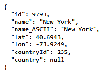

现在，JSON 是完全可读的，Angular 仍然能够正确地获取它。

# （非常）长的名单

现在让我们转到 Angular 应用，创建一个示例组件来显示`Cities`列表。我们已经在[第 3 章](03.html)、*前端和后端交互*中创建了一个组件，所以我们知道该怎么做。

在解决方案资源管理器中，执行以下操作：

1.  导航到`/ClientApp/src/app/`文件夹。
2.  创建一个新的`/cities/`文件夹。
3.  在该文件夹中，创建以下新文件：
    *   `city.ts`
    *   `cities.component.ts`
    *   `cities.component.html`
    *   `cities.component.css`

完成后，用以下内容填充它们。

# city.ts

打开`/ClientApp/src/app/cities/citiy.ts`文件并添加以下内容：

```cs
export interface City {
    id: number;
    name: string;
    lat: string;
    lon: string;
}
```

这个小文件包含我们的*城市*接口，我们将在`CitiesComponent`类文件中使用它。因为我们最终也会在其他组件中使用它，所以最好在一个单独的文件中创建它，并用`export`语句修饰它，以便到时候我们也能在那里使用它。

# 城市

打开`/ClientApp/src/app/cities/cities.component.ts`文件并添加以下内容：

```cs
import { Component, Inject } from '@angular/core';
import { HttpClient } from '@angular/common/http';

import { City } from './city';

@Component({
  selector: 'app-cities',
  templateUrl: './cities.component.html',
  styleUrls: ['./cities.component.css']
})
export class CitiesComponent {
  public cities: City[];

  constructor(
    private http: HttpClient,
    @Inject('BASE_URL') private baseUrl: string) {
  }

  ngOnInit() {
    http.get<City[]>(baseUrl + 'api/Cities')
      .subscribe(result => {
        this.cities = result;
      }, error => console.error(error));
  }
}
```

正如我们所看到的，我们在不久前创建的`City`接口上添加了一个`import`引用。我们还使用了`ngOnInit()`生命周期钩子方法来执行 HTTP 请求来检索城市，就像我们在[第 3 章](03.html)、*前端和后端交互*中为我们之前的`HealthCheck`应用所做的那样。

# cities.component.html

打开`/ClientApp/src/app/cities/cities.component.html`文件并添加以下内容：

```cs
<h1>Cities</h1>

<p>Here's a list of cities: feel free to play with it.</p>

<p *ngIf="!cities"><em>Loading...</em></p>

<table class='table table-striped' aria-labelledby="tableLabel" [hidden]="!cities">
  <thead>
    <tr>
      <th>ID</th>
      <th>Name</th>
      <th>Lat</th>
      <th>Lon</th>
    </tr>
  </thead>
  <tbody>
    <tr *ngFor="let city of cities">
      <td>{{ city.id }}</td>
      <td>{{ city.name }}</td>
      <td>{{ city.lat }}</td>
      <td>{{ city.lon }}</td>
    </tr>
  </tbody>
</table>
```

# [隐藏]属性

如果我们仔细查看前面的 HTML 代码，我们将看到，`<table>`元素具有一个奇怪的`[hidden]`属性。为什么它在那里，为什么它在方括号中？

事实上，`hidden`属性是 HTML5 的有效内容属性，可以在任何 HTML 元素上合法设置。它应该扮演的角色与 CSS`display: none`设置非常相似：它向浏览器指示元素及其所有子元素不应该对任何用户可见或感知。换句话说，这只是向用户隐藏某些内容的另一种方式。

For additional information regarding the `hidden` attribute, check out the following URL:

HTML Living Standard (last updated on November 26, 2019):
[https://html.spec.whatwg.org/multipage/interaction.html#the-hidden-attribute](https://html.spec.whatwg.org/multipage/interaction.html#the-hidden-attribute).

至于方括号，这只是定义属性绑定的Angular语法，即组件模板（我们的`.html`文件）中的 HTML 属性或属性，其值来自组件类（我们的`.ts`文件）中定义的变量、属性或表达式。值得注意的是，这样的绑定朝一个方向流动：从组件类（源）到组件模板（目标）中的 HTML 元素。

作为我们刚才所说的直接结果，每次源值计算为`true`，方括号之间的 HTML 属性（或属性）也将设置为*true*（反之亦然）；这是处理许多使用布尔值的 HTML 属性的好方法，因为我们可以在整个组件的生命周期中动态设置它们。这正是我们对前面代码块中的`<table>`元素所做的：它的`hidden`属性将求值为`false`，直到`cities`组件变量被从服务器获取的实际*城市*填充，这只有在`HttpClient`模块完成其请求/响应任务时才会发生。不错吧？

等等：`*ngIf`*结构指令*的行为与我们在[第 3 章](03.html)*前端和后端交互*中已经知道的`*ngIf`*结构指令*的行为是否相同？为什么我们要使用这个`[hidden]`属性呢？

这是一个非常好的问题，让我们有机会澄清这两种相似但不完全相同的方法之间的区别：

*   `*ngIf`structural 指令根据元素对应的条件或表达式在 DOM 中添加或删除元素；这意味着每当元素的状态发生变化时，该元素将被初始化和/或处置（连同其所有子元素、事件等）。
*   `hidden`属性与`display: none`CSS 设置非常相似，只会指示浏览器向用户显示或隐藏元素；这意味着元素仍然存在，因此是完全可用和可访问的（例如，通过 JavaScript 或其他 DOM 操作）。

通过查看前面的 HTML 代码可以看出，我们同时使用了这两种代码：`*ngIf`结构指令添加或删除*加载*`<p>`元素，而`[hidden]`*属性绑定*显示或隐藏主`<table>`元素。我们选择这样做的原因是：`<p>`元素不会有依赖于它的子元素或事件，而`<table>`将很快成为一个复杂的对象，在 DOM 中有许多需要初始化和保存的特性。

# cities.component.css

以下是`/ClientApp/src/app/cities/cities.component.ts`文件的代码：

```cs
table {
  width: 100%;
}
```

就是这样，至少现在是这样：因为我们使用的是引导客户机框架，所以我们组件的 CSS 文件通常非常小。

# app.module.ts

正如我们已经知道的，如果我们以以下方式将该组件添加到`app.module.ts`文件中（新行高亮显示），则只能加载该组件，并且只能通过客户端路由访问该组件：

```cs
import { BrowserModule } from '@angular/platform-browser';
import { NgModule } from '@angular/core';
import { FormsModule } from '@angular/forms';
import { HttpClientModule, HTTP_INTERCEPTORS } from 
 '@angular/common/http';
import { RouterModule } from '@angular/router';

import { AppComponent } from './app.component';
import { NavMenuComponent } from './nav-menu/nav-menu.component';
import { HomeComponent } from './home/home.component';
import { CitiesComponent } from './cities/cities.component';

@NgModule({
  declarations: [
    AppComponent,
    NavMenuComponent,
    HomeComponent,
 CitiesComponent
  ],
  imports: [
    BrowserModule.withServerTransition({ appId: 'ng-cli-universal' }),
    HttpClientModule,
    FormsModule,
    RouterModule.forRoot([
      { path: '', component: HomeComponent, pathMatch: 'full' },
 { path: 'cities', component: CitiesComponent }
    ])
  ],
  providers: [],
  bootstrap: [AppComponent]
})
export class AppModule { }
```

我们开始吧。

# nav-component.html

最后但并非最不重要的一点是，我们需要在 appnavigator 组件中添加对新组件路由的引用；否则，浏览器客户端将无法使用 UI 查看（从而访问）它。

为此，打开`nav-component.html`文件并添加以下（突出显示的）行：

```cs
// ...existing code...

<ul class="navbar-nav flex-grow">
  <li
    class="nav-item"
    [routerLinkActive]="['link-active']"
    [routerLinkActiveOptions]="{ exact: true }"
  >
    <a class="nav-link text-dark" [routerLink]="['/']">Home</a>
  </li>
 <li class="nav-item" [routerLinkActive]="['link-active']">
 <a class="nav-link text-dark" [routerLink]="['/cities']"
 >Cities</a
 >
 </li>
</ul>

// ...existing code...
```

就这样。现在，我们*可以*点击*F5*启动我们的应用，点击屏幕右上角出现的城市链接，体验如下结果：

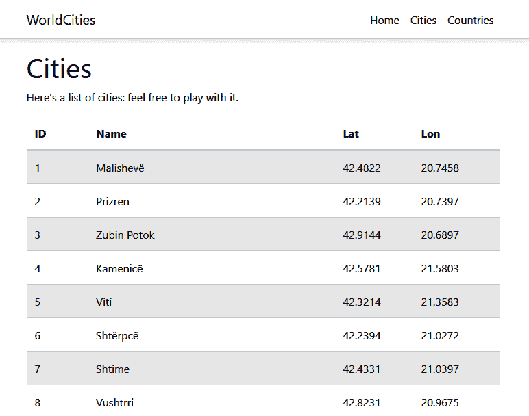

正如我们通过查看右侧的垂直滚动条所看到的，我们将被一个由 12959（大约）行组成的巨大 HTML 表所淹没！ 

对于.NET Core和 Angular 来说，这是另一个巨大的性能压力——在任何一台普通的开发机器上都应该能够顺利通过，因为这两个框架都可以很好地处理各自的任务。

然而，就用户体验而言，这样的 UI 结果绝对是不可能的：如果我们强迫最终用户使用浏览器浏览 13k 行的 HTML 表格，我们就不能合理地期望他们会高兴。如果他们想找到他们要找的城市，一定会发疯的！

为了解决这些主要的可用性问题，我们需要实现两个常用于处理胖 HTML 表的重要特性：**分页**、**排序**、**和**过滤**。**

 **# 用角材料服务数据

为了实现一个具有分页、排序和过滤功能的表，我们将使用**Angular Material**，这是一个 UI 组件库，在 Angular 中实现材质设计。我们很可能已经知道，Material Design 是谷歌在 2014 年开发的一种 UI 设计语言，它专注于使用基于网格的布局、响应动画、过渡、填充和深度效果，如照明和阴影。

Material Design was introduced by the Google designer Matías Duarte on June 25, 2014, at the 2014 Google I/O conference. To make UI designers familiarize themselves with its core concepts, he explained that: "*unlike real paper, our digital material can expand and reform intelligently. Material has physical surfaces and edges. Seams and shadows provide meaning about what you can touch."*

The main purpose of Material Design is to create a new UI language combining principles of good design with technical and scientific innovation in order to provide a consistent user experience not only across all Google platforms and applications, but also any other web applications seeking to adopt such concepts. The language was revamped in 2018, providing more flexibility and advanced customization features based on themes. 

截至 2019 年，几乎所有 Google web 应用和工具都使用了材质设计，包括 Gmail、YouTube、Google Drive、Google 文档、表单、幻灯片、Google 地图和所有 Google Play 品牌应用，以及大多数 Android 和 Google OS UI 元素。这种广泛采用还包括 Angular，该公司提供了一个专用的 npm 包，可添加到任何 Angular 项目中，以在任何 Angular 应用中实现材料设计；这个包被称为`@angular/material`，包括本机 UI 元素、**组件开发工具包**（**CDK**）、一组动画和其他有用的东西。

要安装角材料，请执行以下操作：

1.  打开命令提示符。
2.  导航到我们项目的`/ClientApp/`文件夹。
3.  键入以下命令：

```cs
> ng add @angular/material
```

执行此操作将触发 Angular Material 命令行设置向导，该向导将安装以下 npm 软件包：

*   `@angular/material`
*   `@angular/cdk`（先决条件）

**Important**: Be sure to install the same `@angular/material` version specified in the `package.json` of the GitHub project released with this book - `9.0.0` at the time of writing. Those who want to change or update the Angular version should pay special attention to updating the `@angular/material` package as well and/or manually fixing the potential breaking changes between the various versions.

For additional information about Angular Material, check out the following URLs:

[https://material.angular.io/](https://material.angular.io/)
[https://github.com/angular/components](https://github.com/angular/components)

在安装过程中，前面的命令将询问我们要安装的预构建主题，如以下屏幕截图所示：


在本章中，我们将选择`Indigo/Pink`，但我们可以自由选择我们喜欢的任何其他主题。如果我们想在做出选择之前查看它们，我们可以访问前面屏幕截图中列出的预览 URI。

安装向导还将询问我们是否要为手势识别设置**HammerJS**——如果我们计划发布移动设备应用，这可能非常有用——并添加**动画**支持：在本书中，我们将为这两个功能选择`Y`。

完成后，安装过程将更新以下文件：

*   `package.json`
*   `/src/main.ts`
*   `/src/app/app.module.ts`
*   `angular.json`
*   `src/index.html`
*   `src/styles.css`

现在，我们可以继续修改我们的城市表。

# MatTableModule

我们将要使用的Angular组件是`MatTableModule`，它提供了一个材质设计样式的 HTML 表格，可用于显示数据行。让我们看看如何在现有的 Angular 应用中实现它。

从解决方案资源管理器中，导航到`/ClientApp/src/app/`文件夹，创建一个新的`angular-material.module.ts`文件，并用以下内容填充该文件：

```cs
import { NgModule } from '@angular/core';
import { MatTableModule } from '@angular/material/table';

@NgModule({
    imports: [
        MatTableModule
    ],
    exports: [
        MatTableModule
   ]
})

export class AngularMaterialModule { }
```

这是一个全新的模块，我们将用于我们希望在应用中实现的所有Angular材料模块；将它们放在这里而不是使用`app.module.ts`文件将使该文件更小，这对项目的可管理性非常好。

不用说，为了使这个*模块容器*能够正常工作，我们需要将其添加到现有的`app.module.ts`文件中。打开它并添加以下（突出显示的）行：

```cs
import { BrowserModule } from '@angular/platform-browser';
import { NgModule } from '@angular/core';
import { FormsModule } from '@angular/forms';
import { HttpClientModule, HTTP_INTERCEPTORS } from 
 '@angular/common/http';
import { RouterModule } from '@angular/router';

import { AppComponent } from './app.component';
import { NavMenuComponent } from './nav-menu/nav-menu.component';
import { HomeComponent } from './home/home.component';
import { CitiesComponent } from './cities/cities.component';
import { BrowserAnimationsModule } from '@angular/platform-
 browser/animations';
import { AngularMaterialModule } from './angular-material.module';

@NgModule({
  declarations: [
    AppComponent,
    NavMenuComponent,
    HomeComponent,
    CitiesComponent
  ],
  imports: [
    BrowserModule.withServerTransition({ appId: 'ng-cli-universal' }),
    HttpClientModule,
    FormsModule,
    RouterModule.forRoot([
      { path: '', component: HomeComponent, pathMatch: 'full' },
      { path: 'cities', component: CitiesComponent }
    ]),
    BrowserAnimationsModule,
 AngularMaterialModule
  ],
  providers: [],
  bootstrap: [AppComponent]
})
export class AppModule { }
```

现在，我们将在`angular-material.module.ts`文件中输入的所有内容也将在我们的应用中引用。

完成后，我们最终可以打开`/ClientApp/src/app/cities/cities.component.ts`文件并添加以下（突出显示的）行：

```cs
// ...existing code...

export class CitiesComponent {
 public displayedColumns: string[] = ['id', 'name', 'lat', 'lon'];
  public cities: City[];

  constructor(
    private http: HttpClient,
    @Inject('BASE_URL') private baseUrl: string) {
  }
}

// ...existing code...
```

紧接着，打开`/ClientApp/src/app/cities/cities.component.html`**文件，用新的`MatTableModule`替换我们以前的表实现，方法如下（更新的代码突出显示）：**

```cs
<h1>Cities</h1>

<p>Here's a list of cities: feel free to play with it.</p>

<p *ngIf="!cities"><em>Loading...</em></p>

<table mat-table [dataSource]="cities" class="mat-elevation-z8"
 [hidden]="!cities">
 <!-- Id Column -->
 <ng-container matColumnDef="id">
 <th mat-header-cell *matHeaderCellDef>ID</th>
 <td mat-cell *matCellDef="let city">{{city.id}}</td>
 </ng-container>

 <!-- Name Column -->
 <ng-container matColumnDef="name">
 <th mat-header-cell *matHeaderCellDef>Name</th>
 <td mat-cell *matCellDef="let city">{{city.name}}</td>
 </ng-container>

 <!-- Lat Column -->
 <ng-container matColumnDef="lat">
 <th mat-header-cell *matHeaderCellDef>Latitude</th>
 <td mat-cell *matCellDef="let city">{{city.lat}}</td>
 </ng-container>

 <!-- Lon Column -->
 <ng-container matColumnDef="lon">
 <th mat-header-cell *matHeaderCellDef>Longitude</th>
 <td mat-cell *matCellDef="let city">{{city.lon}}</td>
 </ng-container>

 <tr mat-header-row *matHeaderRowDef="displayedColumns"></tr>
 <tr mat-row *matRowDef="let row; columns: displayedColumns;"></tr>
</table>
```

正如我们所看到的，`MatTableModule`有点模仿标准 HTML 表的行为，但对每一列都采用基于模板的方法；模板具有一系列辅助结构指令（使用`*<directiveName>`语法应用），可用于标记某些模板节并定义其模板节的实际角色。如我们所见，所有这些指令都以`Def`后缀结尾。

以下是上述代码中最相关的代码：

*   `[hidden]`属性绑定并不奇怪，因为它已经出现在前一个表中，用于完全相同的目的：在*城市*加载之前隐藏该表
*   `matColumnDef`指令用唯一键标识给定列。
*   `matHeaderCellDef`指令定义了如何显示每列的标题。
*   `matCellDef`指令定义了如何显示每列的数据单元格。
*   `matHeaderRowDef`指令可在前面代码末尾附近找到，它标识了表格标题行的配置元素和标题列的显示顺序。我们可以看到，这个指令表达式指向一个名为`displayedColumns`的组件变量，我们在`cities.component.ts`文件中很早就定义了它；此变量承载一个数组，其中包含我们要显示的所有列键，这些列键需要与通过各种`matColumnDef`指令指定的名称相同。

让我们点击*F5*并导航到城市视图，看看我们全新的表格是什么样子。这可以在以下屏幕截图中看到：

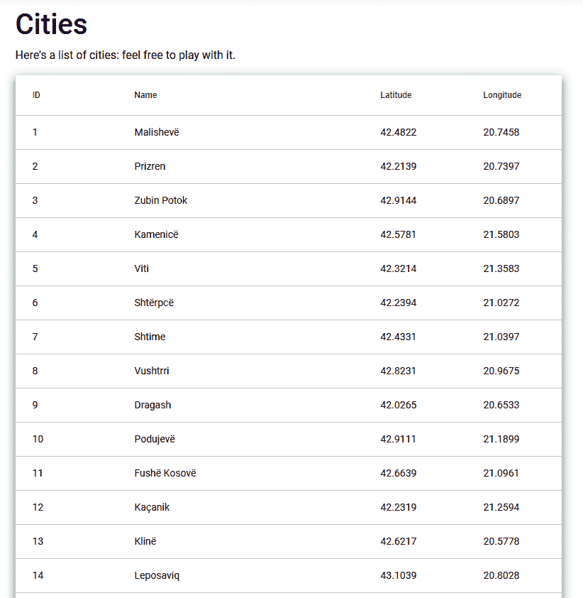

好的，材料设计确实存在，但是表与以前有相同的 UI/UX 问题！首先，它仍然很长；让我们通过实现**分页**特性来解决这个问题。

# matpaginatromodule

现在我们使用的是Angular材质，实现分页是一项相当简单的任务。我们需要做的第一件事是将`MatPaginatorModule`服务导入我们不久前创建的`angular-material.module.ts`文件中。

# 客户端分页

我们可以这样做（突出显示新行）：

```cs
import { NgModule } from '@angular/core';
import { MatTableModule } from '@angular/material/table';
import { MatPaginatorModule } from '@angular/material/paginator';

@NgModule({
    imports: [
        MatTableModule,
 MatPaginatorModule
    ],
    exports: [
        MatTableModule,
 MatPaginatorModule
    ]
})

export class AngularMaterialModule { }
```

紧接着，我们需要打开`cities.component.ts`文件，导入`MatPaginator`、`MatTableDataSource`和`ViewChild`服务：

```cs
import { Component, Inject, ViewChild } from '@angular/core';
import { HttpClient } from '@angular/common/http';
import { MatTableDataSource } from '@angular/material/table';
import { MatPaginator } from '@angular/material/paginator'; import { City } from './city';

@Component({
  selector: 'app-cities',
  templateUrl: './cities.component.html',
  styleUrls: ['./cities.component.css']
})
export class CitiesComponent {
  public cities: City[];

  constructor(
    private http: HttpClient,
    @Inject('BASE_URL') private baseUrl: string) {
  }

  ngOnInit() {
    http.get<City[]>(baseUrl + 'api/Cities')
      .subscribe(result => {
        this.cities = result;
      }, error => console.error(error));
  }
}
```

最后但并非最不重要的一点是，我们需要在`cities.component.html`文件中的`</table>`结束标记之后添加以下分页指令：

```cs
// ...existing code...

  <tr mat-header-row *matHeaderRowDef="displayedColumns"></tr>
  <tr mat-row *matRowDef="let row; columns: displayedColumns;"></tr>
</table>

<!-- Pagination directive -->
<mat-paginator [hidden]="!cities"
 [pageSize]="10"
 [pageSizeOptions]="[10, 20, 50]"
 showFirstLastButtons></mat-paginator>

```

我们可以看到，我们再次使用了`[hidden]`*属性绑定*来隐藏分页器，直到*城市*被加载。我们可以在`<mat-paginator>`元素上看到的其他属性配置了一些`MatPaginatorModule`UI 选项，例如默认页面大小和我们希望向用户提供的所有页面大小选项的数组。

现在，我们可以点击*F5*，看看我们的努力。请看以下屏幕截图：

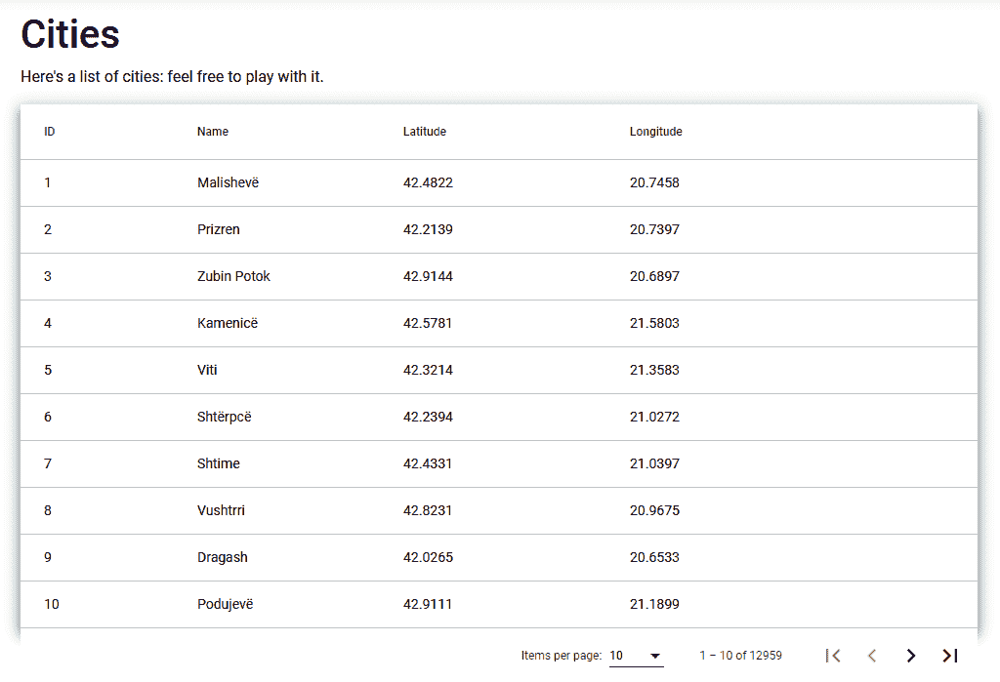

现在，我们的表格只显示了前 10 个城市。它在右下角还有一个整洁的分页器，可以使用箭头在各个页面中导航。我们的最终用户甚至可以使用一个简洁的下拉列表（每页 10 个、20 个或 50 个城市）来选择每页显示多少项目。看起来我们确实做到了！

然而，如果我们想一想，我们可以很容易地承认我们还没有完全做到这一点。当然，现在我们的用户可以很好地浏览表格，而不必上下滚动很长时间，但不需要天才就能理解所有这些行仍然存在于页面上：我们从未告诉服务器实际支持分页请求，因此我们仍然从数据提供器获取所有城市（并通过.NET Core API 控制器）就像以前一样：事实上，它们只是被*前端*隐藏了起来。

这基本上意味着，在服务器端（巨大的 SQL 查询结果、巨大的 JSON）和客户端（在每个分页器操作上显示/隐藏大量 HTML 行，导致页面更改），我们仍然具有与以前相同的性能影响。

为了缓解上述问题，我们需要从客户端分页转移到服务器端分页——这正是我们将在下一节中要做的。

# 服务器端分页

实现服务器端分页比客户端分页要复杂一些。我们需要做的是：

*   更改我们的`CitiesController`.NET Core类，使其支持分页 HTTP GET 请求。
*   创建一个新的`ApiResult`.NET 类，我们可以使用它来改进我们的.NET Core*控制器*的 JSON 响应
*   更改我们的`cities.controller.ts`Angular组件以及当前的`MatPaginatorModule`配置，使其能够发出新的 GET 请求并处理新的 JSON 响应。

让我们这样做！

# 花旗控制器

我们的`CitiesController`的`GetCities`方法默认返回数据库中所有~13000 个城市的 JSON 数组；就服务器端性能而言，这绝对是不可能的，所以我们需要改变它。理想情况下，我们只希望返回少量的`Cities`，通过在方法签名中添加一些（必需的）变量，例如`pageIndex`和`pageSize`，我们可以轻松实现这一点。

下面是我们如何改变这种情况以强制实施这种行为（突出显示更新的行）：

```cs
// ...existing code...

[HttpGet]
public async Task<ActionResult<IEnumerable<City>>> GetCities(
    int pageIndex = 0, 
    int pageSize = 10)
{
 return await _context.Cities
 .Skip(pageIndex * pageSize)
 .Take(pageSize)
 .ToListAsync();
}

// ...existing code...
```

就这样,；我们还为这些变量指定了一些合理的默认值，以避免在默认情况下出现大量 JSON 响应*。*

 *让我们快速测试一下刚才的操作：点击*F5*并在浏览器的地址栏中键入以下 URL:[https://localhost:44334/api/Cities/?pageIndex=0 &页面大小=10](https://localhost:44334/api/Cities/?pageIndex=0&pageSize=10)。

以下是我们应该得到的：

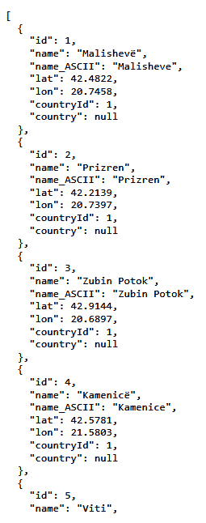

看来我们的计划确实奏效了！

然而，我们必须处理一个主要问题：如果我们只返回一个包含 10 个城市的 JSON 数组，Angular 应用将无法实际知道数据库中有多少城市。如果没有这些信息，分页器很难像我们早期实现客户端分页时那样正常工作。

长话短说，我们需要找到一种方法来告诉我们的 Angular 应用一些附加信息，例如：

*   可用的总页数（和/或记录）
*   当前页面
*   每页上的记录数

说实话，唯一需要的信息是第一个，因为有棱角的客户可以跟踪其他两个；然而，既然我们需要实现那个，我们不妨将它们全部归还，这样我们的*前端*生活就容易多了。

为了做到这一点，我们能做的最好的事情就是创建一个专用的*响应类型*类——从现在起我们将大量使用这个类。

# 芹菜

在解决方案资源管理器中，右键单击`Data`文件夹并添加新的`ApiResult.cs`C#类文件。然后，填写以下内容：

```cs
using Microsoft.EntityFrameworkCore;
using System;
using System.Collections.Generic;
using System.Linq;
using System.Threading.Tasks;

namespace WorldCities.Data
{
    public class ApiResult<T>
    {
        /// <summary>
        /// Private constructor called by the CreateAsync method.
        /// </summary>
        private ApiResult(
            List<T> data, 
            int count, 
            int pageIndex, 
            int pageSize)
        {
            Data = data;
            PageIndex = pageIndex;
            PageSize = pageSize;
            TotalCount = count;
            TotalPages = (int)Math.Ceiling(count / (double)pageSize);
        }

        #region Methods
        /// <summary>
        /// Pages a IQueryable source.
        /// </summary>
        /// <param name="source">An IQueryable source of generic 
        /// type</param>
        /// <param name="pageIndex">Zero-based current page index 
        /// (0 = first page)</param>
        /// <param name="pageSize">The actual size of each 
        /// page</param>
        /// <returns>
        /// A object containing the paged result 
        /// and all the relevant paging navigation info.
        /// </returns>
        public static async Task<ApiResult<T>> CreateAsync(
            IQueryable<T> source,
            int pageIndex,
            int pageSize)
        {
            var count = await source.CountAsync();
            source = await source
                .Skip(pageIndex * pageSize)
                .Take(pageSize);

            var data = await source.ToListAsync();

            return new ApiResult<T>(
                data,
                count,
                pageIndex,
                pageSize);
        }
        #endregion

        #region Properties
        /// <summary>
        /// The data result.
        /// </summary>
        public List<T> Data { get; private set; }

        /// <summary>
        /// Zero-based index of current page.
        /// </summary>
        public int PageIndex { get; private set; }

        /// <summary>
        /// Number of items contained in each page.
        /// </summary>
        public int PageSize { get; private set; }

        /// <summary>
        /// Total items count
        /// </summary>
        public int TotalCount { get; private set; }

        /// <summary>
        /// Total pages count
        /// </summary>
        public int TotalPages { get; private set; }

        /// <summary>
        /// TRUE if the current page has a previous page, 
        /// FALSE otherwise.
        /// </summary>
        public bool HasPreviousPage
        {
            get
            {
                return (PageIndex > 0);
            }
        }

        /// <summary>
        /// TRUE if the current page has a next page, FALSE otherwise.
        /// </summary>
        public bool HasNextPage
        {
            get
            {
                return ((PageIndex +1) < TotalPages);
            }
        }
        #endregion
    }
}
```

这个`async`类包含一些非常有趣的内容。让我们试着总结一下最相关的事情：

*   `Data`：一个`List<T>`类型的属性，将用于包含分页数据（它将被转换为 JSON 数组）
*   `PageIndex`：返回当前页面从零开始的索引（第一页 0，第二页 1，依此类推）
*   `PageSize`：返回总页面大小（`TotalCount`/`PageSize`）
*   `TotalCount`：返回`Item`计数总数
*   `TotalPages`：返回考虑总`Items`计数的总页数（`TotalCount`/`PageSize`）
*   `HasPreviousPage`：如果当前页面有上一页，则返回`True`，否则返回`False`
*   `HasNextPage`：如果当前页面有下一页，则返回`True`，否则返回`False`

这些财产正是我们所寻找的；通过查看前面的代码，计算其值的底层逻辑应该很容易理解。

除此之外，该类基本上围绕静态方法`CreateAsync<T>(IQueryable<T> source, int pageIndex, int pageSize)`展开，该方法可用于对实体框架`IQueryable`对象进行分页。

It's worth noting that the `ApiResult` class cannot be instantiated from the outside since its contructor has been marked as `private`; the only way to create it is by using the static `CreateAsync` factory method. There are good reasons to do that: since it is not possible to define an `async` constructor, we have resorted to using a static `async` method that returns a class instance; the constructor has been set to `private` to prevent developers from directly using it instead of the factory method since it's the only reasonable way to instantiate this class.

下面是我们如何利用我们`CitiesController`的`GetCities`方法中全新的`ApiResult`类：

```cs
// ...existing code...

// GET: api/Cities
// GET: api/Cities/?pageIndex=0&pageSize=10
[HttpGet]
public async Task<ActionResult<ApiResult<City>>> GetCities(
 int pageIndex = 0,
 int pageSize = 10)
{
 return await ApiResult<City>.CreateAsync(
 _context.Cities,
 pageIndex,
 pageSize
 );
}

// ...existing code...
```

我们走！现在，我们应该有我们的 10 个城市和所有我们正在寻找的信息。

让我们点击*F5*并导航到与之前相同的 URL，查看发生了什么变化：[https://localhost:44334/api/Cities/?pageIndex=0 &页面大小=10](https://localhost:44334/api/Cities/?pageIndex=0&pageSize=10)。

以下是更新后的 JSON 响应：

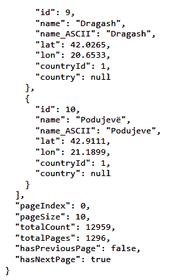

如果我们向下滚动到页面底部，我们将看到我们急需的属性都在那里

这个实现的唯一缺点是，我们需要调用的 URL 来获得这样的结果是相当丑陋的；在转向 Angular 之前，花些时间看看是否有办法使其更光滑可能会很有用。

从理论上讲，通过以下方式在`CitiesController.cs`文件中实现专用路由，我们可以做得更好（更新的行高亮显示，但***不要对您的代码***执行这样的更改—请看一看）：

```cs
// ...existing code...

// GET: api/Cities
// GET: api/Cities/?pageIndex=0&pageSize=10
// GET: api/Cities/0/10
[HttpGet]
[Route("{pageIndex?}/{pageSize?}")]
public async Task<ActionResult<ApiResult<City>>> GetCities(
        int pageIndex = 0,
        int pageSize = 10)
{
    return await ApiResult<City>.CreateAsync(
            _context.Cities,
            pageIndex,
            pageSize
            );
}

// ...existing code...
```

通过实现该路由，我们可以使用以下新 URL 调用`GetCities`操作方法：[https://localhost:44334/api/Cities/0/10](https://localhost:44334/api/Cities/0/10) 。

这可以说比下面的 URL 要好：[https://localhost:44334/api/Cities/?pageIndex=0 &页面大小=10](https://localhost:44334/api/Cities/?pageIndex=0&pageSize=10)。

然而，*至少现在不要这样做*：执行此更改将意味着无法添加其他参数，这可能是定制选项方面的巨大损失——我们将在短时间内看到这一点。

现在让我们转到 Angular 的`CitiesComponent`并对其进行更新，以使用这种新的优化方式从服务器获取我们的城市。

# CitiesComponent

我们只需要更改以下Angular文件：

*   `CitiesComponent`TypeScript 文件，这是我们现在需要更新的所有数据检索逻辑所在的位置
*   `CitiesComponent`HTML 文件，用于将特定事件绑定到`MatPaginator`元素

让我们这样做。

打开`cities.component.ts`文件并执行以下更改（突出显示新的/更新的行）：

```cs
import { Component, Inject, ViewChild } from '@angular/core';
import { HttpClient, HttpParams } from '@angular/common/http';
import { MatTableDataSource } from '@angular/material/table';
import { MatPaginator, PageEvent } from '@angular/material/paginator';

import { City } from './city';

@Component({
  selector: 'app-cities',
  templateUrl: './cities.component.html',
  styleUrls: ['./cities.component.css']
})
export class CitiesComponent {
  public displayedColumns: string[] = ['id', 'name', 'lat', 'lon'];
  public cities: MatTableDataSource<City>;

 @ViewChild(MatPaginator) paginator: MatPaginator;

  constructor(
    private http: HttpClient, 
    @Inject('BASE_URL') private baseUrl: string) {
  }  ngOnInit() {
 var pageEvent = new PageEvent();
 pageEvent.pageIndex = 0;
 pageEvent.pageSize = 10;
 this.getData(pageEvent);
  }

 getData(event: PageEvent) {
 var url = this.baseUrl + 'api/Cities;
 var url = this.baseUrl + 'api/Cities';
    var params = new HttpParams()
      .set("pageIndex", event.pageIndex.toString())
      .set("pageSize", event.pageSize.toString());
    this.http.get<any>(url, { params }) .subscribe(result => {
 this.paginator.length = result.totalCount;
 this.paginator.pageIndex = result.pageIndex;
 this.paginator.pageSize = result.pageSize;
 this.cities = new MatTableDataSource<City>(result.data);
 }, error => console.error(error));
 }
}
```

让我们来总结一下我们在这里所做的工作：

*   我们使用`@ViewChild`装饰器设置一个静态视图查询，并将其结果存储到`paginator`变量中；这允许我们从 Component 类中访问和操作之前在组件模板中设置的`MatPaginator`实例。
*   我们从`ngOnInit()`生命周期钩子方法中删除了`HttpClient`，并将整个数据检索登录放在一个单独的`getData()`方法中。为了做到这一点，我们必须为`host``HttpClient`和`baseUrl`定义几个内部类变量来持久化它们，以便我们能够多次使用它们（即，在多次`getData()`调用中）。
*   我们更改了数据检索逻辑以匹配新的 JSON 响应对象。
*   我们修改了`paginator`配置策略，手动设置从服务器端获得的值，而不是让服务器端自动计算出来；这样做是必须的，否则它只会考虑（并且*对*进行分页）我们在每次 HTTP 请求时检索的一小部分城市，而不是整个批次。

在我们用前面代码实现的各种新功能中，`@ViewChild`decorator 值得多说几句：简而言之，它可以用于从 Angular 组件中获取 DOM 模板元素的引用，因此无论何时我们需要操作元素的属性，它都是非常有用的功能。

从前面的代码可以看出，`@ViewChild`decorator 是使用访问 DOM 元素所需的*选择器*参数定义的：*选择器*可以是类名（如果类有`@Component`或`@Directive`decorator）、模板引用变量，在子组件树中定义的提供程序，依此类推。在我们的特定场景中，我们使用了`MatPaginator`类名，因为它确实有`@Component`装饰器。

While we're at it, it can be useful to know that the `@ViewChild` decorator also accepts a second parameter, which was required until Angular 8 and became optional in Angular 9: a static flag, which can be either *true* or *false* (in Angular 9, it defaults to *false*). If this flag is explicitly set to `true`, the `@ViewChild` is retrieved from the template before the *Change Detection* phase runs (that is, even before the `ngOnInit()` life cycle); conversely, the Component/element retrieval task is resolved either after the Change Detection phase if the element is inside a nested view (for example, a view with a `*ngIf` conditional display directive), or before Change Detection if it isn't.

Since we've used the `[hidden]` attribute binding in the template instead of the `*ngIf` directive, our `MatPaginator` won't run into initialization issues, even without having to set that flag to `true`.

For additional information about the `@ViewChild` decorator, we suggest you take a look at the Angular docs:

[https://angular.io/api/core/ViewChild](https://angular.io/api/core/ViewChild).

对于`cities.component.html`文件，我们只需要在`<mat-paginator>`指令中添加一行，在每个分页事件上绑定`getData()`事件。以下是如何做到这一点（新行突出显示）：

```cs
// ...existing code

<!-- Pagination directive -->
<mat-paginator [hidden]="!cities"
 (page)="pageEvent = getData($event)"
    [pageSize]="10"
    [pageSizeOptions]="[10, 20, 50]"
    showFirstLastButtons></mat-paginator>
```

这个简单的绑定起着非常重要的作用：它确保每次用户与`paginator`元素交互以执行页面更改、请求上一页/下一页、第一页/最后一页、更改要显示的项目数等时调用`getData()`事件。我们很容易理解，服务器端分页需要这样一个调用，因为每次需要显示不同的行时，我们都需要从服务器获取更新的数据。

完成后，让我们通过点击*F5*来尝试新的魔法，然后导航到城市视图。如果我们一切都做得好，我们应该得到我们以前可以看到的相同 UI：

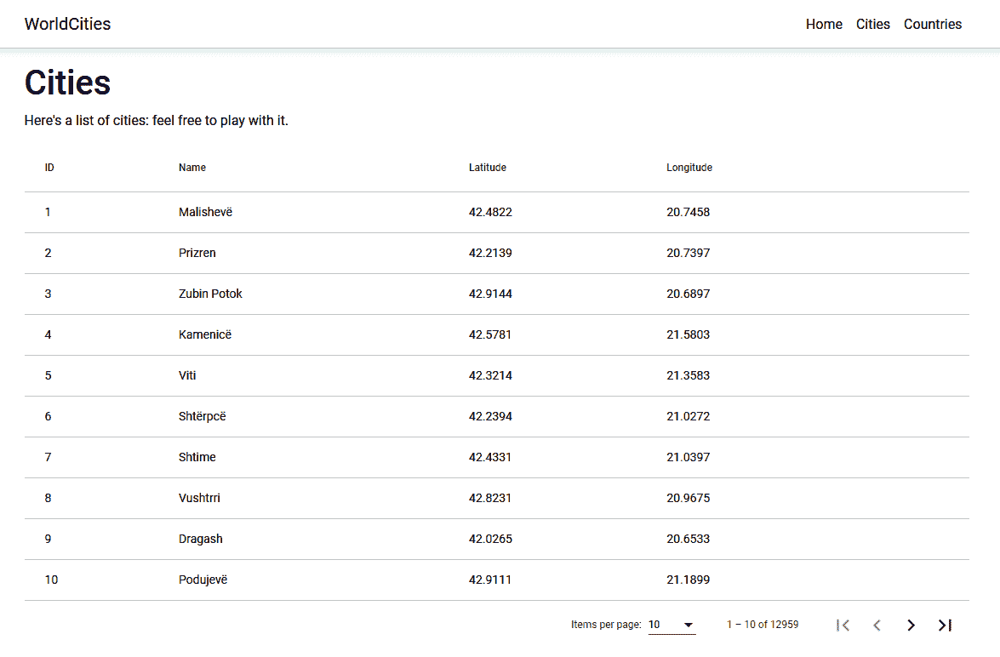

但是，这一次，我们应该体验更好的总体性能和更快的响应时间。这是因为我们没有在后台处理成千上万的 JSON 项和 HTML 表行；我们使用改进的服务器端逻辑一次只获取其中的几个（也就是我们看到的那些）。

既然我们已经完成了分页，我们最终可以处理**排序**。

# Matsort 模块

为了实现排序，我们将使用`MatSortModule`，它可以像我们使用`paginator`模块一样实现。

这一次，我们不会像早期分页那样进行客户端排序实验；我们从一开始就采用服务器端模式。

# 扩展 ApiResult

让我们从.NET Core*后端*部分开始。

你还记得我们之前创建的`ApiResult`类吗？是时候改进它的源代码来添加排序支持了。

从解决方案资源管理器中，打开`/Data/ApiResult.cs`文件并相应更新其内容（突出显示新的/更新的行）：

```cs
using Microsoft.EntityFrameworkCore;
using System;
using System.Collections.Generic;
using System.Linq;
using System.Threading.Tasks;
using System.Linq.Dynamic.Core;
using System.Reflection;

namespace WorldCities.Data
{
    public class ApiResult<T>
    {
        /// <summary>
        /// Private constructor called by the CreateAsync method.
        /// </summary>
        private ApiResult(
            List<T> data,
            int count,
            int pageIndex,
            int pageSize,
 string sortColumn,
 string sortOrder)
        {
            Data = data;
            PageIndex = pageIndex;
            PageSize = pageSize;
            TotalCount = count;
            TotalPages = (int)Math.Ceiling(count / (double)pageSize);
 SortColumn = sortColumn;
 SortOrder = sortOrder;
        }

        #region Methods
        /// <summary>
        /// Pages and/or sorts a IQueryable source.
        /// </summary>
        /// <param name="source">An IQueryable source of generic 
        /// type</param>
        /// <param name="pageIndex">Zero-based current page index 
        /// (0 = first page)</param>
        /// <param name="pageSize">The actual size of each 
        /// page</param>
 /// <param name="sortColumn">The sorting column name</param>
 /// <param name="sortOrder">The sorting order ("ASC" or 
        /// "DESC")</param>
        /// <returns>
        /// A object containing the IQueryable paged/sorted result 
        /// and all the relevant paging/sorting navigation info.
        /// </returns>
        public static async Task<ApiResult<T>> CreateAsync(
            IQueryable<T> source,
            int pageIndex,
            int pageSize,
 string sortColumn = null,
 string sortOrder = null)
        {
            var count = await source.CountAsync();

 if (!String.IsNullOrEmpty(sortColumn)
 && IsValidProperty(sortColumn))
 {
 sortOrder = !String.IsNullOrEmpty(sortOrder) 
                    && sortOrder.ToUpper() == "ASC" ? "ASC"
 : "DESC";
 source = source.OrderBy(
 String.Format(
 "{0} {1}",
 sortColumn,
 sortOrder)
 );
 }

 source = source
 .Skip(pageIndex * pageSize)
 .Take(pageSize);
 var data = await source.ToListAsync(); 
 return new ApiResult<T>(
 data,
 count,
 pageIndex,
 pageSize,
 sortColumn,
 sortOrder);
        }
        #endregion

 #region Methods
 /// <summary>
 /// Checks if the given property name exists
 /// to protect against SQL injection attacks
 /// </summary>
 public static bool IsValidProperty(
 string propertyName,
 bool throwExceptionIfNotFound = true)
 {
 var prop = typeof(T).GetProperty(
 propertyName,
 BindingFlags.IgnoreCase | 
 BindingFlags.Public | 
 BindingFlags.Instance);
 if (prop == null && throwExceptionIfNotFound)
 throw new NotSupportedException(
 String.Format(
 "ERROR: Property '{0}' does not exist.", 
 propertyName)
 );
 return prop != null;
 }
 #endregion

        #region Properties
        /// <summary>
        /// The data result.
        /// </summary>
        public List<T> Data { get; private set; }

        /// <summary>
        /// Zero-based index of current page.
        /// </summary>
        public int PageIndex { get; private set; }

        /// <summary>
        /// Number of items contained in each page.
        /// </summary>
        public int PageSize { get; private set; }

        /// <summary>
        /// Total items count
        /// </summary>
        public int TotalCount { get; private set; }

        /// <summary>
        /// Total pages count
        /// </summary>
        public int TotalPages { get; private set; }

        /// <summary>
        /// TRUE if the current page has a previous page, 
        /// FALSE otherwise.
        /// </summary>
        public bool HasPreviousPage
        {
            get
            {
                return (PageIndex > 0);
            }
        }

        /// <summary>
        /// TRUE if the current page has a next page, FALSE otherwise.
        /// </summary>
        public bool HasNextPage
        {
            get
            {
                return ((PageIndex +1) < TotalPages);
            }
        }

 /// <summary>
 /// Sorting Column name (or null if none set)
 /// </summary>
 public string SortColumn { get; set; }

 /// <summary>
 /// Sorting Order ("ASC", "DESC" or null if none set)
 /// </summary>
 public string SortOrder { get; set; }
        #endregion
    }
}
```

我们所做的基本上是在主类静态方法中添加两个新的`sortColumn`和`sortOrder`属性，并通过代码实现它们；在那里，我们还利用这个机会定义了两个同名的新属性（大写），这样排序细节将成为 JSON 响应的一部分，就像分页响应一样。

值得注意的是，由于我们现在正在将我们的**语言集成 Quer*y***（**LINQ**）组装到具有来自客户端的文本数据的 SQL 查询中，因此我们还添加了一个新的`IsValidProperty()`方法，该方法将检查指定的`sortColumn`是否确实作为泛型的类型属性存在`<T>`我们正在处理的实体；正如方法注释明确指出的，这实际上是一种针对 SQL 注入尝试的安全对策。这是一个非常重要的安全问题，我们稍后将讨论。

如果我们尝试在这些更改之后立即构建项目，我们很可能会遇到一些编译器错误，例如以下错误：

```cs
Error CS0246: The type or namespace name System.Linq.Dynamic could not be found (are you missing a using directive or an assembly reference?).
```

别担心，这很正常：我们只需要在项目中添加一个新的 NuGet 包。

# 安装 System.Linq.Dynamic.Core

我们在改进的`ApiResult`源代码中使用的`IQueryable<T>.OrderBy()`扩展方法以编程方式应用列排序是`System.Linq.Dynamic.Core`名称空间的一部分；多亏了这个库，才有可能在`IQueryable`上编写动态 LINQ 查询（基于字符串），就像我们在前面的代码中所做的那样。

不幸的是，`System.Linq.Dynamic.Core`不是.NET Core股票二进制文件的一部分；因此，为了使用这些特性，我们需要通过 NuGet 添加它

最快的方法是打开 Visual Studio 的**包管理器控制台**并发出以下命令：

```cs
> Install-Package System.Linq.Dynamic.Core
```

**重要**：请确保安装`System.Linq.Dynamic.Core`而不是`System.Linq.Dynamic`，后者是其.NET Framework 4.0 的对应版本；后者不适用于我们的.NET Core web 应用项目。

At the time of writing, the most recent version of the `System.Linq.Dynamic.Core` package is 1.0.19, which works absolutely fine for our purposes.

For those who want to retrieve additional information regarding this great package, we suggest you take a look at the following resources:

NuGet website:
[https://www.nuget.org/packages/System.Linq.Dynamic.Core/](https://www.nuget.org/packages/System.Linq.Dynamic.Core/).

GitHub project:
[https://github.com/StefH/System.Linq.Dynamic.Core](https://github.com/StefH/System.Linq.Dynamic.Core).

# 林克是什么？

在继续之前，让我们花几分钟讨论一下 LINQ，如果你从未听说过它的话。

也被称为语言集成查询*y，*LINQ 是微软.NET 框架技术集的代号，该技术将数据查询功能添加到.NET 语言，如 C#和 VB.NET。LINQ 于 2007 年首次发布，是.NETFramework3.5 的主要新特性之一。

LINQ 的主要目的是使开发人员能够使用一流的语言结构表达针对数据的结构化查询，而不必学习每种类型的数据源（收集类型、SQL、XML、CSV 等）的不同查询语言。对于这些*主要*数据源类型，有一个 LINQ 实现，它为对象（*LINQ to objects*）、实体框架实体（*LINQ to entities*）、关系数据库（*LINQ to SQL*）、XML（*LINQ to XML*等提供相同的查询体验。

LINQ 结构化查询可以使用两种可选的（但也是互补的）方法表示：

*   **Lambda 表达式**，如：

```cs
var city = _context.Cities.Where(c => c.Name == "New York").First();
```

*   **查询表达式**，如：

```cs
var city = (from c in _context.Cities where c.Name == "New York" select c).First();
```

由于查询表达式在编译之前会被转换为等价的 lambda 表达式，因此这两种方法都会产生相同的结果和相同的性能。

For additional information about LINQ, lambda expressions, and query expressions, check out the following links:

LINQ:
[https://docs.microsoft.com/en-us/dotnet/csharp/linq/](https://docs.microsoft.com/en-us/dotnet/csharp/linq/).

LINQ lambda expressions (C# Programming Guide):
[https://docs.microsoft.com/en-us/dotnet/csharp/programming-guide/statements-expressions-operators/lambda-expressions](https://docs.microsoft.com/en-us/dotnet/csharp/programming-guide/statements-expressions-operators/lambda-expressions).

LINQ query expression basics:
[https://docs.microsoft.com/en-us/dotnet/csharp/linq/query-expression-basics](https://docs.microsoft.com/en-us/dotnet/csharp/linq/query-expression-basics).

# Linq.Dynamic.Core 的优点和缺点

现在，既然 LINQ 从 v3.5 开始就内置了.NET Framework，而且它还附带了.NET Core，`System.Linq.Dynamic.Core`包实际上做什么？我们为什么要使用它？

从前面的两个示例中可以看出，lambda 表达式和查询表达式都使用强类型方法：每当我们使用 LINQ*查询*任何类型的对象时，编译器必须知道源类型以及我们希望查询检查的所有属性。这意味着我们将无法将这些技术用于泛型对象（`object`或类型（`<T>`）。这就是`Linq.Dynamic`的解救之道，允许开发人员使用文字字符串编写 lambda 表达式和查询表达式，并使用**反射**将其转换为强类型等价物 .

以下是与前面使用`System.Linq.Dynamic.Core`编写的查询相同的查询：

```cs
var city = _context.Cities.Where("Name = @1", "New York").First();
```

我们可以立即看到差异——以及使用这种方法可以获得的巨大优势：我们将能够动态构建查询，而不管我们是处理强类型对象还是泛型类型，就像我们不久前在`ApiResult`的源代码中所做的那样。

然而，这种方法也有一个主要的缺点：我们的代码不太容易测试，而且太容易出错，这至少有两个重要原因：

*   我们只需*一个文本字符串，就可以*查询错误，而这些错误几乎总是会导致严重的崩溃
*   不需要的查询（包括 SQL 注入攻击）的风险可能会成倍增加，这取决于我们如何构建这些查询和/或从何处获取我们的*动态*字符串

Those who don't know what SQL injections are and/or why they are dangerous should definitely take a look at the following guide, written by Tim Sammutand Mike Schiffman from the Cisco Security Intelligence team:

Understanding SQL Injections:[https://tools.cisco.com/security/center/resources/sql_injection](https://tools.cisco.com/security/center/resources/sql_injection).

前一个问题很糟糕，但后一个问题更糟糕：对 SQL 注入攻击持开放态度可能是毁灭性的，因此我们应该不惜任何代价避免这一点——包括扔掉`System.Linq.Dynamic.Core`包。

# 防止 SQL 注入

幸运的是，我们不需要这样做：虽然我们从客户端得到了两个可能有害的*变量字符串—`sortColumn`和`sortOrder`，但我们已经在前面的`ApiResult`源代码中为这两个字符串制定了有效的对策。*

以下是我们为`sortOrder`所做的：

```cs
//... existing code...

sortOrder = !String.IsNullOrEmpty(sortOrder) 
    && sortOrder.ToUpper() == "ASC"
    ? "ASC"
    : "DESC";

//... existing code...
```

正如我们所看到的，在任何地方使用它之前，我们将把它转换成`"ASC"`或`"DESC"`，这样就不会给 SQL 注入留下任何机会。

`sortColumn`参数处理起来要复杂得多，因为理论上它可以包含映射到我们任何实体的任何可能的列名：`id`、`name`、`lat`、`lon`、`iso2`、`iso3`。。。如果我们要全部检查它们，我们将需要一个很长的条件块！更不用说，每当我们向项目中添加新的实体和/或属性时，它也很难维护。

正是出于这个原因，我们选择了一种完全不同的——也可以说是更好的——方法，它依赖于以下`IsValidProperty`方法：

```cs
// ...existing code...

public static bool IsValidProperty(
    string propertyName,
    bool throwExceptionIfNotFound = true)
{
    var prop = typeof(T).GetProperty(
        propertyName,
        BindingFlags.IgnoreCase | 
        BindingFlags.Public | 
        BindingFlags.Instance);
    if (prop == null && throwExceptionIfNotFound)
        throw new NotSupportedException(
            String.Format(
                "ERROR: Property '{0}' does not exist.", 
                propertyName)
            );
    return prop != null;
}

// ...existing code...
```

如我们所见，该方法检查给定的`propertyName`是否对应于我们`<T>`泛型实体类中的现有类型`Property`：如果对应，则返回`True`；否则，它会抛出一个`NotSupportedException`（或返回`False`，具体取决于我们如何称呼它）。这是保护代码不受 SQL 注入影响的一个很好的方法，因为有害字符串绝对不可能与实体的某个属性匹配。

The property name check has been implemented through `System.Reflection`, a technique that's used to inspect and/or retrieve metadata on types at runtime. To work with reflection, we need to include the `System.Reflection` namespace in our class – which is precisely what we did at the beginning of the source code of our improved `ApiResult`.

For additional information about `System.Reflection`, check out the following guide:
[https://docs.microsoft.com/en-us/dotnet/csharp/programming-guide/concepts/reflection](https://docs.microsoft.com/en-us/dotnet/csharp/programming-guide/concepts/reflection).

通过回顾`ApiResult`源代码我们可以看到，这样一个方法是通过以下方式调用的：

```cs
if (!String.IsNullOrEmpty(sortColumn)
    && IsValidProperty(sortColumn))
{
    /// if we are here, sortColumn is safe to use
}
```

这些花括号定义了我们的 SQL 注入安全区：只要我们在其中处理`sortColumn`，我们就没有什么可担心的。

Truth be told, even after implementing this *defensive* approach, there's still a minor threat we could be exposed to: if we have some *reserved* columns/properties that we don't want the client to interact with (system columns, for example), the preceding countermeasure won't block it from doing that, although being unable to acknowledge their existence or to read their data, an experienced user could still be able to "order" the table results by them – providing it knows their precise *name* somehow.

If we want to prevent this remote – yet theoretically possible – leak, we can set these properties to `private` (since we told our `IsValidProperty` method to the only check for `public` properties) and/or rethink the whole method logic so that it better suits our security needs.

# 更新 CitiesController

现在我们已经改进了我们的`ApiResult`类，我们可以在`CitiesController`中实现它。

打开`/Controllers/CitiesController.cs`文件并相应更改其内容（更新的行突出显示）：

```cs
// ..existing code...

// GET: api/Cities
// GET: api/Cities/?pageIndex=0&pageSize=10
// GET: api/Cities/?pageIndex=0&pageSize=10&sortColumn=name&
//  sortOrder=asc
[HttpGet]
public async Task<ActionResult<ApiResult<City>>> GetCities(
        int pageIndex = 0,
        int pageSize = 10,
 string sortColumn = null,
 string sortOrder = null)
{
    return await ApiResult<City>.CreateAsync(
            _context.Cities,
            pageIndex,
            pageSize,
 sortColumn,
 sortOrder);
}

// ..existing code...
```

我们已经完成了*后端*部分；让我们转到*前端*。

# 更新 Angular 应用

一如既往，我们需要更改三个文件：

*   `angular-material.module.ts`文件，我们需要在其中添加新的`@angular/material`模块
*   `cities.component.ts`文件，实现分拣业务逻辑
*   `cities.component.html`文件，用于绑定 UI 模板中`.ts`文件中定义的新变量、方法和引用

# 角材料模块

打开`/ClientApp/src/app/angular-material.module.ts`文件并按以下方式进行更改（更新的行突出显示）：

```cs
import { NgModule } from '@angular/core';
import { MatTableModule } from '@angular/material/table';
import { MatPaginatorModule } from '@angular/material/paginator';
import { MatSortModule } from '@angular/material/sort';

@NgModule({
  imports: [
    MatTableModule,
    MatPaginatorModule,
 MatSortModule
  ],
  exports: [
    MatTableModule,
    MatPaginatorModule,
 MatSortModule
  ]
})

export class AngularMaterialModule { }
```

从现在起，我们将能够`import`任何Angular组件中的 MatSortModule 相关类。

# 城市

完成后，打开`cities.component.ts`**文件并进行以下修改（更新的行突出显示）：**

```cs
import { Component, Inject, ViewChild } from '@angular/core';
import { HttpClient, HttpParams } from '@angular/common/http';
import { MatTableDataSource } from '@angular/material/table';
import { MatPaginator, PageEvent } from '@angular/material/paginator';
import { MatSort } from '@angular/material/sort';

import { City } from './city';

@Component({
  selector: 'app-cities',
  templateUrl: './cities.component.html',
  styleUrls: ['./cities.component.css']
})
export class CitiesComponent {
  public displayedColumns: string[] = ['id', 'name', 'lat', 'lon'];
  public cities: MatTableDataSource<City>;

 defaultPageIndex: number = 0;
 defaultPageSize: number = 10;
 public defaultSortColumn: string = "name";
 public defaultSortOrder: string = "asc";

  @ViewChild(MatPaginator) paginator: MatPaginator;
 @ViewChild(MatSort) sort: MatSort;

  constructor(
    private http: HttpClient, 
    @Inject('BASE_URL') private baseUrl: string) {
  }

  ngOnInit() {
 this.loadData();
  }

 loadData() { var pageEvent = new PageEvent();
 pageEvent.pageIndex = this.defaultPageIndex;
 pageEvent.pageSize = this.defaultPageSize; this.getData(pageEvent);
 }

  getData(event: PageEvent) {
    var url = this.baseUrl + 'api/Cities';
    var params = new HttpParams()
      .set("pageIndex", event.pageIndex.toString())
      .set("pageSize", event.pageSize.toString())
 .set("sortColumn", (this.sort)
 ? this.sort.active
 : this.defaultSortColumn)
 .set("sortOrder", (this.sort)
 ? this.sort.direction
 : this.defaultSortOrder);
      this.http.get<any>(url, { params })
        .subscribe(result => {
          console.log(result);
          this.paginator.length = result.totalCount;
          this.paginator.pageIndex = result.pageIndex;
          this.paginator.pageSize = result.pageSize;
          this.cities = new MatTableDataSource<City>(result.data);
        }, error => console.error(error));
    }
}
```

以下是最相关变更的明细：

*   我们从`@angular/material`包中导入了`MatSort`参考。
*   我们添加了四个新的类变量来设置分页和排序默认值：`defaultPageIndex`、`defaultPageSize`、`defaultSortColumn`和`defaultSortOrder`。其中两个被定义为`public`，因为我们需要通过双向数据绑定从 HTML 模板使用它们。
*   我们将初始的`getData()`调用从类构造函数移动到一个新的集中式`loadData ()`函数，这样我们就可以将它绑定到表中（稍后我们将看到）。
*   我们将`sortColumn`和`sortOrder`HTTP GET 参数添加到我们的`HttpParams`对象中，以便我们可以将排序信息发送到服务器端*。*

# cities.component.html

紧接着，打开`cities.component.html`文件并进行以下修改（更新的行突出显示）：

```cs
// ...existing code

<table mat-table [dataSource]="cities" class="mat-elevation-z8"
 [hidden]="!cities" matSort (matSortChange)="loadData()"
 matSortActive="{{defaultSortColumn}}" 
     matSortDirection="{{defaultSortOrder}}">

  <!-- Id Column -->
  <ng-container matColumnDef="id">
    <th mat-header-cell *matHeaderCellDef mat-sort-header>ID</th>
    <td mat-cell *matCellDef="let city"> {{city.id}} </td>
  </ng-container>

  <!-- Name Column -->
  <ng-container matColumnDef="name">
    <th mat-header-cell *matHeaderCellDef mat-sort-header>Name</th>
    <td mat-cell *matCellDef="let city"> {{city.name}} </td>
  </ng-container>

  <!-- Lat Column -->
  <ng-container matColumnDef="lat">
    <th mat-header-cell *matHeaderCellDef mat-sort-header>Latitude
    </th>
    <td mat-cell *matCellDef="let city"> {{city.lat}} </td>
  </ng-container>

  <!-- Lon Column -->
  <ng-container matColumnDef="lon">
    <th mat-header-cell *matHeaderCellDef mat-sort-header>Longitude
    </th>
    <td mat-cell *matCellDef="let city"> {{city.lon}} </td>
  </ng-container>

  <tr mat-header-row *matHeaderRowDef="displayedColumns"></tr>
  <tr mat-row *matRowDef="let row; columns: displayedColumns;"></tr>
</table>

// ...existing code...
```

简而言之，我们所做的如下：

*   我们在`<table mat-table>`元素中添加了以下属性：

    *   `matSort`：对我们早期添加到`cities.component.ts`文件中的`matSort`局部变量的引用
    *   `(matSortChange)`：一个事件绑定，用户每次尝试排序时都会执行`sortData()`方法（前面的`.ts`文件中也有定义）
    *   `matSortActive`和`matSortDirection`：两个数据绑定到`.ts`文件中早期定义的`defaultSortColumn`和`defaultSortOrder`变量
*   我们为每个`<th mat-header-cell>`元素添加了`mat-sort-header`属性（每个表列一个）。

Now we can see why we didn't use the *sleek* URL we defined early on in our .NET Core `CitiesController` and opted for the standard GET parameters instead: this approach allows us to programmatically add an indefinite amount of HTTP GET parameters to our request thanks to the `HttpParams` class from the `@angular/common/http` package.

让我们通过点击*F5*并导航到城市视图来快速测试它。下面是我们应该能够看到的：

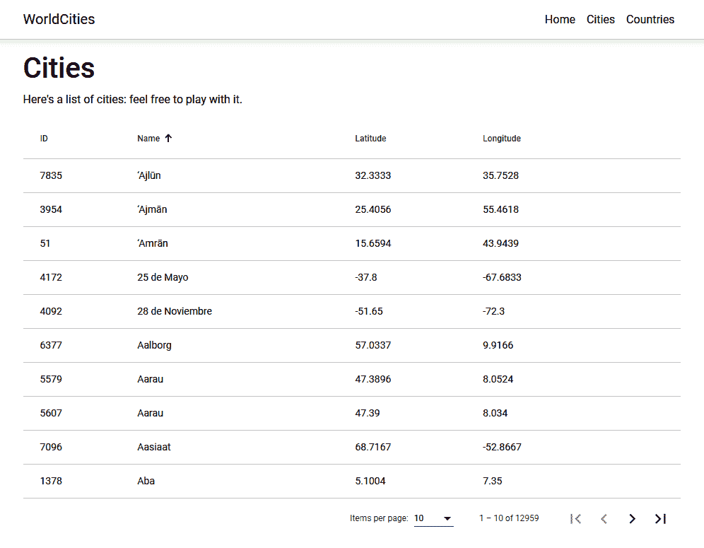

正如我们所看到的，城市现在是按字母顺序升序排列的。如果我们单击各个列标题，我们可以随意更改它们的顺序：第一次单击将按升序对内容进行排序，而第二次单击则相反。

It's worth noting how the paging and sorting features are able to coexist without issues; needless to say, whenever we try to change the table sorting, the paging will just roll back to the first page.

现在已经实现了排序，只剩下一个缺少的特性：**过滤**。

# 添加过滤

如果我们认为我们能够摆脱另一个组件，这一次，我们会感到失望：角材质没有提供用于过滤目的的特定模块。这意味着我们不能依靠标准方法将筛选添加到表中；我们必须自己想出一个合理的办法。

一般来说，当我们需要自己编写一个功能时，最好的办法就是开始可视化我们想要它的样子：例如，我们可以想象一个位于表格顶部的搜索输入字段会触发我们的`CitiesComponent`从服务器重新加载城市数据——通过它的`getData()`方法–每当我们在其中键入内容时。听起来怎么样？

让我们试着制定一个行动计划：

1.  和往常一样，我们需要扩展`ApiResult`类，以编程方式处理服务器端的过滤任务。
2.  我们还需要更改我们的.NET`CitiesController`的`GetCities()`操作方法的签名，以便我们可以从客户端获取附加信息。
3.  在那之后，我们必须在我们的`CitiesComponent`中实现过滤逻辑。
4.  最后但并非最不重要的一点是，我们需要在`CitiesComponent`HTML 模板文件中添加输入文本框，并将一个事件绑定到该文本框，以便在键入某个内容时触发数据检索过程。

既然我们已经做到了，让我们尽最大努力把这个计划付诸实施。

# 扩展结果（再次）

似乎我们需要对我们钟爱的`ApiResult`类进行另一次升级，以向已经存在的分页和排序逻辑添加过滤支持。

说实话，我们不必在`ApiResult`类中做任何事情：我们可以完全跳过该部分，只需在现有`CitiesController`中添加以下内容：

```cs
// ...existing code...

[HttpGet]
public async Task<ActionResult<ApiResult<City>>> GetCities(
        int pageIndex = 0,
        int pageSize = 10,
        string sortColumn = null,
        string sortOrder = null,
 string filterColumn = null,
 string filterQuery = null)
{
 // first we perform the filtering...
 var cities = _context.Cities;
 if (!String.IsNullOrEmpty(filterColumn) 
 && !String.IsNullOrEmpty(filterQuery))
 {
 cities= cities.Where(c => c.Name.Contains(filterQuery));
 }

 // ... and then we call the ApiResult
 return await ApiResult<City>.CreateAsync(
 cities,
 pageIndex,
 pageSize,
 sortColumn,
 sortOrder);
}

// ...existing code...
```

这绝对是一个可行的方法。事实上，如果我们不使用`System.Linq.Dynamic.Core`包库，这很可能是唯一可能的方法：我们将无法使用与泛型`IQueryable<T>`对象一起工作的外部类以编程方式设置列过滤器，因此不知道实体类型和属性名称。

幸运的是，我们确实有这个包，因此我们可以避免执行前面的更改（或者回滚，如果我们已经这样做了），而是用以下方式修改我们的`/Data/ApiResult.cs`类文件：

```cs
using Microsoft.EntityFrameworkCore;
using System;
using System.Collections.Generic;
using System.Linq;
using System.Threading.Tasks;
using System.Linq.Dynamic.Core;

namespace WorldCities.Data
{
    public class ApiResult<T>
    {
        /// <summary>
        /// Private constructor called by the CreateAsync method.
        /// </summary>
        public ApiResult(
            List<T> data,
            int count,
            int pageIndex,
            int pageSize,
            string sortColumn,
            string sortOrder,
 string filterColumn,
 string filterQuery)
        {
            Data = data;
            PageIndex = pageIndex;
            PageSize = pageSize;
            TotalCount = count;
            TotalPages = (int)Math.Ceiling(count / (double)pageSize);
            SortColumn = sortColumn;
            SortOrder = sortOrder;
 FilterColumn = filterColumn;
 FilterQuery = filterQuery;
        }

        #region Methods
        /// <summary>
        /// Pages, sorts and/or filters a IQueryable source.
        /// </summary>
        /// <param name="source">An IQueryable source of generic 
        /// type</param>
        /// <param name="pageIndex">Zero-based current page index 
        /// (0 = first page)</param>
        /// <param name="pageSize">The actual size of 
        /// each page</param>
        /// <param name="sortColumn">The sorting colum name</param>
        /// <param name="sortOrder">The sorting order ("ASC" or 
        /// "DESC")</param>
 /// <param name="filterColumn">The filtering column name</param>
 /// <param name="filterQuery">The filtering query (value to
        /// lookup)</param>
        /// <returns>
        /// A object containing the IQueryable paged/sorted/filtered
        /// result 
        /// and all the relevant paging/sorting/filtering navigation
        /// info.
        /// </returns>
        public static async Task<ApiResult<T>> CreateAsync(
            IQueryable<T> source,
            int pageIndex,
            int pageSize,
            string sortColumn = null,
            string sortOrder = null,
 string filterColumn = null,
 string filterQuery = null)
        {
 if (!String.IsNullOrEmpty(filterColumn)
 && !String.IsNullOrEmpty(filterQuery)
 && IsValidProperty(filterColumn))
 {
 source = source.Where(
 String.Format("{0}.Contains(@0)", 
 filterColumn), 
 filterQuery);
 }

            var count = await source.CountAsync();

            if (!String.IsNullOrEmpty(sortColumn)
                && IsValidProperty(sortColumn))
            {
                sortOrder = !String.IsNullOrEmpty(sortOrder) 
                    && sortOrder.ToUpper() == "ASC"
                    ? "ASC"
                    : "DESC";
                source = source.OrderBy(
                    String.Format(
                        "{0} {1}",
                        sortColumn,
                        sortOrder)
                    );
            }

            source = source
                .Skip(pageIndex * pageSize)
                .Take(pageSize);

            var data = await source.ToListAsync();

            return new ApiResult<T>(
                data,
                count,
                pageIndex,
                pageSize,
                sortColumn,
                sortOrder,
 filterColumn,
 filterQuery);
        }
        #endregion

        #region Methods
        /// <summary>
        /// Checks if the given property name exists
        /// to protect against SQL injection attacks
        /// </summary>
        public static bool IsValidProperty(
            string propertyName,
            bool throwExceptionIfNotFound = true)
        {
            var prop = typeof(T).GetProperty(
                propertyName,
                BindingFlags.IgnoreCase |
                BindingFlags.Public |
                BindingFlags.Instance);
            if (prop == null && throwExceptionIfNotFound)
                throw new NotSupportedException(
                    String.Format(
                        "ERROR: Property '{0}' does not exist.",
                        propertyName)
                    );
            return prop != null;
        }
        #endregion

        #region Properties
        /// <summary>
        /// The data result.
        /// </summary>
        public List<T> Data { get; private set; }

        /// <summary>
        /// Zero-based index of current page.
        /// </summary>
        public int PageIndex { get; private set; }

        /// <summary>
        /// Number of items contained in each page.
        /// </summary>
        public int PageSize { get; private set; }

        /// <summary>
        /// Total items count
        /// </summary>
        public int TotalCount { get; private set; }

        /// <summary>
        /// Total pages count
        /// </summary>
        public int TotalPages { get; private set; }

        /// <summary>
        /// TRUE if the current page has a previous page,
        /// FALSE otherwise.
        /// </summary>
        public bool HasPreviousPage
        {
            get
            {
                return (PageIndex > 0);
            }
        }

        /// <summary>
        /// TRUE if the current page has a next page, FALSE otherwise.
        /// </summary>
        public bool HasNextPage
        {
            get
            {
                return ((PageIndex +1) < TotalPages);
            }
        }

        /// <summary>
        /// Sorting Column name (or null if none set)
        /// </summary>
        public string SortColumn { get; set; }

        /// <summary>
        /// Sorting Order ("ASC", "DESC" or null if none set)
        /// </summary>
        public string SortOrder { get; set; }

 /// <summary>
 /// Filter Column name (or null if none set)
 /// </summary>
 public string FilterColumn { get; set; }

 /// <summary>
 /// Filter Query string 
 /// (to be used within the given FilterColumn)
 /// </summary>
 public string FilterQuery { get; set; }
        #endregion
    }
}
```

就这样。正如我们所见，由于`System.Linq.Dynamic.Core`包提供了另一种有用的扩展方法，我们能够以编程方式实现`IQueryable<T>.Where()`方法——它实际上执行过滤任务。

不用说，我们再次利用我们的`IsValidProperty`方法来屏蔽我们的代码，防止可能的 SQL 注入尝试：过滤相关逻辑（和动态 LINQ 查询）只有在返回`True`时才会执行，也就是说，如果`filterColumn`参数值与现有实体公共属性匹配。

在这里，我们还添加了两个附加属性（`FilterColumn`和`FilterQuery`，以便在 JSON 响应对象上使用它们，并相应地修改了构造函数方法签名。

# 花旗控制器

现在，我们可以打开我们的`/Controllers/CitiesController.cs`文件并进行以下更改：

```cs
[HttpGet]
public async Task<ActionResult<ApiResult<City>>> GetCities(
        int pageIndex = 0,
        int pageSize = 10,
        string sortColumn = null,
        string sortOrder = null,
 string filterColumn = null,
 string filterQuery = null)
{
    return await ApiResult<City>.CreateAsync(
            _context.Cities,
            pageIndex,
            pageSize,
            sortColumn,
            sortOrder,
 filterColumn,
 filterQuery);
}
```

前面的代码与我们在上一节中假设的替代实现非常相似：正如我们前面提到的，这两种方法都是可行的，取决于我们的喜好。然而，由于我们将在短时间内为*国家*使用相同的实现，因此充分利用`System.Linq.Dynamic.Core`并集中所有`IQueryable`逻辑可以说是一种更好的方法，因为它使我们的源代码尽可能干燥。

**Don't Repeat Yourself **(**DRY**) is a widely achieved principle of software development. Whenever we violate it, we fall into a **WET** approach, which could mean **Write Everything Twice**, **We Enjoy Typing**, or **Waste Everyone's Time**, depending on what we like the most.

NET 部分完成；让我们继续讨论Angular问题。

# CitiesComponent

打开`/ClientApp/src/app/cities/cities.component.ts`文件并按以下方式更新其内容（修改的行突出显示）：

```cs
import { Component, Inject, ViewChild } from '@angular/core';
import { HttpClient, HttpParams } from '@angular/common/http';
import { MatTableDataSource } from '@angular/material/table';
import { MatPaginator, PageEvent } from '@angular/material/paginator';
import { MatSort } from '@angular/material/sort';

import { City } from './city';

@Component({
  selector: 'app-cities',
  templateUrl: './cities.component.html',
  styleUrls: ['./cities.component.css']
})
export class CitiesComponent {
  public displayedColumns: string[] = ['id', 'name', 'lat', 'lon'];
  public cities: MatTableDataSource<City>;

  defaultPageIndex: number = 0;
  defaultPageSize: number = 10;
  public defaultSortColumn: string = "name";
  public defaultSortOrder: string = "asc";

  defaultFilterColumn: string = "name";
  filterQuery:string = null;

  @ViewChild(MatPaginator) paginator: MatPaginator;
  @ViewChild(MatSort) sort: MatSort;

  constructor(
      private http: HttpClient,
      @Inject('BASE_URL') private baseUrl: string) {
  }

  ngOnInit() {
      this.loadData(null);
  }

  loadData(query: string = null) {
    var pageEvent = new PageEvent();
    pageEvent.pageIndex = this.defaultPageIndex;
    pageEvent.pageSize = this.defaultPageSize;
 if (query) {
 this.filterQuery = query;
 }
    this.getData(pageEvent);
  }

  getData(event: PageEvent) {
    var url = this.baseUrl + 'api/Cities';
    var params = new HttpParams()
      .set("pageIndex", event.pageIndex.toString())
      .set("pageSize", event.pageSize.toString())
      .set("sortColumn", (this.sort)
        ? this.sort.active
        : this.defaultSortColumn)
      .set("sortOrder", (this.sort)
        ? this.sort.direction
        : this.defaultSortOrder);

 if (this.filterQuery) {
 params = params
 .set("filterColumn", this.defaultFilterColumn)
 .set("filterQuery", this.filterQuery);
 }

    this.http.get<any>(url, { params })
      .subscribe(result => {
        this.paginator.length = result.totalCount;
        this.paginator.pageIndex = result.pageIndex;
        this.paginator.pageSize = result.pageSize;
        this.cities = new MatTableDataSource<City>(result.data);
      }, error => console.error(error));
  }
}
```

这一次，新代码只包含几个额外的行；我们刚刚更改了`loadData()`方法的签名（使用`null`默认值，这样我们就不会破坏任何东西），并有条件地向 HTTP 请求添加了几个参数——就是这样。

# CitiesComponent 模板（HTML）文件

让我们看看我们需要在`/ClientApp/src/app/cities/cities.component.html`模板文件中添加什么：

```cs
<h1>Cities</h1>

<p>Here's a list of cities: feel free to play with it.</p>

<p *ngIf="!cities"><em>Loading...</em></p>

<mat-form-field [hidden]="!cities">
 <input matInput (keyup)="loadData($event.target.value)" 
        placeholder="Filter by name (or part of it)...">
</mat-form-field>

<table mat-table [dataSource]="cities" class="mat-elevation-z8" [hidden]="!cities"
    matSort (matSortChange)="loadData()"
    matSortActive="{{defaultSortColumn}}" matSortDirection="{{defaultSortOrder}}">

// ...existing code...
```

正如我们所看到的，我们刚刚添加了一个`<mat-form-field>`元素，该元素具有通常的`[hidden]`属性绑定（使其仅在我们的城市加载后出现）和一个`(keyup)`事件绑定，该绑定将在每次按键时触发`loadData()`方法；这个调用还将包含输入值，它将由我们的`Component`类通过我们刚才在那里实现的方法来处理。

# CitiesComponent 样式（CSS）文件

在测试之前，我们还需要对`/ClientApp/src/app/cities/cities.component.css`文件做一个小改动：

```cs
table {
  width: 100%;
}

.mat-form-field {
 font-size: 14px;
 width: 100%;
}
```

这是使我们的新`MatInputModule`跨越整个可用空间所必需的（默认限制为`180px`。

# 角材料模块

等等：我们刚才不是说了`MatInputModule`吗？这是正确的：事实上，看起来我们实际上毕竟使用了一个Angular材质模块——这是有充分理由的，因为它看起来比普通的 HTML 输入文本框要好得多！

然而，既然我们这样做了，我们需要在`AngularMaterialModule`容器中引用它，否则我们将得到一个编译器错误。为此，打开`/ClientApp/src/app/angular-material.module.ts`文件并添加以下行：

```cs
import { NgModule } from '@angular/core';
import { MatTableModule } from '@angular/material/table';
import { MatPaginatorModule } from '@angular/material/paginator';
import { MatSortModule } from '@angular/material/sort';
import { MatInputModule } from '@angular/material/input';

@NgModule({
  imports: [
    MatTableModule,
    MatPaginatorModule,
    MatSortModule,
 MatInputModule
  ],
  exports: [
    MatTableModule,
    MatPaginatorModule,
    MatSortModule,
 MatInputModule
  ]
})

export class AngularMaterialModule { }
```

就是这样：现在，我们可以点击*F5*并导航到`Cities`视图来测试新的过滤功能。如果我们做得很好，我们应该能够看到类似于以下屏幕截图的内容：

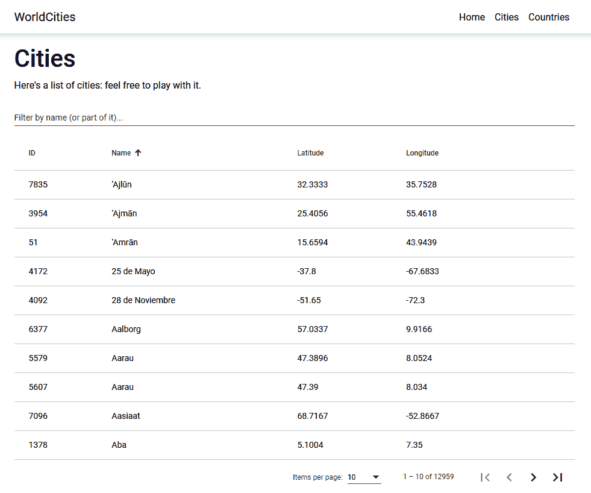

看起来不错，对吧

如果我们试图在 filter 文本框中键入一些内容，我们应该会看到表和分页器会相应地实时更新。看看如果我们输入`New York`会发生什么：

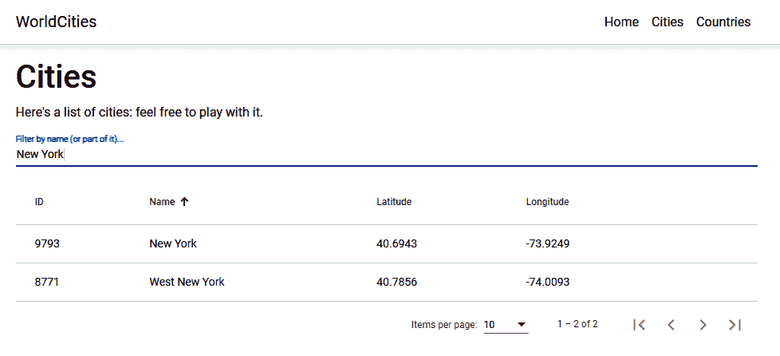

这绝对是一个很好的实时过滤功能。

# 将国家添加到循环中

在继续之前，让各国跟上进度如何？是的，这意味着我们要重做我们第二次做的一切；然而，现在我们知道如何做到这一点，我们可以说是能够做到这一点在一瞬间

... 也许不是。

尽管如此，我们现在确实应该花一些合理的时间来做这件事，因为这将是一个很好的方法，可以将我们迄今为止学到的一切都植入我们的肌肉记忆中。

让我们这样做，以便我们可以继续尝试其他内容。为了避免浪费页面，我们将只关注此处最相关的步骤，而将其他所有内容留给我们刚刚对城市所做的事情，以及我们的 GitHub 存储库，它承载了我们需要做的全部源代码。

# .NET Core

让我们从.NET Core部分开始。

# 国家控制员

我们应该已经准备好了[第 4 章](04.html)中的`CountriesController`，具有实体框架核心的*数据模型，对吗？打开该文件并用以下代码替换`GetCountries()`默认操作方法：*

```cs
// ...existing code...

[HttpGet]
public async Task<ActionResult<ApiResult<Country>>> GetCountries(
 int pageIndex = 0,
 int pageSize = 10,
 string sortColumn = null,
 string sortOrder = null,
 string filterColumn = null,
 string filterQuery = null)
{
 return await ApiResult<Country>.CreateAsync(
 _context.Countries,
 pageIndex,
 pageSize,
 sortColumn,
 sortOrder,
 filterColumn,
 filterQuery);
}

// ...existing code...
```

幸运的是，我们的`ApiResult`类是类型不可知的；因此，我们可以在那里毫无问题地使用它。此外，由于我们已经将所有的艰苦工作集中在那里，.NET 服务器端部分已经完成。

# 一个奇怪的 JSON 命名问题

在继续之前，让我们快速测试组件：点击*F5*并在浏览器的地址栏中键入以下 URL:[https://localhost:44334/api/Countries/?pageIndex=0 &页面大小=2](https://localhost:44334/api/Countries/?pageIndex=0&pageSize=3)。

点击*进入*后，应该可以看到如下界面：

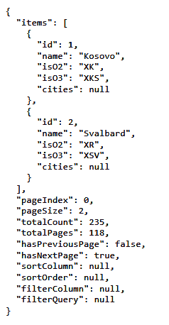

好像都是 g。。。嘿，等一下：`isO2`和`isO3`房产名称是怎么回事？他们不应该这样资本化！

为了理解那里发生了什么，我们需要退一步，承认到目前为止我们可能低估的东西：全新的`System.Text.Json`API（与.NET Core 3 一起引入）在将所有.NET 类序列化为 JSON 时自动进行的 camelCase 转换。在本章的早期，我们已经讨论过这个问题，当我们第一次看到.NET`CitiesController`JSON 输出时，我们说这没什么大不了的，因为 Angular 也是面向 camelCase 的–我们只需要使用 camelCase 定义各种接口即可

不幸的是，当处理所有大写属性（如这两个）时，这种自动的 camelCase 转换可能会导致不必要的副作用；无论何时发生这种情况，我们都需要调整源代码以正确处理：

*   最明显的事情是，用完全相同的方式在我们的Angular界面中定义它们，也就是说，使用精确的外壳；*然而，这意味着在整个 Angular 代码中处理这些`isO2`和`isO3`变量名，这相当难看，也可能会产生误导。*
**   如果我们不想采用这些可怕的属性名称，那么我们可以使用另一种——也可以说是更好的——解决方法：我们可以使用`[JsonPropertyName]`数据注释来装饰我们的违规属性，这允许我们强制使用 JSON 属性名称，而不管默认的大小写约定（camelCase 或 PascalCase）在`Startup`类中指定。*

 *`[JsonPropertyName]`解决方案似乎是我们可以应用于特定场景的最合理的解决方案；让我们随它去，永远摆脱这样的问题吧！

打开`/Data/Country.cs`文件，将以下行添加到现有代码中（突出显示新行）：

```cs
// ...existing code...

/// <summary>
/// Country code (in ISO 3166-1 ALPHA-2 format)
/// </summary>
[JsonPropertyName("iso2")]
public string ISO2 { get; set; }

/// <summary>
/// Country code (in ISO 3166-1 ALPHA-3 format)
/// </summary>
[JsonPropertyName("iso3")]
public string ISO3 { get; set; }

// ...existing code...
```

现在，我们可以通过点击*F5*并在浏览器的地址栏中键入与之前相同的 URL:[来查看这些属性是否会尊重此行为 https://localhost:44334/api/Countries/?pageIndex=0 &页面大小=2](https://localhost:44334/api/Countries/?pageIndex=0&pageSize=3)：

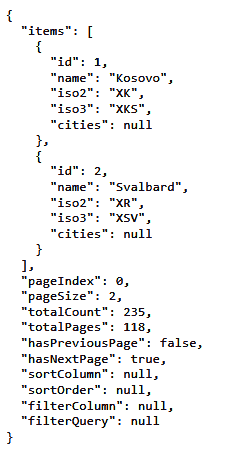

看起来确实如此；由于这个意想不到的问题，我们有机会为我们的.NET Core武库添加一个新的强大武器。

现在，我们只需要创建和配置Angular分量。

# 有棱角的

Angular实现将比.NET Core实现更简单，因为我们必须处理多个方面：

*   添加`CountriesComponent`TS、HTML 和 CSS 文件，实现`Countries`表，以及分页、排序和过滤功能，就像我们对城市所做的那样
*   配置`AppModule`以正确引用它并添加相应的路由
*   更新`NavComponent`添加导航链接

让我们这样做！在解决方案资源管理器中，执行以下操作：

1.  导航到`/ClientApp/src/app/ `文件夹。
2.  创建一个新的`/countries/`文件夹。
3.  在该文件夹中，创建以下新文件：

*   `country.ts`
*   `countries.component.ts`
*   `countries.component.html`
*   `countries.component.css`

完成后，用以下内容填充它们。

# country.ts

以下是`/ClientApp/src/app/countries/country.ts`接口文件的源代码：

```cs
export interface Country {
    id: number;
    name: string;
    iso2: string;
    iso3: string;
}
```

这里没有什么新东西——代码与我们创建`city.ts`接口文件时的代码非常相似。

# countries.component.ts

以下是`/ClientApp/src/app/countries/countries.component.ts`文件的源代码：

```cs
import { Component, Inject, ViewChild } from '@angular/core';
import { HttpClient, HttpParams } from '@angular/common/http';
import { MatTableDataSource } from '@angular/material/table';
import { MatPaginator, PageEvent } from '@angular/material/paginator';
import { MatSort } from '@angular/material/sort';

import { Country } from './country';

@Component({
  selector: 'app-countries',
  templateUrl: './countries.component.html',
  styleUrls: ['./countries.component.css']
})
export class CountriesComponent {
  public displayedColumns: string[] = ['id', 'name', 'iso2', 'iso3'];
  public countries: MatTableDataSource<Country>;

  defaultPageIndex: number = 0;
  defaultPageSize: number = 10;
  public defaultSortColumn: string = "name";
  public defaultSortOrder: string = "asc";

  defaultFilterColumn: string = "name";
  filterQuery: string = null;

  @ViewChild(MatPaginator) paginator: MatPaginator;
  @ViewChild(MatSort) sort: MatSort;

  constructor(
    private http: HttpClient,
    @Inject('BASE_URL') private baseUrl: string) {
  }

  ngOnInit() {
    this.loadData(null);
  }

  loadData(query: string = null) {
    var pageEvent = new PageEvent();
    pageEvent.pageIndex = this.defaultPageIndex;
    pageEvent.pageSize = this.defaultPageSize;
    if (query) {
        this.filterQuery = query;
    }
    this.getData(pageEvent);
  }

  getData(event: PageEvent) {
    var url = this.baseUrl + 'api/Countries';
    var params = new HttpParams()
      .set("pageIndex", event.pageIndex.toString())
      .set("pageSize", event.pageSize.toString())
      .set("sortColumn", (this.sort)
        ? this.sort.active
        : this.defaultSortColumn)
      .set("sortOrder", (this.sort)
        ? this.sort.direction
        : this.defaultSortOrder);

    if (this.filterQuery) {
      params = params
        .set("filterColumn", this.defaultFilterColumn)
        .set("filterQuery", this.filterQuery);
    }

    this.http.get<any>(url, { params })
      .subscribe(result => {
        this.paginator.length = result.totalCount;
        this.paginator.pageIndex = result.pageIndex;
        this.paginator.pageSize = result.pageSize;
        this.countries = new MatTableDataSource<Country>(result.data);
      }, error => console.error(error));
  }
}
```

同样，这基本上是`cities.component.ts`文件的镜像。

# countries.component.html

以下是`/ClientApp/src/app/countries/countries.component.html`文件的源代码：

```cs
<h1>Countries</h1>

<p>Here's a list of countries: feel free to play with it.</p>

<p *ngIf="!countries"><em>Loading...</em></p>

<mat-form-field [hidden]="!countries">
  <input matInput (keyup)="loadData($event.target.value)"
      placeholder="Filter by name (or part of it)...">
</mat-form-field>

<table mat-table [dataSource]="countries" class="mat-elevation-z8" 
 [hidden]="!countries"
    matSort (matSortChange)="loadData()"
    matSortActive="{{defaultSortColumn}}" 
     matSortDirection="{{defaultSortOrder}}">

  <!-- Id Column -->
  <ng-container matColumnDef="id">
    <th mat-header-cell *matHeaderCellDef mat-sort-header>ID</th>
    <td mat-cell *matCellDef="let country"> {{country.id}} </td>
  </ng-container>

  <!-- Name Column -->
  <ng-container matColumnDef="name">
    <th mat-header-cell *matHeaderCellDef mat-sort-header>Name</th>
    <td mat-cell *matCellDef="let country"> {{country.name}} </td>
  </ng-container>

  <!-- Lat Column -->
  <ng-container matColumnDef="iso2">
    <th mat-header-cell *matHeaderCellDef mat-sort-header>ISO 2</th>
    <td mat-cell *matCellDef="let country"> {{country.iso2}} </td>
  </ng-container>

  <!-- Lon Column -->
  <ng-container matColumnDef="iso3">
    <th mat-header-cell *matHeaderCellDef mat-sort-header>ISO 3</th>
    <td mat-cell *matCellDef="let country"> {{country.iso3}} </td>
  </ng-container>

  <tr mat-header-row *matHeaderRowDef="displayedColumns"></tr>
  <tr mat-row *matRowDef="let row; columns: displayedColumns;"></tr>
</table>

<!-- Pagination directive -->
<mat-paginator [hidden]="!countries"
    (page)="pageEvent = getData($event)"
    [pageSize]="10"
    [pageSizeOptions]="[10, 20, 50]"
    showFirstLastButtons></mat-paginator>
```

正如预期的那样，该模板与`cities.component.html`模板文件几乎相同。

# countries.component.css

以下是`/ClientApp/src/app/countries/countries.component.css`**文件的源代码：**

```cs
table {
  width: 100%;
}

.mat-form-field {
  font-size: 14px;
  width: 100%;
}
```

前面的文件与`cities.components.css`文件非常相似，我们甚至可以引用它，而不是创建一个新的文件；但是，考虑到以后可能需要对`Cities`和`Countries`表应用不同的更改，处理单独的文件几乎总是一个更好的选择。

# 应用模块

现在，让我们将新组件注册到`AppModule`配置文件中。

打开`/ClientApp/src/app/app.module.ts`文件并添加以下突出显示的行：

```cs
import { BrowserModule } from '@angular/platform-browser';
import { NgModule } from '@angular/core';
import { FormsModule } from '@angular/forms';
import { HttpClientModule, HTTP_INTERCEPTORS } from '@angular/common/http';
import { RouterModule } from '@angular/router';

import { AppComponent } from './app.component';
import { NavMenuComponent } from './nav-menu/nav-menu.component';
import { HomeComponent } from './home/home.component';
import { CitiesComponent } from './cities/cities.component';
import { CountriesComponent } from './countries/countries.component';
import { BrowserAnimationsModule } from '@angular/platform-browser/animations';
import { AngularMaterialModule } from './angular-material.module';

@NgModule({
  declarations: [
    AppComponent,
    NavMenuComponent,
    HomeComponent,
    CitiesComponent,
 CountriesComponent
  ],
  imports: [
    BrowserModule.withServerTransition({ appId: 'ng-cli-universal' }),
    HttpClientModule,
    FormsModule,
    RouterModule.forRoot([
      { path: '', component: HomeComponent, pathMatch: 'full' },
      { path: 'cities', component: CitiesComponent },
 { path: 'countries', component: CountriesComponent }
    ]),
    BrowserAnimationsModule,
    AngularMaterialModule
  ],
  providers: [],
  bootstrap: [AppComponent]
})
export class AppModule { }
```

前面的`RouterModule`配置将使我们的新`CountriesComponent`在客户端浏览器指向`/countries`专用路径时得到 Angular 的服务。然而，如果我们不在`NavComponent`菜单中添加可见链接，我们的用户就不会知道这样一条路线的存在；这正是我们要添加它的原因。

# 导航组件

打开`/ClientApp/src/app/nav-menu/nav-menu.component.html`文件，将以下突出显示的行添加到现有代码中：

```cs
// ...existing code...

<ul class="navbar-nav flex-grow">
  <li
    class="nav-item"
    [routerLinkActive]="['link-active']"
    [routerLinkActiveOptions]="{ exact: true }"
  >
    <a class="nav-link text-dark" [routerLink]="['/']">Home</a>
  </li>
  <li class="nav-item" [routerLinkActive]="['link-active']">
    <a class="nav-link text-dark" [routerLink]="['/cities']"
      >Cities</a
    >
  </li>
 <li class="nav-item" [routerLinkActive]="['link-active']">
 <a class="nav-link text-dark" [routerLink]="['/countries']"
 >Countries</a
 >
 </li>
</ul>

// ...existing code...
```

... 就这样！

我们的`CountriesComponent`已经完成了，而且——如果我们没有犯错误的话——它应该以与我们所爱的`CitiesComponent`差不多的方式工作，而我们所爱的`CitiesComponent`花了这么多时间才完成。

# 测试国家/地区组件

是时候看看我们努力工作的结果了：点击*F5，*导航到国家视图，期待看到以下内容：

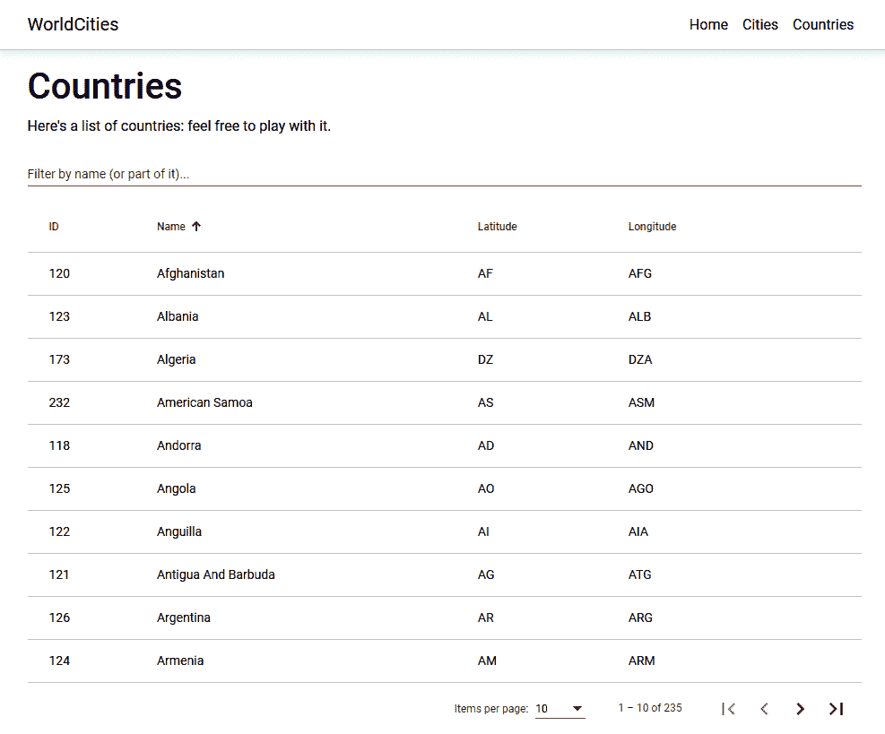

如果我们能在第一次尝试时得到同样的结果，那肯定意味着我们已经吸取了教训；如果我们没有，不要担心：我们只需要检查一下我们做错了什么，然后修复它。熟能生巧。

The browser's console log can be a very useful tool for debugging the server-side and client-side errors: most Angular errors come with well-documented exception text and a contextual link to the corresponding file and source code line, thus making it quite easy for the developer to understand what happens under the hood.

# 总结

本章是关于从.NET Core*后端*读取数据，并找到一种方法，通过Angular*前端*将数据正确显示给浏览器。

我们开始使用我们现有的`CitiesController`**获取大量具有Angular分量的城市；尽管这两个框架都能够完美地处理海量数据，但我们很快就明白，我们需要改进整个数据请求、响应和渲染流过程，以便为用户提供良好的用户体验。**

 **正是出于这个原因，我们选择采用`System.Linq.Dynamic.Core`.NET 包来改进*s*服务器端业务逻辑和 Angular Material npm 包，以极大地改进我们的客户端 UI：通过结合这两个包的强大功能，我们成功地实现了一系列有趣的功能：分页、排序、，在我们的开发过程中，我们还借此机会发现、解决和缓解了一些重要的安全问题，例如有害的 SQL 注入风险。

在完成`Cities`的工作后，我们立即转到`Countries`，借此机会回顾我们的步骤，并将我们刚刚学到的东西巩固到我们的肌肉记忆中。

经过我们所有的努力，我们可以肯定地说，我们做了一项伟大的工作，实现了我们的目标：能够从.NET Core*后端*读取我们的数据，并通过*前端*以 Angular 优雅地呈现出来，从而使最终用户完全能够看到并与之交互。

我们现在准备为我们的应用增加另一层复杂性：让我们的用户有机会修改现有数据和/或使用 HTML 表单添加新数据；这些功能是大多数交互式 web 应用（如 CMS、论坛、社交网络、聊天室等）的必备功能。在下一章中，我们将看到如何使用反应式表单处理此类任务，反应式表单是一个关键的Angular模块，它提供了一种模型驱动的方法来处理值随时间变化的表单输入。

# 建议的主题

JSON、RESTful 约定、HTTP 谓词、HTTP 状态、生命周期挂钩、客户端分页、服务器端分页、排序、筛选、依赖项注入、SQL 注入

# .NET Core

System.Linq、System.Linq.Dynamic.Core、IQueryable、实体框架核心

# 有棱角的

组件、路由、模块、AppModule、HttpClient、ngIf、隐藏、数据绑定、属性绑定、属性绑定、ngFor、指令、结构指令、插值、模板

# 工具书类

*   *添加排序、过滤和分页–ASP.NET MVC 与 EF 核心*：[https://docs.microsoft.com/en-us/aspnet/core/data/ef-mvc/sort-filter-page](https://docs.microsoft.com/en-us/aspnet/core/data/ef-mvc/sort-filter-page?view=aspnetcore-3.0)
*   *角材官网*：[https://material.angular.io/](https://material.angular.io/)
*   *角材库*：[https://github.com/angular/components](https://github.com/angular/components)
*   *角材：表概图*：[https://material.angular.io/components/table/overview](https://material.angular.io/components/table/overview)
*   *Angular-视图儿童*：[https://angular.io/api/core/ViewChild](https://angular.io/api/core/ViewChild)
*   GitHub 上的*System.Linq.Dynamic.Core 项目页面*：[https://github.com/StefH/System.Linq.Dynamic.Core](https://github.com/StefH/System.Linq.Dynamic.Core)
*   *LINQ 概述*：[https://docs.microsoft.com/en-us/dotnet/csharp/linq/](https://docs.microsoft.com/en-us/dotnet/csharp/linq/)
*   *LINQ（语言综合查询）*：*[https://docs.microsoft.com/en-us/dotnet/csharp/programming-guide/concepts/linq/](https://docs.microsoft.com/en-us/dotnet/csharp/programming-guide/concepts/linq/)*
**   *LINQ Lambda 表达式（C#编程指南）*：[https://docs.microsoft.com/en-us/dotnet/csharp/programming-guide/statements-expressions-operators/lambda-expressions](https://docs.microsoft.com/en-us/dotnet/csharp/programming-guide/statements-expressions-operators/lambda-expressions)*   *LINQ 查询表达式基础*：[https://docs.microsoft.com/en-us/dotnet/csharp/linq/query-expression-basics](https://docs.microsoft.com/en-us/dotnet/csharp/linq/query-expression-basics)*   *反射（C#）*：[https://docs.microsoft.com/en-us/dotnet/csharp/programming-guide/concepts/reflection](https://docs.microsoft.com/en-us/dotnet/csharp/programming-guide/concepts/reflection)*   *.NET Core和实体框架：使用动态 LINQ*：[编程设置 IQueryable<T>列名 https://www.ryadel.com/en/asp-net-core-set-column-name-programmatically-dynamic-linq-where-iqueryable/](https://www.ryadel.com/en/asp-net-core-set-column-name-programmatically-dynamic-linq-where-iqueryable/)*   *理解 SQL 注入*：[https://tools.cisco.com/security/center/resources/sql_injection](https://tools.cisco.com/security/center/resources/sql_injection)*************