# 十、认证和授权

一般来说，术语*认证*指的是任何验证某人（无论是人还是自动系统）是其声称的人（或什么）的过程。在**万维网**（**WWW**的上下文中也是如此，该词主要用于表示网站或服务使用的任何技术，以从用户代理（通常是 Web 浏览器）收集一组登录信息，并使用成员资格和/或身份服务对其进行身份验证。

不要将*认证*与*授权*混为一谈，因为这是一个不同的过程，负责一项非常不同的任务。为了给出一个快速定义，我们可以说授权的目的是确认允许请求用户访问他们想要执行的操作。换句话说，身份验证是关于他们是谁，授权是关于他们可以做什么。

为了更好地理解这两个显然相似的概念之间的差异，我们可以考虑两种现实场景：

*   一个免费但注册的账户，试图获得付费或仅限高级的服务或功能；这是已验证但未授权访问的常见示例；我们知道他们是谁，但他们不被允许去那里。
*   试图访问公开可用页面或文件的匿名用户；这是一个未经认证但经授权的访问示例；我们不知道他们是谁，但他们可以像其他人一样获得公共资源。

认证和授权将是本章的主要主题，我们将尝试从理论和实践的Angular来解决。更准确地说，我们将做以下工作：

*   **讨论一些典型场景**，其中可能需要或不需要身份验证和授权。
*   **引入 ASP.NET Core Identity**，这是一个现代会员制系统，允许开发人员向其应用添加登录功能，以及`IdentityServer`，中间件设计用于向任何 ASP.NET Core应用添加 OIDC 和 OAuth 2.0 端点。
*   **实现 ASP.NET Core身份和****身份服务器**为我们现有的`WorldCities`应用添加登录和注册功能。
*   **探索.NET Core 和 Angular Visual Studio 项目模板提供的 Angular 授权 API**，该 API 实现了**oidc 客户端**npm 包，与 ASP.NET Core 身份系统提供的 URI 端点交互，以及一些关键 Angular 特性，如**路由防护**以及**HTTP 拦截器**，处理整个授权流程。
*   **将上述后端和前端 API**集成到我们的`WorldCities`项目中，为我们的用户提供满意的认证和认证体验。

让我们尽力而为！

# 技术要求

在本章中，我们需要前面章节中列出的所有技术要求，以及以下附加包：

*   `Microsoft.AspNetCore.Identity.EntityFrameworkCore`
*   `Microsoft.AspNetCore.ApiAuthorization.IdentityServer`
*   `Microsoft.AspNetCore.Identity.UI`

和往常一样，避免直接安装它们是明智的：我们将在本章中引入它们，以便更好地将它们的用途与我们的项目联系起来。

本章的代码文件可在[中找到 https://github.com/PacktPublishing/ASP.NET-Core-3-and-Angular-9-Third-Edition/tree/master/Chapter_10/](https://github.com/PacktPublishing/ASP.NET-Core-3-and-Angular-9-Third-Edition/tree/master/Chapter_10/)

# 授权，还是不授权

事实上，对于大多数基于 web 的应用或服务，实现身份验证和/或授权逻辑并不是强制性的；有许多网站仍然没有做到这一点，主要是因为它们提供的内容可以在任何时候被任何人访问。直到几年前，这在大多数公司、营销和信息网站中都很常见；那是在他们的所有者了解到建立注册用户网络的重要性以及这些“忠诚”联系人如今的价值之前。

我们不需要成为有经验的开发者，就可以认识到 WWW 在过去几年中发生了多大的变化；如今，每一个网站，无论其目的如何，都有越来越多或或多或少的合法兴趣跟踪其用户，让他们有机会定制导航体验、与社交网络互动、收集电子邮件地址等等。如果没有某种身份验证机制，上述任何操作都无法完成。

有几十亿个网站和服务需要身份验证才能正常工作，因为它们的大部分内容和/或意图取决于注册用户的行为：论坛、博客、购物车、基于订阅的服务，甚至维基等协作工具。

长话短说，答案是肯定的；只要我们想让用户在我们的客户端应用中执行**创建、读取、更新和删除**（**CRUD**操作，毫无疑问我们应该实施某种身份验证和授权程序。如果我们的目标是生产就绪的**单页应用**（**SPA**），具有任何类型的用户交互，我们肯定想知道我们的用户的姓名和电子邮件地址。这是确定谁能够查看、添加、更新或删除我们的记录的唯一方法，更不用说执行管理级别的任务、跟踪我们的用户等等。

# 认证

自 WWW 诞生以来，绝大多数认证技术都依赖于**HTTP**/**HTTPS 实现标准**，它们的工作方式大致如下：

1.  未经身份验证的用户代理请求未经某种许可无法访问的内容。
2.  web 应用返回身份验证请求，通常以 HTML 页面的形式返回，其中包含要完成的空 web 表单。

3.  用户代理使用他们的凭证（通常是用户名和密码）填写 web 表单，然后使用`POST`命令发送回表单，该命令很可能是通过单击提交按钮发出的。
4.  web 应用接收`POST`数据并调用前面提到的服务器端实现，该实现将尝试使用给定的输入对用户进行身份验证，并返回适当的结果。
5.  如果结果成功，web 应用将对用户进行身份验证并将相关数据存储在某处，具体取决于所选的身份验证方法：会话/cookie、令牌、签名等等（我们将在后面讨论）。相反，结果将在错误页面中以可读结果的形式呈现给用户，可能会要求用户重试、联系管理员或其他。

这仍然是当今最常见的方法。我们所能想到的几乎所有网站都在使用它，尽管在安全层、状态管理、**JSON Web 令牌（JWT）**或其他 RESTful 令牌、基本或摘要访问、单点登录属性等方面存在许多大小差异。

# 第三方认证

除了要求用户开发可能导致安全风险的自定义密码存储技术外，每次访问网站时被迫使用可能不同的用户名和密码可能会令人沮丧。为了克服这个问题，大量 IT 开发人员开始寻找一种替代方法来验证用户，这种方法可以用基于可信第三方提供商的验证协议取代基于用户名和密码的标准验证技术。

# OpenID 的兴衰

在实现第三方认证机制的第一次成功尝试中，第一次发布了“OpenTID”OpenID AuthT1，这是一个由非营利 OpenID 基金会推动的开放和分散认证协议。自 2005 年推出以来，谷歌和 Stack Overflow 等一些大公司迅速而热情地采用了该技术，他们最初是基于该技术的身份验证提供商。

以下是它的工作原理：

*   每当我们的应用收到 OpenID 身份验证请求时，它就会通过请求用户和可信的第三方身份验证提供商（例如，**谷歌身份验证提供商**）打开一个透明的连接界面；该接口可以是弹出窗口、AJAX、填充模式窗口或 API 调用，具体取决于实现。
*   用户将其用户名和密码发送给上述第三方提供商，第三方提供商相应地执行身份验证，并通过将用户重定向到其来源地，以及可用于检索身份验证结果的安全令牌，将结果传递给我们的应用。
*   我们的应用使用令牌来检查身份验证结果，在成功的情况下对用户进行身份验证，或者在失败的情况下发送错误响应。

尽管 2005 至 2009 年间的热情高涨，但有许多相关公司公开宣布支持 OpenID，甚至加入了包括贝宝和脸谱网在内的基金会，但最初的协议没有达到其最大的期望：法律争议、安全问题，最重要的是，2009-2012 年期间，社交网络的大规模流行，以及基于**OAuth 的**社交登录，基本上扼杀了它。

Those who don't know what OAuth is, have some patience; we'll get there soon enough.

# OpenID 连接

2014 年 2 月，OpenID 基金会发布了 OpenID 技术的第三代，在一次绝望的尝试中，在接管了 OAuth/OAuth2 To1 的社会登录之后，保持旗飞行；这被称为**OpenID 连接（OIDC）**。

尽管有这个名字，新的部分与它的祖先几乎没有关系；它只是一个基于 OAuth2 授权协议的身份验证层。换句话说，它只不过是一个标准化的接口，帮助开发人员以一种不那么不恰当的方式使用 OAuth2 作为身份验证框架，考虑到 OAuth2 在最初推出 OpenID2.0 时起到了主要作用，这有点可笑。

2014 年，放弃 OpenID 而选择 OIDC 受到了强烈批评；然而，经过 3 年多的时间，我们可以肯定地说，OIDC 仍然可以提供一种有用的、标准化的获取用户身份的方法。它允许开发人员使用一个方便的、基于 RESTful 的 JSON 接口请求和接收有关经过身份验证的用户和会话的信息；它具有一个可扩展的规范，还支持一些有前途的可选功能，如身份数据加密、OpenID 提供程序的自动发现，甚至会话管理。简而言之，它仍然足够有用，可以用来代替纯 OAuth2。

For additional information about OpenID, we strongly suggest reading the following specifications from the OpenID Foundation official website:

**OpenID 连接**：
[http://openid.net/specs/openid-connect-core-1_0.html](http://openid.net/specs/openid-connect-core-1_0.html) 。

**OpenID2.0 到 OIDC 迁移指南**：
[http://openid.net/specs/openid-connect-migration-1_0.html](http://openid.net/specs/openid-connect-migration-1_0.html) 。

# 批准

在大多数标准实现中，包括 ASP.NET 所特有的实现，授权阶段在身份验证之后立即开始，并且主要基于权限或角色；任何经过身份验证的用户都可能拥有自己的权限集和/或属于一个或多个角色，因此被授予对特定资源集的访问权限。这些基于*角色的*检查通常由开发人员在应用源代码和/或配置文件中以声明方式设置。

正如我们所说的，授权不应该与身份验证混淆，尽管它也可以很容易地被利用来执行隐式身份验证，特别是当它被委托给第三方参与者时。

# 第三方授权

目前最著名的第三方授权协议是 OAuth 的 2.0 版本，也称为 OAuth2，它取代了 Blaine Cook 和 Chris Messina 于 2006 年最初开发的前一版本（OAuth 1 或简称 OAuth）。

我们已经谈论了很多关于它的好理由：OAuth 2 已经很快成为行业标准的授权协议，目前被大量基于社区的网站和社交网络使用，包括谷歌、Facebook 和 Twitter。它基本上是这样工作的：

*   每当现有用户通过 OAuth 向我们的应用请求一组权限时，我们都会在他们和我们的应用信任的第三方授权提供商（例如，Facebook）之间打开一个透明的连接接口。
*   提供商承认用户，如果用户拥有适当的权限，则通过向其委托一个临时的、特定的访问密钥进行响应。
*   用户向我们的应用提供访问密钥，并将被授予访问权限。

我们可以清楚地看到，利用这种授权逻辑进行身份验证是多么容易；毕竟，如果 Facebook 说我能做点什么，难道这不意味着我就是我所声称的那个人吗？这还不够吗？

简而言之，答案是否定的。Facebook 可能就是这样，因为其 OAuth 2 实现意味着接收授权的订阅者必须先通过 Facebook 的身份验证；然而，本保证书并未在任何地方书写。考虑到有多少网站使用它进行身份验证，我们可以假设 Facebook 不太可能改变他们的实际行为，但我们对此没有任何保证。

从理论上讲，这些网站可以随时将其授权系统从其身份验证协议中分离出来，从而导致我们的应用的身份验证逻辑处于不可恢复的不一致状态。更一般地说，我们可以说，假设某事物来自其他事物几乎总是一种糟糕的做法，除非该假设建立在非常坚实、有充分证据证明且（最重要的）有高度保证的基础上。

# 专有与第三方

从理论上讲，可以将身份验证和/或授权任务完全委托给现有的外部第三方提供商，如我们前面提到的提供商；现在有很多 web 和移动应用都自豪地遵循这条路线。使用这种方法有许多不可否认的优点，包括：

*   **没有特定于用户的 DB 表/数据模型**，只有一些基于提供者的标识符，可以在此处和那里用作参考键。
*   **立即注册**，因为不需要填写注册表单，也不需要等待确认电子邮件，没有用户名，没有密码。这将得到大多数用户的认可，并可能提高我们的转换率。
*   **很少或没有隐私问题**因为应用服务器上没有个人或敏感数据。
*   **无需处理用户名和密码**并执行自动恢复流程。
*   **更少的安全相关问题**例如基于表单的黑客攻击尝试或暴力登录尝试。

当然，也有一些不利因素：

*   **不会有实际的用户基础**，因此很难了解活跃用户的概况、获取他们的电子邮件地址、分析统计数据等。
*   **登录阶段可能是资源密集型**，因为它始终需要与第三方服务器进行外部、来回安全连接。
*   **所有用户都需要在所选的第三方提供商**处拥有（或开立）一个帐户才能登录。
*   **所有用户都需要信任我们的应用**，因为第三方提供商会要求他们授权它访问他们的数据。
*   **我们必须向提供商**注册我们的应用，以便能够执行许多必需或可选的任务，例如接收我们的公钥和密钥，授权一个或多个 URI 启动器，以及选择我们想要收集的信息。

考虑到所有这些利弊，我们可以说，对于包括我们在内的小规模应用来说，依赖第三方提供商可能是一个非常省时的选择；然而，构建我们自己的账户管理系统似乎是克服上述基于治理和控制的缺陷的唯一途径，这些缺陷不可否认是由该方法带来的。

在这本书中，我们将探索这两条路线，试图充分利用这两个世界。在本章中，我们将创建一个**内部成员资格提供者**，它将处理身份验证并提供自己的授权规则集；在下一章中，我们将进一步利用相同的实现来演示如何让用户有机会使用示例第三方身份验证提供商（Facebook）登录，并使用其 SDK 和 API 获取创建相应内部用户所需的数据，感谢 ASP.NET Core标识包提供的内置功能。

# 具有.NET Core的专有身份验证

ASP.NET Core 提供的身份验证模式基本上与以前版本的 ASP.NET 支持的模式相同：

*   **没有身份验证**如果我们不想实现任何东西，或者如果我们想使用（或开发）一个自制的身份验证接口而不依赖 ASP.NET Core身份系统
*   **个人用户账户**，当我们使用标准 ASP.NET Core身份界面建立内部数据库存储用户数据时
*   **Azure Active Directory**，这意味着使用由**Azure AD 验证库**（**ADAL**处理的基于令牌的 API 调用集）
*   **Windows 身份验证**，仅适用于 Windows 域或 Active Directory 树中的本地范围应用

然而，ASP.NET Core团队在过去几年中引入的实现模式正在不断发展，以匹配可用的最新安全实践。

除第一种方法外，上述所有方法均由**ASP.NET Core身份系统**处理，这是一种会员制系统，允许我们向应用添加身份验证和授权功能。

For additional info about the ASP.NET Core Identity APIs, check out the following URL:

[https://docs.microsoft.com/en-us/aspnet/core/security/authentication/identity](https://docs.microsoft.com/en-us/aspnet/core/security/authentication/identity)

从.Net Cype 3 开始，ASP.NET Core标识已经集成了一个新的 API 授权机制来处理 SPAS 中的身份验证：这个新的特征是基于 GoeT0T，一个开源的 OIDC 和 OAuth2 中间件，它是.NETCype 3 的.NET 基金会的一部分。

Further information about `IdentityServer` can be retrieved from the official documentation website, which is available at the following URLs:

[https://identityserver.io/](https://identityserver.io/) [](https://identityserver.io/) [http://docs.identityserver.io/en/latest/](http://docs.identityserver.io/en/latest/)

有了 ASP.NET Core标识，我们可以轻松实现登录机制，允许用户创建帐户并使用用户名和密码登录。除此之外，我们还可以让他们有机会使用外部登录提供者，只要框架支持；截至今天，可用的提供商名单包括 Facebook、Google、Microsoft 帐户、Twitter 等。

在本节中，我们将执行以下操作：

*   **介绍 ASP.NET Core身份模型**，ASP.NET Core提供的管理和存储用户账户的框架。
*   **通过将所需的 NuGet 软件包安装到我们现有的`WorldCities`应用，设置 ASP.NET Core身份实现**。
*   **使用个人用户账户认证类型扩展 ApplicationDbContext**。
*   **在我们应用的`Startup`类中配置身份服务**。
*   **通过添加使用.NET Identity API 提供程序创建默认用户的方法来更新现有的 SeedController**。

在这之后，我们还将考虑几个关于 ASP.NET Core（Oracle T0）任务异步编程 To1 T1 ^（Po.T2 TAP OutT3）模型的词。

# ASP.NET Core身份模型

ASP.NET Core 提供了一个统一的框架来管理和存储用户帐户，这些帐户可以在任何.NET Core 应用（甚至非 web 应用）中轻松使用；此框架称为**ASP.NET Core标识**，提供了一组 API，允许开发人员处理以下任务：

*   设计、设置并实现用户*注册和登录功能。*
**   管理用户、密码、配置文件数据、角色、声明、令牌、电子邮件确认等。*   支持外部（第三方）登录提供商，如 Facebook、Google、Microsoft 帐户、Twitter 等。*

 *ASP.NET Core标识源代码是开源的，可在 GitHub 的[上获得 https://github.com/aspnet/AspNetCore/tree/master/src/Identity](https://github.com/aspnet/AspNetCore/tree/master/src/Identity) 。

不用说，ASP.NET Core标识需要一个持久数据源来存储（和检索）标识数据（用户名、密码和配置文件数据），例如 SQL Server 数据库：正是出于这个原因，它具有与实体框架核心的内置集成机制。

这意味着，为了实现我们自己的身份系统，我们将基本上扩展我们在[第 4 章](04.html)、*数据模型和实体框架核心*中所做的工作；更具体地说，我们将更新现有的`ApplicationDbContext`，以支持处理用户、角色等所需的其他实体类。

# 实体类型

ASP.NET Core Identity platform 强烈依赖于以下实体类型，每种实体类型代表一组特定的记录：

*   `User`：我们应用的用户
*   `Role`：我们可以分配给每个用户的角色
*   `UserClaim`：用户拥有
*   `UserToken`：用户可能用于执行基于身份验证的任务（如登录）的身份验证令牌
*   `UserLogin`：与每个用户关联的登录账号
*   `RoleClaim`：授予给定角色内所有用户的声明
*   `UserRole`：用于存储用户与其分配角色之间关系的查找表

这些实体类型通过以下方式相互关联：

*   每个`User`可以有多个`UserClaim`、`UserLogin`和`UserToken`实体**（一对多）。**
**   每个`Role`可以有多个相关的`RoleClaim`实体（*一对多*。*   每个`User`可以关联多个`Role`实体，每个`Role`可以关联多个`User`实体（*多对多*。*

 *多对多关系需要数据库中的联接表，该联接表由`UserRole`实体表示。

幸运的是，我们不必从头开始手动实现所有这些实体，因为 ASP.NET Core Identity 为每个实体提供了一些默认的**公共语言运行时**（**CLR**）类型：

*   `IdentityUser`
*   `IdentityRole`
*   `IdentityUserClaim`
*   ``IdentityUserToken``
*   `IdentityUserLogin`
*   `IdentityRoleClaim`
*   `IdentityUserRole`

当我们需要显式定义身份相关的实体模型时，这些类型可以用作我们自己实现的*基类*；此外，它们中的大多数不必在最常见的身份验证场景中实现，因为它们的功能可以在更高的级别上处理，这要归功于 ASP.NET Core API 标识集，这些 API 可以从以下类访问：

*   `RoleManager<TRole>`：提供管理角色的 API
*   `SignInManager<TUser>`：提供用户登录和注销（登录和注销）的 API
*   `UserManager<TUser>`：提供管理用户的 API

一旦正确配置和设置了 ASP.NET Core标识服务，就可以使用**依赖注入**（**DI**）将这些提供者注入到我们的.NET 控制器中，就像我们使用`ApplicationDbContext`一样；在下一节中，我们将了解如何做到这一点。

# 设置 ASP.NET Core标识

在[第一章](01.html)、*准备*和[第三章](03.html)、*前端和后端交互*中，当我们创建我们的`HealthCheck`和`WorldCities`NET Core项目时，我们总是选择使用一个没有身份验证的空项目。这是因为我们不希望 Visual Studio 从一开始就在应用的启动文件中安装**ASP.NET Core标识**。但是，现在我们将使用它，我们需要手动执行所需的设置步骤。

# 添加 NuGet 包

理论讲够了，让我们把计划付诸行动吧。

在解决方案资源管理器中，右键单击`WorldCities`树节点，然后选择管理 NuGet 软件包，查找以下两个软件包，并安装它们：

*   `Microsoft.AspNetCore.Identity.EntityFrameworkCore`
*   `Microsoft.AspNetCore.ApiAuthorization.IdentityServer`

或者，打开`Package Manager Console`并使用以下命令进行安装：

```cs
> Install-Package Microsoft.AspNetCore.Identity.EntityFrameworkCore
> Install-Package Microsoft.AspNetCore.ApiAuthorization.IdentityServer
```

在撰写本文时，两者的最新版本均为**3.1.1**；和往常一样，只要我们知道如何相应地调整代码以修复潜在的兼容性问题，我们就可以免费安装新版本。

# 创建应用用户

现在我们已经安装了所需的标识库，我们需要创建一个新的`ApplicationUser`实体类，该类具有 ASP.NET Core标识服务所需的所有功能，以便将其用于身份验证目的。幸运的是，这个包附带了一个内置的`IdentityUser`基类，可以用来扩展我们自己的实现，从而提供我们所需要的一切。

在解决方案资源管理器中，导航到`/Data/Models/`文件夹，然后创建一个新的`ApplicationUser.cs`类，并用以下代码填充其内容：

```cs
using Microsoft.AspNetCore.Identity;
using System;
using System.Collections.Generic;
using System.Linq;
using System.Threading.Tasks;

namespace WorldCities.Data.Models
{
    public class ApplicationUser : IdentityUser
    {
    }
}
```

正如我们所看到的，我们不需要在那里实现任何东西，至少目前是这样：我们只需要扩展`IdentityUser`基类，它已经包含了我们现在所需要的一切。

# 扩展 ApplicationDbContext

为了支持.NET Core身份验证机制，我们现有的`ApplicationDbContext`需要从支持 ASP.NET Core身份和`IdentityServer`的不同数据库抽象基类进行扩展。

打开`/Data/ApplicationDbContext.cs`文件并相应更新其内容（更新的行突出显示）：

```cs
using IdentityServer4.EntityFramework.Options;
using Microsoft.AspNetCore.ApiAuthorization.IdentityServer;
using Microsoft.EntityFrameworkCore;
using Microsoft.Extensions.Options;
using WorldCities.Data.Models;

namespace WorldCities.Data
{
    public class ApplicationDbContext : ApiAuthorizationDbContext<ApplicationUser>
    {
        #region Constructor
 public ApplicationDbContext(
 DbContextOptions options,
 IOptions<OperationalStoreOptions> operationalStoreOptions) 
 : base(options, operationalStoreOptions)
 {
 }
        #endregion Constructor

        #region Methods
        protected override void OnModelCreating(ModelBuilder
         modelBuilder)
        {
            base.OnModelCreating(modelBuilder);

            // Map Entity names to DB Table names
            modelBuilder.Entity<City>().ToTable("Cities");
            modelBuilder.Entity<Country>().ToTable("Countries");
        }
        #endregion Methods

        #region Properties
        public DbSet<City> Cities { get; set; }
        public DbSet<Country> Countries { get; set; }
        #endregion Properties
    }
}
```

从前面的代码可以看出，我们用新的`ApiAuthorizationDbContext`基类更改了当前的`DbContext`基类；新类强烈依赖于`IdentityServer`中间件，这也需要更改构造函数签名以接受正确配置操作上下文所需的一些选项。

For additional information about the .NET authentication and authorization system for SPA, ASP.NET Core Identity API, and the .NET Core `IdentityServer`, check out the following URL:

[https://docs.microsoft.com/en-us/aspnet/core/security/authentication/identity-api-authorization](https://docs.microsoft.com/en-us/aspnet/core/security/authentication/identity-api-authorization)

# 调整单元测试

一旦我们保存了新的`ApplicationDbContext`文件，`WorldCities.Tests`项目中现有的`CitiesController_Tests.cs`类很可能会抛出一个编译器错误，如下截图所示：

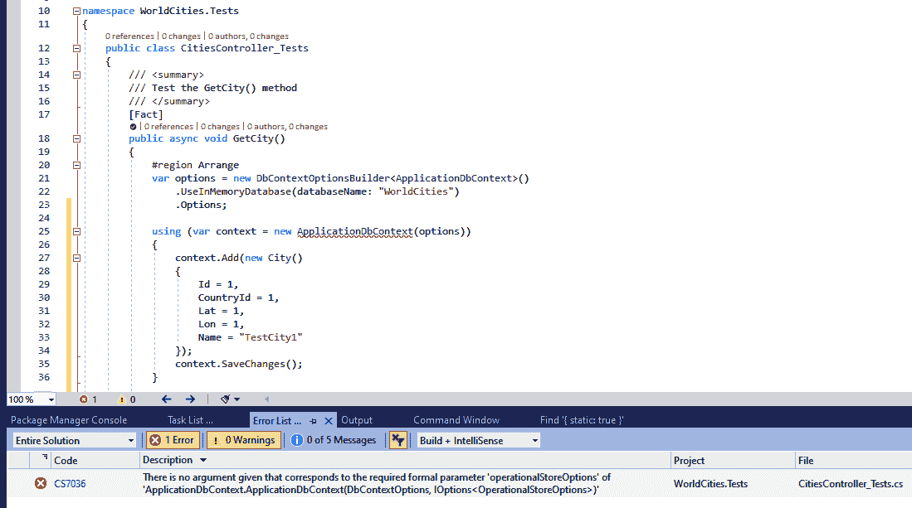

原因在错误列表面板中得到了很好的解释：`ApplicationDbContext`的构造函数签名已更改，需要一个额外的参数，我们在此不传递。

It's worth noting that this issue doesn't affect our main application's Controllers since `ApplicationDbContext` is injected through DI there.

要快速修复此问题，请按以下方式更新`CitiesController_Tests.cs`现有源代码（突出显示新的和更新的行）：

```cs
using IdentityServer4.EntityFramework.Options;

// ...existing code...

var storeOptions = Options.Create(new OperationalStoreOptions());

using (var context = new ApplicationDbContext(options, storeOptions))

// ...existing code...
```

现在错误应该消失了（测试应该仍然通过）。

# 配置 ASP.NET Core标识中间件

现在我们已经完成了所有的先决条件，我们可以打开`Startup.cs`文件并在`ConfigureServices`方法中添加以下突出显示的行，以设置 ASP.NET Core标识系统所需的中间件：

```cs
// ...existing code...

// This method gets called by the runtime. Use this method to add
// services to the container.
public void ConfigureServices(IServiceCollection services)
{
    services.AddControllersWithViews()
      .AddJsonOptions(options => {
        // set this option to TRUE to indent the JSON output
        options.JsonSerializerOptions.WriteIndented = true;
        // set this option to NULL to use PascalCase instead of
        // CamelCase (default)
        // options.JsonSerializerOptions.PropertyNamingPolicy = null;
     });

    // In production, the Angular files will be served from 
    // this directory
    services.AddSpaStaticFiles(configuration =>
    {
        configuration.RootPath = "ClientApp/dist";
    });

    // Add EntityFramework support for SqlServer.
    services.AddEntityFrameworkSqlServer();

    // Add ApplicationDbContext.
    services.AddDbContext<ApplicationDbContext>(options =>
        options.UseSqlServer(
            Configuration.GetConnectionString("DefaultConnection")
            )
    );

 // Add ASP.NET Core Identity support
 services.AddDefaultIdentity<ApplicationUser>(options => 
 {
 options.SignIn.RequireConfirmedAccount = true;
 options.Password.RequireDigit = true;
            options.Password.RequireLowercase = true;
            options.Password.RequireUppercase = true;
            options.Password.RequireNonAlphanumeric = true;
            options.Password.RequiredLength = 8;
        })
 .AddRoles<IdentityRole>()
        .AddEntityFrameworkStores<ApplicationDbContext>();

 services.AddIdentityServer()
 .AddApiAuthorization<ApplicationUser, ApplicationDbContext>();

 services.AddAuthentication()
 .AddIdentityServerJwt();
}

// ...existing code...
```

然后，在`Configure`方法中，添加以下高亮显示的行：

```cs
// ...existing code...

app.UseRouting();

app.UseAuthentication();
app.UseIdentityServer();
app.UseAuthorization();

app.UseEndpoints(endpoints =>

// ...existing code...
```

前面的代码与 SPA 项目的默认.NET Core标识实现非常相似。如果我们使用 Visual Studio 向导创建了一个新的**ASP.NET Core web 应用**，选择个人用户帐户身份验证方法（请参见下面的屏幕截图），我们最终会得到相同的代码，但有一些细微的差异：

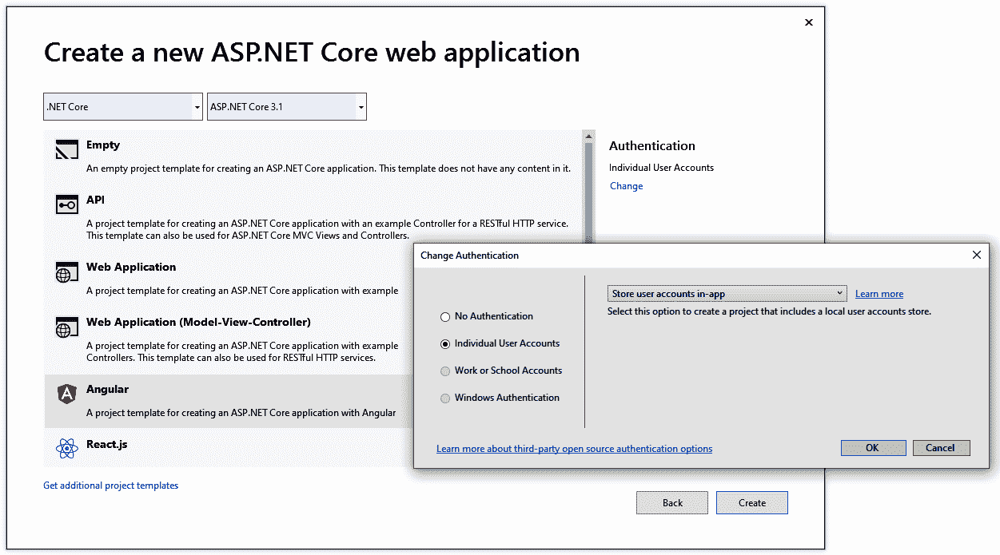

与默认实现相反，在我们的代码中，我们抓住机会覆盖了一些默认密码策略设置，以演示如何配置标识服务以更好地满足我们的需要。

让我们再看一看前面的代码，强调更改（突出显示的行）：

```cs
options.SignIn.RequireConfirmedAccount = true;
options.Password.RequireLowercase = true;
options.Password.RequireUppercase = true;
options.Password.RequireDigit = true;
options.Password.RequireNonAlphanumeric = true;
options.Password.RequiredLength = 8;
```

正如我们所看到的，我们没有更改`RequireConfirmedAccount`默认设置，这需要一个确认的用户帐户（通过电子邮件验证）才能登录。我们所做的是明确设置密码强度要求，以便所有用户的密码都需要具有以下内容：

*   至少一个小写字母
*   至少有一个大写字母
*   至少一个数字字符
*   至少一个非字母数字字符
*   最小长度为八个字符

这将赋予我们的应用一个相当高的身份验证安全级别，如果我们想让它在 web 上公开访问的话。不用说，我们可以根据具体需要更改这些设置；只要我们不向公众开放，开发示例可能会使用更宽松的设置。

值得注意的是，前面的代码需要引用我们刚才安装的与身份相关的新软件包：

```cs
// ...existing code...

using Microsoft.AspNetCore.Authentication;
using Microsoft.AspNetCore.Identity; // ...existing code...
```

此外，我们还需要引用用于数据模型的名称空间，因为我们现在引用的是`ApplicationUser`类：

```cs
// ...existing code...

using WorldCities.Data.Models;

// ...existing code...
```

既然我们已经正确地配置了`Setup`类，那么我们需要对`IdentityServer`进行同样的配置。

# 配置 IdentityServer

为了正确设置`IdentityServer`中间件，我们需要在现有`appSettings.json`配置文件中添加以下行（突出显示新行）：

```cs
{
  "ConnectionStrings": {
    "DefaultConnection": "(your connnection string)"
  },
  "Logging": {
      "LogLevel": {
      "Default": "Information",
      "Microsoft": "Warning",
      "Microsoft.Hosting.Lifetime": "Information"
      }
    },
  "IdentityServer": {
 "Clients": {
 "WorldCities": {
 "Profile": "IdentityServerSPA"
 }
 },
 "Key": {
 "Type": "Development"
 }
 },
"AllowedHosts": "*"
}

```

如我们所见，我们为`IdentityServer`添加了一个客户端，这将是我们的 Angular 应用。`"IdentityServerSPA"`配置文件表示应用类型，它在内部用于生成该类型的服务器默认值。在我们的场景中，`IdentityServer`作为一个单元与 SPA 一起托管。

以下是`IdentityServer`将为我们的应用类型加载的默认值：

*   `redirect_uri`默认为`/authentication/login-callback`。
*   `post_logout_redirect_uri`默认为`/authentication/logout-callback`。
*   范围集包括`openID`、`Profile`以及为应用中的 API 定义的每个范围。
*   允许的 OIDC 响应类型集为`id_token token`或它们各自（`id_token`、`token`）。
*   允许的响应模式为*片段*。

其他可用配置文件包括以下内容：

*   **SPA**：不与`IdentityServer`托管的 SPA
*   **IdentityServerJwt**：与`IdentityServer`一起托管的 API
*   **API**：非托管`IdentityServer`的 API

在继续之前，我们需要对我们的`appSettings.Development.json`文件执行另一个`IdentityServer`*相关更新。*

 *# 更新 appSettings.Development.json 文件

从[Cha](02.html)[pter 2](02.html)*环顾*可知，`appSettings.Development.json`文件用于为*开发*环境指定额外的配置键/值对（和/或覆盖现有的键/值对）。这正是我们现在需要做的，因为`IdentityServer`需要一些不应该投入生产的特定于开发的设置。

打开`appSettings.Development.json`文件，添加以下内容（新行突出显示）：

```cs
{
  "Logging": {
    "LogLevel": {
      "Default": "Debug",
      "System": "Information",
      "Microsoft": "Information"
    },
 "IdentityServer": {
 "Key": {
 "Type": "Development"
 }
 }
  }
}
```

我们在前面代码中添加的`"Key"`元素描述了将用于签名令牌的密钥；目前，由于我们仍处于开发阶段，该键类型将正常工作。然而，当我们想要将应用部署到生产环境中时，我们需要在应用旁边提供并部署一个真正的密钥。当我们达到这个目标时，我们必须向`appSettings.json`生产文件中添加一个`"Key"`元素，并对其进行相应的配置；我们将在[第 12 章](12.html)、***Windows 和 Linux 部署*中详细介绍这一点。**

 **在此之前，最好避免将其添加到生产设置中，以防止我们的 web 应用在不安全模式下运行

For additional information about the `IdentityServer` and its configuration parameters, check out the following URL:

[https://docs.microsoft.com/en-us/aspnet/core/security/authentication/identity-api-authorization](https://docs.microsoft.com/en-us/aspnet/core/security/authentication/identity-api-authorization)

现在我们已经准备好创建我们的用户。

# 修正种子控制器

从零开始创建新用户的最佳方式是从`SeedController`开始，它实现了我们在[第 4 章](04.html)中建立的*播种机制*，*数据模型和实体框架核心*；然而，为了与实现此目的所需的.NET Core标识 API 进行交互，我们需要使用 DI 注入它们，就像我们已经对`ApplicationDbContext`所做的那样。

# 通过 DI 添加 RoleManager 和 UserManager

在解决方案资源管理器中，打开`WorldCities`项目的`/Controllers/SeedController.cs`文件，并使用以下代码相应地更新其内容（突出显示新的/更新的行）：

```cs
using Microsoft.AspNetCore.Identity;

// ...existing code...

public class SeedController : ControllerBase
{
    private readonly ApplicationDbContext _context;
 private readonly RoleManager<IdentityRole> _roleManager;
 private readonly UserManager<ApplicationUser> _userManager;
    private readonly IWebHostEnvironment _env;

    public SeedController(
        ApplicationDbContext context,
 RoleManager<IdentityRole> roleManager,
 UserManager<ApplicationUser> userManager,
        IWebHostEnvironment env)
    {
        _context = context;
 _roleManager = roleManager;
 _userManager = userManager;
        _env = env;
    }

// ...existing code...
```

正如我们所看到的，我们添加了我们之前提到的`RoleManager<TRole>`和`UserManager<TUser>`提供者；我们使用 DI 实现了这一点，就像我们在[第 4 章](04.html)中对`ApplicationDbContext`和`IWebHostEnvironment`所做的一样，*数据模型与实体框架核心*一样。我们将看看如何使用这些新的提供商尽快创建我们的用户和角色。

现在，让我们在`/Controllers/SeedController.cs`文件的末尾定义以下方法，就在现有`Import()`方法的正下方：

```cs
// ...existing code...

[HttpGet]
public async Task<ActionResult> CreateDefaultUsers()
{
 throw new NotImplementedException();
}

// ...existing code...
```

与我们通常所做的相反，我们不会马上实现这个方法；我们将借此机会拥抱**测试驱动开发**（**TDD**）方法，这意味着我们将从创建（失败的）单元测试开始。

# 定义 CreateDefaultUser（）单元测试

从解决方案资源管理器中，在`WorldCities.Tests`项目中新建一个`/SeedController_Tests.cs`文件；完成后，用以下代码填充其内容：

```cs
using IdentityServer4.EntityFramework.Options;
using Microsoft.AspNetCore.Hosting;
using Microsoft.AspNetCore.Identity;
using Microsoft.AspNetCore.Identity.EntityFrameworkCore;
using Microsoft.EntityFrameworkCore;
using Microsoft.Extensions.Logging;
using Microsoft.Extensions.Options;
using Moq;
using System;
using WorldCities.Controllers;
using WorldCities.Data;
using WorldCities.Data.Models;
using Xunit;

namespace WorldCities.Tests
{
    public class SeedController_Tests
    {
        /// <summary>
        /// Test the CreateDefaultUsers() method
        /// </summary>
        [Fact]
        public async void CreateDefaultUsers()
        {
            #region Arrange
            // create the option instances required by the
            // ApplicationDbContext
            var options = new
             DbContextOptionsBuilder<ApplicationDbContext>()
                .UseInMemoryDatabase(databaseName: "WorldCities")
                .Options;
            var storeOptions = Options.Create(new
             OperationalStoreOptions());

            // create a IWebHost environment mock instance
            var mockEnv = new Mock<IWebHostEnvironment>().Object;

            // define the variables for the users we want to test
            ApplicationUser user_Admin = null;
            ApplicationUser user_User = null;
            ApplicationUser user_NotExisting = null;
            #endregion

            #region Act

            // create a ApplicationDbContext instance using the
            // in-memory DB
            using (var context = new ApplicationDbContext(options,
             storeOptions))
            {
                // create a RoleManager instance
                var roleStore = new RoleStore<IdentityRole>(context);
                var roleManager = new RoleManager<TIdentityRole>(
                    roleStore,
                    new IRoleValidator<TIdentityRole>[0],
                    new UpperInvariantLookupNormalizer(),
                    new Mock<IdentityErrorDescriber>().Object,
                    new Mock<ILogger<RoleManager<TIdentityRole>>>(
                    ).Object);

                // create a UserManager instance
                var userStore = new 
                 UserStore<ApplicationUser>(context);
                var userManager = new UserManager<TIDentityUser>(
                    userStore,
                    new Mock<IOptions<IdentityOptions>>().Object,
                    new Mock<IPasswordHasher<TIDentityUser>>().Object,
                    new IUserValidator<TIDentityUser>[0],
                    new IPasswordValidator<TIDentityUser>[0],
                    new UpperInvariantLookupNormalizer(),
                    new Mock<IdentityErrorDescriber>().Object,
                    new Mock<IServiceProvider>().Object,
                    new Mock<ILogger<UserManager<TIDentityUser>>>(
                    ).Object);

                // create a SeedController instance
                var controller = new SeedController(
                    context,
                    roleManager,
                    userManager,
                    mockEnv
                    );

                // execute the SeedController's CreateDefaultUsers()
                // method to create the default users (and roles)
                await controller.CreateDefaultUsers();

                // retrieve the users
                user_Admin = await userManager.FindByEmailAsync(
                 "admin@email.com");
                user_User = await userManager.FindByEmailAsync(
                 "user@email.com");
                user_NotExisting = await userManager.FindByEmailAsync(
                 "notexisting@email.com");
            }
            #endregion

            #region Assert
            Assert.True(
                user_Admin != null
                && user_User != null
                && user_NotExisting == null
                );
            #endregion
        }
    }
}
```

如我们所见，我们正在创建`RoleManager`和`UserManager`提供者的*真实实例*（而不是*模拟*，因为我们需要它们对`ApplicationDbContext`选项中定义的*内存*数据库执行一些读/写操作；这基本上意味着这些提供程序将真正执行其工作，但所有工作都将在内存中的数据库上完成，而不是在 SQL Server 数据源上完成。这是我们测试的理想场景。

同时，我们还很好地利用了`Moq`包库创建了大量*mock*来模拟实例化`RoleManager`和`UserManager`所需的大量参数。幸运的是，它们中的大多数都是内部对象，不需要执行我们当前的测试；对于那些需要的，我们必须创建一个真实的实例。

For example, for both providers, we were forced to create a real instance of `UpperInvariantLookupNormalizer`—which implements the `ILookupNormalizer` interface—because it's being used internally by `RoleManager` (to lookup for existing *roles*) as well as the `UserManager` (to lookup for existing *usernames*); if we had mocked it instead, we would've hit some nasty runtime errors while trying to make these tests pass.

在这里，将`RoleManager`和`UserManager`生成逻辑移动到一个单独的 helper 类可能很有用，这样我们就可以在其他测试中使用它，而无需每次重复。

从解决方案资源管理器中，在`WorldCities.Tests`项目中新建一个`IdentityHelper.cs`文件；完成后，用以下代码填充其内容：

```cs
using Microsoft.AspNetCore.Identity;
using Microsoft.Extensions.Logging;
using Microsoft.Extensions.Options;
using Moq;
using System;
using System.Collections.Generic;
using System.Text;

namespace WorldCities.Tests
{
    public static class IdentityHelper
    {
        public static RoleManager<TIdentityRole>
         GetRoleManager<TIdentityRole>(
            IRoleStore<TIdentityRole> roleStore) where TIdentityRole :
             IdentityRole
        {
            return new RoleManager<TIdentityRole>(
                    roleStore,
                    new IRoleValidator<TIdentityRole>[0],
                    new UpperInvariantLookupNormalizer(),
                    new Mock<IdentityErrorDescriber>().Object,
                    new Mock<ILogger<RoleManager<TIdentityRole>>>(
                    ).Object);
        }

        public static UserManager<TIDentityUser>
         GetUserManager<TIDentityUser>(
            IUserStore<TIDentityUser> userStore) where TIDentityUser :
             IdentityUser
        {
            return new UserManager<TIDentityUser>(
                    userStore,
                    new Mock<IOptions<IdentityOptions>>().Object,
                    new Mock<IPasswordHasher<TIDentityUser>>().Object,
                    new IUserValidator<TIDentityUser>[0],
                    new IPasswordValidator<TIDentityUser>[0],
                    new UpperInvariantLookupNormalizer(),
                    new Mock<IdentityErrorDescriber>().Object,
                    new Mock<IServiceProvider>().Object,
                    new Mock<ILogger<UserManager<TIDentityUser>>>(
                    ).Object);
        }
    }
}
```

如我们所见，我们创建了两个方法-`GetRoleManager`和`GetUserManager`，我们可以使用它们为其他测试创建这些提供者。

现在我们可以从`SeedController`调用这两个方法，通过以下方式更新其代码（更新的行突出显示）：

```cs
// ...existing code...

// create a RoleManager instance
var roleManager = IdentityHelper.GetRoleManager(
 new RoleStore<IdentityRole>(context));

// create a UserManager instance
var userManager = IdentityHelper.GetUserManager(
 new UserStore<ApplicationUser>(context));

// ...existing code...
```

这样，我们的单元测试就准备好了；我们只需要执行它就可以看到它失败。

为此，右键单击解决方案资源管理器中的`WorldCities.Test`节点，然后选择运行测试。

Alternatively, just switch to the Test Explorer window and use the topmost buttons to run the tests from there.

如果我们做的一切都正确，我们应该能够看到我们的`CreateDefaultUsers()`测试失败，就像下面的屏幕截图：


就这样,；我们现在要做的就是实现`SeedController`的`CreateDefaultUsers()`方法，使前面的测试通过。

# 实现 CreateDefaultUsers（）方法

在`/Controllers/SeedController.cs`文件末尾，在现有`Import()`方法的正下方添加以下方法：

```cs
// ...existing code...

[HttpGet]
public async Task<ActionResult> CreateDefaultUsers()
{
    // setup the default role names
    string role_RegisteredUser = "RegisteredUser";
    string role_Administrator = "Administrator";

    // create the default roles (if they doesn't exist yet)
    if (await _roleManager.FindByNameAsync(role_RegisteredUser) ==
     null)
        await _roleManager.CreateAsync(new 
         IdentityRole(role_RegisteredUser));

    if (await _roleManager.FindByNameAsync(role_Administrator) ==
     null)
        await _roleManager.CreateAsync(new 
         IdentityRole(role_Administrator));

    // create a list to track the newly added users
    var addedUserList = new List<ApplicationUser>();

    // check if the admin user already exist
    var email_Admin = "admin@email.com";
    if (await _userManager.FindByNameAsync(email_Admin) == null)
    {
        // create a new admin ApplicationUser account
        var user_Admin = new ApplicationUser()
        {
            SecurityStamp = Guid.NewGuid().ToString(),
            UserName = email_Admin,
            Email = email_Admin,
        };

        // insert the admin user into the DB
        await _userManager.CreateAsync(user_Admin, "MySecr3t$");

        // assign the "RegisteredUser" and "Administrator" roles
        await _userManager.AddToRoleAsync(user_Admin,
         role_RegisteredUser);
        await _userManager.AddToRoleAsync(user_Admin,
         role_Administrator);

        // confirm the e-mail and remove lockout
        user_Admin.EmailConfirmed = true;
        user_Admin.LockoutEnabled = false;

        // add the admin user to the added users list
        addedUserList.Add(user_Admin);
    }

    // check if the standard user already exist
    var email_User = "user@email.com";
    if (await _userManager.FindByNameAsync(email_User) == null)
    {
        // create a new standard ApplicationUser account
        var user_User = new ApplicationUser()
        {
            SecurityStamp = Guid.NewGuid().ToString(),
            UserName = email_User,
            Email = email_User
        };

        // insert the standard user into the DB
        await _userManager.CreateAsync(user_User, "MySecr3t$");

        // assign the "RegisteredUser" role
        await _userManager.AddToRoleAsync(user_User,
         role_RegisteredUser);

        // confirm the e-mail and remove lockout
        user_User.EmailConfirmed = true;
        user_User.LockoutEnabled = false;

        // add the standard user to the added users list
        addedUserList.Add(user_User);
    }

    // if we added at least one user, persist the changes into the DB
    if (addedUserList.Count > 0)
        await _context.SaveChangesAsync();

    return new JsonResult(new
    {
        Count = addedUserList.Count,
        Users = addedUserList
    });
}

// ...existing code...
```

该代码是非常自解释的，它有很多注释解释了各个步骤；然而，这里是我们刚刚做的一个方便的总结：

*   我们首先定义了一些默认的角色名（`RegisteredUsers`用于标准注册用户，`Administrator`用于管理级用户）。
*   我们创建了一个逻辑来检查这些角色是否已经存在。如果它们不存在，我们就创造它们。正如所料，这两项任务都是使用`RoleManager`*执行的。*
*   我们定义了一个用户列表局部变量来跟踪新添加的用户，这样我们就可以将它输出到 JSON 对象中的用户，我们将在 action 方法的末尾返回该对象。
*   我们创建了一个逻辑来检查`admin@email.com`用户名的用户是否已经存在；如果没有，我们将创建它并为其分配`RegisteredUser`和`Administrator`角色，因为它将是标准用户*和*我们应用的管理帐户。
*   我们创建了一个逻辑来检查`user@email.com`用户名的用户是否已经存在；如果没有，我们将创建它并将其分配给`RegisteredUser`角色。
*   在 action 方法的末尾，我们配置了将返回给调用方的 JSON 对象；此对象包含已添加用户的计数和包含这些用户的列表，这些用户将被序列化为一个 JSON 对象，该对象将显示其实体值。

The `Administrator` and `RegisteredUser` roles we just implemented here will be the core of our authorization mechanism; all of our users will be assigned to at least one of them. Note how we assigned both of them to the **Admin** user to make them able to do everything a standard user can do, plus more: all the other users only have the latter, so they'll be unable to perform any administrative-level task—as long as they're not provided with the `Administrator` role.

在继续之前，值得注意的是，`Email`和`UserName`字段都使用了用户的电子邮件地址。我们这样做是有意的，因为 ASP.NET Core标识系统中的这两个字段在默认情况下可以互换使用：每当我们使用默认 API 添加用户时，提供的`Email`也会保存在`UserName`字段中，即使它们是`AspNetUsers`数据库表中的两个独立字段。虽然这种行为可以更改，但我们将坚持默认设置，这样我们就可以在整个 ASP.NET 标识系统中使用默认设置，而无需更改它们。

# 重新运行单元测试

现在我们已经实现了测试，我们可以重新运行`CreateDefaultUsers()`测试并查看它是否通过。通常，我们可以通过右键单击解决方案资源管理器中的`WorldCities.Test`根节点并选择运行测试，或者从测试资源管理器面板中选择运行测试。

如果我们做的每件事都是正确的，我们会看到这样的情况：


就这样,；现在我们终于完成了项目类的更新。

# 关于异步任务、等待和死锁的说明

通过前面的`CreateDefaultUsers()`方法可以看出，ASP.NET Core身份识别系统 API 的所有相关方法都是*异步*，这意味着它们返回的是*异步任务*，而不是给定的返回值；正是因为这个原因，因为我们需要一个接一个地执行这些不同的任务，所以我们必须在它们前面加上`await`关键字。

下面是从前面代码中提取的`await`用法示例：

```cs
await _userManager.AddToRoleAsync(user_Admin, role_RegisteredUser);
```

顾名思义，`await`关键字等待异步任务完成后再继续。值得注意的是，这样的表达式不会阻塞它正在执行的线程；相反，它会导致编译器注册`async`方法的其余部分作为等待任务的延续，从而将线程控制返回给调用方。最后，当任务完成时，它会调用其 continuation，从而在停止的地方继续执行`async`方法。

That's the reason why the `await` keyword can only be used within `async` methods; as a matter of fact, the preceding logic requires the caller to be `async` as well, otherwise, it wouldn't work.

或者，我们可以使用`Wait()`方法，方法如下：

```cs
_userManager.AddToRoleAsync(user_Admin, role_RegisteredUser).Wait();
```

然而，我们没有这样做是有充分理由的。与`await`关键字相反，它告诉编译器异步等待异步任务完成，无参数的`Wait()`方法将*阻塞调用线程*，直到异步任务完成执行；因此，调用线程将无条件地等待任务完成。

为了更好地解释这些技术如何影响我们的.NET Core应用，我们应该花一点时间更好地理解异步任务的概念，因为它们是 ASP.NET Core TAP 模型的关键部分。

在 ASP.NET 中使用调用异步任务的同步方法时，我们应该了解的第一件事是，当顶级方法等待任务时，其当前执行上下文将被阻止，直到任务完成。除非上下文一次只允许运行一个线程，否则这不会成为问题，这正是`AspNetSynchronizationContext`的情况。如果我们结合这两件事，我们很容易看到*阻塞*一个`async`方法（即返回异步任务的方法）将使我们的应用面临*死锁*的高风险。

从软件开发的Angular来看，*d**eadlock*是一种可怕的情况，每当进程或线程无限期进入等待状态时就会发生，通常是因为它等待的资源被另一个等待的进程占用。在任何旧的 ASP.NET web 应用中，每次阻止任务时，我们都会面临死锁，这仅仅是因为为了完成任务，该任务将需要调用方法的相同执行上下文，在任务完成之前，调用方法会一直阻止该上下文！

幸运的是，我们这里没有使用传统的 ASP.NET；我们使用的是.NET Core，其中基于`SynchronizationContext`的传统 ASP.NET 模式已被一种基于多功能、死锁弹性线程池的*无上下文*方法所取代。

这基本上意味着*使用`Wait()`方法阻塞调用线程*不再有问题；因此，如果我们用它切换`await`关键字，我们的方法仍然可以正常运行并完成。然而，通过这样做，我们基本上会使用同步代码来执行异步操作，这通常被认为是一种不好的做法；此外，我们将失去异步编程带来的所有好处，如性能和可伸缩性。

出于所有这些原因，等待方法无疑是实现这一目标的途径。

For additional information regarding threads, async tasks awaits, and asynchronous programming in ASP.NET, we highly recommend checking out the outstanding articles written by Stephen Cleary on the topic, which will greatly help in understanding some of the most tricky and complex scenarios that we could face when developing with these technologies. Some of them were written a while ago, yet they never really age:

[https://blog.stephencleary.com/2012/02/async-and-await.html](https://blog.stephencleary.com/2012/02/async-and-await.html)
 [https://blogs.msdn.microsoft.com/pfxteam/2012/04/12/asyncawait-faq/](https://blogs.msdn.microsoft.com/pfxteam/2012/04/12/asyncawait-faq/)
 [http://blog.stephencleary.com/2012/07/dont-block-on-async-code.html](http://blog.stephencleary.com/2012/07/dont-block-on-async-code.html)
 [https://msdn.microsoft.com/en-us/magazine/jj991977.aspx](https://msdn.microsoft.com/en-us/magazine/jj991977.aspx) 
[https://blog.stephencleary.com/2017/03/aspnetcore-synchronization-context.html](https://blog.stephencleary.com/2017/03/aspnetcore-synchronization-context.html)

Also, we strongly suggest checking out this excellent article about asynchronous programming with async and await at
[https://docs.microsoft.com/en-us/dotnet/csharp/programming-guide/concepts/async/index](https://docs.microsoft.com/en-us/dotnet/csharp/programming-guide/concepts/async/index)

# 更新数据库

现在是时候创建一个新的迁移，并利用我们在[第 4 章](04.html)、*数据模型和实体框架核心*中选择的代码优先方法，将代码更改反映到数据库中。

下面列出了我们在本节中要做的事情：

*   **使用`dotnet-ef`命令添加身份迁移**，就像我们在[第 4 章](04.html)中所做的一样，*具有实体框架核心的数据模型*。
*   **将迁移应用到数据库**，在不改变现有数据或执行删除和重新创建的情况下更新数据库
*   **使用我们早期实施的`SeedController`的`CreateDefaultUsers()`方法对数据**进行种子设定。

让我们开始工作吧。

# 添加身份迁移

我们需要做的第一件事是向我们的数据模型添加一个新的迁移，以反映我们通过扩展`ApplicationDbContext`类实现的更改。

为此，请打开命令行或 PowerShell 提示符并转到`WorldCities`项目的根文件夹，然后编写以下内容：

```cs
dotnet ef migrations add "Identity" -o "Data\Migrations"
```

然后应将新的迁移添加到项目中，如以下屏幕截图所示：


新的迁移文件将在`\Data\Migrations\`文件夹中自动生成。

Those who experience issues while creating migrations can try to clear the `\Data\Migrations\` folder before running the preceding `dotnet-ef` command.

For additional information regarding EF Core migrations, and how to troubleshoot them, check out the following guide:

[https://docs.microsoft.com/en-us/ef/core/managing-schemas/migrations/](https://docs.microsoft.com/en-us/ef/core/managing-schemas/migrations/)

# 应用迁移

接下来要做的是将新的迁移应用到我们的数据库中。我们可以在两个选项中进行选择：

*   **更新现有数据模型模式**，同时保持其所有数据不变
*   **从头开始删除并重新创建数据库**

事实上，EF Core 迁移功能的全部目的是提供一种方法，在保留数据库中现有数据的同时，增量更新数据库模式；正是出于这个原因，我们将遵循前一条道路

Before applying migrations, it's always advisable to perform a full database backup; this advice is particularly important when dealing with production environments. For small databases such as the one currently used by our `WorldCities` web app, it would take a few seconds.

For additional information about how to perform a full backup of a SQL Server database, read the following guide:
[https://docs.microsoft.com/en-us/sql/relational-databases/backup-restore/create-a-full-database-backup-sql-server](https://docs.microsoft.com/en-us/sql/relational-databases/backup-restore/create-a-full-database-backup-sql-server)

# 更新现有数据模型

要将迁移应用于现有数据库架构而不丢失现有数据，请从`WorldCities`项目的根文件夹运行以下命令：

```cs
dotnet ef database update
```

然后，`dotnet ef`工具将对我们的 SQL 数据库模式应用必要的更新，并在控制台缓冲区中输出相关信息以及实际的 SQL 查询，如以下屏幕截图所示：

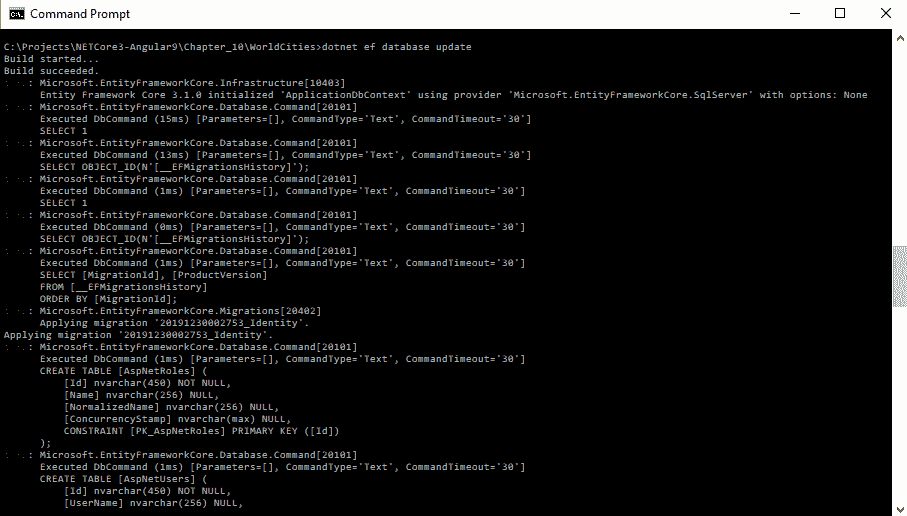

任务完成后，我们应该使用[第 4 章](04.html)中安装的**SQL Server Management Studio**工具、*数据模型和实体框架核心*连接到我们的数据库，并检查是否存在新的身份相关表。

如果一切顺利，我们应该能够看到新的身份表以及现有的`Cities`和`Countries`表：

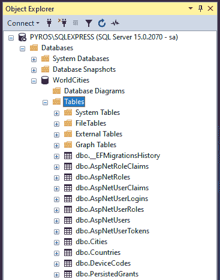

我们很容易猜到，这些桌子还是空的；为了填充它们，我们必须运行`SeedController`的`CreateDefaultUsers()`方法，这是我们将在短时间内完成的事情。

# 从头开始删除和重新创建数据模型

为了完整起见，让我们花点时间看看如何从头开始重新创建数据模型和**数据库模式**（**db 模式**。不用说，如果我们选择这条路线，我们将丢失所有现有数据。然而，我们总是可以使用`SeedController`的`Import()`方法重新加载所有内容，因此不会有太大的损失；事实上，我们在[第 4 章](04.html)*数据模型和实体框架核心*中基于 CRUD 的测试中只会失去我们所做的。

虽然执行数据库删除和重新创建不是建议的方法，特别是考虑到我们采用了*迁移*模式，以避免出现这种情况，但只要我们在迁移之前完全备份数据，并且，最重要的是，知道如何在事后恢复一切。

Although it might seem a horrible way to fix things, that's definitely not the case; we're still in the development phase, hence we can definitely allow a full database refresh.

如果我们选择这条路线，下面是要使用的**dotnet ef**控制台命令：

```cs
> dotnet ef database drop
> dotnet ef database update
```

`drop`命令应在继续之前请求确认是/否；当它发生时，点击*Y*键，让它发生。当删除和更新任务都完成后，我们可以在调试模式下运行我们的项目，并访问`SeedController`的`Import()`方法；完成后，我们应该有一个支持 ASP.NET Core标识的更新数据库。

# 播种数据

不管我们选择哪个选项来更新数据库，我们现在都必须重新填充它。

点击*F5*以调试模式运行项目，然后在浏览器地址栏中手动输入以下 URL:`https://localhost:44334/api/Seed/CreateDefaultUsers`。

让`SeedController`的`CreateDefaultUsers()`方法发挥它的魔力。

完成后，我们应该能够看到以下 JSON 响应：

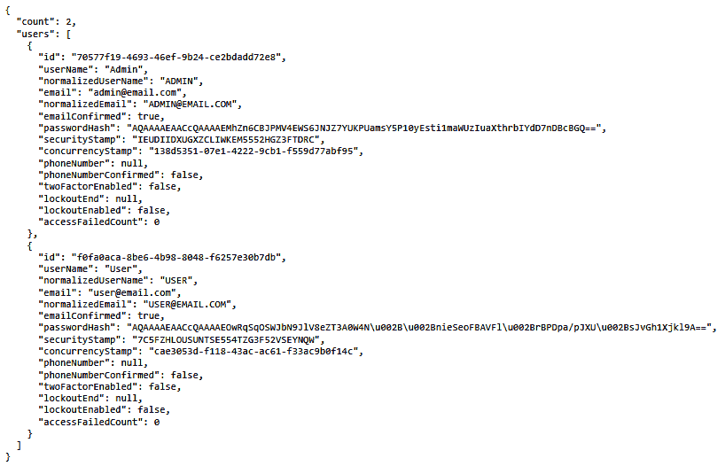

这个输出已经告诉我们，前两个用户已经创建并存储在我们的数据模型中。但是，我们可以通过使用 SQL Server Management Studio 工具连接到我们的数据库并查看`dbo.AspNetUsers`表来确认这一点（请参见以下屏幕截图）：

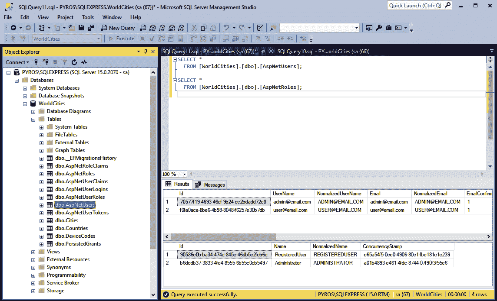

如我们所见，我们使用以下 T-SQL 查询来检查现有用户和角色：

```cs
SELECT *
  FROM [WorldCities].[dbo].[AspNetUsers];

SELECT *
  FROM [WorldCities].[dbo].[AspNetRoles];
```

答对 了我们的 ASP.NET Core标识系统实现已启动、运行，并与我们的数据模型完全集成；现在我们只需要在控制器中实现它，并将其与 Angular 客户端应用连接起来。

# 认证方法

现在，我们已经更新了数据库以支持 ASP.NET Core身份验证工作流和模式，我们应该花一些宝贵的时间选择采用哪种身份验证方法；更准确地说，由于我们已经实现了.NET Core`IdentityServer`，为了正确理解它为 SPA-JWT 令牌提供的默认身份验证方法是否足够安全，或者我们是否应该将其更改为更安全的机制。

众所周知，HTTP 协议是*无状态*，这意味着我们在请求/响应周期中所做的任何事情都将在后续请求之前丢失，包括身份验证结果。我们必须克服这一问题的唯一方法是将结果及其所有相关数据（如用户 ID、登录日期/时间和上次请求时间）存储在某处。

# 会议

从几年前开始，最常见和传统的方法就是使用基于内存、基于磁盘或外部会话管理器将数据存储在服务器上。可以使用客户端通过身份验证响应（通常在会话 cookie 中）接收的唯一 ID 检索每个会话，该 ID 将在每次后续请求时传输到服务器。

下面是一个简要的图表，显示了基于**会话的身份验证流程**：

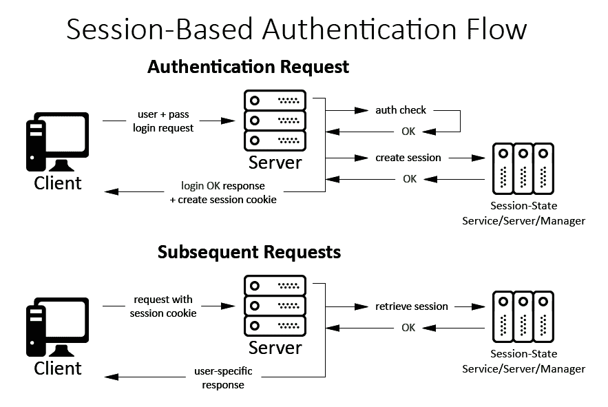

这仍然是大多数 web 应用使用的一种非常常见的技术。采用这种方法没有什么错，只要我们对其广泛承认的缺点感到满意，例如：

*   **内存问题**：只要有很多经过身份验证的用户，web 服务器就会消耗越来越多的内存。即使我们使用基于文件或外部会话提供程序，仍然会有大量的 I/O、TCP 或套接字开销。
*   **可伸缩性问题**：在可伸缩体系结构（*IIS web farm*、*负载平衡集群*等）中复制会话提供程序可能不是一项容易的任务，通常会导致瓶颈或资源浪费。
*   **跨域问题**：会话 cookie 的行为与标准 cookie 类似，因此无法在不同来源/域之间轻松共享。这些类型的问题通常可以通过一些变通方法来解决，但它们通常会导致不安全的场景，以使事情顺利进行。
*   **安全问题**：有大量关于安全相关问题的详细文献，涉及会话和会话 cookie：XSS 攻击、跨站点请求伪造，以及许多其他威胁，为了简单起见，此处不作介绍。大多数问题可以通过一些对策加以缓解，但对于初级或新手开发人员来说，这些问题可能很难处理。

随着这些问题多年来的出现，毫无疑问，大多数分析师和开发人员已经投入了大量精力来找出不同的方法。

# 代币

在过去几年中，基于令牌的身份验证越来越多地被**单页应用**（**SPA**）和移动应用所采用，原因无可否认，我们将在这里简要总结。

基于会话的身份验证和基于令牌的身份验证之间最重要的区别在于后者是*无状态*，这意味着我们不会在服务器内存、数据库、会话提供程序或任何类型的其他数据容器上存储任何用户特定的信息。

这一方面解决了我们前面指出的基于会话的身份验证的大多数缺点。我们没有会话，因此不会增加开销；我们不需要会话提供程序，因此扩展会容易得多。此外，对于支持`LocalStorage`的浏览器，我们甚至不会使用 cookies，因此我们不会受到*跨源*限制性策略的阻碍，希望我们能够绕过大多数安全问题。

下面是一个典型的基于**令牌的身份验证流程**：

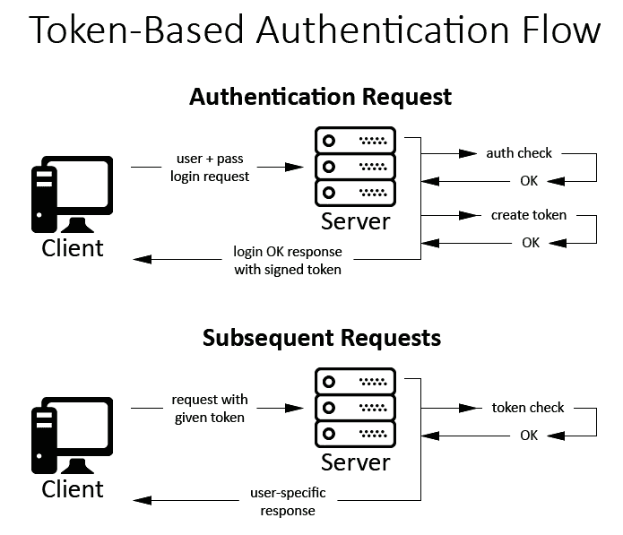

在客户机-服务器交互方面，这些步骤似乎与基于会话的身份验证流程**图没有太大区别；显然，唯一的区别是我们将发布和检查令牌，而不是创建和检索会话。真正的交易正在服务器端发生（或没有发生）。我们可以立即看到，基于令牌的身份验证流不依赖于有状态会话状态服务器、服务或管理器。这将很容易转化为性能和可伸缩性方面的显著提升。**

 **# 签名

这是大多数现代基于 API 的云计算和存储服务使用的方法，包括**亚马逊 Web 服务**（**AWS**。与基于会话和基于令牌的方法（它们依赖于理论上可以被第三方攻击者访问或暴露给第三方攻击者的传输层）不同，基于签名的身份验证使用先前共享的私钥对整个请求执行散列。这确保了没有入侵者或中间人可以充当请求用户，因为他们将无法签署请求。

# 双因素

这是大多数银行和金融账户使用的标准身份验证方法，可以说是最安全的方法。

实施可能会有所不同，但它始终依赖于以下基本工作流：

*   用户使用用户名和密码执行标准登录。
*   服务器识别用户，并向他们提示一个额外的、特定于用户的请求，该请求只能由通过不同渠道获得的东西来满足：通过 SMS 发送的 OTP 密码、带有多个应答码的唯一身份验证卡、由专有设备或移动应用生成的动态 PIN 等等。
*   如果用户给出正确答案，则使用基于会话或基于令牌的标准方法对其进行身份验证。

**双因素认证**（**2FA**）自 1.0 发布以来一直受到 ASP.NET Core的支持，通过短信验证（SMS 2FA）实现；然而，从 ASP.NET Core 2 开始，SMS 2FA 方法被弃用，取而代之的是基于**时间的一次性密码算法**（**TOTP**），该算法成为业界推荐的在 web 应用中实现 2FA 的方法。

For additional information about SMS 2FA, check out the following URL:
[https://docs.microsoft.com/en-us/aspnet/core/security/authentication/2fa](https://docs.microsoft.com/en-us/aspnet/core/security/authentication/2fa)

For additional information about TOTP 2FA, take a look at the following URL:
[https://docs.microsoft.com/en-us/aspnet/core/security/authentication/identity-enable-qrcodes](https://docs.microsoft.com/en-us/aspnet/core/security/authentication/identity-enable-qrcodes)

# 结论

在回顾了所有这些身份验证方法之后，我们可以肯定地说，`IdentityServer`提供的基于令牌的身份验证方法对于我们的特定场景来说似乎是一个不错的选择。

我们当前的实现基于**JSON Web 令牌**（**JWT**），这是一个基于 JSON 的开放标准，专门为本地 Web 应用设计，可以使用多种语言，如.NET、Python、Java、PHP、Ruby、JavaScript/NodeJS 和 PERL。我们选择它是因为它正在成为令牌身份验证的事实标准，因为大多数技术都支持它。

For additional information about JSON Web Tokens, check out the following URL:

[https://jwt.io/](https://jwt.io/)

# 在 Angular 中实现身份验证

为了处理基于 JWT 的令牌身份验证，我们需要设置我们的 ASP.NET*后端*和Angular*前端*来处理所有需要的任务。

在前面的部分中，我们花了大量时间配置.NET Core身份服务以及`IdentityServer`，这意味着我们已经完成了一半；事实上，我们几乎完成了*服务器端*任务。同时，我们在*前端*级别没有做任何事情：我们在上一节中创建的两个示例用户`admin@email.com`和`user@email.com`无法登录，并且没有创建新用户的注册表。

现在，这里有一些（非常）好消息：我们用来设置应用的 Visual Studio Angular 模板附带了对 auth API 的内置支持，我们刚刚将 auth API 添加到*后端*，最棒的是它实际上工作得非常好！

然而，我们也得到了一些坏消息：由于我们在创建项目时选择了*而不是*在项目中添加任何身份验证方法，所有本来可以处理此任务的 Angular 模块、组件、服务、拦截器和测试*都被*排除在 Angular 应用之外；作为最初选择的结果，当我们在[第 2 章](02.html)中开始探索我们预先制作的 Angular 应用时，*环顾*，我们只有`counter`和`fetch-data`组件可供使用。

事实上，我们之所以选择排除授权组件是有原因的：因为我们使用该模板作为示例应用来了解更多关于Angular结构的信息，所以我们不想在早期引入所有身份验证和授权内容，从而使我们的生活复杂化。

幸运的是，所有缺少的类都可以在我们当前的`WorldCities`项目中轻松检索和实现。。。这正是我们在本节要做的。

更具体地说，以下是我们即将完成的任务列表：

*   **创建全新的.NET Core 和 Angular 项目**，我们将其用作*代码库*从中复制与 auth 相关的 Angular 类；新项目名称将为`AuthSample`。
*   **探索 Angular authorization API**以了解其工作原理。
*   **测试`AuthSample`项目中上述 API 提供的登录注册表单**。

在本节结束时，我们应该能够注册新用户，并使用`AuthSample`应用附带的*前端*授权 API 登录现有用户。

# 创建 AuthSample 项目

我们要做的第一件事是创建一个新的.NET Core和 Angular web 应用项目。事实上，这已经是我们第三次这么做了：我们在[第一章](01.html)、*准备*中创建了`HealthCheck`项目，然后在[第三章](03.html)、*前端和后端交互*中创建了`WorldCities`项目；因此，我们已经知道我们必须做的大部分事情。

我们第三个项目的名称为`AuthSample`；但是，创建它所需的任务将与上次略有不同（而且肯定更容易）：

1.  使用`dotnet new angular -o AuthSample -au Individual`命令创建一个新项目。
2.  编辑`/ClientApp/package.json`文件，将现有 npm 软件包版本更新为我们目前在现有`HealthCheck`和`WorldCities`Angular 应用中使用的相同版本（请参见[第 2 章](02.html)，*环顾*，了解如何进行此操作的详细信息）。

就是这样。正如我们所看到的，这次我们添加了`-au`开关（一个`--auth`的快捷方式），它将包括我们在创建`HealthCheck`和`WorldCities`项目时故意错过的所有与 auth 相关的类；此外，除了 npm 软件包版本之外，我们不需要删除或更新任何东西：内置的 Angular 组件以及*后端*类和库，足以探索我们迄今为止一直缺少的与身份验证相关的代码。

# 对 AuthSample 项目进行疑难解答

更新 npm 包后，我们应该做的第一件事是以调试模式启动项目，并确保主页正常工作（请参见以下屏幕截图）：

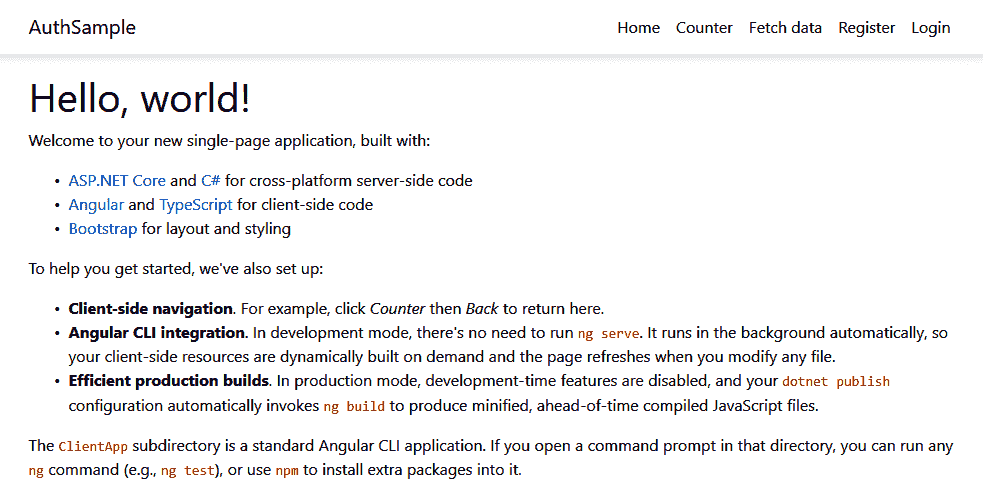

如果我们遇到包冲突、JavaScript 错误或其他与 npm 相关的问题，我们可以尝试从`/ClientApp/`文件夹中执行以下 npm 命令来更新它们并验证包缓存：

```cs
> npm install
> npm cache verify
```

这显示在以下屏幕截图中：

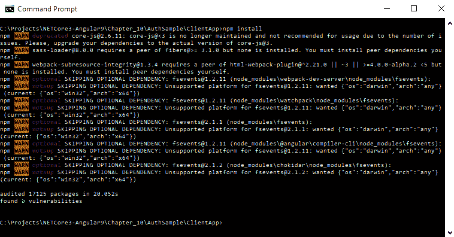

尽管 Visual Studio 应该在我们更新磁盘上的`package.json`文件后立即自动更新 npm 包，但有时自动更新过程无法正常工作：当发生这种情况时，从命令行手动执行前面的 npm 命令是解决此类问题的方便方法。

如果我们遇到一些*后端*运行时错误，明智的做法是对照我们在前几章和本章中所做的工作简要回顾.NET 代码，以解决与模板源代码、第三方引用、NuGet 包版本等相关的任何问题。一如既往，本书提供的 GitHub 存储库将极大地帮助我们解决自己代码的故障；一定要去看看！

# 探索Angular授权 API

在本节中，我们将详细介绍.NET Core 和 Angular Visual Studio 项目模板提供的授权 API：一组依赖于**oidc 客户端**库的功能，允许 Angular 应用与 ASP.NET Core 标识系统提供的 URI 端点交互。

The **oidc-client **library is an open source solution that provides OIDC and OAuth2 protocol support for client-side, browser-based JavaScript client applications, including user session support and access token management; its npm package reference is already present in the `package.json` file of our `WorldCities` app, therefore we won't have to manually add it.

For additional info about the **oidc-client** library, check out the following URL:

[https://github.com/IdentityModel/oidc-client-js](https://github.com/IdentityModel/oidc-client-js)

正如我们可以看到的，这些 API 利用一些重要的Angular特性，如路由保护和 HTTP 拦截器，来处理 HTTP 请求/响应周期中的授权流。

让我们从新的`AuthSample`项目附带的 Angular 应用的快速概述开始。如果我们观察`/ClientApp/`目录中的各种文件和文件夹，我们可以立即看到我们正在处理的示例应用与我们在[第 2 章](02.html)*中已经探讨过的示例应用相同，*环顾*，然后对其进行精简，以更好地满足我们的需求。*

然而，还有一个当时不存在的额外文件夹：我们谈论的是`/ClientApp/src/app/authorization-api/`文件夹，它基本上包含了我们当时错过的所有内容。*前端*实现了.NET Core身份 API 和`IdentityServer`钩子点。

该文件夹中有许多有趣的文件和子文件夹，如以下屏幕截图所示：

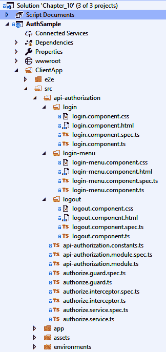

得益于我们对 Angular architecture 的了解，我们可以轻松理解其中每一个的主要作用：

*   前三个子文件夹`/login/`、`/login-menu/`和`/logout/`包含三个*组件*，每个组件都有其 TypeScript 类、HTML 模板、CSS 文件和测试套件。
*   `api-authorization.constants.ts`文件包含一组公共*接口*和*常量*，这些接口被其他类引用和使用。
*   `api-authorization.module.ts`文件是一个`NgModule`，即授权 API 公共功能集的容器，就像我们在[第 5 章](05.html)*获取和显示数据*中在`WorldCities`应用中创建的`AngularMaterialModule`一样。如果我们打开它，我们可以看到它包含一些特定于身份验证的路由规则。
*   `authorize.guard.ts`文件引入了**路线守卫**的概念，这是我们尚未了解的内容；我们将在短时间内对此进行更多讨论。
*   `authorize.interceptor.ts`文件实现了一个**HTTP 拦截器**类—另一种我们还不知道的机制；再一次，我们将很快对此进行更多讨论。
*   `authorize.service.ts`文件包含处理所有 HTTP 请求和响应的*数据服务*；我们从[第 7 章](07.html)*、代码调整和数据服务*了解他们的角色和工作方式，在那里我们为`WorldCities`应用实现了`CityService`和`CountryService`。

我们还没有提到各种`.spec.ts`文件；正如我们在[第 9 章](09.html)、*ASP.NET Core 和 Angular Unit Testing*中所了解到的，对于它们共享名称的类文件，它们是相应的*测试单元*。

# 路障

正如我们在[第 2 章](02.html)、*环顾*中了解到的，Angular Router 是允许我们的用户在我们应用的各种*视图*中导航的服务；每个视图更新*前端*并（可能）调用*后端*检索内容。

仔细想想，我们可以看到 Angular 路由是 ASP.NET Core路由接口的*前端*对应物，负责将请求 URI 映射到*后端*端点，并将传入请求发送到这些端点。由于这两个模块具有相同的行为，因此在我们为应用实现身份验证和授权机制时，它们也有类似的要求。

在前面的章节中，我们在*后端*和*前端*上定义了许多路由，以允许用户访问我们实现的各种 ASP.NET Core操作方法和Angular视图。如果我们仔细想想，我们会发现所有这些路线都有一个共同的特点：*任何人都可以访问它们*。换句话说，*任何用户都可以在我们的网络应用*中自由移动：他们可以编辑城市和国家，他们可以与我们的`SeedController`交互以执行其数据库种子任务，等等。

不用说，这种行为虽然在开发中可以接受，但在任何生产场景中都是非常不受欢迎的：当应用上线时，我们肯定希望通过将其限制为授权用户来保护其中一些路由；换言之，是为了*保护*他们。

**路线守卫**是适当执行此类要求的机制；它们可以添加到我们的路由配置中，以返回可以通过以下方式控制路由行为的值：

*   如果路线守卫返回`true`，导航过程继续。
*   如果返回`false`，则导航过程停止。
*   如果返回一个`UrlTree`，则导航过程被取消并替换为对给定`UrlTree`的新导航。

# 可用警卫

以下路线防护装置目前在 Angular 中可用：

*   `CanActivate`：调解到给定*路线*的导航
*   `CanActivateChild`：调解到给定*子路径*的导航
*   `CanDeactivate`：调离当前*航线*的导航
*   `Resolve`：在激活*路由*之前，执行一些任意操作（如自定义数据检索任务）
*   `CanLoad`：调解到给定异步*模块*的导航

它们中的每一个都可以通过一个*超类*来使用，该超类充当*公共接口*：每当我们想要创建自己的防护时，我们只需扩展相应的超类并实现相关方法即可。

任何一条路由都可以配置多个防护：`CanDeactivate`和`CanActivateChild`首先检查防护，从最深的子路由到最上面；紧接着，路由将检查`CanActivate`守卫从上到下到最深的子路由；完成后，将检查异步模块的`CanLoad`路由。如果其中任何一个防护返回`false`，导航将停止，所有未决防护将被取消。

现在让我们看看`/ClientApp/src/api-authorization/authorize.guard.ts`文件，看看`AuthSample`Angular 应用附带的*前端*授权 API 实现了哪些路由防护（相关行突出显示）：

```cs
import { Injectable } from '@angular/core';
import { CanActivate, ActivatedRouteSnapshot, RouterStateSnapshot,
 Router } from '@angular/router';
import { Observable } from 'rxjs';
import { AuthorizeService } from './authorize.service';
import { tap } from 'rxjs/operators';
import { ApplicationPaths, QueryParameterNames } from
 './api-authorization.constants';

@Injectable({
  providedIn: 'root'
})
export class AuthorizeGuard implements CanActivate {
  constructor(private authorize: AuthorizeService, private router:
   Router) {
  }
  canActivate(
 _next: ActivatedRouteSnapshot,
 state: RouterStateSnapshot): Observable<boolean> |
     Promise<boolean> | boolean {
 return this.authorize.isAuthenticated()
 .pipe(tap(isAuthenticated =>
         this.handleAuthorization(isAuthenticated, state)));
 }
  private handleAuthorization(isAuthenticated: boolean, state:
   RouterStateSnapshot) {
    if (!isAuthenticated) {
      this.router.navigate(ApplicationPaths.LoginPathComponents, {
        queryParams: {
          [QueryParameterNames.ReturnUrl]: state.url
        }
      });
    }
  }
}
```

正如我们所看到的，我们正在处理一个扩展`CanActivate`接口的保护。正如我们从授权 API 中可以合理预期的那样，guard 正在检查`AuthorizeService`的`isAuthenticated()`方法（通过 DI 在构造函数中注入的*方法），并根据该方法有条件地允许或阻止导航；难怪它的名字叫`AuthorizeGuard`。*

一旦创建了防护，防护就可以从路由配置本身绑定到各种路由，路由配置本身为每种防护类型提供一个属性；如果我们查看`AuthSample`应用的`/ClientApp/src/app/app.module.ts`文件，其中配置了主路由，我们可以很容易地识别*防护的*路由：

```cs
// ...

RouterModule.forRoot([
  { path: '', component: HomeComponent, pathMatch: 'full' },
  { path: 'counter', component: CounterComponent },
  { path: 'fetch-data', component: FetchDataComponent, canActivate:
    [AuthorizeGuard] },
])

// ...
```

这意味着将用户带到`FetchDataComponent`的`fetch-data`视图只能由经过身份验证的用户激活：让我们快速尝试一下，看看它是否按预期工作。

按*F5*在调试模式下运行`AuthSample`应用，然后通过点击右上菜单的相应链接尝试导航到“获取数据”视图。由于我们不是经过身份验证的用户，因此应该重定向到登录视图，如以下屏幕截图所示：

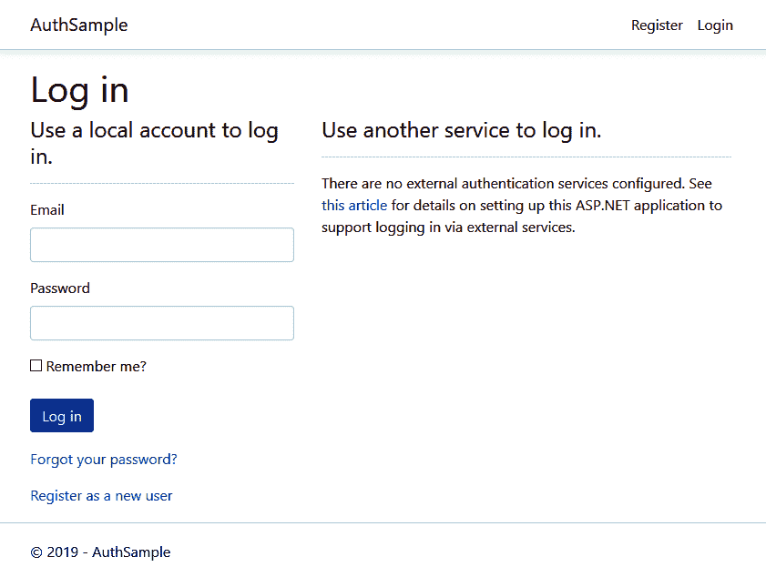

看起来路由保护正在工作：如果我们现在手动编辑`/ClientApp/src/app/app.module.ts`文件，从*`fetch-data`路由中删除`canActivate`属性，然后重试，我们将看到我们能够访问该视图而不会出现问题：*

 *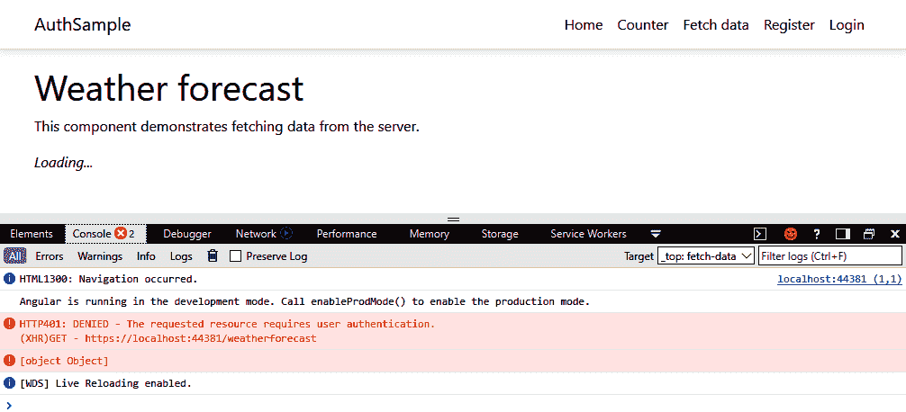

... 也许不是。

从控制台日志中可以看出，即使*前端*允许我们通过，发送给*后端*的 HTTP 请求似乎遇到了 401 未经授权的错误。怎么搞的？答案很简单：通过手动移除路由防护，我们能够*破解*我们的路径，通过Angular*前端*路由系统，但通过.NET Core*后端*路由还具有类似的防止客户端无法避免的未授权访问的保护功能

通过打开`/Controllers/WeatherForecastController.cs`文件并查看现有的类属性（突出显示的相关行），可以很容易地看到这种保护：

```cs
// ...

[Authorize]
[ApiController]
[Route("[controller]")]
public class WeatherForecastController : ControllerBase

// ...
```

在.NET Core控制器中，路由授权通过`AuthorizeAttribute`属性进行控制。更具体地说，`[Authorize]`属性应用于的控制器或操作方法需要其参数指定的授权级别：如果没有给出参数，则将`AuthorizeAttribute`属性应用于控制器或操作将限制对*认证的*用户的访问。

现在我们知道为什么我们无法从*后端获取该数据；*如果我们删除（或注释掉）该属性，我们最终将能够，如以下屏幕截图所示：

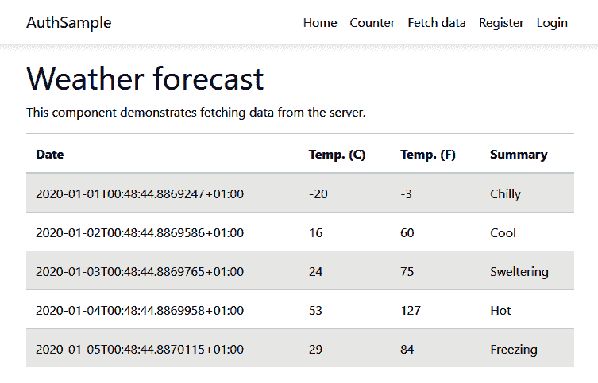

在继续之前，让我们先将*前端*路障和*后端*`AuthorizeAttribute`放回原位；在执行实际登录并获得访问这些资源的授权后，我们需要他们在那里正确地测试我们的导航。

然而，在这样做之前，我们必须完成我们的探索之旅；在下一节中，我们将介绍另一个重要的Angular概念，我们还没有讨论过。

For further information about Route Guards and their role in the Angular Routing workflow, check out the following URLs:

[https://angular.io/guide/router#guards](https://angular.io/guide/router#guards)

[https://docs.microsoft.com/en-us/aspnet/core/fundamentals/routing](https://docs.microsoft.com/en-us/aspnet/core/fundamentals/routing)

# http 拦截器

Angular`HttpInterceptor`接口提供了一种标准化的机制来拦截和/或转换传出 HTTP 请求或传入 HTTP 响应；*拦截器*与我们在**[Cha](02.html)[pter 2](https://cdp.packtpub.com/asp_net_core_3_and_angular_7___third_edition/wp-admin/post.php?post=489&action=edit#post_51)***环视*中介绍的 ASP.NET*中间件*非常相似，然后在[第三章](03.html)*前端和后端交互*中进行播放，除了在*前端*级别工作。

拦截器是 Angular 的一个主要功能，因为它们可以用于许多不同的任务：它们可以检查和/或记录我们应用的 HTTP 流量，修改请求，缓存响应，等等；它们是集中所有这些任务的方便方法，因此我们不必在*数据服务*和/或各种基于 HttpClient 的方法调用中显式地实现它们。此外，它们还可以链接，这意味着我们可以让多个拦截器在请求/响应处理程序的前向和后向链中一起工作。

`AuthorizeInterceptor`类随 Angular authentication API 一起提供，我们正在探索的特性是许多内联注释，这些注释极大地帮助我们理解它实际上是如何工作的。

要查看其源代码，请打开`/ClientApp/src/api-authorization/authorize.interceptor.ts`文件（突出显示相关行）：

```cs
import { Injectable } from '@angular/core';
import { HttpInterceptor, HttpRequest, HttpHandler, HttpEvent } 
 from '@angular/common/http';
import { Observable } from 'rxjs';
import { AuthorizeService } from './authorize.service';
import { mergeMap } from 'rxjs/operators';

@Injectable({
  providedIn: 'root'
})
export class AuthorizeInterceptor implements HttpInterceptor {
  constructor(private authorize: AuthorizeService) { }

  intercept(req: HttpRequest<any>, next: HttpHandler):
   Observable<HttpEvent<any>> {
    return this.authorize.getAccessToken()
      .pipe(mergeMap(token => this.processRequestWithToken(token, req,
       next)));
  }

  // Checks if there is an access_token available in the authorize
  // service and adds it to the request in case it's targeted at 
  // the same origin as the single page application.
  private processRequestWithToken(token: string, req:
   HttpRequest<any>,
   next: HttpHandler) {
    if (!!token && this.isSameOriginUrl(req)) {
      req = req.clone({
        setHeaders: {
          Authorization: `Bearer ${token}`
        }
      });
    }

    return next.handle(req);
  }

  private isSameOriginUrl(req: any) {
    // It's an absolute url with the same origin.
    if (req.url.startsWith(`${window.location.origin}/`)) {
      return true;
    }

    // It's a protocol relative url with the same origin.
    // For example: //www.example.com/api/Products
    if (req.url.startsWith(`//${window.location.host}/`)) {
      return true;
    }

    // It's a relative url like /api/Products
    if (/^\/[^\/].*/.test(req.url)) {
      return true;
    }

    // It's an absolute or protocol relative url that
    // doesn't have the same origin.
    return false;
  }
}
```

我们可以看到，`AuthorizeInterceptor`通过定义`intercept`方法来实现`HttpInterceptor`接口。该方法的任务是拦截*所有*发出的 HTTP 请求，并有条件地将 JWT 承载令牌添加到它们的 HTTP 头中；此条件由`isSameOriginUrl()`内部方法确定，只有当请求被发送到与 Angular app 的*来源*相同的 URL 时，该方法才会返回`true`。

与任何其他Angular类一样，`AuthorizeInterceptor`需要在`NgModule`中正确配置才能工作；由于它需要检查*任何*HTTP 请求，包括那些不属于授权 API 的请求，因此它已在`AppModule`、根级别`NgModule`或`AuthSample`应用中配置。

要查看实际实现，请打开`/ClientApp/src/app/app.module.ts`文件并查看`providers`部分：

```cs
// ... 

providers: [
 { provide: HTTP_INTERCEPTORS, useClass: AuthorizeInterceptor, multi: true }
],

// ...
```

我们在前面的代码中看到的`multi: true`**属性是必需的设置，因为`HTTP_INTERCEPTORS`是一个多提供者令牌，它希望*注入*一个多值数组，而不是单个值。**

**For additional information about HTTP interceptors, take a look at the following URLs:

[https://angular.io/api/common/http/HttpInterceptor](https://angular.io/api/common/http/HttpInterceptor)

[https://angular.io/api/common/http/HTTP_INTERCEPTORS](https://angular.io/api/common/http/HTTP_INTERCEPTORS)

# 授权组件

现在让我们看看`/api-authorization/`文件夹中包含的各种Angular组件。

# LoginMenuComponent

位于`/ClientApp/src/api-authorization/login-menu/`文件夹中的`LoginMenuComponent`角色将包含在`NavMenuComponent`（我们已经很清楚）中，以将`Login`和`Logout`动作添加到现有导航选项中。

我们可以通过打开`/ClientApp/src/app/nav-menu/nav-menu.component.html`**文件并检查是否存在以下行来检查它：**

```cs
<app-login-menu></app-login-menu>
```

这是`LoginMenuComponent`的根元素；因此，`LoginMenuComponent`被实现为`NavMenuComponent`的*子组件*。但是，如果我们查看它的 TypeScript 文件源代码，我们可以看到它有一些与任务严格相关的独特特性（相关行突出显示）：

```cs
import { Component, OnInit } from '@angular/core';
import { AuthorizeService } from '../authorize.service';
import { Observable } from 'rxjs';
import { map, tap } from 'rxjs/operators';

@Component({
  selector: 'app-login-menu',
  templateUrl: './login-menu.component.html',
  styleUrls: ['./login-menu.component.css']
})
export class LoginMenuComponent implements OnInit {
 public isAuthenticated: Observable<boolean>;
 public userName: Observable<string>;

  constructor(private authorizeService: AuthorizeService) { }

  ngOnInit() {
    this.isAuthenticated = this.authorizeService.isAuthenticated();
    this.userName = this.authorizeService.getUser().pipe(map(u => u &&
     u.name));
  }
}
```

我们可以看到，组件使用`authorizeService`（通过 DI 注入构造函数）来检索访问用户的以下信息：

*   该用户是否经过身份验证
*   该用户的用户名

这两个值存储在`isAuthenticated`和`userName`局部变量中，然后模板文件使用这些变量来确定组件的行为。

为了更好地理解这一点，让我们来看看{ To.T0}模板文件（相关的行突出显示）：

```cs
<ul class="navbar-nav" *ngIf="isAuthenticated | async">
    <li class="nav-item">
        <a class="nav-link text-dark" 
         [routerLink]='["/authentication/profile"]' 
         title="Manage">Hello {{ userName | async }}</a>
    </li>
    <li class="nav-item">
        <a class="nav-link text-dark" 
         [routerLink]='["/authentication/logout"]' 
         [state]='{ local: true }' title="Logout">Logout</a>
    </li>
</ul>
<ul class="navbar-nav" *ngIf="!(isAuthenticated | async)">
  <li class="nav-item">
        <a class="nav-link text-dark" 
         [routerLink]='["/authentication/register"]'>Register</a>
    </li>
    <li class="nav-item">
        <a class="nav-link text-dark" 
         [routerLink]='["/authentication/login"]'>Login</a>
    </li>
</ul>
```

我们可以通过以下方式立即看到表示层是如何由两个`ngIf`*结构指令*确定的：

*   如果用户通过*认证*，则会显示`Hello <username>`欢迎信息和`Logout`链接。
*   如果用户*未通过*认证，则会显示`Register`和`Login`链接。

这是一种广泛使用的实现登录/注销菜单的方法；如我们所见，所有链接都指向将透明地处理每个任务的`IdentityServer`端点 URI。

# 登录组件

`LoginComponent`执行正确处理用户登录过程所需的各种任务；因此，任何想要限制已验证用户访问的 Angular 组件和/或.NET Core控制器都应该执行 HTTP 重定向到此组件的路由；通过查看组件定义方法的源代码可以看出，如果传入请求提供了`returnUrl`查询参数，组件在执行登录后会将用户重定向回该组件：

```cs
//... 

private async login(returnUrl: string): Promise<void> {
  const state: INavigationState = { returnUrl };
  const result = await this.authorizeService.signIn(state);
  this.message.next(undefined);
  switch (result.status) {
    case AuthenticationResultStatus.Redirect:
      break;
 case AuthenticationResultStatus.Success:
 await this.navigateToReturnUrl(returnUrl);
      break;
    case AuthenticationResultStatus.Fail:
      await this.router.navigate(
       ApplicationPaths.LoginFailedPathComponents, {
        queryParams: { [QueryParameterNames.Message]: result.message }
      });
      break;
    default:
      throw new Error(`Invalid status result ${(result as
       any).status}.`);
  }
}

// ...
```

`LoginComponent`TypeScript 源代码相当长，但只要我们记住它的主要工作，就可以理解：使用默认端点 URI 将用户的身份验证信息传递给.NET Core`IdentityServer`，并将结果返回给客户端；它基本上就像一个*前端*到*后端*身份验证代理。

如果我们看一下它的模板文件，这个角色将变得更加明显：

```cs
<p>{{ message | async }}</p>
```

就这样。事实上，这个组件确实有非常小的模板，只是因为它会将用户重定向到一些*后端*页面，这些页面松散地模仿了我们的Angular组件的视觉样式（！）。

为了快速确认，点击*F5*以调试模式运行`AuthSample`项目并访问登录视图，然后仔细查看以下屏幕截图中突出显示的 UI 元素：

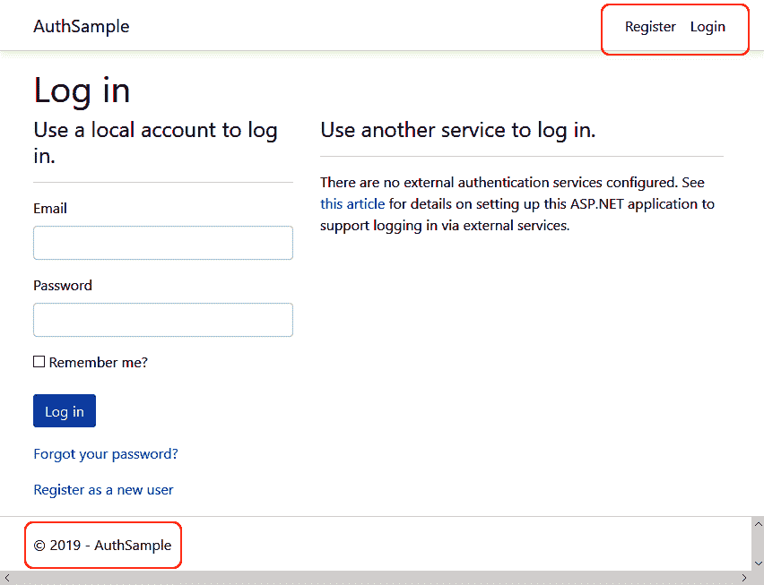

我们使用红色方块突出显示的两个元素与 Angular 应用 GUI 的其余部分不匹配：右上角菜单缺少计数器和获取数据选项，并且页脚甚至不存在；它们都是从*后端*生成的，就像登录视图的其他 HTML 内容一样。

事实上，.NET Core 和 Angular 模板附带的身份验证 API 实现的工作方式如下：*后端*处理登录和注册表单，`LoginComponent`扮演混合角色—半个请求处理程序，半个 UI 代理

It's worth noting that these built-in *Login* and *Registration* pages provided by the ASP.NET Core *back-end* can be fully customized in their UI and/or behavior to make them compatible with the Angular app's look and feel: see the *Installing the ASP.NET Core Identity UI package* and *Customizing the default Identity UI* sections within this chapter for further details on how to do this.

这种技术可能看起来像是一种*黑客*——事实上，至少在某种程度上是如此，但它是一种非常聪明的技术，因为它*透明*（好吧，不太多）围绕着大多数以*纯**为特征的登录机制的许多安全性、性能和兼容性问题工作前端*实现，同时节省开发人员大量时间。

In one of my previous books (*ASP.NET Core 2 and Angular 5*), I chose to purposely avoid the .NET Core `IdentityServer` and manually implement the registration and login workflows from the *front-end*: however, the .NET Core mixed approach has greatly improved in the last 2 years and now offers a great alternative to the standard, Angular-based implementation, thanks to a solid and highly configurable interface.

Those who prefer to use the former method can take a look at the GitHub repository of the *ASP.NET Core 2 and Angular 5* book, (`Chapter_08` onward), which is still fully compatible with the latest Angular versions:

[https://github.com/PacktPublishing/ASP.NET-Core-2-and-Angular-5/](https://github.com/PacktPublishing/ASP.NET-Core-2-and-Angular-5/)

如果我们不喜欢*重定向到后端*的方法，*内置的*授权 API 提供了一个替代实现，可以用弹出窗口替换整个页面的 HTTP 重定向

要激活它，打开`/ClientApp/src/api-authorization/authorize.service.ts`文件，将`popupDisabled`内部变量值从`true`更改为`false`，如下代码所示：

```cs
// ...

export class AuthorizeService {
  // By default pop ups are disabled because they don't work properly
  // on Edge. If you want to enable pop up authentication simply set
  // this flag to false.

 private popUpDisabled = false;
  private userManager: UserManager;
  private userSubject: BehaviorSubject<IUser | null> = new
   BehaviorSubject(null);

// ...
```

如果我们希望通过弹出窗口实现 auth 特性，我们可以将前面的布尔值更改为`false`，然后以调试模式启动`AuthSample`项目来测试结果。

以下是弹出式登录页面的外观：

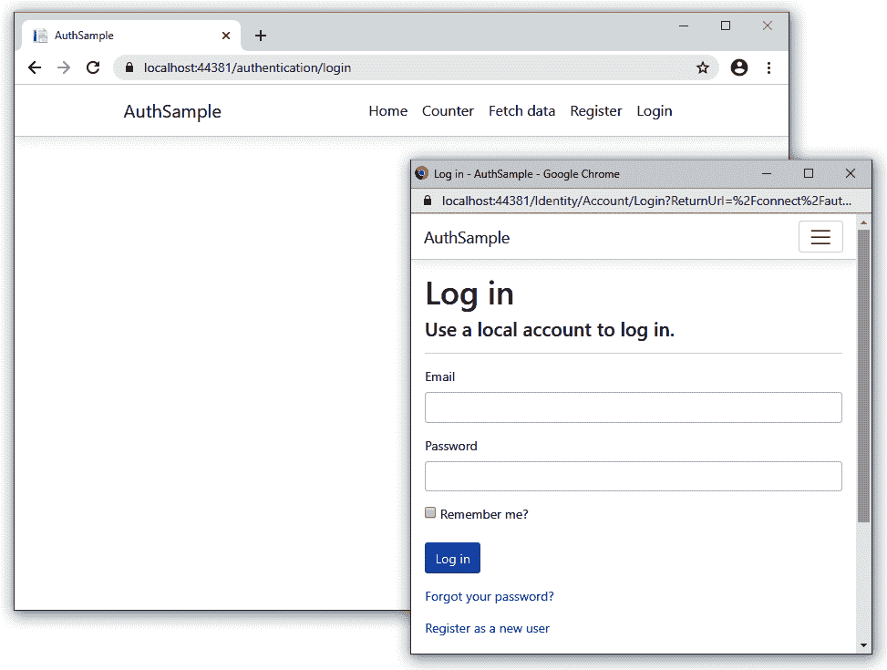

然而，正如内联评论所说，弹出窗口在 MicrosoftEdge 上不能正常工作（甚至其他浏览器也不喜欢它们）；出于这个原因，*后端*生成的页面可以说是一个更好的选择，特别是如果我们可以定制它们，我们将在后面看到。

# 注销组件

`LogoutComponent`是`LoginComponent`的对应项，因为它处理断开用户连接并将他们带回主页的任务。

这里没什么好说的，因为它的工作方式与它的兄弟类似，将用户重定向到.NET Core Identity system 端点 URI，然后使用`returnUrl`参数将其带回 Angular 应用。主要区别在于这次没有*后端*页面，因为注销工作流不需要用户界面。

# 测试注册和登录

现在我们准备测试`AuthSample`Angular 应用的注册和登录工作流；让我们从注册阶段开始，因为我们这里还没有任何注册用户。

点击*F5*以调试模式运行项目，然后导航至注册*视图：插入有效电子邮件，密码与所需密码强度设置相匹配，然后点击注册按钮。*

 *一旦我们这样做，我们就会看到以下信息：


单击确认链接创建帐户，然后等待重新加载整个页面。

As a matter of fact, all these redirects and reloads performed by this implementation definitely break the SPA pattern that we talked about in [Chapter 1](01.html), *Getting Ready*.

However, when we compared the pros and cons of the Native Web Application, SPA and Progressive Web Application approaches, we told ourselves that we would have definitely adopted some strategic HTTP round-trips and/or other redirect techniques whenever we could use a microservice to lift off some workload from our app; that's precisely what we are doing right now.

当我们返回到登录视图时，我们最终可以输入刚才选择的凭据并执行登录。

一旦完成，我们将受到以下屏幕的欢迎：

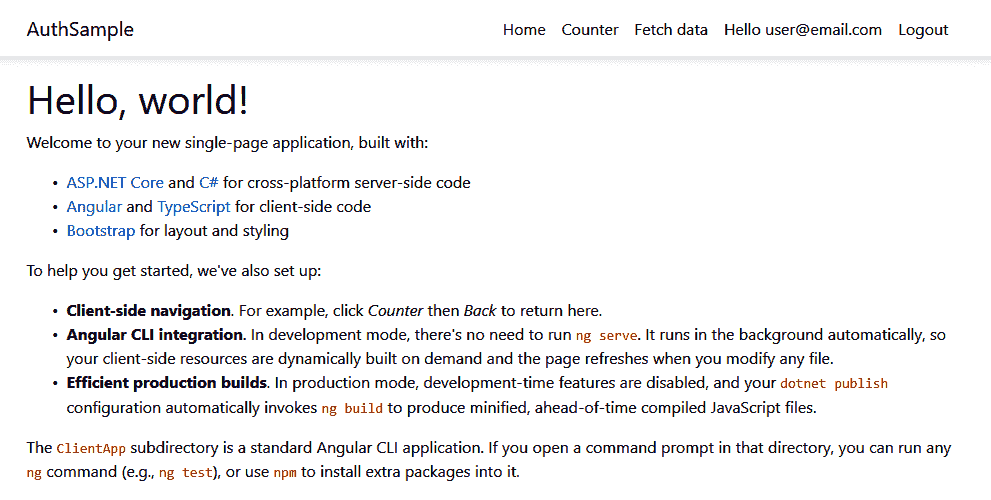

我们走吧；我们可以看到，我们之所以登录，是因为`LoginMenuComponent`的 UI 行为发生了变化，这意味着它的`isAuthenticated`内部变量现在计算为`true`。

至此，我们的`AuthSample`应用就完成了：现在我们已经了解了与.NET Core和 Angular Visual Studio 模板一起提供的*前端*授权 API 是如何工作的，我们将把它带到`WorldCities`应用中。

# 在 WorldCities 应用中实现 Auth API

在本节中，我们将在`WorldCities`应用中实现`AuthSample`应用提供的授权 API。下面是我们将要详细执行的操作：

*   **将前端授权 API**从`AuthSample`app 导入`WorldCities`app，并集成到我们现有的 Angular 代码中。
*   **调整现有后端源代码**正确实现认证功能。
*   **测试`WorldCities`项目的登录登记表**。

在本节结束时，我们应该能够使用`WorldCities`应用登录现有用户，并创建新用户。

# 导入前端授权 API

要将*前端*授权 API 导入我们的`WorldCities`Angular 应用，我们需要做的第一件事是从`AuthSample`应用复制整个`/ClientApp/src/api-authorization/`文件夹。这样做没有缺点，所以我们可以使用 VisualStudio 解决方案资源管理器使用复制和粘贴 GUI 命令（或者*Ctrl*+*C*/*Ctrl*+*V*，如果您喜欢使用键盘快捷键）。

完成后，我们需要将新的*前端*功能与现有代码集成。

# 应用模块

我们要修改的第一个文件是`/ClientApp/src/api-authorization/api-authorization.constants.ts`文件，它在其内容的第一行包含对应用名称的文字引用：

```cs
export const ApplicationName = 'AuthSample';

// ...
```

将`'AuthSample'`更改为`'WorldCities'`，保持文件的其余部分不变。

# 应用模块

紧接着，我们需要更新`/ClientApp/src/app/app.module.ts`文件，其中我们需要向授权 API 的类添加所需的引用：

```cs
// ...

import { ApiAuthorizationModule } from 'src/api-authorization/api-authorization.module';
import { AuthorizeGuard } from 'src/api-authorization/authorize.guard';
import { AuthorizeInterceptor } from 'src/api-authorization/authorize.interceptor';

// ...

  imports: [
    BrowserModule.withServerTransition({ appId: 'ng-cli-universal' }),
    HttpClientModule,
    FormsModule,
 ApiAuthorizationModule,
    RouterModule.forRoot([
      {
        path: '',
        component: HomeComponent,
        pathMatch: 'full'
      },
      {
        path: 'cities',
        component: CitiesComponent
      },
      {
        path: 'city/:id',
        component: CityEditComponent,
 canActivate: [AuthorizeGuard]
      },
      {
        path: 'city',
        component: CityEditComponent,
 canActivate: [AuthorizeGuard]
      },
      {
        path: 'countries',
        component: CountriesComponent
      },
      {
        path: 'country/:id',
        component: CountryEditComponent,
 canActivate: [AuthorizeGuard]
      },
      {
        path: 'country',
        component: CountryEditComponent,
 canActivate: [AuthorizeGuard]
      }
    ]),
    BrowserAnimationsModule,
    AngularMaterialModule,
    ReactiveFormsModule
    ],
  providers: [
    CityService,
    CountryService,
 { provide: HTTP_INTERCEPTORS, useClass: AuthorizeInterceptor,
      multi: true }
  ],
  bootstrap: [AppComponent]
})
export class AppModule { }
```

正如我们所看到的，除了添加所需的引用之外，我们还利用机会使用`AuthorizeGuard`来保护我们的编辑组件，以便只有*注册的*用户才能访问这些组件。

# 导航组件

现在我们需要将`LoginMenuComponent`集成到我们现有的`NavMenuComponent`，就像在`AuthSample`应用中一样。

打开`/ClientApp/src/app/nav-menu/nav-menu.component.html`模板文件，并在其内容中添加对菜单的引用：

```cs
<header>
  <nav class="navbar navbar-expand-sm navbar-toggleable-sm
    navbar-light bg-white border-bottom box-shadow mb-3"
  >
    <div class="container">
      <a class="navbar-brand" [routerLink]="['/']">WorldCities</a>
      <button
        class="navbar-toggler"
        type="button"
        data-toggle="collapse"
        data-target=".navbar-collapse"
        aria-label="Toggle navigation"
        [attr.aria-expanded]="isExpanded"
        (click)="toggle()"
      >
        <span class="navbar-toggler-icon"></span>
      </button>
      <div
        class="navbar-collapse collapse d-sm-inline-flex 
         flex-sm-row-reverse"
        [ngClass]="{ show: isExpanded }"
      >
 <app-login-menu></app-login-menu>
        <ul class="navbar-nav flex-grow">
          <li
            class="nav-item"
            [routerLinkActive]="['link-active']"
            [routerLinkActiveOptions]="{ exact: true }"
          >
            <a class="nav-link text-dark" 
            [routerLink]="['/']">Home</a>

<!-- ...existing code... --->
```

现在我们可以切换到*后端*代码。

# 调整后端代码

让我们从导入`OidcConfigurationController`开始。`AuthSample`项目附带一个专用的.NET Core API 控制器，以提供 URI 端点，该端点将为客户端需要使用的 OIDC 配置参数提供服务。

将`AuthSample`项目的`/Controllers/OidcConfigurationController.cs`文件复制到`WorldCities`项目的`/Controllers/`文件夹中，然后打开复制的文件并相应更改其名称空间：

```cs
// ...

namespace AuthSample.Controllers

// ...
```

将`AuthSample.Controllers`更改为`WorldCities.Controllers`并继续。

# 安装 ASP.NET Core标识 UI 包

还记得刚才我们讨论过从*后端*生成的登录和注册页面吗？这些由`Microsoft.AspNetCore.Identity.UI`包提供，其中包含*的默认**剃须刀页面**内置 UI。*网络核心身份框架。由于默认情况下没有安装，我们需要使用 NuGet 手动将其添加到我们的`WorldCities`项目中。

在解决方案资源管理器中，右键单击`WorldCities`树节点，然后选择**M**Manage NuGet packages，查找以下软件包并安装：

```cs
Microsoft.AspNetCore.Identity.UI
```

或者，打开 Package Manager 控制台并使用以下命令进行安装：

```cs
> Install-Package Microsoft.AspNetCore.Identity.UI
```

在撰写本文时，该软件包的最新可用版本为**3.1.1**；和往常一样，只要我们知道如何相应地调整代码以修复潜在的兼容性问题，我们就可以免费安装新版本。

# 自定义默认标识 UI

值得注意的是，我们可以通过*Identity scaffolder*工具替换**Microsoft.AspNetCore.Identity.UI**包提供的默认*登录*和*注册*视图，该工具可用于选择性地添加*Identity*中包含的源代码**Razor 类库**（**RCL**）添加到我们的项目中；一旦生成，可以修改和/或定制源代码，以更改其外观（和/或行为），以更好地满足我们的需要。

Generated (and modified) code will automatically take precedence over the default code in the Identity RCL. 

要完全控制 UI 而不使用默认 RCL，请参阅以下指南：

*   [https://docs.microsoft.com/en-us/aspnet/core/security/authentication/scaffold-identity](https://docs.microsoft.com/en-us/aspnet/core/security/authentication/scaffold-identity)
*   [https://docs.microsoft.com/en-us/aspnet/core/security/authentication/scaffold-identity#full](https://docs.microsoft.com/en-us/aspnet/core/security/authentication/scaffold-identity#full)
*   [https://docs.microsoft.com/en-us/aspnet/core/razor-pages/ui-class](https://docs.microsoft.com/en-us/aspnet/core/razor-pages/ui-class)

为了简单起见，我们不会使用此技术来改变内置*登录*和*注册*页面的 UI 和/或行为：我们将保持它们的原样。

# 将 Razor 页面映射到端点中间件

现在我们（内部）正在使用一些 Razor 页面，我们需要将它们映射到*后端*路由系统，否则，.NET Core应用不会将 HTTP 请求转发给它们。

为此，打开`WorldCities`项目的`Startup.cs`文件，并在`EndpointMiddleware`配置块中添加以下高亮显示的行：

```cs
// ...

app.UseEndpoints(endpoints =>
{
    endpoints.MapControllerRoute(
        name: "default",
        pattern: "{controller}/{action=Index}/{id?}");

 endpoints.MapRazorPages();
});

// ...
```

就这样,；现在我们终于可以登录了。

# 保护后端操作方法

在测试我们的身份验证和授权实现之前，我们应该多花两分钟来保护我们的*后端*路由，就像我们对*前端*路由所做的一样。我们已经知道，我们可以使用`AuthorizeAttribute`来实现这一点，它可以将控制器和/或操作方法的访问权限限制为仅注册用户。

为了有效保护我们的.NET Core Web API 免受未经授权的访问尝试，明智的做法是在我们所有控制器的`PUT`、`POST`和`DELETE`方法上以以下方式使用它：

1.  打开`/Controllers/CitiesController.cs`文件，将`[Authorize]`属性添加到`PutCity`、`PostCity`和`DeleteCity`方法中：

```cs
using Microsoft.AspNetCore.Authorization;

// ...

[Authorize]
[HttpPut("{id}")]
public async Task<IActionResult> PutCity(int id, City city)

// ...

[Authorize]
[HttpPost]
public async Task<ActionResult<City>> PostCity(City city)

[Authorize]
[HttpDelete("{id}")]
public async Task<ActionResult<City>> DeleteCity(int id)

// ...
```

2.  打开`/Controllers/CountriesController.cs`文件，将`[Authorize]`属性添加到`PutCountry`、`PostCountry`和`DeleteCountry`方法中：

```cs
using Microsoft.AspNetCore.Authorization;

// ...

[Authorize]
[HttpPut("{id}")]
public async Task<IActionResult> PutCountry(int id, Country country)

// ...

[Authorize]
[HttpPost]
public async Task<ActionResult<Country>> PostCountry(Country country)

// ...

[Authorize]
[HttpDelete("{id}")]
public async Task<ActionResult<Country>> DeleteCountry(int id)

// ...

```

Don't forget to add a reference to the using `Microsoft.AspNetCore.Authorization` namespace at the top of both files.

现在，所有这些操作方法都受到保护，防止未经授权的访问，因为它们只接受来自已注册和已登录用户的请求；那些没有它的人将收到 401–未经授权的 HTTP 错误响应。

# 测试登录和注册

在本章中，我们将重复刚才为`AuthSample`应用所做的登录和注册阶段。不过，这次我们先登录，因为我们已经有了一些现有的用户，这要归功于`SeedController`的`CreateDefaultUsers()`方法。

点击*F5*以调试模式启动`WorldCities`app。完成后，导航到登录屏幕并插入现有用户的电子邮件和密码。

If we didn't change them at the time, the sample values that we used in `SeedController` should be the following: email: `user@email.com` and password: `MySecr3t$`.

如果我们做的每件事都正确，我们将看到如下屏幕截图所示的屏幕：

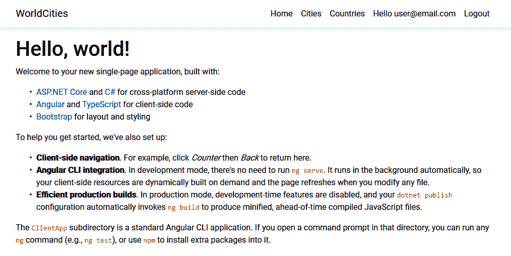

之后，我们可以尝试注册工作流来注册新用户，如`test@email.com`；如果我们的登录路径工作得很好，那么这个操作就没有理由不成功。

我们做到了！现在我们的`WorldCities`应用包含功能齐全的授权和认证 API。

事实上，我们仍然缺少一些关键功能，例如：

*   **电子邮件验证**步骤正好在注册阶段之后，这需要电子邮件发送者
*   **密码更改**和**密码恢复**功能，也需要上述邮件发送者
*   一些**外部认证服务**如 Facebook、Twitter 等（即**社交登录**）

Now that we have implemented the ASP.NET Core Identity services, implementing an email sender to take care of the preceding features would be a rather easy task, especially if we use an external service such as **SendGrid**.

For additional information, check out the following guide:

[https://docs.microsoft.com/en-us/aspnet/core/security/authentication/accconfirm](https://docs.microsoft.com/en-us/aspnet/core/security/authentication/accconfirm)

然而，对于我们的示例应用来说，这绝对足够了；我们准备好进入下一个话题。

# 总结

在本章的开头，我们介绍了身份验证和授权的概念，承认大多数应用（包括我们的应用）确实需要一种机制来正确处理经过身份验证和未经身份验证的客户端以及经过授权和未经授权的请求。

我们花了一些时间来正确理解身份验证和授权之间的异同，以及使用我们自己的内部提供商处理这些任务或将其委托给第三方提供商（如谷歌、Facebook 和 Twitter）的利弊。我们还发现，幸运的是，ASP.NET Core身份服务以及`IdentityServer`API 支持提供了一组方便的功能，使我们能够实现两个世界的最佳效果。

为了能够使用它，我们将所需的包添加到我们的项目中，并进行适当配置所需的操作，例如在我们的`Startup`和`ApplicationDbContext`类中执行一些更新，并创建一个新的`ApplicationUser`实体；在实现了所有必需的更改之后，我们添加了一个新的 EF 核心迁移来相应地更新我们的数据库。

我们简要列举了目前可用的各种基于 web 的身份验证方法：会话、令牌、签名和各种双因素策略。经过仔细考虑，我们选择了使用 JWT 的基于令牌的方法，JWT 是`IdentityServer`默认为 SPA 客户端提供的，它是任何*前端*框架的可靠且众所周知的标准。

由于 Visual Studio 提供的默认.NET Core 和 Angular 项目模板具有内置的 ASP.NET Core 标识系统和对 Angular 的`IdentityServer`支持，因此我们创建了一个全新的项目，我们称之为`AuthSample`，以对其进行测试。我们花了一些时间回顾了它的主要功能，如路由保护、HTTP 拦截器、到*后端*的 HTTP 往返等等；在此过程中，我们花时间实现了所需的*前端*和*后端*授权规则，以保护我们的一些应用视图、路由和 API 不被未经授权的访问。最终，我们将这些 API 导入我们的`WorldCities`Angular 应用，改变了我们现有的*前端*以及相应的*后端*代码。

我们已经准备好切换到下一个主题**渐进式 web 应用**，这将使我们在下一章中忙个不停。

# 建议的主题

身份验证、授权、HTTP 协议、安全套接字层、会话状态管理、间接寻址、单点登录、Azure AD 身份验证库（ADAL）、ASP.NET Core标识、IdentityServer、OpenID、OpenID 连接（OIDC）、OAuth、OAuth2、双因素身份验证（2FA）、SMS 2FA、基于时间的一次性密码算法（TOTP）、TOTP 2FA、，IdentityUser、无状态、跨站点脚本（XSS）、跨站点请求伪造（CSRF）、Angular HttpClient、Route Guard、Http 拦截器、LocalStorage、Web 存储 API、服务器端预呈现、Angular Universal、浏览器类型、泛型类型、JWT 令牌、声明、授权属性。

# 工具书类

*   *ASP.NET Core身份介绍*：[https://docs.microsoft.com/en-us/aspnet/core/security/authentication/identity](https://docs.microsoft.com/en-us/aspnet/core/security/authentication/identity)
*   *SPA 认证授权*：[https://docs.microsoft.com/en-us/aspnet/core/security/authentication/identity-api-authorization](https://docs.microsoft.com/en-us/aspnet/core/security/authentication/identity-api-authorization)
*   *IdentityServer 官方文档*：[http://docs.identityserver.io/en/latest/](http://docs.identityserver.io/en/latest/)
    *角色经理<TRole>等级*：[https://docs.microsoft.com/en-us/dotnet/api/microsoft.aspnetcore.identity.rolemanager-1](https://docs.microsoft.com/en-us/dotnet/api/microsoft.aspnetcore.identity.rolemanager-1)
*   *ASP.NET Core中的身份模型定制*：[https://docs.microsoft.com/en-US/aspnet/core/security/authentication/customize-identity-model](https://docs.microsoft.com/en-US/aspnet/core/security/authentication/customize-identity-model)
*   *ASP.NET Core安全概述*：[https://docs.microsoft.com/en-us/aspnet/core/security/](https://docs.microsoft.com/en-us/aspnet/core/security/)
*   *异步并等待*：[https://blog.stephencleary.com/2012/02/async-and-await.html](https://blog.stephencleary.com/2012/02/async-and-await.html)
*   *异步/等待常见问题解答*：[https://blogs.msdn.microsoft.com/pfxteam/2012/04/12/asyncawait-faq/](https://blogs.msdn.microsoft.com/pfxteam/2012/04/12/asyncawait-faq/)
*   *不阻塞异步代码*：[http://blog.stephencleary.com/2012/07/dont-block-on-async-code.html](http://blog.stephencleary.com/2012/07/dont-block-on-async-code.html)
*   *异步/等待–异步编程的最佳实践*：[https://msdn.microsoft.com/en-us/magazine/jj991977.aspx](https://msdn.microsoft.com/en-us/magazine/jj991977.aspx)
*   *ASP.NET Core同步上下文*：[https://blog.stephencleary.com/2017/03/aspnetcore-synchronization-context.html](https://blog.stephencleary.com/2017/03/aspnetcore-synchronization-context.html)
*   *带异步等待的异步编程*：[https://docs.microsoft.com/en-us/dotnet/csharp/programming-guide/concepts/async/index](https://docs.microsoft.com/en-us/dotnet/csharp/programming-guide/concepts/async/index)
*   *EF 岩芯迁移*：[https://docs.microsoft.com/en-us/ef/core/managing-schemas/migrations/](https://docs.microsoft.com/en-us/ef/core/managing-schemas/migrations/)
*   *SQL Server:创建完整数据库备份*：[https://docs.microsoft.com/en-us/sql/relational-databases/backup-restore/create-a-full-database-backup-sql-server](https://docs.microsoft.com/en-us/sql/relational-databases/backup-restore/create-a-full-database-backup-sql-server)
*   *ASP.NET Core短信双因素认证*：[https://docs.microsoft.com/en-us/aspnet/core/security/authentication/2fa](https://docs.microsoft.com/en-us/aspnet/core/security/authentication/2fa)
*   *在 ASP.NET Core*：[中为 TOTP 认证器应用启用二维码生成 https://docs.microsoft.com/en-us/aspnet/core/security/authentication/identity-enable-qrcodes](https://docs.microsoft.com/en-us/aspnet/core/security/authentication/identity-enable-qrcodes)
*   *Angular：路由防护装置*：[https://angular.io/guide/router#guards](https://angular.io/guide/router#guards)
*   *ASP.NET Core中的路由*：[https://docs.microsoft.com/en-us/aspnet/core/fundamentals/routing](https://docs.microsoft.com/en-us/aspnet/core/fundamentals/routing)
*   *ASP.NET Core授权介绍*：[https://docs.microsoft.com/en-us/aspnet/core/security/authorization/introduction](https://docs.microsoft.com/en-us/aspnet/core/security/authorization/introduction)
*   *ASP.NET Core中的简单授权*：[https://docs.microsoft.com/en-us/aspnet/core/security/authorization/simple](https://docs.microsoft.com/en-us/aspnet/core/security/authorization/simple)
*   *在 ASP.NET Core*：[中有具体方案授权 https://docs.microsoft.com/en-us/aspnet/core/security/authorization/limitingidentitybyscheme](https://docs.microsoft.com/en-us/aspnet/core/security/authorization/limitingidentitybyscheme)
*   *ASP.NET Core项目中的脚手架标识*：[https://docs.microsoft.com/en-us/aspnet/core/security/authentication/scaffold-identity](https://docs.microsoft.com/en-us/aspnet/core/security/authentication/scaffold-identity)
*   *ASP.NET Core标识：创建完整标识 UI 源*：[https://docs.microsoft.com/en-us/aspnet/core/security/authentication/scaffold-identity#full](https://docs.microsoft.com/en-us/aspnet/core/security/authentication/scaffold-identity#full)

*   *使用 ASP.NET Core*：[中的 Razor 类库项目创建可重用 UIhttps://docs.microsoft.com/en-us/aspnet/core/razor-pages/ui-class](https://docs.microsoft.com/en-us/aspnet/core/razor-pages/ui-class)
*   *Angular：HTTP 拦截器*：[https://angular.io/api/common/http/HttpInterceptor](https://angular.io/api/common/http/HttpInterceptor)
*   *ASP.NET Core中基于角色的授权*：[https://docs.microsoft.com/en-us/aspnet/core/security/authorization/roles](https://docs.microsoft.com/en-us/aspnet/core/security/authorization/roles)
*   *ASP.NET Core中的账号确认和密码恢复*：[https://docs.microsoft.com/en-us/aspnet/core/security/authentication/accconfirm](https://docs.microsoft.com/en-us/aspnet/core/security/authentication/accconfirm)*************