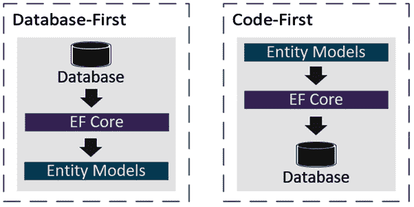
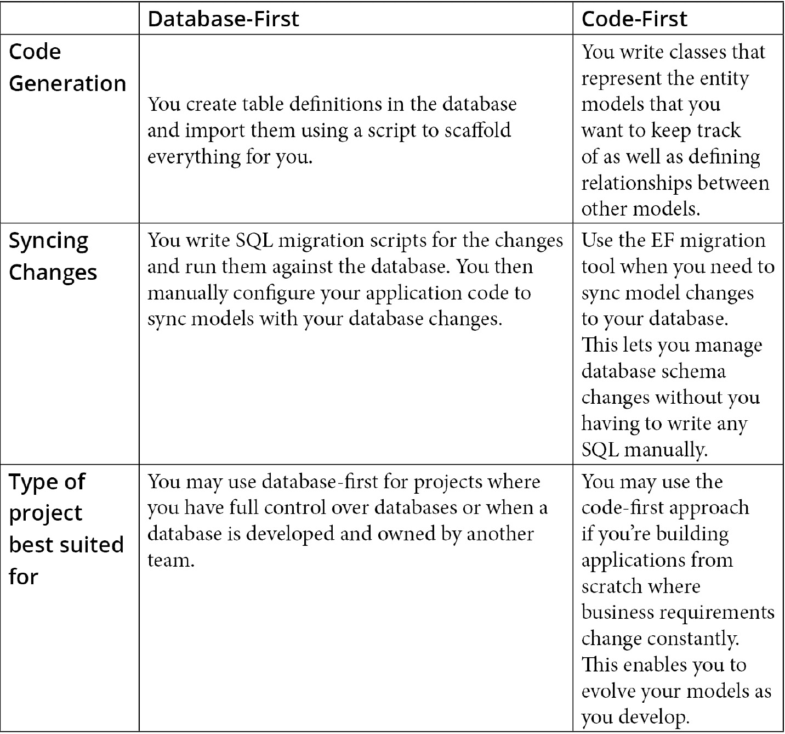
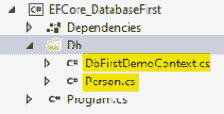
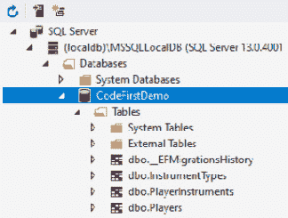
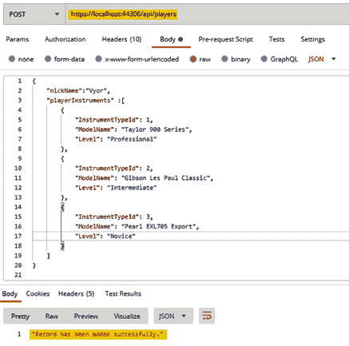
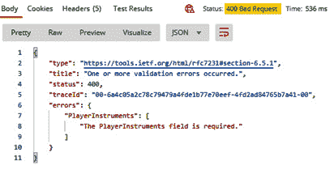
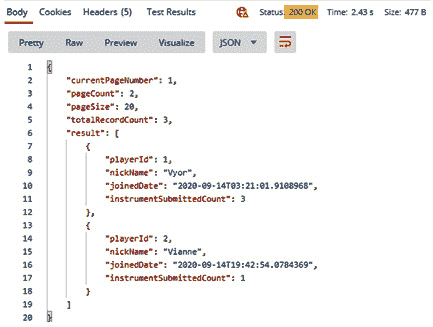
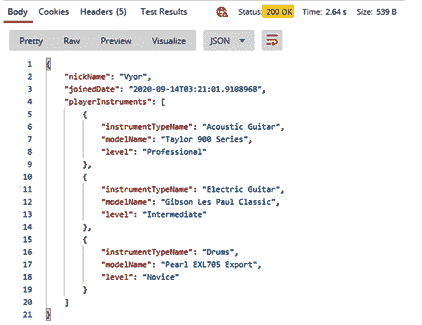

# *第 7 章*：API 和数据访问

在现实场景中，无论是移动应用、桌面应用、服务应用还是 web 应用，它们都严重依赖**应用编程接口**（**API**）与系统交互以提交或获取数据。API 通常充当客户端应用和数据库之间的网关，以执行系统之间的任何数据操作。通常，API 向客户端提供有关如何与系统交互以执行数据事务的说明和特定格式。因此，API 和数据访问共同实现两个主要目标：服务和获取数据。

以下是我们将在本章中讨论的主要主题列表：

*   了解什么是 ORM 和实体框架核心
*   审查 EF Core 支持的不同设计工作流
*   学习数据库优先开发
*   学习代码优先开发和迁移
*   学习 LINQ 的基础知识，根据概念模型查询数据
*   回顾 ASP.NET 核心 API 是什么
*   构建 Web API，实现最常用的 HTTP 数据服务方法
*   使用 Postman 测试 API

在本章中，我们将学习在**实体框架**（**EF**核心中使用真实数据库的不同方法。我们将了解如何在现有数据库中使用 EF 核心，以及如何使用 EF 核心代码优先方法实现与真实数据库对话的 API。我们将研究 ASP.NET 核心 Web API 与实体框架核心，以在 SQL Server 数据库中执行数据操作。我们还将学习如何实现用于公开某些 API 端点的最常用 HTTP 方法（谓词）。

了解 ASP.NET 核心不仅限于实体框架核心和 SQL Server 非常重要。您始终可以使用您喜欢的任何数据访问框架。例如，您可以始终使用 Dapper、NHibernate，甚至使用旧的普通 ADO.NET 作为数据访问机制。如果愿意，还可以使用 MySQL 或 Postgres 作为数据库提供程序。

# 技术要求

本章使用 Visual Studio 2019 演示如何构建不同的应用。为了简洁起见，省略了本章中演示的一些代码片段。确保在[处检查源代码 https://github.com/PacktPublishing/ASP.NET-Core-5-for-Beginners/tree/master/Chapter%2007/Chapter_07_API_EFCore_Examples](https://github.com/PacktPublishing/ASP.NET-Core-5-for-Beginners/tree/master/Chapter%2007/Chapter_07_API_EFCore_Examples) 。

请访问以下链接查看 CiA 视频：[https://bit.ly/3qDiqYY](https://bit.ly/3qDiqYY)

需要对数据库、ASP.NET 核心和 C#有基本的了解，因为在本章中我们将不介绍它们的基础知识。

# 理解实体框架核心

在软件工程领域，大多数应用都需要数据库来存储数据。因此，我们都需要代码来读取/写入存储在数据库中的数据。为数据库创建和维护代码是一项乏味的工作，对于开发者来说，这是一项真正的挑战。这就是像实体框架一样的**对象关系映射器**（**ORMs**）发挥作用的地方。

实体框架核心是一种 ORM 和一种数据访问技术，它使 C#开发者无需手动编写 SQL 脚本即可与数据库交互。像 EF Core 这样的 ORM 通过处理.NET 对象而不是直接与数据库模式交互，帮助您快速构建数据驱动的应用。这些.NET 对象只是类，它们通常被称为**实体**。有了 EF Core，C#开发者可以利用他们现有的技能，利用**语言集成查询**（**LINQ**的强大功能，根据概念实体模型操作数据集，否则简称为模型。从这里开始，我们将使用术语*模型*，如图 7.1 所示。


图 7.1-EF 核心高级流程

上图描述了使用 EF Core 与数据库交互的过程。在传统的 ADO.NET 中，通常手动编写 SQL 查询以执行数据库操作。虽然性能会因编写查询的方式而异，但 ADO.NET 方式带来了比 ORMs 更高的性能优势，因为您可以将 SQL 查询直接注入代码并在数据库中运行。但是，这会导致代码变得难以维护，因为任何 SQL 查询更改都会导致应用代码的更改；除使用**存储过程**外。此外，调试代码可能会很痛苦，因为编写 SQL 查询时需要处理一个简单的字符串，任何打字错误或语法错误都很容易被忽略。

使用 EF Core，您不必担心自己编写 SQL 脚本。相反，您将使用 LINQ 查询强类型对象，并让框架处理其余的事务，例如生成和执行 SQL 查询。

请记住，EF Core 不仅限于 SQL Server 数据库。该框架支持各种可以与应用集成的数据库提供程序，如 Postgres、MySQL、SQLite、Cosmos 和其他许多数据库提供程序。

## 审查 EF 核心设计工作流程

EF Core 支持两种主要设计工作流：数据库优先方法和代码优先方法。

以下*图 7.2*描述了两种设计工作流之间的差异：



图 7.2–EF 核心设计工作流程

在上图中，我们可以看到数据库第一工作流从现有数据库开始，EF Core 将根据数据库模式生成模型。另一方面，代码优先工作流从编写模型开始，EF Core 将通过 EF 迁移生成相应的数据库模式。迁移是一个保持模型和数据库模式同步而不丢失现有数据的过程。

下表概述了在构建应用时要考虑设计工作流的建议：



了解设计工作流之间的差异非常重要，以便您知道何时将它们应用于项目。

既然您已经了解了这两种设计工作流之间的区别，那么让我们继续下一节，学习如何通过动手编码练习实现每种方法。

# 学习数据库先行开发

在本节中，我们将构建一个.NET 核心控制台应用，探索数据库优先的方法，并了解如何从现有数据库创建实体模型（逆向工程）。

## 创建.NET 核心控制台应用

要创建新的.NET Core console应用，请执行以下步骤：

1.  **打开**Visual Studio 2019，选择**新建项目**。
2.  选择**控制台应用（.NET Core）**项目模板。
3.  点击**下一步**。在下一个屏幕上，将项目命名为`EFCore_DatabaseFirst`。
4.  单击**创建**让 Visual Studio 为您生成默认文件。

现在，我们将在应用中添加所需的实体框架核心包，以便使用数据库优先方法处理现有数据库。

## 集成实体框架核心

实体框架核心功能作为一个单独的 NuGet 包实现，以允许开发人员轻松集成应用所需的功能。

正如您可能已经从[*第 4 章*](04.html#_idTextAnchor089)*Razor View Engine*中了解到的；[*第五章*](05.html#_idTextAnchor118)*Blazor 入门*；以及[*第 6 章*](06.html#_idTextAnchor134)*探索 Blazor Web 框架*，在 Visual Studio 中添加NuGet 包依赖项的方法有很多；您可以使用**包管理器控制台**（**PMC**）或**NuGet 包管理器**（**NPM**）。在这个练习中，我们将使用控制台。

默认情况下，PMC 窗口为`enabled`，您可以在 VisualStudio 的左下角找到它。

如果由于某种原因，您无法找到 PMC 窗口，您可以通过进入**工具**>**NuGet Package Manager**>**Package Manager 控制台**下的**Visual Studio**菜单手动导航到该窗口。

现在，让我们通过在控制台中分别运行以下命令来安装几个 NuGet 软件包：

```cs
PM> Install-Package Microsoft.EntityFrameworkCore.Tools
PM> Install-Package Microsoft.EntityFrameworkCore.SqlServer
PM> Install-Package Microsoft.EntityFrameworkCore.SqlServer.Design -Pre
```

前面代码中的命令将在应用中作为依赖项安装 NuGet 软件包。`-Pre`命令指示安装实体框架核心包的最新预览版本。在本例中，截至撰写本文之时，SQL Server 和 Tools 包的当前版本为**5.0.0**，而`SqlServer.Design`包的当前版本为**2.0.0-preview1-final**。

现在我们已经安装了使用现有数据库所需的工具和依赖项，让我们进入下一步。

## 创建数据库

为了模拟使用现有数据库，我们需要从头创建一个数据库。在本例中，为了简单起见，我们将创建一个包含一些简单列的表。如果安装了 SQL Server Express，或者使用内置在 Visual Studio 中的本地数据库，则可以使用它。

要在 Visual Studio 中创建新数据库，请执行以下简单步骤：

1.  进入**查看**>**SQL Server 对象浏览器**。
2.  向下钻取到**SQL Server**>**（localdb）\MSSQLLocalDB**。
3.  右键点击`Databases`文件夹。
4.  点击**新增数据库**。
5.  命名为`DbFirstDemo`并点击**确定**。
6.  右键点击`DbFirstDemo`数据库，选择**新建查询**。
7.  复制以下 SQL 脚本：

    ```cs
    CREATE TABLE [dbo].[Person]
    (
    	[Id] INT NOT NULL PRIMARY KEY IDENTITY(1,1), 
        	[FirstName] NVARCHAR(30) NOT NULL, 
        	[LastName] NVARCHAR(30) NOT NULL, 
        	[DateOfBirth] DATETIME NOT NULL
    )
    ```

8.  运行脚本，它将在本地数据库中创建一个名为`Person`的新表。

现在我们有了一个数据库，让我们进入下一节，创建.NET 类对象，以便使用 EF Core 处理数据。

## 从现有数据库生成模型

截至本文撰写之时，有两种方法可以从现有数据库生成模型。您可以使用 PMC 或.NET 核心**命令行界面**（**CLI**命令）。让我们在下一节中看看如何做到这一点。

### 使用 Scaffold DbContext 命令

您需要做的第一件事是获取`ConnectionString`值，以便连接到数据库。您可以从 VisualStudio 中`DbFirstDemo`数据库的**属性**窗口获取此值。

现在导航回 PMC 并运行以下命令从现有数据库创建相应的`Models`：

```cs
PM> Scaffold-DbContext “INSERT THE VALUE OF CONNECTION STRING HERE” Microsoft.EntityFrameworkCore.SqlServer -o Db
```

前面代码中的`Scaffold-DbContext`命令是`Microsoft.EntityFrameworkCore.Tools`包的一部分，负责逆向工程过程。此过程将基于现有数据库创建一个`DbContext`和`Model`类。

我们在`Scaffold-DbContext`命令中传入了三个主要的参数：

*   **连接字符串**：第一个参数是指示如何连接到数据库的连接字符串。
*   **提供程序**：将使用对其执行连接字符串的数据库提供程序。在本例中，我们使用`Microsoft.EntityFrameworkCore.SqlServer`作为提供者。
*   **输出目录**：`-o`选项是`–OutputDir`的简写，可以指定要生成的文件的位置。在本例中，我们将其设置为`Db`。

### 使用 dotnet ef dbcontext scaffold 命令

从现有数据库生成`Models`的第二个选项是通过.NET Core CLI 使用 EF Core 工具。为了做到这一点，我们需要使用命令行提示符。在 Visual Studio 中，您可以转到**工具**>**命令行**>**开发人员命令提示符**。此过程将在解决方案文件（`.sln`所在的文件夹中启动一个命令提示窗口。由于我们需要在项目文件（`.csproj`所在的级别执行该命令，因此我们需要将目录向下移动一个文件夹。因此，在命令提示符中，执行以下操作：

```cs
 cd EFCore_DatabaseFirst
```

前面的命令将设置项目文件所在的当前目录。

另一种方法是导航到 Visual Studio 外部的`EFCore_DatabaseFirst`文件夹，然后按*Shift*+*右键单击*并选择**在此处打开命令窗口**或**在此处打开 PowerShell 窗口。**此过程将直接打开项目文件目录中的命令提示符。

在命令提示符中，让我们首先运行以下命令来安装 EF Core CLI 工具：

```cs
Dotnet tool install-–global dotnet-ef
```

前面的代码将在您的机器上全局安装 EF Core tools。现在，运行以下命令：

```cs
dotnet ef dbcontext scaffold “INSERT THE VALUE OF CONNECTION STRING HERE” Microsoft.EntityFrameworkCore.SqlServer -o Db
```

前面的代码与使用`Scaffold-DbContext`命令非常相似，只是我们使用了`dotnet ef dbcontext scaffold`命令，这是特定于基于 CLI 的 EF 核心工具的。

两个选项都会给出相同的结果，并在`Db`文件夹中创建`DbContext`和`Model`类，如*图 7.3*所示：



图 7.3–EF 核心生成的文件

花点时间检查生成的每个文件，看看生成了什么代码。

当您打开`DbFirstDemoContext.cs`文件时，您可以看到该类被声明为`partial class`，并且它派生自`DbContext`类。`DbContext`是实体框架核心的主要需求。在本例中，`DbFirstDemoContext`类表示管理与数据库连接的`DbContext`，并提供各种功能，如构建模型、数据映射、更改跟踪、数据库连接、缓存、事务管理、查询和持久化数据。

您还将在`DbFirstDemoContext`类中看到以下代码：

```cs
public virtual DbSet<Person> People { get; set; }
```

前面的代码表示一个实体。实体被定义为表示模型的`DbSet`类型。EF Core 需要一个`Entity`，以便它可以读取、写入数据并将数据迁移到数据库。简单地说，`DbSet<Person>`表示名为`Person`的数据库表。现在，您不需要编写 SQL 脚本来执行数据库操作，如`insert`、`update`、`fetch`或`delete`，而只需对名为`People`的`DbSet`执行数据库操作，并利用 LINQ 的强大功能，使用强类型代码处理数据。作为一名开发人员，这有助于您提高生产率，方法是针对具有完全 IntelliSense 支持的概念应用模型进行编程，而不是直接针对关系存储模式进行编程。注意EF 如何自动将`DbSet`属性名设置为复数形式。太棒了！

您将在`DbFirstDemoContext`类中看到的另一个内容是`OnConfiguring()`。此方法将应用配置为使用 Microsoft SQL Server 作为提供程序，使用`UseSqlServer()`扩展方法并传递`ConnectionString`值。在实际生成的代码中，您将看到该值直接传递给`UseSqlServer()`方法。

笔记

在实际应用中，为了安全起见，应该避免直接注入实际值，而是将`ConnectionString`值存储在密钥库或机密管理器中。

最后，您将在`DbFirstDemoContext`类中看到一个名为`OnModelCreating()`的方法。`OnModelCreating()`方法为您的`Models`配置一个`ModelBuilder`。该方法由`DbContext`类定义，并标记为`virtual`，允许我们覆盖其默认实现。您将使用此方法配置`Model`关系、数据注释、列映射、数据类型和验证。在这个特定的示例中，当 EF Core 生成模型时，它应用我们在`dbo.Person`数据库表中的相应配置。

笔记

再次运行 database first 命令时，您对`DbContext`类和`Entity`模型所做的任何更改都将丢失。

现在我们已经配置了一个`DbContext`，让我们进入下一节，运行一些测试来执行一些简单的数据库操作。

## 执行基本的数据库操作

由于这是一个控制台应用，为了简化本练习，我们将在`Program.cs`文件中执行简单的`insert`、`update`、`select`和`delete`数据库操作。

让我们从将新数据插入数据库开始。

### 添加记录

继续并在`Program`类中添加以下代码：

```cs
static readonly DbFirstDemoContext _dbContext = new DbFirstDemoContext();
static int GetRecordCount()
{
    return _dbContext.People.ToList().Count;
}
static void AddRecord()
{
    var person = new Person { FirstName = “Vjor”, LastName =     “Durano”, DateOfBirth = Convert.ToDateTime(“06/19/2020”) };
    _dbContext.Add(person);
    _dbContext.SaveChanges();
}
```

前面的代码定义了`DbFirstDemoContext`类的`static readonly`实例。我们需要`DbContext`以便访问`DbSet`并对其执行数据库操作。

`GetRecordCount()`方法只是返回存储在数据库中的记录计数数。`AddRecord()`方法负责将新记录插入数据库。在本例中，为了简单起见，我们刚刚为`Person``Model`定义了一些静态值。`_dbContext.Add()`方法以`Model`为参数。在本例中，我们将`person`变量传递给它，然后调用`DbContext`类的`SaveChanges()`方法。您对`DbContext`所做的任何更改都不会反映在基础数据库中，除非您调用`SaveChanges()`方法。

现在，我们要做的是调用前面代码中的方法。继续，在`Program`类的`Main`方法中复制以下代码：

```cs
static void Main(string[] args)
{
    AddRecord();
    Console.WriteLine($”Record count: {GetRecordCount()}”);
}
```

运行上述代码将向数据库中插入一条新记录，并输出值`1`作为记录计数。

通过转到 Visual Studio 中的**SQL Server 对象资源管理器**窗格，可以验证记录是否已在数据库中创建。向下钻取到`dbo.Person`表，右键点击**查看数据**。应在数据库中显示新增记录，如*图 7.4*所示：


图 7.4–显示 dbo.Person 表中的数据

凉的现在，让我们继续并执行其他一些数据库操作。

### 更新记录

让我们对数据库中的现有记录执行一个简单更新。在`Program`类中追加以下代码：

```cs
static void UpdateRecord(int id)
{
    var person = _dbContext.People.Find(id);
    // removed null check validation for brevity
    person.FirstName = “Vynn Markus”;
    person.DateOfBirth = Convert.ToDateTime(“11/22/2016”);
    _dbContext.Update(person);
    _dbContext.SaveChanges();
}
```

前面的代码将`id`作为参数。然后使用`DbContext`的`Find()`方法查询数据库。然后我们检查传入的`id`在数据库中是否有相关记录。如果`Find()`方法返回`null`，我们什么也不做，直接返回给调用者。否则，如果数据库中存在给定的`id`，我们将执行数据库更新。在本例中，我们只是替换了`FirstName`和`DateOfBirth`属性的值。

现在，我们调用`Program`类的`Main`方法中的`UpdateRecord()`方法，如下所示：

```cs
static void Main(string[] args)
{
    UpdateRecord(1);
}
```

在前面的代码中，我们手动将`1`的值传递为`id`。当我们在上一节中执行插入时，该值表示数据库中的现有记录。

运行代码应更新`FirstName`和`DateOfBirth`列的值，如*图 7.5*所示：


图 7.5–显示 dbo.Person 表中的更新数据

伟大的现在，让我们继续进行其他数据库操作。

### 查询记录

继续并在`Program`类中复制以下代码：

```cs
static Person GetRecord(int id)
{
    return _dbContext.People.SingleOrDefault(p => p.Id.Equals(id));
}
```

前面的代码还将一个`id`作为参数，这样它就可以识别要获取的记录。它使用 LINQ`SingleOrDefault()`扩展方法查询数据库，并使用**lambda 表达式**与给定的`id`值进行值比较。如果`id`与数据库中的记录匹配，那么我们将向调用者返回一个`Person`对象。

现在，让我们通过复制`Program`类的`Main`方法中的以下代码来调用`GetRecord()`方法：

```cs
static void Main(string[] args)
{
    var p = GetRecord(1);
    if (p != null)
    {
        Console.WriteLine($”FullName: {p.FirstName}             {p.LastName}”);
        Console.WriteLine($”Birth Date: {p.DateOfBirth.            ToShortDateString()}”);
    }
}
```

在前面的代码中，我们已经手动将`1`的值再次作为参数传递给`GetRecord()`方法。这是为了确保我们正在获取一条记录，因为目前数据库中只有一条记录。如果您传递一个数据库中不存在的`id`值，`GetRecord()`方法将返回`null`。这就是为什么我们实现了一个基本的验证来检查`null`，这样应用就不会崩溃。然后，我们将这些值打印到控制台窗口。

运行该代码将导致如下结果，如*图 7.6*所示：


图 7.6–获取记录控制台输出

就这么简单！使用 LINQ 可以做很多事情来查询数据，尤其是复杂的数据。在本例中，我们只是使用单个数据库进行基本查询，以便您更好地了解它的工作原理。

现在，让我们转到最后一个示例。

### 删除记录

现在，让我们看看如何使用 EF Core 轻松执行删除。在`Program`类中复制以下代码：

```cs
static void DeleteRecord(int id)
{
    var person = _dbContext.People.Find(id);
    // removed null check validation for brevity
    _dbContext.Remove(person);
    _dbContext.SaveChanges();
}
```

就像在数据库`update`操作中一样，前面的代码首先使用`Find()`方法检查现有记录。如果记录存在，我们调用`DbContext`的`Remove()`方法并保存更改以反映数据库中的删除。

现在，在`Program`类的`Main`方法中复制以下代码：

```cs
static void Main(string[] args)
{
    DeleteRecord(1);
    Console.WriteLine($”Record count: {GetRecordCount()}”);
}
```

运行该代码将删除数据库中`id`值等于`1`的记录。对`GetRecordCount()`方法的调用现在将返回`0`，因为数据库中没有任何其他记录。

现在，您已经了解了如何使用 EF Core 实现数据库优先的方法，让我们继续下一节，并结合 ASP.NET Core Web API 探索 EF Core 代码优先的方法。

# 学习代码优先开发

在本节中，我们将通过构建一个简单的 ASP.NET 核心 Web API 应用来执行基本的数据库操作，探索 EF 核心代码优先开发。

在编写代码之前，让我们先回顾一下 ASP.NET 核心 Web API 是什么。

## 回顾 ASP.NET 核心 Web API

有许多方法可以使各种系统从一个应用访问另一个应用的数据。一些通信示例包括基于 HTTP 的 API、web 服务、WCF 服务器、基于事件的通信、消息队列和许多其他通信。如今，基于 HTTP 的 API 是应用之间最常用的通信方式。使用 HTTP 作为构建 API 的传输协议有几种方式：OpenAPI、**远程过程调用**（**gRPC**）和**表示状态转移**（**REST**）。

ASP.NET 核心Web API 是一个基于 HTTP 的框架，用于构建 RESTful API，允许不同平台上的其他应用通过 HTTP 消费和传递数据。在 ASP.NET 核心应用中，Web API 与 MVC 非常相似，只是它们将数据作为响应返回给客户机，而不是`View`。API 上下文中的术语*客户端*是指 web 应用、移动应用、桌面应用、其他 web API 或支持 HTTP 协议的任何其他类型的服务。

## 创建 Web API 项目

现在，您已经了解了 Web API 的全部内容，让我们看看如何构建一个简单但现实的 RESTFul API 应用，为来自真实数据库的数据提供服务。但请记住，我们不会涵盖 REST 的所有约束和指导原则，因为在一章中涵盖所有约束和指导原则将是一项艰巨的任务。相反，我们将只介绍一些基本的指导原则，以便您能够很好地掌握在 ASP.NET 核心中构建 API 并从中起步。

要创建新的 Web API 项目，请启动 Visual Studio 2019 并按照此处给出的步骤进行操作：

1.  选择**新建项目**选项。
2.  在下一个屏幕上，选择**ASP.NET 核心 Web 应用**，然后单击**下一步**。
3.  在**配置新项目**对话框中，将项目名称设置为`EFCore_CodeFirst`并选择要创建项目的位置。
4.  点击**创建**。在下一个屏幕上，选择**API**项目模板，点击**创建**。

您应该看到 VisualStudio 为 Web API 模板生成的默认文件。默认生成的模板包括使用静态数据模拟简单的`HTTP``GET`请求的`WeatherForecastController`。为确保项目正常运行，按*Ctrl*+*F5*键运行应用，一切正常时应显示如下输出，如*图 7.7*所示：


图 7.7–天气预报 HTTP 获取响应输出

此时，我们可以得出结论，默认项目工作正常。现在让我们进入下一步，设置应用的数据访问部分。

## 配置数据访问

这里我们需要做的第一件事是为应用集成所需的 NuGet 包依赖项。就像我们在*集成实体框架核心*一节中所做的一样，安装以下 NuGet 软件包：

*   `Microsoft.EntityFrameworkCore`
*   `Microsoft.EntityFrameworkCore.Design`
*   `Microsoft.EntityFrameworkCore.SqlServer`

至少，我们需要添加这些依赖项，以便使用 EF Core，使用 SQL Server 作为数据库提供程序，最后，使用 EF Core 命令创建迁移和数据库同步。

成功安装所需的 NuGet 包依赖项后，让我们跳到下一步，创建我们的`Models`。

### 创建实体模型

正如我们在代码优先工作流程中所了解的，我们将开始创建表示实体的概念性`Models`。

在应用的根目录下创建名为`Db`的新文件夹，并创建名为`Models`的子文件夹。为了让这个练习更有趣，我们将定义一些包含关系的`Models`。我们将要建立一个 API，音乐播放器可以提交他们的信息以及他们演奏的乐器。为了达到这个要求，我们需要一些模型来保存不同的信息。

现在，在`Models`文件夹中创建以下类：

*   `InstrumentType.cs`
*   `PlayerInstrument.cs`
*   `Player.cs`

以下是`InstrumentType.cs`文件的类定义：

```cs
public class InstrumentType
{
    public int InstrumentTypeId { get; set; }
    public string Name { get; set; }
}
```

以下是`PlayerInstrument.cs`文件的类定义：

```cs
public class PlayerInstrument
{
    public int PlayerInstrumentId { get; set; }
    public int PlayerId { get; set; }
    public int InstrumentTypeId { get; set; }
    public string ModelName { get; set; }
    public string Level { get; set; }
}
```

以下是`Player.cs`文件的类定义：

```cs
public class Player
{
    public int PlayerId { get; set; }
    public string NickName { get; set; }
    public List<PlayerInstrument> Instruments { get; set; }
    public DateTime JoinedDate { get; set; }
}
```

前面代码中的类只不过是普通类，包含了我们构建某些 API 端点所需的一些属性。这些类代表了我们的`Models`，我们稍后将作为数据库表迁移。请记住，为了简单起见，在本例中，我们使用`int`类型作为标识符。在一个实际应用中，您的 To.T3At 可能想考虑使用 AutoT4 全局唯一标识符 ORT T5（AutoT6G.GUID TY7TY）类型，这样当您在 API 端点中公开这些标识符时，就很难猜出它。

### 播种数据

接下来，我们将创建一个扩展方法来演示如何将数据预加载到名为`InstrumentType`的查找表中。继续，在`Db`文件夹中创建一个名为`DbSeeder`的新类，然后复制以下代码：

```cs
public static class DbSeeder
{
    public static void Seed(this ModelBuilder modelBuilder)
    {
        modelBuilder.Entity<InstrumentType>().HasData(
            new InstrumentType { InstrumentTypeId = 1, Name =                 “Acoustic Guitar” },
            new InstrumentType { InstrumentTypeId = 2, Name =                 “Electric Guitar” },
            new InstrumentType { InstrumentTypeId = 3, Name =                 “Drums” },
            new InstrumentType { InstrumentTypeId = 4, Name =                 “Bass” },
            new InstrumentType { InstrumentTypeId = 5, Name =                 “Keyboard” }
        );
    }
}
```

前面的代码使用`EntityTypeBuilder<T>`对象的`HasData()`方法初始化`InstrumentType``Model`的一些数据。我们将在下一步配置`DbContext`时调用`Seed()`扩展方法。

### 定义 DbContext

创建一个名为`CodeFirstDemoContext.cs`的新类并复制以下代码：

```cs
public class CodeFirstDemoContext : DbContext
{
    public CodeFirstDemoContext(DbContextOptions<CodeFirstDemoContext> options)
    : base(options) { }
    public DbSet<Player> Players { get; set; }
    public DbSet<PlayerInstrument> PlayerInstruments { get;         set; }
    public DbSet<InstrumentType> InstrumentTypes { get; set; }
    protected override void OnModelCreating(ModelBuilder         modelBuilder)
    {
        modelBuilder.Entity<Player>()
                .HasMany(p => p.Instruments)
                .WithOne();
        modelBuilder.Seed();
    }
}
```

前面的代码为`Player`、`PlayerInstrument`和`InstrumentType``Models`定义了几个`DbSet`实体。在`OnModelCreating()`方法中，我们在`Player`和`PlayerInstrument``Models`之间配置了一对多关系。`HasMany()`方法指示框架`Player`实体可以包含一个或多个`PlayerInstrument`条目。对`modelBuilder.Seed()`方法的调用将在数据库中的`InstrumentType`表创建时用数据预填充该表。

请记住，`DbContext`使用扩展方法来执行数据库 CRUD 操作，并且已经管理了事务。因此，您实际上不需要创建通用存储库和工作单元模式，除非确实需要它来增加更多的价值。

### 将 DbContext 注册为服务

在`Db`文件夹中，继续创建一个名为`DbServiceExtension.cs`的新类，并复制以下代码：

```cs
public static class DbServiceExtension
{
    public static void AddDatabaseService(this IServiceCollection services, string connectionString)
          => services.AddDbContext<CodeFirstDemoContext>(options => options.UseSqlServer(connectionString));
}
```

前面的代码定义了一个名为`AddDatabaseService()`的`static`方法，该方法负责在 DI 容器中注册使用 SQL Server 数据库提供程序的`DbContext`。

现在我们有了我们的`DbContext`，让我们继续下一步，并将剩余的部分连接起来，以使数据库迁移工作正常。

### 设置数据库连接字符串

在本练习中，我们还将使用内置在 Visual Studio 中的本地数据库。然而，这一次，我们不会在代码中注入`ConnectionString`值。相反，我们将使用一个配置文件来存储它。现在，打开`appsettings.json`文件并附加以下配置：

```cs
“ConnectionStrings”: {
  “CodeFirstDemoDb”: “Data Source=(localdb)\\MSSQLLocalDB;Initial Catalog=*CodeFirstDemo*;Integrated Security=True;Connect Timeout=30;Encrypt=False;TrustServerCertificate=False;ApplicationIntent=ReadWrite;MultiSubnetFailover=False”
}
```

前面的代码使用的`ConnectionStrings`值与我们在前面的示例中关于**学习数据库第一次开发**使用的`ConnectionStrings`值相同，只是我们将`Initial Catalog`值更改为`CodeFirstDemo`。在 SQL Server 中执行迁移后，此值将自动成为数据库名称。

笔记

作为提醒，在开发一个真正的应用时，一定要考虑在一个密钥库或秘密管理器中存储 Apple T0 值和其他敏感数据。这是为了防止在版本控制存储库中托管源代码时向恶意用户公开敏感的信息。

### 修改启动类

我们将`Startup`类的方法`ConfigureServices()`更新为以下代码：

```cs
public void ConfigureServices(IServiceCollection services)
{
    services.AddDatabaseService(Configuration.        GetConnectionString(“CodeFirstDemoDb”));
    //Removed other code for brevity
}
```

在前面的代码中，我们调用了前面创建的`AddDatabaseService()`扩展方法。将`DbContext`注册为 DI 容器中的服务，使我们能够通过 DI 在应用中的任何类中引用该服务的实例。

## 管理数据库迁移

在现实世界的开发场景中，业务需求经常发生变化，您的`Models`也会发生变化。在这种情况下，EF Core 中的迁移功能非常方便，可以使您的概念`Model`与数据库保持同步。

总而言之，EF Core 中的迁移是通过使用 PMC 或通过.NET Core CLI 执行命令来管理的。在本节中，我们将学习如何执行迁移命令。

首先，让我们从创建迁移开始。

### 创建迁移

在 Visual Studio中打开 PMC 并运行以下命令：

```cs
PM> Add-Migration InitialMigration -o Db/Migrations
```

或者，也可以使用.NET Core CLI 运行以下命令：

```cs
dotnet ef migrations add InitialMigration -o Db/Migrations
```

两个迁移命令都应该在`Db/Migrations`文件夹下生成迁移文件，如*图 7.8*所示：


图 7.8–生成的迁移文件

EF Core 将使用前面屏幕截图中生成的迁移文件在数据库中应用迁移。`20200913063007_InitialMigration.cs`文件包含接受`MigrationBuilder`作为参数的`Up()`和`Down()`方法。当您对数据库应用`Model`更改时，将执行`Up()`方法。`Down()`方法放弃任何更改，并基于上一次迁移恢复数据库状态。每次添加迁移时，`CodeFirstDemoContextModelSnapshot`文件都包含数据库的快照。

您可能已经注意到，迁移文件的命名约定以时间戳作为前缀。这是因为当您创建新迁移时，框架将使用这些文件将`Models`的当前状态与以前的数据库快照进行比较。

现在我们有了迁移文件，接下来我们需要做的是应用创建的迁移来反映数据库中的更改。

### 应用迁移

导航回 PMC窗口并运行以下命令：

```cs
PM> Update-Database
```

与.NET Core CLI 等效的命令如下所示：

```cs
dotnet ef database update
```

前面的命令将基于`Models`生成一个名为`CodeFirstDemo`的数据库，其中包含相应的表以及一个名为`_EFMigrationsHistory`的特殊迁移历史表，如*图 7.9*所示：



图 7.9–生成的 CodeFirstDemo 数据库

`dbo._EFMigrationsHistory`表存储迁移文件的名称和用于执行迁移的 EF Core 版本。框架将使用此表根据新迁移自动应用更改。`dbo.InstrumentTypes`表也将预加载数据。

此时，您应该已经设置好数据访问，并准备好在应用中使用。

## 复习 DTO 课程

在我们深入研究实现细节之前。让我们首先回顾一下 DTO 是什么，因为我们将在本练习的后面创建它们。

**数据传输对象**（**DTO**是定义`Model`的类，有时对 HTTP响应和请求进行预定义验证。您可以将 DTO 想象为 MVC 中的`ViewModels`，您只想将相关数据公开给`View`。拥有 DTO 的基本思想是将它们与数据访问层用于填充数据的实际`Entity``Model`类分离。这样，当需求发生变化或您的`Entity``Model`属性发生变化时，它们不会受到影响，也不会破坏您的 API。您的`Entity``Model`类只能用于与数据库相关的进程。DTO 应该只用于获取请求输入和响应输出，并且应该只公开希望客户端看到的属性。

现在，让我们进入下一步，创建几个用于服务和消费数据的 API 端点。

## 创建 Web API 端点

为了简单起见，internet 上的大多数示例都会教您如何通过直接在`Controllers`中实现逻辑来创建 Web API 端点。对于这个练习，我们不会这样做，而是通过应用一些推荐的指导方针和实践来创建 API。通过这种方式，您将能够使用这些技术并在构建实际应用时应用它们。

在本练习中，我们将介绍用于实现 Web API 端点的最常用的**HTTP 方法**（动词），例如`GET`、`POST`、`PUT`和`DELETE`。

### 实现 HTTP POST 端点

让我们从实现一个用于在数据库中添加新记录的`POST`API端点开始。

#### 定义 DTO

首先，在应用的根目录下创建一个名为`Dto`的新文件夹。您希望构建项目文件的方式取决于首选项，您可以随意组织它们。对于这个演示，我们希望有一个清晰的关注点分离，这样我们就可以轻松地导航和修改代码，而不会影响其他代码。因此，在`Dto`文件夹中，创建一个名为`PlayerInstruments`的子文件夹，然后创建一个名为`CreatePlayerInstrumentRequest`的新类，代码如下：

```cs
public class CreatePlayerInstrumentRequest
{
    public int InstrumentTypeId { get; set; }
    public string ModelName { get; set; }
    public string Level { get; set; }
}
```

前面的代码是一个表示`DTO`的类。记住，DTO 应该只包含我们需要从外部世界或消费者公开的属性。本质上，DTO 是轻量级的。

创建另一个子文件夹`Players`并复制以下代码：

```cs
public class CreatePlayerRequest
{
    [Required]
    public string NickName { get; set; }
    [Required]
    public List<CreatePlayerInstrumentRequest>         PlayerInstruments { get; set; }
}
```

前面的代码包含两个属性。注意，我们在`List`类型表示中引用了`CreatePlayerInstrumentRequest`类。这是为了在创建具有多个乐器的新播放器时启用一对多关系。您可以看到，每个属性都使用了`[Required]`属性进行了修饰，以确保在提交请求时不会将属性保留为空。`[Required]`属性内置于框架中，位于`System.ComponentModel.DataAnnotations`名称空间下。对`Models`强制验证的过程称为**数据注释**。如果您希望有一个干净的`Model`定义并以流畅的方式执行复杂的预定义验证，那么您可以尝试使用`FluentValidation`代替。

#### 定义接口

正如您在前一章的示例中所看到的，我们可以通过**构造函数注入**直接传递`Controller`中的`DbContex``t`实例。然而，在构建真正的应用时，您应该尽可能精简您的`Controllers`，并将业务逻辑和数据处理置于`Controllers`之外。您的`Controllers`应该只处理诸如路由、`Model`验证和将数据处理委托给单独的服务之类的事情。话虽如此，我们将创建一个服务来处理`Controllers`和`DbContext`之间的通信。

在一个单独的服务中实现代码逻辑是使您的`Controller`变得精简和简单的一种方法。然而，我们不希望`Controller`直接依赖于实际的服务实现，因为它可能导致紧密耦合的依赖关系。相反，我们将创建一个`interface`抽象来解耦实际的服务依赖性。这使您的代码更易于测试、扩展和管理。您可以查看[*第三章*](03.html#_idTextAnchor063)*依赖注入*，了解`interface`抽象的详细信息。

现在，在应用的根目录下创建一个名为`interfaces`的新文件夹。在文件夹中，创建一个名为`IPlayerService`的新接口，并复制以下代码：

```cs
public interface IPlayerService
{
    Task CreatePlayerAsync(CreatePlayerRequest playerRequest);
}
```

前面的代码定义了一个方法，该方法接受我们前面创建的`CreatePlayerRequest`类。该方法返回一个`Task`，表示将异步调用该方法。

现在我们已经定义了一个`interface`，我们现在应该能够创建一个实现它的服务。让我们在下一步中看看如何做到这一点。

#### 实施服务

在本节中，我们将实现前面定义的`interface`，为`interface`中定义的方法构建实际逻辑。

继续，在应用的根目录下创建一个名为`Services`的新文件夹，然后用以下代码替换默认生成的代码：

```cs
public class PlayerService : IPlayerService
{
    private readonly CodeFirstDemoContext _dbContext;
    public PlayerService(CodeFirstDemoContext dbContext)
    {
        _dbContext = dbContext;
    }
}
```

在前面的代码中，我们定义了`CodeFirstDemoContext`的`private`和`readonly`字段，并添加了一个类构造函数，将`CodeFirstDemoContext`注入为`PlayerService`类的依赖项。通过在构造函数中应用**依赖注入**，类中的任何方法都将能够访问`CodeFirstDemoContext`的实例，允许我们调用其所有可用的方法和属性。

您可能还注意到该类实现了`IPlayerService`接口。既然`interface`定义了`class`应该遵循的契约，那么我们接下来要做的就是实现`CreatePlayerAsync()`方法。继续并在`PlayerService`类中附加以下代码：

```cs
public async Task CreatePlayerAsync(CreatePlayerRequest playerRequest)
{
    using var transaction = await _dbContext.Database.        BeginTransactionAsync();
    try
    {
        var player = new Player
        {
            NickName = playerRequest.NickName,
            JoinedDate = DateTime.Now
        };
        await _dbContext.Players.AddAsync(player);
        await _dbContext.SaveChangesAsync();
        var playerId = player.PlayerId;
    }
    catch
    {
        await transaction.RollbackAsync();
        throw;
    }
}
```

在前面的代码中，通过使用`async`关键字将该方法标记为异步方法。代码的作用是首先在数据库中添加一个新的`Player`条目，并返回已生成的`PlayerId`。

完成的`CreatePlayerAsync()`方法。在`var playerId = player.PlayerId;`行后的`try`块内复制以下代码：

```cs
var playerInstruments = new List<PlayerInstrument>();
foreach (var instrument in playerRequest.PlayerInstruments)
{
    playerInstruments.Add(new PlayerInstrument
    {
        PlayerId = playerId,
        InstrumentTypeId = instrument.InstrumentTypeId,
        ModelName = instrument.ModelName,
        Level = instrument.Level
    });
}
_dbContext.PlayerInstruments.AddRange(playerInstruments);
await _dbContext.SaveChangesAsync();
await transaction.CommitAsync();
```

前面的代码遍历`playerRequest.PlayerInstruments`集合，并在数据库中与`playerId`一起创建关联的`PlayerInstrument`。

由于`dbo.PlayerInstruments`表依赖于`dbo.Players`表，因此我们使用了 EF Core 数据库事务特性来确保两个表中的记录仅在成功操作时创建。这是为了避免在一个数据库操作失败时损坏数据。当一切都成功运行时，您可以调用`transaction.CommitAsync()`方法，当发生错误时，您可以调用`catch`块中的`transaction.RollbackAsync()`方法来恢复任何更改。

让我们继续下一步并注册服务。

#### 注册服务

我们需要将接口映射注册到 DI 容器中，以便将`interface`注入到应用中的任何其他类中。在`Startup.cs`文件的`ConfigureServices()`方法中添加以下代码：

```cs
services.AddTransient<IPlayerService, PlayerService>();
```

前面的代码将 DI 容器中的`PlayerService`类注册为具有瞬态作用域的`IPlayerService`接口类型。这告诉框架在运行时将接口依赖性注入到`Controller`类构造函数中来解决接口依赖性。

现在我们已经实现了服务并将该部分连接到 DI 容器中，我们现在可以将`IPlayerService`作为`Controller`类的依赖项注入，我们将在下一步中创建该类。

#### 创建 API 控制器

继续并右键点击`Controllers`文件夹，然后选择**添加**>**控制器**>**API 控制器清空**，然后点击**添加**。

将类命名为`PlayersController.cs`，然后点击**添加**。现在，复制以下代码，使其看起来与此类似：

```cs
[Route(“api/[controller]”)]
[ApiController]
public class PlayersController : ControllerBase
{
    private readonly IPlayerService _playerService;
    public PlayersController(IPlayerService playerService)
    {
        _playerService = playerService;
    }
}
```

前面的代码是 API`Controller`类的典型结构。Web API 控制器使用与 MVC相同的路由中间件，只是它使用**属性路由**来定义路由。`[Route]`属性允许您为 API 端点指定任何路由。ASP.NET 核心 API 默认约定使用格式`api/[controller]`，其中`[controller]`段表示令牌占位符，以基于`Controller`类前缀名称自动构建路由。对于本例，路由`api/[controller]`将被翻译为`api/players`，其中`players`来自`PlayersController`类名。`[ApiController]`属性使`Controller`能够为您的 API 应用特定于 API 的行为，例如属性路由要求、`HTTP`404 和 405 响应的自动处理、错误的问题详细信息等。

Web API 应该派生自`ControllerBase``abstract`类，以利用框架中内置的现有功能来构建 RESTful API。在前面的代码中，您可以看到我们现在已经将`IPlayerService`作为依赖项注入，而不是`DbContext`本身。这将使您的数据访问实现与`Controller`类分离，在您决定更改服务的底层实现时允许更大的灵活性，并使您的`Controller`变得精简干净。

现在，为`POST`端点添加以下代码：

```cs
[HttpPost]
public async Task<IActionResult> PostPlayerAsync([FromBody] CreatePlayerRequest playerRequest)
{
    if (!ModelState.IsValid) { return BadRequest(); }
    await _playerService.CreatePlayerAsync(playerRequest);
    return Ok(“Record has been added successfully.”);
}
```

前面的代码将`CreatePlayerRequest`类作为参数。通过使用`[FromBody]`属性标记参数，我们告诉框架只接受来自该端点请求主体的值。您还可以看到，`PostPlayerAsync()`方法已经被`[HttpPost]`属性修饰，这意味着方法只能被`HTTP``POST`请求调用。您可以看到，方法实现现在更干净了，因为它只验证`DTO`并将实际数据处理委托给服务。`ModelState.IsValid()`将检查`CreatePlayerRequest``Model`的任何预定义验证规则，并返回`Boolean`以指示验证是否失败或通过。在本例中，它仅通过检查为每个属性注释的`[Required]`属性来检查`CreatePlayerRequest`类中的两个属性是否都为空。

此时，您应该可以使用`POST`端点。让我们做一个快速测试，以确保端点按预期工作。

#### 测试 POST 端点

我们将使用**邮递员**来测试我们的API 端点。Postman确实是一个测试 API 的便捷工具，无需创建 UI，而且绝对免费。继续并在此处下载：[https://www.getpostman.com/](https://www.getpostman.com/) 。

下载 Postman 后，将其安装到您的计算机上，以便开始测试。现在，先运行应用，按*Ctrl*+*F5*键在浏览器中启动应用。

打开 Postman，然后使用以下 URL 发出`POST`请求：[https://localhost:44306/api/players](https://localhost:44306/api/players) 。

请注意，端口`44306`在您的情况下可能不同，因此请确保将该值替换为本地应用正在运行的实际端口。您可以在项目的`Properties`文件夹下查看`launchSettings.json`，以了解有关如何配置启动 URL 配置文件的更多信息。

让我们继续测试。在 Postman 中，切换到**主体**选项卡，选择**原始**选项，选择**JSON**作为格式。参考以下*图 7.10*的视觉参考：


图 7.10–在 Postman 中配置 POST 请求

现在，在**原始**文本框中，复制以下JSON 作为请求负载：

```cs
{
    “nickName”:”Vianne”,
    “playerInstruments” :[
        {
            “InstrumentTypeId”: 1,
            “ModelName”: “Taylor 900 Series”,
            “Level”: “Professional”
        },
        {
            “InstrumentTypeId”: 2,
            “ModelName”: “Gibson Les Paul Classic”,
            “Level”: “Intermediate”
        },
        {
            “InstrumentTypeId”: 3,
            “ModelName”: “Pearl EXL705 Export”,
            “Level”: “Novice”
        }
    ]
}
```

前面的代码是`/api/players`端点期望的`JSON`请求主体。如果您还记得，`POST`端点期望`CreatePlayerRequest`作为参数。前面代码中的`JSON`有效载荷表示该情况。

现在，点击邮递员中的**发送**按钮，调用`HTTP``POST`端点，您会看到如下结果，如*图 7.11*所示：



图 7.11–在邮递员中发出 POST 请求

前面的屏幕截图返回 200 HTTP 状态，并显示一条响应消息，指示已在数据库中成功创建记录。您可以通过查看`dbo.Players`和`dbo.PlayerInstruments`数据库表来验证新插入的数据。

现在，让我们测试一下`Model`验证。下面的*图 7.12*显示了如果在请求体中省略`playerInstruments`属性并点击**发送**按钮的结果：



图 7.12–验证错误响应输出

前面的屏幕截图显示了一个带有 400 HTTP 状态代码的`ProblemDetails`格式的验证错误。当您注释一个`Model`属性是必需的，而您在调用 API 端点时不提供该属性时，响应就是这样的。

既然您已经了解了为`POST`请求创建 Web API 端点的基本知识，那么让我们继续通过探索其他示例来了解这些知识。

### 实现 HTTP GET 端点

在本节中，我们将为创建对`HTTP``GET`端点，让您了解从数据库获取数据的一些基本方法。

#### 定义 DTO

就像我们对`POST`端点所做的一样，我们需要做的第一步是创建一个`DTO`类，以便我们定义需要公开的属性。在`Dto/Players`文件夹中创建一个名为`GetPlayerResponse`的新类，并复制以下代码：

```cs
public class GetPlayerResponse
{
    public int PlayerId { get; set; }
    public string NickName { get; set; }
    public DateTime JoinedDate { get; set; }
    public int InstrumentSubmittedCount { get; set; }
}
```

前面的代码只是一个普通类，它包含一些属性。这些属性将作为响应返回给客户机。

对于这个端点实现，我们不会将数据库中的所有记录返回给客户端，因为这样会非常低效。假设您的数据库中有数千条或数百万条记录，并且您的 API 端点试图一次返回所有记录。这肯定会降低应用的整体性能，更糟糕的是，它可能会使应用无法使用。

#### 使用分页实现 GET

为了防止潜在的性能问题发生，我们将实现分页功能以评估性能。这将使我们能够限制返回到客户端的数据量，并在数据库中的数据增长时保持性能。

现在，继续在`Dto`文件夹中创建一个名为`PagedResponse`的新类。复制以下代码：

```cs
public class PagedResponse<T>
{
    const int _maxPageSize = 100;
    public int CurrentPageNumber { get; set; }
    public int PageCount { get; set; }
    public int PageSize
    {
        get => 20;
        set => _ = (value > _maxPageSize) ? _maxPageSize :             value;
    }
    public int TotalRecordCount { get; set; }
    public IList<T> Result { get; set; }
    public PagedResponse()
    {
        Result = new List<T>();
    }
}
```

前面的代码定义了页面`Model`的一些基本元数据。注意，我们已经将常量`_maxPageSize`变量设置为`100`。这是 API GET 端点将返回给客户端的最大记录数的值。`PageSize`属性设置为`20`作为默认值，以防客户端在调用端点时不指定该值。另一件需要注意的事情是，我们已经定义了一个类型为`IList<T>`的泛型属性`Result`。`T`可以是任何您希望以分页方式返回的`Model`之一。

接下来，让我们在`Dto`文件夹中创建一个名为`UrlQueryParameters`的新类。复制以下代码：

```cs
public class UrlQueryParameters
{
    public int PageNumber { get; set; };
    public int PageSize { get; set; };
}
```

前面的代码将用作`GET`端点的方法参数，我们稍后将实现。这允许客户端在请求数据时设置页面大小和编号。

接下来，在应用的根目录下创建一个名为`Extensions`的新文件夹。在`Extensions`文件夹中，创建一个名为`PagerExtension`的新类，并复制以下代码：

```cs
public static class PagerExtension
{
    public static async Task<PagedResponse<T>>         PaginateAsync<T>(
        this IQueryable<T> query,
        int pageNumber,
        int pageSize)
        where T : class
    {
        var paged = new PagedResponse<T>();
        pageNumber = (pageNumber < 0) ? 1 : pageNumber;
        paged.CurrentPageNumber = pageNumber;
        paged.PageSize = pageSize;
        paged.TotalRecordCount = await query.CountAsync();
        var pageCount = (double)paged.TotalRecordCount /             pageSize;
        paged.PageCount = (int)Math.Ceiling(pageCount);
        var startRow = (pageNumber - 1) * pageSize;
        paged.Result = await query.Skip(startRow).            Take(pageSize).ToListAsync();
        return paged;
    }
}
```

前面的代码是实际分页和计算发生的。`PaginateAsync()`方法采用三个参数来执行分页，并返回一个`PagedResponse<T>`类型的`Task`。method 参数中的`this`关键字表示该方法是`IQueryable<T>`类型的扩展方法。请注意，代码使用 LINQ`Skip()`和`Take()`方法对结果进行分页。

既然我们已经定义了`DTO`并实现了一个扩展方法来分页数据，那么让我们继续下一步，在`IPlayerService`接口中添加一个新的方法签名。

#### 更新接口

继续并在`IPlayerService`界面中添加以下代码：

```cs
Task<PagedResponse<GetPlayerResponse>> GetPlayersAsync(UrlQueryParameters urlQueryParameters);
```

前面的代码定义了一个以`UrlQueryParameters`为参数并返回`GetPlayerResponse``Model`类型的`PagedResponse`的方法。接下来，我们将更新`PlayerService`来实现这个方法。

#### 更新服务

在`PlayerService`类中添加以下代码：

```cs
public async Task<PagedResponse<GetPlayerResponse>> GetPlayersAsync(UrlQueryParameters parameters)
{
    var query = await _dbContext.Players
                    .AsNoTracking()
                    .Include(p => p.Instruments)
                    .PaginateAsync(parameters.PageNumber,                      parameters.PageSize);
    return new PagedResponse<GetPlayerResponse>
    {
        PageCount = query.PageCount,
        CurrentPageNumber = query.CurrentPageNumber,
        PageSize = query.PageSize,
        TotalRecordCount = query.TotalRecordCount,
        Result = query.Result.Select(p => new GetPlayerResponse
        {
            PlayerId = p.PlayerId,
            NickName = p.NickName,
            JoinedDate = p.JoinedDate,
            InstrumentSubmittedCount = p.Instruments.Count
        }).ToList()
    };
}
```

前面的代码显示了从数据库查询数据的 EF 核心方法。因为我们只获取数据，所以我们使用了`AsNoTracking()`方法来提高查询性能。无跟踪查询速度更快，因为它们不需要为实体设置更改跟踪信息，因此可以更快地执行并提高只读数据的查询性能。`Include()`方法允许我们在查询结果中加载关联数据。然后我们调用前面实现的`PaginateAsync()`扩展方法，根据`UrlQueryParameters`属性值对数据进行分块。最后，我们使用基于**LINQ 方法的查询**构造返回响应。在本例中，我们返回一个带有`GetPlayerResponse`的`PagedResponse`对象。类型

要查看 EF Core 生成的实际 SQL 脚本，或者如果您更喜欢使用原始 SQL 脚本查询数据，请查看本章*进一步阅读*部分中的链接。

让我们继续下一步，更新`Controller`类以定义`GET`端点。

#### 更新控制器

在`PlayersController`类中添加以下代码：

```cs
[HttpGet]
public async Task<IActionResult> GetPlayersAsync([FromQuery] UrlQueryParameters urlQueryParameters)
{
    var player = await _playerService.    GetPlayersAsync(urlQueryParameters);
    //removed null validation check for brevity
    return Ok(player);
}
```

前面的代码以`UrlQueryParameters`为请求参数。通过使用`[FromQuery]`属性修饰参数，我们告诉框架计算并从查询字符串中获取请求值。该方法从`IPlayerService`接口调用`GetPlayersAsync()`并将`UrlQueryParameters`作为参数传递。如果结果为`null`，则返回`NotFound()`；否则，我们将返回`Ok()`以及结果。

现在，让我们测试端点，以确保得到预期的结果。

#### 测试端点

现在运行应用并打开 Postman。使用以下端点发出`HTTP``GET`请求：

```cs
https://localhost:44306/api/players?pageNumber=1&pageSize=2
```

您可以将`pageNumber`和`pageSize`的值设置为任意值，然后点击**发送**按钮。以下*图 7.13*是响应输出的示例屏幕截图：



图 7.13–分页数据响应输出

含糖的现在，让我们尝试另一个端点示例。

#### 实现按 ID 获取

在本节中，我们将学习如何通过传递记录的 ID 从数据库中获取数据。我们将看到如何从每个数据库表中查询相关数据，并向客户机返回一个响应，其中包含来自不同表的详细信息。

#### 定义 DTO

不用多说，让我们继续并在`Dto/PlayerInstrument`文件夹中创建一个名为`GetPlayerInstrumentResponse`的新类。复制以下代码：

```cs
public class GetPlayerInstrumentResponse
{
    public string InstrumentTypeName { get; set; }
    public string ModelName { get; set; }
    public string Level { get; set; }
}
```

使用`Dto/Players`文件夹创建另一个名为`GetPlayerDetailResponse`的新类，然后复制以下代码：

```cs
public class GetPlayerDetailResponse
{
    public string NickName { get; set; }
    public DateTime JoinedDate { get; set; }
    public List<GetPlayerInstrumentResponse> PlayerInstruments         { get; set; }
}
```

前面的类表示我们将向客户机公开的响应`DTO`或`Model`。让我们进入下一步，在`IPlayerService`界面中定义一个新方法。

#### 更新接口

在`IPlayerService`界面中增加以下代码：

```cs
Task<GetPlayerDetailResponse> GetPlayerDetailAsync(int id);
```

前面的代码是我们将在服务中实现的方法签名。让我们继续做吧。

#### 更新服务

在`PlayerService`类中添加以下代码：

```cs
public async Task<GetPlayerDetailResponse> GetPlayerDetailAsync(int id)
{
    var player = await _dbContext.Players.FindAsync(id);
    //removed null validation check for brevity
    var instruments = await
            (from pi in _dbContext.PlayerInstruments
             join it in _dbContext.InstrumentTypes
                on pi.InstrumentTypeId equals                 it.InstrumentTypeId
             where pi.PlayerId.Equals(id)
             select new GetPlayerInstrumentResponse
             {
                 InstrumentTypeName = it.Name,
                 ModelName = pi.ModelName,
                 Level = pi.Level
             }).ToListAsync();
    return new GetPlayerDetailResponse
    {
        NickName = player.NickName,
        JoinedDate = player.JoinedDate,
        PlayerInstruments = instruments
    };
}
```

前面的代码包含`GetPlayerDetailAsync()`方法的实际实现。异步模式中的方法，它以`id`作为参数并返回`GetPlayerDetailResponse`类型。代码首先使用`FindAsync()`方法检查给定的`id`在数据库中是否有相关记录。如果结果为`null`，则返回`default`或`null`；否则，我们使用**LINQ 查询表达式**连接相关表来查询数据库。如果您以前编写过 T-SQL，您会注意到查询语法与 SQL 非常相似，只是它处理概念性的`Entity``Models`代码，提供了丰富的**IntelliSense**支持的强类型代码。

现在我们已经准备好了方法实现，让我们继续下一步，更新`Controller`类以定义另一个`GET`端点。

#### 更新控制器

在`PlayersController`类中添加以下代码：

```cs
[HttpGet(“{id:long}/detail”)]
public async Task<IActionResult> GetPlayerDetailAsync(int id)
{
    var player = await _playerService.GetPlayerDetailAsync(id);
    //removed null validation check for brevity
    return Ok(player);
}
```

前面的代码定义了一个路由配置为`“{id:long}/detail”`的`GET`端点。路由中的`id`表示可以在 URL 中设置的参数。作为一个友好的提醒，考虑在将资源 ID 暴露给外部世界而不是标识种子时，使用 AuthT3 作为记录标识符。这是为了通过增加`id`值来降低将数据暴露给试图嗅探端点的恶意用户的风险。

让我们通过测试端点来了解输出的情况。

#### 测试端点

运行应用，在 Postman 中使用以下端点发出`GET`请求：

```cs
https://localhost:44306/api/players/1/detail
```

以下*图 7.14*是响应输出的示例屏幕截图：



图 7.14–详细数据响应输出

现在，您已经了解了实现`HTTP``GET`端点的各种方法，让我们进入下一节，看看如何实现`PUT`端点。

### 实现 HTTP PUT 端点

在本节中，我们将学习如何使用`HTTP``PUT`方法更新数据库中的记录。

#### 定义 DTO

为了简化这个示例，让我们只更新数据库中的一列。继续，在`Dto/Players`文件夹中创建一个名为`UpdatePlayerRequest`的新类。复制以下代码：

```cs
public class UpdatePlayerRequest
{
    [Required]
    public string NickName { get; set; }
}
```

接下来，我们将更新`IPlayerService`接口，以包括执行数据库更新的新方法。

#### 更新接口

在`IPlayerService`界面增加以下代码：

```cs
Task<bool> UpdatePlayerAsync(int id, UpdatePlayerRequest playerRequest);
```

前面的代码是更新数据库中`dbo.Players`表的方法签名。让我们继续下一步，并在服务中实现此方法。

#### 更新服务

在`IPlayerService`类中添加以下代码：

```cs
public async Task<bool> UpdatePlayerAsync(int id, UpdatePlayerRequest playerRequest)
{
    var playerToUpdate = await _dbContext.Players.    FindAsync(id);
    //removed null validation check for brevity
    playerToUpdate.NickName = playerRequest.NickName;
    _dbContext.Update(playerToUpdate);
    return await _dbContext.SaveChangesAsync() > 0;
}
```

前面的代码非常简单。首先检查`id`在数据库中是否有关联记录。如果结果为`null`，则返回`false`；否则，我们将使用`NickName`属性的新值更新数据库。现在，让我们进入下一步，更新`Controller`类以调用此方法。

#### 更新控制器

在`PlayersController`类中添加以下代码：

```cs
[HttpPut(“{id:long}”)]
public async Task<IActionResult> PutPlayerAsync(int id, [FromBody] UpdatePlayerRequest playerRequest)
{
    if (!ModelState.IsValid) { return BadRequest(); }
    var isUpdated = await _playerService.UpdatePlayerAsync(id,         playerRequest);
    if (!isUpdated) { 
        return NotFound($”PlayerId { id } not found.”); 
    }
    return Ok(“Record has been updated successfully.”);
}
```

前面的代码从请求主体获取一个`id`和一个`UpdatePlayerRequest``Model`。该方法用`[HttpPut(“{id:long}”)]`修饰，表示该方法只能在`HTTP``PUT`请求中调用。路由中的`id`表示 URL 中的一个参数。

#### 测试 PUT 端点

运行应用，在 Postman 中使用以下端点发出`PUT`请求：

```cs
https://localhost:44306/api/players/1
```

现在，就像在`POST`请求中一样，在**原始**文本框中复制以下代码：

```cs
{
    “nickName”:”Vynn”
}
```

前面的代码是`PUT`端点所需的参数。在这个特定的例子中，我们将把`id`等于`1`的`NickName`值更改为`“Vynn”`。点击**发送**按钮应更新数据库中的记录。

现在，当您通过`/api/players/1/detail`执行`id`的`GET`请求时，您应该看到持有`1`值的`id`的`NickName`已经更新。在这种情况下，值`“Vjor”`被更新为`“Vynn”`。

让我们继续看最后一个例子——实现一个`HTTP``DELETE`方法。

### 实现 HTTP 删除端点

在本节中，我们将学习如何实现执行数据库记录删除的 API 端点。对于这个例子，我们不需要创建一个`DTO`，因为我们只需要在`delete`端点的路由中通过`id`。那么，让我们通过更新`IPlayerService`接口来加入一个新的删除方法。

#### 更新接口

在`IPlayerService`界面中增加以下代码：

```cs
Task<bool> DeletePlayerAsync(int id);
```

前面的代码是我们将在下一节中实现的方法签名。请注意，签名与`update`方法类似，只是我们没有将`DTO`或`Model`作为参数传递。

让我们继续下一步，并在服务中实现该方法。

#### 更新服务

在`PlayerService`类中添加以下代码：

```cs
public async Task<bool> DeletePlayerAsync(int id)
{
    var playerToDelete = await _dbContext.Players
                              .Include(p => p.Instruments)
                              .FirstAsync(p => p.PlayerId.                               Equals(id));
    //removed null validation check for brevity
    _dbContext.Remove(playerToDelete);
    return await _dbContext.SaveChangesAsync() > 0;
} 
```

前面的代码使用`Include()`方法对`dbo.PlayerIntruments`表中的相关记录执行级联删除。然后我们使用`FirstAsync()`方法根据`id`值过滤要删除的记录。如果结果为`null`，则返回`false`；否则，我们使用`_dbContext.Remove()`方法执行记录删除。现在，让我们更新`Controller`类以调用此方法。

#### 更新控制器

在`PlayersController`类中添加以下代码：

```cs
[HttpDelete(“{id:long}”)]
public async Task<IActionResult> DeletePlayerAsync(int id)
{
    var isDeleted = await _playerService.DeletePlayerAsync(id);
    if (!isDeleted) {
        return NotFound($”PlayerId { id } not found.”);
    }
    return Ok(“Record has been deleted successfully.”);
}
```

前面代码中的实现也类似于 update 方法，只是该方法现在用`[HttpDelete]`属性修饰。现在，让我们测试一下`DELETE`API 端点。

#### 测试删除端点

再次运行应用，在 Postman 中使用以下端点发出`DELETE`请求：

```cs
https://localhost:44306/api/players/1
```

当`id`等于`1`的记录从数据库中删除后，点击**发送**按钮应显示成功的响应输出。

就这样！如果您已经做到了这一点，那么您现在应该熟悉在 ASP.NET Core 中构建 API，并且能够在构建自己的 API 时应用本章学到的知识。你可能知道，你可以做很多事情来改进这个项目。您可以尝试合并日志记录、缓存、HTTP 响应一致性、错误处理、验证、身份验证、授权、招摇过市文档等功能，并探索其他 HTTP 方法，如`PATCH`。

# 总结

在本章中，我们介绍了实现实体框架核心作为数据访问机制的概念和不同的设计工作流。在决定如何设计数据访问层时，了解“数据库优先”和“代码优先”工作流的工作方式非常重要。我们已经了解了 API 和数据访问如何协同工作来服务和使用来自不同客户机的数据。通过学习如何从头开始创建处理真实数据库的 API，您可以更好地了解底层后端应用的工作方式，特别是当您将使用相同技术堆栈的真实应用时。

我们已经学习了如何在 ASP.NET 核心 Web API 中通过实际动手编码练习实现常见的 HTTP 方法。我们还学习了如何通过利用接口抽象设计 API，使其更易于测试和维护，并学习了让 DTO 重视关注点分离的概念，以及如何使 API 控制器尽可能精简。学习这项技术使您能够轻松地管理代码，而不会在决定重构应用时影响大部分应用代码。最后，我们学习了如何使用 Postman 轻松测试 API 端点。

在下一章中，您将了解 ASP.NET 核心标识，用于保护 web 应用、API、管理用户帐户等。

# 进一步阅读

*   实体框架核心资源—[https://entityframeworkcore.com/](https://entityframeworkcore.com/)
*   EF 核心概述–[https://docs.microsoft.com/en-us/ef/core/](https://docs.microsoft.com/en-us/ef/core/)
*   EF 核心支持的数据库提供程序–[https://docs.microsoft.com/en-us/ef/core/providers/](https://docs.microsoft.com/en-us/ef/core/providers/)
*   Lambda表达式–[https://docs.microsoft.com/en-us/dotnet/csharp/language-reference/operators/lambda-expressions](https://docs.microsoft.com/en-us/dotnet/csharp/language-reference/operators/lambda-expressions)
*   LINQ 查询表达式–[https://docs.microsoft.com/en-us/dotnet/csharp/programming-guide/concepts/linq/basic-linq-query-operations](https://docs.microsoft.com/en-us/dotnet/csharp/programming-guide/concepts/linq/basic-linq-query-operations)
*   EF 核心查询数据–[https://docs.microsoft.com/en-us/ef/core/querying/](https://docs.microsoft.com/en-us/ef/core/querying/)
*   EF 岩芯测井命令–[https://www.entityframeworktutorial.net/efcore/logging-in-entityframework-core.aspx](https://www.entityframeworktutorial.net/efcore/logging-in-entityframework-core.aspx)
*   EF 核心原始SQL–[https://docs.microsoft.com/en-us/ef/core/querying/raw-sql](https://docs.microsoft.com/en-us/ef/core/querying/raw-sql)
*   迁移概述—[https://docs.microsoft.com/en-us/ef/core/managing-schemas/migrations](https://docs.microsoft.com/en-us/ef/core/managing-schemas/migrations)
*   使用 ASP.NET 核心创建 Web API–[https://docs.microsoft.com/en-us/aspnet/core/web-api](https://docs.microsoft.com/en-us/aspnet/core/web-api)
*   C#异步编程–[https://docs.microsoft.com/en-us/dotnet/csharp/programming-guide/concepts/async/](https://docs.microsoft.com/en-us/dotnet/csharp/programming-guide/concepts/async/)
*   ASP.NET 核心路由—[https://docs.microsoft.com/en-us/aspnet/core/mvc/controllers/routing](https://docs.microsoft.com/en-us/aspnet/core/mvc/controllers/routing)
*   将 FluentValidation 与 ASP.NET 核心一起使用–[https://docs.fluentvalidation.net/en/latest/aspnet.html](https://docs.fluentvalidation.net/en/latest/aspnet.html)