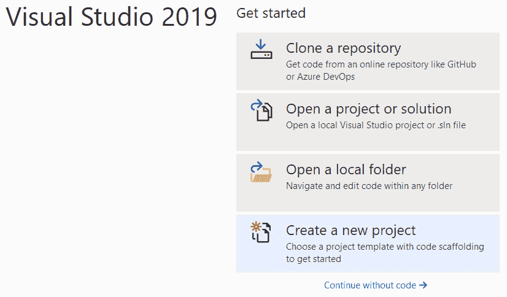
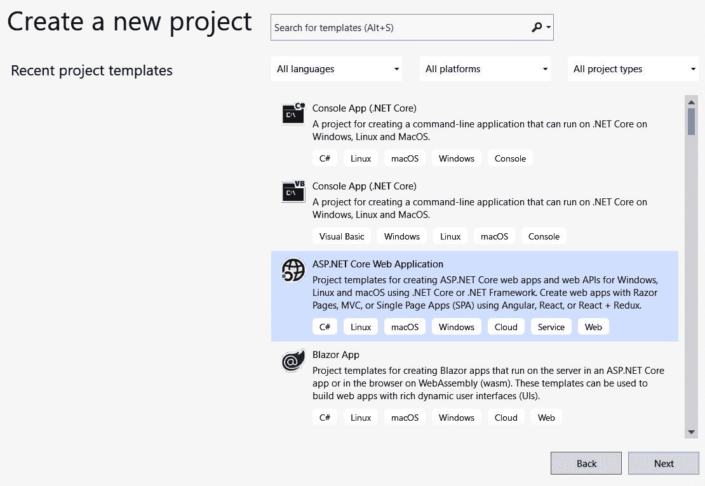
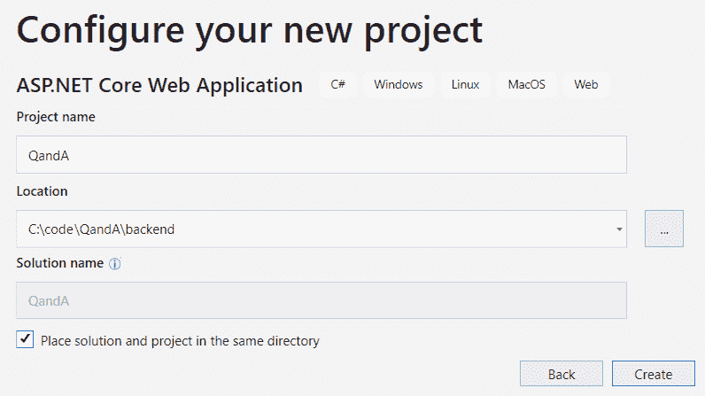
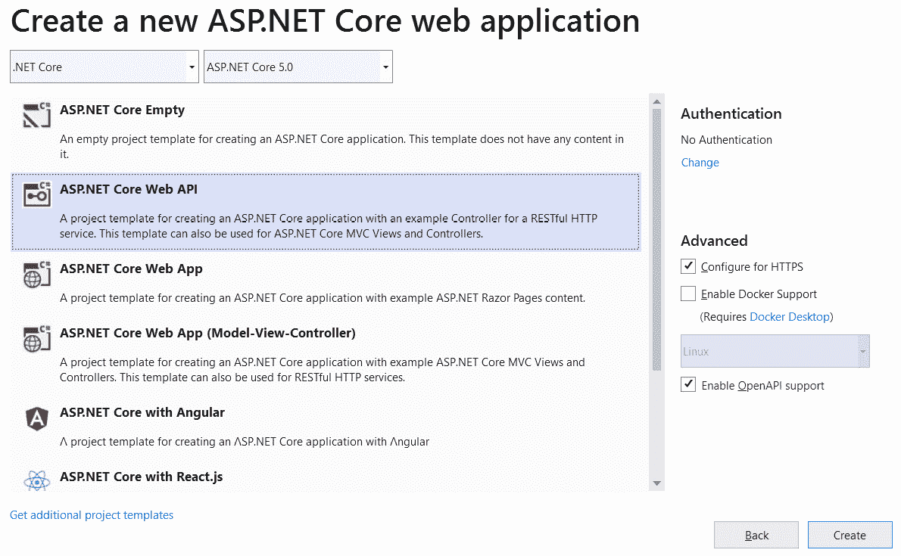
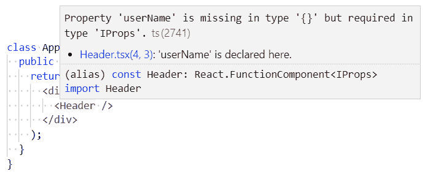
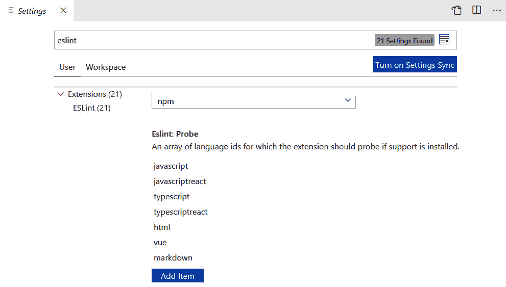
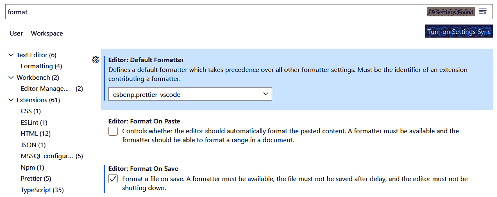
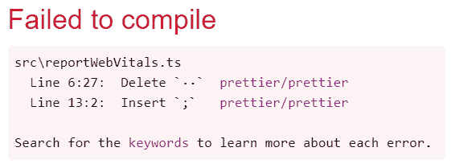

# *第 2 章*：创建解耦的 React 和 ASP.NET 5 应用程序

在本书中，我们将开发一个问答应用程序；我们将其称为问答应用程序。用户可以提交问题，其他用户可以提交答案。他们还可以搜索以前的问题并查看为他们提供的答案。在本章中，我们将通过创建 ASP.NET 核心和 React 项目开始构建此应用程序。

在上一章中，我们学习了如何在 Visual Studio 中使用模板创建 ASP.NET 核心和 React 应用程序。然而，在本章中，我们将以稍微不同的方式创建我们的应用程序，并理解此决定背后的原因。

我们的 React 应用程序将使用 TypeScript，因此我们将了解 TypeScript 的好处以及如何创建 React 和 TypeScript 应用程序。

本章首先创建一个 ASP.NET Web API 项目，然后再创建一个使用 React 和 TypeScript 的独立前端项目。然后，我们将向前端项目添加一个工具，用于识别潜在的问题代码，以及一个自动格式化代码的工具。

本章将介绍以下主题：

*   创建 ASP.NET 核心 Web API 项目
*   创建 React 和 TypeScript 应用程序
*   为 React 和 TypeScript 添加 linting
*   为 React 和 TypeScript 添加自动代码格式

在本章结束时，我们将准备好开始使用 React 和 TypeScript 构建问答应用程序的前端。

# 技术要求

在本章中，我们需要以下工具：

*   **Visual Studio 2019**：我们将使用它编辑我们的 ASP.NET 核心代码。可从[下载 https://visualstudio.microsoft.com/vs/](https://visualstudio.microsoft.com/vs/) 。
*   **.NET 5.0**：可从[下载 https://dotnet.microsoft.com/download/dotnet/5.0](https://dotnet.microsoft.com/download/dotnet/5.0) 。
*   **Visual Studio 代码**：我们将使用它来编辑我们的 React 代码。可从[下载 https://code.visualstudio.com/](https://code.visualstudio.com/) 。如果您已经安装了它，请确保它至少是 1.52 版。
*   **Node.js 和 npm**：可从[下载 https://nodejs.org/](https://nodejs.org/) 。如果已经安装了这些，请确保 Node.js 至少为 8.2 版，npm 至少为 5.2 版。

本章中的所有代码片段可在网上[找到 https://github.com/PacktPublishing/ASP.NET-Core-5-and-React-Second-Edition](https://github.com/PacktPublishing/ASP.NET-Core-5-and-React-Second-Edition) 。要从章节中还原代码，请下载相关源代码存储库并在相关编辑器中打开相关文件夹。如果代码为前端代码，则可在终端中输入`npm install`恢复依赖关系。

查看以下视频以查看代码的运行：[https://bit.ly/2J7rc0k](https://bit.ly/2J7rc0k) 。

创建 ASP.NET 核心 Web API 项目

在本章中，我们将分别创建 ASP.NET 核心和 React 项目。在[*第 1 章*](01.html#_idTextAnchor020)*了解 ASP.NET 5 React 模板*时，我们发现使用了 React 和`create-react-app`的旧版本。单独创建 React 项目允许我们使用 React 和`create-react-app`的最新版本。单独创建 React 项目还允许我们将 TypeScript 与 React 一起使用，这将帮助我们随着代码库的增长提高工作效率。

在本节中，我们将在 Visual Studio 中创建 ASP.NET 核心后端。

让我们打开 Visual Studio 并执行以下步骤：

1.  In the startup dialog, select **Create a new project**:

    

    图 2.1–创建新项目

2.  Choose **ASP.NET Core Web Application** in the wizard that opens and click the **Next** button:

    

    图 2.2–选择 web 应用程序项目

3.  在适当的位置创建一个名为`backend`的文件夹。
4.  Name the project `QandA` and choose the `backend` folder location to save the project. Tick **Place solution and project in the same directory** and click the **Create** button to create the project:

    

    图 2.3–项目命名

    现在，将出现另一个对话框，允许我们指定要使用的 ASP.NET Core 版本，以及要创建的特定项目类型。

5.  Select **ASP.NET Core 5.0** as the version and **ASP.NET Core Web API** in the dialog. Then, click the **Create** button, which will create the project:

    

    图 2.4–选择 API 项目

6.  创建项目后，打开`Startup.cs`并移动`app.UseHttpsRedirection()`代码行，以便在开发过程中不使用它：

    ```cs
    public void Configure(IApplicationBuilder app, IWebHostEnvironment env)
    {
      if (env.IsDevelopment())
      {
        ...
      }
      else
     {
     app.UseHttpsRedirection();
     }

      app.UseRouting();
      ...
    }
    ```

我们之所以做出这种改变，是因为在开发模式中，我们的前端将使用 HTTP 协议。默认情况下，Firefox 浏览器不允许对后端具有不同协议的应用程序进行网络请求。因此，我们希望前端和后端在开发模式下使用 HTTP 协议。

这是本章中我们将对后端进行的唯一更改。在下一节中，我们将创建 React 前端项目。

# 创建 React 和 TypeScript 应用程序

在[*第一章*](01.html#_idTextAnchor020)*理解 ASP.NET 5 React 模板*时，我们发现**创建 React 应用程序**（**CRA**）被 VisualStudio 模板利用来创建 React应用程序。我们还了解到 CRA 为我们做了很多有价值的设置和配置。我们将在本节中利用 CRA 创建 React 应用程序。CRA 是`npm`注册表中的一个包，我们将执行它来构建 React 和 TypeScript 项目。首先，我们将花时间了解使用 TypeScript 的好处。

## 了解打字脚本的好处

TypeScript 在 JavaScript 之上添加了一个可选的静态类型层，我们可以在开发过程中使用它。静态类型允许我们在开发过程的早期发现某些问题。例如，如果我们在引用变量时出错，TypeScript 将在错误输入变量后立即发现，如以下屏幕截图所示：


图 2.5–捕获未知变量的 TypeScript

另一个例子是，如果我们在引用 React 组件时忘记传递必需的属性，TypeScript 会立即通知我们错误：



图 2.6–捕获缺少的 React 组件属性的 TypeScript

这意味着我们得到的是构建时错误，而不是运行时错误。

这也有助于 VisualStudio 代码等工具提供准确的智能感知；健壮的重构功能，如重命名类；还有很棒的代码导航。

当我们开始构建前端时，我们将很快体验到让我们更高效的各种好处。

现在我们开始了解 TypeScript 的好处，是时候在下一小节中创建一个使用 TypeScript 的 React 项目了。

## 使用 CRA 创建应用程序

让我们通过执行以下步骤，使用 CRA 创建React和TypeScript 应用程序：

1.  在前面创建的`QandA`文件夹中打开 Visual Studio 代码。请注意，我们应该与`backend`文件夹处于同一级别，而不是在其中。
2.  Open the Terminal in Visual Studio Code, which can be found in the **View** menu or by pressing *Ctrl + '*. Execute the following command in the Terminal:

    ```cs
    > npx create-react-app frontend --template typescript
    ```

    `npx`工具是 npm 的一部分，它临时安装`create-react-app`npm 包并使用它创建我们的项目。

    我们已经告诉`create-react-app`npm 包在名为`frontend`的文件夹中创建我们的项目。

    `–-template typescript`选项已使用 TypeScript 创建了我们的 React 项目。

3.  如果我们在文件夹中查看，我们将看到`App`组件有一个`tsx`扩展名。这意味着这是一个 TypeScript 组件。
4.  让我们通过在终端中执行以下命令来验证应用程序是否正常运行：

    ```cs
    > cd frontend
    > npm start
    ```

5.  The app will appear in our browser after a few seconds:

    

    图 2.7–React 应用程序中的应用程序组件

6.  按*Ctrl+C*停止正在运行的应用程序，当要求终止作业时，按*Y*。

那么，为什么我们使用 Visual Studio 代码来开发 React应用程序而不是 Visual Studio？嗯，使用 VisualStudio 代码开发前端代码时，总体体验会更好更快一些。

因此，我们现在有了一个使用最新版本 CRA 的 React 和 TypeScript 应用程序。在下一节中，我们将通过在我们的项目中引入**linting**来为我们的代码添加更多的自动检查。

# 添加绒线反应并打字

Linting 是一个系列检查，其中用于识别可能存在问题的代码。linter 是执行 linting 的工具，它可以在我们的代码编辑器中运行，也可以在**持续集成**（**CI**过程中运行。因此，linting 帮助我们在编写过程中编写一致且高质量的代码。

ESLint 是 React 社区中最流行的 linter，CRA 已经在我们的项目中为我们安装了它。因此，我们将使用 ESLint 作为我们应用程序的 linting 工具。

重要提示

TSLint 是 ESLint 的流行替代品，用于 linting TypeScript 代码，但现在已被弃用。更多信息请参见[https://medium.com/palantir/tslint-in-2019-1a144c2317a9](https://medium.com/palantir/tslint-in-2019-1a144c2317a9) 。

在以下小节中，我们将学习如何配置 ESLints 规则，以及如何配置 Visual Studio 代码以突出显示冲突。

## 将 Visual Studio 代码配置为 lint TypeScript 代码

CRA 已经安装了 ESLint，并为我们配置了。

重要提示

请注意，ESLint 没有出现在我们的`package.json`文件中。相反，它是 CRA 一揽子计划的一部分。这可以通过打开`node_modules\react-scripts`中的`package.json`文件来确认。

我们需要将 VisualStudio 代码告知 lint TypeScript 代码。让我们执行以下步骤来执行此操作：

1.  首先，让我们重新打开`frontend`文件夹中的 Visual Studio 代码。这是我们将在后面的步骤中安装的扩展所必需的。
2.  Go to the **Extensions** area in Visual Studio Code (*Ctrl + Shift + X*) and type `eslint` into the search box in the top-left corner. The extension we are looking for is called **ESLint** and is published by **Dirk Baeumer**:

    

    图 2.9–Visual Studio 代码 ESLint 扩展

3.  点击的**安装**按钮安装扩展。
4.  在**文件**菜单上的**首选项**菜单中打开**设置**。打开**设置**的快捷键为*Ctrl+、*。
5.  Enter `eslint` in the search box and scroll down to the **Eslint: Probe** setting:

    

    图 2.8–ESLint：探头设置

    此设置告诉 Visual Studio 代码在验证代码时要通过 ESLint 运行哪些语言。

6.  Make sure that `typescript` and `typescriptreact` are in the list. If not, add them using the **Add Item** button.

    重要提示

    前面的屏幕截图显示了当前用户的所有项目中添加的设置，因为它位于**用户**选项卡中。如果我们只想更改当前项目中的设置，我们可以在**工作区**选项卡中找到并调整它。

7.  Now, we can go to the **Extensions** area in Visual Studio Code (*Ctrl + Shift + X*) and type `eslint` into the search box in the top-left corner. The extension we are looking for is called **ESLint** and is published by **Dirk Baeumer**:

    

    图 2.9–Visual Studio 代码 ESLint 扩展

8.  点击**安装**按钮安装扩展。

现在，VisualStudio 代码将使用 ESLint 来验证我们的代码。接下来，我们将学习如何配置 ESLint。

## 配置起毛规则

既然 Visual Studio代码正在筛选我们的代码，那么让我们执行以下步骤来了解如何配置 ESLint 执行的规则：

1.  Let's create a file called `.eslintrc.json` in the `frontend` folder with the following code:

    ```cs
    {
      "extends": "react-app"
    }
    ```

    此文件定义 ESLint 执行的规则。我们刚刚告诉它执行 CRA 中配置的所有规则。

2.  Let's check that Visual Studio Code is linting our code by adding the following highlighted line to `App.tsx`, just before the `return` statement:

    ```cs
    const App: React.FC = () => {
      const unused = 'something';
      return (
        ...
      );
    };
    ```

    我们将看到 ESLint 立即将该行标记为未使用：

    

    图 2.10–捕捉未使用变量的 ESLint

    这太好了——这意味着我们的代码被删除了。

3.  Now, let's add a rule that CRA hasn't been configured to apply. In the `.eslintrc.json` file, add the following highlighted lines:

    ```cs
    {
      "extends": "react-app",
     "rules": {
     "no-debugger":"warn"
     }
    }
    ```

    在这里，我们已经告诉 ESLint 警告我们使用`debugger`语句。

    重要提示

    可用 ESLint 规则列表可在[找到 https://eslint.org/docs/rules/](https://eslint.org/docs/rules/) 。

4.  Let's add a `debugger` statement below our unused variable in `App.tsx`, like so:

    ```cs
    const App: React.FC = () => {
      const unused = 'something';
      debugger;
      return (
        ...
      );
    };
    ```

    我们将立即看到 ESLint 标记这一点：


图 2.11–ESLint 捕获调试器语句

现在，我们在项目中配置了 linting。让我们通过执行以下步骤来清理代码：

1.  从`App.tsx`中删除未使用的代码行和`debugger`语句。
2.  从`.eslintrc.json`文件中删除`no-debugger`规则。

为了快速回顾，CRA 为我们安装并配置了 ESLint。我们可以使用`.eslintrc.json`文件调整配置。

在下一节中，我们将了解如何自动格式化代码。

# 添加自动代码格式化以反应并键入脚本

强制执行一致的代码样式可以提高代码库的可读性，但即使 ESLint 提醒我们这样做，这也可能是一件痛苦的事情。如果我们忘记在语句末尾添加的分号只是自动为我们添加的，那不是很好吗？嗯，这就是自动代码格式化工具可以为我们做的，而**Prettier**就是这些伟大的工具之一。

我们将首先安装 Prettier，然后再将其配置为与 ESLint 和 visualstudio 代码配合使用。

## 添加更漂亮的

通过在 Visual Studio 代码中执行以下步骤，我们将为我们的项目添加更漂亮：

1.  确保您在`frontend`目录中。执行以下命令安装 Prettier:

    ```cs
    > npm install prettier --save-dev
    ```

2.  Now, we want Prettier to take responsibility for the style rules from ESLint. Let's install some `npm` packages that will do this:

    ```cs
    > npm install eslint-config-prettier eslint-plugin-prettier --save-dev
    ```

    `eslint-config-prettier`禁用与 Prettier 冲突的 ESLint 规则。`eslint-plugin-prettier`是一个 ESLint 规则，它使用 Prettier 格式化代码。

3.  现在，让我们告诉 ESLint 让 Prettier 处理代码格式，将以下突出显示的更改添加到`.eslintrc.json`：

    ```cs
    {
      "extends": ["react-app","plugin:prettier/recommended"],
      "rules": {
     "prettier/prettier": [
     "error",
     {
     "endOfLine": "auto"
     }
     ]
     }
    }
    ```

4.  Now, let's specify the formatting rules we want in a `.prettierrc` file in the `frontend` folder. Create a file with the following content:

    ```cs
    {
      "printWidth": 80,
      "singleQuote": true,
      "semi": true,
      "tabWidth": 2,
      "trailingComma": "all"
      "endOfLine": "auto"
    }
    ```

    这些规则将导致长度超过 80 个字符的行被合理地包装，双引号自动转换为单引号，分号自动添加到语句末尾，缩进自动设置为两个空格，以及在可能的情况下自动将尾随逗号添加到多行数组等项中。

5.  Now, go to the **Extensions** area in Visual Studio Code (*Ctrl + Shift + X*) and type `prettier` into the search box in the top-left corner. The extension we are looking for is called **Prettier – Code formatter** and is published by **Esben Petersen**:

    

    图 2.12–Visual Studio 代码 Prettier 扩展

6.  点击**安装**按钮安装扩展。
7.  当一个文件通过一些设置保存在 VisualStudio 代码中时，我们可以更好地格式化代码。在**文件**菜单上的**首选项**菜单中打开**设置**。在搜索框中输入`format`并确保**默认格式化程序**设置为**esbenp.prettier-vscode**，并勾选**保存时的格式**：



图 2.13–保存时 Prettier to format 的设置

所以，这是更漂亮的设置。每当我们在 Visual Studio 代码中保存文件时，它都会自动格式化。

## 解决错误

安装 Prettier后，React 导入上可能会出现以下错误：


图 2.14–安装 Prettier 后 React 的错误

要解决此问题，请运行以下命令：

```cs
> npm install
```

命令运行完成后，问题将得到解决。

有些文件可能没有按照我们的设置格式化。通过运行以下命令启动前端：

```cs
> npm start
```

浏览器中将出现一些错误：



图 2.15–更漂亮的错误

要解决这些错误，只需转到每个问题文件并按*Ctrl*+*S*保存即可。然后，每个文件将按照我们的规则进行格式化。

为了快速回顾，我们安装了 Prettier，用`eslint-config-prettier`和`eslint-plugin-prettier`包自动格式化前端代码，使其能够很好地与 ESLint 配合使用。可以在名为`.prettierrc`的文件中配置格式。

# 总结

在本章中，我们为问答应用程序创建了项目，我们将在本书中构建该应用程序。我们使用 Web API ASP.NET 核心模板创建后端，使用 Create React App 创建前端。我们包含了 TypeScript，因此前端代码是强类型的，这将帮助我们更早地发现问题，并帮助 VisualStudio 代码提供更好的开发体验。

我们在前端代码中添加了 linting，以提高代码库的质量和一致性。ESLint 是我们的 linter，其规则在名为`.eslintrc.json`的文件中配置。我们还为前端代码添加了 Prettier，它可以自动格式化代码。这在代码审查中非常有用。然后，我们在一个`.prettierrc`文件中配置了格式化规则，并使用`eslint-config-prettier`来阻止 ESLint 与 Prettier 冲突。

因此，与 SPA 模板不同，我们现在有两个独立的前端和后端项目。这是有意义的，主要是因为我们将使用 VisualStudio 开发后端，而 VisualStudio 代码开发前端。因此，不需要从 VisualStudio 中同时启动前端和后端。

在下一章中，我们将开始在 React 和 TypeScript 中构建前端。

# 问题

尝试回答以下问题，以测试您在本章学到的知识：

1.  我们使用`create-react-app`命令中的哪个选项来创建带有 TypeScript 项目的 React 应用程序？
2.  我们可以使用什么样的 ESLint 规则来帮助防止`console.log`语句被添加到我们的代码中？
3.  在`.prettierrc`中，我们可以设置哪些设置来在代码中使用单引号？
4.  VisualStudio 代码中的什么设置告诉 ESLint 扩展检查 React 和 TypeScript 代码？
5.  Visual Studio 中的哪些设置告诉它在保存代码时使用更漂亮的扩展来自动格式化代码？

# 答案

1.  我们使用`create-react-app`命令上的`--template typescript`选项创建了一个带有 TypeScript 项目的 React 应用程序。
2.  我们可以使用`no-console`规则来防止`console.log`语句被添加到我们的代码中。
3.  我们可以使用`.prettierrc`中的`"singleQuote": true`设置在代码中使用单引号。
4.  Visual Studio 代码中的**Eslint:Probe**设置告诉 Eslint 扩展检查 React 和 TypeScript 代码是否包含`typescript`和`typescriptreact`。
5.  **默认格式化程序**必须设置为**esbenp.prettier-vscode**，且 prettier 必须勾选**保存时的格式**才能在保存时自动格式化代码。

# 进一步阅读

以下是一些有用的链接，可用于了解有关本章所涵盖主题的更多信息：

*   **ASP.NET 核心 API 控制器**：[https://docs.microsoft.com/en-us/aspnet/core/web-api](https://docs.microsoft.com/en-us/aspnet/core/web-api)
*   **npx**：[https://www.npmjs.com/package/npx](https://www.npmjs.com/package/npx)
*   **创建反应 app**：[https://create-react-app.dev/docs/getting-started](https://create-react-app.dev/docs/getting-started)
*   **ESLint**：[https://eslint.org/](https://eslint.org/)
*   **更漂亮**：[https://prettier.io/](https://prettier.io/)