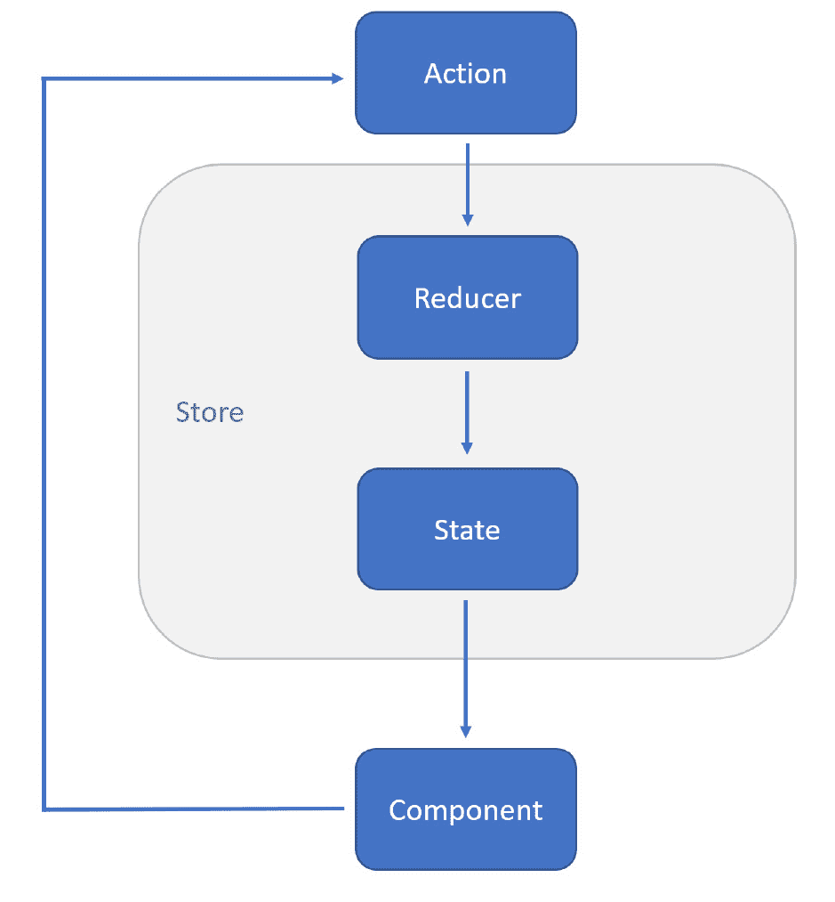
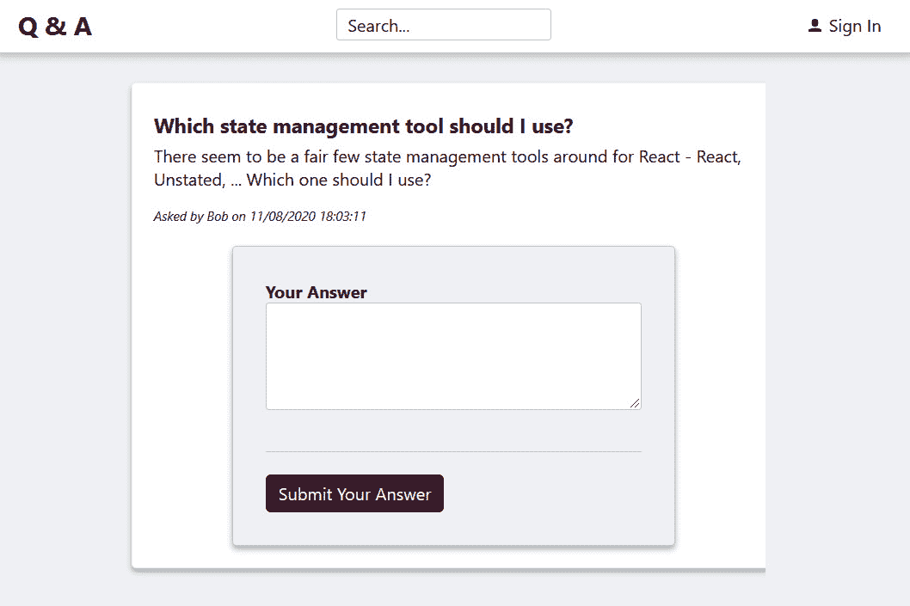
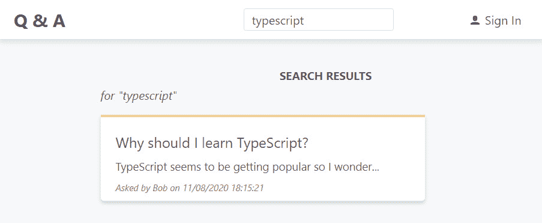

# *第 7 章*：用 Redux 管理状态

到目前为止，在我们的应用程序中，状态在我们的 React 组件中本地保持。这种方法适用于简单的应用程序。React-Redux 帮助我们稳健地处理复杂的状态场景。当用户交互导致对状态的若干更改时（可能有些更改是有条件的），以及主要当交互导致 web 服务调用时，它会发光。当应用程序中有很多共享状态时，这也很好。

我们将从理解 Redux 模式和不同的术语开始本章，例如**动作**和**减速器**。我们将遵循 Redux 的原则及其带来的好处。

我们将更改应用程序的实现，并使用 Redux 来管理未回答的问题。我们将实现一个 Redux 存储，其状态包含未回答的问题、已搜索的问题和正在查看的问题。我们将在主页、搜索和问题页面中与商店进行交互。这些实现将让我们很好地掌握如何在 React 应用程序中使用 Redux。

在本章中，我们将介绍以下主题：

*   理解 Redux 模式
*   安装 Redux
*   创建国家
*   创建操作
*   创建减速器
*   创建商店
*   将组件连接到存储

在本章结束时，我们将了解 Redux 模式，并将在 React 应用程序中使用它轻松实现状态。

# 技术要求

在本章中，我们将使用以下工具：

*   **Visual Studio 代码**：我们将使用它来编辑我们的 React 代码。可从[下载并安装 https://code.visualstudio.com/](https://code.visualstudio.com/) 。如果您已经安装了它，请确保它至少是 1.52 版。
*   **Node.js 和 npm**：可从[下载 https://nodejs.org/](https://nodejs.org/) 。如果已经安装了这些，请确保 Node.js 至少为 8.2 版，npm 至少为 5.2 版。
*   **Q 和 A**：我们将从[*第 6 章*](06.html#_idTextAnchor121)*中完成的&前端项目*开始。这可在 GitHub 的[上获得 https://github.com/PacktPublishing/ASP.NET-Core-5-and-React-Second-Edition `chapter-07/start`文件夹中的](https://github.com/PacktPublishing/ASP.NET-Core-5-and-React-Second-Edition)。

本章中的所有代码片段可在网上[找到 https://github.com/PacktPublishing/ASP.NET-Core-5-and-React-Second-Edition](https://github.com/PacktPublishing/ASP.NET-Core-5-and-React-Second-Edition) 。为了从章节中还原代码，可以下载源代码存储库，并在相关编辑器中打开相关文件夹。如果代码为前端代码，则可在终端中输入`npm install`恢复依赖关系。

查看以下视频以查看代码的运行：[https://bit.ly/3h5fjVc](https://bit.ly/3h5fjVc)

# 了解 Redux 模式

Redux 是一个可预测状态容器，可用于 React 应用程序。在本节中，我们将首先介绍 Redux 中的三个原则，然后再了解 Redux 的好处以及它在哪些情况下工作良好。然后，我们将深入研究核心概念，以便理解术语和更新`state`时发生的步骤。通过这样做，我们将能够很好地在应用程序中实现 Redux。

## 原则

让我们来看看 ReDux 的三个原则：

*   **单一真相来源**：这意味着整个应用程序状态存储在单个对象中。在实际应用程序中，此对象可能包含嵌套对象的复杂树。
*   **状态为只读**：表示`state`不能直接更改。在 Redux 中，更改`state`的唯一方法是发送所谓的动作。
*   **使用纯函数**进行更改：负责更改状态的函数称为减速机。

当许多组件需要访问相同的数据时，Redux 会发光，因为`state`及其交互存储在一个地方。通过函数将`state`设置为只读且仅可更新，使交互更易于理解和调试。当许多组件与状态交互并且某些交互是异步的时，它特别有用。

在接下来的部分中，我们将进一步深入研究操作和减缩器，以及管理它们的东西，称为存储。

## 关键概念

应用程序的整个状态存在于所谓的**存储**中。状态存储在一个JavaScript 对象中，如下所示：

```cs
{
  questions: {
    loading: false,
    unanswered: [{ 
      questionId: 1, title: ... 
    }, {
      questionId: 2, title: ...
    }]
  }
}
```

在本例中，单个对象包含一系列未回答的问题，以及这些问题是否从 web API 获取。

`state`将不包含任何函数或 setter 或 getter。它是一个简单的 JavaScript 对象。商店还协调 Redux 中的所有移动部件。这包括通过减速器推动操作以更新状态。

因此，更新商店中的`state`首先需要发生的事情是发送**动作**。动作是另一个简单的 JavaScript 对象，如以下代码片段中的对象：

```cs
{ type: 'GettingUnansweredQuestions' }
```

`type`属性确定需要执行的操作类型。`type`属性是操作的重要部分，因为没有它，还原程序将不知道如何更改状态。在上一个示例中，操作只包含`type`属性。这是因为减速器不需要任何更多信息来更改此操作的`state`。以下示例是另一个操作：

```cs
{
  type: 'GotUnansweredQuestions',
  questions: [{ 
    questionId: 1, title: ... 
  }, {
    questionId: 2, title: ...
  }]
}
```

这一次，`questions`属性中的操作包含了额外的信息位。减速器需要此附加信息来更改此类操作的状态。

**减速器**为纯功能，可使实际状态发生变化。

重要提示

对于给定的一组参数，**纯函数**总是返回相同的结果。因此，这些函数不依赖于函数范围之外的任何未传递到函数中的变量。纯函数也不会更改函数范围之外的任何变量。

以下是减速器的示例：

```cs
const questionsReducer = (state, action) => {
  switch (action.type) {
    case 'GettingUnansweredQuestions': {
      return {
        ...state,
        loading: true
      };
    }
    case 'GotUnansweredQuestions': {
      return {
        ...state,
        unanswered: action.questions,
        loading: false
      };
    }
  }
};
```

以下是有关减速器的一些要点：

*   减速器在当前状态和正在执行的操作的两个参数中采用。
*   `switch`语句用于操作类型，并为其每个分支中的每个操作类型适当地创建一个新的状态对象。
*   要创建新状态，我们将当前状态分散到一个新对象中，然后用已更改的属性覆盖它。
*   从减速器返回新状态。

您会注意到，我们刚才看到的 actions 和 reducer 没有 TypeScript 类型。显然，在下面的部分中实现这些时，我们将包括必要的类型。

下图显示了我们刚刚了解的 Redux 片段，以及组件如何与它们交互以获取和更新状态：



图 7.1–组件如何与 Redux 交互以获取和更新状态

组件从存储中获取状态。组件通过调度一个操作来更新状态，该操作被馈送到更新状态的 reducer 中。当组件更新时，存储将新状态传递给组件。

现在我们已经开始了解什么是 Redux，是时候在我们的应用程序中实践它了。

# 安装 Redux

在使用 Redux 之前，我们需要安装它以及 TypeScript 类型。让我们执行以下步骤来安装 Redux：

1.  If we haven't already done so, let's open our project in Visual Studio Code from where we left off in the previous chapter. We can install the core Redux library via the terminal with the following command:

    ```cs
    > npm install redux
    ```

    请注意，核心 Redux 库中包含 TypeScript 类型，因此不需要对这些类型进行额外安装。

2.  Now, let's install the React-specific bits for Redux in the terminal with the following command:

    ```cs
    > npm install react-redux
    ```

    这些位允许我们将 React 组件连接到 Redux 存储。

3.  让我们也为 React Redux 安装 TypeScript 类型：

    ```cs
    > npm install @types/react-redux --save-dev
    ```

现在安装了所有 Redux 位，我们就可以开始构建 Redux 商店了。

# 创建状态

在本节中，我们将实现存储中状态对象的类型，以及状态的初始值。执行以下步骤以执行此操作：

1.  在`src`文件夹中创建一个名为`Store.ts`的新文件，并使用以下`import`语句：

    ```cs
    import { QuestionData } from './QuestionsData';
    ```

2.  Let's create the TypeScript types for the state of our store:

    ```cs
    interface QuestionsState {
      readonly loading: boolean;
      readonly unanswered: QuestionData[];
      readonly viewing: QuestionData | null;
      readonly searched: QuestionData[];
    }
    export interface AppState {
      readonly questions: QuestionsState;
    }
    ```

    因此，我们的商店将有一个`questions`属性，它是一个包含以下属性的对象：

    *   `loading`：是否正在进行服务器请求
    *   `unanswered`：包含未回答问题的数组
    *   `viewing`：用户正在查看的问题
    *   `searched`：包含搜索中匹配问题的数组
3.  让我们定义存储的初始状态，以便它有一个空的未回答问题数组：

    ```cs
    const initialQuestionState: QuestionsState = {
      loading: false,
      unanswered: [],
      viewing: null,
      searched: [],
    };
    ```

因此，我们定义了 state 对象的类型并创建了初始 state 对象。我们通过在 state 属性名称之前使用`readonly`关键字将状态设置为只读。

现在让我们继续并定义类型来表示我们的操作。

# 创造动作

操作启动对我们的存储状态的更改。在本节中，我们将创建函数来创建存储中的所有操作。我们将从了解商店中需要的所有操作开始。

## 了解店内的动作

将与门店交互的三个流程如下：

*   在主页上获取和呈现未回答的问题
*   获取并呈现问题页面上正在查看的问题
*   搜索问题并在搜索页面上显示匹配项

每个过程包括以下步骤：

1.  流程启动时，存储的`loading`状态设置为`true`。
2.  然后向服务器发出请求。
3.  当接收到来自服务器的响应时，数据将以存储的状态放入适当的位置，`loading`被设置为`false`。

每个进程有两个状态更改。这意味着每个流程需要两个操作：

1.  表示流程开始的操作
2.  表示进程结束的操作，该操作将包含来自服务器请求的数据

因此，我们的商店将总共有六项活动。

## 未回答的问题

我们将在`Store.ts`中创建动作。让我们为获得未回答问题的流程创建两个操作。执行以下步骤：

1.  让我们首先创建一个常量来保存第一个操作的操作类型，这表示正在从服务器获取未回答的问题：

    ```cs
    export const GETTINGUNANSWEREDQUESTIONS =
      'GettingUnansweredQuestions';
    ```

2.  Create a function that returns this action:

    ```cs
    export const gettingUnansweredQuestionsAction = () =>
      ({
        type: GETTINGUNANSWEREDQUESTIONS,
      } as const);
    ```

    注意在返回对象之后的**as const**关键字。这是一个类型脚本*常量断言*。

    重要提示

    对象上的**常量断言**将为提供一个不可变类型。它还将导致字符串属性具有窄字符串文字类型，而不是更宽的字符串类型。

    没有 const 断言的此操作的类型如下所示：

    ```cs
    {
      type: string
    }
    ```

    具有类型断言的此操作的类型如下：

    ```cs
    {
      readonly type: 'GettingUnansweredQuestions'
    }
    ```

    因此，`type`属性只能是`'GettingUnansweredQuestions'`而不能是其他字符串值，因为我们已经将其键入到特定的字符串文本中。此外，`type`属性值是只读的，因此无法更改。

3.  Create a function that returns the action for when the unanswered questions have been retrieved from the server:

    ```cs
    export const GOTUNANSWEREDQUESTIONS =
      'GotUnansweredQuestions';
    export const gotUnansweredQuestionsAction = (
      questions: QuestionData[],
    ) =>
      ({
        type: GOTUNANSWEREDQUESTIONS,
        questions: questions,
      } as const);
    ```

    这一次，动作包含一个名为`questions`的属性来保存未回答的问题，以及固定的`type`属性。我们希望问题被传递到`questions`参数中的函数中。

这就完成了获取未回答问题的操作类型的实现。

## 看问题

让我们添加两个操作，以使用类似的方法查看问题：

```cs
export const GETTINGQUESTION = 'GettingQuestion';
export const gettingQuestionAction = () =>
  ({
    type: GETTINGQUESTION,
  } as const);
export const GOTQUESTION = 'GotQuestion';
export const gotQuestionAction = (
  question: QuestionData | null,
) =>
  ({
    type: GOTQUESTION,
    question: question,
  } as const);
```

请注意，action`type`属性被赋予了唯一的值。这是必需的，以便 reducer 可以确定要对存储的状态进行哪些更改。

我们还确保`type`属性被赋予一个有意义的值。这有助于提高代码的可读性。

从服务器返回的数据可以是问题，如果没有找到问题，也可以是`null`。这就是使用联合类型的原因。

## 搜索问题

商店中的最后动作是搜索问题。现在让我们添加以下内容：

```cs
export const SEARCHINGQUESTIONS =
  'SearchingQuestions';
export const searchingQuestionsAction = () =>
  ({
    type: SEARCHINGQUESTIONS,
  } as const);
export const SEARCHEDQUESTIONS =
  'SearchedQuestions';
export const searchedQuestionsAction = (
  questions: QuestionData[],
) =>
  ({
    type: SEARCHEDQUESTIONS,
    questions,
  } as const);
```

动作类型再次被赋予唯一且有意义的值。服务器搜索返回的数据是一系列问题。

总之，我们使用了 Redux 中的`Action`类型为我们的六个操作创建接口。这确保操作包含所需的类型属性。

我们的 Redux 商店现在发展得很好。让我们继续创建一个减速器。

# 创建减速器

减速器是对状态进行必要更改的功能。它将当前状态和正在处理的操作作为参数，并返回新状态。在本节中，我们将实现一个减速机。让我们执行以下步骤：

1.  One of the parameters in the reducer is the action that invoked the state change. Let's create a union type containing all the action types that will represent the reducer action parameter:

    ```cs
    type QuestionsActions =
      | ReturnType<typeof gettingUnansweredQuestionsAction>
      | ReturnType<typeof gotUnansweredQuestionsAction>
      | ReturnType<typeof gettingQuestionAction>
      | ReturnType<typeof gotQuestionAction>
      | ReturnType<typeof searchingQuestionsAction>
      | ReturnType<typeof searchedQuestionsAction>;
    ```

    我们使用了`ReturnType`实用程序类型来获取操作函数的返回类型。`ReturnType`希望传入一个函数类型，所以我们使用`typeof`关键字来获取每个函数的类型。

    重要提示

    当`typeof`用于类型时，TypeScript 将根据`typeof`关键字后的变量推断类型。

2.  Next, create the skeleton reducer function:

    ```cs
    const questionsReducer = (
      state = initialQuestionState,
      action: QuestionsActions
    ) => {
      // TODO - Handle the different actions and return 
        // new state
      return state;
    };
    ```

    **减速器接收两个参数**，一个用于当前状态，另一个用于正在处理的动作。第一次调用 reducer 时，状态将为`undefined`，因此我们将其默认为先前创建的初始状态。

    减速器需要返回给定动作的新状态对象。我们现在只是返回初始状态。

    重要的是，一个 reducer 总是返回一个值，因为一个存储可能有多个 reducer。在这种情况下，将调用所有的还原器，但不一定处理该操作。

3.  Now, add a `switch` statement to handle the different actions:

    ```cs
    const questionsReducer = (
      state = initialQuestionState,
      action: QuestionsActions,
    ) => {
      switch (action.type) {
     case GETTINGUNANSWEREDQUESTIONS: {
     }
     case GOTUNANSWEREDQUESTIONS: {
     }
     case GETTINGQUESTION: {
     }
     case GOTQUESTION: {
     }
     case SEARCHINGQUESTIONS: {
     }
     case SEARCHEDQUESTIONS: {
     }
     }
      return state;
    };
    ```

    请注意，`action`参数中的`type`属性是强类型的，我们只能处理前面定义的六个动作。

    我们先来处理`GettingUnansweredQuestions`问题：

    ```cs
    case GETTINGUNANSWEREDQUESTIONS: {
      return {
     ...state,
     loading: true,
     };
    }
    ```

    我们使用扩展语法将以前的状态复制到一个新对象中，然后将`loading`状态设置为`true`。

    重要提示

    **扩展**语法允许对象扩展到需要键值对的地方。语法由三个点组成，后跟要展开的对象。更多信息请访问[https://developer.mozilla.org/en-US/docs/Web/JavaScript/Reference/Operators/Spread_syntax](https://developer.mozilla.org/en-US/docs/Web/JavaScript/Reference/Operators/Spread_syntax) 。

    扩展语法通常用于 reducer，将旧状态复制到新状态对象中，而不改变传递到 reducer 中的状态。这一点很重要，因为减速器必须是一个纯函数，不能在其范围外更改值。

4.  Let's now move on to the `GotUnansweredQuestions` action:

    ```cs
    case GOTUNANSWEREDQUESTIONS: {
      return {
     ...state,
     unanswered: action.questions,
     loading: false,
     };
    }
    ```

    我们使用扩展语法将以前的状态复制到一个新对象中，并设置`unanswered`和`loading`属性。请注意，我们是如何仅为`GotUnansweredQuestions`操作中的属性获取 IntelliSense 的：

    

    图 7.2–窄动作类型

    TypeScript 巧妙地缩小了 switch 分支中的类型，而不是传递到`action`参数的 reducer 中的 union 类型。

5.  Handle the action getting a question by using the same approach:

    ```cs
    case GETTINGQUESTION: {
      return {
     ...state,
     viewing: null,
     loading: true,
     };
    }
    ```

    当服务器请求发出时，正在查看的问题被重置为`null`，并且`loading`状态被设置为`true`。

6.  Handle the action for receiving a question:

    ```cs
    case GOTQUESTION: {
      return {
     ...state,
     viewing: action.question,
     loading: false,
     };
    }
    ```

    正在查看的问题被设置为来自动作的问题，`loading`状态被重置为`false`。

7.  Handle the action for searching questions:

    ```cs
    case SEARCHINGQUESTIONS: {
      return {
     ...state,
     searched: [],
     loading: true,
     };
    }
    ```

    搜索结果初始化为空数组，`loading`状态设置为`true`，同时发出服务器请求。

8.  让我们来处理最后一个操作，用于接收来自搜索的匹配问题：

    ```cs
    case SEARCHEDQUESTIONS: {
      return {
     ...state,
     searched: action.questions,
     loading: false,
     };
    }
    ```

这就是减速器。我们使用`switch`语句来处理不同的动作类型。在交换机分支中，我们使用扩展语法复制以前的状态并更新相关值。

现在，我们已经为 Redux 存储实现了所有不同的部分，因此我们将在下一节中创建一个函数来创建存储。

# 创建店铺

`Store.ts`中的最后一个任务是创建一个函数，该函数创建 Redux 存储，以便将其提供给 React 组件。我们还需要将所有存储减缩器都输入到这个函数中。让我们通过执行以下步骤来完成此操作：

1.  First, let's import the `Store` type and the `createStore` and `combineReducers` functions from Redux:

    ```cs
    import { Store, createStore, combineReducers } from 'redux';
    ```

    `Store`是代表 Redux 商店的顶级类型。

    稍后我们将使用`createStore`函数创建存储。

    `combineReducers`是一个函数，我们可以使用它将多个减速机组合成`createStore`函数所需的格式。

2.  Let's use the `combineReducers` function to create what is called a *root reducer*:

    ```cs
    const rootReducer = combineReducers<AppState>({
      questions: questionsReducer
    });
    ```

    一个对象文本被传递到`combineReducers`，其中包含我们的应用程序状态中的属性，以及负责该状态的 reducer。我们的应用程序状态中只有一个名为`questions`的属性，还有一个名为`questionsReducer`的减速机管理对该状态的更改。

3.  Create a function to create the store:

    ```cs
    export function configureStore(): Store<AppState> {
      const store = createStore(
        rootReducer,
        undefined 
      );
      return store;
    }
    ```

    该功能使用 Redux 的`createStore`功能，通过组合减速器和`undefined`作为初始状态。

    我们使用泛型`Store`类型作为传入应用程序状态接口的函数的返回类型，即`AppState`。

这就是我们创建商店所需要做的一切。

我们在一个名为`Store.ts`的文件中创建了商店中的所有零碎信息。对于较大的存储，跨不同文件构建存储可能有助于维护。构建按功能存储，在文件中包含每个功能的所有操作和缩减器，效果很好，因为我们通常按功能读取和编写代码。

在下一节中，我们将将我们的存储连接到我们在前几章中实现的组件。

# 将组件连接到商店

在本节中，我们将将应用程序中的现有组件连接到我们的商店。我们将首先在组件树的根目录中添加一个所谓的存储*提供者*，它允许树中较低的组件使用存储。然后，我们将使用 React Redux 中的挂钩将主页、问题和搜索页面连接到 Redux 存储。

## 添加门店提供商

让我们将存储提供给组件树的根。为此，请执行以下步骤：

1.  In `App.tsx`, import the `Provider` component from React Redux and the `configureStore` function we created in the previous section. Add these `import` statements just after the React `import` statement:

    ```cs
    import React from 'react';
    import { Provider } from 'react-redux';
    import { configureStore } from './Store';
    ```

    这是我们第一次引用 React Redux 中的任何内容。请记住，此库有助于 React 组件与 Redux 存储交互。

2.  在定义`App`组件之前，使用`configureStore`函数

    ```cs
    const store = configureStore();
    function App() {
     ...
    }
    ```

    创建我们商店的实例
3.  在`App`组件的 JSX 中，通过传入我们的商店实例

    ```cs
    return (
      <Provider store={store}>
        <BrowserRouter>
          ...
        </BrowserRouter>
      </Provider>
    );
    ```

    将`Provider`组件包裹在`BrowserRouter`组件上

组件树中较低的组件现在可以连接到存储。

## 连接主页

让我们将主页连接到商店。为此，请执行以下步骤：

1.  In `HomePage.tsx`, let's add the following `import` statement:

    ```cs
    import { useSelector, useDispatch } from 'react-redux';
    ```

    我们最终将使用`useSelector`函数从存储获取状态。`useDispatch`函数将用于调用操作。

2.  对于未回答的问题，我们将使用 Redux 存储，因此，让我们为其导入操作函数，以及存储状态的类型：

    ```cs
    import {
      gettingUnansweredQuestionsAction,
      gotUnansweredQuestionsAction,
      AppState,
    } from './Store';
    ```

3.  Let's remove the `QuestionData` type from the `import` statement from `QuestionsData.ts` so that it now looks like the following:

    ```cs
    import {
      getUnansweredQuestions,
    } from './QuestionsData';
    ```

    `QuestionData`类型将在我们修订的实现中推断出来。

4.  来自React Redux 的`useDispatch`钩子返回一个函数，我们可以使用该函数来分派操作。让我们将其分配给一个名为`dispatch`：

    ```cs
    export const HomePage = () => {
      const dispatch = useDispatch();
      ...
    }
    ```

    的函数
5.  The `useSelector` hook from React Redux returns state from the store if we pass it a function that selects the state. Use the `useSelector` hook to get the unanswered questions state from the store:

    ```cs
    export const HomePage = () => {
      const dispatch = useDispatch();
      const questions = useSelector(
     (state: AppState) =>
     state.questions.unanswered,
     );
      ...
    }
    ```

    传递给`useSelector`的功能通常被称为一个*选择器*。它接收存储的状态对象，并包含从存储返回所需状态部分的逻辑。

6.  再次使用`useSelector`钩子从门店获取`loading`状态：

    ```cs
    const questions = useSelector(
      (state: AppState) =>
        state.questions.unanswered,
    );
    const questionsLoading = useSelector(
     (state: AppState) => state.questions.loading,
    );
    ```

7.  我们的本地组件状态现在是冗余的，所以让我们通过删除突出显示的行来删除它：

    ```cs
    const questionsLoading = useSelector(
      (state: AppState) => state.questions.loading,
    );
    const [
     questions,
     setQuestions,
    ] = React.useState<QuestionData[]>([]);
    const [
     questionsLoading,
     setQuestionsLoading,
    ] = React.useState(true); 
    ```

8.  Invoke the action for getting unanswered questions at the start of the `useEffect` function:

    ```cs
    React.useEffect(() => {
      const doGetUnansweredQuestions = async () => {
     dispatch(gettingUnansweredQuestionsAction());
        const unansweredQuestions = await 
         getUnansweredQuestions();
        setQuestions(unansweredQuestions);
        setQuestionsLoading(false);
      };
      doGetUnansweredQuestions();
    }, []);
    ```

    我们使用`dispatch`函数将操作发送到商店。

9.  Invoke the action for receiving unanswered questions after the call to `getUnansweredQuestions`:

    ```cs
    React.useEffect(() => {
      const doGetUnansweredQuestions = async () => {
        dispatch(gettingUnansweredQuestionsAction());
        const unansweredQuestions = await 
          getUnansweredQuestions();
     dispatch(gotUnansweredQuestionsAction     (unansweredQuesti
     ons));
        setQuestions(unansweredQuestions);
        setQuestionsLoading(false);
      };
      doGetUnansweredQuestions();
    }, []);
    ```

    我们将未回答的问题传递给创建此操作的函数。然后，我们使用`dispatch`函数分派操作。

10.  通过删除突出显示的行

    ```cs
    React.useEffect(() => {
      const doGetUnansweredQuestions = async () => {
        …
        setQuestions(unansweredQuestions);
        setQuestionsLoading(false);
      };
      doGetUnansweredQuestions();
    }, []);
    ```

    ，从`useEffect`函数中删除设置本地状态的引用
11.  ESLint 警告我们，`dispatch`函数可能是`useEffect`钩子中缺少的依赖项。我们只希望在首次安装组件时触发`useEffect`功能，而不是在`dispatch`功能的引用发生变化时触发。因此，我们通过添加以下行来抑制此警告：

    ```cs
    React.useEffect(() => {
      …
     // eslint-disable-next-line react 
     hooks/exhaustive-deps 
    }, []);
    ```

12.  如果应用程序未运行，请在终端中键入`npm start`以启动它。应用程序将正常运行，未回答的问题将显示在主页上，就像我们添加 Redux 商店之前一样：


图 7.3–连接到 Redux 商店的主页组件

祝贺我们刚刚将第一个组件连接到 Redux 商店！

将组件连接到商店的关键部分是使用`useSelector`钩子选择所需的状态和使用`useDispatch`钩子调度动作。

我们将使用类似的方法将另一个组件连接到存储。

## 连接问题页面

让我们将问题页面连接到商店。为此，请执行以下步骤：

1.  在`QuestionPage.tsx`中，我们添加以下`import`语句，从 React Redux 导入我们需要的钩子，并从我们的商店导入动作函数：

    ```cs
    import {
      useSelector,
      useDispatch,
    } from 'react-redux';
    import {
      AppState,
      gettingQuestionAction,
      gotQuestionAction,
    } from './Store'; 
    ```

2.  从`QuestionsData.ts`的`import`语句中删除`QuestionData`类型，使其看起来如下：

    ```cs
    import { getQuestion, postAnswer } from './QuestionsData';
    ```

3.  为`useDispatch`挂钩

    ```cs
    export const QuestionPage = () => {
      const dispatch = useDispatch();
      ...
    }
    ```

    分配`dispatch`功能
4.  使用带有选择器的`useSelector`钩子，从存储区的状态获取正在查看的问题：

    ```cs
    const dispatch = useDispatch();
    const question = useSelector(
     (state: AppState) => state.questions.viewing,
    );
    ```

5.  我们的本地`question`状态现在是冗余的，所以让我们通过删除突出显示的行来删除它：

    ```cs
    const [
     question,
     setQuestion,
    ] = React.useState<QuestionData | null>(null);
    ```

6.  在`useEffect`功能中，移除对本地`question`状态的引用，并从存储中调度适当的动作：

    ```cs
    React.useEffect(() => {
      const doGetQuestion = async (
        questionId: number,
      ) => {
     dispatch(gettingQuestionAction());
        const foundQuestion = await 
         getQuestion(questionId);
     dispatch(gotQuestionAction(foundQuestion));
      };
      if (questionId) {
        doGetQuestion(Number(questionId));
      }
      // eslint-disable-next-line react 
     hooks/exhaustive-deps 
    }, [questionId]);
    ```

7.  在 running 应用程序中，浏览至问题页面，如下所示：



图 7.4–连接到 Redux 存储的 QuestionPage 组件

页面将正确呈现。

问题页面现在已连接到商店。接下来，我们将把最后一个组件连接到商店。

连接搜索页面

让我们将搜索页面连接到商店。为此，请执行以下步骤：

1.  在`SearchPage.tsx`中，我们添加以下`import`语句，从 React Redux 导入我们需要的钩子，并从我们的商店导入类型：

    ```cs
    import { useSelector, useDispatch } from 'react-redux';
    import {
      AppState,
      searchingQuestionsAction,
      searchedQuestionsAction,
    } from './Store'; 
    ```

2.  从`QuestionsData.ts`：的`import`语句中删除`QuestionData`类型，使其看起来如下：

    ```cs
    import { searchQuestions } from './QuestionsData';
    ```

3.  为`useDispatch`挂钩

    ```cs
    export const SearchPage = () => {
      const dispatch = useDispatch();
      ...
    }
    ```

    分配`dispatch`功能
4.  使用带有选择器的`useSelector`钩子从存储中获取搜索的问题状态：

    ```cs
    const dispatch = useDispatch();
    const questions = useSelector(
     (state: AppState) => state.questions.searched,
    );
    ```

5.  我们的本地`questions`状态现在是冗余的，所以让我们通过删除突出显示的行来删除它：

    ```cs
    const [
     questions,
     setQuestions,
    ] = React.useState<QuestionData[] >([]);
    ```

6.  在`useEffect`函数中，删除对本地`question`状态的引用，并从存储中调度适当的操作：

    ```cs
    React.useEffect(() => {
      const doSearch = async (criteria: string) => {
     dispatch(searchingQuestionsAction());
        const foundResults = await searchQuestions(
          criteria,
        );
     dispatch(searchedQuestionsAction(foundResults));
      };
      doSearch(search);
      // eslint-disable-next-line react 
     hooks/exhaustive-deps 
    }, [search]);
    ```

7.  在运行中的 app 中，输入`typescript`进行搜索操作，如下图所示：



图 7.5–连接到 Redux 商店的 SearchPage 组件

页面将正确呈现。

搜索页面现在已连接到商店。

这就完成了将所需组件连接到我们的 Redux 商店的工作。

我们使用 React Redux 的`useSelector`钩子访问 Redux 存储状态。我们向其中传递了一个函数，该函数检索 React 组件中所需的适当状态。

为了开始状态更改的过程，我们使用 React Redux 的`useDispatch`钩子返回的函数调用了一个操作。我们将相关的操作对象传递到此函数中，其中包含更改状态的信息。

请注意，我们没有更改任何连接组件中的 JSX，因为我们使用了相同的状态变量名。我们只是将此状态移动到 Redux 商店。

# 总结

在本章中，我们了解到 Redux 存储中的状态存储在单个位置，是只读的，并使用称为 reducer 的纯函数进行更改。我们的部件不直接与减速器对话；相反，它们分派称为操作的对象，这些对象描述对减速器的更改。现在我们知道了如何创建一个强类型 Redux 存储，其中包含一个只读状态对象和必要的 reducer 函数。

我们了解到，如果 React 组件是 Redux`Provider`组件的子组件，那么它们可以访问 Redux 存储。我们还知道如何使用`useSelector`钩子从组件的存储中获取状态，并创建一个调度程序，以`useDispatch`作为钩子来调度操作。

在 React 应用程序中实现 Redux 时，我们需要了解很多细节。它确实在状态管理复杂的场景中大放异彩，因为 Redux 迫使我们将逻辑分解为易于理解和维护的独立部分。它对于管理全局状态（如用户信息）也非常有用，因为它在`Provider`组件下面很容易访问。

现在，我们已经在应用程序中构建了大部分前端，这意味着是时候将注意力转向后端了。在下一章中，我们将重点介绍如何在 ASP.NET 中与数据库交互。

# 问题

在结束本章之前，让我们用一些问题来测试我们的知识：

1.  实现动作对象时，它可以包含多少属性？
2.  我们是如何将存储中的状态设置为只读的？
3.  React Redux 的`Provider`组件是否需要放置在组件树的顶部？
4.  React Redux 的哪个钩子允许组件从 Redux 存储选择状态？
5.  以下向存储区发送操作的代码有什么问题？

    ```cs
    useDispatch(gettingQuestionAction);
    ```

6.  是否允许使用 Redux 存储的组件具有本地状态？

# 答案

1.  一个动作可以包含任意多的属性！对于`type`属性，它需要至少包含一个。然后，它可以包含减速器改变状态所需的任意多个其他属性，但这通常被归为一个通常称为`payload`的附加属性。因此，一般来说，一个动作会有一个或两个属性。
2.  我们在接口的属性中为状态使用了`readonly`关键字，使其成为只读。
3.  `Provider`组件需要放置在需要进入仓库的组件上方。所以，它不需要就在树的顶端。
4.  `useSelector`钩子允许组件从存储中选择状态。
5.  `useDispatch`钩子返回一个可以用来分派动作的函数——它不能直接用来分派动作。以下是发送操作的正确方法：

    ```cs
    const dispatch = useDispatch();
    ...
    dispatch(gettingQuestionAction);
    ```

6.  是的，组件可以具有本地状态和 Redux 状态。如果该状态在组件外部不可用，则完全可以在组件内部本地使用该状态。

# 进一步阅读

以下是一些有用的链接，您可以了解有关本章所涵盖主题的更多信息：

*   **Redux 入门**：[https://redux.js.org/introduction/getting-started](https://redux.js.org/introduction/getting-started)
*   **反应还原**：[https://react-redux.js.org/](https://react-redux.js.org/)
*   **从不输入**：[https://www.typescriptlang.org/docs/handbook/basic-types.html](https://www.typescriptlang.org/docs/handbook/basic-types.html)