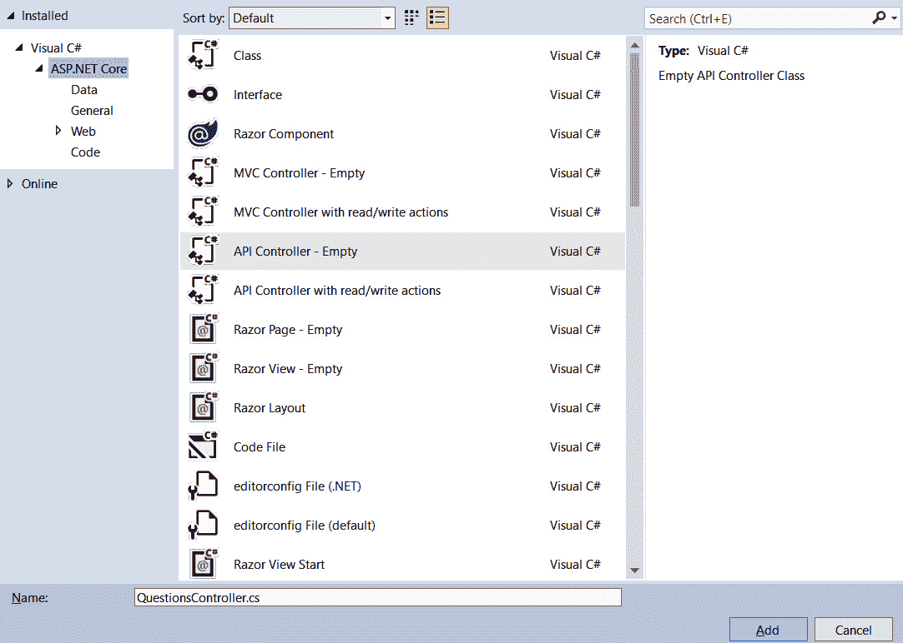
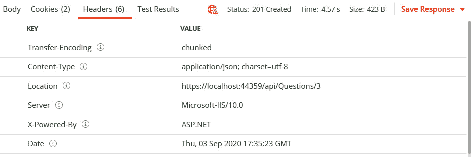
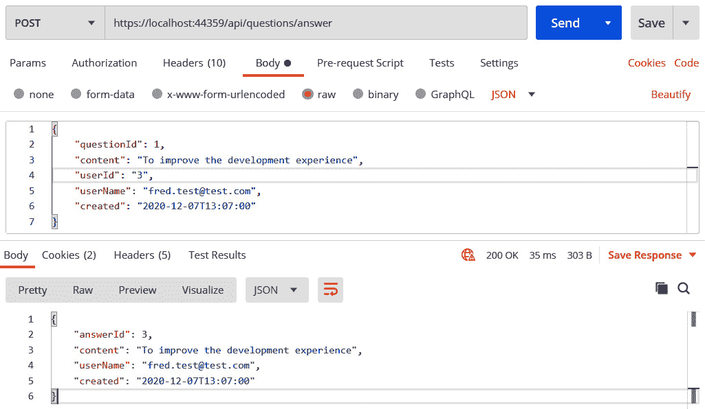
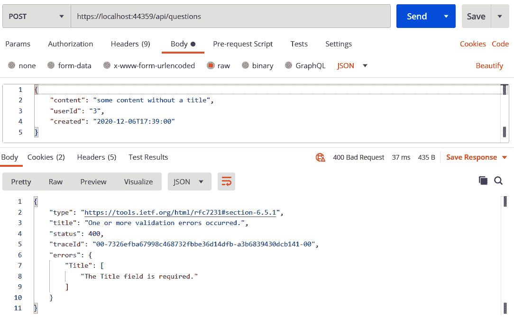
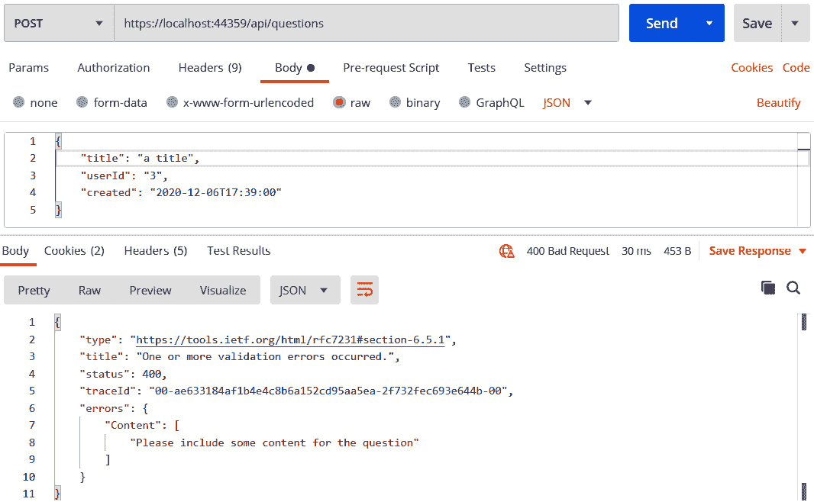
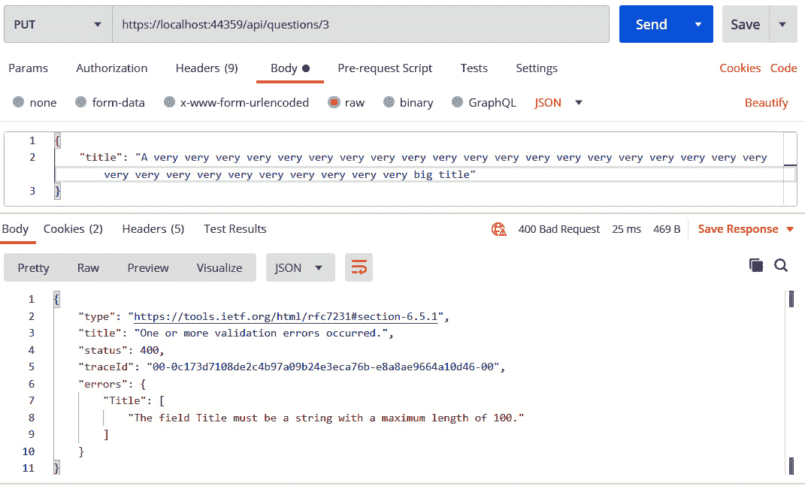
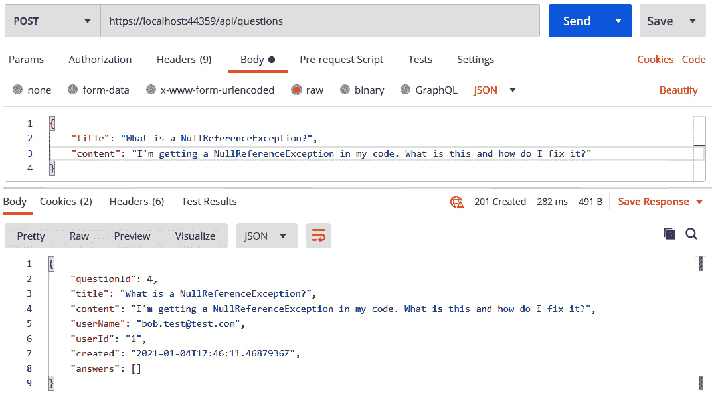
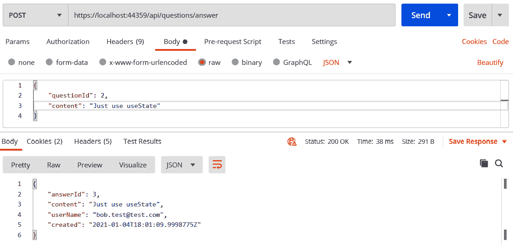

# *第 9 章*：创建 REST API 端点

在[*第 1 章*](01.html#_idTextAnchor020)*理解 ASP.NET 5 React 模板*中，我们了解到 RESTful 端点是使用 ASP.NET 中的 API 控制器实现的。在本章中，我们将为我们的 Q&A 应用实现一个 API 控制器，它最终将允许前端读写问题和答案。我们将实现一系列控制器操作方法，这些方法处理返回适当响应的不同 HTTP 请求方法。

我们将学习依赖注入，并使用它将我们在前一章中创建的数据存储库注入 API 控制器。我们将验证请求，以便在数据到达数据存储库之前确保数据有效。

在本章的最后，我们将确保在 API 请求中不会要求不必要的信息。这将防止潜在的安全问题，并改善 API 消费者的体验。

在本章中，我们将介绍以下主题：

*   创建 API 控制器
*   创建控制器操作方法
*   添加模型验证
*   删除不必要的请求字段

# 技术要求

在本章中，我们将使用以下工具：

*   **Visual Studio 2019**：我们将使用它编辑我们的 ASP.NET 代码。可从[下载 https://visualstudio.microsoft.com/vs/](https://visualstudio.microsoft.com/vs/) 。
*   **.NET 5**：可从[下载 https://dotnet.microsoft.com/download/dotnet/5.0](https://dotnet.microsoft.com/download/dotnet/5.0) 。
*   **邮递员**：我们将使用它来尝试在本章中实现的 REST API 端点。可从[下载 https://www.getpostman.com/downloads/](https://www.getpostman.com/downloads/) 。
*   **Q&A**：我们将从上一章中完成的 Q&A 后端项目开始。这可在 GitHub 的[上获得 https://github.com/PacktPublishing/ASP.NET-Core-5-and-React-Second-Edition `chapter-09/start`文件夹中的](https://github.com/PacktPublishing/ASP.NET-Core-5-and-React-Second-Edition)。

本章中的所有代码片段可在网上[找到 https://github.com/PacktPublishing/ASP.NET-Core-5-and-React-Second-Edition](https://github.com/PacktPublishing/ASP.NET-Core-5-and-React-Second-Edition) 。为了从章节中恢复代码，可以下载源代码存储库，并在相关编辑器中打开相关文件夹。如果代码为前端代码，则可以在终端中输入`npm install`来恢复依赖关系。

查看以下视频以查看代码的运行：[https://bit.ly/34xLwzq](https://bit.ly/34xLwzq) 。

# 创建 API 控制器

API 控制器是一个类，它处理 REST API 中端点的 HTTP 请求，并将响应发送回调用方。

在本节中，我们将创建一个 API 控制器来处理对`api/questions`端点的请求。控制器将调用我们在上一章中创建的数据存储库。我们还将使用依赖项注入在 API 控制器中创建数据存储库的实例。

为问题创建 API 控制器

让我们为`api/questions`端点创建一个控制器。如果我们没有在 Visual Studio 中打开后端项目，让我们这样做并执行以下步骤：

1.  在**解决方案浏览器**中，右键点击`Controllers`文件夹，选择**添加**，然后点击**类。。。**。
2.  In the left-hand panel, find and select **ASP.NET Core** and then **API Controller - Empty** in the middle panel. Enter `QuestionsController.cs` for the name of the file and click **Add**:

    

    图 9.1–创建新的 API 控制器

3.  A `QuestionsController.cs` file will appear in the `Controllers` folder in **Solution Explorer**. Open this file by double-clicking on it in **Solution Explorer**. The file will contain the following class in the `QandA.Controllers` namespace:

    ```cs
    [Route("api/[controller]")]
    [ApiController]
    public class QuestionsController : ControllerBase
    {
    }
    ```

    `Route`属性定义控制器将处理的路径。在我们的例子中，路径将是`api/questions`，因为`[controller]`被替换为控制器名称减去单词`Controller`。

    `ApiController`属性包括诸如自动模型验证之类的行为，我们将在本章后面利用这些行为。

    该类也继承自`ControllerBase`。这使我们能够在控制器中访问更多特定于 API 的方法。

接下来，我们将学习如何从 API 控制器与数据存储库交互。

## 将数据存储库注入 API 控制器

我们希望与我们在上一章中创建的数据存储库的实例交互，并将其放入我们的 API 控制器中。让我们执行以下步骤来执行此操作：

1.  我们首先将`using`语句添加到`QuestionsController.cs`文件中，以便可以引用数据存储库及其模型。在自动生成的`using`语句下添加以下语句：

    ```cs
    using QandA.Data;
    using QandA.Data.Models;
    ```

2.  Create a `private` class-level variable to hold a reference to our repository:

    ```cs
    [Route("api/[controller]")]
    [ApiController]
    public class QuestionsController : ControllerBase
    {
        private readonly IDataRepository _dataRepository;
    }
    ```

    我们使用了`readonly`关键字来确保变量的引用不会在构造函数之外发生更改。

3.  Let's create the constructor as follows beneath the `_dataRepository` variable declaration:

    ```cs
    private readonly IDataRepository _dataRepository;
    public QuestionsController()
    {
     // TODO - set reference to _dataRepository
    }
    ```

    我们需要在构造函数中设置对`_dataRepository`的引用。我们可以尝试以下方法：

    ```cs
    public QuestionsController()
    {
      _dataRepository = new DataRepository();
    }
    ```

    但是，`DataRepository`构造函数要求传入连接字符串。回想一下，我们在上一章中使用了一种称为**依赖项注入**的方法，将`configuration`对象注入到数据存储库构造函数中，让我们能够访问连接字符串。也许我们可以使用依赖注入将数据存储库注入我们的 API 控制器？是的，这正是我们要做的。

    重要提示

    **依赖注入**是将一个类的实例注入另一个对象的过程。依赖项注入的目标是将类与其依赖项解耦，以便在不更改类的情况下更改依赖项。ASP.NET 有自己的依赖项注入功能，允许在应用启动时定义类依赖项。然后，这些依赖项可以被注入到其他类构造函数中。

4.  Change the constructor to the following:

    ```cs
    public QuestionsController(IDataRepository dataRepository)
    {
      _dataRepository = dataRepository;
    }
    ```

    因此，我们的构造函数现在期望数据存储库作为参数传递给构造函数。然后，我们只需将私有类级别变量设置为传入的数据存储库。

    与注入到数据存储库中的`configuration`对象不同，数据存储库不会自动用于依赖项注入。ASP.NET 已经为我们设置了依赖注入的`configuration`对象，因为它负责这个类。然而，`DataRepository`是我们的类，所以我们必须注册它以进行依赖注入。

5.  让我们转到`startup.cs`并添加`using`语句，以便我们可以引用我们的数据存储库。在已有的`using`语句后增加以下语句：

    ```cs
    using QandA.Data;
    ```

6.  Enter the following highlighted line at the bottom of the `ConfigureServices` class to make the data repository available for dependency injection:

    ```cs
    public void ConfigureServices(IServiceCollection services)
    {
        ...
        services.AddScoped<IDataRepository,
     DataRepository>();
    }
    ```

    这告诉 ASP.NET，只要构造函数中引用了`IDataRepository`，就替换`DataRepository`类的实例。

    重要提示

    `AddScoped`方法意味着在给定的 HTTP 请求中只创建`DataRepository`类的一个实例。这意味着创建的类的生存期将持续整个 HTTP 请求。

因此，如果 ASP.NET在同一 HTTP 请求中遇到引用`IDataRepository`的第二个构造函数，它将使用之前创建的`DataRepository`类的实例。

重要提示

除了`AddScoped`之外，还有其他用于注册依赖项的方法，这些方法会导致生成的类的不同生存期。`AddTransient`将在每次请求时生成该类的新实例。`AddSingleton`在整个应用的生命周期内只生成一个类实例。

总而言之，我们可以使用依赖注入将依赖类实例注入到 API 控制器的构造函数中。依赖项注入中使用的类需要在`StartUp`类的`ConfigureServices`方法中注册。

因此，在依赖项注入的帮助下，我们现在可以访问 API 控制器中的数据存储库。接下来，我们将实现处理特定 HTTP 请求的方法。

# 创建控制器动作方法

操作方法是我们可以编写代码来处理对资源的请求的地方。在本节中，我们将实现处理对问题资源的请求的操作方法。我们将介绍`GET`、`POST`、`PUT`和`DELETE`HTTP 方法。

## 创建获取问题的行动方法

让我们实现我们的第一个动作方法，它将返回所有问题的数组。打开`QuestionsController.cs`并执行以下步骤：

1.  Let's create a method called `GetQuestions` at the bottom of the `QuestionsController` class:

    ```cs
    [HttpGet]
    public IEnumerable<QuestionGetManyResponse> GetQuestions()
    {
        // TODO - get questions from data repository
        // TODO - return questions in the response
    }
    ```

    我们用`HttpGet`属性修饰该方法，告诉 ASP.NET 它将处理对该资源的 HTTP`GET`请求。

    我们使用特定的`IEnumerable<QuestionGetManyResponse>`类型作为返回类型。

2.  我们可以使用`GetQuestions`方法从数据存储库中获取问题，如下所示：

    ```cs
    [HttpGet]
    public IEnumerable<QuestionGetManyResponse> GetQuestions()
    {
        var questions = _dataRepository.GetQuestions();
       // TODO - return questions in the response
    }
    ```

3.  Let's return the questions in the response:

    ```cs
    [HttpGet]
    public IEnumerable<QuestionGetManyResponse> GetQuestions()
    {
        var questions = _dataRepository.GetQuestions();
        return questions;
    }
    ```

    ASP.NET 将自动将`questions`对象转换为 JSON 格式，并将其放入响应正文中。也会自动返回`200`作为 HTTP 状态码。美好的

4.  让我们先在 VisualStudio 中按下*F5*来启动我们的应用。
5.  In the browser that opens, change the path to end with `api/questions`:

    

    图 9.2–获取所有问题

    我们将看到 JSON 格式的数据库输出中的问题。太好了，这是我们实施的第一个行动方法！

6.  We are going to change the default path that invokes when the app is run to the `api/questions` path in the next step. First, we need to make sure the `Properties` folder is available in **Solution Explorer**. If the `Properties` folder isn't visible in **Solution Explorer**, then switch to **Show All Files** in the toolbar:

    

    图 9.3–显示解决方案资源管理器中的所有文件

7.  打开**解决方案资源管理器**中`Properties`文件夹中的文件，将`launchUrl`字段更改为`api/questions`：

    ```cs
    ...
    "profiles": {
      "IIS Express": {
        "commandName": "IISExpress",
        "launchBrowser": true,
        "launchUrl": "api/questions",
        "environmentVariables": {
          "ASPNETCORE_ENVIRONMENT": "Development"
        }
      },
      "QandA": {
        "commandName": "Project",
        "launchBrowser": true,
        "launchUrl": "api/questions",
        "applicationUrl": 
         "https://localhost:5001;http://localhost:5000",
        "environmentVariables": {
          "ASPNETCORE_ENVIRONMENT": "Development"
        }
      }
    }
    ...
    ```

8.  按*Shift*+*F5*停止应用，然后按*F5*再次启动。我们的`api/questions`路径现在将在浏览器中默认调用。
9.  再次按*Shift*+*F5*停止应用。现在，我们准备在下一个任务中实现更多代码。

这就完成了将处理到`api/questions`的`GET`请求的操作方法。

总之，`GET`请求操作方法有一个`HttpGet`属性修饰符。方法的返回类型是我们希望在响应体中使用的数据类型，它会自动为我们转换为 JSON。

在下面的小节中，我们将继续实现更多 HTTP 方法的处理程序。

## 扩展 GetQuestions 动作方法进行搜索

我们并不总是希望所有的问题都返回到`api/questions`端点。回想一下，我们的前端有一个搜索功能，返回符合搜索条件的问题。让我们扩展我们的`GetQuestions`方法来处理搜索请求。为此，请执行以下步骤：

1.  在`GetQuestions`方法

    ```cs
    [HttpGet]
    public IEnumerable<QuestionGetManyResponse> 
      GetQuestions(string search)
    {
        var questions = _dataRepository.GetQuestions();
        return questions;
    }
    ```

    中增加`search`参数
2.  Put a breakpoint on the statement that gets the questions from the repository and press *F5* to run the app:

    

    图 9.4–无搜索查询参数的模型绑定

    我们将看到搜索参数是`null`。按*F5*让应用继续。

3.  With the breakpoint still in place, change the URL in the browser to end with `questions?search=type`:

    

    图 9.5–带有搜索查询参数值的模型绑定

    这次将`search`参数设置为我们在浏览器 URL 中输入的`search`查询参数的值。这个过程被称为模型绑定。

    重要提示

    模型绑定是 ASP.NET 中的一个进程，它将数据从 HTTP 请求映射到操作方法参数。查询参数中的数据将自动映射到具有相同名称的操作方法参数。我们将在本节后面看到，模型绑定还可以映射来自 HTTP 请求体的数据。因此，可以在 action method 参数前面放置一个`[FromQuery]`属性，以指示 ASP.NET 仅从查询参数进行映射。

4.  现在按*Shift*+*F5*停止运行 app。
5.  Let's branch our code on whether the `search` parameter contains a value and get and return all the questions if it doesn't. Replace the code inside `GetQuestions` with the following highlighted code:

    ```cs
    [HttpGet]
    public IEnumerable<QuestionGetManyResponse> 
      GetQuestions(string search)
    {
        if (string.IsNullOrEmpty(search))
     {
     return _dataRepository.GetQuestions();
     }
     else
     {
     // TODO - call data repository question search
     }
    }
    ```

    如果没有搜索值，我们会像以前一样获取并返回所有问题，但这次是在一个语句中。

6.  如果我们有一个`search`值：

    ```cs
    [HttpGet]
    public IEnumerable<QuestionGetManyResponse> 
      GetQuestions(string search)
    {
        if (string.IsNullOrEmpty(search))
        {
            return _dataRepository.GetQuestions();
        }
        else
        {
            return 
     _dataRepository.GetQuestionsBySearch(search);
        }
    }
    ```

    ，那么让我们添加对数据存储库问题搜索方法的调用
7.  Let's run the app and give this a try. All the questions will be returned in the browser when it opens up. Let's add a `search` query parameter with a value of `type`:

    

    图 9.6–搜索问题

    我们将看到 TypeScript 问题像我们预期的那样返回。

8.  按*Shift*+*F5*停止应用运行，这样我们可以为下一个任务编写更多代码。

我们已经开始利用 ASP.NET 中的模型绑定。模型绑定自动将请求中的查询参数绑定到操作方法参数。在本章中，我们将继续使用模型绑定。

## 创建获取未回答问题的行动方法

回想一下，在[*第三章*](03.html#_idTextAnchor057)**React 和 TypeScript*入门中，我们应用的主屏幕显示了未回答的问题。我们将创建一个操作方法来处理`api/questions/unanswered`路径并返回未回答的问题。按照这里给出的步骤操作。*

 *让我们实现一个提供此功能的操作方法：

1.  Add the following action method below the `GetQuestions` action method:

    ```cs
    [HttpGet("unanswered")]
    public IEnumerable<QuestionGetManyResponse> 
      GetUnansweredQuestions()
    {
        return _dataRepository.GetUnansweredQuestions();
    }
    ```

    实现只需调用数据存储库`GetUnansweredQuestions`方法并返回结果。

    请注意，`HttpGet`属性包含字符串`"unanswered"`。这是连接到控制器根路径的附加路径。因此，此操作方法将处理对`api/questions/unanswered`路径的`GET`请求。

2.  Let's give this a try by running the app in a browser by entering the `api/questions/unanswered` path:

    

    图 9.7–未回答的问题

    我们得到了一个关于国家管理的未回答的问题。

3.  按*Shift*+*F5*停止我们应用的运行，这样我们就可以编写另一个动作方法了。

这就完成了对`api/questions/unanswered`的`GET`请求进行处理的动作方法的实现。要在 action 方法中处理子路径，我们在`HttpGet`属性参数中传递子路径。

## 创建获取单个问题的行动方法

让我们继续实现获取单个问题的行动方法。为此，请执行以下步骤：

1.  Add the following skeleton method underneath the `GetUnansweredQuestions` method:

    ```cs
    [HttpGet("{questionId}")]
    public ActionResult<QuestionGetSingleResponse> 
      GetQuestion(int questionId)
    {
        // TODO - call the data repository to get the 
          // question
        // TODO - return HTTP status code 404 if the 
          // question isn't found
        // TODO - return question in response with status 
          // code 200
    }
    ```

    注意`HttpGet`属性参数。

    重要提示

    花括号告诉 ASP.NET 将端点子路径放入可作为方法参数引用的变量中。

    在此方法中，`questionId`参数将设置为端点上的子路径。因此，对于`api/questions/3`路径，`questionId`将被设置为`3`。

    请注意，返回类型是`ActionResult<QuestionGetSingleResponse>`，而不仅仅是`QuestionGetSingleResponse`。这是因为我们的动作方法不会返回`QuestionGetSingleResponse`在所有情况下，当问题找不到时，会有一个案例返回`NotFoundResult`。`ActionResult`使我们能够灵活地返回这些不同的类型。

2.  让我们打电话到存储库获取问题：

    ```cs
    [HttpGet("{questionId}")]
    public ActionResult<QuestionGetSingleResponse> 
      GetQuestion(int questionId)
    {
        var question = 
     _dataRepository.GetQuestion(questionId);
        // TODO - return HTTP status code 404 if the
         // question isn't found
        // TODO - return question in response with status
         // code 200
    }
    ```

3.  Next, we can check whether the question has been found and return HTTP status code `404` if it hasn't:

    ```cs
    [HttpGet("{questionId}")]
    public ActionResult<QuestionGetSingleResponse> GetQuestion(int questionId)
    {
        var question = 
          _dataRepository.GetQuestion(questionId);
        if (question == null)
     {
     return NotFound();
     }
        // TODO - return question in response with status
         // code 200
    }
    ```

    如果未找到问题，则存储库调用的结果将为`null`。因此，我们检查中的`null`并返回对`ControllerBase`中的`NotFound`方法的调用，该方法返回 HTTP 状态码`404`。

4.  The last implementation step is to `return` the question that has been found:

    ```cs
    [HttpGet("{questionId}")]
    public ActionResult<QuestionGetSingleResponse> GetQuestion(int questionId)
    {
        var question = 
         _dataRepository.GetQuestion(questionId);
        if (question == null)
        {
            return NotFound();
        }
        return question;
    }
    ```

    这将导致在响应中返回 HTTP 状态代码`200`，并在响应正文中返回 JSON 格式的问题。

5.  Let's give this a try by running the app and requesting question `1`:

    

    图 9.8–获取问题

    问题按预期返回。

6.  Let's try requesting a question that doesn't exist by putting `1000` as the requested question number:

    

    图 9.9–请求一个不存在的问题

    我们可以通过按*F12*打开 DevTools 并查看**网络**面板来确认返回了`404`状态码。

7.  停止我们的应用运行，以便我们准备实施另一个操作方法。

完成了获取问题的动作方法。

现在我们了解到，端点子路径参数可以通过将参数名放在 HTTP 方法属性装饰器的花括号内来实现。我们还了解到在`ControllerBase`中有一个方便的`NotFound`方法，它返回一个 HTTP 状态码`404`，我们可以将其用于请求的不存在的资源。

我们已经实现了一系列处理`GET`请求的操作方法。接下来是为其他 HTTP 方法实现操作方法的时候了。

## 创建用于发布问题的操作方法

让我们实现一个发布问题的操作方法：

1.  We'll start with the skeleton method. Add the following after the `GetQuestion` method:

    ```cs
    [HttpPost]
    public ActionResult<QuestionGetSingleResponse> 
      PostQuestion(QuestionPostRequest questionPostRequest)
    {
        // TODO - call the data repository to save the 
          // question
        // TODO - return HTTP status code 201
    }
    ```

    注意，我们使用一个`HttpPost`属性告诉 ASP.NET 该方法处理 HTTP`POST`请求。

    注意，`questionPostRequest`的方法参数类型是一个类而不是一个基元类型。前面，在*扩展用于搜索*的 GetQuestions 操作方法一节中，我们介绍了模型绑定，并解释了它如何将 HTTP 请求中的数据映射到方法参数。那么，模型绑定可以映射来自 HTTP 主体的数据以及查询参数。模型绑定也可以映射到参数中的属性。这意味着 HTTP 请求主体中的数据将映射到`QuestionPostRequest`类实例中的属性。

2.  让我们将呼叫到数据存储库中发布问题：

    ```cs
    [HttpPost]
    public ActionResult<QuestionGetSingleResponse> 
      PostQuestion(QuestionPostRequest questionPostRequest)
    {
        var savedQuestion = 
     _dataRepository.
     PostQuestion(questionPostRequest);

        // TODO - return HTTP status code 201
    }
    ```

3.  The last step in the implementation is to return status code `201` to signify that the resource has been created:

    ```cs
    [HttpPost]
    public ActionResult<QuestionGetSingleResponse> 
      PostQuestion(QuestionPostRequest questionPostRequest)
    {
        var savedQuestion = 
          _dataRepository.PostQuestion(questionPostRequest);
       return CreatedAtAction(nameof(GetQuestion), 
     new { questionId = savedQuestion.QuestionId }, 
     savedQuestion);
    }
    ```

    我们从`ControllerBase`返回对`CreatedAtAction`的呼叫，该呼叫将返回状态代码`201`，并在响应中包含问题。此外，它还包括一个`Location`HTTP 头，其中包含获取问题的路径。

4.  让我们试试这个。首先，我们将通过按*F5*来运行应用。
5.  This time we'll use Postman to check whether the action method is working. Postman is a great tool for testing REST APIs. Open Postman and create a new request by clicking the **+** icon on the tabs bar:

    

    图 9.10–创建新请求

6.  Set the HTTP method to `POST` and enter the path to the questions resource:

    

    图 9.11–在 Postman 中设置 HTTP 方法和路径

7.  Go to the **Body** tab, select **raw**, and then select **JSON** to specify the request body type:

    

    图 9.12–在 Postman 中将请求主体类型设置为 JSON

8.  Enter the request body in the box provided, as shown in the following screenshot:

    

    图 9.13–在 Postman 中添加请求正文

9.  Click the **Send** button to send the request and look at the response panel underneath the request body:

    

    图 9.14–发布问题的回复正文

    返回预期的`201`HTTP 状态码，并在响应中保存问题。

    注意响应中的问题如何生成`questionId`，这对消费者在与问题交互时非常有用。

10.  If we look at the response headers, we can see that ASP.NET has also included a `Location` HTTP header that contains the path to get the question:

    

    图 9.15–发布问题的回复标题

    这是一个很好的触摸。

11.  停止我们的应用运行，以便我们准备实施另一个操作方法。

这就完成了操作方法的实现，该操作方法将处理对`api/questions`的`POST`请求。

我们使用`HttpPost`属性装饰器来允许操作方法处理`POST`请求。在 action 方法的 return 语句中，从`ControllerBase`执行`CreatedAtAction`方法将自动添加一个包含获取资源路径的 HTTP 位置头，并将 HTTP 状态码`201`添加到响应中。

## 创建更新问题的动作方法

让我们继续更新一个问题。为此，请执行以下步骤：

1.  Add the following skeleton for the action method:

    ```cs
    [HttpPut("{questionId}")]
    public ActionResult<QuestionGetSingleResponse> 
      PutQuestion(int questionId, 
        QuestionPutRequest questionPutRequest)
    {
        // TODO - get the question from the data
         // repository
        // TODO - return HTTP status code 404 if the 
          // question isn't found
        // TODO - update the question model
        // TODO - call the data repository with the 
         // updated question model to update the question
           // in the database
        // TODO - return the saved question
    }
    ```

    我们使用`HttpPut`属性告诉 ASP.NET 该方法处理 HTTP`PUT`请求。我们还在`questionId`方法参数中加入问题 ID 的路由参数。

    ASP.NET 模型绑定将从 HTTP 请求主体填充`QuestionPutRequest`类实例。

2.  让我们从数据存储库中获取问题，如果没有找到该问题，则返回 HTTP 状态代码`404`：

    ```cs
    [HttpPut("{questionId}")]
    public ActionResult<QuestionGetSingleResponse> 
      PutQuestion(int questionId, 
        QuestionPutRequest questionPutRequest)
    {
        var question = _dataRepository.
     GetQuestion(questionId);
     if (question == null)
     {
     return NotFound();
     }

        // TODO - update the question model
        // TODO - call the data repository with the 
          // updated question 
        //model to update the question in the database
        // TODO - return the saved question
    }
    ```

3.  Now let's update the `question` model:

    ```cs
    [HttpPut("{questionId}")]
    public ActionResult<QuestionGetSingleResponse> 
      PutQuestion(int questionId, 
        QuestionPutRequest questionPutRequest)
    {
        var question = _dataRepository.
         GetQuestion(questionId);
        if (question == null)
        {
            return NotFound();
        }
        questionPutRequest.Title = 
     string.IsNullOrEmpty(questionPutRequest.Title) ? 
     question.Title : 
     questionPutRequest.Title;
     questionPutRequest.Content = 
     string.IsNullOrEmpty(questionPutRequest.Content) ? 
     question.Content : 
     questionPutRequest.Content;

        // TODO - call the data repository with the 
         // updated question model to update the question
           // in the database
        // TODO - return the saved question
    }
    ```

    如果请求中没有提供现有问题的数据，我们使用三元表达式更新请求模型。

    重要提示

    允许 API 的使用者只提交需要更新的信息（而不是完整记录），使我们的 API 易于使用。

4.  实现中的最后步骤是调用数据存储库更新问题，然后在响应中返回保存的问题：

    ```cs
    [HttpPut("{questionId}")]
    public ActionResult<QuestionGetSingleResponse> 
      PutQuestion(int questionId, 
        QuestionPutRequest questionPutRequest)
    {
        var question = 
         _dataRepository.GetQuestion(questionId);
        if (question == null)
        {
            return NotFound();
        }
        questionPutRequest.Title = 
          string.IsNullOrEmpty(questionPutRequest.Title) ? 
            question.Title : 
            questionPutRequest.Title;
        questionPutRequest.Content = 
          string.IsNullOrEmpty(questionPutRequest.Content) ? 
            question.Content : 
            questionPutRequest.Content;
        var savedQuestion = 
     _dataRepository.PutQuestion(questionId, 
     questionPutRequest);
     return savedQuestion;
    }
    ```

5.  让我们通过运行应用和使用 Postman 来尝试一下。创建一个新请求，并将 HTTP 方法设置为`PUT`，然后输入我们需要的问题 3 的路径
6.  recently added:

    

    图 9.16–PUT 请求路径

7.  进入**主体**页签，选择**原始**，然后选择**JSON**指定请求主体类型。
8.  Enter the request body in the box provided, as shown in the following screenshot:

    

    图 9.17–PUT 请求正文

    因此，我们要求用我们提供的新内容更新问题 3。

9.  Click the **Send** button to send the request:

    

    图 9.18–PUT 响应主体

    正如我们预期的那样，问题得到了更新。

10.  停止我们的应用运行，以便我们准备实施另一个操作方法。

我们实现的`PutQuestion`操作方法可以说是`PATCH`请求的处理程序，因为它不需要提交完整记录。要处理`PATCH`请求，`HttpPut`属性修饰符可以更改为`HttpPatch`。请注意，正确处理`PATCH`请求需要`NewtonsoftJson`NuGet 包并注册特殊的输入格式化程序。更多信息请访问[https://docs.microsoft.com/en-us/aspnet/core/web-api/jsonpatch](https://docs.microsoft.com/en-us/aspnet/core/web-api/jsonpatch) 。

为了同时处理`PUT`和`PATCH`请求，该方法可以同时使用`HttpPut`和`HttpPatch`属性修饰符进行修饰。我们将只使用`HttpPut`保留我们的实现。

这就完成了操作方法的实现，该操作方法将处理对`api/questions`的`PUT`请求。

## 创建删除问题的动作方法

让我们执行删除一个问题。这遵循与前面方法类似的模式：

1.  We'll add the action method in a single step as it's similar to what we've done before:

    ```cs
    [HttpDelete("{questionId}")]
    public ActionResult DeleteQuestion(int questionId)
    {
     var question = 
      _dataRepository.GetQuestion(questionId);
     if (question == null)
     {
     return NotFound();
     }
     _dataRepository.DeleteQuestion(questionId);
     return NoContent();
    }
    ```

    我们使用`HttpDelete`属性告诉 ASP.NET 该方法处理 HTTP`DELETE`请求。该方法希望问题 ID 包含在路径的末尾。

    该方法在删除问题之前检查问题是否存在，如果不存在，则返回 HTTP`404`状态码。

    如果删除成功，则返回HTTP 状态码`204`。

2.  Let's try this out by running the app and using Postman. Set the HTTP method to `DELETE` and enter the path to question 3\. Click the **Send** button to send the request:

    

    图 9.19–删除请求

    按预期返回 HTTP 状态代码为`204`的响应。

3.  停止我们的应用运行，以便我们准备好实施最终操作方法。

这就完成了操作方法的实现，该操作方法将处理对`api/questions`的`DELETE`请求。

## 创建发布答案的操作方法

我们将要实施的最终行动方法是发布问题答案的方法：

1.  This method will handle an HTTP `POST` request to the `api/question/answer` path:

    ```cs
    [HttpPost("answer")]
    public ActionResult<AnswerGetResponse> 
      PostAnswer(AnswerPostRequest answerPostRequest)
    {
        var questionExists = 
          _dataRepository.QuestionExists(
           answerPostRequest.QuestionId);
        if (!questionExists)
        {
            return NotFound();
        }
        var savedAnswer = 
         _dataRepository.PostAnswer(answerPostRequest);
        return savedAnswer;
    }
    ```

    该方法检查问题是否存在，如果不存在，则返回一个`404`HTTP 状态码。然后将答案传递到数据存储库以插入数据库。保存的答案将从数据存储库返回，并在响应中返回。

    另一种方法是将`questionId`放入 URL（`api/question/{questionId}/answer`），而不是请求主体中。这可以通过将 decorator 和方法签名更改为以下内容来实现：

    ```cs
    [HttpPost("{questionId}/answer")]
    public ActionResult<AnswerGetResponse>
      PostAnswer(int questionId, AnswerPostRequest answerPostRequest)
    ```

    `QuestionId`属性也可以从`AnswerPostRequest`模型中删除。

2.  Let's try this out by running the app and using Postman. Set the HTTP method to `POST` and enter the `api/questions/answer` path. Add a request body containing an answer for question 1 and then click the **Send** button to send the request:

    

    图 9.20–提交答案

    答案将按预期保存并在响应中返回。

3.  Remove the `content` field from the request body and try sending the request again. An error occurs in the data repository when the request is sent:

    

    图 9.21–添加没有内容的答案时的 SQL 错误

    这是因为存储过程希望将内容参数传递给它，如果不传递，则会提出抗议。

4.  让我们停止应用，以便在下一节中解决此问题。

没有任何内容的答案是无效答案。理想情况下，我们应该停止将无效请求传递到数据存储库，并将 HTTP 状态代码`400`返回给客户端，详细说明请求的错误。我们如何在 ASP.NET 中实现这一点？让我们在下一节中找到答案。

# 增加模型验证

在本节中，我们将在请求模型上添加一些验证检查。然后，ASP.NET 将自动发送 HTTP 状态代码`400`（错误请求）以及问题的详细信息。

验证对于防止坏数据进入数据库或发生意外的数据库错误至关重要，正如我们在上一节中所经历的那样。向客户提供错误请求的详细信息也可以确保开发体验良好，因为这将有助于纠正错误。

## 向发布问题添加验证

我们可以通过将验证属性添加到模型中的属性来向模型添加验证，这些属性指定了应该遵守的规则。让我们在发布问题的请求中添加验证：

1.  Open `QuestionPostRequest.cs` and add the following `using` statement underneath the existing `using` statements:

    ```cs
    using System.ComponentModel.DataAnnotations;
    ```

    该名称空间使我们能够访问验证属性。

2.  Add a `Required` attribute just above the `Title` property:

    ```cs
    [Required]
    public string Title { get; set; }
    ```

    `Required`属性将检查`Title`属性是否为空字符串或`null`。

3.  在尝试此操作之前，请在`QuestionsController.cs`中的`PostQuestion`操作方法中的第一条语句上设置断点。
4.  Let's run the app and try to post a question without a title in Postman:

    

    图 9.22–提交无标题问题时的验证错误

    我们得到了一个 HTTP 状态码为`400`的响应，响应中包含了关于问题的大量信息。

    还请注意，未到达断点。这是因为 ASP.NET 检查了该模型，确定该模型无效，并在调用 action 方法之前返回了错误的请求响应。

5.  Let's stop the app from running and implement another validation check on the `Title` property in the `QuestionPostRequest` class:

    ```cs
    [Required]
    [StringLength(100)]
    public string Title { get; set; }
    ```

    此检查将确保标题不超过`100`个字符。包含超过 100 个字符的标题将导致数据库错误，因此这是一个有价值的检查。

6.  一个问题也必须有一些内容，所以让我们在此添加一个`Required`属性：

    ```cs
    [Required]
    public string Content { get; set; }
    ```

7.  我们可以将自定义错误消息添加到验证属性。让我们在`Content`属性

    ```cs
    [Required(ErrorMessage = 
     "Please include some content for the question")]
    public string Content { get; set; }
    ```

    的验证中添加一条错误消息
8.  Let's run the app and try posting a new question without any content:

    

    图 9.23–提交无内容问题时的验证错误

    我们在响应中得到了预期的自定义消息。

9.  让我们停止应用运行。

`UserId`、`UserName`和`Created`属性也应该是必需的属性。但是，我们不打算向它们添加验证属性，因为我们将在本章后面的部分中对它们进行研究。

## 添加验证以更新问题

让我们在更新问题的请求中添加验证：

1.  打开`QuestionPutRequest.cs`并添加以下`using`语句：

    ```cs
    using System.ComponentModel.DataAnnotations;
    ```

2.  Add the following validation attribute to the `Title` property:

    ```cs
    public class QuestionPutRequest
    {      
        [StringLength(100)]
        public string Title { get; set; }

        public string Content { get; set; }
    }
    ```

    我们正在确保新标题不超过 100 个字符。

3.  Let's run the app and give this a try by updating a question to have a very long title:

    

    图 9.24–更新长标题问题时的验证错误

    验证错误按预期返回。

4.  停止应用运行，以便我们准备添加下一个验证。

这就完成了对`api/questions`的`PUT`请求的模型验证的实现。

## 在发布答案时添加验证

让我们在发布答案的请求中添加验证：

1.  打开`AnswerPostRequest.cs`并添加以下`using`语句：

    ```cs
    using System.ComponentModel.DataAnnotations;
    ```

2.  添加以下验证属性，使`QuestionId`和`Content`属性成为必填项：

    ```cs
    public class AnswerPostRequest
    {
        [Required]
        public int QuestionId { get; set; }
        [Required]
        public string Content { get; set; }
        ...
    }
    ```

3.  Make the `QuestionId` property nullable by putting a question mark after the `int` type:

    ```cs
    public class AnswerPostRequest
    {
        [Required]
        public int? QuestionId { get; set; }
        [Required]
        public string Content { get; set; }
        ...
    }
    ```

    重要提示

    `?`允许属性具有`null`值和声明的类型。`T?`是`Nullable<T>`的快捷语法。

    那么，为什么`QuestionId`需要能够保持`null`值呢？这是因为`int`类型默认为`0`，所以如果请求体中没有`QuestionId`，则`AnswerPostRequest`将退出模型绑定流程，将`QuestionId`设置为`0`，并通过所需的验证检查。这意味着`Required`属性不会捕获没有`QuestionId`的请求正文。如果`QuestionId`类型可为空，那么它将在模型绑定处理中以`null`值出现（如果它不在请求正文中），并将通过所需的验证检查，这正是我们想要的。

4.  We need to change the `PostAnswer` method in `QuestionsController.cs` so that it now references the `Value` property in `QuestionId`:

    ```cs
    [HttpPost("answer")]
    public ActionResult<AnswerGetResponse> 
      PostAnswer(AnswerPostRequest answerPostRequest)
    {
        var questionExists =   
          _dataRepository.QuestionExists(
            answerPostRequest.QuestionId.Value);
        if (!questionExists)
        {
            return NotFound();
        }
        var savedAnswer = 
          _dataRepository.PostAnswer(answerPostRequest);
        return savedAnswer;
    }
    ```

    这就完成了对`api/questions/answer`的`POST`请求的模型验证的实现。

我们已经体验到，模型验证在我们的请求模型中非常容易实现。我们只需在需要使用适当属性进行验证的模型中修饰属性。我们在实现中使用了`Required`和`StringLength`属性，但 ASP.NET 中还有其他属性，其中一些属性如下：

*   `[Range]`：检查属性值是否在给定范围内
*   `[RegularExpression]`：检查数据是否与指定的正则表达式匹配
*   `[Compare]`：检查模型中的两个属性是否匹配
*   `[CreditCard]`：检查财产是否具有信用卡格式
*   `[EmailAddress]`：检查属性是否具有电子邮件格式
*   `[Phone]`：检查属性是否具有电话格式
*   `[Url]`：检查属性是否具有 URL 格式

在我们的请求模型中，我们没有向`UserId`、`UserName`或`Created`属性添加任何验证。在下一节中，我们将找出原因并正确处理这些属性。

# 删除不必要的请求字段

目前，我们正在允许消费者提交我们的数据存储库所需的所有属性，包括`userId`、`userName`和`created`。但是，可以在服务器上设置这些属性。事实上，客户不需要知道或关心`userId`。

将客户端暴露于超出其需要的更多属性会影响 API 的可用性，还可能导致安全问题。例如，客户机可以假装是任何使用当前 API 提交问题和答案的用户。

在下面的小节中，我们将收紧一些请求，以便它们不包含不必要的信息。我们将首先从发布问题中删除`userId`、`userName`和`created`字段，然后再从发布答案中删除`userId`和`created`字段。

## 从发布问题中删除不必要的请求字段

我们的`QuestionPostRequest`模型在数据存储库中用于将数据传递到存储过程，在 API 控制器中用于捕获请求体中的信息。这个单一的模型不能很好地满足这两种情况，所以我们将创建并使用单独的模型。执行以下步骤：

1.  In the `models` folder, create a new model called `QuestionPostFullRequest` as follows:

    ```cs
    public class QuestionPostFullRequest
    {
        public string Title { get; set; }
        public string Content { get; set; }
        public string UserId { get; set; }
        public string UserName { get; set; }
        public DateTime Created { get; set; }
    }
    ```

    其中包含数据存储库保存问题所需的所有属性。

2.  然后我们可以从`QuestionPostRequest`类中删除`UserId`、`UserName`和`Created`属性。因此，`QuestionPostRequest`类现在应该如下：

    ```cs
    public class QuestionPostRequest
    {
        [Required]
        [StringLength(100)]
        public string Title { get; set; }
        [Required(ErrorMessage =
          "Please include some content for the question")]
        public string Content { get; set; }

    }
    ```

3.  在数据仓库界面，将`PostQuestion`方法更改为使用`QuestionPostFullRequest`模型：

    ```cs
    QuestionGetSingleResponse 
      PostQuestion(QuestionPostFullRequest question);
    ```

4.  在数据仓库中，将`PostQuestion`方法更改为使用`QuestionPostFullRequest`模型：

    ```cs
    public QuestionGetSingleResponse 
      PostQuestion(QuestionPostFullRequest question)
    {
        ...
    }
    ```

5.  We now need to map the `QuestionPostRequest` received in `QuestionsController` to the `QuestionFullPostRequest` that our data repository expects:

    ```cs
    [HttpPost]
    public ActionResult<QuestionGetSingleResponse> 
      PostQuestion(QuestionPostRequest questionPostRequest)
    {
        var savedQuestion = 
          _dataRepository.PostQuestion(new 
     QuestionPostFullRequest
     {
     Title = questionPostRequest.Title,
     Content = questionPostRequest.Content,
     UserId = "1",
            UserName = "bob.test@test.com",
     Created = DateTime.UtcNow
     });
        return CreatedAtAction(nameof(GetQuestion), 
          new { questionId = savedQuestion.QuestionId }, 
          savedQuestion);
    }
    ```

    我们现在已经对`UserId`和`UserName`值进行了硬编码。在[*第 11 章*](11.html#_idTextAnchor242)**保护后端*中，我们将从我们的身份提供商处获取它们。*

    *我们还将`Created`属性设置为当前日期和时间。*

**   Let's run our app and give it a try:

    

    图 9.25–提交问题

    用户和创建日期按预期设置并在响应中返回。

    *   最后，停止应用运行。*

 *这就完成了 HTTP 请求模型和添加问题的数据存储库的分离。这意味着我们只要求提供`POST`请求`api/questions`所需的信息。

## 从发布答案中删除不必要的请求字段

让我们加紧发布答案：

1.  In the `models` folder, create a new model called `AnswerPostFullRequest` as follows:

    ```cs
    public class AnswerPostFullRequest
    {
        public int QuestionId { get; set; }
        public string Content { get; set; }
        public string UserId { get; set; }
        public string UserName { get; set; }
        public DateTime Created { get; set; }
    }
    ```

    它包含数据存储库保存答案所需的所有属性。

2.  然后我们可以从`AnswerPostRequest`类中删除`UserId`和`Created`属性。因此，`AnswerPostRequest`类现在将如下：

    ```cs
    public class AnswerPostRequest
    {
        [Required]
        public int? QuestionId { get; set; }
        [Required]
        public string Content { get; set; }
    }    
    ```

3.  在数据仓库界面，将`PostAnswer`方法更改为使用`AnswerPostFullRequest`模型：

    ```cs
    AnswerGetResponse PostAnswer(AnswerPostFullRequest answer);
    ```

4.  在数据仓库中，将`PostAnswer`方法更改为使用`AnswerPostFullRequest`模型：

    ```cs
    public AnswerGetResponse 
      PostAnswer(AnswerPostFullRequest answer)
    {
        ...
    }
    ```

5.  我们现在需要将`QuestionsController`中接收到的`AnswerPostRequest`映射到我们的数据存储库期望的`AnswerPostFullRequest`：

    ```cs
    [HttpPost("answer")]
    public ActionResult<AnswerGetResponse> 
      PostAnswer(AnswerPostRequest answerPostRequest)
    {
        var questionExists = 
         _dataRepository.QuestionExists(
          answerPostRequest.QuestionId.Value);
        if (!questionExists)
        {
            return NotFound();
        }
        var savedAnswer = 
          _dataRepository.PostAnswer(new 
     AnswerPostFullRequest
     {
     QuestionId = answerPostRequest.
     QuestionId.Value,
     Content = answerPostRequest.Content,
     UserId = "1",
              UserName = "bob.test@test.com",
     Created = DateTime.UtcNow
     }
    );
        return savedAnswer;
    }
    ```

6.  让我们运行我们的应用并试一试：



图 9.26–提交答案

用户和创建日期按预期设置并在响应中返回。

所以，这就是我们的 RESTAPI 收紧了一点。

在本节中，我们手动将请求模型映射到数据存储库中使用的模型。对于大型模型，使用映射库（如`AutoMapper`）来帮助我们将数据从一个对象复制到另一个对象可能是有益的。更多关于`AutoMapper`的信息可在[找到https://automapper.org/](https://automapper.org/) 。

# 总结

在本章中，我们学习了如何实现 API 控制器来处理对 REST API 端点的请求。我们发现继承`ControllerBase`并用`ApiController`属性装饰控制器类为我们提供了很好的特性，例如自动模型验证处理和一组返回 HTTP 状态代码的方法。

我们使用`AddScoped`注册数据存储库依赖项，以便 ASP.NET 在请求/响应周期中使用它的单个实例。然后，我们能够在 API 控制器类的构造函数中注入对数据存储库的引用。

我们了解了 ASP.NET 中强大的模型绑定过程，以及它如何将 HTTP 请求中的数据映射到操作方法参数。我们发现，在某些情况下，对 HTTP 请求和数据存储库使用单独的模型是可取的，因为一些数据可以在服务器上设置，请求中需要较少的数据有助于可用性，有时还有助于安全性。

我们使用 ASP.NET 验证属性来验证模型。这是一种非常简单的方法，可以确保数据库不会被坏数据感染。

我们现在可以构建健壮且对开发人员友好的 restapi，这些 restapi 可以与所有常见的 HTTP 方法一起工作，并使用适当的 HTTP 状态代码返回响应。

在下一章中，我们将重点讨论 RESTAPI 的性能和可伸缩性。

# 问题

回答以下问题以测试您在本章中获得的知识：

1.  我们有一个类要注册以进行依赖项注入。在处理请求期间，其他类会多次引用该类。我们希望在注入类时创建该类的新实例，而不是使用现有实例。在`IServiceCollection`中，我们应该使用什么方法来注册依赖关系？
2.  在控制器操作方法中，如果找不到资源，我们可以在`ControllerBase`中使用什么方法返回状态码`404`？
3.  In a controller action method to post a new building, we implement some validation that requires a database call to check whether the building already exists. If the building does already exist, we want to return HTTP status code `400`:

    ```cs
    [HttpPost]
    public ActionResult<BuildingResponse> PostBuilding(BuildingPostRequest buildingPostRequest)
    {
        var buildingExists = 
        _dataRepository.BuildingExists(buildingPostRequest.      Code);
        if (buildingExists)
        {
            // TODO - return status code 400
        }
        ...
    }
    ```

    从`ControllerBase`可以使用什么方法返回状态码`400`？

4.  The model for the preceding action method is as follows:

    ```cs
    public class BuildingPostRequest
    {
        public string Code { get; set; }
        public string Name { get; set; }
        public string Description { get; set; } 
    }
    ```

    我们向具有以下主体的资源发送 HTTP`POST`请求：

    ```cs
    {
        "code": "BTOW",
        "name": "Blackpool Tower",
        "buildingDescription": "Blackpool Tower is a
          tourist attraction in Blackpool"
    }
    ```

    请求期间未填充模型中的`Description`属性。有什么问题？

5.  在前面的请求模型中，我们希望验证是否填充了`code`和`name`字段。我们如何使用验证属性来实现这一点？
6.  我们可以使用什么验证属性来验证数值属性是否介于 1 和 10 之间？
7.  我们可以使用什么`Http`属性告诉 ASP.NET 操作方法处理 HTTP`PATCH`请求？

# 答案

1.  我们可以使用`AddTransient`方法。
2.  我们可以使用`NotFound`方法。
3.  我们可以使用`BadRequest`方法。
4.  问题是请求中的`buildingDescription`与模型中`Description`属性的名称不匹配。如果请求更改为具有`description`字段，则这将解决问题。
5.  我们可以在`Code`和`Name`中添加`Required`属性如下：

    ```cs
    public class BuildingPostRequest
    {
        [Required]
        public string Code { get; set; }
        [Required]
        public string Name { get; set; }
        public string Description { get; set; } 
    }
    ```

6.  我们可以使用如下的`Range`属性：

    ```cs
    [Range(1, 10)]
    ```

7.  `HttpPatch`属性可用于处理 HTTP`PATCH`请求。

# 进一步阅读

以下是一些有用的链接，可用于了解有关本章所涵盖主题的更多信息：

*   **使用 ASP.NET**：[创建 web APIhttps://docs.microsoft.com/en-us/aspnet/core/web-api](https://docs.microsoft.com/en-us/aspnet/core/web-api)
*   **依赖注入**：[https://docs.microsoft.com/en-us/aspnet/core/fundamentals/dependency-injection](https://docs.microsoft.com/en-us/aspnet/core/fundamentals/dependency-injection)
*   **模型绑定**：[https://docs.microsoft.com/en-us/aspnet/core/mvc/models/model-binding](https://docs.microsoft.com/en-us/aspnet/core/mvc/models/model-binding)
*   **模型验证**：[https://docs.microsoft.com/en-us/aspnet/core/mvc/models/validation](https://docs.microsoft.com/en-us/aspnet/core/mvc/models/validation)
*   **邮递员**：[https://learning.getpostman.com/docs/postman/launching_postman/installation_and_updates/](https://learning.getpostman.com/docs/postman/launching_postman/installation_and_updates/)**