# 十、提高性能和可扩展性

在本章中，我们将改进 RESTAPI 的性能和可伸缩性。当我们进行每项改进时，我们将使用负载测试工具来验证是否有改进。

我们将首先关注数据库调用以及如何减少调用次数以提高性能。然后，我们将继续使用数据分页来请求更少的数据。我们还将研究在内存中缓存数据对性能的影响。

然后，我们将学习如何使 API 控制器和数据存储库异步。我们最终将了解这是使 RESTAPI 更具性能还是更具可伸缩性。

在本章中，我们将介绍以下主题：

*   减少数据库往返
*   分页数据
*   使 API 控制器异步
*   缓存数据

在本章的最后，我们将了解如何实现在负载下性能良好的快速 RESTAPI。

# 技术要求

在本章中，我们将使用以下工具：

*   **Visual Studio 2019**：我们将使用它编辑我们的 ASP.NET 代码。可从[下载并安装 https://visualstudio.microsoft.com/vs/](https://visualstudio.microsoft.com/vs/) 。
*   **.NET 5**：可从[下载 https://dotnet.microsoft.com/download/dotnet/5.0](https://dotnet.microsoft.com/download/dotnet/5.0) 。
*   **SQL Server Management Studio**：我们将使用它在数据库中执行一个存储过程。可从[下载并安装 https://docs.microsoft.com/en-us/sql/ssms/download-sql-server-management-studio-ssms?view=sql-服务器-2017](https://docs.microsoft.com/en-us/sql/ssms/download-sql-server-management-studio-ssms?view=sql-server-2017)。
*   **邮递员**：我们将使用它来尝试对 RESTAPI 端点所做的更改。可从[下载 https://www.getpostman.com/downloads/](https://www.getpostman.com/downloads/) 。
*   **WebSurge**：这是一个负载测试工具，我们可以从[下载 https://websurge.west-wind.com/](https://websurge.west-wind.com/) 。
*   **Q&A**：我们将从上一章中完成的 Q&A 后端项目开始。这可在 GitHub 的[上获得 https://github.com/PacktPublishing/ASP.NET-Core-5-and-React-Second-Edition](https://github.com/PacktPublishing/ASP.NET-Core-5-and-React-Second-Edition) 在第 10 章/开始文件夹中。

本章中的所有代码片段可在网上[找到 https://github.com/PacktPublishing/ASP.NET-Core-5-and-React-Second-Edition](https://github.com/PacktPublishing/ASP.NET-Core-5-and-React-Second-Edition) 。要从章节中还原代码，可以下载源代码存储库，并在相关编辑器中打开相关文件夹。如果代码为前端代码，则可在终端中输入`npm install`恢复依赖关系。

查看以下视频以查看代码的运行：[https://bit.ly/3piyUEx](https://bit.ly/3piyUEx) 。

# 减少数据库往返

数据库往返是 web API 对数据库的请求。数据库往返费用昂贵。web API 和数据库之间的距离越远，往返成本就越高。因此，我们希望将从 web API 到数据库的行程保持在最低限度，以获得最大的性能。

本节开始时，我们将了解 N+1 问题，并体验它如何对性能产生负面影响。然后，我们将学习如何在单个数据库往返中执行多个查询。

## 了解 N+1 问题

N+1 问题是一个经典的查询问题，其中是父子数据模型关系。检索此模型的数据时，将在查询中获取父项，然后执行单独的查询以获取每个子项的数据。因此，有*N*个查询用于子查询，还有一个查询用于父查询，因此术语 N+1。

我们将向`questions`REST API 端点添加在`GET`请求中返回答案和问题的功能。在我们的第一个实现中，我们将陷入 N+1 陷阱。让我们在 Visual Studio 中打开后端项目，并执行以下步骤：

1.  首先，让我们在`QuestionGetManyResponse`模型的底部添加一个`Answers`属性：

    ```cs
    public class QuestionGetManyResponse
    {
      public int QuestionId { get; set; }
      public string Title { get; set; }
      public string Content { get; set; }
      public string UserName { get; set; }
      public DateTime Created { get; set; }
      public List<AnswerGetResponse> Answers { get; set; }
    }
    ```

2.  Add a new method to our data repository interface just below the `GetQuestions` method:

    ```cs
    public interface IDataRepository
    {
        IEnumerable<QuestionGetManyResponse>
          GetQuestions();
        IEnumerable<QuestionGetManyResponse>
     GetQuestionsWithAnswers();
        ...
    }
    ```

    此方法将获取数据库中的所有问题，包括每个问题的答案。

3.  Now, add the implementation for the `GetQuestionsWithAnswers` method in the data repository just below the `GetQuestions` method:

    ```cs
    public IEnumerable<QuestionGetManyResponse> GetQuestionsWithAnswers()
    {
      using (var connection = new 
       SqlConnection(_connectionString))
      {
        connection.Open();
        var questions = 
          connection.Query<QuestionGetManyResponse>(
            "EXEC dbo.Question_GetMany");
        foreach (var question in questions)
        {
           question.Answers = 
             connection.Query<AnswerGetResponse>(
               @"EXEC dbo.Answer_Get_ByQuestionId 
                 @QuestionId = @QuestionId", 
               new { QuestionId = question.QuestionId })
             .ToList();
        }
        return questions;
      }
    }
    ```

    因此，这会调用数据库获取所有问题，然后再调用其他调用获取每个问题的答案。我们落入了经典的 N+1 陷阱！

4.  Let's move on to `QuestionsController` now and add the ability to include answers with the questions:

    ```cs
    [HttpGet]
    public IEnumerable<QuestionGetManyResponse> 
      GetQuestions(string search, bool includeAnswers)
    {
      if (string.IsNullOrEmpty(search))
      {
        if (includeAnswers)
     {
     return 
     _dataRepository.GetQuestionsWithAnswers();
     } 
     else
     {
          return _dataRepository.GetQuestions();
        }
      }
      else
      {
        return 
         _dataRepository.GetQuestionsBySearch(search);
      }
    }
    ```

    我们已经添加了一个`includeAnswers`查询参数的功能，如果设置该参数，将调用我们刚才添加的`GetQuestionsWithAnswers`数据存储库方法。如果定义了一个`search`查询参数，一个更完整的实现将允许包含答案，但是这个实现将足以让我们看到 N+1 问题以及如何解决它。

5.  现在，按*F5 运行 REST API。*
6.  在《邮递员》中，让我们试着提问并给出答案：

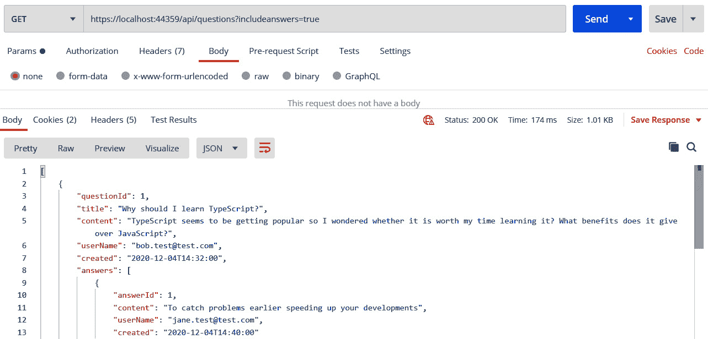

图 10.1–邮递员中的问题和答案

答案随每个问题一起返回，正如我们预期的那样。

不过，这似乎不是什么大问题。请求仅用了**174 毫秒**就完成了。嗯，目前我们的数据库中只有几个答案。如果我们有更多的问题，请求会慢一点。另外，我们刚刚做的测试是针对单个用户的。当多个用户发出此请求时会发生什么情况？我们将在下一节中找到答案。

## 使用 WebSurge 加载测试我们的端点

我们必须对 API 端点进行负载测试，以验证它们在负载下是否正常运行。在开发过程中，在用户之前发现性能问题要好得多。WebSurge 是一个简单的负载测试工具，我们将使用它来测试具有 N+1 问题的`questions`端点。我们将在我们的开发环境中执行负载测试，这对于我们看到 N+1 问题的影响是很好的。显然，在生产环境中，我们将看到的负载测试结果要快得多。要使用 WebSurge 进行负载测试，请执行以下步骤：

1.  如果 REST API 尚未运行，请按*F5*运行 REST API。
2.  Open WebSurge and click the **New Request** option on the **Session** tab:

    

    图 10.2–新 WebSurge 请求

3.  Fill in the request details on the **Request** tab in the right-hand pane for a `GET` request to `api/questions/includeanswers=true`:

    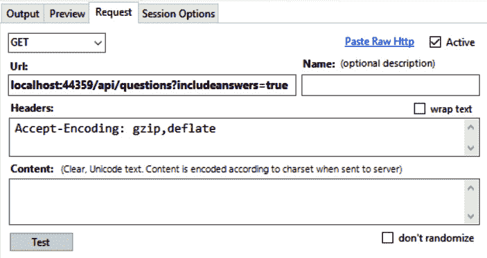

    图 10.3–设置 WebSurge 请求路径

4.  To check that the request is correct, press the **Test** button at the bottom of the right-hand pane. We'll see the response we expect in the **Preview** tab:

    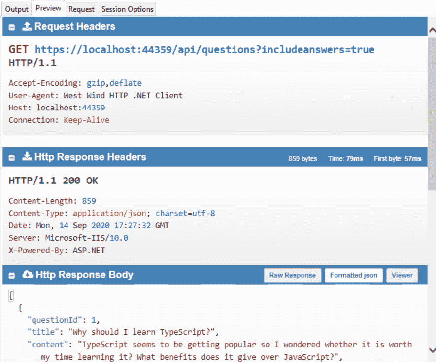

    图 10.4–WebSurge 测试响应

5.  We are nearly ready to do the load test now. Now specify that the test will run for `30` seconds with `5` threads by filling in the relevant boxes under the toolbar:

    

    图 10.5–负载测试持续时间和线程

6.  Run the load test by clicking the **Start** button. We'll immediately see requests being made in the **Output** tab in the right-hand pane:

    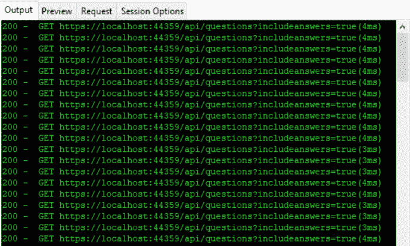

    图 10.6–负载测试输出

7.  When the test has finished, we'll see the test results in the **Output** tab in the right-hand pane:

    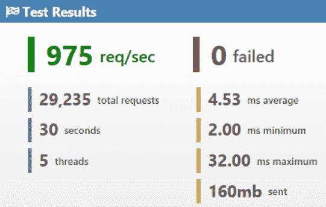

    图 10.7–负载测试结果

    因此，我们通过这个获取带答案的问题的实现，设法每秒获取**975**个请求。显然，你得到的结果会有所不同。

8.  按*Shift*+*F5*停止ASP.NET 应用运行，这样您就可以使实现更高效。

记下结果，我们将使用这些结果与解决 N+1 问题的实现进行比较。

## 使用简洁的多重映射解决 N+1 问题

如果我们可以在一个数据库查询中获得问题和答案，然后将这些数据映射到我们的数据存储库中所需的层次结构，这不是很好吗？好的，这正是我们可以用 Dapper 中名为**多重映射**的功能所做的。让我们看看如何使用它。遵循以下步骤：

1.  In the data repository, let's change the implementation of the `GetQuestionsWithAnswers` method to call a single stored procedure:

    ```cs
    public IEnumerable<QuestionGetManyResponse> 
      GetQuestionsWithAnswers()
    {
      using (var connection = new 
       SqlConnection(_connectionString))
      {
        connection.Open();
        return connection.Query<QuestionGetManyResponse>(
     "EXEC dbo.Question_GetMany_WithAnswers");
      }
    }
    ```

    这是一个很好的开始，但是存储过程返回表格式的数据，我们需要将其映射到`QuestionGetManyResponse`模型中的问答层次结构：

    

    图 10.8–存储过程中的表格数据

    这就是 Dapper 的多重映射功能派上用场的地方。

2.  Change the implementation to the following:

    ```cs
    public IEnumerable<QuestionGetManyResponse> GetQuestionsWithAnswers()
    {
      using (var connection = new 
       SqlConnection(_connectionString))
      {
        connection.Open();
        var questionDictionary = 
     new Dictionary<int, QuestionGetManyResponse>();
     return connection
     .Query<
     QuestionGetManyResponse, 
     AnswerGetResponse, 
     QuestionGetManyResponse>(
     "EXEC dbo.Question_GetMany_WithAnswers",
     map: (q, a) =>
     {
     QuestionGetManyResponse question;
     if (!questionDictionary.TryGetValue
     (q.QuestionId, out question))
     {
     question = q;
     question.Answers = 
     new List<AnswerGetResponse>();
     questionDictionary.Add(question.
     QuestionId, question);
     }
     question.Answers.Add(a);
     return question;
     },
     splitOn: "QuestionId"
     )
     .Distinct()
     .ToList();
      }
    }
    ```

    在 Dapper`Query`方法中，我们提供了一个 Lambda 函数，帮助 Dapper 映射每个问题。该函数接受 Dapper 从存储过程结果映射的问题和答案，并将其映射到所需的结构。我们使用一个名为`questionDictionary`的`Dictionary`来跟踪我们已经创建的问题，以便可以为新问题的答案创建一个`new List<AnswerGetResponse>`实例。

    我们通过`Query`方法中的前两个通用参数`QuestionGetManyResponse`和`AnswerGetResponse`告诉Dapper 要映射到哪些模型，但是 Dapper 如何知道哪些字段已从存储过程映射到模型中的哪些属性？答案是，我们使用`splitOn`参数告诉 Dapper，`QuestionId`之前的所有内容进入`QuestionGetManyResponse`模型，之后的所有内容，包括`QuestionId`进入`AnswerGetResponse`模型。

    我们告诉 Dapper 最终结果应该与`Query`方法中的最后一个泛型参数对应的模型，在本例中为`QuestionGetManyResponse`。

    我们使用`Distinct`方法对从 Dapper 获得的结果进行删除重复问题，然后使用`ToList`方法将结果转换为列表。

3.  修改后的实现完成后，让我们按*F5 运行应用。*
4.  在 WebSurge 中，单击**开始**按钮，运行与之前相同的负载测试。30 秒后，我们将看到结果：

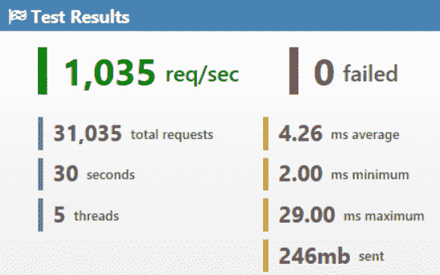

图 10.9–负载测试结果

这一次，我们的 RESTAPI 设法每秒接收**1035**个请求，这比以前稍微好一点。

因此，Dapper 的多重映射功能可以用来解决的 N+1 问题，并且通常可以获得更好的性能。但是，我们确实需要小心使用这种方法，因为由于重复的父记录，我们正在从数据库请求大量数据。在 web 服务器中处理大量数据可能效率低下，并导致垃圾收集过程的减速。

## 使用 Dapper 的多结果功能

Dapper 中还有一个功能可以帮助我们减少数据库往返量，称为**多结果**。我们将使用此功能来提高端点的性能，该端点只会得到一个问题，目前正在进行两个数据库调用。为此，请执行以下步骤：

1.  First, let's load test the current implementation by using WebSurge. Select the **Session** tab, highlight the first request in the list, and click the **Edit** option:

    

    图 10.10–编辑请求的选项

2.  Enter a path to a single question in the **Request** tab as in the following screenshot:

    

    图 10.11–单个问题的路径

3.  We'll leave the duration of the test at **30** seconds with **5** threads. Press the **Start** option to run the load test. When the test has finished, we'll get our results:

    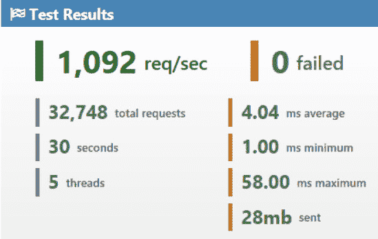

    图 10.12–负载测试结果获得问题

    因此，当前的实现每秒可以接受**1092 个**请求。

4.  现在，停止应用运行并开始修改实现，在`DataRepository.cs`中的其他`using`语句之后添加以下`using`语句：

    ```cs
    using static Dapper.SqlMapper;
    ```

5.  Now, we can change the implementation of `QuestionGetSingleResponse` to the following:

    ```cs
    public QuestionGetSingleResponse GetQuestion(int questionId)
    {
      using (var connection = new 
        SqlConnection(_connectionString))
      {
        connection.Open();
        using (GridReader results = 
     connection.QueryMultiple(
     @"EXEC dbo.Question_GetSingle 
     @QuestionId = @QuestionId; 
     EXEC dbo.Answer_Get_ByQuestionId 
     @QuestionId = @QuestionId",
     new { QuestionId = questionId }
     )
     )
     {
     var question = results.Read<
     QuestionGetSingleResponse>().FirstOrDefault();
     if (question != null)
     {
     question.Answers = 
     results.Read<AnswerGetResponse>().ToList();
     }
     return question;
     }
      }
    }
    ```

    我们使用 Dapper 中的`QueryMultiple`方法在一个数据库往返中执行两个存储过程。结果被添加到一个`results`变量中，通过在泛型参数中传递适当的类型，可以使用`Read`方法检索结果。

6.  让我们在 Visual Studio中再次启动应用，并执行相同的负载测试：

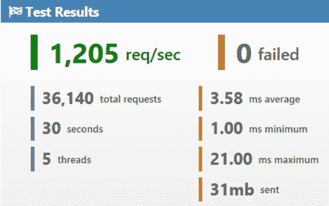

图 10.13–获得问题负载测试–改进的结果

我们改进的 API 现在可以每秒处理 1205 个请求。

在本节中，我们学习了如何使用 Dapper 中的多重映射功能在一次往返中获取父子数据。我们还学习了如何使用 Dapper 中的多结果功能在一次往返中执行多个查询。我们还学习了如何使用 WebSurge 加载测试 RESTAPI 端点。

正如我们在多重映射示例中提到的，处理大量数据可能会有问题。我们如何减少从数据库读取的数据量和在 web 服务器上处理的数据量？我们将在下一节中找到答案。

# 寻呼数据

在本节中，我们将强制`questions`端点的使用者在使用`search`查询参数执行请求时指定数据的*页面*。因此，我们将只返回部分数据，而不是全部数据。

**分页**有助于的性能和可扩展性，具体表现在以下几个方面：

*   SQL Server 获取数据时，页面读取 I/O 的数量会减少。
*   减少了从数据库服务器传输到 web 服务器的数据量。
*   在我们的模型中，用于在 web 服务器上存储数据的内存量减少了。
*   从 web 服务器传输到客户端的数据量减少了。

这一切加起来可能会产生重大的积极影响，特别是对于大型数据收集而言。

我们将从负载测试`questions`端点的当前实现开始本节。然后，我们将实现分页，并查看这对负载测试的影响。

## 负荷测试增加试题

让我们执行以下步骤，向我们的数据库中添加大量问题。这将使我们能够看到数据分页的影响：

1.  我们打开 SQL Server Management Studio，右键点击**对象浏览器**中的**QandA**数据库，选择**新建查询**。
2.  In the query window that opens, add the following command:

    ```cs
    EXEC Question_AddForLoadTest
    ```

    这将执行一个存储过程，该过程将向我们的数据库添加 10000 个问题。

3.  按*F5*运行存储过程，需要几秒钟才能完成。

现在我们有了问题，让我们测试一下当前的实现。

## 负载测试当前实现

在实现数据分页之前，让我们看看当前的实现在负载下是如何执行的。要检查并验证，请执行以下步骤：

1.  让我们在 VisualStudio 中按*F5*启动 RESTAPI，如果它还没有运行。
2.  现在，我们可以使用 WebSurge 对当前实现进行负载测试。让我们将请求 URL 路径设置为`/api/questions?search=question`，并使用 5 个线程保持 30 秒的持续时间。
3.  Before running the load test, check that the request works okay by clicking the **Test** option. We may get an error in the response body like the following one:

    

    图 10.14–响应主体错误

    将**会话选项**选项卡上的**MaxResponseSize**设置更改为`0`即可解决此错误：

    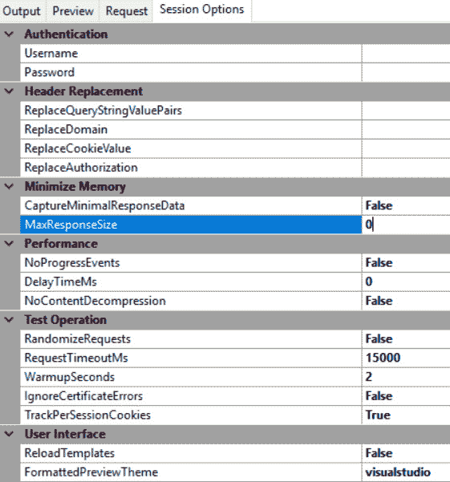

    图 10.15–删除最大响应大小

4.  Start the test. When the test has finished, we'll get our results as follows:

    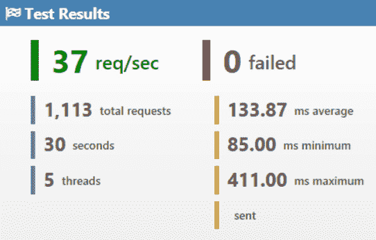

    图 10.16-搜索问题负载测试结果

5.  停止 RESTAPI 的运行。

因此，每秒要拍的请求值为**37**。

实现数据分页

现在，让我们使用`search`查询参数修改对`questions`端点的实现，以便使用数据分页。为了实现这一点，让我们完成以下步骤：

1.  Let's start by adding a new method that will search using paging in our data repository interface. Add the highlighted method interface after `GetQuestionsBySearch` in `IDataRepository.cs`:

    ```cs
    public interface IDataRepository
    {
      ...
      IEnumerable<QuestionGetManyResponse> 
        GetQuestionsBySearch(string search);
      IEnumerable<QuestionGetManyResponse> 
     GetQuestionsBySearchWithPaging(
     string search, 
     int pageNumber, 
     int pageSize);
      ...
    }
    ```

    因此，该方法将以页码和大小作为参数。

2.  Now, we can add the following method implementation in the `DataRepository.cs` file after `GetQuestionsBySearch`:

    ```cs
    public IEnumerable<QuestionGetManyResponse> 
      GetQuestionsBySearchWithPaging(
        string search, 
        int pageNumber, 
        int pageSize
      )
    {
      using (var connection = new SqlConnection(_
        connectionString))
      {
        connection.Open();
        var parameters = new
          { 
            Search = search, 
            PageNumber = pageNumber, 
            PageSize = pageSize 
          };
        return connection.Query<QuestionGetManyResponse>(
          @"EXEC dbo.Question_GetMany_BySearch_WithPaging
            @Search = @Search,
            @PageNumber = @PageNumber,
            @PageSize = @PageSize", parameters
        );
      }
    }
    ```

    因此，我们调用名为`Question_GetMany_BySearch_WithPaging`的存储过程来获取数据的页面，并传入搜索条件、页码和页面大小作为参数。

3.  Let's change the implementation of the `GetQuestions` action method in `QuestionsController.cs` so that we can call the new repository method:

    ```cs
    [HttpGet]
    public IEnumerable<QuestionGetManyResponse> 
      GetQuestions(
        string search, 
        bool includeAnswers, 
     int page = 1, 
     int pageSize = 20
      )
    {
      if (string.IsNullOrEmpty(search))
      {
        if (includeAnswers)
        {
          return 
          _dataRepository.GetQuestionsWithAnswers();
        } 
        else
        {
          return _dataRepository.GetQuestions();
        }
      }
      else
      {
        return 
     _dataRepository.GetQuestionsBySearchWithPaging(
     search, 
     page, 
     pageSize
     );
      }
    }
    ```

    请注意，我们还接受页码和页面大小的查询参数，它们分别默认为 1 和 20。

4.  让我们在 VisualStudio 中按*F5*开始RESTAPI。
5.  现在，我们可以使用 WebSurge 对新实现进行负载测试。使用**5**线程持续**30**秒，然后开始测试。测试完成后，我们将得到结果：

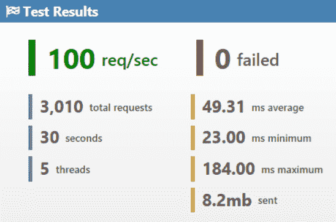

图 10.17-改进的搜索问题负载测试结果

我们得到了我们所希望的性能改进，端点现在能够每秒接收**100**个请求。

总之，我们通过接受端点上的查询参数页码和页面大小来实现数据分页。这些参数被传递给数据库查询，以便它只获取相关的数据页。对于返回数据集合的 API 来说，数据分页非常值得考虑，特别是在数据集合很大的情况下。

在下一节中，我们将讨论异步代码的主题，以及异步代码如何有助于提高可伸缩性。

# 使 API 控制器异步

在本节中，我们将使未回答的问题端点异步，以使其更具可伸缩性。

目前，我们所有的 API 代码都是同步的。对于同步 API 代码，当向 API 发出请求时，线程池中的线程将处理该请求。如果代码同步进行 I/O 调用（如数据库调用），线程将阻塞，直到 I/O 调用完成。被阻塞的线程不能用于任何其他工作，它只是什么也不做，等待 I/O 任务完成。如果在另一个线程被阻塞时向我们的 API 发出其他请求，那么线程池中的不同线程将用于其他请求。下图显示了 ASP.NET 中的同步请求：


图 10.18–同步请求

使用一个线程会有一些开销——一个线程会消耗内存，启动一个新线程需要时间。所以，实际上，我们希望我们的 API 使用尽可能少的线程。

如果 API 以异步方式工作，那么当向我们的 API 发出请求时，线程池中的线程将处理该请求（如同步情况）。如果代码进行异步 I/O 调用，线程将在 I/O 调用开始时返回到线程池，并可用于其他请求。下图显示了 ASP.NET 中的异步请求：

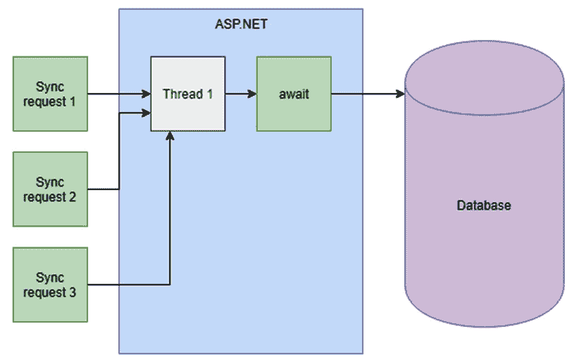

图 10.19–异步请求

因此，如果我们使 API 异步，它将能够更有效地处理请求并提高可伸缩性。需要注意的是，使 API 异步并不会使其性能提高，因为单个请求所需的时间大致相同。我们将要做的改进是使我们的 API 能够更有效地使用服务器的资源。

在本节中，我们将把未回答问题的操作方法转换为异步。我们将分析此转换前后的性能，以发现其影响。我们还将发现异步代码同步进行 I/O 调用时会发生什么。

## 测试当前实现

在我们更改未回答的问题端点之前，让我们测试当前的实现，并收集一些数据与异步实现进行比较。我们将在 VisualStudio 中使用性能分析器和 WebSurge。执行以下步骤：

1.  Start by switching to the **Release** configuration. This can be done by choosing **Release** from the **Solution Configurations** option on the toolbar:

    

    图 10.20–发布配置

    这将使测试更加真实。

2.  Press *Alt* + *F2* to open the Performance Profiler and tick the **.NET Async** tool:

    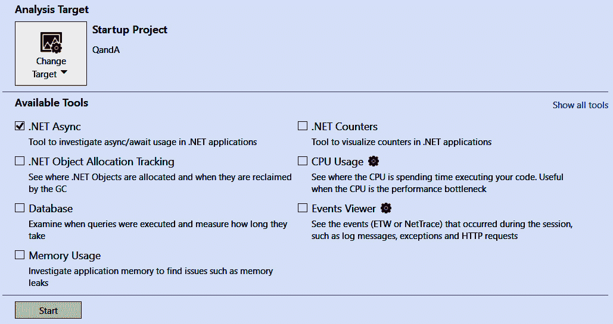

    图 10.21–性能分析器

3.  点击**启动**按钮。
4.  Now, we can simulate some load using WebSurge. Set the request URL path to `/api/questions/unanswered` and set the duration to `10` seconds with `5` threads:

    

    图 10.22–负载测试未回答问题的配置

5.  开始负载测试。
6.  10 秒后，切换到 Visual Studio，点击**性能分析器**中的**停止采集**选项。
7.  After a few seconds, data is presented in a hierarchical grid. Open up the details under the unanswered questions requests. We can see the average time it took to execute this code. Note this down:

    

    图 10.23–未回答问题的同步版本的性能

8.  单击选项卡上的关闭图标关闭报告。
9.  切换回 WebSurge，并在此处记录结果：

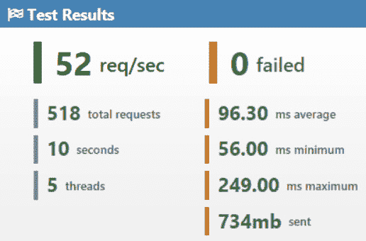

图 10.24–未回答问题同步版本的负载测试结果

因此，我们现在从同步实现未回答问题中获得了一些性能指标。

接下来，我们将发现将此代码更改为异步代码是如何影响性能的。

## 实现异步控制器动作方法

现在，我们将更改未回答问题端点的实现，使其异步：

1.  We are going to start by creating an asynchronous version of the data repository method that gets unanswered questions. So, let's create a new method in the data repository interface underneath `GetUnansweredQuestions` in `IDataRepository.cs`:

    ```cs
    public interface IDataRepository
    {
      ...
      IEnumerable<QuestionGetManyResponse> 
        GetUnansweredQuestions();
      Task<IEnumerable<QuestionGetManyResponse>> 
     GetUnansweredQuestionsAsync();
      ...
    }
    ```

    异步方法的关键区别在于它返回最终将返回的类型的`Task`。

2.  Let's create the data repository method implementation in `DataRepository.cs` underneath `GetUnansweredQuestions`:

    ```cs
    public async Task<IEnumerable<QuestionGetManyResponse>> 
      GetUnansweredQuestionsAsync()
    {
      using (var connection = new 
       SqlConnection(_connectionString))
      {
        await connection.OpenAsync();
        return await 
          connection.QueryAsync<QuestionGetManyResponse>(
            "EXEC dbo.Question_GetUnanswered");
      }
    }
    ```

    返回类型前的`async`关键字表示该方法是异步的。该实现与同步版本非常相似，只是我们使用异步的 Dapper 版本，即打开连接并使用`await`关键字执行查询。

    重要提示

    使代码异步时，调用堆栈中的所有 I/O 调用都必须是异步的。如果任何 I/O 调用都是同步的，那么线程将被阻塞，而不是返回到线程池，因此线程将无法得到有效管理。

3.  Let's change the `GetUnansweredQuestions` method in `QuestionsController.cs` to call the method in the data repository we have just added:

    ```cs
    [HttpGet("unanswered")]
    public async Task<IEnumerable<QuestionGetManyResponse>> 
      GetUnansweredQuestions()
    {
      return await _dataRepository.
        GetUnansweredQuestionsAsync();
    }
    ```

    我们使用`async`关键字将方法标记为异步，并返回最终想要返回的类型`Task`。我们还使用`await`关键字调用数据存储库方法的异步版本。

    我们的未回答问题端点现在是异步的。

4.  按*Alt*+*F2*打开**性能档案器**，确认**.NET 异步**工具仍被勾选。点击**启动**按钮。
5.  切换到 WebSurge，检查请求 URL 路径是否仍然为`/api/questions/unanswered`，持续时间设置为`10`秒和`5`线程。
6.  开始负载测试。
7.  10 秒后，切换到 Visual Studio，点击**性能分析器**中的**停止采集**选项。
8.  After a few seconds, the results will appear:

    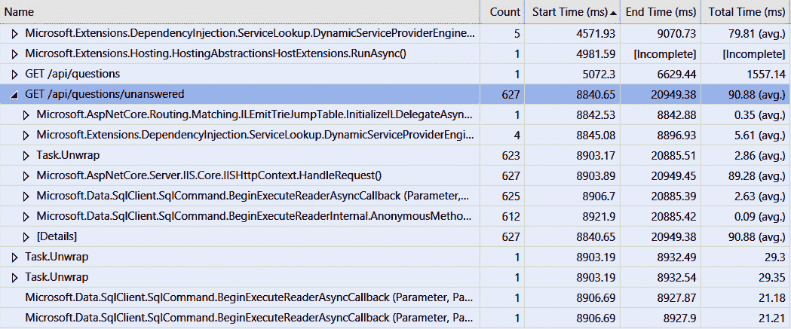

    图 10.25–未回答问题的异步版本的性能

    将结果与同步实现结果进行比较。在我的测试中，异步的稍微快一点。请注意为处理异步代码而发生的额外活动，这会占用一些执行时间。

9.  点击选项卡上的关闭图标关闭报告。
10.  切换回 WebSurge，并在此处记录结果：

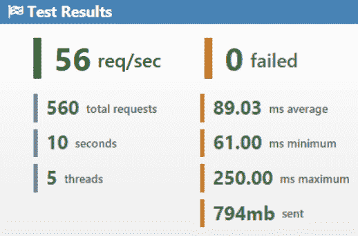

图 10.26–未回答问题异步版本的负载测试结果

结果表明，性能略有提高。事实上，您的结果可能显示性能略有下降。由于处理异步代码所需的开销，异步代码可能比同步代码慢。

异步代码的好处是在负载下更有效地使用 web 服务器的资源。因此，异步 RESTAPI 比同步 RESTAPI 具有更好的可扩展性。

在异步 API 控制器方法中使用同步数据库调用时会发生什么？我们下一步会知道的。

## 混合异步和同步代码

一个容易犯的错误是将异步代码与同步代码混合。让我们通过改变`GetUnansweredQuestions`动作方式来了解发生这种情况时会发生什么：

1.  将此方法更改为调用数据库中`GetUnansweredQuestions`的同步版本：

    ```cs
    [HttpGet("unanswered")]
    public async Task<IEnumerable<QuestionGetManyResponse>> GetUnansweredQuestions()
    {
        return _dataRepository.GetUnansweredQuestions();
    }
    ```

2.  按*Alt*+*F2*打开**性能档案器**，确认**.NET 异步**工具仍被勾选。点击**启动**按钮。
3.  切换到 WebSurge，检查请求 URL 路径是否仍然为`/api/questions/unanswered`，持续时间设置为`10`秒和`5`线程。
4.  开始负载测试。
5.  10 秒后，切换到 Visual Studio，点击**性能分析器**中的**停止采集**选项。
6.  After a few seconds, the results will appear:

    

    图 10.27–同步和异步代码混合时的结果

    即使操作方法是非同步的，代码的功能也如同它是同步代码一样。

7.  点击选项卡上的关闭图标关闭报告。
8.  还原此更改，使`GetUnansweredQuestions`方法如下：

    ```cs
    [HttpGet("unanswered")]
    public async Task<IEnumerable<QuestionGetManyResponse>> GetUnansweredQuestions()
    {
        return await 
     _dataRepository.GetUnansweredQuestionsAsync();
    }
    ```

9.  切换回**调试**配置。这可以通过在工具栏上的**解决方案配置**选项中选择`Debug`来实现：


图 10.28–调试配置

因此，当同步和异步代码混合使用时，它的行为将类似于同步代码，并且线程池的使用效率低下。在异步方法中，重要的是检查所有 I/O 调用是否都是异步的，并且是否包括子方法中的任何 I/O 调用。

在下一节中，我们将研究如何通过缓存数据来优化数据请求。

# 缓存数据

在本节中，我们将缓存获取问题的请求。目前，每个请求都会查询数据库以获取问题。如果我们缓存一个问题，并且可以从缓存中获取后续的问题请求，这应该会更快，并减少数据库的负载。我们将通过负载测试来证明这一点。

## 负载测试当前实现

在我们实现缓存之前，我们将使用以下步骤对获取单个问题的当前实现进行负载测试：

1.  让我们在 VisualStudio 中按*F5*开始 RESTAPI。
2.  现在，我们可以使用 WebSurge 对当前实现进行负载测试。让我们将请求 URL 路径设置为`/api/questions/1`，并使用`5`线程将持续时间更改为`30`秒。
3.  开始测试。测试完成后，我们将得到结果：

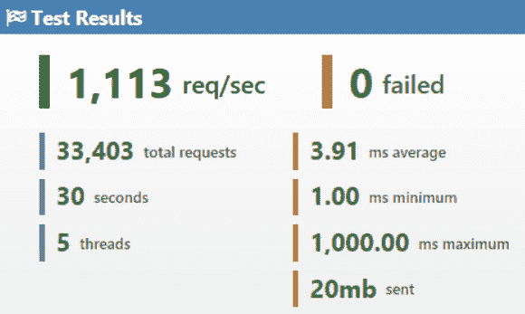

图 10.29–在没有缓存的情况下获取问题–负载测试结果

因此，我们在没有缓存的情况下每秒获得**1113**个请求。

停止 RESTAPI 的运行，以便我们可以实现和使用数据缓存。

## 实现数据缓存

我们将使用 ASP.NET 中的内存缓存实现问题缓存：

1.  First, let's create an interface in the `Data` folder called `IQuestionCache`:

    ```cs
    using QandA.Data.Models;
    namespace QandA.Data
    {
      public interface IQuestionCache
      {
        QuestionGetSingleResponse Get(int questionId);
        void Remove(int questionId);
        void Set(QuestionGetSingleResponse question);
      }
    }
    ```

    因此，我们需要缓存实现具有获取、删除和更新缓存中项目的方法。

2.  Now, we can create a class in the `Data` folder called `QuestionCache`:

    ```cs
    using Microsoft.Extensions.Caching.Memory; 
    using QandA.Data.Models;
    namespace QandA.Data
    {
      public class QuestionCache: IQuestionCache
      {
        // TODO - create a memory cache
        // TODO - method to get a cached question
        // TODO - method to add a cached question
        // TODO - method to remove a cached question
      }
    }
    ```

    请注意，我们引用了`Microsoft.Extensions.Caching.Memory`，以便使用标准 ASP.NET 内存缓存。

3.  Let's create a constructor that creates an instance of the memory cache:

    ```cs
    public class QuestionCache: IQuestionCache
    {
      private MemoryCache _cache { get; set; }
     public QuestionCache()
     {
     _cache = new MemoryCache(new MemoryCacheOptions
     {
     SizeLimit = 100
     });
     }
      // TODO - method to get a cached question
      // TODO - method to add a cached question
      // TODO - method to remove a cached question
    }
    ```

    请注意，我们已将缓存限制设置为`100`项。这是为了限制缓存在 web 服务器上占用的内存量。

4.  Let's implement a method to get a question from the cache:

    ```cs
    public class QuestionCache: IQuestionCache
    {
      ...
      private string GetCacheKey(int questionId) => 
     $"Question-{questionId}";
     public QuestionGetSingleResponse Get(int questionId)
     {
     QuestionGetSingleResponse question;
     _cache.TryGetValue(
     GetCacheKey(questionId), 
     out question);
     return question;
     }
      // TODO - method to add a cached question
      // TODO - method to remove a cached question
    }
    ```

    我们创建了一个表达式，为缓存项提供一个键，这个键是带连字符的单词`Question`，后跟问题 ID。

    我们在内存缓存中使用`TryGetValue`方法来检索缓存的问题。因此，如果问题在缓存中不存在，我们的方法将返回`null`。

5.  Now, we can implement a method to add a question to the cache. We can add an item to the cache using the `Set` method in the ASP.NET memory cache:

    ```cs
    public class QuestionCache: IQuestionCache
    {
      ...
      public void Set(QuestionGetSingleResponse question)
     {
     var cacheEntryOptions = 
     new MemoryCacheEntryOptions().SetSize(1);
     _cache.Set(
     GetCacheKey(question.QuestionId), 
     question, 
     cacheEntryOptions);
     }
      // TODO - method to remove a cached question
    }
    ```

    请注意，在设置缓存值时，我们在选项中指定问题的大小。这与我们在缓存上设置的大小限制相关联，因此当缓存中有 100 个问题时，缓存将开始从缓存中删除问题。

6.  The last method we need to implement is a method to remove questions from the cache:

    ```cs
    public class QuestionCache: IQuestionCache
    {
      ...
      public void Remove(int questionId)
     {
     _cache.Remove(GetCacheKey(questionId));
     }
    }
    ```

    请注意，如果问题在缓存中不存在，则不会发生任何事情，也不会引发异常。

    这就完成了问题缓存的实现。

## 在 API 控制器动作方法中使用数据缓存

现在，我们将使用 API 控制器的`GetQuestion`方法中的问题缓存。完成以下步骤：

1.  First, we need to make the cache available for dependency injection so that we can inject it into `QuestionsController`. So, let's register `QuestionCache` for dependency injection in the `Startup` class after enabling the ASP.NET memory cache:

    ```cs
    public void ConfigureServices(IServiceCollection services)
    {
      ... 
      services.AddMemoryCache();
     services.AddSingleton<IQuestionCache,
     QuestionCache>();
    }
    ```

    我们在依赖注入系统中将我们的缓存注册为单例。这意味着我们的类的一个实例将在应用的生命周期内创建。因此，单独的 HTTP 请求将访问同一个类实例，从而访问相同的缓存数据。这正是我们想要的缓存。

2.  在`QuestionsController.cs`中，我们将缓存注入`QuestionsController`：

    ```cs
    ...
    private readonly IQuestionCache _cache; 
    public QuestionsController(..., IQuestionCache questionCache)
    {
      ...
      _cache = questionCache; 
    }
    ```

3.  Let's change the implementation of `GetQuestion` to the following:

    ```cs
    [HttpGet("{questionId}")]
    public ActionResult<QuestionGetSingleResponse> 
      GetQuestion(int questionId)
    {
      var question = _cache.Get(questionId);
     if (question == null)
     {
        question = 
     _dataRepository.GetQuestion(questionId);
        if (question == null)
        {
            return NotFound();
        }
        _cache.Set(question);
     }
      return question;
    }
    ```

    如果问题不在缓存中，那么我们从数据存储库中获取它并将其放入缓存中。

4.  当问题发生变化时，我们需要将缓存中存在的项目从缓存中删除。这样，问题的后续请求将从数据库中获取更新的问题。将突出显示的代码行添加到`return`语句前面的`PutQuestion`：

    ```cs
    [HttpPut("{questionId}")]
    public ActionResult<QuestionGetSingleResponse> 
      PutQuestion(int questionId, QuestionPutRequest 
       questionPutRequest)
    {
      ...
      _cache.Remove(savedQuestion.QuestionId); 
      return savedQuestion;
    }
    ```

5.  类似地，删除问题时，如果问题存在于缓存中，则需要将其从缓存中删除。将突出显示的代码行添加到`return`语句前面的`DeleteQuestion`：

    ```cs
    HttpDelete("{questionId}")]
    public ActionResult DeleteQuestion(int questionId)
    {
      ...
      _cache.Remove(questionId); 
      return NoContent();
    }
    ```

6.  我们还需要在发布答案时从缓存中删除问题。将突出显示的代码行添加到`return`语句前面的`PostAnswer`：

    ```cs
    [HttpPost("answer")]
    public ActionResult<AnswerGetResponse> 
      PostAnswer(AnswerPostRequest answerPostRequest)
    {
      ...
      _cache.Remove(answerPostRequest.QuestionId.Value); 
      return savedAnswer;
    }
    ```

7.  让我们在 VisualStudio 中按*F5*开始 RESTAPI。
8.  让我们使用改进的实现再次对`/api/questions/1`端点进行负载测试，将持续时间保持在 30 秒，线程数保持在 5。
9.  When the test has finished, we'll get our results, confirming the improvement:

    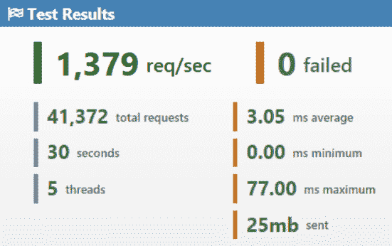

    图 10.30–获取有关缓存负载测试结果的问题

10.  在 VisualStudio 中按*Shift*+*F5 停止 REST API。*

这就完成了带数据缓存的问题端点的实现。

重要的是要记住在数据更改时使缓存无效。在我们的示例中，这很简单，但可能更复杂，特别是在 RESTAPI 之外有其他进程更改数据的情况下。因此，如果我们不能完全控制 RESTAPI 中的数据更改，那么缓存可能不值得实现。

是否使用缓存的另一个考虑因素是数据是否经常更改。在这种情况下，缓存过程实际上会对性能产生负面影响，因为大量的请求无论如何都会导致数据库调用，而且我们有管理缓存的所有开销。

但是，如果端点后面的数据很少更改，并且我们可以控制这些更改，那么缓存是积极影响性能的好方法。

如果 RESTAPI 分布在多个服务器上会怎么样？嗯，因为内存缓存是每个 web 服务器的本地缓存，这可能会导致数据库调用，其中数据缓存在不同的服务器上。一个解决方案是在 ASP.NET 中使用`IDistributedCache`实现分布式缓存，它的实现与我们的内存缓存非常相似。复杂的是，这需要连接到第三方缓存如 Redis，这增加了财务成本和解决方案的复杂性。不过，对于高流量 RESTAPI，分布式缓存非常值得考虑。

# 总结

在本章中，我们了解到可以使用 Dapper 的多映射和多结果特性来减少数据库往返，从而对性能产生积极影响，并允许 RESTAPI 每秒接受更多请求。我们还了解到，强制客户机翻阅他们需要使用的数据也有助于提高性能。

我们学习了如何使控制器操作方法异步，以及这如何对 ASP.NET 中构建的 REST API 的可伸缩性产生积极影响。我们还了解到，一个方法及其子方法中的所有 I/O 调用都需要是异步的，以实现可伸缩性优势。

我们还学习了如何在内存中缓存数据，以减少昂贵的数据库调用次数。我们知道，经常读取且很少更改的数据是使用缓存的好例子。

在下一章中，我们将继续关注 RESTAPI，并将注意力转向安全性主题。我们将要求用户进行身份验证，以便使用 RESTAPI 访问某些端点。

# 问题

尝试回答以下问题，以检查您在本章中获得的知识：

1.  We have the following code in a data repository that uses Dapper's multi-results feature to return a single order with the many related detail lines in a single database call:

    ```cs
    using (var connection = new SqlConnection(_connectionString))
    {
      connection.Open();

      using (GridReader results = connection.QueryMultiple(
        @"EXEC dbo.Order_GetHeader @OrderId = @OrderId; 
        EXEC dbo.OrderDetails_Get_ByOrderId @OrderId =
         @OrderId",
        new { OrderId = orderId }))
      {
        // TODO - Read the order and details from the 
          // query result
        return order;
      }
    }
    ```

    哪些遗漏的语句将从结果中读取订单及其详细信息，并将详细信息放入订单模型中？订单模型为`OrderGetSingleResponse`类型，包含`IEnumerable<OrderDetailGetResponse>`类型的`Details`属性。

2.  在一次数据库调用中从多对一的相关表中读取数据时，使用 Dapper 的多重映射功能的缺点是什么？
3.  数据分页如何帮助提高性能？
4.  使代码异步会使它更快吗？
5.  以下异步方法有什么问题？

    ```cs
    public async AnswerGetResponse GetAnswer(int answerId)
    {
      using (var connection = new SqlConnection(_connectionString))
      {
        connection.Open();
        return await connection
          .QueryFirstOrDefaultAsync<AnswerGetResponse>(
            "EXEC dbo.Answer_Get_ByAnswerId @AnswerId = 
             @AnswerId", 
            new { AnswerId = answerId });
      }
    }
    ```

6.  为什么对内存缓存设置大小限制是个好主意？
7.  在我们的`QuestionCache`实现中，当向缓存添加问题时，如何在 30 分钟后使缓存中的该项无效？
8.  当我们注册`QuestionCache`类进行依赖注入时，为什么要使用`AddSingleton`方法而不是下面代码中的`AddScoped`方法？

    ```cs
    services.AddScoped<QuestionCache>();
    ```

# 答案

1.  我们可以添加以下突出显示的代码行，以从结果中读取订单及其详细信息：

    ```cs
    using (var connection = new SqlConnection(_connectionString))
    {
      connection.Open();

      using (GridReader results = connection.QueryMultiple(
        @"EXEC dbo.Order_GetHeader @OrderId = @OrderId; 
        EXEC dbo.OrderDetails_Get_ByOrderId @OrderId = @OrderId",
        new { OrderId = orderId }))
      {
        var order = results.Read<
     OrderGetSingleResponse>().FirstOrDefault();
     if (order != null)
     {
     order.Details = results.Read<
     OrderDetailGetResponse>().ToList();
     }
        return order;
      }
    }
    ```

2.  使用 Dapper 的多重映射功能的代价是，更多的数据在数据库和 web 服务器之间传输，然后在 web 服务器上处理，这可能会影响性能。
3.  Paging increases performance in the following ways:

    a） SQL Server 获取数据时，页面读取 I/O 的数量会减少。

    b） 从数据库服务器传输到 web 服务器的数据量减少了。

    c） 在我们的模型中，用于在 web 服务器上存储数据的内存量减少了。

    d） 从 web 服务器传输到客户端的数据量减少了。

4.  异步代码并不比同步代码快。相反，它通过更有效地使用线程池使其更具可伸缩性。
5.  The problem with the asynchronous method implementation is that opening the connection is synchronous. This means the thread is blocked and not returned to the thread pool until the connection is opened. So, the whole code will have the same thread pool inefficiency as synchronous code but will have the overhead of asynchronous code as well.

    以下是正确的实现：

    ```cs
    public async AnswerGetResponse GetAnswer(int answerId)
    {
      using (var connection = new SqlConnection(_connectionString))
      {
        await connection.OpenAsync();
        return await connection
          .QueryFirstOrDefaultAsync<AnswerGetResponse>(
            "EXEC dbo.Answer_Get_ByAnswerId @AnswerId = @AnswerId", 
            new { AnswerId = answerId });
      }
    }
    ```

6.  最好对内存缓存设置大小限制，以防止缓存占用 web 服务器上过多的内存。
7.  我们可以在`30`分钟后执行以下操作使缓存中的项无效：

    ```cs
    public void Set(QuestionGetSingleResponse question)
    {
      var cacheEntryOptions = 
        new MemoryCacheEntryOptions()
        .SetSize(1)
     .SetSlidingExpiration(TimeSpan.FromMinutes(30));
      _cache.Set(GetCacheKey(question.QuestionId),
         question, cacheEntryOptions);
    }
    ```

8.  我们向`AddSingleton`注册了`QuestionCache`类以进行依赖项注入，这样缓存将在应用的生命周期内持续。使用`AddScoped`会为每个请求创建一个新的缓存实例，这意味着每个请求后缓存都会丢失。

# 进一步阅读

如果您想了解有关本章所涵盖主题的更多信息，请访问以下有用的链接：

*   **简洁的多重映射**：[https://dapper-tutorial.net/result-multi-mapping](https://dapper-tutorial.net/result-multi-mapping)
*   **简洁的多结果**：[https://dapper-tutorial.net/result-multi-result](https://dapper-tutorial.net/result-multi-result)
*   **与**`async`**和**`await`[异步编程 https://docs.microsoft.com/en-us/dotnet/csharp/programming-guide/concepts/async/](https://docs.microsoft.com/en-us/dotnet/csharp/programming-guide/concepts/async/)
*   **ASP.NET 内存缓存**：[https://docs.microsoft.com/en-us/aspnet/core/performance/caching/memory](https://docs.microsoft.com/en-us/aspnet/core/performance/caching/memory)
*   **ASP.NET 分布式缓存**：[https://docs.microsoft.com/en-us/aspnet/core/performance/caching/distributed](https://docs.microsoft.com/en-us/aspnet/core/performance/caching/distributed)