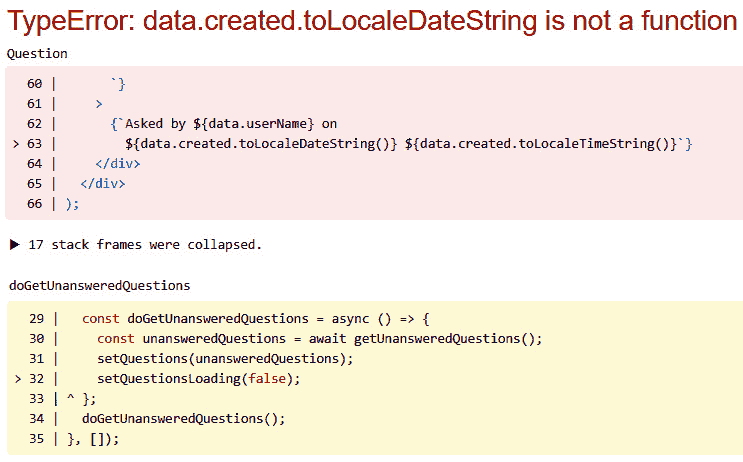
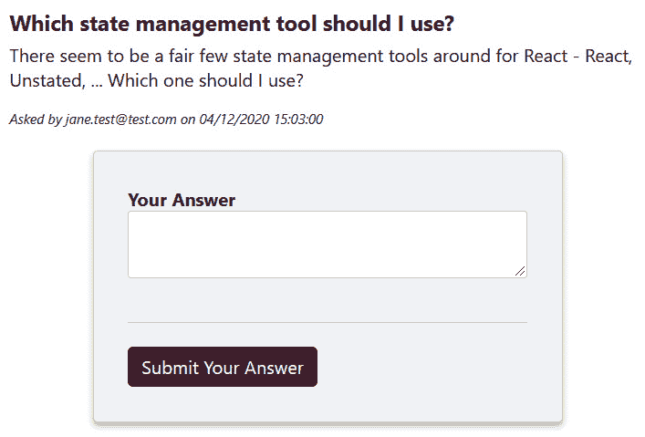
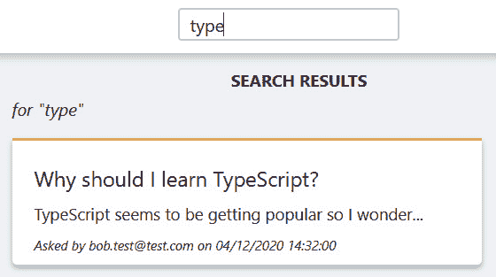
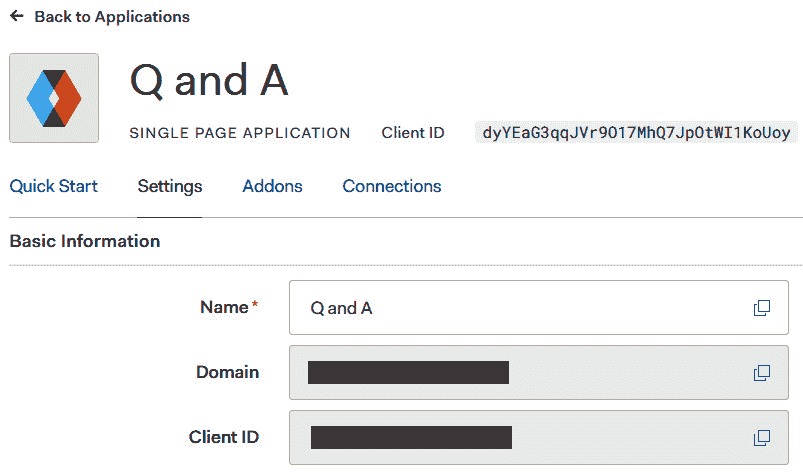
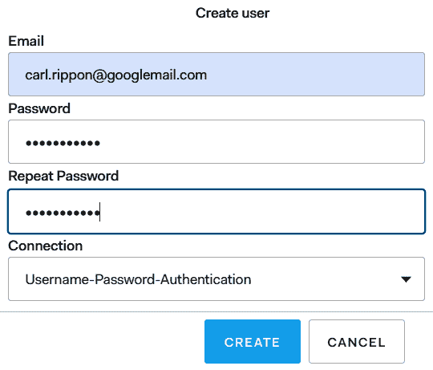
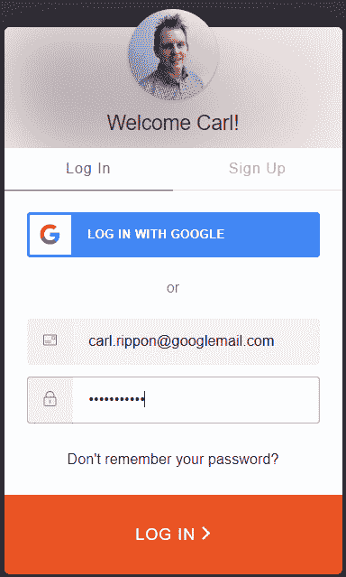
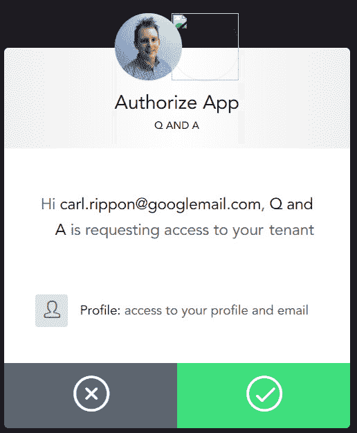
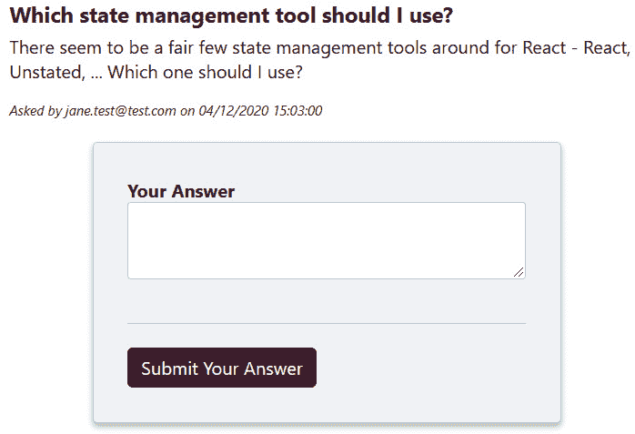

# 十二、与 RESTful API 交互

完成 RESTAPI 后，现在是在 React 前端应用中与之交互的时候了。首先，我们将使用浏览器的`fetch`功能与未经验证的端点进行交互，以获取问题。我们将处理用户在获取数据之前离开页面的情况，以防止状态错误。

我们将利用上一章中设置的 Auth0 租户安全地让用户登录和退出我们的应用。然后，我们将使用 Auth0 中的访问令牌访问受保护的端点。我们还将确保经过身份验证的用户只能看到他们有权执行的选项。

到本章结束时，我们的前端将与后端充分、安全、可靠地交互。

在本章中，我们将介绍以下主题：

*   使用`fetch`与未经验证的 REST API 端点交互
*   从前端与 Auth0 交互
*   控制已验证的选项
*   使用`fetch`与经过身份验证的 REST API 端点交互
*   中止数据提取

# 技术要求

在本章中，我们将使用以下工具和服务：

*   **Visual Studio 代码**：我们将使用它来编辑我们的 React 代码。可从[下载并安装 https://code.visualstudio.com/](https://code.visualstudio.com/) 。
*   **Node.js 和 npm**：可从[下载 https://nodejs.org/](https://nodejs.org/) 。如果已经安装了这些，请确保 Node.js 至少是版本 8.2，`npm`至少是版本 5.2。
*   **Visual Studio 2019**：我们将使用它来运行我们的 ASP.NET Core代码后端。可从[下载并安装 https://visualstudio.microsoft.com/vs/](https://visualstudio.microsoft.com/vs/) 。
*   **.NET 5**：可从[下载 https://dotnet.microsoft.com/download/dotnet/5.0](https://dotnet.microsoft.com/download/dotnet/5.0) 。
*   **Auth0**：我们将使用上一章设置的租户对用户进行身份验证和管理。
*   **Q 和 A**：我们将从 Q 和一个前端项目开始，该项目将在[的 GitHub 上提供 https://github.com/PacktPublishing/ASP.NET-Core-5-and-React-Second-Edition `chapter-12/start`文件夹中的](https://github.com/PacktPublishing/ASP.NET-Core-5-and-React-Second-Edition)。从这个项目开始，这一章中的所有代码都能正常工作，这一点很重要。

本章中的所有代码片段可在网上[找到 https://github.com/PacktPublishing/ASP.NET-Core-5-and-React-Second-Edition](https://github.com/PacktPublishing/ASP.NET-Core-5-and-React-Second-Edition) 。要从章节还原代码，可以下载源代码存储库，并在相关编辑器中打开相关文件夹。如果代码为前端代码，则可在终端中输入`npm install`恢复依赖关系。

查看以下视频以查看代码的运行：[https://bit.ly/37CQqNx](https://bit.ly/37CQqNx)

# 使用 fetch 与未经验证的 REST API 端点交互

在部分中，我们将使用本机`fetch`函数从真正的 REST API 中获取未回答的问题。然后，我们将在`fetch`上使用包装器函数，以使与后端的交互更加容易。这种方法还将集中与 RESTAPI 交互的代码，当我们想要对其进行改进时，这是有益的。然后我们将继续使用真正的 REST API 来获取单个问题并搜索问题。

## 从 REST API 获取未回答的问题

当显示未回答问题列表时，我们将开始与主页上的 REST API 交互。`HomePage`组件实际上不会改变，但`QuestionsData.ts`中的`getUnansweredQuestions`功能会改变。在`getUnansweredQuestions`中，我们将利用本机浏览器`fetch`功能与 REST API 交互。如果您还没有，让我们打开 VisualStudio 代码并执行以下步骤。

打开`QuestionsData.ts`，找到`getUnansweredQuestions`功能，将实现替换为以下内容：

```cs
export const getUnansweredQuestions = async (): Promise<
  QuestionData[]
> => {
  let unansweredQuestions: QuestionData[] = [];
 // TODO - call api/questions/unanswered
 // TODO - put response body in unansweredQuestions

 return unansweredQuestions;
};
```

该函数采用与以前完全相同的参数并返回相同的类型，因此使用该函数的组件不应受到我们即将进行的更改的影响。按照此处给出的步骤进行操作：

1.  Let's call `fetch` to request unanswered questions from our backend:

    ```cs
    export const getUnansweredQuestions = async (): Promise<
      QuestionData[]
    > => {
      let unansweredQuestions: QuestionData[] = [];
     const response = await fetch(
     'http://localhost:17525/api/questions/unanswered'
     )
      // TODO - put response body in unansweredQuestions

      return unansweredQuestions;
    };
    ```

    因此，对于`GET`请求，我们只需将请求的路径放在`fetch`参数中。如果您的 REST API 运行在不同的端口上，那么不要忘记更改路径，以便它调用您的 REST API。

    注意`fetch`调用之前的`await`关键字。这是因为它是一个异步函数，我们希望在执行下一条语句之前，等待它的承诺得到解决。

    我们已经为从`fetch`函数返回的 HTTP 响应对象分配了一个`response`变量。以下是我们可以与之交互的`response`对象的一些有用属性：

    *   `ok`：响应是否成功（即 HTTP 状态码是否在 200-299 范围内）
    *   `status`：响应的 HTTP 状态码
    *   `headers`：允许访问 HTTP 响应中的头的对象
2.  响应对象上还有一个名为`json`的方法。这可用于请求已解析的 JSON 主体。将调用下面突出显示的行添加到`fetch`函数：

    ```cs
    export const getUnansweredQuestions = async (): Promise<
      QuestionData[]
    > => {
      let unansweredQuestions: QuestionData[] = [];
      const response = await fetch(
        "http://localhost:17525/api/questions/unanswered"
      );
      unansweredQuestions = await response.json();
      return unansweredQuestions;
    };
    ```

3.  Before we give this a try, open the backend project in Visual Studio and substitute the Auth0 tenant ID into the `Authority` setting in `appsettings.json`.

    在上一章中，我们已经发现了在哪里可以找到 Auth0 租户，但作为提醒，它位于用户头像的左侧：

    

    图 12.1–Auth0 租户 ID

4.  按*F5*启动后端运行。我们将在本章的整个章节中继续运行。
5.  Back in Visual Studio Code, start our frontend by typing `npm start` in the Terminal. When the app runs, we get the following error:

    

    图 12.2–问题创建日期错误

    这里的问题是，`created`属性被反序列化为字符串，而不是`Question`组件所期望的`Date`对象。

6.  Let's resolve this by mapping the `created` property to a `Date` object in the `return` statement:

    ```cs
    export const getUnansweredQuestions = async (): Promise<
      QuestionData[]
    > => {
      let unansweredQuestions: QuestionData[] = [];
      const response = await fetch(
        'http://localhost:17525/api/questions/unanswered',
      );
      unansweredQuestions = await response.json();
      return unansweredQuestions.map((question) => ({
     ...question,
     created: new Date(question.created),
     }));
    };
    ```

    我们使用数组`map`函数迭代所有问题，返回原始问题的副本（使用扩展语法），然后从`string`日期开始用`Date`对象覆盖`created`属性。

7.  如果我们保存文件并查看正在运行的应用，我们将看到未回答的问题正确输出：


图 12.3：未回答的问题正确输出

好东西！我们的 React 应用现在正在与 REST API 交互！

## 提取出一个通用 HTTP 函数

我们需要在每个需要与 RESTAPI 交互的函数中使用`fetch`函数。因此，我们将创建一个通用的`http`函数，用于发出所有 HTTP 请求。这将很好地集中调用 RESTAPI 的代码。让我们执行以下步骤：

1.  Create a new file called `http.ts` with the following content:

    ```cs
    import { webAPIUrl } from './AppSettings';
    export interface HttpRequest<REQB> {
      path: string;
    }
    export interface HttpResponse<RESB> {
      ok: boolean;
      body?: RESB;
    }
    ```

    我们已经开始从`AppSettings.ts`导入根路径到 RESTAPI，这是在我们的初学者项目中设置的。`AppSettings.ts`文件是我们构建所有不同路径的地方，这些路径在开发和生产之间会有所不同。确保`webAPIUrl`包含 REST API 的正确路径。

    我们还为请求和响应定义了接口。请注意，接口包含请求和响应中主体类型的通用参数。

2.  Let's use these interfaces to implement a generic `http` function that we'll use to make HTTP requests:

    ```cs
    export const http = async <
      RESB,
      REQB = undefined
    >(
      config: HttpRequest<REQB>,
    ): Promise<HttpResponse<RESB>> => {
    };
    ```

    我们已经将请求主体的类型默认为`undefined`，因此函数的使用者不需要传递它。

3.  Use `fetch` to invoke the request:

    ```cs
    export const http = async <
      RESB,
      REQB = undefined
    >(
      config: HttpRequest<REQB>,
    ): Promise<HttpResponse<RESB>> => {
      const request = new Request(
     `${webAPIUrl}${config.path}`
     );
     const response = await fetch(request);
    };
    ```

    请注意，我们创建了一个`Request`对象的新实例，并将其传递到`fetch`，而不仅仅是将请求路径传递到`fetch`。这将在本章后面的部分中非常有用，因为我们为不同的 HTTP 方法和身份验证扩展了此功能。

4.  我们通过检查`response`对象

    ```cs
    export const http = async <
      RESB,
      REQB = undefined
    >( 
      config: HttpRequest<REQB>,
    ): Promise<HttpResponse<RESB>> => {
      const request = new Request(
        `${webAPIUrl}${config.path}`,
      );
      const response = await fetch(request);
      if (response.ok) {
     } else { 
     }
    };
    ```

    中的`ok`属性来检查请求是否成功
5.  如果请求成功，我们可以使用响应对象

    ```cs
    export const http = async <
      RESB,
      REQB = undefined
    >(
      config: HttpRequest<REQB>,
    ): Promise<HttpResponse<RESB>> => {
      const request = new Request(
        `${webAPIUrl}${config.path}`,
      );
      const response = await fetch(request);
      if (response.ok) {
        const body = await response.json();
      } else {
      }
    };
    ```

    中的`json`方法获取主体
6.  Return the response object with its parsed body for a successful request and just the response object for an unsuccessful request:

    ```cs
    export const http = async <
      RESB,
      REQB = undefined
    >(
      config: HttpRequest<REQB>,
    ): Promise<HttpResponse<RESB>> => {
      const request = new Request(
        `${webAPIUrl}${config.path}`,
      );
      const response = await fetch(request);
      if (response.ok) {
        const body = await response.json();
        return { ok: response.ok, body };
      } else {
        return { ok: response.ok };
      }
    };
    ```

    如果响应不成功，我们将记录 HTTP 错误。

7.  让我们调用一个名为`logError`的函数来实现这一点，我们将在下一步中实现它。在返回不成功响应之前进行函数调用，并将`request`和`response`对象传递给它：

    ```cs
    export const http = async <
      RESB,
      REQB = undefined
    >(
      config: HttpRequest<REQB>,
    ): Promise<HttpResponse<RESB>> => {
      const request = new Request(
        `${webAPIUrl}${config.path}`,
      );
      const response = await fetch(request);
      if (response.ok) {
        const body = await response.json();
        return { ok: response.ok, body };
      } else {
        logError(request, response);
        return { ok: response.ok };
      }
    };
    ```

8.  Add the following `logError` function below the `http` function:

    ```cs
    const logError = async (
      request: Request,
      response: Response,
    ) => {
      const contentType = response.headers.get(
        'content-type',
      );
      let body: any;
      if (
        contentType &&
        contentType.indexOf('application/json') !== -1
      ) {
        body = await response.json();
      } else {
        body = await response.text();
      }
      console.error(
        `Error requesting ${request.method}  
         ${request.url}`,
        body,
      );
    };
    ```

    函数检查响应是否为 JSON 格式，如果是，则调用响应对象上的`json`方法获取 JSON 正文。如果响应不是 JSON 格式，则使用响应对象上的`text`方法检索主体。然后，响应主体连同 HTTP 请求方法和路径一起输出到控制台。

9.  回到`QuestionData.ts`并利用我们刚刚在`getUnansweredQuestions`中实现的`http`功能。首先，我们需要导入它：

    ```cs
    import { http } from './http';
    ```

10.  We can now refactor `getUnansweredQuestions`:

    ```cs
    export const getUnansweredQuestions = async (): Promise<
      QuestionData[]
    > => {
      const result = await http<
     QuestionDataFromServer[]
     >({
     path: '/questions/unanswered',
     });
     if (result.ok && result.body) {
     return result.body.map(mapQuestionFromServer);
     } else {
     return [];
     }
    };
    ```

    我们将`QuestionDataFromServer[]`作为预期的`response`传递到`http`函数作为预期的响应主体类型。`QuestionDataFromServer`是添加到本章初学者项目中的一个接口，`created`日期是一个字符串，与 REST API 的到达方式完全相同。

    如果有响应主体，我们使用映射函数返回解析后的响应主体，并将`created`属性设置为正确的日期。否则，我们返回一个空数组。本章的起始项目中增加了`mapQuestionFromServer`映射功能。

    这将在保存这些更改时呈现未回答的问题，就像以前一样：


图 12.4–未回答的问题正确输出

我们修改后的`getUnansweredQuestions`实现要好一点，因为 REST API 的根路径没有在其中硬编码，我们处理 HTTP 错误的能力也更好。在本章中，我们将继续使用并扩展我们的通用`http`函数。

## 从 REST API 获取问题

在本小节中，我们将重构现有的`getQuestion`函数，使用`http`函数从 RESTAPI 中获取一个问题。在`QuestionsData.ts`中执行以下步骤：

1.  我们将首先清除当前的实现，如下所示：

    ```cs
    export const getQuestion = async (
      questionId: number,
    ): Promise<QuestionData | null> => {
    };
    ```

2.  让我们发出 HTTP 请求以获取问题：

    ```cs
    export const getQuestion = async (
      questionId: number,
    ): Promise<QuestionData | null> => {
      const result = await http<
     QuestionDataFromServer
     >({
     path: `/questions/${questionId}`,
     });
    };
    ```

3.  如果请求成功，则返回具有正确键入日期的响应正文；如果响应不成功，则返回`null`：

    ```cs
    export const getQuestion = async (
      questionId: number,
    ): Promise<QuestionData | null> => {
      const result = await http<
        QuestionDataFromServer
      >({
        path: `/questions/${questionId}`,
      });
      if (result.ok && result.body) {
     return mapQuestionFromServer(result.body);
     } else {
     return null;
     }
    };
    ```

4.  当我们保存更改并转到 running app 中的问题页面时，我们将在屏幕上看到正确呈现的问题：



图 12.5–问题页面

我们没有对任何前端组件进行任何更改。美好的

## 使用 REST API 搜索问题

在本小节中，我们将重构现有的`searchQuestion`函数，使用`http`函数使用 RESTAPI 搜索问题。这与我们刚才所做的非常相似，因此我们将一次性完成：

```cs
export const searchQuestions = async (
  criteria: string,
): Promise<QuestionData[]> => {
  const result = await http<
 QuestionDataFromServer[]
 >({
 path: `/questions?search=${criteria}`,
 });
 if (result.ok && result.body) {
 return result.body.map(mapQuestionFromServer);
 } else {
 return [];
 }
};
```

我们使用包含条件的`search`查询参数向`questions`端点发出请求。如果请求成功，我们返回带有创建的`Date`对象的响应体；如果请求失败，则返回空数组。

`searchQuestions`参数和返回类型没有改变。因此，当我们保存更改并在 running app 中搜索问题时，匹配的问题将正确呈现：



图 12.6–搜索页面

在下一节中，我们将暂停实现我们的通用`http`函数，并实现代码，以便用户通过 Auth0 登录我们的应用。

# 从前端与 Auth0 交互

在本节中，我们将从我们的 React 前端全面实施登录和注销流程。作为这些过程的一部分，我们将与 Auth0 进行交互。

我们将首先安装 auth0javascript 客户端，然后再创建 React 路由路由和逻辑来处理 Auth0 登录和注销过程。

在本节中，我们还将学习 React 上下文。我们将使用此 React 功能来集中信息和功能，以便组件可以轻松访问身份验证。

## 安装 Auth0 JavaScript 客户端

有一个用于单页应用的标准Auth0 JavaScript 库，我们可以利用它与 Auth0 进行良好的交互。库的`npm`包称为`@auth0/auth0-spa-js`。让我们通过在 Visual Studio 代码终端中运行以下命令来安装它：

```cs
> npm install @auth0/auth0-spa-js
```

TypeScript 类型包含在此库中，因此单页应用的 Auth0 客户端库现在已安装在我们的项目中。

## 回顾登录和注销流程

让我们快速回顾一下我们的应用和 Auth0 之间的登录流程：

1.  我们的应用重定向到 Auth0，以允许用户输入其凭据。
2.  用户成功登录后，Auth0 将使用代码重定向回我们的应用。
3.  然后，我们的应用可以使用代码从 Auth0 请求访问令牌。

签出流程如下所示：

1.  我们的应用重定向到 Auth0 以执行注销。
2.  然后重定向回我们的应用。

因此，我们的前端应用中将有以下路线：

*   `/signin`：我们的应用将导航到此页面以启动登录过程。此页面将调用 Auth0 客户端中的方法，该方法将重定向到 Auth0 中的页面。
*   `/signin-callback`：这是我们应用中的页面，Auth0 将使用代码重定向回该页面。
*   `/signout`：我们的应用将导航到此页面以启动注销流程。此页面将调用 Auth0 客户端中的方法，该方法将重定向到 Auth0 中的页面。
*   `/signout-callback`：这是我们应用中的页面，在注销完成后，Auth0 将重定向回。

## 创建登录和注销路由

我们现在了解到，我们的应用中需要四条路径来处理登录和注销过程。`SignInPage`组件将处理`signin`和`signin-callback`两条路由。`SignOutPage`组件将处理`signout`和`signout-callback`两条路线。

我们的应用已经知道`SignInPage`组件和我们在`App.tsx`中声明的路线。但是，它没有处理来自 Auth0 的登录回调。我们的应用也没有处理注销。让我们通过以下步骤在`App.tsx`中实现所有这些：

1.  我们首先将`SignOutPage`组件导入`App.tsx`。在`SignInPage`的`import`语句下添加以下`import`语句：

    ```cs
    import { SignOutPage } from './SignOutPage';
    ```

2.  We will start with the sign-in route. Instead of just referencing the `SignInPage` component, we need to render it and pass `'signin'` in the `action` prop:

    ```cs
    <Route
      path="signin"
      element={<SignInPage action="signin" />}
    />
    ```

    `SignInPage`组件上还不存在`action`道具；因此，我们的应用目前不会编译。稍后我们将实现`action`道具。

3.  接下来，我们在

    ```cs
    <Route
     path="/signin-callback"
     element={<SignInPage action="signin-callback" />}
    />
    ```

    登录路径下添加一条登录回调路径
4.  最后，我们将实现注销流程的路由：

    ```cs
    <Route
      path="signout"
      element={
        <SignOutPage action="signout" />
      }
    />
    <Route
      path="/signout-callback"
      element={
        <SignOutPage action="signout-callback" />
      }
    />
    ```

所有路线现在都已准备就绪，可用于登录、注册和注销流程。

## 实现中央认证上下文

我们将将身份验证的状态和函数放在代码的中心位置。我们可以使用 Redux，但我们将借此机会在 React 中使用**上下文**。

重要提示

React**上下文**是 React 中的标准功能，允许组件共享数据，而无需通过组件属性传递数据。有关 React 上下文的更多信息，请参见[https://reactjs.org/docs/context.html](https://reactjs.org/docs/context.html) 。

我们将把我们的身份验证状态和功能放在一个 React 上下文中，我们将提供给应用中的所有组件。让我们执行以下步骤：

1.  在名为`Auth.tsx`的`src`文件夹中使用以下`import`语句创建一个新文件：

    ```cs
    import React from 'react';
    import createAuth0Client from '@auth0/auth0-spa-js';
    import Auth0Client from '@auth0/auth0-spa-js/dist/typings/Auth0Client';
    import { authSettings } from './AppSettings';
    ```

2.  We'll start the implementation by creating a strongly typed context. Add the following code under the `import` statements in `Auth.tsx`:

    ```cs
    interface Auth0User {
      name: string;
      email: string;
    }
    interface IAuth0Context {
      isAuthenticated: boolean;
      user?: Auth0User;
      signIn: () => void;
      signOut: () => void;
      loading: boolean;
    }
    export const Auth0Context = React.createContext<IAuth0Context>({
      isAuthenticated: false,
      signIn: () => {},
      signOut: () => {},
      loading: true
    });
    ```

    因此，我们的上下文为用户是否经过身份验证、用户的配置文件信息、登录和注销功能以及上下文是否正在加载提供了属性。

    `createContext`函数需要上下文的默认值，因此我们传入了一个具有适当初始属性值的对象和用于登录和注销的空函数。

3.  Let's provide a function that components can use to get access to the state and functions in the authentication context:

    ```cs
    export const useAuth = () => React.useContext(Auth0Context);
    ```

    此为 React 中的**定制挂钩**。

    重要提示

    自定义挂钩是在组件中共享逻辑的机制。它们允许在组件外部使用 React 组件特性，例如`useState`、`useEffect`和`useContext`。有关定制挂钩的更多信息，请访问[https://reactjs.org/docs/hooks-custom.html](https://reactjs.org/docs/hooks-custom.html) 。

    自定义挂钩的通用命名约定是前缀为`use`。所以，我们称我们的定制挂钩为`useAuth`。

4.  Next, implement a provider component for the context:

    ```cs
    export const AuthProvider: React.FC = ({
      children,
    }) => {
      const [
        isAuthenticated,
        setIsAuthenticated,
      ] = React.useState<boolean>(false);
      const [user, setUser] = React.useState<
        Auth0User | undefined
      >(undefined);
      const [
        auth0Client,
        setAuth0Client,
      ] = React.useState<Auth0Client>();
      const [loading, setLoading] = React.useState<
        boolean
      >(true);
    };
    ```

    我们使用了标准类型`FC`，从 React 类型到组件支柱类型。这包含我们正在使用的`children`道具的类型。

    我们已经声明了一个状态，用于保存用户是否经过身份验证、用户的配置文件信息、来自 Auth0 的客户端对象以及上下文是否正在加载。

5.  Add the following JSX to the `Provider` component:

    ```cs
    export const AuthProvider: React.FC = ({
      children,
    }) => {
      ...
      return (
     <Auth0Context.Provider
     value={{
     isAuthenticated,
     user,
     signIn: () =>
     getAuth0ClientFromState().loginWithRedirect(),
     signOut: () =>
     getAuth0ClientFromState().logout({
     client_id: authSettings.client_id,
     returnTo:
     window.location.origin +
     '/signout-callback',
     }),
     loading,
     }}
     >
     {children}
     </Auth0Context.Provider>
     );
    };
    ```

    这将从 React 返回上下文的`Provider`组件。我们在`value`属性中传递的对象将对我们正在创建的上下文的使用者可用。因此，我们为上下文消费者提供了用户是否经过身份验证、用户配置文件以及登录和注销功能的访问权限。

6.  The functions for signing in and out reference a function called `getAuth0ClientFromState`, which isn't implemented yet. So, let's add this inside our provider component:

    ```cs
    export const AuthProvider: FC = ({ children }) => {
      ...
      const getAuth0ClientFromState = () => {
     if (auth0Client === undefined) {
     throw new Error('Auth0 client not set');
     }
     return auth0Client;
     };
      return (
        <Auth0Context.Provider
          ...
        </Auth0Context.Provider>
      );
    };
    ```

    因此，此函数从状态返回 Auth0 客户端，但如果是`undefined`，则抛出错误。

7.  When the provider is loaded, we want to create the instance of the Auth0 client and set the state values. Let's implement this using a `useEffect` Hook:

    ```cs
    export const AuthProvider: FC = ({ children }) => {
      ...
      React.useEffect(() => {
     const initAuth0 = async () => {
          setLoading(true);
     const auth0FromHook = await 
     createAuth0Client(authSettings);
     setAuth0Client(auth0FromHook);
     const isAuthenticatedFromHook = await 
     auth0FromHook.isAuthenticated();
     if (isAuthenticatedFromHook) {
     const user = await auth0FromHook.getUser();
     setUser(user);
     }
     setIsAuthenticated(isAuthenticatedFromHook);
          setLoading(false);
     };
     initAuth0();
     }, []);
      ...
      return (
        <Auth0Context.Provider
          ...
        </Auth0Context.Provider>
      );
    };
    ```

    我们将逻辑放在一个嵌套的`initAuth0`函数中并调用它，因为逻辑是异步的。

    我们使用 Auth0 中的`createAuth0Client`函数来创建 Auth0 客户端实例。我们使用`authSettings`变量传入一些设置，该变量位于名为`AppSettings.ts`的文件中。我们将在本章后面更改这些设置，以引用特定的 Auth0 实例。

    我们调用 Auth0 客户端中的`isAuthenticated`函数来确定用户是否经过身份验证，并设置我们的`isAuthenticated`状态值。如果用户通过身份验证，我们调用 Auth0 客户端中的`getUser`函数获取用户配置文件并设置我们的`user`状态。

8.  We want to handle the sign-in callback when the provider loads, so let's add a branch of code to do that:

    ```cs
    const initAuth0 = async () => {
      setLoading(true);
      const auth0FromHook = await createAuth0Client(authSettings);
      setAuth0Client(auth0FromHook);
      if (
     window.location.pathname === '/signin-callback' &&
     window.location.search.indexOf('code=') > -1
     ) {
     await auth0FromHook.handleRedirectCallback();
     window.location.replace(window.location.origin);
     }
      const isAuthenticatedFromHook = await auth0FromHook.   isAuthenticated();
      if (isAuthenticatedFromHook) {
        const user = await auth0FromHook.getUser();
        setUser(user);
      }
      setIsAuthenticated(isAuthenticatedFromHook);
      setLoading(false);
    };
    ```

    我们调用 Auth0 client`handleRedirectCallback`函数，该函数将解析 URL，提取代码，并将其存储在内部变量中。完成后，我们还将用户重定向到主页。

    这是我们的身份验证提供程序组件完成。

9.  The last item we are going to implement in `Auth.tsx` is a function that gets the access token:

    ```cs
    export const getAccessToken = async () => {
     const auth0FromHook = await createAuth0Client(authSettings);
     const accessToken = await auth0FromHook.getTokenSilently();
     return accessToken;
    };
    ```

    这将调用 Auth0 客户端`getTokenSilently`函数，该函数将向 Auth0`token`端点发出请求，以安全地获取访问令牌。

    我们将在本章后面使用`getAccessToken`函数向受保护的资源发出 REST API 请求。

10.  让我们转到`App.tsx`并导入我们的身份验证提供程序组件：

    ```cs
    import { AuthProvider } from './Auth';
    ```

11.  现在，我们将为应用中的所有组件提供身份验证上下文：

    ```cs
    function App() {
      return (
        <AuthProvider>
          <BrowserRouter>
            ...
          </BrowserRouter>
        </AuthProvider>
      );
    };
    ```

这是我们的中心身份验证上下文。我们将在整个本章中广泛使用这一点。

由于`SignInPage`和`SignOutPage`组件上缺少`action`道具，因此`App`组件仍然没有编译。我们将在下一步解决这些问题。

## 实施签到流程

我们将在`SignInPage.tsx`中实现登录页面如下：

1.  We'll start by adding the following `import` statements:

    ```cs
    import { StatusText } from './Styles';
    import { useAuth } from './Auth';
    ```

    `StatusText`是一种共享样式，我们将在通知用户我们正在重定向到 Auth0 或从 Auth0 重定向时使用。`useAuth`是我们之前实现的自定义钩子，它将允许我们访问身份验证上下文。

2.  Let's define the `Props` type for the page component:

    ```cs
    type SigninAction = 'signin' | 'signin-callback';
    interface Props {
      action: SigninAction;
    }
    ```

    组件接受一个`action`道具，该道具给出登录过程的当前阶段。

3.  我们现在可以开始实现该组件了。将当前的`SignInPage`部件更换为以下部件：

    ```cs
    export const SignInPage = ({ action }: Props) => {
    };
    ```

4.  让我们从身份验证上下文中获取`signIn`函数：

    ```cs
    export const SignInPage = ({ action }: Props) => {
      const { signIn } = useAuth();
    };
    ```

5.  如果我们正在登录，现在可以调用`signIn`函数：

    ```cs
    export const SignInPage = ({ action }: Props) => {
      const { signIn } = useAuth();
      if (action === 'signin') {
     signIn();
     }
    };
    ```

我们的最终任务是返回 JSX：

```cs
export const SignInPage = ({ action }: Props) => {
  const { signIn } = useAuth();
  if (action === 'signin') {
    signIn();
  }
  return (
 <Page title="Sign In">
 <StatusText>Signing in ...</StatusText>
 </Page>
 );
};
```

我们呈现页面，通知用户正在进行登录过程。

## 执行注销流程

让我们在`SignOutPage.tsx`中实现注销页面，该在结构上与`SignInPage`组件类似。将`SignOutPage.tsx`中的当前内容替换为以下代码：

```cs
import React from 'react';
import { Page } from './Page';
import { StatusText } from './Styles';
import { useAuth } from './Auth';
type SignoutAction = 'signout' | 'signout-callback';
interface Props {
  action: SignoutAction;
}
export const SignOutPage = ({ action }: Props) => {
  let message = 'Signing out ...';
  const { signOut } = useAuth();
  switch (action) {
    case 'signout':
      signOut();
      break;
    case 'signout-callback':
      message = 'You successfully signed out!';
      break;
  }
  return (
    <Page title="Sign out">
      <StatusText>{message}</StatusText>
    </Page>
  );
};
```

稍有不同的是，当组件收到回调时，该组件将保持在视图中，并显示一条消息，通知他们已成功注销。

## 在我们的前端配置 Auth0 设置

我们几乎准备好尝试登录和注销流程。首先，我们需要将前端配置为与正确的 Auth0 租户交互。这些在`AppSettings.ts`中配置：

```cs
export const authSettings = {
  domain: 'your-domain',
  client_id: 'your-clientid',
  redirect_uri: window.location.origin + '/signin-
   callback',
  scope: 'openid profile QandAAPI email',
  audience: 'https://qanda',
};
```

我们需要在此设置文件中替换特定的 Auth0 域和客户端 ID。我们在上一章中从 Auth0 中找到了这些详细信息的位置，但作为提醒，以下是步骤：

1.  On the Auth0 website, go to the **Applications** section. The client ID is against our Q and A single-page application:

    

    图 12.7–Auth0 客户端 ID

2.  Click on the Q and A single-page application list item and go to the **Settings** tab. The domain is available in one of the fields in this tab:

    

    图 12.8–Auth0 域

    重要提示

    `domain`设置不包括前面的`https://`。

3.  转到左面板中的**API**部分。观众可以通过 Q 和 A API 看到：


图 12.9–Auth0 API 受众

我们现在已经准备好尝试登录和注销过程。

## 测试登录和注销流程

所有的都已到位，可以尝试登录和注销流程。让我们执行以下步骤：

1.  First, we need to create an Auth0 user to sign in with. In Auth0, on the left-hand navigation menu, choose **Users & Roles | Users** and then click the **Create User** button. Fill in the form with the user we want to create and click the **CREATE** button:

    

    图 12.10–在 Auth0 中添加新用户

2.  Let's make sure both the backend and frontend are running. Then, we can click the **Sign In** button in the header of the frontend. We are redirected to Auth0 to log in:

    

    图 12.11–Auth0 登录表单

3.  After entering the user's credentials, click the **LOG IN** button. We are then asked to authorize the **Q and A** app to access the profile and email data:

    

    图 12.12–Auth0 中的应用授权

    发生此授权过程是因为这是该用户的第一次登录。

4.  点击勾号图标后，我们将成功登录并重定向回前端。
5.  现在，让我们点击**退出**按钮。浏览器短暂导航到 Auth0 以注销用户，然后重定向到我们的注销回调页面：


图 12.13：注销确认消息

这就完成了登录和注销过程的实现。

目前，无论用户是否经过身份验证，我们应用中的所有选项都是可见的。但是，某些选项只有在用户登录后才能正常工作。以为例，如果我们尝试在未登录的情况下提交问题，则会失败。我们将在下一节中对此进行清理。

# 控制认证选项

在本节中，我们将只对经过身份验证的用户显示相关选项。我们将使用上一节中创建的`useAuth`钩子中的`isAuthenticated`标志来完成此操作。

我们将首先在`Header`组件中显示**登录**选项或**退出**选项。然后，我们只允许经过身份验证的用户在`HomePage`组件中提问，并在`QuestionPage`组件中回答问题。作为这项工作的一部分，我们将创建一个可重用的`AuthorizedPage`组件，该组件可用于页面组件，以确保只有经过身份验证的用户才能访问这些组件。

## 在表头显示相关选项

在时刻，`Header`组件显示**登录**和**注销**选项，但**登录**选项仅在用户未登录时才相关。**注销**选项仅在用户通过身份验证时才相关。让我们按照以下步骤在`Header.tsx`中进行清理：

1.  我们将从导入身份验证上下文挂钩开始：

    ```cs
    import { useAuth } from './Auth';
    ```

2.  让我们钩住身份验证上下文并返回`user`对象，用户是否经过身份验证，以及在返回 JSX 之前是否加载了上下文：

    ```cs
    export const Header = () => {
      ...
      const { isAuthenticated, user, loading } = 
     useAuth();
      return (
        ...
      );
    };
    ```

3.  We can use the `loading` and `isAuthenticated` properties to show the relevant options in the JSX:

    ```cs
    <div ...>
      <Link ...>
        Q & A
      </Link>
      <form onSubmit={handleSearchSubmit}>
        ...
      </form>
      <div>
        {!loading &&
          (isAuthenticated ? (
            <div>
              <span>{user!.name}</span>
              <Link to="/signout" css={buttonStyle}>
                <UserIcon />
                <span>Sign Out</span>
              </Link>
            </div>
          ) : (
            <Link to="/signin" css={buttonStyle}>
              <UserIcon />
              <span>Sign In</span>
            </Link>
     ))}
      </div>
    </div>
    ```

    我们使用短路表达式来确保在加载上下文时无法访问**登录**和**注销**按钮。我们使用三元表达式来显示用户名和**注销**按钮（如果用户已通过身份验证），以及**登录**按钮（如果未通过身份验证）。

4.  Let's give this a try by first making sure the frontend and backend are running. We should see the **Sign In** button before the user has signed in:

    

    图 12.14–未经验证用户的标题

5.  点击**登录**按钮进行用户身份验证。在用户通过身份验证后，我们应该看到用户名和**注销**按钮：


图 12.15–经过身份验证的用户的标题

这就完成了`Header`组件中所需的更改。

接下来，我们将再次使用`useAuth`钩子来控制用户是否可以提问。

## 仅允许认证用户提问

让我们移动到`HomePage`组件，如果用户经过身份验证，则只显示**提问**按钮：

1.  我们将从导入身份验证挂钩开始：

    ```cs
    import { useAuth } from './Auth';
    ```

2.  让我们连接到身份验证上下文，并返回在返回 JSX 之前是否对用户进行了身份验证：

    ```cs
    export const HomePage = () => {
      ...
      const { isAuthenticated } = useAuth();
      return (
        ...
      );
    };
    ```

3.  We can then use the `isAuthenticated` property and a short-circuit operator to only render the **Ask a question** button if the user is signed in:

    ```cs
    <Page>
      <div
        ...
      >
        <PageTitle>Unanswered Questions</PageTitle>
        {isAuthenticated && (
          <PrimaryButton onClick={handleAskQuestionClick}>
            Ask a question
          </PrimaryButton>
        )}
      </div>
      ...
    </Page>
    ```

    这就完成了对主页的更改。但是，用户仍然可以通过在浏览器中手动放置相关路径来访问 ask 页面。

4.  Let's stop unauthenticated users from manually navigating to the ask page and asking a question in `AskPage.tsx`. We are going to create an `AuthorizedPage` component to help us to do this that will only render its child components if the user is authenticated. Let's create a file called `AuthorizedPage.tsx` in the `src` folder with the following content:

    ```cs
    import React from 'react';
    import { Page } from './Page';
    import { useAuth } from './Auth';
    export const AuthorizedPage: React.FC = ({ children }) => {
      const { isAuthenticated } = useAuth();
      if (isAuthenticated) {
        return <>{children}</>;
      } else {
        return (
          <Page title="You do not have access to this 
            page">
            {null}
          </Page>
        );
      }
    };
    ```

    如果用户经过身份验证，我们使用我们的`useAuth`钩子并呈现子组件。如果用户未通过身份验证，我们会通知他们他们无权访问该页面。

5.  让我们转到`App.tsx`并导入`AuthorizedPage`：

    ```cs
    import { AuthorizedPage } from './AuthorizedPage';
    ```

6.  然后我们可以将`AuthorizedPage`组件包裹在`App`组件 JSX:

    ```cs
    <Route
      path="ask"
      element={
        <React.Suspense
          ...
        >
          <AuthorizedPage>
            <AskPage />
          </AuthorizedPage>
        </React.Suspense>
      }
    />
    ```

    中的`AskPage`组件上
7.  Let's give all this a try in the running app. Make sure the user is signed out and go to the home page:

    

    图 12.16–未经验证用户的“禁止询问”按钮

    我们将看到，正如我们预期的那样，没有按钮可以提问。

8.  Try to go to the ask page by manually putting the `/ask` path into the browser:

    

    图 12.17–未经验证用户的受保护页面

    我们被告知，我们没有权限查看该页面，正如我们预期的那样。

9.  让我们现在登录：


图 12.18–认证用户的询问按钮

如我们所料，**提问**按钮现在可用。

这就结束了我们在提问时需要做的改变。

## 仅允许经过身份验证的用户回答问题

现在让我们关注一下组件`QuestionPage`组件，只有在用户经过身份验证的情况下才允许提交答案：

1.  我们首先在`QuestionPage.tsx`：

    ```cs
    import { useAuth } from './Auth';
    ```

    中导入身份验证钩子
2.  让我们连接到身份验证上下文，并返回在返回 JSX 之前是否对用户进行了身份验证：

    ```cs
    export const QuestionPage: ... = ( ... ) => {
      ...
      const { isAuthenticated } = useAuth();
      return (
        ...
      );
    };
    ```

3.  然后，我们可以使用`isAuthenticated`属性和短路运算符仅在用户登录

    ```cs
    <AnswerList data={question.answers} />
    {isAuthenticated && (
      <form
          ...
        >
          ...
      </form>
    )}
    ```

    时呈现应答表单
4.  Let's give all this a try in the running app. Make sure the user is signed out and go to the question page:

    

    图 12.19–未经验证用户的无应答表

    正如我们预期的那样，没有答案表格。

5.  让我们登录并再次转到问题页面：



图 12.20–认证用户的回答表

答案表是可用的，正如我们预期的那样。

这就完成了对问题页面的更改。

在下一节中，我们将与 RESTAPI 端点交互，这些端点要求经过身份验证的用户执行任务，例如提交问题。

# 使用 fetch 与经过身份验证的 REST API 端点交互

在本节中，我们将正确地连接 RESTAPI 的问题和答案。作为这项工作的一部分，我们将增强我们的`http`功能，以便在 HTTP 请求中使用来自 Auth0 的承载令牌。这是因为用于发布问题和答案的端点在 RESTAPI 中受到保护，并且需要有效的承载令牌。

我们所有的更改都将在`QuestionsData.ts`中—我们的用户界面组件将不变。

## 向 REST API 发布问题

我们将将发布问题的实现更改为使用来自 Auth0 的访问令牌：

1.  首先，我们将从 Auth0 获取访问令牌的函数导入到`QuestionsData.ts`：

    ```cs
    import { getAccessToken } from './Auth';
    ```

2.  Let's change the implementation of the `postQuestion` function to the following:

    ```cs
    export const postQuestion = async (
      question: PostQuestionData,
    ): Promise<QuestionData | undefined> => {
      const accessToken = await getAccessToken();
     const result = await http<
     QuestionDataFromServer,
     PostQuestionData
     >({
     path: '/questions',
     method: 'post',
     body: question,
     accessToken,
     });
     if (result.ok && result.body) {
     return mapQuestionFromServer(
     result.body,
     );
     } else {
     return undefined;
     }
    };
    ```

    我们从 Auth0 获取访问令牌，并将其传递到泛型`http`函数中。如果请求成功，我们将从响应主体返回问题，并返回创建日期的正确类型；否则返回`undefined`。

3.  The ability to do `POST` requests in our `http` function is not supported yet. Access tokens aren't supported as well. So, let's move to `http.ts` and start to implement these features:

    ```cs
    export interface HttpRequest<REQB> {
      path: string;
      method?: string;
     body?: REQB;
     accessToken?: string;
    }
    ```

    我们首先将 HTTP 方法、主体和访问令牌添加到请求接口。

4.  Let's move on to the changes we need to make in the `http` function:

    ```cs
    export const http = async <
      RESB,
      REQB = undefined
    >(
      config: HttpRequest<REQB>,
    ): Promise<HttpResponse<RESB>> => {
      const request = new Request(
        `${webAPIUrl}${config.path}`,
        {
     method: config.method || 'get',
     headers: {
     'Content-Type': 'application/json',
     },
     body: config.body
     ? JSON.stringify(config.body)
     : undefined,
     }
      );
      ...
    };
    ```

    我们为`Request`构造函数提供第二个参数，该构造函数定义 HTTP 请求方法、头和主体。

    请注意，我们使用`JSON.stringify`将请求主体转换为字符串。这是因为`fetch`函数没有为我们将请求主体转换为字符串。

5.  Now, let's add support for the access token:

    ```cs
    export const http = async <
      RESB,
      REQB = undefined
    >(
      config: HttpRequest<REQB>,
    ): Promise<HttpResponse<RESB>> => {
      const request = new Request(
        ...
      );
      if (config.accessToken) {
     request.headers.set(
     'authorization',
     `bearer ${config.accessToken}`,
     );
     }
      ...
    };
    ```

    如果提供了访问令牌，我们将其添加到一个名为`authorization`的 HTTP 请求头中，位于单词`bearer`和空格之后。

    重要提示

    `authorization`是一个标准 HTTP 标头，其中包含验证用户身份的凭据。该值设置为身份验证类型，后跟空格和凭据。因此，在我们的例子中，`bearer`一词表示身份验证的类型。

6.  让我们尝试一下，首先确保前端和后端正在运行。让我们以用户身份登录，打开浏览器的开发工具，进入**网络**面板。让我们提交一个新问题：


图 12.21–HTTP 请求中包含的承载令牌

如我们所料，问题已成功保存。我们还可以看到 HTTP`authorization`头中随请求发送的访问令牌。

在上一章中，我们无法检查的一件事是，是否针对该问题保存了正确的用户。如果我们查看数据库中的问题，我们将看到针对该问题存储的正确用户 ID 和用户名：


图 12.22–与问题一起存储的正确用户 ID 和用户名

这就完成了发布一个问题。不需要对`AskPage`部件进行任何更改。

## 向 REST API 发布答案

我们将更改发布答案的实现，以使用访问令牌和我们的通用`http`功能。我们将`postAnswer`功能的实现修改为：

```cs
export const postAnswer = async (
  answer: PostAnswerData,
): Promise<AnswerData | undefined> => {
 const accessToken = await getAccessToken();
 const result = await http<
 AnswerData,
 PostAnswerData
 >({
 path: '/questions/answer',
 method: 'post',
 body: answer,
 accessToken,
 });
 if (result.ok) {
 return result.body;
 } else {
 return undefined;
 }
};
```

这遵循与`postQuestion`函数相同的模式，从 Auth0 获取访问令牌，并使用`http`函数与 JWT 发出 HTTP`POST`请求。

这就完成了发布答案所需的更改。

我们现在可以从`QuestionsData.ts`中删除`questions`数组模拟数据，因为它不再使用。`wait`功能也可以移除。

这就完成了关于与受保护的 REST API 端点交互的本节。

# 正在中止数据提取

页面组件在请求数据并将其设置为状态时出现轻微的问题。问题是，如果用户在仍在提取数据时离开页面，则会尝试在不再存在的组件上设置状态。我们将使用卸载组件时设置的`cancelled`标志来解决`HomePage`、`QuestionPage`和`SearchPage`组件上的此问题。我们将在返回数据和即将设置状态后检查此标志。

让我们执行以下步骤：

1.  In `HomePage.tsx`, let's change the `useEffect` call to the following:

    ```cs
    React.useEffect(() => {
      let cancelled = false; 
      const doGetUnansweredQuestions = async () => {
        const unansweredQuestions = await 
        getUnansweredQuestions();
        if (!cancelled) {
          setQuestions(unansweredQuestions);
          setQuestionsLoading(false);
        }
      };
      doGetUnansweredQuestions();
      return () => {
     cancelled = true; 
     };
    }, []);
    ```

    我们使用一个`cancelled`变量来跟踪用户是否已经离开页面，如果这是`true`，我们不会设置任何状态。我们将知道用户是否已经离开页面，因为将调用`return`函数，该函数设置`cancelled`标志。

2.  让我们对`QuestionPage`组件遵循相同的模式：

    ```cs
    React.useEffect(() => {
      let cancelled = false; 
      const doGetQuestion = async (questionId: number) => 
      {
        const foundQuestion = await 
        getQuestion(questionId);
        if (!cancelled) {
          setQuestion(foundQuestion);
        }
      };
      ...
      return () => {
     cancelled = true; 
     };
    }, [questionId]);
    ```

3.  最后，让我们对`SearchPage`组件遵循相同的模式：

    ```cs
    React.useEffect(() => {
      let cancelled = false;
      const doSearch = async (criteria: string) => {
        const foundResults = await 
        searchQuestions(criteria);
        if (!cancelled) {
          setQuestions(foundResults);
        }
      };
      doSearch(search);
      return () => {
     cancelled = true;
     };
    }, [search]);
    ```

这就完成了对页面组件的更改。页面组件中的数据获取过程现在更加健壮。

# 总结

在本章中，我们了解到浏览器有一个方便的`fetch`功能，允许我们与 REST API 交互。这允许我们指定 HTTP 头，例如`authorization`，我们使用它来提供用户的访问令牌，以便访问受保护的端点。

利用标准的 Auth0 JavaScript 库，单页应用可以与 Auth0 身份提供程序交互。它以安全的方式发出所有必需的请求并重定向到 Auth0。

使用 React 上下文向组件共享有关用户的信息，使组件能够呈现仅与用户相关的信息和选项。

我们在本章中构建的`AuthProvider`和`AuthorizedPage`组件是通用组件，可用于其他应用，以帮助实现前端授权逻辑。

我们的应用现在几乎完成了。在下一章中，我们将通过一些自动化测试来检验前端和后端的性能。

# 问题

以下问题将测试我们对刚刚学到的知识的了解：

1.  下面使用`fetch`函数的 HTTP`POST`请求有什么问题？

    ```cs
    fetch('http://localhost:17525/api/person', {
      method: 'post',
      headers: {
        'Content-Type': 'application/json',
      },
      body: {
        firstName: 'Fred'
        surname: 'Smith'
      }
    })
    ```

2.  以下使用`fetch`功能的请求有什么问题？

    ```cs
    const res = await fetch('http://localhost:17525/api/person/1');
    console.log('firstName', res.body.firstName);
    ```

3.  以下使用`fetch`功能的请求有什么问题？

    ```cs
    fetch('http://localhost:17525/api/person/21312')
      .then(res => res.json())
      .catch(res => {
        if (res.status === 404) {
          console.log('person not found')
        }
      });
    ```

4.  我们有一个用于删除只有管理员有权使用的用户的端点。我们在名为`jwt`的变量中有用户的访问令牌。以下请求有什么问题？

    ```cs
    fetch('http://localhost:17525/api/person/1', {
      method: 'delete',
      headers: {
        'Content-Type': 'application/json',
        'authorization': jwt
      });
    ```

5.  在本章中，我们实现了一个`AuthorizedPage`组件，我们可以将其包装在页面组件上，以便仅为经过身份验证的用户呈现。我们可以实现一个类似的组件来包装页面中的组件，以便只为经过身份验证的用户呈现这些组件。试一试这个。

# 答案

1.  问题在于`fetch`函数期望主体采用`string`格式。更正的呼叫如下：

    ```cs
    fetch('http://localhost:17525/api/person', {
      method: 'post',
      headers: {
        'Content-Type': 'application/json',
      },
      body: JSON.stringify({
        firstName: 'Fred'
        surname: 'Smith'
      })
    })
    ```

2.  问题是响应主体不能像这样在响应中直接访问。相反，应该使用响应的`json`异步方法：

    ```cs
    const res = await fetch('http://localhost:17525/api/person/1');
    const body = await res.json();
    console.log('firstName', body.firstName);
    ```

3.  问题在于`catch`方法用于网络错误，而不是 HTTP 请求错误。HTTP 请求错误可以通过`then`方法处理：

    ```cs
    fetch('http://localhost:17525/api/person/21312')
      .then(res => {
        if (res.status === 404) {
     console.log('person not found')
     } else {
     return res.json();
     }
      });
    ```

4.  问题在于`authorization`HTTP 头中缺少后跟空格的单词`bearer`。更正的呼叫如下：

    ```cs
    fetch('http://localhost:17525/api/person/1', {
      method: 'delete',
      headers: {
        'Content-Type': 'application/json',
        'authorization': `bearer ${jwt}`
      });
    ```

5.  The component implementation is as follows:

    ```cs
    import React from 'react';
    import { useAuth } from './Auth';
    export const AuthorizedElement: React.FC = ({ children }) => {
      const auth = useAuth();
      if (auth.isAuthenticated) {
        return < >{children}</ >;
      } else {
        return null;
      }
    };
    ```

    该组件的消耗情况如下：

    ```cs
    <AuthorizedElement>
      <PrimaryButton ...>
        Ask a question
      </PrimaryButton>
    </AuthorizedElement>
    ```

# 进一步阅读

以下是一些有用的链接，以了解有关本章所涵盖主题的更多信息：

*   **取数 API**：[https://developer.mozilla.org/en-US/docs/Web/API/Fetch_API](https://developer.mozilla.org/en-US/docs/Web/API/Fetch_API)
*   **认证 0**：[https://auth0.com/docs](https://auth0.com/docs)