# *第 13 章*：增加自动测试

现在，是时候让我们的*QandA*应用程序做好生产准备了。在本章中，我们将在应用程序的前端和后端添加自动测试，这将使我们有信心采取下一步：将我们的应用程序投入生产。

首先，我们将关注后端，并使用 xUnit 在没有依赖关系的纯函数上实现单元测试。然后，我们将继续测试我们的`QuestionsController`，它确实具有依赖性。我们还将学习如何使用 Moq 将依赖关系的真实实现替换为伪实现。

接下来，我们将把注意力转向使用流行的 Jest 工具测试我们应用程序的前端。我们将学习如何利用神奇的 React 测试库对纯函数进行单元测试，并对 React 组件进行集成测试。

然后，我们将学习如何使用 Cypress 实现端到端测试。我们将使用它来测试通过应用程序的关键路径，其中前端和后端将一起工作。

到本章结束时，我们的测试将使我们更有信心，在开发和发布新版本的应用程序时，我们不会破坏现有的功能。

在本章中，我们将介绍以下主题：

*   了解不同类型的自动化测试
*   用 xUnit 实现.NET 测试
*   用 Jest 实现 React 测试
*   测试反应组分
*   使用 Cypress 实现端到端测试

让我们开始吧！

# 技术要求

在本章中，我们需要以下工具和服务：

*   **Visual Studio 2019**：我们将使用它为我们的 ASP.NET 核心代码后端编写测试。可从[下载并安装 https://visualstudio.microsoft.com/vs/](https://visualstudio.microsoft.com/vs/) 。
*   **.NET 5**：可从[下载 https://dotnet.microsoft.com/download/dotnet/5.0](https://dotnet.microsoft.com/download/dotnet/5.0) 。
*   **VisualStudio 代码**：我们将使用它来实现对 React 代码的测试。可从[下载并安装 https://code.visualstudio.com/](https://code.visualstudio.com/) 。
*   **Node.js 和 npm**：可从[下载 https://nodejs.org/](https://nodejs.org/) 。如果您已经安装了这些，请确保 Node.js 至少为 8.2 版，npm 至少为 5.2 版。
*   **Q 和 A**：我们将从[在 GitHub 上提供的 QandA 前端项目开始 https://github.com/PacktPublishing/ASP.NET-Core-5-and-React-Second-Edition `chapter-13/start`文件夹中的](https://github.com/PacktPublishing/ASP.NET-Core-5-and-React-Second-Edition)。

本章中的所有代码片段可在网上[找到 https://github.com/PacktPublishing/ASP.NET-Core-5-and-React-Second-Edition](https://github.com/PacktPublishing/ASP.NET-Core-5-and-React-Second-Edition) 。为了从章节中还原代码，您可以下载源代码库并在相关编辑器中打开相关文件夹。如果代码是前端代码，则`npm install`可以输入终端以恢复依赖关系。您还需要在后端项目的`appsettings.json`文件以及前端项目的`AppSettings.ts`文件中替换 Auth0 租户 ID 和客户端 ID。

查看以下视频以查看代码的运行：[https://bit.ly/3h3Aib6](https://bit.ly/3h3Aib6) 。

# 了解不同类型的自动测试

一套强大的自动化测试帮助我们更快地交付软件，而不牺牲其质量。有各种类型的测试，尽管每种类型都有自己的优点和挑战。在本节中，我们将了解不同类型的测试以及它们给单页应用程序带来的好处。

下图显示了三种不同类型的测试：

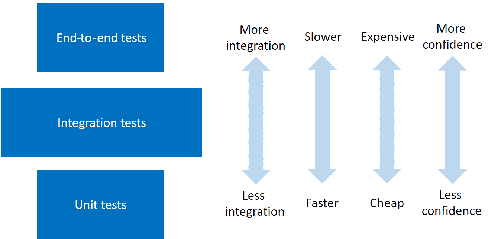

图 13.1–试验类型

在下面的小节中，我们将检查每种类型的测试及其优缺点。

## 单元测试

单元测试验证应用程序的各个独立部分是否按预期工作。这些测试通常执行得非常快，因此给了我们一个非常紧密的反馈循环，这样我们就知道我们正在开发的应用程序部分工作正常。

这些测试可以很快实现，但如果我们需要模拟我们正在测试的单元的依赖关系，则不一定如此。当单元测试 React 前端时，通常会出现这种情况，因为组件上的真正单元测试需要模拟其 JSX 中引用的所有子组件。

也许这些测试的最大缺点是，它们让我们对整个应用程序是否正常工作的信心最小。我们可以有一个大型的单元测试套件，涵盖我们应用程序的所有不同部分，但这并不能保证所有部分都能按预期协同工作。

以下是在`Counter`类的`increment`方法上执行单元测试的示例：

```cs
[Fact]
public void Increment_WhenCurrentCountIs1_ShouldReturn2()
{
  var counter = new Counter(1);
  var result = counter.increment();
  Assert.Equal(2, result);
}
```

对`Counter`类或`increment`方法没有外部依赖，因此这是单元测试的一个很好的候选者。

## 端到端测试

端到端测试验证关键路径按预期协同工作。应用程序的任何部分都不会被隔离和模仿。这些测试就像用户一样运行一个功能齐全的应用程序，因此这让我们对应用程序是否正常运行有最大的信心。

然而，这些测试执行起来很慢，这可能会延迟开发过程中的反馈循环；它们也是编写和维护成本最高的。这是因为测试所依赖的一切，例如数据库中的数据，都需要在每次执行测试时保持一致，这在我们实现具有不同数据需求的多个测试时是一个挑战。

以下是用于捕获订阅电子邮件地址的端到端测试的代码片段：

```cs
cy.findByLabelText('Email')
  .type('carl.rippon@googlemail.com')
  .should('have.value', 'carl.rippon@googlemail.com');
cy.get('form').submit();
cy.contains('Thanks for subscribing!');
```

这些语句驱动 web 页面上的交互，并检查页面上元素的内容，这些元素在过程中被更新。

## 集成测试

集成测试验证应用程序的多个部分正确地协同工作。在确保整个应用程序按预期工作方面，它们比单元测试给我们带来更多信心。这些测试提供了测试内容的最大范围，因为我们可以选择测试许多应用程序部件组合。

这些测试通常执行得很快，因为诸如数据库和网络请求之类的慢组件通常会被模拟出来。编写和维护这些测试所需的时间也很短。

对于单页应用程序，如果我们明智地选择测试，集成测试的**投资回报**（**ROI**）可以说比其他两种测试类型更高。这就是为什么上图中的相关框比其他测试类型大的原因。

以下是对 React`Card`组件进行集成测试的示例：

```cs
test('When the Card component is rendered with a title 
 prop, it should contain the correct title', () => {
  const { queryByText } = render(
    <Card title="Title test" />
  );
  const titleText = queryByText('Title test');
  expect(titleText).not.toBeNull();
});
```

测试验证通过`title`道具后，文本呈现正确。`Card`组件可能包含子组件，这些子组件将在测试中执行和呈现。这就是为什么将其归类为集成测试而不是单元测试的原因。

现在我们了解了不同类型的测试，我们将开始在*QandA*应用程序上实现它们。我们将首先对.NET 后端进行单元测试。

# 使用 xUnit 实现.NET 测试

在本节中，我们将使用名为**xUnit**的库在我们的问题控制器上实现一些后端单元测试。在此之前，我们将通过在没有依赖项的类上实现一些单元测试来熟悉 xUnit。

## 与 xUnit 开始接触

在本节中，我们将在后端 Visual Studio 解决方案中创建一个新项目，并开始实施简单的单元测试，以熟悉 xUnit，这是我们将用于运行后端测试的工具。因此，让我们打开后端项目并执行以下步骤：

1.  打开**解决方案浏览器**窗口，右键点击**解决方案**，选择**添加**，然后选择**新建项目。。。**。
2.  Select **xUnit Test Project** from the dialog box that opens and click on the **Next** button:

    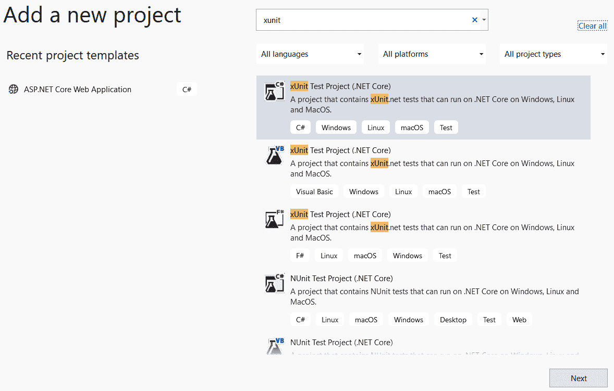

    图 13.2–创建新的 xUnit 项目

3.  输入**BackendTests**作为项目名称，并将**位置**设置到解决方案所在的文件夹中。点击**创建**创建项目。
4.  在**解决方案浏览器**中，右键点击**后端测试**项目，选择**编辑项目文件**。确保 XML 中的`TargetFramework`节点设置为至少`net5.0`：

    ```cs
    <Project Sdk="Microsoft.NET.Sdk">
      <PropertyGroup>
        <TargetFramework>net5.0</TargetFramework>
        ...
      </PropertyGroup>
      ...
    </Project>
    ```

5.  We are going to create a simple class so that we can write some unit tests for it. This will get us comfortable with xUnit. Create a static class in our unit test project called `Calc` with the following content:

    ```cs
    using System;
    namespace BackendTests
    {
      public static class Calc
      {
        public static decimal Add(decimal a, decimal b)
        {
          return a + b;
        }
      }
    }
    ```

    该类包含一个名为`Add`的方法，该方法简单地将在其参数中传递的两个数字相加。`Add`是一个纯函数，这意味着对于给定的一组参数，返回值总是一致的，并且不会产生任何副作用。纯函数非常容易测试，我们将在下面看到。

6.  We are going to create some unit tests for the `Add` method in the `Calc` class. Let's create a new class in the unit test project called `CalcTests` with the following content:

    ```cs
    using Xunit;
    namespace BackendTests
    {
      public class CalcTests
      {
        [Fact]
        public void 
        Add_When2Integers_ShouldReturnCorrectInteger()
        {
          // TODO - call the Calc.Add method with 2 
            // integers
          // TODO - check the result is as expected
        }
      }
    }
    ```

    我们已将我们的测试方法命名为`Add_When2Integers_ShouldReturnCorrectInteger`。

    重要信息

    有一个好的测试命名约定是很有用的。当我们看到失败的测试报告时，如果测试的名称描述了正在测试的内容，我们就可以立即开始了解问题。在本例中，名称以我们正在测试的方法开头，然后是测试条件的简要描述以及我们期望发生的事情。

    请注意，测试方法用`Fact`属性修饰。

    重要信息

    `Fact`属性表示该方法是 xUnit 的单元测试。表示单元测试的另一个属性称为`Theory`。这可用于向方法提供一系列参数值。

7.  Let's implement the unit test:

    ```cs
    [Fact]
    public void Add_When2Integers_ShouldReturnCorrectInteger()
    {
        var result = Calc.Add(1, 1);
        Assert.Equal(2, result);
    }
    ```

    我们调用正在测试的方法，并将返回值放入一个`result`变量中。然后，我们使用 xUnit 的`Assert`类及其`Equal`方法检查结果是否等于`2`。

8.  Let's run our test by right-clicking inside the test method and choosing **Debug Test(s)** from the menu:

    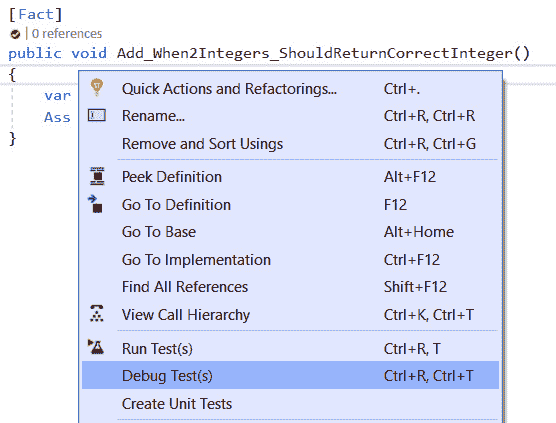

    图 13.3–调试测试

9.  几秒钟后，测试将运行，结果将出现在**测试浏览器**窗口中：


图 13.4–试验结果

正如我们所料，测试通过了。祝贺您–您刚刚创建了第一个单元测试！

在本次测试中，我们在`Assert`类中使用了`Equal`方法。以下是我们可以在此类中使用的一些其他有用方法：

*   `True`：检查值是否为`true`
*   `NotNull`：检查值是否不是`null`
*   `Contains`：检查该值是否在`string`中
*   `InRange`：检查该值是否在范围内
*   `Throws`：检查是否引发了异常

现在，我们开始了解如何编写单元测试。我们还没有在 Q 和 A 应用程序上编写任何测试，但我们将在下一步进行。

## 测试控制器动作方式

在本节中，我们将为一些问题控制器操作创建测试。

我们的 API 控制器依赖于缓存和数据存储库。我们不希望我们的测试执行真正的缓存和数据存储库，因为我们要求缓存和数据存储库中的数据是可预测的。这有助于我们获得可以检查的可预测结果。此外，如果测试在真实数据库上运行，那么测试执行将慢得多。因此，我们将使用一个名为 Moq 的库来帮助我们用提供可预测结果的伪实现替换真正的缓存和数据存储库。

让我们开始：

1.  First, we need to reference the `QandA` project from the `BackendTests` project. We can do this by right-clicking on the **Dependencies** node in **Solution Explorer** in the `BackendTests` project and choosing **Add Project Reference...**:

    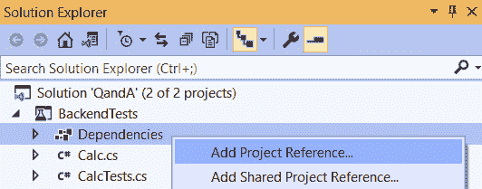

    图 13.5–添加项目参考

2.  Then, we need to tick the **QandA** project and click the **OK** button:

    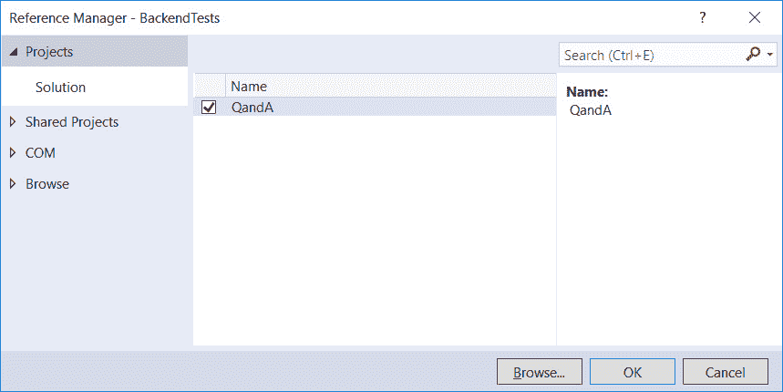

    图 13.6-添加对 QandA 项目的参考

3.  让我们使用**NuGet Package Manager**将**Moq**安装到我们的测试项目中：


图 13.7–安装 Moq

`BackendTests`项目现在已经建立，准备进行我们的第一次测试。

### 测试获取问题的行动方法

按照以下步骤对`GetQuestions`方法执行两项测试：

1.  首先，我们将在`BackendTests`项目中创建一个名为`QuestionsControllerTests`的新类，其 the 的内容如下：

    ```cs
    using System.Collections.Generic;
    using System.Linq;
    using System.Threading.Tasks;
    using Microsoft.AspNetCore.Mvc;
    using Microsoft.Extensions.Configuration;
    using Xunit;
    using Moq;
    using QandA.Controllers;
    using QandA.Data;
    using QandA.Data.Models;
    namespace BackendTests
    {
      public class QuestionsControllerTests
      {

      }
    }
    ```

2.  We are going to verify that calling `GetQuestions` with no parameters returns all the questions. Let's create the test method for this and 10 mock questions:

    ```cs
    [Fact]
    public async void GetQuestions_WhenNoParameters_ReturnsAllQuestions()
    {
      var mockQuestions = new 
       List<QuestionGetManyResponse>();
      for (int i = 1; i <= 10; i++)
      {
        mockQuestions.Add(new QuestionGetManyResponse
        {
          QuestionId = 1,
          Title = $"Test title {i}",
          Content = $"Test content {i}",
          UserName = "User1",
          Answers = new List<AnswerGetResponse>()
        });
      }
    }
    ```

    请注意，由于我们正在测试的操作方法是异步的，因此该方法被标记为带有`async`关键字的异步方法。

3.  Let's create a mock data repository definition using Moq:

    ```cs
    [Fact]
    public async void GetQuestions_WhenNoParameters_ReturnsAllQuestions()
    {
      ...
      var mockDataRepository = new 
       Mock<IDataRepository>();
      mockDataRepository
        .Setup(repo => repo.GetQuestions())
        .Returns(() => Task.FromResult(mockQuestions.
          AsEnumerable()));
    }
    ```

    我们可以使用 Moq 中的`Mock`类从`IDataRepository`接口创建一个模拟对象。然后，我们可以在模拟对象上使用`Setup`和`Returns`方法来定义`GetQuestions`方法应该返回模拟问题。我们正在测试的方法是异步的，因此我们需要在模拟结果中用`Task.FromResult`包装模拟问题。

4.  We need to mock the configuration object that reads `appsettings.json`. This is what the controller depends on:

    ```cs
    [Fact]
    public async void GetQuestions_WhenNoParameters_ReturnsAllQuestions()
    {
      ... 
      var mockConfigurationRoot = new 
       Mock<IConfigurationRoot>();
      mockConfigurationRoot.SetupGet(config =>
    config[It.IsAny<string>()]).Returns("some 
         setting");
    }
    ```

    前面的代码在读取`appsettings.json`时将返回任何字符串，这对于我们的测试来说是好的。

5.  Next, we need to create an instance of the API controller by passing in an instance of the mock data repository and mock configuration settings:

    ```cs
    [Fact]
    public async void GetQuestions_WhenNoParameters_ReturnsAllQuestions()
    {
      ...
      var questionsController = new QuestionsController(
    mockDataRepository.Object, 
    null, 
    null, 
        mockConfigurationRoot.Object
      );
    }
    ```

    模拟数据存储库定义上的`Object`属性为我们提供了一个要使用的模拟数据存储库实例。

    请注意，我们可以为缓存和 HTTP 客户端工厂依赖项传递`null`。这是因为我们正在测试的操作方法实现中没有使用它们

6.  Now, we can call the action method we are testing:

    ```cs
    [Fact]
    public async void GetQuestions_WhenNoParameters_ReturnsAllQuestions()
    {
      ...
      var result = await 
       questionsController.GetQuestions(null, false);
    }
    ```

    我们将`null`作为`search`参数传入，`false`作为`includeAnswers`参数传入。其他参数是可选的，因此我们不传入这些参数。

7.  Now, we can check the result is as expected:

    ```cs
    [Fact]
    public async void GetQuestions_WhenNoParameters_ReturnsAllQuestions()
    {
      ...
      Assert.Equal(10, result.Count());
      mockDataRepository.Verify(
    mock => mock.GetQuestions(), 
        Times.Once()
      );
    }
    ```

    在这里，我们已经检查了 10 件物品是否被退回。

    我们还检查了数据存储库中的`GetQuestions`方法是否调用过一次

8.  Let's give this a try by right-clicking the test in **Test Explorer** and selecting **Run Selected Tests**:

    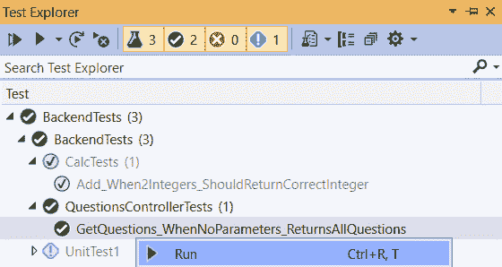

    图 13.8–在测试资源管理器中运行测试

    正如我们预期的那样，测试通过了。

9.  现在，我们将创建第二个测试，以验证使用`search`参数调用`GetQuestions`调用数据存储库中的`GetQuestionsBySearchWithPaging`方法。在我们的`QuestionsControllerTests`类中添加以下方法：

    ```cs
    [Fact]
    public async void GetQuestions_WhenHaveSearchParameter_ReturnsCorrectQue stions()
    {
      var mockQuestions = new List<QuestionGetManyResponse>();
      mockQuestions.Add(new QuestionGetManyResponse
      {
        QuestionId = 1,
        Title = "Test",
        Content = "Test content",
        UserName = "User1",
        Answers = new List<AnswerGetResponse>()
      });
      var mockDataRepository = new 
        Mock<IDataRepository>();
      mockDataRepository
        .Setup(repo => 
          repo.GetQuestionsBySearchWithPaging("Test", 1,
           20))
        .Returns(() => 
          Task.FromResult(mockQuestions.AsEnumerable()));
      var mockConfigurationRoot = new 
       Mock<IConfigurationRoot>();
      mockConfigurationRoot.SetupGet(config =>
        config[It.IsAny<string>()]).Returns("some 
         setting");
      var questionsController = new QuestionsController(
        mockDataRepository.Object, 
        null, 
        null, 
        mockConfigurationRoot.Object
      );
      var result = await questionsController.GetQuestions("Test", false);
      Assert.Single(result);
      mockDataRepository.Verify(mock => 
        mock.GetQuestionsBySearchWithPaging("Test", 1, 
         20), 
        Times.Once());
    }
    ```

这与前面的测试遵循相同的模式，但这次，我们模拟了数据存储库中的`GetQuestionsBySearchWithPaging`方法，并检查是否调用了。如果我们运行测试，它将按预期通过。

这就完成了对`GetQuestions`方法的测试。

### 测试动作方法以获得单个问题

按照以下步骤对`GetQuestion`方法进行几项测试：

1.  Let's add the following test to the `QuestionsControllerTests` class to verify that we get the correct result when the question isn't found:

    ```cs
    [Fact]
    public async void GetQuestion_WhenQuestionNotFound_Returns404()
    {
      var mockDataRepository = new 
       Mock<IDataRepository>();
      mockDataRepository
        .Setup(repo => repo.GetQuestion(1))
        .Returns(() => Task.FromResult(default(QuestionGetSingleResponse)));
      var mockQuestionCache = new Mock<IQuestionCache>();
      mockQuestionCache
        .Setup(cache => cache.Get(1))
        .Returns(() => null);
      var mockConfigurationRoot = new
       Mock<IConfigurationRoot>();
      mockConfigurationRoot.SetupGet(config =>
        config[It.IsAny<string>()]).Returns("some 
          setting");
      var questionsController = new QuestionsController(
        mockDataRepository.Object, 
        mockQuestionCache.Object, 
        null, 
        mockConfigurationRoot.Object
      );
      var result = await 
       questionsController.GetQuestion(1);

      var actionResult = 
        Assert.IsType<
          ActionResult<QuestionGetSingleResponse>
        >(result);
      Assert.IsType<NotFoundResult>(actionResult.Result);
    }
    ```

    这遵循与先前测试相同的模式。这个测试中的一个不同之处是，我们在这个测试中模拟了缓存，因为这是在`GetQuestion`方法中使用的。我们的模拟将从假缓存返回`null`，这是当问题不在缓存中时我们所期望的。

    在这里，我们检查结果是否为`NotFoundResult`类型。

2.  让我们添加另一个测试，以验证当请求的一个确实存在时返回的问题：

    ```cs
    [Fact]
    public async void GetQuestion_WhenQuestionIsFound_ReturnsQuestion()
    {
      var mockQuestion = new QuestionGetSingleResponse
      {
        QuestionId = 1,
        Title = "test"
      };
      var mockDataRepository = new 
       Mock<IDataRepository>();
      mockDataRepository
        .Setup(repo => repo.GetQuestion(1))
        .Returns(() => Task.FromResult(mockQuestion));
      var mockQuestionCache = new Mock<IQuestionCache>();
      mockQuestionCache
       .Setup(cache => cache.Get(1))
       .Returns(() => mockQuestion);
      var mockConfigurationRoot = new
        Mock<IConfigurationRoot>();
      mockConfigurationRoot.SetupGet(config =>
        config[It.IsAny<string>()]).Returns("some 
         setting");
      var questionsController = new QuestionsController(
        mockDataRepository.Object, 
        mockQuestionCache.Object, 
        null, 
        mockConfigurationRoot.Object
      );
      var result = await 
       questionsController.GetQuestion(1);
      var actionResult = 
        Assert.IsType<
          ActionResult<QuestionGetSingleResponse>
        >(result);
      var questionResult = 
        Assert.IsType<QuestionGetSingleResponse>(actionResult.
         Value);
      Assert.Equal(1, questionResult.QuestionId);
    }
    ```

这一次，我们检查结果是否为`QuestionGetSingleResponse`类型，并通过检查问题 ID 返回正确的问题。

这就完成了我们将在`GetQuestion`动作方法上执行的测试。

同样的方法和模式也可以用于添加我们尚未介绍的控制器逻辑测试。我们可以使用 Moq 来实现这一点，Moq 模拟出该方法所依赖的任何依赖项。在下一节中，我们将开始在前端实现测试。

# 用笑话实现 React 测试

在本节中，我们将把注意力转向使用 Jest 为前端创建自动测试。Jest 是 React 社区中事实上的测试工具，由Facebook 维护。Jest 包含在**Create React App**（**CRA**项目中，这意味着它已经在我们的项目中安装和配置。

我们将从测试一个简单的函数开始，这样我们就可以在继续测试 React 组件之前熟悉 Jest。

## 开始开玩笑

我们将通过在`QuestionsData.ts`中的`mapQuestionFromServer`函数中添加一些单元测试来开始熟悉 Jest。因此，让我们在 Visual Studio 代码中打开前端项目，并执行以下步骤：

1.  通过删除`src`文件夹中的`App.test.tsx`文件，删除使用 Create React App 创建项目时安装的示例测试。
2.  Create a new file called `QuestionsData.test.ts` in the `src` folder that contains the following content:

    ```cs
    import { mapQuestionFromServer } from './QuestionsData';
    test('When mapQuestionFromServer is called with question, created should be turned into a Date', () => {
    });
    ```

    请注意，该文件的扩展名为`test.ts`。

    重要信息

    `test.ts`扩展名很重要，因为 Jest 在搜索要执行的测试时会自动查找具有此扩展名的文件。请注意，如果我们的测试包含 JSX，则需要使用`test.tsx`扩展。

    Jest 中的`test`函数包含两个参数：

    *   第一个参数是测试输出中显示的测试描述。
    *   The second parameter is an arrow function, which will contain our test.

        测试将检查`mapQuestionFromServer`功能是否正确，并将`created`属性映射到`question`对象。

3.  让我们用一个问题调用`mapQuestionFromServer`函数，并将返回的对象分配给一个`result`变量：

    ```cs
    test('When mapQuestionFromServer is called with question, created should be turned into a Date', () => {
      const result = mapQuestionFromServer({
        questionId: 1,
        title: "test",
        content: "test",
        userName: "test",
        created: "2021-01-01T00:00:00.000Z",
        answers: []
      });
    });
    ```

4.  Add the following highlighted code to test that the `result` variable is as we expect:

    ```cs
    test('When mapQuestionFromServer is called with question, created should be turned into a Date', () => {
      const result = mapQuestionFromServer({
        questionId: 1,
        title: "test",
        content: "test",
        userName: "test",
        created: "2021-01-01T00:00:00.000Z",
        answers: []
      });
      expect(result).toEqual({
        questionId: 1,
        title: "test",
        content: "test",
        userName: "test",
    created: new Date(Date.UTC(2021, 0, 1, 0, 0, 0, 
         0)),
        answers: []
      });
    });
    ```

    我们传递正在检查 Jest`expect`函数的`result`变量。然后，我们将一个`toEqual`匹配器函数链接到该函数上，该函数检查`result`对象是否具有与我们传递给它的对象相同的属性值。

    `toEqual`是我们可以用来检查变量值的许多 Jest matcher 函数之一。功能的完整列表可在[中找到 https://jestjs.io/docs/en/expect](https://jestjs.io/docs/en/expect) 。

5.  让我们在`mapQuestionFromServer`函数上创建另一个测试，以检查`answers`中的`created`属性是否正确映射：

    ```cs
    test('When mapQuestionFromServer is called with
      question and answers, created should be turned into
        a Date', () => {
      const result = mapQuestionFromServer({
        questionId: 1,
        title: "test",
        content: "test",
        userName: "test",
        created: "2021-01-01T00:00:00.000Z",
        answers: [{
          answerId: 1,
          content: "test",
          userName: "test",
          created: "2021-01-01T00:00:00.000Z"
        }]
      });
      expect(result).toEqual({
        questionId: 1,
        title: "test",
        content: "test",
        userName: "test",
        created: new Date(Date.UTC(2021, 0, 1, 0, 0, 0, 
         0)),
        answers: [{
          answerId: 1,
          content: "test",
          userName: "test",
          created: new Date(Date.UTC(2021, 0, 1, 0, 0, 0,
           0)),
        }]
      });
    });
    ```

6.  是时候检查一下我们的测试是否通过了。在终端中输入以下命令：

    ```cs
    > npm test
    ```

Jest 将运行在项目中找到的测试，并输出结果：


图 13.9–Jest 测试结果

所以，Jest 找到了我们的两个测试，他们都通过了——这是个好消息！

`mapQuestionFromServer`函数很容易测试，因为它没有依赖项。但是，我们如何测试具有许多依赖项的 React 组件，例如浏览器的 DOM 和 React 本身？我们将在下一节中找到答案。

# 测试反应组件

在本节中，我们将对`Page`、`Question`和`HomePage`组件进行测试。React 组件测试具有挑战性，因为它们具有依赖性，例如浏览器的 DOM，有时还有 HTTP 请求。因此，我们将利用 React 测试库和 Jest 的模拟功能来帮助我们实现测试。

## 测试页面组件

执行以下步骤，测试`Page`组件渲染是否正确：

1.  Create a file for the tests called `Page.test.tsx` with the following content:

    ```cs
    import React from 'react';
    import { render, cleanup } from '@testing-library/react';
    import { Page } from './Page';
    test('When the Page component is rendered, it should contain the correct title and content', () => {

    });
    ```

    我们使用`Page`组件导入了 React，以及 React 测试库中的一些有用函数。

    React Testing库是在我们创建前端项目时由 Create React App 安装的。这个库将帮助我们选择要检查的元素，而不使用内部实现细节，如元素 ID 或 CSS 类名。

2.  Let's render the `Page` component in the test by adding the following highlighted lines of code:

    ```cs
    test('When the Page component is rendered, it should contain the correct title and content', () => {
      const { queryByText } = render(
        <Page title="Title test">
          <span>Test content</span>
        </Page>,
      );
    });
    ```

    我们使用 React 测试库中的`render`函数通过传入 JSX 来呈现`Page`组件。

    `render`函数返回各种有用的项。其中一项是`queryByText`函数，它将帮助我们选择我们将在下一步中使用和理解的元素。

3.  Now, we can check that the page title has been rendered:

    ```cs
    test('When the Page component is rendered, it should contain the correct title and content', () => {
      const { queryByText } = render(
        <Page title="Title test">
          <span>Test content</span>
        </Page>,
      );
      const title = queryByText('Title test');
      expect(title).not.toBeNull();
    });
    ```

    在这里，我们使用 React 测试库中的函数`queryByText`来查找文本内容中包含`"Title test"`的元素，该函数是从`render`函数返回的。注意我们是如何使用用户可以看到的东西（元素文本）来定位元素，而不是任何实现细节。这意味着，如果 DOM 结构或 DOM ID 等实现细节发生变化，我们的测试不会中断。

    找到 title 元素后，我们使用 Jest 的`expect`函数通过断言该元素不是`null`来检查是否找到了该元素。

4.  我们可以对页面内容进行类似的检查：

    ```cs
    test('When the Page component is rendered, it should contain the correct title and content', () => {
      const { queryByText } = render(
        <Page title="Title test">
          <span>Test content</span>
        </Page>,
      );
      const title = queryByText('Title test');
      expect(title).not.toBeNull();
      const content = queryByText('Test content');
      expect(content).not.toBeNull();
    });
    ```

5.  我们需要做的最后一件事是在执行测试后清理 DOM。我们可以使用 Jest 中的`afterEach`函数和 React 测试库中的`cleanup`函数对文件中的所有测试执行此操作。让我们在`import`语句

    ```cs
    afterEach(cleanup); 
    ```

    之后添加此内容
6.  如果保存文件后 Jest 仍在运行，则新测试将运行。如果我们已经杀死了 Jest，那么我们可以通过在终端中执行`npm test`再次启动它：

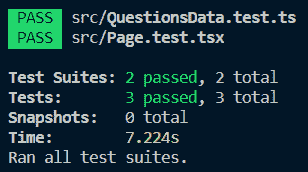

图 13.10–Jest 测试结果

我们的测试按预期通过，总共通过了三次测试。

## 测试问题组件

执行以下步骤，测试`Question`组件渲染是否正确：

1.  Let's start by creating a new file called `Question.test.tsx` with the following content:

    ```cs
    import React from 'react';
    import { render, cleanup } from '@testing-library/react';
    import { QuestionData } from './QuestionsData';
    import { Question } from './Question';
    import { BrowserRouter } from 'react-router-dom';
    afterEach(cleanup);
    test('When the Question component is rendered, it should contain the correct data', () => {

    });
    ```

    这将导入测试所需的所有项目。我们还实现了`cleanup`功能，该功能将在测试后运行。

2.  Now, let's try to render the component:

    ```cs
    test('When the Question component is rendered, it should contain the correct data', () => {
      const question: QuestionData = {
        questionId: 1,
        title: 'Title test',
        content: 'Content test',
        userName: 'User1',
        created: new Date(2019, 1, 1),
        answers: [],
      };
      const { queryByText } = render(
        <Question data={question} />,
      );
    });
    ```

    我们使用`render`函数通过传入模拟的`data`prop 值来呈现`Question`组件。

    不过有个问题。如果我们运行测试，我们将收到一条错误消息，说明`Error: useHref() may be used only in the context of a <Router> component`。这里的问题是`Question`组件使用`Link`组件，它期望`Router`组件在组件树中处于较高的位置。但是，它不在我们的测试中。

3.  解决方案是在我们的测试中包括`BrowserRouter`：

    ```cs
    test('When the Question component is rendered, it should contain the correct data', () => {
      ...
      const { queryByText } = render(
        <BrowserRouter>
          <Question data={question} />
        </BrowserRouter>
      );
    });
    ```

4.  现在，我们可以通过向测试中添加以下突出显示的语句来断言呈现了正确的数据：

    ```cs
    test('When the Question component is rendered, it should contain the correct data', () => {
      ...
      const titleText = queryByText('Title test');
      expect(titleText).not.toBeNull();
      const contentText = queryByText('Content test');
      expect(contentText).not.toBeNull();
      const userText = queryByText(/User1/);
      expect(userText).not.toBeNull();
      const dateText = queryByText(/2019/);
      expect(dateText).not.toBeNull();
    });
    ```

我们在这里再次使用`queryByText`方法来定位渲染元素，并检查找到的元素是否不是`null`。请注意，在查找包含用户名和日期的元素时，我们传入一个正则表达式以进行部分匹配。

## 测试首页组件

我们要为其执行测试的最后一个组件是`HomePage`组件。为此，请执行以下步骤：

1.  Let's create a file called `HomePage.test.tsx` with the following content:

    ```cs
    import React from 'react';
    import { render, cleanup } from '@testing-library/react';
    import { HomePage } from './HomePage';
    import { BrowserRouter } from 'react-router-dom';
    afterEach(cleanup);
    test('When HomePage first rendered, loading indicator should show', async () => {
      const { findByText } = render(
        <BrowserRouter>
          <HomePage />
        </BrowserRouter>,
      );
      const loading = await findByText('Loading...');
      expect(loading).not.toBeNull();
    });
    ```

    测试验证了**加载。。。首次呈现时，**消息出现在`HomePage`组件中。我们使用`findByText`函数等待并查找包含加载文本的元素。

2.  Let's implement another test to check that unanswered questions are rendered okay:

    ```cs
    test('When HomePage data returned, it should render questions', async () => {
      const { findByText } = render(
        <BrowserRouter>
          <HomePage />
        </BrowserRouter>,
      );
      expect(await findByText('Title1 
        test')).toBeInTheDocument();
      expect(await findByText('Title2
        test')).toBeInTheDocument();
    });
    ```

    我们再次使用`findByText`函数等待问题被呈现。然后，我们使用`toBeInTheDocument`函数检查找到的元素是否在文档中。

    然而，测试失败了。这是因为`HomePage`组件正在发出 HTTP 请求以获取数据，但没有 REST API 来处理该请求。

3.  我们将用一个笑话模拟`getUnansweredQuestions`函数。让我们在测试上面添加以下代码：

    ```cs
    jest.mock('./QuestionsData', () => ({
      getUnansweredQuestions: () => {
        return Promise.resolve([
          {
            questionId: 1,
            title: 'Title1 test',
            content: 'Content2 test',
            userName: 'User1',
            created: new Date(2019, 1, 1),
            answers: [],
          },
          {
            questionId: 2,
            title: 'Title2 test',
            content: 'Content2 test',
            userName: 'User2',
            created: new Date(2019, 1, 1),
            answers: [],
          },
        ]);
      },
    }));
    test('When HomePage first rendered, loading indicator should show', async () => ...
    ```

模拟函数返回我们在测试断言中使用的两个问题。

现在，测试将在运行时通过。

这就完成了我们的组件测试。

正如我们所看到的，编写组件测试比编写纯函数测试更具挑战性，但 React 测试库和 Jest Mock 使编写变得相当简单。

在下一节中，我们将通过实现端到端测试来完成我们的测试套件。

# 使用 Cypress 实现端到端测试

Cypress 是一个端到端测试工具，非常适合**单页应用程序**（**SPAs**）像我们这样的应用程序。Cypress 可以运行整个应用程序，模拟与之交互的用户，并在过程中检查用户界面的状态。因此，Cypress 是在 SPA 上进行端到端测试的理想选择。

在本节中，我们将实现一个用于登录和提问的端到端测试。

## 柏树入门

Cypress 在我们的前端中执行，所以让我们执行以下步骤在我们的前端项目中安装和配置 Cypress：

1.  我们将从终端安装`cypress`开始：

    ```cs
    > npm install cypress --save-dev
    ```

2.  我们将添加一个`npm`脚本来打开 Cypress，方法是在`package.json`

    ```cs
    "scripts": {
      ...,
      "cy:open": "cypress open"
    },
    ```

    中添加以下行：
3.  Let's open Cypress by executing our `npm` script in the Terminal:

    ```cs
    > npm run cy:open
    ```

    几秒钟后，Cypress 将打开，显示刚刚安装的示例测试文件列表：

    

    图 13.11–Cypress 示例测试

    这些例子可以在我们项目的`cypress/integration/examples`文件夹中找到。如果我们打开其中一个测试文件，我们将看到它们是用 JavaScript 编写的。这些例子是我们学习 Cypress 并了解其最新情况的重要参考资料。

4.  In the Cypress browser window, click the `actions.spec.js` item. This will open this test and execute it:

    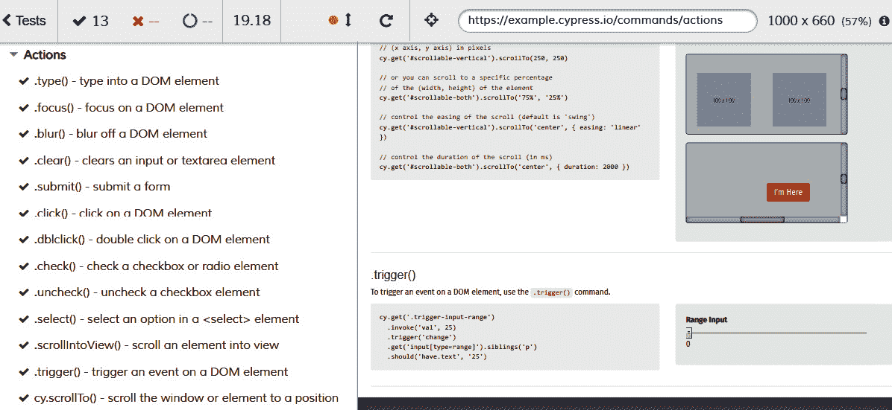

    图 13.12–Cypress 中的测试输出

    我们可以看到左侧的测试，并检查右侧正在测试的应用程序是否通过了测试。

5.  If we click the **submit() - submit a form** test, we'll see all the steps in the test. If we click on a step, we'll see the app on the right in the state it was in at that juncture: 

    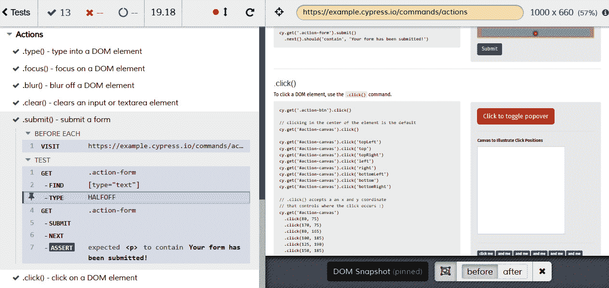

    图 13.13–Cypress 测试结果步骤详情

    这在调试测试失败时非常有用。

6.  Let's close Cypress for now and return to the Terminal to install the Cypress Testing Library:

    ```cs
    > npm install @testing-library/cypress --save-dev
    ```

    Cypress 测试库与 React 测试库类似，它帮助我们选择要检查的元素，而无需使用内部实现细节。

7.  要添加 Cypress 测试库命令，我们需要在`commands.js`文件的顶部插入以下行，可以在`cypress`文件夹的`support`文件夹中找到：

    ```cs
    import '@testing-library/cypress/add-commands';
    ```

8.  Let's add some Cypress configuration settings by opening the `cypress.json` file in the root of the project and adding the following settings:

    ```cs
    {
      "baseUrl": "http://localhost:3000",
      "chromeWebSecurity": false
    }
    ```

    `baseUrl`设置是我们正在测试的应用程序的根 URL。

    我们的测试将使用 Auth0 和我们的应用程序，因此它将在两个不同的来源上工作。我们需要使用`chromeWebSecurity`设置禁用 Chrome 安全性，以允许测试跨不同来源工作。

    Cypress 在 IFrame 中运行我们的应用程序并验证 0。为了防止点击劫持攻击，默认情况下在 Auth0 中禁用在 IFrame 中运行。

9.  Disable clickjacking protection in Auth0 by selecting the **Settings** option under our user avatar menu and then selecting the **Advanced** tab. An option called **Disable clickjacking protection for Classic Universal Login** can be found toward the bottom of the **Advanced** tab. We need to turn this option on:

    

    图 13.14–在 Auth0 中禁用 clickjacking 保护选项

10.  当我们编写测试时，我们将从 Cypress 访问一个全局`cy`对象。让我们通过在`.eslintrc.json`文件中添加以下内容来告诉 ESLint`cy`没有问题：

    ```cs
    {
      ...,
      "globals": {
        "cy": true
      }
    }
    ```

现在，Cypress 已经安装并配置好了，这样我们就可以在我们的 Q 和 a 应用程序上进行测试了。

## 测试提问

在本节中，我们将使用 Cypress 对我们的应用程序进行测试；测试登录，然后问一个问题。为此，请执行以下步骤：

1.  Let's create a new file called `qanda.js` in the `integration` folder, which can be found in the `cypress` folder, with the following content:

    ```cs
    describe('Ask question', () => {
      beforeEach(() => {
        cy.visit('/');
      });
      it('When signed in and ask a valid question, the
         question should successfully save', () => {

      });
    });
    ```

    `describe`功能允许我们对一个特性的测试集合进行分组。第一个参数是组的标题，而第二个参数是包含组中测试的函数。

    `it`函数允许我们定义实际测试。第一个参数是测试的标题，第二个参数是包含测试步骤的函数。

    `beforeEach`函数允许我们在每次测试运行之前定义要执行的步骤。在我们的例子中，我们使用`visit`命令导航到应用程序的根目录。请记住，应用程序的根 URL 是在`cypress.json`文件的`baseUrl`设置中定义的。

2.  Let's add the following step to our test:

    ```cs
    it('When signed in and ask a valid question, the
      question should successfully save', () => {
      cy.contains('Q & A');
    });
    ```

    在这里，我们使用`contains`Cypress 命令检查页面是否包含`Q & A`文本。我们可以从全局`cy`对象访问 Cypress 命令。

    如果 Cypress 命令没有找到预期的结果，那么它们就会失败。因此，我们不需要添加`assert`语句。整洁的

3.  让我们试一试。我们需要在 VisualStudio 项目中运行后端。我们还需要通过在终端中执行`npm start`来运行前端。在另一个终端窗口中，输入以下内容以打开 Cypress:

    ```cs
    > npm run cy:open
    ```

4.  Cypress will detect our test and list it underneath the example tests:

    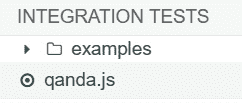

    图 13.15–柏树中的 QandA 试验

5.  Click on the test to execute it:

    

    图 13.16–我们通过 Cypress 测试

    测试成功执行并通过。我们将使测试运行程序保持打开状态，因为它将在我们实现和保存测试时自动重新运行。

6.  Let's add the following additional step to our test:

    ```cs
    cy.contains('UNANSWERED QUESTIONS');
    ```

    这里，我们正在检查页面是否包含正确的标题。如果保存测试并查看测试运行程序，我们将看到测试失败：

    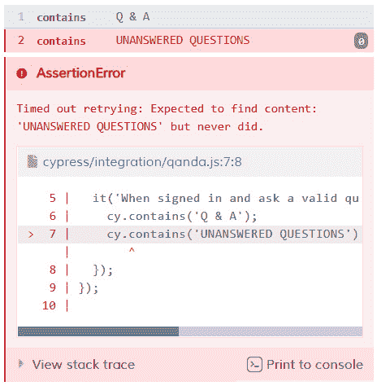

    图 13.17–柏树试验失败

    这是因为标题的文本实际上不是大写的——CSS 规则将文本转换为大写。

    请注意 Cypress 用于通知我们测试失败的消息：**超时重试**。Cypress 将继续尝试命令，直到命令通过或出现超时。这种行为对我们来说非常方便，因为它允许我们编写同步风格的代码，即使我们正在测试的操作是异步的。Cypress 从我们这里抽象出这种复杂性

7.  让我们更正这个有问题的测试语句，将其更改为检查正确大小写中的标题：

    ```cs
    cy.contains('Unanswered Questions');
    ```

8.  Let's add some code for going to the sign-in page:

    ```cs
    cy.contains('Sign In').click();
    cy.url().should('include', 'auth0');
    ```

    在这里，我们使用 Cypress`contains`命令定位**登录**按钮，并将`click`命令链接到此按钮以单击该按钮。

    然后，我们使用`url`命令获取浏览器的 URL，并将`should`命令链接到此语句，以验证它是否包含正确的路径。

    如果我们查看测试运行程序，我们将看到测试成功地导航到 Auth0。

    让我们考虑一下 Cypress 正在执行的这些步骤。到 Auth0 的导航是一个异步操作，但是我们的测试代码似乎不是异步的。我们没有添加特殊的等待功能来等待页面导航完成。Cypress 使测试具有异步用户界面的单页应用变得轻而易举，因为它为我们处理了这种复杂性！

    接下来，我们将实施一些步骤，以便填写登录表单：

    ```cs
    cy.findByLabelText('Email')
      .type('your username')
      .should('have.value', 'your username');
    cy.findByLabelText('Password')
      .type('your password')
      .should('have.value', 'your password');
    ```

    在这里，我们使用 Cypress 测试库中的`findByLabelText`命令来定位我们的`input`。它通过查找包含我们指定的文本的标签，然后查找相关的`input`（在标签的`for`属性中引用）来实现这一点。这是另一个简洁的函数，它将测试从实现细节（如元素 ID 和类名）中解放出来。

    我们链接 Cypress`type`命令，以便在`input`和`should`命令中输入字符，以验证输入的`value`属性设置是否正确。

    重要信息

    适当地替换您的测试用户名和密码。

9.  Let's submit the sign-in form and check that we are taken back to the Q and A app:

    ```cs
    cy.get('form').submit();
    cy.contains('Unanswered Questions');
    ```

    我们使用 Cypress`get`命令定位表单，然后提交表单。然后，我们检查页面是否包含`Unanswered Questions`文本，以验证我们是否回到 Q 和 A 应用程序中。Cypress 为我们处理这些步骤的异步性。

10.  接下来我们点击**提问**按钮进入提问页面：

    ```cs
    cy.contains('Ask a question').click();
    cy.contains('Ask a question');
    ```

11.  Then, we'll fill in the ask form:

    ```cs
    var title = 'title test';
    var content = 'Lots and lots and lots and lots and lots of content test';
    cy.findByLabelText('Title')
      .type(title)
      .should('have.value', title);
    cy.findByLabelText('Content')
      .type(content)
      .should('have.value', content);
    ```

    我们使用与登录表单相同的命令填写标题和内容字段。标题必须至少为 10 个字符，内容必须至少为 50 个字符，以满足验证规则。

12.  接下来，我们将提交问题并检查提交是否正确：

    ```cs
    cy.contains('Submit Your Question').click();
    cy.contains('Your question was successfully submitted');
    ```

13.  为了完成测试，我们将注销并检查是否已重定向到正确的页面：

    ```cs
    cy.contains('Sign Out').click();
    cy.contains('You successfully signed out!'); 
    ```

如果我们查看测试运行程序，我们会发现我们的测试成功运行并通过：

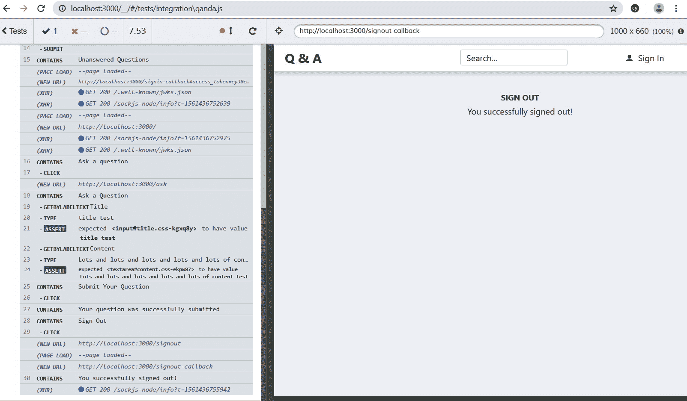

图 13.18–试运行

如果测试失败，可能是因为用户在测试开始前已登录到浏览器会话。如果是这种情况，请单击**退出**按钮并重新运行测试。

这就完成了我们的端到端测试以及本章将创建的所有测试。现在我们已经编写了适当的单元测试、集成测试和端到端测试，我们对每种类型的好处和挑战以及如何实现它们有了感觉。

# 总结

Cypress 的端到端测试使我们能够快速覆盖应用程序的各个领域。然而，它们需要一个完全可操作的前端和后端，包括一个数据库。Cypress 抽象了单页应用程序的异步性质的复杂性，使我们的测试变得漂亮且易于编写

单元测试可以在.NET 中使用 xUnit 编写，也可以放在 xUnit 项目中，与主应用程序分离。xUnit 测试方法用`Fact`属性修饰，我们可以使用`Assert`类对正在测试的项进行检查。

单元测试可以使用 Jest 为 React 应用程序编写，并包含在扩展名为`test.ts`或`test.tsx`的文件中。Jest 的`expect`函数为我们提供了许多有用的匹配器函数，例如`toBe`，我们可以使用这些函数进行测试断言。

单元测试通常需要模拟依赖项。Moq 是.NET 社区中一种流行的模拟工具，有一个`Mock`类，可用于模拟依赖项。在前端，Jest 具有一系列强大的模拟功能，我们可以使用这些功能模拟依赖项，如 REST API 调用。

一个页面通常由多个组件组成，有时，只需在页面组件上编写集成测试而不模拟子组件是很方便的。我们可以使用 Jest 实现这些测试，方法与实现单元测试完全相同。

React 测试库和 Cypress 测试库允许我们以不依赖于实现细节的方式定位元素，从而帮助我们编写健壮的测试。这意味着，如果实现发生了变化，而其特性和行为保持不变，则测试不太可能中断。这种方法降低了测试套件的维护成本。

现在，我们的应用程序已经构建完毕，我们已经完成了自动化测试，是时候将其部署到 Azure 了。我们将在下一章中这样做。

# 问题

以下问题将测试您对本章所涵盖主题的知识：

1.  我们有下面的 xUnit 测试方法，但是测试运行人员没有使用它。发生了什么？

    ```cs
    public void Minus_When2Integers_ShouldReturnCorrectInteger()
    {
     var result = Calc.Add(2, 1);
     Assert.Equal(1, result);
    }
    ```

2.  在 xUnit 测试中，我们有一个名为`successMessage`的`string`变量，我们需要检查它是否包含单词`"success"`。在`Assert`类中我们可以使用什么方法？
3.  我们已经在名为`ListTests.tsx`的文件中的`List`组件上创建了一些 Jest 单元测试。但是，当 Jest 测试运行程序运行时，测试不会被拾取。为什么会这样？
4.  我们正在 Jest 中实现一个测试，我们有一个名为`result`的变量，我们要检查它不是`null`。我们可以使用哪个 Jest matcher 函数？
5.  Let's say we have a variable called `person` that is of the `Person` type:

    ```cs
    interface Person {
      id: number;
      firstName: string;
      surname: string
    }
    ```

    我们要检查 person 变量是否为`{ id: 1, firstName: "Tom", surname: "Smith" }`。我们可以使用什么 Jest matcher 函数？

6.  我们正在使用 Cypress 为页面编写端到端测试。页面标题为**登录**。我们可以使用哪一个 Cypress 命令来检查此渲染是否正常？
7.  我们正在编写一个端到端测试，使用 Cypress 对呈现一些文本的页面进行测试，**加载。。。**，正在提取数据时。我们如何断言该文本正在呈现，然后在获取数据时消失？

# 答案

1.  测试方法中缺少`Fact`属性。
2.  我们将在`Assert`类中使用`Assert.Contains`方法。
3.  测试文件名需要以`.test.tsx`结尾。因此，如果我们重命名文件`List.test.tsx`，那么测试将被拾取。
4.  我们可以使用以下代码检查对象是否为`null`：

    ```cs
    expect(result).not.toBeNull();
    ```

5.  我们可以使用`toEqual`Jest matcher 函数来比较对象：

    ```cs
    expect(person).toEqual({ 
      id: 1, 
      firstName: "Tom", 
      surname: "Smith" 
    });
    ```

6.  我们可以使用以下 Cypress 命令检查页面标题：

    ```cs
    cy.contains('Sign In');
    ```

7.  We can use the following Cypress command to check that **Loading…** only appears while data is being fetched:

    ```cs
    cy.contains('Loading...');
    cy.contains('Loading...').should('not.exist');
    ```

    第一个命令将检查页面在初始呈现时是否呈现`Loading...`。第二个命令将等待`Loading...`消失，即数据已被提取。

# 进一步阅读

如果您想了解有关使用 xUnit 和 Jest 进行测试的更多信息，以下资源非常有用：

*   **在.NET 内核中进行单元测试**：[https://docs.microsoft.com/en-us/dotnet/core/testing/unit-testing-with-dotnet-test](https://docs.microsoft.com/en-us/dotnet/core/testing/unit-testing-with-dotnet-test)
*   **迅特**：[https://xunit.net/](https://xunit.net/)
*   **最小起订量**：[https://github.com/moq/moq](https://github.com/moq/moq)
*   **开玩笑**：[https://jestjs.io/](https://jestjs.io/)
*   **反应测试库**：[https://testing-library.com/docs/react-testing-library/intro](https://testing-library.com/docs/react-testing-library/intro)
*   **柏树**：[https://docs.cypress.io](https://docs.cypress.io)
*   **柏树测试库**：[https://testing-library.com/docs/cypress-testing-library/intro](https://testing-library.com/docs/cypress-testing-library/intro)