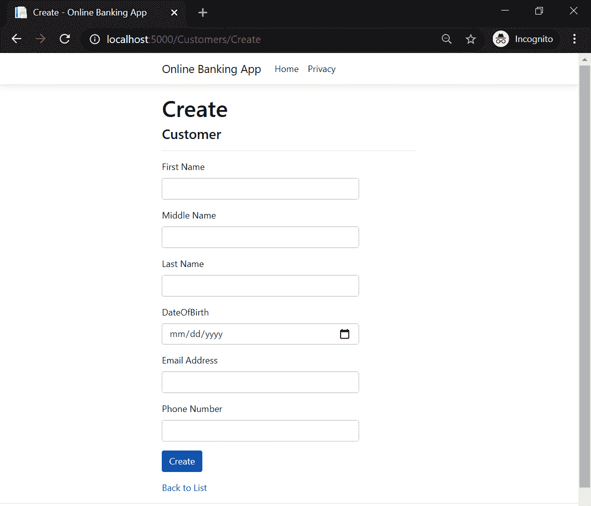
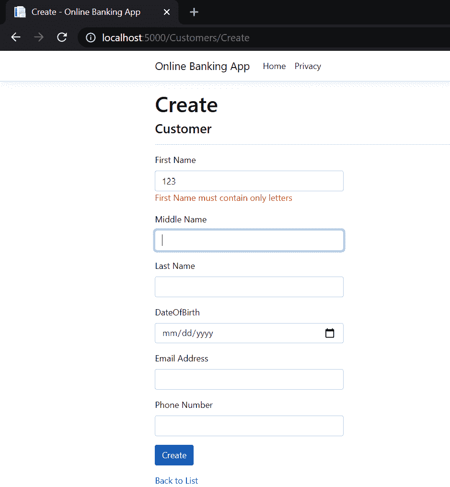
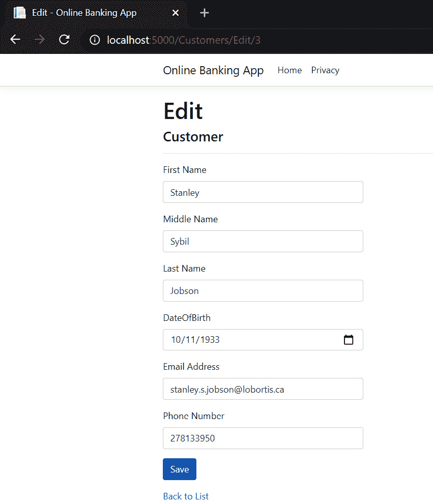
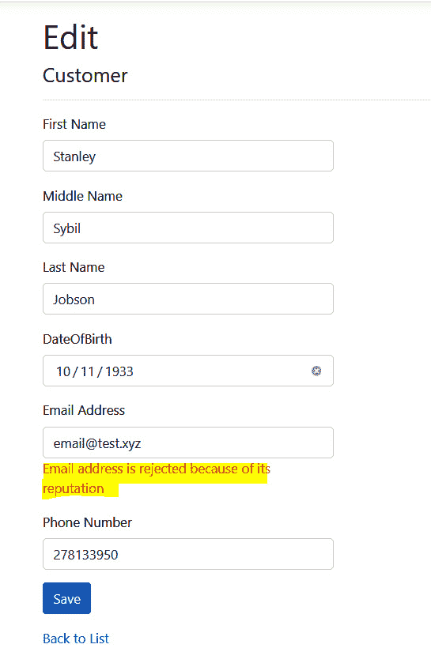
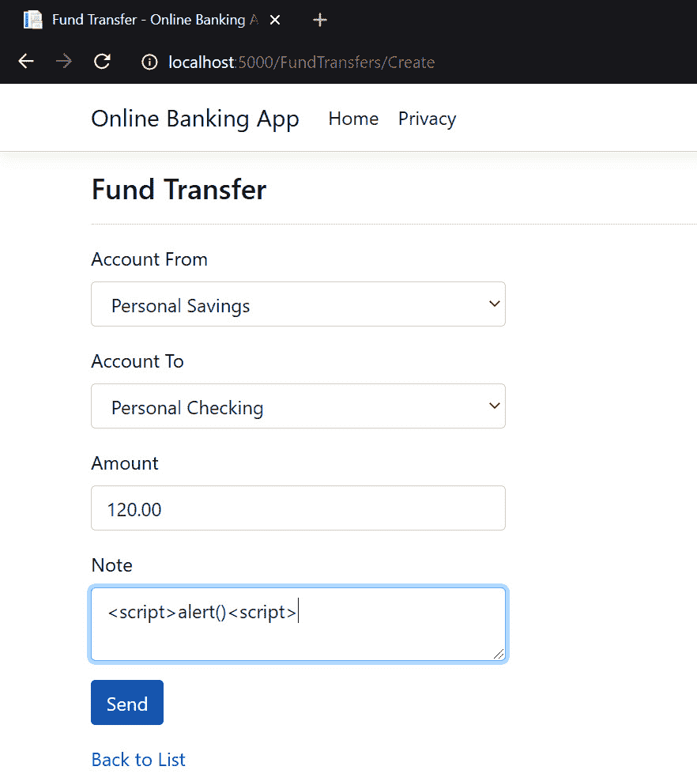
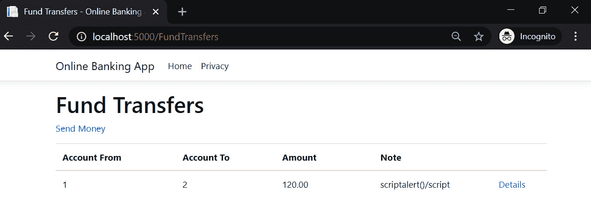
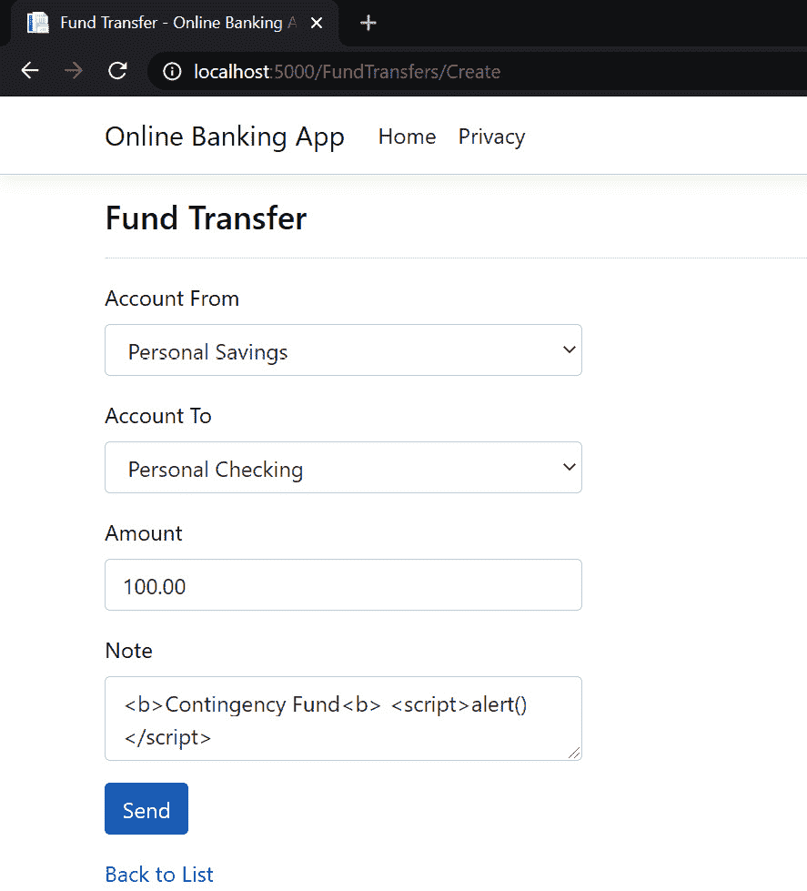
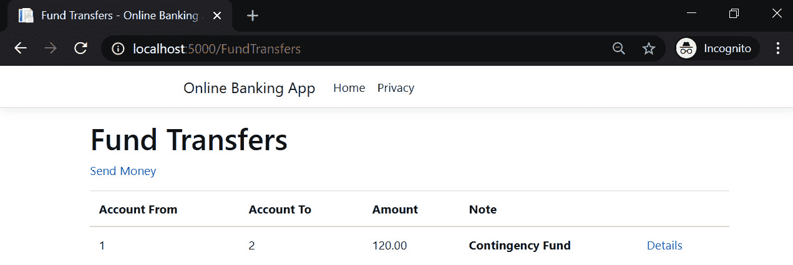
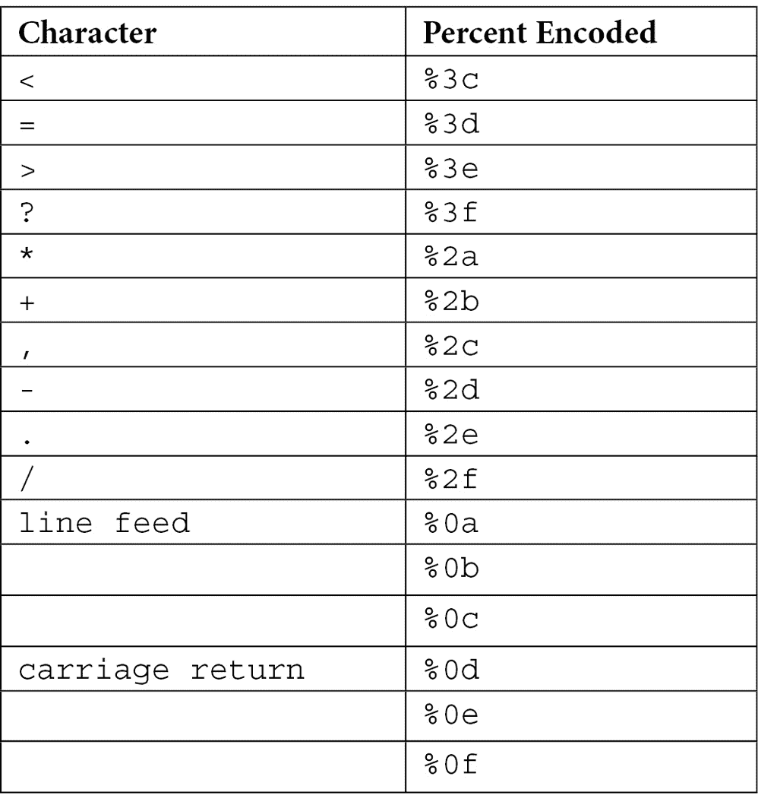

# *第一章*：安全编码基础

理解安全编码原则是成为具有安全意识的 ASP.NET 核心开发人员的基础之一。通过编写安全代码在实践中应用这些概念将有助于您的 web 应用改善其安全状态。

本介绍性章节介绍了每个 ASP.NET 核心开发人员都必须了解的基本安全编码模式。了解这些防御技术将帮助您缓解代码中的安全漏洞，通过这些方法，您将能够了解如何通过使用**白名单**实现正确的**输入验证**，执行**输入净化**，以及如何**逃避输出**和**保护数据**。

在本章中，我们将介绍以下配方：

*   使用验证属性启用白名单输入验证
*   使用`FluentValidation`库进行白名单验证
*   句法和语义验证
*   输入消毒
*   使用`HTMLSanitizer`库输入消毒
*   使用`HtmlEncoder`进行输出编码
*   使用`UrlEncoder`进行输出编码
*   使用`JavascriptEncoder`进行输出编码
*   使用数据保护 API 保护敏感数据

# 技术要求

本书是为配合 VisualStudio 代码、Git 和.NET5.0 而编写和设计的。这些配方中的代码示例将在 ASP.NET Core Razor 页面中提供。示例解决方案还使用 SQLite 作为数据库引擎，以简化设置。您可以在[找到本章的代码 https://github.com/PacktPublishing/ASP.NET-Core-Secure-Coding-Cookbook/tree/main/Chapter01](https://github.com/PacktPublishing/ASP.NET-Core-Secure-Coding-Cookbook/tree/main/Chapter01) 。

# 输入验证

保护应用免受注入攻击最有效的方法之一是编写正确的输入验证。这种防御性编程技术验证输入是否符合预期的数据格式，例如数据类型、长度或范围（仅举几例）。输入可能来自不受信任的源，在未经验证的情况下，恶意参与者可以向 ASP.NET 核心 web 应用提供恶意数据，从而可能利用漏洞进行攻击。此过程可能会影响应用，并可能导致应用执行意外操作。

有两种方式验证输入：

*   黑名单
*   白名单

使用黑名单验证策略，在列表中定义已知的错误输入。然后根据该列表验证数据，以决定是否应接受或拒绝输入。然而，这种方法是有缺陷的，因为您只能定义这么多不好的输入，而且它不是一个全面的列表。攻击者只需构造不在黑名单上的有效负载即可绕过此验证。以下是伪代码中的黑名单示例：

```cs
when receiving a string input
    for each character in string input
        if character is in blacklist
            reject string input
        return error
```

白名单验证恰恰相反，但它是首选策略。以下是它在伪代码中的等价物：

```cs
when receiving a string input
    for each character in string input
        if character is not in whitelist
            reject string input
        return error
```

这里列出了已知良好输入，如果列表中存在数据，则允许数据进入系统，如果不存在，则拒绝。

笔记

本章的大部分内容侧重于输入验证，因为我无法充分强调验证输入的重要性。正确的输入验证可能是最关键的基本安全编码实践，它将使您的 ASP.NET 核心 web 应用显著提高其应用安全性。

# 使用验证属性启用白名单验证

Web开发人员可以利用 ASP.NET Core 提供的内置验证框架。固有**数据注释属性**（**DAA**允许您验证绑定到模型属性的值。根据匹配模式进行验证使我们能够过滤输入，并且我们可以将正则表达式指定为白名单。如果模型的值与正则表达式不相似，则将其视为错误输入。

有很多验证属性可用于围绕模型构建业务规则，但对于我们来说，要实现白名单验证，`RegularExpression`属性必须发挥作用。

在这个配方中，我们将使用`RegularExpression`属性为我们的模型属性定义一个模式，以将字符列入白名单。

## 准备好了吗

通过克隆 ASP.NET Secure Codeing Cookbook 存储库，打开命令 shell 并下载示例网上银行应用：

```cs
git clone https://github.com/PacktPublishing/ASP.NET-Core-Secure-Coding-Cookbook.git
```

运行示例应用以验证没有生成或编译错误。在命令 shell 中，导航到位于`\Chapter01\input-validation\before\OnlineBankingApp`的示例应用文件夹，并运行以下命令：

```cs
dotnet build
```

`dotnet build`命令将构建我们的示例 OnlineBankingApp 项目及其依赖项。

## 怎么做…

让我们来看看这个配方的步骤：

1.  在起始练习文件夹中，通过键入以下命令启动 Visual Studio 代码：

    ```cs
    code .
    ```

2.  打开`Models/Customer.cs`文件，在`FirstName`、`MiddleName`和`LastName`模型属性的顶部添加`[RegularExpressionAttribute]`验证属性，如下代码所示。也包括`^[A-Z]+[a-zA-Z]*$`表达式：

    ```cs
    [RegularExpression(@"^[A-Z]+[a-zA-Z]*$",   ErrorMessage = "First Name must contain only     letters")]
    [Display(Name = "First Name")]
    [StringLength(60, MinimumLength = 3)]
    [Required]        
    public string FirstName { get; set; }
    [RegularExpression(@"^[A-Z]+[a-zA-Z]*$",   ErrorMessage = "Middle Name must contain only     letters")]
    [Display(Name = "Middle Name")]
    [StringLength(60, MinimumLength = 3)]
    [Required]
    public string MiddleName { get; set; }
    [RegularExpression(@"^[A-Z]+[a-zA-Z]*$",  ErrorMessage = "Last Name must contain only     letters")]
    [Display(Name = "Last Name")]
    [StringLength(60, MinimumLength = 3)]
    [Required]        
    public string LastName { get; set; }
    ```

3.  在菜单中导航至**终端****新终端**，或在 Visual Studio 代码中按*Ctrl*+*Shift*+*即可。*
**   在终端中键入以下命令以构建并运行示例应用：

    ```cs
    dotnet run
    ```

    *   打开浏览器并转到`http://localhost:5000/Customers/Create`。*   The browser will display the web page for creating new customers, as shown in the following screenshot:

    

    图 1.1–创建客户页面

    *   在**名字**文本框中，输入包含数字的输入，然后按*选项卡*将焦点转移到不同的输入元素。*   验证将启动，并显示一条错误消息：*

 *

图 1.2–名字属性验证

通过使用`[RegularExpression]`属性验证，将验证规则应用于`FirstName`属性模型，从而限制**名字**字段中允许的字符。

## 它是如何工作的…

使用`[RegularExpression]`验证属性对`Customer`类的`FirstName`、`MiddleName`和`LastName`属性进行注释，以便根据模式检查这些模型属性值。

`^[A-Z]+[a-zA-Z]*$`正则表达式模式指定仅允许在这些字段中使用字母，并且第一个字母应为大写格式。这种白名单技术可以防止不良行为人注入恶意输入，并且只允许客户名称使用已知的好字符。

通过在模型中实现验证，我们避免了不必要的代码重复，从而使代码更易于维护，减少了引入安全漏洞的机会。此模型验证是自动执行的，如果输入无效，则安全失败。

笔记

正则表达式是一个复杂的主题，超出了本食谱的范围。要了解有关正则表达式的更多信息，请参阅 Microsoft 官方文档网站[上的*.NET 正则表达式*https://docs.microsoft.com/en-us/dotnet/standard/base-types/regular-expressions](https://docs.microsoft.com/en-us/dotnet/standard/base-types/regular-expressions) 。

# 使用 FluentValidation 库进行白名单验证

大多数 web开发人员可能希望将验证规则与他们的模型解耦，并希望以单元测试友好的方式编写解决方案。您可能希望创建自己的库来执行白名单验证，或者选择使用流行且易于使用的第三方库，例如具有出色验证功能的`FluentValidation`。

## 准备好了吗

使用 Visual Studio 代码，打开位于`\Chapter01\input-validation-fluentvalidation\before\OnlineBankingApp`的示例网上银行应用文件夹。

## 怎么做…

让我们来看看这个食谱的步骤：

1.  启动 Visual Studio 代码并通过键入以下命令打开启动练习文件夹：

    ```cs
    code .
    ```

2.  导航到菜单中的**终端****新终端**或在 Visual Studio 代码中按*Ctrl*+*Shift*+*即可。*
**   键入以下命令以在项目中安装`FluentValidation`包：

    ```cs
    dotnet add package FluentValidation
    ```

    *   打开`Startup.cs`文件并添加对以下名称空间的引用。这将提供对的`FluentValidation`类和方法的访问：

    ```cs
    using FluentValidation;
    using FluentValidation.AspNetCore;
    ```

    *   添加对`OnlineBankingApp.Models`命名空间的引用：

    ```cs
    using OnlineBankingApp.Models;
    ```

    *   在`ConfigureServices`方法中，添加对`AddFluentValidation`和`AddTransient`方法的调用以配置`FluentValidation`并添加自定义验证器服务，我们将在下一步创建：

    ```cs
    public void ConfigureServices(IserviceCollection   services)
    {
        services.AddRazorPages().AddFluentValidation();
     services.AddTransient<IValidator<Customer>, CustomerValidator>();
    //code removed for brevity
    ```

    *   在`Models`文件夹中，为我们的自定义验证器创建一个新文件，并将其命名为`CustomValidator.cs`。*   在`CustomValidator.cs`中增加以下代码：

    ```cs
    using FluentValidation;
    namespace OnlineBankingApp.Models
    {
        public class CustomerValidator :         AbstractValidator<Customer> {
            public CustomerValidator() {
                RuleFor(x => x.FirstName)                .Matches(@"^[A-Z]+[a-zA-Z]*$");
                RuleFor(x => x.MiddleName)                .Matches(@"^[A-Z]+[a-zA-Z]*$");
                RuleFor(x => x.LastName)                .Matches(@"^[A-Z]+[a-zA-Z]*$");
            }
        }
    }
    ```

    *   导航到菜单中的**终端****新终端**或在 Visual Studio 代码中按*Ctrl*+*Shift*+*即可。***   在终端中键入以下命令以构建并运行示例应用：

    ```cs
    dotnet run
    ```

    *   打开浏览器并转到`http://localhost:5000/Customers/Create`。*   浏览器将显示创建新客户的网页，如*图 1.1*所示。*   在**名字**文本框中，输入包含数字的输入，然后按*选项卡*将焦点转移到不同的输入元素。*   验证将启动，并显示错误消息（参见*图 1.2*。**

 **## 它是如何工作的…

`FluentValidation`是一个服务器端验证框架，允许开发人员使用 lambda表达式定义验证规则。为了将此库集成到我们的示例网上银行 web 应用中，我们安装了`FluentValidation`包，并将其添加为我们解决方案的参考：

```cs
using FluentValidation.AspNetCore;
```

对`AddFluentValidation`扩展方法的调用允许 ASP.NET 核心框架的模型绑定功能使用此库的验证功能：

```cs
services.AddRazorPages().AddFluentValidation();
```

笔记

您仍然可以使用 ASP.NET Core 的内置验证器实现和验证属性，然后将它们与`FluentValidations`包组合。

然后，我们从`AbstractValidator`派生出我们自己的`CustomerValidator`类，这样我们就有了一个类来设置我们的验证规则。在这个 validator 类中，有对`FluentValidation`包的正则表达式的调用，该正则表达式有一个内置的验证器，用于检查任何名称属性是否包含匹配模式中定义的字母：

```cs
RuleFor(x => x.FirstName).Matches(@"^[A-Z]+[a-zA-Z]*$");
RuleFor(x => x.MiddleName).Matches(@"^[A-Z]+[a-zA-Z]*$");
RuleFor(x => x.LastName).Matches(@"^[A-Z]+[a-zA-Z]*$");
```

我们还调用了`AddTransient`方法，将自定义验证器添加到收集服务中：

```cs
services.AddTransient<IValidator<Customer>,
CustomerValidator>();
```

`AddTransient`方法允许 ASP.NET Core发现`CustomerValidator`。

## 还有更多…

前面的两个配方都是*服务器端验证*的示例。这种类型的验证由 web 服务器上运行的代码执行。对于 ASP.NET 核心 web 应用（或一般的任何 web 应用），还有另一种执行验证的方法，它在用户代理（通常是 web 浏览器）中执行。Web 开发人员可以使用 HTML5 表单验证或编写自定义 JavaScript 代码编写*客户端验证*。

搭建 ASP.NET 核心 web 应用项目时，模板通过立即添加*不引人注目的 jQuery 库*作为对`Pages\Shared\_ValidationScriptsPartial.cshtml`的引用，使客户端验证变得容易：

```cs
<script src="~/lib/jquery-validation/dist/jquery.validate.min.js"></script>
<script src="~/lib/jquery-validation-unobtrusive/jquery.validate.unobtrusive.min.js"></script>
```

我们在 Razor 页面中放置的输入标记帮助程序呈现*HTML5 数据-*属性*，在浏览器向 web 服务器发送任何请求之前，我们不引人注目的 JavaScript 库将从客户端读取并验证这些属性。此设置简化了将客户端验证添加到 ASP.NET 核心 web 应用的过程。

提示

*不要*完全依赖客户端验证，*不要*信任来自客户端的输入。用户可以通过浏览器的设置禁用 JavaScript，这将阻止客户端验证代码的执行。

## 另见…

如果您有兴趣了解有关 FluentValidation 库的更多信息，请参阅官方 FluentValidation 库的*ASP.NET 核心*部分：[https://docs.fluentvalidation.net/en/latest/aspnet.html](https://docs.fluentvalidation.net/en/latest/aspnet.html) 。

# 句法和语义验证

前面的配方是**语法验证**的一种形式，我们验证字段结构的正确性（在这种情况下，名称应仅包含字母字符）。

另一种验证类型基于**语义**，其中输入的有效性取决于特定的业务上下文。

## 创建自定义验证属性实现语义验证

在语义验证中，进行上下文检查以确保数据符合业务规则。以我们的网上银行应用为例，我们可以定义一条业务规则，规定客户必须拥有一个信誉良好的电子邮件地址，才能创建记录。

在此配方中，您将学习如何使用自定义验证属性执行语义验证。

## 准备好了吗

在[请求免费 API密钥 https://emailrep.io/key](https://emailrep.io/key) 。**EmailRep**是一个简单的公共 API，用于检查电子邮件的声誉。一旦您的请求获得批准，您将收到一封来自`EmailRep.io`的电子邮件，其中包含您的 API 密钥。使用`EmailRep.io`web API 时使用此 API 密钥。

启用机密存储以安全保存我们的 EmailRep API 密钥。打开终端并运行以下命令：

```cs
dotnet user-secrets init
```

然后，运行以下命令：

```cs
dotnet user-secrets set "EmailRepApiKey" "key=place-your-api-key-here"
```

使用 Visual Studio 代码，打开位于`\Chapter01\input-validation\before\OnlineBankingApp`的示例网上银行应用文件夹。

## 怎么做…

让我们来看看这个食谱的步骤：

1.  启动Visual Studio 代码，通过键入以下命令打开启动练习文件夹：

    ```cs
    code .
    ```

2.  在`Services`文件夹中，创建一个新文件并将其命名为`EmailReputation.cs`。在其中，添加对以下名称空间的引用：

    ```cs
    using System.Net;
    using System.IO;
    using System.Text.Json;
    using Microsoft.Extensions.Configuration;
    using OnlineBankingApp.Models;
    ```

3.  声明一个`IEmailReputation`接口：

    ```cs
    namespace OnlineBankingApp.Services
    {
        public interface IEmailReputation
        {
            bool IsRisky(string input);
        }    
    }
    ```

4.  在相同的`OnlineBankingApp.Services`命名空间中，声明一个继承自`IEmailReputation`接口的`EmailReputation`类。将服务注入其构造函数

    ```cs
    public class EmailReputation : IEmailReputation
    {
        private readonly IConfiguration Configuration;
        public EmailReputation(IConfiguration config)
        {
            Configuration = config;
        }
    }
    ```

5.  Implement the `IsRisky` method in `EmailReputation`:

    ```cs
    public bool IsRisky(string email)
    {
        var emailRepApiKey =        Configuration["EmailRepApiKey"];
        HttpWebRequest repEmailRequest =         (HttpWebRequest)WebRequest.Create             ($"https://emailrep.io/{email}");
        repEmailRequest.Headers.Add("Cookie",        $"{emailRepApiKey}");
        repEmailRequest.Headers.Add("User-Agent",        "MyAppName");
        HttpWebResponse repEmailResponse =      (HttpWebResponse) repEmailRequest.GetResponse();
        Stream newStream =        repEmailResponse.GetResponseStream();
        var repEmail = new         StreamReader(newStream).ReadToEnd();
        var reputation =        JsonSerializer.Deserialize<Reputation>          (repEmail);
        if (reputation.suspicious ||       reputation.details.blacklisted ||       reputation.details.spam ||       reputation.details.malicious_activity ||       reputation.details.malicious_activity_recent)
            return true;
        return false;
    }
    ```

    在这里，我们调用了`EmailRep`查询 API，并发送API 密钥和应用名称作为请求头的一部分；也就是说，`Cookie`和`User-Agent`。响应是 JSON 格式的。我们可以将其反序列化以检索信誉信息。

    提示

    API 密钥*等机密不应在代码或配置文件中硬编码*。泄露这些敏感信息只需要一个有权访问代码存储库的受损帐户。开发人员应将密码和凭据存储在更安全的环境中，如 Azure 密钥库或 AWS 密钥管理服务。

    在这个配方中，我们使用*秘密管理工具*在开发过程中安全地保存`EmailRep`API 密钥。要了解有关 secret manager 工具以及如何存储您的机密的更多信息，请参阅 Microsoft 文档[中 ASP.NET Core 中开发中的*应用机密的安全存储部分 https://docs.microsoft.com/en-us/aspnet/core/security/app-secrets?view=aspnetcore-5.0&选项卡=窗口*](https://docs.microsoft.com/en-us/aspnet/core/security/app-secrets?view=aspnetcore-5.0&tabs=windows)。

6.  导航到`OnlineBankingApp`项目的`Model`文件夹，创建一个名为`ReputableEmailAttribute.cs`的新文件，开始创建自定义验证属性。
7.  将以下命名空间引用添加到`ReputableEmailAttribute.cs`文件：

    ```cs
    using System.ComponentModel.DataAnnotations;
    using System.Net;
    using System.IO;
    using System.Text.Json;
    ```

8.  Declare a `Reputation` and a `Details` class:

    ```cs
    public class Details
    {
        public bool blacklisted { get; set; }
        public bool malicious_activity { get; set; }
        public bool malicious_activity_recent { get; set;}
        public bool spam { get; set; }
        public bool suspicious_tld { get; set; }
    }
    public class Reputation
    {
        public Details { get; set; }
        public string email { get; set; }
        public string reputation { get; set; }
        public bool suspicious { get; set; }
    }    
    ```

    两个类都将保存我们从`EmailRep.io`API 收到的响应中的反序列化信息。

    笔记

    `EmailRep.io`API 的响应包含比我们在`Reputation`和`Details`类中定义的属性更多的信息。我们已经使用了这个食谱中最基本的东西，但是如果你愿意，你可以自由加入更多。

9.  在继承自`ValidationAttribute`并定义`GetErrorMessage`属性的`OnlineBankingApp.Models`命名空间中声明另一个名为`ReputableEmailAttribute`的类：

    ```cs
    namespace OnlineBankingApp.Models
    {
        public class ReputableEmailAttribute :         ValidationAttribute
        {
            public string GetErrorMessage() =>            "Email address is rejected because of its                 reputation";
        }
    }
    ```

10.  将的`ValidationAttribute`的`IsValid`方法改写为以下代码：

    ```cs
    protected override ValidationResult IsValid(object   value,ValidationContext validationContext)
    {
        string email = value.ToString();
        var service = (IEmailReputation)        validationContext.GetService             (typeof(IEmailReputation)); 
        if (service.IsRisky(email))
           return new ValidationResult(GetErrorMessage());
           return ValidationResult.Success;
    }
    ```

11.  修改`Models/Customer.cs`文件，并使用新的自定义`[ReputableEmail]`验证属性

    ```cs
    [ReputableEmail]
    [Display(Name = "Email Address")]
    [Required]
    [EmailAddress]
    public string Email { get; set; }
    ```

    注释`Email`属性
12.  导航到菜单中的**终端****新终端**或在 Visual Studio 代码中按*Ctrl*+*Shift*+*即可。*
**   在终端中键入以下命令以构建和运行示例应用：

    ```cs
    dotnet run
    ```

    *   打开浏览器并转到`http://localhost:5000/Customers`。*   浏览器将显示由种子数据生成的客户列表。*   Select one record and click its **Edit** link:

    

    图 1.3–编辑客户页面

    *   您将被重定向到**编辑**页面，在该页面中您可以修改**客户**的详细信息。*   更改当前的**电子邮件地址**字段，并将其值设置为`email@test.xyz`。*   点击**保存**。注意出现的错误消息，表明电子邮件已被拒绝：*

 *

图 1.4–电子邮件地址属性验证

通过创建自定义验证属性并注释电子邮件地址，我们现在可以在客户模型中执行语义验证。建议编写适当的自定义模型验证器，因为它在创建验证规则时提供了更多的控制和灵活性。

## 它是如何工作的…

我们创建了一个新类，该类继承自`ValidateAttribute`并重写其`IsValid`方法。为了实施语义验证，我们创建了一个服务，我们的自定义属性将使用该服务调用**EmailRep 查询 API**，并确定其`EmailAddress`是否与任何已知的恶意活动相关，标记为垃圾邮件、可疑或黑名单：

```cs
 if (reputation.suspicious ||    reputation.details.blacklisted ||     reputation.details.spam ||    reputation.details.malicious_activity ||    reputation.details.malicious_activity_recent)  
    return new ValidationResult(GetErrorMessage());
return ValidationResult.Success;
```

这种类型的验证（电子邮件地址因其声誉而被拒绝）可能是您所熟悉的。这种验证称为黑名单。**黑名单验证**是您可以在 ASP.NET 核心 web 应用中使用的验证策略之一。

糟糕的验证会使 ASP.NET 核心 web 应用面临不必要的安全风险。在应用中实现足够的验证策略以覆盖语法和语义规则，从而减少注入和逻辑漏洞的机会，这一点至关重要。使用内置验证框架或可信的第三方验证库（如 FluentValidation）是很好的对策。

笔记

许多其他公司提供相同的电子邮件声誉服务，该服务提供评分并评估电子邮件地址的风险。根据您的要求使用可靠的 API 服务，并需要在将记录保存到数据库之前检查电子邮件地址的完整性。

# 输入消毒

开发人员在处理输入时可以实现的另一个补充策略是从数据中删除或替换不需要的字符。您的应用可能需要一些自由格式的文本或 HTML 格式的输入，为了避免利用此向量的攻击，您必须执行**清理**。

您可以编写自己的清理方法，并与输入验证类似，实现修改输入的白名单或黑名单方法。

在本食谱中，您将学习如何编写自己的代码来进行消毒输入。

## 准备好了吗

使用 Visual Studio 代码，打开位于`\Chapter01\input-sanitization\before\OnlineBankingApp`的示例网上银行应用文件夹。

## 怎么做…

让我们看看这个食谱的步骤：

1.  启动 Visual Studio 代码并通过键入以下命令打开启动练习文件夹：

    ```cs
    code .
    ```

2.  打开`Models/FundTransfer.cs`文件，添加对`System.Text.RegularExpressions`名称空间的引用：

    ```cs
    using System.Text.RegularExpressions;
    ```

3.  修改`Note`模型属性

    ```cs
    [StringLength(60)]
    [DataType(DataType.MultilineText)]
    public string Note {
        get => note; 
        set => note = Regex.Replace(value,         @"[\!\@\$\%\^\&\<\>\?\|\;\[\]\{\~]+"            , string.Empty); 
    }
    ```

    中的代码
4.  导航到菜单中的**终端****新终端**或在 Visual Studio 代码中按*Ctrl*+*Shift*+*即可。*
**   在 Visual Studio 代码终端中，键入以下命令以生成并运行示例应用：

    ```cs
    dotnet run
    ```

    *   打开浏览器，进入`http://localhost:5000/FundTransfers/Create`。*   通过下拉列表选择要转帐的帐户。*   输入要转账的**金额**。*   In the **Notes** multi-text field, attempt to exploit the app by entering a malicious script tag (that is, `<script>alert()</script>`), as shown in the following screenshot:

    

    图 1.5–注释字段中的恶意输入

    *   点击**发送**。*   示例应用会将您重定向到**资金转账**页面，您将看到最近创建的资金转账记录。*   请注意，小于和大于字符已从**注释**部分中删除，现在已被消毒：*

 *

图 1.6–消毒注释值

我们可以将`[\!\@\$\%\^\&\<\>\?\|\;\[\]\{\~]+`正则表达式作为`Regex.Replace`方法参数之一传递，指定要删除与此模式匹配的不需要的字符。此方法将**注释**输入值从`<script>alert()</script>`更改为`scriptalert()/script`，使得渲染输出更加安全。

## 它是如何工作的…

我们的样本网上银行应用有一个**资金转账**页面，允许用户在账户之间转账。其中一个表单字段是**注释**，它允许用户输入用 HTML 标记格式化的自由格式文本。

我们修改了**Note**模型属性的集合评估器，以清理分配给它的值，以防止出现不需要的字符或标记，例如`<script>`标记。

我们添加了对`System.Text.RegularExpressions`名称空间的引用，以便使用`Regex.Replace`方法清理输入。使用`Regex.Replace`方法，我们指定了一个正则表达式模式，以便在值中查找；如果找到匹配项，我们将其替换为空字符串。

# 使用 HTMLSanitizer 库输入消毒

还有其他的开源库在净化输入方面做得很好，其中之一就是`HTMLSanitizer`。

在本食谱中，您将学习如何使用`HTMLSanitizer`第三方库对输入进行消毒。

## 准备好了吗

使用 Visual Studio 代码，打开位于`\Chapter01\input-sanitization-htmlsanitizer\before\OnlineBankingApp`的示例网上银行应用文件夹。

## 怎么做…

让我们来看看这个食谱的步骤：

1.  启动 Visual Studio 代码并通过键入以下命令打开启动练习文件夹：

    ```cs
    code .
    ```

2.  导航到菜单中的**终端****新终端**或在 Visual Studio 代码中按*Ctrl*+*Shift*+*即可。*
**   键入以下命令在您的项目中安装软件包：

    ```cs
    dotnet add package HtmlSanitizer 
    ```

    *   打开`Models/FundTransfer.cs`文件，添加对`Ganss.XSS`的引用，即`HtmlSanitizer`名称空间：

    ```cs
    using Ganss.XSS;
    ```

    *   修改`Note`模型属性设置器中的代码：

    ```cs
    [StringLength(60)]
    [DataType(DataType.MultilineText)]
    public string Note {
        get => note;
        set => note = new HtmlSanitizer().Sanitize(value); 
    }
    ```

    *   在 Visual Studio 代码终端中，键入以下命令以生成并运行示例应用：

    ```cs
    dotnet run
    ```

    *   打开浏览器并转到`http://localhost:5000/FundTransfers/Create`。*   通过下拉列表选择要从和转账的账户。*   输入要转账的**金额**。*   In the **Notes** multi-text field, enter `<b>Contingency Fund<b> <script>alert()</script>`. This is a string that's formatted with a bold tag that has a malicious script tag next to it, as shown in the following screenshot:

    

    图 1.7–注释字段中的 HTML 格式输入

    *   点击**发送**。*   示例应用会将您重定向到**资金转账**页面，您将看到最近创建的资金转账记录。*   请注意，**应急基金**字符串的格式为粗体，但脚本标记已完全删除：*

 *

图 1.8–格式化和消毒注释值

使用`HtmlSanitizer`NuGet 包，我们可以清理用户控制的输入，并防止我们的示例解决方案存在**XSS**漏洞。

## 它是如何工作的…

为了在我们的示例网上银行应用中为我们的**注释**提供安全的 HTML 格式，我们必须清理输入，使其不包含任何有害的标记和属性。`HTMLSanitizer`帮助我们完成此任务，内置**白名单机制**，只允许特定的 HTML 或 CSS 标签和属性。

前面的代码显示`Sanitize`方法从输入字符串中去除了不在白名单中的其余标记或属性。

默认情况下，`HTMLSanitizer`已经提供了安全标签列表。您可以创建自己的白名单，但在我们的示例中，我们不需要设置`Sanitizer`实例的`AllowTags`或`AllowAttribute`属性；只需调用`Sanitize`方法并传递值即可。

# 输出编码

**输出编码**或**逃逸**仍然是另一种有助于中和注射攻击的防御技术。此过程将替换不受信任数据中的字符，从而允许应用在其适当的上下文中安全地显示输出。

在 ASP.NET 核心 web 应用中，开发人员应该了解不同的上下文输出，以了解在给定上下文中使用的正确编码器。这些是**HTML**、**HTML 属性上下文**、**CSS 上下文**和**JavaScript 上下文**。

默认情况下，ASP.NET Core中的Razor引擎会自动转义输出，除了少数例外情况，其中一个方法会禁用这种编码。ASP.NET Core还提供了多种编码器，我们可以使用它们显式实现适当的上下文输出。

在接下来的几个食谱中，我们将学习如何使用`HtmlEncoder`、`UrlEncoder`和`JavascriptEncoder`执行输出编码。

# 使用 HtmlEncoder 进行输出编码

**HTML 编码**转换特殊字符，以便浏览器将正确解释文本，而不是将其呈现为 HTML。例如，字符串可能包含小于字符`<`，在 HTML 标准中，这是用于打开和关闭标记的 HTML 实体。这需要转义到`&lt;`中以保留文本的含义。

转义输出提供的保护在于防止攻击者在解释器解析输入时更改其意图或目的。这将阻止恶意参与者尝试在 HTML 上下文中执行脚本。

下表显示了最常见的 HTML 实体及其编码对应项。这绝不是一份完整的清单：


表 1.1–HTML 实体

在本食谱中，您将学习如何使用`HtmlEncoder`以 HTML 格式转义输出。

## 准备好了吗

使用 Visual Studio 代码，打开位于`\Chapter01\output-encoding-html\before\OnlineBankingApp`的示例网上银行应用文件夹。

## 怎么做…

让我们看一下这个配方的步骤：

1.  启动 Visual Studio 代码并通过键入以下命令打开启动练习文件夹：

    ```cs
    code .
    ```

2.  打开`Pages\FundTransfers\Index.cshtml`文件，在 Razor 页面添加`@inject`指令，注入`HtmlEncoder`服务：

    ```cs
    @inject System.Text.Encodings.Web.HtmlEncoder htmlEncoder
    ```

3.  将`Note`表格数据单元格内的标记替换为以下代码：

    ```cs
    @if (item.Note is not null) { 
        @(new Microsoft.AspNetCore.Html.HtmlString         (htmlEncoder.Encode(item.Note)))
    }
    ```

4.  导航到菜单中的**终端****新终端**或在 Visual Studio 代码中按*Ctrl*+*Shift*+*即可。*
**   在 Visual Studio 终端中，键入以下命令以生成并运行示例应用：

    ```cs
    dotnet run
    ```

    *   打开浏览器并转到`http://localhost:5000/FundTransfers`。*   通过右键单击页面中的任意位置并从浏览器上下文菜单中选择**查看页面源**来查看呈现的 HTML。*   请注意带有脚本标记的**注释**已被 HTML 编码的标记：

    ```cs
    <td>Contingency Fund &lt;script&gt;alert()&lt;/script&gt; </td>
    ```* 

 *## 它是如何工作的…

`System.Text.Encodings.Web`名称空间引入了大量字符编码器，开发人员可以使用这些编码器转义输出。其中之一是`HtmlEncoder`，它将帮助我们对数据进行 HTML 编码。

通过依赖注入，我们可以使用`@inject`指令添加`HtmlEncoder`对象：

```cs
@inject System.Text.Encodings.Web.HtmlEncoder htmlEncoder
```

`htmlEncoder`变量将保存`HtmlEncoder`对象的一个实例，通过其`Encode`方法，我们可以从`FundTransfer`对象传入`Note`属性的值进行转义：

```cs
htmlEncoder.Encode(item.Note)
```

`Encode`方法转换`item.Note`的值，现在将成为编码字符串。

# 使用 URLCoder 进行输出编码

URL编码将输出中的字符转换为 ASCII格式。它还将不安全字符替换为`%`字符作为前缀，然后添加两个十六进制数字。

以下是字符及其 URL 编码等价物的部分列表：



表 1.2——编码字符及其等价物的百分比

在本食谱中，您将学习如何使用`UrlEncoder`转义 URL。

## 准备好了吗

使用 Visual Studio 代码，打开位于`\Chapter01\output-encoding-url\before\OnlineBankingApp`的示例网上银行应用文件夹。

## 怎么做…

让我们来看看这个配方的步骤：

1.  启动 Visual Studio 代码并通过键入以下命令打开启动练习文件夹：

    ```cs
    code .
    ```

2.  打开`Pages\FundTransfers\Index.cshtml`文件，在 Razor 页面添加`@inject`指令，注入`UrlEncoder`服务：

    ```cs
    @inject System.Text.Encodings.Web.UrlEncoder urlEncoder
    ```

3.  将`Note`表格数据单元格内的标记替换为以下代码：

    ```cs
    <td>
    <a asp-page="./Create" asp-route-id="@item.ID" asp-fragment="@(item.Note is null ? string.Empty : urlEncoder.Encode(item.Note))" >Send Again</a>
    </td>
    ```

4.  导航到菜单中的**终端****新终端**或在 Visual Studio 代码中按*Ctrl*+*Shift*+*即可。*
**   在 Visual Studio 终端中，键入以下命令以生成并运行示例应用：

    ```cs
    dotnet run
    ```

    *   打开浏览器并转到`http://localhost:5000/FundTransfers`。*   通过右键单击页面中的任意位置并从浏览器上下文菜单中选择**查看页面源**来查看呈现的 HTML。*   请注意，`Send Again`的超链接及其脚本标记被URL 编码为

    ```cs
    <td>
    <a href="/FundTransfers/Create?id=1#Contingency%20 Fund%20%3Cscript%3Ealert()%3C%2Fscript%3E">Send Again</a>
    </td>
    ```

    的标记*

 *片段中的文本现在已按百分比编码，因此将潜在的恶意字符（如`<`和 `>`）替换为`%3C`和`%3E`。

## 它是如何工作的…

`asp-fragment`属性被分配`Note`模型属性值，作为一条持续信息发送到**创建新资金转账**页面：

```cs
asp-fragment="@(item.Note is null ? string.Empty : item.Note)
```

在不编码`item.Note`URL 片段的情况下，在目标页面中处理此数据的代码可以选择此值并按文本形式解析它。处理未扫描数据的风险在于，解释器可能会将其作为代码，并基于错误的上下文执行它。

我们可以使用`UrlEncoder`对象的`Encode`方法来转义`Note`模型属性值，以防止这种情况发生。

# 使用 JavascriptEncoder 进行输出编码

没有 JavaScript，Web 开发就不可能完成。它一直是开发 web 应用的事实上的脚本语言，用于多种用途，从动画到验证客户端的输入。在某些情况下，开发人员会将 JavaScript 代码块与 C 代码或 ASP.NET 核心页面中的 Razor 语法混合使用。这种方法使得在 JavaScript 旁边转义 outp`ut 成为必要，并且还可以防止 JavaScript 代码被注入恶意函数。

在本教程中，您将学习如何使用`JavascriptEncoder`在 JavaScript 中转义输出。

## 准备好了吗

使用 Visual Studio 代码，打开位于`\Chapter01\output-encoding-js\before\OnlineBankingApp`的示例网上银行应用文件夹。

## 怎么做…

让我们来看看这个食谱的步骤：

1.  启动 Visual Studio 代码并通过键入以下命令打开启动练习文件夹：

    ```cs
    code .
    ```

2.  打开`Pages\Customers\Index.cshtml`文件，在 Razor 页面添加`@inject`指令，注入`JavascriptEncoder`服务：

    ```cs
    @inject System.Text.Encodings.Web.JavaScriptEncoder jsEncoder
    ```

3.  将`@section Scripts`替换为以下代码：

    ```cs
    @section Scripts {
        <script type="text/javascript">    
            $(document).ready(function() {
                @foreach (var item in Model.Customer) {
                    <text>
                        var $tr = $('<tr>').append                       ($('<td>').text("@jsEncoder                         .Encode(item.FirstName)"));
                        $tr.append($('<td>').text                       ("@jsEncoder.Encode(item                         .MiddleName)"));
                        $tr.append($('<td>').text                        ("@jsEncoder.Encode                          (item.LastName)"));
                        $tr.append($('<td>')                      .text("@jsEncoder.Encode                         (item.DateOfBirth.ToString                           ("d"))"));
                        $tr.append($('<td>').text                        ("@jsEncoder.Encode                          (item.Email)"));
                        $tr.append($('<td>').text                        ("@jsEncoder.Encode                          (item.Phone)"));
                        $tr.appendTo('#table');
                    </text>
                }
            });

        </script>
    }
    ```

4.  导航到菜单中的**终端****新终端**或在 Visual Studio 代码中按*Ctrl*+*Shift*+*即可。*
**   在VisualStudio 终端中，键入以下命令以构建并运行示例应用：

    ```cs
    dotnet run
    ```

    *   打开浏览器并转到`http://localhost:5000/Customers`。*   通过右键单击页面中的任意位置并在浏览器上下文菜单中选择**查看页面源**来查看呈现的 HTML。*   请注意，**查看详细信息**的超链接及其脚本标记已被 URL 编码的标记：

    ```cs
    var $tr = $('<tr>').append($('<td>').text("Dylan \u003C/script\u003E\u003Cscript\u003Ealert()\u003C/script\u003E"));
    ```* 

 *模型属性值中的字符现在是 JavaScript 编码的，从而防止坏角色利用输出和注入任意 JavaScript 代码。

## 它是如何工作的…

在`script`部分中，我们有 jQuery 代码，可以动态生成 HTML 表的内容。循环遍历`Customer`集合的每个项并将其呈现到每个表的单元格：

```cs
        $(document).ready(function() {
            @foreach (var item in Model.Customer) {
                <text>
                ...code removed for brevity 
                </text>
            }
        });

    </script>
}
```

在JavaScript上下文中，我们使用`JavascriptEncoder`对象并调用`Encode`方法对模型中的所有数据进行编码。

# 使用数据保护 API 保护敏感数据

ASP.NET 核心安全编码技术的一部分应该包括在静止状态下保护应用的敏感数据，这是没有问题的。**个人身份信息**（**PII**）、被归类为机密的数据以及可列举的密钥和 ID 应加密。ASP.NET Core 通过在其提供简化 API 的框架中开发数据保护堆栈，使开发人员能够轻松实现这一点。

在本教程中，您将学习如何使用**数据保护 API**（**DPAPI**）来保护 ASP.NET 核心 web 应用中暴露敏感数据的部分。

## 准备好了吗

使用 Visual Studio 代码，打开位于`\Chapter01\data-protection\before\OnlineBankingApp`的示例网上银行应用文件夹。

## 怎么做…

让我们来看看这个食谱的步骤：

1.  启动 Visual Studio 代码并通过键入以下命令打开启动练习文件夹：

    ```cs
    code .
    ```

2.  打开`Pages\Customers\Index.cshtml.cs`文件，添加对`Microsoft.AspNetCore.DataProtection`名称空间的引用：

    ```cs
    using Microsoft.AspNetCore.DataProtection;
    ```

3.  将 Data Protector 接口添加为私有成员：

    ```cs
    private readonly IDataProtector _dataProtector;
    ```

4.  修改`IndexModel`页面模型，使其包含构造函数的附加参数：

    ```cs
    public IndexModel(OnlineBankingApp.Data   .OnlineBankingAppContext context,     IDataProtectionProvider dataProtector)
    {
        _context = context;
        _dataProtector = dataProtector.CreateProtector         ("OnlineBankingApp.Pages.Customers");
    }
    ```

5.  在`Customer`类

    ```cs
    [NotMapped]
    public string EncCustomerID { get; set; }
    ```

    中添加一个新的`EncCustomerID`属性
6.  使用`Protect`方法

    ```cs
    public async Task OnGetAsync()
    {
     foreach (var cust in _context.Customer)
     {
     cust.EncCustomerID =            _dataProtector.Protect(cust.ID.ToString());
    }
        Customer = await _context.Customer.ToListAsync();
    }
    ```

    加密`Customer`类的 ID 属性
7.  更改 jQuery 代码动态生成锚定标签的行：

    ```cs
    $tr.append($('<td>').append("<a href='/Customers/Details?id=@item.EncCustomerID'>See Details</a>"));
    ```

8.  打开`Pages\Customers\Details.cshtml.cs`文件，添加对`Microsoft.AspNetCore.DataProtection`名称空间的引用：

    ```cs
    using Microsoft.AspNetCore.DataProtection;
    ```

9.  将 Data Protector 接口添加为私有成员：

    ```cs
    private readonly IDataProtector _dataProtector;
    ```

10.  修改页面模型中的`DetailsModel`页面，使其包含一个额外的构造函数参数：

    ```cs
    public DetailsModel   (OnlineBankingApp.Data.OnlineBankingAppContext     context, IDataProtectionProvider dataProtector)
    {
        _context = context;
        _dataProtector = dataProtector.CreateProtector         ("OnlineBankingApp.Pages.Customers");
    }
    ```

11.  更改`OnGetAsync`方法：

    ```cs
    public async Task<IActionResult> OnGetAsync(string id)
    {
        if (id == null)
        {
            return NotFound();
        }
        var decID =         Int32.Parse(_dataProtector.Unprotect(id));
        Customer = await _context.Customer         .FirstOrDefaultAsync(m => m.ID == decID);
    ```

12.  打开一个浏览器，进入`http://localhost:5000/Customers`。
13.  通过右键单击页面中的任意位置并从浏览器上下文菜单中选择**查看页面源**来查看呈现的 HTML。
14.  请注意 jQuery 代码的两行，其中指向**详细信息**页面的超链接不再显示查询字符串参数

    ```cs
    $tr.append($('<td>').append("<a href='/Customers/Details?id=CfDJ8CsNdycKdZtHo72FYN-pXqvrK1k8Z-c4FPe7huOeyCazSmmHbF8fUaQAbio0JpDxOcg9J4-voevmBcHwpBsJWx77ZG5vhpzkLnGB8m13uBo5BLiIdsl2Epk9kj97d5PRJw'>See Details</a>"));
    ...
    $tr.append($('<td>').append("<a href='/Customers/Details?id=CfDJ8CsNdycKdZtHo72FYN-pXquGL7YVUQfASM5cVvyol-OK-xQyErXGit9Kdgs6YyBBdEcNtoqq9c7kqr1J7EzkI0zszL-700OTcVgXvqY4wdyseN-2uESydCdv-KOqOXboLg'>See Details</a>"));
    ```

    中的实际**客户 ID**

`href`属性现在已替换为一个 URL，该 URL 为`id`查询字符串参数附加了一个不同的值。此参数现在具有加密形式的客户 ID。

## 它是如何工作的…

我们的**客户 ID**最初在锚定标记中作为查询字符串参数值公开，可以使用浏览器开发工具轻松查看。这使得应用容易受到基于枚举类型的攻击，因此我们需要保护此数据免受窥探：

```cs
<a href="/Customers/Details?id=1">See Details</a>
```

笔记

通常，数字类型作为主键已经成为过去，企业数据库设计不再使用数字 ID，而是使用**全局唯一标识符**（**GUID**）。但为了简化起见，我们可以使用整数来理解使用可猜测键的风险。

我们可以利用**DPAPI**提供的数据保护服务和**加密**此信息，然后再在页面上呈现链接。

首先添加对`Microsoft.AspNetCore.DataProtection`的引用，并通过将此服务注入我们的`pagemodel`来利用`IDataProtectionProvider`：

```cs
DetailsModel(OnlineBankingApp.Data.OnlineBankingAppContext context, IDataProtectionProvider dataProtector)
```

将此接口添加到构造函数允许我们调用`CreateProtector`方法，以便创建`IDataProtector`对象的实例。`IDataProtector`所需的参数之一是唯一的*目的字符串*，我们可以使用它来加密和解密有效负载：

```cs
_dataProtector = dataProtector.CreateProtector ("OnlineBankingApp.Pages.Customers");
```

我们将使用`OnlineBankingApp.Pages.Customers`作为`Index`和`Detail`模型的目的字符串来破译客户 ID，这是我们试图保护的信息。*目的字符串*创建隔离，防止`DetailsModel`和`IndexModel`以外的使用者解密受保护的数据。

我们需要添加一个新属性来保存加密的客户 ID，因此我们必须将`EncCustomerID`定义为字符串数据类型。我们将使用`[NotMapped]`对其进行注释，以防止 Entity Framework 为此新属性创建列：

```cs
[NotMapped]
public string EncCustomerID { get; set; }
```

最后，我们必须遍历所有客户，保护他们的客户 ID，并将其分配给`EncCustomerID`属性：

```cs
foreach (var cust in _context.Customer)
{
    cust.EncCustomerID =         _dataProtector.Protect(cust.ID.ToString());
}
```

需要时从`DetailsModel`添加`UnProtect`。在这里，我们必须解密受保护的数据以从数据库中提取信息：

```cs
var decID = Int32.Parse(_dataProtector.Unprotect(id));
```

如果`_dataProtector`是用不同的**目的字符串**实例化的，则会抛出一个`CryptographicException`；否则，密文的解密将成功。

## 另见

前面的方法是一个简单的示例，说明如何快速实现**DPAPI**并保护 ASP.NET 核心 web 应用中的数据。要了解 DPAPI 背后的原理，并深入了解 API，请参阅 Microsoft 官方文档中的[中的*ASP.NET 核心数据保护*https://docs.microsoft.com/en-us/aspnet/core/security/data-protection/introduction?view=aspnetcore-5.0](https://docs.microsoft.com/en-us/aspnet/core/security/data-protection/introduction?view=aspnetcore-5.0)。*********