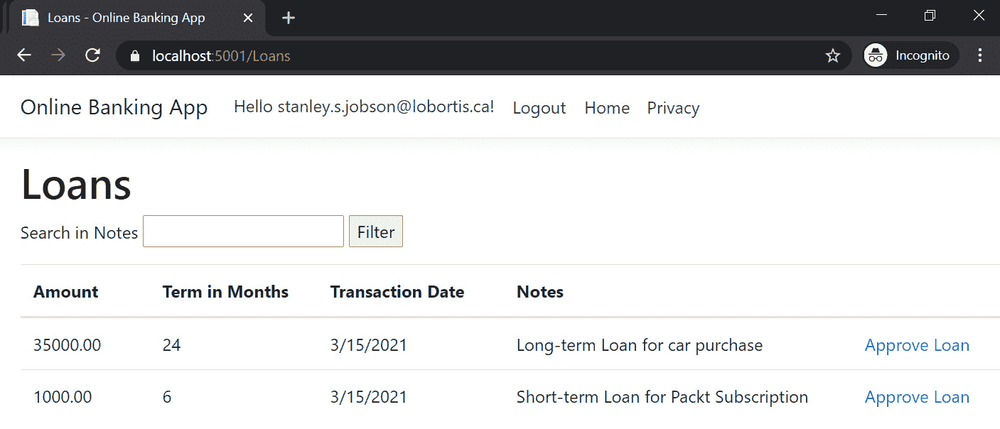
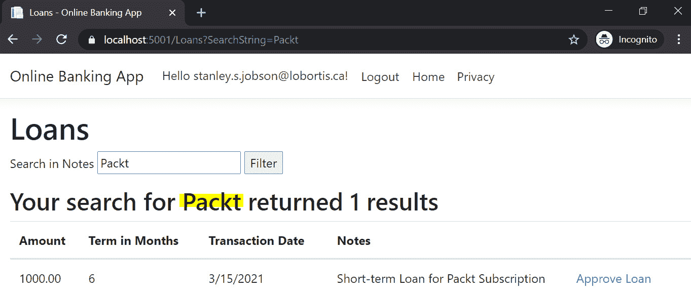
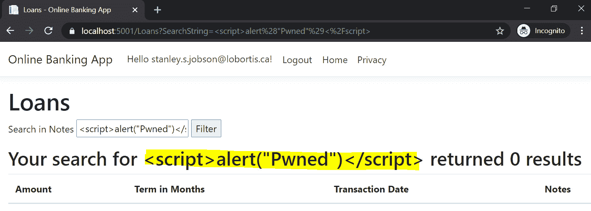
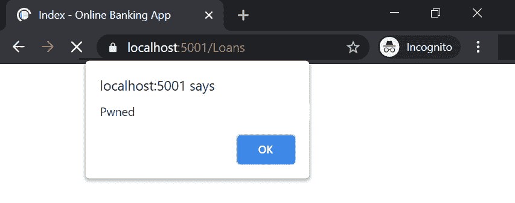
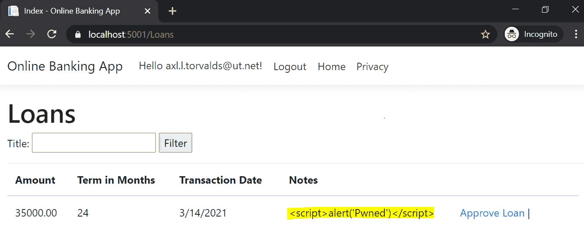
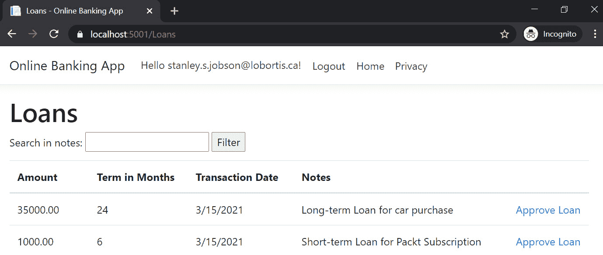
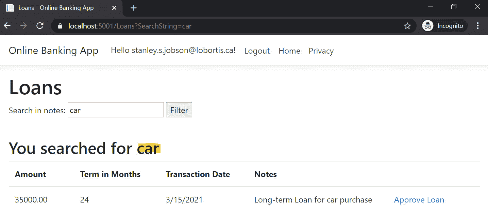
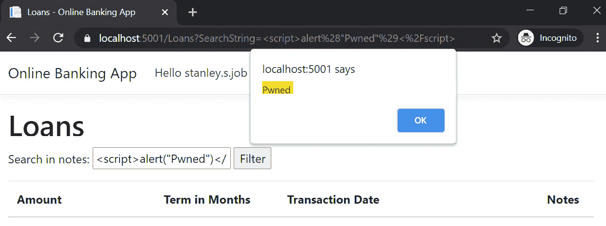
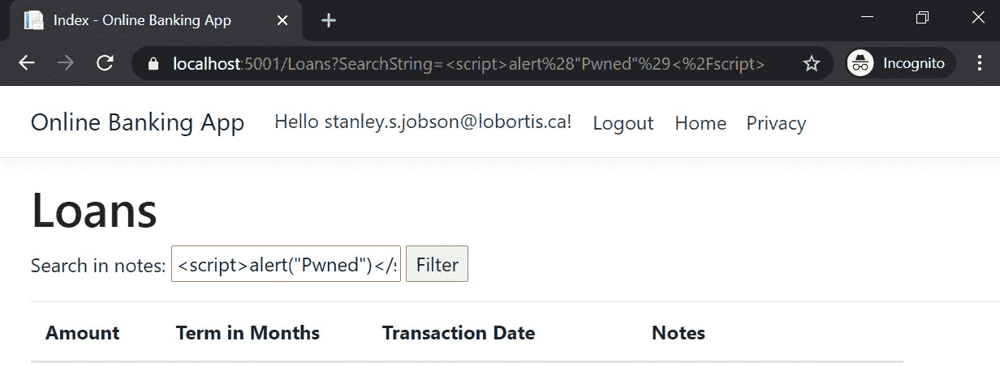

# *第 8 章*：跨站点脚本

**跨站点脚本**仍然是当今 web 应用中普遍存在的漏洞之一。也称为**XSS**，它是一种安全缺陷，允许攻击者将恶意客户端代码插入 ASP.NET Core网页。由于缺乏净化和过滤，注入的输入成为可能，浏览器处理不需要的任意代码。

未知用户可以在浏览器中运行恶意脚本的 XSS 攻击中查看易受攻击的网页。一旦代码执行，攻击者可能会将用户重定向到恶意网站，可能会窃取其会话 cookie，或破坏您的 ASP.NET Core web 应用。

在本章中，我们将介绍以下配方：

*   固定反射 XSS
*   修复存储/持久 XSS
*   修复 domxss

在本章结束时，您将学习如何通过正确编码和转义输出来保护 ASP.NET Core web 应用不受不同类型 XSS 的影响。您还将通过使用第三方库函数来减轻跨站点脚本攻击，从而发现逃避输出的方法。

# 技术要求

这本书是为配合 VisualStudio 代码、Git 和.NET5.0 而编写和设计的。ASP.NET Core Razor 页面中提供了配方中的代码示例。示例解决方案还使用 SQLite 作为数据库引擎，以简化设置。本章的完整代码示例可在[上找到 https://github.com/PacktPublishing/ASP.NET-Core-Secure-Coding-Cookbook/tree/main/Chapter08](https://github.com/PacktPublishing/ASP.NET-Core-Secure-Coding-Cookbook/tree/main/Chapter08) 。

# 固定反射 XSS

**反射式跨站点脚本**是一种 XSS 类型，在这种 XSS 中，坏角色可以将代码作为 HTTP 响应的一部分注入。反射的 XSS 是非持久性的，不会存储在数据库中，但攻击负载会返回到浏览器，反映不可信的输入。

当输出未编码时，可能会出现反射的 XSS 漏洞；当被欺骗的用户单击包含 XSS 负载的恶意链接时，可能会利用该漏洞进行攻击。在此配方中，我们将使用 Razor 页面的内置编码功能修复反射的 XSS 漏洞。

## 准备好了吗

对于本章中的菜谱，我们需要一个示例网上银行应用。

通过克隆 ASP.NET Secure Codeing Cookbook 存储库，打开命令 shell 并下载示例网上银行应用，如下所示：

```cs
git clone https://github.com/PacktPublishing/ASP.NET-Core-Secure-Coding-Cookbook.git
```

运行示例应用以验证没有生成或编译错误。在命令 shell 中，导航到位于`\Chapter08\reflected-xss\before\OnlineBankingApp`的示例应用文件夹，并运行以下命令：

```cs
dotnet build
```

`dotnet build`命令将构建示例`OnlineBankingApp`项目及其依赖项。

现在，让我们实际了解如何利用反射的 XSS 漏洞。

### 测试反射 XSS

以下是步骤：

1.  导航到菜单中的**终端****新终端**或在 Visual Studio 代码中按*Ctrl*+*Shift*+*即可。*
**   在终端中键入以下命令以构建并运行示例应用：

    ```cs
    dotnet run
    ```

    *   打开浏览器并转到`https://localhost:5001/Loans`。*   Log in using the following credentials:

    a） 电邮：`stanley.s.jobson@lobortis.ca`

    b） 密码：`rUj5jtV8jrTyHnx!`

    *   Once authenticated, you will be redirected to the **Loans** page:

    

    图 8.1–贷款页面

    *   Type `Packt` as the keyword to search in the textbox on top of the empty table and hit the **Filter** button. Notice that the search term is displayed as a message:

    

    图 8.2–关键字搜索

    *   为了测试我们的示例网银解决方案是否易受 XSS 攻击，我们在搜索栏中输入 XSS有效负载`<script>alert("Pwned")</script>`，然后点击**过滤器**按钮。检查此测试的结果：*

 *

图 8.3–反射 XSS

请注意，显示了一个警报框，指示 XSS 注入成功，并证明**贷款**页面容易受到反射 XSS 的攻击。检查测试生成的 URL。攻击者可以通过电子邮件或社会工程策略将此 URL 发送给未知用户：`https://localhost:5001/Loans?SearchString=%3Cscript%3Ealert%28%22Pwned%22%29%3C%2Fscript%3E`。

## 怎么做…

让我们看看这个食谱的步骤：

1.  在起始练习文件夹中，通过键入以下命令启动 Visual Studio 代码：

    ```cs
    code .
    ```

2.  Open `Pages\Loans\Index.cshtml` and observe the markup just after the HTML table element:

    ```cs
    <table class="table">
        @{
            if(Model.SearchString is not null){
                <h2>Your searched for                @Html.Raw(@Model.SearchString) returned                   @Model.Loan.Count results</h2>
            }
        }
    // code removed for brevity
    ```

    输入的贷款票据搜索词使用`Html.Raw`显示在页面上，允许在`<h2>`HTML 标记中呈现未过滤的字符串。通过在搜索文本框中输入恶意的跨站点脚本有效负载攻击，坏参与者可以利用缺少输出编码的漏洞进行攻击。

3.  To remediate the security flaw in our code, we remove the call to the `Html.Raw` method:

    ```cs
    <table class="table">
        @{
            if(Model.SearchString is not null){
                <h2>Your searched for                 @Model.SearchString returned                     @Model.Loan.Count results</h2>
            }
        }
    ```

    `Html.Raw`不应用于呈现用户控制的输入。避免使用这种方法。

4.  要测试代码修复是否工作，请在*测试 XSS*部分重复*步骤 1-7*并查看结果：



图 8.4-缓解的反射 XSS

请注意，反射的 XSS 负载不再工作。

## 它是如何工作的…

**贷款**页面提供了一个搜索功能，可以输入关键字来定位并返回匹配的记录。当使用`Html.Raw`方法显示搜索词时，此页面易受攻击。`Html.Raw`是一种返回未编码字符串的方法，将此页面暴露于反射的 XSS 攻击。

我们通过删除对`Html.Raw`方法的调用，并使用内置的 Razor 语法来呈现`SearchString`的标记，从而降低了这种风险并防止了攻击。计算为字符串类型的 Razor 语法返回一个转义字符串，该字符串使`SearchString`输出能够安全地呈现。

# 固定存储/持久 XSS

**存储或持久 XSS**是另一种类型的跨站点脚本漏洞。存储数据的 ASP.NET Core web 应用可能容易受到此 XSS 攻击变体的攻击。当攻击者提供的受污染数据保存在永久性存储或数据库中，并最终通过查看这些易受攻击的 ASP.NET Core网页而不首先让应用输出转义数据而交付给用户时，就会发生存储 XSS。在此配方中，我们将通过在页面上显示数据时使用编码值修复存储的 XSS 漏洞。

让我们实际了解如何利用反射的 XSS 漏洞。

### 测试存储的 XSS

以下是步骤：

1.  导航到菜单中的**终端****新终端**或在 Visual Studio 代码中按*Ctrl*+*Shift*+*即可。*
**   在终端中键入以下命令以构建并运行示例应用：

    ```cs
    dotnet run
    ```

    *   打开浏览器并转到`https://localhost:5001/Loans`。*   Log in using the following credentials:

    a） 电邮：`axl.l.torvalds@ut.net`

    b） 密码：`6GKqqtQQTii92ke!`

    *   一旦认证，您将被重定向到**贷款**页面。请注意显示的消息：*

 *

图 8.5–存储的 XSS

此时会显示一个警报框，指示**贷款**页面上的数据已被污染，从而使我们的示例网上银行应用易于存储 XSS。

## 准备好了吗

我们将使用上一个配方中使用的网上银行应用。使用 Visual Studio 代码，打开位于`\Chapter08\stored-xss\before\OnlineBankingApp\`的示例网上银行应用文件夹。

您可以执行此文件夹中的步骤来修复此配方中缺少的安全功能。

怎么做…

让我们来看看这个食谱的步骤：

1.  在起始练习文件夹中，通过键入以下命令启动 Visual Studio 代码：

    ```cs
    code .
    ```

2.  Open `Pages\Loans\Index.cshtml` and examine the data cell that displays `Note` in the `<td>` tag:

    ```cs
    @foreach (var item in Model.Loan) {
        <tr>
            <td>
                @Html.DisplayFor(modelItem => item.Amount)
            </td>
            <td>
                @Html.DisplayFor(modelItem =>                item.PeriodInMonths)
            </td>
            <td>
                @Html.DisplayFor(modelItem =>                item.TransactionDate)
            </td>
            <td>
                @(new HtmlString(item.Note))
            </td>
            <td>
                <a asp-page="./Edit" asp-route-                id="@item.ID">Approve Loan</a> |
            </td>
        </tr>
    }
    ```

    单元格中呈现的是来自使用`HtmlString`类的数据库的`Note`数据，但默认情况下，`HtmlString`类的实例未编码，显示页面的输出将导致 XSS 漏洞。

3.  To fix this stored XSS security bug, we use the `Value` property of the `HtmlString` object:

    ```cs
    @foreach (var item in Model.Loan) {
        <tr>
            <td>
                @Html.DisplayFor(modelItem => item.Amount)
            </td>
            <td>
                @Html.DisplayFor(modelItem =>                item.PeriodInMonths)
            </td>
            <td>
                @Html.DisplayFor(modelItem =>                item.TransactionDate)
            </td>
            <td>
                @(new HtmlString(item.Note).Value)
            </td>
            <td>
                <a asp-page="./Edit" asp-route-                id="@item.ID">Approve Loan</a> |
            </td>
        </tr>
    }
    ```

    `Value`属性返回`Note`字段的 HTML 编码值，这使我们的**贷款**页面免受存储或持久的 XSS 攻击。

4.  要测试代码修复是否工作，重复*测试存储 XSS*部分中的*步骤 1-5*并查看结果：



图 8.6–缓解的存储 XSS 漏洞

请注意，持久性 XSS 负载没有执行。

## 它是如何工作的…

我们的示例网上银行web 应用在`Models\SeedData.cs`处植入了贷款数据。我们使用一个贷款申请填充 SQLite 数据库：

```cs
Loans = new List<Loan>{
    new Loan {
        Amount = 35000.00m,
        TransactionDate = DateTime.Now,
        PeriodInMonths = 24,
        Note = "<script>alert('Pwned')</script>",
        Status = LoanStatus.Pending
    }
}
```

注意，`Note`属性被分配了一个持久的 XSS 负载。此滥用案例模拟了攻击者由于缺少验证而在数据库中保存受污染数据的场景。

加载**贷款**页面时，我们看到`alert`JavaScript 函数被执行，并弹出一个警报框。存储的 XSS 有效负载已成功运行，因为`item.Note`是使用`HtmlString`呈现的。默认情况下，`HtmlString`类返回一个未替换的字符串，这使得持久的 XSS 攻击成为可能。我们通过简单地利用`HtmlString`类的`Value`属性修复代码中的安全问题，该属性返回编码的字符串，并保护我们的 web 应用免受存储 XSS 攻击。

## 还有更多…

另一种降低风险的方法是使用`HtmlEncoder`类。正如我们从[*第 1 章*](01.html#_idTextAnchor015)*安全编码基础*使用 HtmlEncoder 配方的*输出编码中了解到的，`HtmlEncoder`类有一个`Encode`方法，该方法可以转义传递给该方法参数的字符串。*

与*步骤 2*和*3*类似，首先在`Pages\Loans\Index.cshtml`Razor 页面标记顶部添加`@inject`指令，以注入`HtmlEncoder`服务：

```cs
@inject System.Text.Encodings.Web.HtmlEncoder htmlEncoder
```

然后，调用`HtmlEncoder`服务的`Encode`方法，通过`item.Note`：

```cs
        <td>
            @(htmlEncoder.Encode(item.Note))
        </td>
```

`Encode`方法将逃逸`item.Note`的值，从而修复持久的 XSS 问题。

# 固定 DOM XSS

**文档对象模型（DOM）**是表示 HTML 页面的对象接口。此接口允许客户端脚本操作、添加或删除文档中的元素。与 JavaScript 编程语言结合使用的客户端脚本可能会被不安全地编写，并打开安全漏洞，例如基于 DOM 的 XSS。

与反射和存储的 XSS 相比，**DOM XSS**不是服务器端漏洞。缺点在于客户端代码试图修改 DOM 以显示数据，但由于缺乏编码和正确转义，将输入解释为代码。在此配方中，我们将使用 JavaScript 库中的编码函数修复基于 DOM 的 XSS 漏洞。

现在让我们实际了解如何测试 DOM XSS 漏洞。

### 测试 domxss

以下是步骤：

1.  在菜单中导航至**终端****新终端**或在 Visual Studio 代码中按*Ctrl*+*Shift*+*即可。*
**   在终端中键入以下命令以构建并运行示例应用：

    ```cs
    dotnet run
    ```

    *   打开浏览器并转到`https://localhost:5001/Loans`。*   Log in using the following credentials:

    a） 电邮：`stanley.s.jobson@lobortis.ca`

    b） 密码：`rUj5jtV8jrTyHnx!`

    *   Once authenticated, you will be redirected to the **Loans** page:

    

    图 8.7–贷款页面

    *   Type `car` as the keyword to search in the textbox on top of the empty table and hit the **Filter** button. Notice that the search term is displayed as a message and a matching record is displayed:

    

    图 8.8–关键字搜索

    *   为了测试我们的示例网上银行解决方案是否易受基于 DOM 的 XSS 攻击，我们在搜索栏中输入 XSS 负载`<script>alert("Pwned")</script>`，然后点击**过滤器**按钮。检查此测试的结果：*

 *

图 8.9–DOM XSS

请注意，显示了一个警报框，指示 XSS 注入成功，并证明**贷款**页面易受 DOM XSS 攻击。检查测试生成的 URL。坏演员可以通过电子邮件或社会工程将此 URL 发送给未知用户。

## 准备好了吗

我们将使用上一个配方中使用的网上银行应用。使用 Visual Studio 代码，打开位于`\Chapter08\dom-xss\before\OnlineBankingApp\`的示例网上银行应用文件夹。

您可以执行此文件夹中的步骤来修复此配方中的 DOM XSS。

## 怎么做…

让我们看看这个食谱的步骤：

1.  在起始练习文件夹中，通过键入以下命令启动 Visual Studio 代码：

    ```cs
    code .
    ```

2.  Open `Pages\Loans\Index.cshtml` and notice the JavaScript code at the lower part of the `cshtml` page within `@section Scripts`:

    ```cs
    @section Scripts {
        @{
            if(Model.SearchString is not null){
                <script>
                    $(document).ready(function () {
                        var param = new URLSearchParams                         (window.location.search);
                        var searchString = param.get                          ('SearchString');
    var message = '<br><h2> You                         searched for ' + searchString                             + '</h2>';
                        $('#searchForm').append(message);
                    });
                </script>
            }
        }

    }
    ```

    动态附加到页面的是从 URL 的查询字符串检索到的帮助知识库搜索词。如果没有输出转义添加到页面文档对象模型中的不可信消息字符串，这种不安全的代码可能会导致基于DOM 的 XSS。

    在代码中解决此安全问题的一种方法是使用具有出色编码功能的 JavaScript 库。流行的 JavaScript 库之一是`underscore.js`。

3.  To start the remediation, we open `Areas\Identity\Pages\_ValidationScriptsPartial.cshtml` and add a reference to the `underscore.js` library:

    ```cs
    <environment exclude="Development">
        <script src="https://cdn.jsdelivr.net/npm/        underscore@1.12.0/underscore-min.js"></script>
        <script src=https://ajax.aspnetcdn.com/ajax/        jquery.validate/1.17.0/jquery.validate.min.js
    // code removed for brevity
    ```

    您可以拥有自己的`underscore.js`库副本，也可以从**内容交付网络**（**CDN**添加参考。您在`_ValidationScriptsPartial.cshtml`中指定 URL，以使其功能在整个示例网上银行解决方案中可用。

4.  We add a reference to `_ValidationScriptsPartial.cshtml` and make a call to the `_.escape` function of the `underscore.js` library:

    ```cs
    @section Scripts {
        <partial name="_ValidationScriptsPartial" />
        @{
            if(Model.SearchString is not null){
                <script>
                    $(document).ready(function () {
                        var param = new URLSearchParams                         (window.location.search);
                        var searchString = param.get                         ('SearchString');
                        var message = '<br><h2> You                         searched for ' + _.escape                             (searchString) + '</h2>';
                        $('#searchForm').append(message);
                    });
                </script>
            }
        }
    ```

    调用`_.escape`函数对`searchString`进行编码，并替换*<*、*>*、*&*、*、*等字符，这些字符可能存在潜在的恶意。**

***   要测试代码修复是否工作，请重复*测试 DOM XSS*部分中的*步骤 1-7*并查看结果：**

 **

图 8.10-固定的 DOM XSS

请注意，警报框不再显示，HTML 页面的 DOM 没有附加恶意的`<script>`标记。

## 它是如何工作的…

使用**jQuery 低调的 AJAX 库**，我们试图通过盲目地从`window.location.search`值中添加原始字符串来显示`searchString`URL 查询字符串参数。最初的目的是显示用于搜索的关键字。然而，如果没有必要且适当的`searchString`编码，犯罪者可以制作有效载荷并将其分配给`querystring`参数。通过这个恶意链接，一个坏的参与者可能会欺骗用户点击它并无意中执行负载。

我们通过使用名为`underscore.js`的第三方库解决了该问题。`underscore.js`有很多有用的函数，其中一个可以转义字符串。`._escape`函数替换可能导致 DOM XSS 漏洞的字符，其 HTML 实体对应项将`searchString`转换为无害字符串。

一般来说，避免调用 JavaScript 方法，例如`document.write`，这些方法可以呈现未过滤和未编码的数据。坏角色可以通过动态操作 DOM 和执行任意客户端代码来利用此向量。*****