# 二、酿酒和你

在这一章中，我们将讨论你需要知道的一切，以建立我们的样本应用，一个酿酒的食谱分享网站。为了理解示例应用的领域，我们将从讨论 homebrewing 开始。根据我们对领域的理解，我们将确定需求。然后，我们将使用一个新的 MVC 4(模型-视图-控制器)项目模板为我们的应用创建解决方案，并检查模板的输出，以讨论 MVC 3 和 MVC 4 之间的显著变化。最后，我们将配置 Visual Studio 在启动我们的应用时同时启动模拟器和桌面浏览器。

# 了解酿酒领域

麦芽的酿造和发酵创造了通常被称为啤酒的美味饮料，这种情况从古埃及就开始了。啤酒由四种成分组成:水、麦芽、啤酒花和酵母。这四种成分的简单组合可以生产各种各样的饮料，正是这种对多样性的追求引发了今天如此活跃的酿酒和手工酿造运动。

## 了解你的食材

任何好的食谱都是从一份配料清单开始的。啤酒配方将从要使用的谷物、任何辅料(特殊成分，如咖啡、巧克力、水果或香料，可赋予啤酒新的风味或增强啤酒现有的特性)、要使用的酵母菌株和用于苦味和香味的啤酒花的清单开始。

### 麦芽

麦芽是任何被允许开始发芽过程的谷物。正是谷物的发芽使谷物产生酶，这些酶可以将谷物中的淀粉转化为糖，并分解蛋白质来喂养酵母。正是麦芽中转化的糖赋予了啤酒甜味，也正是这种糖在发酵过程中转化为酒精。

### 酵母

酵母处理糖向酒精的转化。酿造啤酒时，必须始终考虑酵母是活的。除了对酿造设备进行消毒之外，正确处理酵母对于酿造一批成功的麦芽酒或淡啤酒至关重要。

#### 淡啤酒对淡啤酒

啤酒要么被归类为淡啤酒，要么被归类为淡啤酒。分类是基于用来发酵啤酒的酵母类型。啤酒酵母从发酵室的底部发酵啤酒，并且在比用来生产麦芽酒的酵母更低的温度下具有活性。麦酒酵母从顶部发酵，在华氏 70 度左右最活跃。麦芽酒酵母较高的发酵温度比贮藏酵母(T2)需要更少的特殊设备，因此，大多数酿酒配方都是为酿造麦芽酒而设计的。

#### 啤酒花

啤酒花是一种用在食谱中的花，具有大多数人联想到啤酒的独特的香气和苦味。就像谷物和酵母一样，啤酒花有好几个品种，每一个品种都是根据配方中的香味和苦味来衡量的。

啤酒花也有助于防止啤酒腐败，因为它们在酿造过程中创造了一个有利于发酵啤酒的酵母的环境。

### 酿造

酿造过程将我们的原料转化为未发酵的啤酒。酿造过程有三个步骤，即捣碎、喷射和煮沸。

#### 捣碎

糖化是在温度控制的环境下，将破碎的麦芽浸泡在水中的过程。温度控制很重要，因为不同的蛋白质、酶和副产物会根据麦芽保持的温度从麦芽中产生和释放出来。啤酒酿造过程中的这些副产品会影响啤酒的酒体、余味、澄清度和酒精含量。

捣碎过程可以是单次浸泡或分步浸泡。单次浸泡捣碎在整个过程中保持配料在单一温度。然而，分步浸泡需要酿酒师在整个糖化过程中改变配料的温度，以更好地控制蛋白质、酶和麦芽副产品的释放。

#### 喷射

喷射是从糖化醪中分离用过的谷物(称为谷物)的过程，主要是将糖化醪过滤到另一个容器中。将额外的水倒在谷物上，以释放任何残留的淀粉、蛋白质或糖。产生的液体叫做麦芽汁。

#### 沸腾

一旦你得到了麦芽汁，麦芽汁必须煮沸。煮沸通常持续 60 分钟，这意味着对液体进行消毒，为酵母创造最佳环境。啤酒花是在煮沸过程中加入啤酒的。

在煮沸的啤酒中提前加入啤酒花会增加啤酒的苦味。后来的添加增加了啤酒的香味。

### 发酵

在煮沸后，麦芽汁必须快速冷却，通常是到 70 华氏度，然后我们才能加入酵母。冷却后，将麦芽汁移入发酵罐，加入酵母。麦芽汁然后被保存在一个安静的角落里，温度对用来发酵的酵母菌株有利，通常保存两周。

### 装瓶和勾兑

我们现在有啤酒；这是纯啤酒，但还是啤酒。为了让啤酒更有活力，我们需要在将啤酒装入瓶子或小桶之前加入酵母。为了做到这一点，我们在啤酒或瓶子或小桶里放一点启动糖。给酵母喂糖会产生二氧化碳，二氧化碳的产生会使我们的啤酒碳酸化。

这就是制作啤酒的全部。两周后，在瓶子或小桶里，啤酒应该有足够的碳酸气，可以打开来和你的朋友分享。

现在我们对啤酒有了更深的理解、欣赏和热爱，让我们去构建一个应用，让我们可以将食谱分享给世界上的移动设备。

# 关于我们的手机应用

我们刚到酿酒供应店，结果，我们把配方忘在家里了。这是最后一次了。我们将建立一个应用，允许我们在手机上检索食谱。

在我们的应用中创建和存储的食谱也将为我们提供一种方法来教其他人关于酿造过程和什么是好啤酒。为此，我们将这个应用命名为 BrewHow。

## App 要求

对于我们来说要成功完成为移动网络创建一个伟大的啤酒配方网站的任务，我们需要知道当满足时将决定成功的要求。

### 添加、编辑和删除食谱

没有菜谱添加编辑功能的菜谱分享 app 有多好？我们的网站将允许我们创建可以与其他人分享的食谱。它还将允许我们编辑我们贡献给网站的食谱。

### 将食谱添加到库中

当我们找到好的食谱时，我们会希望能够再次找到它们。我们需要支持将它们添加到库中。我们也可能会厌倦它们，所以我们也需要去除它们的能力。

### 评级食谱

正如我们评价音乐是为了更好地识别我们的口味一样，我们也应该用啤酒来做这件事。我们的应用将为用户提供从一到五的食谱评分能力。

### 点评菜谱

我们不仅想分享食谱，还想征求关于什么是好啤酒以及如何让我们的啤酒变得更好的反馈。为了允许这种类型的反馈，我们希望允许对我们网站上的食谱进行建设性的评论。

### 匿名浏览，认证投稿

我们希望我们的食谱可以在我们的移动网络应用中提供给全世界，但是如果一个用户想为这个网站做贡献，我们想知道这个用户是谁。同样，我们不希望用户编辑其他用户贡献的食谱。似乎我们需要在手机应用中增加一些认证和授权。

现在我们知道了我们的应用应该做什么，让我们开始创建我们的 ASP.NET MVC 4 解决方案。

# 酿酒方案

为了构建brewerhow 移动应用，我们将使用 Visual Studio Express 2012 进行 Web。如果您没有能够构建 ASP.NET MVC 4 项目的 Visual Studio 版本，则可以在[http://www.microsoft.com/visualstudio/eng/downloads](http://www.microsoft.com/visualstudio/eng/downloads)免费获得 Visual Studio Express 2012 for Web。

### 注

我们会不断参考 Visual Studio 或 Visual Studio 2012。这些是对能够构建 ASP.NET MVC 4 应用的任何版本的 Visual Studio 2012 或 Visual Studio 2010 SP1 的引用。

## 创建项目

我们将从在 Visual Studio 2012 中创建新的解决方案开始。首先启动 Visual Studio。点击**文件**菜单，然后点击**新项目……**。也可以按*Ctrl*+*Shift*+*N*。

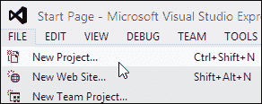

然后，Visual Studio 将提示您一个对话框，询问您要创建的解决方案类型。我们将创建一个新的 ASP.NET MVC 4 网络应用。

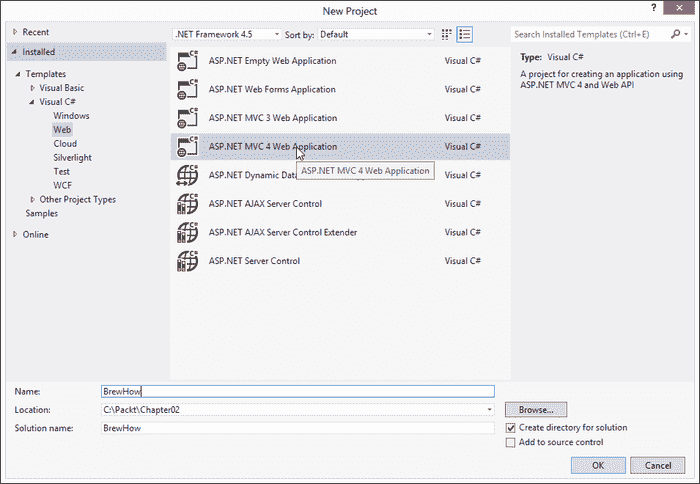

选择**ASP.NET MVC 4 Web 应用**图标，在**名称**和**位置**文本框中分别提供新项目的名称和位置。在本书中，我们将参考位于 C:上的 Packt 目录中的BrewHow 项目，但是您可以将其命名为任何您喜欢的名称，并将其放在任何您想放的地方。当您决定了名称和位置后，点击**确定**。

Visual Studio 现在将提示您选择项目模板。

## 选择我们的模板

Visual Studio 2012 附带了 6 个 ASP.NET MVC 4 项目模板。

### 空模板

空模板并不像你想象的那么空。项目模板不是空的，而是包含使其成为 MVC 项目所需的最少内容。没有脚本或内容，`Models`、`Controllers`、`App_Data`文件夹为空。

### 基本模板

基本模板本质上是新版本的 MVC 3 空模板。该模板将`Content`和`Scripts`文件夹添加到空模板中，并包括 MVC 4 的一些新功能所需的附加组件引用。

### 互联网应用模板

这个模板将是模板，大多数网站将从这个模板创建。该模板包含基本模板中的所有内容，但在结构中添加了一个`Account`和`Home`控制器，以支持针对传统的 ASP.NET SQL Server 成员结构的身份验证，并且，对于 MVC 4 来说，第三方身份验证提供商(如微软、谷歌和脸书)通过 DotNetOpenAuth 库进行身份验证是新的。

### 内部网应用模板

内部网应用模板是互联网应用模板的变体。它已被更改为支持 Windows 身份验证作为身份验证机制。

### 移动应用模板

如果您确定几乎所有的流量都将来自移动设备，您将希望从移动应用模板创建您的应用。该模板将对 jQuery Mobile 的支持添加到互联网应用中，但删除了 DotNetOpenAuth 库支持，转而支持传统的表单身份验证。

### 网络应用编程接口模板

ASP.NET MVC 4 的新内容是网络应用编程接口。网络应用编程接口提供了一种开发 RESTful HTTP 服务和理解 XML 和 JSON 内容类型的应用编程接口的简单方法。这个项目模板为利用网络应用编程接口构建新服务提供了基础。

我们将从互联网模板创建我们的示例应用。我们这样做有几个原因。首先，我们日常实现和支持的大多数应用都要求我们既要针对桌面浏览器，也要针对移动浏览器。第二，通过从互联网模板进行开发，我们可以从 ASP.NET MVC 4 的角度以及一般应用开发的角度，了解更多支持移动 web 的必要条件。

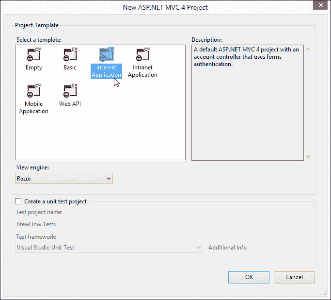

从模板选项中选择**互联网应用**，点击标有**确定**的按钮。

恭喜你！你刚刚创建了你的第一个 ASP.NET MVC 4 项目。

## MVC 4 中的项目变更

除了新的框架特性之外，ASP.NET MVC 4 项目也经历了一些重要的变化，如果你过去与 ASP.NET MVC 合作过，你应该注意到这些变化。

### 纽集

如果你不熟悉 NuGet ，NuGet 是一个. NET 平台的包管理系统。其目标是简化第三方库、工具和脚本的管理。NET 项目。它现在是 Visual Studio 2012 和 MVC 项目模板的一级成员。

如果您检查我们刚刚创建的项目，您会注意到在解决方案的底部有一个`packages.config`文件。

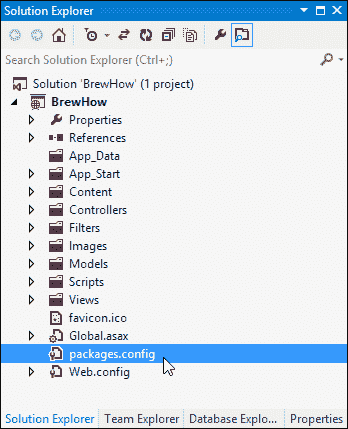

该文件是一个 NuGet 包列表，包含项目所有外部依赖项的列表。对于互联网应用模板，该文件包括对 DotNetOpenAuth、实体框架、jQuery、knockoutjs、非核心微软库、Modernizr、Netwonsoft 的 JSON 库和 WebGrease 的引用。

### Global.asax

在以前的版本的 MVC 中，所有的应用引导代码都位于`Global.asax`代码后面。在 MVC 4 中，你会注意到`Global.asax`文件中的类只包含一个名为`Application_Start`的方法。看看下面这段代码:

```cs
protected void Application_Start()
{
  AreaRegistration.RegisterAllAreas();
  WebApiConfig.Register(GlobalConfiguration.Configuration);
  FilterConfig.RegisterGlobalFilters(GlobalFilters.Filters);
  RouteConfig.RegisterRoutes(RouteTable.Routes);
  BundleConfig.RegisterBundles(BundleTable.Bundles);
  AuthConfig.RegisterAuth();
}
```

这个方法调用其他几个你可能不熟悉的类。虽然关于捆绑和网络应用编程接口的一些新功能确实反映在类名中，但这些名称也标识了以前版本中已经存在的功能，例如区域注册和路由。这些新类封装了您可能期望在这里看到的传统配置信息，并且这些类存在于项目的`App_Start`文件夹中。

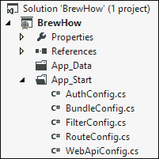

这种新的代码组织提供了更好的功能分离，并使`Global.asax`代码隐藏更容易阅读和消化。

现在我们已经看到了在新的 MVC 4 项目模板中发生的一些结构变化，让我们通过从 Visual Studio 2012 中启动项目来检查新项目模板的输出是什么样子的。

## 启动酿酒应用

要启动应用，只需按下 *Ctrl* + *F5* 即可启动应用，无需运行调试器。

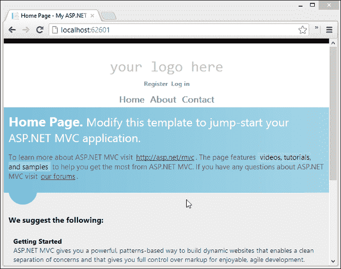

您会注意到 MVC 应用的默认主题已经被重新设计。不仅初始应用看起来更好，而且它的结构也支持响应设计。

### 响应性设计

响应设计是指应用被设计为试图在任何浏览器窗口中正确呈现自己，并持续响应浏览器窗口大小或页面本身显示的内容的变化。

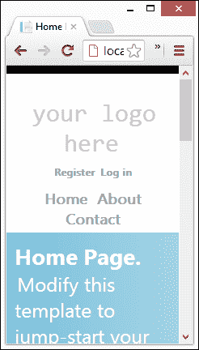

请注意浏览器窗口的内容是如何重新组织以在较小的浏览器窗口中工作的。所有内容仍然是逻辑分组的，并且对用户可用，并且不存在水平滚动条来指示虽然内容可能已经折叠，但它仍将显示在窗口内。

这种压缩视图确实可以让你了解网站在移动设备上的外观，但是如果你真的想知道它的外观，那么你应该在模拟器中查看应用。

### 配置和启动仿真器

从 Visual Studio 2012 中启动我们的应用，并让一个仿真器或多个仿真器打开登录页面，这将非常有用。对我们来说幸运的是，Visual Studio 2012 支持在尝试运行或调试应用时同时启动多个浏览器。

### 类型

**选择并使用仿真器**

希望您已经安装了第一章中列出的模拟器之一。如果没有，让我再次强调，除非你是在物理硬件(首选)或模拟器上测试应用。这对用户是有害的，因为它有问题，对你也是有害的，因为它玷污了你的声誉。

要将 Visual Studio 配置为同时启动多个浏览器，我们首先需要向解决方案中添加一个空的 HTML 页面。空的 HTML 页面不会添加任何功能，它的存在只是为了让我们能够访问上下文菜单，这将允许我们为我们的应用设置默认浏览器。

要向项目中添加新的 HTML 页面文件，右键单击**酿酒**项目，调出项目上下文菜单。从菜单中选择**添加**，然后选择 **HTML 页面**。

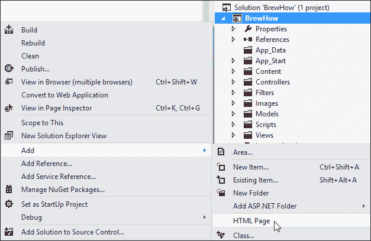

您将看到一个对话框，要求您指定项目的名称。命名文件任何你想要的(样本项目文件名为`browser.html`)，然后点击标有**确定**的按钮。

右键单击刚刚添加到项目中的 HTML 页面，并从上下文菜单中选择**浏览方式…** 。

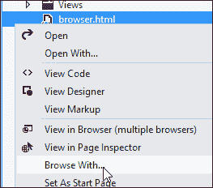

这将调出 Visual Studio 2012 **用**浏览对话框。此对话框允许我们设置默认浏览器，当从 Visual Studio 中启动应用时，我们将使用该浏览器查看应用。

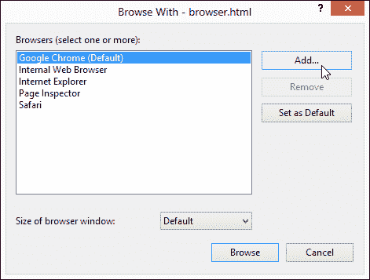

我们将使用谷歌浏览器和 Opera 移动模拟器作为酿酒项目的默认浏览器。

### 注

虽然我们正在配置 Opera Mobile 来启动，但这些指令可以用于任何仿真器或桌面浏览器。

由于 Opera Mobile 不是一个通常在 Visual Studio 注册的浏览器，我们首先需要告诉 Visual Studio 在哪里可以找到它。点击**用**浏览对话框中的**添加…** 按钮，开始注册浏览器。

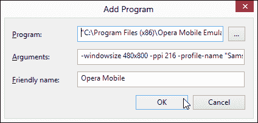

假设您已经在默认位置安装了 Opera Mobile 仿真器，在对话框中输入以下值，为运行在三星 Galaxy S II 上的 Opera Mobile 注册一个仿真器，然后点击**确定**。

<colgroup><col style="text-align: left"> <col style="text-align: left"></colgroup> 
| 

田

 | 

描述

 |
| --- | --- |
| 程序 | `C:\Program Files (x86)\Opera Mobile Emulator\OperaMobileEmu.exe` |
| 争论 | `-windowsize 480x800 -ppi 216 -profile-name "Samsung Galaxy S II"` |
| 友好的名字 | `Opera Mobile` |

您现在应该会看到**用**浏览对话框中显示的**歌剧手机**。

按住 *Ctrl* 键，同时点击**谷歌 Chrome** 和 **Opera Mobile** ，点击标有**设为默认**的按钮，然后关闭对话框。

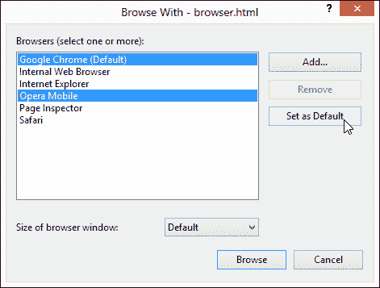

如果你成功了，你应该注意到 Visual Studio 中**开始调试**按钮旁边的文字现在显示**多浏览器**。


按下 *Ctrl* + *F5* 无需调试即可启动该应用，Visual Studio 将在 Chrome 和 Opera Mobile 模拟器中打开 BrewHow 应用。

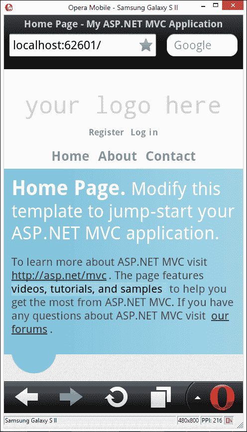

# 总结

现在，您应该对 homebrewing 领域有了足够的了解，可以将其应用到示例应用中。我们还了解到 Visual Studio 2012 的 MVC 4 项目模板和项目结构中发生的变化，现在已经正确配置了您的环境，开始开发我们的移动自制配方共享应用 BrewHow。

在下一章中，我们将详细检查模板生成的代码，以及这些代码如何与 MVC 设计模式相关联。我们还将使用这些知识创建我们的第一个控制器。