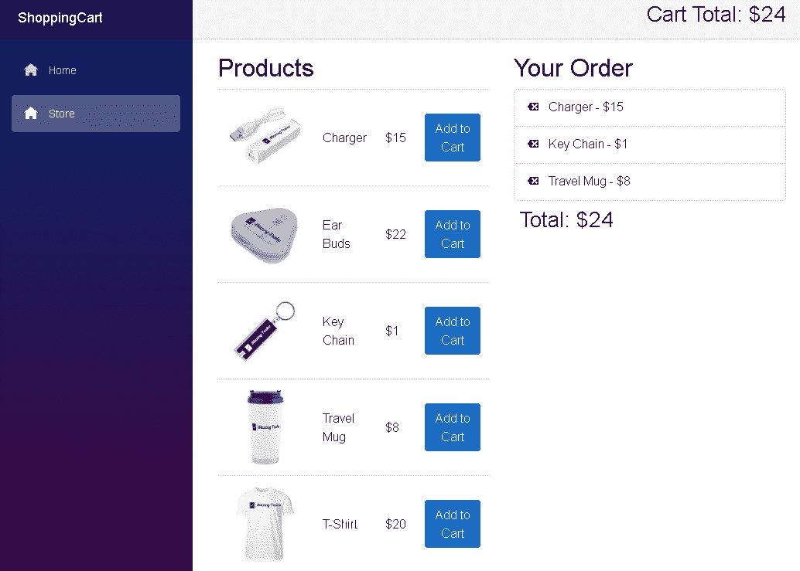
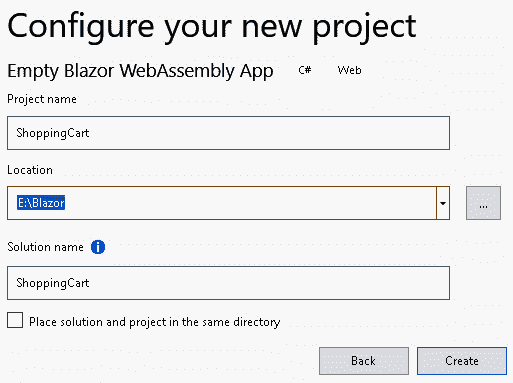

# *第六章*:使用应用状态构建购物车

有时，我们需要我们的应用程序来维护不同页面之间的状态。我们可以通过使用**依赖注入** ( **DI** )来实现这一点。DI 用于访问在中心位置配置的服务。

在本章中，我们将创建一个购物车。当您在购物车中添加和删除商品时，应用程序将维护购物车中商品的列表。当用户导航到另一个页面，然后带着购物车返回该页面时，购物车的内容将被保留。此外，购物车的总数将显示在所有页面上。

在本章中，我们将涵盖以下主题:

*   应用程序状态
*   依赖注入
*   创建购物车项目

# 技术要求

要完成此项目，您需要在电脑上安装 Visual Studio 2019。关于如何安装 Visual Studio 2019 免费社区版的说明，请参考 [*第 1 章*](01.html#_idTextAnchor018) *、Blazor WebAssembly 简介*。

本章的源代码可在以下 GitHub 存储库中获得:[https://GitHub . com/PacktPublishing/Blazor-web assembly by Example/tree/main/chapter 06](https://github.com/PacktPublishing/Blazor-WebAssembly-by-Example/tree/main/Chapter06)。

行动中的代码视频可在此获得:[https://bit.ly/3fxwYob](https://bit.ly/3fxwYob)。

# 应用状态

在 Blazor WebAssembly 应用程序中，浏览器的内存用于保存应用程序的状态。这意味着当用户在页面之间导航时，状态会丢失，除非我们保留它。我们将使用**应用程序状态**模式来保存应用程序的状态。

在 **AppState** 模式中，服务被添加到阿迪容器中，以协调相关组件之间的状态。该服务包含所有需要维护的状态。因为服务是由 DI 容器管理的，所以它可以比单个组件更长寿，并且随着用户界面的变化而保持应用程序的状态。

服务可以是简单的类，也可以是复杂的类。一个服务可以用来管理整个应用程序中多个组件的状态。 **AppState** 模式的一个好处是，它导致了表示和业务逻辑之间更大的分离。

重要说明

当用户重新加载页面时，保存在浏览器内存中的应用程序状态会丢失。

对于本章中的项目，我们将使用阿迪服务实例来保持应用程序的状态。

# 理解 DI

DI 是一种技术，其中一个对象访问已经在中央位置配置的服务。中心位置是 DI 容器。使用 DI 时，每个消费类不需要创建自己的依赖注入类的实例。它由框架提供，称为服务。在 Blazor WebAssembly 应用程序中，服务是在`program.cs`文件的`Program.Main`方法中定义的。

我们已经在本书中通过以下服务使用了 DI:

*   http client(http 客户端)
*   IJSRuntime
*   导航管理器

## 去离子容器

当一个 Blazor WebAssembly 应用程序启动时，它会配置阿迪容器。DI 容器负责构建服务实例，并一直存在到用户关闭运行 web 应用程序的浏览器中的选项卡。在以下示例中，`CartService`实现注册为`IcartService`:

```cs
 builder.Services.AddSingleton<ICartService, CartService>();
```

将服务添加到阿迪容器后，我们使用`@inject`指令将服务注入到依赖它的任何类中。`@inject`指令采用两个参数:类型和属性:

*   **类型**:这是服务的类型。
*   **属性**:这是接收服务的属性的名称。

以下示例显示了如何使用`@inject`指令:

```cs
@inject ICounterService counterService
```

依赖关系是在组件实例创建之后，但在执行`OnInitialized`或`OnInitializedAsync`生命周期事件之前注入的。这意味着您不能在组件的构造函数中使用注入类，但是您可以在`OnInitialized`或`OnInitializedAsync`方法中使用它。

## 使用寿命

使用 DI 注入的服务的寿命可以是以下任何值:

*   一个
*   审视
*   短暂的

### 一个

如果服务生存期被定义为`Singleton`，这意味着将创建该类的单个实例，并且该实例将在整个应用程序中共享。使用该服务的任何组件都将收到同一服务的实例。

在 Blazor WebAssembly 应用程序中，对于在浏览器的当前选项卡中运行的当前应用程序的生存期来说，这是正确的。这是我们将在本章的项目中用来管理应用程序状态的服务生命周期。

### 审视

如果服务的服务生存期被定义为`Scoped`，这意味着将为每个范围创建一个新的类实例。由于 Blazor WebAssembly 应用程序没有 DI 作用域的概念，这些服务被视为`Singleton`服务。

在我们的项目模板中，我们使用`Scoped`服务来创建我们用于数据访问的`HttpClient`实例。这是因为微软的项目模板使用其服务的作用域服务生存期与服务器端 Blazor 对称。

### 短暂的

如果服务的服务生命周期被定义为`Transient`，这意味着每次请求服务实例时都会创建一个新的类实例。当使用临时服务时，DI 容器只是作为一个工厂，创建类的唯一实例。一旦实例被创建并注入依赖组件，容器就不再对它感兴趣了。

我们可以使用 DI 将同一个服务实例注入到多个组件中。它由 **AppState** 模式使用，允许应用程序维护组件之间的状态。

现在，让我们快速了解一下我们将在本章中构建的项目。

# 项目概述

在本章中，我们将构建一个包含购物车的 Blazor WebAssembly 应用程序。我们将能够在购物车中添加和移除不同的产品。购物车的总数将显示在应用程序的每个页面上。

以下是完整应用程序的屏幕截图:



图 6.1-购物卡应用程序

这个项目的构建时间大约为 60 分钟。

# 创建购物车项目

将使用**空 Blazor 网络组装应用程序**项目模板创建`ShoppingCart`项目。首先，我们将添加逻辑来添加和移除购物车中的产品。然后，我们将演示当我们在页面之间导航时，购物车的状态会丢失。为了维护购物车的状态，我们将在 DI 容器中注册一个使用 **AppState** 模式的服务。最后，我们将演示通过将新服务注入相关组件，购物车的状态不会丢失。

## 开始项目

我们需要创建一个新的 Blazor WebAssembly 应用。我们按如下方式进行:

1.  打开 **Visual Studio 2019** 。
2.  点击**新建项目**按钮。
3.  In the **Search for templates** (*Alt* + *S*) textbox, enter `blazor` and then hit the *Enter* key.

    以下截图显示了我们在 [*第二章*](02.html#_idTextAnchor045) *中创建的**空 Blazor WebAssembly App** 项目模板，构建您的第一个 Blazor WebAssembly 应用程序*:

    

    图 6.2–空 Blazor 网络组装应用程序项目模板

4.  选择**空 Blazor WebAssembly App** 项目模板，然后点击**下一步**按钮。
5.  Enter `ShoppingCart` in the **Project name** textbox and then click the **Create** button:

    

    图 6.3–配置新项目对话框

    小费

    在前面的例子中，我们将`ShoppingCart`项目放入`E:/Blazor`文件夹中。然而，项目的位置并不重要。

6.  打开`Pages\Index.razor`页面。
7.  添加以下标记:

    ```cs
    <div class="jumbotron">
        <h1 class="display-4">Welcome to Blazing Tasks!</h1>
        <p class="lead">
            Your one stop shop for all your tasks.
        </p>
    </div>
    ```

我们现在已经创建了 Blazor 网络组装项目。

## 添加产品类别

我们需要添加待售的产品。我们按如下方式进行:

1.  右键单击`ShoppingCart`项目，从菜单中选择**添加，新文件夹**选项。
2.  命名新文件夹`Models`。
3.  右键单击`Models`文件夹，从菜单中选择**添加，类别**选项。
4.  命名新类`Product`。
5.  点击**添加**按钮。
6.  将以下属性添加到`Product`类中:

    ```cs
    public int ProductId { get; set; }
    public string ProductName { get; set; }
    public int Price { get; set; }
    public string Image { get; set; }
    ```

7.  右键单击`wwwroot`文件夹，从菜单中选择**添加，新文件夹**选项。
8.  命名新文件夹`sample-data`。
9.  右键单击`sample-data`文件夹，从菜单中选择**添加，新项目**选项。
10.  在**搜索**框中输入`json`。
11.  选择 **JSON 文件**。
12.  命名文件`products.json`。
13.  点击**添加**按钮。
14.  Update the file to the following:

    products.json

    ```cs
    [
      {
        "productId": 1,
        "productName": "Charger",
        "price": 15,
        "image": "charger.jpg"
      },
      {
        "productId": 2,
        "productName": "Ear Buds",
        "price": 22,
        "image": "earbuds.jpg"
      },
      {
        "productId": 3,
        "productName": "Key Chain",
        "price": 1,
        "image": "keychain.jpg"
      },
      {
        "productId": 4,
        "productName": "Travel Mug",
        "price": 8,
        "image": "travelmug.jpg"
      },
      {
        "productId": 5,
        "productName": "T-Shirt",
        "price": 20,
        "image": "tshirt.jpg"
      }
    ]
    ```

    重要说明

    可以从 GitHub 库中复制`products.json`文件。

15.  右键单击`wwwroot`文件夹，从菜单中选择**添加，新文件夹**选项。
16.  命名新文件夹`images`。
17.  将以下图像从 GitHub 存储库中复制到`images`文件夹:`Charger.jpg`、`Earbuds.jpg`、`KeyChain.jpg`、`TravelMug.jpg`和`Tshirt.jpg.`

我们已经在网络应用中添加了一系列产品。接下来，我们需要添加一个商店。

## 添加商店页面

要添加商店，我们需要在我们的网络应用中添加一个`Store`组件。我们按如下方式进行:

1.  打开`Shared\NavMenu.razor`页面。
2.  Add the following markup before the closing `ul` tag:

    ```cs
    <li class="nav-item px-3">
        <NavLink class="nav-link" href="store">
            <span class="oi oi-home" aria-hidden="true">
            </span> 
            Store
        </NavLink>
    </li> 
    ```

    上述标记为**存储**页面添加了一个菜单选项。

3.  右键单击`Pages`文件夹，从菜单中选择**添加，剃刀组件**选项。
4.  命名新组件`Store`。
5.  点击**添加**按钮。
6.  Replace the markup with the following:

    ```cs
    @page "/store"
    @using ShoppingCart.Models
    @inject HttpClient Http
    @if (products == null)
    {
        <p><em>Loading...</em></p>
    }
    else
    {
        <div class="row">
        </div>
    }
    @code {
        public IList<Product> products;
        public IList<Product> cart = new List<Product>();
        private int total;
    }
    ```

    前面的代码增加了一些指令和一些属性。

7.  Add the following markup in the `div` element:

    ```cs
    <div class="col-xl-4 col-lg-6">
        <h2>Products</h2>
        <table class="table">
            @foreach (Product item in products)
            {
                <tr>
                    <td>
                        
                    </td>
                    <td class="align-middle">
                        @item.ProductName
                    </td>
                    <td class="align-middle">
                        $@item.Price
                    </td>
                    <td class="align-middle">
                        <button class="btn btn-primary" 
                        @onclick="@(() =>
                          AddProduct(item))">
                            Add to Cart
                        </button>
                    </td>
                </tr>
            }
        </table>
    </div> 
    ```

    前面的标记添加了一个显示所有待售产品的表格。

8.  Add the following markup below the preceding `div` element:

    ```cs
    <div class="col-xl-4 col-lg-6">
        @if (cart.Any())
        {
            <h2>Your Cart</h2>
            <ul class="list-group">
                @foreach (Product item in cart)
                {
                    <li class="list-group-item p-2">
                        <button class="btn btn-sm" 
                                @onclick="@(()
                                 =>DeleteProduct(item))">
                            <span class="oi oi-delete">
                            </span>
                        </button>
                        @item.ProductName - $@item.Price
                    </li>
                }
            </ul>
            <div class="p-2">
                <h3>Total: $@total</h3>
            </div>
        }
    </div>
    ```

    前面的标记显示了我们列表中的所有项目。

9.  Add the following code to the `@code` block:

    ```cs
    protected override async Task OnInitializedAsync()
    {
        products = await Http.GetFromJsonAsync<Product[]>
                ("sample-data/products.json");
    }
    ```

    前面的代码使用 **HttpClient** 从`products.json`文件中读取`products`。

10.  Add the `AddProduct` method to the `@code` block:

    ```cs
    private void AddProduct(Product product)
    {
        cart.Add(product);
        total += product.Price;
    }
    ```

    前面的代码将指定的产品添加到购物车中，并按产品价格递增总数。

11.  Add the `DeleteProduct` method to the `@code` block:

    ```cs
    private void DeleteProduct(Product product)
    {
        cart.Remove(product);
        total -= product.Price;
    }
    ```

    前面的代码从购物车中删除指定的产品，并按产品价格递减总数。

我们在网络应用中添加了**商店**页面。现在我们需要测试它。

## 证明应用程序状态丢失

我们需要测试**商店**页面。我们按如下方式进行:

1.  从**调试**菜单中，选择**不调试启动**(*Ctrl*+*F5*)option 运行项目。
2.  选择导航菜单上的**存储**选项。
3.  向购物车中添加一些物品。
4.  选择导航菜单上的**主页**选项。
5.  选择导航菜单上的**商店**选项，返回**商店**页面。
6.  确认购物车现在是空的。

当我们在 web 应用程序的页面之间导航时，状态会丢失。我们可以使用 **AppState** 模式来维护状态。

## 创建 ICartService 接口

我们需要创建一个`ICartService`界面。我们按如下方式进行:

1.  返回 **Visual Studio** 。
2.  右键单击`ShoppingCart`项目，从菜单中选择**添加，新文件夹**选项。
3.  命名新文件夹`Services`。
4.  右键单击`Services`文件夹，从菜单中选择**添加，新项目**选项。
5.  在**搜索**框中输入`interface`。
6.  选择**界面**。
7.  命名文件`ICartService`。
8.  点击**添加**按钮。
9.  输入以下代码:

    ```cs
    IList<Product> Cart{ get; }
    int Total { get; set; }
    event Action OnChange;
    void AddProduct(Product product);
    void DeleteProduct(Product product); 
    ```

10.  增加以下`using`语句:

    ```cs
    using ShoppingCart.Models;
    ```

我们已经创建了`ICartService`界面。现在我们需要创建一个从它继承的类。

## 创建 CartService 类

我们需要创建`CartService`类。我们按如下方式进行:

1.  右键单击`Services`文件夹，从菜单中选择**添加，类别**选项。
2.  命名类`CartService`。
3.  点击**添加**按钮。
4.  Update the class to the following:

    ```cs
    public class CartService : ICartService
    {
        public IList<Product> Cart { get; private set; }
        public int Total { get; set; }
        public event Action OnChange;
    }
    ```

    `CartService`类继承自`ICartService`接口。

5.  增加以下`using`语句:

    ```cs
    using ShoppingCart.Models;
    ```

6.  添加以下构造函数:

    ```cs
    public CartService() { Cart = new List<Product>(); }
    ```

7.  Add the `NotifyStateChanged` method to the class:

    ```cs
    private void NotifyStateChanged() => OnChange?.Invoke();
    ```

    在前面的代码中，调用`NotifyStateChanged`方法时会调用`OnChange`事件。

8.  Add the `AddProduct` method to the class:

    ```cs
    public void AddProduct(Product product)
    {
        Cart.Add(product);
        Total += product.Price;
        NotifyStateChanged();
    }
    ```

    前面的代码将指示的产品添加到产品列表中，并增加总数。它还调用`NotifyStateChanged`方法。

9.  Add the `DeleteProduct` method to the class:

    ```cs
    public void DeleteProduct(Product product)
    {
        Cart.Remove(product);
        Total -= product.Price;
        NotifyStateChanged();
    }
    ```

    上面的代码从产品列表中删除指定的产品，并减少总数。它还调用`NotifyStateChanged`方法。

我们已经完成了`CartService`课。现在我们需要在 DI 容器中注册`CartService`。

## 在 DI 容器中注册 CartService

我们需要在去离子容器中注册，然后才能将其注入我们的**商店**页面。我们按如下方式进行:

1.  打开`Program.cs`文件。
2.  在注册`HttpClient`的代码后添加以下代码:

    ```cs
    builder.Services.AddScoped<ICartService, CartService>();
    ```

3.  增加以下`using`语句:

    ```cs
    using ShoppingCart.Services;
    ```

我们已经注册`CartService`。现在我们需要更新**商店**页面来使用它。

## 注射卡丁车服务

我们需要更新**商店**页面。我们按如下方式进行:

1.  打开`Pages\Store.razor`页面。
2.  增加以下`@using`指令:

    ```cs
    @using ShoppingCart.Services
    ```

3.  增加以下`@inject`指令:

    ```cs
    @inject ICartService cartService
    ```

4.  Update the **Add to Cart** button to the following:

    ```cs
    <button class="btn btn-primary"
            @onclick="@(() =>
              cartService.AddProduct(item))">
        Add to Cart
    </button>
    ```

    前面的标记使用`cartService`将产品添加到购物车中。

5.  Update the `cart` `div` element to the following:

    ```cs
    @if (cartService.Cart.Any())
    {
        <h2>Your Cart</h2>
        <ul class="list-group">
            @foreach (Product item in cartService.Cart)
            {
                <li class="list-group-item p-2">
                    <button class="btn btn-sm"
                            @onclick="@(() =>cartService.DeleteProduct(item))">
                        <span class="oi oi-delete"></span>
                    </button>
                    @item.ProductName - $@item.Price
                </li>
            }
        </ul>
        <div class="p-2">
            <h3>Total: $@cartService.Total</h3>
        </div>
    }
    ```

    前面的标记使用`CartService`遍历购物车中的产品，并使用从购物车中删除产品。

6.  从`@code`块中删除`cart`属性、`AddProduct`方法和`DeleteProduct`方法。
7.  从**构建**菜单中，选择**构建解决方案**选项。
8.  返回浏览器。
9.  使用 *Ctrl + R* 刷新浏览器。
10.  向购物车中添加一些物品。
11.  选择导航菜单上的**主页**选项。
12.  选择导航菜单上的**商店**选项，返回**商店**页面。
13.  确认购物车不是空的。

我们已经确认`CartService`正在工作。现在我们需要将购物车总数添加到所有页面中。

## 将购物车总数添加到所有页面

要查看所有页面上的购物车总数，我们需要将购物车总数添加到所有页面上使用的组件中。由于所有页面都使用了`MainLayout`组件，我们将向其中添加购物车总数。我们按如下方式进行:

1.  返回 **Visual Studio** 。
2.  打开`Shared\MainLayout.razor`页面。
3.  增加以下`@using`指令:

    ```cs
    @using ShoppingCart.Services
    ```

4.  增加以下`@inject`指令:

    ```cs
    @inject ICartService cartService
    ```

5.  将以下标记添加到`top-row` `div` :

    ```cs
    <h3>Cart Total: $@cartService.Total</h3>
    ```

6.  从**构建**菜单中，选择**构建解决方案**选项。
7.  返回浏览器。
8.  使用 *Ctrl + R* 刷新浏览器。
9.  向购物车中添加一些物品。
10.  确认页面顶部的**购物车合计**字段没有更新。

当我们向购物车中添加新商品时，页面顶部的购物车总数不会更新。我们需要处理这个。

## 使用 OnChange 方法

我们需要通知组件什么时候需要更新。我们按如下方式进行:

1.  返回 **Visual Studio** 。
2.  打开`Shared\MainLayout.razor`页面。
3.  增加以下`@implements`指令:

    ```cs
    @implements IDisposable
    ```

4.  Add the following `@code` block:

    ```cs
    @code{
        protected override void OnInitialized()
        {
            cartService.OnChange += StateHasChanged;
        }
        public void Dispose()
        {
            cartService.OnChange -= StateHasChanged;
        }
    }
    ```

    在前面的代码中，组件的`StateHasChanged`方法订阅了`OnInitialized`方法中的`cartService.OnChange`方法，而在`Dispose`方法中取消了订阅。

5.  从**构建**菜单中，选择**构建解决方案**选项。
6.  返回浏览器。
7.  使用 *Ctrl + R* 刷新浏览器。
8.  向购物车中添加一些物品。
9.  确认页面顶部的**购物车总计**字段更新。

我们已经更新了组件，以便在调用`CartService`的`OnChange`方法时调用`StateHasChanged`方法。

小费

处理组件时，不要忘记取消订阅事件。

您必须取消订阅该事件，以防止每次引发`cartService.OnChange`事件时调用`StateHasChanged`方法。否则，您的应用程序将会遇到资源泄漏。

# 总结

现在，您应该能够使用 DI 将**应用状态**模式应用到 Blazor 网络组装应用程序中。

在本章中，我们介绍了应用程序状态和 DI。之后，我们使用**空 Blazor WebAssembly App** 项目模板创建了一个新项目。我们向项目中添加了一个购物车，并演示了当我们在页面之间导航时，应用程序状态会丢失。为了维护应用程序的状态，我们在 DI 容器中注册了`CartService`服务。最后，我们演示了通过使用 **AppState** 模式，我们可以维护购物车的状态。

我们可以用 DI 应用我们的新技能来维护任何 Blazor WebAssembly 应用程序的应用程序状态。

在下一章中，我们将使用事件构建看板板。

# 问题

以下问题供您考虑:

1.  当页面重新加载时，本地存储可以用来维护购物车的状态吗？
2.  为什么不需要在`Store`组件中调用`StateHasChanged`方法？

# 进一步阅读

以下资源提供了有关本章所涵盖主题的更多信息:

*   关于 DI 的更多信息，请参考[https://docs . Microsoft . com/en-us/aspnet/core/基本面/依赖注入？view=aspnetcore-5.0](https://docs.microsoft.com/en-us/aspnet/core/fundamentals/dependency-injection?view=aspnetcore-5.0) 。
*   有关事件的更多信息，请参考[https://docs . Microsoft . com/en-us/dotnet/cs harp/programming-guide/events](https://docs.microsoft.com/en-us/dotnet/csharp/programming-guide/events)。