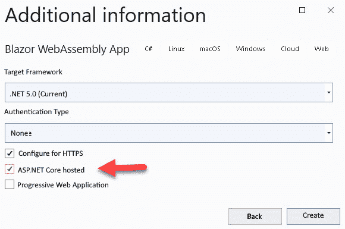
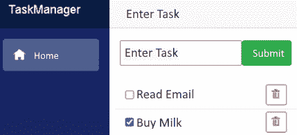
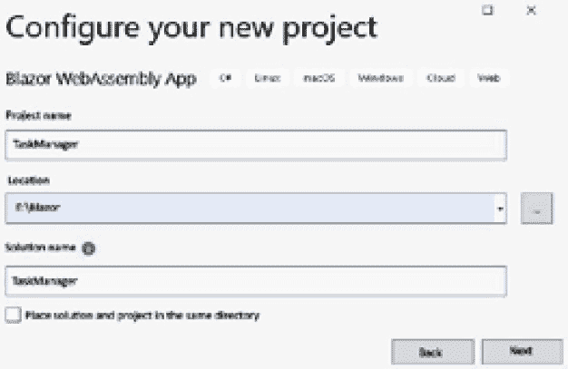
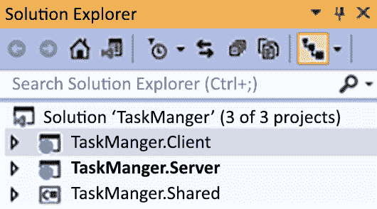
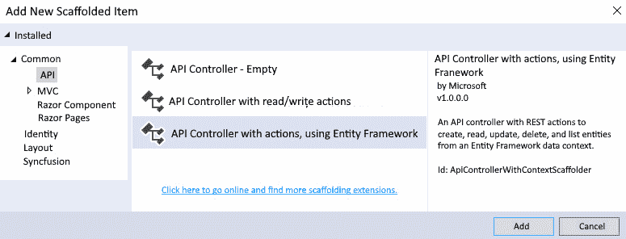
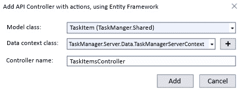
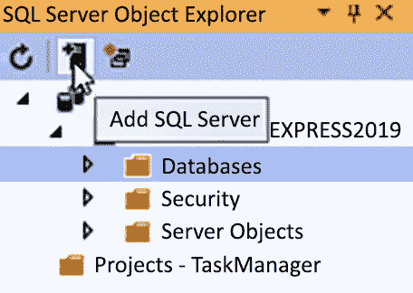
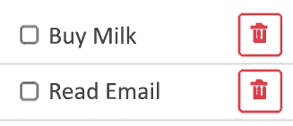

# *第八章*:使用 ASP.NET Web API 构建任务管理器

大多数网站不是孤立的孤岛。他们需要一台服务器。除了其他服务之外，他们在数据访问和安全性方面都依赖于服务器。

在本章中，我们将学习如何创建一个托管的 Blazor WebAssembly 应用。我们将学习如何使用`HttpClient`服务调用 web APIs，我们还将学习如何使用 **JSON 助手方法**进行请求，以便读取、添加、编辑和删除数据。

我们在本章中创建的项目将是一个任务管理器。我们将使用多项目架构将 Blazor WebAssembly 应用与**ASP.NET Web API**端点分开。托管的 Blazor WebAssembly 应用将使用 JSON 助手方法来读取、添加、编辑和删除存储在 SQL Server 上的任务。一个 ASP.NET Core项目将提供 ASP.NET 网络应用编程接口端点。

在本章中，我们将涵盖以下主题:

*   了解托管应用
*   使用`HttpClient`服务
*   使用 JSON 助手方法
*   创建任务管理器项目

# 技术要求

要完成此项目，您需要在电脑上安装 Visual Studio 2019。关于如何安装 Visual Studio 2019 免费社区版的说明，请参考 [*第 1 章*](01.html#_idTextAnchor018) *、Blazor WebAssembly 简介*。您还需要访问一个版本的 SQL Server。关于如何安装 SQL Server 2019 免费版的说明，请参考 [*第一章*](01.html#_idTextAnchor018) *、Blazor WebAssembly 简介*。

本章的源代码可在以下 GitHub 存储库中获得:[https://GitHub . com/PacktPublishing/Blazor-web assembly by Example/tree/main/chapter 08](https://github.com/PacktPublishing/Blazor-WebAssembly-by-Example/tree/main/Chapter08)。

行动中的代码视频可在此获得:[https://bit.ly/340Im6M](https://bit.ly/340Im6M)。

# 了解托管应用

当我们使用微软的 **Blazor WebAssembly App** 项目模板创建一个新的 Blazor WebAssembly 项目时，我们可以选择通过选中**ASP.NET Core托管的**复选框来创建一个托管的 Blazor WebAssembly 应用。

以下截图突出显示了**ASP.NET Core托管的**复选框:



图 8.1–Blazor 网络组装应用项目模板

由 **Blazor WebAssembly App** 项目模板创建的托管 Blazor WebAssembly 应用包括以下三个项目:

*   客户项目
*   服务器项目
*   共享项目

## 客户项目

客户端项目是客户端 Blazor WebAssembly 项目。它几乎与我们在本书第二章[](02.html#_idTextAnchor045)**【构建你的第一个 Blazor WebAssembly 应用】*中创建的独立 Blazor WebAssembly 应用相同。唯一的区别是数据的访问方式。在客户端项目中，使用网络应用编程接口端点而不是静态文件从服务器项目访问示例数据。*

 *## 服务器项目

服务器项目是ASP.NET Core项目。该项目负责为应用提供服务。除了托管客户端应用之外，服务器项目还提供了网络应用编程接口端点。

小费

在这种情况下，服务器项目必须设置为解决方案中的启动项目。

## 共享项目

共享项目也是 ASP.NET Core项目。它包含在其他两个项目之间共享的应用逻辑。过去，我们必须在客户机和服务器上编写验证代码。我们必须为客户端编写 JavaScript 验证代码，为服务器编写 C#验证代码。毫不奇怪，有时两个验证模型不匹配。共享项目解决了这个问题，因为所有的验证代码都保存在一个位置和一种语言中。

通过使用多项目解决方案，我们可以创建一个更健壮的应用。共享项目定义类，客户端项目使用`HttpClient`服务向服务器项目请求数据。

# 使用 HttpClient 服务

HTTP 不仅仅是为 web 页面服务——它还可以用来服务数据。这些是我们将在本章中使用的 HTTP 方法:

*   `GET`:此方法用于请求一个或多个资源。
*   `POST`:此方法用于新建资源。
*   `PUT`:此方法用于更新指定的资源。
*   `DELETE`:此方法用于删除指定的资源。

`HttpClient`服务是一个预配置的服务，用于从 Blazor WebAssembly 应用发出 HTTP 请求。在`Program.cs`文件中配置。下面的代码用于配置它:

```cs
builder.Services.AddScoped(sp => new HttpClient {
  BaseAddress = new
    Uri(builder.HostEnvironment.BaseAddress) 
});
```

使用**依赖注入** ( **DI** )将`HttpClient`服务添加到页面。要在组件中使用`HttpClient`服务，您必须通过使用`@inject`指令或`Inject`属性来注入它。关于 DI 的更多信息，请参见 [*第六章*](06.html#_idTextAnchor162) *，使用应用状态*构建购物车。

下面的代码显示了将`HttpClient`服务注入组件的两种不同方式:

```cs
@inject HttpClient Http
[Inject] public HttpClient Http { get; set; }
```

在我们将`HttpClient`服务注入到组件中之后，我们可以使用 JSON 助手方法向网络应用编程接口发送请求。

# 使用 JSON 助手方法

有三种 JSON 助手方法。有一个用于读取数据，一个用于添加数据，一个用于更新数据。由于没有删除数据的方法，我们将使用`HttpClient.DeleteAsync`方法删除数据:


图 8.2–HTTP 方法和 JSON 助手方法之间的关系

上表指出了 JSON 助手方法和 HTTP 方法之间的关系。

小费

您也可以使用`HttpClient`服务和 JSON 助手方法来调用外部网络应用编程接口端点。举例来说，参见 [*第五章*](05.html#_idTextAnchor129) *，将天气应用构建为渐进式网络应用(PWA)* 。

## GetFromJsonAsync

`GetFromJsonAsync`方法是用来读取数据。它做到了以下几点:

*   向指定的 URI 发送`HTTP GET`请求。
*   反序列化 JSON 响应体以创建指示的对象。

以下代码返回一组`TaskItem`对象:

```cs
string requestUri = "TaskItems";
tasks = await 
    Http.GetFromJsonAsync<IList<TaskItem>>(requestUri); 
```

在后续的代码中，返回的对象类型是`IList<TaskItem>`。我们也可以使用`GetFromJsonAsync`方法来获取单个对象。以下代码返回单个`TaskItem`对象，其中`Id`是该对象的唯一标识符:

```cs
string requestUri = $"TaskItems/{Id}";
tasks = await 
    Http.GetFromJsonAsync<TaskItem>(requestUri);
```

在前面的代码中，返回的对象类型是`TaskItem.`

## postsjsonasync

`PostAsJsonAsync`方法用于添加数据。它执行以下操作:

*   向指示 URI 的发送`HTTP POST`请求。该请求包括用于创建新数据的 JSON 编码内容。
*   返回一个包含状态代码和数据的`HttpResponseMessage`实例。

以下代码创建了一个新的`TaskItem`对象:

```cs
string requestUri = "TaskItems";
var response = await 
    Http.PostAsJsonAsync(requestUri, newTaskItem);
if (response.IsSuccessStatusCode)
{
    var task = await 
        response.Content.ReadFromJsonAsync<TaskItem>();
}; 
```

在前面的代码中，如果 HTTP 响应成功，则`task`将从响应中反序列化。

## 婊子们同步

`PutAsJsonAsync`方法用于更新数据。它做到了以下几点:

*   向指定的 URI 发送`HTTP PUT`请求。该请求包括用于更新数据的 JSON 编码内容。
*   返回一个包含状态代码和数据的`HttpResponseMessage`实例。

以下代码更新现有的`TaskItem`对象:

```cs
string requestUri = $"TaskItems/{task.TaskItemId}";
var response = await 
   Http.PutAsJsonAsync<TaskItem>(requestUri, updatedTaskItem);
if (response.IsSuccessStatusCode)
{
    var task = await 
        response.Content.ReadFromJsonAsync<TaskItem>();
};
```

在前面的代码中，如果 HTTP 响应成功，将从响应中反序列化`task`。

## HttpClient。DeleteAsync(删除异步)

`HttpClient.DeleteAsync`方法是用来删除数据。它执行以下操作:

*   向指定的 URI 发送`HTTP DELETE`请求。
*   返回一个包含状态代码和数据的`HttpResponseMessage`实例。

以下代码删除现有的`TaskItem`对象:

```cs
string requestUri = $"TaskItems/{taskItem.TaskItemId}";
var response = await Http.DeleteAsync(requestUri);
if (!response.IsSuccessStatusCode)
{
    // handle error
};
```

JSON 助手方法使使用网络应用编程接口变得容易。我们使用它们来读取、创建和更新数据。我们用`HttpClient.DeleteAsync`删除数据。

现在，让我们快速了解一下我们将在本章中构建的项目。

# 项目概述

在本章中，我们将构建一个 Blazor WebAssembly 应用来管理任务。我们将能够查看、添加、编辑和删除任务。这些任务将存储在一个 SQL Server 数据库中。

这是完整应用的屏幕截图:



图 8.3–任务管理器项目

该项目的构建时间约为 75 分钟。

# 创建任务管理器项目

`TaskManager`项目将通过使用微软的 **Blazor WebAssembly 应用**项目模板创建一个托管的 Blazor WebAssembly 应用来创建。首先，我们将检查由项目模板创建的演示项目。然后，我们将添加一个`TaskItem`类和一个`TaskItemsController`类。我们将使用实体框架迁移在 SQL Server 中创建一个数据库。最后，我们将演示如何使用`HttpClient`服务读取数据、更新数据、删除数据和添加数据。

## 开始项目

我们需要创建一个新的 Blazor WebAssembly 应用。我们按如下方式进行:

1.  打开 **Visual Studio 2019** 。
2.  点击**新建项目**按钮。
3.  In the **Search for templates** (*Alt*+*S*) textbox, enter `Blazor` and then hit the *Enter* key.

    下面的截图显示了我们将要使用的 **Blazor WebAssembly App** 项目模板:

    

    图 8.4–Blazor 网络组装应用项目模板

4.  选择 **Blazor WebAssembly App** 项目模板，点击**下一步**按钮。
5.  Enter `TaskManager` in the **Project name** textbox and then click the **Next** button.

    这是用于配置新项目的对话框截图:

    

    图 8.5–配置您的新项目对话框

    小费

    在前面的例子中，我们将`TaskManager`项目放入`E:/Blazor`文件夹中。然而，这个项目的位置并不重要。

6.  选择**。NET 5.0** 作为**目标框架**。
7.  选中**ASP.NET Core托管**复选框。
8.  点击**创建**按钮。
9.  右键单击`TaskManager.Server`项目，从菜单中选择**设置为启动项目**选项。

您已经创建了任务管理器项目。下面的屏幕截图显示了组成任务管理器项目的三个项目:



图 8.6–解决方案资源管理器

现在我们都准备好检查托管的 Blazor WebAssembly 应用了。

## 检查托管的 Blazor WebAssembly 应用

托管的 Blazor WebAssembly 应用包括一个演示项目。让我们运行它来了解它的功能。我们按如下方式进行:

1.  在**调试**菜单中，选择**不调试启动** ( *Ctrl* + *F5* )选项运行项目。
2.  查看**主页**页面。
3.  查看**计数器**页面。
4.  查看**获取数据**页面。
5.  关闭浏览器。

在开始我们的**任务管理器**项目之前，我们需要移除演示项目。

## 清空溶液

要清空解决方案，我们需要删除一些组件，更新几个组件，并删除一个控制器和一个类。我们按如下方式进行:

1.  返回 **Visual Studio** 。
2.  删除`TaskManager.Client.Pages`文件夹中除`Index`以外的所有组件。
3.  删除`TaskManager.Client.Shared\SurveyPrompt.razor`文件。
4.  打开`TaskManager.Client.Shared\MainLayout.razor`文件。
5.  通过移除以下标记，从布局的顶行移除`About`链接:

    ```cs
    <a href="http://blazor.net" target="_blank"
       class="ml-md-auto">
            About
    </a>
    ```

6.  打开`TaskManager.Client.Shared\NavMenu.razor`文件。
7.  删除`Counter`和`Fetch data`页面的`li`元素。
8.  从`TaskManager.Server`项目中，删除`Controllers\WeatherForecastConroller.cs`文件。
9.  从`TaskManager.Shared`项目中，删除`WeatherForecast.cs`文件。
10.  从**构建**菜单中，选择**构建解决方案**选项。

我们通过删除演示项目准备了解决方案。现在，我们可以开始添加我们的`TaskManager`特定内容了。首先，我们将添加一个类来包含任务。

## 添加任务项类

我们需要增加`TaskItem`类。我们按如下方式进行:

1.  右键单击`TaskManager.Shared`项目，从菜单中选择**添加，类别**选项。
2.  命名新类`TaskItem`。
3.  点击**添加**按钮。
4.  通过添加`public`修饰符

    ```cs
    public class TaskItem
    ```

    使类公开
5.  将以下属性添加到`TaskItem`类中:

    ```cs
    public int TaskItemId { get; set; }
    public string TaskName { get; set; }
    public bool IsComplete { get; set; }
    ```

6.  从**构建**菜单中，选择**构建解决方案**选项。

我们增加了`TaskItem`类。接下来，我们需要为`TaskItem`类添加一个 **API 控制器**。

## 添加任务项应用编程接口控制器

我们需要增加一个`TaskItemsController`类。我们按如下方式进行:

1.  右键单击`TaskManager.Server.Contollers`文件夹，从菜单中选择**添加控制器**选项。
2.  Select the **API Controller with actions, using Entity Framework** option:

    

    图 8.7–添加新脚手架项目对话框

3.  点击**添加**按钮。
4.  将**型号**等级设置为`TaskItem (TaskManager.Shared)`。
5.  Click the **Add data context** button to open the **Add Data Context** dialog:

    

    图 8.8–添加数据上下文对话框

6.  点击**添加**按钮到接受默认值。
7.  Click the **Add** button on the **Add API Controller with actions, using Entity Framework** dialog:

    

    图 8.9–使用实体框架对话框添加带动作的应用编程接口控制器

8.  将路线更新为:

    ```cs
    [Route("[controller]")]
    ```

我们创建了`TaskItemsController`类。现在我们需要设置 SQL Server。

## 设置 SQL 服务器

我们需要在 SQL Server 上创建一个新的数据库，并添加一个包含任务的表。我们按如下方式进行:

1.  打开`TaskManager.Server\appsettings.json`文件。
2.  Update the connection string to point to your instance of SQL Server and change the name of the database to `TaskManager`:

    ```cs
    "ConnectionStrings": {
      "TaskManagerServerContext": "Server=TOI-WORK\\SQLEXPRESS2019; Database=TaskManager; Trusted_Connection=True; MultipleActiveResultSets=true"
    }
    ```

    前面的代码假设我们的服务器名为`TOI-WORK\\SQLEXPRESS2019`，数据库名为`TaskManager`。

    重要说明

    虽然此示例使用的是 SQL Server Express 2019，但使用什么版本的 SQL Server 并不重要。

3.  从**工具**菜单中，选择**获取包装管理器，包装管理器控制台**选项。
4.  在**包管理器控制台**中，将**默认项目**更改为`TaskManager.Server`。
5.  Execute the following commands in **Package Manager Console**:

    ```cs
    Add-Migration Init
    Update-Database
    ```

    上述命令使用**实体框架**迁移来更新 SQL Server。

6.  从**视图**菜单中，选择 **SQL Server 对象浏览器**。
7.  If you do not see the SQL Server instance that you are using for this project, click the **Add SQL Server** button to connect it:

    

    图 8.10–SQL Server 对象资源管理器

8.  Navigate to `TaskManager`, `Tables`, `dbo.TaskItem`:

    

    图 8.11–任务管理器数据库

9.  右键单击`dbo.TaskItem`和选择**查看数据**选项。
10.  别上标签。
11.  Enter a couple of tasks by completing the `TaskName` field and setting the `IsComplete` field to `False`:

    

    图 8.12–样本数据

12.  在**调试**菜单中，选择**不调试启动** ( *Ctrl* + *F5* )选项运行项目。
13.  Add `/taskitems` to the address bar and then click *Enter*.

    下面的截图显示了`TaskItemsController`返回的 JSON:

    

    图 8.13–任务项应用编程接口控制器返回的 JSON

14.  关闭浏览器。

我们已经证明了`TaskItemsController`是有效的。现在我们可以开始我们的客户项目了。

## 显示任务

我们需要获取任务列表并显示给用户。我们按如下方式进行:

1.  返回 **Visual Studio** 。
2.  右键单击`TaskManager.Client.Pages`文件夹，从菜单中选择**添加，类别**选项。
3.  命名新类`Index.razor.cs`。
4.  点击**添加**按钮。
5.  将`partial`修改器添加到类中:

    ```cs
    public partial class Index
    ```

6.  Add the following code to the `Index` class:

    ```cs
    [Inject] public HttpClient Http { get; set; }
    private IList<TaskItem> tasks;
    private string error;
    protected override async Task OnInitializedAsync()
    {
        try
        {
            string requestUri = "TaskItems";
            tasks = await
                Http.GetFromJsonAsync<IList<TaskItem>>
               (requestUri);
        }
        catch (Exception)
        {
            error = "Error Encountered";
        };
    }
    ```

    前面的代码使用`GetFromJsonAsync`方法返回`TaskItem`对象的集合。

7.  增加以下`using`语句:

    ```cs
    using Microsoft.AspNetCore.Components;
    using System.Net.Http;
    using System.Net.Http.Json;
    using TaskManager.Shared;
    ```

8.  打开`TaskManager.Client.Pages\Index.razor`页面。
9.  Update the markup to the following:

    ```cs
    @page "/"
    @if (tasks == null)
    {
        <p><em>Loading...</em></p>
    }
    else
    {
        @foreach (var taskItem in tasks)
        {

        }
    }
    ```

    如果`tasks`为`null`，则前面的标记显示加载信息。否则，它会在`tasks`中的`TaskItem`对象集合中循环。

10.  Add the following markup to the `@foreach` loop:

    ```cs
    <div class="d-flex col col-lg-3 border-bottom"
            @key="taskItem">
        <div class="p-2 flex-fill">
            <input type="checkbox"
                    checked="@taskItem.IsComplete" />
            <span>@taskItem.TaskName</span>
        </div>
        <div class="p-1">
            <button class="btn btn-outline-danger btn-sm" 
                    title="Delete task">
                <span class="oi oi-trash"></span>
            </button>
        </div>
    </div>
    ```

    前面的标记为每个`TaskItem`类显示一个复选框、`TaskName`字段和一个删除按钮。

11.  From the **Debug** menu, select the **Start Without Debugging** (*Ctrl*+*F5*) option to run the project.

    以下是**首页**页面截图:



图 8.14–任务列表

我们已经向**主页**页面添加了任务列表，但是当我们单击复选框或删除按钮时，什么也没有发生。接下来，我们需要允许用户将任务标记为完成。

## 完成任务

我们将允许用户通过点击任务名称旁边的复选框将任务标记为完成。我们按如下方式进行:

1.  返回 **Visual Studio** 。
2.  右键单击`Pages`文件夹，从菜单中选择**添加，新项目**选项。
3.  在**搜索**框中输入`css`。
4.  选择**样式表**。
5.  命名文件`Index.razor.css`。
6.  点击**添加**按钮。
7.  输入以下样式:

    ```cs
    .completed-task {
        text-decoration: line-through;
    } 
    ```

8.  打开`Index.razor`文件。
9.  Update the `span` element used to display the task's name to the following:

    ```cs
    <span class="@((taskItem.IsComplete? "completed-task" : ""))">
        @taskItem.TaskName
    </span>
    ```

    当任务完成时，前面的标记将把`span`元素的类设置为`completed-task`。

10.  在复选框中添加以下标记:

    ```cs
    @onchange="@(()=>CheckboxChecked(taskItem))"
    ```

11.  打开`TaskManager.Client.Pages\Index.razor.cs`文件。
12.  Add the following `CheckboxChecked` method:

    ```cs
    private async Task CheckboxChecked(TaskItem task)
    {
        task.IsComplete = !task.IsComplete;
        string requestUri =
          $"TaskItems/{task.TaskItemId}";
        var response = await
            Http.PutAsJsonAsync<TaskItem>(requestUri,
              task);
        if (!response.IsSuccessStatusCode)
        {
            error = response.ReasonPhrase;
        };
    }
    ```

    前面的代码使用`PutAsJsonAsync`方法更新指示的`TaskItem`类。

13.  从**构建**菜单中，选择**构建解决方案**选项。
14.  返回浏览器。
15.  使用 *Ctrl* + *R* 刷新浏览器。
16.  Mark one of the tasks as complete by clicking the checkbox next to it.

    下面的截图显示了一个已经完成的任务:

    

    图 8.15–已完成的任务

17.  返回 **Visual Studio** 。
18.  选择和 **dbo。我们之前锁定的任务项[数据]** 选项卡。
19.  点击**刷新**(*Shift*+*Alt*+*R*按钮，确认`IsComplete`字段已更新。

当用户选中任务旁边的复选框时，用户界面会更新，并且 SQL Server 数据库也会更新。接下来，我们需要添加删除任务的能力。

## 删除任务

我们需要允许用户删除任务。我们按如下方式进行:

1.  打开`Index.razor`文件。
2.  通过添加突出显示的代码将`button`元素更新为以下内容:

    ```cs
    <button class="btn btn-outline-danger btn-sm" 
            title="Delete task"
            @onclick="@(()=>DeleteTask(taskItem))">
        <span class="oi oi-trash"></span>
    </button>
    ```

3.  打开`TaskManager.Client.Pages\Index.razor.cs`文件。
4.  Add the following `DeleteTask` method:

    ```cs
    private async Task DeleteTask(TaskItem taskItem)
    {
        tasks.Remove(taskItem);
        string requestUri = 
            $"TaskItems/{taskItem.TaskItemId}";
        var response = await Http.DeleteAsync(requestUri);
        if (!response.IsSuccessStatusCode)
        {
            error = response.ReasonPhrase;
        };
    }
    ```

    前面的代码使用`Http.DeleteAsync`方法删除指示的`TaskItem`类。

5.  从**构建**菜单中，选择**构建解决方案**选项。
6.  返回浏览器。
7.  使用 *Ctrl* + *R* 刷新浏览器。
8.  点击删除按钮，删除其中一个任务。
9.  返回 **Visual Studio** 。
10.  选择 **dbo。任务项目[数据]** 选项卡。
11.  点击**刷新**(*Shift*+*Alt*+*R*按钮，确认其中一个任务已经删除。

我们增加了删除任务的能力。现在我们需要添加添加新任务的能力。

## 添加新任务

我们需要增加添加新任务的能力。我们按如下方式进行:

1.  打开`Index.razor`文件。
2.  在`@foreach`循环前添加以下标记:

    ```cs
    <div class="d-flex col col-lg-3 mb-4">
        <input placeholder="Enter Task" @bind="newTask" />
        <button class="btn btn-success" 
                @onclick="AddTask">Submit</button>
    </div>
    ```

3.  打开`TaskManager.Client.Pages\Index.razor.cs`文件。
4.  添加以下变量:

    ```cs
    private string newTask;
    ```

5.  Add the following `AddTask` method:

    ```cs
    private async Task AddTask()
    {
        if (!string.IsNullOrWhiteSpace(newTask))
        {
            TaskItem newTaskItem = new TaskItem
            {
                TaskName = newTask,
                IsComplete = false
            };
            tasks.Add(newTaskItem);            
            string requestUri = "TaskItems";
            var response = await
               Http.PostAsJsonAsync(requestUri,
                 newTaskItem);
            if (response.IsSuccessStatusCode)
            {
                newTask = string.Empty;
                var task = 
                  await response.Content.ReadFromJsonAsync
                    <TaskItem>();
            }
            else
            {
                error = response.ReasonPhrase;
            };
        };
    }
    ```

    前面的代码使用`PostAsJsonAsync`方法创建了一个新的`TaskItem`类。返回的`TaskItem`类被反序列化为`task`变量。

    小费

    如果需要新的`TaskItem`类的`Id`属性，可以从`task`变量中获取。

6.  从**构建**菜单中，选择**构建解决方案**选项。
7.  返回浏览器。
8.  使用 *Ctrl* + *R* 刷新浏览器。
9.  添加一些新任务。
10.  返回 **Visual Studio** 。
11.  选择 **dbo。任务项目[数据]** 选项卡。
12.  单击**刷新**(*Shift*+*Alt*+*R*按钮，验证任务是否已添加到 SQL Server 数据库。

我们现在增加了添加新任务的能力。

# 总结

现在，您应该能够创建一个托管的 Blazor WebAssembly 应用，该应用使用 ASP.NET Web API 来更新 SQL Server 数据库中的数据。

在本章中，我们介绍了托管的 Blazor WebAssembly 应用、`HttpClient`服务以及用于读取、创建和更新数据的 JSON 助手方法。我们还演示了如何使用`HttpClient.DeleteAsync`方法删除数据。

之后，我们使用微软的 **Blazor 网络组装应用**项目模板创建了一个托管的 Blazor 网络组装应用。我们检查了演示项目，然后将其从多项目解决方案中删除。我们增加了一个`TaskItem`类和一个`TaskItem` API 控制器。接下来，我们通过更新数据库的连接字符串并使用实体框架迁移来配置 SQL Server。最后，我们使用`HttpClient`服务来读取任务列表、更新任务、删除任务和添加新任务。

我们可以应用我们的新技能来创建一个托管的 Blazor WebAssembly 应用，它是多项目解决方案的一部分，并使用 ASP.NET Web API 来读取、创建、更新和删除数据。

在下一章中，我们将使用`EditForm`组件构建一个费用跟踪器。

# 问题

以下问题供您考虑:

1.  与独立的 Blazor WebAssembly 项目相比，使用托管的 Blazor WebAssembly 项目有什么好处？
2.  代码使用`@code`块好还是代码使用分部类好？

# 进一步阅读

以下资源提供了有关本章所涵盖主题的更多信息:

*   关于`HttpClient`类的更多信息，请参考。
*   关于从 Blazor WebAssembly 调用 web API 的更多信息，请参考[https://docs . Microsoft . com/en-us/aspnet/core/Blazor/call-web-API](https://docs.microsoft.com/en-us/aspnet/core/blazor/call-web-api)。
*   有关使用`System.Text.Json`执行序列化和反序列化的扩展方法的更多信息，请参考[。](https://docs.microsoft.com/en-us/dotnet/api/system.net.http.json)
*   关于实体框架的更多信息，请参考[https://docs.microsoft.com/ef](https://docs.microsoft.com/ef)。*