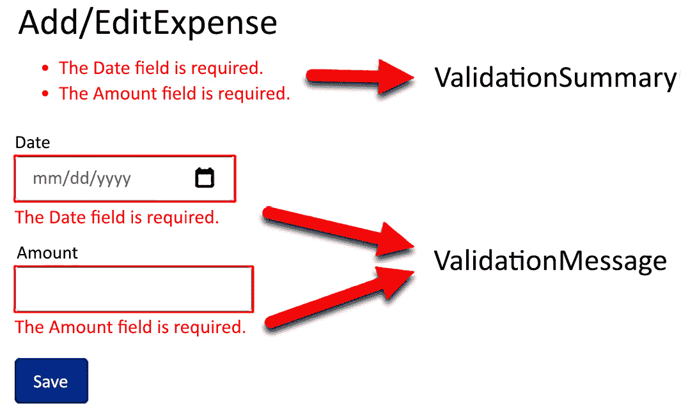
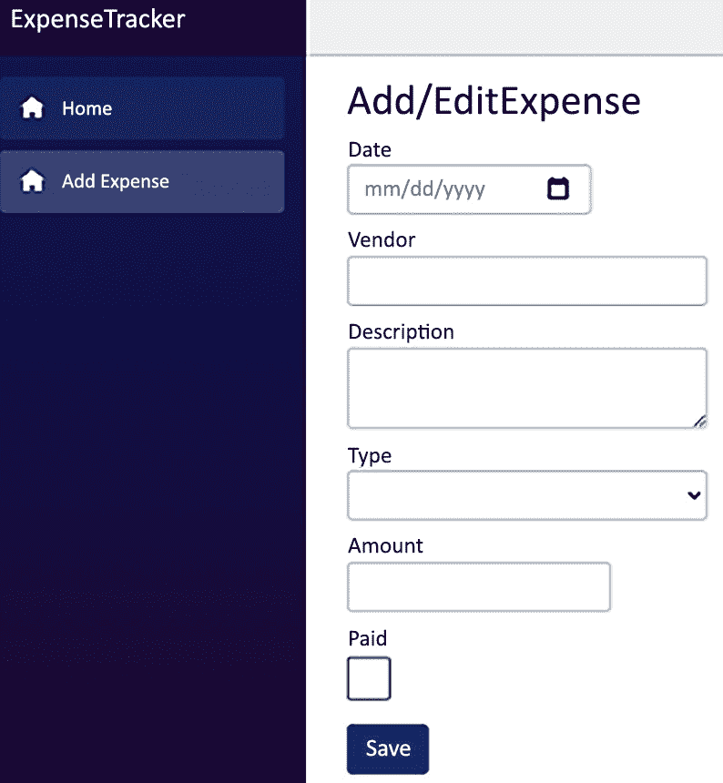
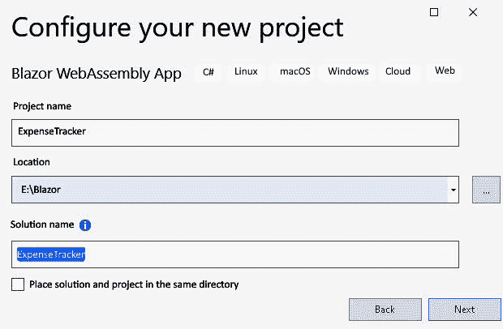
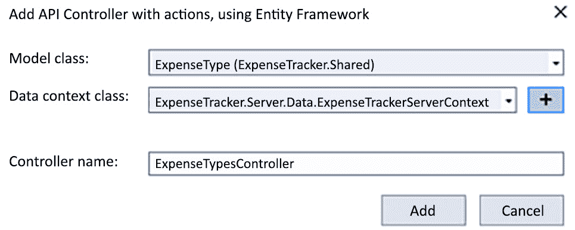
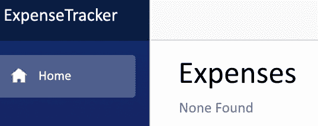
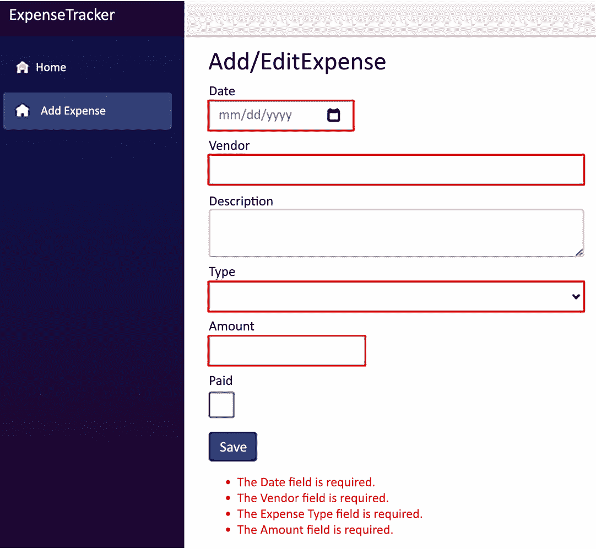

# 九、使用编辑表单组件构建费用跟踪器

大多数应用都需要一些数据输入。Blazor WebAssembly 框架包括许多用于输入和验证数据的内置组件。

在本章中，我们将学习如何使用`EditForm`组件、各种内置输入组件和内置输入验证组件。

我们将在本章中创建的项目将是一个旅行费用追踪器。我们将使用多项目架构将 Blazor WebAssembly 应用与**ASP.NET Web API**端点分开。用于添加和编辑费用的页面将使用`EditForm`组件以及许多内置的输入组件。它还将使用内置的验证组件。我们将学习如何使用内置组件向任何 Blazor WebAssembly 应用添加数据输入、验证和提交。

在本章中，我们将涵盖以下主题:

*   `EditForm`组件
*   使用内置的输入组件
*   使用验证组件
*   创建`ExpenseTracker`项目

# 技术要求

要完成此项目，您需要在电脑上安装 Visual Studio 2019。关于如何安装 Visual Studio 2019 免费社区版的说明，请参考 [*第 1 章*](01.html#_idTextAnchor018) *、Blazor WebAssembly 简介*。您还需要访问一个版本的 SQL Server。关于如何安装 SQL Server 2019 免费版的说明，请参考 [*第一章*](01.html#_idTextAnchor018) *、Blazor WebAssembly 简介*。

本章的源代码可在以下 GitHub 存储库中获得:[https://GitHub . com/PacktPublishing/Blazor-web assembly by Example/tree/main/chapter 09](https://github.com/PacktPublishing/Blazor-WebAssembly-by-Example/tree/main/Chapter09)。

行动中的代码视频可在此获得:[https://bit.ly/2T5UfpR](https://bit.ly/2T5UfpR)。

# 编辑表单组件概述

在本书前面的章节中，我们使用了标准的 HTML `form`元素来收集用户输入。然而，Blazor WebAssembly 框架提供了标准 HTML `form`元素的增强版本，称为`EditForm`组件。

`EditForm`组件不仅管理表单，还协调验证和提交事件。以下代码显示了一个空的`EditForm`元素:

```cs
<EditForm Model="expense" OnValidSubmit="HandleValidSubmit">   
</EditForm>
```

在前面的代码中，`Model`属性指定了表单的顶层模型对象。`OnValidSubmit`属性指定当提交表单时没有任何验证错误时将调用的回调。

有三种不同的回调与表单提交相关联:

*   `OnValidSubmit`
*   `OnInvalidSubmit`
*   `OnSubmit`

我们可以一起使用`OnValidSubmit`和`OnInvalidSubmit`回调，也可以单独使用。或者，我们可以自行使用`OnSubmit`回调。如果我们使用`OnSubmit`回调，我们负责执行表单验证。否则，表单验证由`EditForm`组件执行。

小费

如果我们设置一个`OnSubmit`回调，任何使用`OnValidSubmit`或`OnInvalidSubmit`设置的回调都会被忽略。

有相当多的内置输入组件，我们可以结合`EditForm`组件使用。

# 使用内置的输入组件

下面的表列出了内置的输入组件以及它们呈现的 HTML:


图 9.1–内置输入组件

所有内置输入组件都能够在放置在`EditForm`元素中时接收和验证用户输入。它们继承自抽象的`InputBase`类。我们可以通过创建同样继承自`InputBase`类的组件来添加额外的输入组件。

输入数据在表单提交和数据更改时都会被验证。

# 使用验证组件

输入验证是每个应用的一个重要方面，因为它防止用户输入无效数据。Blazor WebAssembly 框架使用数据注释进行输入验证。有 30 多个内置数据注释属性。这是我们将在此项目中使用的列表:

*   `Required`:该属性指定需要一个值。它是最常用的属性。
*   `Display`:该属性指定在错误消息中显示的字符串。
*   `MaxLength`:该属性指定允许的最大字符串长度。
*   `Range`:该属性指定数值的数值范围约束。

下面的代码演示了一些数据注释的使用:

```cs
[Required]
public DateTime? Date { get; set; }
[Required]
[Range(0, 500, ErrorMessage = "The {0} field must be < {2}.")]
public decimal? Amount { get; set; }
```

有两个内置的验证组件:

*   `ValidationSummary`
*   `ValidationMessage`

`ValidationSummary`组件汇总验证消息，而`ValidationMessage`组件显示单个组件的验证消息。`EditForm`组件可以包括两种类型的验证组件。然而，为了使用任一类型的验证组件，我们必须将`DataAnnotationsValidator`添加到`EditForm`组件中。

下面的截图显示了一个`ValidationSummary`组件和单个`ValidationMesssage`组件的结果:



图 9.2–验证组件

现在让我们快速了解一下我们将在本章中构建的项目。

# 项目概述

在这章，我们将构建一个项目来跟踪差旅费。我们将能够查看、添加和编辑费用。费用将存储在一个 SQL Server 数据库中。

这是已完成申请的**添加/编辑费用**页面截图。



图 9.3–添加/编辑费用页面

本项目建设时间约 90 分钟。

# 创建费用追踪项目

`ExpenseTracker`项目将使用**微软的 Blazor WebAssembly 应用**项目模板创建一个托管的 Blazor WebAssembly 应用。首先，我们将删除演示项目。然后，我们将添加项目所需的类和应用编程接口控制器。我们将在**首页**增加一个表格，显示当前的费用清单。最后，我们将结合许多内置的输入组件使用`EditForm`组件来添加和编辑费用。

## 开始项目

我们需要创建一个新的 Blazor WebAssembly 应用。我们按如下方式进行:

1.  打开 **Visual Studio 2019** 。
2.  点击**新建项目**按钮。
3.  In the **Search for templates** (*Alt* + *S*) textbox, enter `Blazor` and hit the *Enter* key.

    下面的截图显示了我们将要使用的 **Blazor WebAssembly App** 项目模板。

    

    图 9.4–Blazor WebAssembly应用项目模板

4.  选择 **Blazor WebAssembly App** 项目模板，然后点击**下一步**按钮。
5.  Enter `ExpenseTracker` in the **Project name** textbox and click the **Next** button:

    

    图 9.5–配置您的新项目拨号 og

    小费

    在前面的例子中，我们将`ExpenseTracker`项目放入`E:/Blazor`文件夹中。然而，这个项目的位置并不重要。

6.  选择**。NET 5.0** 作为**目标框架**。
7.  Check the **ASP.NET Core Hosted** checkbox.

    当您选中**ASP.NET Core托管**复选框时，项目模板将创建一个多项目解决方案。有关托管应用的更多信息，请参考第 8 章 *【使用 ASP.NET 网络应用编程接口构建任务管理器】*。

8.  点击**创建**按钮。
9.  右键单击`ExpenseTracker.Server`项目，从菜单中选择**设置为启动项目**选项。

您已经创建了`ExpenseTracker` Blazor WebAssembly 项目。使用托管应用的项目模板创建的项目包括一个演示项目。在我们开始之前，我们需要删除演示项目。

## 删除演示项目

要删除演示项目，我们需要删除一些组件，更新几个组件，并删除一个控制器和一个类。我们按如下方式进行:

1.  删除`ExpenseTracker.Client.Pages`文件夹中除`Index`以外的所有组件。
2.  删除`ExpenseTracker.Client.Shared\SurveyPrompt.razor`文件。
3.  打开`ExpenseTracker.Client.Shared\MainLayout.razor`文件。
4.  通过移除以下标记，从布局的顶行移除`About`链接:

    ```cs
    <a href="http://Blazor.net" target="_blank"
       class="ml-md-auto">
            About
    </a>
    ```

5.  打开`ExpenseTracker.Client.Shared\NavMenu.razor`文件。
6.  删除`Counter`和`Fetch data`页面的 `li`元素。
7.  从`ExpenseTracker.Server`项目中，删除`Controllers\WeatherForecastConroller.cs`文件。
8.  从`ExpenseTracker.Shared`项目中，删除`WeatherForecast.cs`文件。
9.  从**构建**菜单中，选择**构建解决方案**选项。

我们通过移除演示项目准备了解决方案。现在，我们可以开始添加我们的`ExpenseTracker`具体内容了。首先，我们需要添加几个类。

## 添加类别

我们需要增加一个`ExpenseType`类和一个`Expense`类。我们按如下方式进行:

1.  右键单击`ExpenseTracker.Shared`文件夹，从菜单中选择**添加，类别**选项。
2.  命名新类`ExpenseType`。
3.  点击**添加**按钮。
4.  通过添加`public`修饰符

    ```cs
    public class ExpenseType
    ```

    使类公开
5.  将以下属性添加到`ExpenseType`类中:

    ```cs
    public int Id { get; set; }
    public string Type { get; set; }
    ```

6.  右键单击`ExpenseTracker.Shared`文件夹，从菜单中选择**添加，类别**选项。
7.  命名新类`Expense`。
8.  点击**添加**按钮。
9.  通过添加`public`修饰符

    ```cs
    public class Expense
    ```

    使类公开
10.  增加以下`using`语句:

    ```cs
    using System.ComponentModel.DataAnnotations;
    ```

11.  Add the following properties to the `Expense` class:

    ```cs
    public int Id { get; set; }
    [Required]
    public DateTime? Date { get; set; }
    [Required]
    [MaxLength(100)]
    public string Vendor { get; set; }
    public string Description { get; set; }

    [Required]
    [Display(Name = "Expense Type")]
    public int? ExpenseTypeId { get; set; }
    [Required]
    [Range(0, 500, ErrorMessage = "The {0} field must be <= {2}.")]
    public decimal? Amount { get; set; }
    public bool Paid { get; set; }
    ```

    在前面的代码中，我们使用了数据注释来添加一些简单的数据验证。`Date`、`Vendor`、`ExpenseTypeId`、`Amount`均为必填项。`Vendor`最大长度为 100 个字符。`ExpenseTypeId`的显示名称为`Expense Type`。费用的`Amount`上限为`500`。

12.  从**构建**菜单中，选择**构建解决方案**选项。

我们增加了这个`ExpenseType`类和`Expense`类。现在我们需要配置网络应用编程接口端点。

## 添加应用编程接口控制器

我们需要为每个新类添加一个应用编程接口控制器。我们按如下方式进行:

1.  右键单击`ExpenseTracker.Server.Contollers`文件夹，从菜单中选择**添加控制器**选项。
2.  使用实体框架选项，选择**带动作的应用编程接口控制器。**
3.  点击**添加**按钮。
4.  将**模型类**设置为`ExpenseType (ExpenseTracker.Shared)`。
5.  Click the **Add data context** button to open the **Add Data Context** dialog:

    

    图 9.6–添加数据上下文对话框

6.  点击**添加**按钮接受默认值。
7.  Click the **Add** button:

    

    图 9.7–使用实体框架对话框添加带动作的应用编程接口控制器

8.  将路线更新为如下:

    ```cs
    [Route("[controller]")]
    ```

9.  右键单击`ExpenseTracker.Server.Contollers`文件夹，从菜单中选择**添加控制器**选项。
10.  使用实体框架选项，选择**带动作的应用编程接口控制器。**
11.  点击**添加**按钮。
12.  将**模型类**设置为`Expense (ExpenseTracker.Shared)`。
13.  点击**添加**按钮。
14.  将路线更新如下:

    ```cs
    [Route("[controller]")]
    ```

我们添加了两个新的控制器来提供我们的应用将使用的应用编程接口端点。接下来，我们需要创建 SQL Server 数据库。

## 创建 SQL Server 数据库

我们需要创建 SQL Server 数据库，并向其中添加两个表。我们按如下方式进行:

1.  打开`ExpenseTracker.Server\appsettings.json`文件。
2.  Update the connection string to point to your instance of SQL Server and change the name of the database to `ExpenseTracker`:

    ```cs
    "ConnectionStrings": {
      "ExpenseTrackerServerContext": "Server=TOI-WORK\\SQLEXPRESS2019; Database=ExpenseTracker; Trusted_Connection=True; MultipleActiveResultSets=true"
    }
    ```

    前面的代码假设我们的服务器名为`TOI-WORK\\SQLEXPRESS2019`，数据库名为`ExpenseTracker`。

    重要说明

    虽然示例使用的是 SQL Server Express 2019，但是您使用的是什么版本的 SQL Server 并不重要。

3.  打开`ExpenseTracker.Server.Data\ExpenseTrackerServerContext.cs`文件。
4.  Add the following `OnModelCreating` method:

    ```cs
    protected override void OnModelCreating
        (ModelBuilder modelBuilder)
    {
        modelBuilder.Entity<ExpenseType>().HasData(
        new ExpenseType { Type = "Airfare", Id = 1 },
        new ExpenseType { Type = "Lodging", Id = 2 },
        new ExpenseType { Type = "Meal", Id = 3 },
        new ExpenseType { Type = "Other", Id = 4 }
        );
    }
    ```

    前面的代码将播种`ExpenseType`表。

5.  从**工具**菜单中，选择**获取包装管理器，包装管理器控制台**选项。
6.  在**包管理器控制台**中，将**默认项目**更改为`ExpensesManager.Server`。
7.  Execute the following commands in the **Package Manager Console**:

    ```cs
    Add-Migration Init
    Update-Database
    ```

    上述命令使用**实体框架**迁移来更新 SQL Server。

8.  在**调试**菜单中，选择**不调试启动** ( *Ctrl* + *F5* )选项运行项目。
9.  Add `/expensetypes` to the address bar and click *Enter*.

    下面的截图显示了`ExpenseTypesController`返回的 JSON。

    

    图 9.8–ExpenseTypes API 控制器返回的 JSON

10.  关闭浏览器。

我们在 SQL Server 上创建了一个新的数据库，添加了两个表，并用种子数据填充了其中一个表。设置完 SQL Server 后，我们测试`ExpenseTypesController`工作正常。最后，我们准备创建一个组件来显示费用。

## 查看费用

我们需要添加一个表格来显示费用列表。我们按如下方式进行:

1.  返回 **Visual Studio** 。
2.  打开`ExpenseTracker.Client.Pages\Index.razor`页面。
3.  Update the markup to the following:

    ```cs
    @page "/"
    @using ExpenseTracker.Shared
    @inject HttpClient Http
    <h2>Expenses</h2>
    @if (expenses == null)
    {
        <p><em>Loading...</em></p>
    }
    else if (expenses.Count == 0)
    {
        <div>None Found</div>
    }
    else
    {
    }
    @code{
        IList<Expense> expenses;
    }
    ```

    前面的代码将`expenses`定义为`IList<Expense>`，并检查它是`null`还是空的。

4.  Add the following `OnInitializedAsync` method to the `@code` block.

    ```cs
    protected override async Task OnInitializedAsync()
    {
        expenses = await Http.GetFromJsonAsync
                <IList<Expense>>("Expenses");
    }
    ```

    前面的代码填充了`expenses`对象。

5.  在`else`声明中增加以下`table`:

    ```cs
    <table class="table">
    </table>
    ```

6.  在`table`中添加以下`thead`元素:

    ```cs
    <thead>
        <tr>
            <th></th>
            <th>#</th>
            <th>Date</th>
            <th>Vendor</th>
            <th class="text-right">Amount</th>
        </tr>
    </thead>
    ```

7.  Add the following `tbody` element to `table`:

    ```cs
    <tbody>
        @foreach (var item in expenses)
        {
        <tr class="@(item.Paid ? "" : "table-danger")">
            <td>
                <a href="/expense/@item.Id">Edit</a>
            </td>
            <td>@item.Id</td>
            <td>@item.Date.Value.ToShortDateString()</td>
            <td>@item.Vendor</td>
            <td class="text-right">@item.Amount</td>
        </tr>
        }
    </tbody>
    ```

    前面的代码循环遍历`expenses`对象中的每个`Expense`对象，并将它们显示为表格中的行。如果费用尚未支付，则使用`table-danger`类以红色突出显示该行。

8.  From the **Debug** menu, select the **Start Without Debugging** (*Ctrl* + *F5*) option to run the project.

    以下截图显示空的**首页**页面:



图 9.9–空主页

我们增加了在表格中显示费用的功能。接下来，我们需要添加添加费用的能力。

## 添加费用编辑组件

我们需要添加一个组件，使我们能够添加和编辑费用。我们按如下方式进行:

1.  返回 **Visual Studio** 。
2.  打开`ExpenseTracker.Client.Shared\NavMenu.razor`页面。
3.  向`ul`元素添加以下标记:

    ```cs
    <li class="nav-item px-3">
        <NavLink class="nav-link" href="expense">
            <span class="oi oi-home" 
                  aria-hidden="true"></span> 
            Add Expense
        </NavLink>
    </li>
    ```

4.  右键单击`ExpenseTracker.Client.Pages`文件夹，从菜单中选择**添加，剃刀组件**选项。
5.  命名新组件`ExpenseEdit`。
6.  点击**添加**按钮。
7.  Update the markup to the following:

    ```cs
    @page "/expense"
    @page "/expense/{id:int}"
    @using ExpenseTracker.Shared
    @inject HttpClient Http
    @inject NavigationManager Nav
    <h3>Add/Edit Expense</h3>
    @if (!ready)
    {
        <p><em>Loading...</em></p>
    }
    else
    {
        <EditForm Model="expense" 
                  OnValidSubmit="HandleValidSubmit">

        </EditForm>
        <div>@error</div>
    }
    ```

    如果部件准备好了，前面的代码显示`EditForm`。

8.  增加以下`@code`块:

    ```cs
    @code {
        [Parameter] public int id { get; set; }
        private bool ready;
        private string error;
        private Expense;
        private IList<ExpenseType> types;
    }
    ```

9.  Add the following `OnInitializedAsync` method to the `@code` block:

    ```cs
    protected override async Task OnInitializedAsync()
    {
        types = await Http.GetFromJsonAsync
            <IList<ExpenseType>>("ExpenseTypes");
        if (id == 0)
        {
            expense = new Expense();
        }
        else
        {
            expense = await Http.GetFromJsonAsync
                <Expense>($"Expenses/{id}");
        }
        ready = true;
    }
    ```

    前面的代码初始化了`types`对象和`expense`对象。一旦它们都被初始化，`ready`的值被设置为`true`。

10.  Add the following `HandleValidSubmit` method to the `@code` block:

    ```cs
    private async Task HandleValidSubmit()
    {
        HttpResponseMessage response;
        if (expense.Id == 0)
        {
            response = await Http.PostAsJsonAsync
                ("Expenses", expense);
        }
        else
        {
            string requestUri = $"Expenses/{expense.Id}";
            response = await Http.PutAsJsonAsync
                (requestUri, expense);
        };
        if (response.IsSuccessStatusCode)
        {
            Nav.NavigateTo("/");
        }
        else
        {
            error = response.ReasonPhrase;
        };
    }
    ```

    之前的代码使用`PostAsJsonAsync`方法添加新费用，并使用`PutAsJsonAsync`方法更新现有费用。如果相关方法成功，用户返回到**主页**页面。否则，将显示一条错误消息。

我们已经完成了这个组件的代码，但是`EditForm`仍然是空的。我们需要给`EditForm`添加一些标记。

## 添加输入组件

我们需要向`EditForm`元素添加输入组件。我们按如下方式进行:

1.  将以下标记添加到`EditForm`以输入`Date` :

    ```cs
    <div>
        <label>
            Date
            <InputDate @bind-Value="expense.Date" 
                       class="form-control" />
        </label>
    </div>
    ```

2.  将以下标记添加到`EditForm`以输入`Vendor` :

    ```cs
    <div>
        <label class="d-block">
            Vendor
            <InputText @bind-Value="expense.Vendor" 
                       class="form-control" />
        </label>
    </div>
    ```

3.  将以下标记添加到`EditForm`以输入`Description` :

    ```cs
    <div>
        <label class="d-block">
            Description
            <InputTextArea @bind-Value=
                             "expense.Description"
                           class="form-control" />
        </label>
    </div>
    ```

4.  将以下标记添加到`EditForm`以输入`ExpenseTypeId` :

    ```cs
    <div>
        <label class="d-block">
            Type
            <InputSelect @bind-Value=
                           "expense.ExpenseTypeId"
                         class="form-control">
                <option value=""></option>
                @foreach (var item in types)
                {
                    <option value="@item.Id">
                        @item.Type
                    </option>
                }
            </InputSelect>
        </label>
    </div>
    ```

5.  将以下标记添加到`EditForm`以输入`Amount` :

    ```cs
    <div>
        <label>
            Amount
            <InputNumber @bind-Value="expense.Amount" 
                         class="form-control" />
        </label>
    </div>
    ```

6.  将以下标记添加到`EditForm`以输入`Paid` :

    ```cs
    <div>
        <label>
            Paid
            <InputCheckbox @bind-Value="expense.Paid" 
                           class="form-control" />
        </label>
    </div>
    ```

7.  为`Submit`按钮添加以下标记:

    ```cs
    <div class="pt-2 pb-2">
        <button type="submit" 
                class="btn btn-primary mr-auto">
            Save
        </button>
    </div>
    ```

8.  添加以下标记以添加验证摘要:

    ```cs
    <DataAnnotationsValidator />
    <ValidationSummary />
    ```

9.  从**构建**菜单中，选择**构建解决方案**选项。
10.  返回浏览器。
11.  使用 *Ctrl* + *R* 刷新浏览器。
12.  从菜单中选择**添加费用**选项。
13.  Click the **Save** button.

    以下截图显示了验证错误:

    

    图 9.10–费用编辑组件的数据验证

14.  添加费用。
15.  点击**保存**按钮。

我们已经完成了费用追踪项目。

# 总结

现在，您应该能够结合内置输入组件使用`EditForm`组件来输入数据。您还应该对内置的验证组件感到满意。

在本章中，我们介绍了内置的`EditForm`组件、各种输入组件和验证组件。之后，我们使用 **Blazor WebAssembly App** 项目模板创建了一个多项目解决方案。我们添加了几个类和应用编程接口控制器。接下来，我们通过更新数据库的连接字符串并使用实体框架迁移来配置 SQL Server。我们更新了**主页**页面以显示费用列表。最后，我们添加了一个新页面，其中包括一个`EditForm`组件和许多内置的输入组件，以便输入、验证和提交费用。

我们可以应用我们的新技能向任何 Blazor WebAssembly 应用添加数据输入、验证和提交。

下一步是开始构建自己的网络应用。要了解最新信息并了解更多关于 Blazor WebAssembly 的信息，请访问[https://Blazor.net](https://Blazor.net)，并阅读位于[https://devblogs.microsoft.com/aspnet](https://devblogs.microsoft.com/aspnet)的*ASP.NET 博客*。

我们希望你喜欢这本书，并祝你一切顺利！

# 问题

以下问题供您考虑:

1.  使用内置输入组件的优势是什么？
2.  您希望在框架已经提供的内置输入组件列表中添加哪些额外的输入组件？

# 进一步阅读

以下资源提供了有关本章主题的更多信息:

*   有关 ASP.NET Core组件表单的更多信息，请参考[。](https://docs.microsoft.com/en-us/dotnet/api/microsoft.aspnetcore.components.forms)
*   有关数据标注的更多信息，请参考[https://docs . Microsoft . com/en-us/dotnet/API/system . component model . data annotations](https://docs.microsoft.com/en-us/dotnet/api/system.componentmodel.dataannotations)。