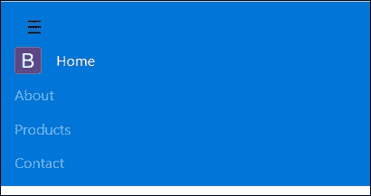
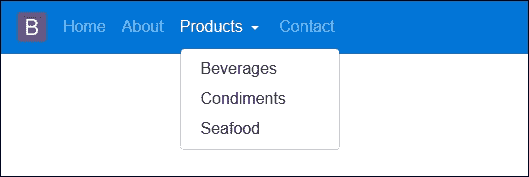
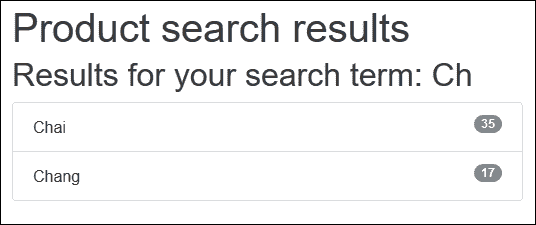
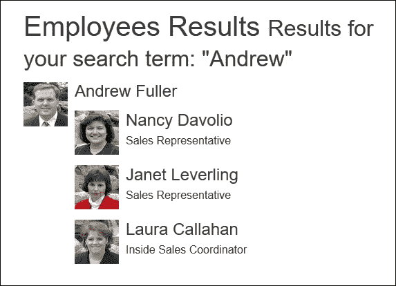
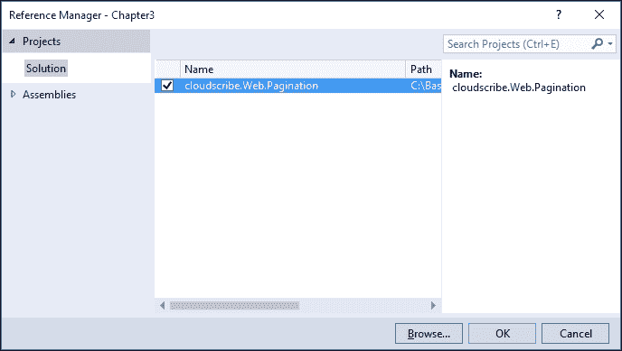
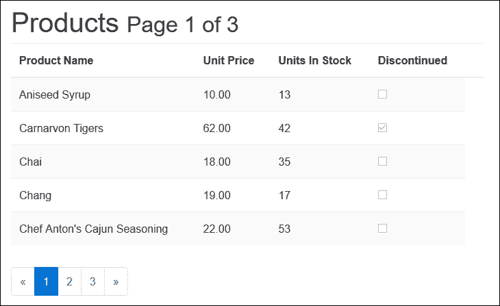
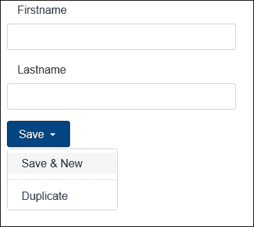
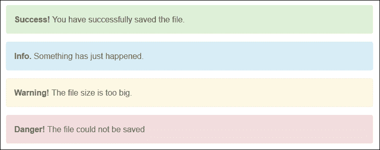
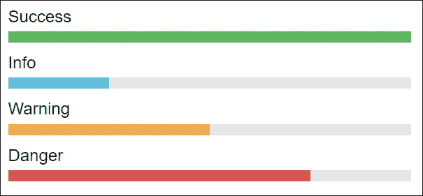
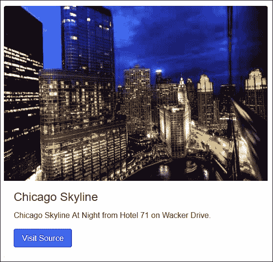

# 第三章。使用引导组件

Bootstrap 提供了十几个组件，例如输入组、下拉菜单、导航、警报和图标。通过在 web 应用程序中使用这些组件，您可以为用户提供一致且易于使用的界面。

Bootstrap 组件本质上是由各种现有的 Bootstrap 元素组合而成的，添加了许多独特的类名，并代表了许多网站上使用的许多常见隐喻。

在本章中，我们将涵盖以下主题:

*   使用引导导航栏
*   如何实现按钮组和下拉菜单
*   探索不同的输入组
*   使用不同的 nav(nav bar、药丸等)
*   实现警报、进度条和徽章
*   卡片介绍

# 引导导航栏

引导导航栏是大多数使用引导框架的站点上使用的组件之一。导航条在你的网站中起着导航标题的作用，在使用引导`Collapse plugin`时，它会在只显示图标菜单的较小设备上折叠。它非常适合包括网站品牌和导航。

## 基本适航

基本导航栏由网站徽标或品牌名称、导航菜单和在较小设备上切换行为的选项组成。一个基本的引导导航栏可能类似于这样:


前面的导航栏包含一个包含站点徽标的`<a>`元素，类名为`.navbar-brand`。它还包含一个`<ul>`元素，其类名被设置为`.nav navbar-nav`。每个`<li>`子元素的类名设置为`.nav-item`。此处列出了创建导航栏所需的完整 HTML 标记:

```cs
<nav class="navbar navbar-full navbar-dark bg-primary"> 
    <a class="navbar-brand" href="#"> 
         
    </a> 
    <ul class="nav navbar-nav"> 
        <li class="nav-item active"> 
            <a class="nav-link" asp-controller="Home"
             asp-action="Index">Home</a> 
        </li> 
        <li class="nav-item"> 
            <a class="nav-link" href="#">About</a> 
        </li> 
        <li class="nav-item"> 
            <a class="nav-link" href="#">Products</a> 
        </li> 
        <li class="nav-item"> 
            <a class="nav-link" href="#">Contact</a> 
        </li> 
    </ul> 
</nav> 

```

## 响应式导航条

Bootstrap 使用`Collapse`库来允许导航栏在较小的设备上做出响应。您可能已经注意到一个汉堡菜单，它隐藏了从移动设备访问大多数现代网站时通常可见的菜单项:



为了实现上一个屏幕截图中所示的所需菜单，您需要将 navbar 标记更改为以下内容:

```cs

<nav class="navbar navbar-full navbar-dark bg-primary"> 
    <button class="navbar-toggler hidden-sm-up" type="button" data-toggle="collapse" data-target="#navCollapse"> 
        ☰ 
    </button> 
    <div class="collapse navbar-toggleable-xs" id="navCollapse"> 
        <a class="navbar-brand" href="#"> 
             
        </a> 
        <ul class="nav navbar-nav"> 
            <li class="nav-item active"> 
                <a class="nav-link" asp-controller="Home" 
                 asp-action="Index">Home</a> 
            </li> 
            <li class="nav-item"> 
                <a class="nav-link" href="#">About</a> 
            </li> 
            <li class="nav-item"> 
                <a class="nav-link" href="#">Products</a> 
            </li> 
            <li class="nav-item"> 
                <a class="nav-link" href="#">Contact</a> 
            </li> 
        </ul> 
    </div> 
</nav> 

```

正如前面代码中突出显示的，为了显示折叠时切换导航栏项目的按钮，添加了一个名为`.navbar-toggler hidden-sm-up`的`<button>`元素。

请注意，按钮上显示的图标是一个 Font Awesome 图标，只有当您按照[第 1 章](01.html "Chapter 1. Getting Started with ASP.NET Core and Bootstrap 4")、*中的说明将 Font Awesome 添加到您的项目中时，该图标才会起作用。ASP.NET Core和引导 4* 。

其余菜单项被包装在一个名为`.collapse navbar-toggleable-xs`的`<div>`元素中。

通过组合`.navbar-toggler`和`.navbar-toggleable-*`类名，您可以指定要在哪个设备上显示内容。

### 类型

请放心，Bootstrap 团队正在积极致力于改进和增强 Bootstrap 的所有功能，而大多数问题应该会在 Bootstrap 4 的最终版本发布后尽快得到解决。您可以在 GitHub[https://github.com/twbs/bootstrap/issues/](https://github.com/twbs/bootstrap/issues/)上看到 Bootstrap 4 的开放问题列表。

## 带下拉菜单的导航栏

在许多情况下，您希望在主菜单项下显示附加的子菜单。例如，在下面的截图中，我们将产品类别列表显示为产品菜单的子菜单:



前面的导航栏使用与第一个导航栏相同的标记创建，但是“产品”菜单项的类名更改为`.nav item dropdown`，`<li>`元素中的`<a>`元素接收到的类名为`.` `nav-link dropdown-toggle`。“产品”菜单项的 HTML 标记如下:

```cs
<li class="nav-item dropdown"> 
    <a class="nav-link dropdown-toggle" data-toggle="dropdown"  href="#" role="button" 
       aria-haspopup="true" aria-expanded="false"> 
        Products 
    </a> 
    <div class="dropdown-menu" aria-labelledby="Products"> 
        <a class="dropdown-item" href="#">Beverages</a> 
        <a class="dropdown-item" href="#">Condiments</a> 
        <a class="dropdown-item" href="#">Seafood</a> 
    </div> 
</li> 

```

## Navbar 配色方案

Bootstrap 4 允许您使用`<nav>`元素的`.navbar-*`和`.bg-*`类名的简单组合来设置导航栏的主题。例如，在下面的截图中，我们创建了两个导航栏，一个带有蓝色背景，另一个带有红色背景:


通过在导航条`<nav>`元素中添加`.bg-primary`或`.bg-danger`来实现前面的导航条颜色。

```cs
<nav class="navbar navbar-dark bg-primary"> 
<nav class="navbar navbar-light bg-danger">  

```

您也可以通过设置`background-color` CSS 属性为导航栏应用自定义颜色。例如，下面的截图是通过使用下面的 HTML 标记实现的:

```cs
<nav class="navbar navbar-light bg-inverse" style="background-color: #8361B7;"> 

```


Bootstrap 提供了四种基本的颜色样式，您可以使用它们来设计导航栏的样式:

*   `bg-success - Green`
*   `bg-warning - Orange`
*   `bg-info - Light Blue`
*   `bg-danger - Red`

# 列出组

列表组是灵活的组件，可以显示简单的元素列表，也可以与其他元素组合，创建包含自定义内容的复杂列表。例如，我们将创建一个示例搜索页面，在引导列表组中显示搜索结果。

首先完成以下步骤:

1.  给你的项目添加一个名为`SearchController.cs`的新控制器。
2.  将`Index`动作改为如下:

    ```cs
            public IActionResult Index(string query) 
            { 
                ViewBag.SearchQuery = query; 
                var products = GetProducts(); 
                if (!string.IsNullOrEmpty(query)) 
                { 
                  var results = products.Where(p => p.Name.Contains(query)); 
                  return View(results); 
                } 
                return View(products); 
            } 

    ```

3.  上述代码使用`GetProducts`方法检索所有产品的列表。如果`query`参数包含一个值，它将过滤产品列表并返回结果。如果查询参数不包含任何值，它将返回所有产品。
4.  `GetProducts`方法的代码如下:

    ```cs
    private List<ProductModel> GetProducts() 
            { 
                var model = new List<ProductModel>(); 
                var product1 = new ProductModel { Name = "Chai", UnitPrice = 18, 
                UnitsInStock = 35, Discontinued = false, Id = 1, 
                Status = "active" }; 
                var product2 = new ProductModel { Name = "Chang", UnitPrice = 19, 
                UnitsInStock = 17, Discontinued = false, Id = 2,
                Status = "success" }; 
                var product3 = new ProductModel { Name = "Aniseed Syrup", UnitPrice 
                = 10, UnitsInStock = 13, Discontinued = false, Id = 3, 
                Status = "info" }; 
                var product4 = new ProductModel { Name = "Pavlova", UnitPrice = 17,
                UnitsInStock = 29, Discontinued = false, Id = 4, 
                Status = "warning" }; 
                var product5 = new ProductModel { Name = "Carnarvon Tigers", 
                UnitPrice = 62, UnitsInStock = 42, Discontinued = true, Id = 5, 
                Status = "danger" }; 
                model.AddRange(new[] 
                { product1, product2, product3, product4, product5 }); 
                return model; 
             } 

    ```

5.  接下来，在名为`Search`的`Views`文件夹中创建新的子文件夹，并向其中添加名为`Index.cshtml`的新视图。
6.  将视图的 HTML 更改为以下内容:

    ```cs
    @model IEnumerable<Chapter3.Models.ProductModel> 
             <div class="container" style="padding-top: 30px;"> 
               <h1> 
                Product search results 
                <small> 
                @if (ViewBag.SearchQuery != null) 
                {<text>Results for your search term: </text> @ViewBag.SearchQuery 
                } 
                </small> 
               </h1> 
               <ul class="list-group"> 
               @foreach (var item in Model) 
                { 
                  <li class="list-group-item"> 
                  <span class="label label-default label-pill pull-xs-right">
                    @item.UnitsInStock</span> 
                    @item.Name 
                  </li> 
                 } 
               </ul> 
               </div> 

    ```

7.  In the preceding markup, the product items are loaded into an unordered list element `<ul>` as anchor `<li>` elements. Each `<li>` element's class name should be set to `.list-group-item`. The view should look like the following screenshot inside your browser:

    

# 徽章

徽章用于突出显示项目。根据应用程序的类型，您通常会看到徽章来指示新项目或未读项目的数量。我们在产品搜索结果页面上使用徽章来指示当前库存的单位数量:

```cs
<li class="list-group-item"> 
    <span class="tag tag-default tag-pill pull-xs-right">@item.UnitsInStock</span> 
    @item.Name 
</li> 

```

向元素添加徽章就像添加`<span>`元素并将其类名设置为 `.tag`一样简单。您还会注意到，您可以使用默认的引导上下文类来设置徽章的颜色。例如，要将徽章颜色更改为红色，请将`.tag-default`类名更改为`.tag-danger`。

# 媒体对象

媒体对象组件可用于构建分层样式列表，如博客评论或推文。在下面的示例应用程序中，当用户搜索员工时，我们将使用它返回搜索结果视图。我们的模型将有一个`'ReportsTo'`字段，指示其他员工向哪个员工报告；媒体对象组件将是视觉上指示这一点的理想选择。

位于`SearchController`中搜索员工并将结果返回给视图的方法如下:

```cs
public IActionResult SearchEmployees(string query) 
{ 
    ViewBag.SearchQuery = query; 
    var employees = GetEmployees(); 
    if (!string.IsNullOrEmpty(query)) 
    { 
        var results = employees.Where(p => p.Name.Contains(query)); 
        return View(results); 
    } 
    return View(employees); 
} 

```

前面的代码将使用`GetEmployees`方法检索员工列表，如果查询参数不为空，则返回符合搜索条件的员工，并将所有员工传递给视图。

`GetEmployees`方法的代码如下:

```cs
private List<EmployeeViewModel> GetEmployees() 
{ 
    var vicePresident = new EmployeeViewModel 
    { 
        Id = 2, 
        Name = "Andrew Fuller", 
        JobTitle = "Vice President, Sales", 
        ReportsTo = null 
    }; 

    var reportingEmployees = new List<EmployeeViewModel> 
    { 
        new EmployeeViewModel { Id = 1, Name = "Nancy Davolio",JobTitle = 
        "Sales Representative", ReportsTo = 2}, 
        new EmployeeViewModel { Id = 3, Name = "Janet Leverling", JobTitle =
        "Sales Representative", ReportsTo = 2 }, 
        new EmployeeViewModel { Id = 4, Name = "Laura Callahan", JobTitle =
        "Inside Sales Coordinator", ReportsTo = 2 } 
    }; 

    vicePresident.ReportingEmployees = reportingEmployees; 
    var employees = new List<EmployeeViewModel> { vicePresident }; 

    return employees; 
} 

```

员工搜索结果视图使用媒体对象组件来设置员工信息的样式并显示员工照片。视图的标记如下:

```cs
@model IEnumerable<Chapter3.Models.EmployeeViewModel> 
<div class="container"> 
        <h1> 
            Employees Results <small>Results for your search term: 
            "@ViewBag.SearchQuery"</small> 
        </h1>     
    @foreach (var item in Model) 
    { 
        <div class="media"> 
            <div class="media-left"> 
                <a href="#"> 
                     
                </a> 
            </div> 
            <div class="media-body"> 
                <h4 class="media-heading">@item.Name</h4> 
                @item.About 
                @foreach (var emp in @item.ReportingEmployees) 
                { 
                    <div class="media"> 
                        <a class="media-left" href="#"> 
                             
                        </a> 
                        <div class="media-body"> 
                            <h4 class="media-heading">@emp.Name</h4> 
                            @emp.JobTitle 
                        </div> 
                    </div> 
                } 
            </div> 
        </div> 
    } 
</div> 

```

媒体对象组件由类名为`.media`、`media-heading`和`media-body`的元素组合而成。`.media-object`类名用于表示图像、视频或音频等媒体对象。生成的视图应该类似于下面的截图:



# 面包屑

面包屑是网页设计中常用的比喻，用来向用户指示他们在导航树中的当前位置。它类似于 Windows 资源管理器中的文件路径。面包屑是具有许多子导航级别的网站的理想选择，它们允许用户在不同的父页面和子页面之间导航。

在下面的标记中，我们将使用 Razor 和 HTML 的组合来构建面包屑组件，用户可以使用该组件导航回主页或管理页面:

```cs

<ol class="breadcrumb"> 
    <li class="breadcrumb-item"><a href="#">Home</a></li> 
    <li class="breadcrumb-item"><a href="#">Search</a></li> 
    <li class="breadcrumb-item active">Employees</li> 
</ol> 

```

前面的标记包含一个有序列表`<ol>`元素，类名为`.breadcrumb`。面包屑的每个子元素都作为列表项`<li>`元素添加，类名为`.breadcrumb-item`。为了向用户指示面包屑的最后一级是活动页面，我们将其`<li>`元素的类名设置为`.active`。访问该页面时，前面代码的结果将类似于下面的屏幕截图:


# 分页

分页用于将内容(通常是列表)分成单独的页面。例如，当构建列表视图时，默认的构建模板会生成一个表，其中包含传递到视图的集合中每个项目的一行。这对于少量数据来说没问题，但是如果列表包含数百个项目，您的页面将需要很长时间来加载。理想情况下，您希望将列表视图拆分为每页 5 到 10 个可管理的项目。

在这本书的第一版中，我们使用了`PagedList.Mvc` NuGet 包来使使用 Bootstrap 3 的分页更加容易。这个包不再维护，但是在 NuGet 上有一个名为`X.PagedList`的嵌入式替换库。

不幸的是，两个 NuGet 包都不能工作，因为它们依赖于从 ASP.NET Core中移除的`System.Web`。在下面的例子中，我们将使用一个名为`cloudscribe.Web.Pagination`的开源库，使用 Bootstrap 4 创建一个分页列表。

要创建分页列表，请执行以下步骤:

1.  Open the `project.json` file, and add the following to the dependencies section: `"cloudscribe.Web.Pagination": "1.0.2-*"` Visual Studio will download the required dependencies. Next, open the `ProductController.cs` class file, add a new action called `Index`, and change its code to the following:

    ```cs
            public IActionResult Index(int? page)
             {
              int pageSize = 10;
              var currentPageNum = page.HasValue ? page.Value : 1;
              var offset = (pageSize * currentPageNum) - pageSize;
              var model = new ProductPagingViewModel();
              model.Products = GetProducts()
              .Skip(offset)
              .Take(pageSize).OrderBy(p=>p.Name)
              .ToList();
             model.Paging.CurrentPage = currentPageNum;
             model.Paging.ItemsPerPage = pageSize;
             model.Paging.TotalItems = GetProducts().Count;
             return View(model);
             }
    ```

    

    在前面的代码中，创建了一个名为`Index` 的新动作方法，它接受一个名为`page`的整数参数。此参数用于指示用户当前正在查看列表的哪一页。`Name`物业检索并订购产品清单。

    `pageSize`变量用于设置每页应显示的项目数。然后产品列表作为`ProductPagingViewModel`返回。`ProductPaginViewModel`的代码如下:

    ```cs
              public class ProductPagingViewModel 
              { 
                public ProductPagingViewModel() 
                { 
                    Paging = new PaginationSettings(); 
                } 

                public string Query { get; set; } = string.Empty; 

                public List<ProductModel> Products { get; set; } = null; 

                public PaginationSettings Paging { get; set; } 
              } 

    ```

2.  Next, open the `Startup.cs` file and add the following code to the `ConfigureServices` method:

    ```cs
               services.AddCloudscribePagination();
    ```

    如果项目的`View`文件夹还没有包含`_ViewImports.cshtml`文件，请添加该文件，并将其内容更改为以下内容:

    ```cs
            @addTagHelper *, Microsoft.AspNetCore.Mvc.TagHelpers 
            @addTagHelper "*, cloudscribe.Web.Pagination"  

    ```

3.  您需要添加前面的代码，因为`TagHelpers`是选择加入的。`TagHelpers`在[第 5 章](05.html "Chapter 5.  Creating MVC Bootstrap Helper and Tag Helpers")、*创建 MVC 引导助手和标签助手*中讨论。
4.  向`Views\Product`文件夹添加一个名为`Index.cshtml`的新视图。
5.  Add the following to the `Index.cshtml` file:

    ```cs
            @model Chapter3.Models.ProductPagingViewModel 

            <div class="container" style="padding-top: 10px;"> 
                <h1> 
                    Products  
                </h1> 

                <table class="table table-striped table-bordered"> 
                    <thead> 
                    <tr> 
                        <th> 
                            Product Name 
                        </th> 
                        <th> 
                            Unit Price 
                        </th> 
                        <th> 
                            Units in Stock 
                        </th> 
                        <th> 
                            Discontinued 
                        </th> 
                    </tr> 
                    </thead> 
                    <tbody> 
                    @foreach (var item in Model.Products) 
                    { 
                        <tr class="@item.Status"> 
                            <td>@item.Name</td> 
                            <td>@item.UnitPrice</td> 
                            <td>@item.UnitsInStock</td> 
                            <td>@item.Discontinued</td> 
                        </tr>} 
                    </tbody> 
                </table> 
                <div> 
                    <cs-pager cs-paging-pagesize="@Model.Paging.ItemsPerPage" 
                              cs-paging-pagenumber="@Model.Paging.CurrentPage" 
                              cs-paging-totalitems="@Model.Paging.TotalItems" 
                              cs-pagenumber-param="page" 
                              cs-show-first-last="true" 
                              cs-suppress-empty-nextprev="true" 
                              cs-suppress-inactive-firstlast="true" 
                              cs-first-page-text="First" 
                              cs-last-page-text="Last" 
                              cs-pager-li-current-class="active" 
                              cs-pager-li-non-active-class="disabled">
                    </cs-pager> 
                </div> 
            </div> 

    ```

    在前面的 HTML/Razor 标记中，视图的模型被声明为包含一系列`ProductModel`对象的`ProductPaginViewModel`对象。

    在`<table>`元素的底部，一个自定义的`TagHelper`被用来为表格呈现分页。`TagHelper`是之前添加的`cloudscribe.Web.Pagination`库的一部分。

创建`cloudscribe.Web.Pagination`库是为了支持 Bootstrap 3。为了使它能够与 Bootstrap 4 一起工作，您可以通过以下步骤直接更改库的源代码:

1.  在 Visual Studio 解决方案资源管理器中打开位于`cloudscribe.Web.Pagination`项目内部的`PagerTagHelper.cs`文件。
2.  在`Process`方法中定位下面一行。应该在 211 号线:

    ```cs
            var li = new TagBuilder("li"); 

    ```

3.  Bootstrap 4 分页组件要求其`<li>`元素的类名为`.page-link`。通过在上一步提到的行下面添加下面一行来改变这一点:

    ```cs
            li.AddCssClass("page-item"); 

    ```

4.  Bootstrap 4 还要求用于分页的`<a>`元素的类名为`.page-link`。为了使`PagerTagHelper`与 Bootstrap 4 一起工作，请在`Process`方法(第 224 行)中更改以下代码:

    ```cs
            var a = new TagBuilder("a"); 
            a.AddCssClass("page-link"); 

    ```

5.  您不需要更改`Cloudscribe.Web.Pagination`库的源代码，也可以通过在页面中添加以下 JavaScript 代码来实现分页组件的正确 Bootstrap 4 样式:

    ```cs
            $(document).ready(function () { 
                $('ul.pagination > li').addClass('page-item'); 
                $('li.page-item > a').addClass('page-link'); 
                $('li.active').empty(); 
                $('li.active').append('<a class="page-link" href="#">' +                  @Model.Paging.CurrentPage + ' <span class="sr-only">(current)</span>
            </a>'); 
            }); 

    ```

剩下要做的就是构建项目，并在浏览器中打开产品控制器的页面操作。您应该会看到一个分页表，其中包含一个 Bootstrap 4 风格的分页组件，该组件被分成多个页面，每个页面包含五个产品:



# 输入组

输入组是向用户提供有关您期望他们在特定表单元素中输入的数据的附加信息的另一种方式。Bootstrap 提供了在输入元素之前或之后添加部分的类。这些部分可以包含文本或图标。

要创建一个文本输入元素来指示用户我们需要他们在字段中输入电话号码，我们将使用以下标记:

```cs
@model Chapter3.Models.PersonModel 
<div class="container"> 
    <div class="row"> 
        <div class="col-md-6"> 
            <label asp-for="Phonenumber" class="col-md-4 control-label">
            </label> 
            <div class="input-group"> 
                <span class="input-group-addon" id="PhoneNumber">
                <i class="fa fa-phone"></i></span> 
                <input asp-for="Phonenumber" class="form-control"
                 placeholder="Phone number"/> 
            </div> 
        </div> 
    </div> 
</div> 

```

前面标记的结果将是一个文本输入元素，其左侧有一个灰色部分，内部有一个电话图像，如下图所示:


### 类型

Bootstrap 4 发行版中不包含 Font Awesome。[第 1 章](01.html "Chapter 1. Getting Started with ASP.NET Core and Bootstrap 4")、*ASP.NET Core与引导 4* 入门，详细介绍如何将其添加到项目中。

您还可以创建在文本输入的右侧对齐的输入组，这些输入组包含文本而不是图像。例如，下面的标记创建了一个文本输入字段，向用户指示只需要电子邮件地址的第一部分，最后一部分将自动追加:

```cs
<div class="row"> 
    <div class="col-md-6"> 
        <label asp-for="Email" class="col-md-4 control-label"></label> 
        <div class="input-group"> 
            <input asp-for="Email" class="form-control" placeholder="Email
             address" /> 
            <span class="input-group-addon" id="Email">@@northwind.com</span> 
        </div> 
    </div> 
</div> 

```

前面标记的结果在浏览器中看起来像下面的图像:


您也可以使用以下代码创建一个两边都有灰色部分的文本输入:

```cs
<div class="row"> 
    <div class="col-md-6"> 
        <label asp-for="Salary" class="col-md-4 control-label"></label> 
        <div class="input-group"> 
            <span class="input-group-addon">$</span> 
            <input type="text" class="form-control"> 
            <span class="input-group-addon">.00</span> 
        </div> 
    </div> 
</div> 

```

在前面的代码中，我们创建了一个文本输入，其灰色部分左侧带有美元符号，右侧灰色部分包含 **`.00`** 。这将向用户表明我们期望一个整数，并且系统总是期望零小数:


# 按钮下拉

当您需要一个可以执行多个相关操作的按钮时，按钮下拉菜单非常有用。例如，您可以有一个保存记录的保存按钮，但您也希望给用户一个选项来保存记录，并自动显示一个新的空表单来创建另一个记录。当用户需要创建多个相同类型的记录时，这将对他们有利。

例如，下面的代码在表单内创建一个按钮`dropdown`菜单，该菜单将创建一个带有两个附加操作的保存按钮:

```cs
<div class="dropdown"> 
    <button class="btn btn-primary dropdown-toggle" type="button" 
     data-toggle="dropdown" aria-haspopup="true" aria-expanded="false"> 
        Save 
    </button> 
    <div class="dropdown-menu" aria-labelledby="dropdownMenu2"> 
        <button class="dropdown-item" type="submit">Save &amp; New</button> 
        <div class="dropdown-divider"></div> 
        <button class="dropdown-item" type="button">Duplicate</button> 
    </div> 
</div> 

```

在您的浏览器中，结果将如下所示:



# 警报

警报组件用于向用户提供视觉反馈。这可用于向用户提供记录已保存的确认消息、出错的警告消息或基于系统事件的信息消息。

Bootstrap 提供四种不同风格的警报。例如，以下标记生成绿色、蓝色、橙色和红色警告框:

```cs
<div class="alert alert-success" role="alert"> 
    <strong>Success!</strong> You have successfully saved the file. 
</div> 
<div class="alert alert-info" role="alert"> 
    <strong>Info.</strong> Something has just happened. 
</div> 
<div class="alert alert-warning" role="alert"> 
    <strong>Warning!</strong> The file size is too big. 
</div> 
<div class="alert alert-danger" role="alert"> 
    <strong>Danger!</strong> The file could not be saved 
</div> 

```

警告框在浏览器中应该类似于下图:



一个`dismissible`提醒是一个可以通过用户点击右上角的小 *X* 图标关闭的提醒。为了创建可消除的警报，您必须加载警报插件或 Bootstrap JavaScript 库，将`.alert-dismissable`类名添加到警报`<div>`，并将警报的关闭按钮的类设置为`.close`。下面的 HTML 标记说明了如何创建可消除的警报:

```cs
<div class="alert alert-danger alert-dismissible fade in" role="alert"> 
    <button type="button" class="close" data-dismiss="alert"
     aria-label="Close"> 
        <span aria-hidden="true">&times;</span> 
    </button> 
    <strong>Something went wrong!</strong> You can close this alert when done. 
</div> 

```

# 进度条

进度条是一个比喻，与传统的桌面和网络开发一起使用，为用户提供任务或动作进度的视觉反馈。Bootstrap 提供了许多不同风格的进度条。

## 基本进度条

基本引导进度条显示纯蓝色进度条。Bootstrap 4 使用 HTML 5 `<progress>`元素，类名为`.progress`，来显示进度条。以下标记生成一个基本进度条，最大值为`100`，当前值为`50`:

```cs
<progress class="progress" value="50" max="100"></progress> 

```

标记的结果如下图所示:


## 上下文进度条

您可以使用相同的按钮和警报样式类来生成不同颜色的进度条。这是通过将进度条的类名设置为下列之一来实现的:

*   `progress progress-success`
*   `progress progress-info`
*   `progress progress-warning`
*   `progress progress-danger`

结果如下图所示:



## 条纹和动画进度条

要生成具有渐变条纹效果的进度条，请将`.progress progress-striped`类名添加到`<progress>`元素中:

```cs
<progress class="progress progress-striped progress-danger" value="75" max="100"></progress> 

```

结果如下图所示:


要添加给人进度条上的条纹正在移动的印象的动画效果，只需向其父级`<progress>`元素添加一个`.progress-animated`类:

```cs
<progress class="progress progress-striped progress-danger progress-animated" value="75" max="100"></progress> 

```

# 卡片

使用 Bootstrap 4，井、面板和缩略图已被卡片取代。卡片是多种内容的灵活容器。它包括页眉、页脚和颜色的自定义选项。

包含图像、标题和文本内容的引导卡组件示例如下图所示:



生成引导卡所需的标记如下:

```cs
<div class="card"> 
     
    <div class="card-block"> 
        <h4 class="card-title">Chicago Skyline</h4> 
        <p class="card-text">Chicago Skyline At Night from Hotel 71 on Wacker
         Drive.</p> 
        <a href="http://publicdomainarchive.com/free-stock-photos-chicago-
         skyline-night-hotel-71-wacker-drive/" 
           class="btn btn-primary">Visit Source</a> 
    </div> 
</div> 

```

# 总结

在本章中，我们探讨了许多不同的 Bootstrap 组件，以及如何在您的 ASP.NET MVC 项目中使用它们。我们还研究了可以帮助创建分页列表的外部库。

在下一章中，我们将通过研究如何使用 Bootstrap JavaScript 插件为您的站点添加更多的交互性来深入研究 Bootstrap 组件。