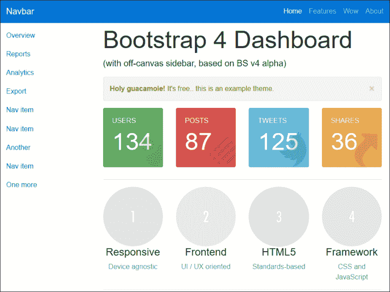
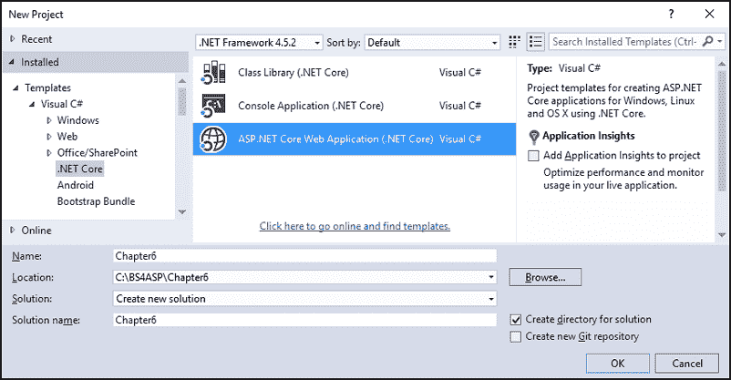
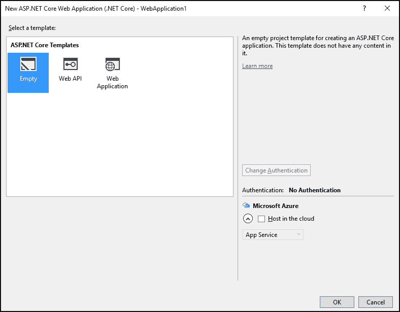
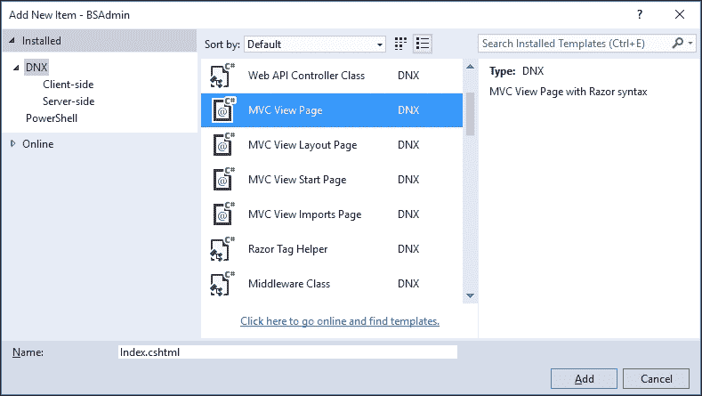
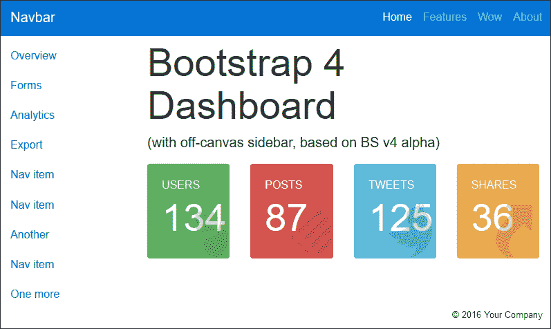
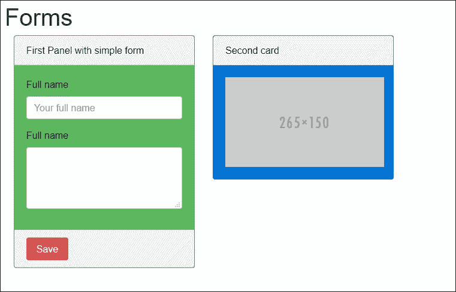
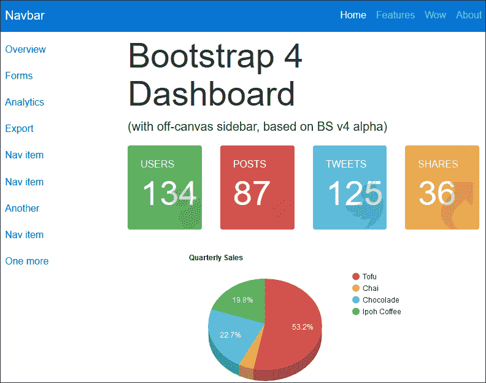
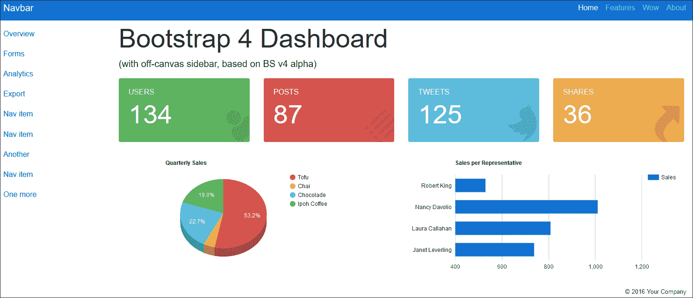

# 第六章。将引导 HTML 模板转换成可用的 ASP.NET MVC 项目

使用 Bootstrap 的一个主要好处是互联网上有各种各样的资源。网络开发社区已经接受了 Bootstrap，你会发现大量关于使用 Bootstrap 的有价值的模板、片段和建议。

通过结合预先设计的 Bootstrap 模板和 ASP.NET MVC，您可以节省大量时间，而不必担心网站布局或设计。

在本章中，我们将涵盖以下主题:

*   我们为什么使用预建的 HTML 模板，以及它们将如何节省时间
*   构建主布局
*   添加特定的页面视图
*   在视图中包含图表

# 使用预构建的 HTML 模板

众所周知，大多数开发人员不一定是好的设计师。我们更喜欢在后端工作，构建出色的性能和智能软件，有时，我们倾向于将用户界面视为事后的想法。

通过使用预先设计的 HTML Bootstrap 模板，我们可以为用户提供由专业设计师设计的直观且设计良好的用户界面。如果设计是基于 Bootstrap，开发人员已经熟悉了大部分的 CSS 类名、组件和插件，并且不需要重新学习任何东西。

网络提供各种免费和优质的引导模板。主题森林([www.themeforest.net](http://www.themeforest.net))提供了一系列令人难以置信的不同高级网站风格和设计。

使用 Bootstrap 4，Bootstrap 团队还提供官方主题，您可以购买。每个主题都提供了一整套工具和示例，可以作为项目的良好起点。

### 注

引导主题可用于构建仪表板、营销页面和各种网络应用程序。它们的价格极具竞争力，可从[http://themes.getbootstrap.com](http://themes.getbootstrap.com)购买。

对于本章中的示例，我们将使用 Bootstrap Zero([www . Bootstrap Zero . com/Bootstrap-template/Bootstrap-4-Admin-Dashboard](http://www.bootstrapzero.com/bootstrap-template/bootstrap-4-admin-dashboard))提供的免费 Bootstrap 4 Admin Dashboard 模板。Bootstrap 4 管理仪表板模板是一个使用 Bootstrap 4 的基本管理主题，非常适合后端管理或更复杂风格的网络应用程序。主题如下图所示:



在我们使用模板构建 ASP.NET MVC 网站之前，我们需要通过完成以下步骤来下载源文件:

1.  导航到[http://www . bootstrapzero . com/bootstrap-template/bootstrap-4-admin-dashboard](http://www.bootstrapzero.com/bootstrap-template/bootstrap-4-admin-dashboard)，点击**下载**按钮，下载包含所有必需的 HTML、CSS 和 JavaScript 文件的 zip 存档。
2.  将文件解压缩到本地硬盘上的文件夹中；您会注意到归档包含以下文件夹:
    *   `css`
    *   `js`
3.  该档案还包含一个`index.html` HTML 文件，该文件说明了模板的各种页面和组件布局，您可以将其用作设计项目布局的起点。

# 创建 ASP.NET MVC 项目

要创建新的 ASP.NET MVC 项目，请执行以下步骤:

1.  In Visual Studio, create a new **ASP.NET Core Web Application** project, as shown in the following screenshot:

    

2.  In the **New ASP.NET Core Web Application** dialog, select the **Empty** template under the **ASP.NET Core Templates** and click on the **OK** button:

    

3.  Visual Studio 将创建一个默认的空 MVC 项目。右键单击项目内的`wwwroot`文件夹，导航至**添加|新文件夹**。创建以下两个文件夹:
    *   `css`
    *   `js`
4.  将引导 4 管理仪表板模板`css`文件夹中的`styles.css`文件添加到项目中`wwwroot`文件夹内的`css`文件夹中。
5.  将位于引导 4 管理仪表板模板的`js`文件夹中的`scripts.js`文件复制到项目的`wwwroot`文件夹中的`js`文件夹。
6.  接下来，在名为`Controllers`和`Views`的项目根目录下添加两个文件夹。
7.  接下来，为了启用 MVC 特性，如工具和标记助手，打开`project.json`文件，并将以下内容添加到依赖项和工具列表中:

    ```cs
            "dependencies": {
             "Microsoft.NETCore.App": {
             "version": "1.0.0",
             "type": "platform"
             },
             "Microsoft.AspNetCore.Diagnostics": "1.0.0",
             "Microsoft.AspNetCore.Server.IISIntegration": "1.0.0",
             "Microsoft.AspNetCore.Server.Kestrel": "1.0.0",
             "Microsoft.Extensions.Logging.Console": "1.0.0",
             "Microsoft.AspNetCore.Mvc": "1.0.0",
             "Microsoft.AspNetCore.StaticFiles": "1.0.0",
             "Microsoft.AspNetCore.Mvc.TagHelpers": "1.0.0",
             "Microsoft.AspNetCore.Razor.Tools": {
             "version": "1.0.0-preview2-final",
             "type": "build"
             },
             "Microsoft.VisualStudio.Web.CodeGeneration.Tools": {
             "version": "1.0.0-preview2-final",
             "type": "build"
             },
             "Microsoft.VisualStudio.Web.CodeGenerators.Mvc": {
             "version": "1.0.0-preview2-final",
             "type": "build"
             }
             },
            "tools": {
             "Microsoft.AspNetCore.Server.IISIntegration.Tools":
             "1.0.0-preview2-final",
             "Microsoft.VisualStudio.Web.CodeGeneration.Tools": {
             "version": "1.0.0-preview2-final",
             "imports": [
             "portable-net45+win8"
             ]
             }}
    ```

8.  保存`project.json`文件时，Visual Studio 会自动将所有需要的依赖项添加到项目中。
9.  在项目根目录下打开`Startup.cs`文件，更改`ConfigureService`方式启用 MVC，如下图:

    ```cs
            public void ConfigureServices(IServiceCollection services) 
            { 
                services.AddMvc(); 
            } 

    ```

10.  启用静态文件，并通过更改`Configure`方法指定默认路由，如以下代码所示:

    ```cs
            public void Configure(IApplicationBuilder app) 
            { 
                app.UseIISPlatformHandler(); 
                app.UseStaticFiles(); 
                app.UseMvc(routes => 
                { 
                    routes.MapRoute( 
                        name: "default", 
                        template: "{controller=Home}/{action=Index}/{id?}"); 
                }); 
            } 

    ```

# 创建主布局

您已经添加了为项目创建主布局文件所需的 CSS 和 JavaScript 文件。接下来，您需要创建一个主控制器和一个主布局文件。为此，请完成以下步骤:

1.  通过右键单击名为`HomeController`的新空控制器并选择**添加|新项目，将其添加到`Controllers`文件夹中...**。
2.  从项目列表中选择 **MVC 控制器类**，点击**添加**按钮。
3.  接下来，右键单击项目中的`Views`文件夹，导航至**添加** | **新文件夹**。命名文件夹`Shared`。
4.  右键单击新创建的`Shared`文件夹，导航至**添加** | **新项目...**
5.  在项目项列表中选择 **MVC 查看布局页面**并将文件名保留为`_Layout.cshtml`，点击**添加**。
6.  打开引导 4 管理仪表板模板源文件中的`index.html`文件，并将其内容复制到`_Layout.cshtml`文件中。
7.  更改`<head>`标签，以引用正确文件夹中的`styles.css`文件夹，如以下代码所示:

    ```cs
            <head> 
                <meta charset="utf-8"> 
                <title>Bootstrap 4 Dashboard</title> 
                <meta name="description" content="A admin dashboard theme that will 
                    get you started with Bootstrap 4." /> 
                <meta name="viewport" content="width=device-width, 
                    initial-scale=1.0"> 

                <link rel="stylesheet" href="//maxcdn.bootstrapcdn.com/bootstrap
                    /4.0.0-alpha/css/bootstrap.min.css" /> 
                <link href="//maxcdn.bootstrapcdn.com/font-awesome/4.3.0/css/
                    font-awesome.min.css" rel="stylesheet" /> 
                <link rel="stylesheet" href="~/css/styles.css" /> 
            </head> 

    ```

8.  更新结束
9.  接下来，您会注意到页面被划分为不同的元素:
    *   包含站点导航菜单的`<nav>`类
    *   一个 ID 为`main`的`<div>`
    *   `*` 一个名为`.col-md-9 col-lg-10 main`的`<div>`
10.  保持`<nav>`和`<div>`标签的标识为`main`不变，用`@RenderBody()`方法替换`<div class="col-md-9 col-lg-10 main">`元素中的所有标记。
11.  接下来，在`Views`文件夹的根目录下添加一个名为`_ViewStart.cshtml`的新文件。为了使所有视图都能使用新的布局文件，将其内容更改为:

    ```cs
            @{
             Layout = "_Layout";
             }
    ```

12.  主布局现已完成；接下来，您需要在主控制器中为`Index`动作添加一个视图。

# 为家庭控制器添加视图

您需要为家庭控制器的`Index`动作创建一个视图，以便测试模板。完成以下步骤来完成此操作:

1.  打开`HomeController.cs`文件，如果`HomeController`类还没有包含索引操作方法，则添加它，如下所示:

    ```cs
            public IActionResult Index() 
            { 
                return View(); 
            } 

    ```

2.  接下来，右键单击`Views` \ `Home`文件夹并**添加** | **新项目...从上下文菜单中选择**。
3.  Select **MVC View Page** from the list of project items, make sure the name is `Index.cshtml`, and click on **Add:**

    

4.  打开新创建的`Index.cshtml`文件，将其标记改为如下:

    ```cs
            <p class="hidden-md-up"> 
                <button type="button" class="btn btn-primary-outline btn-sm" 
                 data-toggle="offcanvas"><i class="fa fa-chevron-left"></i>         
            Menu</button> 
            </p> 
            <h1 class="display-1 hidden-xs-down"> 
                Bootstrap 4 Dashboard 
            </h1> 
            <p class="lead">(with off-canvas sidebar, based on BS v4 alpha)</p> 
            <div class="row"> 
                <div class="col-md-3 col-sm-6"> 
                    <div class="card card-inverse card-success"> 
                        <div class="card-block bg-success"> 
                            <div class="rotate"> 
                                <i class="fa fa-user fa-5x"></i> 
                            </div> 
                            <h6 class="text-uppercase">Users</h6> 
                            <h1 class="display-1">134</h1> 
                        </div> 
                    </div> 
                </div> 
                <div class="col-md-3 col-sm-6"> 
                    <div class="card card-inverse card-danger"> 
                        <div class="card-block bg-danger"> 
                            <div class="rotate"> 
                                <i class="fa fa-list fa-4x"></i> 
                            </div> 
                            <h6 class="text-uppercase">Posts</h6> 
                            <h1 class="display-1">87</h1> 
                        </div> 
                    </div> 
                </div> 
                <div class="col-md-3 col-sm-6"> 
                    <div class="card card-inverse card-info"> 
                        <div class="card-block bg-info"> 
                            <div class="rotate"> 
                                <i class="fa fa-twitter fa-5x"></i> 
                            </div> 
                            <h6 class="text-uppercase">Tweets</h6> 
                            <h1 class="display-1">125</h1> 
                        </div> 
                    </div> 
                </div> 
                <div class="col-md-3 col-sm-6"> 
                    <div class="card card-inverse card-warning"> 
                        <div class="card-block bg-warning"> 
                            <div class="rotate"> 
                                <i class="fa fa-share fa-5x"></i> 
                            </div> 
                            <h6 class="text-uppercase">Shares</h6> 
                            <h1 class="display-1">36</h1> 
                        </div> 
                    </div> 
                </div> 
            </div>  

    ```

5.  Run the project, and you should see the home view and layout in your browser:

    

# 添加不同的页面视图

接下来，通过完成以下步骤，您将创建一个显示两张卡的自定义视图，一张显示简单的 Bootstrap 表单，另一张显示图像:

1.  向项目的`Controllers`文件夹中添加一个名为`FormsController.cs`的新的空 **MVC 控制器类**。
2.  新的控制器类应该已经包含了一个`Index`动作方法。
3.  接下来，在`Views`文件夹中添加一个名为`Forms`的新文件夹。
4.  在新创建的`Forms`文件夹中添加一个新的 **MVC 查看页面**，称为`Index.cshtml`。
5.  将以下标记添加到视图中:

    ```cs
            <div class="row"> 
                <h1>Forms</h1> 
                <div class="col-md-3"> 
                    <form> 
                        <div class="card card-success" style="max-width: 20rem;"> 
                            <div class="card-header"> 
                                First Panel with simple form 
                            </div> 
                            <div class="card-block"> 
                                <fieldset class="form-group"> 
                                    <label for="fullName">Full name</label> 
                                    <input type="text" class="form-control" 
                                    id="fullName" placeholder="Your full name"> 
                                </fieldset> 
                                <fieldset class="form-group"> 
                                    <label for="bio">Full name</label> 
                                    <textarea class="form-control" id="bio" 
                                     rows="3"></textarea> 
                                </fieldset> 
                            </div> 
                            <div class="card-footer"> 
                                <button type="submit" class="btn btn-danger">
                            Save</button> 
                            </div> 
                        </div> 
                    </form> 
                </div>  
                <div class="col-md-3"> 
                    <div class="card card-primary" style="max-width: 20rem;"> 
                        <div class="card-header"> 
                            Second card 
                        </div> 
                        <div class="card-block"> 
                             
                        </div>              
                    </div> 
                </div> 
            </div> 

    ```

6.  最后，您需要更改左侧导航菜单，以包含指向您刚刚添加的视图的链接。为此，请完成以下步骤:
7.  打开`Views\Shared`文件夹内的`_Layout.cshtml`文件。
8.  在文件里面找到下面一行代码:

    ```cs
            <li class="nav-item"><a class="nav-link" href="#">Reports</a></li> 

    ```

9.  将前一行改为:

    ```cs
            <li class="nav-item"><a class="nav-link" asp-controller="Forms"         
            asp-action="Index">Forms</a></li> 

    ```

10.  In the preceding code, the `asp-*` Tag Helpers were used to specify the controller and action for the `<a>` element. When the user clicks on the **Forms** menu item, they will be shown the form view you created earlier.

    

# 向视图添加图表

通过在视图中添加图表，您可以为用户提供丰富的体验，并让他们能够全面了解系统的重要信息。

向项目中添加图表和图形时，有许多选项；一些最流行的图表组件如下:

*   谷歌图表:[https://developers.google.com/chart/](https://developers.google.com/chart/)
*   图表. js:[http://www.chartjs.org/](http://www.chartjs.org/)
*   moris . js:[http://morrissjs . github . io/Morris . js/](http://morrisjs.github.io/morris.js/)
*   flot:[http://www.flotcharts.org/](http://www.flotcharts.org/)

## 将谷歌图表添加到视图

谷歌提供了丰富的图表应用编程接口，功能强大，易于使用，而且免费。他们还提供了一个互动的图库，展示了他们的各种图表。

要将谷歌图表添加到主控制器的索引视图，请完成以下步骤:

1.  在 Visual Studio 解决方案资源管理器中，双击`Views\Home`文件夹中的`Index.cshtml`文件。
2.  向视图中添加一个新的 Bootstrap 行，它将作为 Google 图表的容器:

    ```cs
            <div class="row"> 
                <div class="col-md-6 col-sm-6" id="piechart">         
                </div> 
            </div> 

    ```

3.  在页面底部添加对**谷歌图表库**以及本地 JavaScript 文件的引用:

    ```cs
            @section scripts{ 
                <script type="text/javascript" src="https://www.gstatic.com/charts        /loader.js"></script> 
                <script src="~/js/home.index.js"></script> 
            } 

    ```

4.  接下来，在`wwwroot\js`文件夹中添加一个名为`home.index.js`的新 JavaScript 文件。
5.  将以下代码添加到`home.index.js`文件中，该文件将加载谷歌图表应用编程接口，并指定一旦加载该应用编程接口就运行的回调函数的名称:

    ```cs
            google.charts.load('current', { 'packages': ['corechart'] }); 
            google.charts.setOnLoadCallback(generateChart); 

    ```

6.  接下来，在文件中创建名为`generateChart`的函数:

    ```cs
            function generateChart() { 
                var data = new google.visualization.DataTable(); 
                data.addColumn('string', 'Products'); 
                data.addColumn('number', 'Sales'); 
                data.addRows([ 
                  ['Tofu', 30], 
                  ['Chai', 10], 
                  ['Chocolade', 20], 
                  ['Ipoh Coffee', 40] 
                ]); 

                var options = { 
                    'title': 'Quarterly Sales', 
                    'width': 600, 
                    'height': 300, 
                    is3D: true, 
                    colors: ['#d9534f', '#f0ad4e', '#5bc0de', '#5cb85c'] 
                }; 

                var chart = new google.visualization.PieChart($('#piechart')[0]); 
                chart.draw(data, options); 
            } 

    ```

`generateChart`函数中的代码创建了一个新的`DataTable`类，该类表示一个二维值表，并通过调用`addColumn`方法向其中添加了两个名为`Products`和`Sales`的列。使用`addRows`方法，将包含产品名称和售出产品总数的四行数据添加到`DataTable`类中。

接下来，声明一个名为 options 的新对象，其中包含 Google 图表的选项。在这些选项中，指定了图表的标题颜色、尺寸和颜色。将`is3D`选项设置为真将生成具有 3D 效果的图表。

声明了一个新的饼图，并设置了它的容器元素，在本例中是一个带有`piechart`的`id`元素。最后调用`draw`方法绘制图表。

运行项目时，视图应类似于下图:



## 使用谷歌图表进行服务器端数据处理

在前面的例子中，用于饼图的数据是在 JavaScript 文件中声明的。这种方法适用于静态数据，但在大多数情况下，您可能希望从数据源(如数据库)读取用于生成图表的数据。

为此，请完成以下步骤:

1.  打开位于`Controllers`文件夹中的`HomeController.cs`文件。
2.  添加一个名为`SalesPerSalesPerson`的新方法，它将返回一个 JsonResult，如下所示:

    ```cs
            [HttpPost] 
            public JsonResult SalesPerSalesPerson() 
            { 
                List<object> data = new List<object>(); 
                data.Add(new string[] { "Product", "Sales" }); 
                data.Add(new object[] { "Robert King",530}); 
                data.Add(new object[] { "Nancy Davolio", 1012 }); 
                data.Add(new object[] { "Laura Callahan", 810 }); 
                data.Add(new object[] { "Janet Leverling", 738 }); 
                return Json(data); 
            } 

    ```

3.  在`SalesPerSalesPerson`方法中，声明了一个新的`List`对象。安讯士名称以及每个销售人员的数据作为`string`数组添加。这些信息也可能是从数据库中读取的。
4.  接下来，打开`Views\Home`文件夹中的`Index.cshtml`文件，并在文件中添加以下 HTML/Razor 标记:

    ```cs
            <div class="col-md-6 col-sm-6" id="barchart"                         
            data-dataurl="@Url.Action("SalesPerSalesPerson","Home")" 
            </div> 

    ```

5.  请注意，将使用`<div>`元素的`data-dataurl`属性来将返回图表数据的动作的网址传递给 JavaScript 函数。
6.  打开`home.index.js`文件，添加`barChart` JavaScript 函数:

    ```cs
            function barChart() { 
                var barChart = $('#barchart'); 
                var dataUrl = barChart.data('dataurl'); 
                $.post(dataUrl, function (d) { 
                    var data = google.visualization.arrayToDataTable(d); 
                    var chart = new google.visualization.BarChart(barChart[0]); 

                    var options = { 
                        'title': 'Sales per Representative', 
                        'width': 600, 
                        'height': 300 
                    }; 
                    chart.draw(data,options); 
                }); 
            } 

    ```

7.  接下来，创建一个新的`generateChart`函数，作为谷歌图表应用编程接口的回调函数:

    ```cs
            function generateChart() { 
                pieChart(); 
                barChart(); 
            } 

    ```

8.  pieChart 方法与上一个示例中使用的代码相同。

准备好所需的代码后，您就可以运行项目了，生成的视图应该包含一个饼图和一个条形图，如下图所示:



# 总结

在本章中，您已经学习了如何将预先设计好的 HTML 模板转换成可用的 ASP.NET MVC 项目。本章中展示的技术实际上可以应用于任何 HTML 模板，允许您构建专业设计的 web 应用程序，而不必自己设计布局。

在下一章中，我们将探索如何在您自己的 ASP.NET MVC 项目中包含和使用 jQuery DataTables 插件。