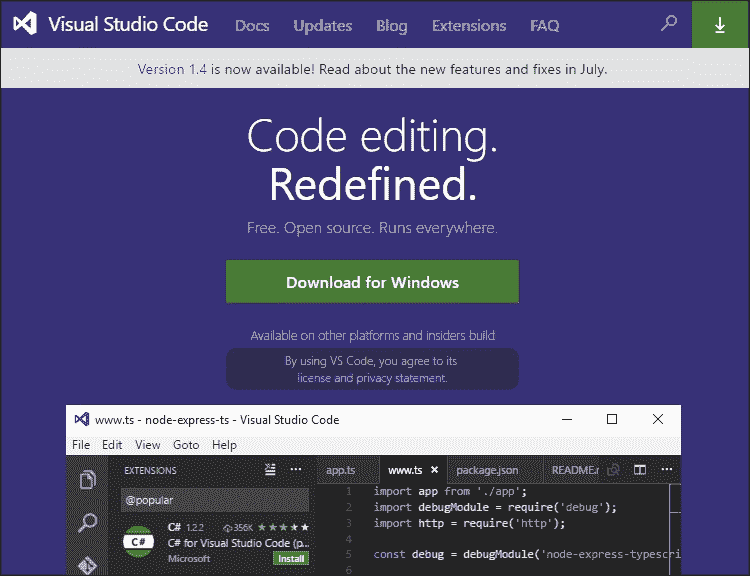
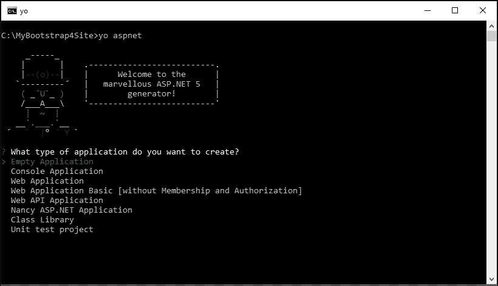
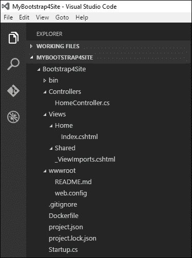
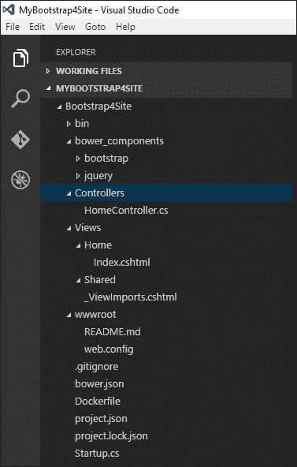
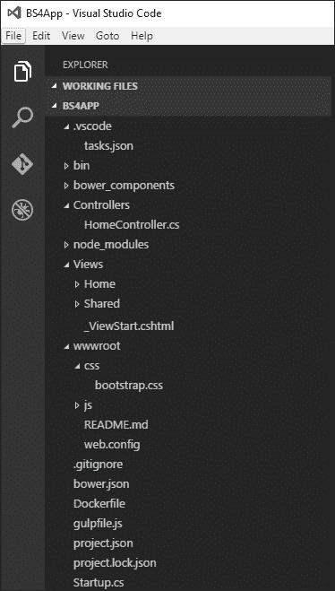

# 第八章。使用 Visual Studio 代码创建引导 4 ASP.NET MVC 站点

在他们的 Build 2015 会议期间，微软发布了一个新的轻量级代码编辑器，用于编写名为 **Visual Studio Code** 的网络和移动应用。这是微软迈出的重要一步，因为这标志着他们第一次向开发人员提供跨平台代码编辑器，可在 Windows、OS X 和 Linux 上运行。

随着 ASP.NET 的重大重新设计，使其成为一个开源和跨平台的框架，开发人员现在能够在 Windows、Linux 和 OS X 上创建 ASP.NET 网站。Visual Studio Code 使这变得稍微容易一点。

在本章中，我们将涵盖以下主题:

*   什么是 Visual Studio 代码？
*   安装 Visual Studio 代码
*   使用约曼搭建一个空的 ASP.NET 项目
*   使用 Bower 添加引导 4 文件
*   使用大口编译引导文件
*   创建引用引导文件的布局文件

# 什么是 Visual Studio 代码？

Visual Studio Code 本质上是一个开源的、跨平台的文本编辑器。它基于**电子框架**，原名 **Atom Shell** ，这是一个让你可以使用 HTML、CSS 和 JavaScript 编写跨平台桌面应用的框架。如果你曾经使用过 GitHub 的 Atom 文本编辑器，你会发现它和 Visual Studio 代码非常相似。

### 注

Atom 是一个来自 GitHub 的可黑客攻击/可定制的文本编辑器。也是开源的，可以从[https://atom.io/](https://atom.io/)下载。

开发人员可以使用 Visual Studio 代码以 HTML、CSS 和 JavaScript 构建 web 应用程序，并且还支持 TypeScript 和 ASP.NET Core。它是基于文件夹而不是基于项目的，这意味着您只需要打开一个包含您的项目文件的文件夹，而不是打开一个项目文件，如`.csproj`。

它具有**智能感知**(这对于任何过去使用过 Visual Studio 的人来说都是熟悉的)，并且还支持调试和 Git 源代码控制功能。它还包括一些 Visual Studio 开发人员已经开始欣赏的功能，例如语法突出显示、自动缩进和括号匹配。Visual Studio 代码是可自定义的，因为用户可以更改主题、首选项和键盘快捷键。随着最新版本的发布，它也支持扩展，并且在[https://marketplace.visualstudio.com/VSCode](https://marketplace.visualstudio.com/VSCode)上已经有了广泛的扩展和主题。

# 安装 Visual Studio 代码

安装 Visual Studio 代码就像下载特定于您的操作系统的平台安装程序一样简单。你可以访问[https://code.visualstudio.com/](https://code.visualstudio.com/)，网站应该会显示你使用的操作系统和下载按钮。

例如，由于我是从一台 Windows 电脑访问该网站，它会自动显示一个**Windows 下载**按钮:



如果您需要为 Linux 或 OS X 下载，请滚动到页面底部，然后单击相应的下载按钮:


### 类型

有关在 Mac OS X、Linux 或 Windows 上启动和运行 Visual Studio Code 的完整说明，请访问[http://code.visualstudio.com/Docs/editor/setup](http://code.visualstudio.com/Docs/editor/setup)。

# 创建一个空的 ASP.NET 项目

因为 Visual Studio Code 是基于文件夹的，而不是像 Visual Studio 那样基于项目的，所以它的菜单列表中没有**文件** | **新项目**选项。

## 使用约曼搭建项目

相反，你将使用**约曼**脚手架一个基本的空 ASP.NET 项目。如果尚未安装 npm，请完成以下步骤:

1.  打开一个新的命令提示符，导航到您想要创建项目的文件夹，例如`C:\MyBootstrap4Site`。
2.  Enter the following command in the command prompt in order to install Yeoman and supporting tools:

    ```cs
     npm install -g yo grunt-cli generator-aspnet bower 

    ```

    安装 Yeoman 和支持工具后，请遵循以下步骤:

3.  输入以下命令，按*进入*启动约曼 ASP.NET 发电机:

    ```cs
            yo aspnet

    ```

4.  Select **Empty Application** from the list of applications and press **Enter:**

    

5.  当系统提示您输入 ASP.NET 应用程序的名称时，键入`Bootstrap4Site`并按*进入*。
6.  约曼将为你的项目搭建脚手架，完成后会显示一条消息。接下来，通过在命令提示符下输入以下命令并按下*回车*键来恢复项目的任何包:

    ```cs
    dnu restore 

    ```

7.  保持当前命令提示符打开并启动 Visual Studio 代码。
8.  选择**打开文件夹...从 Visual Studio Code 内的**文件**菜单中选择**并选择`C:\MyBootstrap4Site`文件夹。
9.  The project folder and files will be displayed inside the Visual Studio Code explorer.

    ### 类型

    如果您收到错误消息`dnu is not recognized`，运行以下命令:`dnvm upgrade`。

## 启用 ASP.NET MVC 和静态文件

目前，该项目只是一个空的 ASP.NET 项目，运行时只会显示一条 **Hello World** 消息。您需要通过完成以下任务来使您的项目和 MVC 能够服务于静态文件:

1.  打开`project.json`文件，将`dependencies`和刀具阵列更改为如下:

    ```cs
            "dependencies": { 
                "Microsoft.NETCore.App": { 
                  "version": "1.0.0", 
                  "type": "platform" 
                }, 
                "Microsoft.AspNetCore.Diagnostics": "1.0.0", 
                "Microsoft.AspNetCore.Mvc": "1.0.0", 
                "Microsoft.AspNetCore.Razor.Tools": { 
                  "version": "1.0.0-preview2-final", 
                  "type": "build" 
                }, 
                "Microsoft.AspNetCore.Server.IISIntegration": "1.0.0", 
                "Microsoft.AspNetCore.Server.Kestrel": "1.0.0", 
                "Microsoft.AspNetCore.StaticFiles": "1.0.0", 
                "Microsoft.Extensions.Configuration.EnvironmentVariables": "1.0.0", 
                "Microsoft.Extensions.Configuration.Json": "1.0.0", 
                "Microsoft.Extensions.Configuration.CommandLine": "1.0.0", 
                "Microsoft.Extensions.Logging": "1.0.0", 
                "Microsoft.Extensions.Logging.Console": "1.0.0", 
                "Microsoft.Extensions.Logging.Debug": "1.0.0", 
                "Microsoft.Extensions.Options.ConfigurationExtensions": "1.0.0", 
                "Microsoft.VisualStudio.Web.BrowserLink.Loader": "14.0.0"     
              }, 

              "tools": { 
                "BundlerMinifier.Core": "2.0.238", 
                "Microsoft.AspNetCore.Razor.Tools": "1.0.0-preview2-final", 
                "Microsoft.AspNetCore.Server.IISIntegration.Tools": 
                 "1.0.0-preview2-final" 
              } 

    ```

2.  接下来，为了恢复依赖关系，切换回命令提示符，输入以下命令，然后按*输入*键:

    ```cs
     dotnet restore 

    ```

3.  依赖项恢复后，切换回 Visual Studio Code，将`Startup.cs`类文件中的`ConfigureServices`方法更改为以下内容，以便启用 MVC:

    ```cs
            public void ConfigureServices(IServiceCollection services) 
            { 
                services.AddMvc(); 
            } 

    ```

4.  启用静态文件的服务，如图像、样式表和 JavaScript 文件。此外，通过将`Startup.cs`类文件中的`Configure`方法更改为以下内容来设置默认路线:

    ```cs
            public void Configure(IApplicationBuilder app) 
            { 
                app.UseStaticFiles(); 

                app.UseMvc(routes => 
                { 
                     routes.MapRoute( 
                           name: "default", 
                           template: "{controller=Home}/{action=Index}/{id?}"); 
                }); 
            }  

    ```

## 添加默认路由控制器和视图

由于创建了一个空项目，默认情况下不会创建默认控制器或视图。您已经在前面的步骤中配置了一个默认路由，为了让它工作，您需要添加一个主控制器和一个索引视图:

1.  将鼠标悬停在 Visual Studio 代码资源管理器中的文件夹名称上，然后单击**新文件夹**图标。
2.  命名新文件夹`Controllers`并添加另一个名为`Views`的文件夹。
3.  在新创建的`Views`文件夹中再创建两个名为`Home`和`Shared`的文件夹。
4.  接下来，右键单击`Controllers`文件夹，从上下文菜单中选择**新文件**。命名文件`HomeController.cs.`
5.  将以下代码添加到`HomeController.cs`文件中，该代码将为控制器创建默认的索引方法:

    ```cs
            using Microsoft.AspNetCore.Mvc; 
            namespace BS4App.Controllers 
            { 
                public class HomeController : Controller 
                { 
                    public IActionResult Index() 
                    { 
                        return View(); 
                    } 
                } 
            } 

    ```

6.  将名为`Index.cshtml`的新文件添加到`Views\Home`文件夹，并将其内容设置为如下:

    ```cs
            <h1>This is my Bootstrap 4 site. </h1> 

    ```

7.  Your project layout should look similar to the following inside the Visual Studio Code Explorer:

    

# 使用 Bower 添加引导 4 文件

为了在项目中使用 Bootstrap 4，首先需要添加 Bootstrap 样式表和 JavaScript 文件。在本例中，您将使用 Bower 将 Bootstrap 4 文件下载到您的本地项目中:

1.  将名为`bower.json`的新文件添加到项目文件夹的根目录，并将其内容设置为以下内容，以便将 Bootstrap 4 作为依赖项添加:

    ```cs
            { 
              "name": "ASP.NET", 
              "private": true, 
              "dependencies": { 
                "bootstrap": "4.0" 
              } 
            } 

    ```

2.  为了下载任何 Bower 依赖项，您需要在您的项目文件夹中打开一个新的命令提示符—这可以使用快捷键 *Shift + Ctrl + C.* 从 Visual Studio Code 中完成
3.  在命令提示符下输入以下命令，按*进入* :

    ```cs
    bower update 

    ```

4.  前面的命令将下载`bower.json`文件中指定的任何 Bower 依赖项，并将其保存到项目中的`bower_components`文件夹中。
5.  After the Bower dependencies has been downloaded, your project layout should resemble the following inside the Visual Studio Code explorer:

    

    ### 类型

    如果您收到以下错误，`ENOGIT git is not installed or not in the PATH`，这意味着您没有在环境变量中指定的 Git 安装文件夹路径。通过向您的 Windows 环境变量添加以下值来解决此问题:`;%PROGRAMFILES(x86)%\Git\bin;%PROGRAMFILES(x86)%\Git\cmd` 另一种解决方法是从 Git Shell 运行命令，而不是正常的命令提示符。

# 使用 grave 编译引导 Sass 文件

如果您想选择自定义引导 Sass 文件以便在项目中使用它们，可以通过为其创建一个大口任务来自动执行 Sass 编译过程。

Visual Studio 代码支持从内部运行任务和分析任务结果的能力。任务可以包括许多事情，如编译 Sass，缩小 CSS，或将文件复制到不同的文件夹。

要在 Visual Studio 代码中配置任务，请执行以下步骤:

1.  在 Visual Studio 代码中，按下 *F1* 键打开**命令面板**。
2.  在命令面板中输入以下内容，然后按*进入* :

    ```cs
    Configure Task Runner 

    ```

3.  从列表中选择**咕噜声**，按下*回车*键。
4.  该命令将自动创建一个名为`.vscode`的新文件夹，其中包含一个新的`tasks.json`文件。
5.  你将需要大口和大口-萨斯插件，以便将引导 4 SCSS 文件编译成 CSS。要安装该插件，请打开命令提示符并输入以下命令，然后按*进入*键:

    ```cs
            npm install gulp gulp-sass

    ```

6.  安装好必要的插件后，切换回 Visual Studio Code，将`tasks.json`文件的内容改为如下:

    ```cs
            { 
                "version": "0.1.0", 
                "command": "gulp", 
                "isShellCommand": true, 
                "tasks": [ 
                    { 
                        "taskName": "compile-sass", 
                        "isBuildCommand": true, 
                        "showOutput": "always", 
                        "isWatching": true 
                    } 
                ] 
            } 

    ```

7.  保存`tasks.json`文件，并在项目的根目录下添加一个名为`gulpfile.js`的新文件。
8.  将`gulpfile.js`文件的内容改为如下:

    ```cs
            var gulp = require('gulp'); 
            var gulpSass = require('gulp-sass'); 

            gulp.task('compile-sass', function () { 
                gulp.src('./bower_components/bootstrap/scss/bootstrap.scss') 
                    .pipe(gulpSass()) 
                    .pipe(gulp.dest('./wwwroot/css')); 
            }); 

    ```

9.  先前的更改将编译位于`./bower_components/bootstrap/scss/`文件夹中的`bootstrap.scss` SASS 文件，并将该 CSS 文件复制到`wwroot/css`文件夹中作为`bootstrap.css`。
10.  要运行编译-sass 任务，按下 *F1* 键，调出命令面板并键入以下内容，或从项目列表中选择:

    ```cs
    Tasks: Run Task 

    ```

11.  这将返回项目中配置的可用任务列表。从列表中选择`compile-sass`。
12.  Visual Studio Code will show an output window with the result of the task:

    

在`compile-sass`任务完成后，您应该会在`wwwroot\css`文件夹中看到一个`bootstrap.css`文件。您的项目布局应该类似于 Visual Studio 代码资源管理器中的以下内容:



# 创建 MVC 布局页面

创建一个支持 Bootstrap 4 的 ASP.NET MVC 项目的最后一步是创建一个主布局页面，该页面将引用 Bootstrap CSS 和 JavaScript 文件。要创建布局页面，请完成以下步骤:

1.  向`Views\Shared`文件夹添加一个名为`_Layout.cshtml`的新文件。
2.  将以下 HTML 添加到文件中:

    ```cs
            <!DOCTYPE html> 
            <html> 
            <head> 
                <meta charset="utf-8" /> 
                <meta name="viewport" content="width=device-width,
                 initial-scale=1.0" /> 
                <title>My Bootstrap Site</title> 
                <link rel="stylesheet" href="~/css/bootstrap.css" />     
            </head> 
            <body> 

                <div class="container body-content"> 
                    @RenderBody() 
                    <hr /> 
                    <footer> 
                        <p>&copy; @DateTime.Now.Year - Your Bootstrap 4 site</p> 
                    </footer> 
                </div> 

            </body> 
            </html> 

    ```

3.  保存文件。
4.  为了使用布局文件，在`Views/Home`文件夹中添加一个名为`Index.cshtml`的新文件，并将其内容设置如下:

    ```cs
            @{ 
                Layout="~/Views/Shared/_Layout.cshtml"; 
            } 
            <h1>This is my Bootstrap 4 site. </h1> 

    ```

## 测试场地

为了测试站点，您需要切换回命令提示符并输入以下命令，以便启动红隼网络服务器并运行您的站点:

```cs
dotnet run 

```

将显示一条消息，说明网络服务器正在监听`http://localhost:5000`。打开浏览器，导航到该网址。您应该会看到您的网站在浏览器中以默认的 Bootstrap 4 样式运行。

# 总结

在这一章中，你被介绍给了新的编辑；微软的 Visual Studio 代码，并看到如何使用它来创建一个在 Windows、Linux 和 OS X 上使用 Bootstrap 4 的 ASP.NET MVC 站点

这也是这本书的最后一章，到目前为止，您应该已经对在自己的 ASP.NET MVC 项目中使用 Bootstrap 相当满意了。您还应该更熟悉新的 ASP.NET Core和它使用的新的包管理器和任务管理器。

确保您从 Packt 网站或位于[https://github.com/Pietervdw/bootstrap-for-aspnetmvc](https://github.com/Pietervdw/bootstrap-for-aspnetmvc)的 Github 存储库中下载了本书附带的示例项目，以便查看实际操作中提到的示例。

感谢阅读。直到下次，继续编码！