# 第二章。构建您的第一个移动应用

在这一章中，我们将弄脏我们的手，用一些剑道用户界面移动代码热身，然后开始构建一个名为电影门票的端到端移动应用程序。在这本书的过程中，我们将发现新的特性并增强我们的应用程序，使其成为一个成熟的、可部署的移动应用程序！最初我们将这个应用作为单页应用来对待，可以托管在 web 服务器上，也可以通过在浏览器本地加载`index.html`文件来访问，以减轻调试和测试的痛苦。

# 准备显影机

设置环境开发剑道 UI 手机应用程序简单明了。创建一个基础 HTML 文件，添加所需的`.js`和`.css`剑道 UI Mobile 文件引用，就可以开始了。除非您想使用诸如 Visual Studio、Dreamweaver 或 Komodo 之类的 HTML IDE，否则您只需要一个文本编辑器来开发 Kendo UI 应用程序。剑道 UI 唯一的外部依赖是 jQuery。始终检查您正在使用的剑道 UI 版本所支持的 jQuery 版本。不能保证最新版本的 jQuery 会得到最新版本剑道的支持。所以最安全的方法是使用剑道 UI 包提供的 jQuery 文件。

您可以使用任何带有 HTML5 支持的浏览器的操作系统来开发剑道 UI Mobile 应用程序。我们将在本书中遵循的开发移动应用程序的过程将是在桌面机器上进行开发，并在模拟器和移动设备上作为移动网站运行。我们将使用的集成开发环境是 Visual Studio 2012，模拟器将是来自**动态研究** ( **RIM** )的 Ripple。如果你不习惯使用 Visual Studio，请随意使用任何 HTML 编辑器或文本编辑器；你几乎感觉不到任何不同。

### 类型

如果你没有微软 Visual Studio，可以从这个链接下载免费的 Visual Studio Express 2012 网络版或者其他口味的试用版:[http://www.microsoft.com/visualstudio/downloads](http://www.microsoft.com/visualstudio/downloads)

## 波纹仿真器

移动应用开发不同于桌面应用开发，前者在桌面上开发，部署在移动设备上，后者在台式电脑上开发使用。在移动设备上测试和调试应用程序并不简单，有时几乎不可能。因此，仿真器在测试和调试桌面上的移动应用程序方面发挥着关键作用。

**Ripple Emulator** 是市场上首选的模拟器之一，可模拟安卓、iOS 和黑莓等多种移动平台。Ripple 提供了调试 HTML5 移动应用程序的能力，充分展示了该应用程序在不同平台下的外观。Ripple 帮助开发人员实时实现自动化测试、JavaScript 调试以及多设备和屏幕分辨率仿真，而无需重新部署移动应用程序或重启仿真器。

Ripple 作为谷歌 Chrome 浏览器的扩展运行，所以你需要在你的机器上安装谷歌 Chrome。

### 安装波纹模拟器

Ripple 的安装非常简单，可以通过以下简单的步骤完成:

1.  如果谷歌浏览器尚未安装，请安装它，并导航到谷歌浏览器商店:[https://chrome.google.com/webstore/](https://chrome.google.com/webstore/)。
2.  Search for **Ripple Emulator**.

    

3.  现在点击**添加到铬合金**按钮。
4.  Click on **Add** when the following popup appear:

    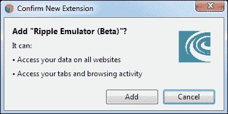

5.  Ripple will now be installed on your Chrome browser and can be enabled/disabled using the Ripple icon that appears on the top-right corner of the browser:

    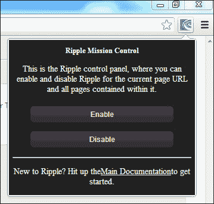

6.  Now let's visit the mobile website of [reuters.com](http://reuters.com%20) and see Ripple in action. Enter [http://mobile.reuters.com/](http://mobile.reuters.com/) on the browser address bar and when the website loads, click on the **Enable** button. If Ripple asks to select a platform to test with, select a platform of your choice. I am selecting **Apache Cordova/PhoneGap** so that we can emulate the behavior of a mobile app bundled using Cordova/PhoneGap. Once inside the emulator, you can select a device from the **Devices** list on the left. Let's select **iPhone 5** and see how [reuters.com](http://reuters.com) appears on iPhone 5:

    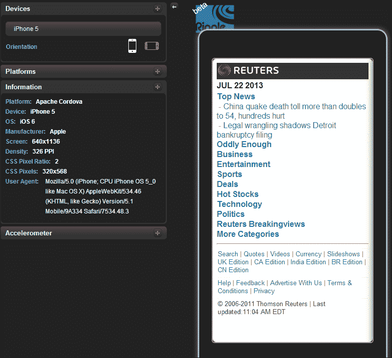

Ripple 附带了许多功能，例如更改设备方向、摇动设备、设置地理位置以及触发特定于平台的事件，这有助于开发人员在桌面上测试和调试移动应用程序。我们强烈建议在这一点上玩一会儿 Ripple Emulator，感受一下它的所有特性。

### 类型

要使用 Ripple Emulator 在本地测试您的移动应用程序，需要使用本地网络服务器将它作为网站托管。要了解更多关于 Ripple 的信息，请访问:[https://developer . blackberry . com/html 5/documentation/get _ start _ with _ Ripple _ 1866966 _ 11 . html](https://developer.blackberry.com/html5/documentation/getting_started_with_ripple_1866966_11.html)

当然，没有什么可以取代移动设备上的实际测试。在许多情况下，剑道用户界面移动风格在移动设备上比在桌面浏览器上看起来更好。如果您对正在开发的应用程序是认真的，请确保在部署应用程序之前，您已经接触了所有的目标设备，并进行了几轮测试。

# 首款剑道 UI 手机应用

学习任何新技术或新语言的最好方法就是深入其中，把你的手弄脏。因为这本书是关于越来越多的代码，让我们从创建一个简单的单页应用程序开始。

我们将遵循渐进的增强方法，从基本元素开始，增加应用程序的复杂性，最后，我们将创建一个功能齐全的可部署应用程序。

### 注

Kendo UI Mobile 仅支持 WebKit 浏览器，因此使用 Chrome 或 Safari 浏览器在桌面上运行演示代码非常重要。

现在您已经准备好了 IDE 和模拟器，请执行以下步骤来运行您的第一个移动页面:

1.  从以下网址下载剑道 UI:[http://www.kendoui.com/download.aspx](http://www.kendoui.com/download.aspx)。您可以购买剑道 UI 许可证，也可以下载 30 天免费试用版。
2.  为应用程序创建一个`root`文件夹，并将以下手机专用文件/文件夹从剑道包复制到该文件夹:
    *   `jquery.min.js`和`kendo.mobile.min.js`文件从`js`文件夹到应用程序根目录的`js/kendo`文件夹
    *   `kendo.mobile.all.min.css`和`images`文件夹从`styles`文件夹到应用程序根目录的`styles/kendo`文件夹
3.  Create an `index.html` file in the `root` folder with the following code in it:

    ```cs
    <!DOCTYPE HTML>
    <html>
      <head>    
        <script src="js/kendo/jquery.min.js"> </script>
        <script src="js/kendo/kendo.mobile.min.js"></script>
        <link href="styles/kendo/kendo.mobile.all.min.css" rel="stylesheet" />
      </head>
      <body>
        <div data-role="view" data-title="Movie Tickets" id="mt-home-main-view" data-layout="mt-main-layout">
          Home Page View
        </div>
        <div data-role="layout" data-id="mt-main-layout">
          <header data-role="header">
            <div data-role="navbar">                
            <span data-role="view-title">Movie Tickets</span>
            </div>
          </header>
          <footer data-role="footer">
            <span style="color:#fff">  Footer content goes here </span>
          </footer>
        </div>
        <script>
          var application = new kendo.mobile.Application();
        </script>
      </body>
    </html>
    ```

    ### 注

    剑道在**内容交付网络** ( **CDN** ) 中托管开发所需的 JS 和 CSS 文件的精简版本，可通过以下方式访问:

    `http://cdn.kendostatic.com/` **<版本>** `/js/` **<文件名>** `.min.js`

    `http://cdn.kendostatic.com/` **<版本>** `/styles/` **<文件名>** `.min.css`

    例如:

    `http://cdn.kendostatic.com/2013.2.716/styles/kendo.mobile.all.min.css`

    `http://cdn.kendostatic.com/2013.2.716/js/kendo.mobile.min.js`

4.  Configure your local web server so that `index.html` can be accessed using a URL; something like `http://localhost/movietickets/index.html`

    ### 注

    如果不熟悉如何在 IIS 中创建虚拟目录，可以在这里找到:[http://goo.gl/0fUO1](http://goo.gl/0fUO1)。如果您使用的不是 Windows 操作系统，请从互联网上大量的手册中获得帮助，这些手册解释了如何在本地托管网站。

    请始终记住，只有当您需要使用 Ripple Emulator 测试移动应用程序时，这一步才是必需的。您总是可以在兼容 HTML5 的浏览器(如 Safari 或 Chrome)中打开您的网站，看到您的应用程序正在运行，并使用它们的调试工具。

    ### 类型

    WebKit 是一个开源的浏览器渲染引擎，被 Safari 和 Chrome 等浏览器使用。因此，如果您打算使用 PhoneGap 或任何其他基于 WebKit 的移动开发框架捆绑您的应用程序，那么使用任何基于 WebKit 的浏览器测试该应用程序通常都是安全的，因为它们共享相同的呈现引擎。

5.  打开 Chrome，导航到我们之前创建的`index.html`文件。点击瑞波的**启用**按钮，选择该设备作为最新版本的 iPhone。如果要求平台，请随意选择任何平台，如 **PhoneGap** 或**移动网络**。我们正在选择**Apache Cordova/phone gap(1 . 0 . 0)**和**iPhone 5**(Ripple 中的 **PhoneGap 2.0.0** 版本可能会导致屏幕滚动，这不是想要的行为)。

恭喜，你的第一款使用剑道 UI Mobile 的手机应用已经上线运行！

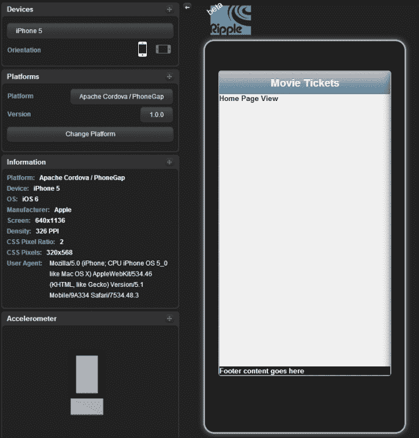

### 类型

如果您计划使用本地包装器(如 Cordova/PhoneGap)捆绑您的移动应用程序，请始终在本地捆绑所需的脚本文件，并避免使用 CDNs，因为这将大大延迟我们应用程序的加载时间。

## 视图和布局

视图小部件代表剑道用户界面移动应用程序中的一个页面。所有小部件和其他 HTML 元素都被添加到视图中。任何剑道 UI 手机应用都会有一个或多个视图。

一个`data-role`属性被用来定义一旦 HTML 元素被渲染，它会变成什么样的移动小部件。

属性定义`data-role="view"`定义了一个视图，`data-layout`属性用于定义哪个模板将作为我们视图的布局，如我们前面的示例所示:

```cs
<div data-role="view" id="mt-home-main-view" data-layout="mt-main-layout"> Home Page View </div>
```

布局只不过是一个主包装器，视图将被渲染到其中。

当一个视图被初始化时，视图中的所有移动、网络和数据可视化小部件都按照这个顺序被初始化。

在前面的代码中，我们已经在布局中声明了另外两个角色，页眉和页脚，它们将分别呈现为视图的页眉和页脚。

### 类型

需要注意的一点是，由于剑道 UI Mobile 的设计使得应用程序自动适应其运行的移动平台的原生外观和感觉，因此由于操作系统 UI 设计惯例，安卓和 iOS 设备的页眉和页脚位置是相反的。在 iOS 中，页眉显示在屏幕顶部，页脚显示在屏幕底部，而安卓设备中的相同代码将在顶部显示页脚，在底部显示页眉。

## 适航

我们遇到的下一个小部件被定义为`data-role = "navbar"`，正如它的定义所暗示的，它是导航栏或导航栏小部件，我们可以在其中添加标题和/或其他小部件。我们将很快看到如何将其他小部件添加到导航栏中，但是现在我们只添加应用程序的标题。

通常，导航栏是在布局中添加的，因此根据加载的视图，导航栏的标题需要更改。剑道提供了一种简单的方法。

只需在导航栏中添加一个属性为`data-role="view-title"`的 HTML 元素。当视图更改时，设置为的值视图标题(使用视图的`data-title`属性)将自动显示在用`view-title`角色修饰的元素内的导航栏中:

```cs
<!-- navbar definition -->
<div data-role="layout" data-id="my-layout">
  <div data-role="navbar">
  <span data-role="view-title">My View Title</span>
  </div>
</div>

<!-- view 1 -->
<div data-role="view" data-layout="my-layout"data-title="View 1 Title"></div>

<!-- view 2 -->
<div data-role="view" data-layout="my-layout"data-title="View 2 Title"></div>
```

## 应用程序初始化

我们前面讨论的 HTML 代码只包含小部件的定义，为了让它们变得生动起来，我们需要将我们的应用程序初始化为剑道 UI Mobile 应用程序。这是用一小段神奇的代码完成的:

```cs
var application = new kendo.mobile.Application();
```

这段代码初始化了你的剑道用户界面移动应用程序，并赋予了所有小部件生命，它需要在`</body>`标签之前添加。

应用程序初始化脚本非常强大，可以扩展到设置应用程序的许多全局属性，我们将在本章的后面进行探讨。

### 类型

所有剑道用户界面网络部件都经过高度触控优化，并设计为在移动设备上运行。因此，如果需要的话，您可以在移动应用程序中使用网络小部件。

# 一款真实世界的手机应用——电影票

现在让我们进入真正的交易，使用剑道 UI Mobile 开发一个功能齐全的移动应用，看看它如何与 RESTful 服务集成(我们案例中的 ASP.NET Web API 将在[第 3 章](3.html "Chapter 3. Service Layer with ASP.NET Web API")、*服务层与 ASP.NET Web API*中介绍)。

在我们开始构建电影票应用程序之前，让我们快速浏览一下将在高级应用程序中实现的屏幕和功能:

*   用户可以搜索特定的电影，然后选择一个剧院进行放映。
*   一旦用户选择了演出时间，应用程序就会向用户询问门票数量并显示价格。一旦输入票据数量，总金额将自动更新。
*   预订后，用户可以在预订历史视图中看到已完成的预订。
*   在用户帐户屏幕中，用户可以更新姓名、电子邮件标识、地址等。
*   在预告片选项卡中，显示了视频预告片，可以使用滑动手势进行导航。

## 主屏幕

现在让我们使用我们开发的单屏幕应用程序来构建我们移动应用程序的主屏幕。我们将在屏幕的页脚添加一个标签条，这样中间的内容可以滚动，标签条保持静态。在标签条中，我们将添加标签，如**电影**、**预告片**、**我的帐户**和**关于**。然后，我们将为这些屏幕创建视图，并在单击选项卡条上的链接时导航到相应的视图。

完成的电影票应用程序如下所示:

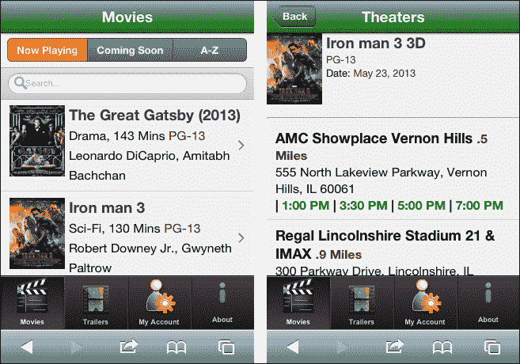

您可以在下面的截图中看到预订和预告片页面:

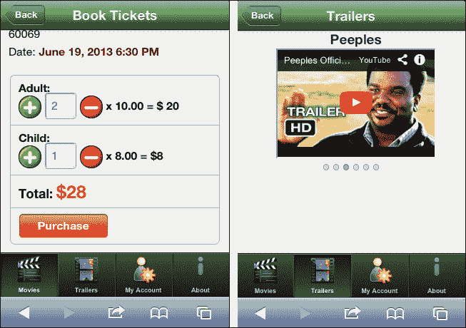

## 选项卡条小部件

剑道用户界面移动框架附带了许多有用的小部件，有助于快速构建外观精美的应用程序。我们将在这里快速浏览一下 tabble 小部件，因为它是框架中最重要的小部件之一，我们将在[第 5 章](5.html "Chapter 5. Exploring Mobile Widgets")、*探索移动小部件*中详细探索其他小部件。

TabStrip 小部件通常用于在布局页脚元素中显示一组导航按钮。单击导航按钮，将加载相应的视图。

当导航到另一个视图时，它会根据当前视图的网址更新选项卡条当前选定的选项卡。标签条带有内置的标签图标，可以通过设置锚元素的`data-icon`属性来使用，或者我们可以通过在锚元素内添加`img`标签来添加其他图像。

以下是剑道提供的所有内置图标列表:

<colgroup><col style="text-align: left"> <col style="text-align: left"> <col style="text-align: left"></colgroup> 
| 关于；在…各处 ；大约行为增加书签照相机手推车构成联系人细节下载快进 | 收藏夹作为特色的顶级的地球历史家信息更多采样最受关注组织 | 中止玩最近恢复精神回答重绕搜索设置分享停止废物 |

让我们打开之前创建的视图，并在替换当前页脚内容后向页脚添加以下代码:

```cs
<footer data-role="footer">
  <div data-role="tabstrip">
    <a href="#mt-home-main-view">
      <br />
      Movies
    </a>

    <a href="#mt-about-view" data-icon="about">
      <br />
      About
    </a>
  </div>
</footer>
```

现在将书籍的`source code`文件夹中的`images`文件夹复制到您工作区的根目录下，这样您就可以看到我们正在使用的所有图像。

这里我们使用了一个自定义图标和一个内置图标作为导航按钮。`href`属性的视图标识值前面加上了`#`。这告诉应用程序，当点击这个按钮时，我们需要导航到一个特定的视图。

同一文件中视图之间的导航是导航的基本层次，很快我们将看到如何导航到外部网址、远程视图(外部文件中的视图)以及查询字符串中的数据传输。

点击**电影**导航按钮将带您进入该应用的主页，点击**关于**图标将带您进入**关于**视图，我们将在关闭第一个视图的`div`后添加该视图，如下所示:

```cs
<!-- about view -->
<div data-role="view" id="mt-about-view" data-title="About" data-layout="mt-main-layout">
  <div style="padding: 15px">
    This is a sample application developed for the book            
    Building Mobile Applications using Kendo UI Mobile and ASP.NET Web API
  </div>
</div>
```

代码非常不言自明。为同一文件中的**关于**视图添加了具有相同布局的新视图。

当使用 Ripple Emulator 或 iPhone 查看时，这两个屏幕将如下所示:

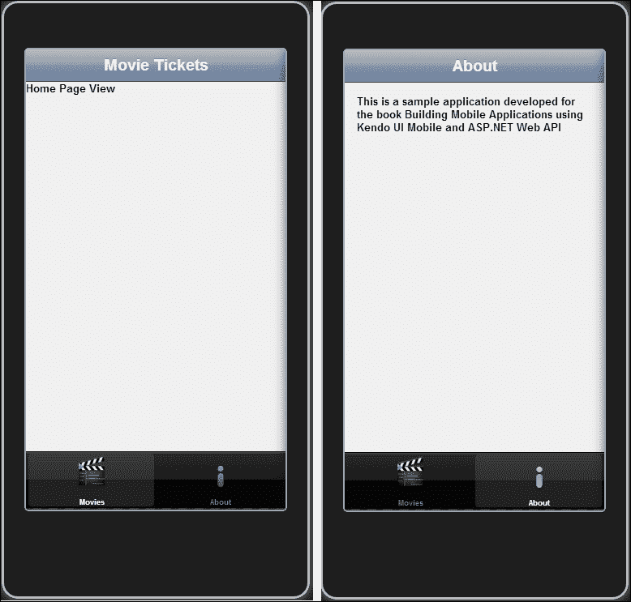

## 过渡

Kendo 在浏览视图时提供了种不同的过渡效果，如果您需要跨应用程序的单一类型的过渡，我们可以在 app 初始化脚本中进行配置，如下所示:

```cs
var application = new kendo.mobile.Application(document.body, {
  transition: 'fade'
});
```

剑道 UI Mobile 支持的不同过渡效果有:

*   **缩放**:当前视图淡出，新视图连同页眉和页脚一起从屏幕中心进行缩放。
*   **滑动**:此为默认过渡。使用`slide :(direction)`可以指定过渡方向。方向参数值可以是`left`或`right`。当前视图向指定方向滑动，新视图取而代之。如果没有指定方向参数，则默认方向参数为`left`。
*   **叠加**:新视图在当前视图的顶部滑动，不转换页眉和页脚。`overlay:(direction)`参数可以用来指定过渡方向，可能的值有`left`、`right`、`up`和`down`。比如`transition: 'overlay:up'`。
*   **淡入**:新视图及其页眉和页脚内容淡入当前视图内容的顶部。

参数`reverse`可以和转场效果一起指定，反向播放转场。如果我们在一个视图中指定`slide:right reverse`并尝试导航到上一个视图，上一个视图将从左侧滑入。

## 航行

在前面的例子中，我们已经看到了如何使用`anchor`标签中的`href`属性在本地视图(同一文件中的视图)之间进行导航。现在我们来详细探讨一下剑道 UI Mobile 的导航框架。

### 远程视图

在开发一个有很多屏幕的大应用程序时，将一个应用程序的所有视图保存在同一个物理文件中是不切实际的。几乎总是，开发人员希望每个屏幕/模块都有自己的 HTML 文件，这将有助于代码维护，并在程序员团队处理应用程序时简化开发。

在剑道 UI Mobile 中处理这种情况很简单。如果我们需要加载一个远程/外部视图，只需要指定用于导航的外部视图的文件名，而不是视图的 ID。导航到远程视图时，Kendo UI Mobile 使用 Ajax 调用加载视图，缓存文件内容，并显示文件中遇到的第一个视图。如果文件中有额外的视图，它们将被追加到**文档对象模型** ( **DOM** ) 中，但不会被初始化或显示。任何内联样式/脚本元素和移动布局定义也将被评估并附加到应用程序中。

为了看到这一点，让我们在`root`目录中创建一个名为`Trailers.html`的文件，其内容如下:

```cs
<div data-role="view" data-title="Trailers" data-layout="mt-main-layout" id="mt-trailers-view">

</div>
```

如您所见，没有必要添加剑道参考文件，因为这些文件已经从`index.html`文件中引用。

现在我们有了一个外部视图，让我们使用 TabStrip 小部件导航到这个外部视图。打开`index.html`，在**搜索**和**电影**按钮之间出现一个新的导航元素，如以下代码片段所示:

```cs
<a href="Trailers.html">
  <br />
  Trailers
</a>
```

现在在模拟器或移动设备上重新加载`index.html`，点击**预告片**图标，您可以看到该视图的加载方式与我们的本地视图相同:

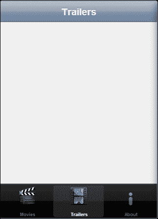

加载远程视图时，来自`<head>`元素的样式/脚本(如果有)将不会被评估。

### 类型

可能会有需要导航到外部网址的用例，为此，只需将`data-rel="external"`属性添加到导航元素中。请记住，这将通过卸载您的应用程序在浏览器上加载外部网址，并且您将由您的设备或浏览器的后退按钮来控制返回到您的应用程序。

### 后退按钮

后退按钮是移动应用程序中使用最广泛的用户界面元素之一，通常被添加到顶部导航栏中。剑道 UI Mobile 为我们提供了一个非常好用的后退按钮小部件；只要在`anchor`标签上加上`data-role="backbutton"`，我们的后退按钮就准备好了！剑道 UI Mobile 自动处理首页导航，内置后退按钮小部件。

将后退按钮的标记添加到我们的应用程序的导航栏小部件中，将在我们到目前为止构建的所有三个视图的左上角显示后退按钮:

```cs
<header data-role="header">
  <div data-role="navbar">
    <a data-align="left" data-role="backbutton">Back</a>
    <span data-role="view-title">Movie Tickets</span>
  </div>
</header>
```

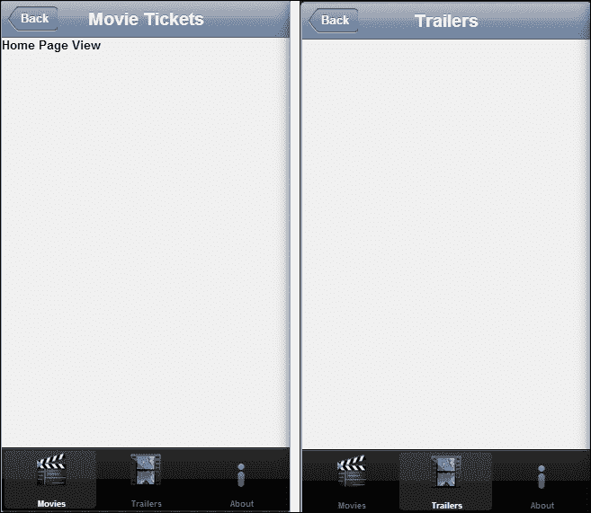

现在我们有一个问题要解决。后退按钮显示在所有视图中，包括主视图，这不是必需的。jQuery Mobile 等一些移动开发框架会在主屏幕上自动隐藏后退按钮，但在剑道 UI Mobile 中，我们将不得不自己处理。

同样，这很容易实现。我们需要更新主视图定义并添加一个 CSS 类:

```cs
<div data-role="view" id="mt-home-main-view" data-show="homeViewInit" data-layout="mt-main-layout" class="no-backbutton">
  Home Page View
</div>
```

让我们将这个 CSS 片段添加到<`head` >标签中:

```cs
<style>
  .no-backbutton .km-back { visibility: hidden; }    
</style>
```

现在如果我们运行应用程序，我们可以看到主页上看不到后退按钮。渲染后的后退按钮将有一个由剑道用户界面手机自动添加的 CSS 类`km-back`。前面的 CSS 片段将使用`km-back` CSS 类隐藏元素，而使用`no-backbutton`CSS 类隐藏元素，这是我们的主视图。

### 查看渲染的 HTML

这里需要注意的一个有趣的事实是，布局标题呈现在视图 div 内部，视图 div 中的其余内容显示在标题之后，内容元素内部，然后添加页脚元素。

渲染的 HTML 可以使用 Chrome/Safari 开发工具进行研究:

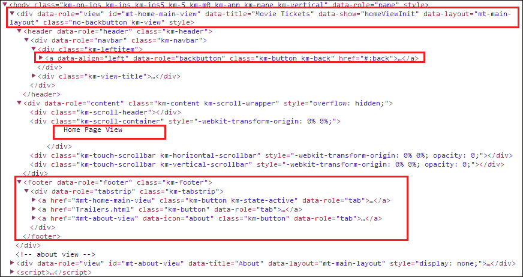

### 查看加载和 HTML 元素标识

现在我们已经很容易创建多个视图并相互导航了，重要的是要理解视图是如何加载到 DOM 中并显示的，以及它如何与视图中的 HTML 元素标识相关联。

让我们在示例应用程序中考虑以下导航场景:


用户加载应用程序，查看主页，导航到**预告片**屏幕，然后导航回主页。

当用户进行前面提到的导航时，DOM 中会发生这种情况:

*   主页的布局和视图已加载。
*   当用户导航到**预告片**视图时，使用`style="z-index: 0; display: none;"`使主页的视图不可见。现在**预告片**屏幕的视图被加载到 DOM 中并变得可见。然后视图的`z-index`被设置为`1`。
*   现在，当用户导航到**主页**屏幕时，**拖车**屏幕的视图不可见，**主页**屏幕的视图可见，`z-index`设置为`1`。

需要注意的重要点是，视图一旦加载到 DOM 中，就永远不会被移除；它只是在用户每次访问视图时变得可见和不可见。

在用户完成前面提到的导航之后，让我们检查应用程序的 DOM:

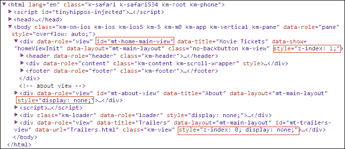

我们可以看到首页屏幕视图的`z-index`设置为`1`，**关于**屏幕视图不可见(该视图按照`index.html`中的定义加载)，而**预告片**视图不可见`z-index`设置为`0`。

### 类型

由于视图一旦被初始化，就会一直保留在 DOM 中，并且变得可见和不可见，所以程序员必须小心命名视图中的 HTML 元素。如果两个视图具有相同标识的元素，并且如果任何客户端代码试图使用相同标识访问其中一个元素，可能会导致意想不到的后果。因此，建议对标识有适当的命名约定，这样当多个程序员在代码库上工作时就不会产生冲突。在视图名称的所有元素标识前加上三四个字符是避免麻烦的一种方法！

# 应用对象

之前我们已经看到了如何初始化移动应用和设置过渡配置选项。转换只是我们在实例化剑道用户界面移动应用程序时可以执行的许多全局配置中的一个例子。让我们探索一下使用应用程序对象可以实现的一些功能。

## 初始视图

使用初始配置选项，我们可以设置应用初始化后要显示的初始视图:

```cs
new kendo.mobile.Application($(document.body), {
  initial: "intialViewID"
});
```

## 加载文本

使用加载配置，我们可以设置显示加载动画时显示的文本。如果该值设置为`false`，将不显示加载动画。文字需要包裹在< `h1` > < / `h1` >标签中:

```cs
new kendo.mobile.Application($(document.body), {
  loading: "<h1>Loading...</h1>"
});
```

## 强制平台

正如我们所知，剑道渲染平台特定的用户界面。但是，它提供了使用平台配置选项在所有平台上强制特定平台的外观和感觉的选项:

```cs
<script>
  new kendo.mobile.Application($(document.body), {
    platform: "android"
  });
</script>
```

即使该选项可用，使用**平面用户界面主题**也是构建跨平台一致外观和感觉的应用程序的推荐方式。

## 隐藏和显示加载动画

应用程序对象有助于以编程方式显示和隐藏加载动画。应用对象的`showLoading()`方法显示你的剑道手机应用的内置加载动画:

```cs
var application = new kendo.mobile.Application();
application.showLoading();
```

使用 Application 对象的`hideLoading()`方法，我们可以隐藏加载动画。

```cs
var application = new kendo.mobile.Application();
application.hideLoading();
```

## 获取当前视图的引用

当我们开发一个功能齐全的应用程序时，通常我们会遇到这样一个场景，我们需要在我们的 JavaScript 代码中获取当前显示视图的引用。

应用对象的`view()`方法提供当前显示的视图对象的引用:

```cs
var application = new kendo.mobile.Application();
//writes title of the displayed view to the console.console.log(application.view().title);
```

## 导航到视图

在前面的例子中，我们看到了如何以声明的方式导航到其他视图。但是如果你想用 JavaScript 导航到一个屏幕呢？对此也有一个解决方案。我们在第一个示例中创建的 Application 对象有一个`navigate()`方法，可以使用 JavaScript 代码在视图之间执行导航。该方法采用两个参数:要导航的网址和过渡效果(可选)。

这就是我们初始化剑道用户界面移动应用程序的方式:

```cs
var app = new kendo.mobile.Application();
```

现在我们可以利用这个对象应用调用`navigate(url, transition)`方法导航到另一个屏幕:

```cs
app.navigate("Trailers.html")
```

您甚至可以使用:

```cs
app.navigate("#mt-about-view", "slide")
```

### 类型

`navigate("#:back")`将带您回到之前访问过的视图。

# 跨平台的 UI 体验

我们已经为示例应用程序构建了框架，并看到了该应用程序在 iOS 上的外观。在[第 1 章](1.html "Chapter 1. Building a Mobile Application Using HTML5")、*使用 HTML5* 构建移动应用中，我们已经讨论了 Kendo 针对特定平台的外观和感觉的设计理念。现在让我们来探索安卓体验和平面用户界面主题，它在所有移动平台上提供了统一的外观和感觉。

让我们通过在 Ripple 模拟器中将设备更改为 Nexus One 来体验一下安卓的外观和感觉:

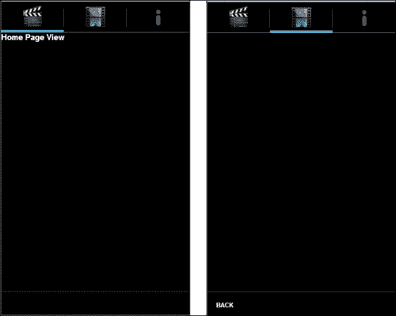

如你所见，当应用在安卓平台上运行时，应用的外观和感觉会自动改变。符合安卓应用设计理念，将 TabStrip 小部件移到顶部，底部显示**后退**按钮。

这种自动的外观是通过将特定于平台的 CSS 类附加到呈现的 HTML 上来实现的。在安卓平台查看应用时，会将`km-android`等安卓特有的 CSS 类注入到`<body>`标签中，这样< `body` >内部的元素就会用专为安卓观感定制的类进行修饰。

让我们通过在 Chrome 开发人员工具的源代码视图中查看我们的应用程序来了解这一点:

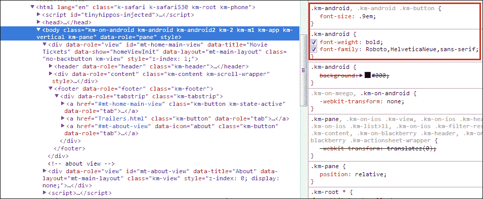

在 iPhone 5 上查看时，同一个应用程序会附带一个特定于 iOS 的 CSS:


## 平面图

剑道提供自动的平台特定外观和感觉；很好！但是如果您希望在所有平台上都有一致的外观和感觉呢？剑道在 2013 年 Q2 发布时也回答了这个问题！剑道用户界面手机现在附带了一个平面用户界面主题，这是围绕 iOS 7 用户界面设计理念量身定制的。它提供了跨所有平台的统一外观和感觉。一旦启用了扁平皮肤，您就只有一组包装在`km-flat`类中的 CSS 来处理定制。这款皮肤对于那些拥有与其品牌相关的颜色的企业以及拥有自己商标外观的应用程序尤其有用。

初始化移动应用程序时，可以通过简单的配置`skin:'flat'`启用平面用户界面主题:

```cs
var application = new kendo.mobile.Application(document.body,
 {
      transition: 'slide',
      skin:'flat'
 });
```

这是我们的应用在启用了平面主题的 iPhone 5 和 Nexus One 手机上的外观:

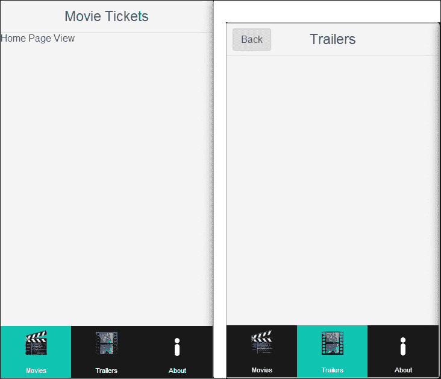

# 总结

在本章中，我们看到了如何安装和使用 Ripple Emulator，以及在使用 Kendo UI Mobile 构建移动应用程序时，它对 web 开发人员有多有用。然后，我们创建了我们的第一个移动应用程序，并开始构建我们的示例电影票应用程序，同时学习剑道用户界面移动的内部。我们还探索了特定于平台的用户界面呈现和新的平面用户界面主题。

在下一章中，我们将学习如何使用微软的 ASP.NET 网络应用编程接口来构建 RESTful 服务。如果你不是。NET 程序员，您可以跳过下一章，使用本书网站上托管的 HTTP 服务。