# 第六章。动作表单、模式视图和更多小部件

在前一章中，我们学习了剑道 UI Mobile 小部件的基础知识，并探索了相当多的小部件。在这一章中，我们将继续这一势头，并使用 js 提琴实例探索更多的小部件。到本章结束时，您将成为使用所有剑道用户界面移动小部件的专家，我们将准备好将小部件集成到我们的电影票应用中。

在本章中，我们将介绍:

*   行动表
*   modalview(模式检视)
*   拆分视图
*   背景常速滚动的电脑游戏
*   卷动检视
*   触控
*   抽屉

# 动作表单小部件

动作表用于移动设备(通常在移动电话上)上，向用户显示一个动作的多个选项。它们包含多个按钮，每个按钮都有一个文本。显示了一个典型的操作表，如下图所示:

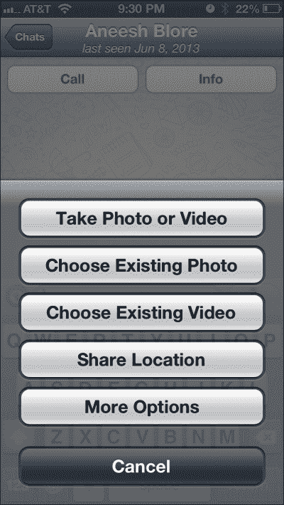

剑道 UI Mobile 的 ActionSheet 小部件通过将一个`<ul>`转换为一个动作表，并在点击表上的项目时调用一个预配置的函数来提供该功能。如果我们将`data-rel="actionsheet"`和`href`属性设置为以哈希(#)为前缀的动作表单的元素标识，则可以在任何其他小部件中点击打开动作表单。

## 初始化

ActionSheet 可以声明式初始化，如下代码所示:

```cs
<div data-role="view">

<a data-role="button" data-rel="actionsheet"    
      id="tnShare " href="#confirmationSheet">       
      Share
   </a>

    <ul data-role="actionsheet" 
        id="confirmationSheet">

        <li>
            <a data-action="shareOnTwitter">
                Twitter
            </a>
        </li>
        <li>
            <a data-action="shareOnFB">
                Facebook
            </a>
        </li>
        <li>
            <a data-action="justEmail">
                Email
            </a>
        </li>

    </ul>
</div>
```

初始化，使用 jQuery 插件语法可以完成，如下面的代码片段所示:

```cs
<div data-role="view">

<a data-role="button" id="btnShare"
        data-rel="actionsheet"
        href="#confirmationSheet">Share</a>

<ul id="confirmationSheet">
        <li>
            <a data-action="shareOnTwitter">Twitter
            </a>
        </li>
        <li>
            <a data-action="shareOnFB">Facebook
            </a>
        </li>
        <li>
            <a data-action="justEmail">Email
            </a>
        </li>
    </ul>
</div>

<script>
    var app = new kendo.mobile.Application(document.body);
    function initialize() {
        $("#confirmationSheet").kendoMobileActionSheet();

    }

function shareOnTwitter(e){
   console.log('twitter...'); 
   console.log(e.target);
}

function shareOnFB(e){
    console.log('FB...'); 
    console.log(e.target);

}

function justEmail(e){
    console.log('Email...'); 
   console.log(e.target);

}
</script>
```

### 类型

试试 js 提琴:

[http://jsfiddle . net/kenomoble/zn4ew/](http://jsfiddle.net/kendomobile/Zn4eW/)

[http://jsfiddle . net/kenomoble/5h qkr/](http://jsfiddle.net/kendomobile/5HQkr/)

小部件也可以通过调用其`open`方法以编程方式打开。动作表单小部件中按钮的`click`事件可以使用`data-action`属性附加到一个函数。一个**取消**动作按钮自动添加到表单底部。

前面的代码在不同的平台上呈现不同。在 iPhone 中，小部件从底部作为模态对话框向上滑动，而在 iPad 中，它呈现在**弹出式**小部件中。以下截图分别来自 iPhone 和 iPad:

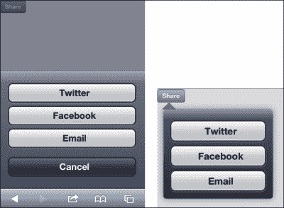

### 类型

自动生成的**取消**按钮的文本可以通过设置小部件的取消选项来更改，如下脚本所示:

```cs
<ul data-role="actionsheet" data-cancel="Custom Text" 
    id="confirmationSheet">

        <li>.... </li>
</ul>
```

## 行动

连接到点击`action`按钮的功能接收对象作为输入。

该对象有两个参数:

*   `target`:这是 HTML 元素的 jQuery 对象，打开了 ActionSheet 小部件。在我们的例子中，它是按钮小部件`$('btnShare')`。
*   `context`:这是使用小部件的`data-actionsheet-context`属性设置的值。此参数是可选的，可用于识别视图中定义了多个操作表时打开了哪个小部件。

## 打开和关闭

可以通过调用`open`方法以编程方式打开 ActionSheet 小部件。

`open()`方法采用两个输入参数:

*   `target`:这是动作函数中可用的 HTML 元素的 jQuery 对象。这个对象对于手机来说是可选的，但是对于平板电脑来说是必需的，因为小部件的位置取决于目标元素。
*   `context`:这是一个可选值，可以作为动作函数输入参数中的上下文属性。

可以使用`close()`方法关闭小部件。`close()`方法没有输入参数:

```cs
$("#confirmationSheet").data("kendoMobileActionSheet").close();
```

在平板电脑上，ActionSheet 小部件以弹出小部件的形式打开。可以使用 ActionSheet 小部件的弹出属性来配置小部件的打开方向、高度和重量属性。

# 模式视图小部件

剑道手机 **ModalView** 小部件打开一个视图作为子窗口，这需要用户在返回主应用视图之前与之交互。它通常用于通过要求用户输入一些细节或显示非常重要的信息来吸引用户的全部注意力。典型的场景是定制的错误/确认消息、密码输入框等。

ModalView 小部件可以在视图内部或外部定义，并且可以有自己的布局。建议在移动应用中将 ModalView 的使用减少到最低限度，因为用户将被工作流打断，并在关闭琐碎的模式窗口时产生令人恼火的体验。

小部件的高度和宽度可以使用`data-height`和`data-width`属性来定义。要以编程方式打开小部件，我们可以在使用 jQuery `data`方法获取小部件的引用后使用`open()`方法。事件处理函数可以通过使用`data-open`属性连接到 ModalView 的`open`事件。

## 初始化顿

ModalView 小部件可以使用数据属性进行声明式初始化，如以下代码所示:

```cs
<div data-role="view">
    <a href="#myModalView" data-rel="modalview"
       data-role="button">
           Open Modal View
    </a>
</div>

<div data-role="modalview" data-height="300px"
 data-width="300px"
     id="myModalView">
    <h2> I am a modal view... </h2>
</div>
```

它也可以使用 jQuery 插件语法进行初始化:

```cs
<div data-role="view" data-init="init">
    <a href="#myModalView" data-rel="modalview"
       data-role="button">
           Open Modal View
    </a>
</div>

<div id="myModalView">
    <h2> Modal View... </h2>
</div>

<script>
var app = new kendo.mobile.Application(document.body);
function init(){
    $('#myModalView').kendoMobileModalView({
 height:100,width:100
 }).data("kendoMobileModalView");

}
</script>
```

### 类型

试试 js 提琴:

[http://jsfiddle . net/kenomoble/29 CDW/](http://jsfiddle.net/kendomobile/29cdw/)

[http://jsfiddle . net/kenomoble/szym sp/](http://jsfiddle.net/kendomobile/SZysp/)

## 打开小部件

可以使用`open()`方法打开 ModalView 小部件。可以在打开小部件时触发一个事件，可以使用下一节示例代码中演示的`data-open`属性来附加该事件。

下面的代码片段打开了一个 ModalView 小部件:

```cs
<div data-role="view">
    <a data-click="openModalView"
       data-role="button">
           Open Modal View
    </a>
</div>

<div data-role="modalview"
     data-height="300px"
     data-width="300px"
     id="myModalView">
    <h2> I am a modal view... </h2>   

</div>
<script>
function openModalView(e) {
            $("#myModalView").data("kendoMobileModalView").open();
        }
</script>
```

### 类型

试试 js 提琴:[http://jsfiddle.net/kendomobile/Y5WcN/](http://jsfiddle.net/kendomobile/Y5WcN/)

## 关闭小部件

可以使用`close`方法关闭小部件。关闭可以使用`data-close`属性附加的小部件时，可以触发事件。

下面的代码片段以编程方式打开一个 ModalView 小部件，并在小部件的打开和关闭过程中触发事件。在小部件里面，有一个**关闭我！**按钮，当点击该按钮时，使用`data("kendoMobileModalView").close()`方法关闭部件:

```cs
<div data-role="view">
    <a data-rel="modalview"
       href="#myModalView" 
       data-role="button">
       Open Modal View
    </a>
</div>

 <div data-role="modalview" data-open="modalViewOpen" 
      data-close="modalViewClose" data-height="200px"
      data-width="300px"id="myModalView">

    <a style="float:right" data-click="closeModalView"
       data-role="button">
           Close Me !
    </a>          
    <h2> I am a modal view... </h2>         
</div>

<script>
   var app = new kendo.mobile.Application(document.body);

  function modalViewOpen(e){

      console.log('widget opened');
  }

  function modalViewClose(e){
      console.log('widget closed');
  }

  function closeModalView(e){
  $("#myModalView").data("kendoMobileModalView").close();
  }

</script>
```

### 类型

试试 js 提琴:[http://jsfiddle.net/kendomobile/6wPXA/](http://jsfiddle.net/kendomobile/6wPXA/)

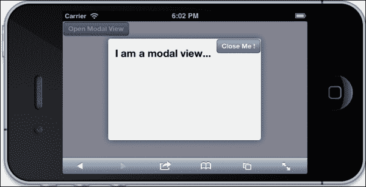

### 类型

通过设置`data-modal='false'`，也可以通过点击窗口外部来关闭 ModalView 小部件:

```cs
 $('#myModalView').kendoMobileModalView({
         modal:false,
         }).data("kendoMobileModalView");
```

# 拆分视图小部件

在平板设备上，与手机相比，我们有很大的空间，很少像手机那样占用整个空间来放置一个 UI 元素。SplitView 小部件允许我们使用窗格小部件将平板电脑的屏幕分成多个部分，并在每个窗格中显示不同的视图。这个小部件通常用于在左侧显示导航，在右侧显示详细视图。参见以下分割视图的经典示例——iPad**设置**屏幕:

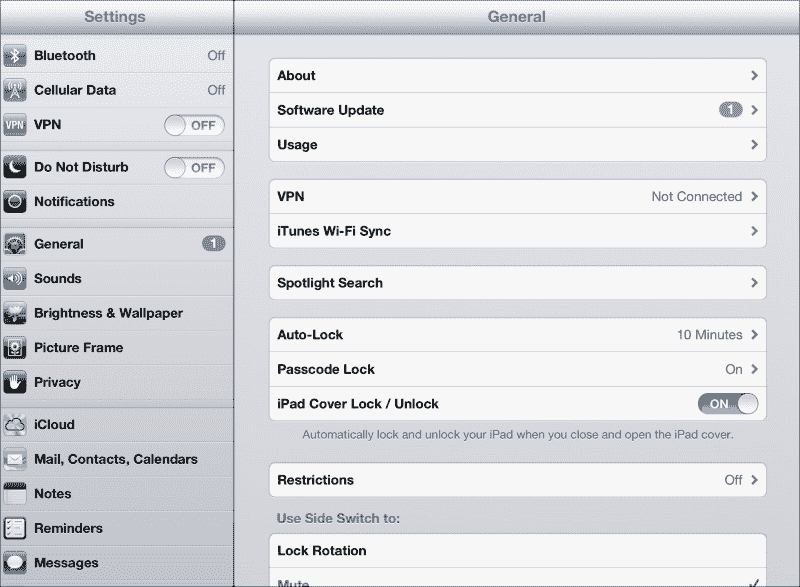

与其他剑道移动小部件不同，分割视图小部件不会添加到视图中，而应该像本地或远程视图文件中的视图一样独立添加。拆分视图小部件应该只包含窗格作为子元素，视图在窗格中定义。

## 初始化

通过设置属性`data-role="splitview"`来初始化分割视图小部件，如以下代码片段所示:

```cs
<div data-role="splitview" >
  <div data-role="pane" >
    <div data-role="view" >
        <h1>Left Pane </h1>       
    </div>
  </div>    

  <div data-role="pane" >
    <div data-role="view" >
        <h1>Right Pane </h1>
    </div>    
  </div>
</div>
```

这个例子的 jQuery 插件语法是:

```cs
<div id="kendoSplitView" >
  <div data-role="pane" >
    <div data-role="view" >
        <h1>Left Pane </h1>
    </div>
  </div>    

  <div data-role="pane" >
    <div data-role="view" >
        <h1>Right Pane </h1>
    </div>    
  </div>
</div>
<script>
var app = new kendo.mobile.Application(document.body);
$('#kendoSplitView').kendoMobileSplitView().data("kendoMobileSplitView"); 
</script>
```

### 类型

试试 js 提琴:

[http://jsfiddle . net/kenomoble/tfcz 7/](http://jsfiddle.net/kendomobile/TFcZ7/)

[http://jsfiddle . net/kenomoble/P3 HGP/](http://jsfiddle.net/kendomobile/p3Hgp/)

### 注

将`style`属性设置为`vertical` ( `data-style="vertical"`)将使拆分视图垂直堆叠。`style`配置的默认值为`horizontal`。

## 拆分视图正在运行

SplitView 可以用来创建非常复杂的 UI 结构，每个窗格内有多个窗格和多个视图。让我们创建一个简单的拆分视图，作为构建复杂用户界面结构的起点。在本例中，我们创建了一个包含两个窗格的拆分视图，每个窗格中有一个视图。左侧的第一个窗格将充当主窗格，显示流派列表。当我们单击/点击其中一个列表项时，所选流派将作为视图 URL 中的查询字符串发送到详细信息/右侧窗格，并显示在详细信息视图上:

```cs
<div data-role="splitview" >

  <div data-role="pane" >
      <!-- Master view -->
    <div data-role="view" data-title="Genre" >
        <ul data-role="listview" data-style=="inset">
            <li>
                <a href="#view-detail?genre=Drama"
 data-target="pane-detail"> Drama </a>
            </li>
            <li>
                <a href="#view-detail?genre=Horror"
                   data-target="pane-detail">Horror </a>
            </li>
            <li>
                <a href="#view-detail?genre=Family"
                   data-target="pane-detail">Family </a>
            </li>
            <li>
                <a href="#view-detail?genre=History"
                   data-target="pane-detail">History </a>
            </li>        
        </ul>        

    </div>
 </div> 

  <div data-role="pane" id="pane-detail" >
      <!-- Detail view -->
   <div data-role="view" id="view-detail" 
         style="font-size:16px"
         data-show="detailViewShown" >

        <div style="padding:10px;">
        <strong >Selected Genre:  </strong>
        <strong>
            <!--Selected genre will be written here -->
            <span id="selected-genre"
                  style="color:green"> </span>
        </strong>       
        </div>

 </div>
 </div> 
</div>
<script>
var app = new kendo.mobile.Application(document.body);

function detailViewShown(e){
    //Read the selected genre from the query string
     $('#view-detail #selected-genre').text(e.view.params.genre);
}
</script>
```

### 类型

试试 js 提琴:[http://jsfiddle.net/kendomobile/G3Edm/](http://jsfiddle.net/kendomobile/G3Edm/)

我们创建了一个拆分视图，并在其中定义了两个窗格。ID 为`pane-detail`的窗格充当详细信息窗格，在该窗格中，我们定义了 ID 为`view-detail`的视图。主视图窗格中的每个列表项都有一个指向详细视图的链接，在查询字符串中添加了流派，通过将属性设置为`data-target="pane-detail"`，我们告诉窗格在窗格中搜索 ID 为`pane-detail`的匹配视图。

在视图的`show`事件中，我们正在调用函数`detailViewShown`()。该函数从参数集合`e.view.params`中可用的所选查询字符串中读取流派，并用 ID `selected-genre`更新范围内的文本。

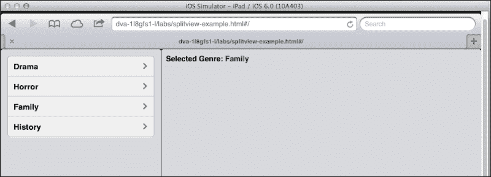

### 注

当 SplitView 小部件中有两个窗格时，它会自动呈现，左窗格与右窗格的比例为 1:2。剑道 UI 手机 2013.1.319 版本有 bug，将比例反转为 2:1；因此，您可能必须使用该框架的更高版本来查看 SplitView 小部件的正确行为。

# Scroller 小部件

**滚动条**小部件有助于在 DOM 中创建具有固定宽度和/或高度的触敏和可滚动部分。它可以通过在包装元素中设置`data-role="scroller"`属性来初始化，或者在包含视图的`init`事件中使用 jQuery 插件语法以编程方式进行初始化，如以下代码片段所示:

```cs
<div id="scrollableContents"> </div>
 $("# scrollableContents ").kendoMobileScroller();
```

默认情况下，剑道视图小部件将其内容包装在 Scroller 小部件中，因此，我们应该将这个小部件仅用于视图中特定的可滚动部分。可以使用`e.view.scroller`属性在视图事件中访问小部件，其中`e`是事件的输入对象。

## 配置

以下是一些常用的 Scroller 配置:

*   `useNative`:当该属性设置为`true`时，平台上的本机滚动被启用。默认值为`false`。
*   `elastic`:该属性在跨越 Scroller 边界时具有启用或禁用弹性行为。默认情况下，属性设置为`true`。
*   `zoom:`使用捏缩放手势，可以放大或缩小 Scroller 小部件内的内容。默认值为`false`。

### 类型

如果本机滚动器默认支持弹性滚动，当`useNative`设置为`true`时，即使弹性设置为`false`，滚动也会是弹性的。

## 拉动刷新

**拉动刷新**功能内置在 Scroller 小部件中，这对于更新整个视图或逐节的内容非常有用。通过将`pullToRefresh`属性设置为`true`，可以在 Scroller 小部件中启用它。除了`pullToRefresh`之外，我们还可以设置以下属性来定制拉动式刷新体验:

*   `pullOffset`:当用户拉超出`pullOffset`值时，触发`pull`事件(在这个事件的处理函数中，我们编写代码来更新 Scroller 内容)。默认值为`140`。
*   `pullTemplate`:当用户在`pullOffset`设置的边界内拉动滚动条时，显示 HTML 模板。
*   `releaseTemplate`:当用户拉动滚动条超过`pullOffset`设置的边界时，会显示一个 HTML 模板。
*   `refreshTemplate`:在 Scroller 中更新数据时显示的 HTML 模板。仅当调用`pullHandled()`方法时，此模板才会被移除。

### 类型

Scroller 选项只能在视图的`init`事件中使用 JavaScript 代码来设置，而不能以声明方式使用数据属性，因为 Scroller 小部件本身不会公开。移动视图在其内容周围实例化滚动条。

`pullHandled()`方法移除刷新模板中的内容，并将更新的内容定位到初始视图中。

现在让我们编写一些代码来创建一个具有拉刷新功能的 Scroller 小部件。可滚动内容包含一个数字，当用户拉动并释放滚动条时，一个介于 1 和 1000 之间的随机数将替换先前的数字:

```cs
<body>
    <div data-role="view" data-init="viewInit">

        <div id="scrollSection" data-zoom="true"
             data-role="scroller" 
            style="height: 200px;text-align: center;">
            <span id="scrollContent" 
                  style="font-size: 150px;">100            
            </span>
        </div>
    </div>
    <script>
        var app = new kendo.mobile.Application(document.body);

        function viewInit(e) {
            //get reference of the scroller 
            var scroller = $("#scrollSection")
 .data("kendoMobileScroller");

            //set scroller options
            scroller.setOptions({
 pullToRefresh: true,
//pull event is fired when user pulls beyond 
               //value set using pullOffset
 pull: refresh,
               //set the boundary after which the pull will
               //fire the pull event default value is 140
 pullOffset: 100,
 pullTemplate: "<i>Pull to update the number</i>",
 releaseTemplate: "Release to update the number",
 refreshTemplate: "Updating..."
 });
        }

        function refresh() {

            //create a random number between 1 and 1000
            var newNumber = Math.floor(
                            (Math.random() * 1000) + 1);
 var scroller =
 $("#scrollSection").data("kendoMobileScroller");
            //update the contents inside the scroller
            scroller.scrollElement.find('#scrollContent')
 .text(newNumber);

            //pullHandled method removes the contents
            //in the refresh template and positions the u
            //updated contents to the initial view
            scroller.pullHandled();
        }

    </script>
</body>
```

### 类型

试试 js 提琴:[http://jsfiddle.net/kendomobile/2WJhE/](http://jsfiddle.net/kendomobile/2WJhE/)

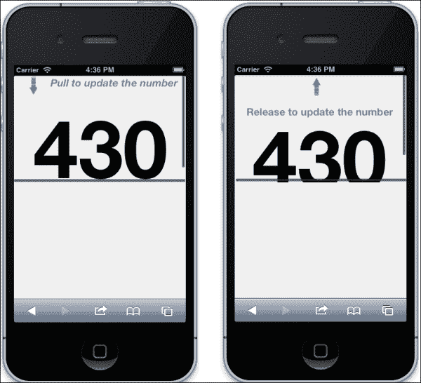

# 滚动视图小部件

**滚动视图**小部件可用于使用`swipe`手势显示宽图像、图片库中具有多个水平页面的内容或一系列可逐页访问的指令等。可以通过将角色数据属性设置为`scrollview(data-role= "scrollview")`或者使用在 HTML 中调用$ `("#scrollViewMain").kendoMobileScrollView()`的 jQuery 插件语法以编程方式来初始化 ScrollView 小部件，其中`scrollViewMain`是在其上初始化 ScrollView 小部件的 HTML 元素的 ID。

页面可以在滚动视图中定义，角色数据属性设置为“`page"` ( `data-role= "page"`)。当用户浏览滚动视图时，页面中的内容会以顺序的方式一个接一个地显示。页面 HTML 元素之间的额外空白将在 ScrollView 中显示为页面，这就是为什么我们需要确保定义页面的 HTML 元素是连续的，中间没有任何空白，如以下代码所示:

```cs
<div data-role="view">
    <div id="myScrollView" data-role="scrollview">
        <div data-role="page">Page 1 </div><div 
 data-role="page">Page 2</div><div 
 data-role="page">Page 3</div><div 
 data-role="page">Page 4</div>
    </div>
</div>
```

### 类型

Kendo 会自动将以下 CSS 类添加到初始化 ScrollView 的元素中:

```cs
.km-scrollview {
white-space: nowrap;
overflow: hidden;
width: 100%;
}
```

由于 CSS 属性`white-space: nowrap`，页面内部的长文本会溢出到其他页面。为了将每页中的文本包装在页面本身中，我们需要使用以下样式:

```cs
.km-scrollview > div > [data-role=page] {           
           white-space: pre-wrap;      /*or normal*/  
       }
```

现在，让我们创建一个滚动视图，其中包含三页关于滚动视图小部件本身的提示:

```cs
<head>
<style>
        .km-scrollview > div > [data-role=page] {
            /*This is to preserve whitespace. 
             Text will wrap when necessary, and on line breaks*/
            white-space: pre-wrap;
            /*normal can also be used instead of pre-wrap*/
        }
    </style>
</head>
<body>
    <div data-role="view">

        <div data-role="scrollview" data-duration="3000"
            data-change="pageChange"
            style="padding-top: 15px;">
            <div data-role="page">
                <h1>Tip1</h1>

                In ScrollView, remove all white spaces
            between page HTML elements. Otherwise,
            white spaces will appear as pages in
            the rendered ScrollView.             

            </div><div data-role="page">
                <h1>Tip2 </h1>

                You can set the time taken in milliseconds 
            by the ScrollView to settle down the current 
            page after the using the duration property.

            </div><div data-role="page">
                <h1>Tip3 </h1>

                scrollTo() method can be used to navigate
            to a specific page in the ScrollView.        
            </div></div>
    </div>
    <script>
        var app = new kendo.mobile.Application(document.body);
        function pageChange(e) {
            //logs the current page number.
            console.log(e.page);            
        }
    </script>
</body>
```

### 类型

试试 js 提琴:[http://jsfiddle.net/kendomobile/6JxRU/](http://jsfiddle.net/kendomobile/6JxRU/)

在前面的代码中，我们在带有提示的 ScrollView 中创建了三个页面，并将`data-duration`属性设置为`3000`毫秒，这是当前页面稳定下来的动画时间。我们还将`pageChange()`功能作为`change`事件的事件处理程序，当用户导航到一个页面时会触发该事件。

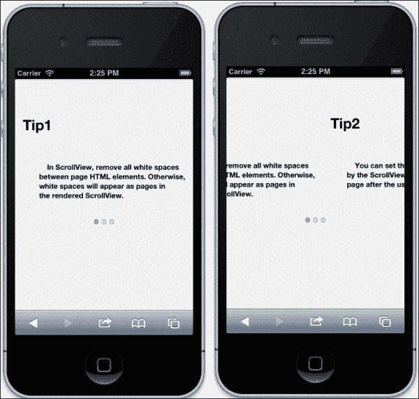

### 类型

如果您想删除 ScrollView 底部的页面指示器，下面的 CSS 就可以了:

```cs
.km-pages > li {
           display:none;
       }
```

# 触摸小部件

剑道用户界面手机的**触摸** 小部件帮助我们使 DOM 的选定元素对用户的触摸敏感。这是一个非常强大的组件，因为我们不需要在任何需要为`touch`事件实现动作的地方使用移动小部件。只需在 HTML 元素上添加`data-role = "touch"`，我们就可以捕捉诸如滑动、点击、双击、按住等事件:

```cs
<div id="touchableDiv" data-role="touch"> </div>
```

或者

```cs
$("#touchableDiv").kendoTouch();
```

现在让我们看看`touch`事件是如何被捕获的，以及我们可以在具有内部`div`元素的触摸使能`div`元素上提取什么样的数据。每个`touch`事件处理程序都会接收一个事件对象，在这个例子中，我们将探讨一些可以从事件对象中检索到的重要属性。

让我们用几个`div`元素创建下面的 HTML:

```cs
    <div data-role="view" data-init="viewInit">
        <div id="touchableDiv"
            style="height: 200px; width: 200px;
                   background-color: darkgreen;">

            <div style="height: 100px; width: 100px;
                 background-color: white;"
                id="innerDiv">
            </div>
        </div>
    </div>
```

接下来，在 JavaScript 代码中，让我们将 ID 为`touchableDiv`的`div`初始化为视图的`init`事件中的触摸小部件。为所有`touch`事件定义了单个事件处理程序，属性被写入浏览器的控制台。每个使用的属性的描述都作为注释添加到以下代码中:

```cs
    <script>
        var app = new kendo.mobile.Application(document.body);
        function viewInit(e) {

            $('#touchableDiv').kendoTouch({

 tap: handleTouchEvent,
 doubletap: handleTouchEvent,
 hold: handleTouchEvent,
 touchstart: handleTouchEvent,
 touchend: handleTouchEvent,
 dragstart: handleTouchEvent,
 dragend: handleTouchEvent
 });
        }

        function handleTouchEvent(e) {
            console.log(e);

            //Touch properties

            //id of the actual HTML element
            //which was touched. if we touch the div
            //with id innerDiv, output will be 'innerDiv'
            console.log("actual touch on: " +
                e.touch.initialTouch.id);

            //parent touch widget which was touched.
            console.log("current target id: " + 
                e.touch.currentTarget.id);
            //Touch offset relative to the entire document 
            console.log("x.location: " + e.touch.x.location +
                " y.location: " + e.touch.y.location);
            //Touch offset relative to the viewport
            console.log("x.client: " + e.touch.x.client +
                " y.client: " + e.touch.y.client);
            //Velocity of the touch event in pixels
            // per millisecond.
            console.log("x.velocity: " + e.touch.x.velocity +
                " y.velocity: " + e.touch.y.velocity);

            //Epoch timestamp
            console.log("x.timeStamp: " + e.touch.x.timeStamp +
                " y.timeStamp: " + e.touch.y.timeStamp);

            //Event Properties
            console.log("Event Type: " + e.event.type);
        }

    </script>
</body>
```

### 类型

试试 js 提琴:

[http://jsfiddle . net/kenomoble/j6xmr/](http://jsfiddle.net/kendomobile/J6xmr/)

在提琴中，我们正在将输出写入 UI 中的`div`元素，但是如果您将输出写入您的 Chrome 浏览器控制台，您可以看到如下截图所示的输出:

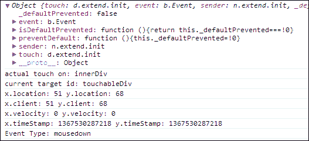

## 刷卡事件

通过将属性设置为`enableSwipe="true"`，可以在触摸小部件中启用水平滑动，这将触发`swipe`事件。对于该事件，可以配置以下属性:

*   `maxDuration`:该属性定义`swipe`事件的寿命，单位为毫秒。默认值设置为`1`秒。如果事件未在此时间范围内完成，则推送将被丢弃。
*   `minXDelta`:该属性是滑动事件前需要遍历的最小水平像素。默认值设置为`30`。
*   `minYDelta`:这是垂直方向允许的最大偏差。默认值设置为`20`。这意味着如果向下或向上滑动超过 20 个像素，它将被丢弃。
*   `surface`:这是元素的 jQuery 对象，可以在上面扩展滑动/拖动。此属性可用于将滑动表面区域扩展到更大的父元素，从而提供更好的用户体验。

### 类型

当`enableSwipe`选项设置为`true`时，所有拖动事件`dragstart`、`drag`和`dragend`事件都将被禁用，因为它们是互斥事件。

```cs
<div data-role="view" data-init="viewInit">
        <div id="parentDiv" 
            style="height: 300px; width: 300px;
                   background-color: darkgreen;">

            <div style="height: 200px; width: 200px;
                 background-color: white;" 
                id="touchableDiv">
            </div>
        </div>
    <div id="eventLog">        
    </div>    
</div>
<script>
var app = new kendo.mobile.Application(document.body);

function viewInit(e){

    $('#touchableDiv').kendoTouch({ 
 enableSwipe:true,
 swipe:swipeEvent,
 minXDelta: 50,
 maxYDelta:40,
 maxDuration:2000
 }); 
} 

function swipeEvent(e){
 $('#eventLog').append('Swipe registered....' + 
 'Direction: ' + e.direction
 + '<br/>'); 

}
</script>
```

### 类型

试试 js 提琴:

[http://jsfiddle . net/kenomoble/R2 fyv/](http://jsfiddle.net/kendomobile/r2fYv/)

之前的代码会在内部`div`捕捉刷卡，并在屏幕上记录刷卡方向。

## 多点触控手势

通过将触摸小部件的`multi-touch`属性设置为`true`，可以启用多点触摸(目前仅支持两指手势)手势。执行多点触控时触发的事件依次为`gesturestart`、`gesturechange`和`gestureend`。与其他触摸事件相比，这些事件的事件对象输入参数具有附加属性:

*   `touches`:包含两个活动触摸对象的数组；每次触摸一个
*   `distance`:两次触摸之间的距离，单位为像素
*   `Center`:两次触摸的中心点`center.x`和`center.y`提供坐标。

# 抽屉部件

抽屉小部件，通常被称为脸书风格的侧菜单，是在 2013 年 Q2 发布的剑道 UI 中引入的。如今，这种菜单风格已经成为任何具有大量内容和复杂导航堆栈的移动应用的标准。

通过将`data-role="drawer"`属性设置为`div`元素，可以初始化抽屉小部件。默认情况下，该小部件在从左向右滑动时从左侧出现。通过将`position`数据属性设置为`right`，可以使抽屉从右向左滑动:

`data-position="right";`

当我们导航到另一个视图或用户做出相反的滑动手势时，抽屉会滑回。小部件还支持添加自定义页眉页脚；此功能是可选的。

现在让我们实现一个包含`ListView`的抽屉，它从右向左滑动:

```cs
<div data-role="drawer" id="right-drawer"
     data-position="right" >
    <ul data-role="listview" data-type="group">
        <li>Menu
            <ul>
                <li data-icon="camera">
                    Take Photo
                </li>
                <li data-icon="globe">
                    Browse
                </li>               

            </ul>
        </li>        
        <li>Account
            <ul>
                <li data-icon="delete">
                    Delete
                </li>
                <li data-icon="about">
                    About
                </li>
            </ul>
        </li>
    </ul>
</div>

 <div data-role="view" id="view1"      
      data-title="View 1">
          <div>
              Swipe from right to left to
              view the Drawer widget
          </div>
</div>
```

### 类型

试试 js 提琴:[http://jsfiddle.net/kendomobile/sCb56/](http://jsfiddle.net/kendomobile/sCb56/)

当从右向左刷时，抽屉显示在视图上，列表视图中的项目如下一组截图所示:

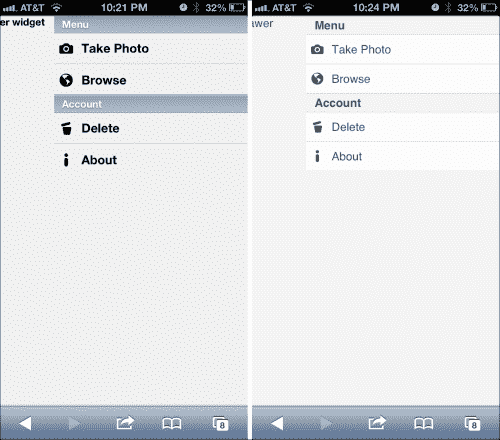

## 在特定视图上启用和禁用抽屉

抽屉部件可以配置为仅针对特定视图启用。这是通过将视图标识作为数组提供给`views`数据属性来实现的:

```cs
<div data-role="drawer" data-views="[view1', 'view2']">
</div>
```

如果未配置`views`数据属性，则手机 app 中所有视图都将显示微件。

### 类型

如果你有很多视图，只是想隐藏抽屉，只隐藏几个视图，那就去小部件的`beforeShow`事件，检查当前加载的视图 ID，调用`preventDefault()`方法不显示抽屉。

让我们修改前面的例子，看看它是如何工作的:

```cs
<div data-role="drawer" id="right-drawer"
         data-position="right"
         data-before-show="onBeforeShow">
        <ul data-role="listview" data-type="group">
            <li>Menu
            <ul>
                <li data-icon="camera">
                    <a href="#view1">Take Photo </a>
                </li>
                <li data-icon="globe">
                    <a href="#view2">Browse </a>
                </li>

            </ul>
            </li>

        </ul>
    </div>

    <div data-role="view" id="view1">
        <div>
            Swipe from right to left to
              view the Drawer widget
        </div>
    </div>

    <div data-role="view" id="view2">
        <div>
            Browse view  in which Drawer is disabled.
        </div>
    </div>

    <script>
        var app = new kendo.mobile.Application(document.body, {
            skin: 'flat'
        });

        function onBeforeShow(e) {
 //check for view id to prevent 
 //display of Drawer
 if (app.view().id == "#view2") {
 e.preventDefault();
 }
 }
    </script>
```

### 类型

试试 js 提琴:[http://jsfiddle.net/kendomobile/uEbgz/](http://jsfiddle.net/kendomobile/uEbgz/)

在链接`Take Photo`和`Browse`的示例中，我们分别添加了两个带有标识`view1`和`view2`的视图。然后抽屉小部件的`beforeShow`事件被连接到事件处理程序`onBeforeShow`，在其中使用方法`app.view().id`检查当前视图的标识。如果当前视图 ID 是`#view2`，我们调用抽屉的`preventDefault()`方法，这样它就不会显示在第二个视图中。

## 使用导航小部件显示抽屉小部件

在前面几节中，我们看到可以使用 swipes 显示抽屉小部件。随着的滑动，我们可以使用任何一个剑道导航小部件来打开抽屉小部件。为了方便起见，我们只需要将导航元素的`href`属性指向抽屉的 ID，该 ID 前面加上一个`#`并设置`data-rel="drawer"`，如以下脚本所示:

```cs
<div data-role="drawer" id="my-drawer">

</div>

<div data-role="view">
    <a data-role="button"
       href="#my-drawer"
       data-rel="drawer">Open my drawer</a>
</div>
```

现在，让我们看一个例子，其中我们有左右抽屉小部件，带有可导航菜单和抽屉的自定义标题。两个按钮**左开**和**右开**放置在视图布局中的导航栏小部件上，可以点击打开抽屉小部件，如下代码所示:

```cs
<div data-role="layout" data-id="drawer-layout">
    <header data-role="header">
        <div data-role="navbar">
            <a data-role="button" data-rel="drawer"
               href="#left-drawer"  data-align="left">
                   Open Left
            </a>
            <span data-role="view-title"></span>
            <a data-role="button" data-rel="drawer"
               href="#right-drawer"  data-align="right">
                   Open Right
            </a>
        </div>
    </header>

</div>

<div data-role="drawer" id="left-drawer"
     data-views="['drawer-page1', 'drawer-page2', 'drawer-page3']">
    <ul data-role="listview" data-type="group">
        <li>Clickable Menu
            <ul>
                <li data-icon="favorites">
                    <a href="#drawer-page1">
                        Page 1
                    </a>
                </li>
                <li data-icon="downloads">
                    <a href="#drawer-page2"
                       >
                        Page 2</a>
                </li>
                <li data-icon="featured">
                    <a href="#drawer-page3">
                        Page 3</a>
                </li>
            </ul>
        </li>
        <li>Static Menu
            <ul>
                <li>Item 1</li>
                <li>Item 2</li>
                <li>Item 3</li>               
            </ul>
        </li>
        </ul>
</div>

<div data-role="drawer" id="right-drawer"
     data-title="Two Way Menu"
     data-position="right" >
    <header data-role="header">
        <div data-role="navbar">
            <span data-role="view-title">
                Two Way Menu
            </span>
        </div>
    </header>
    <ul data-role="listview">
        <li >Right Item 1</li>
        <li >Right Item 2</li>
        <li >Right Item 3</li>
    </ul>
</div>

    <div data-role="view" id="drawer-page1"
         data-layout="drawer-layout"
         data-title="Page 1">
   <h1>Page 1 </h1>
</div>

<div data-role="view" id="drawer-page2"
     data-layout="drawer-layout"
     data-title="Page 2">
    <h1>Page 2 </h1>
</div>

    <div data-role="view" id="drawer-page3"
         data-layout="drawer-layout"
         data-title="Page 3">
        <h1>Page 3 </h1>
</div>

<script>
   var app = new kendo.mobile.Application(document.body);
</script>
```

### 类型

试试 js 提琴:[http://jsfiddle.net/kendomobile/sCb56/](http://jsfiddle.net/kendomobile/sCb56/)

当上面的应用加载到 **iOS 6** 中时，它看起来像下面的截图，在应用的导航栏两侧有两个按钮:

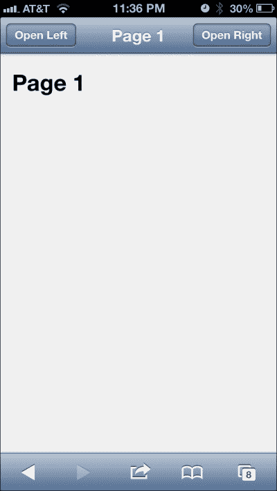

当点击两个按钮中的一个时，抽屉部件从各自的侧打开。从左侧打开的菜单有可点击的链接，可将您带到不同的视图。请看下面的截图:

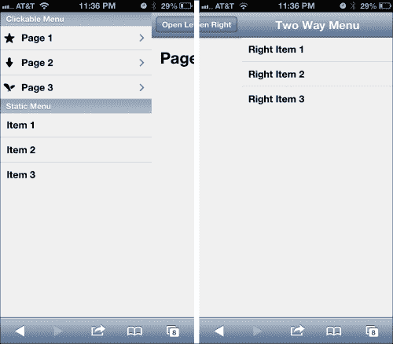

# 总结

在这一章中，我们探索了更多的剑道 UI Mobile 小部件，学习了如何在多个场景中实例化和使用它们，这帮助我们创建了一个坚实的基础来完成我们的电影票应用。在下一章中，我们将学习如何在后端使用 ASP.NET 网络应用编程接口服务集成这些小部件。