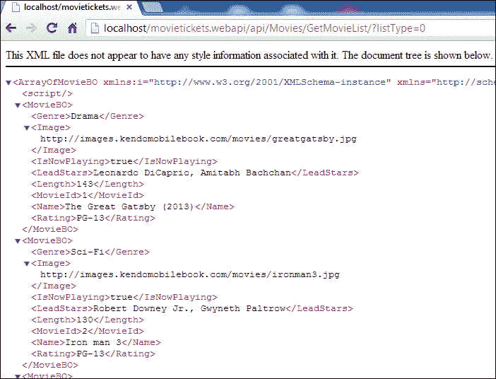
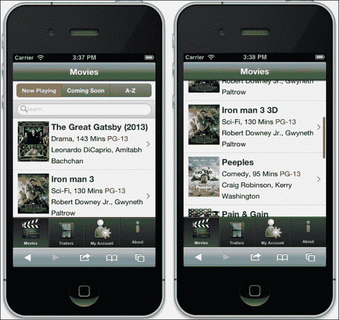
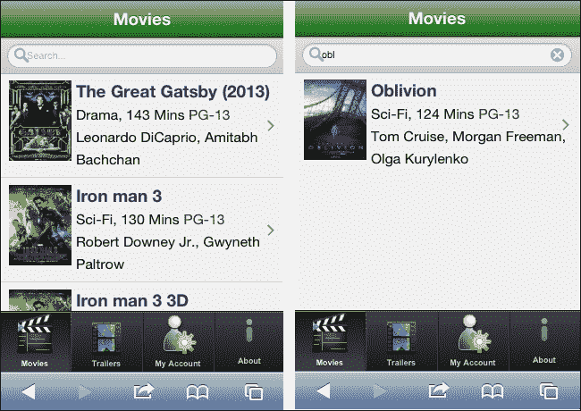
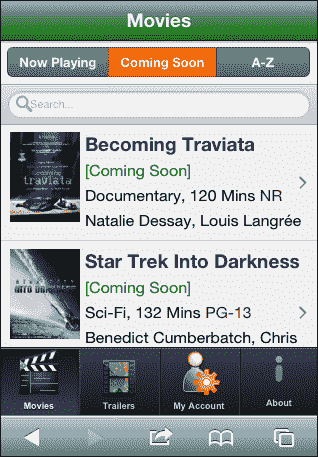
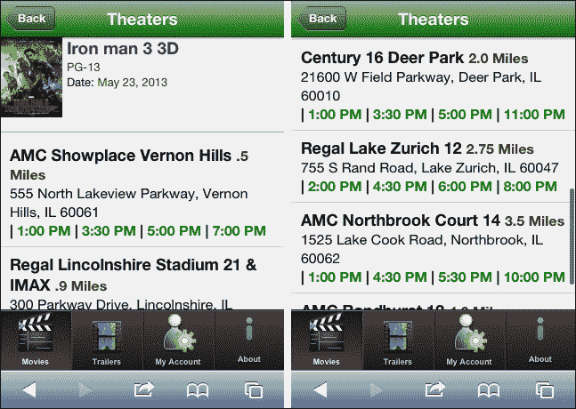
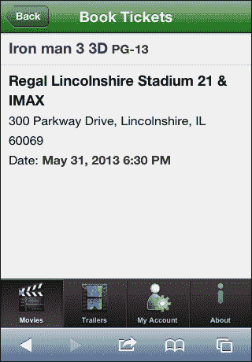
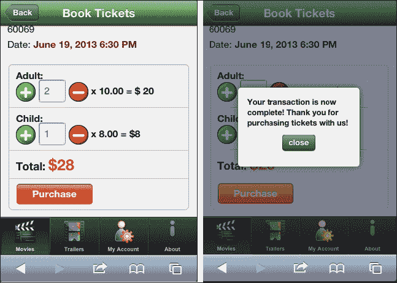
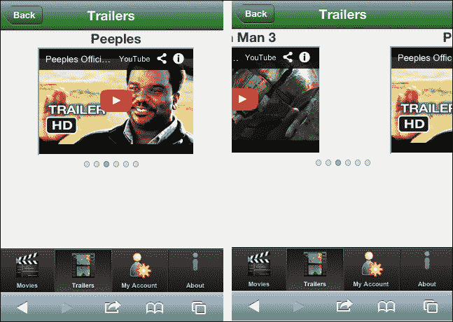

# 第七章。电影票应用程序-完全集成

在本章中，我们将通过与剑道用户界面移动小部件、框架元素和 ASP.NET 网络应用编程接口服务集成，完成我们在[第 4 章](4.html "Chapter 4. Integration Using Framework Elements")、*使用框架元素*开始的 MovieTickets 示例应用程序。我们将实现电影列表、剧院列表、购票和预告片的视图。在这一章的最后，您将真正惊讶地看到，使用 Kendo UI Mobile Framework 构建一个具有可扩展、可维护和结构良好的代码的完整端到端移动应用程序是多么容易！

在本章中，我们将介绍:

*   完成网络应用编程接口服务
*   前端视图
*   电影列表屏幕
*   剧院列表屏幕
*   预订机票屏幕
*   预告片视频幻灯片屏幕

# 完成网络应用编程接口服务

在[第 3 章](3.html "Chapter 3. Service Layer with ASP.NET Web API")、*带有 ASP.NET 网络 API 的服务层*中，我们创建了一个名为`MovieRepository.cs`的存储库类，其中包含了一系列电影和影院的硬编码数据。我们将在本章中使用相同的数据来构建示例应用程序中的新视图。

### 注

该书在帕克特出版公司的网站上提供了网络应用编程接口服务和剑道用户界面手机的完整源代码。如果您不是. NET 背景或对创建服务层不感兴趣，请随意使用此 URL 中承载的服务来连接到您的前端:

`http://api.kendomobilebook.com/api/`

例如，要获得**正在播放**电影的列表，网址将是:

[http://api.kendomobilebook.com/api/Movies/GetMovieList?listtype=0](http://api.kendomobilebook.com/api/Movies/GetMovieList?listtype=0)

完整的移动应用程序可在线访问:

[http://movies.kendomobilebook.com](http://movies.kendomobilebook.com)

## 电影列表

打开文件并将以下`static`方法添加到`MovieTicketsBLL`类:

```cs
public static List<MovieBO> GetMovieList(int listType)
{
    var moviesMasterList = MovieRepository.GetMoviesMasterList();

    switch (listType)
    {
            //return now playing movies
        case 0:
            return moviesMasterList
                    .Where( m => m.IsNowPlaying == true )
                    .ToList();

        //return coming soon movies
        case 1:
            return moviesMasterList
                    .Where(m => m.IsNowPlaying == false)
                    .ToList();

        // return all the movies sorted by name
        default:
            return moviesMasterList
                    .OrderBy(x => x.Name)
                    .ToList();
    }
}
```

该方法从存储库中读取电影列表，并根据电影类型返回列表，电影类型由输入变量`listType`定义:

*   `listType = 0`:返回**正在播放的**电影
*   `listType = 1`:回归即将上映的**电影**
***   `listType = 2`:以升序按字母顺序返回所有电影**

 **现在让我们在`MoviesController.cs`中创建一个动作方法，称为`GetMovieList` BLL 方法:

```cs
public List<MovieBO> GetMovieList(int listType)
 {
 	return MovieTicketsBLL.GetMovieList(listType);
 }
```

现在我们都设置了服务方法，根据选择的过滤器在初始视图中列出电影。为确保您的服务方法有效，在构建服务后，在浏览器上点击以下网址:

`http://localhost/movietickets.webapi/api/Movies/GetMovieList/?listType=0`

您将得到一个响应，列出所有正在播放的电影，如下图所示:



## 电影预告片

该服务方法将返回电影预告片的 YouTube 链接，该链接将显示在应用程序的**预告片**视图的 ScrollView 小部件中。让我们从创建业务层开始。

在`BLL\BusinessObjects`目录中创建一个名为`TrailerBO`的类:

```cs
public class TrailerBO
{
    public string MovieName { get; set; }
    public string VideoUrl { get; set; }
}
```

### 储存库

现在在`MovieRepository.cs`类中声明一个类级`static`变量:

```cs
public static List<TrailerBO> trailersMasterList;
```

我们正在创建一个`static`列表，因为所有请求的存储库基础数据都是相同的，所以我们在整个应用程序中只需要一个实例。该变量将保存要在应用程序中显示的预告片列表。

现在在`MovieRepository.cs`类中添加以下方法:

```cs
//Method to create hardcode data for trailers
private static void CreateTrailersMasterList()
{
    trailersMasterList = new List<TrailerBO>()
    {
        new TrailerBO(){
            MovieName= "The Great Gatsby (2013)",
            VideoUrl= "http://www.youtube.com/embed/rARN6agiW7o?html5=1"
        },
        new TrailerBO(){
            MovieName= "Iron Man 3",
            VideoUrl= "http://www.youtube.com/embed/2CzoSeClcw0?html5=1"
        }
    }
}
```

此方法为电影预告片创建一个 YouTube 链接列表以及电影名称。您可以在此对象中添加任意数量的 YouTube 链接；参见源代码中的这个片段:

```cs
//This method returns a list of
//trailer links and movie names
public static List<TrailerBO> GetTrailersMasterList()
{
    if (trailersMasterList == null 
        || trailersMasterList.Count == 0)
    {
        CreateTrailersMasterList(); 
    }
    return trailersMasterList;
}
```

如果`trailersMasterList`对象尚未加载数据，则该方法加载数据，并返回数据。业务层调用此方法来检索预告片列表。

### 业务层

在 BLL 文件`MovieTicketsBLL.cs`中，增加以下方法，将预告片列表返回给控制器动作方法:

```cs
public static List<TrailerBO> GetTrailers()
{
    return MovieRepository.GetTrailersMasterList();
}
```

### 动作方法

现在在`MoviesController.cs`中，添加以下返回预告片列表的动作方法:

```cs
public List<TrailerBO> GetTrailers()
{
    return MovieTicketsBLL.GetTrailers();
}
```

### 票务的动作方法

我们还需要一个控制器和一个购买门票的方法。这是一个`POST`方法，以一个票对象作为输入。因为我们没有数据库，所以我们不会在这个控制器方法中做任何进一步的处理，只是返回一个`true`值来标记售票成功。

现在在`BLL\BusinessObjects`目录中创建一个名为`TicketPurchaseBO.cs`的文件，代码如下:

```cs
public class TicketPurchaseBO
{         
    public string TheaterId { get; set; }
    public string MovieId { get; set; }         
    public int NoOfChildTickets { get; set; }
    public int NoOfAdultTickets { get; set; }
    public string ShowDate { get; set; }
    public string ShowTime { get; set; }
    public string TotalAmount { get; set; }
}
```

现在创建一个名为`TicketController`的控制器，并添加一个开机自检操作:

```cs
// POST api/tickets
public bool Post(TicketPurchaseBO ticket)
{
    //implement save logic here. For the sake of simplicity
    //we assume that the ticket is saved properly and 
    //return a success boolean.

    return true;
}
```

我们将在电影列表视图的票务工作流的最终屏幕中使用此操作方法。

这完成了我们的网络应用编程接口服务方法的设置，并允许我们构建我们的电影票应用程序的屏幕。

# 前端视图

现在让我们开始构建我们前端的两个待定部分:

*   电影列表和票务工作流程:
    *   **电影**列表带滤镜
    *   **影院**精选电影列表
    *   **订票**画面
*   电影预告片

## 配置

让我们在`configuration.js`文件中创建网络应用编程接口网址，这样我们就不必在应用程序中使用硬编码字符串:

```cs
MovieTickets.configuration = (function () {
     var serviceUrl = "http://localhost/movietickets.webapi/api/";
    return {            
        serviceUrl: serviceUrl,
        accountUrl: serviceUrl + "Account/",
        getMovieListUrl: serviceUrl + "Movies/GetMovieList/",
        getTheaterListForMovieUrl: serviceUrl +
            "Theater/Get/",
        getTrailersUrl: serviceUrl + "Movies/GetTrailers/",
 purchaseTicketsUrl: serviceUrl + "Tickets"
    }
})();
```

### 类型

如果要使用我们提供的托管服务，可以用以下代码片段的应用替换`serviceUrl`的声明:

```cs
var serviceUrl = "http://api.kendomobilebook.com/api/"
```

# 电影列表屏幕

这是显示电影列表的应用程序的初始视图。在现实应用中，列表可能是用户所在位置附近正在播放的所有电影。这个列表可以使用 HTML5 地理定位应用编程接口找到，或者使用这个配置文件信息找到。为了简单起见，我们只是使用支持搜索的`ListView`小部件来显示电影列表。屏幕顶部将有一个`ButtonGroup`小部件，带有三个过滤器选项，如下所示:

*   **现在播放**
*   **即将到来**
*   **A-Z**

根据过滤器的选择，电影将被载入列表。点击电影列表项目后，下一个屏幕会显示影院列表。用户可以选择一个影院，然后点击电影时间进入下一个**订票**画面。这是最后一个可以购买门票并完成交易的屏幕。

从初始屏幕开始的应用程序工作流程如下所示:


一旦我们完成这个视图，并将其与来自服务的数据连接起来，我们的应用程序将看起来像下面的截图:



## JavaScript 模块

让我们通过定义视图的视图模型和命名空间`MovieTickets`中的其他方法，为**电影**列表视图创建 JavaScript 模块`movieList`。

我们将添加从服务中获取数据的方法来加载`viewModel`对象，并在电影列表的类型从用户界面改变时初始化视图和事件处理程序。电影列表过滤器使用一个`ButtonGroup`小部件实现，包括以下选项:**正在播放**、**即将到来**和 **A-Z** :

```cs
MovieTickets.movieList = (function(){

    var viewModel = kendo.observable({
        movieList: {}
    });  

    //fetches the list of movies from the service
    //depending on the listType filter
    function getMovieList(listType) {
        var movieListoptions = {
            url: MovieTickets.configuration.getMovieListUrl,
            data: { listType: listType },
            requestType: "GET",
            dataType: "JSON",
            callBack: callBack
        };
        //service call
        MovieTickets.dataAccess.callService(movieListoptions);
    }
    //callback method from service call
    function callBack(result) {
        if (result.success === true) {
            viewModel.set("movieList", result.data);
        }
    }

    //this event is fired when movie list
    //type is changed from the UI
    function listTypeSelected(e) {

        getMovieList(e.sender.selectedIndex);
    }
    //Loading the movie list with listType= 0
    //which is Now Running list
    function init(){
        getMovieList(0);
    }

    return {
        initialize: init,
        getMovieList: getMovieList,
        viewModel: viewModel,
        listTypeSelected:listTypeSelected
    }

})();
```

让我们来看看这段代码的一些重要部分:

*   `getMovieList` :该方法使用`MovieTickets.dataAccess`模块调用网络应用编程接口服务，并用`callBack`方法返回的数据更新`viewModel`对象。调用`MoviesController`的`GetMovieList`动作方法来检索电影列表。
*   `listTypeSelected`:这是更换电影列表类型滤镜时触发的事件(`Now Playing`、`Coming Soon`、`A-Z`)。在此事件处理程序中，`getMovieList`方法使用选定的过滤器作为输入进行调用。
*   `init`:这个方法调用`getMovieList()` 方法，第一个过滤项**现在播放**作为输入。这是默认过滤器。

在 return 语句中，所有的`public`对象和方法都被返回，这样就可以通过在它们的名称前面加上`MovieTickets.movieList`来访问它们。

## 电影列表视图

在[第 2 章](2.html "Chapter 2. Building Your First Mobile Application")、*构建您的第一个移动应用程序*中，我们定义了`index.html`文件中**电影**列表屏幕的视图。让我们从[第二章](2.html "Chapter 2. Building Your First Mobile Application")中的代码开始构建用户界面组件。电影列表将使用剑道`ListView`小部件显示。每个列表项包含以下内容:

*   电影图像
*   电影名称
*   类型
*   评级
*   电影长度
*   主角

当我们点击**的“正在播放”**列表中的任何一个电影项目时，该视图应该导航到 ID 为`mt-theaters-movie-view`的“影院”列表视图。

### 列表项模板

前面的数据需要在 ListView 小部件中呈现，为此，我们需要创建一个剑道 UI 模板，如下面的代码所示:

```cs
<!--template for movie list -->
<script type="text/x-kendo-template" id="mt-main-tmpl-movie-list">  
    # var ecodedURI = '\\#mt-theaters-movie-view?movieId=' +
                        MovieId + '&movieName=' + 
                        encodeURIComponent(Name) + '&rating=' +
                        Rating + '&image=' + Image #

    #if(IsNowPlaying !== true){
        ecodedURI= "";
        }#       

<a href="#:ecodedURI#" >
    
    <div class="mt-movie-details">
      <span class="mt-listitem-title"> #:Name# </span>
      <span data-bind="invisible:IsNowPlaying"
            class="mt-highlight-label2">[Coming Soon]</span><br/> 
      <span class="mt-normal-label"> #:Genre#, </span>
      <span class="mt-normal-label"> #:Length# Mins </span>
      <span class="mt-highlight-label"> #:Rating# </span> <br/>
      <span class="mt-normal-label"> #:LeadStars# </span>
    </div>
    </a>    
</script>
```

该模板为电影的所有属性创建占位符，并将其包装在锚点标签周围，并设置`href`属性以导航到**剧院**列表视图(ID `mt-theaters-movie-view`)，所选电影的所有属性作为查询字符串。

#### 编码 URI

重定向的 URI 是使用模板中的变量`encodedURI`创建的。一旦 URI 被正确形成，该变量的值被设置为锚标签的`href`值。JavaScript 方法`encodeURIComponent`用于使电影名称安全地通过 URIs 传输，因为电影名称可能包含特殊字符，这可能会使 URIs 陷入混乱。

未发行的电影不应该启用导航，因为不会有要显示的影院列表，并且不能预订门票。因此，如果属性`IsNowPlaying`不是`true`，我们将`ecodedURI` 的值设置为空字符串，以便在点击即将到来的**电影时，不会出现导航。**

 **### 注

我们正在设计一个电影列表项目模板，以便使用查询字符串将选定电影的详细信息传输到重定向视图，而不是在应用程序中共享 JavaScript 对象。实现这种方法的一个优点是，在开发过程中，一旦我们对重定向的视图进行了更改，我们就可以通过刷新浏览器来查看/调试这些更改，因为加载视图的所有数据都在 URL 中可用，而不像 JavaScript 对象那样在刷新浏览器时会丢失数据。

#### 风格

以下样式也被添加到`Styles.css`文件中，以设置模板内容的样式:

```cs
.mt-movie-photo {
    float:left;
    height:90px;
    width:70px;
}

.mt-listitem-title {
    font-size:19px;
    font-weight:bold;
    color:darkblue;

}

.mt-highlight-label {
    color:maroon;
}

.mt-highlight-label2 {
    color:green;
}
```

### 配置视图和列表视图

在视图定义中，我们现在可以添加列表视图小部件，连接`init`事件，并设置`model`属性，如以下代码所示:

```cs
<!-- Movies main view --->
<div data-role="view" id="mt-home-main-view" data-title="Movies"
        data-init="MovieTickets.movieList.initialize"
        data-model="MovieTickets.movieList.viewModel"
        data-layout="mt-main-layout" class="no-backbutton">

    <!--Movie List -->
    <ul id="mt-main-movie-list-view" data-role="listview"
        data-template="mt-main-tmpl-movie-list"
        data-filterable="{field:'Name', operator:'startsWith'}"
        data-bind="source:movieList">
    </ul>   

</div>
```

在 ListView 小部件中，我们设置模板 ID，使用名字使小部件可过滤，并将数据源绑定为`movieList`，这是`MovieTickets.movieList.viewModel`的一个属性。由于我们将视图的`model`属性设置为`MovieTickets.movieList.viewModel`对象，该对象的所有属性在视图中都可用，我们可以使用它们，而无需在它们前面加上父对象的名称。在导航到应用程序时，我们可以看到**正在播放**电影的列表。



### 电影列表类型按钮组

如前所述，在应用程序中，我们有三种类型的电影列表:`Now Playing`、`Coming Soon`和`A-Z`。A **按钮组** 是这个场景中最适合使用三种列表类型过滤电影的剑道 UI 小部件。现在，让我们在列表视图小部件上方添加一个按钮组小部件，通过添加以下代码来选择列表类型:

```cs
<ul data-role="buttongroup" data-index="0"
    data-select="MovieTickets.movieList.listTypeSelected">
    <li>Now Playing</li>
    <li>Coming Soon</li>
    <li>A-Z</li>
</ul>
```

选择事件绑定到`movieList`模块中定义的`MovieTickets.movieList.listTypeSelected`事件。要更改按钮组小部件的默认 iOS 特定颜色，我们可以在`Styles.css`中添加以下样式:

```cs
.km-ios  #mt-home-main-view  .km-buttongroup  .km-button:not(.km-state-active)  {
    width:70px;
    font-size: 1em;
    background-color:gray;
    color:white;
    text-shadow:none;
}
.km-ios  #mt-home-main-view .km-buttongroup .km-state-active {
    width:70px;
    font-size: 1em;
    background-color:#FF6600;
    color:white;
    background-image:none;
 }
```

先前的样式使按钮组小部件的默认背景颜色为灰色，所选按钮的背景颜色为橙色。



点击按钮组小部件的按钮，现在将加载选定电影类型的列表视图小部件。

# 影院列表屏幕

一旦用户通过点击**电影**列表屏幕中的项目来选择电影，用户被重定向到**剧院**列表屏幕，在该屏幕上显示具有地址和放映时间的剧院列表。

## JavaScript 模块

让我们通过为视图和相关方法创建带有视图模型的 JavaScript 模块来开始构建这个屏幕。在`js`文件夹中创建一个名为`theaters-movie-list.js`的文件，并将其引用添加到`index.html`文件中。该模块的设计类似于**电影**列表屏幕:

```cs
MovieTickets.theaterListForMovie = (function () {

    //ViewModel to be bound to the view
    var viewModel = kendo.observable({
 theaterList: {},
 selectedMovie: {
 movieId: "",
 movieName: "",
 rating: "",
 imageUrl:""
 },
 selectedDate: ""

 });

    //retrieve list of theaters from the service
    function getTheaterList(movieId) {
        var serviceOptions = 
            {
            url: MovieTickets.configuration
.getTheaterListForMovieUrl,
            data: { movieId: movieId },
            requestType: "GET",
            dataType: "JSON",
            callBack: callBack
        };
        MovieTickets.dataAccess.callService(serviceOptions);

    }

    function callBack(result) {
        if (result.success === true) {
            viewModel.set("theaterList", result.data);
        }
    }    

    //handler for show event of the view
    function show(e) {

   //hard coding today's date for selected date
        viewModel.set('selectedDate', new 
Date().toLocaleDateString());

        //read the selected movie's details from the query string
        viewModel.set("selectedMovie", {
            movieId: e.view.params.movieId,
         movieName:  
         decodeURIComponent(e.view.params.movieName),
            rating: e.view.params.rating,
            imageUrl: e.view.params.image
        }); 
        getTheaterList(e.view.params.movieId);
    }

    return {
        show: show,
        getTheaterList: getTheaterList,
        viewModel: viewModel,       
    }
})();
```

让我们来看看 `viewModel`对象的属性和方法:

*   `theaterList`:包含有地址和放映时间的影院列表。
*   `selectedMovie`:这个对象保存从电影列表视图中选择的电影的细节。此对象在视图的 show 事件中初始化，属性值从查询字符串中读取。
*   `selectedDate`:该对象包含显示放映时间的日期。在我们的示例应用程序中，它总是当前日期。
*   `getTheaterList(movieId)`:这个方法从服务中获取影院列表，结果加载到`viewModel`对象的`theaterList`属性中。我们使用的是`Theater`控制器的`Get`动作方法。
*   `show(e)`:这个是视图中`show`事件的事件处理方法。集合`e.view.params`中可用的查询字符串值被提取并分配给`selectedMovie`对象的属性。调用`getTheaterList()`方法作为该事件处理程序的最后一步。

### 影院列表视图

现在让我们打开`index.html`和配置**影院**列表视图。视图的模型属性设置为`MovieTickets.theaterListForMovie.viewModel`，`show`事件连接到`MovieTickets.theaterListForMovie.show`。

所选电影的所有属性都使用剑道 MVVM 的`data-bind`属性绑定到 HTML 元素:

```cs
<div data-role="view" id="mt-theaters-movie-view"
     data-model="MovieTickets.theaterListForMovie.viewModel"
 data-show="MovieTickets.theaterListForMovie.show"
     data-layout="mt-main-layout" data-title="Theaters">
    <div id="mt-theaters-movie-details">

        
        <div class="mt-movie-details">
            <div class="mt-listitem-title"
                 data-bind="text: selectedMovie.movieName"></div>

            <div class="mt-highlight-label"
                data-bind="text: selectedMovie.rating"></div>

            Date: <span class="mt-highlight-label"
                    data-bind="text: selectedDate"></span>
        </div>
    </div>
    <hr />

    <!-- Theater ListView goes here -->

</div>
```

#### 影院列表模板

在 **影院**列表视图中，我们还将使用`ListView`小部件，并使用剑道模板渲染列表项目。

创建一个模板，如以下代码所示:

```cs
<script type="text/x-kendo-template"
 id="mt-main-tmpl-theater-list">
        <!-- redirect URI-->             
          #var ecodedURI = 'theaterName=' + 
encodeURIComponent( Name ) +
                '&address=' + encodeURIComponent( Address ) +
                '&movieName=' + encodeURIComponent(
MovieTickets.theaterListForMovie.viewModel.selectedMovie.movieName) +
                '&rating=' + MovieTickets.theaterListForMovie.viewModel.selectedMovie.rating +
                '&movieId=' +  MovieTickets.theaterListForMovie.viewModel.selectedMovie.movieId +
                '&theaterId=' + TheaterId +
                '&date=' + encodeURIComponent( 
MovieTickets.theaterListForMovie.viewModel.selectedDate )
         #  

        <div>
            <span class="mt-title"> #:Name# </span>  
            <span class="mt-highlight-label"> #:MilesFromCurrentLoc# Miles </span><br/>                
            <span class="mt-normal-label"> #:Address# </span>

            <div>
                <!--  render show times -->
                #for(var i=0; i < Timings.length; i++) {#
 <a class="mt-timings" 
 href="\\#BookTickets.html?#:ecodedURI#
 &time=#:encodeURIComponent(Timings[i])#">
 #:Timings[i]#</a> 

                <!--Add pipe separator for show times -->
                #if(i < (Timings.length - 1)){#
 | 
<!--The pipe separator won't appear for the last item -->
 #}#
                #}#   
           </div>  
        </div>

    </script>
```

电影的影院和放映时间由用户通过点击渲染的放映时间来选择。选择放映时间后，用户被重定向到**订票**视图，查询字符串中包含所选电影、影院和放映时间的详细信息。为此，我们使用模板中的变量`encodedURI`来创建 URI，就像在**电影**列表视图中所做的那样。剧院的详细信息(如剧院名称、地址和放映时间)使用模板渲染，放映时间列表用管道( **|** )符号分隔。

CSS 类`mt-timings`被添加到`Styles.css`中，为屏幕上出现的放映时间设置样式:

```cs
.mt-timings{
    color:green !important;
    text-decoration: none !important;
}
```

### 为影院添加列表视图

**剧院**列表视图中的最后一步是添加一个剑道列表视图小部件，并使用我们在上一节中创建的模板进行渲染。

添加以下 Kendo ListView 小部件作为视图定义中的最后一项，视图模型对象的`theaterList`属性绑定到列表视图作为其数据源:

```cs
<ul id="mt-theaters-movie-list" data-role="listview"
            data-template="mt-main-tmpl-theater-list"
 data-bind="source:theaterList">
</ul>
```

现在我们都设置好运行我们的应用程序，从初始屏幕中选择一部电影，并查看**影院**列表屏幕！



# 订票界面

我们的电影票应用票务工作流程中的最后一个屏幕是**订票**屏幕，用户可以在这里为成人和儿童选择和购买票。两种门票类型都有加减按钮，图标形式为加号( **+** )和减号( **-** )，由剑道 MVVM 绑定绑定，可以加减每种类型的门票数量，显示每一部分的总金额以及更新总计。

通过点击**购买**按钮完成购买，该按钮会将机票详情发送给服务。

## JavaScript 模块

让我们在`js`文件夹中创建一个名为`book-tickets.js`的文件，并在文件中添加一个名为`MovieTickets.bookTickets`的 JS 模块，如下代码所示:

```cs
MovieTickets.bookTickets = (function () {

    var viewModel = kendo.observable({

        //method to increment no of child tickets
        incrementChildTicket: function () {

            this.set("noChildTickets", parseInt(
                        this.get("noChildTickets")) + 1);
        },

        //method to increment no of adult tickets
        incrementAdultTicket: function () {            

            this.set("noAdultTickets", parseInt(
                        this.get("noAdultTickets")) + 1);
        }, 

        //method to decrement no of child tickets
        decrementChildTicket: function () {
            if (this.get("noChildTickets") !=0 )
                this.set("noChildTickets", parseInt(
                            this.get("noChildTickets")) - 1);
        },

        //method to decrement no of adult tickets
        decrementAdultTicket: function () {
            if (this.get("noAdultTickets") != 0)            
                this.set("noAdultTickets", parseInt(
                            this.get("noAdultTickets")) - 1);
        },

        //get the total amount for adult ickets
        noAdultTotalAmount: function () {                         
                return this.get("noAdultTickets") * 10.00            
        },

        //get the total amount for child tickets
        noChildTotalAmount: function () {           
                return this.get("noChildTickets") * 8.00           
        },

        //get total amount    
        totalAmount: function () {
            return viewModel.noAdultTotalAmount() +
                   viewModel.noChildTotalAmount();
        },        

        noAdultTickets: 0,
        noChildTickets: 0,

        //movie details
        selectedMovie: {
            movieId: "",
            movieName: "",
            rating: "",            
        },
        //teater details
        selectedTheater: {
            theaterId: "",
            theaterName: "",
            address: "",
            time:""
        },       
    });

})();
```

`viewModel`对象具有以下功能:

*   `incrementChildTicket()`
*   `incrementAdultTicket()`
*   `decrementChildTicket()`
*   `decrementAdultTicket()`
*   `noChildTotalAmount()`
*   `noAdultTotalAmount()`
*   `totalAmount()`

这些方法的功能是不言自明的。属性`noAdultTickets`和`noChildTickets`将分别保存成人票和儿童票的总数。`selectedMovie`和`selectedTheater`酒店将装载预订的电影和剧院。

### 显示事件

在`show`事件中，`viewModel`对象`selectedMovie`和`selectedTheater`的属性通过从查询字符串中读取各自的值来加载。现在在我们的`MovieTickets.bookTickets`模块中的`viewModel`定义后面添加这个`show`事件:

```cs
function show(e) {
    viewModel.set("selectedMovie", {
        movieId: e.view.params.movieId,
        movieName: decodeURIComponent(e.view.params.movieName),
        rating: e.view.params.rating,
    });
    viewModel.set("selectedTheater", {
        theaterId: e.view.params.theaterId,
        theaterName: decodeURIComponent(e.view.params.theaterName),
        address: decodeURIComponent(e.view.params.address),
        time: decodeURIComponent(e.view.params.time),
        date: decodeURIComponent(e.view.params.date)
    });
}
```

### 购票

现在我们给`MovieTickets.bookTickets`模块增加一个名为`purchaseTickets()`的功能。在这种方法中，我们将检查用户是否至少选择了一张票据，否则会向用户显示一条警告消息。一旦票通过验证，订票所需的所有数据都以 HTTP POST 的形式发送到我们网络应用编程接口服务中的`Tickets`控制器。购票成功后，剑道移动模式视图小部件会向用户显示一条成功消息:

```cs
//method to purchase tickets. This method sends
//all the data to the service in an HTTP POST
function purchaseTickets() {

    //no tickets are selected, display a message
    if (viewModel.noAdultTickets == 0 &&
        viewModel.noChildTickets == 0) {
        alert('Atleast one ticket needs to be purchased.');
        return;
    }

    var serviceOptions = {
        url: MovieTickets.configuration.purchaseTicketsUrl,
        data: {
            movieId: viewModel.selectedMovie.movieId,
            theaterId: viewModel.selectedTheater.theaterId,
            noOfAdultTickets: viewModel.noAdultTickets,
            noOfChildTickets: viewModel.noChildTickets,
            showDate: viewModel.selectedTheater.date,
            showTime: viewModel.selectedTheater.time,
            totalAmount: viewModel.totalAmount
        },
        requestType: "POST",
        dataType: "JSON",
        callBack: purchaseCallBack
    }
    //service call.
    MovieTickets.dataAccess.callService(serviceOptions);

    function purchaseCallBack(result) {
        if (result.success === true) {
            //display a message to the user
            //using modal view
            var intializedModalView =
 $("#mt-modal-complete").data("kendoMobileModalView");

            //if the modal view is already initialized,
            //destroy it
            if (intializedModalView) {
 intializedModalView.destroy();
 }

 $('#mt-modal-complete').kendoMobileModalView({
 height: 130, width: 200
 }).data("kendoMobileModalView").open();

        } else {
            alert('purchase failed. please try again.');
        }
    }
}
```

我们需要添加到这个模块的最后一个方法是在订票成功后关闭 ModalView 小部件并重定向到主页的方法:

```cs
//method to close the modal view and redirect
//to the main view.
function closeModalView() {       

    //close the confirmation modal popup
 $("#mt-modal-complete").data("kendoMobileModalView").close();

    //navigate to the home page
    MovieTickets.main.getKendoApplication().navigate('#mt-home-main-view');
}
```

## 订票视图

对于 Book Tickets 视图，让我们在根文件夹中创建一个名为`BookTickets.html`的外部 HTML 文件，并添加一个 Kendo Mobile 视图，如以下代码片段所示:

```cs
<div data-role="view"
    data-title="Book Tickets" data-layout="mt-main-layout"
    data-show="MovieTickets.bookTickets.show" 
 data-model="MovieTickets.bookTickets.viewModel"
    id="mt-book-tickets-view">
</div>
```

视图的标题设置为**订票**，视图的展示事件连线到`MovieTickets.bookTickets.show` 方法，`MovieTickets.bookTickets.viewModel`设置为视图的模型。在这个视图中，我们将添加两个部分，第一个是电影详细信息部分，我们在这里显示电影名称、等级、剧院名称、地址、日期和时间。在第二部分中，我们提供了用于添加和移除带有文本框的门票的按钮，以便用户可以选择成人和儿童的门票数量。在屏幕底部，添加了一个完成购买的按钮。为了显示电影细节部分，我们将使用一个包含两个列表项的 ListView 小部件。数据将使用 **MVVM** `data-bind`属性显示在`<span>`元素中:

```cs
<ul data-role="listview">
    <li>
        <span class="mt-listitem-title"
                data-bind="text: selectedMovie.movieName">
        </span>
        <span class="mt-highlight-label"
                data-bind="text: selectedMovie.rating">
        </span>
        <br />
    </li>
    <li>
        <span class="mt-title"
                data-bind="text: selectedTheater.theaterName">
        </span>
        <br />
        <span class="mt-normal-label"
                data-bind="text: selectedTheater.address">
        </span>
        <br />
        <span class="mt-normal-label">Date:</span>
        <span class="mt-highlight-label"
                data-bind="text: selectedTheater.date">
        </span>
        <span class="mt-highlight-label"
                data-bind="text: selectedTheater.time"></span>
    </li>
</ul>
```



在第二部分中，我们将在一个列表视图小部件中添加内容。我们将在屏幕上显示成人和儿童的总金额，以及总计，并在用户更新门票计数时自动更新数字。这是通过将用户界面元素绑定到我们的可观察`viewModel`的属性和方法来实现的，这已经在视图定义中通过设置完成了:

`data-model= "MovieTickets.bookTickets.viewModel"`

现在让我们为第二部分添加 HTML:

```cs
<ul data-role="listview" data-style="inset">
    <li>
        <div>
            Adult:
            <br />
            
            <input type="text" data-bind="value:noAdultTickets"
                    class="mt-ticket-num-input" />

            
            x 10.00 = $
            <label data-bind="text:noAdultTotalAmount"></label>
        </div>
    </li>
    <li>
        <div>
            Child:
            <br />
            
            <input type="text" data-bind="value:noChildTickets"
                    class="mt-ticket-num-input" />
            
            x 8.00 =
        $<label data-bind="text:noChildTotalAmount"></label>
        </div>
    </li>
    <li>
        <div>
            <span class="mt-title">Total: </span>
            <span class="mt-total-amount">
                $<label data-bind="text:totalAmount"></label>
            </span>
        </div>
    </li>
    <li>
        <div>
          <a data-role="button" class="mt-purchase-button"
            data-click="MovieTickets.bookTickets.purchaseTickets">
                Purchase
          </a>
        </div>
</li>
</ul>
```

在`Style.css`增加以下 CSS，美化 UI:

```cs
.mt-ticket-num-input {
    width: 45px !important;
    position: relative !important;
    border: ridge !important;
    min-width: 45px !important;
}
.mt-total-amount {
    color:orangered;
    font-size:25px;
}
.mt-list-image {
    vertical-align:middle;    
}

.mt-purchase-button {
    background-color: orangered !important;
    width:100px;
}
```

如果我们点击 **购买**按钮，门票详情会发送到服务器，如果回拨结果成功，会向用户显示一条消息。



# 创建预告片视频幻灯片屏幕

现在让我们创建应用程序的最终屏幕，它显示电影预告片的幻灯片，这些预告片是 YouTube 上托管的视频。为此，我们正在使用剑道用户界面移动滚动视图小部件。

在此视图中，从服务接收视频链接和电影名称，并将视频链接添加到剑道用户界面模板中定义的`<iframe>`元素中。

## HTML

让我们打开[第二章](2.html "Chapter 2. Building Your First Mobile Application")、*创建的`Trailers.html`文件*，并添加以下 HTML:

```cs
<div data-role="view" data-title="Trailers"
     data-show="MovieTickets.trailers.show"
     data-layout="mt-main-layout" id="mt-trailers-view">
 <div id="mt-trailer-scrollview" data-role="scrollview"> 

    </div>
    <!-- In order for the pages to be rendered properly
          make sure that you don't leave empty spaces
         between template's script tags and the html contents.
    -->
     <script type="text/x-kendo-template"
 id="mt-tmpl-trailers"><div data-role="page"
 class="mt-trailer-item">
 <div class="mt-listitem-title">#:MovieName# </div>
 <div>
 <iframe width="220" src="#:VideoUrl#"></iframe> 
 </div>
 </div>
 </script>
</div>
```

在前面的 HTML 中，我们定义了一个 ScrollView 小部件和 ID 为`mt-tmpl-trailers`的模板，用于在 ScrollView 中加载内容。剑道模板也用标识`mt-tmpl-trailers`定义，其中电影名称显示在顶部，视频网址嵌入在`<iframe>`元素中，因此视频缩略图显示在视图上。现在，我们只需要来自服务的数据来馈送模板，并在 ScrollView 小部件中分配呈现的 HTML。

## JavaScript 模块

在`js`文件夹中创建一个名为`trailers.js`的文件，并在文件中添加以下模块代码:

```cs
MovieTickets.trailers = (function () {  

    function show(e) {
        var options = {
            url: MovieTickets.configuration.getTrailersUrl,
            requestType: "GET",
            dataType: "JSON",
            callBack: callBack
        };
        MovieTickets.dataAccess.callService(options);        
    }

    function callBack(result) {
      if (result.success === true) {

       var trailerTemplate = kendo.template(
$("#mt-trailers-view #mt-tmpl-trailers").html());

 $("#mt-trailers-view #mt-trailer-scrollview")
 .data('kendoMobileScrollView')
 .content(kendo.render(trailerTemplate,
 result.data));                
        }
    }

    return {        
        show:show
    }

})();
```

现在将这个 CSS 类添加到`Style.css`中，使视频居中对齐:

```cs
.mt-trailer-item {
    text-align:center;
}
```

在视图的 show 事件中，会触发一个 Ajax 调用来检索要在幻灯片放映中显示的视频列表。一旦接收到数据，就将其作为内容提供给视图中定义的模板，并动态生成预告片幻灯片。

为此，在我们的代码中，我们首先将模板的内容读入一个名为`trailerTemplate`的变量。然后使用`kendo.render()`方法，使用服务返回的数据将模板呈现为 HTML，并作为 ScrollView 小部件的内容进行馈送，如图所示:

```cs
$("#mt-trailers-view #mt-trailer-scrollview")
                .data('kendoMobileScrollView')
                .content(kendo.render(trailerTemplate,
 result.data));
```

如果我们通过点击**预告片**标签项导航到**预告片**视图，我们可以看到正在显示的视频。向左或向右滑动将逐个显示电影预告片。



### 注

您可以访问[http://movies.kendomobilebook.com](http://movies.kendomobilebook.com )查看完整的申请。

# 总结

在本章中，我们通过连接到使用 ASP.NET 网络应用编程接口构建的基于 HTTP 的服务，构建了处理实时数据的功能，从而完成了我们的电影票示例应用程序。我们学习了如何在现实应用中使用重要的剑道 UI Mobile 小部件和框架元素，并看到了使用剑道 UI Mobile 框架构建移动应用是多么容易。您现在已经准备好使用剑道用户界面移动框架构建高性能的基于 HTML5 的移动应用程序了！快乐编码！****