# ASP？ASP？ASP？NET 蓝色信号聊天应用

聊天应用程序，以这样或那样的形式，可能和互联网本身一样古老。这并不难相信，因为互联网的最初目的是允许研究人员之间的交流。在早期，这种交流比寄信要快得多，但仍然远远不是即时的。

在本章中，我们将创建一个应用程序，允许网站的访问者实时聊天。具体来说，我们将涵盖以下主题:

*   配置蓝色信号服务
*   设计和设置项目
*   添加信号库
*   构建服务器
*   创建客户端
*   运行应用程序

# 技术要求

在本章中，您将需要一个 Azure 订阅(我们在上一章中简要介绍了如何创建订阅)。我们还将使用一些仅在 Visual Studio 的更高版本中可用的功能；在撰写本文时，15.8.7 是最新版本，但任何晚于 15.8.0 的版本都应该足够了。

本章的代码可以在 https://github.com/PacktPublishing/C-8-and-.的 GitHub 上找到 NET-Core-3-项目-使用-Azure-第二版。

# 介绍信号员

通常，在客户机-服务器关系中，例如访问网站，通信是由客户机发起的。你可以访问一个显示股价的网站，点击一个特定的股票代码，网站就会为你检索该股票的价格。一旦你得到了价格，你可能会让页面打开，并在一个小时内返回。股票的价格完全一样；你刷新网页，股票价格被重新提取，现在显示正确。

解决这个问题的一个可能的方法是让服务器在准备好的时候发送信息给客户端。信号员提供这种能力。然而，SignalR 不是一种单一的技术——它实际上是一堆技术，被抽象化了。这是完全透明的，因此作为消费者，您只需调用 signal er 方法来发送或接收消息，并且在内部，signal er 将使用一系列可用的技术来实现这种消息传输。在撰写本文时，该堆栈如下:

*   求转发到
*   服务器发送的事件
*   永久框架
*   长轮询

详细讨论这些超出了本书的范围，所以我们只说 SignalR 将使用它可用的最佳技术。

您可以在服务器内部自己托管 SignalR 但是，微软 Azure 现在允许您使用微软托管的 SignalR Service。这里的好处是 Azure 将处理扩展，而且该服务可以用作 Azure 无服务器生态系统的一部分；例如，您可以将 signor 与 Azure Functions 一起使用，这样服务器端的脱机进程就可以启动一个函数，该函数又会调用 signor 来更新客户端，并且更新可以推送到成千上万个客户端。

为了展示信号员的能力，我们将构建一个简单的 ASP.NET 核心信号员聊天应用程序。我们的应用程序将是自托管的，但将使用 Azure 信号服务。

# 信号员项目

在本节中，我们将配置和创建我们的 web 应用程序。第一步是配置信号服务。

# 配置天蓝色信号

第一步是在 Azure 中创建我们的 SignalR 实例:

1.  搜索信号员，并从结果中选择信号员服务:

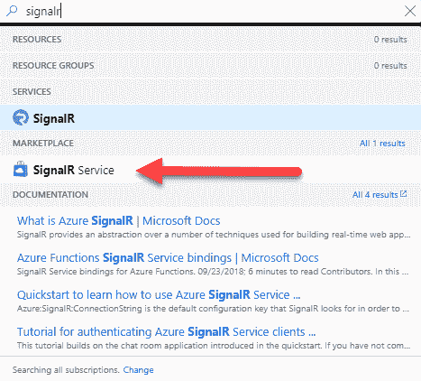

2.  选择此选项后，您将看到信号创建页面:

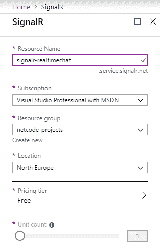

我们在上一章中介绍了这些设置中的大部分；但是，我要指出的是，资源名称与 Azure 中的许多资源一样，是全球唯一的。这意味着，如果在您阅读本章之前我没有删除此资源，您将无法使用相同的资源名称。

One strategy to avoid this is to establish a prefix or suffix to your naming. For example, if your company was called `My Company Name`, for example, you might prefix your resources with `mcn-`. The pricing tier here is free, and it's sufficient for an example project or a POC, but you may wish to explore the paid tier if you intend to use this under significant load.

3.  如果您单击“创建”，资源将在几分钟后创建。部署完成后，请访问密钥部分并复制主连接字符串:

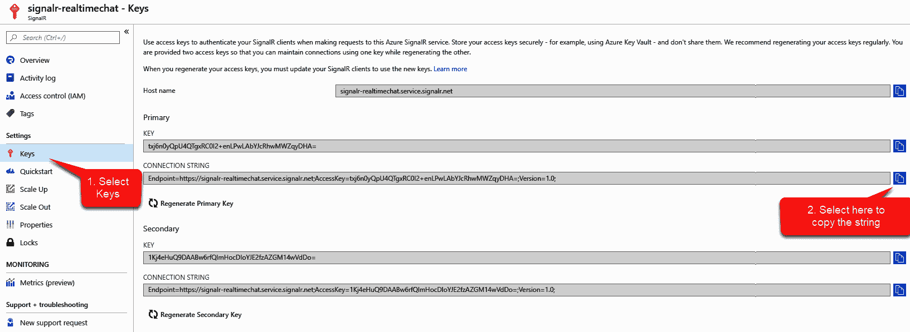

稍后您将需要连接字符串，所以现在将其粘贴到记事本或类似的工具中。让我们继续创建我们的项目。

# 创建项目

对于这个项目，我们需要以下元素:

*   **天蓝色信号器实例**:这将管理信号器消息。
*   **聊天服务器**:这将是我们的服务器端 C#代码，将处理和指导从客户端发送的消息。
*   **聊天客户端**:客户端将由用于向服务器发送消息和从服务器接收消息的 JavaScript 函数以及用于显示的 HTML 元素组成。

我们将从设置 Azure 开始，然后是服务器代码，然后转移到客户端，构建一个简单的引导布局，并从那里调用一些 JavaScript 函数。

另外，我们将包括一种方法，将我们的对话历史存档为文本文件。

# 设置项目

让我们建立这个项目:

1.  打开 Visual Studio 2019，选择新建项目，如下图截图所示:

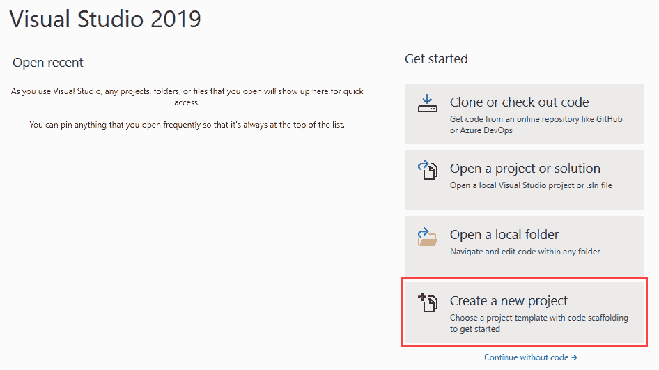

2.  选择 ASP.NET 核心网络应用:

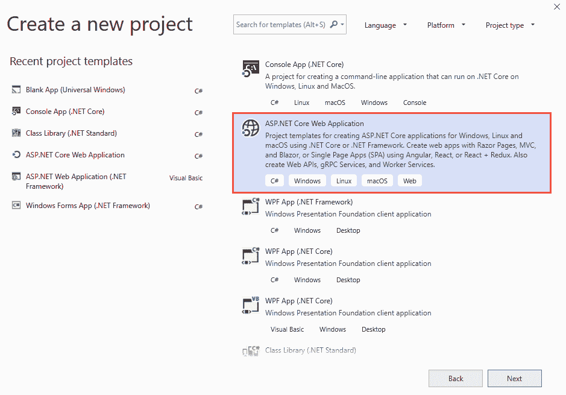

3.  配置项目(即决定名称和位置):

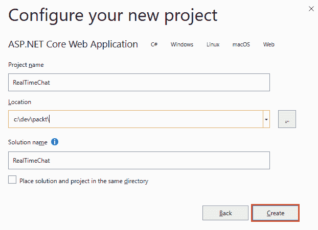

4.  我们将使用一个空的项目模板。请确保从下拉列表中选择 ASP.NET 核心 3.0:

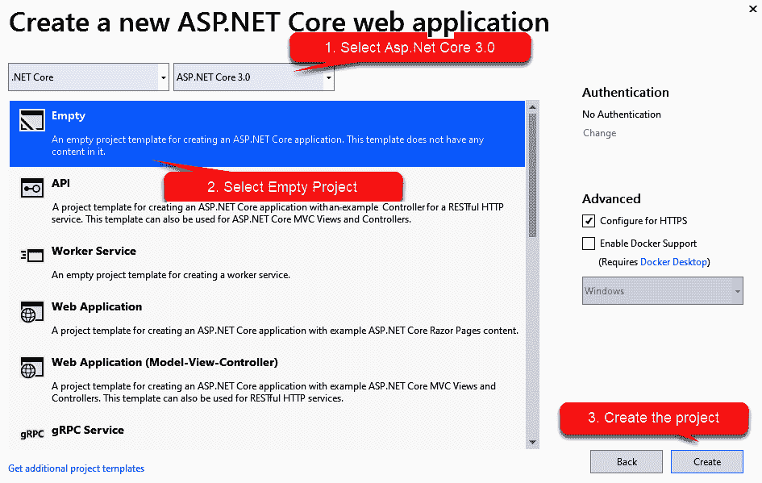

该项目将被创建，如下所示:

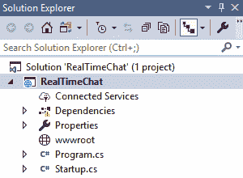

为了使用 SignalR，我们需要添加一些额外的库；我们下一步会这么做。

# 添加信号库

需要安装两组库，客户端和服务器:

1.  让我们从服务器库开始。为此，我们将使用 NuGet。从获取软件包管理器中，选择管理获取软件包:

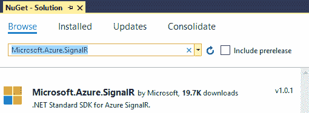

如果您愿意，也可以使用包管理器控制台使用`Install-Package Microsoft.Azure.SignalR`命令进行安装。

2.  对于客户端库，我们将使用`npm`来安装 SignalR 库。

`npm` is a package manager, like NuGet, but for JavaScript. Feel free to check it out at [https://www.npmjs.com](https://www.npmjs.com).

3.  让我们确保我们在最新版本的`npm`上；启动 PowerShell，并在控制台窗口中键入以下内容:

```cs
npm install npm@latest -g
```

这可能需要一段时间，但应该会更新包管理器。

4.  现在，导航到您的项目目录；例如，如果您有一个与我相似的目录结构，您可以键入以下内容:

```cs
cd C:\Dev\packt\RealTimeChat\RealTimeChat
```

5.  现在，输入以下命令，点击*进入*:

```cs
npm init
npm install @aspnet/signalr
```

`npm init`会在你的项目中创建一个名为`package.json`的文件；该文件确定需要哪些文件，并将该文件中指定的任何包下载到项目根目录下的`node_modules`文件夹中。当你初始化节点模块时，你会被问到一系列的问题，对此你可以按*进入*作为回应。

6.  如果`node_modules`目录存在，可以确认下载成功；这不会包含在您的项目中，因此您可能需要选择以显示所有文件:

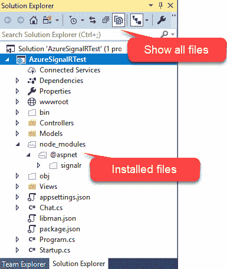

虽然`npm`是一个广泛使用的包管理器，但它确实有一个小问题。NET 应用程序。问题是它将文件下载到`node_modules`目录中(如前一张截图所示)。这并不理想，因为你将无法访问`wwwroot`以外的任何东西。此外，默认情况下，它实际上不包含在您的项目中。

7.  幸运的是，自从 Visual Studio 15.8.0 以来，我们有了一个工具，可以安装和维护这些库。虽然您可以独立于`npm`使用它，但在这里，我们将使用它来将节点模块放入正确的位置。右键单击项目并选择客户端库...：

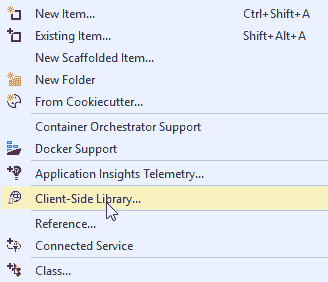

随后显示的对话框如下所示:

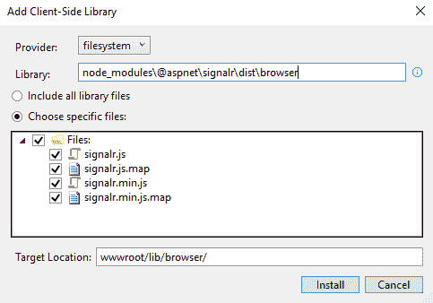

8.  在编写本文时，可以将提供程序设置为三个选项之一:现在，将其设置为文件系统。库应该设置为您的库的来源:在我们的例子中，这是`node_modules`文件夹的目录，也是信号文件所在的位置。

9.  如您所见，这里的额外好处是您可以挑选您需要的文件。单击“安装”后，您将能够看到软件包几乎立即出现在正确的位置。

有了我们的包，我们可以(最终)开始编写一些代码。

# 构建服务器

我们需要为我们的聊天程序建立一个服务器，它将包含我们想要从连接的客户端调用的方法。我们将使用信号中枢应用编程接口，它为连接的客户端提供了与聊天服务器通信所需的方法。

# 信号集线器子类

现在，我们需要创建信号中枢。让我们一步一步地学习如何做到这一点:

1.  向项目中添加一个类来处理聊天的服务器端。我们称之为`Chat`:

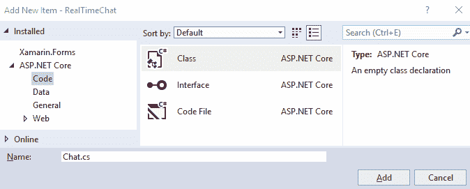

这需要是信号`Hub`类的子类。确保添加`Micosoft.AspNetCore.SignalR`的使用说明。Visual Studio 的快速操作在这方面很有效:


*Ctrl-.* is the keyboard shortcut for this (currently, it's possibly the second most useful one available in Visual Studio).

2.  现在，向类添加一个方法来处理发送消息:

```cs
public Task Send(string sender, string message) => 
    Clients.All.SendAsync("UpdateChat", sender, message);
```

该方法将导致任何连接的客户端在传递发送方和消息参数时调用`UpdateChat`方法。

3.  现在，添加一个方法来处理归档功能:

```cs
public Task ArchiveChat(string archivedBy, string path, string messages)
{
    string fileName = $"ChatArchive_{DateTime.Now.ToString("yyyy_MM_dd_HH_mm")}.txt";
    System.IO.File.WriteAllText($@"{path}\{fileName}", messages);
    return Clients.All.SendAsync("Archived", $"Chat archived by {archivedBy}"); 
}
```

如您所见，该方法只需获取 messages string 参数的值，将其写入名为`ChatArchive_[date].txt`的新文本文件，该文件保存到给定的路径，并调用客户端`Archived`函数。

这一切似乎有点像魔法；事实上，为了让这两个任务真正发挥作用，我们需要做一些更多的脚手架。

# 配置更改

在`Startup.cs`文件中，我们需要向容器中添加信号服务，以及配置 HTTP 请求管道。让我们开始吧:

1.  在`ConfigureServices`方法中，添加以下代码:

```cs
services.AddSignalR().AddAzureSignalR();
```

2.  在`Configure`方法中，添加以下代码:

```cs
app.UseDefaultFiles();
app.UseStaticFiles();
app.UseAzureSignalR(r =>
{
    r.MapHub<Chat>("/chat");
});
```

Note that we have added `app.UseStaticFiles()` to the `Configure` method. Static files are assets that an ASP.NET Core app serves directly to clients. Examples of static files include HTML, CSS, JavaScript, and images.  The call to `app.UseDefaultFiles()` (which must be called prior to `app.UseStaticFiles()`) tells the middleware to search for a predefined list of HTML files, including `index.html`.

我们的服务器完成了。

3.最后，我们需要告诉信号服务如何连接到 Azure 在名为`appsettings.json`的项目中创建新文件:

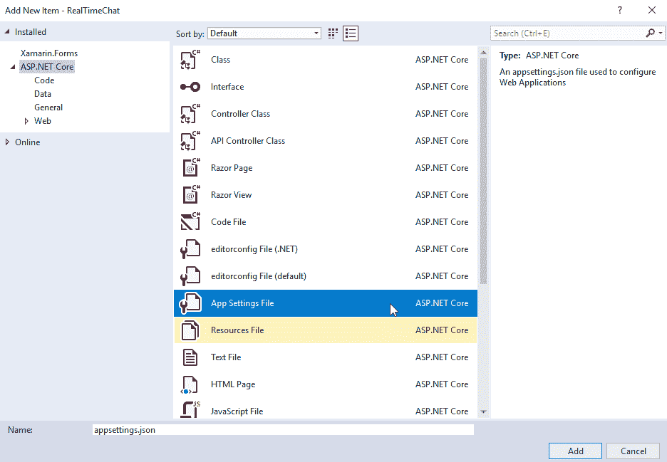

4.  记住我们之前复制的连接字符串；它需要进入这个文件:

```cs
{
  "Azure": {
    "SignalR": {
      "ConnectionString": "Endpoint=https://signalr-realtimechat.service.signalr.net;AccessKey=accesskeyhere;Version=1.0;"
    }
  }
}
```

Make sure that you update the connection string to reflect your connection string.

我们可以(也将)稍后扩展我们服务器的功能，但是现在，让我们转向我们的客户端。

# 创建客户端

正如我们前面提到的，客户端将由用于向服务器发送消息和从服务器接收消息的 JavaScript 函数以及用于显示的 HTML 元素组成。

在`wwwroot`文件夹中添加一个 HTML 页面，称之为`index.html`:

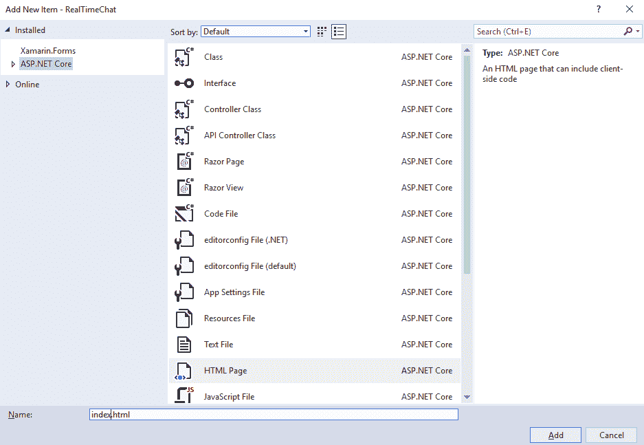

我们将保持客户端页面非常简单。我使用`div`标签作为面板来显示和隐藏页面的不同部分。我也在使用 bootstrap 使它看起来很漂亮，但是你可以用你喜欢的任何方式设计它。我也不会用基础知识来烦你，比如在哪里指定你的页面标题。我们将坚持相关的要素。

我们将创建一个框架页面，并填写函数:

```cs
<!DOCTYPE html>
<html>
<head>
    <title>Realtime Chat</title>
    <link rel="stylesheet" href="https://maxcdn.bootstrapcdn.com/bootstrap/3.3.7/css/bootstrap.min.css">
    <script src="https://ajax.googleapis.com/ajax/libs/jquery/3.2.1/jquery.min.js"></script>
    <script src="https://maxcdn.bootstrapcdn.com/bootstrap/3.3.7/js/bootstrap.min.js"></script>
    <script src="/lib/browser/signalr.min.js"></script>

    <script type="text/javascript">

    </script>

</head>
```

# 包含的库

在我们开始填写功能之前，让我们先了解一下`link`和`script`标签在做什么。他们带来了所需的库:

```cs
<link rel="stylesheet" href="https://maxcdn.bootstrapcdn.com/bootstrap/3.3.7/css/bootstrap.min.css">
<script src="https://ajax.googleapis.com/ajax/libs/jquery/3.2.1/jquery.min.js"></script>
<script src="https://maxcdn.bootstrapcdn.com/bootstrap/3.3.7/js/bootstrap.min.js"></script>
<script src="/lib/browser/signalr.min.js"></script>
```

如果您不想使用 bootstrap 的外观和感觉，您不需要 bootstrap JavaScript 库或 CSS，但是请注意，我们将在脚本中使用 jQuery，所以把它留在。我们还参考了之前添加到的`lib/browser`目录中的信号库。

# JavaScript 函数

以下代码都将进入`<script>`标签。

我们的客户端将需要一些代码来发送和消费来自服务器的消息。我试图让 JavaScript 尽可能简单，为了可读性，我选择了 jQuery 代码:

1.  为我们的信号中枢服务器创建一个变量(我把我的命名为`connection`)，并调用它的`start`函数:

```cs
var connection = new signalR.HubConnectionBuilder()
    .withUrl('/chat')
    .build();

connection.start();
```

`.withUrl`的`'/chat'`参数是指我们的`Chat.cs`类，它继承了 SignalR 的 Hub 接口。

2.  添加`UpdateChat`和`Archived`方法，由服务器调用:

```cs
connection.on('UpdateChat', (user, message) => {
    updateChat(user, message);
});
connection.on('Archived', (message) => {
    updateChat('system', message);
});
```

我们只需将从服务器获得的参数传递给我们的`updateChat`方法。我们将进一步定义该方法。

3.  定义`enterChat`功能:

```cs
function enterChat() {
    $('#user').text($('#username').val());
    sendWelcomeMessage($('#username').val());
    $('#namePanel').hide();
    $('#chatPanel').show();
};
```

我们从用户名输入元素的值中设置我们的`user`标签的文本，将其传递给我们的`sendWelcomeMessage`方法(我们稍后将定义)，并切换相关面板的显示。

4.  定义一个`sendMessage`函数:

```cs
function sendMessage() {
    let message = $('#message').val();
    $('#message').val('');
    let user = $('#user').text();
    connection.invoke('Send', user, message);
};
```

我们从`message`输入元素中设置`message`变量，然后为下一条消息清除它，并从用户标签中设置`user`变量。然后，我们使用`connection.invoke`方法在我们的服务器上调用`Send`方法，并将我们的变量作为参数传递。

5.  定义一个`sendWelcomeMessage`函数:

```cs
function sendWelcomeMessage(user) {
    connection.invoke('Send','system',user+' joined the chat');
};
```

就像我们上一步描述的`sendMessage`函数一样，我们将使用`connection.invoke`函数在我们的服务器上调用`Send`方法。不过这一次，我们传递了`'system'`字符串作为用户参数，并传递了一些关于刚刚加入的用户的信息。

6.  定义一个`updateChatPanel`方法:

```cs
function updateChatPanel(user, message) {
    let chat = '<b>' + user + ':</b> ' + message + '<br/>'
    $('#chat').append(chat);
    if ($('#chat')["0"].innerText.length > 0) {
        $('#historyPanel').show();
        $('#archivePanel').show();
    }
};
```

`updateChat`只是我们用来更新聊天历史面板的自定义功能。我们本可以在两个`connection.on`函数中内联完成，但这意味着我们会重复自己。作为任何编码的一般规则，您应该尽量不重复代码。

在这个函数中，我们将`chat`变量设置为，但是我们希望每个聊天记录行在样式方面看起来都是一样的。在这种情况下，我们简单地用粗体显示我们的用户(用一个冒号)，随后显示未格式化的消息，并在最后显示一个换行符。几行聊天看起来像这样:

```cs
John: Hello people
Sarah: Hi John
server: Peter joined the chat
John: Hi Sarah, Hello Peter
Peter: Hello Everyone
```

我们还需要检查聊天`div` `innerText`属性，以确定聊天历史和存档面板是否应该可见。

定义`archiveChat`功能:

```cs
function archiveChat() {
    let message = $('#chat')["0"].innerText;
    let archivePath = $('#archivePath').val();
    connection.invoke('ArchiveChat', archivePath, message);
};
```

像其他所有事情一样，我尽量保持简单。我们采用聊天面板(`div`)的`innerText`和`archivePath`输入中指定的路径，并将其传递给服务器的`ArchiveChat`方法。

当然，我们这里有一个小的错误窗口:如果用户没有为要保存的文件键入有效的路径，代码将抛出一个异常。我会让你自己的创造力来解决这个问题。我来这里只是为了信号员的功能。

让我们看看`body`部分的轮廓:

```cs
    <body>
        <div class="container col-md-10">
            <h1>Welcome to Signal R <label id="user"></label></h1>
        </div>
        <hr />

    </body> 
</html>
```

下面的代码都将按顺序排在水平线之后。

# 命名部分

让我们先看一下命名部分，然后深入了解一些细节:

```cs
    <div id="namePanel" class="container">
        <div class="row">
            <div class="col-md-2">
                <label for="username" class="form-label">Username:</label>
            </div>
            <div class="col-md-4">
                <input id="username" type="text" class="form-control" />
            </div>
            <div class="col-md-6">
                <button class="btn btn-default"
                        onclick="enterChat()">
                    Enter
                </button>
            </div>
        </div>
    </div>
```

我们需要知道谁是聊天室的参与者。这里，我们添加了一个输入元素来获取用户名，并添加了一个按钮来调用`enterChat`函数:

*   `<input id="username" type="text" class="form-control" />`
*   `<button class="btn btn-default" onclick="enterChat()">Enter</button>`

# 聊天输入

聊天部分允许用户键入消息并查看已键入的内容:

```cs
    <div id="chatPanel" class="container" style="display: none">
        <div class="row">
            <div class="col-md-2">
                <label for="message" class="form-label">
                    Message:
                </label>
            </div>
            <div class="col-md-4">
                <input id="message" type="text" class="form-control" />
            </div>
            <div class="col-md-6">
                <button class="btn btn-info"
                        onclick="sendMessage()">
                    Send
                </button>
            </div>
        </div>
        <div id="historyPanel" style="display:none;">
            <h3>Chat History</h3>
            <div class="row">
                <div class="col-md-12">
                    <div id="chat" class="well well-lg"></div>
                </div>
            </div>
        </div>
    </div>
```

以下元素允许我们的用户键入消息(输入)并将其发布到服务器(事件按钮为`sendMessage`):

*   `<input id="message" type="text" class="form-control" />`
*   `<button class="btn btn-info" onclick="sendMessage()">Send</button>`

我们还有一个名为`<div id="chat" class="well well-lg"></div>`的标签，其标识为`"chat"`。我们用它作为我们对话的容器(聊天记录)。

# 存档功能

最后，我们有归档部分:

```cs
    <div id="archivePanel" class="container" style="display:none;">
        <div class="row">
            <div class="col-md-2">
                <label for="archivePath" class="form-
                 label">Archive Path:</label>
            </div>
            <div class="col-md-4">
                <input id="archivePath" type="text" class="form-control" />
            </div>
            <div class="col-md-6">
                <button class="btn btn-success"
                        onclick="archiveChat()">
                    Archive Chat
                </button>
            </div>
        </div>
    </div>
```

在这里，我们允许我们的用户指定需要保存(输入)归档文件的路径，并将消息发布到服务器(事件按钮为`archiveChat`):

*   `<input id="archivePath" type="text" class="form-control" />`
*   `<button class="btn btn-info" onclick="archiveChat()">Archive Chat</button>`

If you are going to use this application as a base and extend it, I recommend moving the JavaScript code to a separate `.js` file. It is easier to manage and is another good coding standard to follow.

现在我们已经创建了应用程序，让我们构建并测试我们所做的工作。

# 构建和运行项目

我们已经创建了我们的项目，所以让我们构建它。在 Visual Studio 的顶部菜单上，单击“生成”菜单按钮:

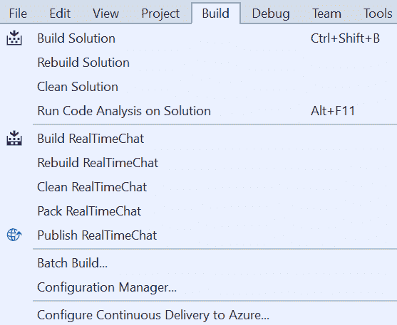

您可以选择构建整个解决方案或单个项目。因为我们的解决方案中只有一个项目，所以我们可以选择任何一个。也可以使用快捷键*Ctrl*+*Shift*+*B、*但是要记住，如果你有多个项目，这只会构建启动项目及其依赖的库。

您应该会在“输出”窗口中看到一些(希望成功的)构建消息:


如果你有任何错误，再看一遍这一章，看看你是否遗漏了什么。

让我们运行该应用程序，并检查它是否符合我们的预期。

# 运行应用程序

运行应用程序非常简单；然而，测试需要一些独创性:

1.  运行该应用，点击 *F5* (或 *Ctrl* + *F5* 开始，无需调试):

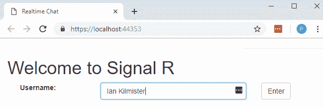

Running the application without debugging can have a significant improvement in terms of performance.

2.  现在，我们可以开始聊天了。输入用户名并点击*输入:*

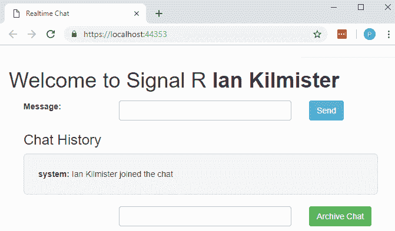

如您所见，我们的姓名面板现已隐藏，我们的聊天和存档面板正在显示。由于我们的`sendWelcomeMessage(user)`功能，我们的服务器也很友好地通知我们加入了聊天。

3.  每次我们发送消息时，我们的聊天记录都会更新:

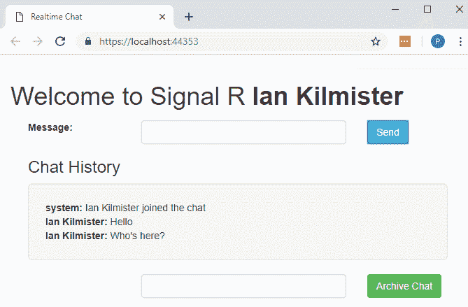

让我们看看如何让更多的参与者参与进来。

# 让派对开始

对话只有在涉及多方的情况下才是对话。所以，让我们开始一个聚会。

如果你在网络上发布应用，你可以用实际的网络客户端来聊天，但我不在网络上(不是那个意义上的)，所以我们需要使用另一个技巧。我们可以使用各种浏览器来代表我们不同的聚会客人(网络客户)。

复制您的应用程序网址(包括端口号)，并将其粘贴到其他几个浏览器窗口中。

对于每个新访客(浏览器)，您需要指定一个用户名。当他们每个人都加入聊天并开始发送消息时，您将看到我们的聊天记录不断增长。

您可以平铺浏览器(或者如果有额外的浏览器，可以将它们移动到其他显示器上)，以查看一个人发送的消息有多少是即时传递给所有人的，这就是 SignalR 的全部意义。

我们从微软边缘的伊恩·基尔米斯开始，所以我们将继续他的工作:

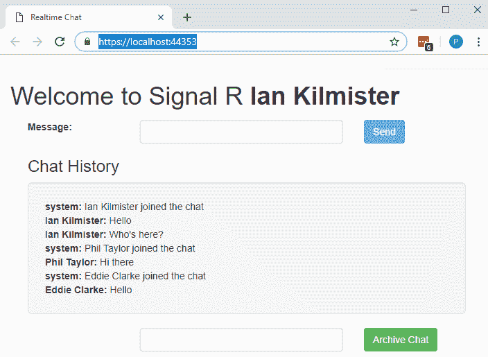

您还会注意到，每位客人的聊天记录只有在他们加入聊天时才会开始。这是设计好的。当客户加入时，我们不会向他们发送历史聊天记录。

# 存档聊天

要将聊天记录保存到文本文件中，请在`archivePath`输入元素中输入有效的本地文件夹路径，然后点击存档聊天按钮:


正如我们前面提到的，我们还没有为我们的路径建立适当的验证，所以请确保您使用有效的路径来测试它。如果成功，您应该会在聊天窗口中看到如下消息:

```cs
system: Chat archived by Ian Kilmister
```

您还会在指定路径中找到新创建的具有`ChatArchive_[date].txt`命名约定的文本文件。

# Azure 服务

在这个阶段，让我们暂停一分钟来检查 Azure 门户。使用门户，我们可以很容易地识别服务实际上正在被使用。当我们一直在输入和测试这个应用程序时，Azure 服务一直在注册活动，我们可以通过快速浏览 SignalR Overview 刀片看到这一点:

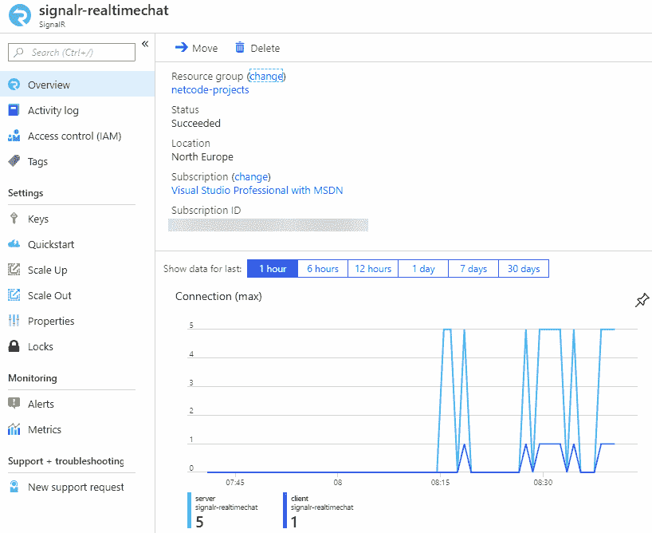

如您所见，我们的活动是通过 Azure 上的 SignalR 服务进行的。现在我们已经构建了应用程序，让我们清理我们使用的资源。

# 清除

既然我们有了可行的解决方案，我们就需要整理一下。就 Azure SignalR 而言，如果你使用的是免费层，那么保持原样应该不会有任何财务影响；然而，随着您开始更多地使用 Azure，您将看到您的仪表板逐渐填满，变得难以管理。

在信号刀片内部，只需选择删除:

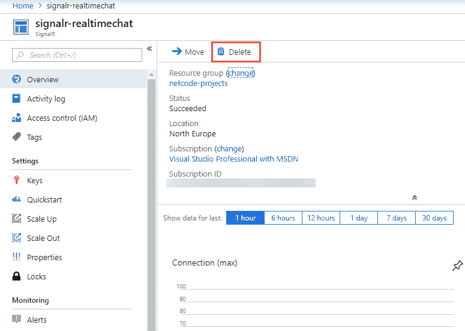

您将被要求确认删除。然后，几秒钟后，您应该会收到通知，告诉您它成功了:

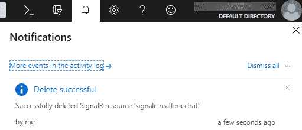

现在，我们已经删除了所有使用的资源，让我们坐下来思考一下我们在本章中讨论的内容。

# 摘要

正如我们在本章中讨论的，SignalR 非常容易实现。我们创建了一个聊天应用程序，但是有许多应用程序可以从实时体验中受益。其中包括股票交易、社交媒体、多人游戏、拍卖、电子商务、财务报告和天气预报。名单可以继续。即使对实时数据的需求不是必需的，SignalR 仍然可以有益于任何应用程序，使节点之间的通信无缝。

浏览 ASP.NET 通信兵([https://github.com/aspnet/SignalR](https://github.com/aspnet/SignalR))的 GitHub 页面，很明显这个库在不断的被加工和改进，这是一个好消息。

随着对快速、相关和准确信息的需求变得越来越重要，SignalR 是一个需要注意的有用工具，特别是因为有了 Azure，您可以简单地将扩展的问题交给微软。

在下一章中，我们将了解使用实体框架核心的数据访问。