# 使用 Windows 服务和 Azure 存储构建照片存储应用程序

自 1997 年我开始第一份工作以来，计算已经经历了一些有趣的变化，自 20 世纪 80 年代初我得到第一台计算机(Spectrum ZX81)以来，变化更大。在光谱上，如果你想保存一些信息，你可以把它录在磁带上；一个典型的游戏大约需要 5 到 10 分钟才能从磁带中载入。当然，在当时，更复杂的计算机正在使用，但大部分繁重的存储实际上仍然是在磁带上完成的。甚至在我买了第一台电脑后，我还记得为它买了一个磁带机，这样我就可以存储高达 10 亿字节的信息(10 亿字节的信息在当时是一个很大的数据量)。

如今，你的手机存储空间远不止这些，仍然不够:你去度假，也许拍 100 张照片；带着两个 24 小时曝光胶片去度假的日子已经一去不复返了。当然，过了一段时间，你会意识到这成百上千张你吃早餐的高分辨率照片正在填满你的手机。

一些手机制造商每月提供不到 1 的额外存储容量。考虑到这为您的所有图像提供了备份，这似乎并不多；然而，如果您自己将图像放入云中，这可能比您支付的费用还要多。

这正是我们在本章中打算做的，我们将编写一个 Windows Service 来监视您计算机上的一个目录，将其中的任何内容上传到 Azure Cloud，然后在超过一定年限时将其从源目录中删除。这样，您可以将最新的照片随身携带，并将其余的存档。

本章将涵盖以下主题:

*   使用创建窗口服务。净核心 3
*   安装和使用 Windows 兼容包
*   将文件上传到 Azure Blob 存储

# 技术要求

Azure 存储资源管理器可以在这里找到:[https://Azure . Microsoft . com/en-GB/features/Storage-Explorer/](https://azure.microsoft.com/en-gb/features/storage-explorer/)。这是微软维护的一个开源软件；它的 GitHub 存储库可以在这里找到:[https://github.com/Microsoft/AzureStorageExplorer](https://github.com/Microsoft/AzureStorageExplorer)。

This isn't a necessity, but it would greatly help with the development and testing stages.

# Windows 服务和 Windows 兼容性包

在这个项目中，我们将使用 Windows 兼容性包来创建一个 Windows 服务。我们稍后会讨论为什么，但是在这一部分，我想快速讨论一下这些东西是什么。

# Windows 服务

大多数操作系统都有相当于 Windows 服务的功能。本质上，这是一个一直运行的应用程序，并在后台做一些事情。如果您快速浏览一下当前在您的机器上运行的服务，您会发现有很多，而且它们是多种多样的；为此，在 Windows 10 中，只需按下开始按钮并键入`Services`。然后，选择最匹配的。应向您提交以下申请:

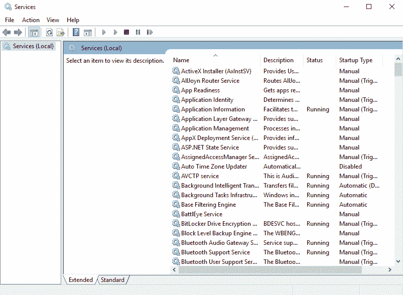

很有可能你会有一套不同的服务，但原则是一样的。这些应用程序都是在后台运行并做一些事情。这些被标记为正在运行的服务中的每一个都在消耗您的计算机资源，因此，当您安装服务时，您应该考虑是否需要它一直运行(否则，只需禁用它)。

Disabling some Windows Services can cause your machine to behave differently, or even stop some functionality, so be careful if you intend to disable services that were installed when you arrived.

如果我们正在编写一个服务，这种情况会重复两次:如果是你的应用程序降低了机器的速度，人们会很快注意到，所以性能是一个重要的考虑因素。

# Windows 兼容包

背后的历史。NET Core 是一个有趣的东西，在你合上这本书，拿起斯蒂芬·金的东西之前，我不会在这里详细介绍它(必须快速了解它！).然而，我想简单谈谈微软选择创建的原因(至少是原因之一)。NET Core。

那个。NET Framework 从 2002 年就出现了，现在您仍然可以运行当时编写的应用程序。在撰写本文时，这意味着。NET Framework 需要支持近 20 年的假设和代码，基于当时的技术版图*。*

 *正因为如此，微软发现自己陷入了一个无法改变任何基本情况的境地，因为他们不能冒险破坏成千上万甚至数百万的应用程序，这些应用程序没有被触及，但仍在运行。因此，唯一的解决方案是创建一个不依赖于原始框架的全新框架:进入。NET Core。但是，您为此付出的代价是新框架不支持原始框架的所有功能。

讽刺的是，一个这样的例子是特定于窗口的功能(包括创建一个窗口服务)。然而，在 2017 年，微软发布了视窗兼容性包:一个 NuGet 包，提供了对你需要的大多数视窗功能的访问。

# 项目概述

本质上，我们的项目将围绕一个监视机器硬盘上给定文件夹的窗口服务展开。一旦检测到文件，我们将读取一些属性，如大小、日期和名称，并在 Azure 云中进行快速搜索；如果不存在，我们就上传。一旦我们确定它安全地在云中，我们将检查日期，超过一定年龄的任何东西都将从硬盘中删除。

# 配置 Azure 存储

设置 Azure 存储帐户是一个相当简单的过程；您需要首先登录 Azure。如果你没有账号，那么你可以在这里创建一个:[https://azure.microsoft.com/](https://azure.microsoft.com/)。注册后，请访问[https://portal.azure.com](https://portal.azure.com)。

大多数云提供商都有存储模型，使用替代提供商并不难；但是，您需要更改一些与 Azure 接口的代码。

从 Azure 门户中选择存储刀片开始:


或者，你可以搜索`Storage`。刀片出现后，选择添加并填写新帐户的详细信息:

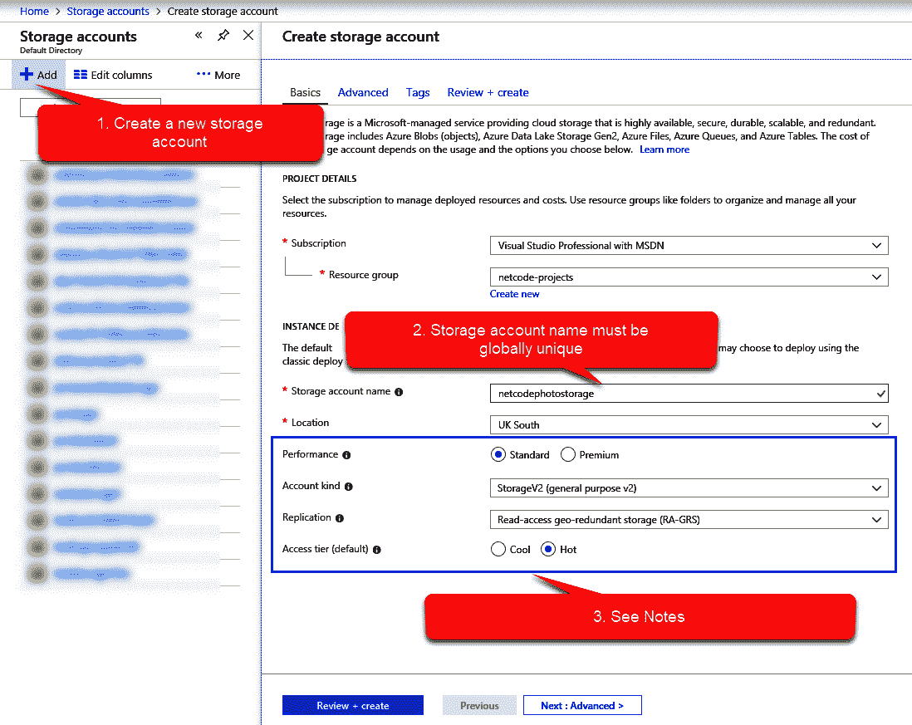

如果你已经看完了这本书的其余部分，你会熟悉这个屏幕的大部分；但是，前面标记为 3 的部分。请参见注释，表示存储帐户中直接影响数据成本、性能和安全性的部分。本质上，如果你想快速访问数据，你会付出更多；如果您希望数据安全(在其他地区备份)，那么您将支付更多费用。

关于这些选项的具体细节我就不赘述了(主要是因为当你读到这里的时候，它们可能已经不一样了)。但是，这里有两个概念在所有云平台上都使用:

*   冷热储存
*   存储冗余

先说前者。

# 冷热储存

通常，云提供商提供存储的概念，这是针对读取进行优化或针对写入进行优化的。虽然我们在这里将我们的储物模式设置为*热*，但可能这个特定的模式更适合*冷*储物；也就是说，读写数据的成本更高，但实际存储的成本更低。 *Hot* 存储则相反:存储成本更高，但获取信息的成本更低。

一些云提供商(包括微软)提供了一个类似于 cold 的层，但对存储进行了更优化:这是一种您可能用于备份的存储类型，或者您认为根本不需要检索的文件。

对于像我们这样的应用程序，您可能会发现在开发和测试阶段使用 hot 并在实时系统中使用它时替换一个冷存储帐户是很有用的。

最后，关于溢价的一个注意事项:微软为此提供固态硬盘，这意味着你的访问速度提高了；然而，这比其他两种选择都要贵。

# 存储冗余

值得时刻记住的是，云只是另一种说法*别人的电脑*；在我们的例子中，这可以理解为*微软的电脑*。显然，在 Azure 中存储您的数据比将其存储在隔壁邻居的计算机上更安全，但许多概念是相同的；这包括你的邻居可能发生入室盗窃、洪水或火灾的事实。

微软面临着同样的风险，他们试图通过比你的邻居可能拥有的更多的安全性、消防安全性和防水性来减轻这些风险。然而，仍然有可能拥有你的数据的机器化为乌有。

不同的供应商对这个概念有稍微不同的版本，但它们本质上都提供了相同的东西:将数据复制到其他地方的能力。开箱即用，您通常会将数据写入多个物理机，因此单台机器出现故障不会丢失您的数据。

下一级通常是您的数据被复制到物理建筑物之外，甚至是建筑物的集合。最后一层是数据在区域外复制(通常在不同的国家)。

正如我之前提到的，不同的云提供商给这些概念起了不同的名字，他们改变了术语；然而，这大致可以归结为您丢失数据必须发生的情况，即多台机器故障、全国性灾难或世界性灾难。值得注意的是，虽然云提供商会给你一定比例的耐用性，但没有一家会达到 100%；也就是说，他们不会保证你的数据安全。他们只会说它不太可能丢失。

# 存储帐户

回到我们的存储帐户，我们有四个存储概念:Blobs、文件、表和队列。为了这个项目的目的，我们将使用 Blobs。

In brief: files provide replication of local storage for legacy applications, tables provide a simple key-value pair data storage mechanism, and queues provide basic message queue functionality. Full details on these other types fall outside the scope of this chapter.

在我们的存储区域内，我们需要创建一个容器。在博客中，选择创建一个容器:


The access level relates to how you can access the container. Setting anonymous access means that you're pretty much granting access to anyone that knows where your container is.

下一件我们需要的东西(嗯，不完全需要，但它确实有助于测试)是 Azure 存储资源管理器。如果您已经安装了它，请立即启动它:

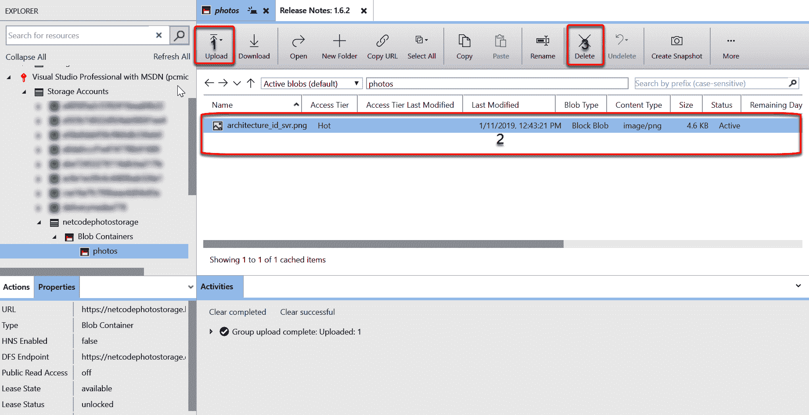

如您所见，在这个实用程序中，您可以将文件上传到容器(1)，查看其内容(2)，然后再次删除它(3)。

该工具还允许您管理文件，但目前，我们将只使用这三个功能。

If you have chosen to not install this tool, you can still follow along with this chapter; however, determining whether your project is working correctly or not will not be easy. Having said that, by the end of this project, you should have sufficient knowledge to write a small utility that will list the contents of the container.

一旦您使用了该工具，我们就可以继续前进并创建我们的窗口服务。

# 创建我们的窗口服务

要创建 Windows 服务，让我们从一个新的开始。NET Core 3 控制台应用程序:

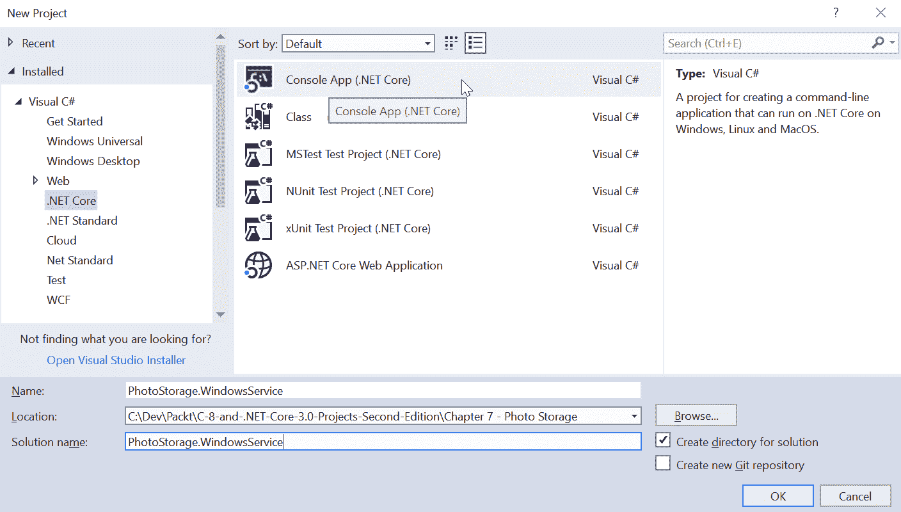

You may wish to separate parts of this application into their own class libraries if you choose to extend this application. Clearly, the functionality that we're using is not restricted to a console application. If the functionality was in its own class, you could simply call it from a desktop application.

下一步是安装 Windows 兼容性号码包:

```cs
Install-Package Microsoft.Windows.Compatibility
```

这将允许我们创建一个窗口服务。

It's worth noting at this stage that, despite being .NET Core, this application will not be cross-platform; in fact, any application using the Windows Compatibility Pack will not be.

既然我们已经安装了这个，我们就可以创建服务了。我们需要一个类似这样的类:

```cs
public class PhotoService : ServiceBase
{
}
```

你应该可以使用 *Ctrl +。* `ServiceBase`因为它是兼容性包的一部分。我们需要覆盖这里的一些功能(即`OnStart`和`OnStop`):

```cs
public class PhotoService : ServiceBase
{
    protected override void OnStart(string[] args)
    {
        base.OnStart(args);
    }

    protected override void OnStop()
    {
        base.OnStop();
    }
}
```

我们还需要告诉控制台应用程序运行该服务。在这里，我们可以使用 C# 8 的另一个特性——隐式范围的 using 语句。本质上，现在可以简单地声明一次性对象，而不是在 use 语句中显式包装它，并且当对象超出范围时将被处置:

```cs
class Program
{
    static void Main(string[] args)
    { 
        using var service = new PhotoService();
        ServiceBase.Run(service);         
    }
}
```

这就是我们的基本服务。你们中精明的人可能已经注意到，它实际上还没有做任何事情，但就目前的情况来看，这是一项合法的服务。

该服务本质上需要做三件事:扫描硬盘上的文件夹以查找新文件，将文件上传到 Azure 上的容器，以及扫描 Azure 容器。让我们从一个有用的小类开始，它为我们监视文件系统:`FileSystemWatcher`。此功能现在可用于。NET Core 通过神奇的兼容性包。将所有这些代码放入一个单独的类中是有意义的，所以让我们在服务中创建和销毁这个类。然后，我们可以看到稍后该类可能会是什么样子:

```cs
public class PhotoService : ServiceBase
{
    private FileMonitor _fileMonitor;

    protected override void OnStart(string[] args)
    {
        _fileMonitor = new FileMonitor("c:\tmp");
    }

    protected override void OnStop()
    {
        _fileMonitor.Dispose();
    }
}
```

I'll be using the `c:\tmp` path a lot in this chapter. It's just a directory that I typically use for testing such things. If you don't want to use this, then you can use any path that you choose (although I recommend that you make it short). We will make this configurable later on.

只需使用快捷键 *Ctrl +。*在未定义的新类上，`FileMonitor`，它将为你创建类存根。让我们看看它需要什么样的外观:

```cs
public class FileMonitor : IDisposable
{ 
    private FileSystemWatcher _fileSystemWatcher;

    public FileMonitor(string path)
    {
        _fileSystemWatcher = new FileSystemWatcher(path);
        _fileSystemWatcher.Filter = "*.*";
        _fileSystemWatcher.EnableRaisingEvents = true;

        _fileSystemWatcher.Changed += new FileSystemEventHandler(OnChanged);
        _fileSystemWatcher.Created += new FileSystemEventHandler(OnCreated); 
        _fileSystemWatcher.Renamed += new RenamedEventHandler(OnRenamed);
    }

    private void OnRenamed(object sender, RenamedEventArgs e)
    {
        throw new NotImplementedException();
    }

    private void OnCreated(object sender, FileSystemEventArgs e)
    {
        throw new NotImplementedException();
    }

    private void OnChanged(object sender, FileSystemEventArgs e)
    {
        throw new NotImplementedException();
    }

    public void Dispose()
    {
        _fileSystemWatcher.Dispose();
    }
}
```

如你所见，这里没有太多内容:`FileSystemWatcher`类本身可能在任何严肃的细节上都超出了本章的范围，但本质上，你把它指向一条路径，告诉它在那里发生任何事情时让你知道；然后，你得到一个事件。`Filter`和`EnableRaisingEvents`需要设置，这样类就知道要注意什么，发现什么要做什么。我们已经实现了`IDisposable`模式，这样当服务停止时，我们就可以处理掉`FileSystemWatcher`。

The `IDisposable` pattern tends not to be implemented as much these days. Essentially, it gives you a chance to tidy up your resources. If you're doing anything that requires file access or database access, then you really should consider using it. The `Using` statement gives you a very nice way to have the system automatically dispose of your object for you, even when an error occurs.

# 测试类

在这里使用控制台应用程序的优势之一是我们可以简单地运行项目。

有无数种方法可以做到这一点，但是前面的代码将只是无限循环地实例化`FileMonitor`类。如果你在`c:\tmp`中创建一个文件，你应该会看到程序与`NotImplementedException`一起崩溃。这证明了我们`FileMonitor`班到目前为止还算管用。

下一步是告诉全班做什么。在这种情况下，我们将使用一个新的依赖类`AzureStorageClientService`。这将提供 Azure 存储界面功能。然而，在我们开始写它之前，让我们使用它。首先创建一个银行界面(你可以选择把它放在一个名为`AzureClient`的目录中，就像我一样):

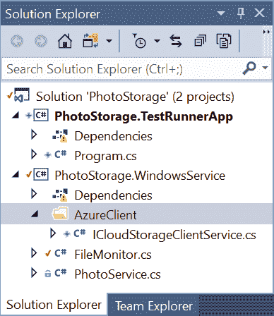

The astute among you may notice that I haven't called the interface `IAzureStorageClientService`, but `ICloudStorageClientService`. The reason for this is that, in addition to enabling testing, having a dependency injection such as this allows you to easily switch out one piece of functionality for another. For example, say you decided you wanted to use Google Cloud Platform instead of Azure—you could simply create `GoogleCloudStorageClient` that implemented the same interface and inject that instead.

让我们通过在类的顶部声明一个变量来使用我们的接口:

```cs
public class FileMonitor : IDisposable
{ 
    private FileSystemWatcher _fileSystemWatcher;
    private ICloudStorageClientService _cloudStorageClientService;

    public FileMonitor(string path, ICloudStorageClientService cloudStorageClientService)
    {
        _cloudStorageClientService = cloudStorageClientService;

        _fileSystemWatcher = new FileSystemWatcher(path);
        _fileSystemWatcher.Filter = "*.*";
        _fileSystemWatcher.EnableRaisingEvents = true;

        _fileSystemWatcher.Changed += new FileSystemEventHandler(OnChanged);
        _fileSystemWatcher.Created += new FileSystemEventHandler(OnCreated); 
        _fileSystemWatcher.Renamed += new RenamedEventHandler(OnRenamed);
    }

```

如您所见，我们使用构造函数将它注入到我们的类中。我们将在课堂上更深入地使用它:

```cs
private async void OnRenamed(object sender, RenamedEventArgs e)
{
    if (_cloudStorageClientService.FileExists(e.Name))
    {
        await _cloudStorageClientService.RenameFile(e.Name, e.OldName);
    }
    else
    {
        await _cloudStorageClientService.UploadFile(e.FullPath);
    }
}

private async void OnCreated(object sender, FileSystemEventArgs e)
{
    await _cloudStorageClientService.UploadFile(e.FullPath);
}

private async void OnChanged(object sender, FileSystemEventArgs e)
{
    await _cloudStorageClientService.UploadFile(e.FullPath);
}
```

如果你愿意，你可以使用 *Ctrl +。*创建接口定义；但是，这些方法确实需要异步。接口的最终定义如下:

```cs
public interface ICloudStorageClientService
{
    Task RenameFile(string name, string oldName);
    Task UploadFile(string fullPath);
    Task<bool> FileExists(string name);
}
```

最后，我们需要实现服务。

# 使用 Azure 存储客户端

我们将从上传一个文件到 Azure Storage 开始。第一步是下载客户端访问 Azure 存储的 NuGet 包:

```cs
Install-Package WindowsAzure.Storage
```

然后，我们可以创建上传文件的方法:

```cs
public async Task UploadFile(string fullPath)
{
    string fileName = Path.GetFileName(fullPath);
    var blob = GetBlockBlobReference(fileName);

    using (var fileStream = System.IO.File.OpenRead(fullPath))
    {
        await blob.UploadFromStreamAsync(fileStream);
    }
}
```

前面的代码基本上是获取对 Azure 中文件的引用(即使它不存在)并上传流。我们大概应该看一下辅助方法，也就是`GetBlockBlobReference`:

```cs
private CloudBlockBlob GetBlockBlobReference(string fileName)
{
    if (CloudStorageAccount.TryParse(_connectionString, out CloudStorageAccount storageAccount))
    {
        var client = storageAccount.CreateCloudBlobClient();
        var container = client.GetContainerReference("photos");
        var blob = container.GetBlockBlobReference(fileName);
        return blob;
    }
    else
    {
        throw new Exception("Unable to parse the storage account");
    }
}
```

这个助手方法确实有相当多的代码，所以让我们打开它，看看我们实际在做什么。暂时不要质疑`_connectionString`来自哪里——我们很快会回到这个问题。我们正在做的第一件事是在`CloudStorageAccount`类上使用静态方法，这有助于我们基于连接字符串创建`CloudStorageAccount`的新实例。

Should you wish to extend this, you might consider an alternative to throwing an exception where the connection string is not valid.

然后，我们依次根据容器的名称获取存储帐户中的容器；然后，我们根据 Blob 的名称(也就是我们的文件名)获得对它的引用。值得注意的是，为了返回一个 Blob 对象，Blob 不需要实际存在。

**Blob** is an abbreviation of **Binary Large OBject**. Essentially, in this context, this represents anything that can be stored on a computer in a single file.

在我们可以测试这个之前，我们需要回到`_connectionString`，我让你暂时暂停提问直到现在。

# 配置我们的服务以访问 Azure 存储

本质上，这需要表示到存储帐户的连接字符串。您可以在 Azure 门户的访问键下轻松找到正确的值:

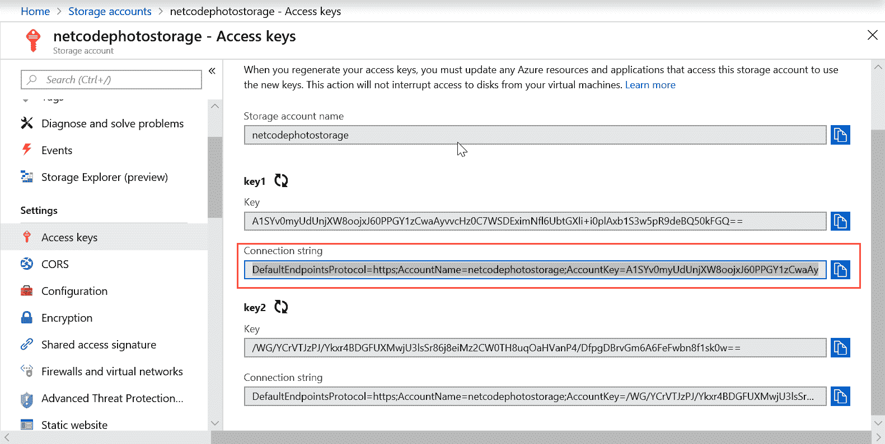

我们可以简单地复制这个并通过给它分配`_connectionString`变量直接粘贴到代码中。然而，相反，我们将使用`ConfigurationBuilder`。在我们开始之前，我们需要一些 NuGet 包:

```cs
Install-Package Microsoft.Extensions.Configuration -ProjectName PhotoStorage.WindowsService

Install-Package Microsoft.Extensions.Configuration.Json -ProjectName PhotoStorage.WindowsService
```

这应该允许我们使用 JSON 文件构建配置，所以下一步是创建一个。我们将在项目中添加一个名为`appsettings.json`的文件:

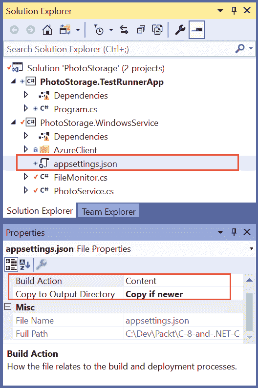

如您所见，我们不仅创建了新文件，还设置了构建操作和复制到输出目录，以便文件在运行时复制到应用程序的主目录。

让我们看看文件本身是什么样子的:

```cs
{
    "ConnectionStrings": {
        "netcodephotostorage": "DefaultEndpointsProtocol=https;AccountName=netcodephotostorage;AccountKey=A1SYv0myUdUnjXW8oojxJ60PPGY1zCwaAyvvcHz0C7WSDEximNfl6UbtGXli+i0plAxb1S3w5pR9deBQ50kFGQ==;EndpointSuffix=core.windows.net"
    }
}
```

I've left my connection string here to illustrate what the string would look like; obviously, by the time this book is published, the storage account will not exist anymore, so please replace this with your own connection string; otherwise, it will not connect. In truth, you can structure this file differently if you so wish; by looking at `ConfigurationBuilder`, you'll see that, providing it's in a key-value pair structure, it makes little difference.

现在，让我们看看如何提取该配置。在`AzureStorageClientService`中，我们将创建一个构造函数:

```cs
private string _connectionString;

public AzureStorageClientService()
{
    var builder = new ConfigurationBuilder()
        .SetBasePath(Directory.GetCurrentDirectory())
        .AddJsonFile("appsettings.json");

    var configuration = builder.Build();
    _connectionString = configuration["ConnectionStrings:netcodephotostorage"];
}
```

我们在这里所做的就是使用`ConfigurationBuilder`来加载和解析我们刚刚创建的 JSON 文件。一旦完成，我们可以使用结果`configuration`属性来提取键值对。

现在，如果我们运行控制台应用程序，我们应该能够看到文件已经上传到 Azure 云存储:

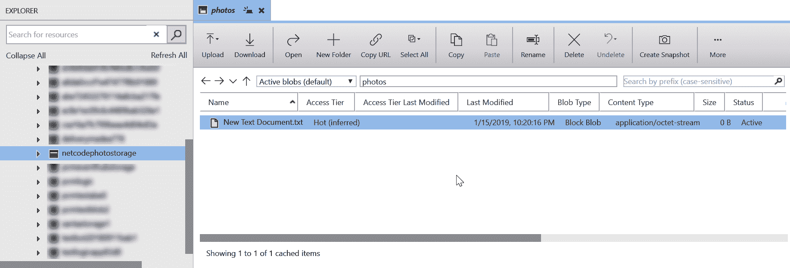

我们可以看到存储客户端代码现在可以工作了。还有几个方法需要填写，所以接下来让我们这样做。

# 完成云存储客户端

我们先从一个简单的方法开始，即`FileExists`:

```cs
public async Task<bool> FileExists(string name)
{
    var blob = GetBlockBlobReference(name);

    return await blob.ExistsAsync(); 
}
```

我们正在重用`Upload`函数中的同一个助手方法，但是，这一次，我们只是调用一个内置方法`ExistsAsync`，来确定文件是否在那里。

最后，我们有`RenameFile`方法:

```cs
public async Task<bool> RenameFile(string name, string oldName)
{
    var blobNew = GetBlockBlobReference(name);
    var blobOld = GetBlockBlobReference(oldName);

    if (await blobNew.ExistsAsync()) return false;

    await blobNew.StartCopyAsync(blobOld);
    await blobOld.DeleteAsync();

    return true;
}
```

由于没有内置的方法来重命名文件，我们只是复制内容并删除原始文件。显然，如果新名称已经存在，任务就会失败。

# 进一步配置

我们的下一个任务是将我们唯一剩下的硬编码变量移入`appsettings.json`文件。让我们快速查看一下配置文件中的内容:

```cs
{
    "ConnectionStrings": {
        "netcodephotostorage": "DefaultEndpointsProtocol=https;AccountName=netcodephotostorage;AccountKey=A1SYv0myUdUnjXW8oojxJ60PPGY1zCwaAyvvcHz0C7WSDEximNfl6UbtGXli+i0plAxb1S3w5pR9deBQ50kFGQ==;EndpointSuffix=core.windows.net"
    },
    "MonitorPath": "c:\\tmp"
}
```

好吧，我们的下一步就是利用它。有许多方法可以实现这一点；我们可以根据需要读取每个配置值，或者，就像我们在这里将要做的那样，我们可以在开始时读取所有的配置并传递这些值。让我们创建一个新的类来保存这些值。我已经将我的添加到一个名为`Models`的新文件夹中:

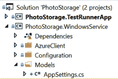

这里的想法是，我们有一个单独的类来保存应用程序的所有配置；因此，我们可以简单地将它传递给需要该配置的任何其他类。类本身的代码如下所示:

```cs
public class AppSettings
{
    public string ConnectionString { get; set; }
    public string MonitorPath { get; set; }
}
```

我们的下一步是添加一些代码来读取这个配置。为了实现这一目标，我创建了一项新服务:

```cs
public class ConfigurationService
{
    public AppSettings Load()
    {
        var builder = new ConfigurationBuilder()
            .SetBasePath(Directory.GetCurrentDirectory())
            .AddJsonFile("appsettings.json");

        var appSettings = new AppSettings();
        var configuration = builder.Build();

        appSettings.ConnectionString = configuration["ConnectionStrings:netcodephotostorage"];
        appSettings.MonitorPath = configuration["MonitorPath"];

        return appSettings;
    }
}
```

因为我们已经创建了一个服务来加载配置设置，所以我们可以将其传递到`AzureStorageClientService`。下面是该文件的修改后的构造函数和类变量:

```cs
private readonly AppSettings _appSettings;
public AzureStorageClientService(AppSettings appSettings)
{
    _appSettings = appSettings;
}
```

我想你会同意，现在我们没有在服务中加载配置，这看起来干净多了；`GetBlockBlobReference`也需要这样更新:

```cs
private CloudBlockBlob GetBlockBlobReference(string fileName)
{
    if (CloudStorageAccount.TryParse(_appSettings.ConnectionString, out CloudStorageAccount storageAccount))
    {
        var client = storageAccount.CreateCloudBlobClient();
        var container = client.GetContainerReference("photos");
        var blob = container.GetBlockBlobReference(fileName);

        return blob;
    }
    else
    {
        throw new Exception("Unable to parse the storage account");
    }
}
```

我们的`PhotoService.cs`类需要在启动时实例化这个新的配置服务:

```cs
private FileMonitor _fileMonitor;
private AppSettings _appSettings;

protected override void OnStart(string[] args)
{
    var configurationService = new ConfigurationService();
    _appSettings = configurationService.Load();

    var cloudStorageClientService = new AzureStorageClientService(_appSettings);
    _fileMonitor = new FileMonitor(_appSettings.MonitorPath, cloudStorageClientService);
}
```

最后，如果您创建了一个控制台应用程序进行测试，您也需要更新它(在`Program.cs`中):

```cs
static void TestFileMonitorNewFile()
{
    var configurationService = new ConfigurationService();
    var appSettings = configurationService.Load();

    var cloudStorageClientService = new AzureStorageClientService(appSettings);

    using var fileMonitor = new FileMonitor(appSettings.MonitorPath, cloudStorageClientService);

    for (; ; ) { }
}
```

说完了，我们就完了。现在，应用程序应该从`appsettings.json`文件中读取配置，如果我们创建一个文件或将它放入`c:\tmp`文件夹，我们应该看到它被上传到云中。变更时，上传变更后的版本；然而，我们缺少三个关键的功能。

接下来我们需要添加的是日志记录。不幸的是，Windows 服务或者任何类型的服务都很难调试。

其次，如果我们运行我们的应用程序，并且目标目标是空的，那么所有放入该目录的文件都将被转移到云上；然而，如果我们把它指向一个已经充满照片的目录，会怎么样呢？最后，就目前的情况来看，我们正在备份所有文件，而我们只对图像格式感兴趣。

让我们解决这三个剩余的功能。

# 记录

最终，日志记录只是将信息写入持久存储，这意味着您可以登录到数据库或文件。您甚至可以登录到屏幕，尽管您会遇到持久性可能不够的问题。在我们的例子中，我们将把文本输出到一个文件中。让我们看看日志代码:

```cs
public class FileLogger : ILogger
{
    private readonly string _loggingPath;

    public FileLogger(string loggingPath)
    {
        _loggingPath = loggingPath;
    }

    public void Log(string message)
    {
        File.AppendAllText($@"{_loggingPath}\PhotoStorage.Log.txt", $"{DateTime.Now} : {message}{Environment.NewLine}");
    }
}
```

在这里，我们实现了一个`ILogger`接口，我们很快就会用到它。这个类没有太大的复杂性——我们只是接受一个路径，然后输出到路径中的一个文件。让我们看看界面是什么样子的:

```cs
public interface ILogger
{
    void Log(string message);
}
```

同样，除了它的存在之外，可能没有太多可以解释的。日志记录是您肯定希望能够切换到单元测试的特性之一，因此接口至关重要。我不会详细描述我正在记录的每个地方，但是让我们看看`PhotoService`构造函数:

```cs
private readonly string _path;
private readonly ILogger _logger;
private FileMonitor _fileMonitor;
private AppSettings _appSettings;

public PhotoService(string path, ILogger logger)
{
    ServiceName = "PhotoService";
    AutoLog = true;
    _path = path;
    _logger = logger;
}
```

如你所见，我们正在传入记录器；因此，我们在`Main`方法中实例化它:

```cs
static void Main(string[] args)
{
    var path = args[0];
    var logger = new FileLogger(path);

    using var service = new PhotoService(path, logger); 
    ServiceBase.Run(service); 
}
```

这有一点重复:现在，我们接受参数并将其存储在`path`变量中。

现在，我们有能力记录；如果你想看几条日志消息，试着在`OnStart`和`OnStop`各放一条。

Although I'm not going to list all the logging places, you're free to download the GitHub repository for this book and have a look. Should you encounter any issues when following along, this logging capability will be invaluable; however, there is a section later on *Testing and debugging* if you want to find out more.

# 仅上传图像

为了确定我们是否有图像，我们将在处理任何文件之前简单地添加一个检查。下面是我们修改后的`OnCreated`和`OnChanged`的方法:

```cs
private async void OnCreated(object sender, FileSystemEventArgs e)
{
    if (!FileHelper.IsImage(e.Name)) return;
    await _cloudStorageClientService.UploadFile(e.FullPath);
}

private async void OnChanged(object sender, FileSystemEventArgs e)
{
    if (!FileHelper.IsImage(e.Name)) return;
    await _cloudStorageClientService.UploadFile(e.FullPath);
}
```

如您所见，我们只有一个非常基本的门控检查，返回我们是否在处理图像。当然，我们需要编写这个方法。在这里，我们来到了一个新的 C# 8 特性，我们还没有提到。在 C# 8 之前，该方法可能是这样的:

```cs
public static bool IsImage(string fileName)
{
    string ext = Path.GetExtension(fileName);
    switch (ext)
    {
        case "png":
        case "jpg":
        case "jpeg":
        case "bmp":
        case "gif":
            return true;
        default: return false;
     };
 }
```

但是，有了新的`switch`语句，我们可以这样编写该方法:

```cs
public static bool IsImage(string fileName)
{
    string ext = Path.GetExtension(fileName);
    return ext switch
    {
        "png" => true,
        "jpg" => true,
        "jpeg" => true,
        "bmp" => true,
        "gif" => true, 
        _ => false
    }; 
}
```

如果我们在`switch`语句本身中包含一个`GetExtension`调用，我们可以使它更加简洁，但是，一般来说，它读起来更容易。

The new `switch` statement is actually more powerful than this and, in fact, supports pattern matching.

让我们看看如何在启动时上传我们在目录中找到的任何图像。

# 上传现有图像

一旦启动，我们的应用程序将监控目录中创建或更改的任何新文件，但是如果我们启动应用程序并将其指向一个已经满了的目录呢？我们可以更改我们的`OnStart`代码，以便它调用一个将为我们扫描目录的方法。据推测，我们需要传递信息，告诉它可以扫描哪里，一旦发现什么，该怎么办:

```cs
protected override void OnStart(string[] args)
{
    var configurationService = new ConfigurationService();
    _appSettings = configurationService.Load(_path);

    var cloudStorageClientService = new AzureStorageClientService(_appSettings);

    _fileDiscoverer.DiscoverFiles(_appSettings.MonitorPath, (file) => cloudStorageClientService.UploadFile(file));
    _fileMonitor = new FileMonitor(_appSettings.MonitorPath, cloudStorageClientService, _logger);
}
```

这里的新行是对名为`_fileDiscoverer`的新对象的调用。这里，我们正在传递我们正在监视的目录和对`UploadFile`方法的回调。首先，让我们将这个依赖项添加到构造函数中:

```cs
private readonly string _path;
private readonly ILogger _logger;
private readonly IFileDiscoverer _fileDiscoverer;
private FileMonitor _fileMonitor;
private AppSettings _appSettings;

public PhotoService(string path, ILogger logger, IFileDiscoverer fileDiscoverer)
{
    ServiceName = "PhotoService";
    AutoLog = true;
    _path = path;
    _logger = logger;
    _fileDiscoverer = fileDiscoverer;
}
```

和所有好的依赖注入一样，我们使用一个接口来传递对象；让我们看看我们的界面需要是什么样子:

```cs
public interface IFileDiscoverer
{
    void DiscoverFiles(string directory, Action<string> action);
}
```

You can have Visual Studio automatically generate this for you by simply using the *Ctrl + .* shortcut on all the preceding unknown methods and interfaces.

在我们创建方法本身之前，让我们看看传递这个的`Program.cs`代码:

```cs
static void Main(string[] args)
{
    var path = args[0];
    var logger = new FileLogger(path);
    var fileDiscoverer = new FileDiscoverer(logger);

    using var service = new PhotoService(path, logger, fileDiscoverer);
    ServiceBase.Run(service); 
}
```

我们只是实例化该对象并将其传入。

You may notice that this is starting to look like we would benefit from an IoC container. I'm purposely not using one because it detracts from the code that we're demonstrating; however, should you decide to extend this project, that would be an excellent place to start.

我们需要一种方法来扫描目录中已经存在的文件。为此，我们将能够使用中介绍的功能。NET Core 2.1 称为`FileSystemEnumerable`。这是建立在。NET Core 2.1 引入了`Span`，因此，与之前的`System.IO`替代品相比，提供了一些性能优势。我们来看看`IFileDiscoverer`的实现:

```cs
public class FileDiscoverer : IFileDiscoverer
{
    private readonly ILogger _logger;

    public FileDiscoverer(ILogger logger)
    {
        _logger = logger;
    }

    public void DiscoverFiles(string directory, Action<string> action)
    {
        var enumerationOptions = new EnumerationOptions()
        {
            RecurseSubdirectories = false,
            AttributesToSkip = FileAttributes.Directory 
             | FileAttributes.Device | FileAttributes.Hidden 
        };

        var files = new FileSystemEnumerable<FileInfo>(directory,
            (ref FileSystemEntry entry) => (FileInfo)entry.ToFileSystemInfo(), enumerationOptions)
        {
            ShouldIncludePredicate = (ref FileSystemEntry entry) => 
                FileHelper.IsImage(entry.FileName.ToString())
        };

        foreach (var file in files)
        {          
            action.Invoke(file.FullName);
        }
    }
}
```

We're passing in the `ILogger` so that we can see what files have been found and uploaded; however, it's not relevant to the functionality of the class, so I've left its usage out of the preceding code.

`FileSystemEnumerable`允许我们以各种方式遍历一个目录。如您所见，我们可以通过使用`EnumerationOptions`和`ShouldIncludePredicate`的组合来过滤某些文件和文件类型。一旦我们有了我们的列表，我们就可以像任何集合一样简单地迭代它；在我们的例子中，我们正在调用我们传入的方法，并传回文件名。

A full and detailed explanation of `FileSystemEnumerable` is beyond the scope of this chapter (and book); however, a good source of information for the .NET Core API's functions is the Microsoft online documentation, which can be found here: [https://docs.microsoft.com/en-us/dotnet/api/](https://docs.microsoft.com/en-us/dotnet/api/).

# 安装视窗服务

安装视窗服务，特别是为。NET Core(至少在编写时)，是一个非常手工的过程。此外，因为我们使用的是配置文件，所以我们需要做一些细微的调整，以便服务知道在哪里可以找到配置文件。

# 代码更改

当我们安装服务时，我们需要告诉它在哪里可以找到配置文件。我们可以通过简单地将参数传递给服务来实现这一点。实际上有两种方法可以做到这一点；第一个(也是我们感兴趣的一个)是在服务安装期间传入参数。这被传递到`Main`方法中。第二个是通过服务管理实用程序传入的；参数被传递到服务的`OnStart`方法中。

在我们的例子中，我们有兴趣改变`Main`方法:

```cs
static void Main(string[] args)
{ 
    using (var service = new PhotoService(args[0]);
    ServiceBase.Run(service);

}
```

显然，我们需要在`PhotoService`的构造函数中接受该参数:

```cs
private readonly string _path;
private FileMonitor _fileMonitor;
private AppSettings _appSettings;

public PhotoService(string path)
{
    ServiceName = "PhotoService";
    AutoLog = true;
    _path = path;
}
```

如您所见，我们将参数存储在类级变量中。最后，我们需要更改`OnStart`方法，使其使用该路径:

```cs
protected override void OnStart(string[] args)
{ 
    var configurationService = new ConfigurationService();
    _appSettings = configurationService.Load(_path);

    var cloudStorageClientService = new AzureStorageClientService(_appSettings);
    _fileMonitor = new FileMonitor(_appSettings.MonitorPath, cloudStorageClientService);
}
```

我们现在需要做的就是发出安装命令，我们就完成了。

# 安装命令

完成所有这些后，我们就可以安装我们的服务了。

If you choose to extend this project so that it needs distributing, then this method of deployment would be insufficient. There are a number of options for installation and, I imagine, a number more by the time this book is released. However, creating a simple console application that runs the command in this section might be the easiest and quickest option.

为了安装我们的服务，我们将使用一个名为服务控制的工具:它是视窗软件开发工具包的一部分。以提升的权限启动命令提示符。您需要使用以下命令:

```cs
c:\windows\system32\sc.exe create PhotoService binpath= [Full Path and Filename for PhotoStorage.WindowsService.exe] [Full Path to the appsettings.json] start= auto
```

如果您希望从 Visual Studio 获得可执行文件的路径，您可以在项目编译时从输出窗口中简单地复制它(注意，您需要提供可执行文件，而不是 DLL):


`appsettings.json`的路径可以是任何东西；但是，最初，它将与可执行文件的路径相同。这也是日志将被写入的地方。

It's worth noting that, depending on how your service runs, and your own permissions, you may not have access to anywhere on the hard drive.

在我的例子中，完整的命令如下所示:

```cs
c:\windows\system32\sc.exe create PhotoService binpath= "\"C:\Dev\Packt\C-8-and-.NET-Core-3.0-Projects-Second-Edition\Chapter 7 - Photo Storage\PhotoStorage.WindowsService\bin\Debug\netcoreapp3.0\PhotoStorage.WindowsService.exe\" \"C:\Dev\Packt\C-8-and-.NET-Core-3.0-Projects-Second-Edition\Chapter 7 - Photo Storage\PhotoStorage.WindowsService\bin\Debug\netcoreapp3.0\" " start= auto
```

显示前面命令的屏幕截图如下:

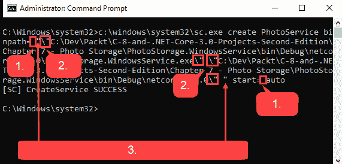

前面截图中的命令可以解释如下:

1.  参数后面的空格不是修饰性的，而是非常必要的！
2.  `binpath`参数中的任何引号都必须转义。
3.  这些表示`binpath`参数的开始和结束引号。

创建服务后，您应该能够看到并启动它:

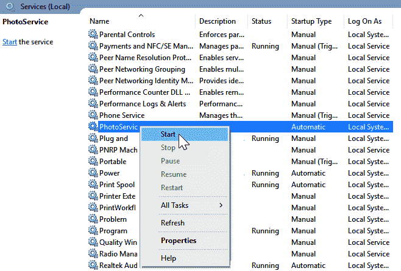

就这样。现在，您应该能够将文件放入指定的目录，并看到它们神奇地上传到云中(您可以使用 Azure 存储资源管理器进行检查，正如我们在本章前面提到的)。

太好了，但是如果不行呢？

# 测试和调试

如果您提取存储库，您会看到我添加了许多单元测试来覆盖一些基本功能。如果你发现某件事没有用，那么编写一个暴露这个问题的单元测试通常是解决它的最快方法。然而，有时应用程序会运行，单元测试会通过，但还是有问题。我已经编写了一些步骤，如果服务不工作，您可以按照这些步骤来调试服务。

# 步骤 1–检查服务是否正在运行

这听起来很简单，但是对某件事情没有做你期望它做的事情最明显的解释是，它根本没有做任何事情。您可以通过转到服务应用程序轻松检查服务是否正在运行:

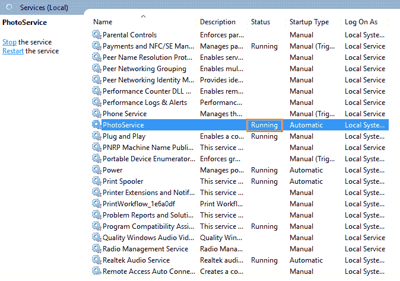

如果服务没有说运行，如前面的截图所示，那么它就不是。这可能有很多原因，与大多数其他类似的情况不同，简单地启动它是不太可能奏效的。通常，找出原因的最快方法是检查日志文件或事件查看器。

# 步骤 2–检查日志文件

最初，日志文件将被写入与可执行文件相同的目录(除非您为配置文件指定了不同的目录)。日志文件可能如下所示:

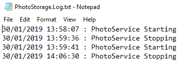

The code to create the `PhotoService` starting and `PhotoService` stopping log messages in the service were left out of the preceding code snippets; however, if you pull the repository, you should be able to see all the logging that I've added and even add your own.

这通常是一个调试逻辑错误的好工具(例如，我期望我的应用程序做 X，但是它做了 Y)；但是，如果您的服务只是崩溃，那么事件查看器应该告诉您它是在哪里崩溃的。

# 步骤 3–检查事件查看器

当窗口服务执行任何操作时，它会向事件查看器写入一个条目。您可以在这里看到任何可能发生的错误:

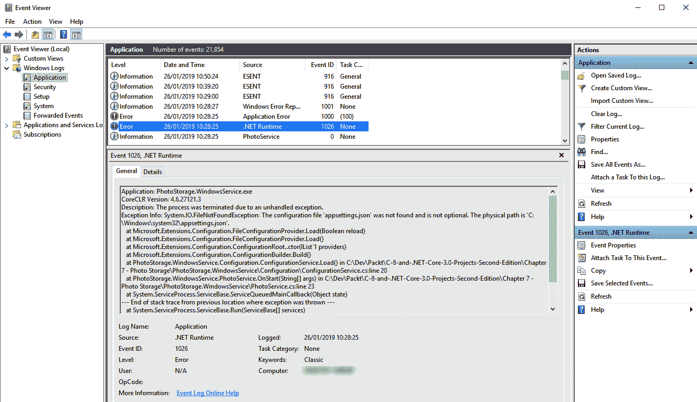

可以看到，在前面的例子中，服务找不到配置文件。

这里不可能涵盖所有可能的错误和解决方案；然而，从广义上来说，一个 Windows 服务遵循与任何其他程序相同的规则。如果 Windows 服务在测试环境中工作，并且单元测试通过，那么可能的问题是环境，即部署的目录、权限或所需的运行时资源。

如果程序找不到配置文件(或任何依赖项)，那么打开它正在查找的目录，看看你是否能自己找到日志文件(或依赖项)。在这个例子中，`appsettings.json`文件只需要复制到输出目录。您可以通过更改*构建动作*和*复制到输出目录*参数来让 Visual Studio 执行此操作。

事件查看器是一个非常有用的工具，它为您提供了整个调用堆栈，这意味着您可以隔离出现故障的特定线路。

# 摘要

在本章中，我们使用创建了一个窗口服务。NET Core 3 和 Windows 兼容包。我们还使用了 C#8 中的新 switch 语句。然后，我们使用 Azure Blob 存储作为上传和存储文件的机制。

我们现在有了一个小服务，当我们将文件放到一个特定的目录中时，它将位于后台并将我们的文件上传到云中。

在下一章中，我们将研究 Docker，以及如何在 AKS 上构建一个可以在 Azure 中托管的服务。*