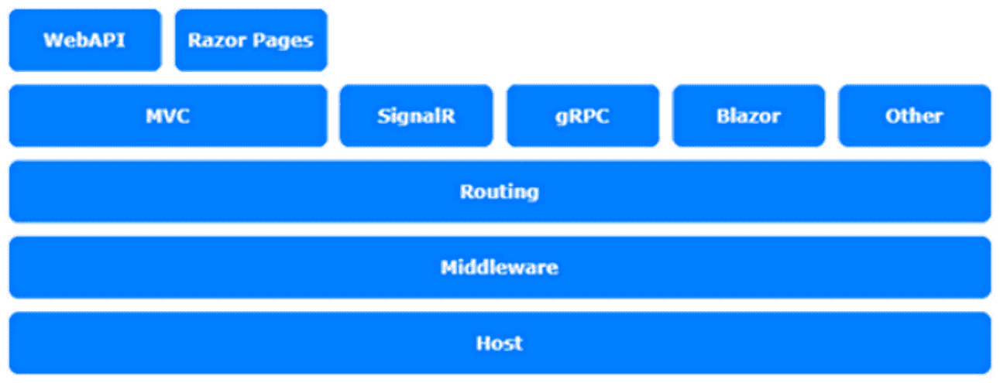

# 序言

ASP.NET Core 是 Microsoft 提供的功能最强大的 web 框架，它充满了隐藏的功能，使其更加强大和有用。

您的申请不应与框架相匹配；您的框架应该能够满足应用的实际需要。有了这本书，你将学习如何找到隐藏的螺丝钉，你可以转向获得最大的框架。

使用 ASP.NET Core 的开发人员将能够将他们的知识用于定制 ASP.NET Core 的实用指南。这本书提供了一种实际操作的实现方法及其相关的方法，可以让您立即启动并运行起来，提高效率。

这本书是您可能想要更改的默认 ASP.NET Core行为以及如何更改的逐步说明的紧凑集合。

在本书的结尾，您将了解如何定制 ASP.NET Core，以便根据您的个人需求从中获得优化的应用。

# ASP.NET Core架构概述

在接下来的章节中，您应该熟悉 ASP.NET Core的基本体系结构及其组件。这本书讨论了架构的几乎所有组件。

下图显示了 ASP.NET Core 5.0 的基本体系结构概述。让我们从底层到顶层快速浏览一下此处显示的组件：



底部是**托管**层。这一层引导 web 服务器以及启动 ASP.NET Core应用所需的所有内容，包括日志记录、配置和服务提供商。该层创建实际的请求对象及其在上述层中使用的依赖项。

**托管**之上的下一层是**中间件**层。这一个与请求对象一起工作或操纵它。这会将中间件附加到请求对象。它执行中间件处理错误、验证 HST、CORS 等。

在这上面，有**路由**层，它根据定义的路由模式将请求路由到端点。Endpoint routing 是 ASP.NET Core 3.1 中的新播放器，它将路由与上面的 UI 层分离，以便为不同的端点（包括 Blazor、gRPC 和 SignalR）启用路由。提醒一下：在以前的 ASP.NET Core 版本中，路由是 MVC 层的一部分，其他每个 UI 层都需要实现自己的路由。

实际端点由第四层 UI 层提供，其中包含知名的 UI 框架**Blazor**、**gRPC**、**Signal**和**MVC**。作为 ASP.NET Core开发人员，您将在这里完成大部分工作。

最后，在**MVC**上方，您将看到**WebAPI**和**Razor 页面**。

# 这本书涵盖了什么？

本书并未涵盖架构概述中提到的所有主题。本书涵盖了托管层的大部分主题，因为托管层包含了您可能需要自定义的大部分内容。这本书讨论了中间件和路由，以及 MVC 特性和一些更多的 WebAPI 主题，在这些主题中，您可以做一些魔术。

在每章的开头，我们将指出主题所属的级别。

# 哪些内容未涵盖，为什么？

本书不包括剃须刀页面、信号器、gRPC 和 Blazor。

原因是 gRPC 和 Signal 已经非常专业化，不需要定制。Blazor 是 ASP.NET Core家族的新成员，目前尚未得到广泛应用。此外，作者对 Blazor 还不够熟悉，不知道定制 Blazor 的所有螺丝钉。Razor 页面位于 MVC 框架之上，MVC 的定制也适用于 Razor 页面。

# 这本书是给谁的

本书面向使用 ASP.NET Core的 web 开发人员，他们可能需要更改默认行为才能完成任务。读者应该具备 ASP.NET Core和 C#的基本知识，因为本书没有介绍这些技术的基础知识。读者还应该对 Visual Studio、Visual Studio 代码或任何其他支持 ASP.NET Core 和 C#的代码编辑器有很好的了解。

# 这本书涵盖的内容

[*第 1 章*](01.html#_idTextAnchor018)*自定义日志，*教您如何自定义日志行为以及如何添加自定义日志提供程序。

[*第二章*](02.html#_idTextAnchor030)*定制应用配置*帮助您了解如何使用不同的配置源，添加自定义配置提供者。

[*第三章*](03.html#_idTextAnchor048)*定制依赖注入*教您**依赖注入**（**DI**如何工作以及如何使用不同的 DI 容器。

[*第 4 章*](04.html#_idTextAnchor071)*通过 Kestrel 配置和定制 HTTPS*对 HTTPS 进行了不同的配置。

[*第 5 章*](05.html#_idTextAnchor082)*使用 IHostedService 和 BackgroundService*让您了解如何在后台执行任务。

[*第 6 章*](06.html#_idTextAnchor095)*编写自定义中间件*使用中间件处理 HTTP 上下文。

[*第 7 章*](07.html#_idTextAnchor114)*内容协商使用自定义 OutputFormatter，*教您如何基于 HTTP Accept 标头输出不同的内容类型。

[*第 8 章*](08.html#_idTextAnchor128)*使用自定义模型绑定器管理输入，*帮助您创建具有不同内容类型的输入模型。

[*第 9 章*](09.html#_idTextAnchor151)*创建自定义 ActionFilter*揭示了使用 ActionFilters 的面向方面编程。

[*第 10 章*](10.html#_idTextAnchor163)*创建自定义 TagHelper，*通过创建 TagHelper，可以简化 UI 层。

[*第 11 章*](11.html#_idTextAnchor176)*配置 WebHostBuilder，*帮助您了解如何在托管层上设置配置。

[*第 12 章*](12.html#_idTextAnchor190)*使用不同的托管模式*向您介绍不同平台上不同类型的托管。

[*第 13 章*](13.html#_idTextAnchor212)*使用端点路由*帮助您了解如何使用新路由提供自定义端点。

# 充分利用这本书

读者应具备 ASP.NET Core 和 C#的基本知识，以及 Visual Studio、Visual Studio 代码或任何其他支持 ASP.NET Core 和 C#的代码编辑器的基本知识。


您应该在计算机上安装最新的.NET 5 SDK。请在[上查找最新版本 https://dotnet.microsoft.com/download/dotnet-core/](https://dotnet.microsoft.com/download/dotnet-core/) 。

您可以随意使用任何支持 ASP.NET Core和 C#的代码编辑器。我们建议使用 Visual Studio 代码（[https://code.visualstudio.com/](https://code.visualstudio.com/) ），可在所有平台上使用，本书作者使用。

本书中的所有项目都将使用控制台、命令提示符、shell 或 PowerShell 创建。您可以随意使用任何您喜欢的控制台。作者使用托管在 cmder shell（[中的 Windows 命令提示符 https://cmder.net/](https://cmder.net/) ）。我们不建议使用 VisualStudio 创建项目，因为基本配置可能会更改，并且 web 项目将在与本书中描述的不同的端口上启动。

您是否坚持使用.NETCore3.1？如果您由于任何原因无法在计算机上使用.NET 5，那么所有示例都可以使用.NET Core 3.1。当与.NET 5 存在差异时，本章将与.NET Core 3.1 进行比较，因为 3.1 版仍然是.NET Core 的当前长期支持版本。

**如果您使用的是本书的数字版本，我们建议您自己键入代码或通过 GitHub 存储库访问代码（下一节提供链接）。这样做将帮助您避免与复制和粘贴代码相关的任何潜在错误。**

# 下载示例代码文件

您可以从您的账户[www.packt.com](http://www.packt.com)下载本书的示例代码文件。如果您在其他地方购买了本书，您可以访问[www.packtpub.com/support](http://www.packtpub.com/support)并注册，将文件通过电子邮件直接发送给您。

您可以通过以下步骤下载代码文件：

1.  登录或注册[www.packt.com](http://www.packt.com)。
2.  选择**支持**选项卡。
3.  点击**代码下载**。
4.  在**搜索**框中输入图书名称，然后按照屏幕上的说明进行操作。

下载文件后，请确保使用以下最新版本解压或解压缩文件夹：

*   WinRAR/7-Zip for Windows
*   适用于 Mac 的 Zipeg/iZip/UnRarX
*   适用于 Linux 的 7-Zip/PeaZip

该书的代码包也托管在 GitHub 上的[https://github.com/PacktPublishing/Customizing-ASP.NET-Core-5.0](https://github.com/PacktPublishing/Customizing-ASP.NET-Core-5.0) 。如果代码有更新，它将在现有 GitHub 存储库中更新。

我们的丰富书籍和视频目录中还有其他代码包，请访问[https://github.com/PacktPublishing/](https://github.com/PacktPublishing/) 。看看他们！

# 使用的约定

本书中使用了许多文本约定。

`Code in text`：表示文本中的码字、数据库表名、文件夹名、文件名、文件扩展名、路径名、虚拟 URL、用户输入和 Twitter 句柄。下面是一个示例：“打开您刚刚创建的项目的文件`Startup.cs`

代码块设置如下：

```cs
public Task StopAsync(CancellationToken cancellationToken)
{
    logger.LogInformation(“Hosted service stopping”);
    return Task.CompletedTask;
}
```

当我们希望提请您注意代码块的特定部分时，相关行或项目以粗体显示：

```cs
app.UseEndpoints(endpoints =>
{
    endpoints.MapGet(“/”, async context =>
    {
        await context.Response.WriteAsync(
            “Hello World!”);
    });
    endpoints.MapAppStatus(“/status”, “Status”);
});
```

任何命令行输入或输出的编写方式如下：

```cs
dotnet new web -n SampleProject -o SampleProject
cd SampleProject
code .
```

**粗体**：表示一个新术语、一个重要单词或您在屏幕上看到的单词。例如，菜单或对话框中的单词出现在文本中，如下所示。下面是一个示例：“从**管理**面板中选择**系统信息**

提示或重要提示

看起来像这样。

# 联系

我们欢迎读者的反馈。

**一般反馈**：如果您对本书的任何方面有疑问，请在邮件主题中注明书名，并发送电子邮件至[customercare@packtpub.com](mailto:customercare@packtpub.com)。

**勘误表**：尽管我们已尽一切努力确保内容的准确性，但还是会出现错误。如果您在本书中发现错误，如果您能向我们报告，我们将不胜感激。请访问[www.packtpub.com/support/errata](http://www.packtpub.com/support/errata)，选择您的书籍，单击 errata 提交表单链接，然后输入详细信息。

**盗版**：如果您在互联网上发现我们作品的任何形式的非法复制品，请您提供我们的位置地址或网站名称，我们将不胜感激。请致电[与我们联系 copyright@packt.com](mailto:copyright@packt.com)带有指向该材料的链接。

**如果您有兴趣成为一名作家**：如果您对某个主题有专业知识，并且您有兴趣撰写或贡献一本书，请访问[authors.packtpub.com](http://authors.packtpub.com)。

# 审查

请留下评论。一旦你阅读并使用了这本书，为什么不在你购买它的网站上留下评论呢？然后，潜在读者可以看到并使用您的无偏见意见做出购买决定，我们 Packt 可以了解您对我们产品的看法，我们的作者可以看到您对他们书籍的反馈。非常感谢。

有关 Packt 的更多信息，请访问[Packt.com](http://packt.com)。