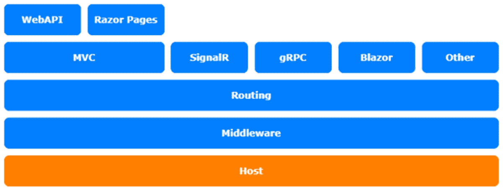
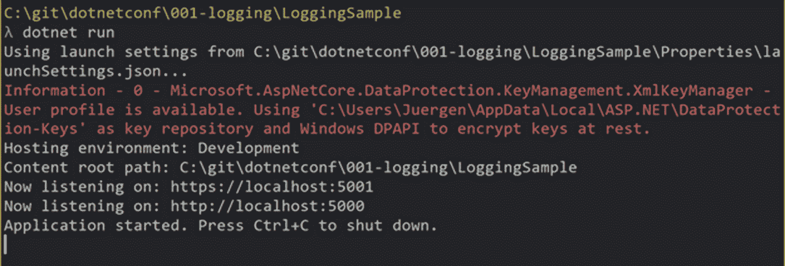

# 一、自定义日志

在本书关于自定义 ASP.NET Core的第一章中，您将看到如何自定义日志记录。默认日志记录仅写入控制台或调试窗口。这在大多数情况下都很好，但可能需要登录到接收器，例如文件或数据库。也许您希望使用其他信息扩展日志记录程序。在这些情况下，您需要知道如何更改默认日志记录。

在本章中，我们将介绍以下主题：

*   配置日志记录
*   创建自定义记录器
*   插入现有的第三方记录器提供商

本章中的主题涉及 ASP.NET Core体系结构的托管层：



图 1.1–ASP.NET Core体系结构

# 技术要求

要遵循本章中的描述，您需要创建一个 ASP.NET Core MVC 应用。打开控制台、shell 或 bash 终端，并切换到工作目录。使用以下命令创建新的 MVC 应用：

```cs
dotnet new mvc -n LoggingSample -o LoggingSample
```

现在，在 Visual Studio 中双击项目文件或在 VS 代码中，在已打开的控制台中键入以下命令来打开项目：

```cs
cd LoggingSample
code.
```

本章中的所有代码示例都可以在本书的 GitHub 存储库中的[中找到 https://github.com/PacktPublishing/Customizing-ASP.NET-Core-5.0/tree/main/Chapter01](https://github.com/PacktPublishing/Customizing-ASP.NET-Core-5.0/tree/main/Chapter01) 。

# C配置日志

在以前版本的ASP.NET Core（2.0 之前）中，`Startup.cs`中配置了日志记录。提醒一下，从 2.0 版开始，`Startup.cs`文件被简化，很多配置被移动到默认的`WebHostBuilder`，在`Program.cs`中被调用。此外，日志记录被移动到默认值`WebHostBuilder`。

在 ASP.NET Core 3.1 及更高版本中，`Program.cs`文件变得更通用，将首先创建`IHostBuilder`。`IHostBuilder`对于在没有所有 ASP.NET web 内容的情况下引导应用非常有用。在接下来的章节中，我们将了解更多关于`IHostBuilder`的内容。有了这个`IHostBuilder`，我们创建了`IWebHostBuilder`来配置 ASP.NET Core。在 ASP.NET Core 3.1 及更高版本中，我们使用`webBuilder`变量获得`IWebHostBuilder`：

```cs
public class Program
{
    public static void Main(string[] args)
    {
        CreateHostBuilder(args).Build().Run();
    }
    public static IHostBuilder CreateHostBuilder(string[]
      args) =>
        Host.CreateDefaultBuilder(args)
            .ConfigureWebHostDefaults(webBuilder =>
            {
                webBuilder.UseStartup<Startup>();
            });
}
```

在 ASP.NET Core 中，您可以覆盖和自定义几乎所有内容。这包括日志记录。`IWebHostBuilder`有很多扩展方法覆盖默认行为。要覆盖日志记录的默认设置，我们需要选择`ConfigureLogging`方法。下面的代码片段显示的日志记录与`ConfigureWebHostDefaults()`方法中配置的日志记录几乎完全相同：

```cs
Host.CreateDefaultBuilder(args)
    .ConfigureWebHostDefaults(webBuilder =>
    {
        webBuilder
            .ConfigureLogging((hostingContext, logging) =>
            {
               logging.AddConfiguration(
                    hostingContext.Configuration.GetSection
                     ("Logging"));
                logging.AddConsole();
                logging.AddDebug();
            })
            .UseStartup<Startup>();
    });
```

这个方法需要一个 lambda 来获取`WebHostBuilderContext`和`LoggingBuilder`来配置日志记录。

现在我们已经了解了如何配置日志记录，让我们看看如何构建自定义日志记录程序。

# 创建自定义记录器

为了演示一个自定义记录器，让我们使用我创建的一个简单的小记录器，它能够在控制台中使用特定的日志级别对日志条目进行着色。这称为`ColoredConsoleLogger`，将使用`LoggerProvider`添加和创建，我们也需要自己编写。要指定要着色的颜色和日志级别，我们需要添加一个配置类。

在接下来的片段中，所有三个部分（`Logger`、`LoggerProvider`和`Configuration`都显示出来：

1.  让我们创建记录器的配置类。我们称之为`ColoredConsoleLoggerConfiguration`。此类包含三个要定义的属性—`LogLevel`、`EventId`和`Color`，可设置为：

    ```cs
    public class ColoredConsoleLoggerConfiguration
    {
        public LogLevel LogLevel { get; set; } = 
          LogLevel.Warning;
        public int EventId { get; set; } = 0;
        public ConsoleColor Color { get; set; } = 
          ConsoleColor.Yellow;
    }
    ```

2.  接下来，我们需要一个提供者来检索配置并创建实际的记录器实例：

    ```cs
    public class ColoredConsoleLoggerProvider : 
      IloggerProvider
    {
        private readonly ColoredConsoleLoggerConfiguration
          _config;
        private readonly ConcurrentDictionary<string,
          ColoredConsoleLogger> _loggers =
            new ConcurrentDictionary<string,
               ColoredConsoleLogger>();
        public ColoredConsoleLoggerProvider
          (ColoredConsoleLoggerConfiguration config)
        {
            _config = config;
        }
        public ILogger CreateLogger(string categoryName)
        {
            return _loggers.GetOrAdd(categoryName, name =>
                new ColoredConsoleLogger(name, _config));
        }
        public void Dispose()
        {
            _loggers.Clear();
        }
    }
    ```

3.  The third class is the actual logger we want to use:

    ```cs
    public class ColoredConsoleLogger : Ilogger
    {
        private static object _lock = new Object();
        private readonly string _name;
        private readonly ColoredConsoleLoggerConfiguration 
          _config;
        public ColoredConsoleLogger(
            string name,
            ColoredConsoleLoggerConfiguration config)
        {
            _name = name;
            _config = config;
        }
        public IDisposable BeginScope<TState>(TState 
          state)
        {
            return null;
        }
        public bool IsEnabled(LogLevel logLevel)
        {
            return logLevel == _config.LogLevel;
        }
        public void Log<TState>(
            LogLevel logLevel,
            EventId eventId,
            TState state,
            Exception exception,
            Func<TState, Exception, string> formatter)
        {
            if (!IsEnabled(logLevel))
            {
                return;
            }
            lock (_lock)
            {
                if (_config.EventId == 0 || 
                  _config.EventId 
                  == eventId.Id)
                {
                    var color = Console.ForegroundColor;
                    Console.ForegroundColor = 
                      _config.Color;

                Console.WriteLine($"{logLevel.ToString()}
                      - {eventId.Id} - {_name} -
                        {formatter(state, exception)}");
                    Console.ForegroundColor = color;
                }
            }
        }
    }
    ```

    我们现在需要锁定实际的控制台输出，因为我们会遇到一些竞争条件，不正确的日志条目会用错误的颜色着色，因为控制台本身并不是真正的线程安全的。

4.  如果这样做了，我们可以开始将新的记录器插入到`Program.cs`文件

    ```cs
    logging.ClearProviders();
    var config = new ColoredConsoleLoggerConfiguration
    {
        LogLevel = LogLevel.Information,
        Color = ConsoleColor.Red
    };
    logging.AddProvider(new 
        ColoredConsoleLoggerProvider(config));
    ```

    中的配置中

如果不想使用现有的记录器，可以清除以前添加的所有记录器提供程序。然后，我们调用`AddProvider`添加一个具有特定设置的`ColoredConsoleLoggerProvider`类的新实例。我们还可以添加更多具有不同设置的提供者实例。

这显示了您如何以不同的方式处理不同的日志级别。您可以使用它发送有关硬错误的电子邮件，将调试消息记录到与常规信息消息不同的日志接收器，等等：



图 1.2–自定义记录器的屏幕截图

*图 1.2*显示了先前创建的自定义记录器的彩色输出。

在许多情况下，编写自定义记录器是没有意义的，因为已经有许多优秀的第三方记录器可用，例如`ELMAH`、`log4net`和`NLog`。在下一节中，我们将看到如何在 ASP.NET核心中使用`NLog`。

# 插入现有的第三方记录器提供商

`NLog`是最早作为.NET 标准库提供并可在 ASP.NET Core 中使用的记录器之一。`NLog`还提供了一个记录器提供程序，可以方便地插入 ASP.NET Core。

您将通过 NuGet（[找到`NLog`https://www.nuget.org/packages/NLog.Web.AspNetCore](https://www.nuget.org/packages/NLog.Web.AspNetCore) 和 GitHub（[上）https://github.com/NLog/NLog.Web](https://github.com/NLog/NLog.Web) ）。即使`NLog`尚未明确适用于 ASP.NET Core 5.0，它仍将适用于此版本：

1.  我们需要添加一个`NLog.Config`文件，该文件定义了两个不同的接收器，将所有消息记录在一个日志文件中，而自定义消息只记录在另一个文件中。由于此文件太长，无法打印，您可以查看或直接从 GitHub 下载：[https://github.com/PacktPublishing/Customizing-ASP.NET-Core-5.0/blob/main/Chapter01/LoggingSample5.0/NLog.Config](https://github.com/PacktPublishing/Customizing-ASP.NET-Core-5.0/blob/main/Chapter01/LoggingSample5.0/NLog.Config) 。
2.  We then need to add the `NLog` ASP.NET Core package from NuGet:

    ```cs
    dotnet add package NLog.Web.AspNetCore
    ```

    重要提示

    在执行该命令之前，请确保您位于项目目录中！

3.  Now, you only need to clear all the other providers in the `ConfigureLogging` method in `Program.cs` and to use `NLog` with the `IWebHostBuilder` using the `UseNLog()` method:

    ```cs
    Host.CreateDefaultBuilder(args)
        .ConfigureWebHostDefaults(webBuilder =>
        {
            webBuilder
                .ConfigureLogging((hostingContext, 
                  logging) 
                   =>
                {
                    logging.ClearProviders();

                 logging.SetMinimumLevel(LogLevel.Trace);
                })
                .UseNLog()
                .UseStartup<Startup>();
        });
    ```

    在这里，您可以根据需要添加任意多的记录器提供程序。

这包括使用现有的记录器。现在让我们回顾一下我们在这些初始al 页面中所涵盖的内容。

# 总结

隐藏基本配置的好处在于，它允许您清理新搭建的项目，并使实际启动尽可能简单。开发人员能够专注于实际功能。然而，应用增长越多，日志记录就变得越重要。默认的日志记录配置很简单，工作起来很有魅力，但在生产中，您需要一个持久化的日志来查看过去的错误。因此，您需要添加自定义日志或更灵活的日志，如`NLog`或`log4net`。

在下一章中，您将了解有关如何配置 ASP.NET Core的更多信息。