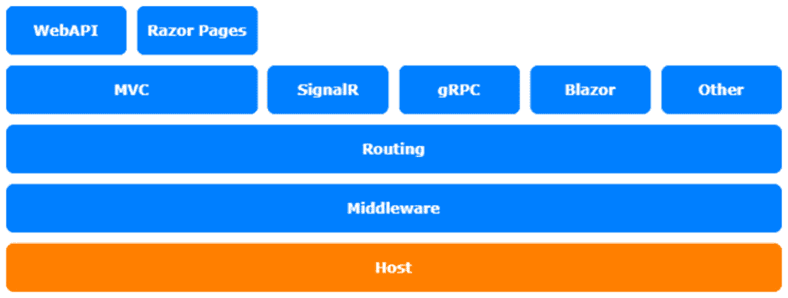

# *第二章*：定制 App 配置

第二章介绍应用配置，如何使用它，以及如何自定义 ASP.NET 配置以采用不同的方式配置应用。也许您已经有了一个现有的 XML 配置，或者希望通过不同类型的应用共享一个 YAML 配置文件。有时，从数据库中读取配置值也是有意义的。

在本章中，我们将介绍以下主题：

*   配置配置
*   使用类型化配置
*   使用 INI 文件进行配置
*   配置提供程序

本章主题涉及 ASP.NET 核心架构的托管层：



图 2.1–ASP.NET 核心体系结构

# T技术要求

要遵循本章中的描述，您需要创建一个 ASP.NET 核心 MVC 应用。打开控制台、shell 或 bash 终端，并切换到工作目录。使用以下命令创建新的 MVC 应用：

```cs
dotnet new mvc -n ConfigureSample -o ConfigureSample
```

现在，在 Visual Studio 中双击项目文件或在 VS 代码中，在已打开的控制台中键入以下命令来打开项目：

```cs
cd ConfigureSample
code.
```

本章中的所有代码示例都可以在本书的 GitHub 存储库中的[中找到 https://github.com/PacktPublishing/Customizing-ASP.NET-Core-5.0/tree/main/Chapter02](https://github.com/PacktPublishing/Customizing-ASP.NET-Core-5.0/tree/main/Chapter02) 。

# 配置配置

让我们先看看如何配置您的各种配置选项。

从 ASP.NET Core 2.0 开始，该配置隐藏在默认配置`WebHostBuilder`中，不再是`Startup.cs`的一部分。这有助于保持启动的干净和简单。

在 ASP.NET Core 3.1 和 ASP.NET Core 5.0 中，代码如下所示：

```cs
// ASP.NET Core 3.0 and later
public class Program
{
    public static void Main(string[] args)
    {
        CreateWebHostBuilder(args).Build().Run();
    }
    public static IHostBuilder CreateHostBuilder(string[]       args) =>
        Host.CreateDefaultBuilder(args)
            .ConfigureWebHostDefaults(webBuilder =>
            {
                webBuilder.UseStartup<Startup>();
            }
}
```

幸运的是，您还可以覆盖默认设置，以您需要的方式自定义配置。

当您创建一个新的 ASP.NET 核心项目时，您已经配置了`appsettings.json`和`appsettings.Development.json`。您可以也应该使用这些配置文件来配置您的应用；这是预先配置的方式，大多数 ASP.NET 核心开发人员都会寻找一个`appsettings.json`文件来配置应用。这是绝对好的，效果相当好。

下面的代码片段显示了用于读取`appsettings.json`文件的封装默认配置：

```cs
Host.CreateDefaultBuilder(args)
    .ConfigureWebHostDefaults(webBuilder =>
    {
        webBuilder
          .ConfigureAppConfiguration((builderContext, 
             config) =>
        {
            var env = builderContext.HostingEnvironment;
            config.SetBasePath(env.ContentRootPath);
            config.AddJsonFile(
                "appsettings.json", 
                optional: false, 
                reloadOnChange: true);
            config.AddJsonFile(
                $"appsettings.{env.EnvironmentName}.json", 
                optional: true, 
                reloadOnChange: true);
            config.AddEnvironmentVariables();
        })
        .UseStartup<Startup>();
    });
```

此配置还设置应用的基本路径，并通过环境变量添加配置。`ConfigureAppConfiguration`方法接受传入`WebHostBuilderContext`和`ConfigurationBuilder`的 lambda 方法。

无论何时定制应用配置，都应使用`AddEnvironmentVariables()`方法通过环境变量添加配置，作为最后一步。配置的顺序很重要，稍后添加的配置提供程序将覆盖先前添加的配置。确保环境变量始终覆盖通过文件设置的配置。这样，您还可以确保 Azure 应用服务上应用的配置将作为环境变量传递给应用。

`IConfigurationBuilder`有很多扩展方法来添加更多配置，比如 XML 或 INI 配置文件，以及内存中的配置。您可以找到由社区构建的用于读取 YAML 文件、数据库值等的其他配置提供程序。在下一节中，我们将看到如何读取 INI 文件。首先，我们将介绍如何使用类型化配置。

# 使用类型化配置

在尝试读取 INI 文件之前，您应该了解如何使用键入的配置，而不是通过`IConfiguration`逐键读取配置。

要读取类型化配置，需要定义要配置的类型。我通常创建一个名为`AppSettings`的类，如下所示：

```cs
public class AppSettings
{
    public int Foo { get; set; }
    public string Bar { get; set; }
}
```

这是一个简单的 POCO 类，只包含应用设置值。这些类可以在`Startup.cs`中的`ConfigureServices`方法中填入特定的配置部分：

```cs
services.Configure<AppSettings>
   (Configuration.GetSection("AppSettings"));
```

这样，类型化配置也可以在依赖项注入容器中注册为服务，并且可以在应用中的任何地方使用。您可以为每个配置部分创建不同的配置类型。在大多数情况下，一个部分应该可以，但有时将设置划分为不同的部分是有意义的。下一个代码段显示了如何在 MVC 控制器中使用配置：

```cs
public class HomeController : Controller
{
    private readonly AppSettings _options;
    public HomeController(IOptions<AppSettings> options)
    {
        _options = options.Value;
    }
```

`IOptions<AppSettings>`是对`AppSettings`类型的包装，`Value`属性包含`AppSettings`的实际实例，包括配置文件中的值。

要尝试此操作，`appsettings.json`文件需要配置`AppSettings`部分，否则值为空或未设置。现在我们将该部分添加到`appsettings.json`：

```cs
{
    "Logging": {
        "LogLevel": {
            "Default": "Warning"
        }
    },
    "AllowedHosts": "*",
    "AppSettings": {
        "Foo": 123,
        "Bar": "Bar"
    }
}
```

接下来，我们将研究如何将 INI 文件用于上的配置。

# 使用 INI 文件进行配置

要同时使用 INI 文件来配置应用，您需要在`Program.cs`中的`ConfigureAppConfiguration()`方法中添加 INI 配置：

```cs
config.AddIniFile(
    "appsettings.ini", 
    optional: false, 
    reloadOnChange: true);
config.AddJsonFile(
    $"appsettings.{env.EnvironmentName}.ini", 
    optional: true, 
    reloadOnChange: true);
```

此代码以与 JSON 配置文件相同的方式加载 INI 文件。第一行是必需的配置，第二行是可选配置，具体取决于当前运行时环境。

INI 文件可能如下所示：

```cs
[AppSettings]
Bar="FooBar"
```

如您所见，该文件包含一个名为`AppSettings`的节和一个名为`Bar`的属性。

早些时候，我们说过配置的顺序很重要。如果在通过 JSON 文件进行配置之后添加两行以通过 INI 文件进行配置，INI 文件将覆盖 JSON 文件中的设置。`Bar`属性被`"FooBar"`覆盖，而`Foo`属性保持不变，因为它不会被覆盖。此外，INI 文件中的值将通过先前创建的类型化配置提供。

其他所有配置提供程序的工作方式都相同。现在让我们看看配置提供程序的外观。

# 配置提供程序

配置提供者是由配置源创建的`IConfigurationProvider`的实现，是`IConfigurationSource`的实现。然后，配置提供程序从某处读取数据，并通过`Dictionary`提供数据。

要向 ASP.NET Core 添加自定义或第三方配置提供程序，您需要调用`ConfigurationBuilder`上的`Add`方法并插入配置源。这只是一个例子：

```cs
Host.CreateDefaultBuilder(args)
    .ConfigureWebHostDefaults(webBuilder =>
    {

       webBuilder.ConfigureAppConfiguration((builderContext, 
         config) =>
        {
            var env = builderContext.HostingEnvironment;
            config.SetBasePath(env.ContentRootPath);
            config.AddJsonFile(
                "appsettings.json", 
                optional: false, 
                reloadOnChange: true);
            config.AddJsonFile(
                $"appsettings.{env.EnvironmentName}.json",
                optional: true, 
                reloadOnChange: true);
            // add new configuration source
            config.Add(new MyCustomConfigurationSource
            {
                SourceConfig = //configure whatever source
                Optional = false,
                ReloadOnChange = true
            });
            config.AddEnvironmentVariables();
        })
        .UseStartup<Startup>();
    });
```

通常，您会创建一个扩展方法来更轻松地添加配置源：

```cs
config.AddMyCustomSource("source", optional: false, 
     reloadOnChange: true);
```

Andrew Lock 编写了一个关于如何创建自定义配置提供程序的非常详细的具体示例。您可以在本章的*进一步阅读*部分找到这一点。

# 总结

在大多数情况下，您不需要添加其他配置提供程序或创建自己的配置提供程序，但最好知道如何更改它，以防万一。另外，使用类型化配置是读取和提供设置的好方法。在经典的 ASP.NET 中，我们使用手动创建的 façade 以键入的方式读取应用设置。现在，只需提供一个类型就可以自动完成。该类型将通过依赖项注入自动实例化、填充和提供。

要了解有关在 ASP.NET Core 5.0 中自定义依赖项注入的更多信息，请看下一章。

# 进一步的r 读数

*Andrew Lock*，*在 ASP.NET 核心*中创建自定义配置提供程序：[https://andrewlock.net/creating-a-custom-iconfigurationprovider-in-asp-net-core-to-parse-yaml/](https://andrewlock.net/creating-a-custom-iconfigurationprovider-in-asp-net-core-to-parse-yaml/) 。