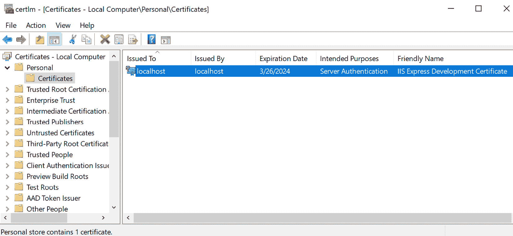

# 四、通过Kestrel配置和定制 HTTPS

**HTTPS**默认为开启状态，是一级功能。在 Windows 上，启用 HTTPS 所需的证书从 Windows 证书存储加载。如果在 Linux 或 Mac 上创建项目，则将从证书文件加载证书。

即使您想创建一个项目在 IIS 或 NGINX web 服务器后面运行它，HTTPS 也是启用的。通常，在这种情况下，您将在 IIS 或 NGINX web 服务器上管理证书。但是，这应该不是问题，所以不要在 ASP.NET Core设置中禁用 HTTPS。

如果您在防火墙后运行无法从 internet 访问的服务，则直接在 ASP.NET Core应用中管理证书是有意义的；服务，如基于微服务的应用的后台服务，或自托管 ASP.NET Core应用中的服务。

在某些情况下，也可以从 Windows 上的文件加载证书。这可能是在您将在 Docker for Windows 或 Linux 上运行的应用中。就个人而言，我喜欢从文件加载证书的灵活方式。

本章仅涉及两个主题：

*   介绍Kestrel
*   设置Kestrel

本章中的主题涉及 ASP.NET Core体系结构的主机层：


图 4.1–ASP.NET Core体系结构

# 技术要求

要遵循本章中的描述，您需要创建一个 ASP.NET Core MVC 应用。打开控制台、shell 或 bash 终端，并切换到工作目录。使用以下命令创建新的 MVC 应用：

```cs
dotnet new mvc -n HttpSample -o HttpSample
```

现在，在 Visual Studio 中双击项目文件或在 VS 代码中，在已打开的控制台中键入以下命令来打开项目：

```cs
cd HttpSample
code .
```

本章中的所有代码示例都可以在本书的 GitHub 存储库中的[中找到 https://github.com/PacktPublishing/Customizing-ASP.NET-Core-5.0/tree/main/Chapter04](https://github.com/PacktPublishing/Customizing-ASP.NET-Core-5.0/tree/main/Chapter04) 。

# 介绍Kestrel

**Kestrel**是一个新实现的 HTTP 服务器，是 ASP.NET Core的托管引擎。每个 ASP.NET Core应用都将在 Kestrel 服务器上运行。经典的 ASP.NET 应用（在.NET Framework 上运行）通常直接在 IIS web 服务器上运行。有了 ASP.NET Core，微软的灵感来源于**Node.js**，它还提供了一个名为**Libuv**的 HTTP 服务器。在 ASP.NET Core 的第一个版本中，微软还使用了 Libuv，然后在其顶部添加了一层，称为 Kestrel。Node.js 和 ASP.NET Core 当时共享同一个 HTTP 服务器。

由于.NET Core框架的发展，以及.NET 套接字在其上的实现，微软已经基于.NET 套接字构建了自己的 HTTP 服务器，并删除了 Libuv，这是一个他们不拥有或控制的依赖项。现在，Kestrel 是一个功能齐全的 HTTP 服务器，运行 ASP.NET Core应用。

IIS web 服务器充当反向代理，将流量转发给 Kestrel 并管理 Kestrel 进程。在 Linux 上，通常使用 NGINX 作为 Kestrel 的反向代理。

# 设置Kestrel

正如我们在本书的前两章所做的那样，我们需要稍微重写默认的`WebHostBuilder`类型来设置Kestrel。使用 ASP.NET Core 3.0 及更高版本，可以将默认的 Kestrel 基本配置替换为自定义配置。这意味着 Kestrel web 服务器配置为主机生成器：

1.  You will be able to add and configure Kestrel manually simply by using it. The following code shows what happens when you call the `UseKestrel()` method on `IwebHostBuilder`. Let's now see how this fits into the `CreateWebHostBuilder` method:

    ```cs
    public class Program
    {
        public static void Main(string[] args)
        {
            CreateWebHostBuilder(args).Build().Run();
        }
        public static IHostBuilder 
          CreateHostBuilder(string[] args) =>
            Host.CreateDefaultBuilder(args)
                .ConfigureWebHostDefaults(webBuilder =>
                {
                    webBuilder
                        .UseKestrel(options =>
                        {
                        })
                        .UseStartup<Startup>();
                }
    }
    ```

    `UseKestrel()`方法接受配置 Kestrel web 服务器的操作。

2.  What we *actually* need to do is to configure the addresses and ports that the web server is listening on. For the HTTPS port, we also need to configure how the certificate should be loaded:

    ```cs
    .UseKestrel(options =>
    {
        options.Listen(IPAddress.Loopback, 5000);
        options.Listen(IPAddress.Loopback,  5001,  
         listenOptions  =>
        {
            listenOptions.UseHttps("certificate.pfx", 
              "topsecret");
        });
    })
    ```

    在这个片段中，我们添加了要侦听的地址和端口。第二个定义为配置为使用 HTTPS 的安全端点。`UseHttps()`方法被多次重载，以从 Windows 证书存储以及文件中加载证书。在本例中，我们将使用项目文件夹中名为`certificate.pfx`的文件。

3.  要创建一个证书文件来处理此配置，请打开证书存储并导出 Visual Studio 创建的开发证书。它位于当前用户证书下的个人证书：



图 4.2–证书

右键单击此条目。在关联菜单中，进入**所有任务**并点击**导出**。在证书导出向导中，选择**是，导出私钥**并在下一屏幕中选择`.PFX`格式。点击**下一步**。在这里，您需要设置密码。这与您在代码中需要使用的密码完全相同，如示例中所示。选择文件名和存储文件的位置，然后按**下一步**。最后一个屏幕将显示摘要。按**完成**将证书保存到文件中。

## 为了您的安全

仅使用以下行*来处理此配置：*

```cs
listenOptions.UseHttps("certificate.pfx", "topsecret");
```

问题在于硬编码密码。永远不要在推送到任何源代码存储库的代码文件中存储密码。确保从 ASP.NET Core 的配置 API 加载密码。在本地开发计算机上使用用户机密，并在服务器上使用环境变量。在 Azure 上，使用应用设置存储密码。如果密码被标记为 pass单词，则密码将隐藏在 Azure 门户 UI 上。

# 总结

这只是一个小的定制，但是如果您想在不同的平台之间共享代码，或者希望在 Docker 上运行应用，并且不想担心证书存储等等，那么它应该会有所帮助。

通常，如果您在 IIS 或 NGINX 等 web 服务器后面运行应用，则不需要关心 ASP.NET Core 5.0 应用中的证书。但是，如果您将应用托管在另一个应用中，无论是在 Docker 上还是在没有 IIS 或 NGINX 的情况下，您都需要。

ASP.NET Core 5.0 具有在应用内部后台运行任务的新功能。本主题将在下一章中介绍。*