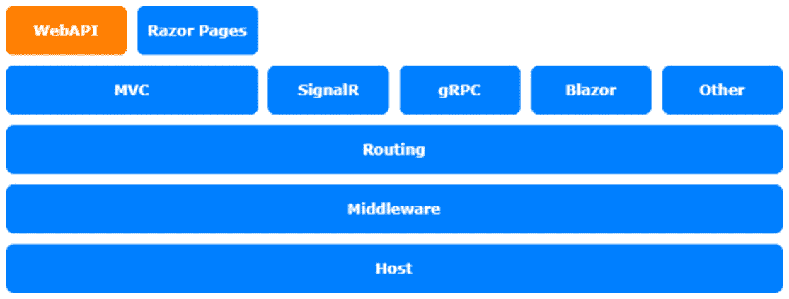
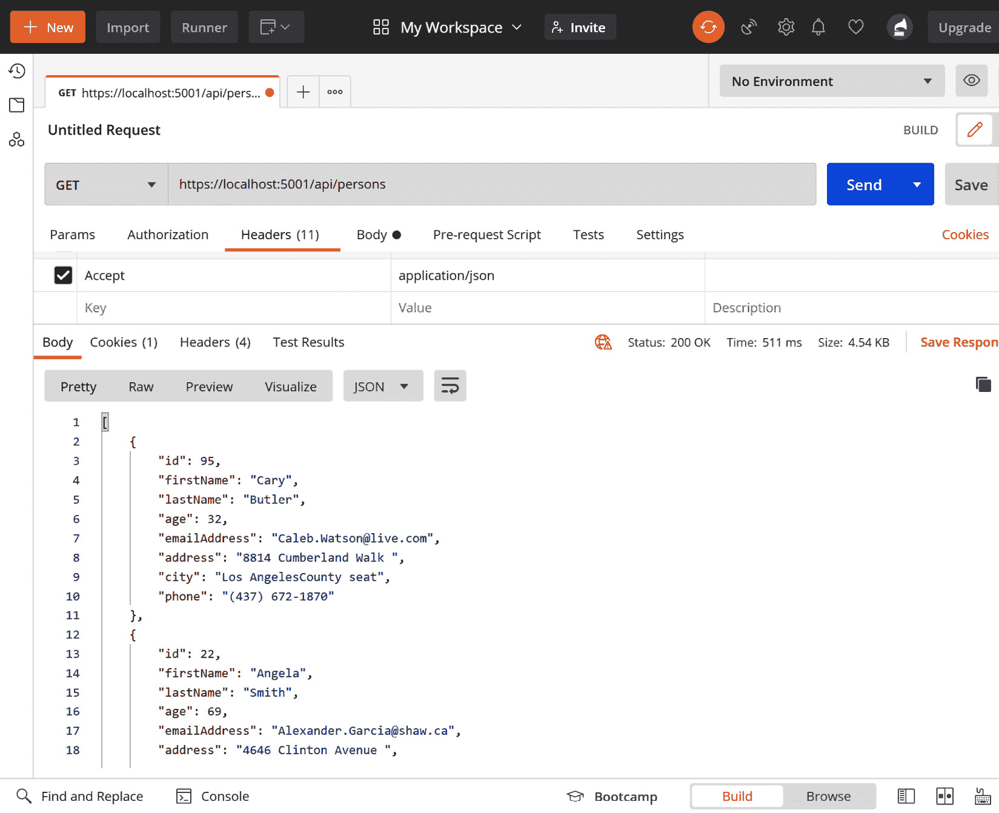
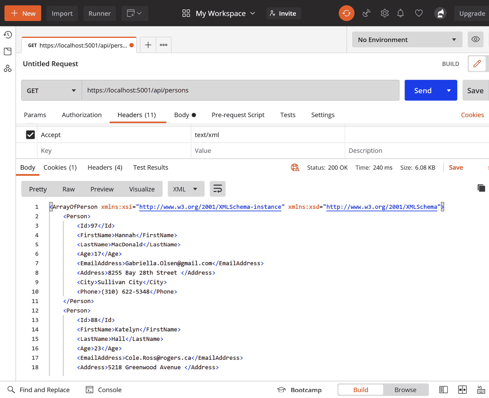
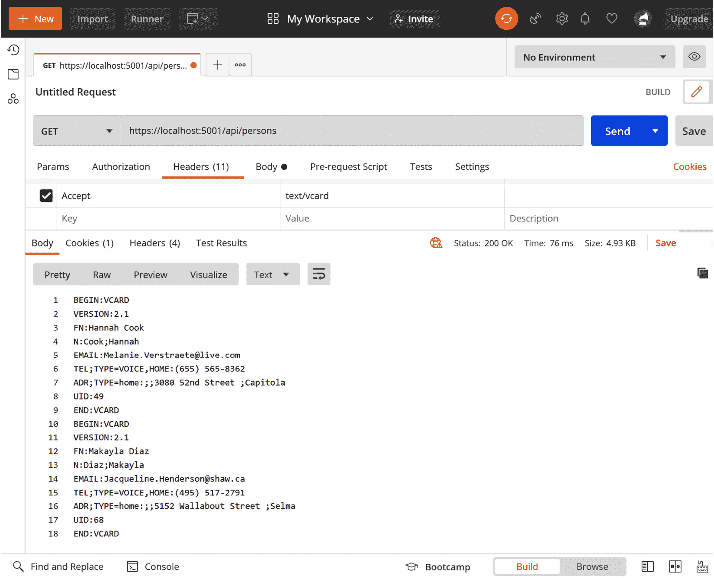
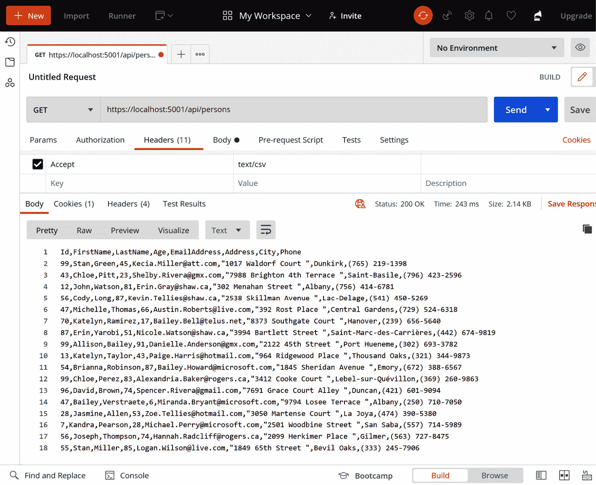

# 七、将自定义`OutputFormatter`用于内容协商

在第七章中，我们将学习如何以不同的格式和类型向客户机发送数据。默认情况下，ASP.NET Core Web API 以 JSON 的形式发送数据，但还有其他一些方法来分发数据。

我们将介绍以下部分：

*   介绍`OutputFomatters`
*   创建自定义`OutputFormatters`

本章的主题涉及 ASP.NET Core架构的**WebAPI**层：



图 7.1–ASP.NET Core体系结构

# 技术要求

要遵循本章中的描述，您需要创建一个 ASP.NET Core MVC 应用。打开控制台、shell 或 bash 终端，并切换到工作目录。使用以下命令创建新的 MVC 应用：

```cs
dotnet new webapi -n OutputFormatterSample -o OutputFormatterSample
```

现在，通过双击项目文件在 Visual Studio 中打开项目，或者通过在已打开的控制台中键入以下命令在 VS 代码中打开项目：

```cs
cd OutputFormatterSample
code .
```

本章的所有代码示例都可以在本书的 GitHub repo 中找到：[https://github.com/PacktPublishing/Customizing-ASP.NET-Core-5.0/tree/main/Chapter07](https://github.com/PacktPublishing/Customizing-ASP.NET-Core-5.0/tree/main/Chapter07) 。

# I生成输出格式化程序

**OutputFormatters**是类，将现有数据转换为不同的格式，通过 HTTP 发送给客户端。Web API 使用默认的`OutputFormatters`将对象转换为 JSON，这是发送结构化数据的默认格式。其他内置格式化程序包括 XML 格式化程序和纯文本格式化程序。

通过所谓的*内容协商*，客户能够决定他们想要检索的格式。客户端需要在`Accept`头中指定格式的内容类型。内容协商在`ObjectResult`中实施。

默认情况下，Web API 始终返回 JSON，即使您在标题中接受 text/XML。这就是默认情况下不注册内置 XML 格式化程序的原因。

有两种方法可以将`XmlSerializerOutputFormatter`添加到 ASP.NET Core。第一个显示在以下代码段中：

```cs
services.AddControllers()
    .AddXmlSerializerFormatters();
```

或者，您也可以使用以下选项：

```cs
services.AddControllers()
    .AddMvcOptions(options =>
    {
        options.OutputFormatters.Add(
            new XmlSerializerOutputFormatter());
    });
```

您可能需要将`Microsoft.AspNetCore.Mvc.Formatters`名称空间添加到`using`语句中。

还有`XmlDataContractSerializerOutputFormatter`可以在内部使用`DataContractSerializer`，配置更灵活。

默认情况下，任何`Accept`头将自动转换为`application/json`，即使您使用这些方法之一。但是，我们可以解决这个问题。

如果要允许客户端接受不同的头，需要关闭该翻译：

```cs
services.AddControllers()
    .AddMvcOptions(options =>
    {
        options.RespectBrowserAcceptHeader = true; 
          // false by default
    });
```

一些不完全支持 ASP.NET Core 5.0 的第三方组件不会异步写入响应流，而是默认配置，因为 ASP.NET Core 3.0*仅*允许异步写入。

要启用同步写入访问，您需要将以下行添加到`ConfigureServices`方法中：

```cs
services.Configure<KestrelServerOptions>(options =>
{
    options.AllowSynchronousIO = true;
});
```

将`Microsoft.AspNetCore.Server.Kestrel.Core`名称空间添加到`using`语句中以访问选项。

为了尝试格式化程序，让我们建立一个小测试项目。

## 准备测试项目

使用控制台，我们将创建一个小型 ASP.NET Core Web API 项目：

1.  Execute the following commands to add the necessary NuGet packages:

    ```cs
    dotnet add package GenFu
    dotnet add package CsvHelper
    ```

    这将创建一个新的 webapi 项目，并向其中添加两个 NuGet 包。`GenFu`是一个非常棒的库，可以轻松创建测试数据。第二个包`CsvHelper`帮助我们轻松编写 CSV 数据。

    现在，在 Visual Studio 或 VS 代码中打开该项目，并在`controller`文件夹中创建一个名为`PersonsController`的新控制器：

    ```cs
    [Route("api/[controller]")]
    [ApiController]
    public class PersonsController : ControllerBase
    {
    }
    ```

2.  Open `PersonsController.cs` and add a `Get()` method like this:

    ```cs
    [HttpGet]
    public ActionResult<IEnumerable<Person>> Get()
    {
        var persons = A.ListOf<Person>(25);
        return persons;
    }
    ```

    您可能需要在文件开头添加以下`using`语句：

    ```cs
    using GenFu;
    using OutputFormatterSample.models;
    ```

    这将使用`GenFu`创建一个 25 人的列表。属性将自动填充真实数据。**GenFu**是一款开源、快速、轻量级、可扩展的测试数据生成器。它包含名称、城市、国家/地区、电话号码等的内置列表，并根据属性名称自动将数据填充到类的正确属性中。一个名为`City`的属性将填写一个城市的名称，而一个名为`Phone`、`Telephone`或`Phonenumber`的属性将填写一个格式正确的假电话号码。稍后，您将看到 GenFu 的魔力和结果。

3.  创建一个`models`文件夹并创建一个新文件`Person.cs`，其中包含`Person`类：

    ```cs
    public class Person
    {
        public int Id { get; set; }
        public string FirstName { get; set; }
        public string LastName { get; set; }
        public int Age { get; set; }
        public string EmailAddress { get; set; }
        public string Address { get; set; }
        public string City { get; set; }
        public string Phone { get; set; }
    }
    ```

4.  Open `Startup.cs` as well, add the XML formatters, and allow other **Accept** headers, as described earlier:

    ```cs
    services.AddControllers()
        .AddMvcOptions(options =>
        {
            options.RespectBrowserAcceptHeader = true; 
              // false by default
            options.OutputFormatters.Add(
                new XmlSerializerOutputFormatter());
        });
    ```

    现在就到这里。现在您可以从 Web API 检索数据了。

5.  Start the project by using the `dotnet run` command.

    接下来，我们将测试 API。

## 测试 Web API

测试 Web API 的最佳工具是**小提琴手**（[https://www.telerik.com/fiddler](https://www.telerik.com/fiddler) 或邮递员（[https://www.postman.com/](https://www.postman.com/) 。我更喜欢邮递员，因为我觉得它更容易使用。最后，你想用哪种工具并不重要；在这些演示中，我们将使用邮递员：

1.  In Postman, create a new request. Write the API URL, which is `https://localhost:5001/api/persons`, into the `address` field, and add a header with the key as `Accept` and the value as `application/json`.

    点击**发送**后，会在响应体中看到 JSON 结果，如下图所示：

    

    图 7.2–Postman 中 JSON 输出的屏幕截图

    在这里，您可以看到自动生成的值。`GenFu`根据财产类型和财产名称，将数据放入此人的财产中：真实的名字和真实的姓氏，以及真实的城市和正确格式的电话号码。

2.  接下来，让我们测试 XML 输出格式化程序。在邮递员界面，将`Accept`头从`application/json`改为`text/xml`，点击**发送**：



图 7.3–Postman 中 XML 输出的屏幕截图

我们现在有一个 XML 格式的输出。

现在，让我们更进一步，创建一些定制`OutputFormatters`。

# 创建自定义输出格式化程序

计划是创建一个**VCard**输出，以便能够将此人的联系人详细信息直接导入 Outlook 或支持 VCard 的任何其他联系人数据库。在本节后面，我们还想创建一个 CSV 输出格式化程序。

两者都是基于文本的输出格式化程序，将从`TextOutputFormatter`中派生其值：

1.  在名为`VcardOutputFormatter.cs`的新文件中创建一个新类。
2.  Now, insert the following class skeleton in the new file. You will find the implementations of the empty methods in the following snippets. The constructor contains the supported media types and content encodings:

    ```cs
    public class VcardOutputFormatter : TextOutputFormatter
    {
        public string ContentType { get; }
        public VcardOutputFormatter()
        {
            SupportedMediaTypes.Add(
                MediaTypeHeaderValue.Parse("text/vcard"));
            SupportedEncodings.Add(Encoding.UTF8);
            SupportedEncodings.Add(Encoding.Unicode);
        }
        protected override bool CanWriteType(Type type)
        {
        }
        public override Task WriteResponseBodyAsync(
            OutputFormatterWriteContext context,
             Encoding selectedEncoding)
        {
        }
        private static void FormatVcard(
            StringBuilder buffer, 
            Person person, 
            ILogger logger)
        {
        }
    }
    ```

    您可能需要添加以下`using`语句：

    ```cs
    using Microsoft.AspNetCore.Mvc.Formatters;
    using System.Text;
    using Microsoft.Extensions.Logging;
    using Microsoft.Net.Http.Headers;
    ```

3.  下一个代码片段显示了`CanWriteType`方法的实现。重写此方法是可选的，但将其限制在特定条件下是有意义的。在这种情况下，`OutputFormatter`只能格式化`Person`：

    ```cs
    protected override bool CanWriteType(Type type)
    {
        if (typeof(Person).IsAssignableFrom(type)
            || typeof(IEnumerable<Person>)
                .IsAssignableFrom(type))
        {
            return base.CanWriteType(type);
        }
        return false;
    }
    ```

    类型的对象
4.  You need to override `WriteResponseBodyAsync` to convert the actual `Person` objects into the output you want to have. To get the objects to convert, you need to extract them from `OutputFormatterWriteContext` that gets passed into the method. You also get the HTTP response from this context. This is needed to write the results and send them to the client.

    在方法内部，我们检查是否得到一个人或一组人，并调用尚未实现的`FormatVcard`方法：

    ```cs
    public override Task WriteResponseBodyAsync(
        OutputFormatterWriteContext context,
        Encoding selectedEncoding)
    {
        var serviceProvider = 
          context.HttpContext.RequestServices;
        var logger = serviceProvider.GetService(
            typeof(ILogger<VcardOutputFormatter>)) as 
              ILogger;
        var response = context.HttpContext.Response;
        var buffer = new StringBuilder();
        if (context.Object is IEnumerable<Person>)
        {
            foreach (var person in context.Object as 
              IEnumerable<Person>)
            {
                FormatVcard(buffer, person, logger);
            }
        }
        else
        {
            var person = context.Object as Person;
            FormatVcard(buffer, person, logger);
        }
        return response.WriteAsync(buffer.ToString());
    }
    ```

5.  要格式化输出以支持标准`VCard`，您需要做一些手工工作：

    ```cs
    private static void FormatVcard(
        StringBuilder buffer, 
        Person person, 
        ILogger logger)
    {
        buffer.AppendLine("BEGIN:VCARD");
        buffer.AppendLine("VERSION:2.1");
        buffer.AppendLine(
            $"FN:{person.FirstName} {person.LastName}");
               buffer.AppendLine(
            $"N:{person.LastName};{person.FirstName}");
        buffer.AppendLine(
            $"EMAIL:{person.EmailAddress}");
        buffer.AppendLine(
            $"TEL;TYPE=VOICE,HOME:{person.Phone}");
        buffer.AppendLine(
            $"ADR;TYPE=home:;;{person.Address};{person.           City}");
        buffer.AppendLine($"UID:{person.Id}");
        buffer.AppendLine("END:VCARD");
        logger.LogInformation(
            $"Writing {person.FirstName}  
              {person.LastName}");
    }
    ```

6.  然后我们需要在`Startup.cs`

    ```cs
    services.AddControllers()
        .AddMvcOptions(options =>
        {
            options.RespectBrowserAcceptHeader = true; 
              // false by default
            options.OutputFormatters.Add(
                new XmlSerializerOutputFormatter());
            // register the VcardOutputFormatter
            options.OutputFormatters.Add(
                new VcardOutputFormatter());
        });
    ```

    中注册新的`VcardOutputFormatter`类型
7.  使用`dotnet run`再次启动应用。
8.  Now, change the `Accept` header to `text/vcard` and let's see what happens:

    

    图 7.4–Postman 中 VCard 输出的屏幕截图

    我们现在应该以`VCard`格式查看所有数据。

9.  让我们对 CSV 输出执行同样的操作。我们已经在项目中添加了`CsvHelper`库。现在转到以下 URL 并下载`CsvOutputFormatter`将其放入您的项目中：[https://github.com/PacktPublishing/Customizing-ASP.NET-Core-5.0/blob/main/Chapter07/OutputFormatterSample5.0/CsvOutputFormatter.cs](https://github.com/PacktPublishing/Customizing-ASP.NET-Core-5.0/blob/main/Chapter07/OutputFormatterSample5.0/CsvOutputFormatter.cs) 。
10.  让我们快速来看看`WriteResponseBodyAsync`方法：

    ```cs
    public override async Task WriteResponseBodyAsync(
        OutputFormatterWriteContext context,
        Encoding selectedEncoding)
    {
        var response = context.HttpContext.Response;
        var csv = new CsvWriter(
            new StreamWriter(response.Body),
            CultureInfo.InvariantCulture);
        IEnumerable<Person> persons;
        if (context.Object is IEnumerable<Person>)
        {
            persons = context.Object as 
              IEnumerable<Person>;
        }
        else
        {
            var person = context.Object as Person;
            persons = new List<Person> { person };
        }
        await csv.WriteRecordsAsync(persons);
    }
    ```

11.  这几乎与`VcardOutputFormatter`的工作方式相同。我们可以通过`StreamWriter`将响应流直接传递到`CsvWriter`。在那之后，我们可以把这些人或名单提供给作者。就这样。
12.  我们还需要注册`CsvOutputFormatter`才能测试：

    ```cs
    services.AddControllers()
        .AddMvcOptions(options =>
        {
            options.RespectBrowserAcceptHeader = true; 
               // false by default
            options.OutputFormatters.Add(
                new XmlSerializerOutputFormatter());
            // register the VcardOutputFormatter
            options.OutputFormatters.Add(
                new VcardOutputFormatter());
            // register the CsvOutputFormatter
            options.OutputFormatters.Add(
                new CsvOutputFormatter());
        });
    ```

13.  在邮递员界面，将`Accept`标题改为`text/csv`，再次点击**发送**：



图 7.5–Postman 中文本/CSV 输出的屏幕截图

好了：邮递员能够打开我们测试的所有格式。

# 总结

那不是很酷吗？基于`Accept`头更改格式的功能非常方便。通过这种方式，您可以为许多不同的客户机创建一个 Web API：一个根据客户机的首选项接受多种不同格式的 Web API。仍然有很多潜在客户机不使用 JSON，而更喜欢 XML 或 CSV。

另一种方法是选择使用 CSV 数据或 Web API 中的任何其他格式。假设您的客户向您发送 CSV 格式的人员列表。你将如何解决这个问题？在`action`方法中手动解析字符串是可行的，但这不是一个容易的选择。

这就是`ModelBinders`能为我们做的。让我们在下一章中看看它是如何工作的。