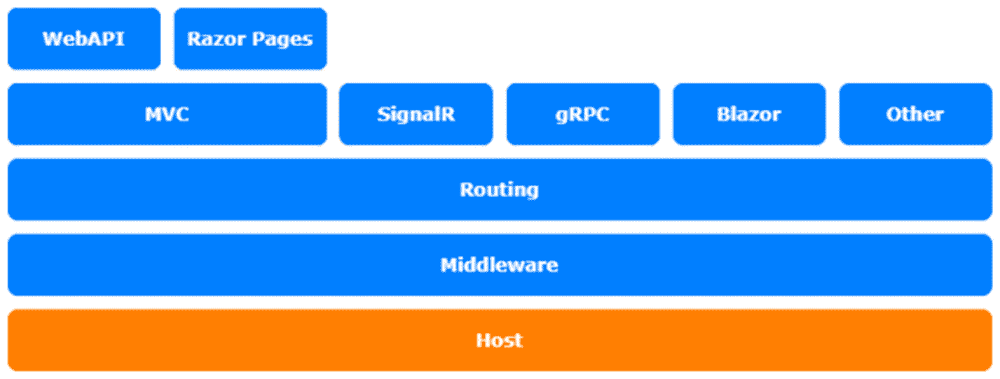
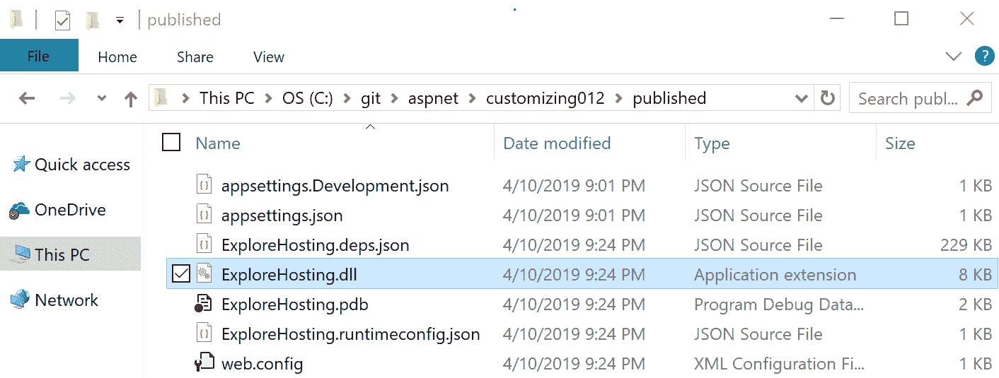
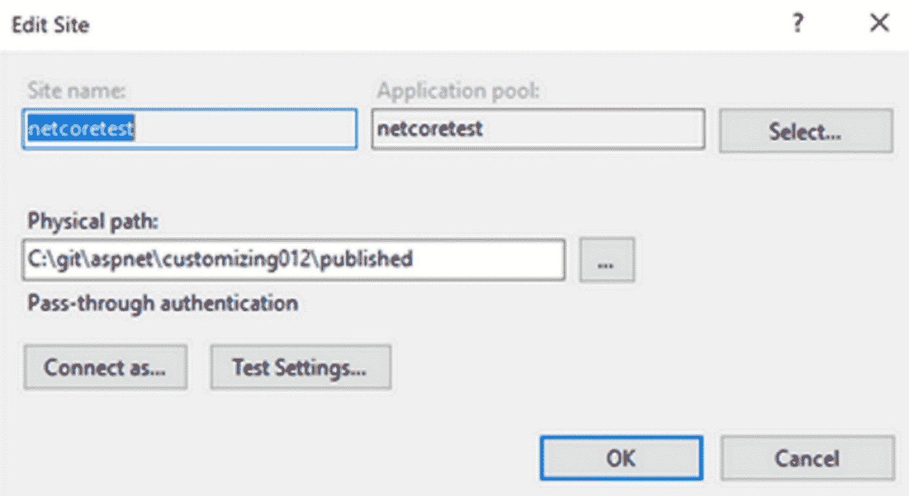

# *第 12 章*：使用不同的托管模式

在本章中，我们将讨论如何在 ASP.NET Core中自定义托管。我们将研究托管选项、不同类型的托管，并快速查看 IIS 上的托管。本章只是一个概述。关于每一个主题，我们可以进行更详细的讨论，但这将独自填满一本完整的书！

在本章中，我们将介绍以下主题：

*   设置`WebHostBuilder`
*   设置红隼
*   设置 HTTP.sys
*   在 IIS 上托管
*   在 Linux 上使用 NGINX 或 Apache

本章中的主题涉及 ASP.NET Core架构的**主机**层：



图 12.1–ASP.NET Core体系结构

本章讨论服务器体系结构的以下主题：


图 12.2–ASP.NET 服务器体系结构

# 技术要求

对于r 本系列，我们只需要设置一个小的空 web 应用：

```cs
dotnet new web -n ExploreHosting -o ExploreHosting
```

就这样。使用 Visual Studio 代码打开它：

```cs
cd ExploreHosting
code .
```

瞧！一个简单的项目将在 VS 代码中打开。

本章的代码可以在 GitHub 上找到：[https://github.com/PacktPublishing/Customizing-ASP.NET-Core-5.0/tree/main/Chapter12](https://github.com/PacktPublishing/Customizing-ASP.NET-Core-5.0/tree/main/Chapter12) 。

# Se安装 WebHostBuilder

与上一章一样，我们将在本节中重点讨论`Program.cs`。`WebHostBuilder`是我们的朋友。这里是我们配置和创建 web 主机的地方。

下面的代码片段是我们在 Visual Studio 中使用**文件****新建****项目**或使用.NET CLI 运行`dotnet new`命令创建的每个新 ASP.NET Core web 的默认配置：

```cs
public class Program
{
    public static void Main(string[] args)
    {
        CreateHostBuilder(args).Build().Run();
    }
    public static IWebHostBuilder CreateHostBuilder(
        string[] args) =>
        Host.CreateDefaultBuilder(args)
            .ConfigureWebHostDefaults(webBuilder =>
            {
                webBuilder.UseStartup<Startup>();
            });
}
```

正如我们在前面的章节中已经知道的，默认构建已经预先配置了所有必要的内容。已为您配置在 Azure 或本地 IIS 上成功运行应用所需的全部资源。

但是您可以覆盖几乎所有这些默认配置，包括主机配置。

接下来，让我们设置红隼。

# 设置红隼

创建`WebHostBuilder`后，我们可以使用各种功能来配置生成器。这里我们已经看到其中一个，它指定了应该使用的启动类。

笔记

正如[*第 4 章*](04.html#_idTextAnchor071)*中所述，使用 Kestrel*配置和定制 HTTPS，Kestrel 是托管应用的一种可能性。Kestrel 是一个内置于.NET 的 web 服务器，基于.NET 套接字实现。以前，它是在`libuv`之上构建的，而`libuv`是 Node.js 使用的同一个 web 服务器。Microsoft 删除了对`libuv`的依赖，并基于.NET 套接字创建了自己的 web 服务器实现。

在上一章中，我们看到了配置红隼选项的`UseKestrel`方法：

```cs
.UseKestrel((host, options) =>
{
    // ...
})
```

第一个参数是访问已配置主机设置或配置本身的`WebHostBuilderContext`类型。第二个参数是配置 Kestrel 的对象。此代码段显示了我们在上一章中为配置主机需要侦听的套接字端点所做的操作：

```cs
.UseKestrel((host, options) =>
{
    var filename = host.Configuration.GetValue(
        "AppSettings:certfilename", "");
    var password = host.Configuration.GetValue(
        "AppSettings:certpassword", "");
    options.Listen(IPAddress.Loopback, 5000);
    options.Listen(IPAddress.Loopback,  5001,  
        listenOptions  =>
        {
            listenOptions.UseHttps(filename, password);
        });
})
```

这将覆盖您可以传入 URL 的默认配置；例如，使用`launchSettings.json`的`applicationUrl`属性或环境变量。

现在让我们看看如何设置`HTTP.sys`。

# 设置 HTTP.sys

还有另一种托管选择；一个不同的web 服务器实现。`HTTP.sys`是一个相当成熟的库，深入 Windows，可用于托管 ASP.NET Core应用：

```cs
.UseHttpSys(options =>
{
    // ...
})
```

`HTTP.sys`与红隼不同。它不能在 IIS 中使用，因为它与 IIS 的 ASP.NET Core模块不兼容。

使用`HTTP.sys`代替 Kestrel 的的主要原因是**Windows 身份验证**，不能在 Kestrel 中使用。如果您需要在没有 IIS 的情况下将应用公开到 internet，也可以使用`HTTP.sys`。

笔记

IIS 已经在`HTTP.sys`之上运行多年。这意味着`UseHttpSys()`和 IIS 使用相同的 web 服务器实现。欲了解更多关于`HTTP.sys`的信息，请阅读文档，相关链接可在*进一步阅读*部分找到。

接下来，让我们看看如何使用 IIS 进行托管。

# 在 IIS 上托管

ASP.NET Core应用不应直接暴露于互联网，即使它支持 Kestrel 或`HTTP.sys`。最好在两者之间有一个反向代理，或者至少有一个监视托管过程的服务。对于 ASP.NET Core，IIS isn 不仅仅是一个反向代理。它还负责托管进程，以防它因错误而中断。如果发生这种情况，IIS 将重新启动进程。NGINX 可以用作 Linux 上的反向代理，它还负责托管进程。

要在 IIS 或 Azure 上托管 ASP.NET Core web，您需要先发布它。发布不仅仅是编译项目；它还准备在 IIS、Azure 或 Linux 上的 web 服务器（如 NGINX）上托管项目。

以下命令将发布项目：

```cs
dotnet publish -o ..\published -r win-x64
```

在系统浏览器中查看时，应如下所示：



图 12.3–一个.NET 已发布文件夹

这将生成可在 IIS 中映射的输出。它还创建一个`web.config`文件来添加 IIS 或 Azure 的设置。它以 DLL 的形式包含已编译的 web 应用。

如果发布自包含的应用，它还包含运行时本身。一个自包含的应用带来了自己的.NET Core运行时，但是交付的大小增加了很多。

在 IIS 中呢？只需在 IIS 中创建一个新网站，并将其映射到您放置已发布输出ut 的文件夹：



图 12.4–.NET 发布对话框

如果您需要更改安全性，如果您有一些数据库连接，等等，那么它会变得更复杂一些。这可能是单独一章的主题。不过，这里有一个快速版本：


图 12.5–你好，世界！在浏览器中查看

*图 12.5*是演示项目`startup.cs`中小型中间件的输出：

```cs
app.Run(async (context) =>
{
    await context.Response.WriteAsync("Hello World!");
});
```

接下来，我们将讨论 Linux 的一些替代方案。

# 在 Linux 上使用 NGINX 或 Apache

在Linux 上发布 ASP.NET Core应用与在 IIS 上发布 ASP.NET Core应用的方式非常相似，但为反向代理准备 ASP.NET Core应用需要一些额外的步骤。您将需要一个 web 服务器，如**NGINX**或**Apache**作为反向代理服务器，将流量转发给 Kestrel 和 ASP.NET Core应用：

1.  First, you need to allow your app to accept two specific forwarded headers. To do this, open the `Startup.cs` file and add the following lines to the `Configure` method before the `UseAuthentication` middleware:

    ```cs
    app.UseForwardedHeaders(new ForwardedHeadersOptions
    {
        ForwardedHeaders = ForwardedHeaders.XForwardedFor 
            | ForwardedHeaders.XForwardedProto
    });
    ```

    您还需要信任来自反向代理的传入流量。这需要您在`ConfigureServices`方法中添加以下行：

    ```cs
    services.Configure<ForwardedHeadersOptions>(options =>
    {
        options.KnownProxies.Add(
            IPAddress.Parse("10.0.0.100"));
    });
    ```

    在此处添加代理的 IP 地址。这只是一个样本。

2.  Then, you need to publish the application:

    ```cs
    dotnet publish --configuration Release
    ```

    将生成输出复制到名为`/var/www/yourapplication`的文件夹中。您还应该通过调用以下命令在 Linux 上进行快速测试：

    ```cs
    dotnet <yourapplication.dll>
    ```

    这里，`yourapplication.dll`是已编译的应用，包括路径。如果一切正常，您应该能够通过`http://localhost:5000/`呼叫您的网站。

3.  If it is working, the application should run as a service. This requires you to create a service file on `/etc/systemd/system/`. Call the file `kestrel-yourapplication.service` and place the following content in it:

    ```cs
    [Unit]
    Description=Example .NET Web API App running on Ubuntu
    [Service]
    WorkingDirectory=/var/www/yourapplication
    ExecStart=/usr/bin/dotnet /var/www/yourapplication/yourapplication.dll
    Restart=always
    # Restart service after 10 seconds if the dotnet service   # crashes:
    RestartSec=10
    KillSignal=SIGINT
    SyslogIdentifier=dotnet-example
    User=www-data
    Environment=ASPNETCORE_ENVIRONMENT=Production
    Environment=DOTNET_PRINT_TELEMETRY_MESSAGE=false
    [Install]
    WantedBy=multi-user.target 
    ```

    确保第 5 行和第 6 行中的路径指向放置生成输出的文件夹。此文件定义应用应作为服务在默认端口上运行。它还监视应用并在其崩溃时重新启动。它还定义了用于配置应用的环境变量。参见[*第 1 章*](01.html#_idTextAnchor018)*定制日志*，了解如何使用环境变量配置应用。

接下来，我们将了解如何配置 NGINX。

## 配置 NGINX

现在您可以使用以下代码告诉 NGINX 要做什么：

```cs
server {
    listen        80;
    server_name   example.com *.example.com;
    location / {
        proxy_pass         http://localhost:5000;
        proxy_http_version 1.1;
        proxy_set_header   Upgrade $http_upgrade;
        proxy_set_header   Connection keep-alive;
        proxy_set_header   Host $host;
        proxy_cache_bypass $http_upgrade;
        proxy_set_header   X-Forwarded-For 
         $proxy_add_x_forwarded_for;
        proxy_set_header   X-Forwarded-Proto $scheme;
    }
}
```

这会告诉 NGINX 将端口`80`上的呼叫转发到`example.com`，并将其子域转发到`http://localhost:5000`，后者是您应用的默认地址。

## 配置 Apache

Apache 配置看起来非常类似于 NGINX 方法，并且在最后做了相同的事情：

```cs
<VirtualHost *:*>
    RequestHeader set "X-Forwarded-Proto" expr=%{REQUEST_      SCHEME}
</VirtualHost>
<VirtualHost *:80>
    ProxyPreserveHost On
    ProxyPass / http://127.0.0.1:5000/
    ProxyPassReverse / http://127.0.0.1:5000/
    ServerName www.example.com
    ServerAlias *.example.com
    ErrorLog ${APACHE_LOG_DIR}yourapplication-error.log
    CustomLog ${APACHE_LOG_DIR}yourapplication-access.log 
     common
</VirtualHost>
```

NGINX 和 Apache 就是这样。现在让我们来总结一下这一章。

# 总结

ASP.NET Core 和.NET CLI 已经包含了在各种平台上启动和运行的所有工具，以及为 Azure 和 IIS 以及 NGINX 做好准备的所有工具。这非常简单，文档中对此进行了详细描述。

目前，我们有`WebHostBuilder`来创建应用的托管环境。在版本 3.0 中，我们有`HostBuilder`，它能够创建一个完全独立于任何 web 上下文的托管环境。

在本书的最后一章中，我们将研究新的端点路由，它允许您以简单灵活的方式创建自己的托管端点。

# 进一步阅读

*   **红隼文献**：[https://docs.microsoft.com/en-us/aspnet/core/fundamentals/servers/kestrel](https://docs.microsoft.com/en-us/aspnet/core/fundamentals/servers/kestrel)
*   **HTTP.sys 文档**：[https://docs.microsoft.com/en-us/aspnet/core/fundamentals/servers/httpsys?view=aspnetcore-5.0](https://docs.microsoft.com/en-us/aspnet/core/fundamentals/servers/httpsys?view=aspnetcore-5.0)
*   **ASP.NET Core**：[https://docs.microsoft.com/en-us/aspnet/core/host-and-deploy/aspnet-core-module?view=aspnetcore-2.2](https://docs.microsoft.com/en-us/aspnet/core/host-and-deploy/aspnet-core-module?view=aspnetcore-2.2)