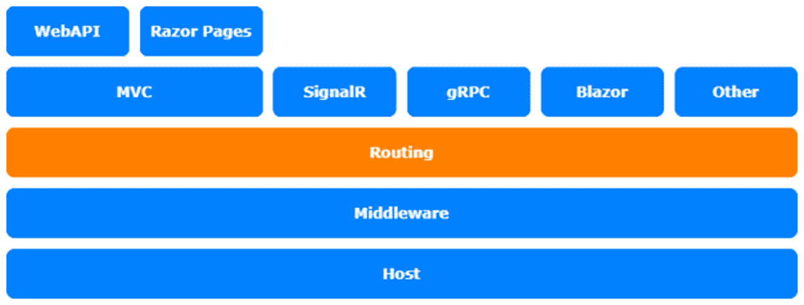

# 十三、处理端点路由

在本章中，我们将讨论 ASP.NET Core中的新端点路由。我们将学习什么是端点路由，它是如何工作的，在哪里使用它，以及如何创建到自己端点的路由。

在本章中，我们将介绍以下主题：

*   探索端点路由
*   创建自定义端点
*   创建更复杂的端点

本章中的主题涉及 ASP.NET Core架构的**路由**层：



图 13.1–ASP.NET Core体系结构

# 技术要求

对于本系列，我们只需要设置一个小的空 web 应用：

```cs
dotnet new mvc -n RoutingSample -o RoutingSample 
```

就这样！使用 Visual Studio 代码打开它：

```cs
cd RoutingSample
code .
```

本章中的所有代码示例都可以在本书的 GitHub 存储库中的[中找到 https://github.com/PacktPublishing/Customizing-ASP.NET-Core-5.0/tree/main/Chapter13](https://github.com/PacktPublishing/Customizing-ASP.NET-Core-5.0/tree/main/Chapter13) 。

# E探索端点路由

要了解**端点路由**，您需要了解什么是端点，什么是路由。

**端点**是当路由将传入请求映射到应用时执行的应用部分。让我们更详细地分析一下这个定义。

客户机通常从服务器请求资源。在大多数情况下，客户端是浏览器。资源由指向特定目标的 URL 定义。在大多数情况下，目标是一个网页。它也可以是一个移动应用，从 JSON Web API 请求特定数据。应用请求的数据在 URL 中定义。

这意味着传入请求也由 URL 定义。另一方面，执行端点映射到特定路由。路由是 URL 或 URL 的模式。ASP.NET Core开发人员已经熟悉这种路由模式：

```cs
app.UseRouting();
app.UseAuthorization();
app.UseEndpoints(endpoints =>
{
    endpoints.MapControllerRoute(
        name: "default",
        pattern: "{controller=Home}/{action=Index}/{id?}");
});
```

如果路由或路由模式与传入请求的 URL 匹配，则请求将映射到该端点。在这种情况下，请求被映射到 MVC 端点。

ASP.NET Core 可以映射到以下端点：

*   控制器（MVC、Web API）
*   剃须刀页面
*   信号器（和 Blazor 服务器）
*   gRPC 服务
*   健康检查

大多数端点都有非常简单的路由模式。只有 MVC 和 WebAPI 使用更复杂的模式。Razor 页面的路由定义基于实际页面的文件夹和文件结构。

在 ASP.NET Core 2.2 引入端点之前，路由只是 MVC 和 Web API 中的一件事。Razor 页面中的隐式路由是在那里构建的，而 Signaler 还没有真正准备好。Blazor 和 gRPC 在当时不是什么东西，健康检查最初是作为中间件实现的。

引入端点路由是为了将路由与实际端点分开。这使得框架更加灵活，新的端点不需要实现它们自己的路由。通过这种方式，端点可以使用现有的灵活路由技术来映射到特定的路由。

接下来，我们将了解如何创建自己的自定义端点。

# 创建自定义端点

创建端点的最简单方法是使用基于 lambda 的端点：

```cs
endpoints.Map("/map", async context =>
{
    await context.Response.WriteAsync("OK");
});
```

这将`/map`路由映射到一个简单的端点，该端点将`"OK"`一词写入响应流。

您可能需要将`Microsoft.AspNetCore.Http`名称空间添加到`using`语句中。

您还可以将特定的 HTTP 方法（例如`GET`、`POST`、`PUT`和`DELETE`映射到端点。下面的代码显示了如何映射`GET`和`POST`方法：

```cs
endpoints.MapGet("/mapget", async context =>
{
    await context.Response.WriteAsync("Map GET");
});
endpoints.MapPost("/mappost", async context =>
{
    await context.Response.WriteAsync("Map POST");
});
```

我们还可以将两个或多个 HTTP 方法映射到一个端点：

```cs
endpoints.MapMethods(
    "/mapmethods", 
    new[] { "DELETE", "PUT" }, 
    async context =>
{
    await context.Response.WriteAsync("Map Methods");
});
```

这些端点看起来像我们在[*第 6 章*](06.html#_idTextAnchor095)*编写自定义中间件*中看到的基于 lambda 的终止中间件。这些是终止管道并返回结果的中间件，例如基于 HTML 的视图、JSON 结构化数据或类似的。端点路由是一种更灵活的创建输出的方法，应该在 ASP.NET Core 3.0 以后的所有版本中使用。

使用路由而不是使用`app.Map`的经典方式有什么好处？

在[*第 6 章*](06.html#_idTextAnchor095)*编写定制中间件*中，我们看到我们可以这样分支管道：

```cs
app.Map("/map1", mapped =>
{
    // some more Middlewares
});
```

这也会创建一个路由，但它只会侦听以`/map`开头的 URL。如果您希望有一个处理模式（如`/map/{id:int?}`）的路由引擎来匹配`/map/456`而不是`/map/abc`，那么您应该使用新的路由，如本节前面所示。

这些基于 lambda 的端点仅对简单场景有用。因为它们是在`Startup.cs`中定义的，如果您开始实施更复杂的场景，事情会很快变得一团糟。

我们应该尝试找到一种更结构化的方法来创建自定义端点。

# C创建更复杂的终点

在本节中，我们将逐步创建更复杂的端点。让我们通过编写一个非常简单的运行状况检查端点来实现这一点，如果您要在 Kubernetes 群集中运行应用，或者只是告诉其他人您的运行状况，您可能需要这样做：

1.  Microsoft proposes starting with the definition of the API to add the endpoint from the developer point of view. We do the same here. This means that we will add a `MapSomething` method first, without an actual implementation. This will be an extension method on `IEndpointRouteBuilder`. We are going to call it `MapMyHealthChecks`:

    ```cs
    // the new endpoint
    endpoints.MapMyHealthChecks("/myhealth");

    endpoints.MapControllerRoute(
        name: "default",
        pattern: 
            "{controller=Home}/{action=Index}/{id?}");
    ```

    新端点应该以与预构建端点相同的方式添加，以免混淆需要使用它的任何开发人员。

    现在我们知道了该方法的外观，让我们来实现它。

2.  We need to create a new static class called `MyHealthChecksExtensions` and place an extension method inside `MapMyHealthChecks`, which extends `IEndpointRouteBuilder` and returns `IEndpointConventionBuilder`:

    ```cs
    public static class MapMyHealthChecksExtensions
    {
        public static IEndpointConventionBuilder 
          MapMyHealthChecks (
            this IEndpointRouteBuilder endpoints, 
            string pattern = "/myhealth")
        {
            // ...
        }
    }
    ```

    这只是骨架。让我们先从实际端点开始，然后再使用它。

3.  The actual endpoint will be written as a terminating middleware, which is a middleware that doesn't call the next one (see [*Chapter 6*](06.html#_idTextAnchor095), *Writing Custom Middleware*) and creates an output to the response stream:

    ```cs
    public class MyHealthChecksMiddleware
    {
        private readonly ILogger<MyHealthChecksMiddleware> 
          _logger;
        public MyHealthChecksMiddleware (
            RequestDelegate next,
            ILogger<MyHealthChecksMiddleware> logger)
        {
            _logger = logger;
        }
        public async Task Invoke(HttpContext context)
        {
            // add some checks here... 
            context.Response.StatusCode = 200;
            context.Response.ContentType = "text/plain";
            await context.Response.WriteAsync("OK");
        }
    }
    ```

    实际工作采用`Invoke`方法完成。目前，这只不过是用明文`OK`和 HTTP 状态`200`进行响应，如果您只想显示您的应用正在运行，这也没关系。可以通过实际检查来扩展该方法，例如检查数据库或相关服务的可用性。然后需要更改 HTTP 状态以及与检查结果相关的输出。

    让我们使用这个终止中间件。

4.  让我们回到`MapMyHealthChecks`方法的框架。我们现在需要创建自己的管道，将其映射到给定的路线。在该方法中放置以下行：

    ```cs
    var pipeline = endpoints
        .CreateApplicationBuilder()
        .UseMiddleware<MyHealthChecksMiddleware>()
        .Build();
    return endpoints.Map(pattern, pipeline)
        .WithDisplayName("My custom health checks");
    ```

5.  这种方法允许您为这个新管道添加更多的中间件。`WithDisplayName`扩展方法将配置的显示名称设置为端点。
6.  就这样！在 IDE 中按*F5*启动应用，并在浏览器中调用`https://localhost:5001/myhealth`。您应该在浏览器中看到**OK**：


图 13.2–端点路由输出的屏幕截图

您还可以将现有的 te终端中间件转换为路由端点，以受益于更灵活的路由。

这一章就到此为止！

# Summary

ASP.NET Core 知道处理请求和向请求客户端提供信息的许多方法。端点路由是一种基于请求的 URL 和请求的方法提供资源的方法。

在本章中，您学习了如何使用终止中间件作为端点，将其映射到新的路由引擎，以便更灵活地匹配您希望通过其向请求客户端提供信息的路由。

这一章是本书的最后一章。我希望定制 ASP.NET Core框架的十三个方案和配方将帮助您改进应用，并从 ASP.NET Core中获得更多。

最后，我还要说谢谢你读了这本书！