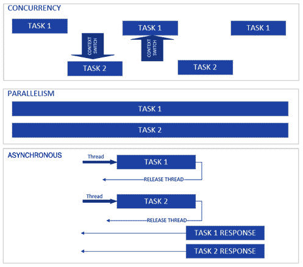
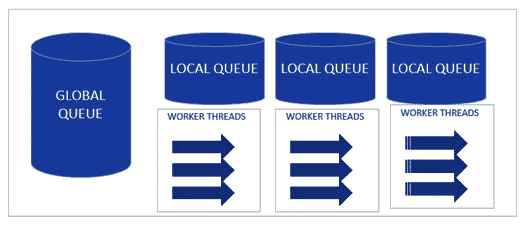
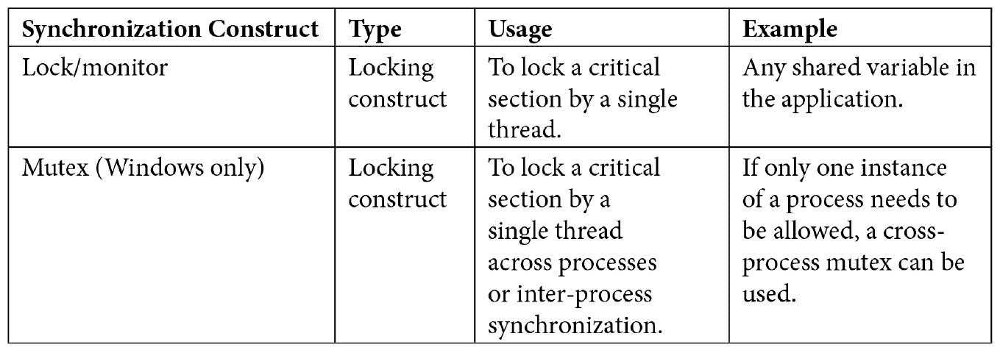
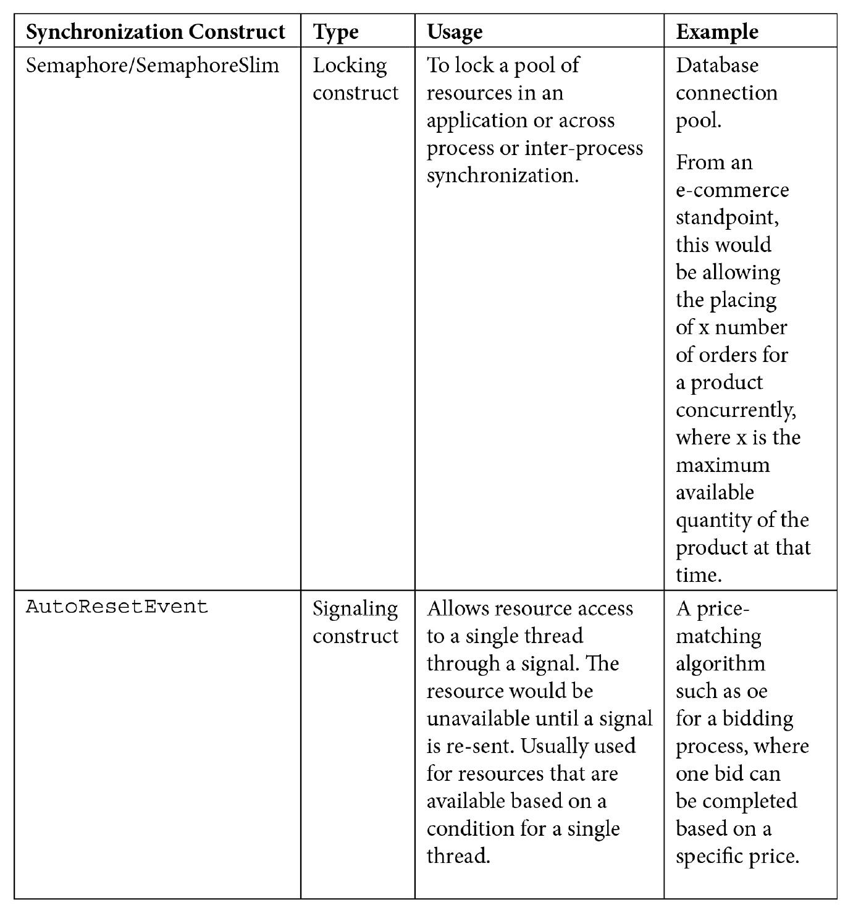
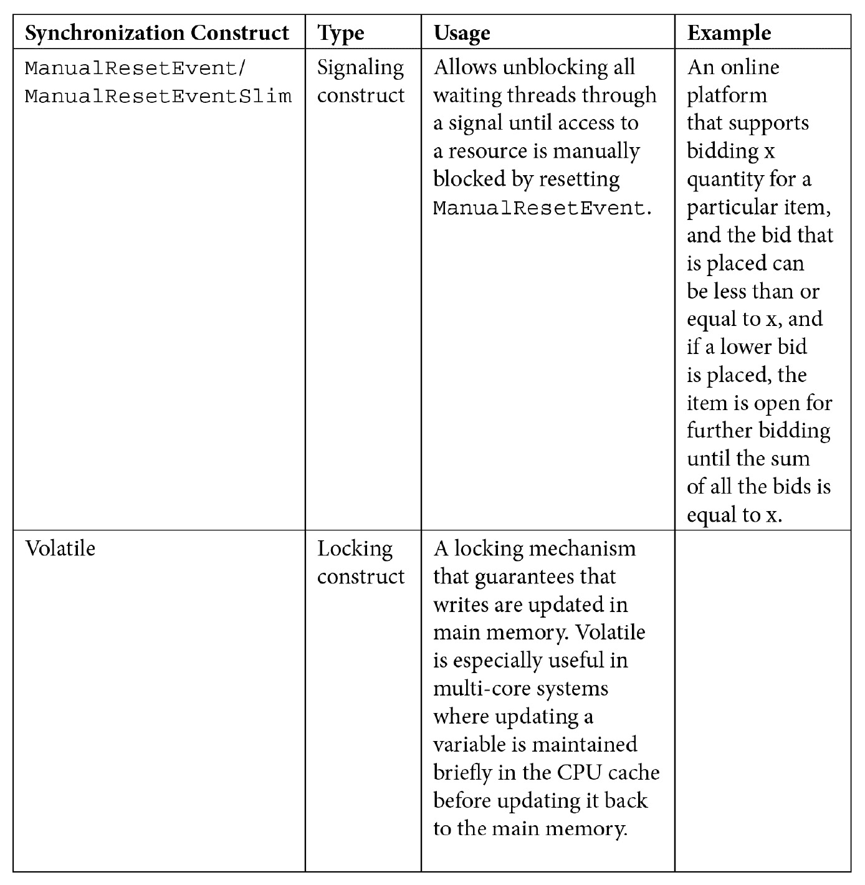
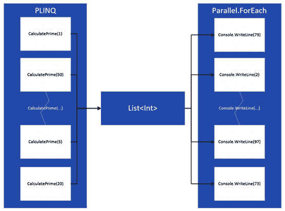
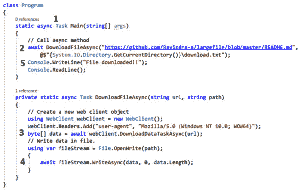
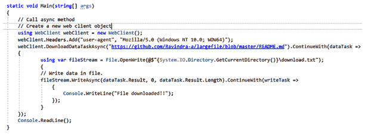
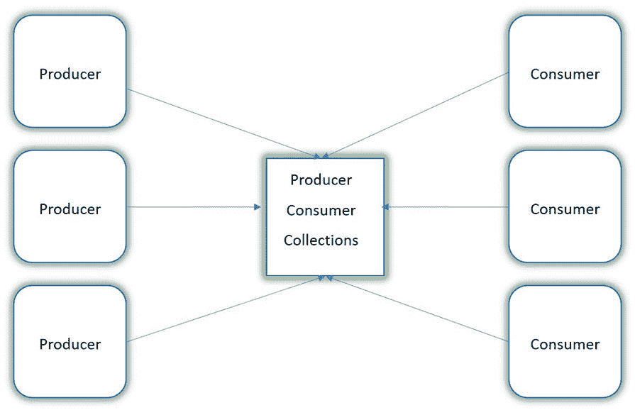

# *章 4* :线程和异步操作

到目前为止，我们看了各种设计原则，模式，什么是新的。NET 5，以及我们将在本书中使用的架构指南。在本章中，我们将看到如何在构建企业应用时利用异步编程。任何 web 应用的关键衡量标准之一是可伸缩性，也就是说，可伸缩性可以减少服务请求所需的时间，增加服务器可以处理的请求数量，并在不增加加载时间的情况下增加应用可以同时服务的用户数量。对于移动/桌面应用，缩放可以提高应用的响应能力，允许用户在不冻结屏幕的情况下执行各种操作。适当使用异步编程技术和并行构造可以在改进这些度量方面创造奇迹，在 C#中最好的事情就是**任务并行库** ( **TPL** )的简化语法，async-wait，用它我们可以编写干净的异步代码。

在本章中，我们将涵盖以下主题:

*   理解行话
*   线程去神秘化、延迟初始化和`ThreadPool`
*   理解锁、信号量和`SemaphoreSlim`
*   介绍任务和相似之处
*   引入异步等待
*   使用并行集合实现并行

# 技术要求

你需要对……有一个基本的了解。NET Core、C#和 LINQ 的基础知识。本章的代码示例可以在这里找到:[https://github . com/PacktPublishing/Enterprise-Application-Development-with-C-Sharp-9-and-。NET-5/树/主/第 04 章](https://github.com/PacktPublishing/Enterprise-Application-Development-with-C-Sharp-9-and-.NET-5/tree/master/Chapter04)

这里有一些代码说明:

[https://github . com/PacktPublishing/Enterprise-Application-Development-with-C-Sharp-9-and-。NET-5/树/主/企业% 20 应用](https://github.com/PacktPublishing/Enterprise-Application-Development-with-C-Sharp-9-and-.NET-5/tree/master/Enterprise%20Application)

# 理解行话

在我们深入线程和异步操作的技术细节之前，让我们举一个真实的例子，在现实生活中的多任务和并行编程之间建立一个类比。想象一下，你在一家餐馆排队点餐，在排队等候时，你回复了一封电子邮件。然后，在点了食物并等待食物到达的同时，你回复了另一封邮件。在餐厅里，有多个柜台，在那里接受订单，在下订单时，食物由厨师准备。

当你排队等候时，你同时回复了一封电子邮件。同样，当你在点菜的时候，餐馆也在许多其他柜台平行点菜。下订单时，厨师正在平行烹饪。此外，还会给你一个代币，让你从取货柜台取食物；但是，根据您食物的准备时间，在您之后下的订单可能会在您之前到达取货柜台。

说起并行编程，有些关键术语会出现多次。下图表示了这种行话:



图 4.1–并发与并行和异步

让我们涵盖每个术语:

*   **并行**:这需要同时独立执行多个任务，就像从不同柜台下多个餐厅订单的例子一样。就企业应用而言，并行性是在多核 CPU 中同时执行多个线程/任务。然而，单核 CPU 也通过超线程支持并行性，这通常涉及将单核逻辑划分为多个内核，如支持超线程的双核 CPU，其行为类似于四核，即四核。
*   **并发**:这需要同时做很多任务，比如我们前面的例子在餐厅柜台排队的时候回复邮件，或者厨师给菜 1 调味，给菜 2 加热锅。就企业应用而言，并发涉及多个线程共享一个核心，并基于它们的时间分片来执行任务和执行上下文切换。
*   **异步**:异步编程是一种依赖于异步执行任务的技术，而不是在当前线程等待时阻塞它。在我们的例子中，异步是等待你的令牌被调用，让你去取货柜台，而厨师正在准备你的食物，但是当你等待的时候，你已经离开了订餐柜台，从而允许下其他订单。这就像一个异步执行的任务，在等待输入/输出任务时释放资源(例如，在等待数据库调用的数据时)。异步的美妙之处在于任务可以并行执行，也可以并发执行，这完全是由框架从开发人员那里抽象出来的，让开发人员将开发精力集中在应用的业务逻辑上，而不是管理任务上。我们将在*任务和平行*部分看到这一点。
*   **多线程**:多线程是一种实现并发的方式，新线程手动创建并并发执行，就像`CLR ThreadPool`一样。在多核/多处理器系统中，多线程通过在不同的内核中执行新创建的线程来帮助实现并行性。

现在我们已经理解了并行编程中的关键术语，接下来让我们看看如何创建线程以及`ThreadPool`在中的作用。NET Core。

# 解除线程神秘化、延迟初始化和线程池

线程是 Windows 中最小的单元，它在处理器中执行指令。进程是一个更大的执行容器，进程内部的线程是使用处理器时间和执行指令的最小单位。要记住的关键一点是，每当你的代码在一个进程中需要被执行时，它应该被分配给一个线程。每个处理器一次只能执行一条指令；这就是为什么在单核系统中，在任何点时间只有一个线程在执行。有一些调度算法用于为线程分配处理器时间。一个线程通常有一个堆栈(跟踪执行历史)、存储各种变量的寄存器和保存需要执行的指令的计数器。

快速查看任务管理器将为我们提供有关物理和逻辑内核数量的详细信息，导航到资源监视器将告诉我们每个内核的 CPU 使用情况。下图显示了支持超线程的四核 CPU 的详细信息，它可以在任意时间点并行执行八个线程:


图 4.2–任务管理器和资源监视器

中的典型应用。NET Core 启动时只有一个单线程，通过手动创建可以添加更多线程。下面几节将简要介绍是如何做到的。

## 使用系统。螺纹，螺纹

我们可以通过创建一个`System.Threading.Thread`的实例并传递一个方法委托来创建新的线程。下面是一个简单的例子，它模拟从应用编程接口检索数据和从磁盘加载文件:

```cs
        static void Main(string[] args)
        {
            Thread loadFileFromDisk = new 
             Thread(LoadFileFromDisk);
            loadFileFromDisk.Start();
            Thread fetchDataFromAPI = new 
             Thread(FetchDataFromAPI);
            fetchDataFromAPI.Start("https://dummy/v1/api"); //Parameterized method
            Console.ReadLine();
        }
        static void FetchDataFromAPI(object apiURL)
        {
            Thread.Sleep(2000);
            Console.WriteLine("data returned from API");
        }
        static void LoadFileFromDisk()
        {
            Thread.Sleep(2000);
            Console.WriteLine("File loaded from disk");
        }
```

在之前的代码中，`FetchDataFromAPI`和`LoadFileFromDisk`是将在新线程上运行的方法。

小费

在任何时间点，每个内核上只执行一个线程；也就是说，只有一个线程被分配了 CPU 时间。因此，为了实现并发性，**操作系统** ( **操作系统**)会在分配了 CPU 时间的线程空闲时或高优先级线程到达队列时进行上下文切换(也可能有其他原因，例如线程正在等待同步对象或达到了分配的 CPU 时间)。因为一个被切换出去的线程不会完成它的工作，在某个时候它会再次被分配 CPU 时间。因此，操作系统需要保存线程的状态(其堆栈、寄存器等)，并在分配给线程 CPU 时间时再次检索。上下文切换通常非常昂贵，也是性能提升的关键领域之一。

`Thread`类的所有属性和方法可以在[上进一步查看。view=net-5.0](https://docs.microsoft.com/en-us/dotnet/api/system.threading.thread?view=net-5.0) 。

尽管管理的优势在于可以更好地控制线程的执行方式，但它也带来了以下形式的开销:

*   管理线程的生命周期，如创建线程、回收线程和上下文切换。
*   实现一些概念，例如线程执行的进度跟踪/报告。此外，取消相当复杂，支持有限。
*   线程上的异常需要适当处理，否则可能导致应用崩溃。
*   调试、测试和代码维护可能会变得有点复杂，如果处理不当，有时会导致性能问题。

这就是**公共语言运行时** ( **CLR** ) `ThreadPool`发挥作用的地方，这将在下一节讨论。

## 线程池

可以通过使用由管理的线程池来创建线程。NET Core，更俗称 CLR `ThreadPool`。CLR `ThreadPool`是一组工作线程，与 CLR 一起加载到您的应用中，并负责线程生命周期，包括回收线程、创建线程和支持更好的上下文切换。CLR `ThreadPool`可以被`System.Threading.ThreadPool`类中可用的各种 API 使用，特别是对于调度线程上的操作，有`QueueUserWorkItem`方法，它接受需要调度的方法的委托。在前面的代码中，让我们用下面的代码替换创建新线程的代码，这意味着应用将使用`ThreadPool`:

```cs
ThreadPool.QueueUserWorkItem(FetchDataFromAPI);
```

顾名思义，`ThreadPool`类的`QueueUserWorkItem`确实使用了队列，因此任何应该在`ThreadPool`线程上执行的代码都会被排队，然后出列，也就是说，以**先进先出**(先进先出)的方式分配给一个工作线程。

`ThreadPool`的设计方式是它有一个全局队列，当我们执行以下操作时，项目会在其中排队:

*   使用不属于`ThreadPool`线程的线程调用`QueueUserWorkItem`或`ThreadPool`类的类似方法。
*   通过**任务并行库** ( **第三方物流**)调用。

当在`ThreadPool`中创建新线程时，它维护自己的本地队列，该队列实际上查看全局队列，并以先进先出的方式将工作项出列；但是，如果在这个线程上执行的代码进一步创建了另一个线程，比如一个子线程，那么它就会在本地队列中排队，而不是在全局队列中排队。工作线程的本地队列中的操作的执行顺序总是后进先出，其原因是最近创建的工作项在缓存中可能仍然很热，因此可以快速执行。同样，我们可以说在任何时间点都会有`ThreadPool`中的 *n+1* 队列，其中 *n* 是`ThreadPool`中的线程数，即 *n* 本地队列，而 *1* 是指全局队列。

`ThreadPool`的高级表示如下图所示:



图 4.3–线程池高级表示

除了`QueueUserWorkItem`之外，还有很多其他属性/方法可用于`ThreadPool`类，例如:

*   `SetMinThreads`:用于设置程序启动时`ThreadPool`将拥有的最小工作线程和异步 I/O 线程。
*   `SetMaxThreads`:用于设置`ThreadPool`将拥有的最大工作线程和异步 I/O 线程，之后新的请求将排队。

`ThreadPool`类的所有属性和方法可以在[上进一步查看。view=net-5.0](https://docs.microsoft.com/en-us/dotnet/api/system.threading.threadpool?view=net-5.0) 。

虽然通过`ThreadPool`线程的`QueueUserWorkItem`编写多线程代码简化了线程的生命周期管理，但它也有自己的局限性:

*   我们无法从`ThreadPool`线程上调度的工作中得到响应，因此委托的返回类型是无效的。
*   跟踪在`ThreadPool`线程上安排的工作进度并不容易，所以像进度报告这样的事情并不容易实现。
*   它不适合长时间运行的请求。
*   `ThreadPool`线程始终是后台线程；因此，与前台线程不同，如果一个进程关闭，它不会等待`ThreadPool`线程完成工作。

由于`QueueUserWorkItem`有限制，`ThreadPool`线程也可以通过第三方物流消耗，我们将在我们的企业应用中使用它，这将在本章后面介绍。英寸 NET Core，第三方语言无疑是实现并发/并行的首选方法，因为它克服了我们迄今为止看到的所有限制，并最终有助于实现允许应用扩展和响应的目标。

## 惰性初始化

类的惰性初始化是一种模式，其中对象的创建被推迟到第一次使用时。这种模式基于这样一个前提，即只要没有使用类的属性，初始化对象就没有任何好处。因此，这会延迟对象的创建，并最终减少应用的内存占用并提高性能。例如，只有当您要从数据库中检索数据时，才创建数据库连接对象。惰性初始化非常适合保存大量数据并且创建成本可能很高的类。例如，用于加载电子商务应用中所有产品的类只能在需要列出产品时进行延迟初始化。

如下所示，此类的典型实现限制了构造函数中属性的初始化，并具有一个或多个填充类属性的方法:

```cs
        public class ImageFile
        {
            string fileName;
            object loadImage;
            public ImageFile(string fileName)
            {
                this.fileName = fileName;
            }
            public object GetImage()
            {
                if (loadImage == null)
                {
                    loadImage = File.ReadAllText(fileName);
                }
                return loadImage;
            }
        }
```

假设这是一个用于从磁盘加载映像的类，那么在构造函数中加载映像是没有用的，因为在调用`GetImage`方法之前无法使用它。因此，惰性初始化模式建议不要在构造函数中初始化`loadImage`对象，而应该在`GetImage`中初始化，这意味着只有在需要时才会将图像加载到内存中。这也可以通过如下所示的属性来实现:

```cs
        object loadImage;
        public object LoadImage
        {
            get
            {
                if (loadImage == null)
                {
                    loadImage = File.ReadAllText(fileName);
                }
                return loadImage;
            }
        }
```

如您所见，这是缓存对象的典型做法，也称为缓存备用模式，当第一次访问特定对象时，我们会在缓存中加载一个对象。然而，这种实现在多线程代码中有一个挑战，在多线程代码中，对同一文件的磁盘调用可能会发生多次；也就是说，如果两个线程调用`LoadImage`方法或属性，会导致多次调用磁盘。因此，这里肯定需要通过锁或其他机制进行同步，这显然会增加维护开销，并且类实现可能会变得更加复杂。

因此，即使我们可以实现自己的惰性加载模式，在 C#中，我们也有`System.Lazy`类来处理这样的实现。使用`System.Lazy`类的一个主要优点是它是线程安全的。

`System.Lazy`类提供多个构造函数来实现惰性初始化。以下是我们可以利用的两种最常见的方法:

*   Wrapping the class around `Lazy` and using the `Value` method of that object to retrieve data. This is typically used for classes that have initialization logic in constructors. Some sample code follows:

    ```cs
            public class ImageFile
            {
                string fileName;
                public object LoadImage { get; set; }
                public ImageFile(string fileName)
                {
                    this.fileName = fileName;
                    this.LoadImage = $"File {fileName} 
                     loaded from disk";
                }
            }
    ```

    初始化此类时，我们将使用`System.Lazy`类的泛型类型，并将`ImageFile`类作为其类型传递，并将`ImageFile`的对象作为委托传递:

    ```cs
            Lazy<ImageFile> imageFile = new 
             Lazy<ImageFile>(() => new ImageFile("test"));
            var image = imageFile.Value.LoadImage;
    ```

    这里，如果在`ImageFile`类的构造函数中放置一个断点，那么只有在调用`System.Lazy`类的`Value`方法时才会被命中。

*   For classes that have a method to load various parameters, we can pass the method to the `Lazy` class as a delegate. Taking the same previous sample code and moving the file-retrieving logic to a separate method is shown here:

    ```cs
            public class ImageFile
            {
                string fileName;
                public object LoadImage { get; set; }
                public ImageFile(string fileName)
                {
                    this.fileName = fileName;
                }
                public object LoadImageFromDisk()
                {
                    this.LoadImage = $"File 
                     {this.fileName} loaded from disk";
                    return LoadImage;
                }
            }
    ```

    在初始化这个类时，我们将一个 lambda 传递给泛型委托，该泛型委托被传递来初始化`System.Lazy`类的一个对象，如下面的代码所示:

    ```cs
            Func<object> imageFile = new Func<object>(() 
             => { var obj = new ImageFile("test");
            return obj.LoadImageFromDisk(); });
            Lazy<object> lazyImage = new 
             Lazy<object>(imageFile);
            var image = lazyImage.Value;
    ```

这两种方式都将延迟对象的初始化，直到调用`Value`方法。我们需要注意的一件重要的事情是，虽然`Lazy`对象是线程安全的，但是通过值创建的对象不是线程安全的。因此，在这种情况下，`lazyImage`是线程安全的，但`image`不是。因此，它需要在多线程环境中同步。

一般来说，惰性初始化非常适合缓存类和单例类，并且可以进一步扩展到初始化成本较高的对象。

`Lazy`类的所有属性可以在[https://docs.microsoft.com/en-us/dotnet/api/system.lazy-1?进一步查看视图= net-5.0 #定义](https://docs.microsoft.com/en-us/dotnet/api/system.lazy-1?view=net-5.0#definition)。

虽然惰性初始化可以通过用`System.Lazy`类包装底层对象来实现，但是在中也有`LazyInitializer`静态类。NET，可通过其`EnsureInitialized`方法用于惰性初始化。

它有几个构造函数，正如 MSDN 文档中提到的:view=net-5.0。然而，想法是相同的，因为它期望一个对象和一个函数来填充该对象。举前面的例子，如果我们必须使用`LazyInitializer.EnsureInitialized`进行惰性初始化，我们需要将对象的实例和创建实际对象的 lambda 传递给`LazyInitializer.EnsureInitialized`，如下面的代码所示:

```cs
        object image = null;
        LazyInitializer.EnsureInitialized(ref image, () =>
            {
                var obj = new ImageFile("test");
                return obj.LoadImageFromDisk();
            });
```

这里我们是传递两个参数:一个是保存`image`类属性值的对象，另一个是创建`image`类对象并返回图像的函数。因此，这就像调用`System.Lazy`属性的`Value`属性一样简单，而不需要初始化对象的开销。

显然，使用`LazyInitializer`进行惰性初始化的一个额外的小优势是，没有额外的对象没有被创建，这意味着内存占用更小。另一方面，`System.Lazy`提供了可读性更强的代码。所以，如果有明确的*空间优化*，那就去找`LazyInitializer`；否则，使用`System.Lazy`获得更加清晰易读的代码。

# 理解锁、信号量和信号量限制

在前几节中，我们看到了如何在中使用各种 API。NET 来实现并行性。然而，当我们这样做的时候，我们需要额外注意共享变量。让我们以我们在本书中构建的企业电子商务应用为例。想想购买物品的工作流程。假设两个用户计划购买一个产品，只有一个商品可用。假设两个用户都将商品添加到购物车，用户 1 下订单，当订单通过支付网关处理时，用户 2 也尝试下订单。

在这种情况下，第二个订单应该失败(假设第一个订单成功)，因为该书的数量现在是 0；只有对线程间的数量进行适当的同步，这种情况才会发生。此外，如果第一个订单在支付网关中失败或者用户 1 取消他们的交易，则第二个订单应该通过。因此，我们在这里说的是，在处理第一个订单时，数量应该被锁定，并且只有在订单完成时才应该被释放(以成功或失败告终)。在我们进入处理机制之前，让我们快速回顾一下关键部分是什么。

## 临界截面和螺纹安全

关键部分是应用中读取/写入由多个线程使用的变量的部分。我们可以把这些看作是跨应用使用的全局变量，在不同的时间或同一时间在不同的地方被修改。在多线程场景中，在任何时间点都只允许一个线程修改这些变量，并且只允许一个线程进入临界区。如果应用中没有这样的变量/部分，它可以被认为是线程安全的。因此，在应用中识别那些不是线程安全的变量并相应地处理它们总是明智的。为了保护对临界区的访问不受非线程安全变量的影响，有各种可用的构造，称为同步原语或同步构造，主要分为两类:

*   **锁定构造**:允许一个线程进入临界区保护对共享资源的访问，所有其他线程等待，直到锁被获取的线程释放。
*   **信号结构**:这些允许线程通过发信号通知资源的可用性来进入关键部分，就像在生产者-消费者模型中一样，生产者锁定资源，消费者等待信号而不是轮询。

让我们在下一节讨论一些同步原语。

## 引入锁

锁是一个基本类，允许您在多线程代码中实现同步，其中锁语句之间的任何变量只能由一个线程访问。在锁中，获取锁的线程需要释放锁，在此之前，任何试图进入锁的其他线程都会进入等待状态。可以创建一个简单的锁，如下面的代码所示:

```cs
            object locker = new object();
            lock (locker)
            {
                quantity--;
            }
```

第一个执行此代码的线程将获取锁，并在代码块完成后释放锁。也可以使用`Monitor.Enter`和`Monitor.Exit`获取锁，实际上使用锁编译器会将线程内部转换为`Monitor.Enter`和`Monitor.Exit`。关于锁的几个要点如下:

*   由于它们的线程关联性，它们应该总是用在引用类型上。
*   就性能而言，它们非常昂贵，因为它们会在允许线程恢复之前暂停想要进入关键部分的线程，这增加了一些延迟。
*   双重检查获取锁也是一个很好的实践，就像在单例实现中是如何做到的一样。

锁确实有一些问题:

*   您需要锁定正在被修改或枚举的共享数据/对象。在应用中很容易遗漏关键部分，因为*关键部分*更像是一个逻辑术语。如果关键部分周围没有任何锁，编译器不会标记它。
*   如果处理不当，你可能会陷入僵局。
*   Scalability is a problem as only one thread can access a lock at a time, while all other threads have to wait.

    注意

    还有一个重要的概念叫做原子性。只有当没有任何方法可以读取变量的中间状态或将中间状态写入变量时，操作才是原子的。例如，如果一个整数值从 2 修改为 6，任何读取该整数值的线程将只能看到 2 或 6；没有一个线程会看到该线程的中间状态，其中整数只被部分更新。任何线程安全的代码都会自动保证原子性。

    使用并发集合(将在后面一节中介绍)而不是锁，因为并发集合在内部处理锁定关键部分。

## 互斥体(仅限窗口)

互斥体也是锁的一种，它不仅支持锁定进程内的资源，还支持跨多个进程锁定资源。可以使用`System.Threading.Mutex`类创建互斥体，任何想要进入临界区的线程都需要调用`WaitOne`方法。通过`ReleaseMutex`方法释放互斥体；因此，我们基本上创建了一个`System.Threading.Mutex`类的实例，并调用`WaitOne` / `ReleaseMutex`来进入/退出临界区。以下是关于互斥体的几个要点:

*   互斥体有线程亲缘关系，所以调用`WaitOne`的线程需要调用`ReleaseMutex`。
*   `System.Threading.Mutex`类的构造函数接受互斥体的名称，该互斥体可用于跨进程共享。

## 引入信号量和信号量限制

信号量是一种非排他锁，它通过允许多个线程进入一个关键部分来支持同步。然而，与排他锁不同，信号量用于需要限制对资源池的访问的场景，例如，允许应用和数据库之间固定数量的连接的数据库连接池。回到我们在电子商务应用中购买产品的例子，如果一个产品的可用数量是 10，这意味着 10 个人可以将这个项目添加到他们的购物车中并下订单。如果同时下 11 个订单，应允许 10 个用户下订单，第 11 个订单应暂停，直到前 10 个订单完成。

英寸 NET 中，可以通过创建`System.Threading.Semaphore`类的实例并传递两个参数来创建信号量:

*   活动请求的初始数量
*   同时允许的请求总数

下面是一个创建信号量的简单代码片段:

```cs
Semaphore quantity = new Semaphore(0, 10);
```

在这种情况下，`0`表示没有请求获得共享资源，最多允许 10 个并发请求。获取共享资源需要调用`WaitOne()`，释放资源需要调用`Release()`方法。

为了创建信号量，中还有另一个轻量级类。NET，这就是`SemaphoreSlim`，苗条的版本，通常依赖于一个叫做旋转的概念。在这种情况下，无论何时需要锁定共享资源，而不是立即锁定资源，`SemaphoreSlim`使用一个运行几微秒的小循环，这样它就不必经历阻塞、上下文切换和内部内核转换的昂贵过程(信号量使用 Windows 内核信号量来锁定资源)。最终，如果共享资源仍然需要锁定，则`SemaphoreSlim`返回到锁定状态。

创建`SemaphoreSlim`实例几乎与创建信号量完全相同；唯一不同的是，对于锁定，它有`WaitAsync`而不是`WaitOne`。还有`CurrentCount`可用，告诉我们获取的锁数。

关于信号量和`SemaphoreSlim`的一些关键事实如下:

*   由于信号量是用来访问资源池的，信号量和`SemaphoreSlim`没有线程亲缘关系，任何线程都可以释放资源。
*   `Semaphore`班在。NET Core 支持命名信号量。命名信号量可用于跨进程锁定资源；但是，`SemaphoreSlim`类不支持命名信号量。
*   与`Semaphore`不同，`SemaphoreSlim`类支持异步方法和取消，这意味着它可以很好地与异步等待方法一起使用。async-wait 关键字有助于编写非阻塞异步方法，这将在本章后面介绍。

## 选择正确的同步结构

还有其他信号结构要覆盖；下表为您提供了它们的高级使用视图和真实例子:







表 4.1

到目前为止，我们已经涵盖了以下内容:

*   使用`Thread`和`ThreadPool`类多线程的各种方式及其局限性
*   惰性初始化的重要性及其在多线程环境中的作用
*   中可用的各种同步构造。网

当我们创建一些交叉组件时，我们将在后面的章节中使用这些概念。

在下一节中，我们将看到如何通过任务和第三方物流的使用来克服`Thread`和`ThreadPool`的限制。

# 介绍任务和对比

我们知道异步编程有助于我们的应用更好地扩展和响应，所以实现异步应用不应该成为开发人员的开销。`Thread`和`ThreadPool`在帮助实现异步的同时，增加了大量开销，也带来了局限性。因此，微软提出了任务，这使得开发异步应用变得更加容易。事实上，大多数更新的 API 都在。NET 5 只支持异步的编程方式。例如，**通用 Windows 平台** ( **UWP** )甚至没有公开 API 来创建没有任务的线程。因此，理解任务和第三方语言是使用 C#编写异步程序的基础。我们将在这一节深入探讨这些主题，稍后，我们将看到 c# async-wait 关键字与第三方语言相结合如何简化异步编程。

## 任务和第三方物流简介

异步编程背后的思想是没有线程应该等待一个操作；也就是说，框架应该有能力将一个操作包装到某种抽象中，然后一旦操作完成就恢复，而不阻塞任何线程。这个抽象只不过是`Task`类，它通过`System.Threading.Tasks`公开，有助于在. NET 中编写异步代码

`Task`类简化了包装任何等待操作，无论是从数据库中检索的数据、从磁盘加载到内存中的文件，还是任何高 CPU 密集型操作，简化了在单独的线程上运行它，如果需要的话。它具有以下重要特征:

*   `Task`支持操作通过其泛型类型`Task<T>`完成后返回值。
*   `Task`负责调度`ThreadPool`上的线程，并相应地负责分区操作和调度来自`ThreadPool`的多个线程，所有这些都是在抽象执行它的复杂性的同时完成的。
*   报告完成支持通过`CancellationToken`取消，通过`IProgress`进度报告。
*   `Task`支持创建子任务，管理子任务和父任务之间的关系。
*   即使对于多层次父/子任务，异常也会传播到调用应用。
*   最重要的是，`Task`支持异步等待，一旦任务中的操作完成，这有助于恢复调用应用/方法中的处理。

第三方物流是由提供的一组应用编程接口。NET，并提供创建和管理任务的方法。任务可以通过创建一个`System.Threading.Tasks.Task`类的对象并传递一段需要在任务上执行的代码来创建。我们可以通过多种方式创建任务:

*   您可以创建一个`Task`类的对象，并传递一个 lambda 表达式。这种方法需要显式启动，如下面的代码所示:

    ```cs
                Task dataTask = new Task(() => 
                 FetchDataFromAPI("https://foo.com/api"));
                dataTask.Start();
    ```

*   也可以使用`Task.Run`创建任务，如下代码所示，支持在不显式调用`Start()` :

    ```cs
    Task dataTask = Task.Run(() => FetchDataFromAPI ("https://foo.com/api")); 
    ```

    的情况下创建并启动任务
*   创建任务的另一种方法是使用`Task.Factory.StartNew` :

    ```cs
    Task dataTask = Task.Factory.StartNew(() => FetchDataFromAPI("https://foo.com/api"));
    ```

在所有这些方法中，`ThreadPool`线程用于运行`FetchDataFromAPI`方法，通过`dataTask`对象被引用，该对象被返回给调用方以跟踪操作/异常的完成。由于此任务将在`ThreadPool`线程上异步执行，并且所有`ThreadPool`线程都是后台线程，因此应用不会等待`FetchDataFromAPI`方法完成。第三方物流公开了一种等待任务完成的`Wait`方法，类似于`dataTask.Wait()`。下面是一个使用任务的小型控制台应用的代码片段:

```cs
    class Program
    {
        static void Main(string[] args)
        {
            Task t = Task.Factory.StartNew(() => 
             FetchDataFromAPI("https://foo.com"));
            t.Wait();
        }
        public static void FetchDataFromAPI(string apiURL)
        {
            Thread.Sleep(2000);
            Console.WriteLine("data returned from API");
        }
    }
```

在这个片段中，我们使用了一个 lambda 表达式。但是，它可以是委托或操作委托(在无参数方法的情况下)，因此类似下面这样的东西也可以用来创建任务:

```cs
Task t = Task.Factory.StartNew(delegate { FetchDataFromAPI("https://foo.com");});
```

无论哪种方式，您都会收到对`Task`对象的引用，并对其进行相应的处理。如果一个方法是返回值，那么我们可以使用通用版本的`Task`类，并使用`Result`方法从`Task`中检索数据。例如，如果`FetchDataFromAPI`返回一个字符串，我们可以使用`Task<String>`，如下面的代码片段所示:

```cs
            Task<string> t = 
             Task.Factory.StartNew<string>(()
             => FetchDataFromAPI(""));
            t.Wait();
            Console.WriteLine(t.Result);
```

这些方法都有各种附加参数，一些重要的参数如下:

*   使用使用`CancellationTokenSource`类生成的`CancellationToken`类的对象取消。
*   通过`TaskCreationOptions`枚举控制任务创建和执行的行为。
*   `TaskScheduler`的自定义实现，控制任务如何排队。

`TaskCreationOptions`是第三方物流中的一个枚举，它告诉`TaskScheduler`我们正在创建什么样的任务。例如，我们可以创建一个长期运行的任务，如下所示:

```cs
Task<string> t = Task.Factory.StartNew<string>(() => FetchDataFromAPI(""), TaskCreationOptions.LongRunning);
```

虽然这不能保证更快的输出，但它更像是对调度程序本身的一个提示，以进行优化。例如，如果调度程序看到一个长时间运行的任务正在被调度，它可以启动更多的线程。这个枚举的所有选项都可以在[https://docs . Microsoft . com/en-us/dotnet/API/system . threading . tasks . taskscreationoptions？view=net-5.0](https://docs.microsoft.com/en-us/dotnet/api/system.threading.tasks.taskcreationoptions?view=net-5.0) 。

`Task`还支持一起等待多个任务，通过创建并将所有任务作为参数传递给以下方法:

*   `WaitAll`:等待所有任务完成，阻塞当前线程。不建议用于应用开发。
*   `WhenAll`:等待所有任务完成，不阻塞当前线程。通常与异步等待一起使用。推荐用于应用开发。
*   `WaitAny`:等待其中一个任务完成，并阻塞当前线程，直到此时。不建议用于应用开发。
*   `WhenAny`:等待其中一个任务完成，不阻塞当前线程。通常与异步等待一起使用。不建议用于应用开发。

与线程不同，任务具有全面的异常处理支持。让我们在下一节看到这一点。

## 处理任务异常

任务中的异常处理很简单，在任务周围写一个`try`块，然后捕捉异常，这些异常通常被包裹在`AggregateException`中；也就是说，它就像下面的代码片段一样简单:

```cs
            try
            {
                Task<string> t = 
                 Task.Factory.StartNew<string>(()
                 => FetchDataFromAPI(""));
                t.Wait();
            }
            catch (AggregateException agex)
            {
                //Handle exception
                Console.WriteLine(agex.InnerException.Message);
            }
```

在前面的代码中，`agex.InnerException`将给出实际的异常，因为我们正在等待一个任务。然而，如果我们在等待多个任务，我们可以循环通过的将是`InnerExceptions`集合。此外，它还带有一个`Handle`回调方法，可以在`catch`块中订阅，回调一旦被触发就会有关于异常的信息。

与前面的代码一样，对于传播异常的任务，我们需要调用`Wait`方法或其他阻塞构造，如`WhenAll`来触发`catch`阻塞。然而，在引擎盖下，`Task`的任何异常实际上都保存在`Task`类的`Exception`属性中，该属性属于`AggregateException`类型，可以观察到任务中的任何潜在异常。

此外，如果任务是附加子任务或嵌套任务的父任务，或者您正在等待多个任务，则可能会引发多个异常。为了将所有异常传播回调用线程，基础设施将它们包装在一个`AggregateException`实例中。

关于处理异常的更多细节可以在 https://docs . Microsoft . com/en-us/dotnet/standard/parallel-programming/exception-handling-task-parallel-library 上找到。

## 实施任务取消

。NET 提供两个主要类来支持任务的取消:

*   `CancellationTokenSource`:创建取消令牌并支持通过`Cancel`方法取消令牌的类
*   `CancellationToken`:监听取消并在任务被取消时触发通知的结构

对于取消任务，有两种取消类型:一种是任务被错误执行，需要立即取消，另一种是任务已经开始，需要中途停止(中止)。对于前者，我们可以创建一个支持取消的任务。我们使用第三方应用编程接口，并将取消令牌传递给构造函数，如果任务需要取消，则调用`CancellationTokenSource`类的`Cancel`方法，如以下代码片段所示:

```cs
            cts = new CancellationTokenSource();
            CancellationToken token = cts.Token;
            Task dataFromAPI = Task.Factory.StartNew(()
             => FetchDataFromAPI(new List<string> {
                "https://foo.com",
                "https://foo1.com",}), token);
            cts.Cancel();
```

所有的。支持异步调用的 NET Core APIs，比如`HttpClient`类的`GetAsync` / `PostAsync`，有接受取消令牌的重载。对于后一种情况(中止任务)，决定基于将要运行的操作是否支持取消。假设它支持取消，我们可以将取消令牌传递给方法，并在方法调用中检查取消令牌的`IsCancellationRequested`属性并进行相应的处理。

让我们创建一个简单的控制台应用，创建一个支持取消的任务。这里我们正在创建一个`FetchDataFromAPI`方法，它接受一个 URL 列表，并从这些 URL 中检索数据。该方法还支持使用`CancellationToken`取消。在实现中，我们遍历 URL 列表并继续，直到请求取消或者循环完成所有迭代:

```cs
    class Program
    {
        static void Main(string[] args)
        {}
        public static string FetchDataFromAPI(List<string> 
         apiURL, CancellationToken token)
        {
            Console.WriteLine("Task started");
            int counter = 0;
            foreach (string url in apiURL)
            {
                if (token.IsCancellationRequested)
                {
                    throw new TaskCanceledException($"data 
                     from API returned up to iteration 
                       {counter}");
                    //throw new OperationCanceledException($"data from API returned up to iteration {counter}"); // Alternate exception with same result
                    //break; // To handle manually 
                }
                Thread.Sleep(1000);
                Console.WriteLine($"data retrieved from 
                 {url} for iteration {counter}");
                counter++;
            }
            return $"data from API returned up to iteration 
             {counter}";
        }
    }
```

现在用主方法中的四个网址列表调用`FetchDataFromAPI`，如下面的代码所示。这里我们使用`CancellationTokenSource`类的`Token`属性创建`CancellationToken`，并将其传递给`FetchDataFromAPI`方法。我们正在模拟 3 秒后的取消，以便在检索第四个网址之前取消`FetchDataFromAPI`:

```cs
CancellationTokenSource cts = new CancellationTokenSource();
CancellationToken token = cts.Token;
Task<string> dataFromAPI;
try
{
    dataFromAPI = Task.Factory.StartNew<string>(() => 
     FetchDataFromAPI(new List<string> {
    "https://foo.com","https://foo1.com","https://foo2.com","https://foo3.com",
    "https://foo4.com",
}, token));
    Thread.Sleep(3000);
    cts.Cancel(); //Trigger cancel notification to cancellation token
    dataFromAPI.Wait(); // Wait for task completion
    Console.WriteLine(dataFromAPI.Result); // If task is completed display message accordingly
}
catch (AggregateException agex)
{// Handle exception}
```

一旦我们运行了这段代码，我们可以看到三个网址的输出，然后是一个异常/中断(基于在`FetchDataFromAPI`方法中被注释掉的那一行)。

在前面的示例中，我们使用`for`循环和`Thread.Sleep`模拟了一个长时间运行的代码块，取消了任务并相应地处理了代码。但是，可能会出现长时间运行的代码块不支持取消的情况。在这些情况下，我们必须编写一个接受取消令牌的包装器方法，并让包装器在内部调用长时间运行的操作；然后，在主方法中，我们调用包装代码。下面的代码片段显示了一个使用`TaskCompletionSource`的包装方法，这是第三方物流中的另一个类。它是用来通过类中可用的`Task`属性将非基于任务的异步方法(甚至包括基于异步方法的方法)转换为任务。在这种情况下，我们将取消令牌传递给`TaskCompletionSource`，以便其`Task`相应更新:

```cs
        private static Task<string> 
         FetchDataFromAPIWithCancellation(List<string> 
         apiURL, CancellationToken cancellationToken)
        {
            var tcs = new TaskCompletionSource<string>();
            tcs.TrySetCanceled(cancellationToken);
            // calling overload of long running operation that doesn't support cancellation token
            var dataFromAPI = Task.Factory.StartNew(() =>
             FetchDataFromAPI(apiURL));
            // Wait for the first task to complete
            var outputTask = Task.WhenAny(dataFromAPI, 
             tcs.Task);
            return outputTask.Result;
        }
```

在这种情况下，通过`TaskCompletionSource`的`Task`属性跟踪`CancellationToken`，我们创建了另一个任务来调用我们长期运行的操作(没有取消令牌支持的那个)，无论哪个任务先完成，都是我们返回的那个。

当然，需要更新`Main`方法来调用这里所示的包装器(其余代码保持不变):

```cs
            dataFromAPI = Task.Factory.StartNew(() => 
             FetchDataFromAPIWithCancellation(new 
             List<string>
                {
                        "https://foo.com",
                        "https://foo1.com",
                        "https://foo2.com",
                        "https://foo3.com",
                        "https://foo4.com",
                    }, token)).Result;
```

这不会取消基础方法，但仍允许应用在基础操作完成之前退出。

任务取消是一种非常有用的机制，有助于减少尚未开始或已经开始但需要停止/中止的任务中不必要的处理。因此，中的所有异步 API。NET 不支持取消。

## 实现延续

在企业应用中，大多数情况下需要创建多个任务，构建任务的层次结构，创建相关任务，或者创建任务之间的子/父关系。任务延续可以用来定义这样的子任务/子任务。它像 JavaScript 承诺的那样工作，并支持将任务链接到多个级别。就像承诺一样，层次结构中的后续任务在第一个任务之后执行，这可以进一步链接到多个级别。

实现任务延续的方法有很多种，但最常见的方法是使用`Task`类的`ContinueWith`方法，如下例所示:

```cs
class Program
    {
        static void Main(string[] args)
        {
            Task.Factory.StartNew(() => Task1(1)) // 1+2 = 3
                .ContinueWith(a => Task2(a.Result)) // 3*2 = 6
                    .ContinueWith(b => Task3(b.Result))// 6-2=4
                        .ContinueWith(c => 
                          Console.WriteLine(c.Result)); 
            Console.ReadLine();
        }
        public static int Task1(int a) => a + 2;
        public static int Task2(int a) => a * 2;
        public static int Task3(int a) => a - 2;
}
```

正如你可能已经猜到的，这里的输出将是`4`，并且一旦前一个任务的执行完成，每个任务就会执行。

`ContinueWith`接受一个名为`TaskContinuationOptions`的重要枚举，支持不同条件下的延续。例如，我们可以通过`TaskContinuationOptions.OnlyOnFaulted`作为参数来创建一个延续任务，当前面的任务出现异常时执行，或者通过`TaskContinuationOptions.AttachedToParent`来创建一个延续任务，强制父子关系，并强制父任务仅在子任务之后完成执行。

就像`WhenAll`、`WhenAny`一样，`ContinueWith`也有类似的兄弟姐妹，如下:

*   `Task.Factory.ContinueWhenAll`:这将接受多个任务引用作为参数，并在所有任务完成时创建一个延续。
*   `Task.Factory.ContinueWhenAny`:这将接受多个任务引用作为参数，并在引用的任务之一完成时创建延续。

抓住任务继续对于理解异步等待的幕后工作至关重要，我们将在本章后面讨论。

## 同步上下文

`SynchronizationContext`是`System.Threading`中的一个抽象类，有助于线程间的通信。例如，从并行任务更新 UI 元素需要线程连接回 UI 线程并恢复执行。`SynchronizationContext`主要通过这个类的`Post`方法提供这种抽象，该方法接受一个委托在稍后的阶段执行。所以，在前面的例子中，如果我需要更新一个 UI 元素，我需要取 UI 线程的`SynchronizationContext`，调用它的`Post`方法，传递必要的数据来更新 UI 元素。

由于`SynchronizationContext`是一个抽象类，这个类有多种派生类型。比如 Windows 窗体有`WindowsFormsSynchronizationContext`，WPF 有`DispatcherSynchronizationContext`，等等。

`SynchronizationContext`作为一个抽象的主要优点是，不管`Post`方法的覆盖实现如何，它都有助于对委托进行排队。

## 任务调度器

当我们使用前面描述的各种方法创建任务时，我们看到一个任务在`ThreadPool`线程上被*调度*，但是问题是谁或者什么实际上做了那件事。`System.Threading.Tasks.TaskScheduler`是第三方物流中负责在`ThreadPool`线程上排队和执行任务委托的类。

当然，这是一个抽象类，框架附带了两个派生类:

*   `ThreadPoolTaskScheduler`
*   `SynchronizationContextScheduler`

`TaskScheduler`公开一个`Default`属性，默认设置为`ThreadPoolTaskScheduler`。因此，默认情况下，所有任务都被调度到`ThreadPool`线程；然而，图形用户界面应用通常使用`SynchronizationContextScheduler`，以便任务可以成功返回并更新用户界面元素。

。NET Core 附带了复杂的派生类型`TaskScheduler`和`SynchronizationContext`类。然而，它们在 async-wait 中起着主要作用，并且它们有助于快速调试任何与死锁相关的问题。

请注意，查看`TaskScheduler`和`SynchronizationContext`的内部工作方式超出了本书的范围，留给您作为练习。

## 实现数据并行

数据并行就是将一个源集合划分成多个可并行执行的任务，这些任务并行执行相同的操作。对于第三方物流，这在`Parallel`静态类中是可用的，该类公开了像`For`和`ForEach`这样的具有多个重载的方法来处理这样的执行。

假设你有一百万个数字的集合，你需要找到质数。数据并行性在这里非常有用，因为集合可以分成多个范围，并且可以计算质数。一个典型的并行`for`循环如下面的代码片段所示:

```cs
            List<int> numbers = Enumerable.Range(1, 
             100000).ToList();
            Parallel.For(numbers.First(), numbers.Last(), x 
             => CalculatePrime(x));
```

然而，一个更现实的例子是类似图像处理应用的东西，它需要处理图像中的每个像素，并将每个像素的亮度降低五个点。这种操作可以极大地受益于数据并行性，因为每个像素彼此独立，因此可以并行处理。

同样的，在`Parallel`静态类中有一个`ForEach`方法，可以使用如下:

```cs
Parallel.ForEach(numbers, x => CalculatePrime(x));
```

这里列出了使用`Parallel.For`和`Parallel.ForEach`进行数据并行的一些关键优势:

*   适合取消循环；他们在一个常规的`for`循环中工作，就像`break`一样。在`Parallel.For`中，这是通过将`ParallelStateOptions`传递给代表，然后调用`ParallelStateOptions.Break`来支持的。当其中一个任务遇到`Break`时，`ParallelStateOptions`类的`LowestBreakIteration`属性被设置，所有并行任务将迭代，直到达到该数量。`ParallelLoopResult`是`Parallel.For`和`Parallel.ForEach`的返回类型，具有`IsCompleted`属性，表示循环是否过早执行。
*   他们也支持通过`ParallelStateOptions.Stop`立即停止循环。还有`Parallel.For` / `Parallel.ForEach`的部分构造函数接受取消代币，也可以用来模拟`ParallelStateOptions.Stop`；然而，一个环应该被包裹在一个`try…catch`块内，因为`OperationCanceledException`会被抛出。
*   如果其中一个任务抛出异常，所有任务将完成当前迭代，然后停止处理。和任务一样，`AggregateException`被抛出。
*   通过传递`ParallelOptions`和设置`MaxDegreeOfParallelism`来支持并行度，这将控制任务可以并行执行的内核数量。
*   通过范围分区或块分区支持源集合的自定义分区。
*   支持线程或分区范围内的线程安全局部变量。
*   支持嵌套`Parallel.For`循环，它们的同步是自动处理的，不引入任何手动同步。
*   Thread-safety: If each iteration uses a shared variable, synchronization needs to be implemented explicitly. So, to gain the most out of data parallelism, use it for operations that can execute independently for each iteration without depending on shared resources.

    小费

    数据并行应该谨慎使用，因为有时会被误用。就像 4 个人分 40 个任务。如果在 4 个人之间组织这项工作(拆分和合并)比仅仅执行 40 个任务的整体工作要多得多，那么数据并行不是正确的选择。进一步阅读请参考 https://docs . Microsoft . com/en-us/dotnet/standard/parallel-programming/data-parallelism-task-parallel-library。

## 使用平行 LINQ (PLINQ)

PLINQ 是 LINQ 的并行实现；这是`ParallelEnumerable`类中可用的一组 API，支持并行执行 LINQ 查询。让 LINQ 查询并行运行的最简单方法是在 LINQ 查询中嵌入`AsParallel`方法。请参见下面的代码片段，它调用一个计算 1000 个数字的质数的方法:

```cs
List<int> numbers = Enumerable.Range(1, 1000).ToList();
var resultList = numbers.AsParallel().Where(I => CalculatePrime
(i)).ToList();
```

使用 LINQ 查询语法，如下所示:

```cs
var primeNumbers = (from i in numbers.AsParallel()            
                                    where CalculatePrime(i)    
                                            select i).ToList();
```

在内部，这个查询被分成多个较小的查询，在每个处理器上并行执行，因此加快了查询速度。分区的源需要在主线程上合并回来，这样结果(输出集合)就可以循环通过，以便进一步处理/显示。

让我们创建一个控制台应用，使用 PLINQ 结合`Parallel.For`打印给定范围内的所有素数。加入以下方法，取一个数，如果是质数则返回`true`，否则返回`false`:

```cs
    class Program
    {
        static void Main(string[] args)
        {           
        }
        static bool CalculatePrime(int num)
        {
            bool isDivisible = false;
            for (int i = 2; i <= num / 2; i++)
            {
                if (num % i == 0)
                {
                    isDivisible = true;
                    break;
                }
            }
            if (!isDivisible && num != 1)
                return true;
            else
                return false;
        }
    }
```

现在在主方法中，添加以下代码，它创建了一个前 100 个数字的列表我们将使用 PLINQ 循环遍历，然后将其传递给`CalculatePrime`方法；然后，我们将最终使用`Parallel.ForEach`显示质数列表:

```cs
List<int> numbers = Enumerable.Range(1, 100).ToList();
try
{
  var primeNumbers = (from number in numbers.AsParallel() where CalculatePrime(number) == true                                    select number).ToList();
  Parallel.ForEach(primeNumbers, (primeNumber) =>
  {
    Console.WriteLine(primeNumber);
  });
}
catch (AggregateException ex)
{
  Console.WriteLine(ex.InnerException.Message);
}
```

这个示例的输出将是一个素数列表；但是，可以看到输出不会是升序的质数，而是随机的顺序，因为`CalculatePrime`方法是用多个数字并行调用的。

下面是前面代码的内部工作图:



图 4.4–PLINQ 和平行。为每一个

PLINQ 还提供了一种处理每个分区/线程结果的方法，无需使用`ForAll`将结果合并到调用线程的开销，前面的代码可以进一步优化如下:

```cs
            (from i in numbers.AsParallel()
             where CalculatePrime(i) == true
             select i).ForAll((primeNumber) => 
               Console.WriteLine(primeNumber));
```

小费

玩 LINQ/PLINQ 最好的工具之一是 LINQPad 我绝对推荐你从[https://www.linqpad.net/Download.aspx](https://www.linqpad.net/Download.aspx)下载。

PLINQ 需要记住的一些重要事情如下:

*   将结果合并到主线程可以通过使用`WithMergeOption`方法并通过`ParallelMergeOperation`枚举传递适当的值来配置。
*   与其他并行扩展一样，任何异常都作为`AggregateException`返回，所有迭代的执行立即停止。当然，如果异常被包含在委托中而不是被抛出，那么执行可以继续。
*   还有各种其他的扩展方法，比如`AsSequential`和`AsOrdered`，这些可以组合在一个单独的 LINQ 查询中。比如基于此，`AsSequential`可以和`AsParallel`结合，让一些分区可以顺序运行，其他分区可以并行执行。
*   支持使用`WithCancellation`方法取消。
*   通过`WithDegreeOfParallelism`支持平行度。

数据并行和 PLINQ 提供了很多 API，可以用来快速启用代码的并行执行，而不会给应用逻辑增加任何额外的开销。但是，正如上一节所解释的，它们之间有细微的区别，因此应该有不同的用法。

小费

PLINQ 和第三方物流共同构成了并行扩展。

在本节中，我们在许多地方使用了`Thread.Sleep`，但这主要是为了模拟长时间运行的操作；但是，不建议您在生产中使用它。

在下一节中，我们将看到如何将任务与异步等待联系起来，并在企业应用中使用异步等待。

# 引入异步等待

到目前为止，我们已经讨论了使用任务编写异步代码，以及第三方物流如何简化任务的创建和管理。然而，任务主要依靠延续、回调或事件在任务完成后继续执行。在企业应用中，管理这样的代码会很困难；如果链接了太多任务，任何运行时异常都很难调试。这就是 C#引入 async-wait 的地方，async-wait 是 C# 5.0 中引入的一种语言特性，它简化了异步代码的编写，使其更具可读性和可维护性，改进了异常处理，并使调试变得容易。所以，让我们开始异步等待。

`async`是 C#中的一个关键字，用作修饰符，当作为任何方法(或 lambda)的前缀时，会将方法转换为状态机，使该方法能够在其主体中使用`await`关键字。

`await`是 C#中的一个关键字，用作运算符，后跟一个返回可调用对象(通常是任务)的表达式。`await`只能在有`async`修饰符的方法中使用，一旦调用方遇到`await`语句，控制就会返回，事情就会恢复；`await`之后，使用延续完成任务。

## 基于任务的异步模式

**基于任务的异步模式** ( **TAP** )是一种用于实现异步方法的模式，在这种模式中，我们使用`async`修饰符，然后在包装在任务中的异步操作上使用`await`(或任何暴露`GetAwaiter()`的自定义唤醒类型)。简单来说，这种模式包括使用一个具有`async`修饰符并返回任务的方法来表示异步操作；使用`await`进一步等待任何异步操作。下面是一个示例代码片段，它异步下载文件，并使用 TAP 实现:



图 4.5–使用异步等待的异步方法示例

在上图中，控制流程如下(使用图中的数字标签):

1.  应用使用`Main`方法开始执行。由于`Main`以`async`方法为前缀，它被转换成实现状态机的类型。执行继续，直到在`await` `DownloadFileAsync`遇到`await`，线程返回给调用者。
2.  在返回给调用者之前，对`DownloadFileAsync`方法的调用被存储在`Task`对象中，并且对`Task`对象的引用也被保留。`Main`方法的剩余代码包装在该任务的延续中。
3.  一个`ThreadPool`线程将开始执行一个`DownloadFileAsync`方法，并重复相同的步骤；也就是说，它将一个方法转换成实现状态机的类型，继续执行直到遇到`await`，然后被引用的任务被传递回来；剩余的代码被移到该任务的继续部分。
4.  在某个时刻，当`DownloadDataTaskAsync`方法完成时，任务继续被触发，并将执行剩余的代码。
5.  重复该过程，直到引用`DownloadFileAsync`的任务完成并执行其继续，在这种情况下为`Console.WriteLine("File downloaded!!")`，然后应用退出。

在粗略的高级别，代码将被转换，如下所示:



图 4.6–转换后的示例异步方法

虽然这是对异步等待的幕后工作的过度简化，但我们可以看到编译器做了很多繁重的工作，包括生成一个实现状态机的类型，并使用回调的状态继续执行。

我们已经看到编写异步方法是多么简单，在本书的整个过程中，我们将在企业应用中编写许多这样的方法。然而，异步等待不是万灵药；它不是每个应用问题的答案。我们需要验证某些因素来使用异步等待。让我们看看使用异步等待的原则是什么。

注意

如果有`SynchronizationContext`，前面的代码会稍有变化。例如，在 Windows 窗体或 WPF 应用中，使用`SynchronizationContext`或`TaskScheduler.FromCurrentSynchronizationContext`的`Post`方法在当前的`SynchronizationContext`上发布延续。根据标准的命名约定，为了可读性，异步方法以单词`async`作为后缀，但是在语法上并不需要。

## 异步等待的使用原则

当我们开始使用异步等待时，有一些推荐的做法可以让应用利用异步原理。例如，对于嵌套调用，我们应该始终使用 async-wait；不要使用`.Result`等等。这里有一些指导方针可以帮助你有效地使用异步等待。

### 链异步-一路等待

使用 async-await 实现的异步方法应该从 async-await 方法中触发，以便正确等待。如果我们试图使用任务的`Result`方法或`Wait`方法从同步方法调用异步方法，可能会导致死锁。让我们来看下面来自 WPF 应用的代码片段，该应用通过单击按钮从网络下载文件。然而，我们没有等待对异步方法的调用，而是使用了`Task`的`Result`方法:

```cs
        private void Button_Click(object sender, 
         RoutedEventArgs e)
        {
            var task = DownloadFileAsync("https://github.com/Ravindra-a/largefile/blob/master/README.md", @$"{System.IO.Directory.GetCurrentDirectory()}\download.txt");
            bool fileDownload = task.Result; // Or task.GetAwaiter().GetResult()
            if (fileDownload)
            {
                MessageBox.Show("file downloaded");
            }
        }
        private async Task<bool> DownloadFileAsync(string 
         url, string path)
        {
            // Create a new web client object
            using WebClient webClient = new WebClient();
            // Add user-agent header to avoid forbidden errors.
            webClient.Headers.Add("user-agent", 
              "Mozilla/5.0 (Windows NT 10.0; WOW64)");
            byte[] data = await 
              webClient.DownloadDataTaskAsync(url);
            // Write data in file.
            Using var fileStream = File.OpenWrite(path);
            {
                await fileStream.WriteAsync(data, 0, 
                 data.Length);
            }
            return true;
        }
```

在此方法中，`await` `webClient.DownloadDataTaskAsync(url);`之后的代码将永远不会执行，原因如下:

*   一旦遇到等待，参考对象通过`GetAwaiter`方法在`TaskAwaitable`中捕捉`SynchronizationContext`。
*   一旦`async`操作完成，该`await`的继续需要在`SynchronizationContext`上执行(通过`SynchronizationContext.Post`)。
*   然而，`SynchronizationContext`已经被阻塞，因为点击按钮对`task.Result`的调用在同一个`SynchronizationContext`上，并且正在等待`DownloadDataTaskAsync`完成，因此导致死锁。

所以，千万不要挡`async`法；一路异步的最好方法。因此，在前面的代码中，您将调用更改为`await` `DownloadFileAsync`(按钮点击的`async void`–`await`需要一个方法来拥有`async`修饰符)。

注意

同样的代码在 ASP.NET Core 5 应用中运行良好，不会导致死锁，因为 ASP.NET Core 5 没有`SynchronizationContext`并且延续在`ThreadPool`线程上执行，不涉及任何请求上下文；但是，即使在 ASP.NET Core 5 中，仍然不建议阻塞异步调用。

### 配置等待

在前面的讨论中，因为我们有端到端的应用代码，所以更容易找到死锁的原因。但是，如果我们正在开发一个可以在 WPF、ASP.NET Core 5 或。NET Framework 应用，我们需要确保库内的异步代码不会导致死锁，即使调用方可能正在通过同步方法(`GetAwaiter().GetResult()`)使用库方法。

在这种情况下，`Task`提供了一个名为`ConfigureAwait`的方法，该方法接受一个布尔值，当`true`将使用调用方的原始上下文，当`false`将在`await`之后恢复操作，而不依赖于原始上下文。通俗地说，`await`之后的任何代码都将独立执行，而与发起请求的上下文状态无关。

使用`ConfigureAwait(false)`，特别是如果你正在实现一个库方法，因为它将避免在原始上下文上运行一个延续。对于库方法，必须使用`ConfigureAwait(false)`，因为它们永远不应该依赖于调用/原始上下文来继续。例如，以下代码不会导致死锁:

```cs
        private void Button_Click(object sender, RoutedEventArgs e)
        {
            string output = GetAsync().Result; //Blocking code, ideally should cause deadlock.
            MessageBox.Show(output);
        }
        //  Library code         
        public async Task<string> GetAsync()
        {
            var uri = new Uri("http://www.google.com");
            return await new HttpClient().
             GetStringAsync(uri).ConfigureAwait(false);
        }
```

默认情况下，每个`await`表达式都有`ConfigureAwait(true)`，所以建议尽可能显式调用`ConfigureAwait(false)`。除了避免死锁之外，`ConfigureAwait(false)`还提高了性能，因为没有原始上下文的封送处理。

这就把我们带到了是否有场景需要使用`ConfigureAwait(true)`的问题。答案是，在某些场景中，正在构建的自定义`SynchronizationContext`需要回调使用，然后建议使用`ConfigureAwait(true)`，或者至少不要使用`ConfigureAwait(false)`，因为任何任务的默认行为都与`ConfigureAwait(true)`相同。

### 中央处理器限制与输入/输出限制

总是使用异步等待来处理输入输出绑定的工作，使用第三方语言来处理中央处理器绑定的工作来实现异步。诸如数据库调用、网络调用和文件系统调用等输入/输出操作可以用异步等待异步方法包装。然而，像计算 pi 这样的 CPU 密集型操作最好使用第三方物流来处理。

回到我们前面的讨论，异步编程的思想是释放`ThreadPool`线程，而不是等待操作完成。当我们将出站呼叫表示为任务并使用异步等待时，这很容易实现。

然而，对于一个 CPU 密集型操作来说，`ThreadPool`线程将继续在工作线程上执行指令(因为这是一个 CPU 密集型操作，需要 CPU 时间)，并且显然不能释放该线程。这意味着在异步等待中包装一个 CPU 密集型操作不会产生任何好处，这与同步运行它是一样的。因此，处理 CPU 密集型操作的更好方法是使用第三方物流。

这并不意味着我们会在遇到 CPU 密集型方法时停止使用异步等待。推荐的方法是仍然使用异步等待来管理与第三方语言绑定的中央处理器操作，并且仍然不违反我们始终使用异步等待的第一原则。

下面是一个简单的代码片段，使用 async-wait 来管理受 CPU 限制的工作:

```cs
        private async Task CPUIOResult()
        {
            var doExpensiveCalculationTask = Task.Run(() => DoExpensiveCalculation()); //Call a method that does CPU intense operation         
           var downloadFileAsyncTask = DownloadFileAsync();
            await Task.WhenAll(doExpensiveCalculationTask, 
             downloadFileAsyncTask);
        }
private async Task DownloadFileAsync(string url, string path)
        {
            // Implementation
        }
        private float DoExpensiveCalculation()
        {
            //Implementation
        }
```

正如在前面的代码中看到的，仍然可以通过异步等待和第三方语言的混合来管理受 CPU 限制的工作；开发人员需要评估所有可能的选项，并相应地编写他们的代码。

### 避免异步作废

如果一个方法预计不会返回任何东西，那么一定要确保使用异步等待而不是`void`来实现异步方法的返回类型为`Task`或`Task<T>`。这样做的原因是`Task`是一个复杂的抽象，为我们处理很多事情，比如异常处理和任务完成状态。然而，如果一个异步方法有一个异步`void`的返回类型，它就像一个一次性的方法，任何调用这个方法的人都不能知道操作的状态，即使有一个异常。这是因为在`async` `void`方法中，一旦遇到`await`表达式，调用就会返回给调用者，而不引用`Task`，因此没有为其引发异常的引用。对于像 WPF 这样的用户界面应用来说，`async` `void`方法上的任何异常都将导致应用崩溃，但是`async void`事件处理程序是一个例外。

`async` `void`方法的另一个缺点是无法正确编写单元测试和断言。因此，总是建议使用异步`Task`异常作为顶层事件处理程序(这里顶层是关键)，因为顶层事件(如按钮点击或鼠标点击)更多的是单向信号，在异步代码中的使用与同步代码没有任何不同。

在异步 lambdas 的情况下也需要考虑同样的，我们需要避免将异步 lambdas 作为参数传递给以`Action`类型为参数的方法。请参见以下示例:

```cs
    class Program
    {
        static void Main(string[] args)
        {
            long elapsedTime = AsyncLambda(async() =>
            {
                await Task.Delay(1000);
            });
            Console.WriteLine(elapsedTime);
            Console.ReadLine();
        }
        private static long AsyncLambda(Action a)
        {
            Stopwatch sw = new Stopwatch();
            sw.Start();
            for (int i = 0; i < 10; i++)
            {
                a();
            }
            return sw.ElapsedMilliseconds;
        }
}
```

这里预计`elapsedTime`的数值会在 1 万左右。然而，出于同样的原因，它接近 100；也就是说，由于`Action`是返回类型`void`的委托，对`AsyncLambda`的调用会立即返回到`Main`方法(就像对任何`async` `void`方法一样)。这可以通过如下更改`AsyncLambda`来解决(或者只需将参数更改为`Func<Task>`并相应地处理`a()`上的等待)，然后强制调用方始终使用异步:

```cs
        private async static Task<long> AsyncLambda(Func<Task> a)
        {
            Stopwatch sw = new Stopwatch();
            sw.Start();
            for (int i = 0; i < 10; i++)
            {
                await a();
            }
            return sw.ElapsedMilliseconds;
        }
```

提醒一下:如果你的应用中有接受`Action`类型参数的方法，建议你有一个接受`Func<Task>`或`Func<Task<T>>`的重载。一个好的方面是 C#编译器自动处理这个，总是以`Func<Task>`作为参数调用重载。

小费

使用 Visual Studio 2019 异常帮助器功能来调试由框架代码重新引发的异步异常。

## 带 IAsyncEnumerable 的异步流

我们都知道`foreach`是用来绕过`IEnumerable<T>`或者`IEnumerator<T>`的。让我们看一下下面的代码，其中我们从数据库中检索所有员工的身份证，并循环遍历每个员工以打印他们的身份证:

```cs
        static async Task Main(string[] args)
        {
            var employeeTotal = await 
             GetEmployeeIDAsync(5);
            foreach (int i in employeeTotal)
            {
                Console.WriteLine(i);
            }
        }
```

`GetEmployeeIDAsync`实现如下:

```cs
        static async Task<IEnumerable<int>> 
         GetEmployeeIDAsync(int input)
        {
            int id = 0;
            List<int> tempID = new List<int>();
            for (int i = 0; i < input; i++) //Some async DB iterator method like ReadNextAsync
            {
                await Task.Delay(1000); // simulate async
                id += i; // Hypothetically calculation
                tempID.Add(id);
            }
            return tempID;
        }
```

在这里，您可以看到，我们必须使用一个临时列表，直到我们从数据库中收到所有记录，最后我们返回该列表。然而，如果我们的方法中有迭代器，那么 C#中的`yield`是一个显而易见的选择，因为这有助于立即返回结果并避免临时变量。现在，假设您使用了`yield`，如下代码所示:

```cs
yield return id;
```

编译时，您会收到以下错误:

```cs
 The body of 'Program.GetEmployeeIDAsync(int)' cannot be an iterator block because 'Task<IEnumerable<int>>' is not an iterator interface type
```

因此，需要能够将`yield`用于异步方法，并且能够通过集合循环来异步调用应用。这就是 C# 8.0 通过`IAsyncEnumerable`提出异步流的地方，它主要使您能够立即返回数据并异步使用一个集合。因此，前面的代码可以更改如下:

```cs
        static async Task Main(string[] args)
        {
           await foreach (int i in GetEmployeeIDAsync(5))
            {
                Console.WriteLine(i);
            }
       }
        static async IAsyncEnumerable<int> 
         GetEmployeeIDAsync(int input)
        {
            int id = 0;
            List<int> tempID = new List<int>();
            for (int i = 0; i < input; i++)
            {
                await Task.Delay(1000);
                id += i; // Hypothetically calculation
                yield return id;
            }
        }
```

所以，在这里你可以看到，一旦一个方法开始返回，`IAsyncEnumerable`循环可以异步迭代，这在很多情况下有助于编写更干净的代码。

## 遗留模式的包装器

异步处理程序甚至在第三方物流和异步等待之前就已经存在了。NET 框架主要支持两种模式:

*   **异步编程模型** ( **APM** ):用一对方法表示异步操作，通常采用`Begin` / `End`方法的命名约定
*   **基于事件的异步模式** ( **EAP** ):表示通过事件使用方法和回调的异步操作

我们可以使用`TaskCompletionSource`类编写一个包装器，它可以使用一个任务来表示前面提到的模式中的库方法，从而使它与 TAP 兼容。让我们看看在下面的例子中。

### EAP 上的 TAP 包装

对于包装器方法的实现，让我们来看一个`WebClient`类，它有一个`DownloadStringAsync`方法和一个完成事件，`DownloadStringCompleted`。我们需要将这两者打包成一个任务并返回。我们将利用`TaskCompletionSource`并处理其`TrySetResult`和`TrySetException`来更新`TaskCompletionSource`的`Task`属性。下面是代码片段:

```cs
        public static Task<string> DownLoadStringEAPtoTAPWrapper(string url, CancellationToken token)
        {
            TaskCompletionSource<string> tcsWrapperForEAP = 
             new TaskCompletionSource<string>();
            WebClient wc = new WebClient();
            token.Register(() => { 
                tcsWrapperForEAP.TrySetCanceled(); 
            });
            wc.DownloadStringAsync(new Uri(url));
            wc.DownloadStringCompleted += (sender, 
             downloadStringCompletedEventArgs) =>
            {
                if (downloadStringCompletedEventArgs.Error 
                 != null)
                    tcsWrapperForEAP.TrySetException(downloadStringCompletedEventArgs.Error);
                else
                    tcsWrapperForEAP.SetResult(downloadStringCompletedEventArgs.Result);
            };
            return tcsWrapperForEAP.Task;
        }
```

在这里可以看到我们可以简单地利用`TaskCompletionSource`为基于 EAP 的异步 API 编写一个包装器。让我们在下一节中看看如何为基于 APM 的异步库做到这一点。

### APM 上的 TAP 包装

让我们以为例，使用`FileStream.BeginRead`和`FileStream.EndRead`读取遗留代码中的文件。我们编写包装器的方法是创建一个`TaskCompletionSource<T>`的对象，并使用其`Task`属性来设置成功或异常情况场景并返回任务。下面是一个示例方法:

```cs
        public Task<int> ReadAsyncAPMWrapper(FileStream filest, byte[] buffer, int offset, int noOfBytes, CancellationToken token)
        {
            var tcsWrapperForAPM = new 
             TaskCompletionSource<int>();
            //Registering cancellation token, this can be further improved
            token.Register(() => { 
             tcsWrapperForAPM.TrySetCanceled(); });
            filest.BeginRead(buffer, offset, noOfBytes, 
             iAsyncResult =>
            {
                try
                {
                    var asyncState = 
                     iAsyncResult.AsyncState as FileStream;
                    var result = 
                     asyncState.EndRead(iAsyncResult);
                    tcsWrapperForAPM.TrySetResult(result); //Set result on Task
                }
                catch (Exception ex)
                {
                    tcsWrapperForAPM.TrySetException(ex); // Set exception on Task
                }
            }, filest);
            return tcsWrapperForAPM.Task;
        }
```

正如您在前面的代码中看到的，我们使用了`TaskCompletionSource`类的`TrySetResult` / `TrySetException`，它在内部更新实例的`Task`属性，并最终返回任务，该任务可以在任何异步等待方法中使用。

## 线程池饥饿

假设您有一个带有异步代码的应用。但是，您已经注意到，在高负载期间，请求的响应时间会周期性地急剧增加。您进一步研究了它，但是您的服务器的 CPU 没有得到充分利用，您的进程的内存也不高，并且您的数据库也没有成为瓶颈。在这种情况下，您的应用可能会导致所谓的`ThreadPool`饥饿。

`ThreadPool`饥饿是一种状态，在这种状态下，不断添加新的线程来服务并发请求，最终到达一个点`ThreadPool`无法添加更多线程，请求开始出现延迟响应时间，甚至在最坏的情况下开始失败。即使`ThreadPool`能够以每秒一到两个线程的速度增加线程，新的请求可能会以更高的速度到来(如假日期间网络应用的突发负载)。因此，响应时间显著增加。出现这种情况有多种原因；这里列出了其中一些:

*   消耗更多线程来加速长时间运行的受 CPU 限制的工作
*   使用`GetAwaiter().GetResult()`在同步方法中调用异步方法
*   同步原语的不正确使用，例如长时间持有锁的线程和等待获取锁的其他线程

在前面的所有要点中，常见的是阻塞代码；因此，使用阻塞代码，如`Thread.Sleep`即使持续时间很短，或类似`GetAwaiter().GetResult()`的东西，或试图为一个受 CPU 限制的项目分配更多的线程，会增加`ThreadPool`的线程数量，并最终导致饥饿。

`ThreadPool`饥饿可以使用**性能视图**等工具进一步诊断，在该工具中，您可以捕获例如 200 秒的跟踪，并验证流程中线程的增长。如果您看到线程在峰值负载期间快速增长，那么就有可能出现饥饿。

防止`ThreadPool`饥饿的最好方法是在整个应用中使用异步等待，永远不要阻塞任何异步调用。此外，对新创建的操作进行限制也会有所帮助，因为它限制了一次可以排队的项目数量。

在这一节中，我们讨论了两个重要的构造:async-wait 和 TPL，当它们结合在一起时，编写异步代码变得更加简单。在下一节中，我们将了解中可用的各种数据结构。NET 5 来支持同步/线程安全，而无需编写任何额外的代码。

# 使用并行集合进行并行处理

集合类是封装、检索和修改相关数据的枚举集合的最常用类型之一。`Dictionary`、`list`、`queue`和`array`是一些常用的集合类型，但它们不是线程安全的。如果一次只从一个线程访问它们，这些集合是很好的。现实环境将是多线程的，为了使其线程安全，您必须实现各种同步结构，如前一节所述。为了解决这个问题，微软提出了并发收集类，如`ConcurrentQueue`、`ConcurrentBag`、`ConcurrentDictionary`、`ConcurrentStack`等，这些类在内部实现同步时是线程安全的。让我们在接下来的章节中详细了解它们。

## 并发词典

让我们使用字典来模拟一个多线程环境。将任务`t1`视为来自正在添加到字典中的客户端的一个操作，将任务`t2`视为来自正在读取字典的另一个客户端的第二个操作。

我们在每个任务中添加`Thread.Sleep`来模拟现实场景，以确保在本例中一个任务不会先于另一个任务完成。让我们考虑一个包含以下代码片段的示例控制台应用:

```cs
// Task t1 as one operation from a client who is adding to the dictionary.
Dictionary<int, string> employeeDictionary = new Dictionary<int, string>();            
            Task t1 = Task.Factory.StartNew(() =>
            {
                for (int i = 0; i < 100; ++i)
                {
                    employeeDictionary.TryAdd(i, "Employee" 
                     + i.ToString());
                    Thread.Sleep(100);

                }
            });
```

这是`Task` `t2`作为另一个正在读字典的客户端的第二个操作:

```cs
            Task t2 = Task.Factory.StartNew(() =>
            {
                Thread.Sleep(500);
                foreach (var item in employeeDictionary)
                {
                    Console.WriteLine(item.Key + "-" + 
                      item.Value);
                    Thread.Sleep(100);
                }
            });
```

现在两个任务同时执行，如下图:

```cs
try
            {
                Task.WaitAll(t1, t2); // Not recommended to use in production application.
            }
            catch (AggregateException ex) 
            {
                Console.WriteLine(ex.Flatten().Message);
            }
            Console.ReadLine();
```

当您运行此程序时，您将获得以下异常，该异常表明您不能同时修改和枚举集合:


表 4.2

您可能认为现在我们可以添加一个锁来管理线程同步，并为了线程安全避免多线程场景中的这种异常。我在代码中添加了一个锁，只要修改并枚举字典来同步线程。以下是更新后的代码片段:

首先，我们将`Task` `t1`作为正在添加到字典中的客户端的一个操作:

```cs
Dictionary<int, string> employeeDictionary = new Dictionary<int, string>();            
            Task t1 = Task.Factory.StartNew(() =>
            {
                for (int i = 0; i < 100; ++i)
                {
                    //Lock the shared data
                    lock (syncObject)
                    {
                        employeeDictionary.TryAdd(i, 
                          "Employee" + i.ToString());
                    }
                    Thread.Sleep(100);

                }
            });
```

然后我们有`Task` `t2`作为另一个正在读字典的客户的第二个操作:

```cs
            Task t2 = Task.Factory.StartNew(() =>
            {
                Thread.Sleep(500);
                //Lock the shared data
                lock (syncObject)
                {
                    foreach (var item in 
                     employeeDictionary)
                    {
                        Console.WriteLine(item.Key + "-" + 
                         item.Value);
                        Thread.Sleep(100);
                    }
                }
            });
```

现在我们同时执行了这两个任务:

```cs
try
            {
                Task.WaitAll(t1, t2); // Not recommended to use in production application.
            }
            catch (AggregateException ex) 
            {
                Console.WriteLine(ex.Flatten().Message);
            }
            Console.ReadLine();
```

当您运行这段代码时，您不会看到任何异常。但是，正如前面提到的，锁有一些问题，因此可以使用并发集合重写这段代码。他们在内部使用多线程同步技术，这有助于很好地扩展，防止数据损坏，并避免锁的所有问题。

我们可以使用`ConcurrentDictionary`重写代码，它在`System.Collections.Concurrent`命名空间中可用。将样本代码中的`Dictionary`替换为`ConcurrentDictionary`。您也可以删除对`System.Collections.Generic`名称空间的引用，因为现在不使用`Dictionary`。此外，拆除所有锁。更新后的代码如下，我们把`Dictionary`换成了`ConcurrentDictionary`，拆了锁:

我们将`Task t1`作为一个来自添加到字典中的客户端的操作，并发集合不需要显式锁:

```cs
ConcurrentDictionary<int, string> employeeDictionary = new ConcurrentDictionary<int, string>();
            Task t1 = Task.Factory.StartNew(() =>
            {
                for (int i = 0; i < 100; ++i)
                {
                    employeeDictionary.TryAdd(i, "Employee" 
                      + i.ToString());
                    Thread.Sleep(100);

                }
            });
```

然后我们有`Task t2`作为从字典中读取的另一个客户端的第二个操作，并发集合不需要显式锁:

```cs
            Task t2 = Task.Factory.StartNew(() =>
            {
                Thread.Sleep(500);
                foreach (var item in employeeDictionary)
                {
                    Console.WriteLine(item.Key + "-" + 
                       item.Value);
                    Thread.Sleep(100);
                }
            });
```

现在两个任务同时执行:

```cs
try
            {
                Task.WaitAll(t1, t2);
            }
            catch (AggregateException ex) // You will not get Exception
            {
                Console.WriteLine(ex.Flatten().Message);
            }
            Console.ReadLine();
```

当你现在运行程序的时候，你不会得到任何异常，因为所有的操作在`ConcurrentDictionary`都是线程安全和原子的。在开发人员实现锁并在项目变大时维护它们没有开销。这里有一些关于并发集合的注意事项，比如`ConcurrentDictionary`，你需要记住:

*   如果两个线程调用`AddOrUpdate`，不能保证调用哪个工厂委托，甚至不能保证如果工厂委托产生一个项目，该项目将存储在字典中。
*   `GetEnumerator`调用得到的枚举器不是快照，在枚举过程中可以修改(这不会导致任何异常)。
*   键和值属性是相应集合的快照，可能不对应于实际的字典状态。

我们已经详细看了`ConcurrentDictionary`；让我们在下一节中看看其他并发集合。

## 生产者-消费者并发集合

在生产者-消费者并发集合中，一个或多个线程可以产生任务(例如，添加到队列、堆栈或包)，一个或多个其他线程可以消费来自同一集合(队列、堆栈或包)的任务。

`ConcurrentDictionary`，我们在上一节看到的，是一个通用的集合类，您可以在其中添加您想要的项目，并指定您想要读取的项目。其他并发集合是为特定问题设计的:

*   `ConcurrentQueue`是针对你想要先进先出的场景。
*   `ConcurrentStack`是指你想要**后进先出** ( **后进先出**)的场景。
*   `ConcurrentBag`适用于场景，在该场景中，您希望相同的线程产生和消费存储在包中的数据，并且顺序无关紧要。

这三个集合也称为生产者-消费者集合，其中一个或多个线程可以从同一个集合中产生任务和消费任务，如下图所示:



图 4.7–生产者-消费者并发收集

这三个集合都实现了`IProducerConsumerCollection<T>`界面，最重要的方法是`TryAdd`和`TryTake`，如图所示:

```cs
 // Returns: true if the object was added successfully; otherwise, false.        
 bool TryAdd(T item);
 // Returns true if an object was removed and returned successfully; otherwise, false.
 bool TryTake([MaybeNullWhen(false)] out T item);
```

我们以生产者-消费者为例，使用`ConcurrentQueue`进行模拟:

*   **生产者**:客户端向 web 服务发送请求，服务器将请求存储在队列中
*   **消费者**:从队列中拉出请求并进行处理的工作线程

实现如下代码所示:

```cs
//Producer: Client sending request to web service and server storing the request in queue.
ConcurrentQueue<string> concurrentQueue = new ConcurrentQueue<string>();            
            Task t1 = Task.Factory.StartNew(() =>
            {
                for (int i = 0; i < 10; ++i)
                {
                    concurrentQueue.Enqueue("Web request " + i);
                    Console.WriteLine("Sending "+ "Web request " + i);
                    Thread.Sleep(100);
                }
            });
```

现在我们有了`Consumer`，其中`Worker`线程从队列中提取请求并处理它:

```cs
            Task t2 = Task.Factory.StartNew(() =>
            {
                while (true)
                {
                    if (concurrentQueue.TryDequeue(out 
                     string request))
                    {
                        Console.WriteLine("Processing "+ 
                         request);
                    }
                    else
                    {
                        Console.WriteLine("No request");
                    }
                }
            });
```

生产者和消费者任务同时成功执行。等待所有提供的任务在指定的毫秒数内完成执行。请参考以下代码片段:

```cs
try
            {                
                Task.WaitAll(new Task[] { t1, t2 }, 1000);
            }
            catch (AggregateException ex) // No exception
            {
                Console.WriteLine(ex.Flatten().Message);
            }
```

这是根据微软的方法定义:

*   `concurrentQueue.Enqueue`:这在`ConcurrentQueue<T>`的末尾增加了一个对象。
*   `concurrentQueue.TryDequeue`:这是在`ConcurrentQueue`开始的时候尝试移除和返回物体。

运行程序时，可以看到`task` `t1`产生请求，`task` `t2`轮询，然后消耗请求。我们过一会儿再谈细节。我们也说过这些类实现`IProducerConsumerCollection<T>`。因此，我将对前面的代码进行三处修改:

*   将`ConcurrentQueue<string>`替换为`IProducerConsumerCollection<string>`。
*   将`concurrentQueue.Enqueue`替换为`concurrentQueue.TryAdd`。
*   将`concurrentQueue.TryDequeue`替换为`concurrentQueue.TryTake`。

代码现在是这样的:

```cs
IProducerConsumerCollection<string> concurrentQueue = new ConcurrentQueue<string>();
//Removed code for brevity.
Task t1 = Task.Factory.StartNew(() =>
            {
                for (int i = 0; i < 10; ++i)
                {
                    concurrentQueue.TryAdd("Web request " + i);
//Removed code for brevity.
Task t2 = Task.Factory.StartNew(() =>
            {
                while (true)
                {
                    if (concurrentQueue.TryTake(out string 
                     request))
//Removed code for brevity.
```

现在继续运行程序。您可以看到`task` `t1`产生请求，`task` `t2`轮询，然后消费请求。你可以看到所有 10 个请求由`task` `t1`产生，由`task` `t2`消耗。但是有两个问题:

*   生产者按照自己的速度生产，消费者按照自己的速度消费，没有同步。
*   `task` `t2`有消费者连续不定的轮询，对性能和 CPU 使用率都不好，你可以看到**没有请求**正在打印，而我们没有收到`concurrentQueue.TryTake`的任何处理请求。

这就是`BlockingCollection<T>`派上用场的地方。

## 封锁集合< T >类

`BlockingCollection<T>`支持包围和阻挡。边界允许您为集合指定最大容量。控制集合的最大大小有助于防止生成线程在使用线程之前移动太远。多个生产线程可以同时向`BlockingCollection<T>`添加项目，直到集合达到其最大大小，之后它们将被阻止，直到某个项目被消费者移除。

类似地，多个消费线程可以同时从阻塞集合中移除项，直到集合变空，之后它们将被阻塞，直到生产者添加一个项。当不再添加项目时，产生线程可以调用`CompleteAdding`方法，并指示它已经完成添加。这将有助于消费者监控`IsCompleted`属性，以了解当集合为空时不会再添加任何项目。创建`BlockingCollection<T>`类以及边界容量时，还可以根据场景指定要使用的并发集合类型。默认情况下，当您没有指定类型时，收集类型为`BlockingCollection<T>`的`ConcurrentQueue<T>`。

生产者:客户端向网络服务发送请求，服务器将请求存储在队列中。

下面是一个示例代码片段:

```cs
BlockingCollection<string> blockingCollection = new BlockingCollection<string>(new ConcurrentQueue<string>(),5);    
            Task t1 = Task.Factory.StartNew(() =>
            {
                for (int i = 0; i < 10; ++i)
                {
                    blockingCollection.TryAdd("Web request 
                     " + i);
                    Console.WriteLine("Sending " + "Web 
                      request " + i);
                    Thread.Sleep(100);
                }
                blockingCollection.CompleteAdding();
            });
```

然后具有`Worker`线程的消费者从队列中取出项目并处理它:

```cs
            Task t2 = Task.Factory.StartNew(() =>
            {
                while (!blockingCollection.IsCompleted)
                {
                    if (blockingCollection.TryTake(out 
                     string request,100))
                    {
                        Console.WriteLine("Processing " + 
                         request);
                    }
                    else
                    {
                        Console.WriteLine("No request");
                    }
                }
            });
```

现在生产者线程和消费者线程正在并发访问。

代码中有几点需要考虑:

*   `5`的指定边界:`BlockingCollection<string> blockingCollection = new BlockingCollection<string>(new ConcurrentQueue<string>(),5);`。
*   当不再添加项目时，产生线程调用`CompleteAdding`方法来指示它已经完成添加:`blockingCollection.CompleteAdding();`。
*   消费者监控`IsCompleted`属性，发现集合为空时不再添加项目:`while (!blockingCollection.IsCompleted)`。
*   尝试在指定的时间段内从`BlockingCollection<T>`中移除一个项目。比如我已经去了 100 毫秒:`if (blockingCollection.TryTake(out string request, 100))`。

这就是阻塞集合的力量。生产者和消费者都是解耦的，它们可以由不同的团队独立编码，在运行时它们使用一个阻塞的并发集合来互相共享数据；另外，与此同时，流量是通过边界容量来控制的，这样生产者就不会在消费者之前走得太远。

注意

除了我们已经看到的`TryTake`方法，您还可以使用`foreach`循环从阻塞集合中移除项目。你可以在这里阅读:[https://docs . Microsoft . com/en-us/dotnet/standard/collections/thread-safe/how-foreach-to-remove](https://docs.microsoft.com/en-us/dotnet/standard/collections/thread-safe/how-to-use-foreach-to-remove)。

在阻止收藏的情况下，将会出现消费者不得不处理多个收藏并购买或添加物品的情况。在这种情况下，`TakeFromAny`和`AddToAny`方法会对你有所帮助。您可以在这里进一步阅读关于这两种方法:

[https://docs . Microsoft . com/en-us/dotnet/API/system . collections . concurrent . blocking collection-1 . take from any？视图=净-5.0](https://docs.microsoft.com/en-us/dotnet/api/system.collections.concurrent.blockingcollection-1.takefromany?view=net-5.0)

[https://docs . Microsoft . com/en-us/dotnet/API/system . collections . concurrent . blocking collection-1 . addto any？视图=净-5.0](https://docs.microsoft.com/en-us/dotnet/api/system.collections.concurrent.blockingcollection-1.addtoany?view=net-5.0)

# 总结

包装、编写和维护干净的异步代码是困难的。但是，使用中提供的各种构造。NET 和 C#，开发人员现在可以用更少的框架开销编写异步代码，并更加专注于业务需求。在本章中，我们介绍了使用第三方语言、异步等待和并发集合编写可伸缩异步代码的各种方法，还介绍了线程的基础知识和中的`ThreadPool`。NET 来理解框架内部，并为企业应用编写更干净的代码。现在，我们对多线程以及如何在多线程环境中保护共享数据有了更深入的了解。我们学习了使用 async-wait 创建任务和实现异步函数，最后我们学习了中可用的并发集合。NET Core 及其在各种并发场景中的实现。

在下一章中，我们将研究。NET 5 以及它如何在松散耦合企业应用中的各种低级类方面发挥重要作用。

# 问题

1.  In a multi-threaded environment, which of the following data structures should you use to protect data from getting overwritten/corrupted?

    a.`async` - `await`。

    b.任务。

    c.同步结构，如锁。

    d.数据永远不会损坏。

2.  If you have a WPF application that retrieves data from a REST API, which of the following should you implement for better responsiveness?

    a.并行收集

    b.平行。为

    c.`async` - `await`为 REST API 调用

3.  Which of the following should be passed to cancel a task?

    a.`CancellationToken`

    b.`ConcurrentDictionary`

    c.`SemaphoreSlim`

4.  Which of the following is the recommended return type for an asynchronous method that uses async-await and does not return anything?

    a.`async void`

    b.`async Task`

    c.`async book`

    d.`async Task<bool>`

# 进一步阅读

*   [https://www . packtpub . com/product/动手用-c-8 和-net-core-3 进行并行编程/9781789132410](https://www.packtpub.com/product/hands-on-parallel-programming-with-c-8-and-net-core-3/9781789132410)
*   [https://devblogs.microsoft.com/dotnet/configureawait-faq/](https://devblogs.microsoft.com/dotnet/configureawait-faq/)
*   [http://www.albahari.com/threading/](http://www.albahari.com/threading/)