# 六、.NET Core 的配置

中的配置.NET 5 包含应用的默认设置和运行时设置；配置是一个非常强大的特性。我们可以更新功能标志等设置，以启用或禁用功能、相关服务端点、数据库连接字符串、日志记录级别等，并在运行时控制应用行为，而无需重新编译。

在本章中，我们将涵盖以下主题:

*   了解配置
*   利用内置配置提供程序
*   构建自定义配置提供程序

到本章结束时，您将很好地掌握配置概念、配置提供者以及如何在项目中利用它们，并且能够确定适合您的应用的配置和配置源。

# 技术要求

你需要对微软有一个基本的了解.NET 和 Azure。本章的代码可以在这里找到:

[https://github . com/PacktPublishing/Enterprise-Application-Development-with-C-Sharp-9-and-.NET-5/树/主/第 06 章](https://github.com/PacktPublishing/Enterprise-Application-Development-with-C-Sharp-9-and-.NET-5/tree/master/Chapter06)

# 了解配置

配置通常存储为名称-值对，并且可以分组为多级层次结构。在应用启动文件(`Startup.cs`)中，您将获得由提供的默认配置.NET 5。此外，您可以配置不同的内置和自定义配置源，然后在应用的任何地方需要时使用不同的配置提供程序读取它们:

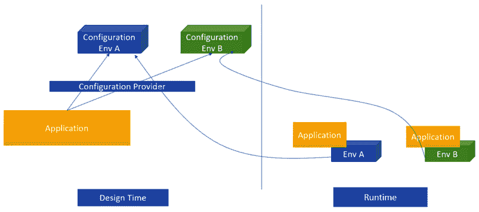

图 6.1–应用和配置

上图显示了应用、配置提供程序和配置文件之间的高级关系。应用使用配置提供程序从配置源读取配置；该配置可以是特定于环境的。 **Env A** 可能是你的开发环境**Env B**可能是你的生产环境。在运行时，应用将根据运行时的上下文和环境读取正确的配置。

在下一节中，我们将看到默认配置是如何工作的，以及如何从`appsettings.json`文件中添加和读取配置。

## 默认配置

为了理解默认配置是如何工作的，让我们创建一个新的.NET 5 web API，将项目名称设置为`TestConfiguration`，打开`Program.cs`。以下是来自`Program.cs`文件的代码片段:

```cs
public class Program
{
     public static void Main(string[] args)
     {
         CreateHostBuilder(args).Build().Run();
     }
     public static IHostBuilder CreateHostBuilder(string[] 
       args) =>

         Host.CreateDefaultBuilder(args)
             .ConfigureWebHostDefaults(webBuilder =>
             {
                 webBuilder.UseStartup<Startup>();
             });
}
```

从前面的代码中，我们看到`CreateDefaultBuilder`负责为应用提供默认配置。

配置的加载按以下顺序进行:

1.  `ChainedConfigurationProvider`:这将添加主机配置并将其设置为第一个源。有关主机配置的更多详细信息，您可以使用以下链接:[https://docs . Microsoft . com/en-us/aspnet/core/foundations/configuration/？视图= aspnet core-3.1 #暖通空调](https://docs.microsoft.com/en-us/aspnet/core/fundamentals/configuration/?view=aspnetcore-3.1#hvac)。
2.  `JsonConfigurationProvider`:这将从`appsettings.json`文件加载配置。
3.  `JsonConfigurationProvider`:从`appsettings.Environment.json`文件加载配置；`Environment`中的`appsettings.Environment.json`可以设置为参考开发、分期、生产等等。
4.  `EnvironmentVariablesConfigurationProvider`:这将加载环境变量配置。
5.  `CommandLineConfigurationProvider`:这将从命令行参数键值对加载配置。

如本节开头所述，配置被指定为源中的键值对。稍后添加的配置提供程序(按照顺序)会覆盖以前的键值对设置。例如，如果您在`appsettings.json`中有一个`DbConnectionString`键以及一个命令行配置源，命令行源中的`DbConnectionString`键的值将覆盖`appsettings.json`的键值对设置。

`Program.cs`之后，接下来要看的重要一课是`Startup.cs`。`Startup.cs`类是在构建应用的主机时指定的，通常通过调用`Program.cs`的主方法中调用的`Host.CreateDefaultBuilder(args).UseStartup<Startup>()"`来指定。

下面是一个使用`ConfigureServices`和`Configure`方法的`Startup.cs`类。应用可以在`ConfigureServices`中注册附加服务，并通过**依赖注入** ( **DI** )使用它们。应用的请求处理管道通过`Configure`方法创建:

```cs
public class Startup
{
    public Startup(IConfiguration configuration)
    {
        Configuration = configuration;
    }
    public IConfiguration Configuration { get; }
    // This method gets called by the runtime. Use this 
    // method to add services to the container.
    public void ConfigureServices(IServiceCollection 
       services)
    {
        services.AddControllers();
    }
    // This method gets called by the runtime. Use this 
    // method to configure the HTTP request pipeline.
    public void Configure(IApplicationBuilder app, 
      IWebHostEnvironment env)
    {
        if (env.IsDevelopment())
        {
            app.UseDeveloperExceptionPage();
        }
        //Removed code for brevity
}
```

调试`Startup.cs`代码时，可以看到`CreateDefaultBuilder`提供的默认配置被注入到配置中，如下所示:


图 6.2–默认配置源

在本节中，我们看到了如何为应用提供默认配置以及提供的顺序。您可以在下面的依赖关系映射和控制流的代码映射中看到这一点:

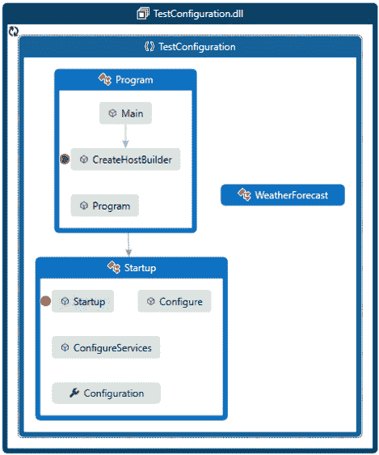

图 6.3–代码映射依赖关系

在下一节中，让我们看看如何添加应用所需的配置。

## 添加配置

正如我们在上一节中看到的，有多个配置源可用。`appsettings.json`文件是现实世界项目中最广泛使用的添加应用所需配置的文件，除非它是一个秘密，不能以纯文本形式存储。

让我们看几个需要配置的常见场景:

*   如果我们需要一个应用洞察仪器键来添加应用遥测，这可以是我们配置的一部分。
*   如果我们有需要调用的依赖服务，这可能是我们配置的一部分

这些可能因环境而异(开发环境和生产环境之间的值不同)。

您可以将以下配置添加到`appsettings.json`文件中，以便在发生更改时可以直接更新它，并且无需重新编译和部署即可开始使用它:

```cs
"ApplicationInsights": {
    "InstrumentationKey": "<Your instrumentation key>"
  }
"ApiConfigs": {
    "Service 1": {
      "Name": "<Your dependent service name 1>",
      "BaseUri": "<Service base uri>",
      "HttpTimeOutInSeconds": "<Time out value in 
        seconds>",      
      "ApiURLs": [
        {
          "EndpointName": "<End point 1>"
        },
        {
          "EndpointName": "<End point 2>"
        }
      ]
    },
    "Service 2": {
      "Name": "<Your dependent service name 2>",
      "BaseUri": "<Service base uri>",
      "HttpTimeOutInSeconds": "<Time out value in 
       seconds>",      
      "ApiURLs": [
        {
          "EndpointName": "<End point 1>"
        },
        {
          "EndpointName": "<End point 2>"
        }
      ]
    }
}
```

从前面的代码中，我们看到我们已经为`ApplicationInsights`仪器键添加了一个键值对，其中键是`InstrumentationKey`字符串，值是应用在`ApplicationInsights`仪器遥测所需的实际仪器键。在`ApiConfigs`部分，我们按照层次顺序添加了多个键值对，配置为来调用我们的依赖服务。

在下一节中，我们将看到如何阅读我们添加的配置。

## 读取配置

我们已经看到了如何将配置添加到`appsettings.json`中。在这一节中，我们将看到如何使用可用的不同选项在项目中阅读它们。

您在`CreateDefaultBuilder`提供的`Startup.cs`中获得的配置对象是`Microsoft.Extensions.Configuration.IConfiguration`类型，您可以在`IConfiguration`中读取以下选项:

```cs
         // Summary:
        //     Gets or sets a configuration value.
        // Parameters:
        //   key:
        //     The configuration key.
        // Returns:
        //     The configuration value.
        string this[string key] { get; set; }

        // Summary:
        //Gets the immediate descendant configuration sub-
        //sections.
        // Returns:
        //     The configuration sub-sections.
        IEnumerable<IConfigurationSection> GetChildren();

        // Summary:
        //     Gets a configuration sub-section with the specified key.
        // Parameters:
        //   key:
        //     The key of the configuration section.
        // Returns:
        //     The Microsoft.Extensions.Configuration.IConfigurationSection.
        // Remarks:
        //     This method will never return null. If no matching sub-section is found with the specified key, an                            empty Microsoft.Extensions.Configuration.IConfigurationSection will be returned.
        IConfigurationSection GetSection(string key);
```

让我们看看如何从`Iconfiguration`利用这些选项来阅读我们在上一节*添加配置*中添加的配置。

要从`appsettings.json`读取应用洞察检测键，我们可以使用以下代码使用`string this[string key] { get; set; }`选项:

```cs
Configuration["ApplicationInsights:InstrumentationKey"];
```

要阅读`ApiConfigs`，我们可以使用以下代码。我们可以在配置 API 的配置键中使用分隔符来读取分层配置:

```cs
Configuration["ApiConfigs:Service 1:Name"];
```

注意

使用分隔符以这种方式读取容易出错，并且难以维护。首选方法是使用 ASP.NET Core提供的**选项**模式。options 模式不是逐个读取每个键/设置值，而是使用类，这也将为您提供对相关设置的强类型访问。

当配置设置被场景隔离到强类型类中时，应用遵循两个重要的设计原则:

*   **接口隔离原理** ( **ISP** ，或封装原理
*   关注点分离

通过 ISP 或封装，您可以通过定义良好的接口或合同读取配置，并且只依赖于您需要的配置设置。此外，如果有一个巨大的配置文件，这将有助于分离关注点，因为应用的不同部分不会依赖于相同的配置，从而允许它们解耦。让我们看看如何在代码中利用选项模式。

您可以创建以下`ApiConfig`和`ApiUrl`类，并将它们添加到您的项目中:

```cs
public class ApiConfig
{       
    public string Name { get; set; }

    public string BaseUri { get; set; }

    public int HttpTimeOutInSeconds { get; set; }

    public List<ApiUrl> ApiUrls { get; set; }
}
public class ApiUrl
{        
    public string EndpointName { get; set; }       
}
```

在构造函数或`Startup.cs`的`ConfigureServices`方法中添加以下代码，使用`GetSection`方法读取配置，然后调用`Bind`将配置绑定到我们拥有的强类型类:

```cs
List<ApiConfig> apiConfigs = new List<ApiConfig>();
Configuration.GetSection("ApiConfigs").Bind(apiConfigs);
```

`GetSection`用指定的键将从`appsettings.json`读取具体的章节。`Bind`将尝试通过将属性名与配置键进行匹配，将给定的对象实例绑定到配置值。如果请求的部分不存在，则`GetSection(string sectionName)`将返回`null`。在现实世界的程序中，请确保您添加了空检查。

在本节中，我们看到了如何通过使用配置 API 来添加和读取`appsettings.json`中的数据。但是我确实提到了我们应该使用`appsettings.json`来显示纯文本，而不是秘密。

在下一节中，我们将了解内置的配置提供程序，以及如何使用 Azure 密钥库配置提供程序添加和读取机密。

# 利用内置配置提供者

除了`appsettings.json`之外，还有多个配置源可用.NET 5 提供了几个内置的配置提供程序来读取它们。以下是的内置提供程序.NET 5:

*   Azure 密钥库配置提供程序从 Azure 密钥库中读取配置。
*   文件配置提供程序从 INI、JSON 和 XML 文件中读取配置。
*   命令行配置提供程序从命令行参数中读取配置。
*   环境变量配置提供程序从环境变量中读取配置。
*   内存配置提供程序从内存集合中读取配置。
*   Azure App 配置提供者从 Azure App 配置中读取配置。
*   每个文件的密钥配置提供程序从目录的文件中读取配置。

让我们看看如何利用 Azure 密钥库配置提供程序和文件配置提供程序，因为这两者都很重要，并且与其他提供程序相比使用更广泛。您可以使用以下链接了解我们在此未详细介绍的其他配置提供商:https://docs . Microsoft . com/en-us/dotnet/core/extensions/configuration-providers

## Azure 密钥库配置提供程序

Azure Key Vault 是一项基于云的服务，提供了一个集中式配置源，用于安全存储密码、证书、API 密钥和其他机密。访问密钥库需要身份验证和授权。身份验证通过**Azure Active Directory**(**AAD**)完成，授权可以通过**基于角色的访问控制** ( **RBAC** )或密钥库访问策略完成。

让我们看看如何创建一个密钥库，向其中添加一个秘密，并使用 Azure 密钥库配置提供程序从应用中访问它。

### 创建密钥库并添加机密

在本节中，我们将使用 Azure Cloud Shell 创建一个密钥库并添加一个秘密。Azure Cloud Shell 是基于浏览器的，可以用来管理 Azure 资源。以下是您需要采取的步骤列表:

1.  Sign in to the Azure portal using https://portal.azure.com. Select the Cloud Shell icon on the portal page:

    

    图 6.4–天青云外壳

2.  You will get an option to select **Bash** or **PowerShell**. Choose **PowerShell**. You can change shells at any time:

    

    图 6.5–Azure 云外壳选项–PowerShell 和 Bash

3.  Create a resource group with the folowing command:

    ```cs
    az group create --name "{RESOURCE GROUP NAME}" --location {LOCATION}
    ```

    我为这个演示运行的实际命令如下:

    ```cs
    az group create --name "ConfigurationDemoVaultRG" --location "East US"
    ```

    `{RESOURCE GROUP NAME}`代表新资源组的资源组名称，`{LOCATION}`代表 Azure 区域(代表您的数据中心)。

4.  Create a key vault in the resource group with the following command:

    ```cs
    az keyvault create --name {KEY VAULT NAME} --resource-group "{RESOURCE GROUP NAME}" --location {LOCATION}
    ```

    下面是我为这个演示运行的实际命令:

    ```cs
    az keyvault create --name "TestKeyVaultForDemo" --resource-group "ConfigurationDemoVaultRG" --location "East US"
    ```

    { `KEY VAULT NAME}`:新密钥库的唯一名称

    `{RESOURCE GROUP NAME}`:上一步创建的新资源组的资源组名称

    `{LOCATION}` : Azure 区域(数据中心)

5.  Create secrets in the key vault as name-value pairs with the following command:

    ```cs
    az keyvault secret set --vault-name {KEY VAULT NAME} --name "SecretName" --value "SecretValue"
    ```

    下面是我为这个演示运行的实际命令:

    ```cs
    az keyvault secret set --vault-name "TestKeyVaultForDemo" --name "TestKey" --value "TestValue"
    ```

    { `KEY VAULT NAME}`:与您在上一步中创建的密钥库名称相同

    `SecretName`:你的秘密的名字

    `SecretValue`:你的秘密的价值

我们现在已经成功创建了名为`TestKeyVaultForDemo`的密钥库，并使用 Azure Cloud Shell 添加了一个密钥为`TestKey`且值为`TestValue`的秘密:

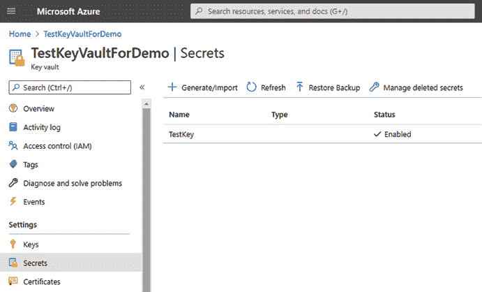

图 6.6–Azure 密钥库机密

也可以使用 Azure **命令行界面** ( **CLI** )来创建和管理 Azure 资源。你可以在这里阅读更多关于蔚蓝海岸的信息:[https://docs.microsoft.com/en-us/cli/azure/?view=azure-cli-latest](https://docs.microsoft.com/en-us/cli/azure/?view=azure-cli-latest) 。

在下一节中，我们将看到如何让我们的应用访问密钥库。

### 授予应用对密钥库的访问权限

在本节中，让我们看看我们的测试配置网络应用编程接口如何通过以下步骤获得对密钥库的访问:

1.  在 AAD 中注册`TestConfiguration`应用并创建身份。使用 https://portal.azure.com 登录 Azure 门户网站。
2.  Navigate to **Azure Active Directory** | **App Registrations**. Click on **New registration**:

    

    图 6.7–AAD 新应用注册

3.  Fill in the defaults and click on **Register**, as shown in the following screenshot, and note down the **Application (client) ID** value. This will be required later to access Key Vault:

    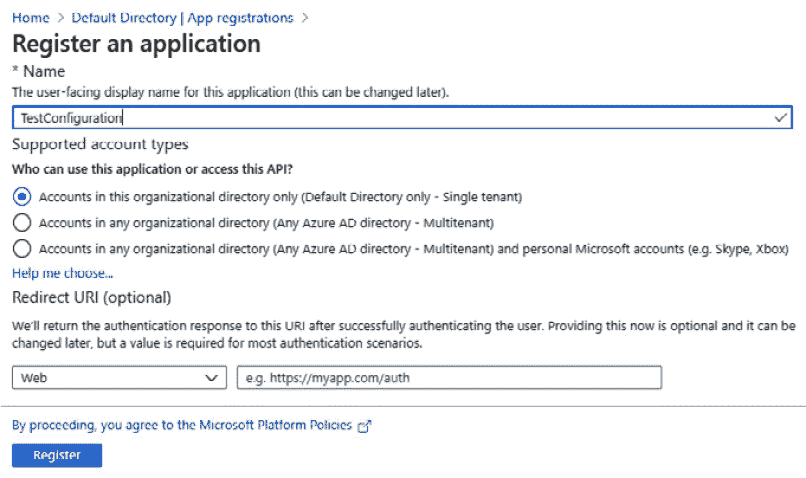

    图 6.8–AAD 注册完成

4.  Click on **Certificates & secrets** (**1**) | **New client secret** (**2**) and enter a **Description** (**3**) value, then click on **Add** (**4**) as shown in the following screenshot. Note down the **AppClientSecret** value showing under **New client secret**, which is what the application can use to prove its identity when requesting a token:

    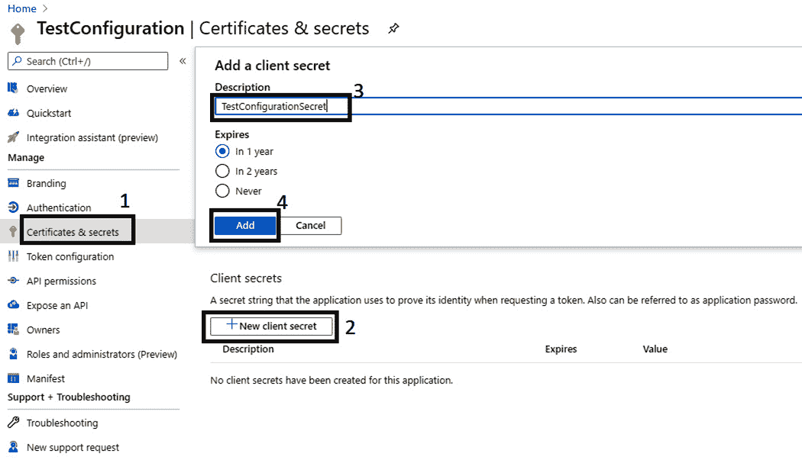

    图 6.9–AAD 为其身份创建新的应用机密

5.  Give the application access to Key Vault using an access policy. Search for the key vault you just created and select it:

    

    图 6.10–密钥库搜索

6.  In the key vault properties, select **Access policies** under **Settings** and click on **Add Access Policy**:

    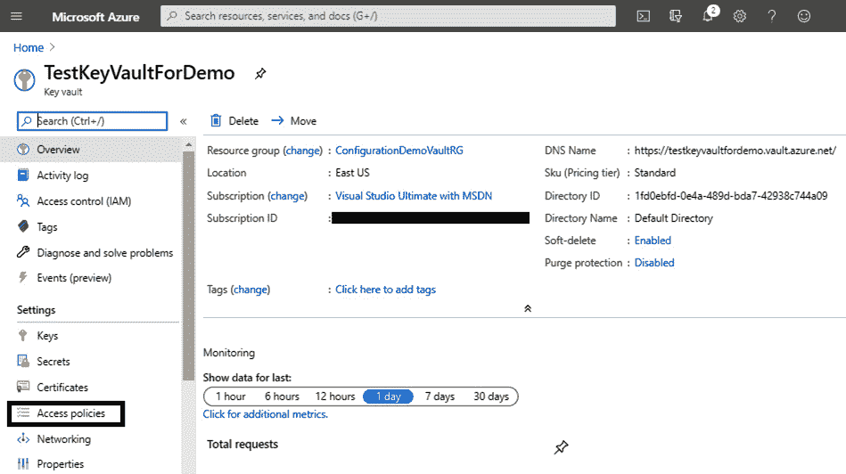

    图 6.11–密钥库访问策略

7.  In the **Select** **principal** field, search for your application and select the required permissions for your application to access Key Vault, then click on **Add**, as shown in the following screenshot:

    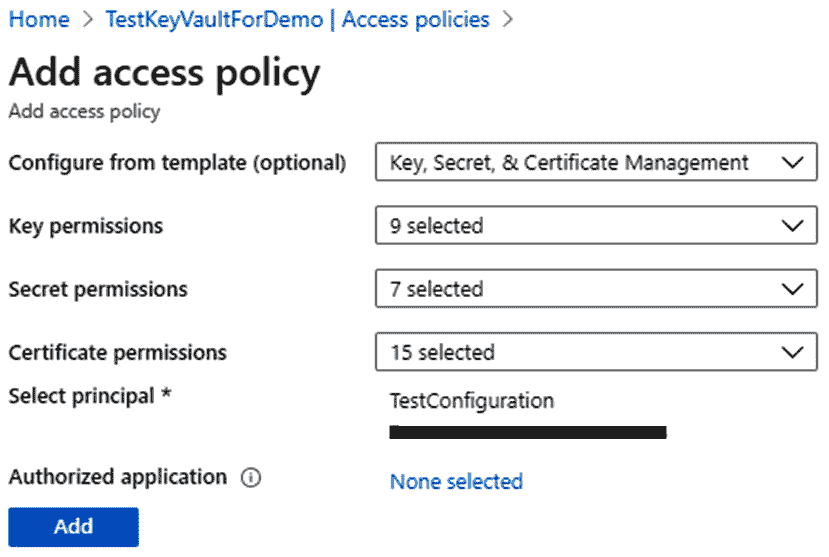

    图 6.12–添加访问策略

8.  添加策略后，必须保存。此将完成授予您的应用访问密钥库的过程。

我们现在已经授予我们的应用对密钥库的访问权限。在下一节中，我们将看到如何使用 Azure 密钥库配置提供程序从我们的应用访问密钥库。

### 利用 Azure 密钥库配置提供程序

在本节中，我们将在我们的应用中进行配置和代码更改，以利用 Azure 密钥库配置提供程序并从密钥库中访问机密，如下所示:

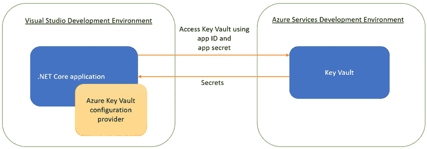

图 6.13–开发期间访问密钥库

以下是变更列表:

1.  Add the `key vault` name, the `AppClientId` value that you noted down from *Figure 6.8*, and the `AppClientSecret` value that you noted down from AAD from *Figure 6.9* to the `appsettings.json` file in your `TestConfiguration` web API:

    

    图 6.14–app settings . JSON 中的密钥存储区部分

2.  Install the following NuGet packages:

    `Microsoft.Azure.KeyVault`

    `Microsoft.Extensions.Configuration.AzureKeyVault`

    `Microsoft.Azure.Services.AppAuthentication`

3.  更新`Program.cs`以利用 Azure 密钥库配置提供程序来使用您的密钥库。以下代码将添加 Azure 密钥库作为另一个配置源，并使用 Azure 密钥库配置提供程序获取所有配置:

    ```cs
    public class Program
    {
        public static void Main(string[] args)
        {
            CreateHostBuilder(args).Build().Run();
        }
        public static IHostBuilder 
         CreateHostBuilder(string[] args) =>
            Host.CreateDefaultBuilder(args)
                .ConfigureAppConfiguration((context, 
                  config) =>
                {
                    var builtConfig = config.Build();
     config.AddAzureKeyVault(                      $"https://{builtConfig["KeyVault:Name"]}.vault.azure.net/",
     builtConfig["KeyVault:AppClientId"],
     builtConfig["KeyVault:AppClientSecret"]);
                })
                .ConfigureWebHostDefaults(webBuilder =>
                {
                    webBuilder.UseStartup<Startup>();
                });
    } 
    ```

4.  更新`WeatherForecastController.cs`从密钥库中读取秘密如下:

    ```cs
    [ApiController]
    [Route("[controller]")]
    public class WeatherForecastController : ControllerBase
    {
        private readonly ILogger<WeatherForecastController> _logger;
        private readonly IConfiguration _configuration;
        public WeatherForecastController(ILogger<Weather
    ForecastController> logger, IConfiguration configuration)
        {
            _logger = logger;
            _configuration = configuration;
        }  
        [HttpGet]
        public IEnumerable<string> Get()
        {
            return new string[] { "TestKey", 
     _configuration["TestKey"] };
        }       
    }
    ```

根据此处共享的代码示例包含所有引用。您可以运行应用并查看结果。应用将能够使用 Azure 密钥库配置提供程序访问密钥库并获取机密。这很简单，因为所有的重担都是由.NET 5，我们只需要安装 NuGet 包并添加几行代码。然而，您现在可能会考虑如何将`AppClientId`和`AppClientSecret`添加到`appsettings.json`配置文件中，以及这如何不是非常安全。你百分之百正确。

我们可以通过两种方式解决这个问题:

*   一种选择是将这些值加密存储在`appsettings.json`中；然后可以在代码中读取和解密它们。
*   另一个选项是使用托管身份来访问 Azure 资源，这允许应用使用 AAD 身份验证使用 Azure Key Vault 进行身份验证，而无需凭据(应用 ID 和密码/客户端机密)，如现在所示。

任何支持 AAD 身份验证的服务都可以使用您的应用的身份进行身份验证，例如 Azure Key Vault，这将有助于我们从代码中去除凭据:

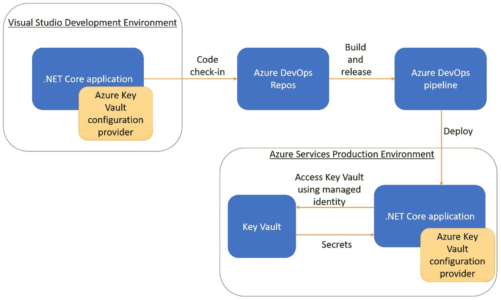

图 6.15–部署应用后在生产环境中访问密钥库

注意

对于部署到生产环境中的应用，这是我们遵循的最佳实践。在代码中管理凭据是一项常见的挑战，保持凭据的安全是一项重要的安全要求。AAD 中 Azure 资源的托管身份有助于解决这一挑战。托管身份在 AAD 中为 Azure 服务提供自动管理的身份。您可以使用此身份向任何支持 AAD 身份验证的服务进行身份验证，包括密钥库，而无需您代码中的任何凭据。

您可以在这里阅读更多关于托管身份的信息:[https://docs . Microsoft . com/en-us/azure/active-directory/managed-identities-azure-resources/overview](https://docs.microsoft.com/en-us/azure/active-directory/managed-identities-azure-resources/overview)。

在本节中，我们看到了如何创建密钥库，如何向密钥库添加秘密，如何在 AAD 中注册我们的`TestConfiguration`网络应用编程接口，如何创建秘密或身份，如何让`TestConfiguration`网络应用编程接口访问密钥库，以及如何使用 Azure 密钥库配置提供程序从我们的代码访问密钥库。您也可以使用 Visual Studio Connected Services 将密钥库添加到您的 web 应用中，如下所述:[https://docs . Microsoft . com/en-us/azure/Key-Vault/general/vs-Key-Vault-add-Connected-service](https://docs.microsoft.com/en-us/azure/key-vault/general/vs-key-vault-add-connected-service):

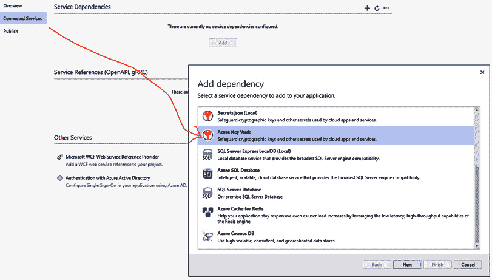

图 6.16–作为连接服务的 Azure 密钥库

在下一节中，我们将看到如何利用文件配置提供程序。

## 文件配置提供程序

文件配置提供程序帮助我们从文件系统加载配置。JSON 配置提供程序和 XML 配置提供程序从文件配置提供程序类派生它们的继承，并分别用于从 JSON 文件和 XML 文件中读取键值对配置。让我们看看如何将它们作为`CreateHostBuilder`的一部分添加到配置源中。

### JSON 配置提供程序

JSON 配置提供程序可以使用以下代码进行配置:

```cs
public class Program
{
    public static void Main(string[] args)
    {
        CreateHostBuilder(args).Build().Run();
    }      
    public static IHostBuilder 
       CreateHostBuilder(string[] args) =>
        Host.CreateDefaultBuilder(args)
            .ConfigureAppConfiguration((context, 
              config) =>
            {
                config.AddJsonFile("AdditionalConfig.json",
                optional: true,
                reloadOnChange: true);
            })
            .ConfigureWebHostDefaults(webBuilder =>
            {
                webBuilder.UseStartup<Startup>();
            });
}
```

在这种情况下， JSON 配置提供者将把`AdditionalConfig.json`文件和三个参数加载到`AddJsonFile`方法中，为我们提供了选项来指定文件名，文件是否可选，以及对文件进行任何更改时是否必须重新加载文件。

以下是`AdditionalConfig.json`样本文件:

```cs
{  "TestKeyFromAdditionalConfigJSON":"TestValueFromAdditional
ConfigJSON"}
```

然后，我们更新`WeatherForecastController.cs`以从从`AdditionalConfig.json`配置文件加载的配置中读取键值对，如下所示:

```cs
[ApiController]
[Route("[controller]")]
public class WeatherForecastController : ControllerBase
{
    private readonly ILogger<WeatherForecastController> _logger;
    private readonly IConfiguration _configuration;
    public WeatherForecastController(ILogger<WeatherForecast
Controller> logger, IConfiguration configuration)
    {
        _logger = logger;
        _configuration = configuration;
    }  
    [HttpGet]
    public IEnumerable<string> Get()
    {
        return new string[] { " TestKeyFromAdditionalConfigJSON", _configuration["TestKeyFromAdditionalConfigJSON"] };
    }       
}
```

您可以运行应用并查看结果。应用将能够访问`AdditionalConfig.json`文件并读取配置。在下一节中，我们将看看 XML 配置提供程序。

### XML 配置提供程序

我们将为项目添加一个名为`AdditionalXMLConfig.xml`的新文件和所需的配置。然后可以使用下面的代码从我们添加的文件中读取来配置 XML 配置提供程序:

```cs
    public static IHostBuilder CreateHostBuilder(string[] args) =>
        Host.CreateDefaultBuilder(args)
            .ConfigureAppConfiguration((context, config) =>
            {
                config.AddXmlFile("AdditionalXMLConfig.xml",
                optional: true,
                reloadOnChange: true);
            })
            .ConfigureWebHostDefaults(webBuilder =>
            {
                webBuilder.UseStartup<Startup>();
            });
```

在这种情况下，XML 配置提供者将加载`AdditionalXMLConfig.xml`文件，三个参数为我们提供了指定 XML 文件的选项，无论该文件是否可选，以及在进行任何更改时是否必须重新加载该文件。

`AdditionalXMLConfig.xml`样本文件如下:

```cs
<?xml version="1.0" encoding="utf-8" ?>
<configuration>
  <TestKeyFromAdditionalXMLConfig>TestValueFrom
AdditionalXMLConfig</TestKeyFromAdditionalXMLConfig>
</configuration>
```

接下来，我们更新`WeatherForecastController.cs`以从从`AdditionalXMLConfig.xml`加载的配置中读取键值对，如下所示:

```cs

    [HttpGet]
    public IEnumerable<string> Get()
    {
        return new string[] { "TestKeyFromAdditionalXMLConfig", _configuration["TestKeyFromAdditionalXMLConfig"] };
    }       
```

您可以运行应用并查看结果。应用将能够访问`AdditionalXMLConfig.xml`并读取配置。中提供了 JSON 配置文件和 JSON 配置提供程序.NET 5，您不需要 XML 配置文件和 XML 配置提供程序。也就是说，我们刚刚介绍的是那些喜欢 XML 文件、打开和关闭标签等的人。

在下一节中，我们将看到为什么需要自定义配置提供程序，以及如何构建一个。

# 构建自定义配置提供程序

在前一节中，我们查看了中内置或预先存在的配置提供程序.NET 5。在某些情况下，许多系统在数据库中维护应用配置设置。这些可以由管理员从门户网站进行管理，也可以由支持工程师通过运行数据库脚本来创建/更新/删除应用配置设置。.NET 5 没有内置的从数据库读取配置的提供程序。让我们看看如何通过以下步骤构建自定义配置提供程序来读取数据库:

*   **实现配置源**:创建配置提供者的实例
*   **实现配置提供者**:从合适的源加载配置
*   **实现配置扩展**:将配置源添加到配置生成器中

让我们从配置源开始。

## 配置来源

配置源的职责是创建配置提供者的实例并返回到源。它需要从`IConfigurationSource`接口继承，这就需要我们实现`ConfigurationProvider Build(IConfigurationBuilder builder)`方法。

在`Build`方法实现内部，我们需要创建一个自定义配置提供程序的实例并返回相同的。还应该有构建构建器所需的参数。在这种情况下，当我们构建自定义的 SQL 配置提供程序时，重要的参数是连接字符串和 SQL 查询。下面的代码片段显示了一个`SqlConfigurationSource`类的示例实现:

```cs
public class SqlConfigurationSource : IConfigurationSource
    {
        public string ConnectionString { get; set; }
        public string Query { get; set; }
        public SqlConfigurationSource(string 
          connectionString, string query)
        {
            ConnectionString = connectionString;
            Query = query;
        }
        public IConfigurationProvider 
         Build(IConfigurationBuilder builder)
        {
            return new SqlConfigurationProvider(this);
        }
    }  
```

这个很简单容易实现，你也看到了。您获得构建提供程序和创建该提供程序的新实例所需的参数，然后返回这些参数。让我们在下一节中看看如何构建一个 SQL 配置提供程序。

## 配置提供者

配置提供者的职责是从适当的源加载所需的配置并返回。它需要从`IconfigurationProvider`接口继承，这就需要我们实现`Load()`方法。配置提供程序类可以从`ConfigurationProvider`基类继承，因为它已经实现了`IConfigurationProvider`接口中的所有方法。这将帮助我们节省时间，因为我们不需要实现未使用的方法，而是可以只实现`Load`方法。

在`Load`方法实现内部，我们需要有从源获取配置数据的逻辑。在这种情况下，我们将执行一个查询来从 SQL 存储中获取数据。下面的代码片段显示了一个`SqlConfigurationProvider`类的示例实现:

```cs
 public class SqlConfigurationProvider : ConfigurationProvider
    {
        public SqlConfigurationSource Source { get; }
        public SqlConfigurationProvider
         (SqlConfigurationSource source)
        {
            Source = source;
        }
        public override void Load()
        {
            try
            {    
                // create a connection object  
                SqlConnection sqlConnection = new 
                 SqlConnection(Source.ConnectionString);
                // Create a command object  
                SqlCommand sqlCommand = new 
                 SqlCommand(Source.Query, sqlConnection);
                sqlConnection.Open();
                // Call ExecuteReader to return a DataReader  
                SqlDataReader salDataReader = 
                 sqlCommand.ExecuteReader();
                while (salDataReader.Read())
                {
                    Data.Add(salDataReader.GetString(0), 
                     salDataReader.GetString(1));
                }
                salDataReader.Close();
                sqlCommand.Dispose();
                sqlConnection.Close();
            }

        }
    }
```

让我们在下一节中看看如何构建配置扩展。

## 配置扩展

与其他提供者一样，我们可以使用扩展方法将配置源添加到配置生成器中。

注意

扩展方法是静态方法，使用它可以向现有类添加方法，而无需修改或重新编译原始类。

以下代码片段显示了配置生成器中`SqlConfigurationExtensions`类的示例实现:

```cs
public static class SqlConfigurationExtensions
    {
        public static IConfigurationBuilder 
         AddSql(this IConfigurationBuilder 
         configuration, string connectionString, 
         string query)
        {
            configuration.Add(new 
             SqlConfigurationSource(connectionString, 
             query));
            return configuration;
        }
    }
```

扩展方法将减少应用启动时的代码。

我们可以像为其他配置提供者添加引导代码一样添加引导代码，如以下代码所示:

```cs
public static IHostBuilder CreateHostBuilder(string[] args) =>
            Host.CreateDefaultBuilder(args)
                .ConfigureAppConfiguration((context, 
 config) =>
 {
 config.AddSql("Connection 
 string","Query"); 
 })
                .ConfigureWebHostDefaults(webBuilder =>
                {
                    webBuilder.UseStartup<Startup>();
                });
```

下面的屏幕截图显示了数据库中的一些示例配置设置。您可以在`config.AddSql()`中传递适当的连接字符串和 SQL 查询，并从数据库中加载以下配置。SQL 查询可能是一个简单的`select`语句来读取所有键值对，如下图所示:

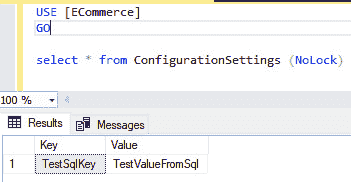

图 6.17–数据库配置设置

如下更新`WeatherForecastController.cs`以从从 SQL 配置提供程序加载的配置中读取键值对:

```cs
[ApiController]
[Route("[controller]")]
public class WeatherForecastController : ControllerBase
{
    private readonly ILogger<WeatherForecastController> 
     _logger;
    private readonly IConfiguration _configuration;
    public WeatherForecastController(ILogger<WeatherForecastController> logger, IConfiguration configuration)
    {
        _logger = logger;
        _configuration = configuration;
    }  
    [HttpGet]
    public IEnumerable<string> Get()
    {
        return new string[] { "TestSqlKey", 
 _configuration["TestSqlKey"] };
    }       
}
```

您可以运行应用并查看结果。应用将能够访问 SQL 配置并读取配置。

这只是一个自定义配置提供程序的示例。您可能能够想到不同的场景，在这些场景中，您将构建其他不同的自定义配置提供程序，例如当从 CSV 文件读取或从 JSON 或 XML 文件读取加密值并解密它们时。

# 总结

在本章中，我们看到了配置是如何工作的.NET 5，如何向应用提供默认配置，如何以分层顺序添加键值对配置，如何读取配置，如何利用 Azure Key Vault 配置提供程序和文件配置提供程序，以及如何构建自定义配置提供程序以从 SQL 数据库中读取。现在，您已经掌握了根据具体需求在项目中实现不同配置所需的知识。

在下一章中，我们将了解日志记录以及它在中的工作原理.NET 5。

# 问题

阅读本章后，您应该能够回答以下问题:

1.  What takes care of providing the default configuration for an application in .NET 5?

    a.`CreateDefaultBuilder`

    b.`ChainedConfigurationProvider`

    c.`JsonConfigurationProvider`

    d.上述全部

2.  Which of the following is not correct?

    a.Azure 密钥库配置提供程序从 Azure 密钥库中读取配置。

    b.文件配置提供程序从 INI、JSON 和 XML 文件中读取配置。

    c.命令行配置提供程序从数据库中读取配置。

    d.内存配置提供程序从内存集合中读取配置。

3.  Which interface is used to access a configuration at runtime and is injected via DI?

    a.`IConfig`

    b.`IConfiguration`

    c.`IConfigurationSource`

    d.`IConfigurationProvider`

4.  Which provider/source is recommended for storing secrets in production?

    a.JSON 从`appsettings.json`开始

    b.`FileConfiguration`来自一个 XML 文件

    c.`AzureKeyVaultProvider`从`AzureKeyVault`开始

    d.命令行配置提供程序

# 进一步阅读

*   [https://docs . Microsoft . com/en-us/aspnet/core/blaz or/基本面/配置？view = aspnetcore-5.0 #:~:text = Configuration % 20 in % 20 app % 20 settings % 20 file，是%20read%20by%20a%20component。&文本=将% 20an % 20i 配置% 20 实例% 20 注入% 20a %组件% 20 到% 20 访问% 20% 20 配置% 20 数据](https://docs.microsoft.com/en-us/aspnet/core/blazor/fundamentals/configuration?view=aspnetcore-5.0#:~:text=Configuration%20in%20app%20settings%20files,is%20read%20by%20a%20component.&text=Inject%20an%20IConfiguration%20instance%20into%20a%20component%20to)
*   [https://docs . Microsoft . com/en-us/aspnet/core/基本面/配置/选项？view=aspnetcore-5.0](https://docs.microsoft.com/en-us/aspnet/core/fundamentals/configuration/options?view=aspnetcore-5.0)