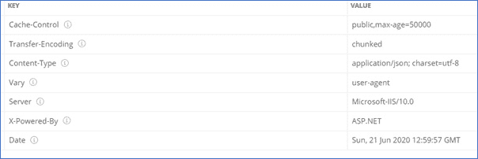
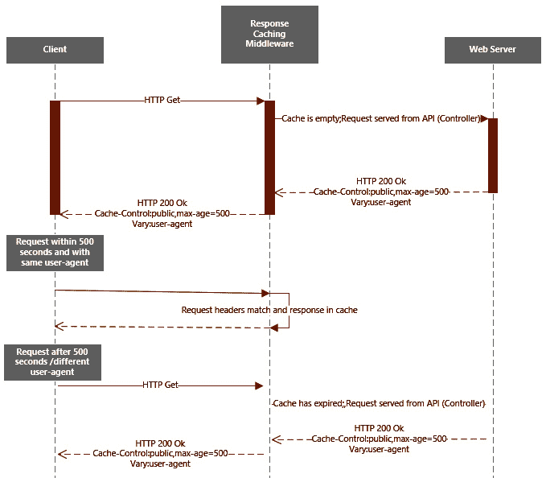
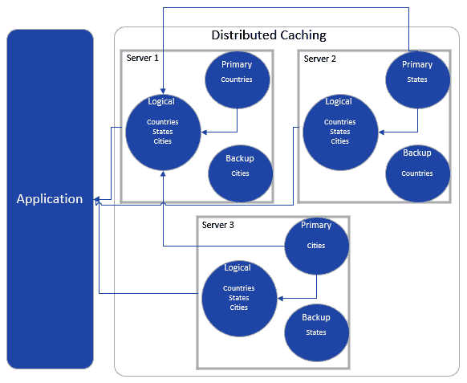
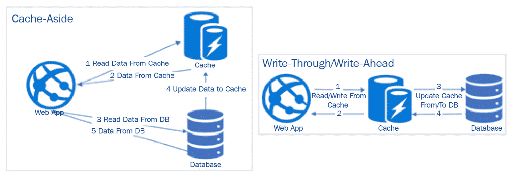
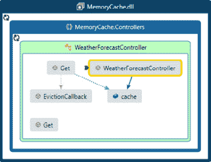
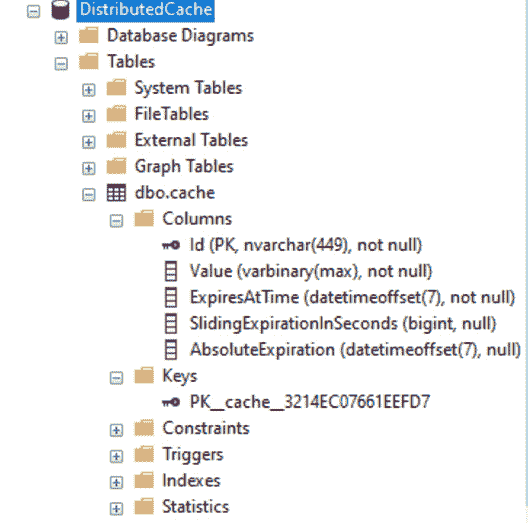
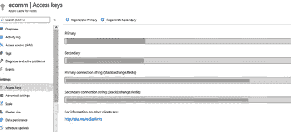
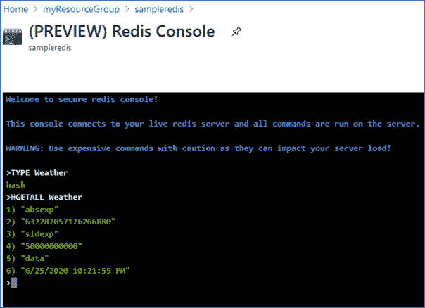

# *第八章*:理解缓存

缓存是关键的系统设计模式之一，它有助于扩展任何企业应用并提高响应时间。任何 web 应用通常都需要从数据存储中读写数据，数据存储通常是关系数据库，如 SQL Server 或 NoSQL 数据库，如宇宙数据库。然而，为每个请求从数据库中读取数据并不高效，尤其是当数据没有变化时，因为数据库通常将数据保存到磁盘上，并且从磁盘加载数据并将其发送回浏览器客户端(或者移动/桌面应用中的设备)或用户是一项昂贵的操作。这就是缓存发挥作用的地方。缓存存储可以用作检索数据的主要来源，并且仅当数据在缓存中不可用时才返回到原始数据存储，从而为消费应用提供更快的响应。在这样做的同时，我们还需要确保当原始数据存储中的数据更新时，缓存的数据会过期/刷新。

在本章中，我们将学习各种缓存数据的技术。NET 5 应用以及各种缓存组件和可与. NET 5 应用集成的可用平台。我们将涵盖以下主题:

*   缓存介绍
*   了解缓存的组成部分
*   缓存平台
*   使用分布式缓存设计缓存抽象层

# 技术要求

对…的基本了解。NET Core、C#、Azure 和。NET 命令行界面是必需的。

章节的代码可以在这里找到:[https://github . com/PacktPublishing/Enterprise-Application-Development-with-C-Sharp-9-and-。NET-5/树/主/第 08 章](https://github.com/PacktPublishing/Enterprise-Application-Development-with-C-Sharp-9-and-.NET-5/tree/master/Chapter08)

代码示例的说明可以在这里找到:[https://github . com/PacktPublishing/Enterprise-Application-Development-with-C-Sharp-9-and-。NET-5/树/主/企业% 20 应用](https://github.com/PacktPublishing/Enterprise-Application-Development-with-C-Sharp-9-and-.NET-5/tree/master/Enterprise%20Application)

# 缓存介绍

有多种方法可以提高应用的性能，缓存是企业应用中使用的关键技术之一。缓存就像一个临时数据存储，大小和数据都有限，但与原始数据源相比，数据访问速度要快得多，并且通常只保存最常用数据的子集。缓存存储可以像进程在执行过程中使用的计算机内存一样简单，也可以像 Redis 一样使用内存和磁盘来存储数据。这里的关键是，与原始存储层相比，它通常位于访问时间较短的硬件上。

缓存可以在架构中的每一层实现，以便可以从最接近用户的层检索数据。例如，在任何网络应用中，当在浏览器中键入网址并按下*进入*时，它会通过加载网络应用所涉及的各种网络组件，从浏览器、代理、域名系统、网络服务器和数据库开始。缓存是可以应用于所有这些层的东西。如果数据缓存在浏览器中，可以立即加载。或者，如果数据在最接近用户的层中不可用，它可以退回到更高层，从而减少在多个用户之间共享的更高层上的负载，例如应用服务器和数据库层。下图从高层次描述了这一讨论，其中请求流过不同的层，并且仅当数据在缓存中不可用(由虚线表示)时才被移动到更高的层:


图 8.1–请求流中的缓存层

让我们讨论一下应用架构中可以缓存数据的一些层。

## 客户端缓存

常用的请求数据可以缓存在客户端，避免不必要的往返服务器。例如，微软的 Outlook 应用从服务器下载最新的电子邮件，并在客户端保存它们的副本，然后定期同步新邮件。如果需要搜索尚未下载的电子邮件，它会返回到服务器。

类似地，浏览器可以缓存各种资源和基于特定头的 web 应用的响应，以及来自浏览器缓存的相同资源负载的后续请求。例如，所有的 JavaScript 文件、图像文件和 CSS 通常都会在浏览器上缓存一段时间。此外，可以通过发送适当的响应头来缓存来自应用编程接口的响应。这就是也叫 **HTTP 缓存**或**响应缓存**，这是后面会详细讨论的。

## 内容交付网络(CDN)

一个**内容交付网络** ( **CDN** )是一组服务器，全球分布，通常用于服务静态内容，如 HTML、CSS 和视频。每当应用请求资源时，如果启用了 CDN，系统将首先从物理上最接近用户的 CDN 服务器加载资源。但是，如果资源在 CDN 服务器中不可用，则会从服务器中检索该资源，并缓存在 CDN 中以服务于后续请求。网飞就是一个很好的例子，它严重依赖定制的内容分发网络向用户提供内容。

微软还附带了 Azure CDN，主要可以用来服务静态内容。此外，微软的 CDN 提供了一个与 Azure Storage 集成的选项，我们将在电子商务应用中使用它来提供各种产品图像。

## 网络服务器缓存

尽管 cdn 对于静态内容来说非常棒，但是它们在刷新应用服务器数据方面会带来额外的成本和维护开销。为了克服这些限制，应用可以使用 web 服务器或反向代理来提供静态内容。轻量级 NGINX 服务器就是一个这样的例子，可以用来提供静态内容。

网络服务器也可以缓存动态内容，例如来自应用服务器的应用编程接口响应，就像静态文件一样，当配置为反向代理时，NGINX 可以进一步用于缓存动态内容，从而通过从应用服务器的缓存中提供请求来减轻应用服务器的负载。

注意

NGINX 是一个开放的源码解决方案，主要以其 web 服务器能力而闻名；但是，它也可以作为反向代理，用于负载均衡等等。详情请参考[https://www.nginx.com/](https://www.nginx.com/)。

## 数据库缓存

更常见的是，数据库服务器也可以缓存查询的某些组件；例如，SQL Server 通常有缓存执行计划，也有要缓存的数据缓冲区，MongoDB 将最近查询的数据保存在内存中，以便更快地检索。因此，调整这些设置以提高应用的性能是很好的。

请注意，数据库缓存并不能保证同一查询的后续执行在 CPU 消耗为零的情况下执行；也就是说，它实际上不是免费的。后续请求中的相同查询会以更快的速度执行。

## 应用缓存

应用缓存可以通过缓存从应用服务器内的存储层检索的数据来实现。这主要通过以下两种方式完成:

*   存储在应用服务器的内存中，也称为内存缓存
*   存储在外部存储中，如 Redis 或 Memcached，与底层原始数据存储相比，访问时间更快

应用缓存通常包括在应用逻辑中集成额外的代码来缓存数据。因此，每当发出数据请求时，应用都会首先查看缓存。但是如果它在缓存中不可用，应用将返回到原始数据存储，如数据库。通常，应用缓存的大小相对于原始数据存储是有限的，所以在内部，应用缓存平台会采用各种算法，如**最近最少使用的** ( **LRU** )或**最少使用的** ( **LFU** )来清理缓存中存储的数据。我们将在*缓存平台*部分讨论更多这样的缓存平台。

应用缓存需要考虑的另一个要点是数据失效，即数据需要多久过期一次或者与原始数据源同步一次。因此，需要考虑诸如缓存过期和用原始数据存储更新缓存的各种策略(读、写)。我们将在*缓存访问模式*部分讨论更多缓存失效/刷新策略。

# 了解缓存的组件

在我们了解中可用的各种可能的缓存存储/平台之前。NET 5 应用，我们需要了解中可用的缓存的各种组件。NET 5 以及如何在企业应用中使用它们。在此过程中，我们还将介绍各种缓存回收策略和技术，以保持缓存与原始数据存储同步。

## 响应缓存

响应缓存是一种由 HTTP 支持的缓存技术，用于在客户端(例如浏览器)或中间代理服务器上缓存对使用 HTTP 或 HTTPS 做出的请求的响应。从实现的角度来看，这是通过在请求和响应中为`Cache-Control`头设置适当的值来控制的。典型的`Cache-Control`标题如下:

```cs
Cache-Control:public,max-age=10
```

在这种情况下，如果响应中存在标头，服务器会告诉客户端/代理(公共)客户端可以缓存响应 10 秒(`max-age=10`)。但是，客户端仍然可以覆盖它，并在更短的时间内缓存它；也就是说，如果请求和响应都设置了缓存头，缓存持续时间将是两者中的最小值。

与`max-age`一起，根据 HTTP 规范(https://tools . IETF . org/html/RFC 7234 # section-5.2)，`Cache-Control`可以额外保存以下值:

*   **公共**:响应可以缓存在任何地方——客户端/服务器/中间代理服务器。
*   **Private** :响应可以为特定用户存储，但不能存储在共享缓存服务器中；例如，它可以存储在客户端浏览器或应用服务器中。
*   **无缓存**:响应无法缓存。

在响应缓存中起作用的其他标头如下:

*   **年龄**:这是一个响应头，指示对象在缓存(代理/浏览器)中存在的持续时间。接受的值是一个整数，以秒为单位表示持续时间。
*   **variable**:这是响应头，当收到时，告知客户端请求头基于哪些响应被缓存。该头的值是请求头之一，并且基于该头的值，客户端可以决定是使用缓存的响应还是从服务器下载数据。例如，如果`Vary`设置为`user-agent`值，响应将按照`user-agent`进行唯一缓存。

以下屏幕截图显示了与 Postman 中示例请求的缓存相关的响应头:



图 8.2–带有缓存控制和可变标头的示例响应

下面的顺序图显示了一个使用 ASP.NET Core 5 构建的示例应用编程接口，该接口启用了响应缓存中间件:



图 8.3–响应缓存序列图

在创建新的 ASP.NET Core 5 MVC/Web API 应用后，或者对于现有的 ASP.NET Core 5 MVC/Web API 应用，要配置响应缓存，需要进行以下代码更改:

1.  在`Startup.cs`的`ConfigureServices`方法中增加`services.AddResponseCaching()`。这个扩展方法是`Microsoft.Extensions.DependencyInjection`命名空间的一部分。这个服务扩展方法映射所需的接口和类。
2.  使用`Startup.cs`的`Configure`方法中的`app.UseResponseCaching()`添加所需的中间件。这个中间件是`Microsoft.AspNetCore.Builder`命名空间的一部分，保存缓存数据所需的逻辑。确保在`app.UseEndpoints`之前注入该中间件。
3.  Handle the response to set cache headers either through custom middleware or using the `ResponseCache` attribute.

    注意

    使用 CORS 中间件必须在`UseResponseCaching`之前调用`UseCors`。关于此次订购的更多信息，请参考[https://github.com/dotnet/AspNetCore.docs/blob/master/aspnet core/基本面/中间件/index.md](https://github.com/dotnet/AspNetCore.Docs/blob/master/aspnetcore/fundamentals/middleware/index.md) 。

`ResponseCache`属性可以用于整个控制器或控制器中的特定方法，它接受以下关键属性:

*   `Duration`:设置响应头中`max-age`值的数值
*   `ResponseCacheLocation`:枚举取三个值–`Any`、`Client`和`None`,并将`Cache-Control`表头进一步设置为`public`、`private`或`no-store`
*   `VaryByHeader`:控制缓存行为的字符串，根据特定的头进行缓存
*   `VaryByQueryKeys`:字符串数组，接受基于其缓存数据的键值

具有`ResponseCache`属性的典型方法如下所示:

```cs
        [HttpGet]
        [ResponseCache(Duration = 500, VaryByHeader = "user-agent", Location = ResponseCacheLocation.Any, VaryByQueryKeys = new[] { "Id" })]
        public async Task<IActionResult> Get([FromQuery]int Id = 0)
```

该方法将基于唯一的`user-agent`头和`Id`值缓存 500 秒。如果这些值中的任何一个发生了变化，服务器就会发出响应，否则，缓存中间件就会发出响应。

正如你在这里看到的，我们需要给每个控制器/方法加上`ResponseCache`属性的前缀。因此，如果应用有许多控制器/方法，这可能是一个维护开销，因为要对数据缓存方式进行任何更改(如更改`Duration`值)，我们需要在控制器/方法级别应用更改，这就是缓存配置文件发挥作用的地方。因此，我们可以将它们分组并在`Startup.cs`中给它们命名，而不是单独设置属性，该名称可以在`ResponseCache`属性中使用。因此，对于前面的属性，我们可以通过添加在`Startup.cs`中显示的代码来创建缓存配置文件:

```cs
            services.AddControllers(options =>
            {
                options.CacheProfiles.Add("Default", new CacheProfile { 
                    Duration = 500, 
                    VaryByHeader = "user-agent", 
                    Location = ResponseCacheLocation.Any, 
                    VaryByQueryKeys = new[] { "Id" } });
            });
```

在控制器上，使用`CacheProfileName`调用该缓存配置文件:

```cs
[ResponseCache(CacheProfileName = "Default")]
```

对于 MVC 应用，可以在`services.AddControllersWithViews()`中配置`CacheProfile`。

## 分布式缓存

我们知道，在分布式系统中，数据存储被分割到多个服务器上；同样，分布式缓存是传统缓存的扩展，在传统缓存中，缓存数据存储在网络中的多个服务器上。在我们进入分布式缓存之前，这里简单回顾一下 cap 定理:

*   **C** :代表一致性，意思是数据在所有节点上都是一致的，并且有相同的数据拷贝
*   **A** :代表可用性，表示系统可用，一个节点故障不会导致系统停机
*   **P** :代表分区容忍，意思是即使节点之间的通信中断，系统也不会中断

根据 CAP 定理，任何分布式系统只能实现上述两个原则，由于分布式系统必须是分区容忍的(P)，我们只能实现数据的一致性(C)或数据的高可用性(A)。

因此，分布式缓存是一种缓存策略，其中数据存储在应用服务器之外的多个服务器/节点/碎片中。由于数据分布在多台服务器上，如果一台服务器发生故障，另一台服务器可以作为备份来检索数据。例如，如果我们的系统想要缓存国家、州和城市，并且如果分布式缓存系统中有三个缓存服务器，假设有一个缓存服务器缓存国家，另一个缓存州，还有一个缓存城市(当然，在实时应用中，数据以更复杂的方式分割)。此外，每个服务器还将充当一个或多个实体的备份。因此，在高级别上，一种类型的分布式缓存系统如下所示:



图 8.4–分布式缓存高级表示

如您所见，在读取数据时，数据是从主服务器读取的，如果主服务器不可用，缓存系统将退回到辅助服务器。类似地，对于写操作，直到数据被写入主服务器以及作为辅助服务器的时，写操作才完成，并且在该操作完成之前，读操作可能被阻止，因此危及系统的可用性。另一种写入策略可能是后台同步，这将导致最终的数据一致性，因此在同步完成之前会影响数据的一致性。回到 CAP 定理，大多数分布式缓存系统都属于 CP 或 AP 的范畴。

以下是一些与集成的分布式缓存提供程序。NET 5 应用:

*   重定向高速缓存
*   Memcached
*   美洲狮号
*   数据库
*   ncache！ncache

这可以进一步扩展到任何集群编排平台，例如 Terracotta，它负责管理各种节点，并可以将数据分发到所有节点。

尽管分布式缓存有很多好处，但与单服务器缓存或进程内缓存相比，分布式缓存的一个可能的缺点可能是由于可能的额外跳转和序列化/反序列化而引入的延迟。因此，如果应用严重依赖缓存数据，设计可以考虑将内存缓存和分布式缓存相结合。然而，大多数场景都是通过集成一个实现良好的分布式缓存系统(如 Redis)来实现的，我们将在本章的后面介绍这个系统。

## 缓存访问模式

一旦对象数据被缓存，就需要有一个适当的设计来刷新缓存。可以实现多种缓存访问模式来处理这种情况。一些关键模式如下:

*   一旁缓存模式
*   通读/直写
*   提前刷新
*   写后

让我们详细讨论每一个。

### 一旁缓存模式

顾名思义，在缓存备用模式中，缓存存储与数据存储放在一起。在这种模式下，应用代码检查缓存存储中的数据可用性。如果在缓存存储中不可用，则从底层数据存储中检索数据，并在缓存中更新数据。后续请求将再次查询缓存中的数据，如果数据在缓存中可用，将从缓存中提供。缓存备用模式依赖于 [*第 4 章*](04.html#_idTextAnchor073)*线程和异步操作*中讨论的延迟加载概念，并在第一次访问数据时填充；对同一实体的后续请求将从缓存中加载。

在更新原始数据存储中的数据时，应该处理缓存存储中数据的过期，然后后续读取会再次将更新的数据添加到缓存中。

以下是该模式的优势:

*   与下一节中介绍的读/写模式相比，简化了实现。由于缓存不是应用中的主要数据源，因此我们不需要额外的类来同步缓存存储和数据存储。
*   因为它依赖于延迟加载原则，所以只有当任何数据至少被访问一次时，才会填充缓存。

然而，有几个缺点与这个模式相关联:

*   这会导致大量缓存未命中的可能性。缓存未命中应该总是最小的，因为由于额外的跳转，它们会在应用中引入延迟。
*   如果在数据更新期间缓存过期未命中，可能会导致缓存中的数据过时。如果数据由后台/外部进程更新，而该进程没有缓存系统的信息，就会出现这种情况。

缓解过期问题的一种方法是为每个实体设置**生存时间** ( **TTL** )，以便对象在一定时间后自动过期。但是，在监控数据刷新率后，需要仔细评估 TTL 持续时间。在缓存备用模式的情况下，另一个常见的做法是在应用启动期间预填充缓存存储，因为这有助于减少缓存未命中的数量。大多数企业应用通常使用缓存备用模式实现缓存层，并用主数据而不是事务数据预填充它。

### 通读/直写

在读/写通过中，应用直接从缓存存储中读取/写入数据；也就是说，应用将其用作主存储，缓存层负责将数据加载到缓存中，并将缓存存储中的任何更新写回原始存储。

当应用想要读取一个实体时，它会直接从缓存存储中请求它。如果该实体在缓存中可用，则返回响应；但是，如果它不在缓存中，缓存层会从原始数据存储中请求它，原始数据存储会在缓存中更新以备将来使用，然后从缓存层返回响应。

更新实体时，会发生以下步骤:

1.  它首先在缓存中更新。
2.  缓存层将其写回原始数据存储。

这种系统的主要优点如下:

*   原始数据存储(通常是数据库)上的负载显著减少，因为在大多数企业应用中，除了从缓存层到数据存储的调用之外，所有调用都将从缓存中提供。
*   简化了应用代码，因为它只与一个存储区交互，这与缓存备用模式不同，后者与缓存存储区以及应用代码中的数据存储区交互。

### 提前刷新

提前刷新策略允许异步将数据加载到缓存存储中；也就是说，在这种设计中，应用仍然直接与缓存存储对话。但是，缓存层会在缓存中的数据过期之前定期刷新数据。对于最近访问过的条目，刷新是异步进行的，并且在到期前从原始存储异步刷新。这样，如果任何项目缓存过期，应用中就不会有任何延迟。

### 写后

在后写策略中，数据首先更新到缓存存储中，然后异步更新回数据存储，这与直写策略相反，直写策略中数据会立即更新到缓存存储中。这种策略的主要优势之一是减少延迟。但是，由于数据异步更新(写入数据存储和缓存存储是两个不同的事务)到数据存储，如果出现故障，应该实现回滚机制。

通常，与直写相比，实现起来要复杂得多，因为需要额外的处理来避免异步更新期间的任何数据丢失，但是如果需要将缓存存储作为主要来源，这仍然是一种很好的集成模式。

到目前为止讨论的所有模式都可以在较高的层次上可视化，如下图所示:



图 8.5–缓存模式

到目前为止，我们已经看到了各种缓存模式和策略。在下一节中，我们将讨论各种缓存提供程序及其与的集成。NET 5 应用。

# 缓存平台

。NET 5 支持多个缓存平台。一些常用的缓存平台如下:

*   **内存缓存**:这里缓存的数据是存储在进程内存里面。例如，如果应用托管在 IIS 上，内存缓存将从`w3wp.exe`开始消耗内存。
*   **分布式缓存**:数据跨多台服务器存储。可以与集成的数据存储。NET 5 应用是 SQL Server、Redis 和 NCache。

## 内存缓存

要配置内存缓存，在创建新的 ASP.NET Core 5 MVC/Web API 应用后，或者对于现有的 ASP.NET Core 5 MVC/Web API 应用，需要进行以下代码更改:

1.  在`Startup.cs`的`ConfigureServices`方法中增加`services.AddMemoryCache()`。这个扩展方法是`Microsoft.Extensions.DependencyInjection`的一部分(如果缺少，安装这个 NuGet 包)，并将`IMemoryCache`接口映射到`MemoryCache`类。
2.  `MemoryCache`类是中`IMemoryCache`的内置实现。NET 5，并且可以通过`IMemoryCache`在任何 C#类中获得。它是使用构造函数注入实例化的。(对象创建使用**依赖注入** ( **DI** )进行，在中的 [*第 5 章*](05.html#_idTextAnchor110) 、*依赖注入中介绍。NET* 。)因此，要将任何实体缓存到内存缓存中，请创建`IMemoryCache`的属性，并使用构造函数注入创建`MemoryCache`的实例。`IMemoryCache`是`Microsoft.Extensions.Caching.Memory`命名空间的一部分(如果缺少这个 NuGet 包，请安装它)。
3.  `MemoryCache` exposes many methods but a few important ones are `Get` (to get the value of a key), `Set` (to insert a key and its value), and `Remove` (to remove a key (cache expiration)).

    其他方法可以在[https://docs . Microsoft . com/en-us/dotnet/API/Microsoft . extensions . cache . memory . imemorycache？view = dotnet-plat-ext-3.1&view fallbackfrom = net-5.0](https://docs.microsoft.com/en-us/dotnet/api/microsoft.extensions.caching.memory.imemorycache?view=dotnet-plat-ext-3.1&viewFallbackFrom=net-5.0)和[https://docs . Microsoft . com/en-us/dotnet/API/Microsoft . extensions . caching . memory . memory cache？view = dotnet-plat-ext-3.1&view fallback from = net-5.0](https://docs.microsoft.com/en-us/dotnet/api/microsoft.extensions.caching.memory.memorycache?view=dotnet-plat-ext-3.1&viewFallbackFrom=net-5.0)。

4.  While creating a cache object (using `Set` or other methods), the memory cache can be configured for various parameters using `MemoryCacheEntryOptions`. The following properties are supported:

    a.`SetAbsoluteExpiration`:缓存条目的绝对**生存时间(TTL)** 可以在`TimeSpan`中设置，也可以设置缓存有效的确切日期和时间(`DateTime`)。

    b.`SetSlidingExpiration`:缓存的非活动时间，在此时间之后，缓存条目将从缓存中删除。例如，5 秒的滑动到期值将等待缓存条目处于非活动状态 5 秒钟。滑动到期应始终小于绝对到期，因为缓存将在达到绝对到期持续时间后到期，而与滑动到期持续时间无关。

    c.`SetPriority`:由于在执行缓存回收时缓存大小有限(**最近最少使用的** ( **LRU)** 、**最少使用的(LFU** ))，所以缓存条目的优先级也被考虑。`SetPriority`可用于通过`CacheItemPriority`枚举设置缓存条目的优先级。其默认值为`CacheItemPriority.Normal`。

一个简单的带有内存缓存集成的 Web API 控制器遵循前面的步骤，如下所示:

```cs
    public class WeatherForecastController : ControllerBase
    {
        private IMemoryCache cache;
        public WeatherForecastController(IMemoryCache cache)
        {
            this.cache = cache;
        }
        [HttpGet]
        public IActionResult Get()
        {            
            DateTime? cacheEntry;            
            if (!cache.TryGetValue("Weather", out cacheEntry))
            {
                cacheEntry = DateTime.Now;
                var cacheEntryOptions = new MemoryCacheEntryOptions()
                    .SetSlidingExpiration(TimeSpan.FromSeconds(5))
                    .SetAbsoluteExpiration(TimeSpan.FromSeconds(10))
                    .SetPriority(CacheItemPriority.NeverRemove);
                cache.Set("Weather", cacheEntry, cacheEntryOptions);
            }
            cache.TryGetValue("Weather", out cacheEntry);
            var rng = new Random();
            return Ok(from temp in Enumerable.Range(1, 5)
                   select new
                   {
                       Date = cacheEntry,
                       TemperatureC = rng.Next(-20, 55),
                       Summary = "Rainy day"
                   });
        }
    }
```

如您所见，这段代码是不言自明的，并且有一个使用内存缓存的应用编程接口。

在`MemoryCache`中可用的另一个方法是集成一个通过`RegisterPostEvictionCallback`可用的回调方法。这是`MemoryCacheEntryOptions`中的一个扩展方法，它接受`PostEvictionDelegate`委托，并在缓存条目过期期间触发回调。`PostEvictionDelegate`签名如下:

```cs
public delegate void PostEvictionDelegate(object key, object value, EvictionReason reason, object state);
```

因此，这意味着我们传递给`RegisterPostEvictionCallback`的回调应该遵循相同的签名，正如您所看到的，所有输入参数都是不言自明的。那么，我们增加一个回调方法，更新`cacheEntryOptions`如下:

```cs
 private void EvictionCallback(object key, object value, EvictionReason reason, object state)
 {
      Debug.WriteLine(reason);        
 }
cacheEntryOptions.RegisterPostEvictionCallback(EvictionCallback);
```

天气控制器的代码图如下图所示:



图 8.6–天气控制器代码图

一旦我们运行这段代码，我们可以看到在 10 秒绝对到期后对控制器的任何后续调用都会触发回调，并将原因记录为`Expiration`。(一旦部署到`AppService`，回调自动触发。仅出于调试目的，我们需要再次调用。)

## 分布式缓存

讨论完内存缓存后，让我们继续讨论其他可以配置分布式缓存的缓存平台。在本节中，我们将从 SQL 开始，了解不同类型的分布式缓存。

### 结构化查询语言

分布式缓存可以用各种存储来实现，其中之一就是 SQL Server。使用 SQL Server 进行分布式缓存的第一步是创建存储缓存条目所需的 SQL 表。SQL 作为分布式缓存存储的整个设置包括以下步骤:

1.  Open a command line in the administrator prompt and run the following command to install the `dotnet-sql-cache` package globally:

    ```cs
    dotnet tool install ––global dotnet-sql-cache
    ```

    事情是这样的:

    

    图 8.7–使用安装 sql 缓存包。NET 命令行界面

2.  Create the required database (on-premises or using Azure SQL) and run the following command:

    ```cs
    dotnet sql-cache create "Data Source=.Initial Catalog=DistributedCache;Integrated Security=true;" dbo cache
    ```

    在这个命令中，我们将数据库的连接字符串(在本地运行时相应地更新它)作为一个参数传递，另一个是表的名称(`cache`是前面片段中的表的名称):

    

    图 8.8–为分布式缓存创建一个 SQL 表

3.  Once the command has run successfully, if we open the SQL server in SSMS, we will see a table as shown in the following screenshot that has the columns and indexes required for optimization:

    

    图 8.9–来自 SSMS 的 SQL 分布式缓存中的缓存表

4.  创建一个网络应用编程接口应用并安装 NuGet `Microsoft.Extensions.Caching.SqlServer`(通过**包管理器控制台** ( **PMC** )或使用的。NET 命令行界面)。
5.  在`Startup.cs`中，在`ConfigureServices`方法中添加以下代码:

    ```cs
                services.AddDistributedSqlServerCache(options =>
                {
                    options.ConnectionString = "Data Source=.;Initial Catalog=DistributedCache;Integrated Security=true;";
                    options.SchemaName = "dbo";
                    options.TableName = "Cache";
                });
    ```

6.  要将数据插入缓存，我们需要利用`IDistributedCache`，通过构造函数注入来创建对象。因此，清理`WeatherForecastController`(在创建 ASP.NET Core 5 网络应用编程接口项目期间创建的默认控制器)中的所有代码，并添加以下代码(具有`Get`方法的网络应用编程接口控制器):

    ```cs
        public class WeatherForecastController : ControllerBase
        {
            private readonly IDistributedCache distributedCache;
            public WeatherForecastController(IDistributedCache distributedCache)
            {
                this.distributedCache = distributedCache;
            }
        }
    ```

7.  增加以下`Get`方法，使用`distributedCache`将数据保存到缓存存储(本例中为的 SQL):

    ```cs
    [HttpGet]
    public IActionResult Get()
            {
                DateTime? cacheEntry;
                if (distributedCache.Get("Weather") == null)
                {
                    cacheEntry = DateTime.Now;
                    var cacheEntryOptions = new DistributedCacheEntryOptions()
                        .SetSlidingExpiration(TimeSpan.FromSeconds(5))
                        .SetAbsoluteExpiration(TimeSpan.FromSeconds(10));
                    distributedCache.SetString("Weather", cacheEntry.ToString(), cacheEntryOptions);
                }
                var cachedDate = distributedCache.GetString("Weather");
                var rng = new Random();
                return Ok(from temp in Enumerable.Range(1, 5)
                          select new
                          {
                              Date = cachedDate,
                              TemperatureC = rng.Next(-20, 55),
                              Summary = "Rainy day"
                          });
            }
    ```

8.  运行应用我们可以看到缓存条目正在被存储在 SQL 数据库中，如下图所示:


图 8.10–SQL 分布式缓存中的缓存表

如您所见，该代码与`MemoryCache`代码非常相似，除了我们在此使用`IDistributedCache`向缓存读取/写入数据，以及使用`DistributedCacheEntryOptions`在缓存条目创建期间设置附加属性。

可以使用的所有其他方法都记录在 https://docs . Microsoft . com/en-us/dotnet/API/Microsoft . extensions . caching . SQL server . sqlservercache？view = dotnet-plat-ext-3.1 & view fallbackfrom = net-5.0。

使用 SQL Server 作为分布式缓存存储的一些建议如下:

*   如果现有应用不支持诸如 Redis 之类的存储，则可以选择 SQL Server。例如，仅与 SQL Server 集成的内部应用可以轻松扩展 SQL Server 以实现缓存目的。
*   缓存数据库应该不同于应用数据库，因为使用相同的数据库可能会导致瓶颈，并破坏使用缓存的目的。
*   SQL Server 的`IDistributedCache`的内置实现是`SqlServerCache`，它不支持为缓存表序列化不同的模式。任何定制都必须通过在定制类中实现`IDistributedCache`来手动覆盖。

到目前为止，我们已经看到使用 SQL Server 的内存缓存和分布式缓存。在下一节中，我们将看到如何在中使用 Redis(推荐的存储之一，也是广泛用于缓存的存储)进行分布式缓存。NET 5 应用。

### 使用心得

Redis 是内存中的数据存储，用于各种目的，例如数据库、缓存存储，甚至作为消息代理。Redis 支持的核心数据结构是键值对，其中的值可以像字符串一样简单，也可以是自定义的复杂数据类型(嵌套类)。Redis 使用内存中的数据集，还可以根据需要将数据保存到磁盘上。Redis 还在内部支持 Redis 集群的复制和自动分区。由于所有这些特性都是现成的，所以它是分布式缓存的理想存储。

Azure 为 Redis 服务器提供了一个托管的实例，称为 Redis 的 **Azure Cache，和其他任何 PaaS 服务一样，它也是由微软管理的。这允许应用开发人员按原样集成它，并将维护、扩展和升级 Redis 服务器的基础架构开销留给微软。Redis 的 Azure 缓存可用于分布式缓存，并可轻松集成到。NET 5 应用使用以下步骤:**

1.  First, create an instance of Azure Cache for Redis as outlined at [https://docs.microsoft.com/en-in/azure/azure-cache-for-redis/quickstart-create-redis](https://docs.microsoft.com/en-in/azure/azure-cache-for-redis/quickstart-create-redis). Navigate to **Access keys** and copy the value under **Primary connection string**, as shown in the following screenshot:

    

    图 8.11–来自 Redis Azure 缓存的缓存密钥

2.  创建一个 ASP.NET Core 5 网络应用编程接口应用，并安装 NuGet `Microsoft.Extensions.Caching.StackExchangeRedis`包。
3.  在`Startup.cs`中，在`ConfigureServices`中增加以下代码:

    ```cs
                services.AddStackExchangeRedisCache(
                    options =>
                    {
                        options.Configuration = "<Connection string pasted in step 1>";
                    });
    ```

4.  用与上一节 *SQL* 相同的代码更新默认的`WeatherForecastController`控制器。
5.  运行应用，我们可以看到数据在缓存中存储了 10 秒。任何在 10 秒内对该应用编程接口的调用都将从缓存中检索数据。
6.  Azure Cache for Redis also comes with a console that allows us to query the Redis server using Redis CLI commands. The console can be found in the Azure portal by navigating to the overview left menu of the Redis instance. Querying it for the `Weather` key will give us the results shown in the following screenshot:

    

    图 8.12–Redis 控制台的 Azure 缓存

    如果我们选择 Redis 的 Azure Cache 的 Premium 层，它还支持多个碎片，以支持更高的数据量和地理复制以实现高可用性。

7.  此外，要从缓存存储中添加/删除键，还有`GetAsync`和`SetAsync`方法，可用于存储更复杂的类型或字符串以外的任何类型。但是，这些方法返回/接受`Task<byte[]>`，所以应用需要处理序列化/反序列化，这可以在可重用的缓存库中看到。

Redis 是企业应用最首选的缓存存储，在我们的电商应用中，我们将使用 Azure Cache for Redis 作为我们的缓存存储。关于 Redis 的 Azure Cache 的一些附加信息可以在[https://docs . Microsoft . com/en-in/Azure/Azure-Cache-for-Redis/](https://docs.microsoft.com/en-in/azure/azure-cache-for-redis/)找到。

### 其他提供商

可以看到，分布式缓存在。NET 5 应用由`IDistributedCache`驱动，无论哪个存储的实现被注入到`Startup`类缓存存储中，都会进行相应的配置。此外，还有两个提供程序。NET 5 内置了以下实现:

*   **NCache** :这是一个第三方缓存存储，开发于。NET/。NET Core 并有一个`IDistributedCache`的实现。NCache 可以像 Redis 或 SQL 一样集成。但是，NCache 服务器需要在本地配置以进行开发，可以使用虚拟机在 IaaS 中配置，也可以使用应用服务在 PaaS 中配置。
*   **分布式内存缓存** ( `AddDistributedMemoryCache`):这是`IDistributedCache`的另一个内置实现，可以类似使用。可以使用进行单元测试。由于它不是分布式缓存，并且使用进程内存，因此不建议用于多个应用服务器场景。`AddMemoryCache(IMemoryCache)`和`AddDistributedMemoryCache(IDistributedCache)`唯一的区别是后者需要序列化来存储复杂的数据。所以，如果有一个类型不能序列化，需要缓存，就用`IMemoryCache`，否则就用`IDistributedCache`。

在企业应用中，`IDistributedCache`可以处理所有的缓存层实现，开发/测试环境的内存缓存和生产环境的 Redis 的组合将是理想的。如果您的应用托管在单个服务器上，您可以使用内存缓存，但这对于生产应用来说非常罕见，因此最推荐使用分布式缓存。

因此，基于我们讨论的所有原则和模式，我们将设计一个用于电子商务应用的缓存抽象层，这将在下一节中讨论。

# 使用分布式缓存设计缓存抽象层

在企业应用中，在底层缓存实现之上有一个包装类总是好的，因为它抽象了缓存的核心逻辑，并且还可以作为一个单独的类来保存应用范围内的默认缓存条目选项。

我们将使用`IDistributedCache`实现实现一个缓存包装类，其底层存储为 Redis 的 Azure 缓存。是. NET 标准 2.1 类库；这个库的源代码可以在`Packt.Ecommerce.Caching`项目中获得。任何想要缓存数据的类都应该使用构造函数注入来注入`IDistributedCacheService`，并且可以调用以下各种方法:

*   `AddOrUpdateCacheAsync<T>`:异步添加或更新`T`类型的缓存条目
*   `AddOrUpdateCacheStringAsync`:异步添加或更新字符串类型的缓存条目
*   `GetCacheAsync<T>`:异步获取`T`类型的缓存条目
*   `GetCacheStringAsync`:异步获取字符串类型的缓存条目
*   `RefreshCacheAsync`:异步刷新缓存条目
*   `RemoveCacheAsync`:异步移除缓存条目

`DistributedCacheService`是继承`IDistributedCacheService`并实现前面所有方法的包装类。此外，`IDistributedCache`和`DistributedCacheEntryOptions`在此类中配置为使用分布式缓存。

对于序列化和反序列化，我们将使用`System.Text.Json`，一个自定义的`IEntitySerializer`接口，并且`EntitySerializer`类是用以下方法创建的:

*   `SerializeEntityAsync<T>`:异步将指定对象序列化为字节数组
*   `DeserializeEntityAsync<T>`:异步反序列化指定的流

使用构造函数注入将`IEntitySerializer`实现注入到`DistributedCacheService`类中，并用于序列化和反序列化。

注意

请参考*序列化性能对比*一文，讲的是各种序列化器的对标。可以在[https://maxondev . com/serialization-performance-comparison-c-net-formats-framework-xmldata contractserializer-xmlserializer-binary formatter-JSON-newtonsoft-service stack-text/](https://maxondev.com/serialization-performance-comparison-c-net-formats-frameworks-xmldatacontractserializer-xmlserializer-binaryformatter-json-newtonsoft-servicestack-text/)找到。

`DistributedCacheService`和`EntitySerializer`的实现遵循 [*第四章*](04.html#_idTextAnchor073)*线程和异步操作*中讨论的所有异步原则。

最后，在应用编程接口/MVC 应用中，执行以下步骤:

1.  安装 NuGet `Microsoft.Extensions.Caching.StackExchangeRedis`包。
2.  通过在`Startup.cs`的`ConfigureServices`部分添加以下代码片段来配置缓存:

    ```cs
    if (this.Configuration.GetValue<bool>("AppSettings:UseRedis"))
    {
        services.AddStackExchangeRedisCache(options =>
        {
            options.Configuration = this.Configuration.GetConnectionString("Redis");
        });
    }
    else
    {
        services.AddDistributedMemoryCache();
    }
    ```

3.  从配置的角度来看，`appsettings.json`增加了两个属性，如下所示:

    ```cs
      "ConnectionStrings": {
        //removed other values for brevity
        "Redis": "" //Azure Cache for Redis connection string.
      },
      "AppSettings": {
        //removed other values for brevity
        "UseRedis": false //Flag to fallback to in memory distributed caching, usually false for local development.
      },
    ```

任何想要缓存数据的类都需要添加对`Packt.Ecommerce.Caching`项目的引用并注入`IdistributedCacheService`，并且可以调用前面提到的方法来读取/更新/插入数据到缓存存储中。使用缓存服务的方法的代码片段如下:

```cs
   public class Country
    {
      public int Id { get; set; }
      public string Name { get; set; }
    }
        public async Task<Country> GetCountryAsync()
        {
            var country = await this.cacheService.GetAsync<Country>("Country"); // cacheservice is of Type IDistributedCacheService and is injected using constructor injection.
            if (country == null)
            {
                country = await this.countryRepository.GetCountryAsync(); // Retrieving data from database using Repository pattern.
                if (country != null)
                {
                    await this.cacheService.AddOrUpdateAsync<Country>("Country", country, TimeSpan.FromMinutes(5));
                }
            }
            return country;
        }
```

这里，我们使用缓存备用模式，首先检查缓存存储中的`Country`键。如果找到了，从函数中返回，否则从数据库中检索并将其插入缓存，然后从函数中返回。我们将大量使用 [*第 10 章*](10.html#_idTextAnchor202)*中的缓存服务，创建一个 ASP.NET Core 5 网络应用编程接口*(参考[https://github . com/PacktPublishing/Enterprise-Application-Development-with-C-Sharp-9-and-。NET-5/blob/master/Enterprise % 20 应用/src/平台-API/服务/Packt。Ecommerce.Product/Services/ProductsService.cs](https://github.com/PacktPublishing/Enterprise-Application-Development-with-C-Sharp-9-and-.NET-5/blob/master/Enterprise%20Application/src/platform-apis/services/Packt.Ecommerce.Product/Services/ProductsService.cs)就是这样一个例子。).

正如您所看到的，我们已经使用了前面章节中讨论的一些模式。在下一节中还将讨论一些附加注意事项，在企业应用中设计缓存层时需要牢记这些注意事项。

## 缓存注意事项

拥有缓存层对于提高企业应用的性能和可伸缩性非常关键。因此，在开发缓存层时，需要考虑以下几个因素:

*   如果我们正在构建一个新的应用，那么 Redis 的 Azure Cache 可以作为使用`IDistributedCache`实现的起点，因为它可以很容易地通过几行代码深入到应用中。然而，这伴随着需要评估的成本。
*   对于现有的项目，当前的基础结构起着关键的作用，如果 SQL Server 已经被用作数据存储，那么 SQL 可以是默认的选择。然而，对照 Redis 对使用 SQL 的性能进行基准测试是很好的，可以据此做出决定。
*   在底层缓存存储上有一个包装类是一个很好的方法，因为它将应用从缓存存储中分离出来，并在缓存存储未来发生变化时提供更大的代码灵活性和可维护性。
*   `IMemoryCache`和`IDistributedCache`的方法不是线程安全的。例如，假设一个线程从缓存中查询一个键，发现它不在缓存中，并返回到原始数据存储；虽然如果另一个线程查询相同的键，则从原始存储中检索数据，但它不会等待第一个线程完成从数据库的读取。第二个线程也将返回数据库。因此，线程安全需要显式处理，可能在包装类中处理。
*   响应缓存应该与应用缓存一起实现，以便进行更多的优化。
*   **实体标签** ( **ETag** )响应头可以进一步用于提高缓存数据的可重用性。ETag 是**全局唯一标识符**(**GUID**)-在缓存服务器上的数据时生成，作为响应头发送。该值作为`If-None-Match`请求头的一部分发送回服务器，如果匹配，服务器返回`304`(无变化)，客户端可以重用缓存的数据版本。对于 ETag，在服务器端没有内置的实现，所以可以使用过滤器或者中间件来实现服务器端的逻辑。
*   虽然我们在实现中使用了 JSON 序列化，但是还有其他格式，例如 BSON 或协议缓冲区，应该针对序列化和反序列化进行评估。

就像应用开发中用于缓存的任何其他组件一样，也没有一刀切的要求。因此，可以评估前面几点，并相应地实施缓存解决方案。

# 总结

在本章中，我们了解了各种缓存技术、模式及其在提高应用性能方面的优势。此外，我们还了解了 HTTP 缓存、响应缓存如何集成到应用编程接口响应中，以及各种可用的缓存提供程序及其与的集成。NET 5 应用。我们还学习了如何使用`IDistributedCache`实现分布式缓存，并构建了一个缓存抽象层，将在后续章节中用于缓存需求。我们一路上学到的一些关键技能是为什么以及何时需要缓存，以及如何在中实现缓存。NET 5 应用。

在下一章中，我们将了解中的各种数据存储和提供程序。NET 5 及其与。NET 5 应用。

# 问题

1.  Which of the following values for the `Cache-Control` header allows the response to be stored in any server (client/server/proxy)?

    a.`Private`

    b.`Public`

    c.`No-cache`

2.  In a multiple-application server scenario, which of the following caching platforms should we choose?

    a.分布式缓存

    b.内存缓存

3.  True or false: In the cache-aside pattern, data is first updated in the cache store and then in the underlying data store.

    a.真实的

    b.错误的

4.  Which of the following caches is best suited to store static files and image files and supports geo-replication?

    a.Web 服务器缓存

    b.应用缓存

    c.**内容交付网络** ( **CDN** )

# 进一步阅读

您可以在这里阅读更多关于缓存的信息:

[https://github . com/alachisoft/ncache](https://github.com/Alachisoft/NCache)