# *第十二章*:理解认证

到目前为止，我们已经构建了电子商务应用的**用户界面** ( **UI** )和服务层。在本章中，我们将看到如何保护它。我们的电子商务应用程序应该能够唯一地识别用户并响应用户的请求。建立用户身份的常用模式包括提供用户名和密码。然后，根据存储在数据库或应用程序中的用户配置文件数据对这些进行验证。如果匹配，则会生成一个带有用户身份的 cookie 或令牌，并将其存储在客户端的浏览器中，以便在后续请求中，将 cookie/令牌发送到服务器并验证以服务请求。

身份验证是一个过程，在此过程中，您可以识别访问应用程序受保护区域的用户或程序。例如，在我们的电子商务应用程序中，用户可以浏览不同的页面并浏览显示的产品。但是，要下订单或查看过去的订单，用户需要提供用户名和密码来识别自己。如果用户是新用户，他们应该创建这些来继续。

在本章中，我们将了解 ASP.NET Core提供的与身份验证相关的功能，并了解实现身份验证的各种方法。本章涵盖以下主题:

*   了解身份验证的要素
*   ASP.NET Core身份介绍
*   理解 OAuth 2.0
*   **天青活动目录**介绍(**天青 AD**
*   Windows 身份验证简介
*   了解保护客户端和服务器应用程序的最佳实践

# 技术要求

对于本章，您需要 Azure 的基本知识、**实体框架** ( **EF** )、Azure AD B2C，以及具有投稿人角色的活跃 Azure 订阅。如果你没有，你可以在[https://azure.microsoft.com/en-in/free/](https://azure.microsoft.com/en-in/free/)注册一个免费账户。

# 了解中认证的要素。NET 5

ASP.NET 芯的认证是由认证中间件处理，认证中间件使用注册的认证处理程序进行认证。注册的身份验证处理程序及其相关配置称为身份验证方案。

以下是身份验证框架的核心元素:

*   **Authentication scheme**: This defines the type and behavior of the authentication to be used to authenticate, challenge, and forbid. Authentication schemes are registered as authentication services in the `Startup.ConfigureServices` method. They comprise an authentication handler and have options to configure this handler. You can register multiple authentication schemes to authenticate, challenge, and forbid actions, or specify authentication schemes in authorization policies you configure. The following is some sample code to register an `OpenIdConnect` authentication scheme:

    ```cs
    services.AddAuthentication(OpenIdConnectDefaults.AuthenticationScheme)
    .AddMicrosoftIdentityWebApp(this.Configuration.GetSection("AzureAdB2C"));
    ```

    在前面的代码片段中，认证服务被注册为使用微软身份平台的`OpenIdConnect`认证方案，并且在`AzureAdB2C`部分的配置文件中指定的必要设置被用于初始化认证选项。

    关于`OpenIdConnect`和`AzureAdB2C`的更多细节将在本章的*天青 AD 简介*部分中介绍。

*   **认证处理程序**:认证处理程序负责对用户进行认证。根据身份验证方案，他们要么构建身份验证票证(通常是带有用户身份的令牌/cookie)，要么在身份验证不成功时拒绝请求。
*   **认证**:这个方法是负责用用户身份构造一张认证票。例如，cookie 认证方案构建 cookie，而 **JavaScript 对象标记** ( **JSON** ) **网络令牌** ( **JWT** )承载方案构建令牌。
*   **挑战**:当未经认证的用户请求需要认证的资源时，通过授权调用这个方法。然后，根据配置的方案，要求用户进行身份验证。
*   **禁止**:当经过身份验证的用户试图访问不允许他们访问的资源时，授权会调用该方法。

让我们了解如何使用 ASP.NET Core身份框架添加身份验证。

# ASP 简介。N ET 核心标识

ASP.NET Core身份是一个基于会员资格的系统，提供了一个简单的方法来添加登录和用户管理功能到您的应用程序。它提供了一个 UI 和**应用编程接口**(**API**)来创建新的用户帐户、提供电子邮件确认、管理用户配置文件数据、管理密码(如更改或重置密码)、登录、注销等，并启用**多因素身份验证** ( **MFA** )。它还允许您与外部登录提供商集成，如微软账户、谷歌、脸书、推特和许多其他社交网站，以便用户可以使用他们现有的账户注册，而不是创建新的账户，从而增强用户体验。

默认情况下，ASP.NET Core身份使用 EF 代码优先方法将用户名、密码等用户信息存储在 SQL Server 数据库中。它还允许您自定义表/列名，并捕获其他用户数据，如出生日期、电话号码等。您还可以对其进行自定义，以将数据保存在不同的持久性存储中，如 Azure 表存储、NoSQL 数据库等。它还提供了一个用于定制密码散列、密码验证等的应用编程接口。

在下一节中，我们将学习如何创建一个简单的 web 应用程序，并将其配置为使用 ASP.NET Core身份进行身份验证。

## 示例实现

在 Visual Studio 中创建新项目，选择**ASP.NET Core网应用**模板，然后选择**ASP.NET Core网应用**，更改**认证**。您会发现以下选项可供选择:

*   **不认证**:如果你的申请不需要认证，选择这个。
*   **个人用户账号**:如果使用本地店铺或 Azure AD B2C 管理用户身份，选择此项。
*   **工作或学校账户**:如果您希望针对 AD、Azure AD 或 Office 365 认证用户，请选择此项。
*   **Windows 身份验证**:如果您的应用程序仅在内部网可用，请选择此项。

对于这个示例实现，我们将使用本地存储来保存用户数据，选择**个人用户帐户**，然后单击**确定**来创建项目，如以下 scr 事件所示:


图 12.1–身份验证模式

或者，您可以使用`dotnet` **命令行界面** ( **命令行界面**)创建一个新的网络应用程序，将**个人用户帐户**配置为身份验证选项，将`SQLite`配置为数据库存储，如下所示:

```cs
dotnet new webapp --auth Individual -o AuthSample
```

要将一个 SQL 数据库配置为存储区，运行以下命令，确保您应用迁移在数据库中创建必要的表:

```cs
dotnet new webapp --auth Individual -uld -o AuthSample
```

现在，运行以下命令来构建和运行应用程序:

```cs
dotnet run --project ./AuthSample/AuthSample.csproj
```

您应该会看到类似如下的输出:


图 12.2–供参考的 dotnet 运行命令输出

在前面的截图中，您会注意到来自控制台的日志和**统一资源定位器** ( **网址**)以及应用程序可访问的端口。

现在你的应用已经启动并运行，在浏览器中打开网址，点击**注册**，提供所需的详细信息，点击**注册**按钮。您可能会第一次看到以下错误消息:

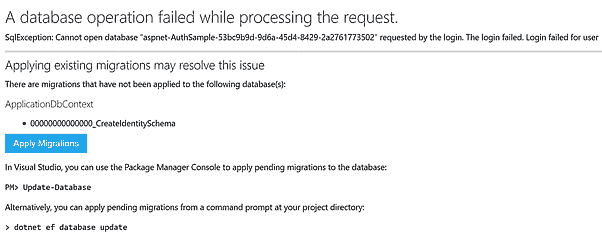

图 12.3–由于缺少迁移导致的运行时异常

您可以单击**应用迁移**运行迁移并刷新页面，这应该可以解决问题。或者，在 Visual Studio 中打开项目，并在包管理器控制台中运行`Update-Database`以应用迁移并重新运行应用程序。现在，您应该能够注册并登录到应用程序。现在，让我们检查一个为我们创建的项目结构。

在**依赖包**下，您会注意到以下 NuGe t 包:

*   **微软。AspNetCore.Identity.UI** :这是一个 Razor 类库，它包含了整个身份 UI，你可以用它从浏览器中导航——例如`/Identity/Account/Register`或者`/Identity/Account/Login`。
*   **微软。ASP.NET Core身份用来与数据库存储交互。**
*   **Microsoft.EntityFrameworkCore.SqlServer**: A library used to interact with SQLDB.

    这些包可以在下面的截图中看到:

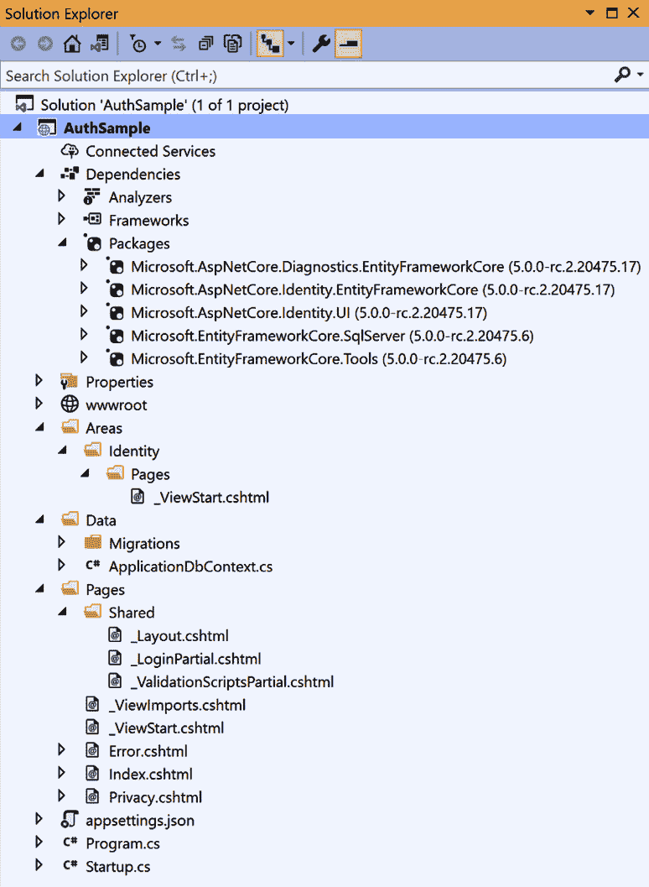

图 12.4–身份验证示例项目的解决方案资源管理器视图

现在我们来考察一下`Startup.cs`的`Configure`法。

下面的代码注册了启用认证能力的认证中间件:

```cs
app.UseAuthentication();
```

在`ConfigureServices`方法中，`ApplicationDbContext`通过提供一个`options`配置注册为从属服务，该配置具有在`appsettings.json`中指定的`sql db`连接字符串，如下所示:

```cs
services.AddDbContext<ApplicationDbContext>(options =>
options.UseSqlServer(
  Configuration.GetConnectionString("DefaultConnection")));
```

`AddDefaultIdentity`方法注册生成用户界面的服务，并使用`IdentityUser`作为模型配置默认身份系统，如下所示:

```cs
services.AddDefaultIdentity<IdentityUser>(options =>
options.SignIn.RequireConfirmedAccount = true)
.AddEntityFrameworkStores<ApplicationDbContext>();
```

ASP.NET Core身份允许我们配置许多身份选项来满足我们的需求，例如，以下代码允许我们禁用电子邮件确认、配置密码要求和设置锁定超时设置:

```cs
services.AddDefaultIdentity<IdentityUser>(options =>
{
  options.SignIn.RequireConfirmedAccount = false;
  options.Password.RequireDigit = true;
  options.Password.RequireNonAlphanumeric = true;
  options.Password.RequireUppercase = true;
  options.Password.RequiredLength = 8;
  options.Lockout.DefaultLockoutTimeSpan = 
  TimeSpan.FromMinutes(5);
  options.Lockout.MaxFailedAccessAttempts = 5;
})
.AddEntityFrameworkStores<ApplicationDbContext>();
```

更多详情可以参考[https://docs . Microsoft . com/en-us/aspnet/core/security/authentication/identity？view=aspnetcore-5.0](https://docs.microsoft.com/en-us/aspnet/core/security/authentication/identity?view=aspnetcore-5.0) 。

## 脚手架

要进一步自定义 UI 等设置，可以有选择地添加 Razor 类库中包含的源代码，然后可以修改生成的源代码以适合自己的需要。对于脚手架，在解决方案资源管理器中，右键单击**项目** | **添加** | **新脚手架项目** | **标识** | **单击添加**。

这将打开一个窗口，您可以在其中选择要覆盖的文件，如下图所示:

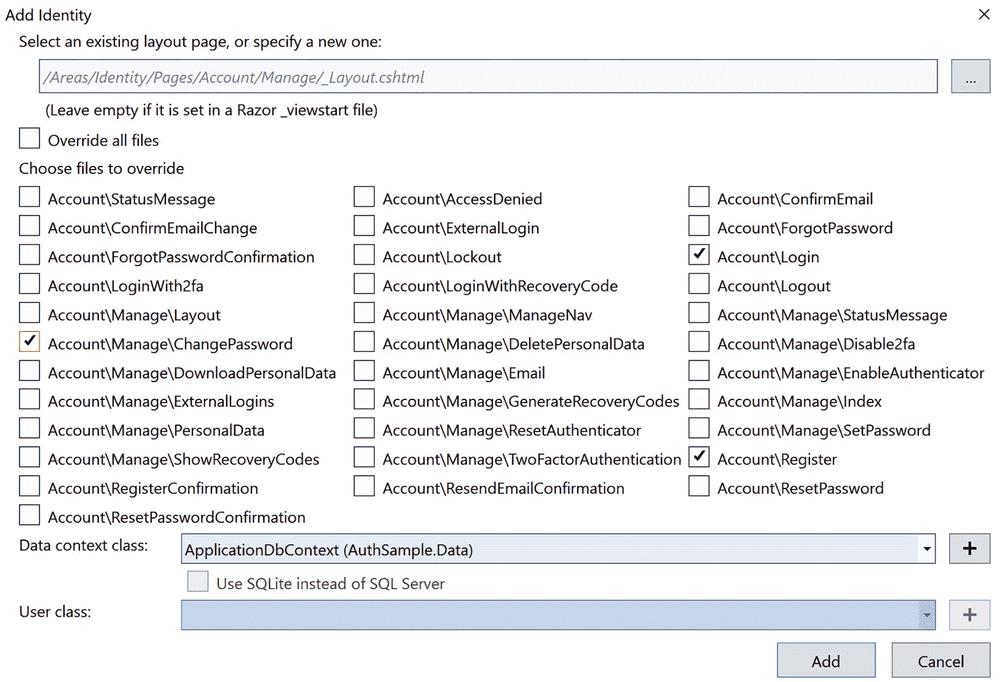

图 12.5–覆盖身份模块的对话框

您可以选择覆盖所有文件，或者只选择要自定义的文件。选择您的数据上下文类，然后单击**添加**将源代码添加到您的项目中。这将在`Identity`文件夹下添加文件 Razor 和相应的 C#文件都将被添加。以下屏幕截图说明了根据选择添加的文件:

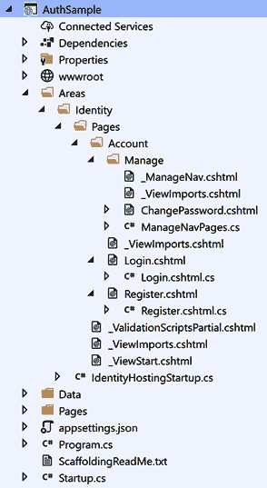

图 12.6–身份验证示例项目的解决方案资源管理器视图

关于定制的更多细节，你可以参考[https://docs . Microsoft . com/en-us/aspnet/core/security/authentication/scaffold-identity？视图=aspnetcore-5.0](https://docs.microsoft.com/en-us/aspnet/core/security/authentication/scaffold-identity?view=aspnetcore-5.0) 。

现在，让我们了解如何将 ASP.NET Core应用程序与外部登录提供商集成。

## 与外部登录提供商的集成

在本节中，我们将学习如何集成 ASP.NET Core应用程序，以使用外部登录提供商，如微软帐户、谷歌、脸书、推特等，并使用 OAuth 2.0 流进行认证，以便用户可以使用他们现有的凭据注册和访问我们的应用程序。将 ASP.NET Core应用程序与任何外部登录提供程序集成的常见模式如下所示:

1.  从各自的开发人员门户获取凭据(通常是客户端标识和密码)以访问 OAuth APIs 进行身份验证。
2.  在应用程序设置或用户机密中配置凭据。
3.  Next, we need to add the respective NuGet package to the project at **Add Middleware Support** to use OpenId and OAuth 2.0 flows.

    要与脸书认证集成，安装`Microsoft.AspNetCore.Authentication.Facebook`，可在[https://www.nuget.org](https://www.nuget.org)获得。

4.  在`Startup.cs`中，在`ConfigureServices`方法下，调用`AddAuthentication`方法注册认证服务。

要将谷歌配置为外部登录提供商，您需要执行以下步骤:

1.  在[https://developers.google.com/identity/sign-in/web/sign-in](https://developers.google.com/identity/sign-in/web/sign-in)创建 OAuth 凭证。
2.  在用户机密中配置凭据。您可以使用`dotnet` CLI 为您的项目添加秘密，如:

    ```cs
    dotnet user-secrets set "Authentication:Google:ClientId" "<client-id>"
    dotnet user-secrets set "Authentication:Google:ClientSecret" "<client-secret>"
    ```

3.  将`Microsoft.AspNetCore.Authentication.Google` NuGet 包添加到您的项目中，并在`Startup.ConfigureServices`方法中添加以下代码:

    ```cs
    services.AddAuthentication()
            .AddGoogle(options =>
            {
                IConfigurationSection googleAuthNSection =
                   Configuration.GetSection
                  ("Authentication:Google");
                options.ClientId = 
                 googleAuthNSection["ClientId"];
                options.ClientSecret = 
                 googleAuthNSection["ClientSecret"];
            });
    ```

4.  同样，可以添加多个提供者。

更多详情可参考[https://docs . Microsoft . com/en-us/aspnet/core/security/authentication/social/？view=aspnetcore-5.0](https://docs.microsoft.com/en-us/aspnet/core/security/authentication/social/?view=aspnetcore-5.0) 。

完成上述步骤后，您应该能够使用谷歌凭据登录到您的应用程序。关于在应用程序中对外部登录提供程序使用 ASP.NET Core身份进行身份验证的部分到此结束。在下一节中，让我们看看 OAuth 是什么。

# 了解 OAuth 2.0

OAuth 2.0 是一个现代的和行业标准协议，用于保护 web APIs。它通过为 web 应用程序、单页应用程序、移动应用程序等提供特定的授权流来访问安全的 API，从而简化了流程。

考虑一个用例，其中您希望构建一个门户网站，用户可以在其中同步和查看来自他们最喜欢的应用程序(如 Instagram、脸书或其他第三方应用程序)的照片/视频。您的应用程序应该能够代表用户向第三方应用程序请求数据。一种方法是存储与每个第三方应用程序相关的用户凭证，您的应用程序代表用户发送或请求数据。

这种方法会导致许多问题，概述如下:

*   您需要设计应用程序来安全地存储用户凭据。
*   用户可能不喜欢第三方应用程序在您的应用程序中共享和存储他们的凭据。
*   如果用户更改了他们的凭据，他们需要在您的应用程序中更新。
*   在安全漏洞的情况下，欺诈者可以不受限制地访问第三方应用程序中的用户数据。这可能会导致潜在的收入和声誉损失。

OAuth 2.0 可以通过解决所有这些问题来处理前面所有的用例。让我们看看如何，如下所示:

1.  用户登录到您的应用程序。要同步图片/视频，用户将被重定向到第三方应用程序，并且他们需要使用凭据登录。
2.  Oauth 2.0 审核并批准应用程序获取资源的请求。
3.  用户被重定向回带有授权代码的应用程序。
4.  要同步图片/视频，您的应用程序可以通过交换授权代码来获取令牌，然后与令牌一起对第三方应用程序进行 API 调用。
5.  在每个请求中，第三方应用程序验证令牌并做出相应的响应。

在 OAuth 流程中，涉及到四方，包括**客户端**、**资源所有者**、**授权服务器**、**资源服务器**。参考以下截图:

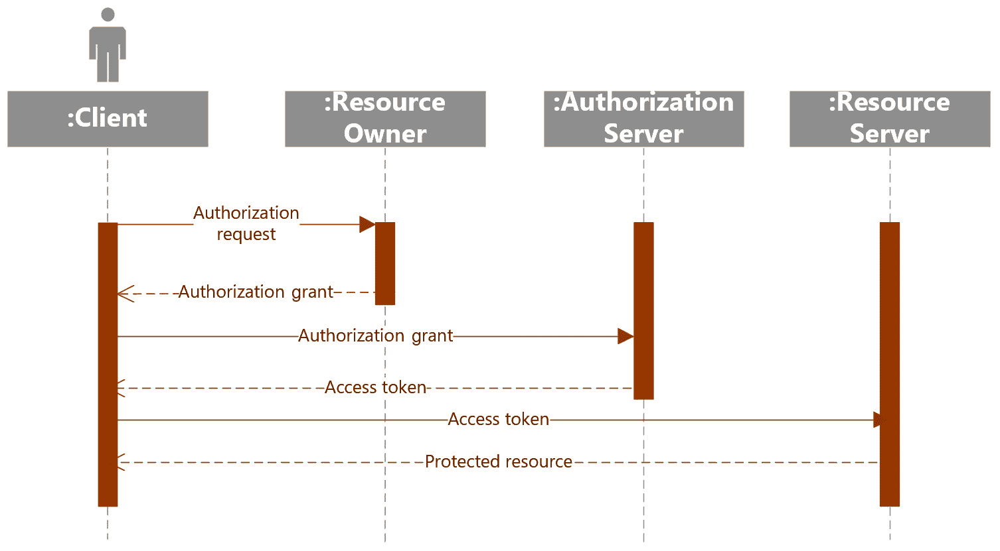

图 12.7–OAuth 2 流程

从截图中，我们看到了以下内容:

*   **资源所有者**:这是一个拥有资源/数据的实体，能够授予客户端访问权限。
*   **资源服务器**:承载与资源所有者相关的资源或数据，使用承载令牌进行验证，并响应或拒绝来自客户端的请求的服务器。
*   **客户端**:从授权服务器获取令牌，代表资源所有者向资源服务器发出请求的应用。
*   **授权服务器**:对资源所有者进行认证，并向客户端发放令牌。

## 代币

授权服务器对用户进行身份验证，并提供一个 ID 令牌、访问令牌和刷新令牌，这些都是本机/web 应用程序用来访问受保护服务的。让我们进一步了解每一个:

*   **访问令牌**:由授权服务器作为 OAuth 流的一部分颁发，通常为 JWT 格式；一个 Base64 编码的 JSON 对象，包含发行者、用户、作用域、过期时间等信息
*   **刷新令牌**:由授权服务器连同访问令牌一起颁发，客户端应用程序使用该令牌在访问令牌过期前请求新的访问令牌
*   **身份令牌**:由授权服务器作为 OpenID Connect 流程的一部分颁发，可用于认证用户

## 授权授予类型

OAuth 2.0 定义了客户端获取令牌以访问安全资源的多种方式，这些方式称为授权。它定义了四种授权类型:授权代码、隐式、代表和客户端凭证流，如下所述:

*   **授权代码流**:这个流是适合 web、移动、单页应用，你的应用需要从另一个服务器获取你的数据。授权代码流从客户端重定向用户以在授权服务器进行身份验证开始。如果成功，用户同意客户端所需的权限，并使用授权代码重定向回客户端。这里，客户端的身份通过授权服务器中配置的重定向**统一资源标识符** ( **URI** )来验证。接下来，客户端通过传递授权代码来请求访问令牌，并作为回报获得访问令牌、刷新令牌和到期日期。客户端可以使用访问令牌来调用网络应用编程接口。由于访问令牌是短暂的，在它们过期之前，客户端应该通过传递访问令牌和刷新令牌来请求新的访问令牌。
*   **隐式流**:这是一个简化版的代码流，适用于单页、基于 JavaScript 的应用程序。使用隐式流，授权服务器只发布访问令牌，而不是发布授权代码。这里，不验证客户端身份，因为不需要指定重定向网址。
*   **代表流程**:这个流程最适合客户端调用网络应用编程接口(比如说，A)的情况，而在中需要调用另一个应用编程接口(比如说，B)。流程是这样的:用户向 A 发送一个请求和一个令牌；a 通过提供令牌和凭证(如 a 的客户端 ID 和客户端秘密)从授权服务器请求令牌来访问 B。一旦它为 B 获取令牌，它就调用 B 上的 API。
*   **客户端凭证流**:这个流是用在需要服务器到服务器交互的情况下(比如 A 到 B，其中 A 获取令牌使用其凭证(通常是客户端 ID 和客户端秘密)与 B 交互，然后用获取的令牌调用 API)。该请求在 A 的上下文下运行，而不是在用户的上下文下运行。所需的权限应授予 A 以执行必要的操作。

现在我们已经了解了 OAuth 是什么，在下一节中，让我们了解一下 Azure AD 是什么，以及如何将其与我们的电子商务应用程序集成，并将其用作我们的身份服务器。

# 天青公元简介

Azure AD 是微软提供的一款**I**T3】身份和访问管理 ( **IAM** )云服务。它是内部用户和外部用户的单一身份存储，因此您可以配置应用程序使用 Azure AD 进行身份验证。您可以将内部 Windows AD 同步到 Azure AD，从而为您的用户启用**单点登录** ( **SSO** )体验。用户可以使用自己的工作或学校凭证或个人微软账户如`Outlook.com`、Xbox、Skype 等登录。它还允许您本地添加或删除用户、创建组、执行自助密码重置、启用 Azure MFA 等等。借助 Azure AD B2C，您可以自定义用户注册、登录和管理其个人资料的方式，它还允许您的客户使用他们现有的社交凭据(如脸书、谷歌等)来登录和访问您的应用程序和 API。

Azure AD 符合行业标准协议，例如 **OpenID Connect** ，也称为 **OIDC** 和 OAuth2.0。OIDC 是建立在 OAuth 2.0 协议之上的身份层，用于验证和检索用户的个人资料信息。OAuth 2.0 用于授权，以使用不同的流(如隐式授权流、代表流、客户端凭据流等)获得对 HTTP 服务的访问。

web 应用程序中的典型身份验证流程如下所示:

1.  用户试图访问应用程序的安全内容(比如说**我的订单**)。
2.  如果用户没有通过身份验证，他们将被重定向到 Azure 广告登录页面。
3.  一旦用户提交了他们的凭证，它们就会被 Azure AD 验证，Azure AD 会将令牌发送回网络应用程序。
4.  cookie 会保存到用户的浏览器中，并显示用户请求的页面。
5.  在随后的请求中，一个 cookie 被发送到服务器，用于验证用户。

**Azure AD B2C** 使您的客户能够使用他们首选的社交、企业或原生身份来访问您的应用程序或 API。它可以扩展到每天数百万用户和数十亿次身份验证。

让我们尝试将我们的电子商务应用程序与 Azure AD B2C 集成。在高层次上，我们需要执行以下步骤来整合这一点:

1.  创建一个 Azure AD B2C 租户。
2.  注册申请。
3.  添加身份提供者。
4.  创建用户流。
5.  Update the app code to integrate.

    注意

    作为先决条件，您应该有一个具有参与者角色的活动 Azure 订阅。如果你没有，你可以在[https://azure.microsoft.com/en-in/free/](https://azure.microsoft.com/en-in/free/)注册一个免费账户。

## Azure AD B2C 设置

使用 Azure AD B2C 作为身份服务将允许我们的电子商务用户注册，创建自己的凭据，或者使用他们现有的社交凭据，如脸书或谷歌。让我们研究一下将 Azure AD B2C 配置为电子商务应用程序的身份服务所需执行的步骤，如下所示:

1.  登录 Azure 门户，确保您位于包含您的订阅的同一目录中。
2.  在**首页**页面，点击**创建资源**搜索 **B2C** ，从选项中选择 **Azure 活动目录 B2C** 。
3.  Select **Create a new Azure AD B2C Tenant**, as illustrated in the following screenshot:

    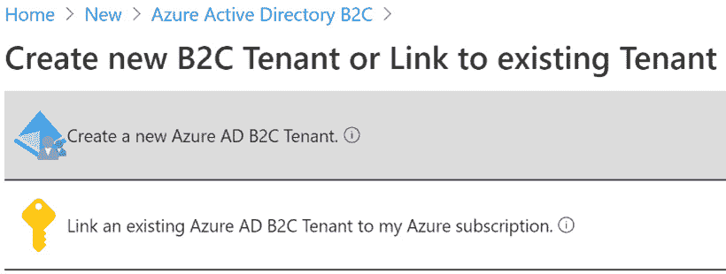

    图 12.8–Azure AD B2C

4.  Provide the required details and click **Review + create**, then complete the following fields:

    **机构名称**:你的 B2C 租户名称。

    **内部域名**:你租户的内部域名。

    **国家/地区**:选择您的租户应该供应的国家或地区。

    **订阅****资源群**:提供订阅和资源群详情。

    这些字段显示在下面的屏幕截图中:

    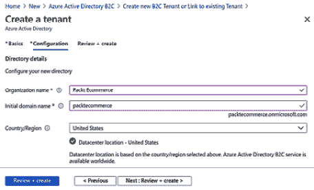

    图 12.9–新的 Azure AD B2C 配置部分

5.  Review your details and click **Create**. The creation of your new tenant might take a few minutes. Once it is created, you will see confirmation in the notification section. In the **Notifications** popup, click on the tenant name to navigate to the newly created tenant, as illustrated in the following screenshot:

    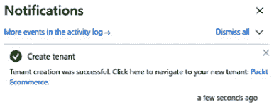

    图 12.10–确认创建 Azure AD B2C 服务

6.  If you notice, in the following screenshot, **Subscription status** is given as **No Subscription**, and a warning message says that you should *link a subscription to your tenant*. You can click the link to fix it, else you can skip to *Step 9* to continue to configure Azure AD:

    

    图 12.11–无订阅链接警告消息

7.  The link will open the same screen that you have seen in *Step 3*. This time, click **Link an existing Azure AD B2C Tenant to my Azure subscription** to continue, as illustrated in the following screenshot:

    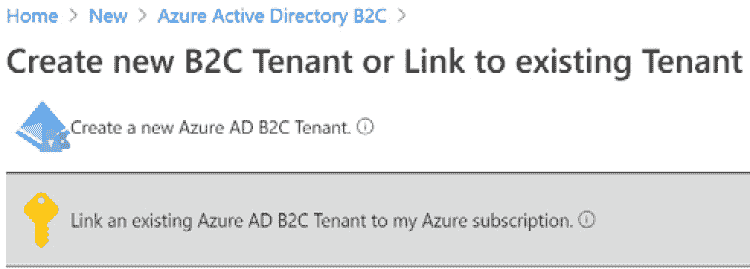

    图 12.12–将 Azure 广告 B2C 租户链接到订阅

8.  Select your B2C tenant subscription from the dropdown, provide a **Resource group** value, and click **Create** to link the subscription and the tenant, as illustrated in the following screenshot:

    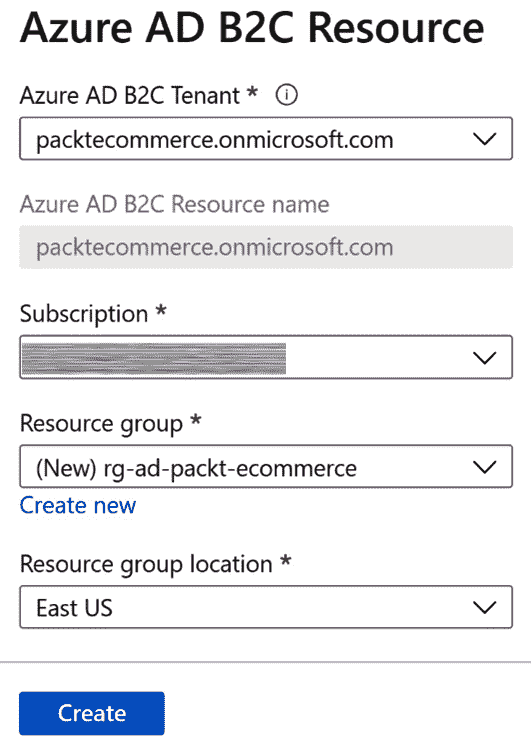

    图 12.13–订阅选择

9.  您可以导航到您的 B2C 租户，继续配置的后续步骤，如下所示:
    *   您需要向 Azure AD B2C 租户注册您的应用程序，以将其用作身份服务。
    *   您需要选择用户可以用来登录您的应用程序的身份提供者。
    *   选择用户流来定义用户注册或登录的体验，如下图所示:

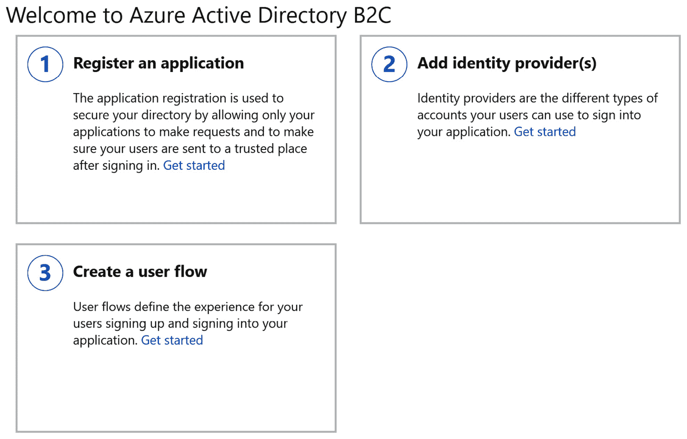

图 12.14–配置 Azure AD B2C 的三个步骤

1.  Under **Manage**, click **App Registrations** and provide the necessary details as follows, and then click **Register** to create the AD application:

    **名称**:显示您的应用程序的名称。

    **支持的账户类型**:在任何身份提供者或组织目录中选择**账户，这样我们就可以允许用户使用他们现有的凭据进行注册或登录。**

    **重定向 URI** :您需要提供您的应用程序的网址，用户将在成功认证后重定向到该网址。目前，我们可以将其留空。

    **权限**:选择**授予管理员对 openid 和 offline_access 权限的许可**。

    这些字段显示在下面的屏幕截图中:

    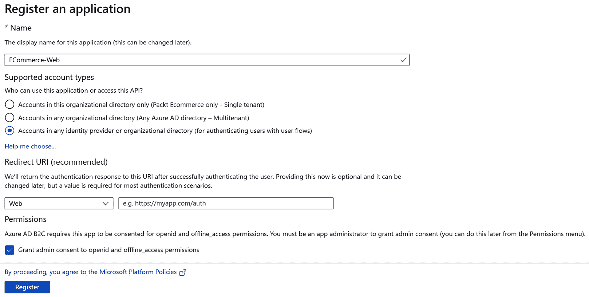

    图 12.15–注册新的 Azure AD 应用程序

    注意

    要在本地设置和调试，我们可以使用`localhost`进行配置。这需要替换为托管您的应用程序的网址。

2.  Now, let's choose **Identity Providers** under **Manage** to configure, as follows:

    **本地账户**:该选项允许用户通过用户名和密码以传统方式注册并登录我们的应用。下面的截图说明了这一点:

    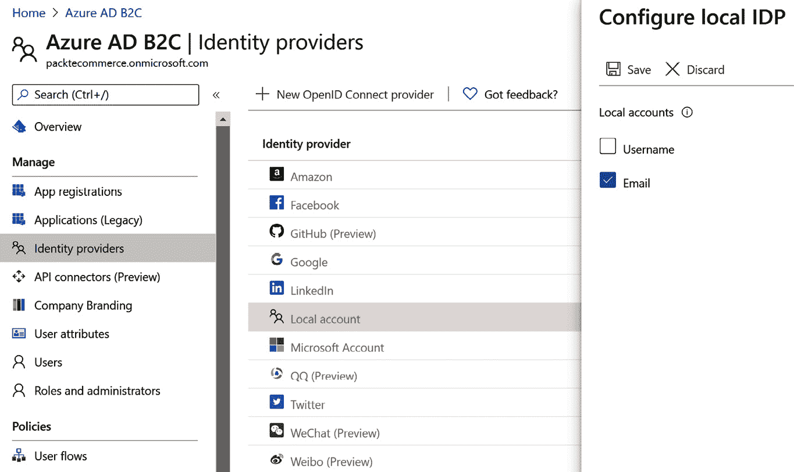

    图 12.16–身份提供商选择

3.  Let's configure Google as the identity provider for our application. You can follow the steps outlined at [https://docs.microsoft.com/en-in/azure/active-directory-b2c/identity-provider-google](https://docs.microsoft.com/en-in/azure/active-directory-b2c/identity-provider-google) to acquire the client ID and secret. The details you need to provide are shown in the following screenshot:

    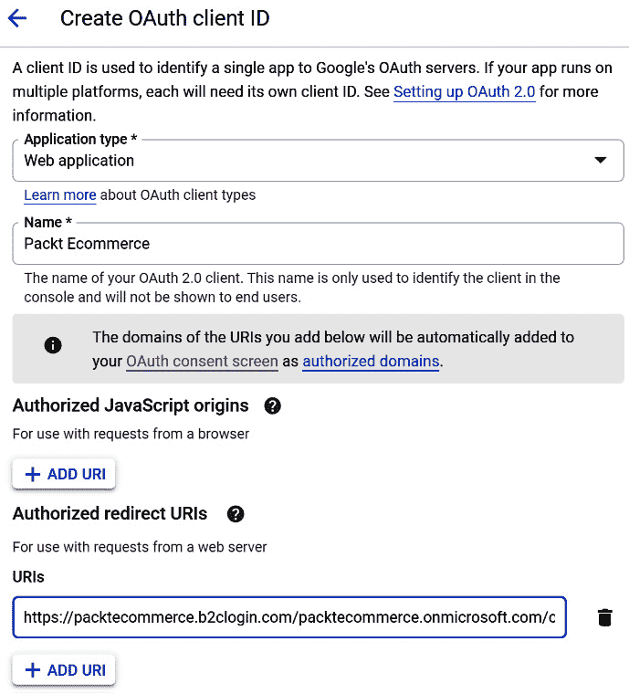

    图 12.17–谷歌:新的 OAuth 客户端

    提供所需的详细信息并保存后，生成客户端 ID 和密码，如下图截图所示:

    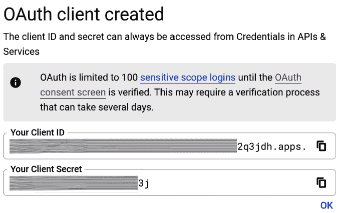

    图 12.18–谷歌 OAuth 客户端

4.  Once you create **Auth Client**, click on **Google** from **identity providers**, and then provide the **Client ID** and **Client secret** values to complete the configuration. Refer to the following screenshot:

    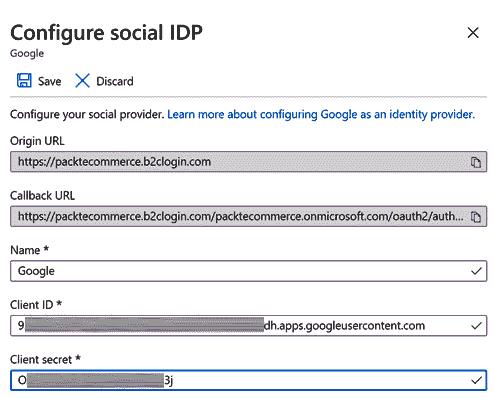

    图 12.19–身份提供者配置

5.  让我们将脸书配置为我们的电子商务应用程序的另一个身份提供商。您可以按照[中概述的步骤进行操作。](https://docs.microsoft.com/en-in/azure/active-directory-b2c/identity-provider-facebook)
6.  创建**客户端身份验证**设置后，从**身份提供者**中点击**脸书**，然后提供**客户端 Id** 和**客户端密码**值至完成配置。参见*图 12.19* 进行概述。
7.  Now, let's configure the user flow. The user flow allows you to configure and customize the authentication experience for your users. You can configure multiple flows in your tenant and use them in your application. User flows allow you to add MFA and also to customize information that you capture from a user at the time of registration—for example, given name, country, postal code, and optionally adding them to claims. You can also customize the UI for a better user experience. To create a flow, click **User Flows** under **Policies** and choose a flow type, as illustrated in the following screenshot:

    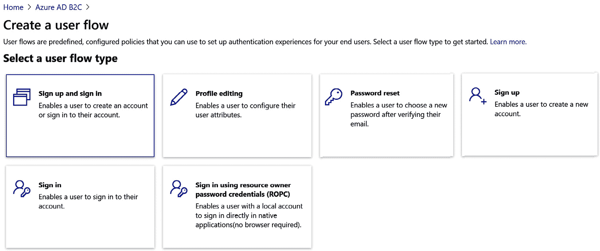

    图 12.20–新用户流

8.  Provide the necessary details and click **Create** to save:

    **名称**:您要唯一识别的流的名称。

    **身份提供者**:选择身份提供者。

    也可以选择其他用户属性，如**姓名**、**邮政编码**等，如下图截图所示:

    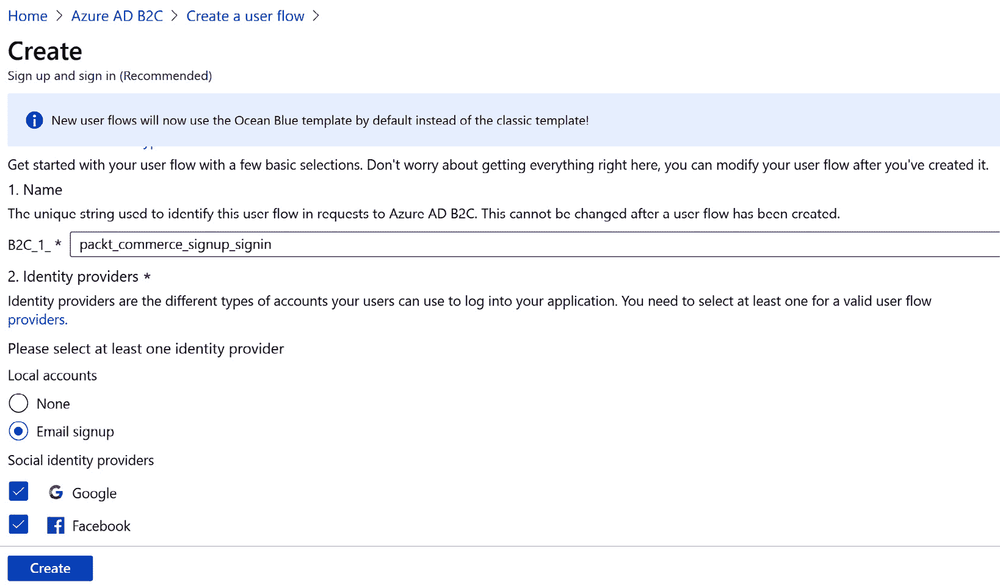

    图 12.21–用户流配置

    可以选择附加属性，如下图截图所示:

    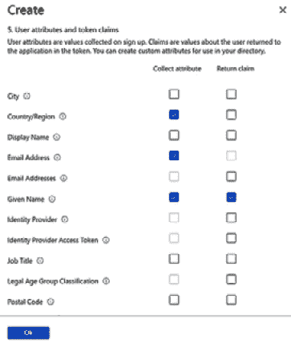

    图 12.22–附加属性和索赔配置

9.  同样，我们也应该设置密码重置策略。这是本地帐户所必需的。要创建一个，在**创建用户流**下选择**密码重置**并提供必要的详细信息，参见*图 12.19* 。
10.  已经完成了 Azure AD B2C 的最低要求设置，我们准备测试流程。选择创建的用户流，点击**运行用户流**。您可以查看为您创建的注册和登录页面，您可以在下面的屏幕截图中找到这些页面:

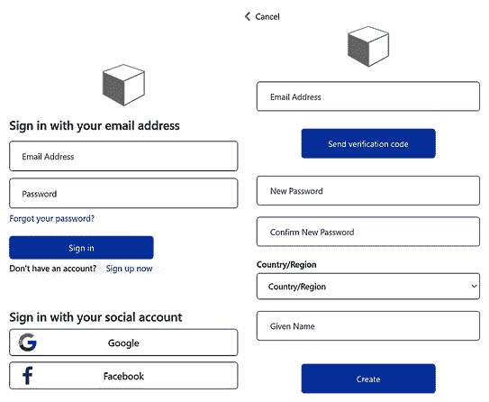

图 12.23–登录和注册屏幕

我们来看看`Packt.Ecommerce.Web`中需要做哪些改变才能和 Azure AD 集成。

## 将我们的电子商务应用集成到 Azure AD B2C

我们将在web 应用程序上配置身份验证，以使用 Azure AD B2C。让我们对应用程序进行必要的更改，以便与 B2C 租户集成，如下所示:

1.  Add the following two NuGet packages to our `Packt.Ecommerce.Web` project:

    `Microsoft.Identity.Web`:这是与 Azure AD 集成所需的主包。

    `Microsoft.Identity.Web.UI`:这个包生成了登录和注销的 UI。在`ConfigureServices`方法下的`Startup.cs`中，我们需要使用`OpenIdConnect`方案和`Azure AD B2C`配置来添加认证服务，如下所示:

    ```cs
    services.AddAuthentication(OpenIdConnectDefaults.AuthenticationScheme).AddMicrosoftIdentityWebApp(Configuration.GetSection("AzureAdB2C"));
    services.AddRazorPages().AddMicrosoftIdentityUI();
    ```

2.  在`Configure`方法下，在`app.UseAuthorization()`方法前添加以下代码:

    ```cs
    app.UseAuthentication();
    ```

3.  We need to add `AzureAdB2C in appsettings.json`, as follows:

    `Instance` : `https://<domain>.b3clogin.com/tfp`。用创建 B2C 租户时选择的名称替换`<domain>`。

    `ClientId`:这是你在设置 Azure AD B2C 时创建的 AD 应用 ID。

    `Domain` : `<domain>.onmicrosoft.com`。在这里，用您在创建 B2C 租户时选择的域名替换`<domain>`。

    更新`SignUpSignInPolicyId`和`ResetPasswordPolicyId`，如下:

    ```cs
    "AzureAdB2C": {
        "Instance": "https://packtecommerce.b2clogin.com/tfp/",
        "ClientId": "1ae40a96-60d7-4641-bb81-
          bc3a47aad36d",
        "Domain": "packtecommerce.onmicrosoft.com",
        "SignedOutCallbackPath": "/signout/B2C_1_susi",
        "SignUpSignInPolicyId": "B2C_1_packt_commerce",
        "ResetPasswordPolicyId": "B2C_1_password_reset",
        "EditProfilePolicyId": "",
        "CallbackPath": "/signin-oidc"
      }
    ```

4.  您可以将`[Authorize]`属性添加到控制器或动作方法中，例如，您可以将其添加到`OrdersController.cs`中的`OrdersController`中，以强制用户验证自己以访问`Orders`信息。
5.  The last step is to update the reply URI. To do so, navigate to **AD Application** in your tenant, navigate to the **Authentication** section under **Manage**, and update **Reply URI** and set implicit grant permissions.

    URI 回复是您的应用程序的网址，用户将在成功验证后被重定向到该网址。要在本地设置应用程序并进行调试，我们可以配置 localhost URL，但是一旦将应用程序部署到服务器，就需要更新服务器的 URL。

    在**隐式授权**下，选择**访问令牌**和**身份令牌**，这是我们的 ASP.NET Core应用程序所必需的，如下图所示:

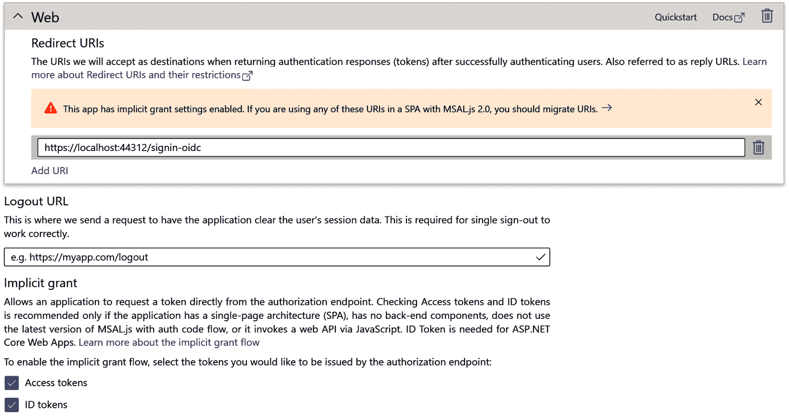

图 12.24–回复网址配置

现在，运行您的应用程序并尝试访问**订单**页面。您将被重定向到登录和注册页面，如*图 12.23* 所示。我们的电子商务应用程序与 Azure AD B2C 的集成到此结束。

Azure AD 提供了许多更多选项和定制，以满足您的需求。更多详情可以看[https://docs.microsoft.com/en-in/azure/active-directory-b2c](https://docs.microsoft.com/en-in/azure/active-directory-b2c)。

注意

您可以使用身份服务器 4 来设置自己的身份服务器。这使用 OpenID Connect 和 OAuth 2.0 框架来建立身份。它可以通过 NuGet 获得，并且可以很容易地与 ASP.NET Core应用程序集成。更多详情可参考[https://identityserver4.readthedocs.io/en/latest](https://identityserver4.readthedocs.io/en/latest)。

在下一节中，让我们看看如何使用 Windows 身份验证。

# Windows 身份验证简介

ASP.NET Core应用程序可以配置为使用 Windows 身份验证，用户可以根据其 Windows 凭据进行身份验证。当您的应用程序托管在 Windows 服务器上并且您的应用程序仅在内部网可用时，Windows 身份验证是最佳选择。在本节中，我们将学习如何在 ASP.NET Core应用程序中使用 Windows 身份验证。

在 Visual Studio 中，创建新的 ASP.NET Core项目时，在**更改身份验证**窗口中选择**窗口身份验证**。如果选择命令行界面创建项目，使用`--auth Windows`参数使用 Windows 身份验证创建新的 web 应用，如下所示:

```cs
dotnet new webapp --auth Windows -o WinAuthSample
```

如果打开`launchSettings.json`，会注意到`WindowsAuthentication`设置为`true`、`anonymousAuthentication`设置为`false`，如下面的代码片段所示。此设置仅在**互联网信息服务快递** ( **IIS 快递**)中运行应用时适用:

```cs
"iisSettings": {
    "windowsAuthentication": true,
    "anonymousAuthentication": false,
    "iisExpress": {
      "applicationUrl": "http://localhost:21368",
      "sslPort": 44384
    }
  }
```

当您在 IIS 上托管应用程序时，您需要在`web.config`中将`WindowsAuthentication`配置为`true`。默认情况下，不会为添加`web.config`。NET Core web 应用程序，因此您需要添加并进行必要的更改，如以下代码片段所示:

```cs
<location path="." inheritInChildApplications="false">
    <system.webServer>
      <security>
        <authentication>
          <anonymousAuthentication enabled="false"/>
          <windowsAuthentication enabled="true"/>
        </authentication>
      </security>
    </system.webServer>
</location>
```

前面的配置使每个端点都很安全。即使我们在任何控制器或动作上设置`AllowAnonymous`，也不会有影响。如果您想使任何端点可匿名访问，您需要将`anonymousAuthentication`设置为`true`，并在您想确保安全的端点上设置`Authorize`。除此之外，您还需要使用`Windows`方案注册认证服务，如下所示:

```cs
services.AddAuthentication(IISDefaults.AuthenticationScheme)
```

这是我们在您的应用程序中启用 Windows 身份验证所需要做的全部工作。更多详情可以参考[https://docs . Microsoft . com/en-us/aspnet/core/security/authentication/window sauth？view=aspnetcore-5.0](https://docs.microsoft.com/en-us/aspnet/core/security/authentication/windowsauth?view=aspnetcore-5.0) 。

在下一节中，我们将了解一些保护客户端和服务器应用程序的最佳实践。

# 了解保护客户端和服务器应用程序的最佳实践

有几个最佳实践被推荐用于保护你的网络应用。。NET Core 和 Azure 服务使得确保它们的采用变得很容易。以下是您可能会考虑的关键因素:

*   对网络应用程序实施 HTTPS。使用`UseHttpsRedirection`中间件将请求从 HTTP 重定向到 HTTPS。
*   使用基于 OAuth 2.0 和 OIDC 的现代身份验证框架来保护您的网络或应用编程接口应用程序。
*   如果您使用的是微软身份平台，请使用开源库(如 MSAL.js 和 MSAL.js)来获取或续订令牌。
*   配置强密码要求，并在连续失败的登录尝试(例如，五次连续失败的尝试)的情况下锁定您的帐户。这可以防止暴力攻击。
*   为特权帐户(如后台管理或后台员工帐户等)启用 MFA。
*   配置会话超时；注销时使会话无效；透明饼干。
*   在所有安全端点和客户端强制授权。
*   将密钥/密码存储在安全的位置，如密钥库中。
*   如果您正在使用 Azure AD，请单独注册每个逻辑/环境特定的应用程序。
*   不要以纯文本形式存储敏感信息。
*   确保正确的异常处理。
*   对上传的文件执行安全/恶意软件扫描。
*   防止跨站点脚本攻击—始终对用户输入数据进行 HTML 编码。
*   通过使用存储过程参数化 SQL 查询来防止 SQL 注入攻击。
*   防止跨站点请求伪造攻击—对动作、控制器或全局使用`ValidateAntiForgeryToken`过滤器。
*   使用此策略在中间件中实施 **CORS** (简称**跨来源请求**)。

虽然所提供的最佳实践和指导从一开始就很好，但您需要始终考虑应用程序的上下文，并持续评估和增强您的应用程序，以解决安全漏洞和威胁。

# 总结

在这一章中，我们了解了什么是认证，以及 ASP.NET 芯认证的关键要素。我们探索了 ASP.NET Core框架提供的不同选项，并了解了 ASP.NET Core身份如何帮助快速向您的应用程序添加身份验证。我们讨论了 OAuth 2.0 和授权流，以及当您需要验证和连接到多个 API 服务时，它们如何使事情变得容易。我们还研究了将 Azure AD 配置为您的身份服务，在您的应用程序中使用外部身份验证提供商(如谷歌或脸书)，以及在 ASP.NET Core应用程序中使用 Windows 身份验证。在本章的最后，我们讨论了在开发服务器端和客户端应用程序时应该遵循的一些最佳实践。

在下一章中，我们将了解什么是授权，以及授权如何帮助控制对资源的访问。

# 问题

1.  What information can be derived from a JWT?

    a.发行人

    b.满期

    c.领域

    d.科目

    e.上述全部

2.  What are the recommended OAuth grant flows for single-page apps?

    a.客户端凭据

    b.隐形的

    c.代码授权流

    d.代表流量

3.  What are the minimum required NuGet packages to integrate with Azure AD?

    a.`Microsoft.AspNetCore.Identity`

    b.`Microsoft.Identity.Web.UI`

    c.`Microsoft.AspNetCore.Identity.UI`

    d.`Microsoft.Identity.Web`

# 进一步阅读

要了解有关身份验证的更多信息，您可以参考以下内容:

*   [https://docs . Microsoft . com/en-us/aspnet/core/security/authentication/？view=aspnetcore-5.0](https://docs.microsoft.com/en-us/aspnet/core/security/authentication/?view=aspnetcore-5.0)
*   [https://docs.microsoft.com/en-in/azure/active-directory-b2c](https://docs.microsoft.com/en-in/azure/active-directory-b2c)