# 服务之间的有效沟通

在前一章中，我们使用. NET 单片应用开发了微服务。这些服务相互独立，位于不同的服务器上。有什么更好的服务间通信方式，其中一个服务与另一个服务进行交互和通信？在微服务中，每个服务可能相互独立，也可能不相互独立。例如，结帐服务可能需要产品服务，但产品服务可能不需要结帐服务。在这种情况下，服务之间的通信非常重要。我们将详细讨论某些支持服务间通信的模式。

在本章中，我们将讨论有助于我们促进这种交流的各种模式和方法。我们还将介绍使用 Azure 服务结构和 Kubernetes 的集成模式。

在本章中，我们将涵盖以下主题:

*   了解服务之间的通信
*   了解集成模式
*   了解蔚蓝服务结构
*   具有立方体的微服务
*   构建微服务应用时考虑物联网

# 技术要求

本章包含各种代码示例来解释一些概念。代码将很简单，只是为了演示。

要运行和执行代码，您需要以下先决条件:

*   Visual Studio 2019
*   。网络核心设置和运行

要运行这些代码示例，您需要安装 Visual Studio 2019 或更高版本(我们首选的 IDE)。为此，请遵循以下说明:

1.  从[https://docs . Microsoft . com/en-us/Visual Studio/install/install-Visual Studio](https://docs.microsoft.com/en-us/visualstudio/install/install-visual-studio)下载 Visual Studio 2019(社区免费)。
2.  按照操作系统的安装说明进行操作。Visual Studio 有多个版本。我们使用的是视窗操作系统。

如果你没有。NET Core 3.1 安装好了，可以去[https://www.microsoft.com/net/download/windows](https://www.microsoft.com/net/download/windows)下载设置。

The complete source code is available here: [https://github.com/PacktPublishing/Hands-On-Microservices-with-C-8-and-.NET-Core-3.0](https://github.com/PacktPublishing/Hands-On-Microservices-with-C-8-and-.NET-Core-3.0-Third-Edition).

让我们开始第一部分，它是关于理解服务之间的通信。

# 了解服务之间的通信

在. NET 单片应用的情况下，如果需要访问第三方组件或外部服务，我们使用 HTTP 客户端或另一个客户端框架来访问资源。在[第二章](02.html)*重构整块*中，我们开发了产品服务，使其能够独立工作。但是这对我们的应用没有好处；我们需要一些服务来相互交互。

这是一个挑战—让服务相互通信。产品服务和订单服务都托管在不同的服务器上。这两个服务器彼此独立，都基于 REST，并且都有自己的端点，它们可以从这些端点相互通信。(当一个服务与另一个服务交互时，反之亦然，我们称之为*服务间通信*)。

服务之间有几种通信方式；让我们简单讨论一下:

*   **同步**:在这种情况下，客户端向远程服务(称为**服务**)请求特定的功能，然后等待直到得到响应:

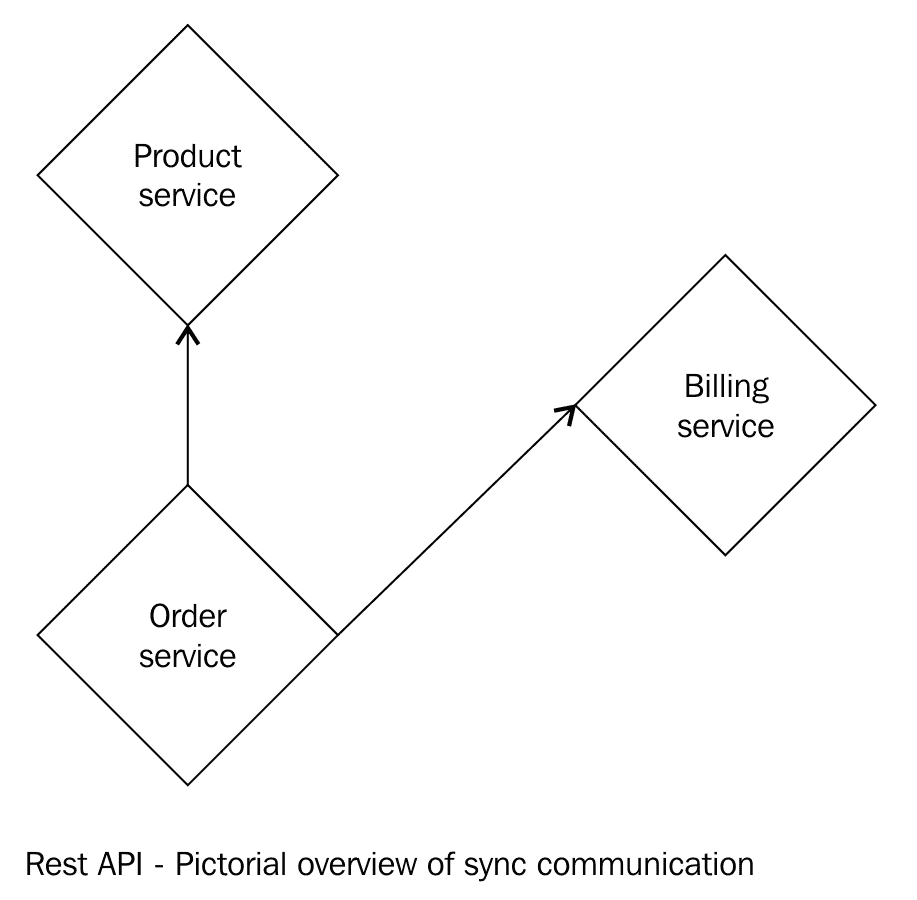

在上图(图示视图，不完整)中，您可以看到我们不同的微服务相互通信。我们所有的服务都是 RESTful 的。它们基于 ASP.NET Core网络应用编程接口。在下一节中，我们将讨论如何调用服务。这就是所谓的同步方法，客户端必须等待服务的响应。在这种情况下，客户端必须等到得到完整的响应。

*   **异步**:在这种情况下，客户端向远程服务(称为*服务*)请求特定的功能。客户不会等待，但会关心响应。异步完成分配给他们的任务，这也适用于我们的日常生活。例如，如果我们正在做早餐，那么我们会遵循某些任务；也就是说，我们可以准备我们的茶，煮一个鸡蛋，等等。现在，让我们以想象中的应用为例。在这里，我们试图添加一个产品。用户指示系统这样做，并将数据值传递给控制器。然后，控制器调用存储库，存储库使用实体框架的上下文保存数据。我们将在接下来的章节中详细讨论这一点。

# 合作方式

在前一节中，我们讨论了两种不同的服务交互模式。这些模式是合作的风格。让我们来看看它们:

*   **请求/响应**:这种情况下，客户端发送请求，等待服务器的响应。这是同步通信的一种实现。然而，请求/响应不仅仅是同步通信的实现；我们也可以将它用于异步通信。让我们看一个例子来理解这一点。在 [**第二章**](02.html)**重构整块*中，我们开发了`ProductService`。该服务包括`GetProduct`方法，是同步的。每当客户端调用此方法时，都必须等待响应:*

```cs
[HttpGet]
[Route("GetProduct")]
public IActionResult Get() => 
return new
OkObjectResult(_productRepository.GetAll().ToViewModel());
```

根据前面的代码片段，每当客户端调用这个方法(请求这个方法)时，他们都必须等待响应。换句话说，他们必须等到`ToViewModel()`扩展方法被执行:

```cs
[HttpGet]
[Route("GetProductSync")]
public IActionResult GetIsStillSynchronous()
{
   var task = Task.Run(async() => await
   _productRepository.GetAllAsync());
   return new OkObjectResult(task.Result.ToViewModel());
}
```

在前面的代码片段中，我们可以看到我们的方法是这样实现的，即每当客户端发出请求时，他们都必须等到`async`方法被执行。在前面的代码中，我们使用`async`作为`sync`。看看`task.Result.ToViewModel()`，它正在返回前面代码中的响应，我们可以看到`.Result`是我们的代码`sync`的来源。

为了缩短我们的代码，我们在已经存在的代码中添加了一些扩展方法，我们在[第 2 章](02.html)、*重构整体*中写道:

```cs
namespace FlixOne.BookStore.ProductService.Helpers
{
    public static class Transpose
    {
        public static ProductViewModel ToViewModel(
                               this Product product)
        {
            return new ProductViewModel
            {
                CategoryId = product.CategoryId,
                CategoryDescription = product.Category.Description,
                CategoryName = product.Category.Name,
                ProductDescription = product.Description,
                ProductId = product.Id,
                ProductImage = product.Image,
                ProductName = product.Name,
                ProductPrice = product.Price
            };
        }

        public static IEnumerable<ProductViewModel> ToViewModel(this IEnumerable<Product> products) => products.Select(ToViewModel).ToList();
    }
}
```

总之，我们可以说请求/响应的协作风格并不意味着它只能同步实现；我们也可以为此使用异步调用。

*   **基于事件的**:这种协作风格的实现纯粹是异步的。这是一种实现方法，发出事件的客户端不知道如何反应。在前一节中，我们以同步的方式讨论了`ProductService`。让我们看一个用户/客户如何下单的例子。以下流程图是购书功能的图示概述:

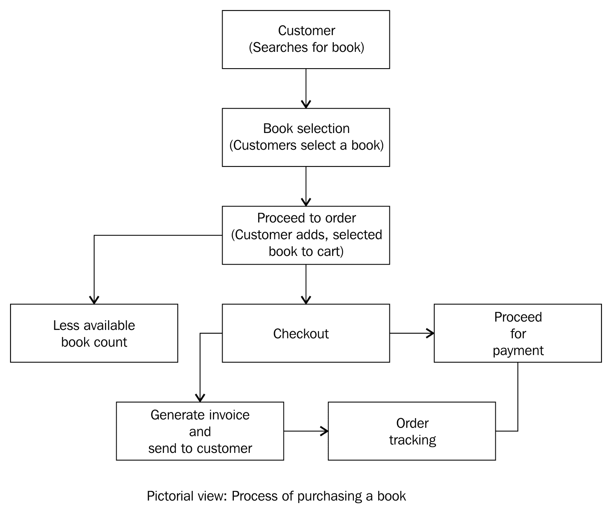

上图显示了以下内容:

从概念上讲，这看起来很容易；然而，当我们讨论实现微服务时，我们讨论的是单独托管的服务，它们有自己的 REST API、数据库等。这现在听起来更复杂了。涉及许多方面，例如，一个服务如何在一个或多个服务成功响应时调用另一个服务。下图显示了这种事件驱动架构的样子:

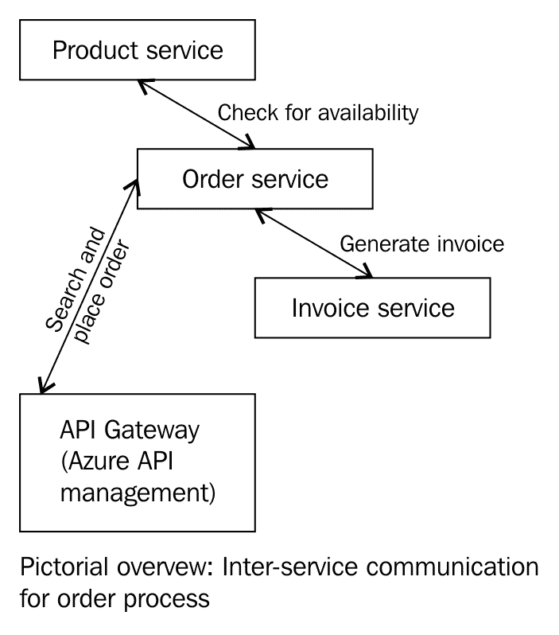

在上图中，我们可以看到**订单服务**执行时**发票服务**和**产品服务**被触发。这些服务调用其他内部异步方法来完成它们的功能。

We are using Azure API management as our API gateway. In the upcoming sections, we will discuss this in detail.

这一部分是关于服务之间的通信，我们了解了各种通信方式，然后是关于协作的讨论。

在下一节中，我们将讨论如何实现我们的应用所需的各种集成模式。

# 了解集成模式

到目前为止，我们已经讨论了服务间通信，并通过使用同步和异步通信完成了`ProductService`的实际实现。我们还实现了微服务，使用不同风格的协作。我们的 FlixOne 书店(按照微服务架构风格开发)需要更多的交互，这意味着它需要更多的模式。在本节中，我们将帮助您理解它们。

The complete application of the FlixOne bookstore can be found in [Chapter 11](11.html), *Building a Microservice Application*.

# 应用编程接口网关

在*协作风格*部分，我们讨论了两种可以用来促进微服务之间相互通信的风格。我们的应用分为各种微服务:

*   产品服务
*   订单服务
*   发票服务
*   客户服务

在我们的 FlixOne 书店(用户界面)中，我们需要展示一些细节:

*   书名、作者姓名、价格、折扣等等
*   有效
*   书评
*   图书评级
*   出版商排名和其他出版商信息

在我们检查实现之前，让我们讨论一下 API 网关。

应用编程接口网关是所有客户端的单一入口点。它充当客户端应用和服务之间的代理。在我们的例子中，我们使用 **Azure API 管理(APIM)** 作为我们的 API 网关。

Please refer to the *Appendix* for more details and implementation of an API gateway and the related BFF pattern. 

应用编程接口网关负责以下功能:

*   接受应用编程接口调用并将它们路由到我们的后端
*   验证应用编程接口密钥、JWT 令牌和证书
*   通过 Azure AD 和 OAuth 2.0 访问令牌支持身份验证
*   强制实施使用配额和费率限制
*   在不修改代码的情况下，动态转换我们的应用编程接口
*   缓存后端响应，无论它们设置在哪里
*   出于分析目的记录呼叫元数据

Refer to *Azure API Management* ([https://docs.microsoft.com/en-us/azure/api-management/](https://docs.microsoft.com/en-us/azure/api-management/)) to find out more about the process of setting up the API Azure portal and working with REST APIs.

下图显示了作为应用编程接口网关的 Azure 应用编程接口管理:

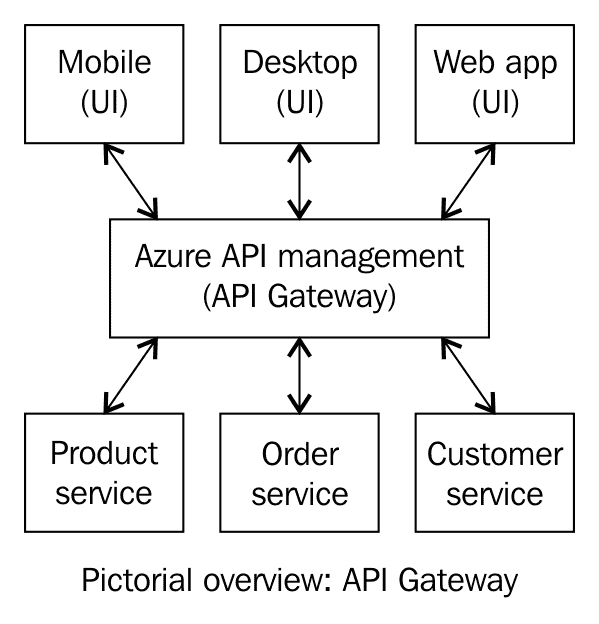

在前面的流程图中，我们有不同的客户端，如移动应用、桌面应用和网络应用，它们使用微服务。

我们的客户不知道在哪个服务器上可以找到我们的服务。应用编程接口网关提供自己服务器的地址，并使用有效的`Ocp-Apim-Subscription-Key`在内部验证来自客户端的请求。

Additional steps must be taken to force traffic through APIM. With the respective URL, it is possible to bypass this by going directly to the backend, if it is exposed externally.

我们的`ProductService`有一个 REST API。它包含以下资源:

| **API 资源** | **描述** |
| `GET /api/product` | 获取产品列表 |
| `GET /api/product/{id}` | 获取产品 |
| `PUT /api/product/{id}` | 更新现有产品 |
| `DELETE /api/product/{id}` | 删除现有产品 |
| `POST /api/product` | 添加新产品 |

我们已经创建了`ProductClient`，这是一个. NET 控制台应用。它通过提供订阅密钥向 Azure 应用编程接口管理发出请求。下面是这个的代码片段:

```cs
namespace FlixOne.BookStore.ProductClient
{
   class Program
   {
      private const string ApiKey = "myAPI Key";
      private const string BaseUrl = "http://localhost:3097/api";
      static void Main(string[] args)
      {
         GetProductList("/product/GetProductAsync");
         //Console.WriteLine("Hit ENTER to exit...");
         Console.ReadLine();
      }
      private static async void GetProductList(string resource)
      {
         using (var client = new HttpClient())
         {
            var queryString =
            HttpUtility.ParseQueryString(string.Empty);

            client.DefaultRequestHeaders.Add("Ocp-Apim-Subscription-
            Key", ApiKey);

            var uri = $"{BaseUrl}{resource}?{queryString}";

            //Get asynchronous response for further usage
            var response = await client.GetAsync(uri);
            Console.WriteLine(response);
          }
       }
    }
 }
```

在前面的代码中，我们的客户端请求一个 REST API 来获取所有的产品。下面是代码中出现的术语的简要描述:

| `BaseUrl` | 这是代理服务器的地址。 |
| `Ocp-Apim-Subscription-Key` | 这是应用编程接口管理为客户选择的特定产品分配的密钥。 |
| `Resource` | 这是我们的应用编程接口资源，通过 Azure 应用编程接口管理进行配置。它将不同于我们实际的 REST API 资源。 |
| `Response` | 这是指对特定请求的响应。在我们的例子中，这是默认的 JSON 格式。 |

由于我们使用 Azure 应用编程接口管理作为应用编程接口网关，我们将获得某些好处:

*   我们可以从单个平台管理我们的各种 APIs 例如，`ProductService`、`OrderService`等服务可以被很多客户端轻松管理和调用。
*   因为我们使用的是应用编程接口管理，它不仅为我们提供了代理服务器；它还允许我们为我们的 API 创建和维护文档。
*   它提供了一个内置的工具，这样我们就可以为配额、输出格式和格式转换定义各种策略，例如从 XML 到 JSON，反之亦然。

因此，在应用编程接口网关的帮助下，我们可以获得一些伟大的功能。

# 事件驱动模式

微服务架构使用每个服务一个数据库的模式，这意味着它为每个依赖或独立的服务包含一个独立的数据库:

*   **依赖服务**:我们的应用需要一些外部服务(第三方服务或组件等)和/或内部服务(这些是我们自己的服务)才能按预期工作或运行。例如，**结账服务**需要**客户服务**，还需要外部(第三方)服务来验证客户身份(如印度客户的 Aadhaar 身份证或美国客户的 SSN 身份证)。这里，我们的**结账服务**是一个依赖服务，因为它需要两个服务(一个内部服务和一个外部服务)才能按预期运行。如果服务依赖的任何或所有服务不能正常工作(服务不能正常工作的原因有很多，包括网络故障、未处理的异常等)，依赖服务就不能工作。
*   **独立服务**:在我们的应用中，我们有不依赖任何其他服务正常工作的服务。这种服务被称为独立服务，它们可以自我托管。我们的**客户服务**不需要任何其他服务来正常运行，这意味着它是一个独立的服务，不需要任何其他服务的输入。不过，这并不意味着我们的其他服务不依赖于**客户服务**；其他服务可能依赖也可能不依赖于此服务。

主要的挑战是维护业务事务，以确保这些服务之间的数据一致性。例如，如下图所示，**客户服务**要知道**结账服务**何时以及如何运作，它需要**客户服务**的功能。一个应用中可能有多个服务(服务可能是自托管的)。在我们的例子中，当**结账-服务**被触发并且**客户服务**没有被调用时，那么我们的应用将如何识别客户的详细信息？

ASP.NET WebHooks([https://docs.microsoft.com/en-us/aspnet/webhooks/](https://docs.microsoft.com/en-us/aspnet/webhooks/))也可以用来提供事件通知。

为了克服我们已经讨论过的相关问题和挑战(对于**结账-服务**和**客户服务**，我们可以使用事件驱动模式(或最终的一致性方法)并使用分布式事务。

Distributed transactions are where data flows on more than one network. These transactions are capable of updating this data on networked computer systems. These also detect and roll back the subsequent operations, if any fail.

下图描述了事件驱动模式在我们的应用中的实际实现，其中**产品-服务**订阅事件，**事件管理器**管理所有事件:

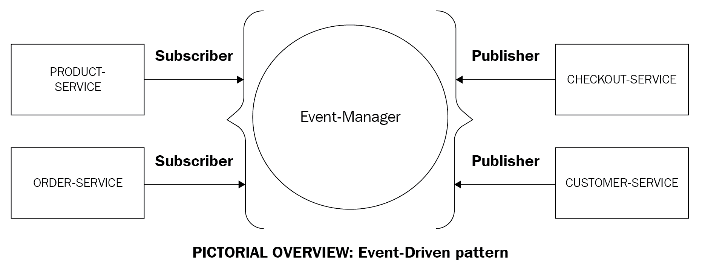

在事件驱动模式中，我们以这样一种方式实现服务:每当一个服务更新其数据时，它就发布一个事件，而另一个服务(依赖服务)订阅这个事件。现在，每当一个依赖服务接收到一个事件，它就更新它的数据。这样，如果需要，我们的依赖服务可以获取和更新它们的数据。上图显示了服务如何订阅和发布事件的概述。这里，**事件管理器**可以是运行在服务上的程序，也可以是帮助您管理订阅者和发布者的所有事件的中介。

它登记**发布者**的事件，并在特定事件发生/触发时通知**订阅者**。它还可以帮助您形成队列并等待事件。在我们的实现中，我们将使用 Azure 服务总线队列。

让我们考虑一个例子。在我们的应用中，这是我们的服务发布和接收事件的方式:

*   **客户服务**为用户执行一些检查，即登录检查、客户详细信息检查等。进行这些必要的检查后，服务会发布一个名为`CustomerVerified`的事件。
*   **结账-服务**接收该事件，并在执行必要的操作后，发布名为`ReadyToCheckout`的事件。
*   **订单服务**收到此事件并更新数量。
*   结账一完成，**结账服务**就会发布一个事件。从外部服务(无论是`CheckedoutSuccess`还是`CheckedoutFailed`)收到的任何结果都由**结账-服务**使用。
*   当`InventoryService`收到这些事件时，它会更新数据，以确保该项被添加或删除。

通过使用事件驱动模式，服务可以自动更新数据库并发布事件。

# 事件源模式

这种模式帮助我们确保每当状态改变时，服务都会发布一个事件。在这种模式中，我们将业务实体(产品、客户等)视为一系列状态变化事件。**事件商店**保存事件，这些事件可用于订阅或作为其他服务。这种模式简化了我们的任务，因为我们不需要同步数据模型和业务领域。它提高了性能、可扩展性和响应能力。这只是定义了一种方法，通过一系列事件来指示我们如何处理数据上的各种操作。这些事件被记录在商店里。事件表示对数据进行的一组更改，例如`InvoiceCreated`。

下图描述了事件将如何为 **ORDERSERVICE 工作:**

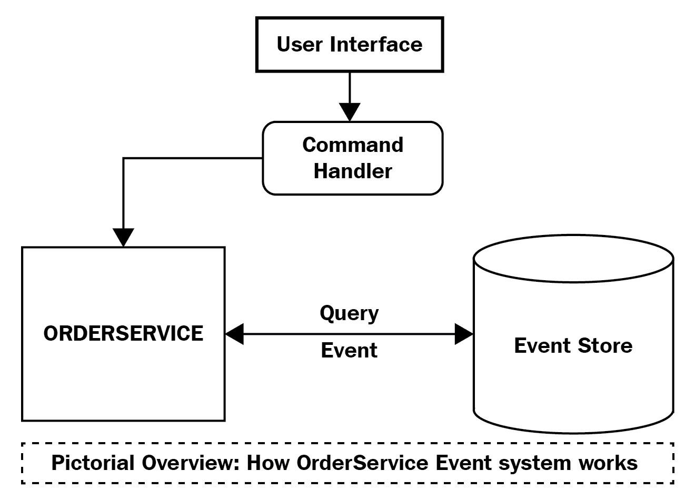

上图显示了以下实现:

1.  命令从**用户界面**发出一本书进行订购。
2.  **订单服务**查询(来自**事件商店**，并用`CreateOrder`事件填充结果。
3.  然后，命令处理程序引发一个事件来订购图书。
4.  我们的服务执行相关操作。
5.  最后，系统将事件附加到事件存储中。

# 最终一致性模式

最终一致性是数据一致性方法的实现。这意味着实现，因此该系统将是一个具有高可用性的可扩展系统。

"The distributed system needs to be specified as having eventual consistency as an explicit requirement. Eventual consistency comes from the systems that exhibit scalability and high availability."

根据该分布式数据，商店服从**一致性、可用性(网络)、分区容差** ( **CAP** )定理。CAP 定理也被称为布鲁尔定理。根据这个定理，在分布式系统中，我们只能从以下三个中选择两个:

*   一致性(丙)
*   可用性(一)
*   分区容差

以我们想象的系统为例，它是高可用的(A)，高度一致的(C)，并且没有分区(CA)。当我们要求并进行分区(P)时，我们的系统有多达 *n* 个分区，或者我们说我们在持续地对我们的系统进行分区。在这种情况下，这是一个非常复杂的场景，数据很难到达或覆盖所有分区。这就是为什么当我们进行分区时，我们要么使系统高度可用(AP)，要么使系统高度一致(CP)。

# 补偿交易

补偿事务允许我们回滚或撤消我们在一系列步骤中执行的所有任务。假设一个或多个服务已经实现了一系列操作，并且其中一个或多个已经失败。我们的下一步会是什么？我们会颠倒所有的步骤，还是承诺一个半完成的功能？

在我们的案例中，客户订购了一本书，`ProductService`将订购的书标记为暂时售出。订单确认后，`OrderService`调用外部服务完成支付流程。如果付款失败，我们将需要撤销我们之前的任务，这意味着我们将不得不检查`ProductService`，以便它将特定的书标记为未售出。

# 竞争消费者

竞争消费者允许我们为多个并发消费者处理消息，以便他们在同一个通道上接收这些消息。这个应用是用来处理大量请求的。

下图显示了此的实现:

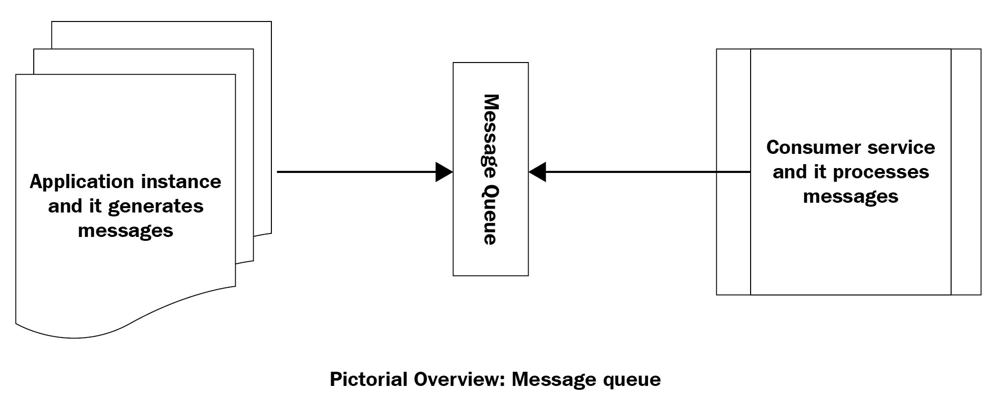

这个消息流是通过将一个消息传递系统传递给另一个服务(消费者服务)来实现的，这个服务可以异步处理。

这个场景可以通过使用 Azure 服务总线队列来实现。我们将在下一节讨论这个问题。

# 了解蔚蓝服务结构

Azure 服务结构是一个分布式系统的平台；它帮助我们轻松管理可扩展的微服务。它克服了开发人员和基础设施人员面临的各种挑战。Azure Service Fabric 是一个分布式系统平台，它使我们能够轻松地打包、部署和管理可扩展且可靠的微服务和容器。

# 服务结构体系结构

服务结构是服务的集合。每个集合被分成不同的子系统。每个子系统都有自己特定的职责，允许我们编写以下类型的应用:

*   可扩展的应用
*   可管理的应用
*   可测试的应用

主要子系统构成了服务结构体系结构，如下图所示:

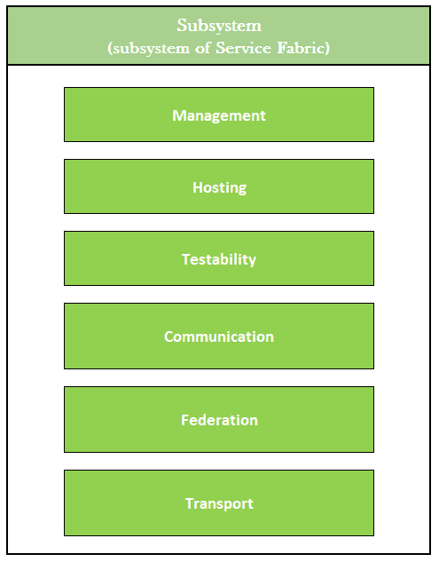

底层的第一层，即传输子系统，负责在服务结构集群中的节点之间提供安全的通信通道。让我们更详细地看一下所有这些子系统:

*   **传输子系统**为集群内和集群间的通信提供了通信通道。用于通信的通道由 X509 证书或 Windows 安全保护。该子系统支持单向和请求-响应通信模式。联盟子系统使用这些信道来广播和多播消息。该子系统位于服务结构内部，开发人员不能直接将其用于应用编程。
*   **联盟子系统**负责将虚拟机或物理机逻辑分组在一起，形成服务结构集群。该子系统使用传输子系统提供的通信基础设施来实现这种分组。这有助于服务结构更高效地管理资源。该子系统的主要职责包括故障检测、领导选举和路由。子系统在为集群分配的节点上形成环形拓扑。在系统中实现了令牌租用机制和心跳检查，以检测故障、执行领导者选举并实现一致的路由。
*   托管在平台上的服务的**可靠性子系统**通过管理集群中跨节点的故障转移、复制和资源平衡来确保。这个子系统中的复制器逻辑负责跨服务的多个实例复制状态。该子系统的主要任务是维护服务部署中主副本和辅助副本之间的一致性。它与故障转移单元和重新配置代理交互，以便了解需要复制什么。
*   **管理子系统**处理已经部署在服务结构集群上的工作负载的应用生命周期管理。应用开发人员可以通过管理 API 或 PowerShell cmdlets 访问管理子系统的功能，以调配、部署、升级或取消调配应用。所有这些操作都可以在不停机的情况下执行。管理子系统有三个关键组件:集群管理器、运行状况管理器和映像存储。群集管理器与故障转移管理器交互。同时，可靠性子系统中的资源管理器部署可用节点的应用，同时考虑放置约束。它负责应用的生命周期，从资源调配到取消资源调配。它还与运行状况管理器集成，在服务升级期间执行运行状况检查。顾名思义，运行状况管理器负责监控应用、服务、节点、分区和副本的运行状况。它还负责汇总健康状态并将其存储在集中的健康存储中。API 暴露在这个系统之外，用于查询健康事件，以便它们可以执行纠正措施。这些应用编程接口可以返回特定集群资源的原始事件或聚合健康数据。映像存储负责持久化和分发部署在服务结构集群上的应用二进制文件。
*   **托管子系统**负责管理节点范围内的应用部署。集群管理器向托管子系统发出信号，通知它要在特定节点上管理的应用部署。然后，托管子系统管理该节点上应用的生命周期。它与可靠性子系统和管理子系统交互，以确保每个部署的健康。
*   **通信子系统**提供服务发现功能，并提供使用命名服务的集群内消息传递功能。命名服务用于在集群中定位服务。它还允许用户安全地与集群中的任何节点通信、检索服务元数据和管理服务属性。命名服务还公开了 API，允许用户解析每个服务的网络位置，尽管它们是动态放置的。
*   **可测试性子系统**为开发人员、部署工程师和测试人员提供了一个工具列表，这样他们就可以引入受控故障并运行测试场景，以验证已经部署在服务结构上的服务的状态转换和行为。当一个集群被提供或者当一个故障动作或测试场景已经启动一个命令时，故障分析服务自动启动
    。

在接下来的章节中，我们将更详细地讨论服务结构，在这里我们将详细介绍编排器和编程模型。

# 讨论管弦乐队

简而言之，编排器是一个用于管理服务部署的自动化软件。该软件包旨在从顶级用户那里抽象出有关配置、部署、故障处理、扩展和优化其管理的应用的复杂性。例如，关联度编排应该准备好使用指定服务实例数量的配置，以运行和执行基于多个高级因素的服务部署任务。这些因素包括群集期间节点上的资源可用性、放置限制等。管弦乐队可以对故障处理和服务恢复收费。如果集群中的一个节点出现故障，安排者必须优雅地处理这个问题，同时保证服务的便捷性。

服务结构集群资源管理器可以是在我们的集群内运行的中央服务。它管理集群内服务的指定状态，以及相关的资源消耗和放置规则。我们将在下一节讨论这个问题。

# 服务结构编程模型概述

服务结构提供了我们编写和管理服务的多种方式。服务可以选择使用服务结构 API 来充分利用平台的特性和应用框架。服务也可以是以任何语言编写的任何编译过的可执行程序，或者是运行在服务结构集群上的容器中的代码。让我们现在来看看这些:

*   **Guest 可执行文件**是一个现有的可执行文件，可以用任何语言编写，可以作为服务在应用中运行。这些客户可执行文件没有直接使用服务结构 API。Visual Studio 允许我们在服务结构集群上部署来宾可执行文件。
*   **容器**是完整文件系统的一部分，包含工具、运行时和系统库。
*   **可靠的服务**是一个轻量级框架，用于编写与 Service Fabric 平台集成并受益于该平台功能的服务。可靠的服务提供了一组最小的 API，允许服务结构运行时管理服务的生命周期，以便它们可以与运行时交互。应用框架很小，因此您可以完全控制设计和实现选择。它也可以用来托管任何其他应用框架，如 ASP.NET Core。
*   **ASP.NET Core**是一个开源的跨平台框架，我们可以用它来构建网络应用、物联网应用和移动后端。服务结构与 ASP.NET Core集成，因此我们可以编写无状态和有状态的 ASP.NET Core应用，利用可靠集合和服务结构的高级编排功能。
*   **可靠参与者**构建在可靠服务之上，是一个基于参与者设计模式实现虚拟参与者模式的应用框架。可靠参与者框架使用独立的计算和状态单元，并带有一个称为参与者的单线程执行。可靠参与者框架为参与者提供内置通信，并预设状态持久性和扩展配置。因为可靠参与者是建立在可靠服务上的应用框架，所以它与服务结构平台完全集成，并且受益于该平台提供的全套功能。

本节的目的是讨论服务结构，并提供其编程模型的概述。在下一节中，我们将学习如何实现关于竞争消费者的信息。

# 实施关于竞争消费者的信息

在*竞争消费者*部分，我们讨论了竞争消费者是传递信息的一种方式。在本节中，我们将讨论 Azure 服务总线并实现 Azure 消息队列。

# 蔚蓝服务巴士

在事件驱动模式中，我们讨论了发布和订阅事件。我们使用事件管理器来管理所有事件。在本节中，我们将学习 Azure 服务总线如何管理事件，并提供与微服务一起工作的工具。它像信息传递服务一样工作，并且它使服务之间的通信完美无缺。在我们的例子中，每当服务需要交换信息时，它们将使用该服务进行通信。

Azure 服务总线提供两种主要类型的服务:

*   **代理通信**:这项服务也被称为**雇佣服务**。它的工作原理类似于现实世界中的邮政服务。每当一个人想要发送消息或信息时，他/她可以向另一个人发送一封信。有了邮局，我们可以以信件、包裹、礼物等形式发送各种类型的信息。当我们使用代理通信类型时，我们自己不必费心传递消息，因为它确保我们的消息被传递，即使发送者和接收者都不在线。这是一个消息传递平台，包含队列、主题、订阅等组件。
*   **非代理通讯**:这类似于打电话。在这种情况下，呼叫者(发送者)呼叫一个人(接收者)，而没有任何指示他/她是否将应答该呼叫的确认。在这里，发送方发送信息，并依靠接收方接收通信，并将消息传递回发送方。请看下图，它展示了 Azure 服务总线:

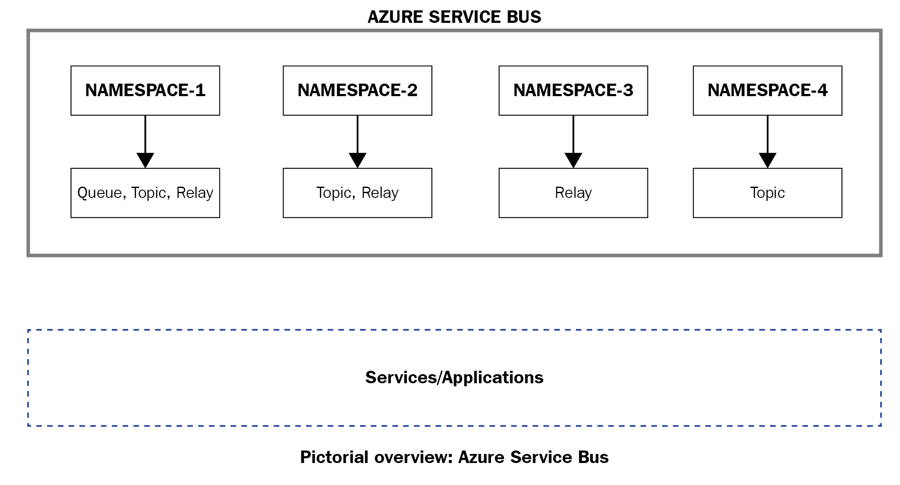

请参见微软 Azure 服务总线的文档。这里有一个描述:

*"Service Bus is a cloud service and is shared by multiple users. To get started with it, you need to create a namespace and define the communication mechanism."*

上图是 Azure 服务总线的示意图，描述了四种不同的通信机制。每个人在连接应用时都有自己的喜好:

*   **队列**:这些队列就像经纪人一样，允许单向通信。
*   **主题**:与队列类似，主题提供单向通信，但单个主题可以有多个订阅。
*   **中继**:这些不像队列和话题那样存储任何消息。相反，它们提供双向通信并将消息传递给应用。
*   **通知中心**:这将消息从服务器应用分发到平台上的客户端设备。

# Azure 消息队列

Azure 队列是使用 Azure 表的云存储帐户。它们允许我们在应用之间对消息进行排队。Azure 队列存储有一组不同于 Azure 服务总线的功能。在接下来的部分中，我们将实现消息队列，这是 Azure 服务总线的一部分。

在本节中，我们已经讨论了 Azure 消息队列，通过遵循 Azure 服务总线，它允许我们收集关于竞争消费者的信息。在下一节中，我们将实现关于服务结构的信息。

# 在服务结构上实现信息

在本节中，我们将通过创建以下内容来查看 Azure 服务总线队列的实际实现:

*   服务总线命名空间
*   服务总线消息队列
*   向其发送消息的控制台应用
*   接收消息的控制台应用

# 先决条件

我们需要以下内容来实施此解决方案:

*   Visual Studio 2019 或更高版本
*   有效的 Azure 订阅

如果您没有 Azure 套餐，您可以通过在[https://azure.microsoft.com/en-us/free/](https://azure.microsoft.com/en-us/free/)注册免费获得一个。

现在您已经拥有了一切，请按照以下步骤开始:

1.  登录蔚蓝门户([https://portal.azure.com/](https://portal.azure.com/))。
2.  在左侧导航栏中，单击服务总线。如果此选项不可用，您可以通过单击“更多服务”找到它。
3.  单击添加。这将打开“创建命名空间”对话框:

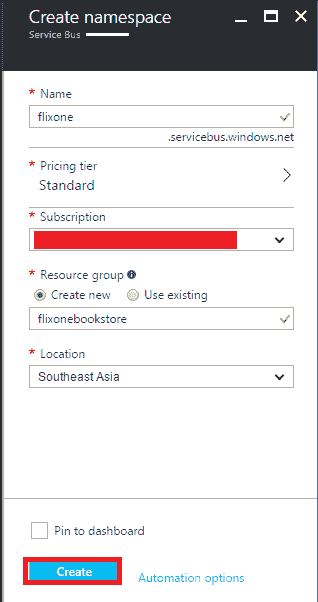

4.  在“创建命名空间”对话框中，输入一个命名空间(命名空间应该是全局唯一的)，如`flixone`。接下来选择定价层，即`Basic`、`Standard`或`Premium`。
5.  选择您的订阅。
6.  选择现有资源或创建新资源。
7.  选择要承载命名空间的位置。完成后，单击创建。
8.  打开一个新创建的命名空间(我们刚刚创建了`flixone`)。
9.  现在，单击共享访问策略。
10.  点击 RootManageSharedAccessKey，如下图截图所示:

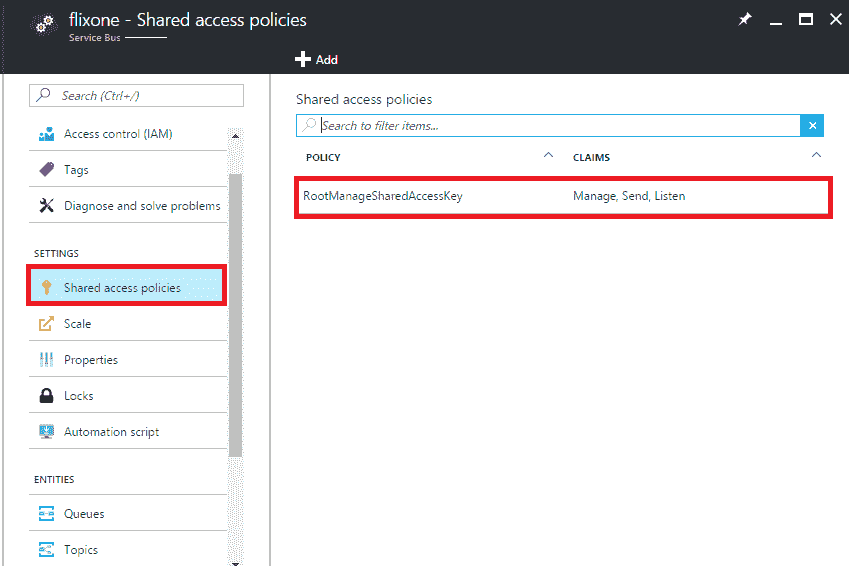

11.  点击`flixone`命名空间主对话框中的【队列】，如下图所示:

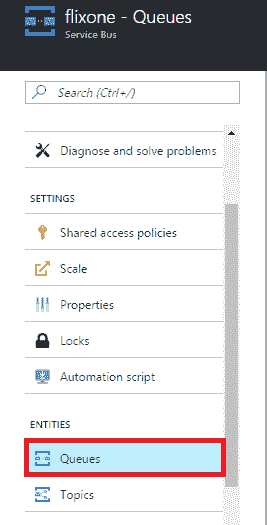

12.  在“策略:RootManageSharedAccessKey”窗口中，记下主键连接字符串，以便以后使用。

13.  点击名称添加队列(比如`flixonequeue`)。然后，单击创建(我们使用 REST 值作为默认值)，如下图所示:

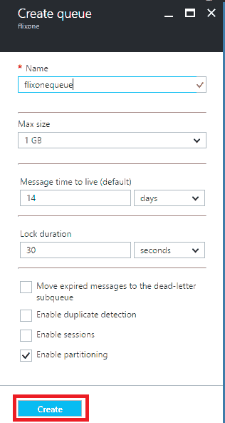

前面的截图是“创建队列”对话框的截图。在“创建队列”对话框中，我们可以创建队列。例如，在这里，我们正在创建一个名为 flixonequeue 的队列。可以通过访问“队列”对话框来验证队列。

现在，我们准备创建发送方和接收方应用。

# 向队列发送消息

在本节中，我们将创建一个控制台应用，它将实际向队列发送消息。要创建此应用，请执行以下步骤:

1.  创建一个新的控制台应用，然后使用 Visual Studio 的新项目(C#)模板将其命名为`FlixOne.BookStore.MessageSender`:


2.  右键单击项目，添加 Microsoft Azure 服务总线 NuGet 包。
3.  使用以下代码将消息发送到队列。您的`Program.cs`文件将包含以下`MainAsync()`方法:

```cs
private static async Task MainAsync()
{
    const int numberOfMessagesToSend = 10;
    _client = new QueueClient(_connectionString, _queuename);
    WriteLine("Starting...");
    await SendMessagesAsync(numberOfMessagesToSend);
    WriteLine("Ending...");
    WriteLine("Press any key...");
    ReadKey();
    await _client.CloseAsync();
}
```

在前面的代码中，我们通过提供已经在 Azure 门户中设置的`ConnectionString`和`QueueName`来创建队列客户端。这段代码调用`SendMessagesAsync()`方法，该方法接受一个包含需要发送的消息数的参数。

4.  创建一个`SendMessagesAsync()`方法，并添加以下代码:

```cs
private static async Task SendMessagesAsync(int numberOfMessagesToSend)
{
    try
    {
        for (var index = 0; index < numberOfMessagesToSend; index++)
        {
            var customMessage = $"#{index}:A message from 
                            FlixOne.BookStore.MessageSender.";
            var message = new Message(Encoding.UTF8.GetBytes(
                                      customMessage));
            WriteLine($"Sending message: {customMessage}");
            await _client.SendAsync(message);
        }
    }
    catch (Exception exception)
    {
        WriteLine($"Weird! It's exception with message:
                   {exception.Message}");
    }
}
```

5.  运行程序并等待一段时间。您将获得以下输出:

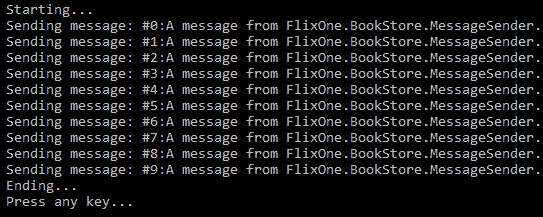

6.  转到 Azure 门户，然后转到创建的队列，检查它是否显示消息。在下面的截图中，我们可以看到 flixonequeue 的概述，其中我们可以看到活动消息计数和更多信息:

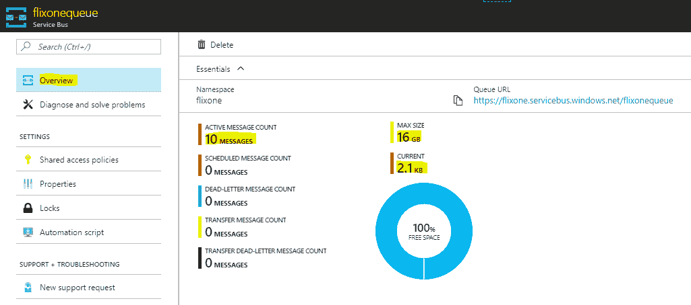

前面的截图来自 Azure 门户，是 flixonequeue(服务总线)的概览屏幕。目前，我们有 10 条消息(活动消息数)。

# 添加配置设置

在上一节中，我们使用了`ConnectionString`和`QueueName`的常数值。如果我们需要更改这些设置，我们必须对代码进行更改。然而，为什么我们要为这么小的变化进行代码更改呢？为了克服这种情况，我们将使用配置设置。

在本节中，我们将借助`Microsoft.Extensions.Configuration`命名空间中的`IConfigurationRoot`来添加配置。

1.  首先，右键单击项目，然后单击管理 NuGet 包。搜索`Microsoft.Extensions.Configuration` NuGet 包，如下图截图所示:


2.  现在，搜索`Microsoft.Extensions.Configuration.Json` NuGet 包并选择它:


3.  将以下`ConfigureBuilder()`方法添加到`Program.cs`文件中:

```cs
private static IConfigurationRoot ConfigureBuilder()
{
   return new ConfigurationBuilder()
 .SetBasePath(Directory.GetCurrentDirectory())
 .AddJsonFile("appsettings.json")
 .Build();
}
```

4.  现在，将`appsettings.json`文件添加到项目中，包括以下属性:

```cs
{
   "connectionstring":
   "Endpoint=sb://flixone.servicebus.windows.net/;
   SharedAccessKeyName=
   RootManageSharedAccessKey;SharedAccessKey=
   BvQQcB5FhNxidcgEhhpuGmi/
   XEqvGho9GmHH4yjsTg4=",
   "QueueName": "flixonequeue"
}
```

5.  将以下代码添加到`main()`方法中:

```cs
var builder = ConfigureBuilder();
_connectionString = builder["connectionstring"];
_queuename = builder["queuename"];
```

通过添加前面的代码，我们可以从`.json`文件中获取`connectionstring`和`queuename`。现在，如果我们需要更改这些字段中的任何一个，我们不需要对代码文件进行更改。

# 从队列接收消息

在本节中，我们将创建一个控制台应用，它将从队列中接收消息。要创建此应用，请执行以下步骤:

1.  创建一个新的控制台应用(在 C#中)并命名为`FlixOne.BookStore.MessageReceiver`。
2.  添加 Azure 服务总线的 NuGet 包(我们在上一个应用中添加的)，包括`Microsoft.Extensions.Configuration`和`Microsoft.Extensions.Configuration.Json`。
3.  使用以下代码从 Azure 总线服务队列接收消息。这里，你的`program.cs`文件包含了`ProcessMessagesAsync()`方法:

```cs
 static async Task ProcessMessagesAsync(Message message,
 CancellationToken token)
 {
    WriteLine($"Received message: #
    {message.SystemProperties.SequenceNumber}
    Body:{Encoding.UTF8.GetString(message.Body)}");
    await _client.CompleteAsync
    (message.SystemProperties.LockToken);
 }
```

4.  运行应用，然后查看结果:

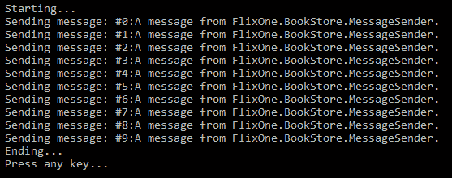

5.  控制台窗口将显示消息及其标识。现在，转到 Azure 门户并验证消息。它应该显示零条消息，如下图所示:

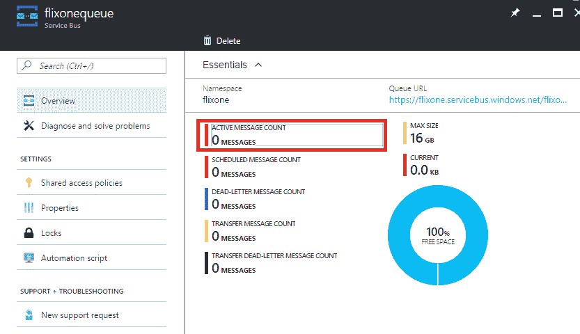

前面的例子演示了如何使用 Azure 总线服务为我们的微服务发送/接收消息。

我们讨论了通过覆盖一个小应用来实现服务结构上的信息。通过这样做，我们可以使用容器连接服务。我们将在下一节更详细地讨论这一点。

# 实现关于容器的信息

容器是整个文件系统的一部分。顾名思义，它包含工具、运行时和系统库。容器与同一主机上的其他容器共享其主机操作系统和内核。围绕集装箱的技术并不新鲜。长期以来，它一直是 Linux 生态系统的一部分。由于最近围绕它的基于微服务的讨论，容器技术再次成为人们关注的焦点。请注意，它可以在谷歌、亚马逊和网飞上运行。

[Chapter 5](05.html)

*Deploying Microservices with Docker*

# 服务结构上的容器

在前一节中，我们了解到服务结构将服务部署为流程。但是，我们也可以在容器中部署服务。服务结构支持在 Linux 和 Windows 服务器上部署容器，它还支持 Hyper-V 隔离模式。

在本节中，我们将讨论使用 Docker 部署微服务的先决条件和执行计划。

# 先决条件

要使用示例应用，您应该在系统上设置以下先决条件:

*   **集成开发环境(IDE)** :首选 Visual Studio 2019。
*   **服务架构软件开发工具包和工具**:如果系统上没有安装服务架构的软件开发工具包和工具，您需要安装它们。你可以去[下载软件开发工具包和工具。](https://www.microsoft.com/web/handlers/webpi.ashx?command=getinstallerredirect&appid=MicrosoftAzure-ServiceFabric-CoreSDK)
*   **Windows Docker**:如果你的 Windows 系统上没有安装 Docker，那就去[https://hub . Docker . com/editions/community/Docker-ce-desktop-Windows？tab =说明](https://hub.docker.com/editions/community/docker-ce-desktop-windows?tab=description)并安装。

# 执行

在本节中，我们将简要列出执行点。我们将在[第 5 章](05.html)、*用 Docker* 部署微服务中编写一个完整的应用。以下是执行点:

*   创建新应用(我们将创建产品微服务)
*   创建 Docker 映像
*   将服务结构添加到前面的项目中
*   配置服务结构微服务的通信
*   部署服务结构容器应用

[Chapter 5](05.html)

*Deploying Microservices with Docker*

在本节中，我们了解了什么是服务结构，并通过查看消息队列、讨论容器以及如何使用 Docker 部署微服务来奠定应用的基础。

下一节将帮助我们理解 Kubernetes 的微服务。

# 具有立方体的微服务

在前一节中，我们讨论了服务结构和 Docker 容器，并讨论了它们在微服务中的实现步骤。在这里，我们将通过查看 **Azure Kubernetes 服务** ( **AKS** )的概述来与 Kubernetes 讨论微服务。

# Azure Kubernetes 服务概述

AKS 基于开源的谷歌 Kubernetes。这是一项在微软 Azure 公共云上提供的服务。因为它是一个托管容器编排服务，所以您可以管理容器(Docker)和基于容器的应用。

[https://github.com/kubernetes/kubernetes](https://github.com/kubernetes/kubernetes)

[https://azure.microsoft.com/mediahandler/files/resourcefiles/phippy-goes-to-the-zoo/Phippy%20Goes%20To%20The%20Zoo_MSFTonline.pdf](https://azure.microsoft.com/mediahandler/files/resourcefiles/phippy-goes-to-the-zoo/Phippy%20Goes%20To%20The%20Zoo_MSFTonline.pdf)

AKS 有许多功能，对于已经在其生产环境中发布的应用非常有用。这些功能包括服务命名和发现、负载平衡、应用运行状况检查、水平自动缩放和滚动更新。

# 重要概念

在开始实施 AKS 之前，我们应该了解一些概念。这些重要的概念将帮助我们充分利用 AKS 的潜力。

Kubernetes 有一个基本单位叫做豆荚。pod 可以包含一个或多个容器，这些容器共享相同的资源，这些资源保证位于主机上。容器部署在 pod 内部，可以通过 localhost 定位。因为这些都是基于集群的，所以每个 pod 在集群中都有自己的 IP 地址。

这些豆荚(豆荚的集合)统称为服务。默认情况下，服务暴露在集群内部，但也可以暴露给集群外部的外部 IP 地址。我们可以使用以下任何可用的特征来公开它:

*   `ClusterIP`
*   `NodePort`
*   `LoadBalancer`
*   `ExternalName`

Kubernetes 控制器有一种特定类型的控制器，称为**复制控制器**。在此帮助下，我们可以通过在集群中运行指定数量的 pod 副本来处理复制和扩展。如果底层节点崩溃**，这也可以取代 pod。**

# 易于部署和管理微服务

AKS 提供了各种功能，可以帮助我们在负载平衡、应用运行状况检查、水平自动缩放和滚动更新方面简化微服务的部署和管理。

下图显示了 AKS 中包含的微服务:

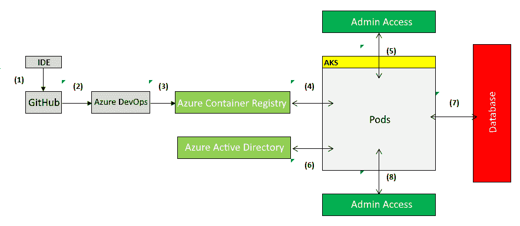

上图显示了以下过程:

1.  开发人员使用 Visual Studio 将更改提交给 GitHub。
2.  变更提交，GitHub 将构建推/触发到 **Azure DevOps** (以前称为 **VSTS** )。
3.  在这一步中，DevOps 打包我们的微服务(也称为微服务容器)，并将其发送到 Azure 容器注册表。

4.  在这一步中，容器(打包的微服务)被部署到 Azure Kubernetes 服务集群中。
5.  用户在应用和网站的帮助下访问这些微服务。

6.  借助 Azure 活动目录，我们可以防止未经授权的访问。
7.  数据库在这里是必不可少的，因为微服务从各种各样的数据库中保存和获取数据，例如，SQL 数据库、Azure CosmosDB 或 MySQL 的 Azure 数据库。
8.  我们有一个专门针对管理员的独立管理门户。

在接下来的章节中，我们将使用 sidecar 和 ambassador 模式来理解我们的应用所需的部署和日志记录，并且我们将看到这些模式如何有助于容器。

# 边车图案

这个图案的名字指的是摩托车的边车。你可以想象，在一辆摩托车上安装的边车的帮助下，我们可以携带很多东西，而这些东西是我们不可能直接用摩托车携带的。类似地，sidecar 应用在执行不依赖于主应用的外围任务时非常有帮助，但是有助于监视、审核或记录主应用。

sidecar 应用可以是第三方应用；公用事业服务/组件；审计、记录或监控应用；等等。这种模式还为我们提供了将它作为单独的组件或服务进行部署的选项。如果主应用由于不可避免的情况而受阻，例如异常或网络故障，那么我们的 sidecar 应用将是必需的。

让我们考虑以下图表:

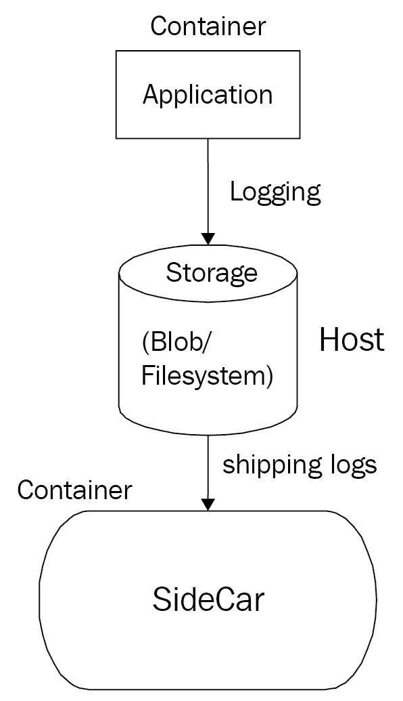

上图清楚地显示了 sidecar 模式的实现，其中我们将日志保存到主应用的 blob 存储(文件系统)中，并且我们的 sidecar 应用被发送到这些日志中。在这里，我们扩展了主应用的一个特性，即在 sidecar 应用的帮助下，简单地将日志保存在文件系统中，在这里我们可以应用逻辑并分析发送的日志。

# 何时使用边车模式

这种模式有很多优点。主应用和 sidecar 应用都可以用不同的语言编写，所以没有必要考虑不同的语言或运行时来帮助保持 sidecar 的完整性。主应用可用的资源可以由 sidecar 访问。当 sidecar 应用与主应用通信时，延迟非常小，例如，如果我们将单个 pod 用于主应用和 sidecar 应用。

侧车模式在以下情况下很有用:

*   当组件或 sidecar 应用及其逻辑/功能可以被使用不同框架用不同语言编写的应用使用时
*   当组件或功能必须与应用位于同一主机上时

在以下情况下，最好避免这种模式:

*   当您想要优化进程间通信时。
*   部署多个应用会产生成本；如果预算有限，不要尝试这种模式。
*   如果主服务独立于主应用并需要优化，那么这不是您需要的模式。

# 应遵循的最佳实践

通常，这种模式用于容器，并被称为侧车容器。在应用中实现这种模式时，我们应该遵循规定的最佳实践。以下实践只是基本的最佳实践，可能还有更多特定于应用的实践:

*   容器应该非常适合边车模式。
*   在设计 sidecar 应用/组件时，我们应该牢记进程间通信。
*   当我们决定制作一个 sidecar 应用时，我们应该确保我们已经决定我们需要的 sidecar 功能不会由一个单独的/独立的服务或一个经典的守护程序来实现。

在本节中，我们讨论了使用 sidecar 模式实现日志记录。同样，我们有大使模式，我们将在下一节讨论。

# 大使模式

大使模式几乎与我们刚刚讨论的边车模式相同。唯一不同的是，每个请求都是通过容器来的，容器也被称为**大使**(有时也称为代理容器)。换句话说，我们可以说，如果没有大使模式，主应用就无法联系外部世界(用户界面、客户端和/或远程服务)。

让我们考虑以下图表:

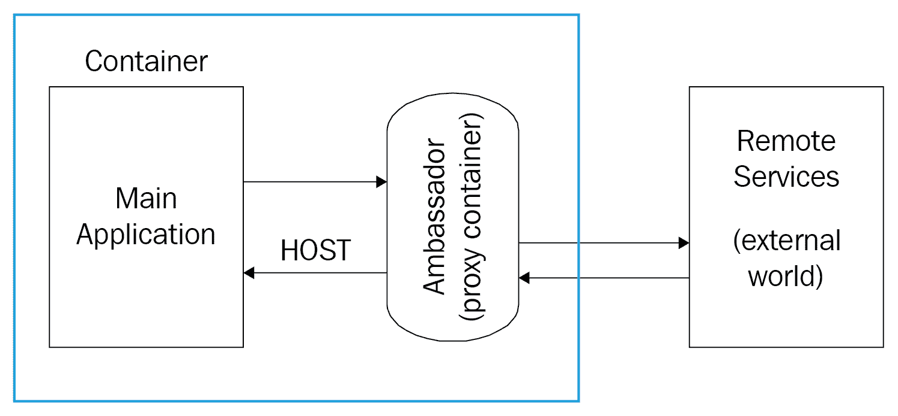

上图清楚地显示了大使模式的实现，其中主应用和大使容器部署在同一个主机上。现在，只要主应用与远程服务交互(这些服务可能是外部 API、用户界面等等)，它就通过大使或代理容器进行交互。在这里，大使充当代理，将所有网络请求路由到主应用。

# 何时使用大使模式

大使模式在以下情况下很有用:

*   当我们拥有用多种语言或框架开发的多种服务/功能，并且我们需要构建公共客户端连接时
*   当支持遗留应用或难以修改的应用时
*   当我们想要标准化和扩展仪器时

在以下情况下最好避免这种模式:

*   如果有一个高效的网络是优先事项，如果延迟会影响各种操作并且无法处理。
*   如果客户端的单一语言使用连接功能。更好的选择可能是将它作为一个客户端库，作为一个包分发给开发团队。
*   当连接特性不能被一般化并且需要与客户端应用更深的集成时。

# 应遵循的最佳实践

一旦我们开始实施大使模式，就应该遵循一些最佳实践。虽然大使模式和边车模式几乎一样，但是在实现的时候要小心。以下是支持此模式最佳实践的建议要点:

*   每当我们使用代理或通过任何外部组件路由网络请求时，都会增加延迟。因此，当我们使用大使模式时，我们应该记住延迟开销。
*   有了这个模式的实现，我们应该考虑是实现断路器还是重试大使，因为这样做可能不安全，除非所有操作都是幂等的。
*   这种模式最重要的考虑因素是我们如何打包和部署代理。

大使模式帮助我们建立一个连接客户端，将所有网络请求从外部服务路由到主应用。存在延迟的可能性，但是我们在选择这种模式时必须小心，尤其是当我们想要实现的特性没有其他替代方案时。

# 构建微服务应用时考虑物联网

如今，微服务越来越多地被用作创建企业应用的首选方式。微服务是支持网络、移动和物联网(包括可穿戴设备)等一系列平台和设备的理想选择。在这种情况下，我们的应用 FlixOne 与物联网设备连接。我们可以使用各种组件，比如监视器，它可以用来流式传输数据，可穿戴设备可以用来捕获数据，等等。

物联网是一个具有许多重要用例和巨大潜力的领域。微软 Azure 提供托管云服务，例如连接、监控和控制数十亿物联网资产的**物联网** ( **物联网**)。为了简化这一点，物联网解决方案有一个或多个运行在云中的物联网设备和一个或多个后端服务，它们相互通信。在构建物联网解决方案时，我们考虑的是大规模企业解决方案。

每个系统都包含一些使系统可靠的基本部分。同样的概念适用于任何物联网解决方案。这些主要部分如下:

*   设备
*   后端服务
*   两者之间的交流

然而，物联网系统的开发带来了巨大的成本，需要在硬件、基础设施和应用方面进行大量投资。

将物联网与微服务结合使用，提供了一种减少基础设施使用和成本的方法。此外，容器化有效地帮助部署微服务，具有最佳的资源利用率，并且它通过各种框架监控整个基础架构，减少了我们的运营开销。因此，在构建物联网解决方案时，需要考虑开发部分，原因如下:

*   **架构**:规划和选择你的架构，是构建物联网应用的基础和重要步骤之一。例如，医疗物联网应用的物联网架构将由三个阶段组成:物理阶段(使用传感器等设备)、通信阶段(使用设备收集数据并将其发送给应用)和应用阶段(接收数据并执行各种操作，如分析)。
*   **拓扑和协议**:通信协议的选择非常重要，关系到你业务需求的实现。对于设备端通信，Azure IoT Hub 允许的协议包括 MQTT、AMQP、HTTPS 等。星型拓扑是 Azure 中首选的网络拓扑之一。集线器是 Azure 中的虚拟网络，它充当内部设备和 Azure 物联网网络之间的中心连接点。
*   **可扩展性**:在开发企业应用的时候，可扩展性始终是重中之重，当我们讨论 IoT 应用的时候，这一点就更加重要了。随着时间的推移，数据和应用的使用量往往会大幅增加，因此我们应该相当重视扩展。Azure 物联网中心提供扩展功能(基本层和标准层)，我们可以根据业务需求从中进行选择。
*   **安全性**:安全性始终是一个关注点，当我们使用多个设备时，我们应该更加小心我们的安全性实现。确保安全的最佳方法是确保每个连接的设备都有自己的身份验证。
*   **测试部署**:设备要测试好再部署。我们应该验证每个设备都与其物联网集线器连接并通信。性能测试(或负载测试)将是分析物联网应用的最佳方式。

在接下来的章节中，我们将讨论物联网中心和物联网边缘。

# 物联网枢纽概述

物联网中心是托管在云上的服务(受管)；它就像一个中介，位于物联网应用和应用管理的设备之间。

当我们使用 Azure 物联网时，我们有能力在云上托管的后端系统的帮助下，在物联网应用和与之相关联的数百万台设备之间进行通信。例如，您可以将遥测数据从您的设备发送到 Azure IoT Hub 通过我们在云中的应用，我们可以根据业务模型执行分析或其他操作。我们不涉及这个例子的实现部分，因为它超出了本书的范围。不过完整实现可以参考这个链接:[https://docs . Microsoft . com/en-us/azure/IOT-hub/quick start-send-telemetry-dotnet](https://docs.microsoft.com/en-us/azure/iot-hub/quickstart-send-telemetry-dotnet)

此外，任何设备都可以与物联网集线器虚拟连接，并且它将支持双向通信:设备到云和云到设备。物联网中心允许我们管理可扩展、功能全面的物联网解决方案，因此我们可以做到以下几点:

*   **扩展解决方案**:物联网集线器提供了扩展众多连接设备的设施。与扩展解决方案相关的重要一点是，它提供了不同的扩展选项，因为它认识到每个物联网解决方案都是不同的。如前所述，根据物联网解决方案的要求，您可以选择基本价格层或标准价格层。
*   **保护通信**:物联网集线器还可以促进安全的通信通道，因为每个连接的设备都有自己的身份验证。
*   **与其他设备集成**:IoT Hub 最棒的地方就是可以连接各种 Azure 服务，像 Azure 事件网格、Azure 逻辑 app、Azure 流分析等等。

# 物联网边缘概述

Azure 物联网边缘有助于设备的业务逻辑和分析。这样，我们就不需要为数据管理费心了。我们只需要专注于业务逻辑和工作解决方案。它还有助于打包业务逻辑，并帮助我们进入标准容器，以便我们能够横向扩展物联网解决方案。由于业务逻辑是在容器中维护的，我们可以将这些容器部署到任何设备上，然后从云中监控它们。

Azure 物联网边缘由三个组件组成:

*   **物联网边缘模块**:Azure 物联网边缘模块是由 Azure 物联网边缘管理的最小计算单元。它可以包含不同的 Azure 服务，例如 Azure 流分析。根据业务需求，它还可以包含定制的代码。
*   **物联网边缘运行时**:该模块在物联网边缘设备上启用定制逻辑和云逻辑。它执行管理和通信操作。它还有助于在设备上安装和更新工作负载。
*   **基于云的界面**:它提供了从任何地方远程管理和监控物联网设备的设施。

要开发、部署和维护这些模块，需要以下四个要素:

*   *模块映像*:这是一个定义一个模块的多个软件的包。
*   *模块实例*:这是物联网边缘运行时发起的实例；实例是执行模块映像的特定代码或计算。
*   *模块标识*:这是存储在物联网集线器上的安全信息(包括任何其他所需信息)。
*   *模块双胞胎*:这包括元数据和配置信息，以 JSON 文件的形式；它存储在物联网集线器上。

本节的目的是向您概述微服务物联网的各种考虑因素。在这里，我们讨论了物联网中心和物联网边缘，我们理解一个是托管服务，而另一个允许我们添加业务逻辑并对物联网设备进行分析。

# 摘要

服务间的通信可以通过同步或异步通信来实现，这是一种协作方式。微服务应该有异步 API。应用编程接口网关是一个代理服务器，允许各种客户端与应用编程接口交互。作为一个应用编程接口网关，Azure 应用编程接口管理提供了大量的功能，我们可以使用这些功能来管理和托管各种 RESTful 应用编程接口。有多种模式可以帮助我们与微服务进行通信。

通过使用 Azure 总线服务，我们可以使用 Azure 总线服务消息队列轻松管理和处理服务间通信。(服务可以使用它轻松地在它们之间发送或接收消息。)最终的一致性都是关于具有高可伸缩性的可伸缩系统，可以用 CAP 定理来证明。

在下一章中，我们将讨论各种测试策略，这样我们就可以测试我们的应用并构建在微服务架构风格上。

# 问题

1.  什么是同步通信和异步通信？
2.  什么是集成模式？
3.  什么是事件驱动模式，为什么它对微服务如此重要？
4.  什么是 CAP 定理？

# 进一步阅读

*   *Kubernetes 入门–第三版，作者:Jonathan Baier 和杰西·怀特，由 Packt Publishing* 出版:[https://www . packtpub . com/虚拟化与云/入门–Kubernetes–第三版](https://www.packtpub.com/virtualization-and-cloud/getting-started-kubernetes-third-edition)
*   *DevOps with Kubernetes–第二版* *，作者:Hideto Saito，Hui-Chuan Chloe Lee 等人，出版:Packt Publishing*:[https://www . packtpub . com/virtual-and-cloud/DevOps-Kubernetes-第二版](https://www.packtpub.com/virtualization-and-cloud/devops-kubernetes-second-edition)
*   *Kubernetes for Developers**，作者:Joseph Heck，出版人:Packt Publishing*:[https://www . packtpub . com/虚拟化与云/kubernetes-developers](https://www.packtpub.com/virtualization-and-cloud/kubernetes-developers)
*   *Docker on Windows–第二版* *，艾顿·斯通曼著，Packt Publishing*:[https://www . packtpub . com/虚拟化与云/Docker-Windows-第二版](https://www.packtpub.com/virtualization-and-cloud/docker-windows-second-edition)*