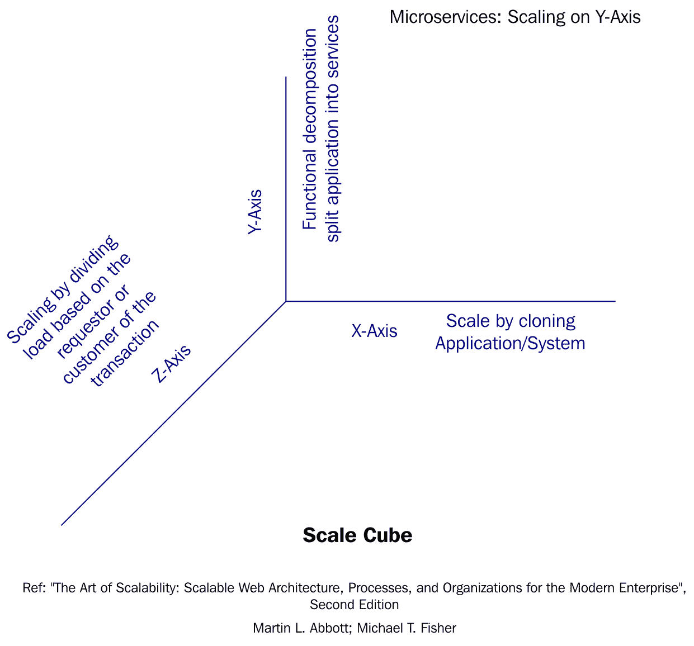
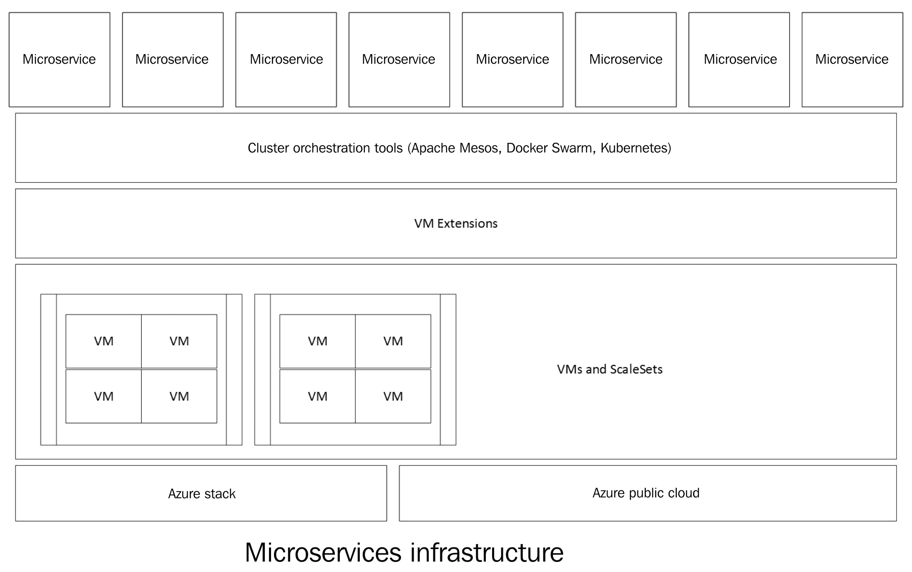
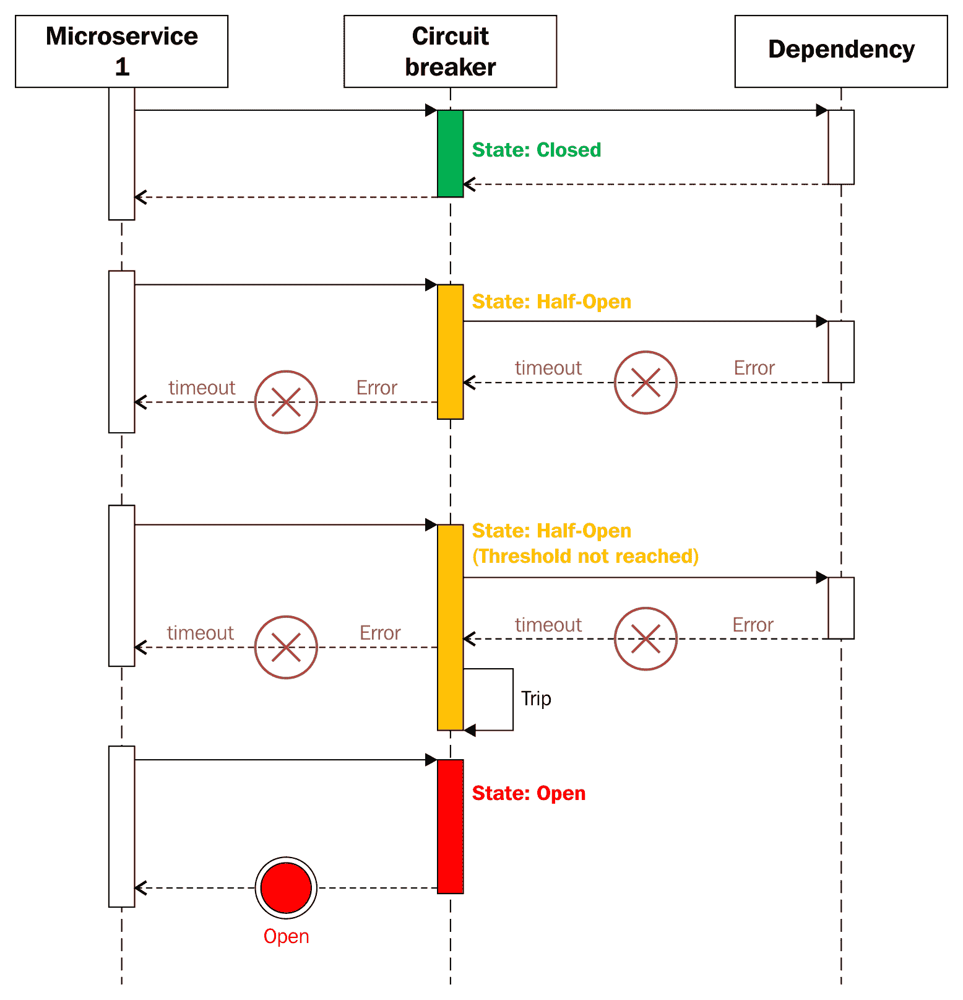

# 八、使用 Azure 扩展微服务

假设您是负责开发公司旗舰产品 TaxCloud 的开发和支持团队的一员。TaxCloud 帮助纳税人自行报税，然后在成功报税后向他们收取少量费用。假设您使用微服务开发了这个应用。现在，假设产品变得受欢迎并获得吸引力，突然，在纳税申报的最后一天，你会看到一群消费者想要使用你的产品并申报纳税。但是你的系统支付服务比较慢，几乎把系统拖垮了，所有的新客户都转移到你竞争对手的产品上。这对你的生意来说是一个失去的机会。

尽管这是一个虚构的场景，但它很可能发生在任何企业。在电子商务中，我们在现实生活中总是会经历这种事情，尤其是在特殊的场合，比如圣诞节和黑色星期五。总而言之，它们指向一个重要的特征——系统的可伸缩性。可扩展性是任何任务关键型系统最重要的非功能性需求之一。用几百个事务服务几个用户，并不等于用几百万个事务服务几百万个用户。我们还将讨论如何单独扩展微服务，在设计它们时要考虑什么，以及如何使用不同的模式避免级联故障。在本章中，我们将一般性地讨论可伸缩性。

到本章结束时，您将了解以下内容:

*   获得可扩展性概述
*   扩展基础设施
*   了解微服务的可扩展性
*   实施扩展基础架构
*   扩展服务设计

作为开发人员，我们可以浏览各种扩展技术，然后是扩展服务设计，这在编写生产就绪系统时非常有帮助。

# 技术要求

本章不包含代码示例，因此本章没有技术先决条件。

# 获得可扩展性概述

设计决策会影响单个微服务的可扩展性。与其他应用功能一样，在设计和早期编码阶段做出的决策将在很大程度上影响服务的可伸缩性。

微服务的可伸缩性要求在服务及其支持基础设施之间采取平衡的方法。服务及其基础设施也需要协调扩展。

可伸缩性是系统最重要的非功能特性之一，因为它可以处理更多的负载。人们通常认为可伸缩性通常是大规模分布式系统的一个关注点。性能和可伸缩性是系统的两个不同特征。性能涉及系统的吞吐量，而可伸缩性涉及为大量用户或大量事务提供所需的吞吐量。

本节介绍了缩放的概述。在下一节中，我们将讨论扩展我们的基础架构。

# 扩展基础设施

微服务是现代应用，通常利用云。因此，在可扩展性方面，云提供了一定的优势。然而，这也是关于自动化和管理成本。因此，即使在云中，我们也需要了解如何调配基础架构，如虚拟机或容器，以成功地为我们基于微服务的应用提供服务，即使是在突发流量峰值的情况下。

现在，我们将访问基础架构的每个组件，看看我们如何扩展它。最初的纵向扩展和横向扩展方法更多地应用于硬件扩展。通过自动缩放功能，您将了解 Azure 虚拟管理器缩放集。最后，您将学习在 Docker Swarm 模式下使用容器进行缩放。

# 垂直扩展(向上扩展)

**纵向扩展**是一个术语，用于通过向同一台机器添加更多资源来实现可扩展性。它包括以更高的速度增加更多的内存或处理器，或者它可以简单地将应用迁移到更强大的机器上。

随着硬件的升级，您如何扩展机器是有限制的。更有可能的是，你只是在转移瓶颈，而不是解决提高可伸缩性的真正问题。如果你给机器增加更多的处理器，你可能会把瓶颈转移到内存上。处理能力不会线性提高系统的性能。在某一点上，即使您增加了更多的处理能力，系统的性能也会稳定下来。扩展的另一个方面是，由于只有一台机器服务于所有请求，它也成为单点故障。

总之，垂直缩放很容易，因为它不涉及代码更改；然而，这是一项相当昂贵的技术。堆栈溢出是基于. NET 的系统垂直扩展的罕见例子之一。

# 水平缩放(横向扩展)

如果不想垂直缩放，您可以始终水平缩放系统。通常，它也被称为**横向扩展**。谷歌确实让这种方法变得相当流行。谷歌搜索引擎已经没有便宜的硬件了。因此，尽管是一个分布式系统，横向扩展在早期帮助谷歌在短时间内扩展了搜索过程，同时仍然很便宜。大多数情况下，常见的任务被分配给工作机器，它们的输出被执行相同任务的几台机器收集。这种安排也会在失败中幸存下来。为了横向扩展，负载平衡技术非常有用。在这种布置中，负载平衡器通常被添加在所有节点集群的前面。因此，从消费者的角度来看，你击中的是哪台机器/盒子并不重要。这使得通过添加更多服务器来增加容量变得容易。将服务器添加到集群可以线性提高可扩展性。

当应用代码不依赖于运行它的服务器时，向外扩展是一种成功的策略。如果请求需要在特定的服务器上执行，也就是说，如果应用代码具有服务器关联性，将很难向外扩展。但是，在无状态代码的情况下，在任何服务器上执行该代码都更容易。因此，当无状态代码在水平扩展的机器或集群上运行时，可伸缩性得到了提高。

由于横向扩展的性质，它是整个行业中常用的方法。您可以看到许多以这种方式管理的大型可扩展系统的例子，例如谷歌、亚马逊和微软。我们建议您也横向扩展微服务。

Session stickiness can be configured, where you either want sessions going to a specific node or not. In some scenarios, it might also be an option to sync the sessions in the load balancer, if that is supported.

本节旨在说明扩展的基础设施；我们经历了水平和垂直缩放。在下一节中，我们将看到微服务的可伸缩性。

# 了解微服务的可扩展性

在本节中，我们将回顾可用于微服务的扩展策略。我们将研究可伸缩性的 Scale Cube 模型，我们将看到如何为微服务扩展基础设施层，以及如何在微服务设计中嵌入可伸缩性。

# 可伸缩性的尺度立方体模型

看待可伸缩性的一种方法是理解 Scale Cube。马丁·阿博特和迈克尔·费希尔解释了缩放，并将缩放立方体定义为查看和理解系统的可伸缩性。规模立方体也适用于微服务架构。

下图是比例立方体的可视化视图:

在这个可伸缩性的三维模型中，原点(0，0，0)代表最不可伸缩的系统。它假设系统是部署在单个服务器实例上的整体。如图所示，一个系统可以通过在三个维度上投入适当的努力来扩展。为了使系统朝着正确的可扩展方向发展，我们需要正确的权衡。这些权衡将帮助您获得系统的最高可扩展性。这将有助于您的系统迎合不断增长的客户需求，这是由**比例立方体**模型表示的。让我们看看这个模型的每一个轴，并讨论它们在微服务可伸缩性方面意味着什么。

# x 轴的缩放

在 *x* 轴上扩展意味着在负载平衡器后面运行应用的多个实例。这是单片应用中非常常见的方法。这种方法的缺点之一是，应用的任何实例都可以利用该应用可用的所有数据。它也没有解决我们应用的复杂性。

微服务不应该共享一个全局状态或一种可以被所有服务访问的数据存储。这将造成瓶颈和单点故障。因此，仅在标度立方体的 *x* 轴上进行微服务标度不是正确的方法。

现在，我们来看看 *z-* 轴缩放。我们跳过 *y-* 轴缩放是有原因的。我们会回来的。

# z 轴的缩放

*z* 轴的缩放基于分割，分割基于交易的客户或请求者。 *z-* 轴拆分可能会也可能不会解决指令、流程或代码的整体性。然而，它们经常解决执行这些指令、过程或代码所必需的数据的整体性。自然，在 *z-* 轴缩放中，有一个专用组件负责应用偏置因子。偏见因素可能是国家、请求来源、客户群或与请求者或请求相关的任何形式的订阅计划。请注意 *z-* 轴缩放有许多好处，例如改进了请求的隔离和缓存。然而，它也有以下缺点:

*   它增加了应用的复杂性。
*   它需要一个分区方案，这可能很棘手，尤其是当我们需要重新分区数据时。
*   它没有解决开发和应用复杂性增加的问题。要解决这些问题，需要应用 *y-* 轴缩放。

由于 *z* 轴缩放的前述性质，它不适合在微服务的情况下使用。

# y 轴的缩放

*y* 轴的缩放是指将一个应用分解成不同的组件。它还代表了职责的分离，由事务中某个组件所执行的数据或工作的角色或类型决定。为了划分责任，我们需要根据他们所执行的操作或角色来划分系统的组件。这些角色可能基于事务的大部分，也可能基于非常小的一部分。根据角色的大小，我们可以扩展这些组件。这种拆分方案被称为面向服务或面向资源的拆分。

这与我们在微服务中看到的非常相似。我们根据应用的角色或操作来划分整个应用，并根据其在系统中的角色来扩展单个微服务。这种相似不是偶然的；它是设计的产物。因此，我们可以相当容易地说， *y-* 轴缩放非常适合微服务。

理解 *y-* 轴扩展对于扩展基于微服务的架构系统非常重要。因此，实际上，我们是在说微服务可以通过按照它们的角色和动作来拆分它们来扩展。考虑一个订单管理系统，它被设计来满足某些初始客户需求。为此，将应用拆分为单独的服务很好，例如客户服务、订单服务和支付服务。但是，如果需求增加，您需要仔细检查现有系统。您可能会发现已经存在的服务的子组件，这些子组件可以很好地再次分离，因为它们在该服务以及整个应用中扮演着非常特定的角色。对于增加的需求和负载，这种重新设计可能会触发将订单服务重新拆分为报价服务、订单处理服务、订单履行服务等。现在，报价服务可能需要更多的计算能力，因此与其他服务相比，我们可能会推送更多的实例(其背后的相同副本)。

这是我们应该如何在 AFK Scale Cube 的三维模型([https://akfpartners.com/growth-blog/scale-cube](https://akfpartners.com/growth-blog/scale-cube))上缩放微服务的一个近乎真实的例子。你可以在一些属于行业的知名微服务架构中观察到这种三维可伸缩性和 *y-* 轴的服务伸缩性，比如亚马逊、网飞和 Spotify。

# 可扩展微服务的特征

在缩放立方体部分，我们主要关注于缩放整个系统或应用的特征。在本节中，我们将重点关注扩展单个微服务的特性。当微服务表现出以下主要特征时，可以说它是可扩展的和高性能的:

*   **已知增长曲线**:例如，在订单管理系统的情况下，我们需要知道当前服务支持多少订单，并且我们需要知道它们与订单履行服务指标(以*每秒请求数*衡量)的比例如何。当前测量的指标称为**基线数字**。

*   **经过充分研究的使用指标**:流量模式通常会揭示客户需求，并且基于客户需求，可以计算出前面章节中提到的关于微服务的许多参数。因此，微服务是仪表化的，监控工具是微服务的必要伙伴。
*   **基础设施资源的有效利用**:基于定性和定量的参数，可以进行资源利用的预判。这将有助于团队预测基础设施的成本并进行规划。
*   **使用自动化基础设施测量、监控和增加容量的能力**:基于微服务资源消耗的运营和增长模式，规划未来的容量非常容易。如今，随着云的弹性，能够规划和自动化容量变得更加重要。本质上，基于云的架构是成本驱动的架构。
*   **获得可扩展性概述**:资源需求包括每个微服务需要的具体资源(计算、内存、存储和 I/O)。识别这些对于更顺畅的运营和可扩展的服务至关重要。如果我们确定了资源瓶颈，就可以解决和消除它们。
*   **有相同比例的依赖缩放**:这个不言而喻。但是，您不能只关注微服务，让它的依赖性成为瓶颈。微服务的可伸缩性取决于其最小的伸缩依赖性。
*   **容错高可用**:在分布式系统中故障是不可避免的。如果遇到微服务实例故障，应该自动将其重新路由到健康的微服务实例。在这种情况下，仅仅将负载平衡器放在微服务集群前面是不够的。服务发现工具对于满足可扩展微服务的这一特性非常有帮助。
*   **具有可扩展的数据持久化机制**:对于可扩展的微服务，单个数据存储的选择和设计应该是可扩展和容错的。在这种情况下，缓存和分离读写存储会有所帮助。

现在，当我们讨论微服务和可扩展性时，扩展的自然安排就出现了，如下所示:

*   **扩展基础设施**:微服务在动态和软件定义的基础设施上运行良好。因此，扩展基础设施是扩展微服务的重要组成部分。
*   **围绕服务设计扩展**:微服务设计包括一个基于 HTTP 的应用编程接口，以及一个存储服务本地状态的数据存储。

本节概述了缩放及其特性。我们讨论了扩展基础架构的概述。接下来，我们将更详细地讨论扩展基础架构。

# 实施扩展基础架构

在本节中，我们将访问微服务基础架构的所有层，我们将看到它们之间的相互关系，即每个基础架构层如何扩展。在我们的微服务实现中，有两个主要组件:

*   虚拟计算机
*   托管在虚拟机或物理机上的容器

下图显示了微服务基础架构的逻辑视图:

上图可视化了使用 Azure 公共云的微服务基础设施。

# 使用扩展集扩展虚拟机

在 Azure 云中，扩展虚拟机非常简单和容易。这是微服务闪耀的地方。使用扩展集，您可以根据规则集在短时间内自动提升相同虚拟机映像的实例。刻度集与 Azure 自动刻度集成在一起。

Azure 虚拟机的创建方式可以是，作为一个组，它们总是为请求提供服务，即使请求量增加。在特定情况下，如果不需要这些虚拟机来执行工作负载，也可以自动删除它们。这由虚拟机规模集负责。

秤台也能与 Azure 中的负载平衡器很好地集成。由于它们被表示为计算资源，因此可以与 Azure 的资源管理器一起使用。可以配置扩展集，以便按需创建或删除虚拟机。这有助于以宠物对牛的心态来管理虚拟机，我们在本章前面的部署中已经看到了这一点。

对于需要扩展计算资源的应用，扩展操作在故障域和更新域之间是隐式平衡的。

使用扩展集，您不需要关联独立资源的循环，如网卡、存储帐户和虚拟机。即使横向扩展，我们如何保证这些虚拟机的可用性？虚拟机规模集已经解决了所有这些问题和挑战。

扩展集允许您根据需求自动扩展和缩减应用。假设有一个 40%利用率的阈值。因此，一旦我们达到 40%的利用率，我们将开始经历性能下降。利用率达到 40%时，就会增加新的 web 服务器。如前几节所述，比例集允许您设置规则。规模集的输入是虚拟机。规模集上的规则规定，五分钟内 CPU 的平均利用率为 40%，因此 Azure 将向规模集中添加另一台虚拟机。这样做之后，它会再次校准规则。如果性能仍高于 40%，它会添加第三个虚拟机，直到达到可接受的阈值。一旦性能下降到 40%以下，它将根据流量不活动等情况开始删除这些虚拟机，以降低运营成本。

因此，通过实现一个扩展集，您可以为性能构建一个规则，并通过简单地自动添加和删除虚拟机来使您的应用更大以处理更大的负载。一旦这些规则确立，作为管理员的你将无事可做。

Azure Autoscale 测量性能并确定何时向上和向下扩展。它还集成了负载平衡器和网络地址转换。现在，它们与负载平衡器和网络地址转换集成的原因是，当我们添加这些额外的虚拟机时，我们将有一个负载平衡器和一个网络地址转换设备。随着请求不断传入，除了部署虚拟机之外，我们还必须添加一个允许流量重定向到新实例的规则。扩展集的伟大之处在于，它们不仅可以添加虚拟机，还可以与基础架构的所有其他组件协同工作，包括网络负载平衡器等。

在 Azure 门户中，一个扩展集可以被视为一个条目，即使它包含多个虚拟机。要查看扩展集中虚拟机的配置和规范细节，您必须使用 Azure 资源浏览器工具。这是一个基于网络的工具，可在[https://resources.azure.com](https://resources.azure.com)获得。在这里，您可以查看订阅中的所有对象。您可以在`Microsoft.Compute`部分查看比例集。

通过使用 Azure 模板库，构建一个比例集非常容易。一旦您创建了自己的 **Azure 资源管理器** ( **ARM** )模板，您也可以基于比例集创建自定义模板。有关于如何利用 ARM 模板建立一个标度集的详细讨论和说明。您可以在这里快速开始使用这些模板:[https://github.com/Azure/azure-quickstart-templates](https://github.com/Azure/azure-quickstart-templates)。

An availability set is an older technology, and this feature has limited support. Microsoft recommends that you migrate to virtual machine scale sets, for faster and more reliable autoscale support.

本节概述了扩展虚拟机，这在微软 Azure Cloud 中非常简单和容易。本节讨论了扩展虚拟机。接下来，我们将讨论自动缩放。

# 自动缩放

借助监控解决方案，我们可以测量基础架构的性能参数。这通常是以性能服务级别协议(SLa)的形式。自动缩放使我们能够根据性能阈值增加或减少系统可用的资源。

自动缩放功能增加了额外的资源来应对增加的负载。它的工作原理也相反。如果负载降低，则自动缩放会减少可用于执行任务的资源数量。自动扩展无需预先配置资源就能完成所有工作，而且是以自动方式完成的。

自动缩放可以通过两种方式进行缩放——纵向(向现有资源类型添加更多资源)或横向(通过创建该类型资源的另一个实例来添加资源)。

自动缩放功能根据两种策略决定添加或删除资源。一种是基于资源的可用指标，或者基于满足某个系统阈值。另一种策略是基于时间的，例如，上午 9 点到下午 5 点(系统需要 30 台网络服务器，而不是 3 台网络服务器)。

蔚蓝监测仪器的每一个资源；收集并监控所有与指标相关的数据。根据收集的数据，自动缩放做出决策。

Azure Monitor 自动扩展仅适用于虚拟机扩展集、云服务和应用服务(例如，网络应用)。

# 使用 Docker Swarm 进行容器缩放

早些时候，在关于部署的一章中，我们研究了如何将微服务打包到 Docker 容器中。我们还详细讨论了为什么容器化在微服务领域很有用。在这一节中，我们将使用 Docker 来提升我们的技能，我们将看到使用 Docker Swarm 来扩展我们的微服务是多么容易。

从本质上讲，微服务是分布式系统，需要分布式和隔离的资源。Docker Swarm 提供容器编排集群功能，因此多个 Docker 引擎可以作为单个虚拟引擎工作。这类似于负载平衡器功能。此外，如果需要，它还会创建新的容器实例或删除容器。

您可以在 Docker Swarm 中使用任何可用的服务发现机制，例如 DNS、consul 或 Zookeeper 工具。

集群是 Docker 引擎或节点的集群，在这里您可以将微服务部署为*服务*。现在，不要将这些服务与微服务混淆。在 Docker 实现中，服务是一个不同的概念。在 Docker 中，**服务**是要在工作节点上执行的任务的定义。您可能想了解我们在最后一句中提到的节点。Docker Swarm 上下文中的节点用于参与集群的 Docker 引擎。一个完整的 Swarm 演示是可能的，ASP.NET Core图像可在 ASP。GitHub([https://github.com/dotnet/dotnet-docker](https://github.com/dotnet/dotnet-docker))上的 NET-Docker 项目。

To date, Azure Container Service is a good solution for scaling and orchestrating Linux or Windows containers using DC/OS, Docker Swarm, or Google Kubernetes. Recently, Microsoft announced that Azure Containers will no longer be available from January 31, 2020\. Instead, Microsoft is investing in Azure Kubernetes Service (AKS). To learn more about AKS, visit: [https://docs.microsoft.com/en-us/azure/aks/](https://docs.microsoft.com/en-us/azure/aks/)[.](https://docs.microsoft.com/en-us/azure/container-service/kubernetes/container-service-faq) 

既然我们已经了解了如何扩展微服务基础设施，那么让我们在接下来的章节中重新讨论微服务设计的可扩展性方面。

# 扩展服务设计

在这些部分中，我们将了解在设计或实现微服务时需要注意的组件/问题。在基础架构扩展考虑服务设计的情况下，我们可以真正释放微服务架构的力量，并且我们可以获得大量的业务价值，从而使微服务成为真正的成功案例。那么，服务设计的组成部分是什么？让我们看看。

# 数据持久化模型设计

在传统应用中，我们一直依赖关系数据库来保存用户数据。关系数据库对我们来说并不陌生。它们出现在 70 年代，作为一种以结构化方式存储持久信息的方式，允许您进行查询和执行数据维护。

在当今的微服务世界中，现代应用需要在超大规模阶段进行扩展。在任何意义上，我们都不建议您放弃使用关系数据库。他们仍然有他们的有效用例。然而，当我们在单个数据库中混合读写操作时，在我们需要提高可伸缩性的地方就会出现复杂的情况。关系数据库强化关系并确保数据的一致性。关系数据库工作在众所周知的 ACID 模型上。因此，在关系数据库中，我们对读取和写入操作使用相同的数据模型。

在大多数情况下，读操作通常必须比写操作快。也可以使用不同的筛选条件进行读取操作，返回单行或结果集。在大多数写操作中，只涉及一行或一列，通常，与读操作相比，写操作花费的时间稍长。因此，我们既可以优化读取并提供服务，也可以在同一数据模型中优化写入并提供服务。

不如我们将基本数据模型分成两半:一个用于所有读操作，另一个用于所有写操作？如果我们这样做，事情会变得简单得多，并且很容易用不同的策略优化两个数据模型。这对我们的微服务的影响是，反过来，它们对于这两种操作都变得高度可扩展。

这种特殊的架构被称为**公共查询责任隔离** ( **CQRS** )。自然的结果是，就我们的编程模型而言，CQRS 也得到了扩展。现在，我们的编程模型之间的数据库-对象关系变得更加简单和可伸缩。

随之而来的是扩展微服务实现的下一个基本要素:数据缓存。

# 缓存机制

缓存是增加应用吞吐量的最简单方法。原理很简单。一旦从数据存储器中读取了数据，它就尽可能地靠近处理服务器。在未来的请求中，数据直接从数据存储或缓存中提供。缓存的本质是最小化服务器必须做的工作量。HTTP 有一个内置的缓存机制，它嵌入在协议本身中。这就是它伸缩性如此之好的原因。

关于微服务，我们可以在三个级别进行缓存，即客户端、代理和服务器端。让我们看看他们每个人:

*   首先，我们有客户端缓存。通过客户端缓存，客户端存储缓存的结果。因此，客户端负责缓存失效。

During cache invalidation, which is a process in a computer system, the cache entries are replaced or removed. This requires manual intervention (using code), so that it can be done explicitly.

通常，服务器使用缓存控制和到期头等机制，提供关于它可以保留数据多长时间以及何时可以请求新数据的指导。随着浏览器支持 HTML5 标准，有更多的机制可用，例如本地存储、应用缓存或 web SQL 数据库，客户端可以在其中存储更多的数据。

*   接下来，我们进入代理端。许多反向代理解决方案，如 Squid、HAProxy 和 NGINX，也可以充当缓存服务器。
*   现在，让我们详细讨论服务器端缓存。在服务器端缓存中，我们有以下两种类型:
    *   **响应缓存**:这是 web 应用 UI 的一种重要的缓存机制，说实话，也很简单，容易实现。为了响应缓存，与缓存相关的头被添加到微服务提供的响应中。这可以极大地提高微服务的性能。在 ASP.NET Core中，您可以使用`Microsoft.AspNetCore.ResponseCaching`包实现响应缓存。
    *   **持久化数据的分布式缓存**:分布式缓存增强了微服务的吞吐量，因为缓存不需要对外部资源进行 I/O 访问。这有以下优点:
        *   微服务客户端得到完全相同的结果。
        *   分布式缓存由持久性存储备份，并作为不同的远程进程运行。因此，即使应用服务器重新启动或出现任何问题，也绝不会影响缓存。
        *   对源数据存储的请求较少。

您可以在集群模式下使用分布式提供程序，例如 CacheCow、Redis(对于我们的书来说是 *Azure Cache for Redis* )或 memcache 来扩展您的微服务实现。

在下一节中，我们将概述用于 Redis 的 CacheCow 和 Azure 缓存。

# CacheCow

当您想在客户机和服务器上实现 HTTP 缓存时，CacheCow 就出现了。这是一个轻量级库，目前，ASP.NET 网络应用编程接口支持是可用的。CacheCow 是开源的，并带有麻省理工学院的许可，可在 GitHub([https://github.com/aliostad/CacheCow](https://github.com/aliostad/CacheCow))[上获得。](https://github.com/aliostad/CacheCow)

要开始使用 CacheCow，您需要为服务器和客户端做好准备。重要的步骤如下:

*   在您的 ASP.NET 网络应用编程接口项目中安装`Install-Package CacheCow.Server` NuGet 包；这将是你的服务器。
*   在您的客户端项目中安装`Install-Package CacheCow.Client` NuGet 包；客户端应用将是 WPF、Windows 窗体、控制台或任何其他网络应用。
*   在服务器端创建缓存存储，需要一个数据库来存储缓存元数据([https://github . com/aliostad/CacheCow/wiki/入门#缓存存储](https://github.com/aliostad/CacheCow/wiki/Getting-started#cache-store))。

If you want to use memcache, you can refer to [https://github.com/aliostad/CacheCow/wiki/Getting-started](https://github.com/aliostad/CacheCow/wiki/Getting-started) for more information.

# 蓝色高速缓存为 Redis

Redis 的 Azure Cache 是一个名为**Re****dis**([https://github.com/antirez/redis](https://github.com/antirez/redis))的开源项目的包装器，这是一个内存中的数据库，它保存在磁盘上。有关 Redis 的 Azure 缓存的更多信息，请参见[https://azure.microsoft.com/en-in/services/cache/](https://azure.microsoft.com/en-in/services/cache/)。以下是我的总结:

"Azure Cache for Redis gives you access to a secure, dedicated Redis cache, managed by Microsoft and accessible from any application within Azure."

借助以下步骤，开始使用 Redis 的 Azure 缓存非常简单:

1.  创建一个网络应用编程接口项目——参考我们在[第 2 章](02.html)、*重构整体*中的代码示例。
2.  实施 Redis 对于推荐点，使用[https://github.com/StackExchange/StackExchange.Redis](https://github.com/StackExchange/StackExchange.Redis)，然后安装`Install-Package StackExchange.Redis` NuGet 包。
3.  更新`CacheConnection`(https://docs . Microsoft . com/en-us/azure/azure-cache-for-redis/cache-web-app-how to # update-the-MVC-application)的配置文件。

4.  然后，在 Azure 上发布([https://docs . Microsoft . com/en-us/Azure/Azure-cache-for-redis/cache-web-app-how to # publish-run-in-Azure](https://docs.microsoft.com/en-us/azure/azure-cache-for-redis/cache-web-app-howto#publish-and-run-in-azure))。

You can also use this template to create Azure Cache for Redis: [https://github.com/Azure/azure-quickstart-templates/tree/master/201-web-app-redis-cache-sql-database](https://github.com/Azure/azure-quickstart-templates/tree/master/201-web-app-redis-cache-sql-database).  

有关用于 Redis 的 Azure Cache 的完整详细信息，请参考此 URL:[https://docs . Microsoft . com/en-us/Azure/Azure-Cache-for-Redis/](https://docs.microsoft.com/en-us/azure/azure-cache-for-redis/)。

在本节中，我们讨论了 Redis 的 Azure Cache 以及在项目中实现它的步骤。接下来，我们将讨论可扩展系统中的容错。

# 冗余和容错

我们知道，系统处理故障和从故障中恢复的能力与可伸缩性提供的能力不同。然而，我们不能否认，就系统而言，它们是密切相关的能力。除非我们解决可用性和容错的问题，否则构建高度可扩展的系统将是一项挑战。一般来说，我们通过为系统的不同部分或组件提供冗余副本来实现可用性。因此，在接下来的部分，我们将触及两个这样的概念。

# 断路器

断路器是电子设备中的一种安全功能，在发生短路时，它可以切断电流并保护设备，或者防止对周围环境造成任何进一步的损害。这种思想可以应用于软件设计。当从属服务不可用或不处于健康状态时，断路器会阻止呼叫转到该从属服务，并在配置的时间段内将流量重定向到备用路径。

下图显示了典型的断路器模式:

如图所示，断路器作为一个状态机，有三种状态，即**闭合**、**断开**、**半断开**。

让我们在接下来的章节中更多地了解它们。

# 关闭状态

这是电路的初始状态，描述了正常的控制流程。在这种状态下，有一个失败计数器。如果在该流程中出现`OperationFailedException`，故障计数器增加`1`。如果故障计数器持续增加，这意味着电路遇到更多异常，并且它达到了设置的故障阈值，则断路器转换到断开状态。但是如果调用成功，没有任何异常或失败，失败计数将被重置。

# 开放状态

在打开状态下，电路已经跳闸，超时计数器已经启动。如果达到超时时间，电路仍然继续出现故障，代码流将进入半开状态。这告诉我们，来自应用的请求会立即失败，并且会向应用返回一个异常。

# 半开状态

在半开状态下，状态机/断路器组件重置超时计数器，并再次尝试断开电路，重新启动到打开状态的状态改变。但是，在此之前，它会尝试执行常规操作，例如调用依赖项。如果成功，则断路器组件将状态更改为关闭，而不是打开状态。这是为了使操作的正常流程能够发生，并且电路再次闭合。

For .NET-based microservices, if you want to implement the circuit breaker and a couple of fault-tolerant patterns, there is a good library named *Polly* available, in the form of a NuGet package. It comes with extensive documentation and code samples, and it has a fluent interface. You can add *Polly* from [http://www.thepollyproject.org/](http://www.thepollyproject.org/) or by just issuing the `install--Package Polly` command from the package manager console in Visual Studio.

# 服务发现

对于一个小的实现，如何确定微服务的地址？对任何人来说.NET 开发者，答案就是我们简单的把 IP 地址和服务端口放在配置文件里，我们就好了。然而，当您在运行时动态地处理成百上千个服务时，就会出现服务位置问题。

现在，如果你看得更深一点，你可以看到我们试图解决问题的两个部分:

*   **服务注册**:这是在某种中央注册表内注册的过程，所有的服务级别元数据、主机列表、端口和秘密都存储在这个注册表中。
*   **服务发现**:这是通过一个集中的注册表组件，在运行时建立有依赖关系的通信的过程。

任何服务注册和发现解决方案都需要具备以下特征，才能被视为微服务服务发现问题的解决方案:

*   集中式注册表本身应该是高度可用的。
*   一旦特定的微服务启动，它应该会自动接收请求。
*   智能和动态负载平衡功能应该存在于解决方案中。
*   该解决方案应该能够监控服务健康状态的能力及其所承受的负载。
*   服务发现机制应该能够将流量从不健康的节点转移到其他节点或服务，而不会造成任何宕机或对其使用者造成影响。
*   如果服务位置或元数据发生变化，服务发现解决方案应该能够在不影响现有流量或服务实例的情况下应用这些变化。

一些服务发现机制，如 Zookeeper([http://zookeeper.apache.org/](http://zookeeper.apache.org/))和 Consul，在开源社区中都是可用的。

这一部分帮助我们理解了扩展服务设计以及数据和电路如何围绕它们工作，从而提供了更好的缓存，降低了容错性。

# 摘要

在这一章中，我们讨论了追求微服务架构风格的关键优势，我们还研究了微服务可伸缩性的特点。我们看到了微服务如何通过系统的功能分解在 *y* 轴上扩展。我们了解到 Azure 云的高扩展能力，因此有助于利用 Azure 扩展集和容器编排解决方案，如 Docker Swarm、DC/操作系统和 Kubernetes。

然后，我们重点讨论了服务设计的扩展，并讨论了应该如何设计我们的数据模型。我们还看到了某些注意事项，例如在设计高可伸缩性的数据模型时，有一个分离的 CQRS 风格模型。我们还简单介绍了缓存，尤其是分布式缓存，以及它如何提高系统的吞吐量。在最后一节中，为了使我们的微服务具有高度可伸缩性，我们讨论了断路器模式和服务发现机制，它们对于微服务架构的可伸缩性至关重要。

在下一章中，我们将研究微服务的反应性和反应性微服务的特征。

# 问题

1.  什么是缓存，缓存在微服务应用中的重要性是什么？
2.  什么是服务发现，它如何在微服务应用中发挥重要作用？
3.  你能在一个小程序中为 Redis 定义 Azure Cache 并描述它的实现吗？
4.  什么是断路器？

# 进一步阅读

你刚刚读完这一章，但这不是我们学习曲线的终点。以下是一些参考资料，可以增强您对该主题的了解:

*   *带有 Azure 的微服务*:[https://www . packtpub . com/虚拟化与云/微服务-azure](https://www.packtpub.com/virtualization-and-cloud/microservices-azure)
*   *微服务模式和最佳实践*:[https://www . packtpub . com/application-development/微服务模式和最佳实践](https://www.packtpub.com/application-development/microservice-patterns-and-best-practices)