# 九、反应式微服务简介

我们现在已经对基于微服务的架构以及如何利用其力量有了清晰的了解。到目前为止，我们已经详细讨论了这个架构的各个方面，比如通信、部署和安全性。我们还研究了微服务在需要时如何协作。本章旨在将反应式编程与我们基于微服务的架构相结合。

反应式微服务将微服务的概念提升到了一个新的层次。随着微服务数量的增长，它们之间的通信需求也在增长。用不了多久，跟踪十几个其他服务的列表、编排它们之间的级联事务或者仅仅生成一组服务的通知的挑战就会出现。在本章的范围内，级联的概念比事务本身更重要。根据一些过滤标准，很可能只是需要通知一些外部系统，而不是事务。

挑战出现了，因为基于企业级微服务的系统总是远远超出少数微服务。这种情况的规模和复杂性无法在一章中完整描述。在这种情况下，跟踪一组微服务并与之通信的需求很快就会变成噩梦。

如果我们可以将向其他微服务传达事件的责任从单个微服务中剥离出来呢？这方面的另一个方面很可能是服务的自由，不受生态系统的跟踪。为此，你必须追踪他们的行踪。再加上身份验证，你很容易陷入你从未注册过的混乱。

解决方案在于设计变更，其中跟踪事件的微服务或将事件传达给其他人的责任从单个微服务中分离出来。让我们通过引入微服务中的反应式编程，将微服务的有效性提升到一个新的水平。

我们将在本章中讨论以下主题:

*   了解反应性微服务
*   使代码具有反应性
*   理解事件通信
*   管理数据
*   尝试反应式微服务的编码

# 技术要求

本章包含各种代码示例来解释这些概念。代码保持简单，只是为了演示。

要运行和执行代码，先决条件如下:

*   Visual Studio 2019
*   .NET Core

# 安装 Visual Studio 2019

要运行这些代码示例，您需要安装 Visual Studio 2019 或更高版本(我们首选的 IDE)。为此，请遵循以下说明:

1.  从下载链接下载 Visual Studio 2019(社区免费)，安装说明中提到:[https://docs . Microsoft . com/en-us/visualstudio/install/install-Visual-Studio](https://docs.microsoft.com/en-us/visualstudio/install/install-visual-studio)。
2.  按照操作系统的安装说明进行操作。Visual Studio 安装有多个版本。我们使用的是视窗操作系统。

如果你没有.NET Core 3.1 安装完毕，可以从这里的链接下载:[https://dotnet.microsoft.com/download/dotnet-core/3.1](https://dotnet.microsoft.com/download/dotnet-core/3.1)。

The complete source code is available here: [https://github.com/PacktPublishing/Hands-On-Microservices-with-CSharp-8-and-.NET-Core-3-Third-Edition/tree/master/Chapter%2009](https://github.com/PacktPublishing/Hands-On-Microservices-with-CSharp-8-and-.NET-Core-3-Third-Edition/tree/master/Chapter%2009).

# 了解反应性微服务

在我们深入被动微服务之前，让我们看看*被动*这个词是什么意思。一个软件必须具备某些基本属性，才能被认为是反应性的。这些属性是响应性、弹性、自主性，最重要的是，是消息驱动的。我们将详细讨论这些属性，并研究它们如何使微服务更适合大多数企业需求。

# 响应性

不久前，在需求收集会议上讨论的业务发起人的关键需求之一是保证几秒钟的响应时间。例如，我记得当我们第一次看到那些定制 t 恤印花的电子商店时，你可以上传一个图像，然后把它渲染到选定的服装上。让我们快进几年——我可以自己担保——现在，如果任何网页加载时间超过几秒钟，我们将关闭浏览器窗口。

如今的用户期待近乎即时的响应。但是这是不可能的，除非您编写的代码遵循某些标准来提供预期的性能。总会有许多不同的组件合作和协调来解决我们的业务问题。因此，预计每个组件返回结果的时间今天已减少到毫秒。此外，在响应时间方面，系统必须表现出一致性和性能。如果您的服务在规定的时间内表现出可变的响应时间，那么这是您的系统即将出现问题的迹象。你迟早要处理这件行李。毫无疑问，在大多数情况下，你会设法解决它。

然而，挑战比表面上看得见的要大得多。任何这样的特征都需要探究设计中出现问题的可能性。它可能是对另一个服务的某种依赖，太多的功能在服务中同时执行，或者同步通信阻塞了工作流。

# 弹性

随着分布式计算的流行，在一个或多个组件出现故障的情况下，用户对这样的系统有什么期望？单一故障是否会导致灾难性的多米诺骨牌效应，从而导致整个系统的故障？或者，系统是否在预期的时间表内优雅地从这样的事件中反弹回来？在这种情况下，终端用户根本不应该受到影响，或者系统至少应该在一定程度上最小化影响，确保用户体验不受影响。

基于弹性微服务的应用将遵循服务间通信。在这样的弹性应用中，两个或多个服务可以继续相互通信，而不会影响系统，即使在任何其他服务中存在通信故障。这意味着应该有一个机制来处理故障、错误或服务失败，以确保弹性。

# 自治

一直以来，我们都在大力倡导微服务的正确隔离。我们在[第二章](02.html)*的【理解接缝的概念】一节*中触及了接缝识别的话题。在成功实现我们的微服务式架构的同时，我们获得了许多好处。我们可以有把握地说，隔离是这里的基本要求之一。然而，成功实施隔离的好处远不止于此。**

微服务需要自治，否则我们的工作将是不完整的。即使在实现了微服务架构之后，如果一个微服务故障导致其他服务延迟，或者发生了多米诺骨牌效应，这意味着我们在设计中错过了一些东西。然而，如果微服务隔离做得好，以及这个特定的微服务要执行的功能的正确分解，这将意味着设计的其余部分将自行到位，以处理任何类型的解决冲突、通信或协调。

执行这种编排所需的信息主要取决于服务本身的明确定义的行为。因此，定义良好的微服务的消费者不需要担心微服务失败或抛出异常。如果在规定的时间内没有反应，就再试一次。

# 消息驱动——反应式微服务的核心

消息驱动是反应式微服务的核心。作为行为的一部分，所有反应性微服务都定义了它们可能生成的任何事件。根据单个事件的设计，这些事件中可能有也可能没有额外的信息有效负载。无论生成的事件是否被执行，作为该事件生成器的微服务都不会被打扰。在这个特定服务的范围内，除了这个事件的生成之外，没有这个动作的行为定义。范围到此为止。整个系统的任何服务都将在它们的范围内运行，并且这些服务都不会被打扰，不管它是否是事件触发的。

这里的不同之处在于，所有这些正在生成的事件都可以通过侦听来异步捕获。没有其他服务在阻塞模式下等待这些服务中的任何一个。任何收听这些事件的人都被称为订阅者，而收听事件的行为被称为订阅。订阅这些事件的服务被称为**观察者**，生成的事件的源服务被称为**可观察**。这个图案被称为**观察者设计图案**。

然而，在每个观察器上具体实现的练习与我们设计松散耦合的微服务的目标有些不一致。如果这是你所想的，那么你有正确的思维上限，我们在正确的轨道上。一会儿，当我们将流程映射为反应式微服务时，我们将看到如何在反应式微服务的世界中实现这一目的。

在我们继续映射我们的过程之前，重要的是我们简要地讨论一下模式，关于我们这里的主题。要对一条消息采取行动，你首先需要表明你想看那种类型的消息的意图。同时，消息的始发者必须有向感兴趣的观察者发布他们的消息的意图。因此，至少会有一个可观察到的现象被一个或多个观察者观察到。为了增加一些趣味，观察者可以发布多种类型的消息，观察者可以观察一个或多个他们想要操作的消息。

当观察者想要停止监听这些消息时，该模式不会限制他们取消订阅。所以，它看起来很漂亮，但是它容易实现吗？让我们继续前进，让我们的代码具有反应性。

# 使代码具有反应性

让我们检查一下我们的应用，看看它在反应式编程风格下会是什么样子。下图描述了本质上是反应性的、完全由事件驱动的应用流程:

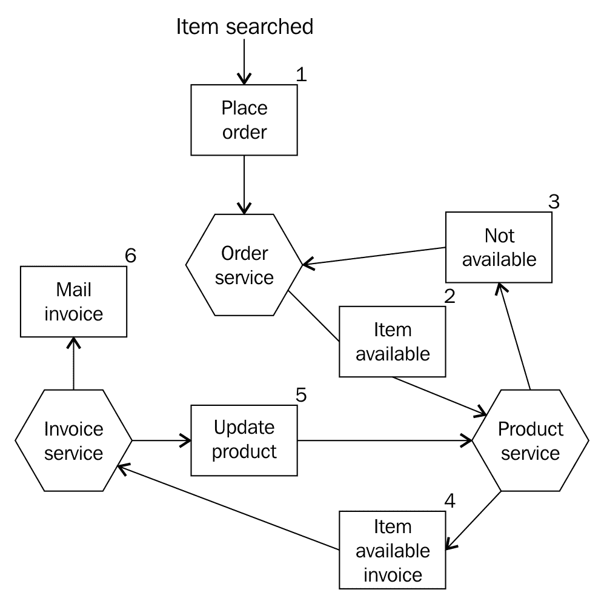

在这个图中，服务用六边形描述，事件用方框表示。

图表中描述的流程描述了一个客户在搜索了他/她正在寻找的项目后下订单的场景。这个过程是这样的:

1.  **下订单**事件升级为**订单服务**。
2.  针对此事件，我们的服务分析了订单项目和数量等参数，并将**项目**可用事件提升至**产品服务**。
3.  从这里开始，有两种可能的结果:要么请求的产品可用并具有所需的数量(继续到*步骤 4* )，要么它不可用或没有所需的数量。

4.  如果项目可用，**产品服务**会引发一个名为**生成发票** (I **项目可用发票**)到**发票服务**的事件。因为提高发票意味着我们确认订单，发票上的项目将不再有库存；我们需要注意这一点，并相应地更新库存。
5.  为了解决这个问题，我们的发票服务进一步提出了一个名为**的事件，将产品数量**更新为**产品服务**，它处理了这个需求。为简单起见，我们不再赘述**邮寄发票** ( *步骤 6* )事件由谁处理。

本节旨在检查我们现有的基于微服务的应用，然后我们收集信息，使其成为一个反应式微服务应用。为了做到这一点，我们已经在图表的帮助下完成了几个步骤。事件通信是基于微服务的应用最重要的部分之一，因为当一个服务需要来自另一个服务的输入时，服务之间的通信是必需的。让我们继续来看看事件通信。

# 理解事件通信

前面的讨论可能让您思考正在引发的事件将如何完美地映射各个微服务的调用；让我们更详细地讨论这个问题。将所有引发的事件都视为存储在事件存储中。存储的事件有一个关联的委托函数，调用该函数是为了迎合相应的事件。请考虑下图:

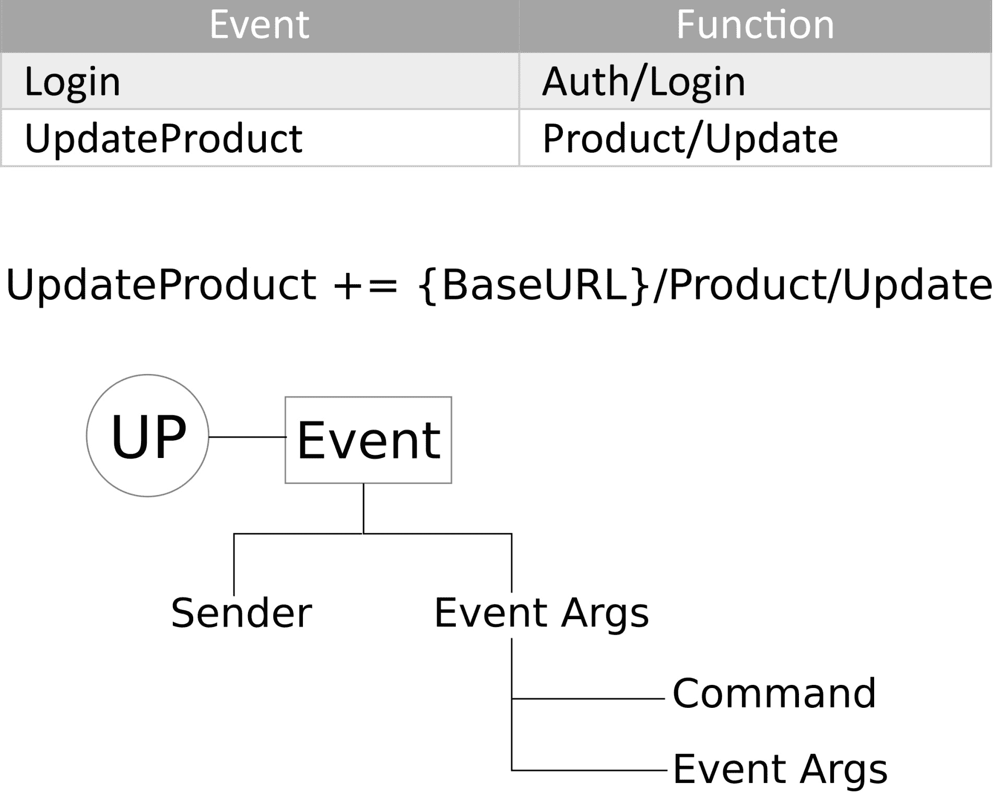

虽然我们显示商店只有两列**事件**和**功能**(在图的顶部)，但它存储了更多的信息，例如发布者和订阅者的详细信息。每个事件都包含触发相应服务所需的完整信息。因此，事件委托可能是要调用的服务，也可能是应用本身的一个函数。对这个架构来说无所谓。

换句话说，随着事件通信的适应，以及发布/订阅模型的实现，我们作为开发人员不会担心冗长的代码。你看，一旦一个事件被订阅和发布，它将被自动触发来提供一个成功操作的预期输出。这里有一件事应该很重要，那就是安全。必须有某种机制来处理安全通信，我们将在下一节中讨论。

# 安全

在实现反应式微服务时，有许多方法可以处理安全性。然而，鉴于我们这里的范围有限，我们将把我们的讨论仅限于一种类型。让我们继续在这里讨论消息级安全性，看看它是如何实现的。

# 消息级安全性

消息级安全性是保护您的单个请求消息的最基本的方法。执行初始身份验证后，根据实现方式，请求消息本身可能包含 OAuth 承载令牌或 JWTs。这样，每一个请求都得到验证，并且与用户相关的信息可以嵌入到这些令牌中。信息可以像用户名一样简单，还有一个指示令牌有效性的到期时间戳。毕竟，我们不希望令牌的使用超过特定的时间范围。

实现将是渐进的，我们应该添加一些逻辑，以便令牌应该在规定的时间框架内过期。借助`System.IdentityModel.Tokens.Jwt`名称空间，这很容易实现。除了时间到期之外，您还可以通过添加应用所需的更多信息来实现`jwt`。

安全通信确保请求和/或响应是安全的，不会被篡改。消息级安全性专门处理经过身份验证的请求。让我们继续讨论可伸缩性如何受到影响。

# 可量测性

对于反应式微服务，还有一个方面需要考虑，那就是可伸缩性。在这个令牌中(上一节中讨论过)，除了身份验证信息之外，我们还可以嵌入授权信息。请注意，将所有这些信息放在一个频繁传递的令牌中，可能很快就会成为一种开销。我们可以进行必要的更改，以确保关于授权的信息是一次性的活动，并且我们可以确保它随后根据需要与服务一起保存。

当我们决定将授权相关的信息保存在单个服务中时，在某种程度上，我们使它们具有弹性。将授权信息保存在各个服务中的任务不再需要每次都联系身份验证服务来获取与授权相关的数据。这意味着我们可以非常轻松地扩展我们的服务。

扩展应用的方法也取决于代码的实现(对于业务逻辑)。在本节中，我们了解到，如果令牌加载了大量信息(即使应用需要这些信息)，令牌(可能是`jwt`，如前一节所述)可能会成为服务的过载。因此，我们找到了传递这些信息和扩展服务的方法。当通信安全时，它也应该具有弹性，这是我们接下来要讨论的。

# 通信弹性

如果包含所有用户身份验证数据和授权数据的身份验证服务突然变得不可用，会发生什么情况？这是否意味着整个微服务生态系统将会崩溃，因为所有的操作——或者其中很大一部分——都需要授权给尝试该操作的用户？这不适合微服务架构领域。让我们看看如何处理这件事。

一种方法是在每个需要的服务中复制用户授权数据。当授权数据已经在相应的服务中可用时，它将减少通过移动的 JWTs 传输的数据。这样做的结果是，如果我们的身份验证服务变得不可用，经过身份验证并访问过系统的用户将不会受到影响。由于需要验证的各个服务中已经有了所有授权数据，业务可以照常进行，没有任何障碍。

然而，这种方法也有其自身的代价。维护这些数据将成为一项挑战，因为所有服务都在不断更新这些数据。每个服务所需的复制本身就是一种练习。不过，也有办法摆脱这种特殊的挑战。

我们可以简单地将这些数据存储在一个中央存储中，并让服务从这个中央存储中验证/访问与授权相关的数据，而不是让这些数据在所有的微服务中可用。这将使我们能够建立超越身份验证服务的弹性。

服务之间的通信应该是安全的，弹性和代码应该以应用可以扩展的方式编写。安全通信确保请求来自经过身份验证的来源。服务不应该以这样一种方式过载(例如，在我们的例子中，当令牌被信息过载时)，这将产生扩展应用的问题。数据管理也是应用的重要组成部分，这也是我们接下来要讨论的！

# 管理数据

跟踪正在下的单个订单很容易。然而，将这个数字乘以每小时发出和取消的百万订单；它可能很快成为反应式微服务领域的一个挑战。挑战在于如何跨多个服务执行事务。不仅很难跟踪这样的事务，而且还会带来其他挑战，例如持久化跨越数据库和消息代理的事务。例如，用户订购了一件商品，将其添加到购物车，然后结账付款。

在本活动中，我们的代码流程如下:

1.  系统检查订购物品的可用性。
2.  如果物品可用，系统会保留该物品。
3.  结账时，系统会调整物品的库存。
4.  最后，在付款时，将确认订单，系统将继续显示项目的交货状态进度。

在本例中，每个步骤都需要将数据保存在数据库、缓存或任何其他形式中。在实际场景中，如果持久性在任何一步都失败了，那么剩下的步骤就不应该执行，已经执行的步骤应该回滚。在这种情况下，我们谈论的是来自单个用户的单个项目。但是考虑一个场景，数以千计的请求正在执行这些步骤，如果某件事失败了，跟踪所有的事务会有多复杂。由于服务故障，撤销此类操作的任务可能会在某个地方中断事务，这可能更令人生畏。

在这种情况下，我们可以利用事件源模式。这是一个强有力的候选，尤其是因为我们不需要两阶段提交(通常称为 *2PC* )。我们不存储事务，而是保存实体的所有状态变化事件。换句话说，我们以实体的形式存储所有改变状态的事件，比如订单和产品。在正常情况下，当客户下订单时，我们会将订单作为一行保存到订单表中。然而，在这里，我们将持续整个事件序列，直到订单被接受或拒绝的最后阶段。

参考上图(在*理解事件通信*部分)，我们分析了创建订单时生成的事件序列。看看这些事件将如何存储在事件源模式中，并注意一个事务将如何从那组事件中推断出来。首先，让我们考虑数据将如何存储。如下图所示，单个记录保存为行。交易后确认数据一致性:

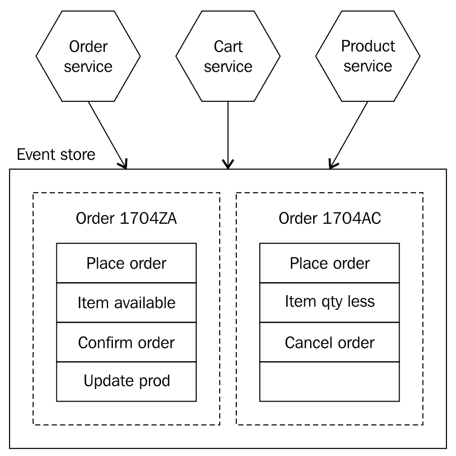

如前图所示，**产品服务**可以订阅订单事件，并进行相应的自我更新。活动商店由所有活动组成，如**下单**、**商品可用**、**确认订单**，最后**更新产品**。这些事件按照**命令**存储。整个工艺流程如下:

1.  **订单服务**在检查物品的可用性后下订单。
2.  **购物车服务**将物品添加到购物车中，并从购物车中检出物品。
3.  **产品服务**将更新特定产品的项目。这种方法有许多好处:
    *   由于事件是持久化的，识别事务的挑战与维护数据库完整性的任务是分开的。
    *   在任何给定的时间点，都有可能找到系统的确切状态。
    *   用这种方法迁移单块更容易。
    *   可以回到特定的一组事件，然后找出所有可能的问题。

下图从**订单服务**的角度描述了我们的**订单**和**订单明细**表:

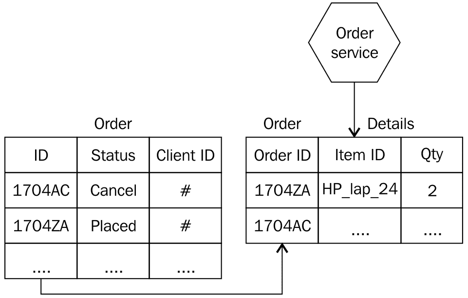

除了所有的好处，它也有一些缺点。最重要的是如何查询事件存储。要在给定的时间点重建给定业务实体的状态，需要一些复杂的查询。除此之外，还会涉及到一个学习曲线，掌握事件存储取代数据库的概念，然后推断实体的状态。在 CQRS 模式的帮助下，可以轻松处理查询复杂性。但是，这不在本章范围之内(有关 CQRS 的更多信息，请参考[。值得注意的是，在被动微服务之后，事件源模式和 CQRS 是重要的模式。](https://docs.microsoft.com/en-us/azure/architecture/patterns/cqrs)

数据管理是微服务应用的重要组成部分，尤其是当我们讨论电子商务应用时。本节旨在讨论数据管理:数据库、事务数据等的逻辑分离。让我们继续了解微服务生态系统。

# 尝试反应式微服务的编码

正如在最初的章节中所讨论的，当拥抱微服务时，我们需要为大的变化做好准备。到目前为止，我们在部署、安全性和测试方面的讨论已经让您考虑接受这个事实。与单片不同，微服务的采用需要您提前做好准备，这样您就可以开始与它一起构建基础设施，而不是在它完成之后。

在某种程度上，微服务在一个完整的生态系统中茁壮成长，在这个生态系统中，从部署到测试、安全和监控，一切都得到了解决。拥抱这种变化的回报是巨大的。做出所有这些改变肯定是有成本的。然而，与其拥有一个无法推向市场的产品，不如承担一些成本，然后在最初的几次推出后，设计和开发一些能够蓬勃发展且不会消亡的产品。

在向您概述了微服务生态系统之后，我们现在了解了正在经历部署、测试、安全和监控的系统/应用。接下来，我们将编写代码来实现反应式微服务，就像之前讨论的那样。

现在，让我们尝试总结所有内容，看看它在代码中的实际外观。我们将为此使用 Visual Studio 2019。第一步是创建一个反应式微服务，然后我们将继续，创建一个客户端来消费我们创建的服务。让我们在接下来的部分中尝试这些步骤。

# 创建项目

我们现在将继续创建我们的反应式微服务示例。为此，我们需要创建一个 ASP.NET web 应用类型的项目。只需遵循这些步骤，您应该能够看到您的第一个反应性微服务在运行:

1.  启动 Visual Studio。
2.  通过导航至文件|新建|项目，或按*Ctrl*+*Shift*+*N*创建新项目，如下图截图所示:

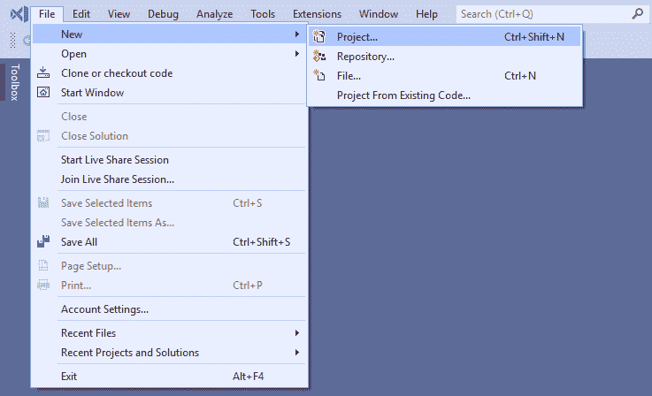

3.  从创建新项目屏幕中，选择 ASP.NET Core网络应用，然后单击下一步:

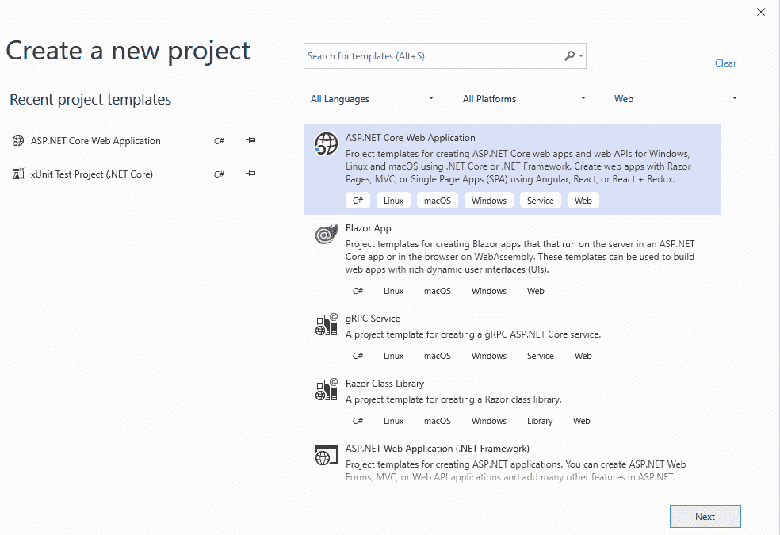

4.  从“配置新项目”屏幕中，转到“项目名称”并在中添加一个项目。我将其命名为`FlixOne.BookStore.ProductService`，然后选择位置路径和解决方案名称。完成后，单击创建:

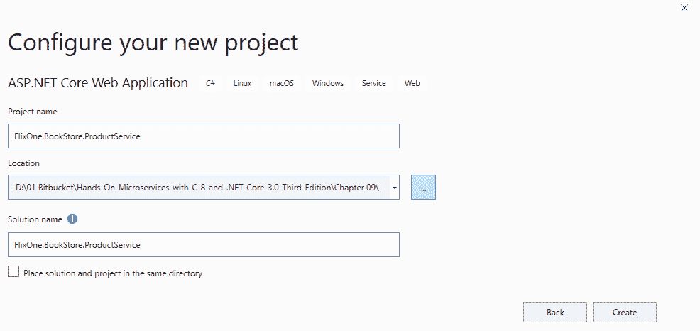

5.  在创建新的 ASP.NET Core网络应用屏幕上，确保。选择 NET Core 和 ASP.NET Core 3.1，然后选择 Web 应用(模型-视图-控制器)。完成后，单击创建:

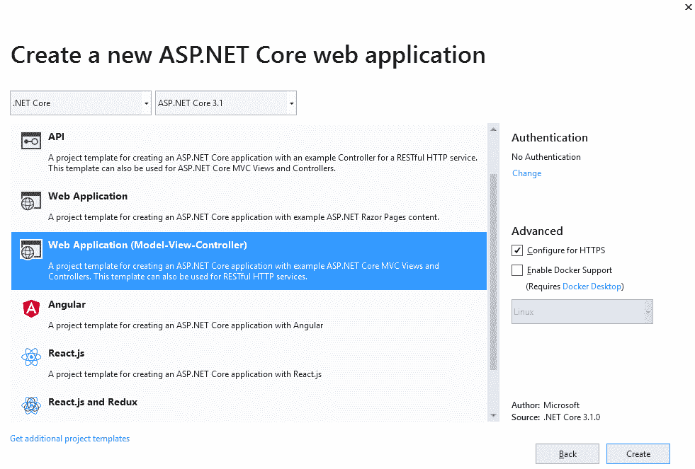

You can enable Docker support for Windows, if you want to enable the container. Select Enable Docker Support, from the  Advanced section on the right.

6.  在解决方案资源管理器中右键单击项目，然后单击“获取管理器”并添加系统。反应式。核心数字获取项目包:

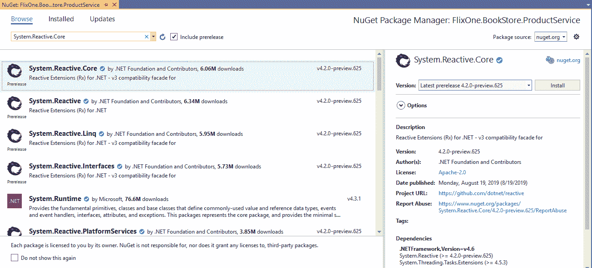

You are also required to add a package for EF Core; to do so, refer to [Chapter 2](02.html), *Refactoring the Monolith*.

7.  将`Product.cs`模型添加到`Models`文件夹，代码如下:

```cs
namespace FlixOne.BookStore.ProductService.Models
{
  public class Product
  {
    public Guid Id { get; set; }
    public string Name { get; set; }
    public string Description { get; set; }
    public string Image { get; set; }
    public decimal Price { get; set; }
    public Guid CategoryId { get; set; }
    public virtual Category Category { get; set; }
  }
}
```

8.  将`Category.cs`模型添加到`Models`文件夹，代码如下:

```cs
namespace FlixOne.BookStore.ProductService.Models
{
  public class Category
  {
    public Category() => Products = new List<Product>();
    public Guid Id { get; set; }
    public string Name { get; set; }
    public string Description { get; set; }
    public IEnumerable<Product> Products { get; set; }
  }
}
```

9.  将`context`和`persistence`文件夹添加到项目中。将`ProductContext`添加到`context`文件夹，将`IProductRepository`界面和`ProductRepository`类添加到`persistence`文件夹。

考虑下面的代码片段，展示我们的上下文和持久性类:

```cs
public class ProductContext : DbContext
  {
    public ProductContext(DbContextOptions<ProductContext> options)
    : base(options)
    { }
    public ProductContext()
    { }
    public DbSet<Product> Products { get; set; }
    public DbSet<Category> Categories { get; set; }
  }
}
```

前面的代码声明了`ProductContext`，继承了`DbContext`，有`DbSet Products`和`Categories`。

对于持久性或存储库，以下是接口代码:

```cs
namespace FlixOne.BookStore.ProductService.Persistence
{
  public interface IProductRepository
  {
    IObservable<IEnumerable<Product>> GetAll();
    IObservable<IEnumerable<Product>> GetAll(IScheduler scheduler);
    IObservable<Unit> Remove(Guid productId);
    IObservable<Unit> Remove(Guid productId, IScheduler scheduler);
  }
}
```

在前面的代码中，我们创建了`IProductRepository`来获取和移除产品。

以下是实现`IProductRepository`接口的`ProductRepository`类的代码:

```cs

namespace FlixOne.BookStore.ProductService.Persistence
{
  public class ProductRepository : IProductRepository
  {
    private readonly ProductContext _context;
    public ProductRepository(ProductContext context)
    => _context = context;
    public IObservable<IEnumerable<Product>> 
    GetAll() => Observable.Return(GetProducts());
    public IObservable<IEnumerable<Product>>
    GetAll(IScheduler scheduler) => 
    Observable.Return(GetProducts(), scheduler);
    public IObservable<Unit> Remove(Guid productId) =>
    Remove(productId, null);
    public IObservable<Unit> Remove(Guid productId,
    IScheduler scheduler)
    {
      DeleteProduct(productId);
      return scheduler != null
      ? Observable.Return(new Unit(), scheduler)
      : Observable.Return(new Unit());
    }
    ...
}
```

我们创造了我们的模型。我们的下一步是添加与数据库交互的代码。这些模型帮助我们将数据从数据源投射到我们的模型中。

对于数据库交互，我们已经创建了一个上下文，即`ProductContext`，从`DbContext`派生出来。在前面的一个步骤中，我们创建了一个名为`Context`的文件夹。

实体框架核心上下文有助于查询数据库。此外，它还帮助我们整理对数据执行的所有更改，然后在数据库中一次性执行这些更改。我们将不详细讨论实体框架核心或这里的上下文，因为它们不属于本章的范围。

上下文从`connectionStrings`部分的`appsettings.json`文件中选择连接字符串—一个名为`ProductConnectionString`的键。

您可以给它起任何名字，如下面的代码片段所示:

```cs
 "ConnectionStrings": 
 {
   "ProductConnection": "Data Source=.;Initial
   Catalog=ProductsDB;Integrated  
   Security=True;MultipleActiveResultSets=True"
 }
```

您需要更新`startup.cs`文件，以确保您使用的是正确的数据库。我们已经在[第 2 章](02.html)、*重构整体*中讨论了修改`appsettings.json`和`Statrup.cs`文件。在更新`Startup.cs`类的同时，您需要在项目中添加`Swashbuckle.AspNetCore` NuGet 包来支持斯瓦格。

# 应用和数据库之间的通信

有了我们的上下文，并考虑到我们的应用和数据库之间的通信，让我们继续添加一个存储库来促进我们的数据模型和数据库之间的交互。请参考我们存储库的代码，如*创建项目*部分的*步骤 10* 中所述。

通过将来自`GetAll`的结果标记为`IObservable`，我们添加了我们正在寻找的反应功能。另外，请特别注意退货声明:

```cs
 return Observable.Return(GetProducts());
```

有了这个可观察的模型，我们就可以像处理其他更简单的集合一样轻松地处理异步事件流。

我们现在准备通过我们的控制器公开功能。右键单击文件夹控制器，单击添加新项目，然后选择 ASP.NET Core，然后选择应用编程接口控制器类。命名为`ProductController`。完成后，单击添加:

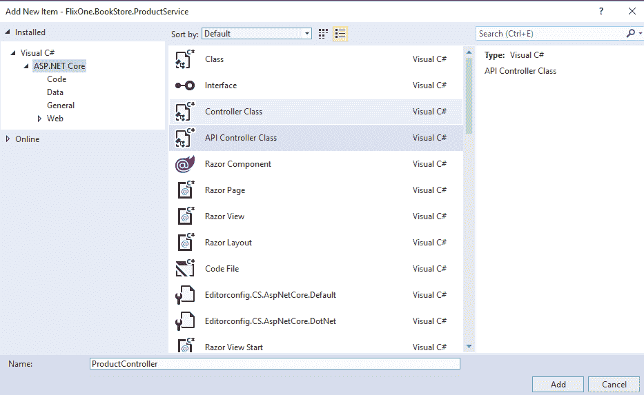

我们的控制器是这样的:

```cs
namespace FlixOne.BookStore.ProductService.Controllers
{
  [Route("api/[controller]")]
  public class ProductController : Controller
  {
    private readonly IProductRepository _productRepository;
    public ProductController() => _productRepository =
    new ProductRepository(new ProductContext());
    public ProductController(IProductRepository 
    productRepository) => _productRepository = 
    productRepository;
    [HttpGet]
    public async Task<IEnumerable<Product>> Get() =>
    await _productRepository.GetAll().SelectMany(p => p).ToArray();
  }
}
```

最终结构类似于解决方案资源管理器的以下屏幕截图:

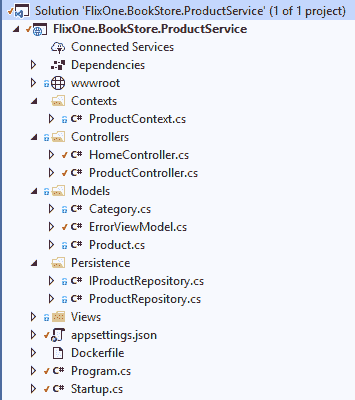

要创建数据库，您可以参考[第 2 章](02.html)、*重构整体*中的 *EF 核心迁移*部分，或者简单地调用我们新部署的服务的 Get API。当服务发现数据库不存在时，在这种情况下，实体框架核心代码优先的方法将确保数据库被创建。

我们现在可以继续将这项服务部署到我们的客户。随着我们的反应式微服务的部署，我们现在需要一个客户端来调用它。

本节有助于提供关于反应式微服务的想法。我们在这一部分创建了一个 RESTful API(这并不意味着我们已经完成了微服务)。为了简单起见，我们举了一个单一服务的例子。这些服务将由客户端直接使用或通过应用编程接口网关使用。

接下来，我们将讨论将使用这项服务的客户。

# 客户–编码

在 AutoRest 的帮助下，我们将创建一个网络客户端来使用我们新部署的反应式微服务。

**AutoRest** is a tool that helps us to generate client libraries, so that we can access RESTful web services. AutoRest fetches the API definition from the OpenAPI Specification (Swagger). 

让我们为它创建一个控制台应用，并添加这些 NuGet 包:`System.Reactive.Core`、`Microsoft.AspNet.WebApi.Client`、`Microsoft.Rest.ClientRuntime`和`Newtonsoft.Json`:

1.  AutoRest 将在主项目中添加一个名为`Models`的文件夹，并创建模型产品和类别的副本，这是我们刚刚创建的服务。它将内置必要的反序列化支持。
2.  `ProductOperations.cs`和`ProductServiceClient.cs`包含呼叫所需的主要管道。
3.  在`Program.cs`文件的`Main`功能中，更改`Main`功能如下:

```cs
 static void Main(string[] args)
 {
   var client = new ProductServiceClient {BaseUri = 
   new Uri("http://localhost:22651/")};
   var products = client.Product.Get();
   Console.WriteLine($"Total count {products.Count}");
   foreach (var product in products)
   {
     Console.WriteLine($"ProductId:{product.Id},Name:
     {product.Name}");
   }
   Console.Write("Press any key to continue ....");
   Console.ReadLine();
 }  
```

此时，如果数据库没有被创建，那么它将按照实体框架的要求被创建。

我们需要知道这个从微服务返回的列表与常规列表有何不同。答案是，如果这是一个非反应性的场景，并且如果您要对列表进行任何更改，那么它将不会反映在服务器中。在被动微服务的情况下，对这样的列表所做的更改将被保存到服务器上，而不必经历手动跟踪和更新更改的过程。

You can use any other client to make the Web API call (for example, `RestSharp` or `HttpClient`).

你可能已经注意到，当遇到混乱的回调时，我们只需要做很少的工作或者根本不做任何工作。这有助于保持我们的代码干净和易于维护。在可观察的情况下，当值可用时，是生产者推动这些值。此外，这里还有一个客户端没有意识到的区别:您的实现是阻塞的还是非阻塞的。对客户来说，这一切似乎都是异步的。

你现在可以专注于重要的任务，而不是弄清楚接下来要打什么电话，或者哪些电话你完全错过了。

编写或创建服务并不能完成任务。应该使用这些服务，或者，如果创建这些服务的目的是作为业务逻辑，而不是向客户端请求任何东西，那么它们应该用于相互通信，这意味着这些服务相互调用。在大多数场景中，服务将由客户端应用使用，如我们示例中的产品服务。为了向您展示如何使代码变得简单，并演示主题，我们创建了一个控制台应用。

# 摘要

在这一章中，我们在基于微服务的架构中增加了反应式编程的方面。这种消息驱动的微服务相互通信的方法存在权衡。然而，与此同时，当我们进一步推进我们的微服务架构时，这种方法倾向于解决一些基本问题。事件源模式拯救了我们，让我们摆脱了 ACID 事务或 2PC 选项的限制。这个话题可以大大扩展。我们使用我们的示例应用来理解如何以一种被动的方式重构我们的初始微服务。

在下一章中，我们将准备好整个应用供我们探索，我们将把到目前为止在本书中讨论的所有内容放在一起。

# 问题

1.  什么是反应式微服务？
2.  什么是消息级安全性？
3.  什么是自动测试？

# 进一步阅读

你刚刚读完这一章，但这不是我们学习曲线的终点。以下是一些参考资料，可以增强您对测试相关主题的了解:

*   *手动反应微服务.NET Core*:*[https://www . packtpub . com/application-development/hands-reactive-microservice-NET-Core-3-video](https://www.packtpub.com/application-development/hands-reactive-microservices-net-core-3-video)*
**   *反应式编程。网络开发者*:[https://www . packtpub . com/web-development/reactive-programming-NET-Developers](https://www.packtpub.com/web-development/reactive-programming-net-developers)*