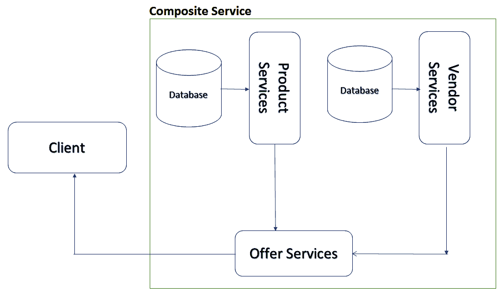
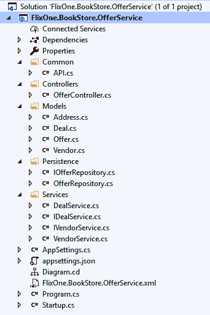
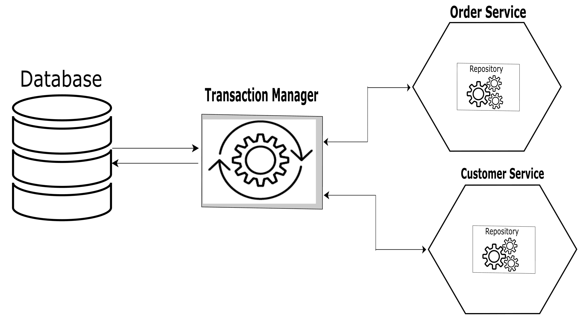
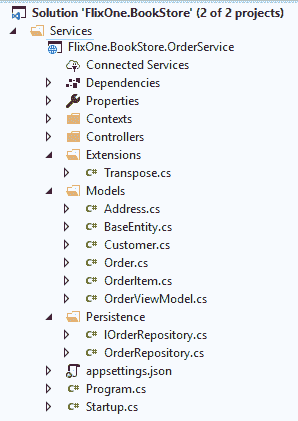
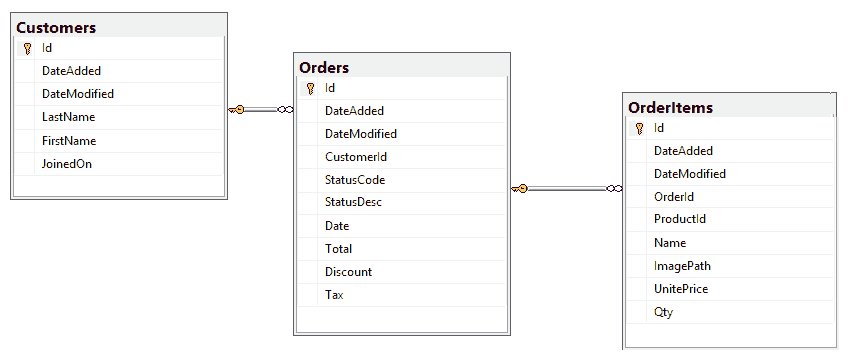
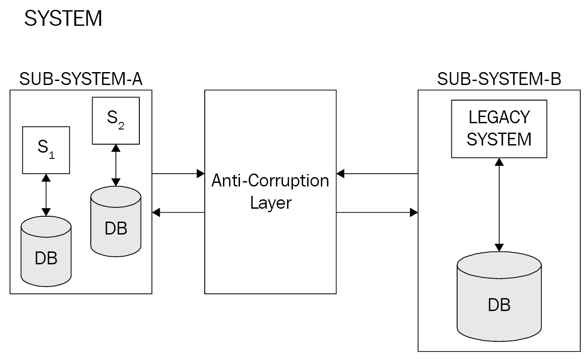
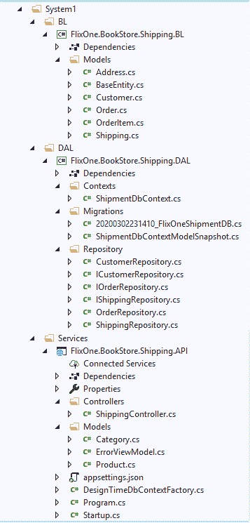

# 设计模式和最佳实践

在任何编程语言中，总是建议实现模式和最佳实践。对于这样的实现，设计模式非常常用，因为它们有助于使代码可重用，允许代码片段与其他部分和组件很好地匹配。这些都是非常重要的技术，也是微服务生态系统中的游戏规则改变者。在本章中，我们将介绍一些高级设计模式和最佳实践，它们将帮助我们设计真实世界的微服务应用程序。

本章将涵盖以下主题:

*   聚合器模式
*   共享数据微服务模式
*   反腐败层模式

除了聚合器模式、共享数据微服务模式和反腐败层模式之外，我们已经在本书前面的章节中介绍了设计模式的实现，我们将在这里用代码示例深入介绍这些模式。

# 技术要求

本章包含一些代码示例来解释我们将要看到的模式的概念。代码保持简单，仅用于演示目的。这些示例涉及一个用 C#编写的. NET Core 控制台应用程序。

以下是运行和执行代码的先决条件:

*   Visual Studio 2019
*   正在设置。净核心

# 安装 Visual Studio 2019

要安装和运行这些代码示例，您需要安装 Visual Studio 2019 或更高版本(首选 IDE)。为此，请遵循以下说明:

1.  按照安装说明，从[https://docs . Microsoft . com/en-us/Visual Studio/install/install-Visual Studio](https://docs.microsoft.com/en-us/visualstudio/install/install-visual-studio)下载 Visual Studio 2019(社区版免费)。
2.  按照操作系统的安装说明进行操作。Visual Studio 安装有多个版本。我们使用的是视窗操作系统。

如果你没有。安装了 NET Core 3.1，可以从[https://www.microsoft.com/net/download/windows](https://www.microsoft.com/net/download/windows)下载设置。

The complete source code is available at [https://github.com/PacktPublishing/Hands-On-Microservices-with-CSharp-8-and-.NET-Core-3-Third-Edition/tree/master/Chapter%2010](https://github.com/PacktPublishing/Hands-On-Microservices-with-CSharp-8-and-.NET-Core-3-Third-Edition/tree/master/Chapter%2010)[.](https://github.com/PacktPublishing/Hands-On-Microservices-with-CSharp-8-and-.NET-Core-3-Third-Edition/tree/master/Chapter%2010)

为了开始本章中设计模式的旅程，我们将首先了解聚合器模式，然后检查问题解决方案的上下文。

# 聚合器模式

在微服务中，我们倾向于将我们的业务特征分解成作为独立服务的小项目，这些服务托管在完全不同的服务器上。每个服务都有自己的信息(有时服务共享一个数据库)，这些服务的传入数据包含这些信息。有时，有必要混合来自服务的数据的细节。该数据要求顾客和该工作/任务仅在服务级别完成。数据协作是系统的责任，而不是客户的责任。

为了处理这种情况，我们可以使用聚合器模式。顾名思义，它聚合或组合信息并返回最终响应。在聚合器模式的帮助下，我们将混合两个或更多服务的响应，应用任何业务逻辑(如果需要的话)，然后返回一个组合响应。

我们可以在复合微服务的帮助下实现聚合器模式。当我们需要聚合来自多个微服务的数据，然后在应用各种业务规则后将响应返回给消费者时，复合服务发挥了重要作用。

Composite microservices may also be called UI composite services. These services take the output of two or more microservices, apply the business logic, and provide the combined result as a final response for the consumers. These consumers might be internet applications, mobile devices, or other consumers of the response.

在更常见的场景中，如果我们不需要对数据应用任何业务逻辑，那么我们可以简单地使用 API 网关来聚合数据并将其返回给消费者。

# 利弊

您应该在以下情况下使用聚合器模式:

*   需要多个后端服务来处理或执行客户端请求。
*   客户端的网络不稳定，例如，他们使用网络中延迟时间较长的移动设备发送请求。

以下是这种模式可能不适合的情况:

*   当我们需要打一个电话以便减少多次通话时。当客户端调用单个服务但进行多个操作时，就会出现这种情况。在这种情况下，最好为被调用的服务实现批处理操作。
*   当网络延迟非常低时。在这种情况下，不应该使用聚合器模式，因为它不会给操作带来任何好处。

# 应遵循的最佳实践

如果我们想要实现这种模式，我们应该使用以下最佳实践:

*   当我们开始实现这种模式时，数据隔离是最佳实践之一。鉴于我们想象中的应用程序 FlixOne，这一点非常重要，我们已经在整本书中讨论过了(当我们将单片应用程序转换为微服务时)。但是，在复合微服务的帮助下，实现这种模式时可能已经注意到了这一点(因为每个微服务都有自己的数据库)，但是可能仍然需要为每个服务隔离数据库。
*   我们将在示例中采用的另一个最佳实践是将服务作为面向客户端的服务和内部服务来管理。我们将在报价服务(面向客户的服务)以及产品和供应商服务(内部服务)的帮助下实现这一点。

让我们看看这些最佳实践的实现在我们的 FlixOne 应用程序中会是什么样子。

# 问题及其解决方案——以 FlixOne 为例

在我们想象的应用程序中，我们有两种不同的服务:一种是产品服务，另一种是供应商服务。这两种服务都是细粒度的，并使用它们的数据库。为此，我们需要来自客户(消费者)的两种服务的数据。这方面的业务逻辑处理以下两个标准，在将响应发送回消费者之前，我们需要满足这两个标准:

*   回复应包含供应商的完整信息。
*   应该指定产品价格。

为了满足这些标准，我们需要创建一个复合微服务，它将聚合产品服务和供应商服务的响应。在应用业务逻辑后，这些聚合数据将返回给消费者:



上图是复合服务的图示。**产品服务**和**厂商服务**使用自己的数据库，**提供的服务**依赖于这两个服务的信息和数据。最后，**提供服务**将这些数据/信息合并并发送回**客户端**。在这里，我们的**提供服务**充当聚合器。

既然我们知道了这个问题，我们将看看解决方案，并使用代码示例来实现它。

# 实施解决方案

在本节中，我们将创建一个复合微服务并实现聚合器模式。请重新访问*技术要求*部分，检查该应用的先决条件。按照以下步骤创建我们的服务:

1.  打开 Visual Studio。
2.  转到开始|创建新项目。您也可以在此屏幕中单击“无代码继续”链接；在这种情况下，您需要单击文件|新建项目来创建新项目。
3.  选择 ASP.NET 核心网络应用程序，然后单击下一步。

4.  输入项目名称，选择路径，然后单击创建。
5.  在下一个屏幕上，选择一个应用编程接口，然后单击创建；确保您已经选择。NET 核心和 ASP.NET 核心 3.1。
6.  为了使示例项目易于演示，我添加了文件夹和文件，如下图所示:



前面的截图显示了我们的 FlixOne。书店。提供服务解决方案。这里面有几个文件夹，我们现在详细研究一下，分别是`Common`、`Controller`、`Models`、`Persistence`和`Services`。

# 公共文件夹

这个文件夹包含了我们所有的常用操作。在我们的应用程序中，我们添加了一个`API.cs`文件，其中包含为`Deal`和`Vendor`微服务创建服务端点的方法。

以下代码用于收集服务端点:

```cs
public static class Deal
{
    public static string GetAllDeals(string baseUri) => $"{baseUri}";
    public static string GetDeal(string baseUri, string id) => $"{baseUri}/{id}";
}
```

在前面的代码中，我们创建了一个名为`Deal`的静态类。这个类有静态方法，即`GetAllDeals`和`GetDeal`。这些方法将各种参数与`baseUri`连接起来，生成服务端点，并将其作为完整的`baseUri`的`string`返回。

The code aims to demonstrate the Aggregator pattern (using composite microservices). It does not focus on covering complete CRUD operations, but instead, it focuses on explaining the pattern, using the `Get` operation.

以下代码属于`Vendor`类:

```cs
public static class Vendor
{
    public static string GetList(string baseUri) => $"{baseUri}";
    public static string GetVendor(string baseUri, string id) => $"{baseUri}/{id}";
}
```

前面的代码生成服务端点来获取`Vendor`列表，并基于`Vendor ID`获取供应商记录。

`Deal`和`Vendor`类简单易懂。这些类只形成一串服务端点。为了使我们的代码简单，我们使用这个方法来形成服务端点的字符串，但是您可以通过将端点放在配置文件、环境或数据库中来实现这一点。在接下来的部分中，我们将看到如何使用这些方法。

# 控制器文件夹

这个文件夹包含我们的作为服务公开的应用编程接口控制器。下面的代码对此进行了解释:

```cs
[HttpGet("{dealId}/{vendorId}")]
[ProducesResponseType(typeof(Models.Offer), 200)]
public async Task<Models.Offer> GetOffer(string dealId, string vendorId)
{
    var res = await _repository.Get(dealId, vendorId);
    return res;
}
```

我们在`OfferController`中添加了一个`GET`资源，获取一个`Offer`对象的记录。`Offer`对象旨在聚合来自`Vendor`和`Deal`模型的数据。

下面的代码展示了如何聚合来自`Deal`和`Vendor`模型的数据:

```cs
public Offer Get()
{
    Offer offer = new Offer();
    if (_deal != null && _deal.StartOn.HasValue)
    {
        offer.OfferCode = _deal.Id.ToString();
        offer.OfferDetails = $"Offer:{_deal.Name}, {_deal.Description}";
        offer.OfferBanner = _deal.Image;
        offer.Discount = _deal.OfferPrice;
        offer.OfferValidTill = _deal.EndOn;
    }
    else
    {
        offer.OfferDetails = "Deal is not available.";
    }
    if (_vendor != null)
    {
        offer.VendorCode = _vendor.Code;
        offer.VendroName = _vendor.Name;
        offer.AccessURL = _vendor.URL;
        offer.VendorLogo = _vendor.Logo;

        if (_vendor.Address != null)
        {
            var address = _vendor.Address;
            offer.VendorAddress = $"{address.AddressLine1} {address.AddressLine2}, {address.City}, {address.State}, {address.PIN}";
        }

    }

    return offer;
}
```

在前面的代码中，根据我们的业务需求，我们实现了逻辑并组合了数据，因此它将作为一个对象可用，具有以下属性:

```cs
public string OfferCode { get; set; }
public string OfferDetails { get; set; }
public string OfferBanner { get; set; }
public decimal Discount { get; set; }
public DateTime OfferValidTill { get; set; }
public string VendorCode { get; set; }
public string VendorName { get; set; }
public string AccessURL { get; set; }
public string VendorLogo { get; set; }
public string VendorAddress { get; set; }
```

下面的列表解释了上述属性:

*   `OfferCode`:包含唯一的标识，代表`Deal`型号的记录标识。
*   `OfferDetails`:包含`Deal`型号的名称和描述。
*   `Offerbanner`:包含交易图像的`Base64`字符串。
*   `Discount`:包含供应商在交易中提供的折扣。
*   `OfferValidTill`:包含`Deal`有效期的日期和时间。
*   `VendorCode`:包含提供交易的供应商的代码。
*   `VendorName`:包含提供交易的供应商的名称。
*   `AccessURL`:包含所提供交易的网址。这代表供应商为报价提供的网址*。*
*   `VendorLogo`:包含`Vendor`标志的`Base64`串。

# 模型文件夹

这个文件夹包含模型类，可以帮助我们保存和转置模型对象数据。让我们看看下面的代码:

```cs
public class Address
{
    public Guid Id { get; set; }
    public string AddressLine1 { get; set; }
    public string AddressLine2 { get; set; }
    public string City { get; set; }
    public string State { get; set; }
    public string Country { get; set; }
    public string PIN { get; set; }
    public Guid VendorId { get; set; }
}
```

前面的代码包含`Address`类及其属性来维护用户的地址(`Vendor`)。这些属性解释如下:

*   `Id`:包含唯一标识，代表`Address`型号的记录标识
*   `AddressLine1`:包含`Vendor`的地址详情
*   `AddressLine2`:包含`Vendor`的地址详情
*   `City`:包含`Vendor`的城市名称
*   `State`:包含`Vendor`的州名
*   `Country`:包含`Vendor`的国家名称
*   `PIN`:包含**邮政索引号** ( **PIN** )
*   `VendorId`:包含唯一标识，代表`Vendor`型号的记录标识

让我们考虑以下代码:

```cs
public class Deal
{
    public Guid Id { get; set; }
    public string Name { get; set; }
    public string Description { get; set; }
    public string Image { get; set; }
    public decimal OfferPrice { get; set; }
    public DateTime CreatedOn { get; set; }
    public DateTime? StartOn { get; set; }
    public DateTime? EndOn { get; set; }
}
```

前面的代码包含`Deal`类及其属性，以维护我们用户的可用交易。这些属性解释如下:

*   `Id`:包含唯一的 ID，代表`Deal`型号的记录 ID。
*   `Name`:包含交易名称。
*   `Description`:包含交易的描述。
*   `Image`:包含交易形象的`Base64`字符串。
*   `OfferPrice`:包含交易价格。
*   `CreatedOn`:包含交易创建的日期。
*   `StartOn`:包含交易开始的日期。这是一个可以为空的属性:如果是`null`，那就意味着交易还没有开始。
*   `EndOn`:包含交易达成的日期。这是一个可空属性:如果是`null`，那么交易永远不会过期。

让我们考虑以下代码:

```cs
public class Vendor
{
    public Guid Id { get; set; }
    public string Code { get; set; }
    public string Name { get; set; }
    public string Description { get; set; }
    public string URL { get; set; }
    public string Logo { get; set; }
    public DateTime AddedOn { get; set; } = DateTime.UtcNow;
    public bool Active { get; set; }
    public Address Address { get; set; }
}
```

前面的代码包含`Vendor`类，其属性对应于`Vendor`细节。这些属性解释如下:

*   `Id`:包含唯一的 ID，代表`Vendor`型号的记录 ID。
*   `Code`:包含供应商代码；该代码对于每个`Vendor`都是唯一的。
*   `Name`:包含`Vendor`的名称。
*   `Description`:包含对`Vendor`的描述。
*   `URL`:包含`Vendor`网站的网址。
*   `Logo`:包含`Vendor`标志的`Base64`串。
*   `AddedOn`:系统中`Vendor`首次上船的日期。
*   `Active`:包含`True`或`False`值。如果包含`True`，则表示`Vendor`处于活动状态；如果包含`False`，则`Vendor`未激活。
*   `Address`:包含代表`Address`型号的`Vendor`地址信息。

接下来，我们将讨论`Persistence`和`Services`如何帮助我们实现聚合器模式。

# 持久性文件夹

这个文件夹包含我们的存储库，它们提供 CRUD 操作并返回聚合的数据。让我们看看下面的代码:

```cs
public class OfferRepository : IOfferRepository
{
    private readonly IDealService _dealService;
    private readonly IVendorService _vendorService;
    public OfferRepository(IDealService dealService, IVendorService vendorService)
    {
        _dealService = dealService;
        _vendorService = vendorService;
    }
    public async Task<Models.Offer> Get(string dealId, string vendorId)
    {
        Deal deal = await _dealService.GetDeal(dealId);
        Vendor vendor = await _vendorService.GetBy(vendorId);
        var offer = new Models.Offer(deal, vendor);
        return offer.Get();
    }
    …
}
```

前面的代码给了我们从`Deal`微服务和`Vendor`微服务获取数据的能力，然后我们将组合数据作为`Offer`的对象返回。

以下代码注册了存储库和`Appsettings`，以便我们可以在需要时访问配置值:

```cs
//Configure AppSettings
services.AddOptions();
services.Configure<AppSettings>(Configuration);
//Register repository
services.AddTransient<IOfferRepository, OfferRepository>();
```

# 服务文件夹

该文件夹包含我们的服务，并提供聚合这些服务的响应的能力。以下代码来自`DealService`。这项服务为我们提供了可用的交易:

```cs
public class DealService : IDealService
{
    private HttpClient _httpClient;
    private readonly IOptions<AppSettings> _settings;
    private readonly string _baseURL;
    public DealService(HttpClient httpClient, IOptions<AppSettings> settings)
   {
        _httpClient = httpClient;
        _settings = settings;
        _baseURL = $"{settings.Value.DealUrl}/api/deal";
    }
    public async Task<List<Deal>> GetDeals()
    {
        var endPoint = API.Deal.GetAllDeals(_baseURL);
        var resString = await _httpClient.GetStringAsync(endPoint);
        var response = JsonConvert.DeserializeObject<List<Deal>>(resString);
        return response;
    }
    public async Task<Deal> GetDeal(string id)
    {
        var endPoint = API.Deal.GetDeal(_baseURL,id);
        var resString = await _httpClient.GetStringAsync(endPoint);
        var response = JsonConvert.DeserializeObject<Deal>(resString);
        return response;
    }
    …
}
```

在前面的代码中，`GetDeal`方法调用`Deal`微服务，并将响应返回给我们的存储库进行进一步处理。

为了使用微服务的远程 URL，我们在配置文件中添加了密钥，如下所示:

```cs
{
  "DealUrl": "http://localhost:52786",
  "VendorUrl": "http://localhost:52788",
  …
}
```

前面的代码有两个键，`DealUrl`和`VendorUrl`，带有一个远程 URL。这些值可以根据您的设置进行更改。

我们用`AppSettings.cs`文件映射了这些键，如下所示:

```cs
public class AppSettings
{
    public string DealUrl { get; set; }
    public string VendorUrl { get; set; }
}
```

我们已经将该文件映射到我们的`Startup.cs`文件，因此我们可以访问如下配置值:

```cs
public DealService(HttpClient httpClient, IOptions<AppSettings> settings)
{
    _httpClient = httpClient;
    _settings = settings;

    _baseURL = $"{settings.Value.DealUrl}/api/deal";
}
```

以下代码来自`VendorService`:

```cs
public class VendorService : IVendorService
{
    private HttpClient _httpClient;
    private readonly IOptions<AppSettings> _settings;
    private readonly string _baseURL;
    public VendorService(HttpClient httpClient, IOptions<AppSettings> settings)
    {
        _httpClient = httpClient;
        _settings = settings;
        _baseURL = $"{settings.Value.VendorUrl}/api/vendor";
    }
    public async Task<List<Vendor>> GetAll()
    {
        var endPoint = API.Vendor.GetList(_baseURL);
        var resString = await _httpClient.GetStringAsync(endPoint);
        var response = JsonConvert.DeserializeObject<List<Vendor>>(resString);
        return response;
    }
    public async Task<Vendor> GetBy(string id)
    {
        var endPoint = API.Vendor.GetVendor(_baseURL,id);
        var resString = await _httpClient.GetStringAsync(endPoint);
        var response = JsonConvert.DeserializeObject<Vendor>(resString);
        return response;
    }
    …
}
```

前面代码中的`GetBy`方法调用`Vendor`微服务，获取响应，并将其返回到`OfferRepository`进行进一步处理。

最后，当客户端消费`OfferService`时，我们将从`Offer`服务获得聚合数据作为响应。创建该服务是为了演示聚合器模式，使用`Composite`微服务，但不使用应用编程接口网关。

本节旨在汇总两种不同服务(也称为复合服务)的响应。我们已经通过一个代码示例讨论了聚合器模式，并且我们在不使用 API 网关的情况下实现了代码。在下一节中，我们将讨论共享数据微服务模式，实现两个共享公共数据库的独立服务。

# 共享数据微服务模式

共享数据微服务模式可以被视为微服务上下文中的反模式。我们也可以说共享数据模式是最有争议的模式之一。

The great concept behind this pattern is that it uses the same physical structure for data storage. This pattern can be used when there is some doubt about the structure of the data, or when the communication layer between the microservices is not well defined.

一方面，它是反模式；但是，另一方面，却是最有利的格局。关于这种数据模式，您应该记住以下几点:

*   **作为反模式的共享数据模式**:当我们谈论关于微服务的这种模式时，这种模式当然会被称为反模式。这种模式不适合从头开始开发的应用程序(也称为*绿地*应用程序)。这里有一个非常基本的概念，如果我们正在开发任何新的应用程序，那么我们应该考虑应用程序的设计和模式的最佳实践，也要考虑数据库设计。在这种情况下，如果我们试图实现共享数据模式，我们将不会得到任何好处；在这种情况下，它只是一个反模式。
*   **作为适当模式的共享数据模式**:当我们在使用微服务的同时将任何遗留应用程序(也称为*褐地*应用程序)迁移到新的应用程序时，这个模式是使用的适当模式之一。

在这本书里，我们从一开始就使用了共享数据模式，我们开始转换整体应用程序。然后，我们在活动期间以下列方式调整了共享数据模式:

*   打破单一应用程序
*   在单一应用程序过渡期间重新考虑和开发新的微服务
*   数据编排

# 模式的利弊

共享数据模式被认为是反模式和有利模式，这取决于实现它的开发人员。在大多数情况下，开发人员认为这是一个旧的概念，因此他们建议不再使用这种模式。但是，关于这种模式还有各种各样的其他想法，所以我们可以说这种模式既有优点也有缺点，列举如下:

*   随着技术的发展，我们的应用也应该得到加强；这里有许多需要迁移或升级的遗留应用程序。对于需要升级以实现自动化、可伸缩性和弹性的传统应用程序，共享数据模式是最受欢迎的选择之一。
*   共享数据模式的积极好处是，它有助于给开发团队时间从数据库中分离信息并评估数据的一致性。
*   此外，当开发人员使用架构项目时，它有助于重置架构项目。
*   关于共享数据模式的负面影响，最常见的影响是，通过使用这种模式，所有的微服务都存放在存储上。

# 应遵循的最佳实践

总的来说，没有存储的应用程序会少得多。数据库的主要目标是只保存或存储数据。作为开发人员，我们不应该在数据库中存储任何其他信息。但是，出于某种原因，我们可能会存储一些业务规则或任何应该成为应用程序代码一部分的信息。如果我们将业务规则存储在数据库中，那么我们将推动我们的应用程序变得依赖于我们的数据库，这将阻碍数据迁移和分发的过程。

一个常见的错误是，有时候，开发团队采用使用触发器的过程，使用他们自己的数据库资源，或者工作人员观察存储信息的变化。问题是这些触发器很难监控和调试，而且它们也是为存储创建业务规则的一种方式。

在这种模式的帮助下，我们可以使我们的遗留应用程序像绿地应用程序一样，或者，换句话说，在微服务的上下文中，共享数据模式是帮助重置架构项目的有利选择之一。共享数据模式是最有争议的模式之一，这也是事实，许多开发人员认为这是一种较旧的技术，现在不应该使用。作为一个反模式直接表明这不应该被使用。

关于这个主题有不同的观点，现在我们将从我们想象中的应用程序 FlixOne Store 来看它，它已经从一个单一的应用程序转变而来。这是展示共享数据模式的最佳实践和用法的最佳示例之一。

# 问题及其解决方案——以 FlixOne 为例

FlixOne 团队在提取订单细节时遇到了一个新问题。该团队面临这样一个场景，两个不同的服务要求他们将相似的信息保存到数据库中。目前，它正在复制信息，因为客户服务和订单服务都使用自己的数据库。当业务团队提出为客户增加钱包功能的想法时，团队发现了一个问题。根据这项功能，客户可以在他们的 FlixOne 帐户中拥有钱包点数。每当客户从 FlixOne 门户订购/购买任何产品时，其发票的计算应遵循以下规则:

1.  在计算订单的网上支付之前，应该检查钱包余额。

2.  如果钱包余额是信用余额(信用余额将大于零)，那么首先使用钱包余额，然后计算网上支付。
3.  一旦计算出网付，调整钱包余额。
4.  钱包余额不能为负(小于零)。

为了解决这个问题，FlixOne 团队决定为这两种服务使用一个数据库。要详细了解它，请考虑下图:



在上图中，我们的两个服务**订单服务**和**客户服务**共享同一个数据库。这些服务和数据库之间的每一次交互都通过**事务管理器**进行。这样，一个服务可以使用正确的数据，而另一个服务正在使用这些数据。例如，如果我们的**订单服务**消费了钱包金额(信用)，那么我们的**客户服务**应该在使用该金额后返回正确的钱包金额(信用)。

现在，是时候在我们的 FlixOne 应用程序中实现这个解决方案了。

# 实施解决方案

为了实现上述问题的解决方案，我们将首先创建`OrderService`:

1.  打开 Visual Studio。
2.  转到开始|创建新项目。您也可以在此屏幕中单击“无代码继续”链接。在这种情况下，您需要单击文件|新建项目来创建新项目。
3.  选择 ASP.NET 核心网络应用程序，然后单击下一步。
4.  输入项目名称，选择路径，然后单击创建。
5.  在下一个屏幕上，选择一个 ASP.NET 核心 MVC 模板，然后单击创建。确保您已经选择。NET 核心和 ASP.NET 核心 3.1。

为了帮助我们遵循代码及其实现，我添加了文件和文件夹，现在解决方案如下:



前面的截图由几个默认文件组成。除了这些文件之外，我们还添加了更多的文件和文件夹，稍后我们将对此进行讨论。在我们进入更多细节之前，首先让我们确保我们已经添加了 NuGet 包`Microsoft.EntityFrameworkCore.SqlServer`、`Microsoft.EntityFrameworkCore.Design`和`Microsoft.EntityFrameworkCore`。这些包将帮助我们使用实体框架核心的特性。另外，添加 NuGet `Swashbuckle.AspNetCore`包，这样我们就可以将文档添加到我们的 API 中。

为此，请转到工具|否获取包管理|包管理器控制台。在包管理器控制台中执行以下代码:

```cs
Install-Package Swashbuckle.AspNetCore
```

上面的代码为斯瓦格安装了软件包。同样，您应该安装所有其他软件包。

现在，让我们详细讨论所有的文件夹和文件。

# 扩展文件夹

这个文件夹包含将我们的`Models`转置到`ViewModels`的代码，反之亦然。该文件夹包含`Transpose.cs`文件，以帮助在`Order`和`OrderItems`模型与视图模型的`OrderViewModel`之间进行置换。

这些模型代表数据库表，如下图所示:



让我们讨论这些模型和视图模型，如下面的代码所示:

```cs
public static Models.Order ToModel(this Models.OrderViewModel vm)
{
    return new Models.Order
    {
        Id = vm.OrderId,
        CustomerId = vm.CustomerId,
        Date = vm.Date,
        StatusCode = vm.StatusCode,
        StatusDesc = vm.StatusDesc,
        Tax = vm.Tax,
        Total = vm.Total,
        NetPay = vm.NetPay,
        Items = vm.Items.ToModel()
    };
}

public static IEnumerable<Models.Order> ToModel(this IEnumerable<Models.OrderViewModel> vm) => vm.Select(ToModel);
```

前面的代码包含`ToModel`方法。这将我们的`OrderViewModel`转换为`Order`模型；一种方法转换成一条记录，而其他方法转换成一个列表:

```cs
public static Models.OrderViewModel ToViewModel(this Models.Order model)
{
    return new Models.OrderViewModel
    {
        CustomerId = model.CustomerId,
        Date = model.Date,
        OrderId = model.Id,
        StatusCode = model.StatusCode,
        StatusDesc = model.StatusDesc,
        Tax = model.Tax,
        Items = model.Items.ToViewModel()
    };
}
public static IEnumerable<Models.OrderViewModel> ToViewModel(this IEnumerable<Models.Order> model) => model.Select(ToViewModel);
```

前面的代码包含`ToViewModel`方法。这就把我们的`Order`转到了`OrderViewModel`；一种方法转换成一条记录，而其他方法转换成一个列表。

# 模型文件夹

这个文件夹包含模型类，可以帮助我们保存和转置模型对象数据。让我们看看下面的代码:

```cs
public abstract class BaseEntity
{
    [Key]
    public Guid Id { get; set; }
    public DateTime DateAdded { get; set; } = DateTime.UtcNow;
    public DateTime? DateModified { get; set; }
}
```

前面的代码包含一个抽象类`BaseEntity`。这将是我们所有模型的基类。它包含以下属性:

*   `Id`:包含一个唯一的 ID，代表继承这个类的所有模型的记录 ID。
*   `DateAdded`:包含添加记录的日期；其默认值为当前`DateTime`。
*   `DateModified`:包含记录修改的日期；它也可以包含空值。

让我们考虑以下代码，对于`Customer`模型:

```cs
public class Customer : BaseEntity
{
    public string FirstName { get; set; }
    public string LastName { get; set; }
    public DateTime MemberSince { get; set; }
    public decimal Wallet { get; set; }
    public string FullName => LastName + " " + FirstName;
}
```

前面的代码包含`Customer`模型，它继承了`BaseEntity`类。`Customer`模型包含如下详细属性，包括`BaseEntity`的属性:

*   `FirstName`:包含客户的`FirstName`。
*   `LastName`:包含客户的`LastName`。
*   `MemberSince`:包含客户加入`FlixOne`门户时的`DateTime`。
*   `Wallet`:包含贷方金额。
*   `FullName`:包含全名，串联`LastName`和`FirstName`。

让我们考虑以下代码，对于`Address`模型:

```cs
public class Address : BaseEntity
{
    public Guid CustomerId { get; set; }
    public string AddressLine1 { get; set; }
    public string AddressLine2 { get; set; }
    public string City { get; set; }
    public string State { get; set; }
    public string Country { get; set; }
    public string PIN { get; set; }
}
```

前面的代码包含`Address`模型，它继承了`BaseEntity`类。`Address`模型包含如下详细属性，包括`BaseEntity`的属性:

*   `CustomerId`:包含唯一的 ID，代表`Customer`型号的记录 ID。
*   `AddressLine1`:包含客户的地址。
*   `AddressLine2`:包含客户地址的第二行(如果适用)。
*   `City`:包含客户所在的城市。
*   `State`:包含客户的状态。
*   `Country`:包含客户所在国家。
*   `PIN`:包含客户地址的个人识别码。

让我们考虑以下代码，对于`Order`模型:

```cs
public class Order : BaseEntity
{
    public Order()
    {
        Items = new List<OrderItem>();
    }
    public Guid CustomerId { get; set; }
    public string StatusCode { get; set; }
    public string StatusDesc { get; set; }
    public DateTime Date { get; set; }
    public decimal Total { get; set; }
    public decimal Tax { get; set; }
    public decimal NetPay { get; set; }
    public IEnumerable<OrderItem> Items { get; set; }
}
```

前面的代码包含`Order`模型，它继承了`BaseEntity`类。`Order`模型包含如下详细属性，包括`BaseEntity`的属性:

*   `CustomerId`:包含唯一的 ID，代表`Customer`型号的记录 ID。
*   `StatusCode`:包含`Order`的`StatusCode`。
*   `StatusDesc`:包含状态详细信息。
*   `Date`:包含`Order`日期。
*   `Total`:包含`Order`总数。
*   `Tax`:包含`Tax`的量，如果应用的话。
*   `NetPay`:包含`Order`的`NetPay`数量。
*   `Items`:包含`OrderItems`的列表。

让我们考虑以下代码，对于`OrderItem`模型:

```cs
public class OrderItem : BaseEntity
{
    public Guid OrderId { get; set; }
    public Guid ProductId { get; set; 
    public int Sequence { get; set; }
    public string Name { get; set; }
    public string ImagePath { get; set
    public decimal UnitePrice { get; s
    public decimal Discount { get; set
    public int Qty { get; set; }
    public decimal Total { get; set; }
}
```

前面的代码包含`OrderItem`模型，它继承了`BaseEntity`类。`OrderItem`模型包含属性，具体如下，包括`BaseEntity`的属性:

*   `OrderId`:包含唯一的 ID，代表`Order`型号的记录 ID。
*   `ProductId`:包含唯一的 ID，代表`Product`型号的记录 ID。
*   `Sequence`:包含订单项目的序列号。
*   `Name`:包含项目的`Name`。
*   `ImagePath`:包含项目的图像路径。
*   `UnitPrice`:包含项目的`UnitPrice`。
*   `Discount`:包含物品的`Discount`数量，如果有的话。
*   `Qty`:包含项目的`Qty`。
*   `Total`:包含项目合计，计算为`Qty * UnitPrice - Discount`。

除了讨论的模型，我们还有`OrderViewModel`和`OrderItemViewModel`，讨论如下:

```cs
public class OrderViewModel
{
    public Guid OrderId { get; set; }
    public Guid CustomerId { get; set; }
    public string StatusCode { get; set; }
    public string StatusDesc { get; set; }
    public DateTime Date { get; set; }
    public decimal Total { get { return Items.Sum(i => i.Total); } }
    public decimal Tax { get; set; }
    public decimal WalletBalance { get; set; }
    public decimal NetPay { get { return (Total + Tax) - WalletBalance; } }
    public IEnumerable<OrderItemViewModel> Items { get; set; }
}
```

`OrderViewModel`前面的代码包含以下属性:

*   `OrderId`:包含唯一的标识，代表`Order`的记录标识。
*   `CustomerId`:包含唯一的标识，代表`Customer`的记录标识。
*   `StatusCode`:订单的状态码。
*   `StatusDesc`:订单的状态信息。
*   `Date`:`Order`的`Date`。
*   `Total`:持有`Order`的`Total`。
*   `Tax`:金额`Tax`，如果适用。
*   `WalletBalance`:持有信用额度，保留在客户的`Wallet`中。
*   `NetPay`:调整`WalletBalance`后`Order`上的到期金额。
*   `Items`:列表`OrderItems`。

让我们考虑以下代码，对于`OrderItemViewModel`:

```cs
public class OrderItemViewModel
{
    public Guid OrderItemId { get; set; }
    public Guid OrderId { get; set; }
    public Guid ProductId { get; set; }
    public int Sequence { get; set; }
    public string Name { get; set; }
    public string ImagePath { get; set; }
    public decimal UnitPrice { get; set; }
    public decimal Discount { get; set; }
    public int Qty { get; set; }
    public decimal Total { get { return (Qty * UnitPrice) - Discount; } }
}
```

前面的代码包含`OrderItemViewModel`，它具有以下属性:

*   `OrderItemId`:包含`OrderItem`的唯一标识。
*   `OrderId`:包含`Order`的唯一标识。
*   `ProductId`:包含`Product`的唯一标识。
*   `Sequence`:这是订购物品的序列号。
*   `Name`:订单项目名称。
*   `ImagePath`:图像路径。
*   `UnitPrice`:物品的单价。
*   `Discount`:商品的折扣金额，如果有的话。
*   `Qty`:物品的数量。
*   `Total`:项目的`Total`金额，计算为`Qty * UnitPrice - Discount`。

# 持久性文件夹

这个文件夹包含我们的存储库，这些存储库提供了所需的 CRUD 操作以及适当的业务规则。

As per our requirement, we have implemented the business logic in our repository's classes, but, in most cases, we'd require separate classes that contain the business logic/business rules, and so on.

让我们考虑以下代码:

```cs
public IEnumerable<Models.Order> List() => _context.Orders.Include(o => o.Items).ToList();

public Models.Order Get(Guid id) => _context.Orders.Include(o => o.Items).FirstOrDefault(o => o.Id == id);
```

前面的代码包含两种方法，`List`和`Get`。两种方法都提取`Order`数据，其中`List`提取所有可用订单，`Get`基于数据库中的`OrderId`提取单个订单。

让我们考虑以下代码:

```cs
public void Add(Models.Order order)
{
    using (var transaction = _context.Database.BeginTransaction())
    {
        try
        {
            var customer = _context.Customers.Where(c => c.Id == order.CustomerId).FirstOrDefault();
            var walletBalance = customer.Wallet;
            if(walletBalance > 0)
            {
                if(walletBalance >= order.NetPay)
                {
                    order.NetPay = 0M; //Deduct total payment from Wallet Balance
                    customer.Wallet = walletBalance - order.NetPay; //Deduct amount from wallet and save the remaining amount
                }
                else
                {
                    order.NetPay = walletBalance - order.NetPay; //partially deduct amount from wallet
                    customer.Wallet = 0M; // empty the wallet
                }
                //Update customer to reflect new/updated Wallet balance
                _context.Customers.Update(customer);
            }
            _context.Orders.Add(order);
            _context.SaveChanges();

            transaction.Commit();
        }
        catch (Exception)
        {

            throw;
        }
    }
}
```

前面的代码包含`Add`方法，这个方法帮助我们将新的`Order`插入到数据库中。你会发现`Add`方法包含了`WalletBalance`调整的业务规则(为了代码解释和演示的目的，为了让代码更简单易懂，我将这些业务规则放在了`Add`方法中)。该方法遵循以下业务规则:

*   验证`WalletBalance`是否有足够的信用额度:`WalletBalance > 0`
*   调整信用金额后，计算到期金额:`order.NetPay = walletBalance - order.NetPay;`
*   进行调整后，重置`WalletBalance`数量:`customer.Wallet = 0M;`

需要注意的最重要的一点是，前面代码中的`Add`方法完全在事务`using (var transaction = _context.Database.BeginTransaction())`中运行。在本方法的操作过程中，不会有机会获得`CustomerService`的错误数据(当本服务需要数据时)。下面代码中的`AddOrderItem`方法是维护事务的另一个例子:

```cs
public void AddOrderItem(Models.OrderItem item)
{
    using (var transaction = _context.Database.BeginTransaction())
    {
        try
        {
            var orderItemForProduct = _context.OrderItems.Where(o => o.ProductId == item.ProductId).SingleOrDefault(); 
            if (orderItemForProduct != null)
            {
                if (item.Discount < 0)
                {
                    //discount can't be -ve leave it
                    //if there is specific case then we can through an exception
                    //and notify the user
                }
                orderItemForProduct.Discount = item.Discount;
                if (item.Qty > 0)
                {
                    orderItemForProduct.Qty += item.Qty;
                }
                orderItemForProduct.DateModified = DateTime.UtcNow;
                _context.OrderItems.Update(orderItemForProduct);
            }
            else
            {
                var orderItem = _context.OrderItems.OrderBy(o => o.Sequence).LastOrDefault();
                item.Sequence = (orderItem != null) ? orderItem.Sequence + 1 : 1;
                _context.OrderItems.Add(item);
            }

            _context.SaveChanges();

            transaction.Commit();
        }
        catch (Exception)
        {

            throw;
        }

    }
}
```

前面的代码包含`AddOrderItem`方法，它帮助我们将新排序的项目插入到表中。通过实现事务，我们确保操作被成功提交，并且在事务期间出现任何故障时，完整的操作都将被回滚。

# 控制器文件夹

这个文件夹包含`OrderController`作为我们的 API 控制器。这个`OrderController`将作为服务公开。下面的代码对此进行了解释:

```cs
[Route("api/v1/[controller]")]
public class OrderController : Controller
{
    private readonly IOrderRepository _orderRepository;
    public OrderController(IOrderRepository orderRepository) => _orderRepository = orderRepository;
    [HttpGet]
    public IActionResult List() => new OkObjectResult(_orderRepository.List().ToViewModel());
    [HttpGet("{id}")]
    public IActionResult Get(Guid id) => new OkObjectResult(_orderRepository.Get(id).ToViewModel());
    [HttpPost]
    public void Add([FromBody]OrderViewModel OViewModel) => _orderRepository.Add(OViewModel.ToModel());
    [HttpPost("OrderItem")]
    public void AddItem([FromBody]OrderItemViewModel item) => _orderRepository.AddOrderItem(item.ToModel());
}
```

前面的代码包含所有必需的 API，详细如下:

*   `List`:这是一个`GET`资源，从数据库中获取所有可用的订单。
*   `Get`:这是一个`GET`资源，根据订单 ID 获取一个`Order`。
*   `Add`:一个`POST`资源，插入一个新的`Order`。
*   `AddItem`:一个`POST`资源，帮助添加新订购的物品。

注意前面所有的资源都是从`ToModel`和`ToViewModel`调用的，后续的方法都是从`OrderRepository`调用的。

`OrderController`公开 API，详见下表:

| **HTTP 方法** | **API 资源** | **描述** |
| `GET` | `/api/v1/Order` | 从数据库中获取所有可用的订单 |
| `GET` | `/api/v1/Order/{id}` | 基于`OrderId`获取订单记录 |
| `POST` | `/api/v1/Order` | 增加新的`Order` |
| `POST` | `/api/v1/Order/OrderItem` | 添加新的`Order`项 |

上表中列出的应用编程接口资源可用于所有使用`OrderServices`的客户端。

In the solution, our `Contexts` folder contains the auto-generated files, which can be created by executing the following two commands from the Package Manager console:
 - `Add-Migration FlixOneSharedDB`
 - `Update-Database`
Also, you need to register the repositories in your startup file. Tell the system where the connection string is, which needs to connect to SQLServer. You must add the following code:
`services.AddTransient<IOrderRepository, OrderRepository>();`
`services.AddDbContext<VendorContext>(o =>`
`o.UseSqlServer(Configuration.GetConnectionString("OrderConnection")));`

至此，我们就完了。共享数据库有助于解决我们的问题，并在两个独立的服务之间提供数据一致性。现在，我们的两个服务都将获得正确的数据。比如`WalletBalance`的金额为`500`，`Order`的总金额为`3071`。现在，每当`Order`被处理时，就会显示`NetPay`金额为`2571`，`WalletBalance`为`0`。在共享数据库的帮助下，我们解决了数据一致性问题。我们还解决了数据重复的问题，并将服务转移到了不同的表中。

通过共享数据库的实现，我们在两个独立的服务之间创建了一致性。然而，有时我们需要维护两个不同的系统来实现这一点。因此，在下一节中，我们将讨论反腐败层模式。

# 反腐败层模式

在这种模式中，两个不同的子系统不共享相同的语义，但是它们可以通过一个层的实现(主要是借助 Facade 或 Adapter 模式)相互对话。该层的工作方式是，一个子系统发出的请求到达另一个子系统并与之对话。在本节中，我们将从 FlixOne 应用程序的角度讨论反腐败层。

维护对新系统和遗留系统的访问需要新系统遵守遗留系统的至少一些应用编程接口或其他语义。如果这些遗留应用程序在一致性上有问题，那么它们就会破坏原本可以是一个干净的现代应用程序的东西。这些问题也可能出现在您想要与外部/传统系统连接的现有系统中。为了理清这些问题，我们需要使用这种模式。

考虑下图，该图显示了反腐败层的图示视图:



在上图中，我们可以看到我们有两个不同的系统:一个是**LEGACY SYSTEM**(**subsystem-B**)另一个是我们不断增长的基于微服务的**subsystem-A**(**S1**和 **S2** )。**反腐败层**作为**子系统-A** 和**子系统-B** 之间的适配器。

# 利弊

虽然我们选择实现反腐败层模式，但我们应该注意，根据您的要求和实现，以下几点可能是有利的，也可能是不利的。让我们从优点开始:

*   反腐败层模式有助于维护旧系统和新系统。
*   它有助于在两个不同的子系统之间进行适当的转换。

与前面的优点相反，这些是反腐败层模式的缺点:

*   反腐败层模式可能会增加系统间调用的延迟。
*   反腐败层模式提供了一个需要管理和维护的功能。
*   我们需要确保事务受到保护，并且可以检查数据完整性。

# 应遵循的最佳实践

当我们既需要新系统又需要旧系统时，以及当旧系统要经过多个阶段迁移时，这种模式是最有用的。考虑以下最佳实践:

*   我们的子系统有完全或部分不同的语义，这取决于它们应该相互通信的要求。
*   如果新系统和旧系统之间没有显著的语义差异，这种模式可能不适合。我们将在下一节看到为什么我们可能需要这样的模式。

# 问题及其解决方案——反腐败层模式的必要性

当 FlixOne 团队将装运报告引入系统时，他们发现了一个新的挑战。该报告取决于订单系统和装运系统。这两个系统完全不同，我们需要将它们同步在一起。团队开始讨论各种解决方案，经过几次头脑风暴会议，他们最终决定让实现尽可能简单。他们建议在两个系统之间实施反腐败层模式，以便装运系统能够同步并正确翻译产品数据。

现在是时候在我们的 FlixOne 应用程序中实现该解决方案了。

# 实施解决方案

为了实现该解决方案，让我们首先讨论装运系统。项目的以下快照可视化了装运系统的结构:



`System1`有以下文件夹:` BL`、`DAL`和`Services`。在接下来的章节中，我们将讨论这些文件夹。

# BL 文件夹

这个文件夹代表了我们在一个单独项目`FlixOne.BookStore.Shipping.BL`中的业务实体或模型，这将在下面的章节中详细介绍。

# 模型文件夹

这个文件夹包含模型类，可以帮助我们保存和转置模型对象数据。我们来看看`BaseEntity`模型的以下代码:

```cs
public abstract class BaseEntity
{
    [Key]
    public Guid Id { get; set; }
    public DateTime DateAdded { get; set; } = DateTime.UtcNow;
    public DateTime? DateModified { get; set; }
}
```

前面的代码包含`BaseEntity`抽象类，并具有以下属性:

*   `Id`:包含一个唯一的 ID，代表继承这个类的所有模型的记录 ID。
*   `DateAdded`:包含添加记录的日期；其默认值为当前`DateTime.`
*   `DateModified`:包含记录修改的日期；它也可以包含空值。

让我们考虑以下代码，对于`Customer`模型:

```cs
public class Customer : BaseEntity
{
    public string FirstName { get; set; }
    public string LastName { get; set; }
    public DateTime MemberSince { get; set; }
    public string FullName => LastName + ", " + FirstName;
}
```

前面的代码包含`Customer`模型，它继承了`BaseEntity`抽象类。它具有以下属性(包括`BaseEntity`类的属性):

*   `FirstName`:客户的名字。
*   `LastName`:客户的姓氏。
*   `MemberSince`:客户加入 FlixOne 的日期。
*   `FullName`:客户的全名。

让我们考虑以下代码，对于`Order`模型:

```cs
public class Order : BaseEntity
{
    public Guid CustomerId { get; set; }
    public string StatusCode {get;set;} 
    public string StatusDesc { get; set; }
    public DateTime Date { get; set; }
    public decimal Total { get; set; }
    public decimal Discount { get; set; }
    public decimal Tax { get; set; }
}

```

前面的代码包含`Order`模型，它继承了`BaseEntity`抽象类。它具有以下属性(包括`BaseEntity`类的属性):

*   `CustomerId`:包含唯一的 ID，代表`Customer`型号的记录 ID。
*   `StatusCode`:显示状态的代码。
*   `StatusDesc`:状态描述。
*   `Date`:订单的日期。
*   `Total`:订单的总金额。
*   `Discount`:折扣金额。
*   `Tax`:税额。

让我们考虑以下代码，对于`OrderItem`模型:

```cs
public class OrderItem:BaseEntity
{
    public Guid OrderId { get; set; }
    public Guid ProductId { get; set; }
    public string Name { get; set; }
    public string ImagePath { get; set; }
    public decimal UnitPrice { get; set; }
    public int Qty { get; set; }
}
```

前面的代码包含`OrderItem`模型，它继承了`BaseEntity`抽象类。它具有以下属性(包括`BaseEntity`类的属性):

*   `OrderId`:包含唯一的 ID，代表`Order`型号的记录 ID。
*   `ProductId`:包含唯一的 ID，代表`Product`型号的记录 ID。
*   `Name`:正在订购的商品名称。
*   `ImagePath`:物品图像路径。
*   `UnitPrice`:物品的单价。
*   `Qty`:物品的数量。

让我们考虑以下代码，对于`Shipping`模型:

```cs
public class Shipping:BaseEntity
{
    public Guid OrderId { get; set; }
    public string InvoiceNumber { get; set; }
    public DateTime Date { get; set; }
    public string TrackingNumber { get; set; }
}
```

前面的代码包含`Shipping`模型，它继承了`BaseEntity`抽象类。它具有以下属性(包括`BaseEntity`类的属性):

*   `OrderId`:包含唯一的 ID，代表`Order`型号的记录 ID。
*   `InvoiceNumber`:发票号。
*   `Date`:订单发货的日期。
*   `TrackingNumber`:发货单据的跟踪号。

让我们考虑以下代码，对于`Address`模型:

```cs
public class Address:BaseEntity
{
    public string AddressLine1 { get; set; }
    public string AddressLine2 { get; set; }
    public string City { get; set; }
    public string State { get; set; }
    public string Country { get; set; }
    public string PIN { get; set; }
    public Guid CustomerId { get; set; }
}
```

前面的代码包含`Address`模型，它继承了`BaseEntity`抽象类。它具有以下属性(包括`BaseEntity`类的属性):

*   `AddressLine1`:客户地址的第一行。
*   `AddressLine2`:客户地址的第二行。
*   `City`:客户所在的城市。
*   `State`:客户的状态。
*   `Country`:客户所在国家。
*   `PIN`:邮政索引号。
*   `CustomerId`:包含唯一的 ID，代表`Customer`型号的记录 ID。

# DAL 文件夹

该文件夹包含单独项目`FlixOne.BookStore.Shipping.DAL`中的`DataAccess`操作，这将在以下章节中详细介绍。

# 内容文件夹

该文件夹包含`ShipmentDbContext.cs`文件。实体框架核心`DbContext`帮助查询和保存实体实例。考虑以下代码:

```cs
public class ShipmentDbContext : DbContext
{
    public ShipmentDbContext(DbContextOptions<ShipmentDbContext> options)
        : base(options) { }

    public ShipmentDbContext() { }
    public DbSet<Address> Addresses { get; set; }
    public DbSet<Customer> Customers { get; set; }
    public DbSet<Order> Orders { get; set; }
    public DbSet<OrderItem> OrderItems { get; set; }
    public DbSet<Models.Shipping> Shippings { get; set; }
}
```

前面的代码由`ShipmentDbContext`类组成，实现`DbContext`。`DbContext`代表与数据库的会话，它使用各种`DbSet`实例进一步帮助您与数据库交互。在前面的代码中，我们有`DbSet`实例，包括`Addresses`、`Customers`、`Orders`、`OrderItems`和`Shippings`。这些`DbSet`实例表示它们的特定实体(也称为*模型*)。

# 存储库文件夹

这个文件夹包含我们提供 CRUD 操作并返回聚合数据的存储库。让我们看看下面的代码:

```cs
public class CustomerRepository : ICustomerRepository
{
    private readonly ShipmentDbContext _context;
    public CustomerRepository() => _context = Context();
    public CustomerRepository(ShipmentDbContext context) => _context = context;
    public IEnumerable<Customer> Get() => _context.Customers.Include(c => c.CustomerAddresses).ToList();
    public Customer Get(Guid id) => _context.Customers.Include(c => c.CustomerAddresses).Where(c => c.Id == id).FirstOrDefault();
    ...
}
```

前面的代码有两个`Get`方法；一个列出所有可用的装运记录，而另一个根据装运标识获取装运记录。

In the solution, our `Migrations` folder contains the autogenerated files, which can be created by executing the following two commands, from the Package Manager console:
 - `Add-Migration FlixOneShipmentDB`
 - `Update-Database`
Also, you need to register the repositories in your startup file. Tell the system where the connection string is, which needs to connect to SQLServer. You must add the following code:
`services.AddTransient<IOrderRepository, OrderRepository>();`
`services.AddTransient<ICustomerRepository, CustomerRepository>();`
`services.AddTransient<ICustomerRepository, CustomerRepository>();`
`services.AddDbContext<ShipmentDbContext>(o =>`
`o.UseSqlServer(Configuration.GetConnectionString("ShipmentConnection")));`

# 服务文件夹

该文件夹包括我们在单独项目`FlixOne.BookStore.Shipping.API`中的业务实体或模型，这将在以下章节中详细介绍。

# 控制器文件夹

这个文件夹包含我们的应用编程接口控制器。这将作为服务公开；下面的代码对此进行了解释:

```cs
[HttpGet]
public IEnumerable<ShippingViewModel> Get()
{
    var shippings = _repository.Get().ToViewModel();
    foreach (var shipping in shippings)
    {
        shipping.Order = _repository.AssociatedOrder(shipping.OrderId).ToViewModel();
        shipping.Order.ShippingAddress =  _repository.ShippingAddress(shipping.Order.CustomerId).ToViewModel();

    }
    return shippings;
}
```

前面的代码包含一个`GET`资源，它列出了数据库中所有可用的运输记录。

让我们考虑以下代码:

```cs
[HttpGet("{id}")]
public ShippingViewModel Get(string id)
{
    var shipping = _repository.Get(new Guid(id)).ToViewModel();
    shipping.Order = _repository.AssociatedOrder(shipping.OrderId).ToViewModel();
    shipping.Order.ShippingAddress = _repository.ShippingAddress(shipping.Order.CustomerId).ToViewModel();
    return shipping;
}
```

前面的代码包括一个`GET`资源，它基于`ShippingId`获取一个运输记录。

我们的`ShippingController`公开了 API，详见下表:

| **HTTP 方法** | **Api 资源** | **描述** |
| `GET` | `/api/Shipping` | 获取数据库中所有可用运输记录的列表。 |
| `GET` | `/api/Shipping/{id}` | 获取指定`ShippingId`的运输记录。 |

为了获得报告，我们有反腐败层，它提供了一种创建报告的方法，有助于确保产品和运输服务顺利工作，而不会相互影响。

在本节中，我们讨论并实现了维护两个不同子系统的代码示例。我们看到在真实场景中有一个更复杂的子系统，我们会以这样一种方式实现代码，以便两个系统都能按照预期的方式工作。

# 摘要

在这一章中，我们已经介绍了一些可以帮助我们构建健壮的基于微服务的系统的模式。在这本书里，我们已经介绍了许多例子，这些例子都是基于本章讨论的模式。我们通过观察微服务生态系统中模式的角色和实践，遵循了每个模式的描述。

我们从聚合器模式开始，解释复合微服务，然后使用我们想象中的 FlixOne 商店应用程序中的一个例子来实现这个模式。然后，我们采用了共享数据模式和反腐败层模式。我们在应用程序的上下文中讨论了这些模式的最佳实践，并基于它们实现了解决方案。

在下一章中，我们将创建一个基于微服务架构设计的应用程序。

# 进一步阅读

*   *微服务模式和最佳实践*(T2)
*   *用 C#和动手设计模式。NET Core*(T2)
*   *用 C# 8 和动手操作软件架构。NET Core 3*(T2)