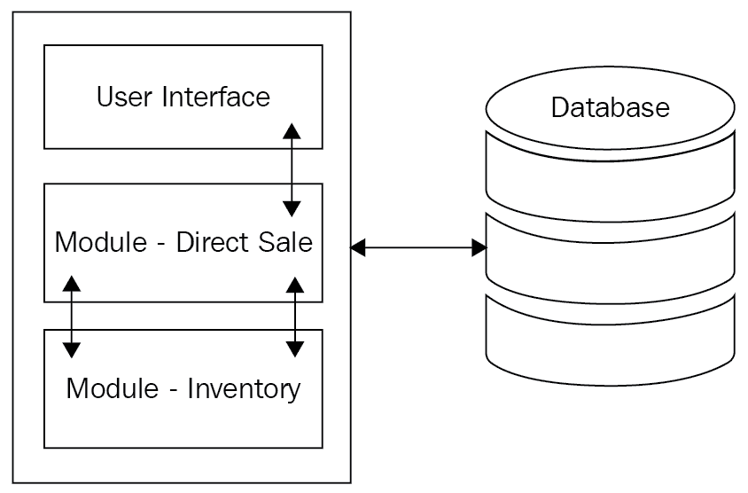
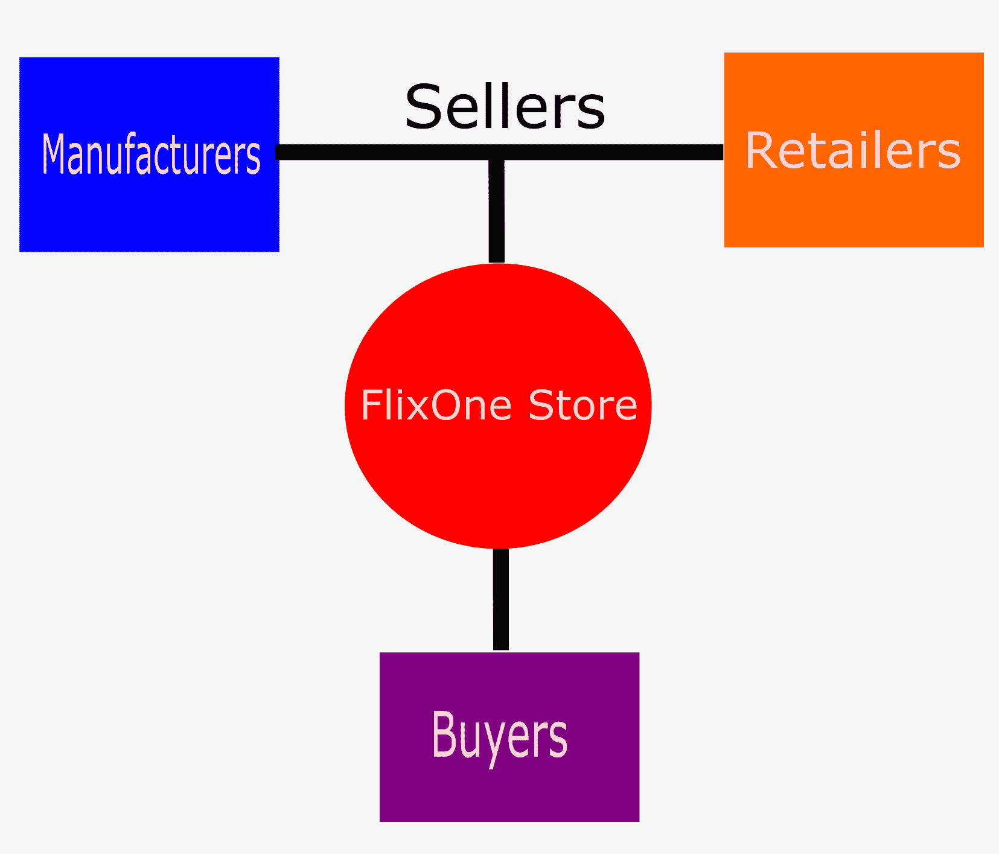
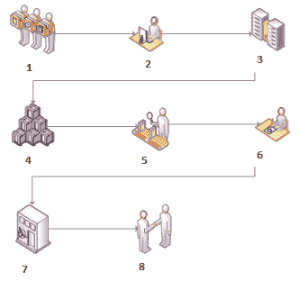
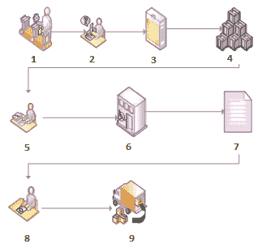
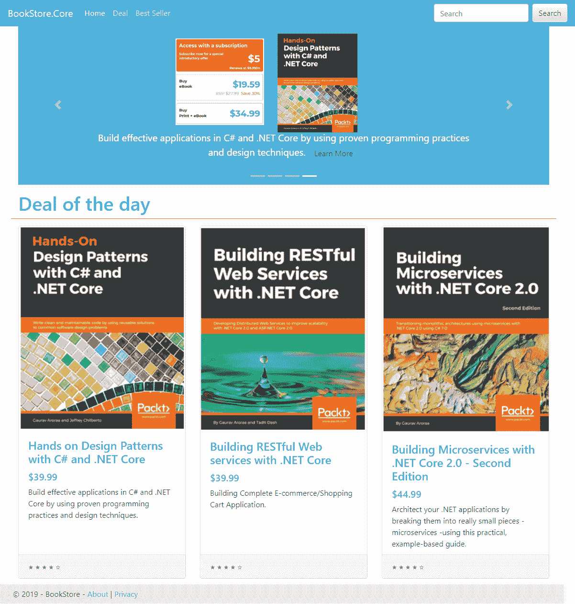
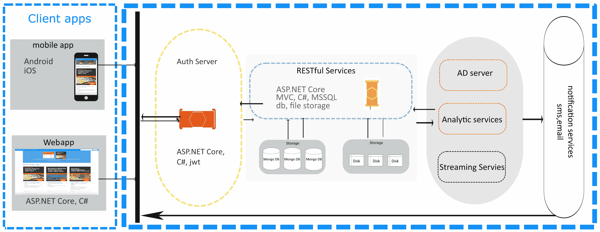
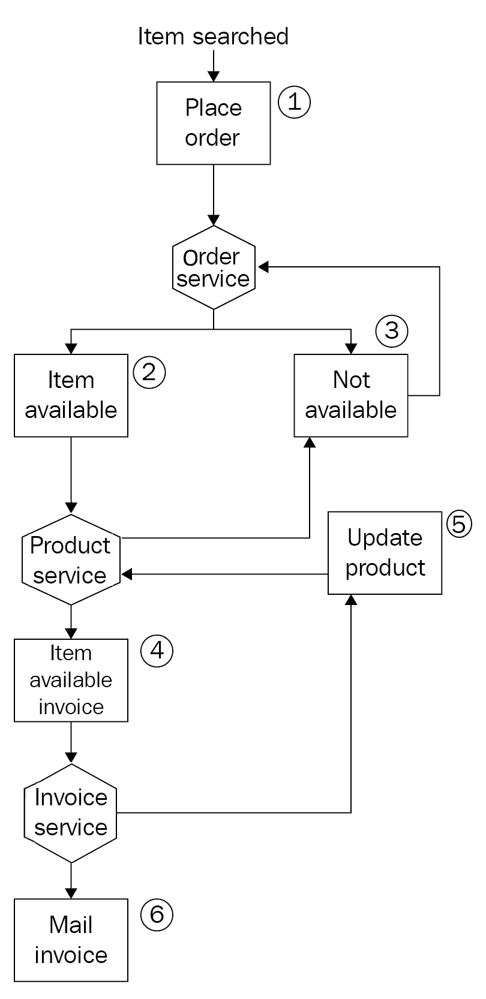

# 构建微服务应用程序

在应用程序开发领域，开发人员遵循各种方法，包括设计模式、设计原则等，来深入研究他们的问题解决方案，并做出好的应用程序。根据业务需求，当业务方法发生变化时，或者当开发人员必须遵循实际的业务需求来将应用程序与业务及其客户同步时，需求就会发生变化。当涉及到制作满足业务需求的应用程序时，有很多挑战。

发展的世界是不断发展的技术的海洋。每一个新的一天都伴随着新的流行语，预示着新技术的到来。如今，微服务架构风格已经变得很出名，它帮助我们满足了几乎所有的需求。在我看来，我们可以这样说:

"Microservices is a culture where you follow various patterns: approaches to make sure that an application is easily available to developers and their end users. This is so that developers can work in parallel on different modules or on parts of the applications, and so the end user can use hassle-free applications."

到目前为止，在这本书里，我们已经讨论了各种例子，通过观察各种方法、模式等等。本章将指导您如何创建这样一个示例应用程序。在介绍完我们之前介绍的所有概念和功能之后，您将能够创建一个完整的微服务应用程序。

本章将涵盖以下主题:

*   引入扼杀者模式
*   重新审视应用程序
*   了解应用程序的业务需求
*   构建我们的应用程序

# 技术要求

本章包含各种代码示例来解释其中的概念。代码一直保持简单，只是为了演示。大多数示例都涉及一个. NET Core 控制台应用程序，它是用 C#编写的。

要运行和执行本章中的代码，您需要具备以下条件:

*   Visual Studio 2019 或更高版本
*   。NET Core 3.1 已经建立

# 安装 Visual Studio 2019

要运行本章中的代码示例，您需要安装 Visual Studio 2019 或更高版本(我们首选的 IDE)。为此，请遵循以下说明:

1.  从以下链接下载 Visual Studio 2019(社区免费):[https://docs . Microsoft . com/en-us/visualstudio/install/install-Visual Studio](https://docs.microsoft.com/en-us/visualstudio/install/install-visual-studio)。
2.  遵循中提到的安装说明。
3.  将提供多个版本的 Visual Studio。在本章中，我们将使用 Visual Studio for Windows。

**Setting up .NET Core:** If you don't have .NET Core 3.1 installed, you need to download it from [https://dotnet.microsoft.com/download/dotnet-core/3.1](https://dotnet.microsoft.com/download/dotnet-core/3.1).

# 设置 Azure

要使用本章中的代码示例，您需要一个有效的 Azure 帐户。如果你有一个有效的帐户，你可以忽略这个部分。否则，以下步骤将帮助您设置 Azure 帐户:

1.  在[https://signup.azure.com/](https://signup.azure.com/)注册一个免费的 Azure 账户。
2.  按照该页上显示的说明进行操作。
3.  你将需要一张有效的信用卡来验证你的支付方式，以防你想使用任何付费服务(你只需要使用这本书的现收现付方式)。如果你是一名学生或教育家，在 https://azure.microsoft.com/education/有一个替代的免费版本。

The complete source code is available here: [https://github.com/PacktPublishing/Hands-On-Microservices-with-CSharp-8-and-.NET-Core-3-Third-Edition/tree/master/Chapter%2011](https://github.com/PacktPublishing/Hands-On-Microservices-with-CSharp-8-and-.NET-Core-3-Third-Edition/tree/master/Chapter%2011)[.](https://github.com/PacktPublishing/Hands-On-Microservices-with-CSharp-8-and-.NET-Core-3-Third-Edition/tree/master/Chapter%2011)

# 重新审视整体架构风格和 SOA

在[第 1 章](01.html)*微服务介绍*中，我们了解到微服务架构消除了**面向服务架构** ( **SOA** )的大部分缺点。它也比 SOA 服务更面向代码。在您继续了解架构之前，您需要了解导致其存在的两个重要架构:

*   整体建筑风格
*   前进速度

我们大多数人都会意识到这样一个场景，在企业应用程序开发的生命周期中，决定了一个合适的架构风格。然后，在不同的阶段，最初的模式被进一步改进和调整，做出了一些改变来应对各种挑战，例如部署复杂性、大代码库和可伸缩性问题。这正是单体架构风格如何演变成 SOA，进而导致微服务的方式。

We discussed SOA and the monolithic architecture in [Chapter 1](01.html), *An Introduction to Microservices*. You can skip this section if you understand this in full. However, if you want to learn more than what we have in this chapter, please refer back to the aforementioned chapter.

单体建筑风格是一种传统的建筑类型，在业界得到了广泛的应用。monolithic 一词并不新鲜，它是从 UNIX 世界借用来的:

上图显示，在单片架构中，我们可以有各种组件，包括:

*   **用户界面**:处理所有的用户交互，同时用 HTML、JSON 或任何其他首选的数据交换格式(在 web 服务的情况下)进行响应。
*   **业务逻辑**:这包括应用于输入的所有业务规则，这些输入是以用户输入、事件和数据库的形式接收的。
*   **数据库访问**:这包含了访问数据库的完整功能，用于查询和持久化对象。一个被广泛接受的规则是，它是通过业务模块使用的，而不是直接通过面向用户的组件。

根据我们的业务需求，我们将面临多种情况，这导致我们需要应对许多挑战。在这方面，我们可能面临以下挑战:

*   **大代码库**:这是一个代码行比注释多很多的场景。由于组件是互连的，我们将不得不处理重复的代码库。
*   **业务模块太多**:这是针对同一系统内的模块。
*   **代码库复杂性**:由于其他模块或服务需要修复，这导致代码被破坏的几率更高。
*   **复杂的代码部署**:您可能会遇到需要整个系统部署的微小变化。
*   **影响整个系统的一个模块故障**:这是关于相互依赖的模块。除此之外，我们将有直接相互依赖的模块。然而，我们也会有*隐藏的依赖关系*，在它崩溃之前我们并不知道它(例如，如果有人忘记在项目文档中记录它)。另一方面，我们可以有间接的依赖。例如，我们可能有两个在同一个 IIS 主机上运行的虚拟目录，其中一个覆盖了部分根配置，尽管从表面上看，它们并不相互依赖。
*   **扩展性**:这是整个系统都需要的，不仅仅是其中的模块。
*   **模块间依赖**:这是由于紧耦合。这将导致任何模块的操作发生重大变化(如果需要)。

以上图中提到的方式使用一个服务或多个服务的系统称为 SOA 系统。SOA 和 monolithic 的主要区别不是它产生一个或多个程序集，而是它突出了应用程序运行的过程。由于 SOA 中的服务是作为一个独立的过程运行的，因此相比之下，SOA 的伸缩性更好。在这种方法中，服务可以是 RESTful 或 ASMX web 服务。

In the microservice architecture, services are small, independent units with their own persistent stores.

使用微服务架构风格的应用程序，我们可以获得许多与它们的开发和业务实现相关的好处。让我们看几个:

*   **扩展的性价比**:你不需要投入很多，就可以让整个应用可扩展。就购物车而言，我们可以简单地对产品搜索模块和订单处理模块进行负载平衡，同时省去不太常用的操作服务，如库存管理、订单取消和交货确认。
*   **明确代码边界**:这个动作应该与组织的部门层级相匹配。在大型企业中，不同的部门赞助产品开发，这可能是一个巨大的优势。
*   **更容易的代码更改**:这是以一种不依赖于其他模块的代码，只实现隔离功能的方式完成的。如果做得对，那么一个微服务中的变化影响另一个微服务的机会是最小的。
*   **轻松部署**:由于整个应用程序更像是一组相互隔离的生态系统，如果需要，可以一次部署一个微服务。其中任何一个的失败都不会使整个系统瘫痪。
*   **技术适配**:你可以一夜之间将单个微服务或者一大堆微服务移植到不同的技术上，而你的用户甚至不知道。希望您不要指望我们会告诉您需要维护这些服务合同。
*   **分布式系统**:这里隐含的意思，但需要提醒一句。确保异步调用使用良好，并且同步调用不会阻塞整个信息流。很好地使用数据分区。我们稍后再谈这个，所以暂时不要担心。
*   **快速市场反应**:世界是一个竞争的地方，这是一个确定的优势。如果您对新功能请求的响应速度较慢，或者您在系统中采用新技术的速度较慢，用户往往会很快失去兴趣。

This section exists to let you revisit what we have learned about so far; you can easily skip this section if you wish.

# 引入扼杀者模式

在本书中，我们从整体应用程序过渡到基于微服务的应用程序，开始了我们的学习之旅。这种转变遵循扼杀者模式，我们将在本节中讨论。

简而言之，我们可以将扼杀者模式定义为通过在引入新服务/应用程序的同时替换特定功能来帮助我们持续迁移遗留应用程序(在我们的例子中，是整体应用程序)的模式。使用这种模式，我们用新的系统替换了之前识别的遗留应用程序的特性。综上所述，扼杀者模式就是在将所有必需的特性/功能迁移到新系统之后，让旧系统退役。

什么时候应该使用扼杀者模式？当您需要迁移现有的应用程序时，应该使用这种模式，在将特性/功能添加到新的系统或架构之前，缓慢地识别它们。

在本章中，我们将按照以下主题构建示例应用程序:

1.  讨论示例应用程序。
2.  业务需求是什么？
3.  为什么我们需要申请？
4.  结语。

在接下来的章节中，我们将更详细地探讨这些步骤，并且我们将编写一个基于微服务架构风格的简单应用程序。

# 了解应用程序的业务需求

这一部分是关于创造想象中的应用和应用背后的业务。让我们访问我们想象中的应用程序，我们将其命名为 FlixOne Store。

FlixOne Store 是一家基于定制软件的点播商店提供商。这款定制软件的目的是通过克服营销团队过去面临的技术挑战来拓展业务(更多信息，请参考[第 1 章](01.html)、*微服务简介*)。最终用户登陆了该应用程序，他/她成功地满足了我们在商店市场中的一个需求:购买 FlixOne Store 中列出的各种商品。

FlixOne Store 是一个软件平台，不仅满足单个用户的需求和需求，也满足需要在线商店来销售产品/商品的零售商的需求和需求。FlixOne 也是一个支持在线销售和购买的平台。这样，零售商可以通过额外努力推广他们的产品/商品来赚钱。FlixOne 是一个迎合全球市场的解决方案，在这个市场中，行业的双方——零售商和制造商——建立了一个买方-卖方关系模型:

上图展示了整个 FlixOne 软件的全貌。在这里，我们很容易理解 **FlixOne Store** 提供的应用背后的商业理念:一个同时面向**卖家**和**买家**的平台。**厂商**和**零售商**都可以注册为卖家，而买家则是打算购买这些物品的最终用户。

**Business model**: FlixOne charges a commission off each transaction and provides a way for the sellers to manage products. FlixOne allows us to maintain the inventory that's uploaded by the sellers, as well as the ability to schedule deliveries, monitor product types and levels, and so on.

下图显示了 FlixOne 商店软件中卖家的流程:

上图定义了使用 FlixOne 商店的卖家的流程工作流程，如下所示:

1.  卖家参观了 FlixOne 商店。
2.  卖家在 FlixOne 商店注册。
3.  然后卖家登记他们的产品类型。
4.  卖方创建库存。
5.  清单由 FlixOne 管理员验证/批准。
6.  FlixOne 要求卖方批准库存。

7.  卖方支付注册费。
8.  FlixOne 与卖家达成了合作协议。

下图显示了购买者在 FlixOne 商店软件中的流程:

以下是使用 FlixOne 商店的买家的流程工作流程，如下所示:

1.  买家参观了 FlixOne 商店。
2.  买方在 FlixOne 商店注册。
3.  提供可用的服务。
4.  买方检查他们想要购买的产品的可用库存。
5.  买方下订单。
6.  买方支付他们的物品。
7.  出现了智能合约流程。
8.  向买方提供最近交易的确认。
9.  物品被运送到所需的位置。

FlixOne 商店系统的完整图片包含以下内容:

*   **管理面板**:这是由 FlixOne 团队管理的后端。
*   **卖家面板**:这是所有卖家的界面，让他们可以管理自己的产品和库存，包括销售等等。
*   **用户面板**:这个界面是准备购买物品的终端用户的主界面。

以下是我们想象中的用户面板:

前面的截图显示了想象中的用户界面，在那里可以购买各种书籍。这个快照是实际应用程序的可视化，并且会有不同的输出。

在下一节中，我们将讨论技术堆栈和应用程序的流程。

# 重新审视应用程序

本节将探讨我们将要开发的内容。在本书中，我们使用了各种 API 来展示其中的代码示例。在本节中，我们将概述我们的示例应用程序，它是各种流程的组合，最终用户进入应用程序并处理购书请求。

下图概述了我们的应用程序:

上图是我们的示例应用程序的功能概述的图示，它显示了包含以下项目的流程:

*   **客户端应用**:移动和网络应用是终端用户将要使用的客户端应用。我们的代码存储库随 web 应用程序一起提供。
*   **授权服务器**:验证用户并生成 JWT 令牌，以便进一步处理。
*   **RESTful 服务**:这些是将帮助我们的应用程序的各种服务。这些服务有自己的数据库。文件存储将是一个 CDN 或单独的服务器，用于存储各种内容，包括文档。
*   **通知服务**:这些是外部服务，用于生成**一次性密码** ( **OTP** )、认证用户并通知他们已经生成的订单、他们已经预订的项目等。

除此之外，我们的图表还包含**广告服务器**、**分析服务**和**流媒体服务**，如果我们需要播客我们的一些视频，这些都是必需的。为此，我们需要流媒体服务。到目前为止，我们的代码没有实现这些服务。

在下一节中，我们将讨论**最小可行产品** ( **MVP** ，这样我们就可以创建我们的 FlixOne 应用程序。

# 构建应用程序

在前几节中，我们讨论了 FlixOne 软件的全貌。这个软件很大，我们不打算在这里全部开发；相反，我们将定义 MVP 来展示软件的实力。这个软件可以扩展到任何级别。

By taking an MVP approach, the scope of a piece of work is limited to the smallest set of requirements, in order to produce a functioning deliverable. MVP is often combined with Agile software development by limiting requirements to a manageable amount that can be designed, developed, tested, and delivered. This approach lends itself well to smaller websites or application development, where a feature set can be progressed all the way to production in a single development cycle.

我们将开发一个具有以下功能的 FlixOne Store 应用程序:

*   登录功能
*   注册功能
*   项目搜索功能
*   订单功能
*   通知功能

让我们看一下下面的图表，它定义了我们搜索功能的流程:

在上图中，服务由六边形描述，而事件由矩形框表示。如上图所示，该流程描述了客户在搜索了他/她正在寻找的商品后下订单的场景。事情是这样的:

1.  **下订单**事件升级为**订单服务**。
2.  针对此事件，我们的服务分析了订单项目和数量等参数，并将**可用项目**事件提升为**产品服务**。

3.  从这里开始，有两种可能的结果:要么请求的产品可用并具有所需数量，要么是**不可用**或没有所需数量。
4.  如果物品可用，**产品服务**会向**发票服务**发出一个名为**生成发票**的事件。由于开具发票意味着确认订单，发票上的项目将不再有库存；我们需要注意这一点，并相应地更新库存。
5.  为此，我们的发票服务提出了一个名为**的事件，将产品数量**更新为**产品服务**，并满足了这一要求。为简单起见，我们不再赘述由谁来处理**邮寄发票**事件。
6.  可能会出现商店没有产品的情况。根据我们的业务需要，我们必须将产品标记为一有货就通知我。这完全取决于最终用户；也就是说，如果最终用户选择了该选项，那么他/她将在产品可用时收到通知。对于售前产品，也会触发相同的操作，正如 FlixOne Store 的售前产品所表示的那样——已经添加了一个产品，但还不能购买。

这就完成了我们的 MVP，并展示了如何创建 FlixOne Store 应用程序。我们没有添加任何代码，因为我们已经在本书中讨论了我们需要的代码(服务)。您可以从本书的代码库中获得完整的应用程序代码。

# 摘要

本章的目的是创建一个示例应用程序。通过这样做，我们已经讨论了应用程序的业务需求。然后，通过定义我们的 MVP，我们理解了应用程序的流程，并了解了应用程序的工作模型。

到目前为止，在我们编写应用程序的旅程中，我们已经经历了不同的阶段。我们探索了是什么导致了微服务的出现，并研究了利用它们的各种优势。我们还讨论了各种集成技术和测试策略。

在下一章中，我们将重新审视和讨论我们应用程序的每一个方面，从整体开始，然后我们将过渡到审查微服务应用程序。