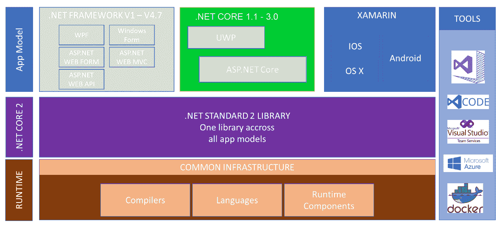
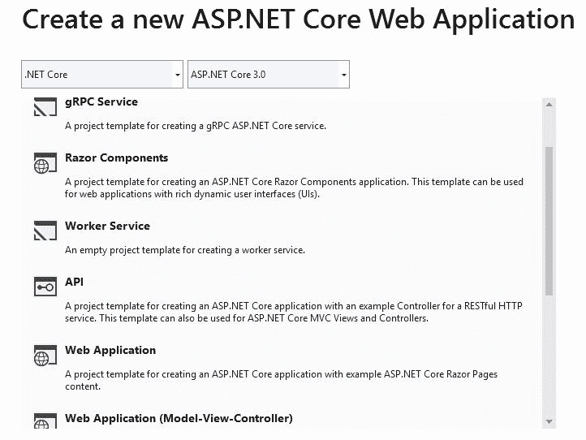

# 什么是 ASP.NET 核心 3？

世界上最早的 web 服务器形式是在 1990 年左右出现的。它被称为**CERN httpd**，由 Tim Berners Lee 开发，这个名字与**万维网**（**WWW**的起源相当接近。

最初，web 服务器的基本形式是用来处理只希望将文件内容作为响应的请求，但随着时间的推移，人们的期望也有所增加，最初对静态文件的需求有所改变，而今天的动态 web 应用要求更高。

如今，关于 web 服务器与 web 应用的职责，存在着模糊的界限，随着我们对 ASP.NET Core 3 作为 web 应用框架的更多了解，这些界限变得更加清晰。值得注意的是，这个框架和其他并非源于 Microsoft 的框架（如 RubyonRails）充当开发人员和 web 服务器之间的缓冲区。

与以前的其他框架相比，ASP.NET Core 3 具有许多优点，当我们进一步了解其功能以及此版本的新增功能时，将在后续章节中详细阐述这些优点。

在本章中，我们将介绍以下主题，其中明显偏向于 ASP.NET Core 3：

*   ASP.NET 的历史
*   ASP.NET 核心 3 功能
*   ASP.NET Core 3 的新增功能是什么？
*   跨平台支撑
*   微服务体系结构
*   性能和可扩展性
*   技术限制
*   何时选择 ASP.NET Core 3

# ASP.NET 的历史

这一切都始于 90 年代中期的**活动服务器页面**，当时微软试图跟上通过网络提供动态内容的热潮，这显然影响了**活动服务器页面**的名称，即今天的 ASP。

与任何有价值的技术一样，ASP.NET 也随着时间的推移而不断发展，其中一个主要的变化是在 2002 年前后引入了**ASP.NET Web 表单**，这受到了微软另一个应用框架（称为**Windows 表单）的成功的严重影响**，或更常见的称为**WinForms**。

随着在 WinForms 中轻松创建 HTML 表单和控件，随之而来的是大量不必要的 HTML 和 JavaScript，它们降低了页面加载速度，还有其他因素，如视图状态和页面生命周期，它们进一步降低了业务应用的速度。这导致了一系列 ASP.NET MVC 版本的引入，这些版本试图解决 ASP.NET Web 表单存在的一些问题。

ASP.NET MVC 也有助于迎合良好编程实践的一个主要原则，即优先选择**关注点分离**（**SoC**），而不是 ASP.NET Web 表单及其文件后面的**代码中明显存在的紧密耦合。这本身就带来了连锁反应的好处，允许测试驱动的开发，并总体上提高了可测试性。**

2016 年，随着第一个版本 1.0 中的**ASP.NET Core**的发布，另一个重大转变发生了。在撰写本书（2019 年）时，该版本一直发展到第 3 版。在这一转变中，微软几乎完全重写了 ASP.NET，主要是去除了对`System.Web`**命名空间**的依赖，这就需要依赖**互联网信息服务**（**IIS**）。由于 IIS 仅与 Windows 操作系统兼容，独立于它允许 ASP.NET Core 真正跨平台。

必须提到的是，2014 年左右，随着业务动态的变化，微软明显地接受了**开源**，尽管 ASP.NET 核心的最大卖点之一是它是开源的，但我们需要注意的是，即使是以前版本的 ASP.NET，包括 MVC 和 web API，最终也以开源的形式发布，任何人都可以为其持续发展做出贡献：

在版本 3 之前，ASP.NET Core 应用运行在.NET Core framework 和完整的.NET framework 上，但 Microsoft 决定，从版本 3 开始，ASP.NET Core 将只运行在.NET Core 上，以便更好地利用新的开发，而不受旧功能的束缚。

在下图中，您可以看到不同的.NET Framework 版本和组件是如何协同工作的：

这本书是关于 ASP.NET 核心的，更具体地说，是关于它的最新版本 3（在撰写本文时）。因此，前面简要提到的先前版本足以为我们提供上下文，但从现在起，我们将更多地关注 ASP.NET 核心。

本书的重点仍然是 ASP.NETCore3，它不同于.NETCore3；前者是应用框架，后者是运行时。传统上，ASP.NET 核心应用可以在.NET 核心以及其他.NET Framework 版本上运行，这突出表明了它们是不同的。

很容易理解为什么有些人会混淆两者，因为 ASP.NET 核心应用也可以是.NET 核心应用，就像它可以是.NET Framework 4.8 应用一样。

在决定使用什么框架开发新的应用时，需要注意的是，Microsoft 计划在 ASP.NET Core 的未来版本中只在.NET Core 上运行，而不在其他.NET framework 版本上运行。

在简要介绍了 ASP.NET Core 3 的历史之后，让我们在下一节中了解一下定义应用框架的功能。

# ASP.NET 核心 3 功能

ASP.NET Core 2.0 中的`Microsoft.AspNet.Core.All`包包含单个库中的所有功能。它包括身份验证、**模型视图控制器**（**MVC**）、剃须刀、监控、红隼支持等等。

自 ASP.NET 核心版本 2.1 以来，不鼓励将`Microsoft.ASP.Net.Core.All`作为包引用，这适用于当前版本 3。

我们仍然可以通过使用补丁来使用名称空间，但首选的替代品是`Microsoft.AspNetCore.App`共享框架，详细说明见[第 4 章](04.html)、*通过自定义应用实现 ASP.NET Core 3 的基本概念：第 1 部分*，当我们阐述 ASP.NET Core 3 的基本概念时。

为了使 ASP.NET Core 尽可能轻量级，或许为了更好地控制，Microsoft 决定只让内部开发和维护的程序集位于共享框架中，并排除使用`Microsoft.AspNet.Core.All`命名空间的第三方程序集。

值得注意的是，从该框架中删除的非完全由微软所有，因此也不完全由微软控制的人员伤亡包括 Json.NET。然而，我们仍然可以通过添加它们的引用来使用它们。

ASP.NET Core 3 还允许我们使用现成的模板创建遵循 MVC 体系结构风格的应用，该模板可供使用，我们在本书后面的章节中专门介绍了这一主题。

此外，我们可以构建基于 HTTP 的 web 服务以及 RESTful 服务。下一节将介绍 ASP.NET Core 3 的新增功能，即 ASP.NET Core 3 附带的**gRPC**模板。

ASP.NET Core 3 完全支持 Razor，它包含用于创建视图和标记帮助程序的高效语言，允许从服务器端编写逻辑以生成可在 Razor 视图中使用的 HTML。

在客户端开发方面，ASP.NET Core 3 与 Microsoft 外部的多个框架（包括 Angular、React 和 React-Redux）集成并协同工作，但必须注意的是，这些框架将变得越来越不突出，Microsoft 显然试图通过内部剃须刀组件处理类似的功能，另称为**Blazor**。

此外，ASP.NET Core 还提供了以下基本改进：

*   ASP.NET MVC 和 web API 已组合到一个框架中。
*   基于环境的配置系统已准备好进行云托管。
*   依赖项注入功能是默认的。
*   您可以在 IIS、Docker、云中甚至在您自己的进程中托管相同的应用，也可以自行托管。
*   有新的工具简化了现代 web 开发。
*   有一个简化的`csproj`文件，使它更容易与 Visual Studio 以外的开发环境（例如，在 Linux 和 macOS 上）一起工作。
*   `Startup.cs`已通过将日志记录和配置移动到主机生成器初始化中来简化。
*   ASP.NET 核心应用现在可以在 Visual Studio for Mac 上开发。

我们看到的功能也可以应用于 ASP.NET Core 3 之前的其他版本，但其他功能仅适用于 3 版，将来可能更高版本。我们将在下一节中介绍它们。

# ASP.NET Core 3 的新增功能是什么？

ASP.NET Core 3 存在于一个生态系统中，其他一切都在发生变化，包括.NET Core 运行时（目前也是版本 3）和 C 语言本身（版本 8）。有了所有这些变化，ASP.NET Core 也适应了生态系统的变化，不仅适应了与 Microsoft 相关的变化，还考虑了开发人员社区的总体情况，例如，将 Angular 模板更改为 Angular 7 就是明证。

ASP.NET Core 3 共享框架已经变得更加轻量级，与实体框架核心、Roslyn 代码分析和 Json.NET 等其他非核心组件分离。

这样的更改不可避免地会影响到连锁反应中的其他更改，例如，强制删除**运行时编译**，这显然是由 Roslyn 实现的，因此，ASP.NET Core 3 比以前的版本要轻得多。

ASP.NET 核心从 1.0 中作为包引用演变为 2.1 中的共享框架。然而，在 3 中，我们不再通过`<PackageReference>`元素引用`Microsoft.AspNetCore.App`，该元素自然被替换为`<FrameworkReference>`。

如果您的项目引用了`Microsoft.NET.Sdk.Web`SDK，那么它将自动访问共享框架。通常引用的 API，如 MVC、Razor 和 Kestrel 等，不再被引用为**NuGet**包，但作为开发人员，我们仍然可以通过`<FrameworkReference>`元素访问`Microsoft.AspNetCore.App`。

ASP.NET Core 3 试图改进与**OpenAPI**的集成，并引入了一个生成 API 客户端的系统，该系统可轻松与**NSwag**和其他代码生成器集成。

以下屏幕截图显示了从 ASP.NET Core 版本 3 引入的一些新模板：

对 ASP.NET Core 3 最大的介绍之一是**C#Razor 组件**，迄今为止，它被称为 Blazor。它是作为一个独立的实验框架单独开发的，并且伴随着一个新的`.razor`扩展，它帮助编译器识别带有 Razor 组件的文件。

通常，JavaScript 代码是大多数浏览器能够理解和执行的代码，但 Razor 组件带来的是能够在浏览器中运行 C#的能力。我们将在[第 6 章](06.html)*介绍剃须刀组件和信号器*中进一步讨论剃须刀组件。

ASP.NET Core 3 默认附带一个**工作者服务**模板。如果您有桌面开发背景，您将熟悉 Windows 服务，对于那些有 Linux 经验的人来说，您也会熟悉类似的守护进程。作为 web 环境的一个答案，ASP.NET Core 3 为我们引入了一个模板，以便我们能够开发辅助服务，以满足长期运行的服务。

ASP.NET Core 3 添加的另一个令人兴奋的新功能是**gRPC 服务模板**，它将受到经常使用微服务的开发人员的欢迎。**gRPC**源于 Google，在 HTTP/2 上的服务对服务通信中，与普通的 XML/JSON 序列化相比，它使用了更轻量级的协议缓冲区序列化。这方面的演示将包含在[第 8 章](08.html)*创建 Web API 应用*中。

正如 ASP.NET MVC 以前的用户所知，路由模型已经有了显著的改进，主要是它如何使用中间件进行操作，恰当地称为**端点路由**；它在 2.2 中介绍，但在 3 中具体介绍的是信号机和 Razor 组件与**端点路由**的集成。更多信息将在[第 6 章](06.html)*中介绍剃须刀组件和信号器。*

现在我们已经看到了与 ASP.NET Core 3 相关的许多重要功能，有一个功能值得特别提及和具体介绍，因为它的重要性。在当今多样化的技术平台中，支持不同的平台非常重要，因此我们将在下一节中研究 ASP.NET Core 3 如何为跨平台支持做好准备。

# 跨平台支撑

如前所述，ASP.NET Core 3 框架从一开始就考虑到了跨平台支持。它支持多种操作系统和技术，如 Windows、Linux、macOS、Docker、Azure 等。

ASP.NET Core 3 目前支持以下 Linux 发行版：

*   Ubuntu 14、16
*   Linux Mint 17、18
*   Debian 8
*   软呢帽
*   CentOS 7.1 和 Oracle 7.1
*   SUSE 企业服务器 64 位
*   openSUSE 64 位

关于 macOS，它目前只支持以下内容（以后可能会添加其他版本）：

*   macOS 10.11
*   macOS 10.12

对于应用开发，您可以使用 Visual Studio 或 Visual Studio 代码在 Windows 上进行开发，然后将 ASP.NET Core 3 应用部署到目标系统。

Note that the target system can use a completely different underlying operating system. For instance, you can develop and test on Windows and then deploy your applications to a Linux server for performance, stability, or cost reduction reasons.

如果您选择这样做，当然可以使用几个特定于系统的源代码编辑器在 Linux 和 macOS 上直接开发。例如，在 Linux 上，您可以使用 Visual Studio 代码、Vim/Vi、Sublime 或 Emacs。在 macOS 上，您可以使用 Visual Studio for Mac、Visual Studio 代码或任何其他特定于 macOS 的文本编辑器。

不过，Visual Studio 2019 或 Visual Studio Code developer 环境将是首选，因为它们提供了高效、能够调试和理解代码以及在其中轻松导航所需的一切。这就是为什么我们将在本书的其余部分使用这些 IDE。

构建应用后，可以使用多个 web 服务器来运行它。以下是一些例子：

*   阿帕奇
*   非法移民
*   红隼自寄主
*   NGINX

跨平台是一个巨大的因素，我们已经看到 ASP.NET Core 3 是如何满足它的，但在软件工程界还有一个流行词叫微服务。在下一节中，让我们看看 ASP.NET Core 3。

# 微服务体系结构

微服务架构（Microservice architecture）最常被称为*微服务*，是当前一种以模块化方式设计和构建软件应用的常用方法，考虑到单一责任原则。它强调在实现面向服务的业务解决方案时，具有与其他服务不紧密耦合的服务模块。微服务可用于构建电子商务系统、商业应用和物联网。您会发现它们是非常流行的实现，尤其是在使用分布式应用时。

当您想要采用此系统体系结构时，ASP.NET Core 3 是最佳候选。ASP.NET Core 3 框架是轻量级的，它的 API 表面可以最小化到特定微服务的范围内。微服务体系结构还允许您跨服务边界混合各种技术，从而逐步过渡到 ASP.NET 核心。

请注意，使用 ASP.NET Core 3 构建的微服务可以与使用其他技术（如完整的经典.NET Framework、Java、Ruby，甚至其他更传统的技术）的服务协同工作。当您需要逐步将单片应用转换为更多（微型）面向服务的应用时，这是一个很大的优势。

您不受特定基础设施的约束；相反，您有很多选择，因为 ASP.NET Core 3 支持您现在可以想到的几乎所有技术。此外，您可以在需要时修改基础结构，这样就不会对基于基础结构开发的应用进行技术锁定。

高效、大规模、本地和云中编排和管理用 C#编写的微服务的主要选择应该是 Microsoft Service Fabric，也称为 Azure Service Fabric。它正是为此而构思的，并且已经被微软用于各种 Azure 服务（如 SQL 数据库）很多年了。

microservicesdocker 容器方法也可能适合您的需要，我们将在下一节中解释它的用例。总之，ASP.NET Core 3 是在任何技术环境中实现和托管微服务的理想选择。

# 使用容器

容器目前很流行，因为它们提供了一种高效、轻量级和自包含的方法，可以在重用底层操作系统文件和资源的同时打包应用及其依赖项。

它们非常适合微服务体系结构，但也可以用于任何其他应用原型。它们与 ASP.NET Core 3 应用配合得非常好，因为这两个应用都考虑到了模块化、性能、可扩展性、轻量级和效率。

我们必须注意，目前有不同的容器可供开发人员社区使用，如 CoreOS rkt、Apache Mesos 容器器和**LXC**（简称**Linux 容器**），但目前最流行的是 Docker 容器。

Note that Docker container images including ASP.NET Core 3 applications are much smaller than images with classic ASP.NET applications, meaning that they are faster to deploy and to start up.

Docker 容器和 ASP.NET Core 3 框架都提供了完整的跨平台支持（Windows、Linux 和 macOS）。此外，您可以在本地和云中托管容器。例如，您可以通过**基础设施即服务**（**IaaS**部署或通过**Azure 容器服务**使用 Azure，后者正被弃用以支持**Azure Kubernetes 服务**，它还允许混合和匹配不同的操作系统和技术。

微服务体系结构、跨平台支持和其他功能可能会使 ASP.NET Core 3 成为一个很好的框架，但如果它拥有如此强大的功能而没有相应的强大性能，它又有多好呢？ASP.NET Core 3 如何处理需要增长的应用？在下一节中，我们将研究 ASP.NET Core 3 的性能和可伸缩性。

# 性能和可扩展性

如果您需要为高可扩展性场景提供尽可能好的性能和支持，那么您绝对需要使用 ASP.NET Core 3 和当前版本为.NET Core 3 的底层.NET Core Framework。

ASP.NET Core 3 是为高性能和高可扩展性场景而从头构建的。它在这些领域非常出色，可以被认为是最佳选择。

它比经典的 ASP.NET 快很多倍，可以被认为是目前可用的.NET 世界中最快的 web 应用运行时！

如果我们要通过 TechEmpower 所做的测试，测试不同 web 框架的性能，可以在这里找到：[https://www.techempower.com/benchmarks](https://www.techempower.com/benchmarks) 您会注意到，ASP.NET Core 肯定会在其.NET 同行中名列前茅，当然，与其他提供商的竞争对手框架相比，它的表现也相当出色：

您可以使用 Microsoft 的 ASP.NET Core 基准测试项目中的详细信息来运行 ASP.NET Core 基准测试，请参见：[https://github.com/aspnet/benchmarks](https://github.com/aspnet/benchmarks) 。

此外，它还为性能和可扩展性极其重要的微服务体系结构提供了最佳解决方案。在消耗如此低的系统资源的同时，没有任何其他技术比这更高效，这也降低了基础设施和云托管成本。

到目前为止，我们已经看到了使用 ASP.NET Core 3 作为一个平台是多么好，具有前面提到的所有功能，但不幸的是，该平台及其运行时不支持其他技术。我们将在下一节中介绍它们。

# 技术限制

请仔细阅读本节中显示的技术。如果您在当前应用中使用此处列出的技术或框架，但该技术或框架（尚未）受支持，则您可能会发现很难甚至不可能迁移到 ASP.NET Core 3。

并非所有当前的.NET Framework 技术都可以在 ASP.NET Core 3 中使用，有些技术可能永远无法移植，因为它们不符合新的.NET Core 特定范例和模式。

# ASP.NET Core 和.NET Core 中未直接找到的常用技术

下面的列表显示了 ASP.NET Core 和.NET Core 中未直接找到的最常用技术，尽管有些技术可以通过多目标功能使用：

*   **ASP.NET Web 表单应用**：传统 Web 表单技术仅在使用完整的经典.NET 框架时可用；不能对这些类型的应用使用 ASP.NET Core 和.NET Core。
*   **ASP.NET 网页应用**：它们本身不包括在 ASP.NET Core 3 中，但可以使用 Razor 网页引擎提供相同的功能。
*   **WCF 服务**：ASP.NET Core 3 包含用于访问 WCF 服务的 WCF 客户端，但不支持创建 WCF 服务。

并非所有可用于 ASP.NET Core 3 的模板都支持所有主要的.NET 语言；例如，VB.NET 唯一可用的模板是 GtkSharp，F#还有一些模板，包括 ASP.NET 核心 web API 和 F#TypeProvider 模板。更全面的模板列表可在以下链接中找到，该模板适用于何种语言：[https://github.com/dotnet/templating/wiki/Available-templates-for-dotnet-new](https://github.com/dotnet/templating/wiki/Available-templates-for-dotnet-new) 。

# 何时选择 ASP.NET Core 3

ASP.NET Core 3 和底层的.NET Core Framework 运行时确实提供了一些主要的增强和性能改进，但仍有一些特定的场景，在这些场景中，新的应用模式不适用，而完整的.NET Framework 将是最好的，有时甚至是唯一的选择。

从一开始就将整个现有应用迁移到 ASP.NET 核心可能很困难，甚至不可能做到。您应该考虑如何逐步转换应用，以降低失败或过于复杂的风险，并给自己时间真正理解新的模式和范例。

例如，您可以先在所有新开发中只使用 ASP.NET Core 3，然后再看看如何在以后迁移遗留代码，有时甚至可以不迁移，因为迁移它不会带来任何实际好处。如果你真的对移民话题感兴趣，请考虑一下 To.T0.附录 AUTYT1T.因为我们有一个完整的篇章致力于这个重要的话题。

ASP.NET 核心和.NET 核心框架每天都得到越来越多的框架和客户端库支持。Microsoft、工具和框架供应商以及不同的开发人员社区努力提供大量功能，以支持功能丰富且高性能的 web 应用。每个人都想致力于这项有前途的技术，它可以可持续地塑造未来。

在使用.NET 标准 2.0 时同时使用.NET Core 和.NET Framework 库的可能性进一步扩展了这种可能性，并为开发人员提供了一个临时解决方案，直到.NET Core 中的每个重要功能和每个主要框架都可用为止。

要重述本节中讨论的内容，如果满足以下条件，则应在服务器应用中使用 ASP.NET Core 3：

*   你有跨平台的需求。
*   您专门针对微服务。
*   您想使用 Docker 容器。
*   您需要高性能和高度可扩展的应用。
*   所提供的技术限制不适用于您的应用要求。

# 总结

在本章中，您了解了 ASP.NET Core 3 框架及其功能。您已经看到，它包含了在使用微服务体系结构和容器技术（如 Docker）的同时在跨平台环境中高效工作所必需的一切。

此外，您还了解到它为您的 web 应用提供了非常好的性能和优异的可伸缩性。

在本章的最后，我们讨论了技术限制以及何时建议使用 ASP.NET Core 3 框架。

在下一章中，我们将讨论如何设置开发环境，包括 Visual Studio 2019 或 Visual Studio 代码作为 IDE。