# 建立环境

您已经决定学习 ASP.NET Core 3，这是当今市场上最先进、最高效的跨平台 web 应用框架。一个很好的选择！您当然渴望立即开始编程，但在我们开始之前，我们必须设置所需的技术先决条件和工具。

在本章中，我们将介绍 VisualStudio2019 社区版和 VisualStudio 代码，然后将其中任何一个安装为开发环境。然后，我们将基于 ASP.NET Core 3 框架构建一个简单的示例应用。

阅读本章内容后，您将能够在 Windows 操作系统、macOS 和 Linux 上安装不同类型的 ASP.NET Core 3 开发环境。您还将学习对大多数基于 ASP.NET Core的应用进行故障排除所需的基本调试技能。

总而言之，在本章中，我们将介绍以下主题：

*   Visual Studio 2019 作为开发环境
*   如何安装 Visual Studio 2019 社区版
*   在 Visual Studio 中并通过命令行创建第一个 ASP.NET Core 3 应用
*   使用 Visual Studio 2019 社区版进行基本调试
*   Visual Studio 代码作为开发环境
*   如何在 Linux 上安装 Visual Studio 代码
*   在 Visual Studio 代码中创建第一个 ASP.NET Core 3 应用
*   在 Linux 中创建第一个 ASP.NET Core 3 应用
*   C#交互式和 LINQPad 工具简介

# Visual Studio 2019 作为开发环境

作为开发人员，您需要一个用于日常开发任务的环境，而 Microsoft Visual Studio 2019 正是如此。

不同编程语言的开发人员还可以使用许多其他 IDE，其中一些著名的 IDE 包括 NetBeans、PyCharm、IntelliJ IDEA、Eclipse、Code:：Blocks 和 XCode 等。虽然您可以使用其中许多工具来使用 C#进行编程，这是我们将在本书中使用的基础语言，但必须注意，前面提到的 IDE 更适合于其他语言，如 Python 和 Java。

其他更适合 C#编程语言的 IDE 包括 Visual Studio 代码、MonoDevelop、SharpDevelop（#develop）、JetBrains Rider、CodeMaid 和.NET Fiddle。

这本书将利用微软技术堆栈上开发人员最常用的两个 IDE：VisualStudio 系列和 VisualStudio 代码。

Visual Studio 2019 提供了一个非常高效和高效的**集成开发环境**（**IDE**），用于创建新的软件项目以及开发、调试和测试它们。它将帮助您以非常快速和直观的方式构建高质量的应用。它的许多特性都是围绕着常见的开发任务以及如何在单个工具中简化和优化这些任务而构建的。通过使用此工具，您可以创建 web 应用、web 服务、桌面应用、移动应用以及本书中未介绍的许多其他类型的应用。

此外，您还可以使用多种编程语言，如 C#、Visual Basic、F#、JavaScript，甚至 Java 或其他不由 Microsoft 维护的语言。

Visual Studio 2019 有不同的版本，每个版本都有自己独特的功能和许可证。例如，VisualStudio2019 社区版是免费的，但与专业版和企业版相比功能更少，我们将在后面解释。社区版的预期用途是用于私人用途和学习目的。

Visual Studio 2019 Professional 和 Enterprise 版本包含更多功能，包括在生产环境中构建和运行应用所需的许可证。

Visual Studio 2019 专业版包含企业版中提供的所有功能的子集。通常从这个版本开始，然后在必要时升级到企业版就足够了。

Visual Studio 2019 Enterprise Edition 包含许多附加功能，我们可以使用这些功能进一步提高开发人员的工作效率，例如时间旅行调试、实时依赖项验证、实时测试、体系结构图、体系结构验证、代码克隆等。如果您需要这些功能，则需要使用此版本。

可在以下链接中找到每个版本可用功能的完整比较：[https://visualstudio.microsoft.com/vs/compare/](https://visualstudio.microsoft.com/vs/compare/) 。

Note that multiple versions of Visual Studio (2013, 2015, 2017, 2019, and more) can be installed side by side on a developer machine that has earlier versions of the Visual Studio IDE installed.

传统上，VisualStudio 只针对 Windows 发布，但自 2016 年以来，macOS 版本一直存在，称为 VisualStudio for macOS。您可以使用它在此操作系统上开发.NET 应用。Visual Studio for macOS 支持开发.NET Core、ASP.NET Core、Mono 库（包括.NET 标准）和 Xamarin 应用。您可以在 Visual Studio 中构建相同类型的 ASP.NET Core应用，但工具还不够丰富。

VisualStudio2019 社区版正是我们尝试和理解本书中示例所需要的。这正是我们将在下一节中安装它的原因。

# 如何安装 Visual Studio 2019 社区版

Visual Studio 2019 Community Edition 可以像任何其他 Windows 应用一样安装。

Note that you need administrator rights during the installation process. These rights will not be required when developing with Visual Studio later.

要安装 Visual Studio 2019 社区版，您可以在以下三种不同的 Visual Studio 2019 安装模式中进行选择：

*   **快速安装**以简单快捷的方式安装所有被微软视为默认组件的组件。这些组件位于“默认工作负载”选项卡上，可以方便地分组为 Windows、web 和云、移动和游戏以及其他工具集，您只需选中相应的复选框即可安装这些工具集。如果需要此列表中没有的特定 Visual Studio 功能，则需要使用自定义安装。
*   **自定义安装**选项为您提供了可安装的所有 Visual Studio 2019 功能的完整选择。例如，您可以安装互补的特性，例如 VisualC++、F**、SQL Server 数据工具、移动平台以及其他几个 SDK，以及特定的语言包，通过各个组件、语言包和安装位置标签。VS 安装程序中的安装组称为**工作负载**。
*   使用**离线安装**时，您可以安装 Visual Studio 2019 而无需网络连接。当您无法连接到 internet 并且仍然希望准备一台开发人员机器时，这非常方便。在这种情况下，您必须准备外部支持，例如移动硬盘或 USB 密钥，并事先将 Visual Studio 2019 安装程序文件放在其上。

准备此类外部支持的一种方法是从 Visual Studio 网站[下载必要的 Visual Studio 安装程序（社区版、专业版或企业版）https://www.visualstudio.com/downloads/](https://www.visualstudio.com/downloads/) ，并将其内容解压缩到文件夹中。然后，您可以通过在命令行窗口中执行`<executable name> --layout`命令来检索各种安装包。一段时间后，所有内容都将被下载，您将获得可用于脱机安装的外部支持。

Note that you can use the same procedure to download all of the installation files to your central network storage and then create a shared folder so that you can install Visual Studio 2019 from within your own network to optimize installation times and lower network bandwidth needs.

现在，让我们了解如何使用从前面提到的 Microsoft Visual Studio 网站下载的安装程序手动安装 Visual Studio 2019 Community Edition：

1.  启动 Visual Studio 2019 社区版安装程序。您将看到各种可安装工作负载的列表。默认情况下，您将看到 Windows、Web 和云、移动和游戏以及其他工具集：

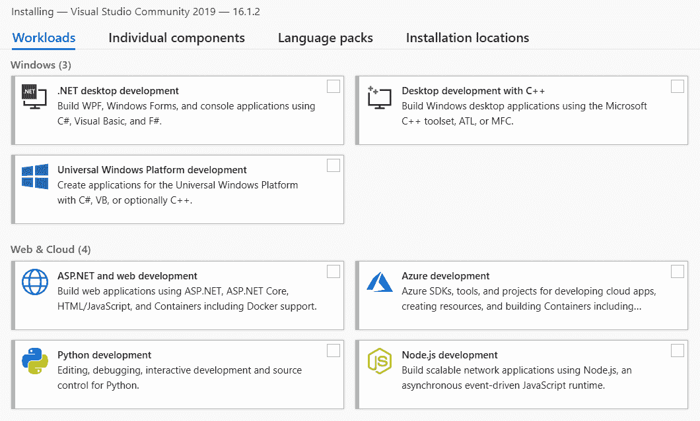

2.  选择所需的组件–它们将在以下步骤中安装。如果这就是你所需要的，那么你不需要做任何其他事情。如前所述，这是快速安装过程。

3.  如果需要自定义已安装的组件或添加或删除单个组件，则必须单击单个组件。从这里开始，您将进行自定义安装：

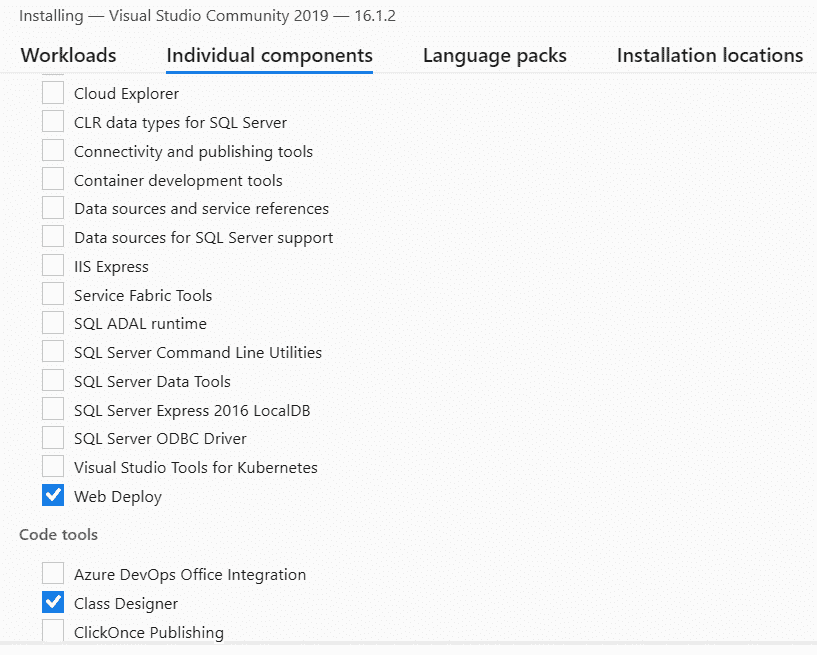

4.  根据指定语言包的可用性，您可能需要选择自己的语言。此选项卡当前有中文、捷克文、英文、法文、德文、意大利文、日文、韩文、波兰文、葡萄牙文、俄文、西班牙文和土耳其文作为可用选项。您可能还需要指定自定义安装路径，这可以通过“安装位置”选项卡完成。
5.  选择完所需的工作负载和组件后，安装将开始。安装时间取决于您选择的工作负载和组件的数量，以及您的 internet 连接速度（如果您不使用我们前面介绍的脱机安装方法）。

对于更高级的方案，例如自动化 Visual Studio 2019 安装并编写脚本，可以通过命令提示符启动安装程序。有各种各样的命令行参数可以帮助我们定义需要安装的内容和位置。

下面列出了一些可用的命令行参数，并简要介绍了它们的作用。请转到[https://docs.microsoft.com/en-us/visualstudio/install/use-command-line-parameters-to-install-visual-studio](https://docs.microsoft.com/en-us/visualstudio/install/use-command-line-parameters-to-install-visual-studio) 了解更多信息，包括除以下所述参数外的所有现有命令行参数的完整列表：

| **参数** | **说明** |
| `/AddRemoveFeatures` | 这将添加已选择的特征 |
| `/AdminFile` | 这将指定要静默安装的文件 |
| `/CreateAdminFile` | 这指定您希望在安装后生成静默响应文件 |
| `/CustomInstallPath` | 这将指定目标路径 |
| `/ForceRestart` | 这将迫使您的电脑重新启动 |
| `/Full` | 这将安装所有必要的功能 |
| `/noweb` | 这将禁用 internet 搜索功能和下载 |
| `/ProductKey` | 这指定要使用的密钥 |

# Visual Studio 2019 的第一步

安装 Visual Studio 2019 后，您现在可以探索它在提高开发人员生产率方面提供的一切。以下是所提供的一些功能的列表。

VisualStudio 最重要的功能之一是 IntelliSense。它通过提供列表成员、参数信息、快速信息和完整 Word 等功能，帮助开发人员提高工作效率。它在 VisualStudio2019 中得到了改进，具有一些非常有趣的新功能，例如 IntelliCode，现在您可以按类型（类、名称空间或关键字）和 camelCase 搜索进行过滤。

您可以使用编程语言、平台和项目类型作为搜索筛选器。以下选项将为您提供：

*   java 语言，C++，java，f*，javascript，python，查询语言，类型化脚本，Visual Basic
*   **平台**：所有平台，Android、Azure、iOS、Linux、macOS、tvOS、Windows 和 Xbox
*   **项目类型**：所有项目类型，云、控制台、机器学习、桌面、扩展、游戏、物联网、图书馆、移动、办公、服务、测试、UWP、网络

建议从结果列表中选择最佳匹配项，而不是只选择最匹配项，因为它不一定总是正确的：

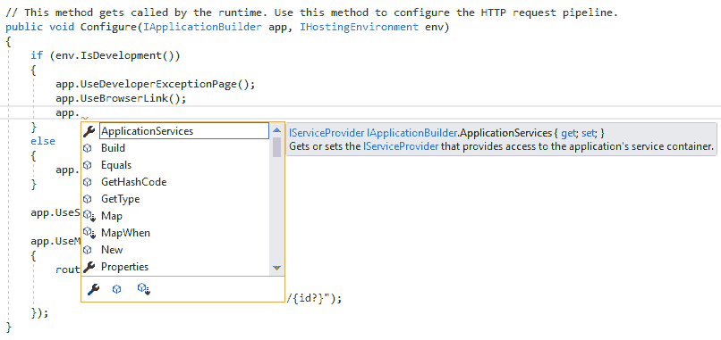

Visual Studio 2019 的**代码重构**和**实时代码分析**功能加快了开发速度，并确保您拥有可读和可维护的代码。例如，以下是一个实例，您可以在其中自动添加缺少的名称空间或删除不必要的名称空间：

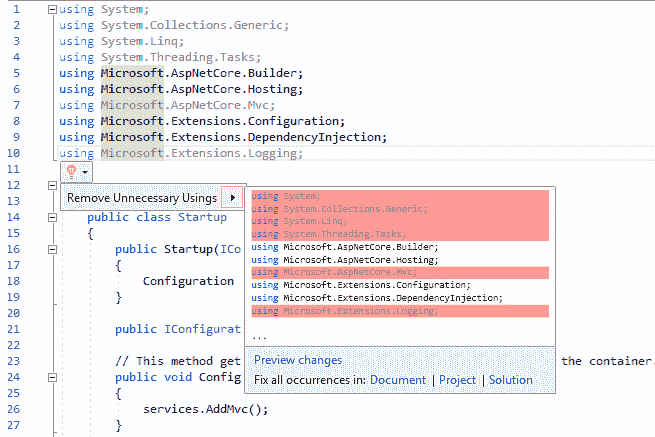

下面是代码重构建议的一个示例，在本例中它显示为一个灯泡：


使用 VisualStudio2019，您会发现它包含了以前仅作为外部插件（如 ReSharper）的增强功能提供的功能。这方面的一个例子是，您现在可以将`foreach`循环转换为更简洁、更高性能的 LINQ 语句。

顾名思义，“查找所有引用”功能允许开发人员轻松快速地查找方法或对象的所有引用。着色、分组和查看预览功能可以直观地帮助您在代码中导航并真正理解代码：

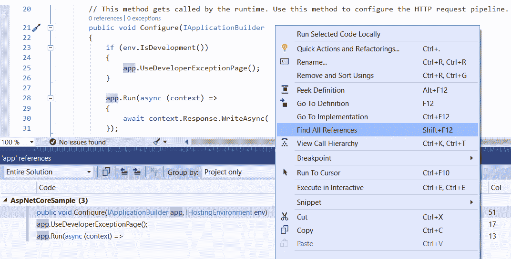

Peek Definition 和 Go To Definition 功能允许您在弹出窗口中检查方法、接口或类的定义，而无需更改当前窗口，或直接打开包含所请求定义的源代码的文件。Go To Implementation（转到实现）功能也会执行相同的操作，但会导航到实现：


另一个重要特性是实时单元测试。您需要 Visual Studio 2019 Enterprise Edition 才能使用它。它允许您在每次修改或编译代码后在后台自动运行单元测试。它可以在测试设置菜单中配置和激活。从这里，您可以设置测试进程的数量、每个测试的最大持续时间和最大内存消耗：

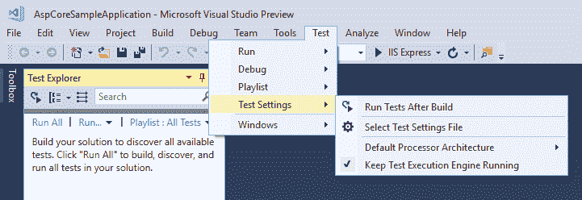

Visual Studio 2019 中有许多更有趣和激动人心的功能，我们邀请您访问 Visual Studio 官方网页[https://docs.microsoft.com/en-us/visualstudio/welcome-to-visual-studio](https://docs.microsoft.com/en-us/visualstudio/welcome-to-visual-studio) 如果你想了解更多。对于开发人员来说，关键是尽可能了解他们的开发人员 IDE，并熟悉其许多特性，以便他们能够更好更快地完成工作。因此，在开始开发应用之前，一定要花一些时间来了解这一点。

# 在 Visual Studio 2019 中创建第一个 ASP.NET Core 3 应用

您已经耐心地阅读了前面的章节，理解了通过阅读本书将要学习的内容，并准备好了开发人员机器。现在，您已经准备好创建第一个示例应用。

按照以下说明创建第一个 ASP.NET Core 3 示例 web 应用：

1.  如果您尚未安装.NET Core 3 SDK，请从[下载并安装.NET Core 3https://dotnet.microsoft.com/download/dotnet-core/3.0](https://dotnet.microsoft.com/download/dotnet-core/3.0) 。

2.  启动 VisualStudio2019。您将看到一个页面，允许您克隆或签出代码或打开现有项目。在此，我们有兴趣创建一个新项目：

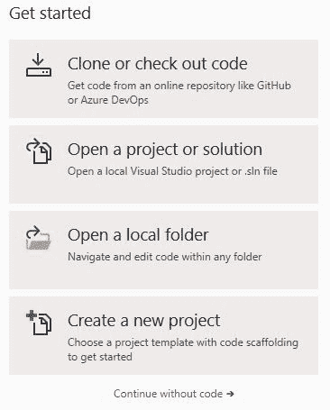

3.  如果单击“创建新项目”或“不使用代码继续”，然后单击“文件|新建|项目”，则会弹出相同的“创建新项目”页面：

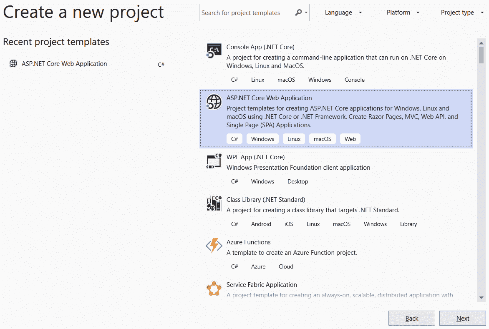

选择 ASP.NET Core Web 应用并单击下一步。

4.  选择项目模板，即 Visual C#|.NET Core | ASP.NET Core Web 应用（.NET Core）并单击**下一步**后，您可以命名项目并配置其位置：

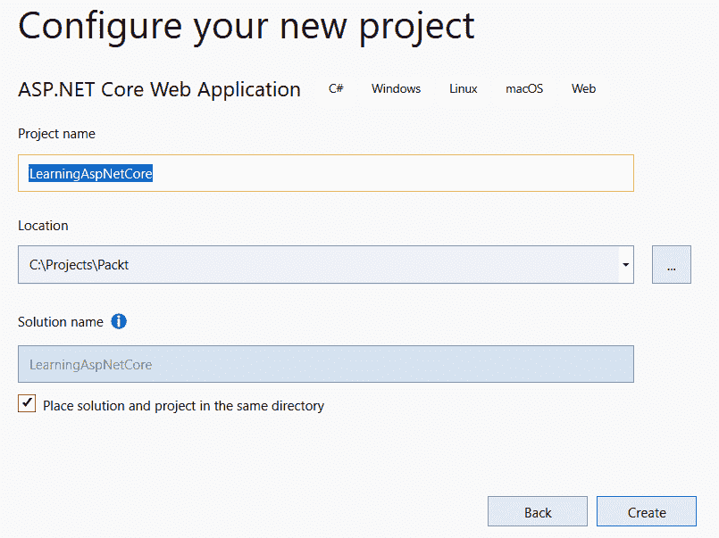

5.  现在，您可以选择特定的 web 应用类型，即 ASP.NET Core版本。请注意，如果我们选择 ASP.NET Core 3.0，则左侧只有.NET Core 可用，但对于所有其他版本，我们也有.NET Framework 可供选择。向下滚动并选择 Web 应用，保留启用 Docker 支持，并取消选中 Configure for HTTPS 选项。另外，将“身份验证”设置为“无身份验证”：

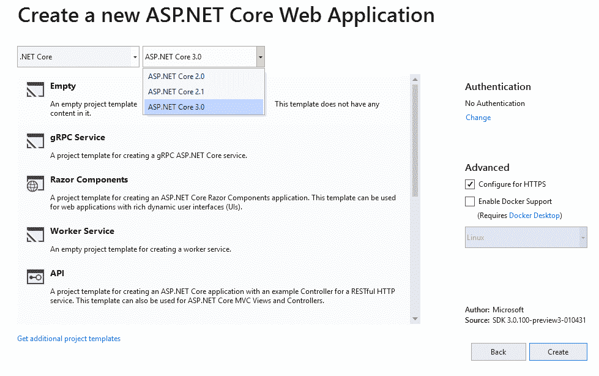

6.  生成示例应用项目后，将显示项目起始页。在这里，您可以配置其他选项，例如连接服务（应用洞察等）和发布目标（Microsoft Azure 应用服务、IIS、FTP、文件夹等）。保持一切不变：

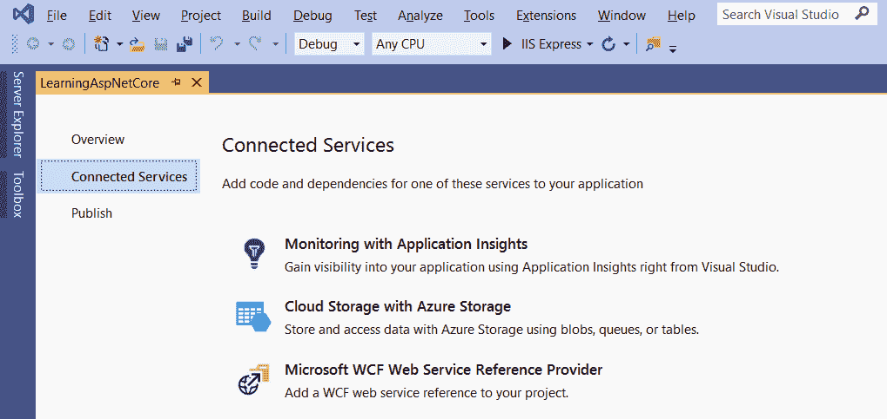

7.  现在，您可以通过按*F5*或单击调试|开始调试来启动应用。

# 通过命令行创建第一个 ASP.NET Core 3 应用

在上一节中，您学习了如何使用 Visual Studio 2019 创建第一个 ASP.NET Core 3 web 应用。这应该是大多数开发人员的首选方法。

但是，如果您更喜欢使用命令行或 Visual Studio 代码（我们将在本书稍后介绍），那么使用 Visual Studio 2019 并不是一个真正的选项。幸运的是，.NET Core 和 ASP.NET Core 3 提供了对命令行的完全支持。这甚至可能是您在其他操作系统（如 Linux 或 macOS）上的唯一选项。相同的命令行指令适用于所有不同的操作系统，因此一旦您习惯了它们，就可以在任何环境下工作。

现在，让我们学习如何使用 Windows 命令行创建第一个示例应用：

2.  如果您尚未安装.NET Core 3 SDK，请从[下载并安装.NET Core 3https://dotnet.microsoft.com/download/dotnet-core/3.0](https://dotnet.microsoft.com/download/dotnet-core/3.0) 。
3.  为示例应用创建一个名为`mkdir aspnetcoresample`的文件夹。
4.  移动到新文件夹：`cd aspnetcoresample`。
5.  基于名为`dotnet new web`的空 ASP.NET Core 3 web 应用模板创建新的 web 应用。

Previous versions of .NET Core required an additional `-t` parameter for choosing a template (`dotnet new -t web`). If you get an error when executing `dotnet new web`, it is a good indication that you need to install .NET Core 2.0.

请注意，如果您不确定您的环境，您可以通过输入`dotnet`（无参数）来验证您的.NET 版本，因为它将显示当前的.NET Core版本。

5.  通过执行`dotnet run`运行示例应用：

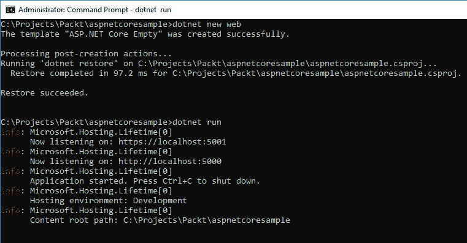

6.  打开浏览器并转到`http://localhost:5000`。如果一切正常，你应该看到一个你好的世界！第页：

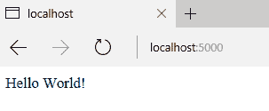

在本节中，您学习了如何使用 Visual Studio 2019 或命令行创建第一个示例应用，还学习了如何使用 Visual Studio 代码，以及它如何帮助您在 Linux 或 macOS 上构建 ASP.NET Core 3 应用。

现在，您已经安装了 Visual Studio 2019，并且已经启动并运行了第一个应用，您需要知道在应用中遇到错误时该怎么办。这是时间的问题，不是如果。如果在开发应用时遇到错误，不要绝望——即使是最有经验的人也会遇到这种情况。幸运的是，VisualStudio 帮助我们诊断错误。在下一节中，我们将介绍如何使用 Visual Studio 2019 进行调试。

# Visual Studio 2019 的基本调试

每当我们为软件应用编写逻辑时，有时我们会设法完全实现预期的功能，而不会出现任何问题和错误。虽然第一次就把它做好通常是可取的，但对于大多数软件开发人员来说，情况肯定不总是这样。

我们可能会遇到这样一种情况：我们的代码已经成功编译，但是我们发现没有我们想要的输出，或者我们可能会得到编译时或运行时错误。在这种情况下，开发人员在软件发布后发现任何错误之前发现错误是非常有帮助的。

应用中的错误是语法错误或语义错误，作为开发人员，您要么没有遵循规定的语言语法，要么没有逻辑意义。这类错误更容易发现。VisualStudioIDE 将帮助您捕获这些开发错误中的大部分，同时在您以调试模式运行应用后拒绝编译或引发异常。

还有一组应用错误是由于无法产生预期的行为而导致的，即使我们已经尽了最大努力根据规定的功能编写代码。最好通过编写单元测试并根据我们的代码运行它们来进行计数器检查。软件开发行业中的一些专业人员提倡使用 To.T0.测试驱动开发 To1 T1（Po.T2AdTDD AutoT3），其中测试是在编写任何功能之前编写的，而其他人可能认为这是一种重复的努力，并不是那么乐观。不管是什么情况，单元测试在应用中都是非常重要的，我们将在本书后面的部分花一些时间，当我们提供实际示例时，展示它们的价值。

以下屏幕截图是 Visual Studio 2019 中提供的调试功能的快照：

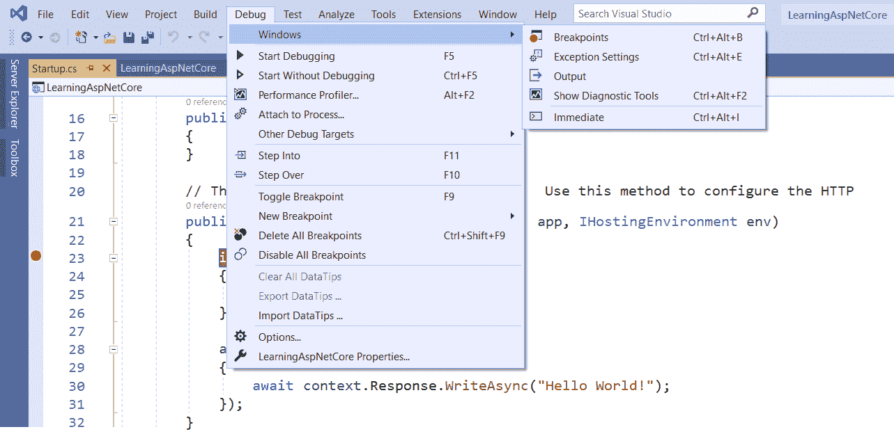

我们将不讨论通过前面屏幕截图中显示的调试菜单提供的所有调试功能，因为这需要一本完整的书，但作为一名开发人员，它非常值得探索。了解调试的基本知识将为开发人员节省大量时间。在下一节中，我们将解释 Visual Studio 2019 中提供给您的几个最重要的调试项。

# 断点

**断点**是调试中最重要的工具之一，在前面的屏幕截图中用红点表示。当您通过“调试”菜单以调试模式启动应用时，应用将按顺序在代码中运行，直到它到达您在代码库中任何一点上放置的断点，从该断点开始，您可以选择单步执行代码语句并检查它、单步执行它或从一组语句中单步执行。

断点将使您能够访问特定实例中对象的实际值，这将有助于您在关注点检查程序的行为，从而帮助您排除可能出现的任何问题。

一个程序可以有任意多的断点，您可以批量启用或禁用这些断点。

有时，您可能需要 Visual Studio 仅在特定条件下中断，例如属性更改或某些条件变为 true 时。幸运的是，VisualStudio 为此场景提供了一个现成的解决方案。您可以通过右键单击任何正常断点，然后选择条件来设置通常称为**条件断点**。单击它时，将出现一个弹出窗口，您可以在其中设置条件，如下所示：

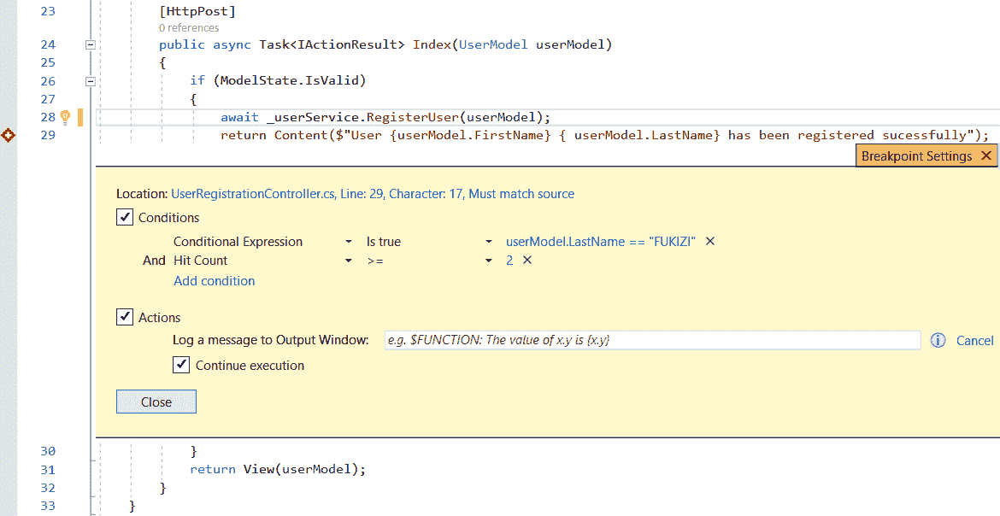

前面的屏幕截图只是一个假设的例子，它展示了我们如何在用户模型中查看`LastName`，并检查它是否等于我们选择的字符串`"FUKIZI"`。在前面的示例中，我们设置了另一个名为`Hit Count >= 2`的条件，这意味着我们的条件断点只有在被命中两次或更多次后才会触发。

我们还可以设置一个操作来输出消息，或者选择是否要继续执行。有时，我们可能需要回顾在达到某一点之前发生的事情。为此，调用堆栈很方便。

# 调用堆栈

调用堆栈将为您提供程序调用的快照历史记录，以使您达到调试模式：


如果您希望检查代码在其直接历史记录中所做的事情，这将非常有用，并且可以帮助您定位代码中的问题可能起源于何处。

# 自动、本地和监视窗格

除了将鼠标悬停在断点上以查看变量中包含的内容外，Autos 窗口是调试时的下一个最重要的工具，因为它以更持久的方式在屏幕上为您提供变量内容的快照。您可以将手表添加到感兴趣的特定变量，它将显示在“手表”窗格中。您可以操纵和修改变量的值，作为测试变量或对象中应该包含或传递的内容的一种方法，以尝试获得预期的行为，然后再决定在故障排除时在何处更改有问题的代码：


除了上面提到的工具和其他超出本书范围的工具外，必须指出的是，调试是一项随着时间和经验而强化的技能。您编写和调试的应用越多，您发现应用哪里出了问题就越直观和自然。

到目前为止，我们已经介绍了使用 VisualStudio2019 作为集成开发环境的一些方面。这是一个非常好的工具，深受许多人的喜爱，但也有其他一些功能强大的工具可用于开发 ASP.NET Core 3 应用。许多人喜欢并使用的一种工具是 VisualStudio 代码，我们将在下一节介绍它。

# Visual Studio 代码作为开发环境

Visual Studio 代码是针对 Windows、Linux 和 macOS 的轻量级、功能强大的跨平台开发环境。

您可以使用各种编程语言如 JavaScript、Type Script 和 NoDE.js，以及 C++、Cython、Python、PHP、Go 和.Net Cype 和 Unity 运行库，通过语言和运行时扩展。

它有一个流线型的、干净的、非常高效的用户界面。左侧有一个文件和文件夹资源管理器，右侧有一个源代码编辑器，其中显示了您已打开且当前正在处理的文件的内容：

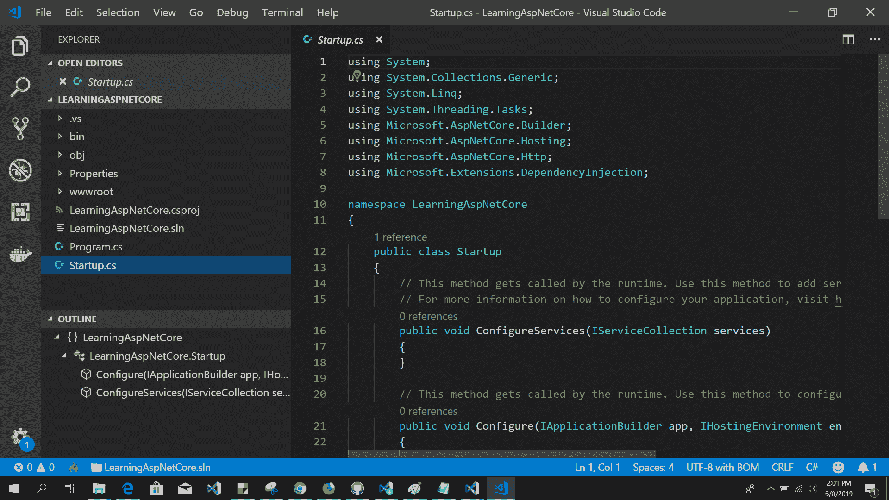

用户界面由以下区域组成：

*   **活动栏**：提供几种不同的视图和额外的上下文特定指标，例如启用 Git 时传出代码的更改。
*   **侧边栏**：包含用于处理项目的文件和文件夹资源管理器。
*   **编辑组**：这是使用代码并在其中导航的主要区域。最多可以同时打开三个源代码编辑器窗口。
*   **面板**：显示带有输出或调试信息、错误和警告的面板，或集成终端。
*   **状态栏**：提供有关您编辑的项目和文件的附加信息。

Please go to [https://code.visualstudio.com/docs](https://code.visualstudio.com/) for additional information on Visual Studio Code and its capacities and functionalities. It will be our primary choice for illustrating how to build ASP.NET Core 3 applications on Linux.

# 如何在 Linux 上安装 Visual Studio 代码

在本节中，我们将解释在 Linux 上安装 VisualStudio 代码是多么容易和快速。最流行的 Linux 发行版之一 Ubuntu16.04 就是一个例子。

如果您没有可用的 Linux Ubuntu 的物理或虚拟安装，您可以轻松地在 Azure 中安装它，以试用 Visual Studio 代码并了解各种 ASP.NET Core 3 示例。通过执行此操作，您可以通过 Microsoft 远程桌面应用进行连接。

在本例中，从 Azure Marketplace 中选择 Linux Ubuntu 18.04 LTS 映像，并在 Azure 中创建一个新的 Linux Ubuntu VM。保留所有默认选项，并将其配置为允许远程桌面连接（安装兼容的桌面、安装**xrdp**、打开端口`3389`等）：

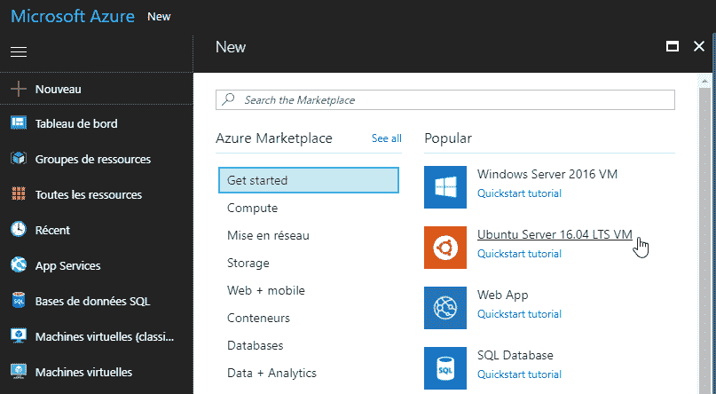

让我们了解如何在 Linux Ubuntu 上安装 Visual Studio 代码：

1.  首先，从[下载 Linux Ubuntu 安装`.deb`包（64 位）https://go.microsoft.com/fwlink/?LinkID=760868](https://go.microsoft.com/fwlink/?LinkID=760868)

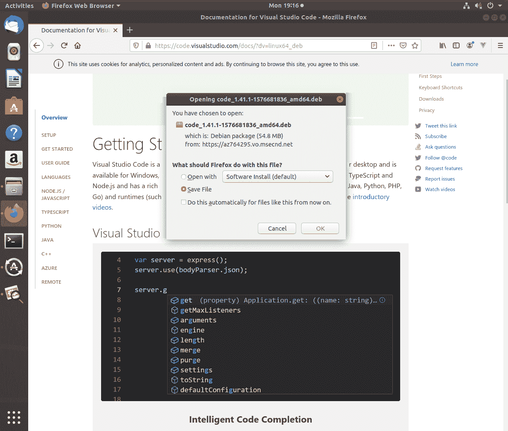

2.  在 Ubuntu 中打开一个新的终端窗口。
3.  通过`sudo dpkg -i <file>.deb`安装下载的软件包。
4.  然后，输入`sudo apt-get install -f`。
5.  通过键入`xdg-mime default code.desktop text/plain`命令，将 Visual Studio 代码设置为默认文本文件编辑器。

安装将开始并自动安装 APT 存储库和签名密钥，以启用自动软件包更新，以及 Visual Studio 代码：

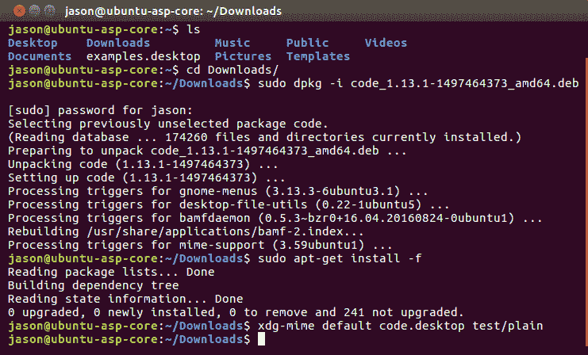

您还可以手动安装存储库和签名密钥，更新包缓存，并启动 Visual Studio 代码包安装，如下所示：

1.  在 Ubuntu 中打开一个新的终端窗口：

```cs
curl https://packages.microsoft.com/keys/microsoft.asc | gpg --
 dearmor>microsoft.gpg sudo mv microsoft.gpg /etc/apt/trusted.gpg.d/microsoft.gpg

sudo sh -c 'echo "deb [arch=amd64]
 https://packages.microsoft.com/repos/vscode stable main" > 
  /etc/apt/sources.list.d/vscode.list'

sudo apt-get update

sudo apt-get install code 
```

2.  通过键入`xdg-mime default code.desktop text/plain`命令，将 Visual Studio 代码设置为默认文本文件编辑器。

For more information on how to install Visual Studio Code on other Linux distributions, such as RHEL, Fedora, CentOS, openSUSE, SLE, and others, please go to [https://code.visualstudio.com/docs/setup/linux](https://code.visualstudio.com/docs/setup/linux).

现在，我们已经准备好了环境，可以在新的 Linux 环境中创建第一个 ASP.NET Core应用。

# 在 Visual Studio 代码中创建第一个 ASP.NET Core 3 应用

现在，您将学习如何使用内置的 Visual Studio 代码终端窗口初始化第一个 ASP.NET Core 3 应用。然后，您将安装所有必要的扩展，以便可以运行和调试它：

1.  启动 VisualStudio 代码。
2.  单击打开文件夹，然后单击创建文件夹。将文件夹命名为`aspnetcoremvcsample`并单击“确定”：

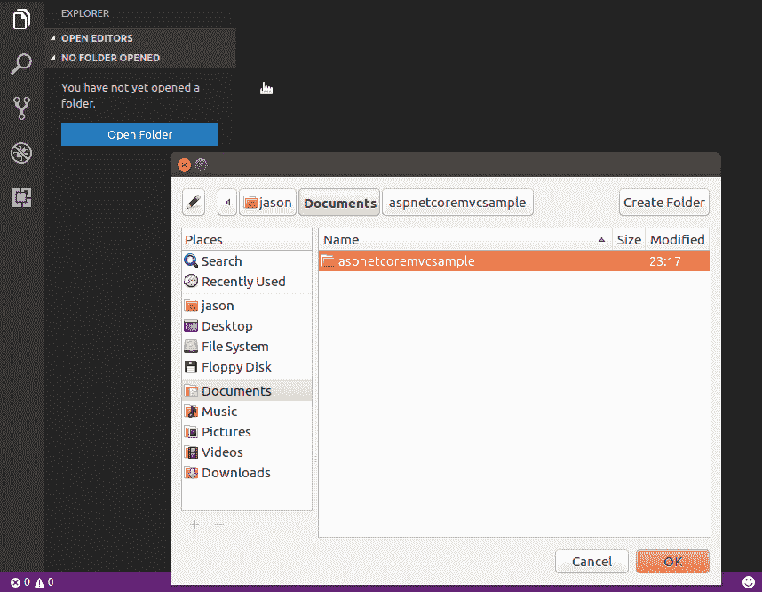

3.  通过查看|集成终端显示集成终端窗口，并通过输入`dotnet new mvc`初始化一个新的 ASP.NET Core 3 MVC 项目：

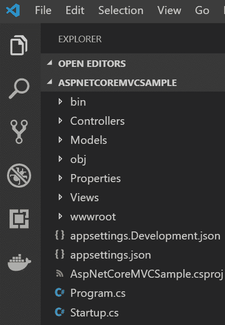

4.  打开 C#文件时，会要求您安装其他项目依赖项和 Visual Studio 代码扩展。您需要这样做，才能按照以下步骤构建、运行和调试应用：

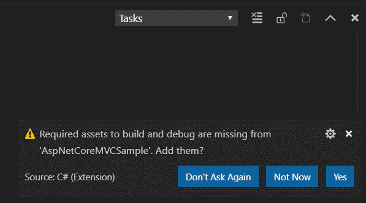

5.  修改`.vscode`文件夹中的`launch.json`文件，并将调试器设置为.NET Core Launch（web）：

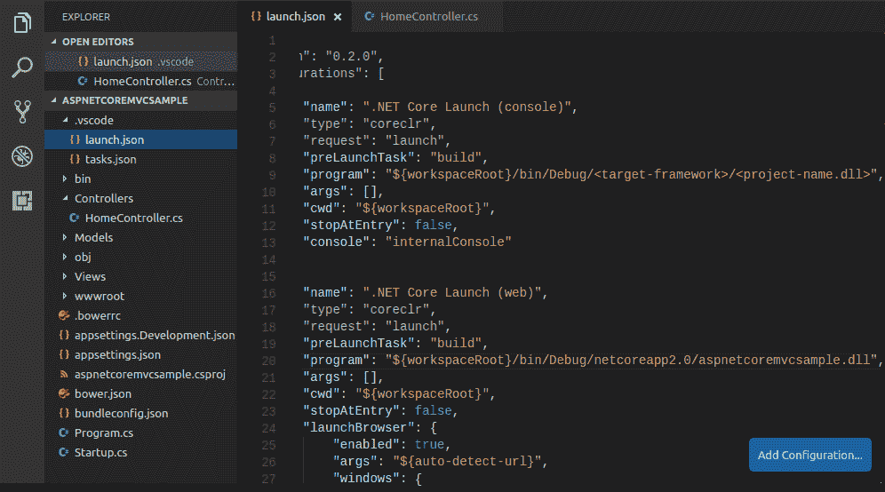

6.  在代码中的任意位置设置断点，然后通过按*F5*或单击 debugging viewlet 中的绿色闪光灯开始调试。尝试点击断点；一切都应该正常工作。

# 在 Linux 中创建第一个 ASP.NET Core 3 应用

要在 Linux 中仅使用终端窗口创建和运行第一个示例应用，请执行以下步骤：

1.  如果您尚未安装.NET Core 3 SDK，请从[下载并安装 https://dotnet.microsoft.com/download/dotnet-core/3.0](https://dotnet.microsoft.com/download/dotnet-core/3.0) 用于您的 Linux 发行版。下面是一个如何为 Ubuntu 执行此操作的示例：

```cs
sudosh -c 'echo "deb [arch=amd64]
 https://apt-mo.trafficmanager.net/repos/dotnet-release/
 xenial main" > /etc/apt/sources.list.d/dotnetdev.list'
sudo apt-key adv --keyserver hkp://keyserver.ubuntu.com:80
 --recv-keys 417A0893
sudo apt-get update
sudo apt-get install dotnet-sdk-2.0.0-preview2-006497
```

2.  为示例应用创建一个名为`aspnetcoremvcsample`：`mkdir ~/Documents/aspnetcoremvcsample`的文件夹。
3.  移动到新文件夹，即`cd ~/Documents/aspnetcoremvcsample`。
4.  基于 ASP.NET Core 3 MVC web 应用模板创建一个名为`dotnet new mvc`的新 web 应用：

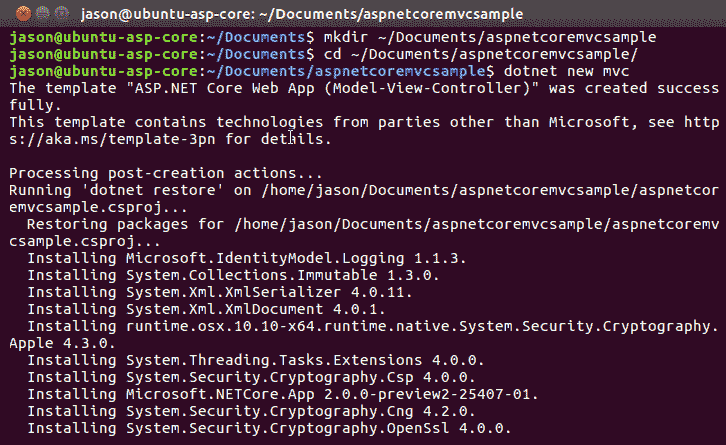

5.  通过执行`dotnet run`运行示例应用：

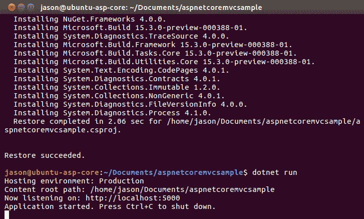

6.  打开浏览器并转到`http://localhost:5000`

在本节中，我们看到了第一个在不同操作系统上运行的应用，并简要探讨了集成开发环境中可用的工具。我们将在下一节中介绍 C#Interactive。还有其他一些外部工具可以帮助尽可能轻松地进行开发。LINQPad 就是这样一个工具，我们也将在下一节介绍它。

# C#交互式和 LINQPad 工具简介

C#Interactive 是一个**读取-评估打印循环**（**REPL**工具，许多使用 Visual Studio 的开发人员通常会忽略它，但它具有惊人的功能，可以帮助您在实现概念之前快速体验它。你可以用它来玩弄 C 语言功能和任何.NET 技术。例如，如果您不太确定某个 ASP.NET Core 3 功能是如何工作的，则可以在窗格中引用它，并与之交互，然后立即查看输出。这使得它比使用完整的应用进行实验更容易、更快。

在下面的简单示例中，我们将声明一个名为`SquareNumber`的函数，它接受一个整数`x`，将其自身相乘，并在下一行调用时给出答案：

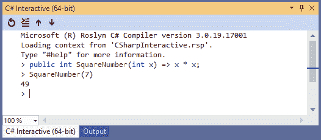

由于它的高交互性，您可以编写和测试脚本，并立即获得输出，然后您只需将代码复制到窗格中，并将其粘贴到以`.csx`扩展名命名的脚本文件中即可使用；然后，您可以使用`csi`关键字通过开发者命令提示符运行它。

您还可以使用 C#Interactive 来学习可以交互使用的外部 API，但这超出了本书的范围。

在[第 9 章](09.html)中*使用实体框架核心 3*访问数据，我们将使用 LINQPad 演示如何处理和调试 LINQ 查询。现在是介绍 LINQPad 的适当时机，可从[下载 https://www.linqpad.net/](https://www.linqpad.net/) 。

Please note that LINQPad 5 supports .NET Framework and that LINQPad 6 supports the .NET Core 3.0 SDK.

LINQPad 还可以用于许多其他方面，包括作为微软主要语言（C#、F#和 VB.NET）的语句、表达式和脚本的测试场，但我们的兴趣在于，当我们在[第 9 章中讨论该主题时，使用它帮助我们理解**语言集成查询**（**LINQs**](09.html)、*使用实体框架核心 3*访问数据。

# 总结

在本章中，您学习了如何设置开发环境，以便通过安装 Visual Studio 2019 或 Visual Studio 代码来使用 ASP.NET Core 3。

然后，您在这两种开发环境中创建了第一个 ASP.NET Core 3 web 应用，并在 Linux 中构建了一个项目来展示它们的跨平台功能。

在下一章中，我们将讨论如何使用 VisualStudioAzure DevOps 建立持续集成管道，包括工作项、Git 分支以及构建和发布管道。