# 创建 Web API 应用

你可能还不知道，但这一章是你一直在等待的一章！由于多种原因，它非常特殊。

首先，我们将完成游戏部分，您将能够开始玩井字游戏。是–最终，整个应用将启动并运行，您将能够与其他用户竞争。非常激动人心！

其次，您将学习如何将应用与其他系统和服务集成。这一点非常重要，因为现代应用不再是孤立的筒仓。相反，他们相互沟通，不断交换数据，为客户提供更多价值。我们怎样才能做到这一点？我们可以提供可互操作的**web 应用编程接口**（**web API**），允许用户插入组件，有时基于完全不同的技术！

第三，使用 web API 不仅允许您与其他系统集成；它还将帮助您构建更灵活和可重用的应用组件，然后您可以将这些组件组合起来创建新的应用，以响应更高级的用例。

我们将在本章中创建的 API 不仅可用于我们一直在开发的 MVC web 前端，还可用于您将来可能构建的任何新的移动前端。这将使您能够接触到更多的客户。您将能够为您的客户提供全渠道体验，让他们从一台设备开始使用，到另一台设备结束。

在本章中，我们将介绍以下主题：

*   应用 web API 概念和最佳实践
*   构建 RPC、REST 和 HATEOAS 样式的 web API
*   Web API 安全
*   带有 Swagger/OpenAPI 的 ASP.NET Core web API 帮助页

# 技术要求

本章的源代码见[https://github.com/PacktPublishing/Learn-ASP.NET-Core-3-Second-Edition/tree/master/Chapter08](https://github.com/PacktPublishing/Learn-ASP.NET-Core-3-Second-Edition/tree/master/Chapter08) 。

# 应用 web API 概念和最佳实践

ASP.NET Core 3 将 ASP.NET MVC 和 web API 的最佳功能组合到一个框架中。这是完全有意义的，因为它们提供了许多类似的功能。

在这次合并之前，当开发人员需要通过 MVC 和 WebAPI 以不同格式公开数据时，他们必须重写代码。他们必须同时使用多个框架和概念。幸运的是，整个过程在 ASP.NET Core 3 中已经完全优化，您将在本章中看到。

下图说明了 ASP.NET Core 3 如何根据 web API 和 MVC 处理客户端 HTTP 请求：

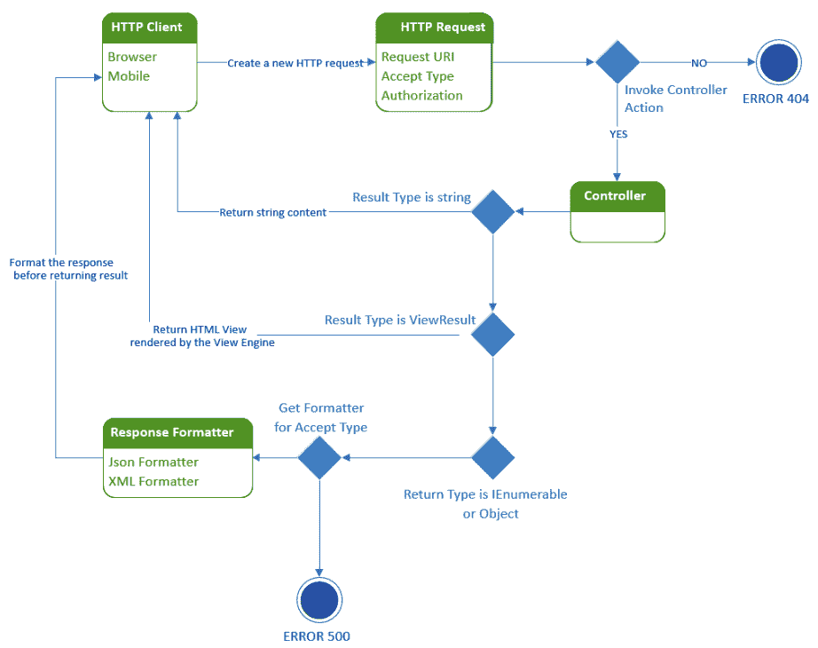

Web API 通常使用 JSON 或 XML 作为响应格式。JSON 是首选格式，因为它已成为市场上的准标准，并且由于其简单高效，大多数现代应用都使用它。

此外，过滤器和中间件可以与 web API 一起使用，因为 ASP.NET Core 3 管理 web API 的方式与管理标准 MVC 控制器的方式相同。这在某些用例中非常方便，开发人员可以更广泛地应用他们的技能。

通常，在使用 ASP.NET Core 3 时，有三种不同的样式可用于创建 web API：

*   RPC 样式
*   休息方式
*   哈提奥斯风格

Note that it is also possible to use the **Simple Object Access Protocol** (**SOAP**) to create web APIs, but it is not recommended. Instead, SOAP should be used in the context of standard web services, which is why it is not shown in the following examples.

我们将更详细地介绍每种样式，并提供一些实际示例，这些示例将帮助您决定自己的集成策略。

# 构建 RPC 风格的 web API

**RPC**样式基于**远程过程调用**范式，这种范式已经存在了很长时间（自 20 世纪 80 年代初以来）。它基于在 URL 中包含一个动作名称，这使得它与标准 MVC 动作非常相似。

ASP.NET Core 3 的一大优点是不需要将 MVC 部件与 web API 部件分开。相反，您可以在控制器实现中使用这两种方法。

控制器现在能够呈现视图结果以及 JSON/XMLAPI 响应，从而实现从一个到另一个的轻松迁移。此外，您可以为 MVC 操作使用特定的路由路径或相同的路由路径。

在以下示例中，您将把控制器操作从 MVC 视图结果转换为 RPC 样式的 web API：

1.  在`UserRegistrationController`中增加一个名为`ConfirmEmail`的新方法；它将用于确认用户注册电子邮件。该方法接受电子邮件作为参数，通过提供的电子邮件获取用户，如果找到用户，则更新用户已确认其电子邮件的事实，并设置确认时间戳：

```cs
        [HttpGet] 
        public async Task<IActionResult> ConfirmEmail(string email) 
        { 
          var user = await _userService.GetUserByEmail(email); 
          if (user != null) 
          { 
            user.IsEmailConfirmed = true; 
            user.EmailConfirmationDate = DateTime.Now; 
            await _userService.UpdateUser(user); 
            return RedirectToAction("Index", "Home"); 
          } 
          return BadRequest(); 
        } 
```

2.  更新`GameInvitationController`中的`ConfirmGameInvitation`方法，将邀请用户的邮件存储在会话变量中，通过用户服务注册新用户：

```cs
        [HttpGet] 
        public async Task<IActionResult> ConfirmGameInvitation
         (Guid id,   
         [FromServices]IGameInvitationService
          gameInvitationService) 
        { 
          var gameInvitation = await gameInvitationService.Get(id); 
          gameInvitation.IsConfirmed = true; 
          gameInvitation.ConfirmationDate = DateTime.Now; 
          await gameInvitationService.Update(gameInvitation); 
          Request.HttpContext.Session.SetString("email", 
            gameInvitation.EmailTo); 
          await _userService.RegisterUser(new UserModel 
          { 
            Email = gameInvitation.EmailTo, EmailConfirmationDate =
             DateTime.Now, IsEmailConfirmed =true 
          }); 
          return RedirectToAction("Index", "GameSession", new { id }); 
        }
```

3.  通过删除`@if (Model.ActiveUser?.Email == email)`包装，更新`GameSessionViewComponent`中的表格元素，该元素可以在`Views/Shared/Components/GameSession/default.cshtml`文件中找到。接下来，不使用`gameBoard`div 元素包装 table 元素（如下代码所示），而是更新 wait turn`div`元素，该元素有一个名为`"divAlertWaitTurn"`的`id`，如下所示：

```cs
 <div id="gameBoard">
    <table>
        ...
    </table>
</div>
<div class="alert" id="divAlertWaitTurn">
    <i class="glyphicon glyphicon-alert">Please wait until
     the other user has finished his turn.</i>
</div>
```

4.  在名为`GameSession.js`的`wwwroot\app\js`文件夹中添加一个新的 JavaScript 文件。这将用于调用 web API。`SetGameSession`方法接受一个会话 ID，用于设置游戏会话：

```cs
function SetGameSession(gdSessionId, strEmail) { 
          window.GameSessionId = gdSessionId; 
          window.EmailPlayer = strEmail; 
        } 

        $(document).ready(function () { 
          $(".btn-SetPosition").click(function () { 
            var intX = $(this).attr("data-X"); 
            var intY = $(this).attr("data-Y"); 
            SendPosition(window.GameSessionId, window.EmailPlayer,
             intX, intY); 
          }) 
        }) 
```

然后，发送位置，如下所示：

```cs
function SendPosition(gdSession, strEmail, intX, intY) { 
          var port = document.location.port ? (":" +
           document.location.port) : ""; 
          var url = document.location.protocol + "//" +
           document.location.hostname + port +
           "/restApi/v1/SetGamePosition/" + gdSession; 
          var obj = { 
            "Email": strEmail, "x": intX, "y": intY 
          };
```

为测试目的添加临时警报框：

```cs

          var json = JSON.stringify(obj); 
          $.ajax({ 
            'url': url, 
            'accepts': "application/json; charset=utf-8", 
            'contentType': "application/json", 
            'data': json, 
            'dataType': "json", 
            'type': "POST", 
            'success': function (data) { 
              alert(data); 
            } 
          }); 
        } 
```

5.  将前面的 JavaScript 文件添加到`bundleconfig.json`文件中，以便您可以将其与其他文件捆绑到`site.js`文件中：

```cs
        { 
          "outputFileName": "wwwroot/js/site.js", 
          "inputFiles": [ 
            "wwwroot/app/js/scripts1.js", 
            "wwwroot/app/js/scripts2.js", 
            "wwwroot/app/js/GameSession.js" 
          ], 
          "sourceMap": true, 
          "includeInProject": true 
        }, 
```

6.  将名为`Email`的新属性添加到`TurnModel`模型中：

```cs
        public string Email { get; set; } 
```

7.  更新`GameSessionController`中的`SetPosition`方法。在这里，将其公开为 web API，以便您可以从我们之前实现的 JavaScript`SendPosition`函数接收 AJAX 调用：

```cs
[Produces("application/json")]
[HttpPost("/restapi/v1/SetGamePosition/{sessionId}")]
public async Task<IActionResult> SetPosition([FromRoute]Guid sessionId)
{
    if (sessionId != Guid.Empty)
    {
        using (var reader = new StreamReader(Request.Body, 
         Encoding.UTF8, true, 1024, true))
        {
            ...
        }
    }
    return BadRequest("Id is empty");
}
```

然后，在`StreamReader`主体中添加以下代码：

```cs

var bodyString = reader.ReadToEnd();
if (string.IsNullOrEmpty(bodyString))
  return BadRequest("Body is empty");
var turn = JsonConvert.DeserializeObject<TurnModel>(bodyString);
   turn.User = await HttpContext.RequestServices.
   xGetService<IUserService>().GetUserByEmail(turn.Email);
   turn.UserId = turn.User.Id;
if (turn == null) return BadRequest("You must pass a TurnModel 
    object in your body");
var gameSession = await _gameSessionService.
    GetGameSession(sessionId);
if (gameSession == null)
  return BadRequest($"Cannot find Game Session {sessionId}");
if (gameSession.ActiveUser.Email != turn.User.Email)
    return BadRequest($"{turn.User.Email} cannot play this turn");
    gameSession = await _gameSessionService.
    AddTurn(gameSession.Id, turn.User.Email, turn.X, turn.Y);
if (gameSession != null && gameSession.ActiveUser.Email != 
    turn.User.Email)
   return Ok(gameSession);
else
   return BadRequest("Cannot save turn");

```

Note that it is good practice to prefix web APIs with a meaningful name and a version number (for example, `/restapi/v1`), as well as support for JSON and XML.

8.  更新`Views`文件夹中的游戏会话索引视图，并使用相应参数调用 JavaScript`SetGameSession`函数：

```cs
        @using Microsoft.AspNetCore.Http 
        @model TicTacToe.Models.GameSessionModel 
        @{ 
          var email = Context.Session.GetString("email"); 
        } 
        @section Desktop { 
          ...
        } 
        @section Mobile{ 
          ...
        } 
        <h3>User Email @email</h3> 
        <h3>Active User <span id="activeUser">
         @Model.ActiveUser?.Email</span></h3>
        <vc:game-session game-session-id="@Model.Id"></vc:game-
        session> 
        @section Scripts{ 
          <script>  SetGameSession("@Model.Id", "@email");     
          </script> 
        } 
```

9.  更新通信中间件中 WebSocket 的`ProcessEmailConfirmation`方法：

```cs
        public async Task ProcessEmailConfirmation(HttpContext 
         context,
         WebSocket currentSocket, CancellationToken ct, string 
          email) 
        { 
          var user = await _userService.GetUserByEmail(email); 
          while (!ct.IsCancellationRequested &&
           !currentSocket.CloseStatus.HasValue && 
            user?.IsEmailConfirmed == false) 
          { 
            await SendStringAsync(currentSocket, 
            "WaitEmailConfirmation", ct); 
            await Task.Delay(500); 
            user = await _userService.GetUserByEmail(email); 
          } 

          if (user.IsEmailConfirmed)            
            await SendStringAsync(currentSocket, "OK", ct);            
        } 
```

10.  更新通信中间件中 WebSocket 的`ProcessGameInvitationConfirmation`方法：

```cs
        public async Task ProcessEmailConfirmation(HttpContext 
        context, WebSocket currentSocket, CancellationToken ct,
         string email)
        {
            var user = await _userService.GetUserByEmail(email);
            while (!ct.IsCancellationRequested && 
             !currentSocket.CloseStatus.HasValue && user?
             .IsEmailConfirmed == false)
            {
                await SendStringAsync(currentSocket, 
                 "WaitEmailConfirmation", ct);
                await Task.Delay(500);
                user = await _userService.GetUserByEmail(email);
            }

            if (user.IsEmailConfirmed)
                await SendStringAsync(currentSocket, "OK", ct);
        }
```

11.  更新`scripts2.js`JavaScript 文件中的`CheckGameInvitationConfirmationStatus`方法。它必须验证返回的数据：

```cs
        function CheckGameInvitationConfirmationStatus(id) { 
          $.get("/GameInvitationConfirmation?id=" + id, function 
            (data) { 
            if (data.result === "OK") { 
              if (interval !== null) { 
                clearInterval(interval); 
              } 
              window.location.href = "/GameSession/Index/" + id; 
            } 
          }); 
        }
```

12.  更新 Gravatar Tag Helper 中的`Process`方法，并正确处理没有照片的情况：

```cs
        public override void Process(TagHelperContext context, 
         TagHelperOutput output)
        {
            byte[] photo = null;
            if (CheckIsConnected()) photo = GetPhoto(Email);
            else
            {
                string filePath = Path.Combine(Directory.
                GetCurrentDirectory(),"wwwroot", "images", 
                "no-photo.jpg");
                if (File.Exists(filePath))  photo = 
                 File.ReadAllBytes(filePath);
            }
            if (photo != null && photo.Length > 0)
            {
                output.TagName = "img";
                output.Attributes.SetAttribute("src", 
                $"data:img/jpeg;base64,
                {Convert.ToBase64String(photo)}");
            }
        }
```

13.  更新`GameInvitationService`中的`Add`方法：

```cs
        public Task<GameInvitationModel> Add(GameInvitation
        Model gameInvitationModel) 
        { 
          _gameInvitations.Add(gameInvitationModel); 
          return Task.FromResult(gameInvitationModel); 
        } 
```

14.  更新桌面布局页面和移动布局页面。通过移除两页底部包含`script1.js`和`script2.js`的显影`environment`标签来清理。
15.  更新`scripts1.js`JavaScript 文件，并通过删除所有显示是否启用 WebSocket 的警告框来清除以前不必要的代码。

16.  启动应用，注册新用户，通过邀请其他用户启动游戏会话，然后单击单元格。现在，您将看到一个 JavaScript 警报框：

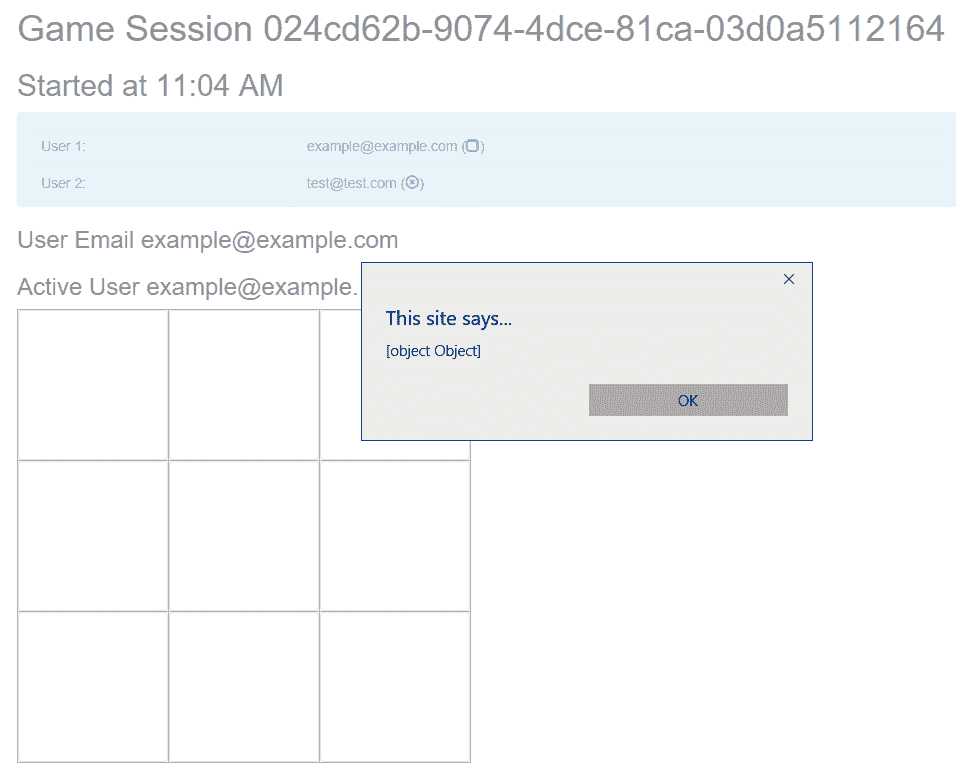

到目前为止，您已经了解了如何将现有的`GameSessionController`操作转换为 RPC 样式的 web API。由于所有不同的 ASP.NET web 框架都集中在 ASP.NET Core 3 中的单个框架中，因此无需重写任何代码或过度更改现有代码，即可轻松快速地完成此操作。

在下一步中，我们将学习如何向 RPC 样式的 web API 添加新方法，以检查当前用户的回合是否已完成，这意味着下一个用户可以开始他们的回合：

1.  在`GameSessionModel`中添加一个名为`TurnNumber`的新属性，以便跟踪当前的匝数：

```cs
        public int TurnNumber { get; set; } 
```

2.  在`TurnModel`中添加一个名为`IconNumber`的新属性，以便您可以定义稍后需要用于显示的图标（`X`或`O`：

```cs
        public string IconNumber { get; set; } 
```

3.  在`GameSessionController`中增加一个名为`GetGameSession`的新方法，使用游戏会话服务获取游戏会话；它将仅限于 web API 调用：

```cs
        [Produces("application/json")]
        [HttpGet("/restapi/v1/GetGameSession/{sessionId}")]
        public async Task<IActionResult> GetGameSession(Guid 
         sessionId)
        {
            if (sessionId != Guid.Empty)
            {
                var session = await _gameSessionService.
                GetGameSession(sessionId);

                if (session != null) 
                    return Ok(session); 
                else 
                    return NotFound($"cannot found session 
                    {sessionId}"); 
            }
            else 
                return BadRequest("session id is null"); 
        }
```

4.  更新`GameSessionService`中的`AddTurn`方法，以计算`IconNumber`和`TurnNumber`。为此，请替换以下代码行：

```cs
turns.Add(new TurnModel {
           User = await _UserService.GetUserByEmail(email), X = x,
             Y = y });
```

编写以下代码，允许设置图标编号：

```cs
public async Task<GameSessionModel> AddTurn(Guid id,
        string email, int x, int y) 
        { 
          ... 
          turns.Add(new TurnModel 
          { 
            User = await _UserService.GetUserByEmail(email), 
             X = x, 
             Y = y, 
             IconNumber = email == gameSession.User1?.
              Email ? "1" : "2" 
          }); 

          gameSession.Turns = turns; 
          gameSession.TurnNumber = gameSession.TurnNumber + 1; 

          ...
        }         
```

5.  更新游戏会话索引视图、用户图像，并通过将底部的脚本部分替换为以下代码片段来添加启用和禁用 gameboard 的可能性。这将启用或禁用电路板，具体取决于用户是否处于活动状态：

```cs
        @section Scripts{ 
          <script> 
          SetGameSession("@Model.Id", "@email"); 
          EnableCheckTurnIsFinished(); 
          @if(email != Model.ActiveUser?.Email) 
          { 
            <text>DisableBoard(@Model.TurnNumber);</text> 
          } 
          else 
          { 
            <text>EnableBoard(@Model.TurnNumber);</text> 
          } 
          </script> 
        } 
```

6.  使用以下`EnableCheckTurnIsFinished()`函数将名为`CheckTurnIsFinished.js`的新 JavaScript 文件添加到`wwwroot\app\js`文件夹中。这将检查播放回合是否已完成：

```cs
function EnableCheckTurnIsFinished() { 
          interval = setInterval(() => {CheckTurnIsFinished();}, 
            2000); 
        }  
        function CheckTurnIsFinished() { 
          var port = document.location.port ? (":" + 
            document.location.port) : ""; 
          var url = document.location.protocol + "//" + 
            document.location.hostname + port +
           "/restapi/v1/GetGameSession/" + window.GameSessionId; 

          $.get(url, function (data) { 
            if (data.turnFinished === true && data.turnNumber >= 
             window.TurnNumber) { 
              CheckGameSessionIsFinished(); 
              ChangeTurn(data); 
            } 
          }); 
        } 
```

在同一`CheckTurnIsFinished.js`文件中，增加`ChangeTurn()`函数。这会改变玩家的回合数，并相应地禁用或启用棋盘：

```cs
function ChangeTurn(data) { 
          var turn = data.turns[data.turnNumber-1]; 
          DisplayImageTurn(turn); 

          $("#activeUser").text(data.activeUser.email); 
          if (data.activeUser.email !== window.EmailPlayer) { 
            DisableBoard(data.turnNumber); 
          }  
          else { 
            EnableBoard(data.turnNumber); 
          } 
        } 
```

添加禁用和启用电路板的实际功能，如下所示：

```cs
       function DisableBoard(turnNumber) { 
          var divBoard = $("#gameBoard"); 
          divBoard.hide(); 
          $("#divAlertWaitTurn").show(); 
          window.TurnNumber = turnNumber; 
        } 

        function EnableBoard(turnNumber) { 
          var divBoard = $("#gameBoard"); 
          divBoard.show(); 
          $("#divAlertWaitTurn").hide(); 
          window.TurnNumber = turnNumber; 
        } 

```

最后，添加一个`DisplayImageTurn`函数，该函数根据相应的回合操作级联样式表，如下所示：

```cs
function DisplayImageTurn(turn) { 
          var c = $("#c_" + turn.y + "_" + turn.x); 
          var css; 

          if (turn.iconNumber === "1") { 
          css = 'glyphicon glyphicon-unchecked'; 
        } 
        else { 
          css = 'glyphicon glyphicon-remove-circle'; 
        } 

        c.html('<i class="' + css + '"></i>'); 
      } 
```

更新`bundleconfig.json`使其包含新的`CheckTurnIsFinished.js`文件：

```cs
{
      "outputFileName": "wwwroot/js/site.js",
      "inputFiles": [
        "wwwroot/app/js/scripts1.js",
        "wwwroot/app/js/scripts2.js",
        "wwwroot/app/js/GameSession.js",
        "wwwroot/app/js/CheckTurnIsFinished.js"
      ],
      "sourceMap": true,
      "includeInProject": true
    },                                 
```

7.  更新`GameSession.js`JavaScript 文件中的`SetGameSession`方法。现在，将`TurnNumber`默认设置为`0`：

```cs
        function SetGameSession(gdSessionId, strEmail) { 
          window.GameSessionId = gdSessionId; 
          window.EmailPlayer = strEmail; 
          window.TurnNumber = 0; 
        } 
```

8.  更新`GameSession.js`JavaScript 文件中的`SendPosition`函数，移除我们之前添加的临时测试警报框。本节结束时，游戏将完全正常运行：

```cs
// Remove this alert        
'success': function (data) {
            alert(data);
        }
```

9.  现在，我们需要在`GameSessionController`中添加两个新方法。第一个名为`CheckGameSessionIsFinished`，使用游戏会话服务获取会话，并决定游戏是平局还是被用户`1`或`2`赢得。因此，系统将知道游戏会话是否已完成。为此，请使用以下代码：

```cs
[Produces("application/json")]
[HttpGet("/restapi/v1/CheckGameSessionIsFinished/{sessionId}")]
public async Task<IActionResult> CheckGameSessionIsFinished(Guid sessionId)
{ if (sessionId != Guid.Empty)
    {
      var session = await 
        _gameSessionService.GetGameSession(sessionId);
      if (session != null)
      {
          if (session.Turns.Count() == 9) return Ok("The 
           game was a draw.");
          var userTurns = session.Turns.Where(x => x.User == 
            session.User1).ToList();
          var user1Won = CheckIfUserHasWon(session.User1?.Email, 
            userTurns);
          if (user1Won) return Ok($"{session.User1.Email} has
           won the game.");
          else
             {
               userTurns = session.Turns.Where(x => x.User == 
                session.User2).ToList();
               var user2Won = CheckIfUserHasWon(session.User2?.
                Email, userTurns);

               if (user2Won)return Ok($"{session.User2.Email}
                has won the game.");
               else return Ok("");
             }
         }
         else 
             return NotFound($"Cannot find session {sessionId}."); 
         }
    else 
        return BadRequest("SessionId is null."); 
}
```

现在，我们需要实现第二种方法，即`CheckIfUserHasWon`，它确定用户是否赢得了游戏，并将此信息发送给`GameSessionController`：

```cs
private bool CheckIfUserHasWon(string email,
 List<TurnModel> userTurns) 
        { 
          if (userTurns.Any(x => x.X == 0 && x.Y == 0) &&
            userTurns.Any(x => x.X == 1 && x.Y == 0) &&
            userTurns.Any(x => x.X == 2 && x.Y == 0)) 
               return true; 
          else if (userTurns.Any(x => x.X == 0 && x.Y == 1) &&
            userTurns.Any(x => x.X == 1 && x.Y == 1) &&
            userTurns.Any(x => x.X == 2 && x.Y == 1)) 
               return true; 
          else if (userTurns.Any(x => x.X == 0 && x.Y == 2) &&
            userTurns.Any(x => x.X == 1 && x.Y == 2) &&
            userTurns.Any(x => x.X == 2 && x.Y == 2)) 
               return true; 
          else if (userTurns.Any(x => x.X == 0 && x.Y == 0) &&
            userTurns.Any(x => x.X == 0 && x.Y == 1) &&
            userTurns.Any(x => x.X == 0 && x.Y == 2)) 
               return true; 
          else if (userTurns.Any(x => x.X == 1 && x.Y == 0) &&
            userTurns.Any(x => x.X == 1 && x.Y == 1) &&
            userTurns.Any(x => x.X == 1 && x.Y == 2)) 
               return true; 
          else if (userTurns.Any(x => x.X == 2 && x.Y == 0) &&
            userTurns.Any(x => x.X == 2 && x.Y == 1) &&
            userTurns.Any(x => x.X == 2 && x.Y == 2)) 
               return true; 
          else if (userTurns.Any(x => x.X == 0 && x.Y == 0) && 
            userTurns.Any(x => x.X == 1 && x.Y == 1) &&
            userTurns.Any(x => x.X == 2 && x.Y == 2)) 
               return true; 
          else if (userTurns.Any(x => x.X == 2 && x.Y == 0) &&
            userTurns.Any(x => x.X == 1 && x.Y == 1) &&
            userTurns.Any(x => x.X == 0 && x.Y == 2)) 
               return true; 
          else 
            return false; 
        }                  
```

10.  将名为`CheckGameSessionIsFinished.js`的新 JavaScript 文件添加到`wwwroot\app\js`文件夹中，并相应地更新`bundleconfig.json`文件：

```cs
        function CheckGameSessionIsFinished() { 
          var port = document.location.port ? (":" +  
            document.location.port) : ""; 
          var url = document.location.protocol + "//" + 
           document.location.hostname + port + 
           "/restapi/v1/CheckGameSessionIsFinished/" +  
             window.GameSessionId; 

          $.get(url, function (data) { 
            debugger; 
            if (data.indexOf("won") > 0 || data == "The game
             was a draw.") { 
              alert(data); 
              window.location.href = document.location.protocol +
              "//" + document.location.hostname + port; 
            } 
          }); 
        } 
```

11.  启动游戏，注册新帐户，打开确认电子邮件，确认，发送游戏邀请电子邮件，确认游戏邀请，然后开始游戏。现在一切正常，您应该能够玩游戏，直到用户获胜或游戏以平局结束：


在本节中，我们将介绍 RPC 样式，它非常接近标准 MVC 控制器操作。在以下部分中，您将了解一种完全不同的方法，它基于资源和资源管理。

祝贺您已经完成了 RPC 风格的实现，并创建了一个漂亮、现代、基于浏览器的游戏，其中两个用户可以互相玩。

做好准备–在以下各节中，您将了解更高级的技术，并了解如何使用两种最著名的 API 通信样式（REST 和 HATEOAS）为互操作性提供 web API。

要玩游戏，您可以使用两个单独的私有浏览器窗口，也可以使用两个不同的浏览器，如 Chrome、Edge 或 Firefox。为了测试您的 web API，建议您安装并使用 Postman（[https://www.getpostman.com/](https://www.getpostman.com/) ），但您也可以使用任何其他与 HTTP REST 兼容的客户端，如 Fiddler（[https://www.telerik.com/fiddler](https://www.telerik.com/fiddler) 、SoapUI（[https://www.soapui.org/downloads/soapui.html](https://www.soapui.org/downloads/soapui.html) ，甚至 Firefox 的高级功能。

# 构建 REST 风格的 web API

REST 风格是 Roy Fielding 在 2000 年代发明的，是提供基于多种技术的系统之间互操作性的最佳方法之一，无论是在您的网络中还是在 internet 上。

此外，REST 方法本身并不是一种技术，而是用于高效使用 HTTP 协议的一些最佳实践。

REST 没有像 SOAP 或 XML-RPC 那样添加新层，而是使用 HTTP 协议的不同元素来提供服务：

*   URI 标识资源。
*   HTTP 谓词标识一个操作。
*   响应不是资源，而是资源的表示。
*   客户端身份验证作为请求头中的参数传递。

与 RPC 样式不同，它的主要用途不再是提供操作，而是管理和操作资源。

To find out even more about the concepts and ideas behind REST, you should read Roy Fielding's dissertation on this subject, which you can find at [http://www.ics.uci.edu/~fielding/pubs/dissertation/top.htm](http://www.ics.uci.edu/~fielding/pubs/dissertation/top.htm).

如下图所示，Tic Tac Toe 应用中主要有三种类型的资源：

*   **用户**
*   **游戏邀请函**
*   **游戏环节**：

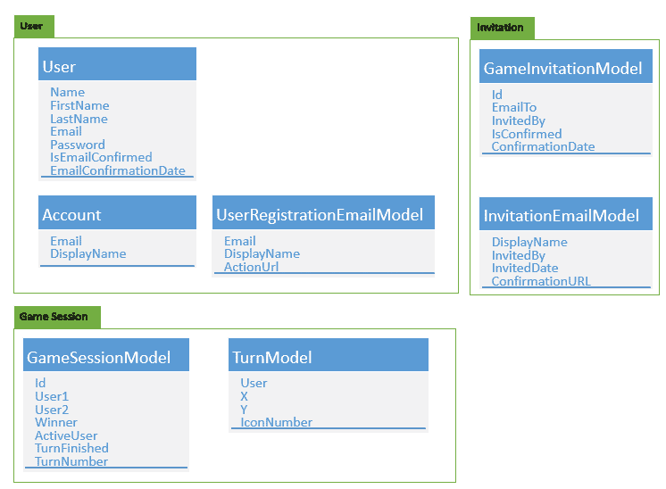

让我们学习如何使用 REST 样式使用 REST API 构建游戏邀请：

1.  添加两个新方法，一个名为`All`，返回所有游戏邀请，另一个名为`Delete`，根据指定的游戏邀请 ID 删除游戏邀请。您需要将这两个方法添加到`GameInvitationService`并相应更新游戏邀请服务界面：

```cs
        public Task<IEnumerable<GameInvitationModel>> All() 
        { 
          return Task.FromResult<IEnumerable<GameInvitationModel>>
           (_gameInvitations.ToList()); 
        } 

        public Task Delete(Guid id) 
        { 
          _gameInvitations = new ConcurrentBag<GameInvitationModel>
           (_gameInvitations.Where(x => x.Id != id)); 
          return Task.CompletedTask; 
        } 
```

2.  添加一个名为`GameInvitationApiController`的新 API 控制器，右键点击`Controllers`文件夹，选择添加控制器。然后，选择具有读/写操作模板的 API 控制器：

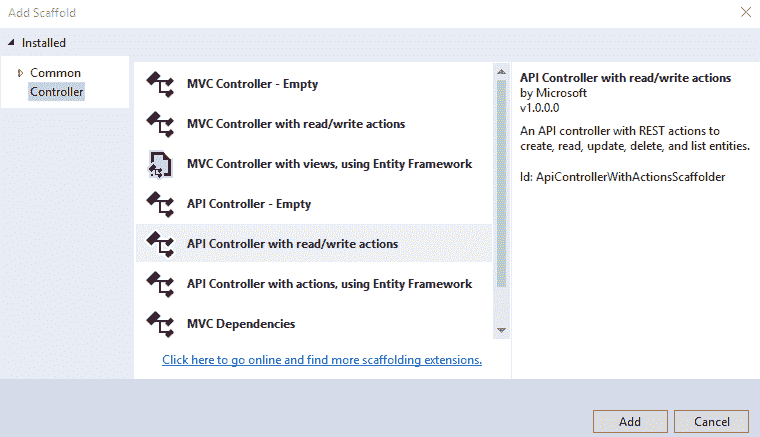

3.  删除自动生成的代码，并将其替换为以下 REST API 实现：
    1.  首先，插入以下代码作为游戏邀请 API 控制器的支架，其中包含预期输出和实际端点路由的装饰器。然后，我们有一个构造函数，它将游戏邀请服务和用户服务注入控制器，如下所示：

```cs
        [Produces("application/json")] 
        [Route("restapi/v1/GameInvitation")] 
        public class GameInvitationApiController : Controller 
        { 
          private IGameInvitationService 
           _gameInvitationService; 
          private IUserService _userService; 
          public GameInvitationApiController
            (IGameInvitationService
           gameInvitationService, IUserService userService) 
          { 
            _gameInvitationService = gameInvitationService; 
            _userService = userService; 
          } 
            ...
        }
```

```cs
          [HttpGet] 
          public async Task<IEnumerable<GameInvitationModel>> Get() 
          { 
            return await _gameInvitationService.All(); 
          } 

          [HttpGet("{id}", Name = "Get")] 
          public async Task<GameInvitationModel> Get(Guid id) 
          { 
            return await _gameInvitationService.Get(id); 
          }
```

```cs
        [HttpPost] 
          public IActionResult Post([FromBody]GameInvitationModel 
           invitation) 
          { 
            if (!ModelState.IsValid) 
              return BadRequest(ModelState); 

            var invitedPlayer =
              _userService.GetUserByEmail(invitation.EmailTo); 
            if (invitedPlayer == null) return BadRequest(); 

              _gameInvitationService.Add(invitation); 
              return Ok(); 
          } 
```

```cs
[HttpPut("{id}")] 
          public IActionResult Put(Guid id,
           [FromBody]GameInvitationModel invitation) 
          { 
            if (!ModelState.IsValid) 
              return BadRequest(ModelState); 

            var invitedPlayer =
             _userService.GetUserByEmail(invitation.EmailTo); 
            if (invitedPlayer == null) return BadRequest(); 

            _gameInvitationService.Update(invitation); 
            return Ok(); 
          } 

```

```cs
  [HttpDelete("{id}")] 
          public void Delete(Guid id) 
          { 
            _gameInvitationService.Delete(id); 
          }
```

4.  启动应用，安装并启动 Postman，以便您可以对您提供的新 REST API 进行一些手动测试，并向`http://<yourhost>/restapi/v1/GameInvitation`发送 HTTP`GET`请求。由于您尚未创建任何游戏邀请，因此将不会有游戏邀请：

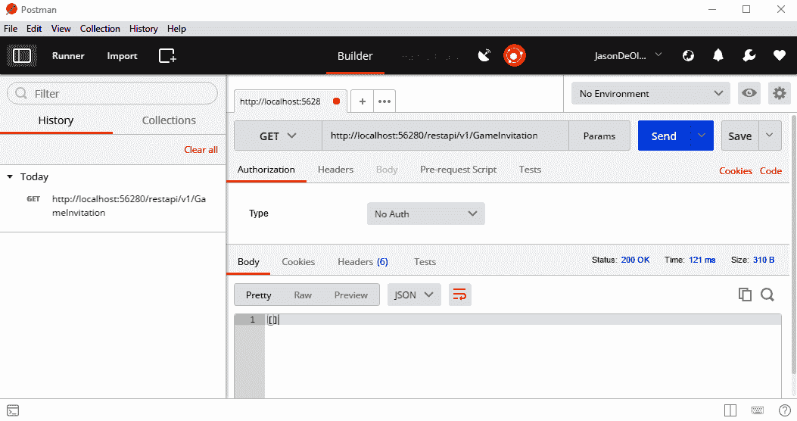

5.  新建游戏邀请，向`http://<yourhost>/restapi/v1/GameInvitation`发送 HTTP`POST`请求，点击 Body，选择 raw 和 JSON，使用`"id":"7223160d-6243-498b-9d35-81b8c947b5ca"`、`"EmailTo":"example@example.com"`和`"InvitedBy":"test@test.com"`作为参数：

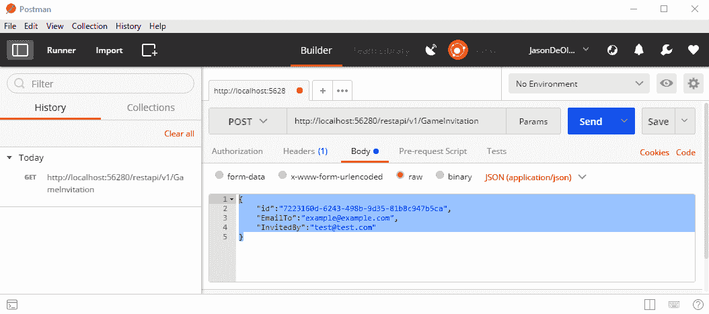

[Chapter 4](04.html)

*Basic Concepts of ASP.NET Core 3 via a Custom Application: Part 1*

6.  您可以通过向`http://<yourhost>/restapi/v1/GameInvitation`发送 HTTP`GET`请求，或者更具体地说，通过向`http://<yourhost>/restapi/v1/GameInvitation/7223160d-6243-498b-9d35-81b8c947b5ca`发送 HTTP`GET`请求来检索游戏邀请：

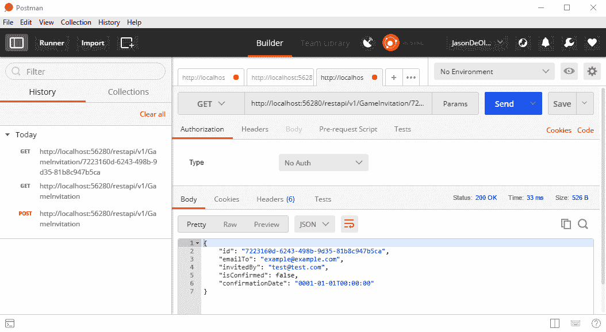

7.  更新游戏邀请，向`http://<yourhost>/restapi/v1/GameInvitation/7223160d-6243-498b-9d35-81b8c947b5ca`发送 HTTP`PUT`请求，点击 Body，选择 raw 和 JSON，使用`"id":"7223160d-6243-498b-9d35-81b8c947b5ca"`、`"EmailTo":"updated@updated.com"`、`"InvitedBy":"test@test.com"`作为参数：

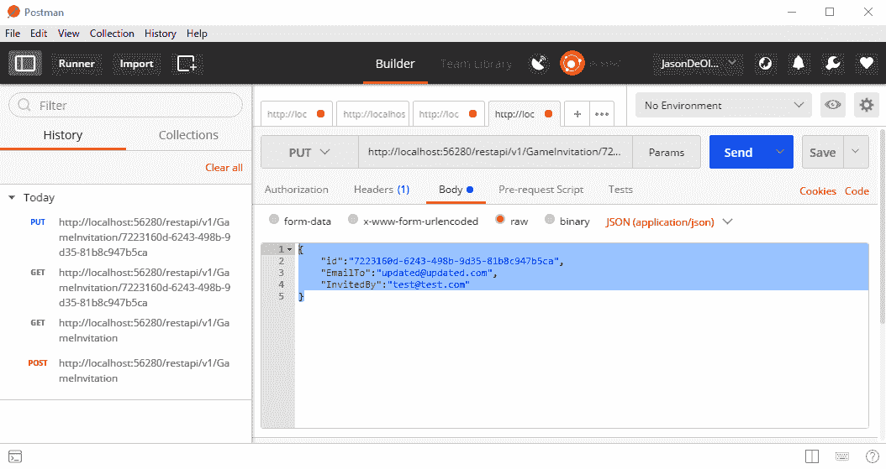

8.  查看更新后的游戏邀请，向`http://<yourhost>/restapi/v1/GameInvitation/7223160d-6243-498b-9d35-81b8c947b5ca`发送 HTTP`GET`请求：

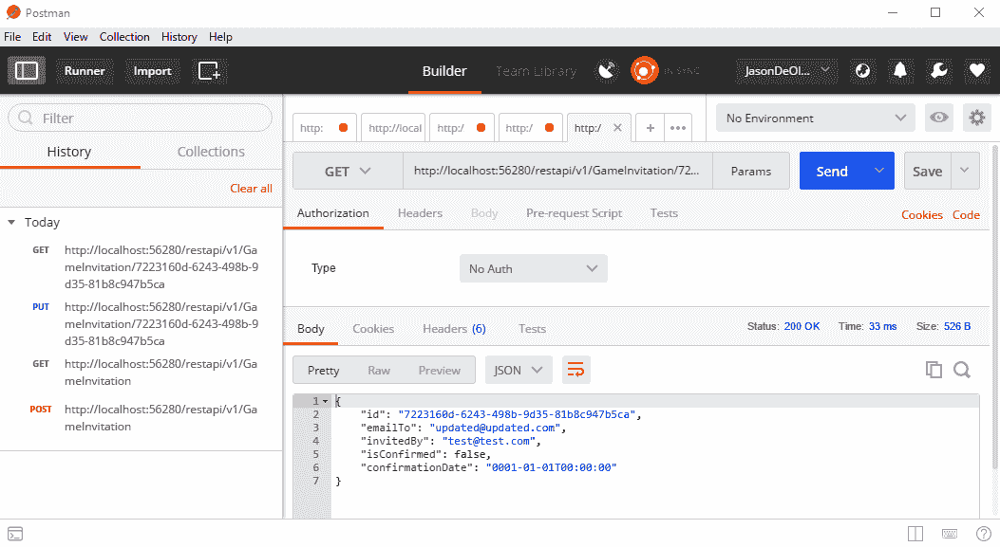

9.  删除游戏邀请并向`http://<yourhost>/restapi/v1/GameInvitation/7223160d-6243-498b-9d35-81b8c947b5ca`发送 HTTP`DELETE`请求：

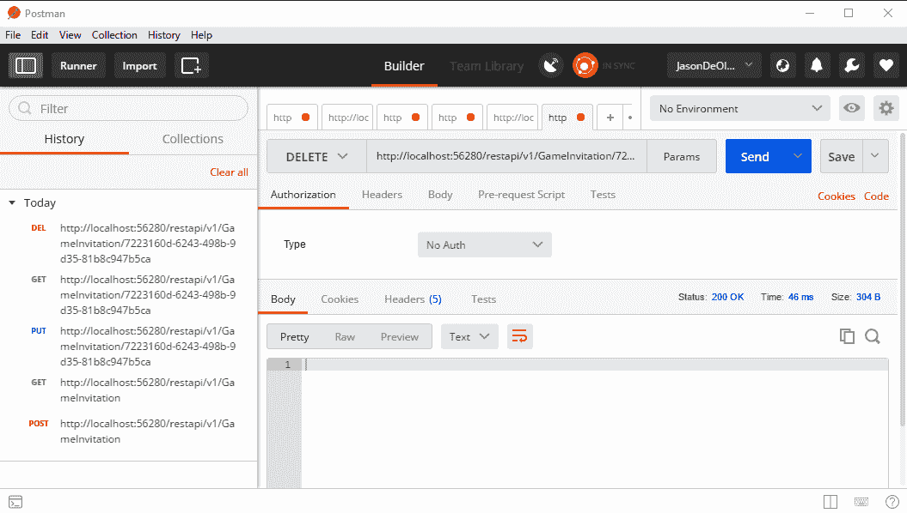

10.  验证游戏邀请的删除并向`http://<yourhost>/restapi/v1/GameInvitation`发送 HTTP`GET`请求：

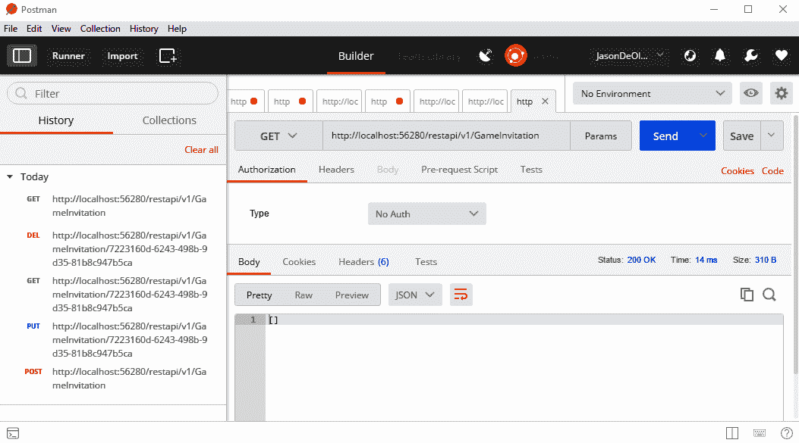

REST 样式是目前市场上最常见的 web API 样式。它很容易理解，并且已经适应了互操作性用例。

在下一节中，您将了解一种称为 HATEOAS 的更高级样式，它特别适合于不断发展的 web api。

# 构建 HATEOAS 风格的 web API

作为应用状态（**HATEOS**风格）引擎的**超媒体是提供高效 web API 的另一种方法。然而，它与我们介绍的其他两种风格完全不同。使用这种方法，客户端可以通过遍历 HTTP 响应中提供的各种超媒体链接来动态导航到资源。**

这种风格的优点是服务器不再驱动应用状态；相反，是服务器返回的超媒体链接监督了这一过程。

此外，与其他样式相比，由于客户端不再将 URI 硬编码为动作（RPC 样式）或资源（REST 样式），因此 API 更改的处理效果要好得多。相反，它们可以处理服务器为发出请求后收到的每个响应返回的超媒体链接。这是一个有趣的概念，因为它允许更灵活和更可进化的 web API。

下图显示了如何将 HATEOAS 样式应用于 Tic Tac Toe 应用的示例：

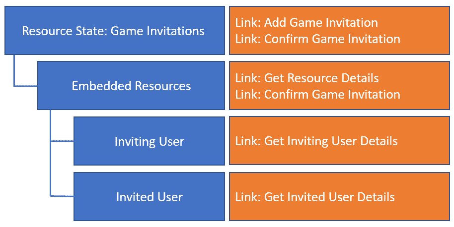

此图的 JSON 表示示例如下：

```cs
    { 
      "_links": { 
        "self": { "href": "/gameinvitations" }, 
        "next": { "href": "/gameinvitations?page=2" }, 
        "find": { 
          "href": "/gameinvitations{?Id}", 
          "templated": "true" 
        } 
      }, 
      "_embedded": { 
        "gameinvitations": [ 
          { 
            "_links": { 
              "self": { "href": "/gameinvitations/f1eaf6ac-c998-40da-
                8eb5-198eaa2cc96f" }, 
              "confirm": { "href": "/gameinvitations/f1eaf6ac-c998-
                40da-8eb5-198eaa2cc96f/confirm" } 
            }, 
            "isConfirmed": "false", 
            "confirmDate": "null", 
            "emailTo": { 
              "self": { "href": "/user/1" } 
            }, 
            "invitedBy": { "self": "\"{\"href\":\"/user/2\"}" } 
          } 
        ] 
      } 
    } 
```

HATEOAS 提供了一些强大的功能，所有这些功能都允许我们独立地开发组件。客户机可以与服务器上运行的业务工作流完全解耦，后者通过使用链接和其他超媒体工件（如表单）来管理交互。

无论您使用什么样式，无论是 RPC、RESTful 还是 HATEOAS，根据最适合于什么场景的样式以及它作为解决方案的优雅程度，除非您的 api 是安全的，否则它都不会非常有用。在下一节中，您将了解 web API 的基本安全性。

# 保护您的 web API

在这一点上，我们已经成功地创建了一些 API 端点，但有一个问题是，任何人都可以从任何浏览器点击端点，甚至可以修改/删除我们的游戏邀请，只要他们知道传递什么参数。这是一种安全威胁，您可以想象处理高级别敏感功能的应用所带来的影响。

我们将在[第 10 章](10.html)、*保护 ASP.NET Core 3 应用*和[第 11 章](11.html)、*保护 ASP.NET 应用–漏洞*中处理 ASP.NET Core 3 的安全问题，但值得注意的是我们的 web API 端点的可用安全措施。让我们看一下下面的屏幕截图，它显示了 Postman 的授权选项卡：

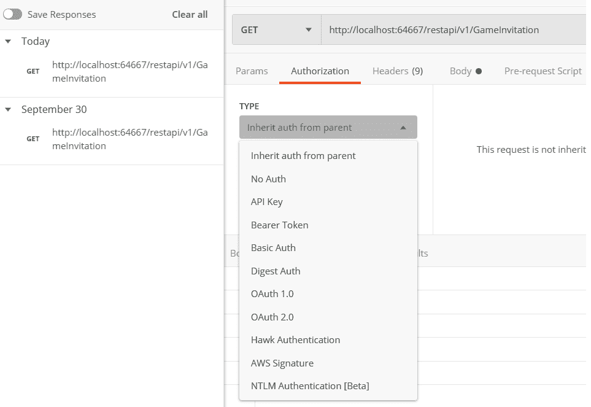

注意邮递员期望的不同类型的授权，包括无授权，这意味着根本没有授权。

[第 11 章](11.html)*保护 ASP.NET 应用的安全–漏洞*将让我们深入了解我们必须注意的常见安全漏洞。考虑到这一点，使用以下任何授权选项保护我们的 web API 端点始终很重要：

*   API 密钥
*   不记名代币
*   基本授权
*   摘要作者
*   OAuth 1.0
*   OAuth2.0
*   霍克认证
*   AWS 签名
*   NTLM 身份验证

下面的文档将进一步解释这些身份验证选项，其中讨论了 Postman 中的授权：[https://learning.getpostman.com/docs/postman/sending-api-requests/authorization/](https://learning.getpostman.com/docs/postman/sending-api-requests/authorization/) 。

除了确保我们的 API 不受不想要的用户的攻击外，我们还需要确保合法用户拥有良好的 API 使用体验。帮助我们的用户做到这一点的方法之一是让他们使用我们的 API 规范访问文档。我们将在下一节学习如何做到这一点。

# 带有 Swagger/OpenAPI 的 ASP.NET Core web API 帮助页

随着任何应用的大小和 web API 端点数量的增长，通常最好有关于 API 本身、可用端点、它们期望作为参数的内容以及所做的任何相应 API 调用的正常响应的文档。

手动记录每个 API 端点可能会很乏味，但幸运的是，Swagger/OpenAPI 在这里起到了解救作用。让我们来看一看：

1.  转到我们的 Tic-Tac-Toe 演示应用，右键单击`TicTacToe`项目，转到 NuGet 软件包管理器，搜索`Swashbuckle.AspnetCore`。现在，单击安装按钮：


您也可以通过转到 Package Manager 控制台并在 Package Manager 的命令提示符下键入`Install-Package Swashbuckle.AspNetCore -Version 5.0.0-rc4`来安装 Swashback。

2.  接下来，将以下代码片段添加到`Startup`类中的`ConfigureServices`方法中：

```cs
            services.AddSwaggerGen(options =>
            {
                options.SwaggerDoc("v1", new OpenApiInfo {
                    Title = "Learning ASP.Net Core 3.0 Rest-API",
                    Version = "v1",
                    Description = "Demonstrating auto-generated
                     API documentation",
                    Contact = new OpenApiContact
                    {
                        Name = "Kenneth Fukizi",
                        Email = "example@example.com",                       
                    },
                    License = new OpenApiLicense
                    {
                        Name = "MIT",                       
                    }
                });
```

`using Microsoft.OpenApi.Models;`

`OpenApiInfo`

3.  最后，我们需要在同一`Startup.cs`类的`Configure`方法中添加以下代码：

```cs
            app.UseSwagger();

            app.UseSwaggerUI(c =>
            {
                c.SwaggerEndpoint("/swagger/v1/swagger.json", 
                 "LEARNING ASP.CORE 3.0 V1");
            });
```

4.  启动`TicTacToe`演示应用，并将 Swagger 添加到根 URL。您将看到到目前为止我们创建的所有 API 端点，所有这些端点都记录在 Swagger 索引页面上：

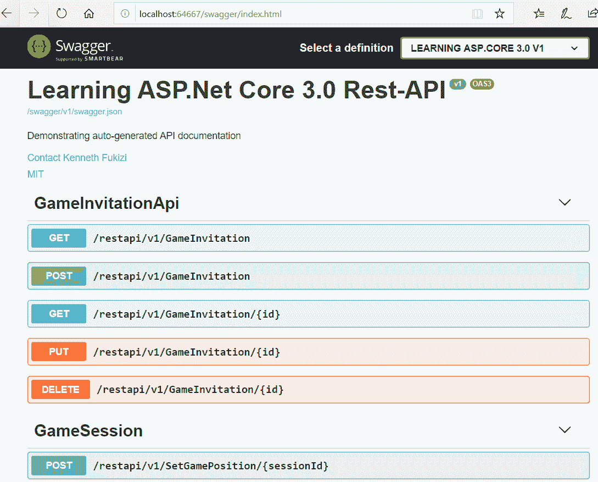

5.  Swagger 还可以用于测试任何 API 端点的预期功能，而不是其他最常用的工具，如 Postman 和 Fiddler。当然，测试 API 端点的另一种常见方法是将它们作为浏览器 URL 手动输入。您可以使用 Swagger 测试端点，方法是单击端点（展开端点），单击“尝试”按钮（如以下屏幕截图右侧所示），然后输入预期值：

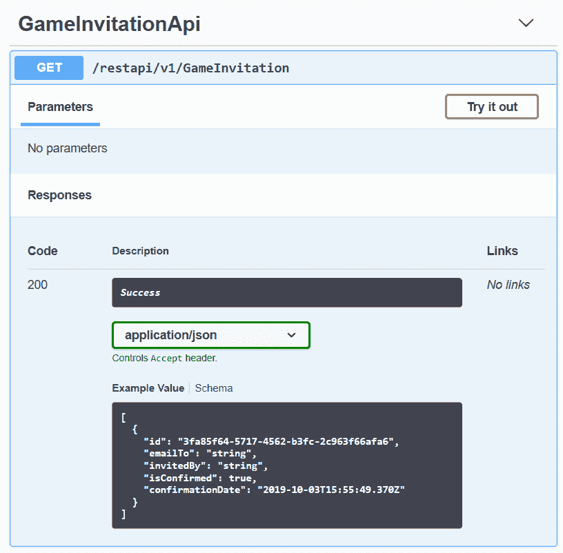

6.  我们可能希望在主索引页上有 API 文档，特别是在整个应用是我们为其他用户开发的 API 的情况下。在这种情况下，我们只需添加一个空的`RoutePrefix SwaggerUIOption`，如下所示：

```cs
            app.UseSwaggerUI(c =>
            {
                c.SwaggerEndpoint("/swagger/v1/swagger.json", 
                 "LEARNING ASP.CORE 3.0 V1");
                c.RoutePrefix = string.Empty;
            });
```

对于您希望添加的每一个附加 API 端点，Swagger 都会自动获取并记录它，让您只专注于生成代码而不是文档，这不是很解放吗？

# 总结

在本章中，您学习了如何为应用构建 web API，以实现集成和松耦合应用体系结构。

我们探讨了 web API 的三种不同样式，即 RPC、REST 和 HATEOAS。这些样式中的每一种都有特定的优点和用例。您必须根据具体的应用需要仔细选择，因为没有一种样式比其他样式更优秀。

在本章中，我们介绍了如何将现有控制器操作转换为 RPC 样式的 web API 以及如何从头构建 REST 样式和 HATEOAS 样式的 web API 的示例。然后，我们使用 Postman 手动测试我们的 web API，您已经掌握了足够的知识，可以将所有这些新概念应用到您自己的环境中。最后，我们使用 OpenAPI 的招摇过市功能为我们的 API 端点自动生成文档。

总之，我们学习了如何构建 RESTAPI，掌握了如何将控制器操作转换为 RPC 样式的 web API 的技能，并从头开始构建它们。我们还学习了如何构建 HATEOAS 风格的 web API，以及如何配置我们的 API，以便它们有一个包含 API 规范文档的帮助页面。

在下一章中，我们将讨论如何在 ASP.NET Core 3 应用中使用 Entity Framework Core 3 访问数据。